# 作业：创建型与结构型模式

整理自 `期末资料/张欣佳老师课件/作业/` 下十一份作业的学生提交稿（计算器程序.docx、校服生产子系统.docx、导出数据的应用框架.docx、TicketMaker类修改.docx、DBConnection类修改.docx、视频监控系统.docx、计算机操作系统线程调度程序.docx、点餐系统.docx、饮料价格计算程序.docx、奖金计算系统.docx、电子相册自动生成程序.docx），`历年题/设计模式2018/` 的作业02、作业03、作业05 及其答案，`期末笔记（考场版）/设计模式【文件B】.pdf` p10-46 的作业 2（创建型）和作业 5（结构型），视频监控一题另参考了刘伟《Java设计模式》课后习题参考答案第 9 章。学生稿和文件B的答案都不是标准答案，下面每题先判断模式选得对不对，再给出改写后的 Java 代码。本机没有 JDK，代码没有实际编译，是逐行人工核对的。

设计题的答题顺序可以照文件B开头的建议固定下来：先写选用的模式，再写模式定义和选它的理由（定义本身常常是踩分点），然后画类图，最后写代码。时间紧时代码先把类的声明和类之间的关系写出来，方法体可以简写。各模式的原理、变体和教材习题见 [02 创建型模式](<02 创建型模式.md>) 和 [03 结构型模式](<03 结构型模式.md>)。

## 题目索引

| 序号 | 题目 | 模式 | 来源 |
| --- | --- | --- | --- |
| 1 | 计算器程序 | 简单工厂（对比策略） | 张欣佳老师作业 计算器程序.docx；2018 作业02 及答案；文件B p10-12 |
| 2 | 校服生产子系统 | 抽象工厂 | 张欣佳老师作业 校服生产子系统.docx；文件B p13-16 |
| 3 | 导出数据的应用框架 | 建造者（对比模板方法、工厂方法） | 张欣佳老师作业 导出数据的应用框架.docx；2018 作业03 第 1 题及答案；文件B p16-21 |
| 4 | TicketMaker 改为单例类 | 单例 | 张欣佳老师作业 TicketMaker类修改.docx；文件B p21 |
| 5 | DBConnections 最多三个实例 | 多例 | 张欣佳老师作业 DBConnection类修改.docx；2018 作业03 第 2 题及答案；文件B p22-24 |
| 6 | 视频监控系统 | 适配器（可加抽象工厂） | 张欣佳老师作业 视频监控系统.docx；文件B p24-26；刘伟教材第 9 章习题 7 |
| - | 画图小程序：XCircle 的 DrawIt | 适配器 | 2018 作业04，见 [32 分析题与重构练习](<32 分析题与重构练习.md>) |
| 7 | 操作系统线程调度程序 | 桥接 | 文件B p26-29；张欣佳老师作业 计算机操作系统线程调度程序.docx |
| 8 | 点餐系统 | 组合 | 张欣佳老师作业 点餐系统.docx；2018 作业05 及答案；文件B p34-37 |
| 9 | 饮料价格计算程序 | 装饰 | 张欣佳老师作业 饮料价格计算程序.docx；文件B p30-34 |
| 10 | 奖金计算系统 | 装饰（对比策略） | 张欣佳老师作业 奖金计算系统.docx；文件B p37-42 |
| 11 | 电子相册自动生成程序 | 组合 + 装饰 | 张欣佳老师作业 电子相册自动生成程序.docx；文件B p43-47 |
| - | 婚姻介绍所找对象 | 代理 | 2018 练习01，见 [32 分析题与重构练习](<32 分析题与重构练习.md>) |

## 1 计算器程序（简单工厂）

### 需求要点

原题（2018 作业02；文件B p10 同题，多一句"请写出你所选择的设计模式，画出类图，并给出核心代码"）：小王正在编写一个简单的计算器程序，要求输入两个整数和运算符号（加、减、乘、除），输出计算结果。小王用面向过程方法编写了下面的代码。请采用面向对象方法通过恰当的设计模式对小王的代码进行重构。

```cpp
int main()
{
  int numa, numb; char oper; double result;
  cin >> numa >> numb;  cin >> oper;
  switch (oper) {
    case '+': result = numa + numb; break;
    case '-': result = numa - numb; break;
    case '*': result = numa * numb; break;
    case '/': result = numa / (double)numb; break;
  }
  cout << result << endl;
  return 0;
}
```

要点：
- 输入两个整数和一个运算符，输出结果。
- 原代码的毛病（文件B p10 的分析）：除数为 0 没有处理；输入输出和计算逻辑全挤在 main 里；以后加开方之类的新运算要往 switch 里加 case，改动已有代码，违反开闭原则。
- 重构目标：每种运算一个类，有共同父类，由一个地方负责按符号创建运算对象。

### 选用模式及理由

**简单工厂模式**：定义一个工厂类，根据传入的参数返回不同类的实例，被创建的实例通常有共同的父类。

对应关系：运算符 `+ - * /` 就是传给工厂的参数；加减乘除四个类是具体产品；它们的父类 Operation 是抽象产品；原来 main 里的 switch 搬进工厂类。这次作业在创建型一章（SDP02），题眼是"根据输入的符号决定创建哪个运算对象"，属于对象创建问题，文件B和 2018 答案都选简单工厂。

学生稿选的是**策略模式**，两种写法的类结构几乎一样（一个抽象运算加四个子类），差别在于由谁来挑具体类：

| 对比项 | 简单工厂（本解） | 策略（学生稿） |
| --- | --- | --- |
| switch 放在哪 | 工厂类里 | 仍留在客户端 main 里 |
| 客户端要认识的类 | 工厂和抽象运算 Operation | 环境类 Calculator 和全部四个具体策略 |
| 模式关注点 | 按参数创建对象 | 同一个环境对象在运行时换算法 |
| 加新运算 | 加子类，改工厂的 switch | 加子类，改客户端的 switch |

本题的变化点在"按符号造对象"，简单工厂更贴题。策略模式更适合商场促销这类"同一个收银对象按活动切换打折算法"的场景。两者也能结合：环境类的构造方法接收运算符，内部用简单工厂选出策略，客户端就只认识环境类。

简单工厂加新运算仍要改工厂，不完全符合开闭原则。想做到加运算不改旧代码，可以升级成工厂方法模式（每种运算一个工厂类），代价是客户端得自己选工厂。

### 类图

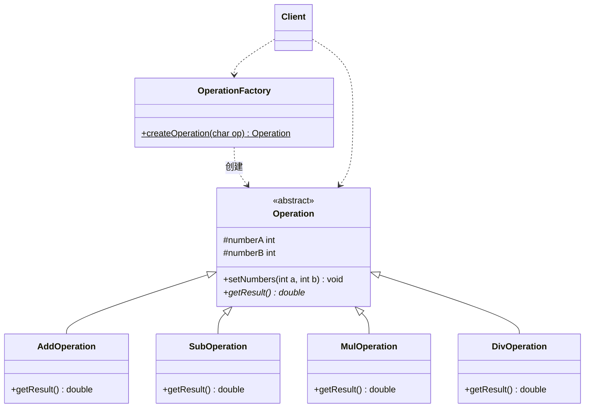

| 角色 | 本题的类 | 职责 |
| --- | --- | --- |
| 工厂 | OperationFactory | 静态方法 `createOperation` 按运算符创建对应的运算对象 |
| 抽象产品 | Operation | 保存两个操作数，声明 `getResult()` |
| 具体产品 | AddOperation、SubOperation、MulOperation、DivOperation | 各实现一种运算，DivOperation 负责检查除数 |
| 客户 | Client | 读输入，向工厂要运算对象，输出结果 |

### 关键代码

原答案为 C++，这里改写为 Java。

```java
// 抽象产品：所有运算的父类
abstract class Operation {
    protected int numberA;
    protected int numberB;

    public void setNumbers(int a, int b) {
        numberA = a;
        numberB = b;
    }

    public abstract double getResult();
}

// 具体产品
class AddOperation extends Operation {
    public double getResult() { return numberA + numberB; }
}

class SubOperation extends Operation {
    public double getResult() { return numberA - numberB; }
}

class MulOperation extends Operation {
    public double getResult() { return numberA * numberB; }
}

class DivOperation extends Operation {
    public double getResult() {
        if (numberB == 0) {
            throw new ArithmeticException("除数不能为 0");
        }
        return (double) numberA / numberB;   // 先转成 double 再除，避免整数除法
    }
}

// 工厂：整个程序只在这里出现一次 switch
class OperationFactory {
    public static Operation createOperation(char op) {
        switch (op) {
            case '+': return new AddOperation();
            case '-': return new SubOperation();
            case '*': return new MulOperation();
            case '/': return new DivOperation();
            default:  throw new IllegalArgumentException("不支持的运算符：" + op);
        }
    }
}

public class Client {
    public static void main(String[] args) {
        java.util.Scanner in = new java.util.Scanner(System.in);
        int a = in.nextInt();
        int b = in.nextInt();
        char op = in.next().charAt(0);

        Operation operation = OperationFactory.createOperation(op);
        operation.setNumbers(a, b);
        System.out.println(operation.getResult());
    }
}
```

学生稿的策略写法，改成 Java 后主体是这样（减、乘、除策略同理）：

```java
interface OperationStrategy {
    double execute(int a, int b);
}

class AddStrategy implements OperationStrategy {
    public double execute(int a, int b) { return a + b; }
}

// 环境类：持有一个策略，计算时委托给它
class Calculator {
    private OperationStrategy strategy;

    public void setStrategy(OperationStrategy strategy) {
        this.strategy = strategy;
    }

    public double calculate(int a, int b) {
        return strategy.execute(a, b);
    }
}
// 客户端：switch (op) { case '+': calculator.setStrategy(new AddStrategy()); break; ... }
```

### 易错点

- 2018 答案（C++）的除法类写成 `return m_nFirst / m_nSecond;`，两个 int 相除得到整数，7 除以 2 输出 3，原代码里 `numa/(double)numb` 的效果丢了，也没判断除数为 0。（更正：原答案作 `m_nFirst / m_nSecond`，应先把其中一个转成 double，并检查除数。）
- 2018 答案的 main 写死了 `CalculatorFactory::Create('-')`，没有读入运算符；工厂的 default 分支悄悄返回加法对象，输错符号也不报错。
- 文件B 的 Java 版遇到非法运算符只打印一句再返回 null，客户端接着调用 `getResult()` 会抛空指针异常；本解改成直接抛 `IllegalArgumentException`。
- 学生稿类图把 Calculator 画成 Operation 的子类（空心三角箭头），和代码对不上；Calculator 持有一个 Operation，应画聚合。学生稿 C++ 代码每次 `new` 出策略对象都没有 `delete`。

## 2 校服生产子系统（抽象工厂）

### 需求要点

原题（文件B p13）：请为一校服制造厂编写一个校服生产子系统。该工厂可为多家学校生产校服，包括秋季校服和夏季校服。一套秋季校服含一件长袖上衣和一条秋季长裤，一套夏季校服含一件短袖衬衣、一件短袖T恤、一条夏季长裤和一条短裤。不同学校校服款式不同。请设计一个子系统为三所学校（一中、二中、三中）分别生产秋季校服和夏季校服（均码）。例如，当用户输入"一中+夏季"时，系统就会生产出一套一中夏季校服；当用户输入"一中+秋季"时，系统生产出一套一中秋季校服。请写出你所选择的设计模式，画出类图，并给出核心代码。

要点：
- 一家工厂给多所学校做校服，每所学校都有秋季、夏季两套。
- 秋季一套：长袖上衣、秋季长裤；夏季一套：短袖衬衣、短袖 T 恤、夏季长裤、短裤。
- 不同学校款式不同，同一学校的秋装和夏装是一个系列。
- 输入"学校+季节"，产出对应的一套校服；以后可能再接别的学校。

### 选用模式及理由

**抽象工厂模式**：提供一个创建一系列相关或相互依赖对象的接口，而无须指定它们具体的类。

对应关系：
- **产品族**是学校：一中的秋装和夏装属于同一族，由"一中工厂"一起生产。
- **产品等级结构**是季节：秋季校服、夏季校服各是一个抽象产品，下面挂各校的具体款式。
- 输入里的"一中"决定用哪个具体工厂，"夏季"决定调用工厂的哪个方法。

为什么不用工厂方法：工厂方法一个工厂只生产一种产品，三所学校两种季节要六个工厂；抽象工厂按学校建工厂，一个工厂出一整族，只要三个。

开闭原则的"倾斜性"在本题很具体：加一所四中，只需加一个工厂和两个产品类，已有代码不动；要是加冬季校服，抽象工厂接口得加方法，所有具体工厂都要改。

产品等级和产品族别画反。按季节建工厂（秋季工厂里有生产一中、二中、三中秋装的方法）也能跑，但同一所学校的款式被拆散到不同工厂里，每加一所学校就要改所有工厂。

### 类图

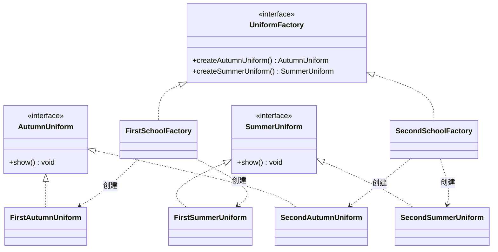

三中的工厂和两个产品与图中一中、二中完全对称，图里省略。

| 角色 | 本题的类 | 职责 |
| --- | --- | --- |
| 抽象工厂 | UniformFactory | 声明生产秋季校服、夏季校服两个方法 |
| 具体工厂 | FirstSchoolFactory、SecondSchoolFactory（ThirdSchoolFactory） | 各负责一所学校，生产该校的两套校服 |
| 抽象产品 | AutumnUniform、SummerUniform | 两个产品等级结构 |
| 具体产品 | FirstAutumnUniform、FirstSummerUniform 等 | 某校某季节的一套校服，内部包含题目规定的几件衣服 |
| 客户 | Client | 按输入的学校选工厂，按季节调方法 |

### 关键代码

原答案为 C++，这里改写为 Java。

```java
// 抽象产品：两个产品等级结构
interface AutumnUniform {
    void show();          // 一套：长袖上衣 + 秋季长裤
}

interface SummerUniform {
    void show();          // 一套：短袖衬衣 + 短袖T恤 + 夏季长裤 + 短裤
}

// 具体产品：一中产品族
class FirstAutumnUniform implements AutumnUniform {
    public void show() { System.out.println("一中秋季校服（蓝白款）：长袖上衣、秋季长裤"); }
}

class FirstSummerUniform implements SummerUniform {
    public void show() { System.out.println("一中夏季校服（蓝白款）：短袖衬衣、短袖T恤、夏季长裤、短裤"); }
}

// 具体产品：二中产品族
class SecondAutumnUniform implements AutumnUniform {
    public void show() { System.out.println("二中秋季校服（红黑款）：长袖上衣、秋季长裤"); }
}

class SecondSummerUniform implements SummerUniform {
    public void show() { System.out.println("二中夏季校服（红黑款）：短袖衬衣、短袖T恤、夏季长裤、短裤"); }
}

// 抽象工厂
interface UniformFactory {
    AutumnUniform createAutumnUniform();
    SummerUniform createSummerUniform();
}

// 具体工厂：一所学校一个，三中照此再写一个
class FirstSchoolFactory implements UniformFactory {
    public AutumnUniform createAutumnUniform() { return new FirstAutumnUniform(); }
    public SummerUniform createSummerUniform() { return new FirstSummerUniform(); }
}

class SecondSchoolFactory implements UniformFactory {
    public AutumnUniform createAutumnUniform() { return new SecondAutumnUniform(); }
    public SummerUniform createSummerUniform() { return new SecondSummerUniform(); }
}

public class Client {
    public static void main(String[] args) {
        String school = "一中";          // 实际从输入"一中+夏季"中拆出来
        String season = "夏季";

        UniformFactory factory;
        if (school.equals("一中")) {
            factory = new FirstSchoolFactory();
        } else if (school.equals("二中")) {
            factory = new SecondSchoolFactory();
        } else {
            throw new IllegalArgumentException("未知学校：" + school);
        }

        if (season.equals("秋季")) {
            factory.createAutumnUniform().show();
        } else {
            factory.createSummerUniform().show();
        }
    }
}
```

客户端里选工厂的 if 链可以换成读配置文件加反射，这样加学校时连客户端也不用改。

### 易错点

- 学生稿类图把"工厂创建产品"画成了继承箭头（空心三角实线），二中工厂的箭头还直接指向抽象产品。工厂和具体产品之间是依赖关系，应画虚线箭头指向具体产品。
- 学生稿三所学校的输出文字一模一样，看不出"不同学校款式不同"。代码里至少要让各校的具体产品有区别，否则抽象工厂就没有存在的理由。上面代码里的"蓝白款""红黑款"是为了演示随手加的。
- 题目说的"一套"是几件衣服的组合。考试写到"一套校服"这一级就够；要细到每件衣服，可以让具体产品内部持有上衣、裤子等部件对象。

## 3 导出数据的应用框架（建造者）

### 需求要点

原题（2018 作业03 第 1 题；文件B p16 同题）：小王正在设计一个导出数据的应用框架。客户要求：导出数据可能存储成不同的文件格式，例如：文本格式、数据库备份形式、Excel格式、Xml格式等等，并且，不管什么格式，导出数据文件都分成三个部分，分别是文件头、文件体和文件尾，在文件头部分，需要描述如下信息：分公司或门市点编号、导出数据的日期，对于文本格式，中间用逗号分隔，在文件体部分，需要描述如下信息：表名称、然后分条描述数据，对于文本格式，表名称单独占一行，数据描述一行算一条数据，字段间用逗号分隔，在文件尾部分，需要描述如下信息：输出人。请你选择恰当的设计模式帮助小王进行设计。

要点：
- 导出格式有文本、数据库备份、Excel、XML 等，以后还会加。
- 不管哪种格式，文件都由文件头、文件体、文件尾三部分按顺序组成。
- 文件头：分公司或门市点编号、导出日期（文本格式用逗号隔开）。
- 文件体：表名称，然后一条条数据（文本格式表名单独一行，每条数据一行，字段逗号分隔）。
- 文件尾：输出人。

### 选用模式及理由

**建造者模式**：将一个复杂对象的构建与它的表示分离，使得同样的构建过程可以创建不同的表示。

对应关系：
- "同样的构建过程"是"先头、再体、最后尾"，这个顺序由指挥者 ExportDirector 固定。
- "不同的表示"是各种文件格式，每种格式一个具体建造者，负责把头、体、尾写成自己的格式。
- 产品是拼好的导出文件内容。

2018 答案和文件B都选建造者，学生稿选了模板方法。两种思路和另一个容易想到的工厂方法放在一起比较：

| 思路 | 做法 | 评价 |
| --- | --- | --- |
| 建造者（本解） | Director 规定"头、体、尾"的顺序，Builder 负责每一部分怎么写，最后取出产品 | 顺序和部件实现分开；同一套 Builder 可以配不同的 Director（比如只导出头和体的简版）。题面强调"文件由三部分组成、每部分随格式变"，又在创建型一章，按建造者答 |
| 模板方法（学生稿） | 抽象类的 `exportData()` 依次调用三个抽象步骤，子类实现 | 能解题，代码更短。把建造者的 Director 合并进抽象建造者，结构就和它几乎一样，所以学生稿不算错；但考场上题目落在创建型，写建造者更稳 |
| 工厂方法 | 框架定义"导出"流程，由子类决定创建哪种格式的导出对象 | 只解决"用哪种格式"，不管文件内部分几部分 |

关于出处：2018 答案的 Java 代码风格和《研磨设计模式》的例子相近，据印象那本书在工厂方法和生成器（建造者）两章都用过"导出数据"这个场景，这一点手头没有原书，未能核对。不论出处，题目只要求"支持多种导出格式"时对应工厂方法，要求文件分头、体、尾三部分按步骤生成时对应建造者；本题题面带着三部分的描述，按建造者答。考场上的判断方法：题目只说"支持多种格式、以后要扩展"，选工厂方法；题目描述了一个对象由固定几部分按步骤组装，选建造者。

### 类图

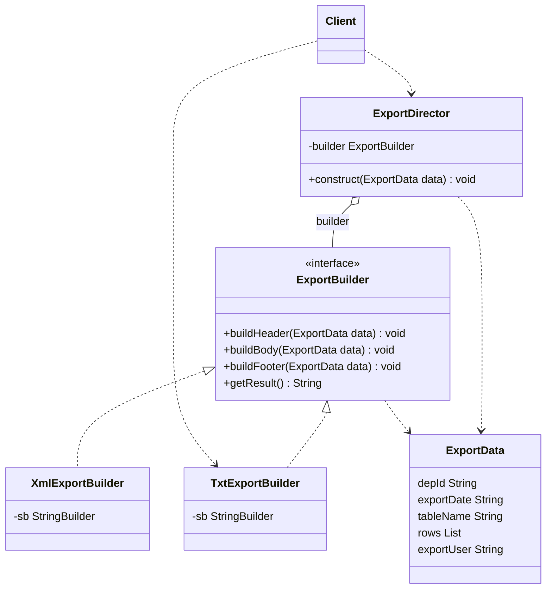

| 角色 | 本题的类 | 职责 |
| --- | --- | --- |
| 抽象建造者 | ExportBuilder | 声明构建文件头、文件体、文件尾的方法和取结果的方法 |
| 具体建造者 | TxtExportBuilder、XmlExportBuilder（Excel、数据库备份同理） | 按自己的格式写出三部分，内部用 StringBuilder 攒内容 |
| 指挥者 | ExportDirector | `construct()` 固定按头、体、尾的顺序调用建造者 |
| 产品 | `getResult()` 返回的文件内容（String） | 最终导出的文件 |
| 客户 | Client | 准备数据，选一个具体建造者交给指挥者，最后取产品 |
| 数据对象（不属于模式角色） | ExportData | 装着编号、日期、表名、数据行、输出人 |

### 关键代码

2018 答案是 Java（风格和《研磨设计模式》的例子相近），学生稿为 C++，这里都按自己的写法改写为 Java。

```java
// 要导出的数据：头、体、尾用到的信息都在这里
class ExportData {
    String depId;                                // 分公司或门市点编号
    String exportDate;                           // 导出日期
    String tableName;                            // 表名称
    List<String[]> rows = new ArrayList<>();     // 每条数据的各个字段
    String exportUser;                           // 输出人
}

// 抽象建造者
interface ExportBuilder {
    void buildHeader(ExportData data);
    void buildBody(ExportData data);
    void buildFooter(ExportData data);
    String getResult();
}

// 具体建造者：文本格式
class TxtExportBuilder implements ExportBuilder {
    private StringBuilder sb = new StringBuilder();

    public void buildHeader(ExportData data) {
        sb.append(data.depId).append(",").append(data.exportDate).append("\n");
    }

    public void buildBody(ExportData data) {
        sb.append(data.tableName).append("\n");               // 表名单独一行
        for (String[] row : data.rows) {
            sb.append(String.join(",", row)).append("\n");    // 一条数据一行，逗号分隔
        }
    }

    public void buildFooter(ExportData data) {
        sb.append(data.exportUser).append("\n");
    }

    public String getResult() {
        return sb.toString();
    }
}

// 具体建造者：XML 格式
class XmlExportBuilder implements ExportBuilder {
    private StringBuilder sb = new StringBuilder();

    public void buildHeader(ExportData data) {
        sb.append("<Report>\n");
        sb.append("  <Header depId=\"").append(data.depId)
          .append("\" date=\"").append(data.exportDate).append("\"/>\n");
    }

    public void buildBody(ExportData data) {
        sb.append("  <Body table=\"").append(data.tableName).append("\">\n");
        for (String[] row : data.rows) {
            sb.append("    <Row>");
            for (String field : row) {
                sb.append("<Field>").append(field).append("</Field>");
            }
            sb.append("</Row>\n");
        }
        sb.append("  </Body>\n");
    }

    public void buildFooter(ExportData data) {
        sb.append("  <Footer user=\"").append(data.exportUser).append("\"/>\n");
        sb.append("</Report>\n");
    }

    public String getResult() {
        return sb.toString();
    }
}

// 指挥者：只管顺序，不管格式
class ExportDirector {
    private ExportBuilder builder;

    public ExportDirector(ExportBuilder builder) {
        this.builder = builder;
    }

    public void construct(ExportData data) {
        builder.buildHeader(data);
        builder.buildBody(data);
        builder.buildFooter(data);
    }
}

public class Client {
    public static void main(String[] args) {
        ExportData data = new ExportData();
        data.depId = "D01";
        data.exportDate = "2024-01-15";
        data.tableName = "销售记录表";
        data.rows.add(new String[]{"P001", "100", "80"});
        data.rows.add(new String[]{"P002", "99", "55"});
        data.exportUser = "user";

        ExportBuilder builder = new TxtExportBuilder();   // 换成 XmlExportBuilder 就导出 XML
        new ExportDirector(builder).construct(data);
        System.out.println(builder.getResult());
    }
}
```

文本格式的输出：

```text
D01,2024-01-15
销售记录表
P001,100,80
P002,99,55
user
```

### 易错点

- 文件B 的 Java 答案里，产品 File 和各个建造者只放了"xml文件头""文本文件体"这类占位字符串，题面要求的编号、日期、表名、逗号分隔一样都没体现。考场上至少把文本格式的规则写进一个具体建造者。
- 学生稿（C++，模板方法）客户端先 `new TextExporter()`，再让同一个指针指向 `new ExcelExporter()`，第一个对象再也释放不了；抽象类 DataExporter 没有虚析构函数，通过基类指针 `delete` 子类对象属于未定义行为。
- 类图里指挥者和抽象建造者之间画聚合（指挥者一端空心菱形），2018 答案的类图就是这样画的。别把 Director 画成 Builder 的子类。

## 4 TicketMaker 改为单例类（单例）

### 需求要点

原题（文件B p21）：在下面的 TicketMaker 类中，每次调用 getNextTicketNumber 方法都会返回 1000，1001，1002…的数列。我们可以用它生成票的编号或是其他序列号。在现在该类的实现方式下，我们可以生成多个该类的实例。请修改代码，确保只能生成一个该类的实例。

```java
public class TicketMaker
{
    private int ticket = 1000;
    public int getNextTicketNumber()
    {
        return ticket++;
    }
}
```

（原稿 `return ticket++:` 行尾是冒号，属录入错误，已改成分号。）

要点：
- 票号从 1000 开始连续递增，不能重复。
- 现在谁都能 `new TicketMaker()`，每个实例各有一个从 1000 开始的计数器，两个实例会发出相同的票号。
- 改成全系统只有一个实例，原来 `getNextTicketNumber()` 的用法（返回 int）保持不变。

### 选用模式及理由

**单例模式**：确保一个类只有一个实例，并提供一个全局访问点来访问这个实例。

对应关系：票号计数器 `ticket` 是必须全局唯一的状态，放在唯一的 TicketMaker 实例里；构造方法私有化，外部拿实例只能走静态方法 `getInstance()`。单例三要点在本题都要写出来：私有构造方法、指向自己唯一实例的私有静态成员、公有静态的获取方法。

### 类图

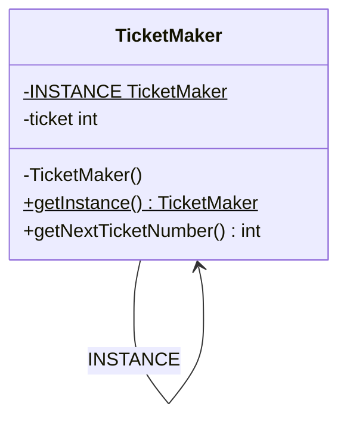

| 角色 | 本题的类 | 职责 |
| --- | --- | --- |
| 单例类 | TicketMaker | 自己创建唯一实例并通过 `getInstance()` 提供出去；实例里保存票号计数器 |
| 客户 | 任何需要票号的代码 | 调用 `TicketMaker.getInstance().getNextTicketNumber()` |

### 关键代码

```java
public class TicketMaker {
    // 饿汉式：类加载时就建好唯一实例，天然线程安全
    private static final TicketMaker INSTANCE = new TicketMaker();

    private int ticket = 1000;          // 计数器仍是实例变量，属于那唯一的实例

    private TicketMaker() { }           // 私有构造方法，外部不能 new

    public static TicketMaker getInstance() {
        return INSTANCE;
    }

    // 保留原来的方法签名；加 synchronized，多线程同时取号也不会重号
    public synchronized int getNextTicketNumber() {
        return ticket++;
    }
}

class Client {
    public static void main(String[] args) {
        TicketMaker maker = TicketMaker.getInstance();
        System.out.println(maker.getNextTicketNumber());   // 1000
        System.out.println(maker.getNextTicketNumber());   // 1001
        System.out.println(TicketMaker.getInstance() == maker);   // true
    }
}
```

想要延迟加载可以换成懒汉式，但 `getInstance()` 必须加锁，或者用双重检查锁定、静态内部类写法，几种写法的对比见 [02 创建型模式](<02 创建型模式.md>) 的单例一节。

### 易错点

学生稿和文件B p21 给的是同一份代码，问题比较多：

- 把 `getNextTicketNumber()` 改成了返回 TicketMaker 对象的静态方法，"取实例"和"取下一个票号"混成一个方法。原来 `int n = maker.getNextTicketNumber();` 这样用的代码全部编译不过，改接口本身就违背了题意。（更正：应另加 `getInstance()`，保留原方法返回 int。）
- 每次取实例时先 `ticket += 1` 再显示，第一张票是 1001，1000 被跳过了。
- `ticket` 被改成 static，计数器已经和实例无关，就算有多个实例也共用一个计数器，单例成了摆设。`showMessage()` 里写 `countTicket.ticket`，是通过实例访问静态变量。
- 懒汉式的 `if (countTicket == null)` 没有加锁，两个线程同时进来会建出两个实例；票号自增也没有同步。

## 5 DBConnections 最多三个实例（多例）

### 需求要点

这一题有两个版本，考的是同一件事：

- 张欣佳老师作业、文件B p22："个数限制的单例类"。请你按照单例模式的思想，重新实现下面给出的 DBConnections 类，确保系统中该类的实例对象最多只能存在三个。

```cpp
class DBConnections {
public:
    DBConnections() { ... }
    ~DBConnections() { ... }
    void ConnectionInfo() { ... }
};
```

- 2018 作业03 第 2 题：单例模式的本质是什么？基于单例模式，请考虑如何控制某个类的实例数目最多只能有 3 个，给出代码实现。

要点：
- 先答本质：单例模式的本质是**控制实例数目**。
- 构造方法不能再公开，实例由类自己创建和管理，总数不超过 3。
- 要说清楚第 4 次、第 5 次来要实例时怎么办：轮流返回、随机返回，或者让调用方按编号取。

### 选用模式及理由

**多例模式**（Multiton）：单例模式的推广，类自己创建并管理有限个实例，对外提供获取这些实例的静态方法。

单例把实例数控制为 1，多例控制为 N。结构上还是单例的三件套：私有构造方法、类里保存实例的静态容器、公有静态获取方法。数据库连接适合用多例：连接创建代价高，数量又要有上限，相当于一个很小的连接池。

几份答案取实例的策略不同，都可以：

| 来源 | 创建时机 | 超过 3 次以后怎么返回 |
| --- | --- | --- |
| 本解 | 类加载时建好 3 个 | 按编号取，或轮流取 |
| 学生稿（C++） | 用到时才建，存进 vector | 轮流返回 |
| 2018 答案 | 用到时才建，存进 Map，key 为 "Cache1" 到 "Cache3" | 轮流返回 |
| 文件B 第一版 | 用到时才建，存进 List | 随机返回 |
| 文件B 第二版 | 类加载时建好 3 个，放在数组里 | 随机返回 |

### 类图

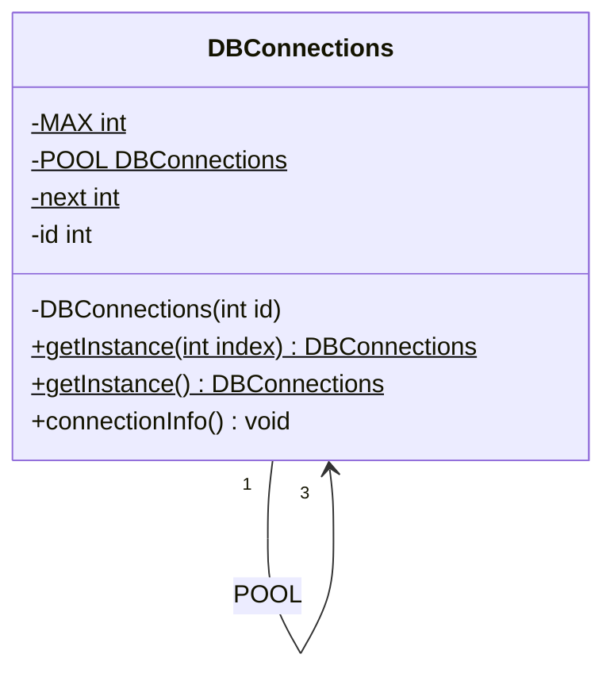

`POOL` 是长度为 3 的数组，图里用关联两端的多重性 1 对 3 表示。

| 角色 | 本题的类 | 职责 |
| --- | --- | --- |
| 多例类 | DBConnections | 自己建好并保存 3 个实例，按编号或轮流提供出去 |
| 客户 | 使用数据库连接的代码 | 只能通过 `getInstance` 拿连接 |

### 关键代码

学生稿为 C++，2018 答案是 Java（风格和《研磨设计模式》的例子相近），这里改写为 Java。

```java
public class DBConnections {
    private static final int MAX = 3;
    private static final DBConnections[] POOL = new DBConnections[MAX];
    private static int next = 0;                      // 轮流取时的下标

    static {                                          // 类加载时一次建好 3 个
        for (int i = 0; i < MAX; i++) {
            POOL[i] = new DBConnections(i);
        }
    }

    private final int id;

    private DBConnections(int id) {                   // 私有构造方法
        this.id = id;
    }

    // 按编号取：0、1、2
    public static DBConnections getInstance(int index) {
        if (index < 0 || index >= MAX) {
            throw new IllegalArgumentException("编号只能是 0 到 " + (MAX - 1));
        }
        return POOL[index];
    }

    // 轮流取：第 4 次调用又回到第 1 个；加锁保证 next 不被并发改乱
    public static synchronized DBConnections getInstance() {
        DBConnections conn = POOL[next];
        next = (next + 1) % MAX;
        return conn;
    }

    public void connectionInfo() {
        System.out.println("DB connection #" + id);
    }
}

class Client {
    public static void main(String[] args) {
        for (int i = 0; i < 5; i++) {
            DBConnections.getInstance().connectionInfo();   // #0 #1 #2 #0 #1
        }
    }
}
```

如果坚持延迟创建（用到才建），把数组换成 List，在加了锁的 `getInstance()` 里判断 `list.size() < MAX` 时新建并加入，否则从已有的里面取，思路和学生稿一样。

### 易错点

- 学生稿（C++）的静态成员 `instances` 和 `nextInstance` 只在类里声明，提交的代码里没有类外定义，照抄去编译会在链接时报 undefined reference。（更正：类外要补 `std::vector<DBConnections*> DBConnections::instances;` 和 `int DBConnections::nextInstance = 0;`。）学生稿的析构函数仍是 public，外部可以把池里的实例 delete 掉；getInstance 也没有考虑多线程。
- 文件B 第二版用 `Math.abs(random.nextInt()) % 3` 算下标。`nextInt()` 可能返回 `Integer.MIN_VALUE`，它取绝对值后还是负数，下标会变成负的，抛数组越界异常。（更正：直接写 `random.nextInt(3)`。）它注释里的输出 `false true` 只是某一次随机运行的结果，每次运行可能不同。
- 文件B 第一版给 `getInstance()` 加了 synchronized，第二版在类加载时就建好实例，这两版都不会因为多线程多建出实例。
- 2018 答案的 `getInstance()` 没加锁，多个线程同时进来时 `num` 会被改乱，同一个 key 还可能被建两次，发出去的不同对象就超过 3 个了。
- 别忘了题目第一问"本质是什么"：控制实例数目。

## 6 视频监控系统（适配器）

### 需求要点

原题（张欣佳老师作业；文件B p24）：小王正在开发一套视频监控系统，考虑到Windows Media Player和Real Player是两种常用的媒体播放器，尽管它们的API结构和调用方法存在区别，但这套应用程序必须支持这两种播放器API，而且在将来可能还需要支持新的媒体播放器。请你针对上面的描述，帮助小王进行设计，给出设计思路及所采用的设计模式，画出类图，并写出关键代码。

要点：
- 系统要同时支持 Windows Media Player 和 Real Player 两套现成的 API。
- 两套 API 的结构和调用方法不一样，而且是别人的库，改不了。
- 以后还可能接入新的播放器。
- 要写设计思路、模式、类图、关键代码。

### 选用模式及理由

**适配器模式**：将一个接口转换成客户希望的另一个接口，使接口不兼容的那些类可以一起工作。

对应关系：
- 监控系统自己定义一个统一的播放接口 VideoPlayer，这是**目标**。
- 两套播放器 API 是**适配者**，"API 结构和调用方法存在区别"正是接口不兼容。
- 每种播放器写一个**适配器**，实现 VideoPlayer，内部持有对应的 API 对象，把统一的调用翻译成 API 自己的调用。
- 新播放器来了就加一个适配器，客户端面向 VideoPlayer 编程，不用改，符合开闭原则。

用对象适配器（持有适配者）比类适配器（继承适配者）合适：Java 只能单继承，而且对象适配器还能适配适配者的子类。

学生稿选的是**桥接模式**，判断有误。桥接用于一个系统里有两个独立变化的维度，在设计阶段就把抽象部分和实现部分分开；本题的播放器 API 是现成的、接口对不上，要解决的是"接口不兼容"，这是适配器的典型场景。再看学生稿的类图，只有一个 MediaPlayer 父类和三个子类，没有桥接要求的抽象层次，也完全没有调用原有 API，等于假设两个播放器天生就有同一个 `play()` 方法，把题目的难点绕过去了。

刘伟教材第 9 章（适配器模式）习题 7 是同一个场景，参考答案用的是**抽象工厂 + 适配器**：每种播放器一个具体工厂，生产主窗口、播放列表等一族界面对象；这些具体产品在内部调用各自的播放器 API，同时充当适配器。文件B 也注明"《设计模式》中用的是抽象工厂+适配器"。本题只要求支持两套 API，写出适配器就回答了主要问题，时间够的话补一句抽象工厂的思路。

### 类图

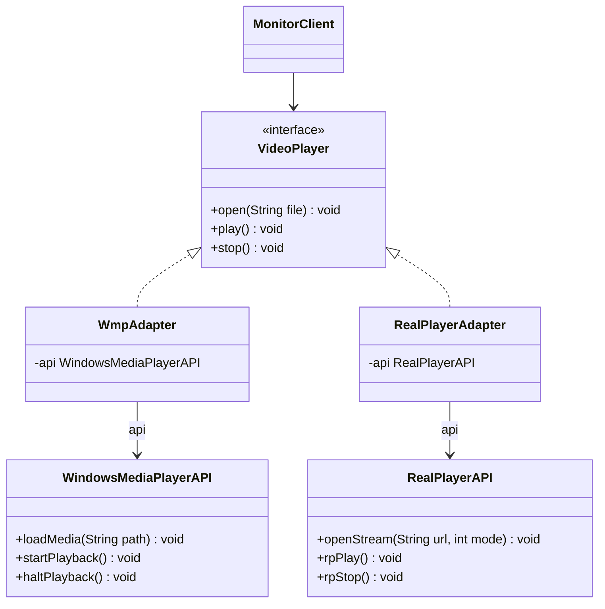

题目没给两套 API 的方法名，图和代码里的 `loadMedia`、`rpPlay` 等是示意。

| 角色 | 本题的类 | 职责 |
| --- | --- | --- |
| 目标 | VideoPlayer | 监控系统需要的统一播放接口 |
| 适配者 | WindowsMediaPlayerAPI、RealPlayerAPI | 现成的播放器 API，接口各不相同 |
| 适配器 | WmpAdapter、RealPlayerAdapter | 实现目标接口，把调用转给各自的 API |
| 客户 | MonitorClient | 只依赖 VideoPlayer |

### 关键代码

学生稿为 Python，这里改写为 Java。

```java
// 目标接口：监控系统只认这一个
interface VideoPlayer {
    void open(String file);
    void play();
    void stop();
}

// 适配者：两套现成 API，方法名各不相同
class WindowsMediaPlayerAPI {
    public void loadMedia(String path) { System.out.println("WMP 加载 " + path); }
    public void startPlayback() { System.out.println("WMP 开始播放"); }
    public void haltPlayback() { System.out.println("WMP 停止"); }
}

class RealPlayerAPI {
    public void openStream(String url, int mode) { System.out.println("RealPlayer 打开 " + url); }
    public void rpPlay() { System.out.println("RealPlayer 开始播放"); }
    public void rpStop() { System.out.println("RealPlayer 停止"); }
}

// 适配器：对象适配器，持有适配者，把调用翻译过去
class WmpAdapter implements VideoPlayer {
    private WindowsMediaPlayerAPI api = new WindowsMediaPlayerAPI();

    public void open(String file) { api.loadMedia(file); }
    public void play() { api.startPlayback(); }
    public void stop() { api.haltPlayback(); }
}

class RealPlayerAdapter implements VideoPlayer {
    private RealPlayerAPI api = new RealPlayerAPI();

    public void open(String file) { api.openStream(file, 0); }   // API 多要的参数由适配器补上
    public void play() { api.rpPlay(); }
    public void stop() { api.rpStop(); }
}

public class MonitorClient {
    public static void main(String[] args) {
        VideoPlayer player = new RealPlayerAdapter();   // 具体用哪个可以写进配置文件
        player.open("camera01.rm");
        player.play();
        player.stop();
    }
}
```

### 易错点

- 适配器的类图要画出"适配器 → 适配者"的关联（对象适配器）或继承（类适配器），只画目标接口和几个实现类，看不出适配的是谁。
- 文件B 的答案只给了一个 `play()` 方法，两套 API 各一个方法，能说明问题；答题时多写一两个方法（打开、停止），更能体现"调用方法存在区别"。
- 类适配器和对象适配器的区别、双向适配器，见 [03 结构型模式](<03 结构型模式.md>) 的适配器一节。

## 7 操作系统线程调度程序（桥接）

### 需求要点

原题（文件B p26；张欣佳老师作业同题）：开发一个计算机操作系统的线程调度程序，要求实现时间片调度和抢占调度这2种调度算法，支持Windows、Unix和Linux这3个操作系统，并且将来有可能会增加新的调度算法和支持新的操作系统，请选择恰当的设计模式解决该问题，画出类图，写出关键代码。（不考虑线程调度算法的具体代码实现）

要点：
- 调度算法两种：时间片调度、抢占调度。
- 操作系统三个：Windows、Unix、Linux。
- 两边将来都会增加：新算法、新操作系统。
- 不用写算法的具体实现，重点是结构。

### 选用模式及理由

**桥接模式**：将抽象部分与它的实现部分分离，使它们都可以独立地变化。

题眼是"两个维度、各自都会扩展"。用继承硬组合，2 种算法乘 3 个系统要 6 个子类，加一个系统再多 2 个，加一个算法再多 3 个。桥接把两个维度拆成两个继承体系，中间用聚合连起来，加算法或加系统都只加一个类。

哪个维度当"抽象部分"：本解让调度算法做抽象部分，操作系统做实现部分。调度算法决定"什么时候换哪个线程"，属于上层逻辑；保存上下文、切换线程这些动作要调用各操作系统提供的底层操作。桥接里实现类接口提供基本操作、抽象类在其上组织业务，分工正好对得上。文件B 的答案反过来，让操作系统当抽象类、算法当实现类，也是两个继承体系加一条聚合，结构同样成立。

学生稿用的是**策略 + 简单工厂**：调度算法做成策略，工厂里按操作系统名字 if 判断。问题在于操作系统这个维度没有形成类（学生稿类图里只有工厂、调度器和两个算法子类，找不到任何操作系统类），工厂里只打印一句"Creating Windows Scheduler"就返回算法对象，系统之间没有任何区别；加新系统还要改工厂的 if 链。策略模式只处理了算法一个维度，本题有两个维度，应选桥接。

### 类图

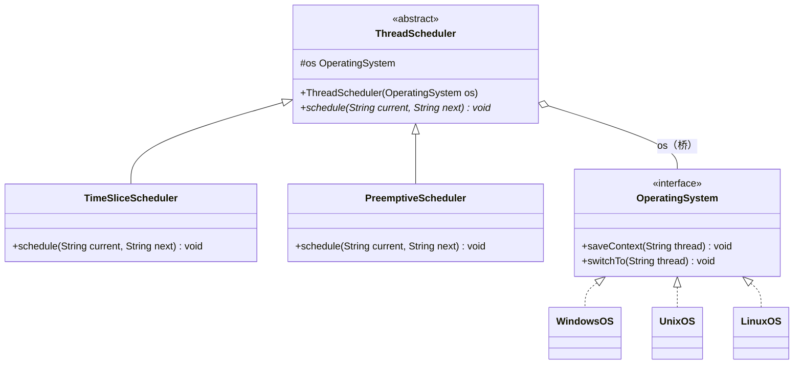

| 角色 | 本题的类 | 职责 |
| --- | --- | --- |
| 抽象类 | ThreadScheduler | 调度程序的抽象，持有一个 OperatingSystem 引用 |
| 扩充抽象类 | TimeSliceScheduler、PreemptiveScheduler | 两种调度算法，决定何时切换、切换给谁 |
| 实现类接口 | OperatingSystem | 声明保存上下文、切换线程等底层操作 |
| 具体实现类 | WindowsOS、UnixOS、LinuxOS | 用各系统自己的方式完成底层操作 |

### 关键代码

学生稿为 Python，这里改写为 Java。

```java
// 实现类接口：各操作系统提供的底层线程操作
interface OperatingSystem {
    void saveContext(String thread);
    void switchTo(String thread);
}

// 具体实现类
class WindowsOS implements OperatingSystem {
    public void saveContext(String thread) { System.out.println("Windows 保存 " + thread + " 的上下文"); }
    public void switchTo(String thread) { System.out.println("Windows 切换到 " + thread); }
}

class UnixOS implements OperatingSystem {
    public void saveContext(String thread) { System.out.println("Unix 保存 " + thread + " 的上下文"); }
    public void switchTo(String thread) { System.out.println("Unix 切换到 " + thread); }
}

class LinuxOS implements OperatingSystem {
    public void saveContext(String thread) { System.out.println("Linux 保存 " + thread + " 的上下文"); }
    public void switchTo(String thread) { System.out.println("Linux 切换到 " + thread); }
}

// 抽象类：持有实现类接口的引用，这条聚合就是"桥"
abstract class ThreadScheduler {
    protected OperatingSystem os;

    public ThreadScheduler(OperatingSystem os) {
        this.os = os;
    }

    public abstract void schedule(String current, String next);
}

// 扩充抽象类：算法只管"何时换、换给谁"，底层动作交给 os
class TimeSliceScheduler extends ThreadScheduler {
    public TimeSliceScheduler(OperatingSystem os) { super(os); }

    public void schedule(String current, String next) {
        System.out.println("时间片用完");
        os.saveContext(current);
        os.switchTo(next);
    }
}

class PreemptiveScheduler extends ThreadScheduler {
    public PreemptiveScheduler(OperatingSystem os) { super(os); }

    public void schedule(String current, String next) {
        System.out.println("更高优先级的线程就绪，发生抢占");
        os.saveContext(current);
        os.switchTo(next);
    }
}

public class Client {
    public static void main(String[] args) {
        ThreadScheduler s1 = new TimeSliceScheduler(new WindowsOS());
        ThreadScheduler s2 = new PreemptiveScheduler(new LinuxOS());
        s1.schedule("T1", "T2");
        s2.schedule("T3", "T4");
    }
}
```

### 易错点

- 桥接类图的关键是抽象类和实现类接口之间那条聚合线，要画在两个**顶层**之间（ThreadScheduler 与 OperatingSystem），不要画在某个具体子类上。
- 只看到"算法可替换"就答策略，会漏掉操作系统这个维度。判断口诀：一个维度会变用策略，两个维度独立变化用桥接。
- 文件B 答案里 OS 同时提供了构造方法注入和 `setAlgorithm()`，运行时还能换算法，这点可以保留。

## 8 点餐系统（组合）

### 需求要点

原题（2018 作业05；张欣佳老师作业、文件B p34 同题）：小王为某五星级酒店开发点餐系统。该酒店为满足客户需要，会在不同的时段提供多种不同的餐饮，其菜单的结构图如图所示。请你采用面向对象方法通过恰当的设计模式帮助小王对上述菜单进行设计。

题目中的菜单结构图：

- 所有菜单
  - 煎饼屋菜单：菜式 1、菜式 2 … 菜式 m
  - 餐厅菜单：菜式 n …，以及甜点菜单
    - 甜点菜单：菜式 u … 菜式 y
  - 咖啡厅菜单：菜式 r … 菜式 t

要点：
- 菜单是一棵树：总菜单下面挂子菜单，子菜单里有菜式。
- 菜单里既可以放菜式，也可以再放菜单（餐厅菜单下挂着甜点菜单），层数不固定。
- 希望对菜单和菜式用同样的方式处理，比如从总菜单调一次打印，就把整棵树打出来。

### 选用模式及理由

**组合模式**：组合多个对象形成树形结构以表示"整体-部分"的结构层次，使客户对单个对象和组合对象的使用具有一致性。

对应关系：菜式是**叶子**，菜单是**容器**，两者共同的父类 MenuComponent 是抽象构件。题图是明显的树，而且"菜单里套菜单"，看到这两点就选组合。

透明式还是安全式：2018 答案、文件B 和学生稿都用透明式，把 `add`、`remove` 声明在抽象构件里，客户端不用区分菜单和菜式，代价是菜式也有 `add` 方法，只能在运行时报错。安全式把 `add`、`remove` 只放在 Menu 里，叶子上调不到，但客户端持有 MenuComponent 类型时要先转型。两种写法都对，答题时写清楚用的是哪种。下面用透明式。

### 类图

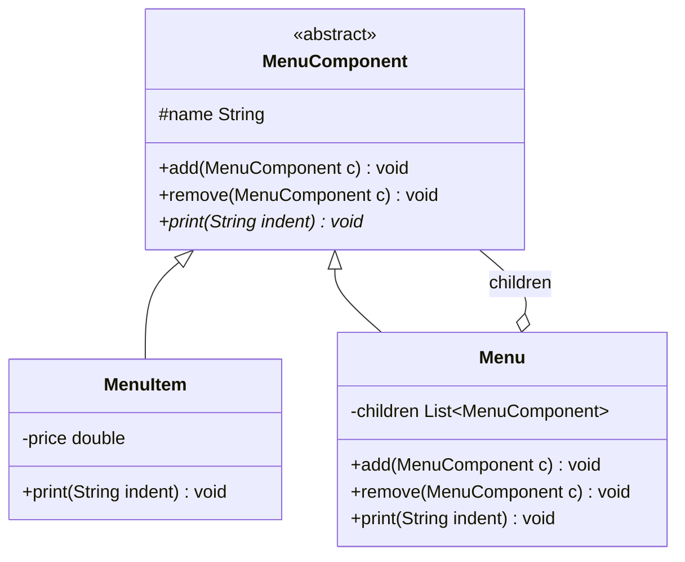

| 角色 | 本题的类 | 职责 |
| --- | --- | --- |
| 抽象构件 | MenuComponent | 菜单和菜式的共同父类，声明 `print` 和管理子项的方法 |
| 叶子构件 | MenuItem | 具体菜式，有名字和价格，调用 `add` 时报错 |
| 容器构件 | Menu | 保存子项列表，`print` 时先打印自己再递归打印子项 |
| 客户 | Client | 搭出菜单树，对根节点调用 `print` |

### 关键代码

2018 答案为 C++，学生稿为 Python，这里改写为 Java。菜式价格是演示用的数字。

```java
// 抽象构件（透明式：管理子项的方法也放在这里）
abstract class MenuComponent {
    protected String name;

    public MenuComponent(String name) {
        this.name = name;
    }

    public void add(MenuComponent c) {
        throw new UnsupportedOperationException(name + " 不能添加子项");
    }

    public void remove(MenuComponent c) {
        throw new UnsupportedOperationException(name + " 没有子项");
    }

    public abstract void print(String indent);
}

// 叶子：菜式
class MenuItem extends MenuComponent {
    private double price;

    public MenuItem(String name, double price) {
        super(name);
        this.price = price;
    }

    public void print(String indent) {
        System.out.println(indent + name + "  " + price + " 元");
    }
}

// 容器：菜单，子项可以是菜式，也可以是菜单
class Menu extends MenuComponent {
    private List<MenuComponent> children = new ArrayList<>();

    public Menu(String name) {
        super(name);
    }

    public void add(MenuComponent c) { children.add(c); }

    public void remove(MenuComponent c) { children.remove(c); }

    public void print(String indent) {
        System.out.println(indent + "[" + name + "]");
        for (MenuComponent c : children) {
            c.print(indent + "  ");        // 不管子项是菜式还是菜单，调用方式一样
        }
    }
}

public class Client {
    public static void main(String[] args) {
        MenuComponent all = new Menu("所有菜单");
        MenuComponent pancake = new Menu("煎饼屋菜单");
        MenuComponent diner = new Menu("餐厅菜单");
        MenuComponent cafe = new Menu("咖啡厅菜单");
        MenuComponent dessert = new Menu("甜点菜单");

        all.add(pancake);
        all.add(diner);
        all.add(cafe);
        pancake.add(new MenuItem("菜式1", 18));
        pancake.add(new MenuItem("菜式2", 22));
        diner.add(new MenuItem("菜式n", 38));
        diner.add(dessert);                     // 菜单里套菜单
        dessert.add(new MenuItem("菜式u", 12));
        cafe.add(new MenuItem("菜式r", 25));

        all.print("");
    }
}
```

### 易错点

- 2018 答案（C++）的 main 只建了"ALL MENUS"和"DINER MENU"两个菜单，其余写着"此处代码省略"，没有搭出"餐厅菜单下挂甜点菜单"这一层。菜单套菜单是题图里最能体现组合模式的地方，答题时要写出来。
- 2018 答案里叶子 MenuItem 的 `add` 直接 `return`，错误调用被悄悄吞掉；抽象类 MenuComponent 也没有虚析构函数，子项指针从不释放。
- 学生稿（Python）只写了类定义，没有按题图把树建出来。
- 类图里容器和抽象构件之间的聚合（或组合）线，菱形画在容器 Menu 一端，箭头指向抽象构件 MenuComponent，别指向叶子。

## 9 饮料价格计算程序（装饰）

### 需求要点

原题（张欣佳老师作业；文件B p30）：某饮料店卖饮料时，可以根据顾客的要求在饮料中加入各种配料，饮料店会根据顾客所选的饮料种类和所加入的配料来计算价格。饮料店所供应的部分饮料及配料的种类和价格如下表所示。请你选择恰当的设计模式，为该饮料店开发一个计算饮料价格的程序，要求给出设计思路，画出类图，并写出关键代码。

| 饮料（Beverage） | 价格/杯（元） | 配料（Condiment） | 价格/份（元） |
| --- | --- | --- | --- |
| 奶茶（MilkTea） | 8 | 草莓（Strawberry） | 2 |
| 奶昔（MilkShake） | 9 | 布丁（Pudding） | 3 |
| 咖啡（Coffee） | 10 | 芝士雪酪（Cheese） | 4 |

要点：
- 三种饮料各有基础价格。
- 顾客可以随意加配料，配料按份计价，可以加多种，也可以同一种加几份。
- 总价 = 饮料价 + 所加配料价之和，同时输出饮料描述。
- 表中是"部分"饮料和配料，以后会增加。

### 选用模式及理由

**装饰模式**：动态地给一个对象增加一些额外的职责，就增加对象功能来说，装饰模式比生成子类实现更为灵活。

对应关系：饮料是**具体构件**，配料是**具体装饰**。每加一份配料，就在原来的饮料外面包一层，价格在里层价格上加这份配料的钱，描述也跟着加上配料名。包出来的对象仍是饮料，可以继续包。

用继承做的话，3 种饮料乘以配料的各种组合（只算每种配料加或不加就有 8 种）要 24 个子类，还表示不了"加两份布丁"。装饰模式里加一种饮料或配料只加一个类。

### 类图

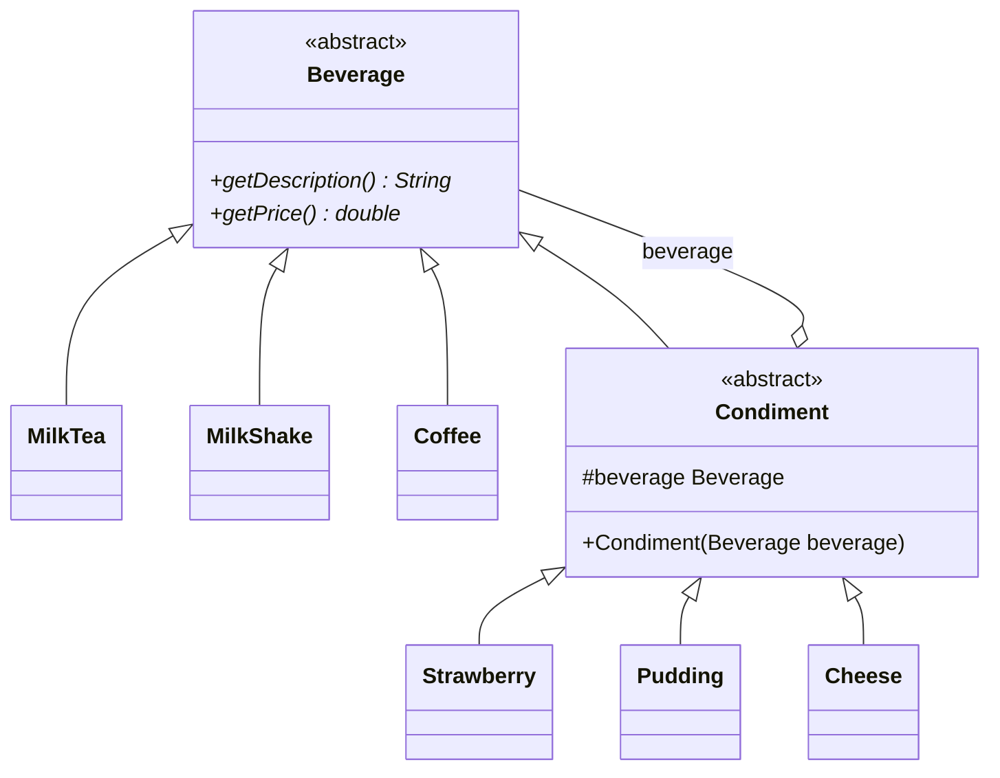

| 角色 | 本题的类 | 职责 |
| --- | --- | --- |
| 抽象构件 | Beverage | 声明 `getDescription()` 和 `getPrice()` |
| 具体构件 | MilkTea、MilkShake、Coffee | 返回饮料本身的名字和价格 |
| 抽象装饰 | Condiment | 继承 Beverage，同时持有一个 Beverage |
| 具体装饰 | Strawberry、Pudding、Cheese | 在被装饰饮料的价格和描述上各加自己的一份 |

### 关键代码

学生稿为 Python，这里改写为 Java。

```java
// 抽象构件
abstract class Beverage {
    public abstract String getDescription();
    public abstract double getPrice();
}

// 具体构件：三种饮料
class MilkTea extends Beverage {
    public String getDescription() { return "奶茶"; }
    public double getPrice() { return 8; }
}

class MilkShake extends Beverage {
    public String getDescription() { return "奶昔"; }
    public double getPrice() { return 9; }
}

class Coffee extends Beverage {
    public String getDescription() { return "咖啡"; }
    public double getPrice() { return 10; }
}

// 抽象装饰：配料本身也是 Beverage，里面再包一个 Beverage
abstract class Condiment extends Beverage {
    protected Beverage beverage;

    public Condiment(Beverage beverage) {
        this.beverage = beverage;
    }
}

// 具体装饰：在里层的基础上加价、加描述
class Strawberry extends Condiment {
    public Strawberry(Beverage beverage) { super(beverage); }
    public String getDescription() { return beverage.getDescription() + "+草莓"; }
    public double getPrice() { return beverage.getPrice() + 2; }
}

class Pudding extends Condiment {
    public Pudding(Beverage beverage) { super(beverage); }
    public String getDescription() { return beverage.getDescription() + "+布丁"; }
    public double getPrice() { return beverage.getPrice() + 3; }
}

class Cheese extends Condiment {
    public Cheese(Beverage beverage) { super(beverage); }
    public String getDescription() { return beverage.getDescription() + "+芝士雪酪"; }
    public double getPrice() { return beverage.getPrice() + 4; }
}

public class Client {
    public static void main(String[] args) {
        // 奶茶加两份布丁再加草莓：8 + 3 + 3 + 2 = 16
        Beverage drink = new Strawberry(new Pudding(new Pudding(new MilkTea())));
        System.out.println(drink.getDescription() + " = " + drink.getPrice() + " 元");
        // 输出：奶茶+布丁+布丁+草莓 = 16.0 元
    }
}
```

### 易错点

- 抽象装饰类要**既继承抽象构件，又持有一个抽象构件**。只持有不继承，装饰后的对象就不是饮料，没法再装饰；只继承不持有，就拿不到里层的价格。类图上这两条线都要画。
- 学生稿（Python）"咖啡类"那一行注释漏了 `#`，程序直接报语法错误。（更正：原稿作 `咖啡类`，应为 `# 咖啡类`。）
- 学生稿类图里 CondimentDecorator 指向 Beverage 的持有关系画成了普通箭头，画成聚合（空心菱形在装饰类一端）更规范。
- 文件B 的答案把 Condiment 写成普通类，`getPrice()` 直接转调里层，具体装饰再 `super.getPrice() + 2`，也是正确的写法。

## 10 奖金计算系统（装饰）

### 需求要点

原题（张欣佳老师作业；文件B p37）：开发一个系统帮助业务部门实现灵活的奖金计算。对于普通员工，主要有个人当月业务奖金、个人当月回款奖金等，对于部门经理，除了有普通员工的奖金外，还有团队当月业务奖金等。目前各奖金类别的计算规则如下：

- 个人当月业务奖金 = 个人当月销售额 × 3%
- 个人当月回款奖金 = 个人当月回款额 × 0.1%
- 团队当月业务奖金 = 团队当月销售额 × 1%

考虑到业务部门要通过调整奖金计算方式来激励士气，系统应灵活地适应各种需求变化，例如，将来可能会增加个人业务增长奖金、团队当月回款奖金、团队业务增长奖金、团队盈利奖金等奖金类别，也可能增加新的员工岗位，或变更奖金计算规则等。请写出你所选择的设计模式，画出类图，并给出核心代码。

要点：
- 普通员工的奖金 = 个人业务奖金 + 个人回款奖金。
- 部门经理的奖金 = 普通员工的那两项 + 团队业务奖金。
- 以后会加奖金类别、加岗位、改某一项的计算规则。
- 每个人的奖金是若干项奖金叠加起来的，叠哪几项因岗位而异。

### 选用模式及理由

**装饰模式**：动态地给一个对象增加一些额外的职责。

对应关系：把"计算奖金"看成一个对象，每种奖金是一个装饰器，在已有奖金的基础上加上自己这一项。普通员工是从 0 开始包两层（个人业务、个人回款），部门经理在普通员工外面再包一层团队业务。三种变化对应到代码：
- 加奖金类别：加一个装饰类。
- 加岗位：客户端换一种包法，不用加类。
- 改某项规则：只改对应的那个装饰类。

文件B 这题选的是装饰。奖金计算也是讲装饰模式时常见的例子（据印象《研磨设计模式》用过，未核对原书）。

学生稿写的是"策略模式 + 组合模式"：每种奖金一个策略类，员工对象里放一个奖金列表，逐项累加。这个设计能跑，扩展性也还行，但两个模式名都用得不准：
- 它不是组合模式。组合模式要求叶子和容器实现同一个接口、形成树；学生稿的 Employee 和 BonusStrategy 没有共同接口，只是员工对象聚合了一个列表，属于普通的对象组合。
- 策略模式是在一组可互换的算法里**选一个**用；本题各项奖金要**同时算、叠加起来**，这种"一层层追加职责"的需求是装饰模式的特征。
- 学生稿里 Staff 和 Manager 是两个空子类，经理多出来的团队奖金要客户端手动 add，岗位类没有起作用。

考场上如果写成"员工持有一组奖金规则再求和"，要说成"对象组合 + 策略接口"，别写成组合模式。

### 类图

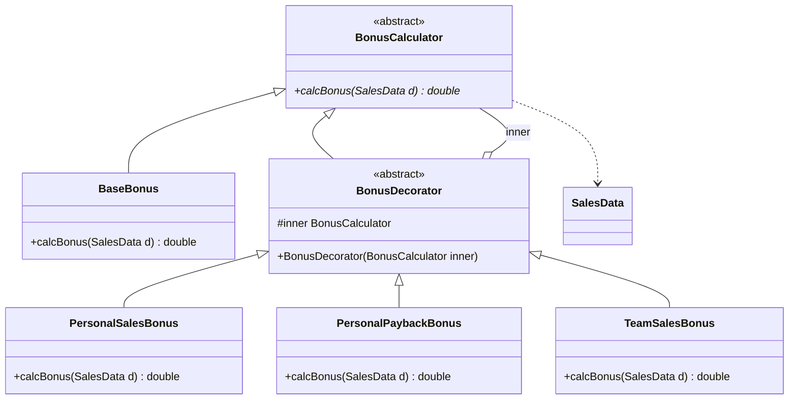

| 角色 | 本题的类 | 职责 |
| --- | --- | --- |
| 抽象构件 | BonusCalculator | 声明 `calcBonus()` |
| 具体构件 | BaseBonus | 没有任何奖金，返回 0，作为被装饰的起点 |
| 抽象装饰 | BonusDecorator | 继承 BonusCalculator，持有里层的 BonusCalculator |
| 具体装饰 | PersonalSalesBonus、PersonalPaybackBonus、TeamSalesBonus | 各算一项奖金，加到里层结果上 |
| 数据类（不属于模式角色） | SalesData | 个人销售额、个人回款额、团队销售额 |

### 关键代码

学生稿为 Python，文件B 为 Java，这里重写。

```java
// 计算奖金要用的数据
class SalesData {
    double personalSales;      // 个人当月销售额
    double personalPayback;    // 个人当月回款额
    double teamSales;          // 团队当月销售额

    SalesData(double personalSales, double personalPayback, double teamSales) {
        this.personalSales = personalSales;
        this.personalPayback = personalPayback;
        this.teamSales = teamSales;
    }
}

// 抽象构件
abstract class BonusCalculator {
    public abstract double calcBonus(SalesData d);
}

// 具体构件：起点，奖金为 0
class BaseBonus extends BonusCalculator {
    public double calcBonus(SalesData d) { return 0; }
}

// 抽象装饰
abstract class BonusDecorator extends BonusCalculator {
    protected BonusCalculator inner;

    public BonusDecorator(BonusCalculator inner) {
        this.inner = inner;
    }
}

// 具体装饰：一项奖金一个类，规则变了只改这里
class PersonalSalesBonus extends BonusDecorator {
    public PersonalSalesBonus(BonusCalculator inner) { super(inner); }

    public double calcBonus(SalesData d) {
        return inner.calcBonus(d) + d.personalSales * 0.03;
    }
}

class PersonalPaybackBonus extends BonusDecorator {
    public PersonalPaybackBonus(BonusCalculator inner) { super(inner); }

    public double calcBonus(SalesData d) {
        return inner.calcBonus(d) + d.personalPayback * 0.001;
    }
}

class TeamSalesBonus extends BonusDecorator {
    public TeamSalesBonus(BonusCalculator inner) { super(inner); }

    public double calcBonus(SalesData d) {
        return inner.calcBonus(d) + d.teamSales * 0.01;
    }
}

public class Client {
    public static void main(String[] args) {
        // 普通员工：个人业务 + 个人回款
        BonusCalculator staff = new PersonalPaybackBonus(new PersonalSalesBonus(new BaseBonus()));
        // 部门经理：在普通员工外面再包一层团队业务奖金
        BonusCalculator manager = new TeamSalesBonus(staff);

        SalesData d = new SalesData(10000, 2000, 20000);
        System.out.println(staff.calcBonus(d));     // 300 + 2 = 302.0
        System.out.println(manager.calcBonus(d));   // 302 + 200 = 502.0
    }
}
```

以后加"团队当月回款奖金"，照 TeamSalesBonus 的样子写一个 TeamPaybackBonus，客户端给经理多包一层即可，已有的类都不动。

### 易错点

- 文件B 的答案为普通员工和经理各写了一个具体构件类（Employee、Manager），两者都返回 0，只差描述文字。岗位的差别其实体现在客户端怎么包，不需要为每个岗位建构件类。文件B 原稿自己也注明其中查询员工数据的 Factory 类可以去掉，查数据不属于模式结构。
- 文件B 的样例输出核对无误：张三 5000 × 3% + 1000 × 0.1% = 151，李四 10000 × 3% + 2000 × 0.1% + 20000 × 1% = 502。
- 百分比别算错：0.1% 是 0.001，写成 0.01 就多了 10 倍。

## 11 电子相册自动生成程序（组合 + 装饰）

### 需求要点

原题（张欣佳老师作业；文件B p43）：请设计一个电子相册自动生成程序，要求该程序能够将一组图片自动生成到一个以树形结构保存的电子相册中，相册的目录采用树形结构，一级目录为年，二级目录为月，三级目录为日。每张照片可以添加音效和花边等特效。请写出你所选择的设计模式，画出类图，并给出核心代码。

要点：
- 把一组照片自动放进相册，相册是树形目录。
- 目录分三级：年、月、日，照片挂在日目录下。
- 每张照片可以加音效、花边等特效，特效可以叠加，以后可能还有别的特效。

### 选用模式及理由

一道题两个模式，分别对应题面的两句话：

- "以树形结构保存""一级目录为年、二级为月、三级为日"：用**组合模式**（组合多个对象形成树形结构以表示"整体-部分"的层次，使客户对单个对象和组合对象的使用具有一致性）。目录是容器，照片是叶子。
- "每张照片可以添加音效和花边等特效"：用**装饰模式**（动态地给一个对象增加一些额外的职责）。照片是具体构件，音效、花边是具体装饰。

两个模式共用同一个抽象构件 AlbumItem。这样加了特效的照片仍然是 AlbumItem，可以直接放进日目录，目录遍历时也不用区分照片有没有被装饰。学生稿和文件B 都是这个思路。

### 类图

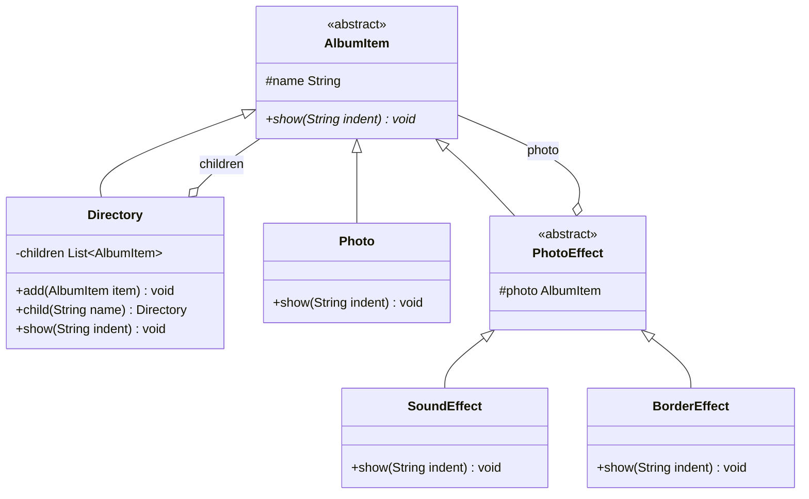

| 模式 | 角色 | 本题的类 | 职责 |
| --- | --- | --- | --- |
| 两者共用 | 抽象构件 | AlbumItem | 声明 `show()` |
| 组合 | 容器构件 | Directory | 年、月、日目录，保存子项，`show` 时递归显示 |
| 组合 / 装饰 | 叶子构件 / 具体构件 | Photo | 一张照片 |
| 装饰 | 抽象装饰 | PhotoEffect | 继承 AlbumItem，持有被装饰的照片 |
| 装饰 | 具体装饰 | SoundEffect、BorderEffect | 显示照片后再加上音效、花边 |

### 关键代码

学生稿为 Python，文件B 为 Java，这里重写。

```java
// 抽象构件：组合模式和装饰模式共用
abstract class AlbumItem {
    protected String name;

    public AlbumItem(String name) {
        this.name = name;
    }

    public abstract void show(String indent);
}

// 组合模式的容器：年、月、日目录都用这个类，层级靠树的深度体现
class Directory extends AlbumItem {
    private List<AlbumItem> children = new ArrayList<>();

    public Directory(String name) {
        super(name);
    }

    public void add(AlbumItem item) {
        children.add(item);
    }

    // 找名为 name 的子目录，没有就新建；自动生成年/月/日目录靠它
    public Directory child(String name) {
        for (AlbumItem item : children) {
            if (item instanceof Directory && item.name.equals(name)) {
                return (Directory) item;
            }
        }
        Directory dir = new Directory(name);
        children.add(dir);
        return dir;
    }

    public void show(String indent) {
        System.out.println(indent + name + "/");
        for (AlbumItem item : children) {
            item.show(indent + "  ");
        }
    }
}

// 组合模式的叶子，也是装饰模式的具体构件
class Photo extends AlbumItem {
    public Photo(String fileName) {
        super(fileName);
    }

    public void show(String indent) {
        System.out.println(indent + name);
    }
}

// 抽象装饰：特效
abstract class PhotoEffect extends AlbumItem {
    protected AlbumItem photo;

    public PhotoEffect(AlbumItem photo) {
        super(photo.name);
        this.photo = photo;
    }
}

// 具体装饰
class SoundEffect extends PhotoEffect {
    public SoundEffect(AlbumItem photo) { super(photo); }

    public void show(String indent) {
        photo.show(indent);
        System.out.println(indent + "  (配音效)");
    }
}

class BorderEffect extends PhotoEffect {
    public BorderEffect(AlbumItem photo) { super(photo); }

    public void show(String indent) {
        photo.show(indent);
        System.out.println(indent + "  (加花边)");
    }
}

public class Client {
    public static void main(String[] args) {
        Directory album = new Directory("相册");

        // 自动生成：按照片的拍摄日期逐级找目录，没有就建
        album.child("2023年").child("5月").child("1日")
             .add(new Photo("cat.jpg"));
        album.child("2023年").child("5月").child("1日")
             .add(new BorderEffect(new SoundEffect(new Photo("dog.jpg"))));   // 两种特效叠加

        album.show("");
    }
}
```

输出：

```text
相册/
  2023年/
    5月/
      1日/
        cat.jpg
        dog.jpg
          (配音效)
          (加花边)
```

这里的 Directory 只在自己身上提供 `add`，属于安全式组合；客户端拿的就是 Directory 类型，不需要转型。

### 易错点

- 装饰器必须继承抽象构件 AlbumItem，加了特效的照片才能放进目录。学生稿的类图只画了 PhotoDecorator 继承 AlbumComponent，漏了它持有 `_photo` 的那条聚合线，只看图看不出装饰关系。
- 文件B 的答案为 Year、Month、Day 各写了一个目录子类，只是输出多了"年""月""日"字样。三级目录行为一样，用一个目录类加名字就够；分三个子类也不算错，但要加"时"一级就得再加类。
- 文件B 的装饰器用 `setPic()` 注入被装饰的照片，忘了调用就是空指针；用构造方法传入更稳。
- 题目说"自动生成"，代码里最好体现按日期把照片放进对应目录，而不是在 main 里手工一个个 add。

## 考场速记

| 题目特征 | 模式 |
| --- | --- |
| 输入符号，按符号创建加减乘除对象，消掉 switch（计算器） | 简单工厂；客户端自己挑算法、运行时切换才是策略 |
| 多所学校各出一整套秋装、夏装（学校 + 季节） | 抽象工厂：学校是产品族，季节是产品等级结构 |
| 文件固定分头、体、尾三部分，格式不同写法不同（导出数据） | 建造者；只说"支持多种格式"时是工厂方法 |
| 某个类全局只能有一个实例，保留原有方法（TicketMaker） | 单例：私有构造 + 静态实例 + 静态获取方法 |
| 实例最多 N 个（DBConnections 最多 3 个） | 多例；单例的本质是控制实例数目 |
| 现成的几套 API 接口不一致，系统要统一调用（播放器） | 适配器（教材答案再加抽象工厂） |
| 两个维度各自扩展，如算法 × 操作系统（线程调度） | 桥接 |
| 树形结构，菜单里套菜单（点餐系统） | 组合 |
| 基础对象上任意叠加配料、奖金项（饮料、奖金） | 装饰 |
| 树形目录 + 给叶子加特效（电子相册） | 组合 + 装饰，共用一个抽象构件 |
