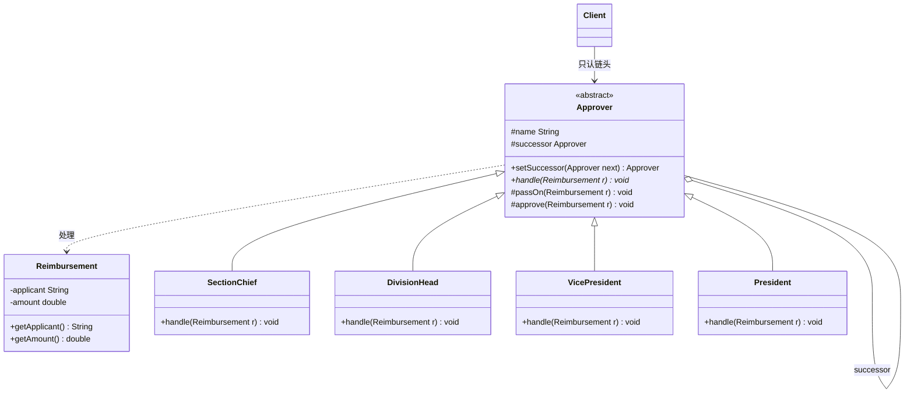
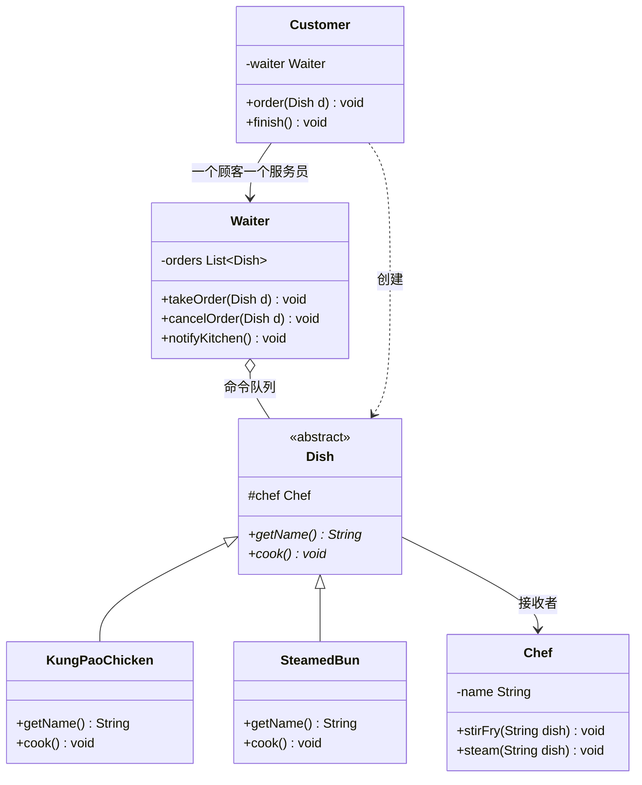
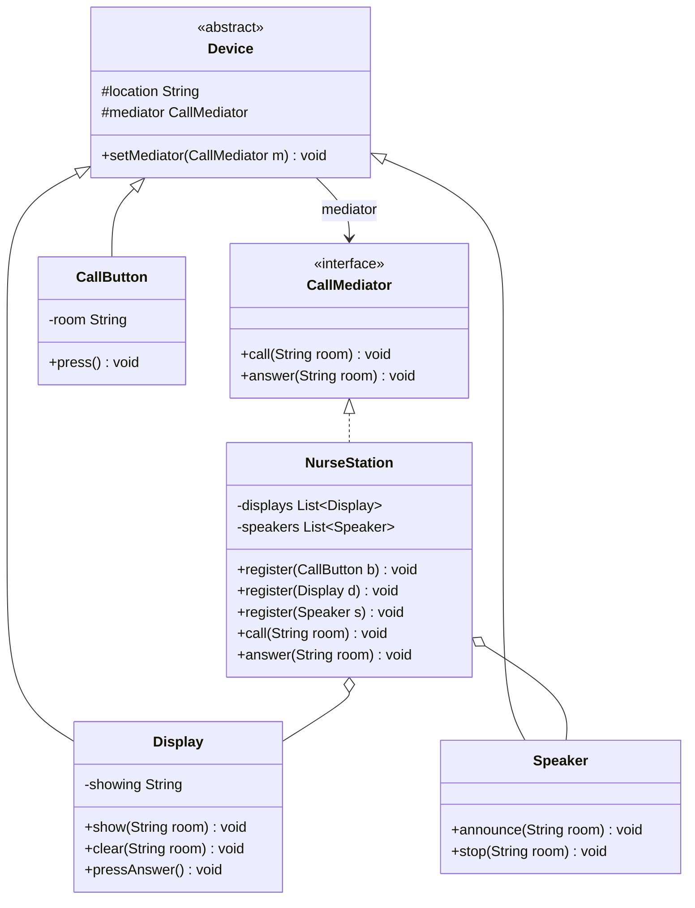
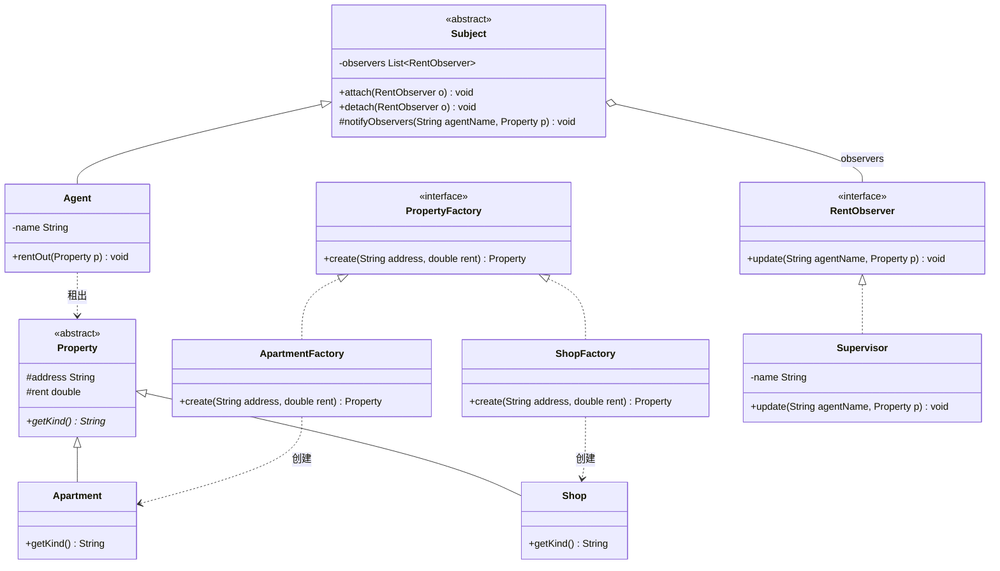
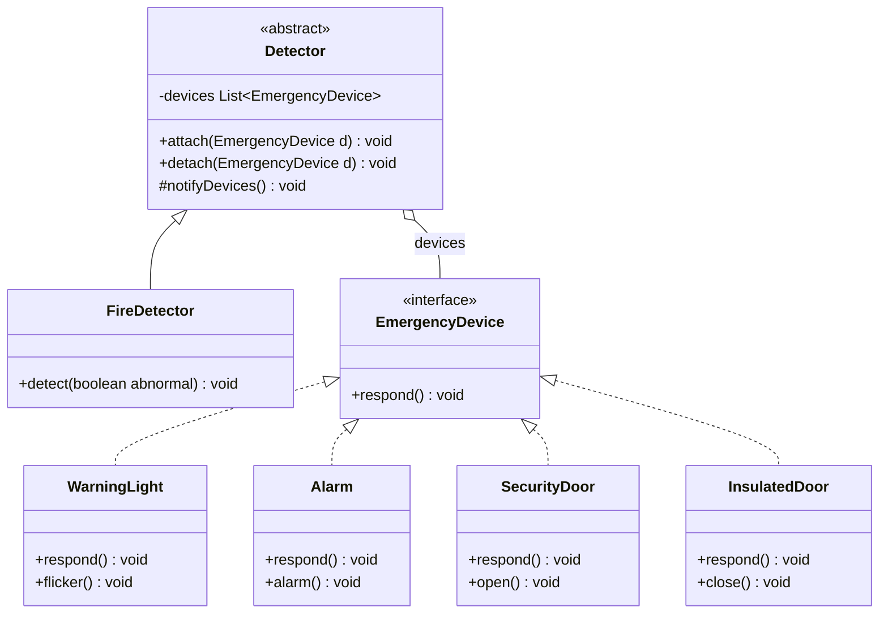
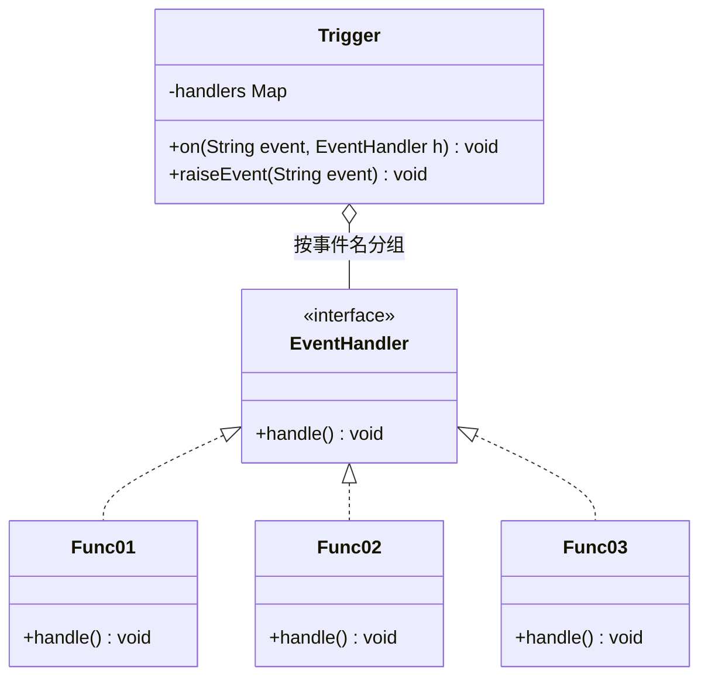
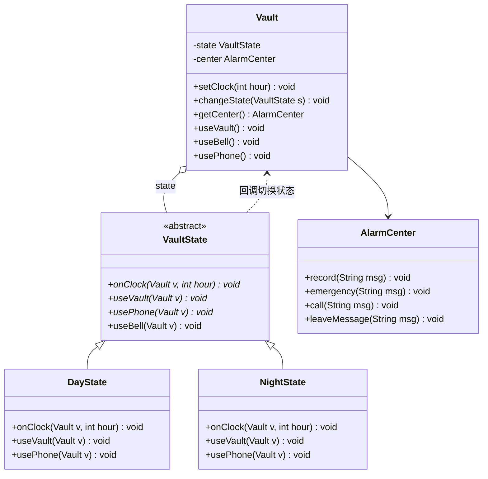
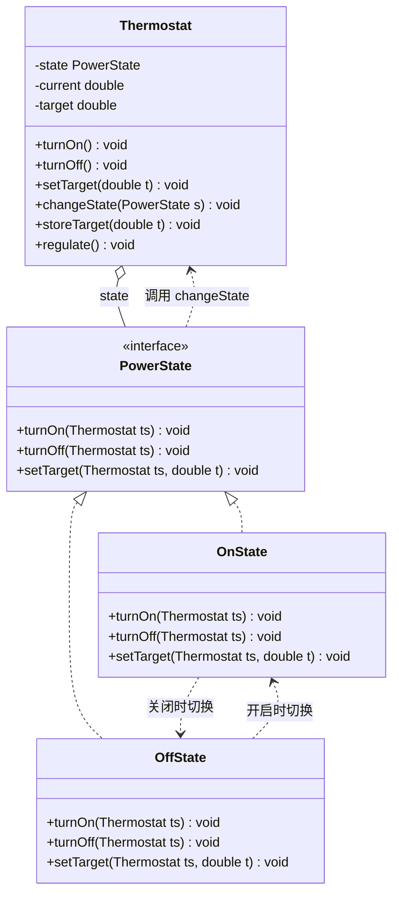
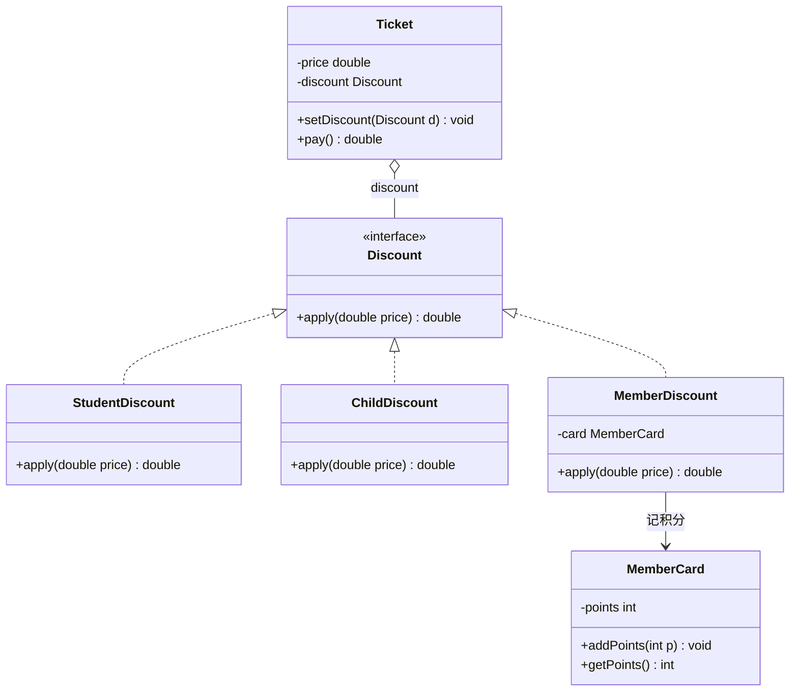
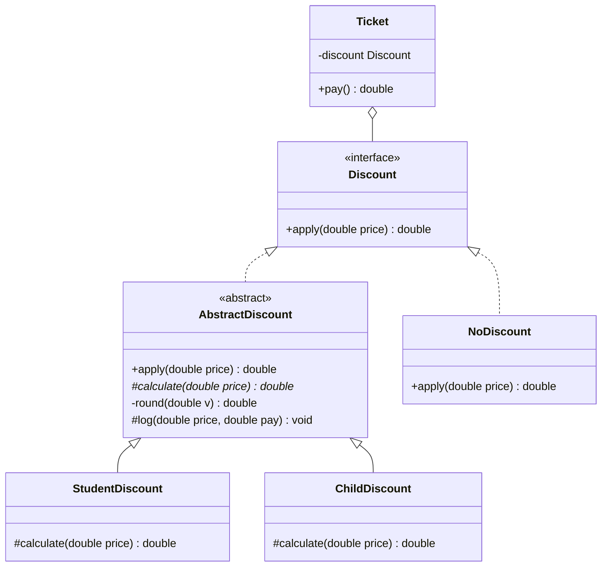

# 作业：行为型模式

整理自 `期末资料/张欣佳老师课件/作业/` 下行为型模式各次作业的学生提交稿（差旅费报销.docx、快餐店游戏.docx、病房呼叫应答响应系统.docx、物业租赁管理系统.docx、消防应急响应系统.docx、事件循环处理模型+回调函数.docx、银行报警系统.docx、温度自动调节系统.docx、电影院售票系统.docx、策略模式复用实现.docx、计算机操作系统线程调度程序.docx），`历年题/设计模式2018/` 的作业06、作业07 及其答案和 SDP04-01备注.txt，以及 `期末笔记（考场版）/设计模式【文件B】.pdf` p47-79 的作业 7（行为型）。学生稿和文件B都不是标准答案，下面每题先判断模式选得对不对，再给出重写的 Java 代码。本机没有 JDK，代码没有实际编译，是逐行人工核对的。

各模式的定义、结构、变体和教材例题见 [04 行为型模式（上）](<04 行为型模式（上）.md>) 和 [05 行为型模式（下）](<05 行为型模式（下）.md>)，跨模式的对比和联用见 [06 模式选择、对比与联用](<06 模式选择、对比与联用.md>)。设计题的答法和 30 一样：先写模式名，再写定义和选它的理由，然后画类图，最后写代码，时间紧时代码先把类声明和类间关系写全。

## 题目索引

| 序号 | 题目 | 模式 | 来源 |
| --- | --- | --- | --- |
| 1 | 差旅费报销 | 职责链 | 张欣佳老师作业 差旅费报销.docx；文件B p47-50 |
| 2 | 快餐店游戏 | 命令（带命令队列） | 张欣佳老师作业 快餐店游戏.docx；2018 作业06 及答案；文件B p51-54；2014 级 A 卷综合题，见 [20 历年题（2011-2014级）](<20 历年题（2011-2014级）.md>) |
| 3 | 病房呼叫应答仿真系统 | 中介者（学生稿用观察者） | 张欣佳老师作业 病房呼叫应答响应系统.docx；文件B p55-58 |
| 4 | 物业租赁管理系统 | 观察者 + 工厂方法 | 张欣佳老师作业 物业租赁管理系统.docx；文件B p58-61；2014 级 A 卷综合题，见 [20 历年题（2011-2014级）](<20 历年题（2011-2014级）.md>) |
| 5 | 消防应急响应系统 | 观察者（可加适配器） | 张欣佳老师作业 消防应急响应系统.docx；文件B p62-66 |
| 6 | 事件循环处理模型 + 回调函数 | 观察者 | 张欣佳老师作业 事件循环处理模型+回调函数.docx；文件B p76-79 |
| 7 | 银行金库报警系统 | 状态 | 张欣佳老师作业 银行报警系统.docx；文件B p66-70 |
| 8 | 温度自动调节系统 | 状态 | 张欣佳老师作业 温度自动调节系统.docx；文件B p71-73；2017 级卷有同类题 TCS-A，见 [21 历年题（2015-2019级）](<21 历年题（2015-2019级）.md>) |
| 9 | 电影院售票系统 | 策略 | 张欣佳老师作业 电影院售票系统.docx；文件B p74-75 |
| 10 | 策略算法的公共功能怎样复用 | 策略 + 模板方法 | 张欣佳老师作业 策略模式复用实现.docx；2018 作业07 及答案；文件B p76 |
| - | 计算机操作系统线程调度程序 | 桥接（学生稿用策略加工厂），见 [30 作业：创建型与结构型模式](<30 作业：创建型与结构型模式.md>) | 张欣佳老师作业 计算机操作系统线程调度程序.docx；文件B p26-29 |
| - | 兄弟俩出门玩，让妈妈饭好了招呼一声 | 观察者（选择题），见 [32 分析题与重构练习](<32 分析题与重构练习.md>) | 2018 练习02 |
| - | 机房监控：温度传感器通知警示灯、报警器等 | 观察者 + 适配器，和第 5 题几乎同题，见 [06 模式选择、对比与联用](<06 模式选择、对比与联用.md>) | 文件B p337 |

题目按职责链、命令、中介者、观察者、状态、策略、模板方法的顺序排。现有的作业资料里没有解释器、迭代器、备忘录、访问者的题。

## 1 差旅费报销（职责链）

### 需求要点

原题：某学校的差旅费报销制度规定，要根据不同的报销金额，由不同的领导审批，1万元以下科长审批，1万元至5万元之间处长审批，5万元至10万元之间副校长审批，10万元以上校长审批。最常用的编程思想是采用条件语句进行判断，但是随着差旅费报销制度的逐渐完善，可能需要判断的条件会越来越多，可能处理的逻辑也更加复杂，代码将变得难以维护。请选择恰当的设计模式解决该问题，画出类图，写出关键代码。

- 四级审批：科长管 1 万以下，处长管 1 万到 5 万，副校长管 5 万到 10 万，校长管 10 万以上。
- 题面没说端点归谁，这里约定为左闭右开：正好 1 万归处长，正好 5 万归副校长，正好 10 万归校长。考场上自己定一个，在注释里写明。
- 不想在一个方法里堆 if-else；以后审批级别和金额线都可能变。

### 选用模式及理由

**职责链模式**：避免请求的发送者和接收者耦合在一起，让多个对象都有机会处理请求；把这些对象连成一条链，请求沿链传递，直到有对象处理它为止。

对应关系：一张报销单是请求；科长、处长、副校长、校长是具体处理者；它们的抽象父类"审批人"是抽象处理者，持有下家 `successor`；由客户端（比如财务系统初始化代码）负责把四个人串成链，报销单只交给链头的科长。报销人不用知道最后是谁批的。

这是**纯的职责链**：每个审批人要么自己批，要么整张单子交给下家，不会批一半再往后传。纯与不纯的区别见 [04 行为型模式（上）](<04 行为型模式（上）.md>)。

### 类图



| 角色 | 本题的类 | 职责 |
| --- | --- | --- |
| 抽象处理者 | Approver | 保存下家引用；声明 `handle()`；提供"批准"和"转给下家"两个公共方法 |
| 具体处理者 | SectionChief、DivisionHead、VicePresident、President | 判断金额是否在自己权限内，在就批，不在就转给下家 |
| 请求 | Reimbursement | 报销人和金额 |
| 客户 | Client | 组装链，把报销单交给链头 |

### 关键代码

原答案（学生稿、文件B）为 Java，这里重写。

```java
// 请求：一张报销单
class Reimbursement {
    private final String applicant;
    private final double amount;               // 单位：元

    public Reimbursement(String applicant, double amount) {
        this.applicant = applicant;
        this.amount = amount;
    }
    public String getApplicant() { return applicant; }
    public double getAmount() { return amount; }
}

// 抽象处理者
abstract class Approver {
    protected final String name;
    protected Approver successor;              // 下家

    public Approver(String name) { this.name = name; }

    public Approver setSuccessor(Approver successor) {
        this.successor = successor;
        return successor;                      // 返回下家，组链时可以连着写
    }

    public abstract void handle(Reimbursement r);

    // 自己批不了就交给下家；链尾也批不了时给出提示，避免空指针
    protected void passOn(Reimbursement r) {
        if (successor != null) {
            successor.handle(r);
        } else {
            System.out.println("没有人能审批 " + r.getAmount() + " 元的报销");
        }
    }

    protected void approve(Reimbursement r) {
        System.out.println(name + "审批了" + r.getApplicant() + "的 " + r.getAmount() + " 元报销");
    }
}

class SectionChief extends Approver {          // 科长：1 万以下
    public SectionChief(String name) { super(name); }
    public void handle(Reimbursement r) {
        if (r.getAmount() < 10000) approve(r);
        else passOn(r);
    }
}

class DivisionHead extends Approver {          // 处长：1 万到 5 万
    public DivisionHead(String name) { super(name); }
    public void handle(Reimbursement r) {
        if (r.getAmount() < 50000) approve(r);
        else passOn(r);
    }
}

class VicePresident extends Approver {         // 副校长：5 万到 10 万
    public VicePresident(String name) { super(name); }
    public void handle(Reimbursement r) {
        if (r.getAmount() < 100000) approve(r);
        else passOn(r);
    }
}

class President extends Approver {             // 校长：链尾，10 万及以上都由校长批
    public President(String name) { super(name); }
    public void handle(Reimbursement r) {
        approve(r);
    }
}

public class Client {
    public static void main(String[] args) {
        Approver chief = new SectionChief("科长");
        chief.setSuccessor(new DivisionHead("处长"))
             .setSuccessor(new VicePresident("副校长"))
             .setSuccessor(new President("校长"));

        chief.handle(new Reimbursement("甲", 8000));     // 科长批
        chief.handle(new Reimbursement("乙", 20000));    // 处长批
        chief.handle(new Reimbursement("丙", 70000));    // 副校长批
        chief.handle(new Reimbursement("丁", 150000));   // 校长批
    }
}
```

以后加一级"院长"审批 3 万以下的单子，只要写一个 `Dean` 类，在客户端组链时插进科长和处长之间，已有的四个审批人类不用改。

### 易错点

- （更正：学生稿 main 里写了 `new DepartmentHead()` 并把它接进链中，但整份代码没有定义 DepartmentHead 类，编译不过，处长这一级也就不存在。上面补上了处长类 DivisionHead。）学生稿的类图把 successor 画成每个子类指向 Handler 的关联，应该是抽象处理者上的一条自聚合，画一次就够。
- 文件B 的写法以"万元"为单位，子类里直接 `this.successor.handleRequest(money)`，没有判空，链没配好就是空指针。判空放在父类的 `passOn()` 里，子类都不用管。
- 上面每个处理者只判断上限，是因为金额小的单子前面已经被批掉了，这依赖链的顺序。如果组链的顺序可能被打乱，就在每个处理者里把上下限都判断上。
- 组链的工作归客户端，处理者自己不知道链长什么样。这一点在类图里体现为 Client 只关联链头。

## 2 快餐店游戏（命令）

### 需求要点

原题（张欣佳老师作业、文件B p51、2014 级 A 卷写作"小王"，2018 作业06 写作"小明"，其余相同）：小王准备使用面向对象的方法设计一个快餐店的简单游戏，游戏中有顾客、服务员、菜品和厨师。每个顾客都有一个服务员帮助点菜，并且可以点多个菜；每道菜都由指定厨师制作，不同的菜可能由不同的厨师制作；顾客跟服务员点完菜后，服务员通知后厨做菜。请你针对上面的描述，帮助小王选择合适的设计模式进行设计。

1）简要说明你的设计思路和选择的模式。

2）给出你设计的UML类图和实现代码。

- 四种角色：顾客、服务员、菜品、厨师。
- 一个顾客对应一个服务员，一次可以点多道菜。
- 每道菜有指定的厨师，不同的菜可以由不同的厨师做。
- 点菜和做菜分开：先点完，再由服务员统一通知后厨。

### 选用模式及理由

**命令模式**：将一个请求封装为一个对象，从而可以用不同的请求对客户进行参数化，对请求排队或记录请求日志，以及支持可撤销的操作。

对应关系：

- 每道菜就是一条命令。抽象菜品是抽象命令，宫保鸡丁、小笼包这些是具体命令，命令里记着由哪位厨师做。
- 厨师是接收者，真正干活。
- 服务员是调用者，手里攥着一张单子（**命令队列**），顾客点一道就往单子上加一道，点完了挨个调用命令的执行方法，也就是"通知后厨"。
- 顾客挑菜、创建命令、交给服务员，是客户端的角色。

2018 答案和文件B 都说顾客是请求发送者（Invoker），服务员是命令队列。按 GoF 的定义，调用者是真正调用 `execute()` 的那个对象，本题里是服务员；点菜请求确实从顾客发出，所以说顾客是"请求发送者"也讲得通，但类图里调用命令执行方法的箭头要从服务员出发。

另一种容易想到的是观察者（"服务员通知后厨"）。观察者是一个目标变化后通知同一批观察者，本题每道菜只交给自己指定的厨师，而且要先攒一批再执行，这是命令加命令队列。服务员不需要知道谁做、怎么做，厨师也不需要知道是哪个服务员下的单，请求的发送者和接收者解耦了。以后要支持退菜（撤销）、记录点菜日志，也都在命令这一层加。命令队列和宏命令的写法见 [04 行为型模式（上）](<04 行为型模式（上）.md>)。

### 类图



| 角色 | 本题的类 | 职责 |
| --- | --- | --- |
| 抽象命令 | Dish | 保存接收者（厨师），声明 `cook()`，相当于 `execute()` |
| 具体命令 | KungPaoChicken、SteamedBun | 调用指定厨师的相应方法做这道菜 |
| 接收者 | Chef | 会炒、会蒸，真正做菜 |
| 调用者（含命令队列） | Waiter | 记下顾客点的菜，可以退菜，点完后逐个执行 |
| 客户端 | Customer | 创建命令并指定厨师，交给服务员 |

### 关键代码

2018 答案为 C++，学生稿和文件B 为 Java，这里统一重写为 Java。

```java
// 接收者：厨师
class Chef {
    private final String name;
    public Chef(String name) { this.name = name; }
    public void stirFry(String dish) { System.out.println(name + "炒" + dish); }
    public void steam(String dish)   { System.out.println(name + "蒸" + dish); }
}

// 抽象命令：一道菜，创建时就指定由哪位厨师做
abstract class Dish {
    protected final Chef chef;
    protected Dish(Chef chef) { this.chef = chef; }
    public abstract String getName();
    public abstract void cook();                 // 相当于 execute()
}

// 具体命令
class KungPaoChicken extends Dish {
    public KungPaoChicken(Chef chef) { super(chef); }
    public String getName() { return "宫保鸡丁"; }
    public void cook() { chef.stirFry(getName()); }
}

class SteamedBun extends Dish {
    public SteamedBun(Chef chef) { super(chef); }
    public String getName() { return "小笼包"; }
    public void cook() { chef.steam(getName()); }
}

// 调用者：服务员，内部维护命令队列
class Waiter {
    private final List<Dish> orders = new ArrayList<>();

    public void takeOrder(Dish d) {
        orders.add(d);
        System.out.println("服务员记下：" + d.getName());
    }
    public void cancelOrder(Dish d) { orders.remove(d); }   // 退菜

    public void notifyKitchen() {
        for (Dish d : orders) {
            d.cook();                            // 服务员不关心谁做、怎么做
        }
        orders.clear();
    }
}

// 客户端角色：顾客
class Customer {
    private final Waiter waiter;
    public Customer(Waiter waiter) { this.waiter = waiter; }
    public void order(Dish d) { waiter.takeOrder(d); }
    public void finish() { waiter.notifyKitchen(); }
}

public class FastFoodGame {
    public static void main(String[] args) {
        Chef wok = new Chef("炒锅师傅");
        Chef pastry = new Chef("面点师傅");
        Customer customer = new Customer(new Waiter());
        customer.order(new KungPaoChicken(wok));     // 不同的菜指定不同的厨师
        customer.order(new SteamedBun(pastry));
        customer.finish();                           // 点完了，服务员通知后厨
    }
}
```

加一道新菜只加一个 Dish 子类；加一位厨师只多 new 一个 Chef 对象传进去。服务员和顾客的代码都不用改。

### 易错点

- 学生稿没有抽象命令，只有一个具体的 `OrderCommand`，里面装着整张菜单；服务员 `takeOrder()` 一收到就立刻 `execute()`，自己不保存命令，想加退菜、排队都没处下手。学生稿的思路更接近宏命令（一条命令里装多道菜），缺的是统一的命令接口。
- 2018 答案的 C++ 代码只有一个烤肉师傅类，烤羊肉、炸鸡翅两个方法都写在它身上，题面"不同的菜由不同厨师做"没有体现出来；类名 `Barbucer` 拼错（应为 Barbecuer）；`new` 出来的对象没有 `delete`。
- 文件B 的每个具体菜品类在内部 `new Cook("张三")`，厨师写死在菜品类里，两道都归张三的菜拿到的还是两个不同的厨师对象。厨师应该像上面那样从构造方法传进来。文件B 在类图旁批注"从 waiter 到 Dish 应该是聚合"，这一点是对的。
- 类图里命令到接收者是关联，调用者到命令是聚合（服务员的单子里有多道菜），这两条线容易画反或画成继承。

## 3 病房呼叫应答仿真系统（中介者）

### 需求要点

原题：小明正在开发一个病房呼叫应答仿真系统。系统中每个病房配备一个呼叫按钮和一个呼叫显示应答器，疗区大厅配备一个显示应答器和一个语音播报器。假设，按下001号病房的呼叫按钮后，那么，所有的呼叫显示应答器都会显示发出呼叫的病房号001，大厅同时语音播报该病房号001。当医护人员按下任意一处的呼叫显示应答器的应答按钮后，所有呼叫显示应答器停止显示该房间号，大厅也停止语音播报。请用恰当的设计模式实现该系统，画出类图，给出核心代码。

- 设备有三种：病房里的呼叫按钮、病房和大厅都有的呼叫显示应答器、大厅的语音播报器。
- 某个病房按呼叫：所有显示应答器显示这个房间号，大厅播报。
- 任意一台显示应答器按应答：所有显示应答器停止显示，大厅停止播报。
- 病房很多，设备之间的联动是多对多的。

### 选用模式及理由

**中介者模式**：用一个中介对象来封装一系列的对象交互。中介者使各对象不需要显式地相互引用，从而使其耦合松散，而且可以独立地改变它们之间的交互。

对应关系：呼叫按钮、显示应答器、语音播报器都是同事类，彼此不直接引用；护士站主机 NurseStation 是具体中介者。按钮按下时只告诉中介者"某房间呼叫"，应答器按下应答键时只告诉中介者"某房间已应答"，由中介者去让所有显示器显示或清除、让播报器播报或停止。

学生稿用的是观察者，文件B 用中介者，并批注"不能用观察者"。本题中介者更合适，理由：

- 发起动作的设备有两类（呼叫按钮、任意一台应答器），被联动的设备也有两类，收到消息后的动作还分"显示/播报"和"停止"两套。设备之间是多对多关系。
- 用观察者的话，应答器既要当观察者（收呼叫）又要当目标（发应答），按钮、应答器、播报器之间互相注册，关系成网。中介者就是用来把这种网状引用改成以中介者为中心的星形结构。学生稿只让呼叫按钮当目标，应答这一步是在 main 里手工调 `notifyObservers(null)` 模拟的，应答器上的应答按钮根本没有建模。
- 观察者里目标状态一变，通知动作是固定的；这里"谁触发、通知谁、做什么"的协调逻辑集中放在中介者里，以后加一种设备（比如护士站的蜂鸣器），写一个新的同事类、改一下中介者就行，其他设备类不动。

文件B 还提了一句"能否让大厅当中介者"。大厅的显示器和播报器本身也是被协调的设备，把协调逻辑塞进大厅设备类会让它身兼两职，单独写一个护士站主机类更清楚。观察者和中介者的对比表见 [06 模式选择、对比与联用](<06 模式选择、对比与联用.md>)，中介者的结构见 [04 行为型模式（上）](<04 行为型模式（上）.md>)。

### 类图



| 角色 | 本题的类 | 职责 |
| --- | --- | --- |
| 抽象中介者 | CallMediator | 声明同事可以报告的两件事：呼叫、应答 |
| 具体中介者 | NurseStation | 登记所有设备；收到呼叫就让显示器显示、播报器播报，收到应答就全部停止 |
| 抽象同事 | Device | 保存位置和中介者引用 |
| 具体同事 | CallButton、Display、Speaker | 按钮发起呼叫；显示应答器显示、清除、发起应答；播报器播报、停止 |

### 关键代码

学生稿和文件B 为 Java，这里重写。

```java
// 抽象中介者
interface CallMediator {
    void call(String room);          // 某病房发起呼叫
    void answer(String room);        // 某台应答器应答了该病房
}

// 抽象同事：设备只认识中介者，互相不认识
abstract class Device {
    protected final String location;
    protected CallMediator mediator;
    protected Device(String location) { this.location = location; }
    public void setMediator(CallMediator mediator) { this.mediator = mediator; }
}

// 呼叫按钮
class CallButton extends Device {
    private final String room;
    public CallButton(String room) {
        super(room + "病房");
        this.room = room;
    }
    public void press() { mediator.call(room); }
}

// 呼叫显示应答器（病房和大厅都有）
class Display extends Device {
    private String showing;          // 正在显示的房间号，null 表示空闲
    public Display(String location) { super(location); }

    public void show(String room) {
        showing = room;
        System.out.println(location + "应答器显示：" + room + " 号病房呼叫");
    }
    public void clear(String room) {
        if (room.equals(showing)) {
            showing = null;
            System.out.println(location + "应答器停止显示 " + room);
        }
    }
    public void pressAnswer() {      // 医护人员按下应答键
        if (showing != null) {
            mediator.answer(showing);
        }
    }
}

// 语音播报器（大厅）
class Speaker extends Device {
    public Speaker(String location) { super(location); }
    public void announce(String room) { System.out.println(location + "播报：" + room + " 号病房呼叫"); }
    public void stop(String room)     { System.out.println(location + "停止播报 " + room); }
}

// 具体中介者：护士站主机，设备之间的联动都写在这里
class NurseStation implements CallMediator {
    private final List<Display> displays = new ArrayList<>();
    private final List<Speaker> speakers = new ArrayList<>();

    public void register(CallButton b) { b.setMediator(this); }
    public void register(Display d)    { d.setMediator(this); displays.add(d); }
    public void register(Speaker s)    { s.setMediator(this); speakers.add(s); }

    public void call(String room) {
        for (Display d : displays) d.show(room);
        for (Speaker s : speakers) s.announce(room);
    }

    public void answer(String room) {
        for (Display d : displays) d.clear(room);
        for (Speaker s : speakers) s.stop(room);
    }
}

public class WardCallDemo {
    public static void main(String[] args) {
        NurseStation station = new NurseStation();
        CallButton button001 = new CallButton("001");
        Display display001 = new Display("001病房");
        Display display002 = new Display("002病房");
        Display hallDisplay = new Display("大厅");
        Speaker hallSpeaker = new Speaker("大厅");

        station.register(button001);
        station.register(display001);
        station.register(display002);
        station.register(hallDisplay);
        station.register(hallSpeaker);

        button001.press();           // 三台应答器都显示 001，大厅播报
        display002.pressAnswer();    // 在 002 病房应答，全部停止
    }
}
```

### 易错点

- 学生稿（观察者）的问题上面说了。它的类图还画成了 Observer 接口实现 Subject，把 RoomCallButton 到 Subject 画成了关联，两处都错：观察者接口由显示设备实现，呼叫按钮应当继承 Subject。
- 文件B（中介者）把病房的呼叫按钮和显示应答器合成了一个类 `Ceil`（大概想写 Cell），大厅类 `Lobby` 也继承了 `call()`，只能在里面打印"大厅不能呼叫"。子类被迫继承一个自己不支持的方法，说明继承层次没分好，按设备种类拆成三个同事类就没有这个问题。另外它输出注释里的"病房2应答"一行代码并不会打印，"语言播报"应为"语音播报"。
- 中介者的代价是中介者类越来越大。设备种类多了以后，可以按功能拆成几个中介者。

## 4 物业租赁管理系统（观察者 + 工厂方法）

### 需求要点

原题（2014 级 A 卷综合应用题同题，5 分 + 15 分）：小王正在为某公司设计开发一套物业租赁管理系统，该公司有多种类型的物业，如公寓、商铺等，并且在将来可能会增加新的物业类型，如别墅、车库等；公司的经纪每租出一个物业，主管就会收到相应的租赁信息。请你针对上面的描述，帮助小王选择合适的设计模式进行设计。

1）简要说明你的设计思路和选择的模式。

2）给出你设计的UML类图和实现代码。

- 物业有公寓、商铺等多种类型，以后还要加别墅、车库，加类型时不想改已有代码。
- 经纪每租出一个物业，主管自动收到租赁信息。
- 题面有两句独立的需求，对应两个模式，类图要把两部分连起来。

### 选用模式及理由

两句需求各用一个模式：

- "物业类型会增加"用**工厂方法模式**：定义一个用于创建对象的接口，让子类决定实例化哪一个类，工厂方法使一个类的实例化延迟到其子类。物业是抽象产品，公寓、商铺是具体产品；物业工厂是抽象工厂，每种物业配一个具体工厂。加别墅只加 Villa 和 VillaFactory 两个类，符合开闭原则。
- "租出一个，主管就收到信息"用**观察者模式**：定义对象间的一种一对多依赖关系，当一个对象的状态发生改变时，所有依赖于它的对象都得到通知并被自动更新。经纪是观察目标，主管是观察者，"租出"就是目标的状态变化。以后财务、客服也想收到消息，登记成新的观察者即可。

两处常见的不同选法：

- 学生稿的"工厂"是一个带 switch 的类，按字符串 new 不同物业，这是简单工厂。加别墅要改 switch，不符合开闭原则，和题面"将来可能增加新类型"的暗示对不上。
- 文件B 让物业（House）当观察目标，每套房子自己维护一个关注者列表。这样主管得到每一套房子上登记一遍，房子一多很麻烦。题面说的是"经纪每租出一个物业"，事件发生在经纪身上，让经纪当目标更顺。两种结构都说得通，答题时把选哪个当目标的理由写上。

[20 历年题（2011-2014级）](<20 历年题（2011-2014级）.md>) 里给过一版不带抽象目标的写法，这里补上抽象目标类，把观察者的四个角色都画全。

### 类图



| 角色 | 本题的类 | 职责 |
| --- | --- | --- |
| 抽象产品 / 具体产品 | Property / Apartment、Shop | 物业的公共属性；各类型给出自己的名称 |
| 抽象工厂 / 具体工厂 | PropertyFactory / ApartmentFactory、ShopFactory | 声明创建方法；各自创建一种物业 |
| 抽象目标 | Subject | 维护观察者列表，提供登记、注销、通知 |
| 具体目标 | Agent | 租出物业后调用通知方法 |
| 抽象观察者 / 具体观察者 | RentObserver / Supervisor | 声明更新方法；主管收到租赁信息后处理 |

### 关键代码

学生稿和文件B 为 Java，这里重写。

```java
// ---------- 工厂方法：创建物业 ----------
abstract class Property {                          // 抽象产品
    protected final String address;
    protected final double rent;                   // 月租金
    protected Property(String address, double rent) {
        this.address = address;
        this.rent = rent;
    }
    public abstract String getKind();
    public String toString() { return getKind() + "（" + address + "，月租 " + rent + "）"; }
}

class Apartment extends Property {
    public Apartment(String address, double rent) { super(address, rent); }
    public String getKind() { return "公寓"; }
}

class Shop extends Property {
    public Shop(String address, double rent) { super(address, rent); }
    public String getKind() { return "商铺"; }
}

interface PropertyFactory {                        // 抽象工厂
    Property create(String address, double rent);
}

class ApartmentFactory implements PropertyFactory {
    public Property create(String address, double rent) { return new Apartment(address, rent); }
}

class ShopFactory implements PropertyFactory {
    public Property create(String address, double rent) { return new Shop(address, rent); }
}

// ---------- 观察者：租出后通知主管 ----------
interface RentObserver {                           // 抽象观察者
    void update(String agentName, Property p);
}

abstract class Subject {                           // 抽象目标
    private final List<RentObserver> observers = new ArrayList<>();
    public void attach(RentObserver o) { observers.add(o); }
    public void detach(RentObserver o) { observers.remove(o); }
    protected void notifyObservers(String agentName, Property p) {
        for (RentObserver o : observers) {
            o.update(agentName, p);
        }
    }
}

class Agent extends Subject {                      // 具体目标：经纪
    private final String name;
    public Agent(String name) { this.name = name; }
    public void rentOut(Property p) {
        System.out.println(name + "租出了" + p);
        notifyObservers(name, p);                  // 状态变了，通知所有观察者
    }
}

class Supervisor implements RentObserver {         // 具体观察者：主管
    private final String name;
    public Supervisor(String name) { this.name = name; }
    public void update(String agentName, Property p) {
        System.out.println("主管" + name + "收到租赁信息：" + agentName + "租出" + p);
    }
}

public class RentalDemo {
    public static void main(String[] args) {
        PropertyFactory factory = new ShopFactory();   // 换成 ApartmentFactory 就是公寓，也可以从配置文件读
        Property shop = factory.create("学府路 8 号", 6000);

        Agent agent = new Agent("经纪小李");
        agent.attach(new Supervisor("老王"));
        agent.rentOut(shop);
    }
}
```

以后加别墅：

```java
class Villa extends Property {
    public Villa(String address, double rent) { super(address, rent); }
    public String getKind() { return "别墅"; }
}

class VillaFactory implements PropertyFactory {
    public Property create(String address, double rent) { return new Villa(address, rent); }
}
```

### 易错点

- 学生稿说用了工厂方法，代码却是简单工厂（一个 switch）；类图里画了 Villa、Garage 两个子类，代码里没有，工厂的 switch 也不认识它们。
- 文件B 的 House 类里 `stakeholders` 列表声明后没有初始化，客户端如果先调 `addStakeholder()` 就是空指针，它的示例是靠先调 `setStakeholders()` 才躲过去的。它用 `status == 0` 表示"已售出"，魔法数字最好换成常量或枚举。文件B 这道题的标题是"物业租赁管理/房屋购买系统"，代码写的是售房，和本题的"租出"略有出入，结构不受影响。
- 两个模式的类图不要画成互不相连的两块，经纪和物业之间至少有一条依赖线。

## 5 消防应急响应系统（观察者）

### 需求要点

原题：开发一个消防应急响应系统，火灾探测器(FireDetector)发现火灾异常后将自动传递信号给各种响应设备，例如警示灯(WarningLight)将闪烁(flicker())、报警器(Alarm)将发出警报(alarm())、安全逃生门(SecurityDoor)将自动开启(open())、隔离门(InsulatedDoor)将自动关闭(close())等，每一种响应设备的行为由专门的程序来控制。请写出你所选择的设计模式，画出类图，并给出核心代码。

- 一个火灾探测器，多种响应设备，探测器发现火情后所有设备自动响应。
- 四种设备各有自己的方法名：`flicker()`、`alarm()`、`open()`、`close()`。
- "等"字说明设备种类还会增加，探测器也可能不止一种。

### 选用模式及理由

**观察者模式**。2018 年这次作业的备注用红绿灯打了个比方：信号灯是观察目标，路口的汽车（其实是司机）是观察者，一盏灯指挥很多辆车，灯一变车就跟着动。本题的火灾探测器就是那盏灯。

对应关系：火灾探测器是具体目标，再抽一个探测器父类当抽象目标，以后加烟雾探测器、温度探测器直接继承；响应设备统一实现一个"应急设备"接口，这个接口是抽象观察者；四种设备是具体观察者，在统一的 `respond()` 里调用各自的方法。加新设备只加一个实现类，探测器不用改。

文件B 在观察者外面又套了**适配器**：设备类当成现成的类不去改，每种设备写一个适配器去实现统一接口。"每一种响应设备的行为由专门的程序来控制"可以理解成设备类已经存在、不方便改，这时加适配器更贴题；题目只要求写出所选模式时，只用观察者也够（文件B 自己也批注了"只用 observer 应该也行"）。适配器版的完整类图和代码在 [06 模式选择、对比与联用](<06 模式选择、对比与联用.md>) 的机房监控题里，那道题和本题几乎一样，这里不重复。

### 类图



| 角色 | 本题的类 | 职责 |
| --- | --- | --- |
| 抽象目标 | Detector | 维护设备列表，提供登记、注销和通知 |
| 具体目标 | FireDetector | 检测到异常时调用通知方法 |
| 抽象观察者 | EmergencyDevice | 声明统一的响应方法 `respond()` |
| 具体观察者 | WarningLight、Alarm、SecurityDoor、InsulatedDoor | 在 `respond()` 里做自己的动作 |

### 关键代码

学生稿和文件B 为 Java，这里重写。

```java
interface EmergencyDevice {                        // 抽象观察者
    void respond();
}

abstract class Detector {                          // 抽象目标
    private final List<EmergencyDevice> devices = new ArrayList<>();
    public void attach(EmergencyDevice d) { devices.add(d); }
    public void detach(EmergencyDevice d) { devices.remove(d); }
    protected void notifyDevices() {
        for (EmergencyDevice d : devices) {
            d.respond();
        }
    }
}

class FireDetector extends Detector {              // 具体目标
    public void detect(boolean abnormal) {
        if (abnormal) {
            System.out.println("火灾探测器：发现火情");
            notifyDevices();
        }
    }
}

// 具体观察者：各自保留题面给的方法名
class WarningLight implements EmergencyDevice {
    public void respond() { flicker(); }
    public void flicker() { System.out.println("警示灯闪烁"); }
}

class Alarm implements EmergencyDevice {
    public void respond() { alarm(); }
    public void alarm() { System.out.println("报警器发出警报"); }
}

class SecurityDoor implements EmergencyDevice {
    public void respond() { open(); }
    public void open() { System.out.println("安全逃生门开启"); }
}

class InsulatedDoor implements EmergencyDevice {
    public void respond() { close(); }
    public void close() { System.out.println("隔离门关闭"); }
}

public class FireDemo {
    public static void main(String[] args) {
        FireDetector detector = new FireDetector();
        detector.attach(new WarningLight());
        detector.attach(new Alarm());
        detector.attach(new SecurityDoor());
        detector.attach(new InsulatedDoor());
        detector.detect(true);
    }
}
```

`Alarm` 类里有个方法也叫 `alarm()`，因为写了返回类型 `void`，Java 把它当普通方法，不是构造方法，能编译。

### 易错点

- 学生稿结构正确，只是没有抽象目标，火灾探测器直接管列表。题面只有一种探测器时可以接受，想扩展探测器时再抽父类。
- 文件B 代码里拼写错误较多：`FireDectector`、`detack`、`AlarmAdatper`、`SecurityDoorAtapter`、"安全逃生们"。它的抽象设备用的是抽象类，文件B 自己批注"改成接口更合适"，改成接口后适配器到它的线也要从继承改成实现。
- 观察者按登记顺序依次通知。如果现实中要求先开逃生门再关隔离门，要么控制登记顺序，要么别让结果依赖通知顺序，答题时可以提一句。

## 6 事件循环处理模型 + 回调函数（观察者）

### 需求要点

原题：当前开发一个新语言、新中间件或程序框架时，基于充分利用多核CPU能力等方面的考虑，多采用事件循环处理模型+回调函数的设计方式，使用该模型的示例代码和预期输出详见下表。针对该模型，请写出你所选择的设计模式，画出类图，并给出Trigger类及相关类的设计和实现，使得输出能够符合预期结果。（为简便起见，假设所有事件处理函数的原型均为void xxxx(void);）

题面表格左栏是示例代码（按原题图片照录，文件B 的文字版有 `evento1`、`func0()` 之类的识别错误）：

```cpp
// 示例代码
void func01() { cout << "func01()" << endl; }
void func02() { cout << "func02()" << endl; }
void func03() { cout << "func03()" << endl; }

Trigger trigger;  // 触发器

// 注册事件
trigger.on("event01", func01);
trigger.on("event01", func02);
trigger.on("event02", func02);
trigger.on("event03", func03);

// 触发事件
trigger.raiseEvent("event01");
trigger.raiseEvent("event02");
trigger.raiseEvent("event03");
trigger.on("event01", nullptr);
trigger.raiseEvent("event01");
trigger.raiseEvent("event02");
```

右栏是这段代码的预期输出：

```text
Process event01 start
func01()
Process event01 end
Process event01 start
func02()
Process event01 end
Process event02 start
func02()
Process event02 end
Process event03 start
func03()
Process event03 end
Process event02 start
func02()
Process event02 end
```

从输出里读出 Trigger 要满足的规则：

- `on(事件名, 函数)`：一个事件可以挂多个处理函数，按注册顺序调用；同一个函数也可以挂到多个事件上（func02 挂了两个事件）。
- `raiseEvent(事件名)`：**每调用一个处理函数**，前后各输出一行 `Process 事件名 start` 和 `Process 事件名 end`。event01 挂了两个函数，所以输出了两对 start/end。
- `on(事件名, nullptr)`：清空这个事件的全部处理函数。之后再触发 event01，一行都不输出。
- 没有处理函数的事件被触发时什么也不输出。

### 选用模式及理由

**观察者模式**（发布-订阅）：定义对象间的一种一对多依赖关系，当一个对象的状态发生改变时，所有依赖于它的对象都得到通知并被自动更新。

对应关系：Trigger 是观察目标，按事件名分组保存观察者；每个事件处理函数是观察者；`on()` 是登记观察者，`on(事件, nullptr)` 是注销该事件的全部观察者，`raiseEvent()` 是通知。事件名相当于订阅的主题。

文件B 把这题标成"存在疑问"。疑问来自"回调"两个字：回调就是把一个函数交给别人，由别人在合适的时候调用。在面向对象里，一个回调函数可以包成一个命令对象，GoF 书里也说命令模式是回调机制的面向对象替代，所以答命令模式也有道理。但本题的重点是"一个事件登记多个处理函数、可以注销、事件发生时逐个通知"，这是观察者的一对多依赖，文件B 最后也答的观察者。答题时可以补一句：每个观察者本身就是一个回调对象。

### 类图



| 角色 | 本题的类 | 职责 |
| --- | --- | --- |
| 观察目标 | Trigger | 用 `Map<String, List<EventHandler>>` 按事件名保存处理函数；登记、清空、触发 |
| 抽象观察者 | EventHandler | 对应原型 `void xxxx(void)`，只有一个无参无返回值的方法 |
| 具体观察者 | Func01、Func02、Func03 | 各输出自己的函数名；Java 8 以后可以直接用方法引用代替这三个类 |

### 关键代码

学生稿为 C++，文件B 为 Java，两份的输出都和预期不符（见易错点），这里重写为 Java。

```java
// 抽象观察者：事件处理函数，对应 void xxxx(void)
interface EventHandler {
    void handle();
}

// 观察目标：触发器
class Trigger {
    private final Map<String, List<EventHandler>> handlers = new HashMap<>();

    // 登记处理函数；传 null 表示清空该事件的全部处理函数
    public void on(String event, EventHandler h) {
        if (h == null) {
            handlers.remove(event);
            return;
        }
        List<EventHandler> list = handlers.get(event);
        if (list == null) {
            list = new ArrayList<>();
            handlers.put(event, list);
        }
        list.add(h);
    }

    // 触发事件：逐个通知，每个处理函数前后各输出一行
    public void raiseEvent(String event) {
        List<EventHandler> list = handlers.get(event);
        if (list == null) {
            return;                                   // 没人订阅，什么也不输出
        }
        for (EventHandler h : list) {
            System.out.println("Process " + event + " start");
            h.handle();
            System.out.println("Process " + event + " end");
        }
    }
}

public class EventLoopDemo {
    static void func01() { System.out.println("func01()"); }
    static void func02() { System.out.println("func02()"); }
    static void func03() { System.out.println("func03()"); }

    public static void main(String[] args) {
        Trigger trigger = new Trigger();
        // 方法引用充当具体观察者；不熟悉的话写成
        // class Func01 implements EventHandler { public void handle() { EventLoopDemo.func01(); } }
        trigger.on("event01", EventLoopDemo::func01);
        trigger.on("event01", EventLoopDemo::func02);
        trigger.on("event02", EventLoopDemo::func02);
        trigger.on("event03", EventLoopDemo::func03);

        trigger.raiseEvent("event01");
        trigger.raiseEvent("event02");
        trigger.raiseEvent("event03");
        trigger.on("event01", null);
        trigger.raiseEvent("event01");                // 已清空，无输出
        trigger.raiseEvent("event02");
    }
}
```

逐行推一遍：event01 有 func01、func02 两个观察者，输出两对 start/end；event02、event03 各一对；清空 event01 后触发它，`handlers.get()` 返回 null，直接返回；最后 event02 再输出一对。共 15 行，和预期输出一致。

### 易错点

- （更正：学生稿的 C++ `raiseEvent()` 在循环外只输出一次 start 和 end，event01 会输出成 start、func01()、func02()、end，和预期不符；它的 main 漏掉了 `trigger.on("event01", nullptr)` 这一行，`on()` 也没有处理空指针，传进去的 nullptr 会被存进列表，之后触发时仍输出 start/end。）
- （更正：文件B 的 Java 版同样把 start/end 放在循环外，输出和预期不符；它代码后面的"预期输出"注释是照抄题面的，不是这段代码的实际输出。）
- 做这类"写出类使输出符合预期"的题，先从输出里把规则一条条读出来，特别是空指针、重复注册这些边界情况，写完再对着示例逐行推一遍。

## 7 银行金库报警系统（状态）

### 需求要点

原题：小明为某银行开发一个报警系统，该系统功能描述如下，请你帮助小明完成设计，给出设计模式的名称，画出类图，写出关键代码。

功能描述在原题里是一张表（照录）：

- 有一个金库；金库与警报中心相连；金库里有警铃和正常通话用的电话；金库里有时钟，监视着现在的时间。
- 白天的时间范围是 9:00 到 16:59，晚上的时间范围是 17:00 到 23:59 和 0:00 到 8:59。
- 金库只能在白天使用；白天使用金库的话，会在警报中心留下记录；晚上使用金库的话，会向警报中心发送紧急事态通知。
- 任何时候都可以使用警铃；使用警铃的话，会向警报中心发送紧急事态通知。
- 任何时候都可以使用电话（但晚上只有留言电话）；白天使用电话的话，会呼叫警报中心；晚上用电话的话，会呼叫警报中心的留言电话。

这个场景和结城浩《图解设计模式》状态模式一章的金库警报例子很像（凭印象，手头没有原书，未核对）。

### 选用模式及理由

**状态模式**：允许一个对象在其内部状态改变时改变它的行为，对象看起来似乎修改了它的类。

对应关系：金库系统是环境类；白天、夜晚是两个具体状态；使用金库、按警铃、打电话是三个请求，同一个请求在白天和夜晚处理方式不同；时钟每小时报一次时，由当前状态判断要不要切换到另一个状态。

- 不用状态模式时，三个方法里都要写 `if (白天) … else …`，以后加一个"节假日"状态就要改每个方法。
- 文件B 提到第一反应是观察者（时钟一变就通知）。观察者触发的动作是固定的"通知大家"，本题是同一个操作换一套处理方式，状态还会随时间自动切换，所以是状态模式。两者的区别见 [06 模式选择、对比与联用](<06 模式选择、对比与联用.md>)。
- 状态转换放在哪：学生稿写在环境类的 `setTime()` 里用 if 判断，下面的写法放在具体状态类里（白天状态发现到晚上了就切到夜晚状态）。两种都是状态模式允许的，放在状态类里时加新状态不用改环境类。

### 类图



| 角色 | 本题的类 | 职责 |
| --- | --- | --- |
| 环境类 | Vault | 持有当前状态和警报中心；三个操作和报时都委托给当前状态 |
| 抽象状态 | VaultState | 声明各操作；警铃在两个状态下一样，默认实现放在这里 |
| 具体状态 | DayState、NightState | 实现各自的处理方式；报时时判断是否切换。没有成员变量，做成单例 |
| 其他 | AlarmCenter | 警报中心，接收记录、紧急通知、电话和留言 |

### 关键代码

学生稿和文件B 为 Java，这里重写。

```java
// 警报中心
class AlarmCenter {
    public void record(String msg)       { System.out.println("[记录] " + msg); }
    public void emergency(String msg)    { System.out.println("[紧急事态通知] " + msg); }
    public void call(String msg)         { System.out.println("[呼叫警报中心] " + msg); }
    public void leaveMessage(String msg) { System.out.println("[留言电话] " + msg); }
}

// 抽象状态
abstract class VaultState {
    public abstract void onClock(Vault vault, int hour);    // 报时，决定是否切换
    public abstract void useVault(Vault vault);
    public abstract void usePhone(Vault vault);

    public void useBell(Vault vault) {                      // 白天晚上一样
        vault.getCenter().emergency("警铃被按下");
    }

    protected static boolean isDay(int hour) {              // 9:00 到 16:59 为白天
        return hour >= 9 && hour < 17;
    }
}

// 具体状态：白天
class DayState extends VaultState {
    public static final DayState INSTANCE = new DayState();
    private DayState() {}

    public void onClock(Vault vault, int hour) {
        if (!isDay(hour)) vault.changeState(NightState.INSTANCE);
    }
    public void useVault(Vault vault) { vault.getCenter().record("白天使用金库"); }
    public void usePhone(Vault vault) { vault.getCenter().call("白天来电"); }
    public String toString() { return "白天"; }
}

// 具体状态：夜晚
class NightState extends VaultState {
    public static final NightState INSTANCE = new NightState();
    private NightState() {}

    public void onClock(Vault vault, int hour) {
        if (isDay(hour)) vault.changeState(DayState.INSTANCE);
    }
    public void useVault(Vault vault) { vault.getCenter().emergency("夜间有人使用金库"); }
    public void usePhone(Vault vault) { vault.getCenter().leaveMessage("夜间来电"); }
    public String toString() { return "夜晚"; }
}

// 环境类：金库
class Vault {
    private VaultState state = DayState.INSTANCE;
    private final AlarmCenter center = new AlarmCenter();

    public void setClock(int hour) {               // 时钟每小时调用一次
        System.out.println("现在 " + hour + " 点");
        state.onClock(this, hour);
    }
    public void changeState(VaultState s) {
        System.out.println("从" + state + "切换到" + s);
        state = s;
    }
    public AlarmCenter getCenter() { return center; }

    public void useVault() { state.useVault(this); }
    public void useBell()  { state.useBell(this); }
    public void usePhone() { state.usePhone(this); }
}

public class BankAlarmDemo {
    public static void main(String[] args) {
        Vault vault = new Vault();
        vault.setClock(10);
        vault.useVault();      // [记录] 白天使用金库
        vault.usePhone();      // [呼叫警报中心] 白天来电
        vault.setClock(17);    // 从白天切换到夜晚
        vault.useVault();      // [紧急事态通知] 夜间有人使用金库
        vault.useBell();       // [紧急事态通知] 警铃被按下
        vault.usePhone();      // [留言电话] 夜间来电
    }
}
```

### 易错点

- 学生稿的结构是对的，两个状态也做成了单例。不足是状态转换全写在环境类 `setTime()` 的 if-else 里，警报中心没有建成对象，只打印字符串，这两点可以接受。
- 文件B 定义了 Clock 类却从没用过，时间不参与任何判断，白天夜晚是客户端手动 `setState()` 切换的。状态模式里"内部条件变了自动换状态"这一点没有体现。它的警铃类 AlarmBell 自己 new 了一个 AlarmCenter，和金库持有的警报中心不是同一个对象。
- 边界：16:59 算白天，17:00 算晚上，按小时判断就是 `9 <= hour < 17`。

## 8 温度自动调节系统（状态）

### 需求要点

原题：小明正在开发一个温度自动调节系统，该系统能够根据用户设置的温度值自动调节温度。当系统开启时，它会读取用户设置的期望温度值T，若当前温度低于T，它将温度提升到T，若当前温度高于T，它将温度降为T。当系统关闭时，它将停止调节温度。当系统开启时，它可以接受温度设置及关闭系统的指令，当系统关闭时，它只接受开启系统的指令。请用恰当的设计模式设计该系统，画出类图，给出核心代码。

- 开启时读取期望温度 T，当前温度低就升到 T，高就降到 T。
- 关闭时停止调节。
- 开启状态接受两条指令：设置温度、关闭。关闭状态只接受一条：开启。
- 2017 级考卷的 TCS-A 大楼温控题几乎一样（把"系统"换成"空调"），文件B 批注"类似于作业7中的温度自动调节系统"。

### 选用模式及理由

**状态模式**：允许一个对象在其内部状态改变时改变它的行为，对象看起来似乎修改了它的类。

题眼是最后一句："开启时可以接受……，关闭时只接受……"。同样三条指令，在两种状态下有的执行、有的拒绝，开和关之间还会转换，这就是状态模式。对应关系：温控系统是环境类；开启、关闭是具体状态；开启、关闭、设置温度三条指令由当前状态处理。

状态怎么划分：文件B 分成关闭、加热、降温三个状态。题面区分状态的依据是"能接受哪些指令"，开和关两个状态就够了，升温降温是开启状态下的动作。想细分成加热、降温也行，但温度到达 T 之后应该留在"开启"（保温），不能像文件B 那样直接切到"关闭"。状态模式和策略模式的区别见 [05 行为型模式（下）](<05 行为型模式（下）.md>)。

### 类图



| 角色 | 本题的类 | 职责 |
| --- | --- | --- |
| 环境类 | Thermostat | 保存当前温度、期望温度和当前状态；三条对外指令委托给状态；`changeState`、`storeTarget`、`regulate` 三个方法只给状态类调用，代码里是包访问权限 |
| 抽象状态 | PowerState | 声明三条指令 |
| 具体状态 | OnState | 接受设置温度（保存后立即调节）和关闭；忽略重复开启 |
| 具体状态 | OffState | 只接受开启，开启后立即按期望温度调节；拒绝设置温度 |

### 关键代码

学生稿和文件B 为 Java，这里重写。

```java
interface PowerState {                               // 抽象状态
    void turnOn(Thermostat ts);
    void turnOff(Thermostat ts);
    void setTarget(Thermostat ts, double t);
}

class OffState implements PowerState {               // 关闭：只接受开启
    public void turnOn(Thermostat ts) {
        System.out.println("系统开启");
        ts.changeState(new OnState());
        ts.regulate();                               // 开启时读取期望温度并调节
    }
    public void turnOff(Thermostat ts) {
        System.out.println("系统已关闭，忽略");
    }
    public void setTarget(Thermostat ts, double t) {
        System.out.println("系统关闭中，不接受温度设置");
    }
}

class OnState implements PowerState {                // 开启：接受设置温度和关闭
    public void turnOn(Thermostat ts) {
        System.out.println("系统已开启，忽略");
    }
    public void turnOff(Thermostat ts) {
        System.out.println("系统关闭，停止调节");
        ts.changeState(new OffState());
    }
    public void setTarget(Thermostat ts, double t) {
        ts.storeTarget(t);
        ts.regulate();
    }
}

class Thermostat {                                   // 环境类
    private PowerState state = new OffState();       // 初始为关闭
    private double current;
    private double target;

    public Thermostat(double current, double target) {
        this.current = current;
        this.target = target;
    }

    // 对外的三条指令，全部交给当前状态处理
    public void turnOn()            { state.turnOn(this); }
    public void turnOff()           { state.turnOff(this); }
    public void setTarget(double t) { state.setTarget(this, t); }

    // 下面三个方法只给同包的状态类用
    void changeState(PowerState s)  { state = s; }
    void storeTarget(double t)      { target = t; }
    void regulate() {
        if (current < target) {
            System.out.println("当前 " + current + " 度，升温到 " + target + " 度");
        } else if (current > target) {
            System.out.println("当前 " + current + " 度，降温到 " + target + " 度");
        } else {
            System.out.println("已是期望温度 " + target + " 度");
        }
        current = target;                            // 仿真：直接调到位
    }
}

public class ThermostatDemo {
    public static void main(String[] args) {
        Thermostat ts = new Thermostat(15, 22);
        ts.setTarget(25);     // 关闭中，拒绝
        ts.turnOn();          // 开启，从 15.0 升到 22.0
        ts.setTarget(18);     // 从 22.0 降到 18.0
        ts.turnOff();         // 关闭
        ts.turnOn();          // 再开启，已是期望温度 18.0
    }
}
```

两个状态类没有成员变量，也可以像第 7 题那样做成单例，免得每次切换都 new。

### 易错点

- 学生稿整体正确。（更正：学生稿从关闭切到开启时只改了状态，没有调节温度，题面要求"开启时读取期望温度 T 并调节"，上面的 `OffState.turnOn()` 补上了 `regulate()`。）
- （更正：文件B 的 `Heating.work()` 在当前温度高于期望温度的分支里只 `setState(new Cooling())`，既不改温度也不跳出 `while (true)`。温差不是整数时就会进这个分支，比如期望 20.5、当前 15，加到 21 后会无限循环打印。）
- 文件B 在温度达到 T 后切到 Shutdown，把"达到目标"当成了"用户关机"，之后要调温度只能重新开机；它的 `setT()` 是公开方法，关机时也能改期望温度，没做到"关闭时只接受开启指令"；当前温度正好等于 T 时 `open()` 先打印"系统当前温度等于期望温度，系统关闭"，再调 Shutdown 的 `work()` 打印"系统关闭，无法工作"，两句话意思重复。
- 状态类要能改环境类的状态，所以环境类要给状态类留 `changeState()` 之类的方法，状态类通过参数或成员变量拿到环境类。类图里状态到环境类的这层依赖容易漏画。

## 9 电影院售票系统（策略）

### 需求要点

原题：小王正在开发一套电影院售票系统，在该系统中需要为不同类型的用户提供不同的电影票打折方式，具体打折方案如下：(1) 学生凭学生证可享受票价7折优惠；(2) 年龄在10周岁及以下的儿童可享受每张票减免15元的优惠（原始票价需大于等于30元）；(3) 影院会员卡用户除享受票价半价优惠外还可进行积分，积分累计到一定额度可换取电影院赠送的奖品。该系统在将来可能还要根据需要引入新的打折方式。请你针对上面的描述，帮助小王进行设计，给出设计思路及所采用的设计模式，画出类图，并写出关键代码。

- 学生 7 折。
- 10 周岁及以下儿童每张减 15 元，前提是原价不低于 30 元。
- 会员卡用户半价，另外累计积分，积分够了换奖品。
- 以后还会加新的打折方式。
- 教材里有一道数字不同的同名例题（学生 8 折、满 20 减 10），在 [05 行为型模式（下）](<05 行为型模式（下）.md>) 策略模式的典型题里，这里重点说作业稿的问题。

### 选用模式及理由

**策略模式**：定义一系列算法，把它们一个个封装起来，并且使它们可以相互替换。策略模式让算法独立于使用它的客户而变化。

对应关系：电影票是环境类；"打折方式"是抽象策略；学生、儿童、会员三种打折是具体策略；以后的新打折方式就是新的策略类，电影票类不用改，符合开闭原则。

- 文件B 批注了为什么不用装饰：几种优惠之间不叠加，学生票不会再打会员的半价；优惠能层层叠加时才考虑装饰，对照 [30 作业：创建型与结构型模式](<30 作业：创建型与结构型模式.md>) 里的奖金计算题。
- 也不是状态模式：用哪种折扣由售票员按证件选，打折方式之间不会自己转换。

### 类图



| 角色 | 本题的类 | 职责 |
| --- | --- | --- |
| 环境类 | Ticket | 保存原价，持有一个打折策略，算实付金额时委托给策略 |
| 抽象策略 | Discount | 声明 `apply(price)`，返回折后价 |
| 具体策略 | StudentDiscount、ChildDiscount、MemberDiscount | 分别实现 7 折、满 30 减 15、半价加积分 |
| 其他 | MemberCard | 会员卡，积分记在卡上 |

### 关键代码

学生稿和文件B 为 Java，这里重写。

```java
interface Discount {                                   // 抽象策略
    double apply(double price);
}

class StudentDiscount implements Discount {
    public double apply(double price) { return price * 0.7; }
}

class ChildDiscount implements Discount {
    public double apply(double price) {
        return price >= 30 ? price - 15 : price;        // 原价不到 30 元不减
    }
}

class MemberCard {                                     // 积分属于会员，记在卡上
    private int points;
    public void addPoints(int p) { points += p; }
    public int getPoints() { return points; }
}

class MemberDiscount implements Discount {
    private final MemberCard card;
    public MemberDiscount(MemberCard card) { this.card = card; }
    public double apply(double price) {
        double pay = price * 0.5;
        card.addPoints((int) pay);                      // 每付 1 元积 1 分，规则自定
        return pay;
    }
}

class Ticket {                                         // 环境类
    private final double price;
    private Discount discount;
    public Ticket(double price) { this.price = price; }
    public void setDiscount(Discount discount) { this.discount = discount; }
    public double pay() {
        return discount == null ? price : discount.apply(price);   // 没选折扣按原价
    }
}

public class CinemaDemo {
    public static void main(String[] args) {
        Ticket ticket = new Ticket(40);
        ticket.setDiscount(new StudentDiscount());
        System.out.println(ticket.pay());               // 28.0
        ticket.setDiscount(new ChildDiscount());
        System.out.println(ticket.pay());               // 25.0
        MemberCard card = new MemberCard();
        ticket.setDiscount(new MemberDiscount(card));
        System.out.println(ticket.pay() + "，积分 " + card.getPoints());   // 20.0，积分 20
    }
}
```

最后一行里 `ticket.pay()` 先求值（积分已经加上），再调 `card.getPoints()`，所以打印的积分是 20。

### 易错点

- 学生稿把积分 `points` 存在 MemberDiscount 策略对象里。策略对象是可以给多个会员共用的，积分会混在一起，积分应该记在会员（会员卡）身上。
- 文件B 的策略方法 `sell()` 只打印、不返回价格，环境类拿不到折后价，没法继续算总价；儿童策略类名 `Chlid` 拼错；`abstract interface` 里的 `abstract` 多余；会员积分只打印了"且积分"三个字，没有实现。
- 客户端要认识所有具体策略类才能选，这是策略模式的缺点。可以用简单工厂按用户类型创建策略，或者把策略类名写进配置文件。

## 10 策略算法的公共功能怎样复用（策略 + 模板方法）

### 需求要点

原题（张欣佳老师作业、2018 作业07、文件B p76 同题）：小明在使用策略模式进行设计时，发现策略所对应的多个算法在实现上有很多公共功能，请你给出建议帮助小明能更好地实现复用？小明再进一步设计时，又发现这些算法的实现步骤都是一样的，只是在某些局部步骤的实现上有所不同，那么请你再帮帮小明，如何能更好地实现复用？

- 这是简答题，两问。
- 第一问：几个具体策略有很多重复的公共代码，怎么复用。
- 第二问：几个具体策略的步骤完全一样，只有个别步骤不同，怎么复用。

### 选用模式及理由

第一问有两种做法：

1. 把抽象策略从接口改成抽象类，公共功能直接写在这个抽象类里。
2. 抽象策略仍保留为接口，再给具体策略加一个抽象父类，由它实现策略接口，公共功能写在这个父类里。

推荐第 2 种：

- 环境类依赖的仍然是接口，契约不变；用不上公共功能的策略可以直接实现接口，不必被迫继承。
- Java 只能单继承，第 1 种会占掉所有具体策略唯一的父类位置。
- 第 2 种还能直接接上第二问：步骤相同、局部不同时，就在这个抽象父类里写一个**模板方法**，把算法骨架固定下来，变化的步骤声明成抽象方法，留给各具体策略实现。

第二问的答案就是**策略模式结合模板方法模式**，那个抽象父类同时是模板方法模式里的抽象类。模板方法模式：定义一个操作中算法的骨架，而将一些步骤延迟到子类中，使得子类可以不改变算法的结构即可重定义该算法的某些特定步骤。

| 对比项 | 做法 1：接口改抽象类 | 做法 2：保留接口，加抽象父类 |
| --- | --- | --- |
| 环境类依赖 | 抽象类 | 接口 |
| 不需要公共功能的策略 | 也得继承抽象类 | 可以直接实现接口 |
| 对单继承的影响 | 具体策略不能再继承别的类 | 只有继承抽象父类的策略受影响 |
| 能否引出模板方法 | 可以，但接口没了 | 可以，接口保留，结构更清楚 |

模板方法和策略本身的对比（继承与组合、骨架与整个算法）见 [06 模式选择、对比与联用](<06 模式选择、对比与联用.md>)。

### 类图

接着第 9 题的打折例子画：每种打折都要先检查票价、最后四舍五入到角并记日志，只有"怎么打折"这一步不同。



| 角色 | 本题的类 | 职责 |
| --- | --- | --- |
| 环境类 | Ticket | 只依赖策略接口 |
| 抽象策略 | Discount | 策略接口，保持不变 |
| 抽象父类（模板方法模式的抽象类） | AbstractDiscount | 实现策略接口；`apply()` 是模板方法，固定"检查、计算、取整、记日志"四步；取整和日志是公共功能 |
| 具体策略（模板方法模式的具体子类） | StudentDiscount、ChildDiscount | 只实现变化的一步 `calculate()` |
| 直接实现接口的策略 | NoDiscount | 用不上公共功能，不继承抽象父类 |

### 关键代码

原答案只有文字，下面的代码是补充的示意。

```java
interface Discount {                                   // 策略接口不变，环境类只认它
    double apply(double price);
}

// 抽象父类：实现策略接口，放公共功能，并用模板方法固定步骤
abstract class AbstractDiscount implements Discount {
    public final double apply(double price) {          // 模板方法，final 防止子类改骨架
        if (price < 0) {
            throw new IllegalArgumentException("票价不能为负");
        }
        double pay = round(calculate(price));          // 只有 calculate 这一步因策略而异
        log(price, pay);
        return pay;
    }

    protected abstract double calculate(double price); // 变化的步骤，留给子类

    private double round(double v) {                   // 公共功能：保留一位小数
        return Math.round(v * 10) / 10.0;
    }

    protected void log(double price, double pay) {     // 公共功能，子类需要时可以覆盖
        System.out.println(getClass().getSimpleName() + "：原价 " + price + "，实付 " + pay);
    }
}

class StudentDiscount extends AbstractDiscount {
    protected double calculate(double price) { return price * 0.7; }
}

class ChildDiscount extends AbstractDiscount {
    protected double calculate(double price) { return price >= 30 ? price - 15 : price; }
}

// 用不上公共功能的策略，照样直接实现接口
class NoDiscount implements Discount {
    public double apply(double price) { return price; }
}
```

`Math.round(double)` 返回 `long`，除以 `10.0` 后又变回 `double`。环境类 Ticket 和第 9 题一样，这里不重复。

### 易错点

- 学生稿、2018 答案和文件B 的结论一致，都推荐第 2 种。学生稿把"定义算法骨架"写进了第一问的第 2 种思路里，第二问没有单独作答；考试时两问分开写，第二问明确写出"策略模式结合模板方法模式，抽象父类就是模板类"。
- 模板方法一般加 `final`，防止子类改掉骨架；变化的步骤用 `protected abstract`，不对外暴露。

## 考场速记

| 题目特征 | 模式 |
| --- | --- |
| 金额不同由不同级别领导审批，条件判断越来越多（差旅费报销） | 职责链，领导各一个处理者，客户端组链 |
| 顾客点多道菜，每道菜指定厨师，点完服务员统一通知后厨（快餐店） | 命令 + 命令队列，菜是命令，厨师是接收者，服务员是调用者 |
| 任意一台设备触发，所有设备联动，触发方和响应方多对多（病房呼叫应答） | 中介者，护士站主机当中介者 |
| 类型会增加 + 租出后主管收到信息（物业租赁） | 工厂方法 + 观察者，经纪当目标 |
| 探测器发现异常，多种设备自动响应，设备方法名各不相同（消防应急） | 观察者；设备类不能改时加适配器 |
| 事件注册多个回调、可注销、触发时逐个调用（事件循环 + 回调） | 观察者，Trigger 按事件名维护观察者列表；每个回调前后各打一行 |
| 同一操作白天夜晚处理不同，时间到了自动切换（银行金库报警） | 状态，白天/夜晚两个单例状态 |
| 开启时接受某些指令，关闭时只接受开启（温度自动调节） | 状态，开/关两个状态，开启时立即调温 |
| 多种打折方式可互换，以后还要加（电影院售票） | 策略，积分记在会员卡上 |
| 多个策略有公共代码，步骤相同局部不同 | 策略 + 模板方法，保留策略接口，加抽象父类当模板类 |
| 调度算法和操作系统两个维度都会增加（线程调度） | 桥接，见 [30 作业：创建型与结构型模式](<30 作业：创建型与结构型模式.md>) |
