# 分析题与重构练习

整理自 `期末笔记（考场版）/设计模式【文件B】.pdf` 的"分析题"（p2-5）和"作业8 面向对象设计，分析题"（p80-89）、`期末笔记（考场版）/设计模式补充.pdf` 的四道分析题、`历年题/设计模式2018/` 里的作业 1、作业 4 及其答案和两次课堂练习。2018 年作业的其余几次（计算器、导出数据、点餐系统、快餐店、策略复用）和张欣佳老师的作业是同一批题，放在 [30 作业：创建型与结构型模式](<30 作业：创建型与结构型模式.md>) 和 [31 作业：行为型模式](<31 作业：行为型模式.md>)。

这类题给一段代码或一张类图，问"违反了哪条原则、怎么重构"。答题顺序可以固定成四步：

1. 点名违反的原则，写出原则的一句话定义（有分）；
2. 结合题目说清问题：哪种需求变化来了要改哪些类、为什么难扩展；
3. 给重构思路，能对上某个设计模式就点出模式名；
4. 画重构后的类图，需要时补关键代码。

七条原则的定义和例子见 [01 设计模式概述、UML 类图与设计原则](<01 设计模式概述、UML 类图与设计原则.md>)。2018 年作业原答案用 C++ 写，这里保留 C++，改过的代码都用 `zig c++ -std=c++17` 编译运行过。

## 一、看代码或类图，指出违反的原则并重构

### 1. 客户端接口拆分（文件B p2）

题目：说明图 a 违反了哪个面向对象设计原则，图 b 又是如何解决的。

图 a：

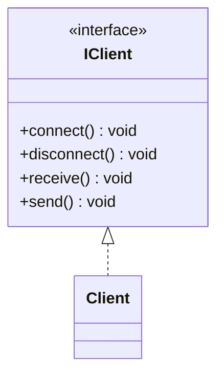

图 b：

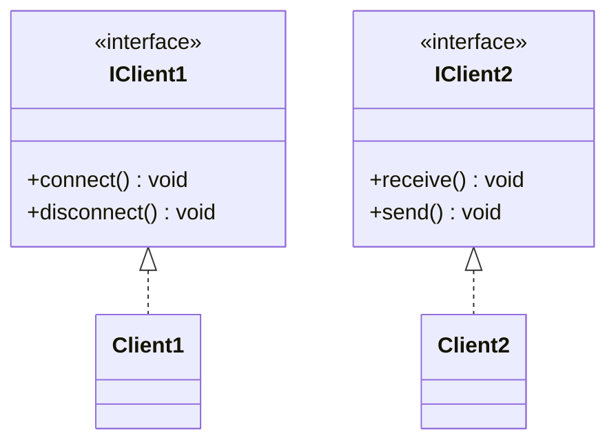

答案：图 a 违反**单一职责原则**。IClient 同时承担两类职责：连接管理（connect、disconnect）和数据传输（receive、send），连接方式变了或者传输协议变了，都会导致这个接口和实现类跟着改。图 b 把接口一分为二，两个接口各管一件事，各自变化互不影响。

从使用者角度也可以补一句接口隔离原则：只需要收发数据的客户不必依赖连接管理方法。

（更正：原图 b 两个实现类都标成了 Client2，按图意应为 Client1 和 Client2。）

### 2. 用户管理模块接口（文件B p80-81，作业 8 第 1 题）

题目：小王为某管理信息系统的用户管理模块设计了如下接口。(1) 从面向对象设计原则的角度详细分析设计存在什么问题；(2) 重新设计，使其符合设计原则，说明设计思想并画出 UML 类图。

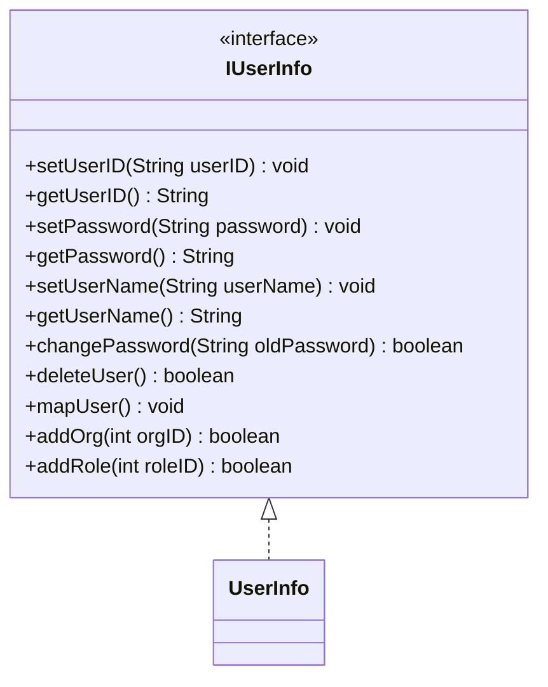

问题：
- 违反**单一职责原则**：接口里混着两类职责，前 6 个方法是用户的属性（业务对象，BO），后 5 个是用户管理的业务逻辑（Biz）。属性结构变了和业务规则变了都要改这一个接口。
- 违反**接口隔离原则**：只想读写用户信息的客户（例如界面显示）也被迫依赖删除用户、分配角色这些用不到的方法，接口太"胖"。

重构思想：按职责把接口拆成 IUserBO（负责用户属性）和 IUserBiz（负责用户行为），每个接口只服务一类使用者。原稿给了两种方案，都可以：

方案一：拆开后再由一个总接口继承两者，实现类仍是一个 UserInfo。需要全部功能的客户用 IUserInfo，只需要一部分的客户用小接口。

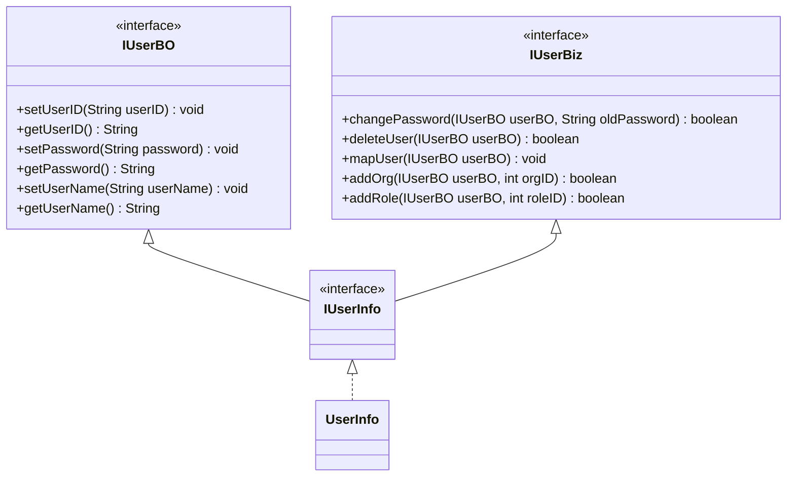

方案二：两个接口分别由两个类实现，业务类通过参数使用业务对象。

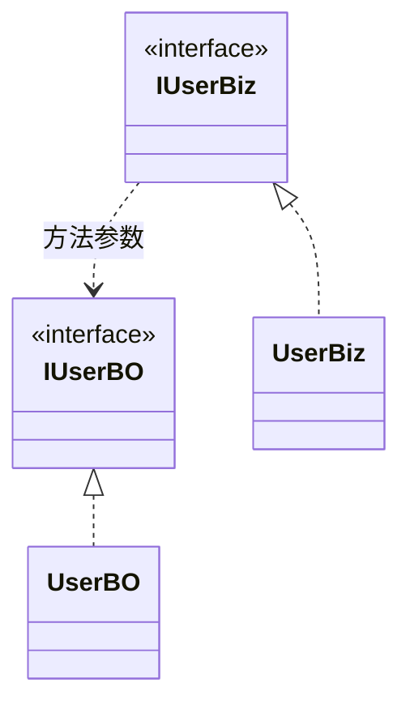

方案二拆得更彻底，属性类和业务类可以分别复用和修改。

### 3. 员工类重构（设计模式补充 分析题 2）

题目：某公司财务系统的 Employee 类包含员工编号、姓名、年龄、性别、薪水、每月工作时数、每月请假天数等属性。员工分全职和兼职两类，每月工作时数只对兼职员工有意义，每月请假天数只对全职员工有意义。全职员工按工作日数算工资，兼职员工按工作时数算工资，所以类里有 `calculateSalaryByDays()` 和 `calculateSalaryByHours()` 两个方法，另有 `displaySalary()`。分析 Employee 类存在的问题并重构，绘制重构后的类图。

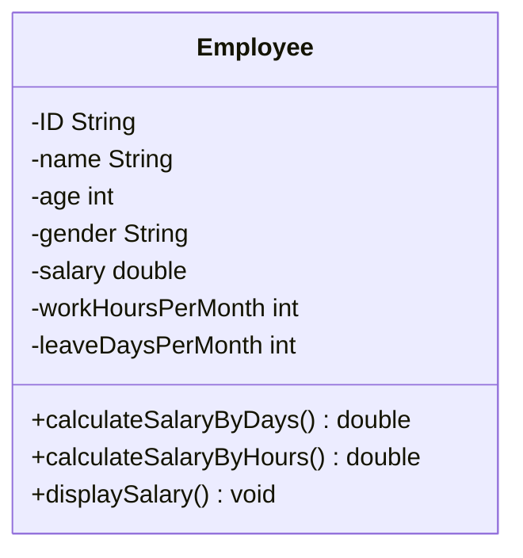

问题：
- 违反**单一职责原则**：一个类同时装着两类员工的数据和两套工资算法。全职员工的计薪规则变了、兼职员工的规则变了，都要改这个类；而且每个对象总有一个属性、一个方法是用不上的。
- 扩展性差，不符合**开闭原则**：再增加一类员工（例如实习生按月固定补贴），还得往 Employee 里加属性和方法；调用方也要先判断员工类型再决定调哪个计算方法。

重构：把公共属性和 `displaySalary()` 留在抽象父类，两类员工各自的属性和计薪算法下放到子类，计薪方法统一成父类声明的抽象方法。

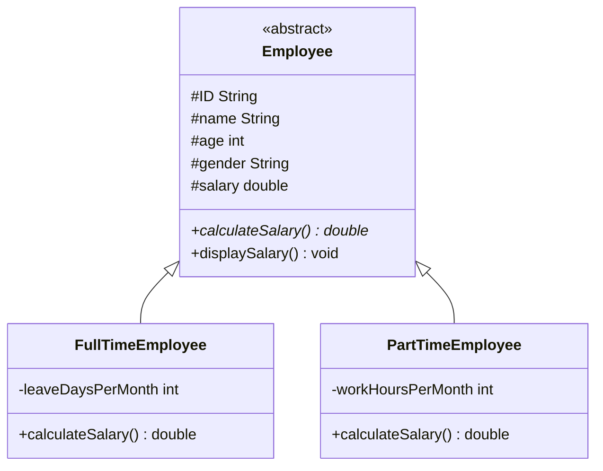

原稿的解析只写了"违反了单一职责原则"，重构图里两个子类的方法仍分别叫 `calculateSalaryByDays()` 和 `calculateSalaryByHours()`。这样拆开虽然职责分清了，客户端却不能用父类引用统一调用，还是要判断类型；改成父类的抽象方法 `calculateSalary()` 后，新增员工类型只加子类，调用方不用改。

### 4. 画笔类爆炸（文件B p4-5；刘伟教材第 2 章习题）

题目：某绘图软件提供大、中、小多种画笔，每种画笔可以指定不同颜色。设计人员的初始类图是 Pen 下派生 SmallPen、MiddlePen、LargePen，每种大小再派生 BlackXxxPen、RedXxxPen。增加一种颜色要给每种大小都加一个子类，类的个数急剧增加。试根据依赖倒转原则和合成复用原则重构，使增加新大小的笔和新颜色都比较方便。

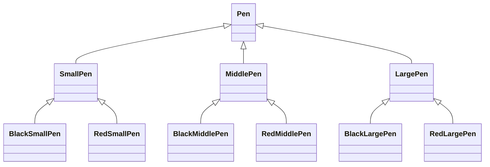

问题：大小和颜色是两个独立变化的维度，却用继承绑在一棵树上，类的数量是"大小数 × 颜色数"。加一种绿色要加 3 个类，加一种特大号要加 2 个类。

重构：
- 大小和颜色各做一个继承结构；
- 根据**合成复用原则**，画笔不再通过继承获得颜色，而是持有一个颜色对象；
- 根据**依赖倒转原则**，Pen 关联的是抽象的 Color，不是某个具体颜色，具体颜色在运行时注入。

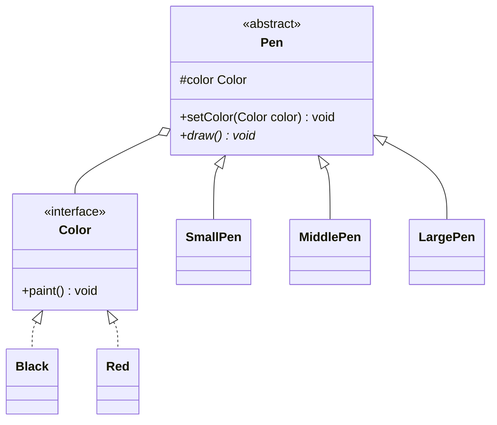

类的数量变成"大小数 + 颜色数"，新增一种大小或颜色都只加一个类，客户端针对 Pen 和 Color 编程，符合开闭原则。这个重构方案就是**桥接模式**，模式细节见 [03 结构型模式](<03 结构型模式.md>)。

### 5. 从键盘读字符输出到打印机（文件B p81-82，作业 8 第 2 题）

题目：客户请小王编写从键盘读入字符并输出到打印机的程序，小王用结构化方法写了下面的代码，Copy 从 ReadKeyboard 取字符再交给 WritePrinter。几个月后客户希望 Copy 有时从纸带读入机读字符，将来还可能换其他输入设备和输出设备，小王希望不用每次都改写 Copy。(1) 从设计原则角度分析原设计的问题；(2) 重新设计 Copy，添加必要的类，说明思想并给出代码。

```cpp
void Copy() {
    int c;
    while ((c = ReadKeyboard()) != EOF)   // EOF 为宏定义的终结字符
        WritePrinter(c);
}
```

问题：高层模块 Copy 直接依赖低层模块 ReadKeyboard 和 WritePrinter，违反**依赖倒转原则**。换一种输入或输出设备就得改 Copy 的代码，也不符合开闭原则。

重构思想：在高层和低层之间加一层抽象。Copy 只依赖抽象的 Reader 和 Writer；键盘、纸带机、打印机等低层模块分别实现这两个抽象。新增设备时加一个实现类，Copy 不动。

```cpp
class Reader {
public:
    virtual ~Reader() { }
    virtual int read() = 0;
};

class KeyboardReader : public Reader {
public:
    int read() override { return ReadKeyboard(); }
};

class Writer {
public:
    virtual ~Writer() { }
    virtual int write(int ch) = 0;
};

class PrinterWriter : public Writer {
public:
    int write(int ch) override { return WritePrinter(ch); }
};

KeyboardReader DefaultReader;
PrinterWriter DefaultWriter;

// 默认参数保证原来的调用方式 Copy() 仍然可用
void Copy(Reader& reader = DefaultReader, Writer& writer = DefaultWriter) {
    int c;
    while ((c = reader.read()) != EOF)
        writer.write(c);
}
```

从纸带机读入时，写一个 `class TapeReader : public Reader`，调用 `Copy(tapeReader)` 即可。

（更正：原稿题面和答案里的 `while` 条件都多了一个右括号，写作 `!= EOF))`；Writer 和 PrintWriter 两个类定义的右花括号后缺分号。原稿派生类名 PrintWriter，这里改叫 PrinterWriter，避免和 Java 里的同名类混淆。）

### 6. 组件之间的复杂引用（设计模式补充 分析题 3，迪米特法则）

题目：某图形界面中组件类之间有复杂的相互引用关系（原稿省略了代码），增加一个新组件类就必须修改与之交互的其他组件类。(1) 绘制代码对应的类图；(2) 根据迪米特法则重构，降低组件之间的耦合度，绘制重构后的类图。

(1) 原稿给出的类图：按钮、列表框、组合框、文本框、标签五个组件互相持有引用，关系呈网状。

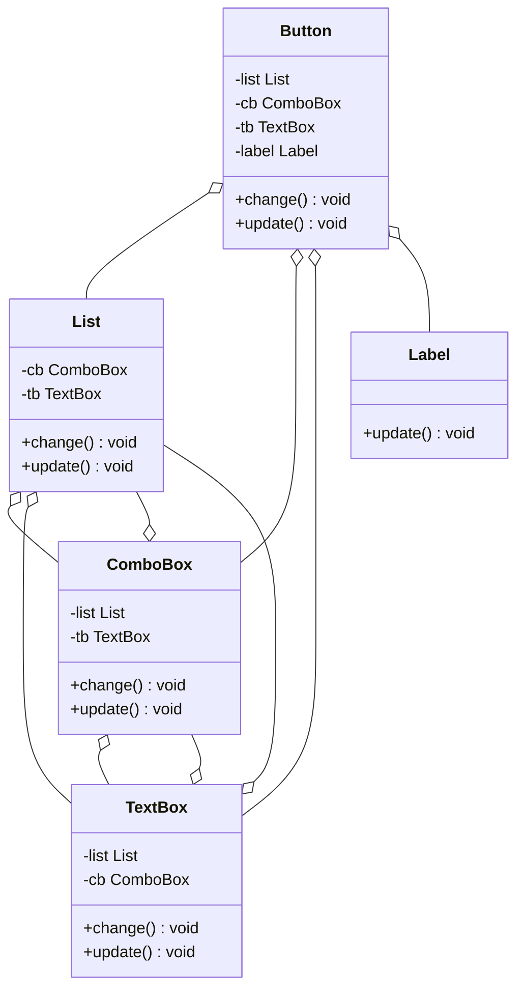

(2) 迪米特法则要求一个对象只和直接的朋友通信，尽量少和其他对象发生相互作用。引入一个中间对象，组件之间不再直接引用，每个组件只认识它；组件状态变化时通知中间对象，由它去更新其他相关组件。这正是**中介者模式**。

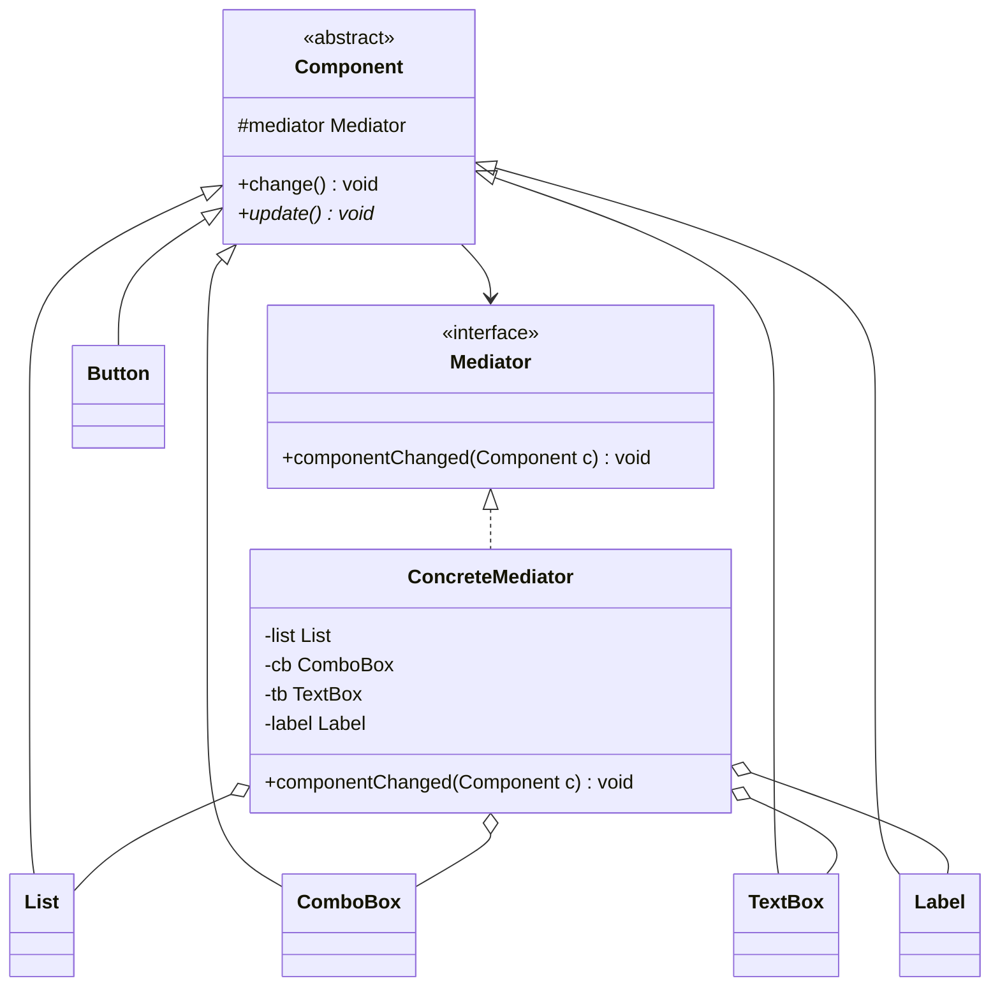

关键代码：

```java
public abstract class Component {
    protected Mediator mediator;
    public void setMediator(Mediator mediator) { this.mediator = mediator; }
    public void change() { mediator.componentChanged(this); }   // 只通知中介者
    public abstract void update();
}

public class ConcreteMediator implements Mediator {
    private Button button;
    private List list;
    private ComboBox cb;
    private TextBox tb;
    private Label label;
    // 省略各组件的 setter

    public void componentChanged(Component c) {
        if (c == button) {            // 点按钮：刷新其余四个组件
            list.update();
            cb.update();
            tb.update();
            label.update();
        } else if (c == list) {       // 选列表项：刷新组合框和文本框
            cb.update();
            tb.update();
        }
        // 其余组件的联动规则同理
    }
}
```

增加新组件时只改中介者，其他组件类不用动。这里的 `List` 是自定义的列表框组件类，不是 `java.util.List`。原稿重构图里的具体中介者叫 Changes、抽象同事类叫 Colleague，意思相同。

### 7. 矢量图模板重构（设计模式补充 分析题 4）

题目：某图形库 API 提供多种矢量图模板，初始设计中客户类 Client 直接依赖 Circle、Triangle、Rectangle 等图形类，每个图形类有 `init()`、`setColor()`、`fill()`、`setSize()`、`display()` 方法。用户发现：(1) 每次只用一种图形，换图形要改客户类代码；(2) 增加新图形要改客户类代码；(3) 客户类使用图形前要自己创建对象，有些图形创建过程复杂，客户代码冗长。重构要求：(1) 隔离图形的创建和使用，创建过程封装在专门的类中，客户类不用直接创建图形对象，甚至不需要知道具体图形类名；(2) 客户类能方便地更换图形或使用新增图形，不针对具体图形类编程，符合开闭原则。绘制重构后的类图。

原稿只有题目，解析是空的，下面是整理时补的答案。

分析：问题 (1)(2) 是客户类针对具体类编程，违反依赖倒转原则和开闭原则；问题 (3) 是创建和使用没分开，客户类职责过重，违反单一职责原则。

重构：
- 抽出抽象图形 Shape，客户类只针对 Shape 编程；
- 用工厂类 ShapeFactory 负责创建图形，复杂的初始化（调用 `init()` 等）也放进工厂；
- 具体图形类名写在配置文件里，工厂用反射创建对象。更换图形或加新图形时只加类、改配置文件，客户类和工厂类都不用改。

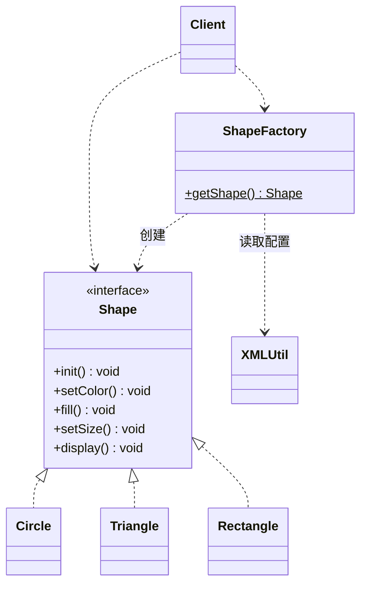

```java
public class ShapeFactory {
    public static Shape getShape() throws Exception {
        String className = XMLUtil.getClassName();   // 从 config.xml 读出类名，如 "Circle"
        Shape shape = (Shape) Class.forName(className)
                .getDeclaredConstructor().newInstance();
        shape.init();                                // 复杂的初始化封装在工厂里
        return shape;
    }
}

public class Client {
    public static void main(String[] args) throws Exception {
        Shape shape = ShapeFactory.getShape();       // 不出现具体图形类名
        shape.setSize();
        shape.display();
    }
}
```

`XMLUtil` 是读取配置文件的工具类，省略实现。如果不用反射，工厂方法里写 if/else 按参数创建，就是普通的简单工厂，此时加新图形要改工厂类，不完全符合要求 (2)。也可以用工厂方法模式，每种图形配一个具体工厂。三种工厂的区别见 [02 创建型模式](<02 创建型模式.md>)。

### 8. 重写函数 f，去掉条件判断（文件B p88-89，作业 8 第 5 题）

题目：把下面程序交给用户试用时，用户对函数 f 提出新要求：condition 为 100 时，依次执行 b 的 `g1()` 和 `g2()`。以后可能还要增加其他条件值的处理，但数量不会多。小王希望既满足要求，又不用每次都改写 f 的代码。重新设计，说明思想并给出代码。

```cpp
class B {
public:
    B(int n) : data(n) { }
    int Data() const { return data; }
    void g1();
    void g2();
    void g3();
private:
    const int data;
};

void f(B& b) {
    int condition = b.Data();
    if (condition == 1) { b.g1(); }
    else if (condition == 5) { b.g2(); }
    else if (condition == 9) { b.g3(); }
}
```

问题：f 根据数据值选择行为，每增加一种条件值就要在 f 里加一个分支，违反开闭原则；"条件值"和"要执行的操作"的对应关系被硬编码在 f 里。

重构思想：用多态代替条件分支。B 声明纯虚函数 `g()`，每种条件值对应 B 的一个子类，子类在 `g()` 里决定调用哪些 `g1/g2/g3`。f 只调用 `b.g()`，新增条件值时加一个子类，f 不变。

```cpp
class B {
public:
    explicit B(int n) : data(n) { }
    virtual ~B() { }
    int Data() const { return data; }
    void g1() { cout << "g1 "; }
    void g2() { cout << "g2 "; }
    void g3() { cout << "g3 "; }
    virtual void g() = 0;           // 每种条件值的处理方式由子类决定
private:
    const int data;
};

class B1   : public B { public: B1()   : B(1)   { } void g() override { g1(); } };
class B5   : public B { public: B5()   : B(5)   { } void g() override { g2(); } };
class B9   : public B { public: B9()   : B(9)   { } void g() override { g3(); } };
class B100 : public B { public: B100() : B(100) { } void g() override { g1(); g2(); } };

void f(B& b) { b.g(); }             // 以后加条件值也不用改
```

依次调用 `f(b1)`、`f(b5)`、`f(b9)`、`f(b100)` 输出 `g1 g2 g3 g1 g2`。

判断的位置并没有消失，而是挪到了"创建哪个子类对象"的地方，可以再配合工厂把它集中管理。原稿解析说的"g1、g2、g3 耦合性太高"不够准确，真正的问题是 f 和条件值之间的耦合。

### 9. 画图小程序：方法名不一致（2018 年作业 4；设计模式补充 分析题 1）

题目：画图小程序里已经实现了点、直线、方块，并用抽象类 Shape 规范了接口 `Draw()`。现在要实现圆，发现系统别处已有绘制圆的类 XCircle，但它的方法叫 `DrawIt()`。方案一：把 XCircle 的 `DrawIt` 改名为 `Draw`，是否合适？方案二：把 Shape 的 `Draw` 改名为 `DrawIt`，是否合适？方案三：给出其他解决方法。

答案：
- 方案一不合适。系统里其他地方可能已经在用 XCircle 的 `DrawIt()`，改名会导致那些代码不能运行，要把所有使用 XCircle 的程序都改一遍；XCircle 若是第三方库，也可能根本没有源码。
- 方案二不合适。改抽象类的方法名，所有图形子类和所有调用 `Draw()` 的地方都得跟着改，违反开闭原则。
- 方案三：用**适配器模式**。新建 Circle 继承 Shape，内部持有 XCircle 对象，在 `Draw()` 里转调 `DrawIt()`，两边原有代码都不动。

```cpp
class Circle : public Shape {         // 适配器
public:
    explicit Circle(XCircle* ptr) : xc(ptr) { }
    void Draw() override { xc->DrawIt(); }
private:
    XCircle* xc;                      // 适配者
};
```

这是对象适配器；也可以让 Circle 同时公有继承 Shape 和 XCircle，写成类适配器。

（更正：原答案代码写的是 `Triangle` 和 `XTriangle`，和题面的圆 XCircle 对不上，这里按题意改成 Circle 和 XCircle。）

## 二、2018 年作业 1：面向对象类设计

这两题不考具体模式，考的是继承、多态、抽象类的基本功，和文件B 作业 8 的第 3、4 题是同一批题。

### 10. 开宝箱游戏

题目：游戏中有多种类型的人物（Role），如战士、魔法师等，主角类型只能选一种且游戏中不再更改。游戏中还有各种宝箱（Box），如装有不同数目金钱的宝箱、装有毒物的宝箱等。任一种主角打开金钱宝箱时，宝箱中的金钱加给主角，宝箱金钱变成 0；战士打开毒物宝箱时生命值（HP）减少 10%，金钱（Money）增加 20%；魔法师打开毒物宝箱时生命值减少 30%，金钱增加 40%。给出类的设计并完整实现，要求增加新角色类型和箱子种类时不需要修改已有设计和实现。

思路：
- 角色和宝箱是两个独立的继承体系：抽象类 Role 派生 Soldier、Mage；抽象类 Box 派生 MoneyBox、PoisonBox。
- "打开宝箱"的效果同时取决于箱子类型和角色类型，用两次虚函数调用（双重分派）解决：`role.Open(box)` 调 `box.BeOpened(role)`，第一次按箱子类型分派；毒物箱再调 `role.PoisonHurt()`，第二次按角色类型分派。
- 金钱箱对所有角色效果相同，直接在 MoneyBox 里改角色的钱。

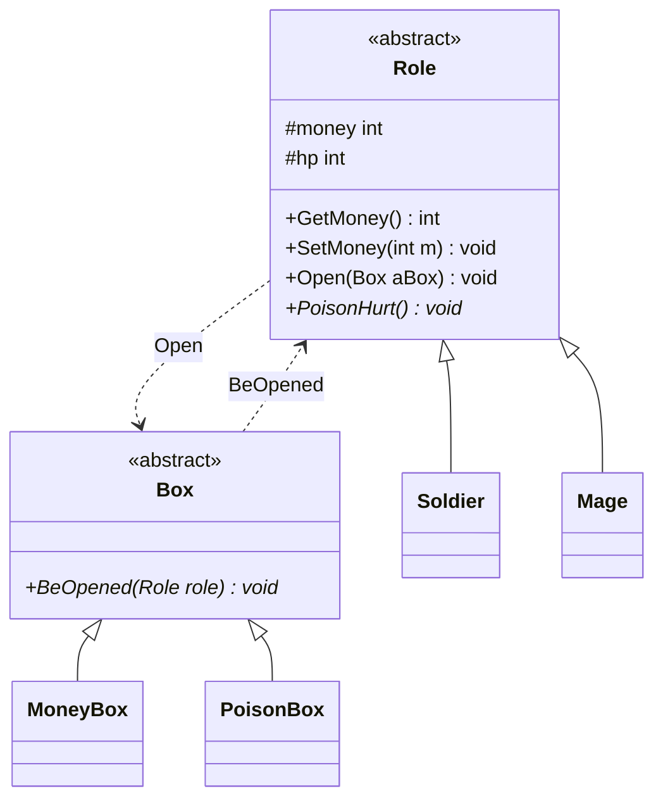

```cpp
class Box;                                // 前向声明

class Role {
public:
    Role(int theMoney, int theHP) : money(theMoney), hp(theHP) { }
    virtual ~Role() { }
    int GetMoney() const { return money; }
    void SetMoney(int m) { money = m; }
    void Open(Box& aBox);                 // 此处只能声明，Box 定义完整后再实现
    virtual void PoisonHurt() = 0;
protected:
    int money;
    int hp;
};

class Soldier : public Role {
public:
    Soldier(int theMoney, int theHP) : Role(theMoney, theHP) { }
    void PoisonHurt() override {
        hp = static_cast<int>(hp * 0.9);
        money = static_cast<int>(money * 1.2);
    }
};

class Mage : public Role {
public:
    Mage(int theMoney, int theHP) : Role(theMoney, theHP) { }
    void PoisonHurt() override {
        hp = static_cast<int>(hp * 0.7);
        money = static_cast<int>(money * 1.4);
    }
};

class Box {
public:
    virtual ~Box() { }
    virtual void BeOpened(Role& role) = 0;
};

class MoneyBox : public Box {
public:
    explicit MoneyBox(int m) : boxMoney(m) { }
    void BeOpened(Role& role) override {
        role.SetMoney(role.GetMoney() + boxMoney);
        boxMoney = 0;
    }
private:
    int boxMoney;
};

class PoisonBox : public Box {
public:
    void BeOpened(Role& role) override { role.PoisonHurt(); }
};

void Role::Open(Box& aBox) { aBox.BeOpened(*this); }
```

验证：钱 100、HP 100 的战士打开 50 元金钱箱后钱为 150，再开同一个箱子钱不变；接着开毒物箱，HP 变 90、钱变 180。同样初值的魔法师开毒物箱后 HP 70、钱 140。

扩展性：
- 新增角色（如弓箭手）：派生 Role 并实现 `PoisonHurt()`，已有代码不改；
- 新增对所有角色效果相同的箱子（如回血箱）：派生 Box 即可；
- 新增"对不同角色效果不同"的箱子（如火焰箱）：要在 Role 里加 `FireHurt()` 并让所有角色实现，这时就要改已有类。这种"加元素类容易、加操作难"或反过来的取舍，和访问者模式的开闭原则倾斜性是一回事。

（更正：原答案把 `Open()` 的函数体直接写在 Role 类里，此时 Box 只有前向声明，是不完整类型，调用 `aBox.BeOpened()` 编译报错，应在 Box 定义之后再实现 `Role::Open`。原稿类名沿用题面的拼写 Solider，这里改为 Soldier；`hp *= 0.9` 对 int 隐式截断，这里写成显式转换。）

### 11. 盒子放水果

题目：有一个只能放进不能取出的盒子，最多放 8 个水果，不一定一天放入。水果只有苹果和桔子两种，放入前原始重量分别为 50 和 30。放入盒子后由于失水，苹果和桔子每天分别减轻 4 和 3，直到达到各自原始重量的 3/5 后不再减轻。盒子的功能有：输出盒子中苹果的数量；输出桔子的数量；输出一天来盒子中水果减轻的总重量；输出当前水果的总重量。给出类设计和代码。

思路：
- 抽象类 Fruit 保存当前重量、最低重量、每天减重量，减重规则写在父类里；Apple、Orange 只在构造时给出各自参数。
- 盒子保存最多 8 个水果指针，放入时克隆一份（原型模式的思路，盒子拥有自己的对象，调用者传入的水果不受影响），这样"只能放不能取"也好保证。
- "过一天"和"输出一天来减轻的重量"是两件事：过一天时让每个水果减重并记下总减重，输出时只读记录。

```cpp
class Fruit {
public:
    Fruit(int mMin, int mLose, int mW) : mMinWeight(mMin), mLoseWeight(mLose), mWeight(mW) { }
    virtual ~Fruit() { }
    virtual Fruit* Clone() const = 0;
    int ReduceWeight() {                        // 过一天，返回减轻的重量
        int newWeight = mWeight - mLoseWeight;
        if (newWeight < mMinWeight) newWeight = mMinWeight;
        int reduce = mWeight - newWeight;
        mWeight = newWeight;
        return reduce;
    }
    int Weight() const { return mWeight; }
protected:
    int mMinWeight;
    int mLoseWeight;
    int mWeight;
};

class Apple : public Fruit {
public:
    Apple() : Fruit(50 * 3 / 5, 4, 50) { }
    Apple* Clone() const override { return new Apple(*this); }
};

class Orange : public Fruit {
public:
    Orange() : Fruit(30 * 3 / 5, 3, 30) { }
    Orange* Clone() const override { return new Orange(*this); }
};

class FruitBox {
public:
    FruitBox() : count(0), lastLoss(0) { for (int i = 0; i < 8; i++) fruit[i] = nullptr; }
    ~FruitBox() { for (int i = 0; i < 8; i++) delete fruit[i]; }
    FruitBox(const FruitBox&) = delete;             // 盒子拥有水果，禁止拷贝
    FruitBox& operator=(const FruitBox&) = delete;

    bool AddFruit(const Fruit& one) {
        if (count >= 8) return false;
        fruit[count++] = one.Clone();
        return true;
    }
    int ApplesNum() const {
        int num = 0;
        for (int i = 0; i < count; i++)
            if (dynamic_cast<Apple*>(fruit[i])) ++num;
        return num;
    }
    int OrangesNum() const {
        int num = 0;
        for (int i = 0; i < count; i++)
            if (dynamic_cast<Orange*>(fruit[i])) ++num;
        return num;
    }
    void PassOneDay() {                             // 过一天
        lastLoss = 0;
        for (int i = 0; i < count; i++)
            lastLoss += fruit[i]->ReduceWeight();
    }
    int LastDayLoss() const { return lastLoss; }    // 一天来减轻的总重量
    int TotalWeight() const {
        int num = 0;
        for (int i = 0; i < count; i++)
            num += fruit[i]->Weight();
        return num;
    }
private:
    Fruit* fruit[8];
    int count;
    int lastLoss;
};
```

验证：第一天放一个苹果，总重 50；过一天后再放一个苹果，一天减重 4，总重 96；再过一天后放两个桔子，一天减重 8，总重 148；之后再过 10 天，苹果都停在 30、桔子停在 18，一天减重 0，总重 96。

（更正：2018 年答案文件里 Fruit 构造函数初始化列表把成员写成 `mWeigth`，编译不过；两份原答案的 `Show()` 都声明为 const，却在里面调用非 const 的 `PassOneDay()`，编译报错，而且每输出一次就让水果再减一次重，逻辑也不对，这里把"过一天"和"查询一天来的减重"分开。原稿的 `mMaxWeight` 成员没有用到，已删去。）

用 dynamic_cast 数苹果和桔子只适合水果种类固定的情况；题目明确只有两种水果，可以接受。种类多了可以给 Fruit 加一个返回种类名的虚函数，按名字统计。

## 三、2018 年课堂练习

### 练习 1

第 1 题：桌面快捷方式是（　）模式的应用实例。A. 代理　B. 组合　C. 装饰　D. 外观

答案：A。解析见 [10 选择题精编](<10 选择题精编.md>) 结构型第 20 题。

第 2 题：某人通过婚姻介绍所找对象，请问该过程蕴含了哪种设计模式，绘制相应的类图。

原稿无答案，整理补充：蕴含**代理模式**，和 [12 简答题精编](<12 简答题精编.md>) 结构型第 14 题"毕业生通过职业介绍所找工作"同理。婚姻介绍所代替真实的相亲对象和求偶者接触，先做登记、条件筛选，再安排见面。

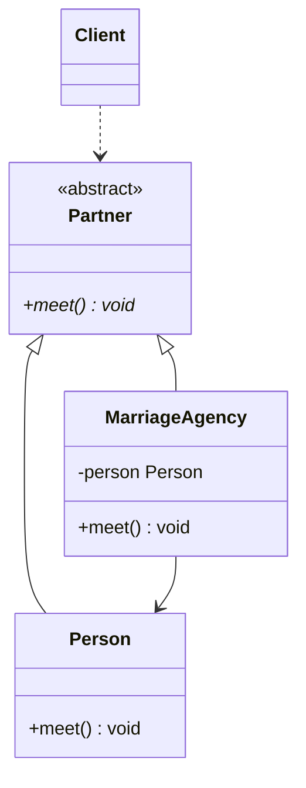

| 角色 | 类 |
| --- | --- |
| 抽象主题 | Partner |
| 真实主题 | Person（介绍的对象） |
| 代理主题 | MarriageAgency（婚姻介绍所），`meet()` 里先筛选登记，再调用 `person.meet()` |
| 客户 | Client（找对象的人） |

### 练习 2

"兄弟俩要到操场上玩，临走时，跟妈妈说：'我俩玩去了，饭好了，招呼我们'"。这段话描述的场景最适合哪种模式？A. 职责链　B. 中介者　C. 状态　D. 观察者

答案：D。解析见 [10 选择题精编](<10 选择题精编.md>) 行为型第 12 题。
