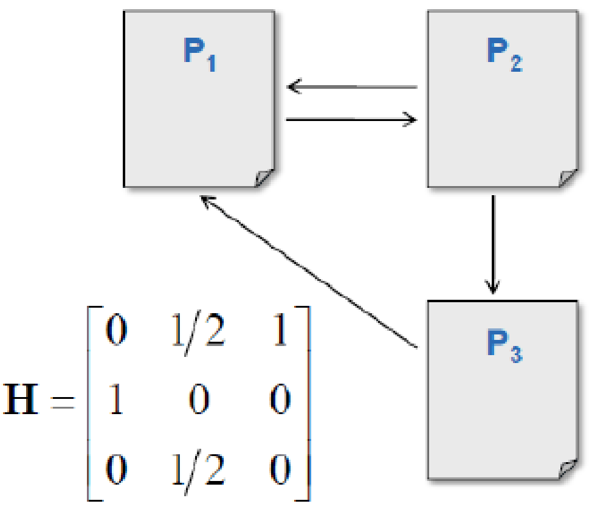

# 11 典型计算与数值复核

把 `分布式存储笔记.pdf` 里出现过的数字结论集中在一处，每条给出算式和复算结果。复算脚本是 `D:/project/study_remake/sources_docs/大三下_分布式存储_by陈广广/dstore_calc.py`，结论已逐条核对。

这门课的计算题形式很固定，基本就是"给容量和单条元数据大小，问能支持多少数据"以及"给带宽和数据量，问要多久"。做题前把下面几条过一遍就够用了。

## 单位约定

课件里的 KB、MB、GB、TB、PB 按二进制算，也就是 $1\text{KB} = 1024\text{B}$、 $1\text{MB} = 1024\text{KB}$，依此类推。只有一处例外（同构系统补副本的 50000 秒）是按十进制算的，下面第 4 条会说明。

## 结论速查

| 场景 | 算式 | 结果 |
| --- | --- | --- |
| Bitcask 容量（value 1KB） | $32\text{GB} \times 32$ | 1TB |
| Bitcask 容量（value 4KB） | $32\text{GB} / 32 \times 4\text{KB}$ | 4TB |
| GFS Master 元数据内存 | $(1\text{PB} / 64\text{MB}) \times 3 \times 64\text{B}$ | 3GB |
| GFS 流水线传输时间 | $B/T + RL$ | 千兆网 1MB 到 3 副本约 11ms |
| 同构系统补一个副本 | $1\text{TB} / 20\text{MB/s}$ | 约 50000s，十几个小时 |
| HDFS 块大小 | 寻址时间 / 1% × 磁盘速度 | 100MB/s 对 128MB，500MB/s 对 512MB |
| 延迟调度非本地概率 | $(1 - p_j)^D$ | $p=0.1$ 时 $D=10$ 得 0.35， $D=40$ 得 0.015 |
| Bigtable 一级元数据 | $128\text{MB} \times (128\text{MB}/1\text{KB})$ | 16TB |
| Bigtable 两级元数据 | $16\text{TB} \times (128\text{MB}/1\text{KB})$ | 2048PB |
| 分层元数据的 DFS | 100 个元数据节点 × 1 亿文件 | 100 亿文件 |
| MPI 发送操作种数 | 4 种通信模式 × 2 种阻塞属性 | 8 种 |

## 1. Bitcask 的容量计算（04 第 3.2 节）

Bitcask 把索引放内存、数据放磁盘，所以能存多少数据由内存大小和单条索引大小决定。每条索引固定 32 字节（文件编号、value 位置、value 长度）。

**第一组（课件第 46 页）**：value 平均长度 1KB，每条索引 32 字节。

磁盘内存比 $= \dfrac{1\text{KB}}{32\text{B}} = 32$，所以 32GB 内存能索引的数据量为

$$32\text{GB} \times 32 = 1024\text{GB} = 1\text{TB}$$

**第二组（课件第 47 页）**：value 长度 4KB。

$$\frac{32\text{GB}}{32\text{B}} \times 4\text{KB} = 2^{30}\ \text{条} \times 4\text{KB} = 4\text{TB}$$

两组都复核无误。注意两种写法的思路不同：第一组是"内存量乘以磁盘内存比"，第二组是"索引条数乘以单条 value 大小"。考试时推荐第二种，先算条数 $\dfrac{\text{内存}}{32\text{B}}$，再乘 value 大小，不容易把比例算反。

顺手可以自己出一道：如果内存换成 64GB、value 为 2KB，答案是 $\dfrac{64\text{GB}}{32\text{B}} \times 2\text{KB} = 4\text{TB}$。

## 2. GFS Master 的元数据内存（07 第 4.5 节）

课件在"减小主节点负载"和"管理元数据"两处都写了同一个式子 `(1PB/64MB)*3*64B=3GB`。拆开读：

- $1\text{PB} / 64\text{MB} = 2^{50} / 2^{26} = 2^{24} = 16777216$，即 1PB 数据按 64MB 切出约 1678 万个 chunk。
- 每个 chunk 三副本，Master 要为每个副本记一条位置信息。
- 每条元数据 64 字节。

$$16777216 \times 3 \times 64\text{B} = 3221225472\text{B} = 3\text{GB}$$

复算无误。这条题的常见变形是问"把 chunk 从 64MB 改成 128MB，元数据要多少内存"，答案是减半，1.5GB。这也正是 GFS 把 chunk 设那么大的理由之一（另外两条理由见 07 的 Q1）。

## 3. GFS 追加的流水线时间（07 第 4.5 节）

抛开网络阻塞，传输 $B$ 个字节到 $R$ 个副本的理想时间是

$$\frac{B}{T} + RL$$

其中 $T$ 是网络吞吐量， $L$ 是节点之间的延时。

课件的说法是"采用千兆网络， $L$ 通常小于 1ms，传输 1MB 数据到多个副本的时间小于 80ms"。按千兆网复算：

- $T = 1000\ \text{Mbps} / 8 = 125\ \text{MB/s}$
- $B/T = 1\text{MB} / 125\text{MB/s} = 8\ \text{ms}$
- $RL = 3 \times 1\text{ms} = 3\ \text{ms}$
- 合计约 11ms

80ms 对应的是百兆网： $1\text{MB} / 12.5\text{MB/s} = 80\ \text{ms}$，这正是 GFS 原论文里的网络条件。课件说"小于 80ms"不算错，但千兆网下更准确的答案是约 11ms。答题时把式子和两种带宽下的结果都写上最稳妥。

## 4. 同构系统补一个副本要多久（06 第 3.9 节）

每个存储节点服务 1TB 数据，内部传输带宽 20MB/s：

$$\frac{1\text{TB}}{20\text{MB/s}}$$

两种单位读法的结果不同：

- 按十进制 $1\text{TB} = 10^{12}\text{B}$、 $20\text{MB/s} = 2 \times 10^7\text{B/s}$：正好 $50000\ \text{s} = 13.9\ \text{小时}$。课件写的 50000 秒就是这么来的。
- 按二进制 $1\text{TB} = 2^{40}\text{B}$、 $20\text{MB/s} = 20 \times 2^{20}\text{B/s}$： $52428.8\ \text{s} = 14.6\ \text{小时}$。

两者都落在"十几个小时"这个量级，课件的结论成立。写答案时用十进制凑出 50000 秒这个整数最省事。

这条数字的意义在于说明同构系统为什么不能自动化：补一个副本要十几个小时，这期间再坏一台机器的概率不可忽略，所以必须换成异构系统，让整个集群一起参与恢复。

## 5. HDFS 的块大小（08 第 4.4 节）

**最佳传输损耗理论**：一次传输中，寻址时间占总传输时间的 1% 为佳。

以 10ms 寻址时间为例：

$$\text{传输时间} = \frac{10\text{ms}}{1\%} = 1000\text{ms} = 1\ \text{秒}$$

于是块大小就等于"磁盘 1 秒能传的数据量"：

| 磁盘速度 | 1 秒传输量 | 取的块大小 |
| --- | --- | --- |
| 100MB/s | 100MB | 128MB |
| 500MB/s | 500MB | 512MB |

复算无误。取 128MB 而不是 100MB、取 512MB 而不是 500MB，是因为块大小按 2 的幂取更便于计算偏移。这条能解释为什么 HDFS 的默认块从早期的 64MB 涨到了 128MB：磁盘顺序速度上去了。

## 6. 延迟调度的跳过次数（08 第 4.5 节）

设集群有 $M$ 个节点，job $j$ 有可用数据的节点集合为 $P_j$，可用节点比例 $p_j = |P_j| / M$。某任务连续跳过 $D$ 次都没能本地化启动的概率是

$$(1 - p_j)^D$$

本地化启动的概率就是 $1 - (1-p_j)^D$。取 $p_j = 0.1$：

| $D$ | $(1-p_j)^D$ | 本地化概率 |
| --- | --- | --- |
| 10 | 0.3487 | 65% |
| 40 | 0.0148 | 98.5%，课件记作 99% |

（更正：原文第二行写作 $(1-p_j)^D \approx 0.99$。按公式算 $(1-0.1)^{40} \approx 0.0148$，99% 指的是本地化概率而不是 $(1-p_j)^D$ 本身，原文把等式左边写错了。第一行 $(1-0.1)^{10} \approx 0.3487$ 是对的，对应本地化概率 65%。）

要点是"非本地性随 $D$ 指数下降"，所以只要允许跳过几十次，即使作业只在 10% 的节点上有数据，也几乎总能拿到本地任务。

第二个式子是反过来求 $D$：

$$D \ge -\frac{M}{R}\ln\left(\frac{(1-\lambda)N}{1 + (1-\lambda)N}\right)$$

其中 $\lambda$ 是目标本地性程度， $N$ 是一个 job 的 tasks 数量， $M$ 是集群节点数量， $R$ 是复制因子。课件没有给出具体数值代入，这里也不编造。定性结论： $\lambda$ 越接近 1 需要的 $D$ 越大， $R$ 越大需要的 $D$ 越小， $M$ 越大需要的 $D$ 越大。

## 7. Bigtable 两级元数据的容量（10 第 6.3 节）

假设平均一个子表 128MB、每个子表的元信息 1KB。

一个元数据子表本身也是 128MB，能装的元信息条数为

$$\frac{128\text{MB}}{1\text{KB}} = 131072$$

所以一级元数据支持的数据量为

$$128\text{MB} \times 131072 = 16777216\text{MB} = 16\text{TB}$$

再套一层，根表的每条记录指向一个能覆盖 16TB 的元数据子表：

$$16\text{TB} \times 131072 = 2097152\text{TB} = 2048\text{PB}$$

复算无误。变形题：子表若为 200MB、元信息仍为 1KB，一级为 $200\text{MB} \times 204800 = 40\text{TB}$，两级为 $40\text{TB} \times 204800 = 8000\text{PB}$。记住套路是"单层倍率等于子表大小除以单条元信息大小"。

## 8. PageRank 的三页面例子（08 第 4.3 节）

课件的图如下，P1 和 P2 互相链接，P2 还链向 P3，P3 链向 P1：

出链数 $L_1 = 1$、 $L_2 = 2$、 $L_3 = 1$，转移矩阵

$$H = \begin{bmatrix} 0 & 1/2 & 1 \\ 1 & 0 & 0 \\ 0 & 1/2 & 0 \end{bmatrix}$$

**简化模型** $R = HR$ 的解：设 $R_1 = a$，由 $R_2 = R_1$ 得 $R_2 = a$，由 $R_3 = R_2/2$ 得 $R_3 = a/2$，回代第一行 $R_1 = R_2/2 + R_3 = a/2 + a/2 = a$ 自洽。归一化 $2.5a = 1$ 得

$$R = (0.4,\ 0.4,\ 0.2)$$

迭代 200 轮的数值解同样收敛到 $(0.4, 0.4, 0.2)$。

**随机浏览模型**（ $d = 0.85$， $N = 3$，用 $PR(p_i) = \dfrac{1-d}{N} + d\sum \dfrac{PR(p_j)}{L(p_j)}$ 这个归一化版本）迭代 500 轮的结果是

$$R \approx (0.3974,\ 0.3878,\ 0.2148)$$

三者之和为 1。名次与简化模型一致，仍是 P1 最高、P3 最低，阻尼因子只是把分布拉平了一点。

**两个公式版本的关系**：课件同时给了

$$PR(p_i) = \frac{1-d}{N} + d\sum_{p_j \in M(p_i)} \frac{PR(p_j)}{L(p_j)} \qquad\text{和}\qquad PR(u) = 1 - d + d\sum_{v \in B_u} \frac{PR(v)}{L(v)}$$

前者所有 PR 值之和为 1（概率解释），后者是 Brin 和 Page 原论文的写法，所有 PR 值之和为 $N$，相当于把前者整体乘了 $N$。排出来的名次完全一样，考试写哪个都行，但同一道题里不要混用。

## 9. 分层元数据的文件数（06 第 3.9 节）

假设 DFS 中有 100 个元数据节点，每个元数据节点服务 1 亿个文件：

$$100 \times 10^8 = 10^{10}$$

系统总共可以服务 100 亿个文件。这条说明的是"两级元数据把总控节点的内存瓶颈挪走了"，和第 7 条 Bigtable 的两级元数据是同一个思路。

## 10. 几条不用算但要记住的数字

| 出处 | 数字 |
| --- | --- |
| GFS chunk 与 block | chunk 64MB，block 64KB，每个 block 一个 32 位校验和 |
| GFS 副本数与租约 | 默认 3 副本，租约有效期比如 60 秒，垃圾回收 3 天失效时间 |
| GFS 与 HDFS 规模 | GFS 支持 8K 节点，HDFS 支持 3K 节点 |
| HDFS 块 | 早期 64MB，后续 128MB、256MB、512MB |
| Bigtable 子表 | 每个 100 到 200MB，每台服务器 10 到 1000 个 |
| Bigtable 行主键 | 最大不超过 64KB |
| Chubby 部署 | 两地三数据中心五副本，至少 5 台构成一个 Cell，需一半以上存活 |
| Dynamo 对象大小 | 一般小于 1MB；记录容量上限 400K（UTF-8） |
| Dynamo SLA | 99.9% 的情况下 300ms 内响应，最大并发每秒 500 个请求 |
| Dynamo NWR | 常用 $N=3$、 $W=2$、 $R=2$；向量时钟条目上限比如 10 个；Gossip 间隔 1s；后台资源监控窗口 60 秒 |
| 成组提交 | 缓冲区超过 512KB 或距上次刷盘超过 10ms |
| InnoDB LRU | 新子链表 5/8、老子链表 3/8，页面在老子链表停留超过 1 秒才可能升级 |
| 互联网读写比 | 6:1 甚至 10:1 |
| 负载均衡节奏 | 新机器加入到负载均衡需要 30 分钟到 1 个小时 |
| 故障判定 | 节点下线后等待约 1 小时才判定为永久性故障 |
| 子表数量上限 | 单个服务节点能服务 4000 到 10000 个子表 |
| ZooKeeper | 每个 Znode 默认存储 1MB 数据，节点总数为奇数，半数以上存活即可用 |
| MPI | 6 个基本函数，4 种通信模式，8 种发送操作，2 种接收操作，5 种群集通信函数 |

## 11. 几条能自己验证的小推理

**为什么 ZooKeeper 和 Chubby 都要奇数台**：容错能力由 $\lfloor (n-1)/2 \rfloor$ 决定。5 台和 6 台都只能容忍 2 台故障，6 台白多一台机器还多一份通信开销。所以在同样的容错能力下，奇数台最省。

**为什么 $W + R > N$ 能读到最新数据**：写成功意味着至少 $W$ 个副本有新值，读会访问 $R$ 个副本。两个集合都取自同一个 $N$ 元集合，大小之和超过 $N$ 时按抽屉原理必有交集，所以读到的 $R$ 份里至少有一份是最新的。 $N=3, W=2, R=2$ 时 $2+2=4>3$ 成立； $W=1, R=1, N=3$ 时 $1+1=2 \le 3$ 不成立，所以课件标它"可损失一些更新"。

**Paxos 需要 $2F+1$ 个节点**：要容忍 $F$ 个节点故障并且仍能凑出多数派，总数 $n$ 必须满足 $n - F > n/2$，解得 $n > 2F$，取整就是 $n \ge 2F+1$。

**Merkle 树定位一处差异的代价**： $n$ 个文件对应 $n$ 个叶子，树高 $\log_2 n$。从根往下比，每层只沿哈希不同的那条分支下探，所以比较次数是 $O(\log n)$，传输的是树节点的哈希值而不是文件本身。这就是它"传输数据量小、检测速度快"的来源。

**Chord 的路由表为什么是 $O(\log N)$**：哈希空间 $0 \sim 2^n$， $N = 2^n$，每台服务器维护大小为 $n = \log_2 N$ 的路由表，第 $i$ 项记录编号为 $p + 2^{i-1}$ 的后继节点。每跳至少把剩余距离折半，所以 $\log N$ 跳之内必然到达。
