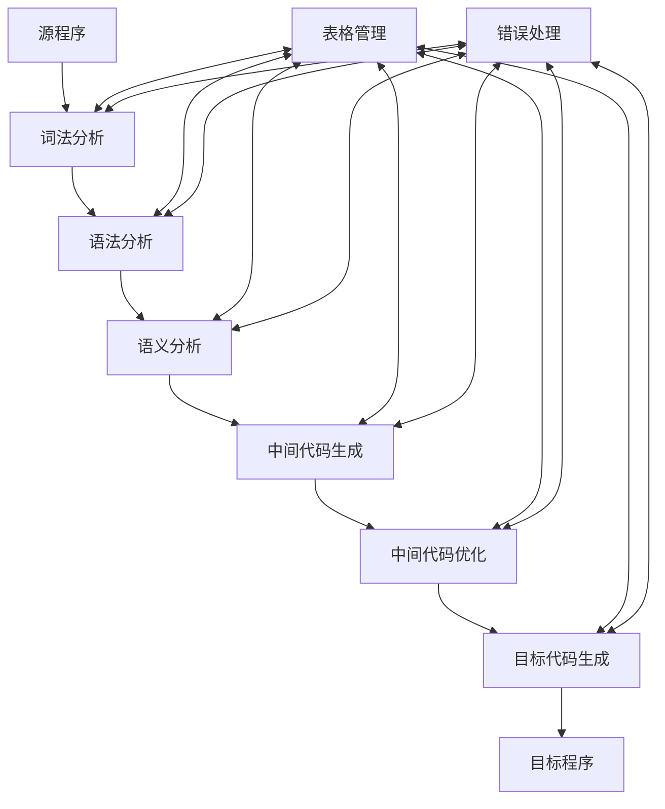

# 编译引论

整理自 `编译原理笔记/编译原理学习笔记.pdf` 第 2–11 页（第 1 章绪论）和 `编译原理笔记/编译原理期末题型整理.pdf` 第 1–11 页（高频考点里的编译器结构题、"1 绪论"的简答题）。这一章的选择题已交给 `10 选择题精编.md` 统一收录。

## 本章要点

- 高级语言有三种实现方式：编译、解释、转换。"高级语言程序必须先编译才能运行"是错的。
- 典型编译程序的逻辑组成：词法分析、语法分析、语义分析、中间代码生成、中间代码优化、目标代码生成，外加贯穿始终的**表格管理**和**错误处理**。这道题在往年期末反复出现，要能画结构图。
- 必须有的阶段是词法、语法、语义分析和目标代码生成；**中间代码生成和中间代码优化可以没有**，它们是为了优化和移植才加的。
- 做选择题时看清题目问的是"前端"还是"后端"。
- "遍"是对源程序或其中间表示从头到尾扫描一次。

## 概念与解释

### 1. 程序设计语言的发展

| 代 | 语言 | 形式 | 优点 | 缺点 |
|---|---|---|---|---|
| 第一代 | 机器语言 | 二进制指令，由操作码（指令功能）和地址码（操作数或其地址）组成，如 `1011011000000000` 表示一次加法 | 硬件直接执行，速度快 | 难学难记、易出错、难维护；依赖具体机器，不能移植 |
| 第二代 | 汇编语言 | 用助记符代替操作码（`ADD`、`SUB`、`MOV`），用地址符号或标号代替地址码，通常为特定计算机设计 | 比机器语言好学好记；占内存少、运行快 | 仍依赖具体机器，不能移植 |
| 第三代 | 高级语言 | 对汇编进一步抽象，接近自然语言表述 | 易学易用易改；不依赖机器，可以移植 | 计算机不认识，必须翻译 |

同一段逻辑 `Y = x + 15（若 x < y），否则 Y = x - 15` 在三种语言里的样子：

```text
机器语言（片段）          汇编语言                  高级语言
1010 1001 0001 0110 ...   MOV X, AX                 if (X < Y) then
0011 1100 0001 1000 ...   CMP AX, Y                     Y := X + 15
0111 1100 0000 0101       JL  S1                    else
...                       SUB AX, 15                    Y := X - 15;
                          JMP S2
                          S1: ADD AX, 15
                          S2: MOV AX, Y
```

计算机只认识自己的指令系统，高级语言写起来方便，却必须有人把它翻译成机器能执行的形式，这个翻译工作就是编译。翻译前后程序的含义要保持等价。

### 2. 高级语言的实现方式

1. 编译方式：把源语言程序一次性翻译成低级语言（汇编或机器语言）的目标程序，之后直接运行目标程序，不用重复翻译。程序要频繁运行时，编译方式更高效。
2. 解释方式：逐句翻译、同时执行，不生成独立的目标程序。解释方式也要翻译，只是边翻译边执行。适合程序简单、经常要改的场合，比如表格软件里写的小脚本。
3. 转换方式：已有 B 语言的编译器时，把 A 语言程序转换成 B 语言程序，再用 B 的编译器处理。它是一种变通做法。

任何程序设计语言的实现都离不开这三种方式之一。课程以编译为主，因为编译是主流手段，解释和转换用到的技术也和编译相通。

解释器与编译器的比较（课件）：

- 解释器是执行系统，编译器是转换系统。
- 解释执行的程序可以动态修改自身，编译执行的程序不易做到。
- 解释方式有利于人机交互。
- 执行速度：解释器慢。
- 空间开销：解释器要保存的信息多，空间开销大。
- 二者实现技术相似。
- 所以大多数高级语言采用编译方式。

两种方式也常混用。Java 先编译成 `.class` 字节码，再由 JVM 解释执行（或即时编译）。SQL 语句要看数据库环境，有时编译有时解释。

常见语言的执行方式（期末题型整理第 11 页）：

| 语言 | 执行方式 | 说明 |
|---|---|---|
| C/C++、Go、Rust、Swift | 编译型 | 编译成本地机器码 |
| Java、Kotlin | 编译 + 解释 | 编译成 JVM 字节码，由 JVM 解释或 JIT 编译执行 |
| C# | 编译 + 解释 | 编译成 IL，由 CLR 执行 |
| Python、PHP、Ruby | 解释型 | 由解释器执行，也有字节码缓存或 JIT 版本 |
| JavaScript | 解释 + JIT | 现代浏览器引擎（如 V8）即时编译 |
| TypeScript | 编译到 JS | 再由 JS 引擎执行 |
| Shell 脚本、MATLAB | 解释型 | 逐行执行（MATLAB 也可用 `mcc` 编译成独立应用） |

### 3. 编译程序的组成

以赋值语句 `sum := first + count * 10` 为例走一遍各阶段。

（1）词法分析：识别由字符组成的单词，转换成内部表示 Token，同时检查词法错误。
机器看到的是字符 `'x' '=' '1' '0' '0' ';'`，词法分析要从中拼出单词 `x`、`=`、`100`、`;`。单词是符合某种规律的字符串。`7L` 这种写法，如果 `L` 不是合法的数字后缀，就是词法错误。

（2）语法分析：按语言的语法规则检查单词序列有没有语法错误，通常构造语法树。所谓语言都包含语法、语义、语用三方面。

```text
            赋值语句
          /    |    \
     标识符   :=    表达式
       |           /  |  \
      sum      表达式  +  表达式
                 |       /  |  \
              标识符  表达式 *  表达式
                 |      |        |
               first  标识符    常数
                        |        |
                      count     10
```

（3）语义分析：检查源程序有无语义错误，为代码生成阶段收集类型信息。主要工作是建立符号表、检测错误。常见错误有标识符未声明、类型不匹配（如函数名、数组名参与运算）。

```text
VAR
    first: real;
    count: char;
BEGIN
    sum := first + count * 10
END.
```

这段程序有两个语义错误：`sum` 使用了但没有定义；`count` 是字符类型，不能做乘法。

（4）中间代码生成：把源程序变成一种内部表示（中间代码），便于优化和移植。设 `VAR sum, first, count: real;`，四元式序列为：

```text
1. (int-to-real, 10, -, t1)    整数 10 转成实数，存入 t1
2. (*, count, t1, t2)          count * t1，存入 t2
3. (+, first, t2, t3)          first + t2，存入 t3
4. (:=, t3, -, sum)            t3 赋给 sum
```

（5）中间代码优化：变换中间代码，让生成的目标代码更省时间和空间。它和算法本身的好坏无关，针对的是程序运行时的具体指令。上例做常量折叠，第 1 条在编译时就算出 10.0，可以并入第 2 条：

```text
2. (*, count, 10.0, t2)
3. (+, first, t2, t3)
4. (:=, t3, -, sum)
```

（6）目标代码生成：把中间代码变换成特定机器上的机器指令或汇编指令。

```text
MOV  count, R1     ; count 装入 R1
MULT R1, #10.0     ; R1 乘 10.0
MOV  first, R2     ; first 装入 R2
ADD  R1, R2        ; R1 = R1 + R2
MOV  R1, sum       ; 结果存入 sum
```

（7）贯穿始终的工作

- 错误处理：某个阶段发现错误时，由错误处理模块给出处理办法，让编译能继续进行下去。
- 表格管理：为构造、查找、更新符号表、类型信息表等表格设立的一组子程序，称为表格管理程序。

编译程序结构图（考试常让画）：



手画时按课件的样子：中间一排从源程序到目标程序，上面一条"表处理"、下面一条"错误处理"，和六个阶段都用双向箭头相连。

各阶段的任务和做法汇总：

| 阶段 | 主要任务 | 常用实现方式 | 目的 |
|---|---|---|---|
| 词法分析 | 读字符序列，识别单词、构造 Token；查词法错误 | 有限自动机；可用 Lex/Flex 生成 | 给语法分析提供单词序列，及早发现非法字符等低级错误 |
| 语法分析 | 检查单词序列是否符合语法规则，构造语法树 | LL(1)、递归下降、LR 类方法；可用 Yacc/Bison 生成 | 得到程序结构，捕捉并定位语法错误 |
| 语义分析 | 建立和维护符号表；类型检查、作用域检查、声明与使用是否一致 | 结合符号表遍历语法树 | 保证语义正确，为中间代码生成提供信息 |
| 中间代码生成 | 生成三地址码、四元式等中间表示 | 按语义分析结果翻译，结构与机器无关 | 便于移植和优化，简化目标代码生成 |
| 中间代码优化 | 删除冗余、减少重复计算 | 常量表达式优化、公共子表达式消除、循环不变式外提等 | 提高执行效率，减少资源消耗 |
| 目标代码生成 | 生成目标机器码或汇编码，做寄存器分配、地址分配、指令选择 | 结合目标机体系结构 | 得到可执行代码 |
| 表格管理与错误处理 | 管理标识符、类型、作用域等信息；报告各阶段错误 | 符号表常用哈希表或作用域栈；错误恢复要设同步点 | 支持语义分析和代码生成，给出准确的错误位置和说明 |

前端与后端：前端的工作主要依赖源语言、与目标机无关，通常包括词法分析、语法分析、语义分析、中间代码生成和优化。后端的工作依赖目标机、不依赖源语言，包括目标代码生成，以及这部分的出错处理和符号表操作。

### 4. 编译程序的设计

- 遍：对源程序或源程序的中间表示形式从头到尾扫描一次，并做加工处理，生成新的中间结果或目标程序。分遍就是把整个编译过程安排成扫描几次。
- 分遍的理由举例：内存限制、让各部分关注点分离、处理前向引用。
- 设计编译程序要注意的问题：
  1. 准确理解源语言；
  2. 确定编译要求（如优化级别、目标平台）；
  3. 确定目标语言；
  4. 分遍（决定遍数和每遍做什么）；
  5. 具体设计（各组成部分和数据结构）。

### 5. 编译程序的自动生成

软件自动生成本身很难，要处理的情况复杂、边界情况多。编译程序里比较成熟、可以自动生成的部分有两块：根据正则表达式生成词法分析器（Lex/Flex），根据文法生成语法分析器（Yacc/Bison、ANTLR）。

## 易混对比

| 对比项 | 编译方式 | 解释方式 |
|---|---|---|
| 翻译时机 | 运行前一次性翻译完 | 运行时边翻译边执行 |
| 是否生成目标程序 | 生成（如 `.exe`、`.out`） | 不生成，每次运行都要解释器 |
| 执行速度 | 快 | 慢 |
| 空间开销 | 小 | 大（要保存的信息多） |
| 动态修改、人机交互 | 不易 | 方便 |
| 代表语言 | C、C++、Go、Rust | Python、JavaScript、R、MATLAB |

| 说法 | 对错 | 原因 |
|---|---|---|
| 高级语言程序都必须编译成目标代码才能运行 | 错 | 还可以解释或转换 |
| 解释方式不对源程序做翻译 | 错 | 解释也要翻译，只是不生成目标程序 |
| 编译和解释的根本区别是是否生成目标代码 | 对 | |
| 中间代码生成、中间代码优化是必须的阶段 | 错 | 可以没有，它们为优化和移植服务 |
| 各阶段都要涉及表格管理和出错处理 | 对 | 二者贯穿始终 |

## 典型题

**题 1（作业；2017 级期末）典型的编译程序在逻辑功能上由哪几部分组成？请画出编译器的功能结构图，并说明各部分的作用。**

思路：先按顺序写六个阶段，再补上贯穿始终的两项；画图时两项放在上下两侧，和每个阶段连线。

解答：由词法分析、语法分析、语义分析、中间代码生成、中间代码优化、目标代码生成六个阶段，以及表格管理和错误处理组成。各部分作用见上文"各阶段的任务和做法汇总"表，结构图见上文。2017 级期末参考答案只列了前六个阶段，答题时把表格管理和错误处理一起写上更稳妥。

**题 2 编译过程中贯穿始终的是什么？哪些阶段可以没有？**

解答：表格管理（表处理）和错误处理贯穿各阶段。中间代码生成和中间代码优化可以没有，词法分析、语法分析、语义分析之后可以直接生成目标代码。

**题 3 高级语言的实现方式有哪些？编译方式和解释方式有什么区别？**

解答：有编译、解释、转换三种。编译方式先把源程序一次性翻译成目标程序，运行前要编译，之后运行不再翻译；解释方式逐句翻译、立即执行，不生成目标程序，每次运行都要解释。区别细节见"易混对比"第一张表。

**题 4 生成中间代码的目的是什么？**

解答：便于优化和移植。中间代码是与平台无关的统一结构，移植方便，优化可以统一在中间代码上做，也简化了目标代码生成。中间代码的具体形式见 `06 中间代码生成.md`。
