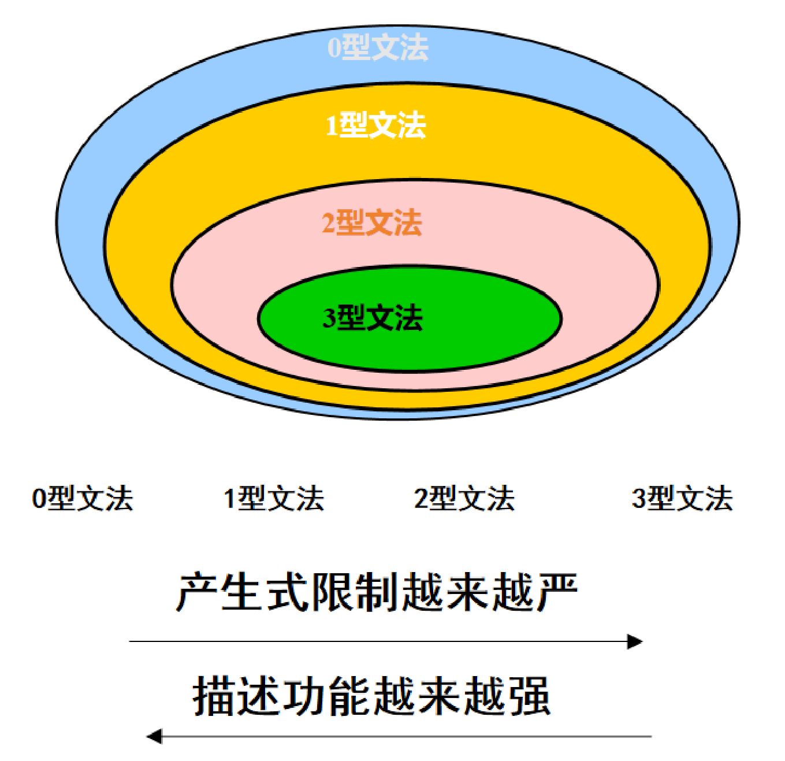
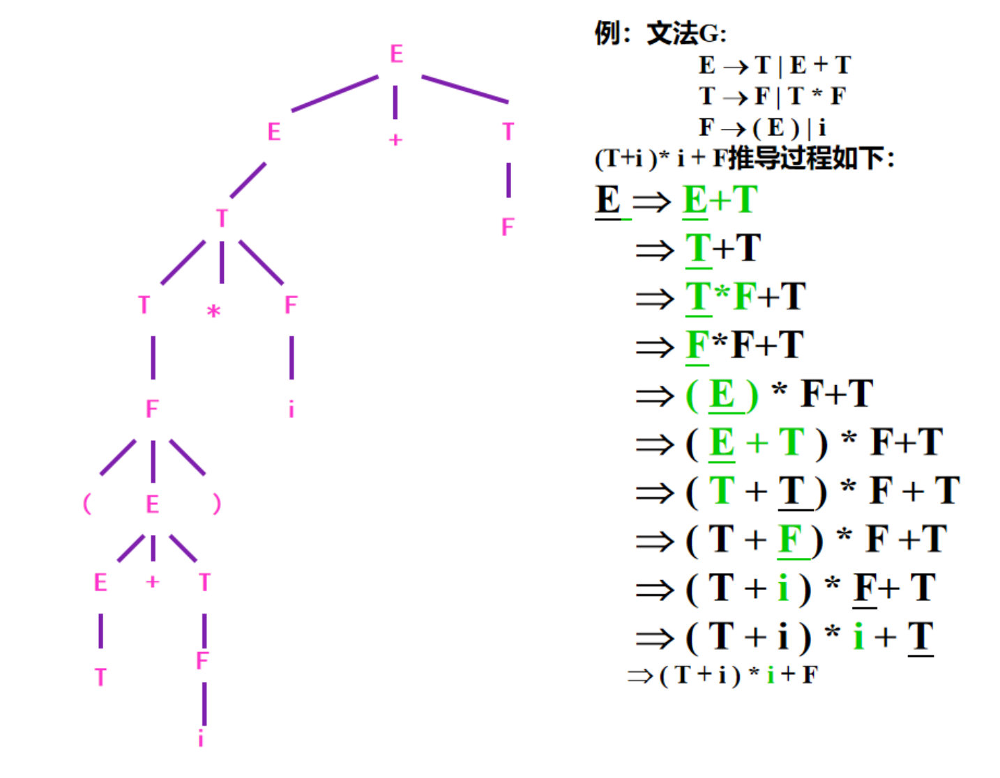

# 文法与语法树

整理自 `编译原理笔记/编译原理学习笔记.pdf` 第 42–65 页（第 3 章 3.1–3.5）和第 177–181 页（历年题部分的语法分析补充），以及 `编译原理笔记/编译原理期末题型整理.pdf` 第 3、5 页（高频考点里的文法题）和第 40–44、50–60 页（"3 语法分析"的知识点、短语句柄、二义性、文法构造、消除左递归）。First/Follow/Predict 集、LL(1)、递归下降和自底向上分析放在 `04 语法分析方法（LL1、递归下降、LR）.md`；这一章的选择题交给 `10 选择题精编.md` 统一收录。

文中所有文法构造题都用 Python 枚举了长度 8 到 11 以内的串，和题目给的语言逐个比对；短语、简单短语、句柄按语法树程序化列出；二义性例子数过语法树的棵数。

## 本章要点

- 文法是四元组 G = (V<sub>N</sub>, V<sub>T</sub>, P, S)。编译原理里说"文法"，没有特别说明时指**上下文无关文法**（2 型）。
- 从开始符经 0 步或多步推导得到的串是**句型**，只含终结符的句型是**句子**，全部句子组成语言 L(G)。
- 短语、简单短语、句柄都在语法树上找：每棵子树的叶子串是**短语**，只有一层的子树的叶子串是**简单短语**，最左边的简单短语是**句柄**。做题先画树。
- **二义性**：存在一个句子有两棵不同的语法树。一般情况下不可判定，考题问"是不是二义文法"时，找出一个有两棵树的句子就够了。
- 文法等价变换：提取公共前缀、消除直接左递归、消除间接左递归。原稿在历年题笔记里标了"**消除直接左递归必考**"。
- 写文法题：个数要相等的两段用"两边同时长"的递归（如 `S → aSb`），互不相关的几段用 `S → ABC` 拆开分别写；递归一定要有终止的产生式，注意题目是 ≥ 还是 >。

## 概念与解释

### 1. 语言的语法和它的表示

自然语言有歧义，意思依赖上下文；程序设计语言要让计算机执行，必须精确无歧义，文法就是描述它的形式化工具。

语言有三个方面：

- 语法（syntax）：句子结构的规则，也就是符号怎样组合成合法程序。
- 语义（semantics）：句子的含义，程序各部分的意义和怎样计算。
- 语用（pragmatics）：语言在具体环境中的使用，和效率、可读性等有关。

高级语言语法的两种写法：

- BNF（巴科斯-瑙尔范式）：`语法成分 ::= 组成部分`，例如 `赋值语句 ::= 变量 = 表达式`，`变量 ::= 标识符 | 下标变量 | 指针变量`。
- 上下文无关文法的产生式：`P → X₁X₂…Xₙ`，P 是非终结符，右边是终结符和非终结符组成的序列，例如 `赋值语句 → 变量 = 表达式`。

每种高级语言都有自己的文法。符合文法的程序就是这个文法的句子，所有合法程序组成这门语言。PASCAL 语法片段：

```text
<程序>     → <首部><声明部分><程序体>
<首部>     → program (<运行环境>)
<声明部分> → var <标号声明><常量声明><类型声明><过程函数声明>
<程序体>   → begin <语句序列> end
<语句序列> → <语句> <语句序列> | <语句>
<语句>     → <条件语句> | <循环语句> | <赋值语句> | <输入输出语句> | <过程调用语句> …
```

判断一个程序是不是文法的句子，就是语法分析。最原始的办法是从开始符出发搜索所有推导，用剪枝提高效率。实用的思路有两种：

- 自顶向下：从开始符出发，按产生式推导，看能否推出输入的单词串。
- 自底向上：从输入的单词串出发，不断把产生式右部归约成左部，看能否归约到开始符。

### 2. 符号串及其运算（整理补充）

原稿第 3 章直接使用了 `V_T*`、`(V_T ∪ V_N)*` 这类记号，这里把记号的意思补齐，正则表达式里的同名运算见 `02 词法分析.md`。

- 字母表：非空有穷符号集合，如 Σ = {0, 1}。
- 符号串：字母表中符号的有穷序列。不含任何符号的串叫空串，记为 ε，长度为 0。
- 连接：x = ab，y = cd，则 xy = abcd；εx = xε = x。
- 幂：x⁰ = ε，xⁿ = xx…x（n 个 x）。
- 集合的乘积：AB = { xy | x ∈ A, y ∈ B }；集合的幂 V⁰ = {ε}，Vⁿ = VV…V。
- 闭包：`V* = V⁰ ∪ V¹ ∪ V² ∪ …`，是 V 上所有串（含 ε）的集合；正闭包 V⁺ = V¹ ∪ V² ∪ …，不含 V⁰ 这一项。

所以 `α ∈ (V_T ∪ V_N)*` 的意思是"α 是由终结符和非终结符组成的任意串，可以是空串"，`β ∈ V_T*` 表示"β 只含终结符"。

### 3. 文法的定义

文法 G 是一个四元组 G = (V<sub>N</sub>, V<sub>T</sub>, P, S)：

| 符号 | 名称 | 说明 |
|---|---|---|
| V<sub>N</sub> | 非终结符集合 | 非空有限集，元素也叫中间符，一般用大写字母表示（E、T、F、`<statement>`）。每个非终结符代表一个语法范畴 |
| V<sub>T</sub> | 终结符集合 | 非空有限集，一般用小写字母、数字、特殊符号表示（id、+、*、(、)）。从语法分析的角度看，终结符不可再分，对应词法分析输出的单词种类 |
| P | 产生式集合 | 产生式（规则）的有限集合，定义各个语法范畴 |
| S | 开始符号 | V<sub>N</sub> 中一个特殊的非终结符，推导从它开始 |

文法的符号集 V = V<sub>N</sub> ∪ V<sub>T</sub>，且 V<sub>N</sub> ∩ V<sub>T</sub> = ∅。

**上下文无关文法**的产生式形如 A → α：

1. 左部 A 必须是一个非终结符。
2. 右部 α ∈ (V<sub>T</sub> ∪ V<sub>N</sub>)*，可以是空串 ε。
3. "→"也写作"::="，读作"定义为"。
4. 开始符号 S 至少出现在某个产生式的左部。
5. 左部相同的产生式 P → α₁、P → α₂、…、P → αₙ 可以合写成 P → α₁ | α₂ | … | αₙ，每个 αᵢ 叫 P 的一个候选式。

例：无符号十进制整数的文法

```text
G = (VN, VT, P, S)
VN = {N, D}              N 表示数字串，D 表示一位数字
VT = {0, 1, 2, …, 9}
P:  N → D
    N → ND
    D → 0 | 1 | … | 9
S = N
```

`N → D` 说数字串可以只有一位；`N → ND` 在已有数字串后面再添一位，可以产生任意多位；`D → 0 | … | 9` 给出每一位的取值。这个文法定义的语言是所有由一位或多位数字组成的串，不带符号，也不限制是否以 0 开头。（更正：原文说 `N → ND` "是一个右递归定义"，N 出现在右部最左端，应为左递归。）

### 4. 推导、归约与句型

**直接推导**：A → β 是产生式，则 α₁Aα₂ ⇒ α₁βα₂，即用一条规则把串中的一个非终结符换成它的右部。反过来看，α₁βα₂ **直接归约**到 α₁Aα₂。

```text
文法 E → E + E | i
E ⇒ E + E        用 E → E + E 替换 E
  ⇒ i + E        用 E → i 替换左边的 E
  ⇒ i + i        用 E → i 替换右边的 E
```

- **多步推导** A ⇒⁺ β：经过一步或多步推出 β，如 E ⇒⁺ i + i。
- **零步或多步推导** `A ⇒* β`：包括零步，所以 `E ⇒* E` 也成立。
- **句型**：`S ⇒* β`，β 就是 G 的一个句型，全体句型记作 SF(G)。句型里可以含非终结符。
- **句子**：只含终结符的句型，即 `S ⇒* β` 且 `β ∈ V_T*`。
- **语言**：`L(G) = { u | S ⇒⁺ u, u ∈ V_T* }`，也常写成 `S ⇒* u`。开始符本身是非终结符，推出终结符串至少要一步，两种写法是一回事。

表达式文法 `G: E → E+E | E*E | (E) | i` 的一个推导：

```text
E ⇒ E+E ⇒ i+E ⇒ i+E*E ⇒ i+i*E ⇒ i+i*i
```

其中 `E`、`E+E`、`i+E`、`i+E*E`、`i+i*E` 都是句型，`i+i*i` 全是终结符，既是句型也是句子，所以 `i+i*i ∈ L(G)`。

**最左推导和最右推导**：每一步都替换当前串中最左（最右）的非终结符，分别记作 ⇒<sub>lm</sub>（⇒<sub>L</sub>）和 ⇒<sub>rm</sub>（⇒<sub>R</sub>）。最左推导得到的句型叫**左句型**，最右推导得到的叫**右句型**，也叫**规范句型**。最右推导的逆过程是**规范归约**（最左归约），自底向上分析做的就是它。

结论：每个句子都有最左推导和最右推导（无二义文法里二者各自唯一，对应同一棵语法树），句型就不一定。上面数字文法里，`N ⇒ ND ⇒ DD ⇒ 1D` 得到的句型 `1D` 只能由最左推导得到。最右推导每一步先换右边的 D，不可能在右边还留着 D 的时候把左边换成 1。

**递归**：

| 名称 | 条件 | 例 |
|---|---|---|
| 直接左递归 | 有产生式 A → Aα（右部第一个符号就是左部） | `E → E+T` |
| 直接右递归 | 有产生式 A → αA（右部最后一个符号是左部） | `B → eB` |
| 左递归 | A ⇒⁺ Aα，直接左递归是它的特例 | A → Bα，B → Aβ |
| 右递归 | A ⇒⁺ αA | |
| 递归 | A ⇒⁺ α₁Aα₂（A 被包在中间） | `F → (E)`，`E ⇒ T ⇒ F ⇒ (E)` |

左递归会让递归下降分析器无限递归，自顶向下分析前必须消除（见第 8 节）。

### 5. 文法分类（乔姆斯基谱系）

分类依据是对产生式形式的限制。

| 类型 | 名称 | 产生式形式 | 限制 | 对应语言 | 识别模型 |
|---|---|---|---|---|---|
| 0 型 | 无限制文法（短语结构文法） | α → β | α 至少含一个非终结符，β 任意（可为 ε） | 递归可枚举语言 | 图灵机 |
| 1 型 | 上下文相关文法 | αAβ → αγβ | γ 非空，替换后串长不减，即 \|αγβ\| ≥ \|αAβ\|；S 不出现在任何右部时允许 S → ε | 上下文相关语言 | 线性有界自动机 |
| 2 型 | 上下文无关文法 | A → α | 左部只能是单个非终结符 | 上下文无关语言 | 下推自动机 |
| 3 型 | 正则文法 | 右线性 A → aB 或 A → a；左线性 A → Ba 或 A → a | 左线性、右线性不能混用 | 正则语言 | 有限自动机（DFA/NFA） |

几点说明：

- 1 型产生式 αAβ → αγβ 的意思是：A 只有在左边是 α、右边是 β 时才能换成 γ，α、β 就是"上下文"。2 型没有这个条件，A 在哪里都能换，所以叫上下文无关。
- 限制越严，文法类型号越大，描述能力越弱。3 型 ⊂ 2 型 ⊂ 1 型 ⊂ 0 型。2 型是 1 型的特例。
- 3 型文法与有限自动机等价。
- 编译器中，词法（单词的结构）用 3 型文法或等价的正则表达式描述，语法结构（表达式、语句）用 2 型文法描述。



### 6. 语法树

**定义**：G 的语法树满足两条：

1. 每个结点标有 G 的一个文法符号，根结点标开始符 S。
2. 若非叶结点 A 从左到右有 n 个儿子 B₁, B₂, …, Bₙ，则 A → B₁B₂…Bₙ 一定是 G 的产生式。

所以根是开始符，内部结点都是非终结符，叶结点可以是终结符，也可以是非终结符（画的是句型的树时）。每个父结点和它的儿子恰好对应一条产生式。

**作用**（简答题）：

1. 反映推导过程：树的每次"生长"（父结点展开为子结点）对应一步推导。
2. 反映语法结构：展示终结符怎样通过非终结符一层层组合起来，后面的语义分析要用这个结构。

**子树和简单子树**：树 T 中某个结点 A 连同它的全部后代组成的树是 T 的一棵子树；某结点只和它的直接儿子（只有一层）组成的树叫简单子树（直接子树），它正好对应一条产生式。

**语法树与句型、短语的关系**：

| 概念 | 在树上怎么找 | 用推导怎么定义 |
|---|---|---|
| 句型 | 整棵树所有叶结点从左到右连成的串 | `S ⇒* β` |
| 短语 | 任一子树的叶结点串 | `S ⇒* αAδ` 且 A ⇒⁺ β，则 β 是句型 αβδ 相对于 A 的短语 |
| 简单短语（直接短语） | 简单子树的叶结点串 | `S ⇒* αAδ` 且有产生式 A → β，则 β 是句型 αβδ 相对于 A 的简单短语 |
| 句柄 | 最左简单子树的叶结点串 | 句型中最左边的简单短语 |

几点容易错的地方：

- 简单短语一定是某条产生式的完整右部；反过来，句型里恰好长得像某个右部的子串，在树上不是简单子树时就不是简单短语。
- 短语按位置算。串相同、位置不同的算不同的短语（例如"第一个 i""第二个 i"）；不同子树叶子串完全相同（同一位置）时只算一个。
- 单独一个叶子不是短语，除非它是某个非终结符唯一的儿子（那棵子树的叶子串就是它）。
- 自底向上分析每一步归约的就是句柄。无二义文法的句型只有一棵树，句柄唯一。

例 1：表达式文法 `E → E+E | E*E | (E) | i`，句型 `i+i*i`，按 `E ⇒ E+E ⇒ i+E ⇒ i+E*E ⇒ i+i*E ⇒ i+i*i` 这棵树（先算乘法）：

- `i*i` 是短语，它是右边那个 E 子树的叶子串（`E ⇒ E*E ⇒ i*E ⇒ i*i`，多步推出）。
- `i*i` 不是简单短语，文法里没有 `E → i*i`。
- 每个 i 都是简单短语（E → i）。第一个 i 最靠左，是句柄。
- `i+i*i` 本身也是短语（相对于根 E）。

这个文法有二义性，换成先算加法的那棵树，`i*i` 就不是短语了，`i+i` 才是。

例 2：文法 `S → cAdBf，A → ab | a，B → e | eB`，句型 `cabdef`。推导 `S ⇒ cAdBf ⇒ cabdBf ⇒ cabdef`，树的根 S 有 c、A、d、B、f 五个儿子，A 下面是 a、b，B 下面是 e。

- 短语：`cabdef`、`ab`、`e`。
- 简单短语：`ab`（A → ab）、`e`（B → e）。
- 句柄：`ab`。

### 7. 文法的二义性

**定义**：如果文法 G 至少有一个句子有两棵（或更多）不同的语法树，这个句子是二义的，G 是二义性文法；否则 G 无二义性。二义文法让同一个输入有两种结构解释，编译器没法确定生成哪种代码。

两棵树等价的说法：有两个不同的最左推导，或有两个不同的最右推导。

例 1：`G(E): E → i | E+E | E*E | (E)`，句子 `i+i*i` 有两棵树。

```text
树 1：i+(i*i)，先算乘法           树 2：(i+i)*i，先算加法
E                                 E
├─ E ─ i                          ├─ E
├─ +                              │  ├─ E ─ i
└─ E                              │  ├─ +
   ├─ E ─ i                       │  └─ E ─ i
   ├─ *                           ├─ *
   └─ E ─ i                       └─ E ─ i

最左推导 1：E ⇒ E+E ⇒ i+E ⇒ i+E*E ⇒ i+i*E ⇒ i+i*i
最左推导 2：E ⇒ E*E ⇒ E+E*E ⇒ i+E*E ⇒ i+i*E ⇒ i+i*i
```

例 2：if-else 的"悬空 else"。

```text
<Stm> → if <Exp> then <Stm> else <Stm>
<Stm> → if <Exp> then <Stm>
<Stm> → …（其他语句）
```

语句 `if e1 then if e2 then s1 else s2` 有两棵树：else 配外层 if，即 `if e1 then (if e2 then s1) else s2`；else 配内层 if，即 `if e1 then (if e2 then s1 else s2)`。通常期望的是后一种。

**判定**：不存在判定任意文法是否二义的一般算法，这个问题不可判定。经验判断：

- `S → SS | a` 能推出 SSS，它可以分成 S(SS) 或 (SS)S，必有二义性。
- `S → S+S` 能推出 S+S+S，可以是 S+(S+S) 或 (S+S)+S，必有二义性。

（整理补充：这两例的共同点是同一条产生式左右两头都是自身，形如 A → AαA。另外，LL(1) 文法一定无二义性，所以二义文法一定不是 LL(1) 文法。）

**处理二义性的两种办法**：

| 办法 | 做法 | 优缺点 |
|---|---|---|
| 改写文法，消除二义性 | 增加非终结符，把优先级和结合性写进文法（如 E → E+T \| T，T → T*F \| F，F → (E) \| i） | 文法的复杂程度和符号数迅速增加，变得冗长、难懂、难维护 |
| 保留二义文法，加规则约束 | 规定运算符优先级（乘除高于加减）、结合性（加法左结合），if-else 规定"else 与最近的未匹配 if 结合" | 文法保持简洁，状态少、分析快，歧义由附加规则解决 |

实际编译器常利用二义文法状态少、分析快的特点，走第二条路。

### 8. 文法等价变换

等价变换指不改变文法生成的语言、只改写产生式。自顶向下分析（LL(1)、递归下降）要求文法没有公共前缀和左递归，所以常要做这几种变换。变换以后文法的可读性通常会变差。

#### 8.1 提取公共前缀（提取左因子）

A 的几个候选式有相同前缀，如 A → δβ₁ | δβ₂，分析器看到 δ 的第一个符号时不知道选哪条。改写方法：

```text
A  → δβ₁ | δβ₂ | … | δβₙ | γ₁ | γ₂ | … | γₘ      （每个 γ 不以 δ 开头）
改为
A  → δA' | γ₁ | γ₂ | … | γₘ
A' → β₁ | β₂ | … | βₙ
```

反复提取，直到每个非终结符的各候选式前缀都不同。

例：

```text
原文法                      提取后
A → aB | ac | aD            A  → aA'
B → bB | bD | c             A' → B | c | D
D → d                       B  → bB' | c
                            B' → B | D
                            D  → d
```

#### 8.2 消除直接左递归

A → Aα 会让自顶向下分析器反复展开 A，无法终止。A → Aα | β 推出的是 β 后面跟零个或多个 α，改写成先产生 β、再由新符号 A' 产生若干个 α：

```text
简单情形                      一般情形
A  → Aα | β                   A  → Aα₁ | … | Aαₘ | β₁ | … | βₙ   （βᵢ 不以 A 开头）
改为                          改为
A  → βA'                      A  → β₁A' | β₂A' | … | βₙA'
A' → αA' | ε                  A' → α₁A' | α₂A' | … | αₘA' | ε
```

套公式时先把 A、α、β 对上号。例如 `E → E+T | T`：A = E，α = `+T`，β = T。

例（必考）：

```text
原文法               消除左递归后
E → E+T | T          E  → TE'
T → T*F | F          E' → +TE' | ε
F → (E) | i          T  → FT'
                     T' → *FT' | ε
                     F  → (E) | i        （F 不变）
```

#### 8.3 消除间接左递归（整理补充）

原稿只提到"包括直接左递归和间接左递归（如 A → Bα 且 B → Aβ）"。做法是把非终结符排个序，依次把排在前面的非终结符代入，暴露出直接左递归，再用 8.2 消除。要求文法没有 ε 产生式和 A ⇒⁺ A 这样的回路。

```text
1. 把非终结符排成 A₁, A₂, …, Aₙ
2. for i = 1 to n:
       for j = 1 to i-1:
           把形如 Aᵢ → Aⱼγ 的产生式改为 Aᵢ → δ₁γ | δ₂γ | … | δₖγ，
           其中 Aⱼ → δ₁ | δ₂ | … | δₖ 是 Aⱼ 当前的全部产生式
       消除 Aᵢ 的直接左递归
3. 删去从开始符出发不可达的产生式
```

例：`S → Qc | c，Q → Rb | b，R → Sa | a`，S ⇒ Qc ⇒ Rbc ⇒ Sabc，有间接左递归。

```text
按 R、Q、S 的顺序：
R → Sa | a                         没有直接左递归
Q → Rb | b  代入 R  → Sab | ab | b   没有直接左递归
S → Qc | c  代入 Q  → Sabc | abc | bc | c
消除 S 的直接左递归：
S  → abcS' | bcS' | cS'
S' → abcS' | ε
Q、R 从 S 出发已不可达，删去。
```

另一个只有两个非终结符的练习见 `20 大题题型精讲.md` 第 4.3 节。

#### 8.4 消除空产生式（整理补充）

原稿没有讲这一步，这里补上常用的做法。

1. 求出所有能推出 ε 的非终结符（可空符号）：有 A → ε 的 A 可空；右部全是可空符号的 A 也可空，反复求到不变。
2. 对每条产生式，右部中的可空符号"留"或"去"都列一遍，得到若干新产生式，但不加入右部全去掉后得到的 A → ε。
3. 删去所有 ε 产生式。
4. 如果开始符 S 可空，原语言含 ε，另加新开始符 S' → S | ε。

例：

```text
原文法              可空符号：A、B、S
S → aAB | B         消除后
A → aA | ε          S' → S | ε
B → bB | ε          S  → aAB | aB | aA | a | B
                    A  → aA | a
                    B  → bB | b
```

两个文法生成的都是 `a⁺b* ∪ b*`（含空串）。

## 易混对比

| 概念 | 是什么 | 例（`E → E+E \| E*E \| (E) \| i`，树取 `i+(i*i)`） |
|---|---|---|
| 句型 | 开始符零步或多步推出的串，可含非终结符 | `E+E`、`i+E` |
| 句子 | 只含终结符的句型 | `i+i*i` |
| 短语 | 某棵子树的叶子串，可多步推出 | `i*i`、`i+i*i` |
| 简单短语 | 只有一层的子树的叶子串，恰好是一条产生式右部 | 三个 i |
| 句柄 | 最左的简单短语，自底向上每步归约它 | 第一个 i |

| 对比项 | 最左推导 | 最右推导 |
|---|---|---|
| 每步替换 | 最左边的非终结符 | 最右边的非终结符 |
| 得到的句型 | 左句型 | 右句型（规范句型） |
| 对应分析方法 | 自顶向下分析（LL(1)、递归下降）产生最左推导 | 逆过程是规范归约，自底向上分析（LR）使用 |

| 对比项 | 公共前缀 | 左递归 |
|---|---|---|
| 样子 | A → δβ₁ \| δβ₂ | A → Aα \| β，或 A ⇒⁺ Aα |
| 对自顶向下分析的影响 | 看一个符号选不出产生式，要回溯 | 反复展开 A，死循环 |
| 改写 | A → δA'，A' → β₁ \| β₂ | A → βA'，A' → αA' \| ε |
| 改完以后 | 不一定是 LL(1)，还要算 Predict 集 | 同左 |

| 对比项 | 二义文法 | 非 LL(1) 文法 |
|---|---|---|
| 含义 | 某个句子有两棵语法树 | 某非终结符的两个 Predict 集相交 |
| 关系 | 二义文法一定不是 LL(1) | 非 LL(1) 不一定二义，比如有左递归的 `E → E+T \| T` 无二义 |
| 怎么证明 | 举一个句子，画出两棵树 | 算出相交的 Predict 集 |

| 对比项 | 0 型 | 1 型 | 2 型 | 3 型 |
|---|---|---|---|---|
| 左部 | 含非终结符的串 | αAβ | 单个非终结符 | 单个非终结符 |
| 右部 | 任意 | 不比左部短 | 任意串 | aB 或 a（右线性），Ba 或 a（左线性） |
| 编译中的用途 | | | 语法分析 | 词法分析 |

## 典型题

### 题 1（简答）语法树的作用

来源：`编译原理笔记/编译原理期末题型整理.pdf` 第 40–41 页。

解答：

1. 反映推导过程。树中父结点展开成子结点的每一步，对应文法中的一步推导。
2. 反映语法结构。语法树展示了输入串中的终结符怎样通过非终结符层层组合，语义分析要在这个结构上进行。

### 题 2（简答）举例说明乔姆斯基文法分类的依据，以及各类文法表示能力的区别

来源：`编译原理笔记/编译原理期末题型整理.pdf` 第 3 页（高频考点，原稿只给了分类表）。

思路：依据是产生式的形式限制；能力区别用包含关系回答，再各举一个文法。

解答：

- 分类依据是对产生式形式的限制：0 型只要求左部含非终结符；1 型要求右部不比左部短（αAβ → αγβ，γ 非空）；2 型要求左部是单个非终结符；3 型在 2 型基础上要求右部是 aB 或 a（或统一为 Ba 或 a）。
- 能力：限制越严，能描述的语言越少。3 型语言 ⊂ 2 型语言 ⊂ 1 型语言 ⊂ 0 型语言，识别模型依次是有限自动机、下推自动机、线性有界自动机、图灵机。

举例（整理补充）：

```text
3 型：S → aS | bS | a              描述 (a|b)*a，有限自动机可识别
2 型：S → aSb | ab                 描述 aⁿbⁿ (n ≥ 1)，要"记住"a 的个数，正则文法写不出
1 型：S → aSBC | aBC               描述 aⁿbⁿcⁿ (n ≥ 1)，三段个数相等，上下文无关文法写不出
      CB → BC   aB → ab   bB → bb
      bC → bc   cC → cc
      （每条产生式右部都不比左部短。CB → BC 不是 αAβ → αγβ 的样子，
       但"右部不短于左部"和 αAβ → αγβ 两种定义描述的语言类相同）
      S ⇒ aSBC ⇒ aaBCBC ⇒ aaBBCC ⇒ aabBCC ⇒ aabbCC ⇒ aabbcC ⇒ aabbcc
0 型：对产生式不加限制，允许右部比左部短，如 AB → B
```

### 题 3 句型 (T+i)*i+F 的短语、简单短语和句柄

来源：`编译原理笔记/编译原理学习笔记.pdf` 第 58–60 页，`编译原理笔记/编译原理期末题型整理.pdf` 第 50–51 页。

```text
G:  (1) E → T     (2) E → E+T    (3) T → F
    (4) T → T*F   (5) F → (E)    (6) F → i
```

问：`(T+i)*i+F` 是否为 G 的句型？若是，列出全部短语、简单短语和句柄。

思路：先写出一个推导证明它是句型，同时把语法树画出来，再按子树读短语。

解答：是句型。

```text
E ⇒ E+T              (2)
  ⇒ T+T              (1)
  ⇒ T*F+T            (4)
  ⇒ F*F+T            (3)
  ⇒ (E)*F+T          (5)
  ⇒ (E+T)*F+T        (2)
  ⇒ (T+T)*F+T        (1)
  ⇒ (T+F)*F+T        (3)
  ⇒ (T+i)*F+T        (6)
  ⇒ (T+i)*i+T        (6)
  ⇒ (T+i)*i+F        (3)
```



语法树：

```text
E
├─ E
│  └─ T
│     ├─ T
│     │  └─ F
│     │     ├─ (
│     │     ├─ E
│     │     │  ├─ E
│     │     │  │  └─ T
│     │     │  ├─ +
│     │     │  └─ T
│     │     │     └─ F
│     │     │        └─ i
│     │     └─ )
│     ├─ *
│     └─ F
│        └─ i
├─ +
└─ T
   └─ F
```

| 类别 | 结果 | 对应子树 |
|---|---|---|
| 短语（8 个） | `(T+i)*i+F` | 根 E |
| | `(T+i)*i` | 左边的 E（和它下面的 T） |
| | `(T+i)` | T → F → (E) |
| | `T+i` | 括号里的 E |
| | T | 括号里 E → T |
| | 第一个 i | 括号里 T → F → i |
| | 第二个 i | `*` 后面的 F → i |
| | F | 最右边 T → F |
| 简单短语（4 个） | T、第一个 i、第二个 i、F | 分别来自 E → T、F → i、F → i、T → F |
| 句柄 | T | 最左边的简单子树 E → T |

原稿注：不同子树叶子串相同的已经合并（如 `(T+i)*i` 同时是 E 和 T 子树的叶子串）。原笔记在"简单短语"下面对 T 的来源写了好几种互相矛盾的解释，按语法树看，这个 T 是括号内 E → T 这棵简单子树的叶子，就这一种。

### 题 4 句型 (T+i)*F+i 的短语、简单短语和句柄

来源：`编译原理笔记/编译原理期末题型整理.pdf` 第 51–52 页。

```text
G:  E → E+T | T
    T → T*F | F
    F → (E) | i        （i 代表标识符）
```

问：`(T+i)*F+i` 是不是 G 的句型？如果是，有哪些短语、简单短语，句柄是哪个？

解答：是句型。

```text
E ⇒ E+T ⇒ T+T ⇒ T*F+T ⇒ F*F+T ⇒ (E)*F+T ⇒ (E+T)*F+T
  ⇒ (T+T)*F+T ⇒ (T+F)*F+T ⇒ (T+i)*F+T ⇒ (T+i)*F+F ⇒ (T+i)*F+i
```

（更正：打字版推导从 `(T+i)*F+T` 直接写到 `(T+i)*F+i`，漏了 T → F 一步，文法里没有 T → i；手写版是完整的。）

```text
E
├─ E
│  └─ T
│     ├─ T
│     │  └─ F
│     │     ├─ (
│     │     ├─ E
│     │     │  ├─ E ─ T
│     │     │  ├─ +
│     │     │  └─ T ─ F ─ i
│     │     └─ )
│     ├─ *
│     └─ F
├─ +
└─ T ─ F ─ i
```

- 短语：`(T+i)*F+i`、`(T+i)*F`、`(T+i)`、`T+i`、T、第一个 i、第二个 i。
- 简单短语：T、第一个 i、第二个 i。
- 句柄：T。

和题 3 比：这里 `*` 后面的 F 是叶子，T → T*F 这棵子树的儿子 T 还有下层，所以它不是简单子树，F 也不是短语。

### 题 5（高频）句型 F+Fi[ 的短语、简单短语和句柄

来源：`编译原理笔记/编译原理期末题型整理.pdf` 第 52–53 页。

```text
G[S]:  S → V
       V → T | ViT
       T → F | T+F
       F → V* | [
```

解答：

```text
S ⇒ V ⇒ ViT ⇒ TiT ⇒ T+FiT ⇒ F+FiT ⇒ F+FiF ⇒ F+Fi[
```

```text
S
└─ V
   ├─ V
   │  └─ T
   │     ├─ T ─ F
   │     ├─ +
   │     └─ F
   ├─ i
   └─ T
      └─ F ─ [
```

- 短语：`F+Fi[`、`F+F`、第一个 F、`[`。
- 简单短语：第一个 F（T → F）、`[`（F → [）。
- 句柄：第一个 F。

原稿的批注：推到 `T+FiT` 时，不要把它理解成 `(T+F)iT`。这个文法里的括号不是分组记号，句型没写括号就不要自己加，按产生式老老实实展开。

### 题 6（作业）句型 (S,(a)) 的语法树及所有短语、简单短语和句柄

来源：`编译原理笔记/编译原理期末题型整理.pdf` 第 53–54 页。

```text
G[S]:  S → (L) | aS | a
       L → L,S | S
```

思路（原稿手写批注）：这种题可以先从句型往回归约，找出一条回到开始符的路径，再倒过来写成推导。

```text
(S,(a)) ⇐ (S,(S)) ⇐ (S,(L)) ⇐ (S,S) ⇐ (L,S) ⇐ (L) ⇐ S
倒过来：
S ⇒ (L) ⇒ (L,S) ⇒ (S,S) ⇒ (S,(L)) ⇒ (S,(S)) ⇒ (S,(a))
```

```text
S
├─ (
├─ L
│  ├─ L ─ S
│  ├─ ,
│  └─ S
│     ├─ (
│     ├─ L ─ S ─ a
│     └─ )
└─ )
```

- 短语：`(S,(a))`、`S,(a)`、S、`(a)`、a。
- 简单短语：S（L → S）、a（S → a）。
- 句柄：S。

### 题 7 判断文法 G[Z] 是否为二义性文法，如果是请举例

来源：`编译原理笔记/编译原理期末题型整理.pdf` 第 54–56 页。

```text
G[Z]:  Z → WV
       W → aB | aW | a
       B → b | bB
       V → bV | dD
       D → d | dD
```

思路：a 只能来自 W。紧跟 a 的 b 可以归 W（W → aB），也可以归 V（V → bV），这里就会出现两种结构。原稿经验：题目问"是否为二义性文法"时，答案基本都是"是"，关键在于找到那个句子。

解答：是二义性文法。句子 `abdd` 有两棵语法树。

```text
树 1：b 属于 W → aB            树 2：b 属于 V → bV
Z                              Z
├─ W                           ├─ W ─ a
│  ├─ a                        └─ V
│  └─ B ─ b                       ├─ b
└─ V                              └─ V
   ├─ d                              ├─ d
   └─ D ─ d                          └─ D ─ d

最左推导 1：Z ⇒ WV ⇒ aBV ⇒ abV ⇒ abdD ⇒ abdd
最左推导 2：Z ⇒ WV ⇒ aV ⇒ abV ⇒ abdD ⇒ abdd
```

两个最左推导第二步用的产生式不同，对应两棵不同的树。

### 题 8（作业）说明 S → S and S | S or S | not S | p | (S) 是二义性文法，要求画出语法树

来源：`编译原理笔记/编译原理期末题型整理.pdf` 第 56 页。

解答：句子 `p and p or p` 有两棵语法树。

```text
树 1：p and (p or p)                   树 2：(p and p) or p
S                                      S
├─ S ─ p                               ├─ S
├─ and                                 │  ├─ S ─ p
└─ S                                   │  ├─ and
   ├─ S ─ p                            │  └─ S ─ p
   ├─ or                               ├─ or
   └─ S ─ p                            └─ S ─ p

推导 1：S ⇒ S and S ⇒ p and S ⇒ p and S or S ⇒ p and p or S ⇒ p and p or p
推导 2：S ⇒ S or S ⇒ S and S or S ⇒ p and S or S ⇒ p and p or S ⇒ p and p or p
```

### 题 9（2017 级期末）构造文法 G，使 L(G) = { aⁿbᵐcᵏ | m = n + k, n ≥ 1, m ≥ 1, k ≥ 1 }

来源：`编译原理笔记/编译原理期末题型整理.pdf` 第 57 页。

思路：b 的个数等于 a 和 c 的个数之和，把 b 拆成两段：前 n 个和 a 配对，后 k 个和 c 配对，语言就变成 aⁿbⁿ 接 bᵏcᵏ。

解答：

```text
S → AB          把两段拼起来
A → aAb | ab    每多一个 a，配一个 b
B → bBc | bc    每多一个 c，配一个 b
```

### 题 10（作业）G[S] 产生的语言是什么？

来源：`编译原理笔记/编译原理期末题型整理.pdf` 第 57 页。

```text
G[S]:  S → dAB
       A → aA | a
       B → Bb | ε
```

解答：A 产生一个或多个 a，B 产生零个或多个 b。语言是以 d 开头、接至少一个 a、再接任意个 b 的串，正则表达式 `da+b*`。

### 题 11（作业）给出下面语言的上下文无关文法（答案不唯一）

来源：`编译原理笔记/编译原理期末题型整理.pdf` 第 57–59 页。

| 小题 | 语言 | 文法 | 说明 |
|---|---|---|---|
| 1 | aⁿb²ⁿ⁺¹，n > 0 | S → aSbb \| abbb | 每加一个 a 配两个 b；n = 1 时是 abbb，保证 b 的个数是 2n+1 |
| 2 | aⁱbʲ，j ≥ i ≥ 1 | S → aSb \| Sb \| ab | ab 是 i = j = 1；aSb 让 a、b 同步增加；Sb 只加 b，处理 j > i |
| 3 | aⁿbⁿcᵐ，m, n ≥ 1 | S → YT，Y → aYb \| ab，T → cT \| c | Y 负责等量的 a、b，T 负责至少一个 c |
| 4 | 见下方更正 | S → ABC，A → xAy \| ε，B → zB \| ε，C → yCx \| yx | A 负责 xⁱyⁱ，B 负责任意个 z，C 负责 yʲxʲ（j ≥ 1） |
| 5 | aⁿbᵐaᵐbⁿ，n ≥ 1，m ≥ 0 | S → aSb \| aBb，B → bBa \| ε | 外层 aSb 产生 aⁿ…bⁿ；B → bBa 让 b、a 配对；B → ε 对应 m = 0 |

第 4 小题（更正）：题面原作 `L = { xⁱyʲzᵏyʲxʲ | i ≥ 0, j > 0, k ≥ 0 }`，参考答案原作 `C → yCy | yx`。二者对不上：

- 题面的语言要求 yʲ、yʲ、xʲ 三段个数相等，而且中间隔着 zᵏ，它不是上下文无关语言，写不出上下文无关文法。
- 原答案 `S → ABC，A → xAy | ε，B → zB | ε，C → yCy | yx` 实际生成 xⁱyⁱzᵏyᶜ⁺¹xyᶜ，和题面也不符。
- 按答案 S → ABC 三段拼接的结构，题目应为 `{ xⁱyⁱzᵏyʲxʲ | i ≥ 0, j > 0, k ≥ 0 }`，C 应为 `C → yCx | yx`，上表按这个写，已用程序枚举验证。
- 如果题目本意是前后对称的 xⁱyʲzᵏyʲxⁱ（原稿"技巧"表里写了"镜像结构"），文法为 `S → xSx | Y，Y → yYy | yZy，Z → zZ | ε`，同样验证过。

原稿总结的技巧：

| 小题 | 类型 | 策略 |
|---|---|---|
| 1 | aⁿb²ⁿ⁺¹ | 配对关系用递归，再写一个终止部分（就是 n 取最小值时的串） |
| 2 | j ≥ i ≥ 1 的双变量不等式 | a、b 同步增长，再让 b 自由增长 |
| 3 | aⁿbⁿcᵐ，前后两段无关 | 拆成几个非终结符分别写再拼接 |
| 4 | 镜像结构（原稿写"yʲ 前后对称"） | 中心对称构造 + 多段组合 |
| 5 | aⁿbᵐaᵐbⁿ，夹心结构 | 外层递归套内层递归 |

看清题目是大于号还是大于等于号：能取 0 的部分要以 ε 结束递归，至少为 1 的部分以最小的串结束。

### 题 12（高频）写出识别语言 L = { w#wᵀ | w ∈ {0,1}*，wᵀ 是 w 的逆 } 的上下文无关文法（不超过 5 条产生式）

来源：`编译原理笔记/编译原理期末题型整理.pdf` 第 5 页。

思路：以 # 为中心的回文，两边同时长出相同的符号。

解答：

```text
S → 0S0 | 1S1 | #
```

### 题 13（必考）消除文法的直接左递归

来源：`编译原理笔记/编译原理学习笔记.pdf` 第 65 页、第 180–181 页。

```text
E → E+T | T
T → T*F | F
F → (E) | i
```

思路：对照标准形式 A → Aα | β，写出 A → βA'，A' → αA' | ε。对 E：A = E，α = `+T`，β = T；对 T：A = T，α = `*F`，β = F。

解答：

```text
E  → TE'
E' → +TE' | ε
T  → FT'
T' → *FT' | ε
F  → (E) | i
```

### 题 14（作业）消除文法的左递归和公共前缀

来源：`编译原理笔记/编译原理期末题型整理.pdf` 第 60–61 页。

```text
G[S]:  S → (L) | aS | a
       L → L,S | S
```

思路：S 的 aS 和 a 有公共前缀 a；L → L,S 是直接左递归（A = L，α = `,S`，β = S）。两处分别处理。

解答（手写版的记法）：

```text
① 提取公共前缀：S  → (L) | aS'
                S' → S | ε
② 消除左递归：  L  → SL'
                L' → ,SL' | ε
```

打字版答案用 B、A 作新符号，内容相同：`S → (L) | aB，B → S | ε，L → SA，A → ,SA | ε`。

（整理补充）变换后的文法是 LL(1) 文法，Predict 集如下（Follow(S) = Follow(S') = { `)`, `,`, # }，Follow(L) = Follow(L') = { `)` }）：

| 产生式 | Predict 集 |
|---|---|
| S → (L) | { ( } |
| S → aS' | { a } |
| S' → S | { (, a } |
| S' → ε | { `)`, `,`, # } |
| L → SL' | { (, a } |
| L' → ,SL' | { `,` } |
| L' → ε | { `)` } |

同一左部的 Predict 集两两不相交。Predict 集的求法见 `04 语法分析方法（LL1、递归下降、LR）.md`。
