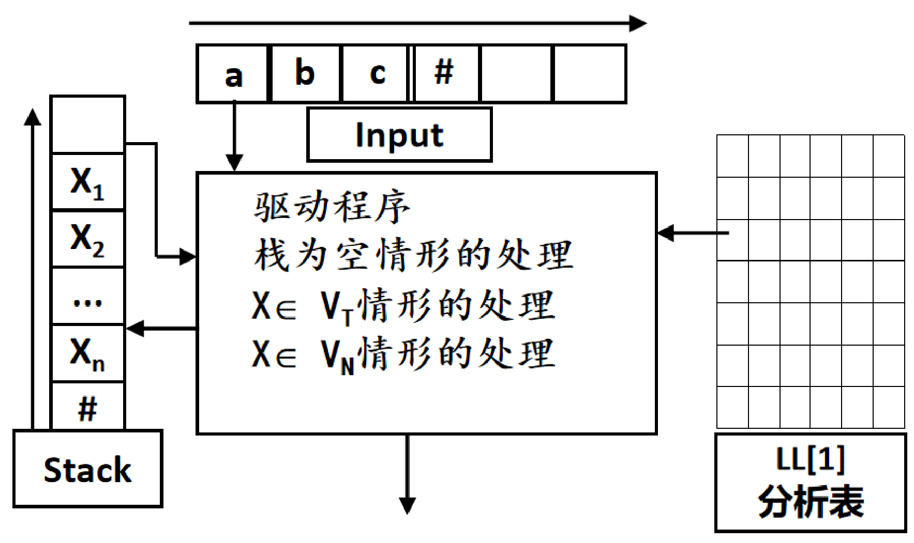

# 语法分析方法（LL1、递归下降、LR）

整理自 `编译原理笔记/编译原理学习笔记.pdf` 第 65–96 页（第 3 章 3.6–3.10）和第 181–189 页（历年题部分的 LL(1)、递归下降题型），`编译原理笔记/编译原理期末题型整理.pdf` 第 1、4 页（高频考点）和第 61–81 页（LL(1) 条件、三个集合、分析表、分析过程、递归下降），`编译原理期末资料/吉林大学编译原理期末试题解答.pdf` 第 2–4 页（知识点总结和试题样例）。文法、语法树、句柄、提取公共前缀和消除左递归见 `03 文法与语法树.md`，这一章的选择题交给 `10 选择题精编.md`。

LL(1) 是期末第二大题。下文每道题的 First、Follow、Predict 集、LL(1) 分析表和分析过程都用 Python 脚本重新算过，自底向上的例子用 SLR(1) 分析器模拟过；和原稿不一致的地方在原处写了更正。

## 本章要点

- 自顶向下分析从开始符出发做**最左推导**。带回溯的方法效率低；不回溯的确定方法有 **LL(1) 分析**和**递归下降**，二者对文法的要求相同。
- 三个集合：First 针对符号串，Follow 针对非终结符，Predict 针对产生式。`Predict(A→α)` 在 α 推不出 ε 时等于 First(α)，推得出 ε 时等于 `(First(α) − {ε}) ∪ Follow(A)`。
- **LL(1) 文法**：同一个非终结符的各产生式 Predict 集两两不相交。有左递归或公共前缀一定不是 LL(1)；没有这两样也不一定是，必须算 Predict 集。
- LL(1) 分析表：行是非终结符，列是终结符和 #，产生式 A → α 填进 A 行、Predict(A→α) 中每个符号那一列，空格是出错。
- LL(1) 分析过程：栈底是 #，表里栈顶写在右边；替换时右部**逆序压栈**，ε 什么也不压。
- 递归下降：每个非终结符写一个子程序，终结符调 Match，非终结符调子程序，按当前单词属于哪个 Predict 集选分支。
- 自底向上是**移入-归约**分析，每一步归约当前句型的句柄。原稿注明这部分"只考核心思想和一般过程"。
- LR 四种方法：分析能力 LR(1) > LALR(1) > SLR(1) > LR(0)；状态数 LR(0) = SLR(1) = LALR(1)，LR(1) 最多。冲突只有**移入-归约冲突**和**归约-归约冲突**两种。

## 概念与解释

### 1. 自顶向下分析概述

自顶向下分析又叫面向目标的分析：从开始符 S 出发，用最左推导的方式，设法推出和输入单词串完全匹配的句子。输入是合法句子时，分析一定能推导成功并终止；不是合法句子时，以推导失败终止。

按推导中选产生式要不要回溯，分两类：

| 类别 | 做法 | 特点 |
|---|---|---|
| 非确定的自顶向下分析 | 遇到多个候选式时先试一个，不匹配就回溯到选择点换下一个 | 类似穷举，效率很低 |
| 确定的自顶向下分析 | 任何时候都能唯一确定下一步用哪个产生式，不回溯 | 实现简单直观，便于手工构造和自动生成。常用的有递归下降法和 LL(1) 方法 |

**带回溯的例子**：文法 G[S]：`S → Ay | BAy，A → aAa | a，B → xB | x`，判断输入串 `xay` 是否正确。

1. 先试 S → Ay。A 的两个候选式都以 a 开头，和输入的 x 对不上，失败，回溯到 S。
2. 改试 S → BAy。B 能推出以 x 开头的串，用 B → x，得到 `S ⇒ BAy ⇒ xAy`，x 匹配成功。（如果先试 B → xB，下一个输入 a 和 B 对不上，也要回溯到 B → x。）
3. 剩下 `Ay` 对 `ay`。先试 A → aAa，得到 `xaAay`，a 匹配后 A 要对 y，失败，回溯到 A。
4. 改试 A → a，得到 `xay`，a、y 依次匹配，成功。

所谓"非确定"，是指展开非终结符时不看输入，只能挨个试候选式。要去掉回溯，就要用上输入流里的下一个（或几个）符号来选规则，这就引出了下面的三个集合。

回溯的根源是**虚假匹配**，有两种情形：

1. 同一左部的两个右部 First 集相交。例：`Z → cAe | cAd，A → eb | a`，First(cAe) = First(cAd) = {c}，输入 c 时无法选择。
2. 某个右部能推出 ε，而左部的 Follow 集和另一个右部的 First 集相交。例：`S → aAS | b，A → bAS | ε | d`，Follow(A) = First(S) = {a, b}，所以 Predict(A → ε) = {a, b}，和 Predict(A → bAS) = {b} 相交。分析 `ab` 读到 b 时，不知道该用 A → bAS 还是 A → ε。

两种情形都可以用"Predict 集两两不相交"一个条件排除，这就是 LL(1) 文法的定义。

### 2. 三个集合：First、Follow、Predict

#### 2.1 定义

设 G = (V<sub>T</sub>, V<sub>N</sub>, S, P) 是上下文无关文法。

- `First(β) = { a ∈ V_T | β ⇒* a… }`，如果 `β ⇒* ε`，再加上 ε。β 可以是一个符号，也可以是符号串。它是 β 能推出的串的第一个终结符的集合。
- `Follow(A) = { a ∈ V_T | S ⇒* …Aa… }`，如果 `S ⇒* …A`（A 可以出现在句型最右端），再加上 #。它是句型中可能紧跟在 A 后面的终结符集合，# 是输入结束标记。
- `Predict(A → β)`：First(β) 不含 ε 时等于 First(β)；First(β) 含 ε 时等于 `(First(β) − {ε}) ∪ Follow(A)`。它是"当前输入符号是什么时可以选用这条产生式"。

First 集和 Follow 集都是为求 Predict 集服务的。

#### 2.2 求 First 集

单个符号 X：

1. X 是终结符：First(X) = {X}。
2. X 是非终结符，逐条看它的产生式：
   - 有 X → a…（a 是终结符），a 加入 First(X)。
   - 有 X → ε，ε 加入 First(X)。
   - 有 X → Y₁Y₂…Yₖ（Y₁ 是非终结符）：把 First(Y₁) − {ε} 加入；Y₁ 能推出 ε 时再看 Y₂，把 First(Y₂) − {ε} 加入；依此类推，直到某个 Yᵢ 推不出 ε 为止。Y₁ 到 Yₖ 全都能推出 ε 时，ε 也加入 First(X)。
3. 反复做，直到所有 First 集不再变化。

符号串 α = X₁X₂…Xₖ：从左往右看，能推出 ε 的符号，把它的 First 集去掉 ε 加进来，接着看下一个；遇到推不出 ε 的符号，把它的 First 集加进来就停；所有符号都能推出 ε，结果里再加上 ε。

```text
X₁…Xᵢ₋₁ 都能推出 ε，Xᵢ 不能：  First(α) = (First(X₁)−{ε}) ∪ … ∪ (First(Xᵢ₋₁)−{ε}) ∪ First(Xᵢ)
X₁…Xₖ 都能推出 ε：            First(α) = First(X₁) ∪ … ∪ First(Xₖ)，含 ε
```

#### 2.3 求 Follow 集

1. 初始化：开始符 Follow(S) = {#}，其他非终结符的 Follow 集为空。
2. 逐条扫描产生式的**右部**，对右部中的每个非终结符 B：
   - B 后面紧跟终结符 b（A → …Bb…）：b 加入 Follow(B)。
   - B 后面是符号串 β（A → …Bβ）：First(β) − {ε} 加入 Follow(B)。
   - B 在右部末尾（A → …B），或 B 后面的 β 能推出 ε：Follow(A) 加入 Follow(B)。
3. 重复第 2 步，直到所有 Follow 集不再变化。

手算时最容易漏的是第三条："B 后面的东西全都能推出空"时，左部的 Follow 集也要并进来。Follow 集里永远没有 ε。

#### 2.4 例：表达式文法

```text
E  → TE'
E' → +TE' | ε
T  → FT'
T' → *FT' | ε
F  → id | (E)
```

| 非终结符 | First | Follow | 说明 |
|---|---|---|---|
| E | { id, ( } | { ), # } | E → TE'，T 推不出 ε，First(E) = First(T) |
| E' | { +, ε } | { ), # } | 两个候选式 |
| T | { id, ( } | { +, ), # } | |
| T' | { *, ε } | { +, ), # } | |
| F | { id, ( } | { *, +, ), # } | |

符号串的 First 集：

| 符号串 | First | 说明 |
|---|---|---|
| TE' | { id, ( } | T 推不出 ε，就是 First(T) |
| FT' | { id, ( } | F 推不出 ε，就是 First(F) |
| E'T'T | { +, *, id, ( } | 前两个能推出 ε，先去掉 ε 再并；T 推不出 ε，结果不含 ε |
| E'T' | { +, *, ε } | 都能推出 ε，直接并，含 ε |

Predict 集：

| 产生式 | 计算 | Predict |
|---|---|---|
| E → TE' | First(TE') | { id, ( } |
| E' → +TE' | First(+TE') | { + } |
| E' → ε | (First(ε) − {ε}) ∪ Follow(E') | { ), # } |
| T → FT' | First(FT') | { id, ( } |
| `T' → *FT'` | `First(*FT')` | { * } |
| T' → ε | Follow(T') | { +, ), # } |
| F → id | First(id) | { id } |
| F → (E) | First((E)) | { ( } |

### 3. LL(1) 文法

**定义**：对文法 G 中任一非终结符 A，它的任意两个产生式 A → α 和 A → β 都满足

```text
Predict(A → α) ∩ Predict(A → β) = ∅
```

这样的文法叫 LL(1) 文法。分析器遇到 A 时，只看一个输入符号就能唯一确定用哪条产生式，不需要回溯。

名字的含义：LL(1) 是 LL(k) 在 k = 1 时的特例。第一个 L 表示从左到右扫描输入，第二个 L 表示分析过程产生最左推导，1 表示每步只看一个输入符号。

**判断一个文法是不是 LL(1)**（原稿的解题思路）：

1. 有公共前缀，一定不是。
2. 有左递归，一定不是。
3. 求出 Predict 集，同一左部有交集就不是，没有交集就是。

注意两点：

- 没有公共前缀和左递归，文法**不一定**是 LL(1)，有时还要引入新的非终结符等其他变换。反过来，Predict 集两两不相交时，文法一定没有左递归和左公共前缀。
- 程序设计语言的文法大多能改写成 LL(1) 文法，但已经证明存在无法改写成 LL(1) 的文法。

非 LL(1) 文法改写成 LL(1) 文法的常用办法是提取公共前缀、消除直接左递归、消除间接左递归，做法见 `03 文法与语法树.md` 第 8 节。

### 4. LL(1) 分析器

#### 4.1 组成

1. 输入流：待分析的单词序列，末尾加结束标记 #。
2. 符号栈：存放文法符号，栈底是 #，初始时放入开始符 S。
3. LL(1) 分析表 T：`T: V_N × V_T → P ∪ {Error}`。若 t ∈ Predict(A → α)，则 T(A, t) = A → α，否则 T(A, t) = Error。行是非终结符，列是终结符（含 #）。
4. 驱动程序：根据栈顶、当前输入符号和分析表执行动作。



#### 4.2 分析表的构造

1. 求出每个产生式的 Predict 集。
2. 对每个产生式 A → α，Predict(A → α) 中的每个符号 a，令 T(A, a) = A → α。
3. 其余表项都是 Error（表里留空）。

表达式文法（产生式编号 [1] 到 [8]）的分析表：

```text
E  → TE'[1]
E' → +TE'[2] | ε[3]
T  → FT'[4]
T' → *FT'[5] | ε[6]
F  → i[7] | (E)[8]
```

| | i | + | * | ( | ) | # |
|---|---|---|---|---|---|---|
| E | `E→TE'` [1] | | | `E→TE'` [1] | | |
| E' | | `E'→+TE'` [2] | | | `E'→ε` [3] | `E'→ε` [3] |
| T | `T→FT'` [4] | | | `T→FT'` [4] | | |
| T' | | `T'→ε` [6] | `T'→*FT'` [5] | | `T'→ε` [6] | `T'→ε` [6] |
| F | `F→i` [7] | | | `F→(E)` [8] | | |

例如 Predict(E → TE') = {i, (}，就在 T[E, i] 和 T[E, (] 两格填 [1]；Predict(E' → ε) = {), #}，就在 T[E', )] 和 T[E', #] 两格填 [3]。

#### 4.3 分析动作和驱动程序

分析器的工作状态叫格局，写成（栈内容，剩余输入）。表格里栈底 # 写在最左边，栈顶是最右边的符号，初始格局是 (#S, a₁a₂…aₙ#)。设栈顶为 X，当前输入符号为 a：

| 情况 | 动作 |
|---|---|
| X 和 a 都是 # | **成功** |
| X 是终结符且 X = a | **匹配**：弹出 X，输入指针后移 |
| X 是终结符且 X ≠ a | 出错 |
| X 是非终结符，T(X, a) = X → Y₁Y₂…Yₖ | **替换**：弹出 X，把 Yₖ、…、Y₂、Y₁ 依次压栈（逆序，Y₁ 在栈顶）；右部是 ε 时什么也不压 |
| X 是非终结符，T(X, a) = Error | 出错 |

驱动程序伪代码：

```text
Push(#); Push(S);
a := ReadInputSymbol();
loop
    X := Top();
    if X = '#' and a = '#' then 分析成功, exit
    else if X ∈ VT then
        if X = a then Pop(); a := ReadInputSymbol()
        else error                       // 终结符不匹配
    else if X ∈ VN then
        if T(X, a) = Error then error    // 分析表指示出错
        else                             // T(X, a) = X → Y₁Y₂…Yₖ
            Pop();
            if 右部不是 ε then 从 Yₖ 到 Y₁ 依次 Push
    else error
end loop
```

#### 4.4 例：`i+i*i#` 的分析过程（成功）

文法和分析表同 4.2。

| 分析栈 | 输入流 | 表项 / 动作 |
|---|---|---|
| #E | `i+i*i#` | T[E, i] = [1]，弹出 E，逆序压入 E'T |
| #E'T | `i+i*i#` | T[T, i] = [4]，压入 T'F |
| #E'T'F | `i+i*i#` | T[F, i] = [7]，压入 i |
| #E'T'i | `i+i*i#` | 匹配 i |
| #E'T' | `+i*i#` | T[T', +] = [6]，T' → ε，不压栈 |
| #E' | `+i*i#` | T[E', +] = [2]，压入 E'T+ |
| #E'T+ | `+i*i#` | 匹配 + |
| #E'T | `i*i#` | T[T, i] = [4] |
| #E'T'F | `i*i#` | T[F, i] = [7] |
| #E'T'i | `i*i#` | 匹配 i |
| #E'T' | `*i#` | T[T', *] = [5]，压入 `T'F*` |
| `#E'T'F*` | `*i#` | 匹配 * |
| #E'T'F | `i#` | T[F, i] = [7] |
| #E'T'i | `i#` | 匹配 i |
| #E'T' | # | T[T', #] = [6] |
| #E' | # | T[E', #] = [3] |
| # | # | 成功 |

（更正：学习笔记第 85 页和期末题型整理第 80 页的表格，在 `T[T', *]` 这一行写作"压入 `E'T*`"，应为压入 `T'F*`；下一行的栈 `#E'T'F*` 本身是对的。）

`i+i*+i#` 的分析（失败）：前 12 步和上表相同，匹配完 * 以后格局是（#E'T'F，`+i#`），T[F, +] 为空，报错。

#### 4.5 例：文法 G[Z] 的成功和失败

```text
[1] Z → aBe      Predict {a}
[2] Z → Bd       Predict {b, c}
[3] B → bB       Predict {b}
[4] B → cK       Predict {c}
[5] D → d        Predict {d}
[6] K → ε        Predict {d, e}
```

[5] 的左部 D 在其他产生式里没有出现，从 Z 出发推不到 D，这条产生式是多余的，分析时用不到。Predict(K → ε) = Follow(K) = Follow(B) = {d, e}。

| 分析栈 | 输入流 | 动作 | 说明 |
|---|---|---|---|
| #Z | ace# | 替换 | T[Z, a] = [1] |
| #eBa | ace# | 匹配 | |
| #eB | ce# | 替换 | T[B, c] = [4] |
| #eKc | ce# | 匹配 | |
| #eK | e# | 替换 | T[K, e] = [6] |
| #e | e# | 匹配 | |
| # | # | 成功 | |

对 `acb` 分析：前四步相同，到（#eK，b#）时 b ∉ Predict(K → ε) = {d, e}，T[K, b] 为空，出错。

#### 4.6 LL(1) 方法的特点和限制

- 分析器是确定的，遇到不匹配或空表项能立即发现错误。
- 不是所有上下文无关文法都是 LL(1) 文法。不满足条件时要先做等价变换（消除左公共前缀、消除直接和间接左递归），而且变换后不一定成功，有些文法无论怎样都变不成 LL(1)。
- 变换会降低文法的可读性。
- 对高级程序设计语言的语法分析，LL(1) 方法及其变种已经够用。

### 5. 递归下降法

#### 5.1 原理

递归下降法对文法中的**每个非终结符构造一个子程序**，子程序的功能是识别该非终结符能推出的串（也就是它对应的短语）。文法是递归的，子程序也互相调用或递归调用，所以叫递归下降法（递归子程序法）。一句话概括：终结符产生匹配命令，非终结符产生调用命令。

例：产生式 `While_Stm → while Exp do Stm` 对应的程序片段：

```text
begin
    Match(while);   // 匹配终结符 while
    Exp();          // 调用 Exp 的子程序，识别 Exp 对应的短语
    Match(do);      // 匹配终结符 do
    Stm();          // 调用 Stm 的子程序
end
```

分析 `while x > y do if x > y then x := y + x else y := x` 时，while 和 do 由 Match 处理，`x > y` 交给 Exp()，后面整个 if 语句交给 Stm()，Stm 内部再调用自己的子程序，形成递归下降的调用链。

**对文法的要求和 LL(1) 相同**：任一非终结符 A 的任意两个产生式，Predict 集不相交。这样在子程序 A() 里只看当前单词 token 就能决定执行哪个分支。

#### 5.2 程序的构造

两个标准函数：

```text
ReadToken()：读下一个单词，存入全局变量 token
Match(a)：
    if token = a then ReadToken()     // 匹配成功，读下一个
    else 出错()
```

非终结符 A → β₁ | β₂ | … | βₙ 的子程序：

```text
procedure A()
begin
    if token ∈ Predict(A → β₁) then θ(β₁)
    else if token ∈ Predict(A → β₂) then θ(β₂)
    …
    else if token ∈ Predict(A → βₙ) then θ(βₙ)
    else error()
end
```

θ(β) 对 β = X₁X₂…Xₖ 的每个符号依次执行 θ'(Xᵢ)：Xᵢ 是非终结符时 θ'(X) = X()；Xᵢ 是终结符时 θ'(X) = Match(X)；β = ε 时 θ'(ε) = skip，什么也不做。

主程序：

```text
void main() {
    ReadToken();          // 读第一个单词
    S();                  // 调用开始符的子程序
    if (token == '#')     // S 返回后只剩结束标记
        成功();
    else
        失败();           // 没匹配完，或有多余字符
}
```

课件里主程序也写成 `Begin ReadToken; S; Match(#) End`，意思一样。

**构造步骤**（学习笔记和试题解答知识点总结 No3 合并）：

1. 构造等价文法：消除左递归，提取公共前缀。
2. 求非终结符的 First 集和 Follow 集。
3. 求每个产生式的 Predict 集，确认同一左部不相交。
4. 为每个非终结符写子程序。
5. 写主程序。

**优缺点**：构造简单，概念直观，适合小型文法；缺点是函数调用频繁影响效率（递归很深时更明显），每个非终结符都要一个函数，程序比较长。

#### 5.3 例 1：Z → aBa，B → bB | c

Predict(Z → aBa) = {a}，Predict(B → bB) = {b}，Predict(B → c) = {c}。

```text
procedure Z()                       procedure B()
begin                               begin
    if token = a then                   if token = b then
        Match(a); B(); Match(a)             Match(b); B()
    else err(1)                         else if token = c then
end;                                        Match(c)
                                        else err(2)
                                    end;

主程序：Begin ReadToken; Z; Match(#) End
```

课件批注：θ(aBa) 展开就是 θ'(a); θ'(B); θ'(a)，Match 里包含 ReadToken。

#### 5.4 例 2：表达式文法

```text
E → TE'     E' → +TE' | ε     T → FT'     T' → *FT' | ε     F → i | (E)
```

Predict 集见第 2.4 节（id 写作 i）。子程序：

```text
procedure E()
begin
    if token ∈ {i, (} then T(); E'()          // E → TE'
    else err(1)
end;

procedure E'()
begin
    if token = '+' then Match('+'); T(); E'() // E' → +TE'
    else if token ∈ {), #} then skip          // E' → ε
    else err(2)
end;

procedure T()
begin
    if token ∈ {i, (} then F(); T'()          // T → FT'
    else err(3)
end;

procedure T'()
begin
    if token = '*' then Match('*'); F(); T'() // T' → *FT'
    else if token ∈ {+, ), #} then skip       // T' → ε
    else err(4)
end;

procedure F()
begin
    if token = 'i' then Match('i')            // F → i
    else if token = '(' then Match('('); E(); Match(')')   // F → (E)
    else err(5)
end;

主程序：Begin ReadToken; E; Match(#) End
```

`i+i*i#` 的调用过程（缩进表示调用关系）：

```text
E                    token = i
├─ T
│  ├─ F              Match(i)，token 变为 +
│  └─ T'             token = +，走 ε 分支，skip
└─ E'                token = +，Match(+)
   ├─ T
   │  ├─ F           Match(i)，token 变为 *
   │  └─ T'          Match(*)
   │     ├─ F        Match(i)，token 变为 #
   │     └─ T'       token = #，skip
   └─ E'             token = #，skip
主程序 Match(#)，成功
```

原稿批注问"调用了几次函数（12 次）"。按上图，非终结符子程序一共调用 11 次（E、T、F、T'、E'、T、F、T'、F、T'、E'），算上主程序本身是 12 次。

`i+i*+i#` 的调用过程（出错）：前面和上图相同，到 T' 里 Match(*) 之后调用 F()，此时 token = +，F 的两个分支都不满足，报 err(5)。（更正：学习笔记第 93 页文字说"T' 遇到 + … 调用 err(4)"，课件图上出错位置是 F 的 Err(5)，按程序执行也应是 err(5)。）

### 6. 自底向上分析概述

#### 6.1 基本思想

自底向上分析就是**移入-归约分析**：从输入串出发，自左向右扫描，自下而上分析，反复找当前句型的句柄，把句柄归约成对应产生式的左部，直到归约成开始符 S。每一步归约句柄就是最左归约（规范归约），倒过来看是一个最右推导。

打个比方：自顶向下是先定好要盖什么楼，再往下一层层拆成部件；自底向上是从最小的积木（输入符号）开始，认出能拼成什么小部件（句柄），再拼成大部件，最后拼成整栋楼（开始符）。

四种动作：

| 动作 | 做法 |
|---|---|
| 移入 | 把输入流的头符号压进符号栈，消耗一个输入符号 |
| 归约 | 栈顶是句柄时，把它替换成相应产生式的左部（执行 A → β 的逆操作），不消耗输入 |
| 成功 | 栈里只剩 # 和开始符 S，输入只剩 # |
| 失败 | 其他既不能移入也不能归约的情况，报错 |

#### 6.2 例：分析 (a+t)*c

```text
E → E+T      E → T      T → T*F      T → F      F → (E)      F → i
```

a、t、c 都是单词 i 的具体实例。

| 符号栈 | 输入流 | 动作 |
|---|---|---|
| # | `(a+t)*c#` | 移入 |
| #( | `a+t)*c#` | 移入 |
| #(a | `+t)*c#` | 归约 F → i |
| #(F | `+t)*c#` | 归约 T → F |
| #(T | `+t)*c#` | 归约 E → T |
| #(E | `+t)*c#` | 移入 |
| #(E+ | `t)*c#` | 移入 |
| #(E+t | `)*c#` | 归约 F → i |
| #(E+F | `)*c#` | 归约 T → F |
| #(E+T | `)*c#` | 归约 E → E+T |
| #(E | `)*c#` | 移入 |
| #(E) | `*c#` | 归约 F → (E) |
| #F | `*c#` | 归约 T → F |
| #T | `*c#` | 移入 |
| `#T*` | c# | 移入 |
| `#T*c` | # | 归约 F → i |
| `#T*F` | # | 归约 T → T*F |
| #T | # | 归约 E → T |
| #E | # | 成功 |

原稿只写了"归约"，这里补上每步用的产生式。注意第 14 行：栈顶是 T、下一个输入是 * 时要移入，不能把 T 归约成 E，否则后面的 `*c` 就接不上了。什么时候移入、什么时候归约，正是 LR 分析表要回答的问题。

课堂笔记里的两句提示：

- 讲解时对照语法树，句柄出现在栈顶就归约；实际分析时手上没有语法树，要靠分析表判断。
- 开始符如果出现在产生式右部（例如有 S → AS），再引入一个新开始符 Z → S。这样归约出 Z 就表示分析结束，不会和中途归约出的 S 混淆。

#### 6.3 核心问题

自底向上分析的核心问题是**怎样确定句柄**。句型里可能有好几个子串都是短语，句柄是最左边的简单短语，怎样在符号栈里准确找到它，决定了分析方法。不同的找法构成不同的分析程序，例如算符优先分析和 LR 分析（SLR、LALR、规范 LR 等）。LR 分析器能处理的文法最多，并能及时发现语法错误。

### 7. LR 分析方法

原稿对 LR 只有试题解答知识点总结里的一句话："LR(0) 分析能力低，局限性大；SLR(1) 容易实现，但是无法表示一些文法；LR(1) 分析能力最强，但是实现代价太高；LALR(1) 状态数会比 LR(1) 少一些。"下面的概念是整理补充，用来看懂历年题里的"归约规范活前缀状态机""同心状态"等说法；例子都用 Python 构造状态机检查过。

#### 7.1 LR 分析器和活前缀（整理补充）

- LR(k)：L 表示从左到右扫描输入，R 表示构造最右推导的逆过程（规范归约），k 表示决定动作时向前看 k 个输入符号。
- 组成：符号栈（同时记状态）、ACTION 表（状态 × 终结符 → 移入 / 归约 / 接受 / 出错）、GOTO 表（状态 × 非终结符 → 状态）、驱动程序。
- 活前缀：规范句型中不超出句柄右端的前缀。分析过程中符号栈里的内容始终是活前缀；句柄一旦完整出现在栈顶，就该归约。
- LR(0) 项目：在产生式右部某处加一个点，如 `E → E+·T`，点左边是已经进栈的部分。点在最右（`A → α·`）的是归约项目，`S' → S·` 是接受项目。
- 把项目集当状态，按"读入一个符号后点右移"连边，得到识别活前缀的 DFA，课程里叫**活前缀状态机**（归约规范活前缀状态机、可归前缀状态机）。栈顶状态含归约项目时就考虑归约。

#### 7.2 两种冲突（整理补充）

| 冲突 | 状态里同时有 | 含义 |
|---|---|---|
| 移入-归约冲突 | 归约项目 A → α· 和移入项目 B → β·aγ | 输入是 a 时，不知道该移入还是按 A → α 归约 |
| 归约-归约冲突 | 两个归约项目 A → α· 和 B → β· | 不知道该按哪个产生式归约 |

不存在"移入-移入冲突"：状态机是 DFA，读入同一个符号只会转到一个状态。

#### 7.3 四种方法（整理补充）

| 方法 | 状态机 | 归约项目 A → α· 什么时候归约 | 该文法类的判定 |
|---|---|---|---|
| LR(0) | LR(0) 项目集 | 不看输入，只要进入这个状态就归约 | 任何状态都没有冲突 |
| SLR(1) | 同 LR(0) | 下一个输入符号 ∈ Follow(A) 时 | 冲突状态里，各归约项目左部的 Follow 集与移入符号集合两两不相交 |
| LR(1) | LR(1) 项目 [A → α·β, a]，带向前看符号 a | 下一个输入符号是该项目的向前看符号时 | LR(1) 状态机没有冲突 |
| LALR(1) | 把 LR(1) 状态机中**同心**（去掉向前看符号后项目相同）的状态合并，向前看符号取并集 | 同 LR(1)，用合并后的向前看符号 | 合并后没有冲突 |

LR(1) 项目求闭包：`[A → α·Bβ, a]` 在闭包里时，对 B 的每个产生式 B → γ、First(βa) 中的每个终结符 b，加入 `[B → ·γ, b]`。

合并同心状态的结论：原来的 LR(1) 状态机没有冲突时，合并后**不会产生新的移入-归约冲突，但可能产生归约-归约冲突**。原因是移入动作只看项目的核心，合并前后不变；移入-归约冲突要求某个归约项目的向前看符号等于移入符号，这个向前看符号必定来自合并前的某一个状态，而那个状态里本来就有同样的移入项目，合并前就该有冲突。

三个小例子：

1. 表达式文法 `E → E+T | T，T → T*F | F，F → (E) | i` 不是 LR(0) 文法：状态 `{E → T·, T → T·*F}` 和 `{E → E+T·, T → T·*F}` 有移入-归约冲突。Follow(E) = {+, ), #} 不含 `*`，所以 SLR(1) 能解决：输入是 * 时移入，是 +、)、# 时归约。它是 SLR(1) 文法，6.2 的分析过程就是按 SLR(1) 表走出来的。
2. `S → L=R | R，L → *R | i，R → L` 不是 SLR(1) 文法：状态 {S → L·=R，R → L·} 中，Follow(R) = {=, #} 含 =，移入-归约冲突。LR(1) 状态机里这个状态是 {[S → L·=R, #]，[R → L·, #]}，只有输入 # 才归约，冲突消失；它是 LR(1) 文法，合并同心状态后仍无冲突，也是 LALR(1) 文法。
3. `S → aAd | bBd | aBe | bAe，A → c，B → c` 是 LR(1) 文法：读 ac 后的状态是 {[A → c·, d]，[B → c·, e]}，读 bc 后是 {[A → c·, e]，[B → c·, d]}，各自没有冲突。这两个状态同心，合并成 {[A → c·, d/e]，[B → c·, d/e]} 后，输入 d 或 e 时两个归约都可以做，出现归约-归约冲突，所以不是 LALR(1) 文法。

**比较（简答题常考）**：

| 比较项 | LR(0) | SLR(1) | LALR(1) | LR(1) |
|---|---|---|---|---|
| 分析能力 | 最弱 | 较弱 | 较强 | 最强 |
| 状态数 | 与 LR(0) 相同 | 与 LR(0) 相同 | 与 LR(0) 相同 | 最多 |
| 实现 | 最简单 | 容易实现 | 状态少，实用中常用 | 代价最高 |

分析能力：LR(1) > LALR(1) > SLR(1) > LR(0)。状态数：LR(0) = SLR(1) = LALR(1) < LR(1)。（文法很简单时 LR(1) 的状态也可能不比 LR(0) 多，写"≤"更准确。）`编译原理期末资料/吉林大学编译原理期末试题解答.pdf` 第 46 页的 2014 级答案就是这个结论。

## 易混对比

| 集合 | 针对 | 可能含 ε | 可能含 # | 用途 |
|---|---|---|---|---|
| First | 文法符号或符号串 | 能（串推得出 ε 时） | 不能 | 求 Predict |
| Follow | 非终结符 | 不能 | 能 | 产生式右部推得出 ε 时求 Predict |
| Predict | 产生式 | 不能 | 能 | 判断 LL(1)，填分析表，写递归下降的分支条件 |

| 比较项 | LL(1) 表驱动分析 | 递归下降 |
|---|---|---|
| 实现 | 一张分析表 + 一个符号栈 + 通用驱动程序 | 每个非终结符一个子程序，靠程序调用栈 |
| 对文法的要求 | 同一左部 Predict 集两两不相交 | 相同 |
| 改文法后 | 只改表 | 要改程序 |
| 缺点 | 需要构造分析表 | 函数调用多、程序长 |

| 比较项 | 自顶向下（LL） | 自底向上（LR） |
|---|---|---|
| 方向 | 从开始符推导到输入串 | 从输入串归约到开始符 |
| 对应推导 | 最左推导 | 最右推导的逆（规范归约） |
| 每步决定 | 用哪个产生式替换栈顶非终结符 | 移入，还是按哪个产生式归约 |
| 左递归 | 不允许 | 允许 |
| 能力 | LL(1) 文法都是 LR(1) 文法（整理补充） | 更强 |

| 冲突 | 出现在 | 能靠向前看解决吗 |
|---|---|---|
| 移入-归约 | 状态里同时有 A → α· 和 B → β·aγ | SLR(1) 看 Follow 集，LR(1) 看项目自带的向前看符号 |
| 归约-归约 | 状态里同时有 A → α· 和 B → β· | 同上；合并同心状态后可能新出现 |

LL(1) 题常见失分点：

- 求 Follow 时漏掉"后面全能推出 ε，要并左部的 Follow"。
- Follow 集里写了 ε，或者 First 集里漏了 ε（本章题 6 的原稿就漏了）。
- 分析过程里压栈没有逆序，或者把 ε 当符号压进栈。
- 表里 ε 产生式只填了 Follow 集的一部分。

## 典型题

### 题 1（题型 1）求三个集合，判断是否为递归下降文法

来源：`编译原理笔记/编译原理学习笔记.pdf` 第 183–186 页（课件截图和打字整理）。

```text
G[S]:  (1) S → AB     (2) S → bC
       (3) A → ε      (4) A → b
       (5) B → ε      (6) B → aD
       (7) C → AD     (8) C → b
       (9) D → aS     (10) D → c
```

任务：1. 求每个非终结符的 First 集、Follow 集；2. 求每个产生式的 Predict 集；3. 判断是否为递归下降文法（LL(1) 文法）。

思路：First 集从简单的 A、B、D 求起，再求 S、C，反复迭代；Follow 集按产生式逐条扫描右部，迭代到不变。

First 集（课件按三轮迭代列出）：

| 非终结符 | 第 1 轮 | 第 2 轮 | 第 3 轮（结果） |
|---|---|---|---|
| S | { } | { b } | { b, a, ε } |
| A | { ε } | { b, ε } | { b, ε } |
| B | { ε } | { a, ε } | { a, ε } |
| C | { } | { b } | { b, a, c } |
| D | { } | { a, c } | { a, c } |

Follow 集（课件按产生式逐条处理）：

| 非终结符 | 初始 | S → AB | S → bC | B → aD | C → AD（结果） |
|---|---|---|---|---|---|
| S | { # } | { # } | { # } | { # } | { # } |
| A | { } | { a, # } | { a, # } | { a, # } | { a, c, # } |
| B | { } | { # } | { # } | { # } | { # } |
| C | { } | { } | { # } | { # } | { # } |
| D | { } | { } | { } | { # } | { # } |

- S → AB：First(B) − {ε} = {a} 进 Follow(A)；B 能推出 ε，Follow(S) 也进 Follow(A)；B 在末尾，Follow(S) 进 Follow(B)。
- C → AD：First(D) = {a, c} 进 Follow(A)。D → aS 使 Follow(D) 进 Follow(S)，不增加新元素。

Predict 集：

| 产生式 | Predict |
|---|---|
| S → AB | (First(AB) − {ε}) ∪ Follow(S) = { a, b, # } |
| S → bC | { b } |
| A → ε | Follow(A) = { a, c, # } |
| A → b | { b } |
| B → ε | Follow(B) = { # } |
| B → aD | { a } |
| C → AD | (First(A) − {ε}) ∪ First(D) = { a, b, c } |
| C → b | { b } |
| D → aS | { a } |
| D → c | { c } |

结论：Predict(S → AB) ∩ Predict(S → bC) = {b}，Predict(C → AD) ∩ Predict(C → b) = {b}，所以不是递归下降文法。A、B、D 的 Predict 集没有冲突。

（更正：学习笔记第 185–186 页的打字整理与课件截图不一致，以课件为准。打字稿把 Follow(A) 写成 {a, #}（漏了 C → AD 带来的 c），把 Follow(B) 写成 {a, #}（应为 {#}），于是 Predict(A → ε) 写成 {a, #}、Predict(B → ε) 写成 {a, #}，并得出"B 的两个产生式在 a 上冲突"的错误结论。打字稿还先把 First(AD) 算成 {a, c}，后面自己改成了 {a, b, c}。）

### 题 2 求 S → ABc 的 First、Follow、Predict 集

来源：`编译原理笔记/编译原理期末题型整理.pdf` 第 66–69 页。

```text
G[S]:  S → ABc
       A → a | ε
       B → b | ε
```

思路：注意 c 是终结符。Follow(A) 看的是 First(Bc)，B 能推出 ε，所以 c 也进 Follow(A)；Bc 推不出 ε，Follow(S) 不进 Follow(A)。

解答（手写版）：

| 非终结符 | First | Follow |
|---|---|---|
| S | { a, b, c } | { # } |
| A | { a, ε } | { b, c } |
| B | { b, ε } | { c } |

| 产生式 | Predict |
|---|---|
| S → ABc | First(ABc) = { a, b, c } |
| A → a | { a } |
| A → ε | Follow(A) = { b, c } |
| B → b | { b } |
| B → ε | Follow(B) = { c } |

A、B 各自的两个 Predict 集不相交，是 LL(1) 文法。

（更正：原稿手写版正确，后面的打字版是聊天机器人生成的，把终结符 c 看成了非终结符 C，还自己补了 C → c | ε，于是得出 First(S) 含 ε、Follow(A) = {b, c, #}、Follow(B) = {c, #}、Predict(S → ABC) = {a, b, c, #}，并说"与 PPT 有出入"。这些都不对，以手写版和上表为准。）

### 题 3（作业）写出 LL(1) 文法 / 递归下降子程序文法应满足的条件

来源：`编译原理笔记/编译原理期末题型整理.pdf` 第 61 页。

解答：对于文法 G 中任一非终结符 A，其任意两个产生式 A → α 和 A → β，都要满足 Predict(A → α) ∩ Predict(A → β) = ∅。

解析：文法没有左递归、没有左公共前缀，不一定满足 LL(1) 文法和递归下降文法的条件；而 Predict 集两两不相交时，文法一定没有左递归和左公共前缀。

### 题 4（作业）写出下列四个文法各产生式的 Predict 集，并判断哪些是 LL(1) 文法

来源：`编译原理笔记/编译原理期末题型整理.pdf` 第 61–62、70 页。

| 文法 | 产生式 | Predict | 结论 |
|---|---|---|---|
| (1) S → (SS' \| ε，S' → ) \| ε | S → (SS' | { ( } | S' 的两个 Predict 集交集为 { ) }，不是 LL(1) |
| | S → ε | Follow(S) = { ), # } | |
| | S' → ) | { ) } | |
| | S' → ε | Follow(S') = { ), # } | |
| (2) S → (S)S \| ε | S → (S)S | { ( } | 唯一非终结符 S 的两个 Predict 集不相交，是 LL(1) |
| | S → ε | Follow(S) = { ), # } | |
| (3) S → S(S)S \| ε | S → S(S)S | First(S(S)S) = { ( } | 有左递归，不是 LL(1)（两个 Predict 集在 ( 上也相交） |
| | S → ε | Follow(S) = { (, ), # } | |
| (4) S → (S \| S'，S' → (S') \| ε | S → (S | { ( } | S 的两个 Predict 集交集为 { ( }，不是 LL(1) |
| | S → S' | (First(S') − {ε}) ∪ Follow(S) = { (, # } | |
| | S' → (S') | { ( } | |
| | S' → ε | Follow(S') = { ), # } | |

第 (1) 题 Follow(S)：S → (SS' 中 S 后面是 S'，First(S') − {ε} = {)}；S' 能推出 ε，再并 Follow(S)，加上 # 得 {), #}。第 (4) 题 Follow(S) 只有 #，S' 在 (S') 里被 ) 跟着，所以 Follow(S') = {), #}。

### 题 5（高频）消除左递归和公共前缀，求 First、Follow 集，构造 LL(1) 分析表

来源：`编译原理笔记/编译原理期末题型整理.pdf` 第 70–71 页。

```text
G[E]:  E → E+T | T
       T → T*F | F
       F → P↑F | P
       P → (E) | i
```

思路：E、T 有直接左递归，按 A → Aα | β 改写；F 的两个候选式有公共前缀 P，提取出来。

解答：

```text
G'[E]:  E  → TE'
        E' → +TE' | ε
        T  → FT'
        T' → *FT' | ε
        F  → PF'
        F' → ↑F | ε
        P  → (E) | i
```

（更正：原稿 G' 写作 `F' → ↑FF' | ε`，和它后面给出的 First/Follow 集、分析表对不上。F → P↑F | P 提取公共前缀 P 后是 F' → ↑F | ε；如果真写成 ↑FF'，Follow(F') 会含 ↑，F' 在 ↑ 上冲突，就不是 LL(1) 文法了。）

| 非终结符 | First | Follow |
|---|---|---|
| E | { (, i } | { ), # } |
| E' | { +, ε } | { ), # } |
| T | { (, i } | { +, ), # } |
| T' | { *, ε } | { +, ), # } |
| F | { (, i } | { *, +, ), # } |
| F' | { ↑, ε } | { *, +, ), # } |
| P | { (, i } | { ↑, *, +, ), # } |

原稿提醒：注意产生式本身推导出的空串。E'、T'、F' 的 First 集都含 ε，求 Follow(T) 时 E' 能推出 ε，要把 Follow(E) 并进来，其他同理。

LL(1) 分析表：

| | ( | ) | * | + | ↑ | i | # |
|---|---|---|---|---|---|---|---|
| E | `E→TE'` | | | | | `E→TE'` | |
| E' | | `E'→ε` | | `E'→+TE'` | | | `E'→ε` |
| T | `T→FT'` | | | | | `T→FT'` | |
| T' | | `T'→ε` | `T'→*FT'` | `T'→ε` | | | `T'→ε` |
| F | `F→PF'` | | | | | `F→PF'` | |
| F' | | `F'→ε` | `F'→ε` | `F'→ε` | `F'→↑F` | | `F'→ε` |
| P | `P→(E)` | | | | | `P→i` | |

### 题 6（作业）已知文法，求它的 LL(1) 分析表

来源：`编译原理笔记/编译原理期末题型整理.pdf` 第 72–73 页。

```text
G[S]:  [1] S → eT     [2] S → RT
       [3] T → DR     [4] T → ε
       [5] R → dR     [6] R → ε
       [7] D → a      [8] D → bd
```

思路：R、T 都能推出 ε，所以 RT 能推出 ε，S 也能推出 ε。

解答：

| 非终结符 | First | Follow |
|---|---|---|
| S | { e, d, a, b, ε } | { # } |
| T | { a, b, ε } | { # } |
| R | { d, ε } | { a, b, # } |
| D | { a, b } | { d, # } |

（更正：原稿手写 First(S) = {e, d, a, b}，漏了 ε，原稿页末自己批注了"上面 S 的 First 集里漏了一个空串"。手写旁边的红字"D 不含 ε，所以 First(S) 不含 ε"推理有误：S → RT 中 R、T 都能推出 ε，和 D 无关。这个 ε 不影响本题的 Predict 集和分析表。）

| 产生式 | Predict |
|---|---|
| [1] S → eT | { e } |
| [2] S → RT | (First(RT) − {ε}) ∪ Follow(S) = { a, b, d, # } |
| [3] T → DR | First(DR) = First(D) = { a, b } |
| [4] T → ε | Follow(T) = { # } |
| [5] R → dR | { d } |
| [6] R → ε | Follow(R) = { a, b, # } |
| [7] D → a | { a } |
| [8] D → bd | { b } |

| | a | b | d | e | # |
|---|---|---|---|---|---|
| S | S → RT | S → RT | S → RT | S → eT | S → RT |
| T | T → DR | T → DR | | | T → ε |
| R | R → ε | R → ε | R → dR | | R → ε |
| D | D → a | D → bd | | | |

每格至多一个产生式，是 LL(1) 文法。

### 题 7（例题）构造 LL(1) 分析表

来源：`编译原理笔记/编译原理期末题型整理.pdf` 第 73 页（原稿只有题目，没有答案，下面是整理补充）。

```text
[1] S → aBc     [2] S → bAB
[3] A → aAb     [4] A → b
[5] B → b       [6] B → ε
```

解答（整理补充）：

- First(A) = {a, b}，First(B) = {b, ε}。
- Follow(S) = {#}；Follow(A)：S → bAB 中 First(B) − {ε} = {b}，B 能推出 ε 再并 Follow(S)，A → aAb 中 A 后跟 b，得 {b, #}；Follow(B)：S → aBc 中 B 后跟 c，S → bAB 中 B 在末尾并 Follow(S)，得 {c, #}。

| 产生式 | Predict |
|---|---|
| [1] S → aBc | { a } |
| [2] S → bAB | { b } |
| [3] A → aAb | { a } |
| [4] A → b | { b } |
| [5] B → b | { b } |
| [6] B → ε | Follow(B) = { c, # } |

| | a | b | c | # |
|---|---|---|---|---|
| S | [1] S → aBc | [2] S → bAB | | |
| A | [3] A → aAb | [4] A → b | | |
| B | | [5] B → b | [6] B → ε | [6] B → ε |

没有冲突，是 LL(1) 文法。

### 题 8（作业）求 LL(1) 等价文法，构造分析表，分析 aabb#

来源：`编译原理笔记/编译原理期末题型整理.pdf` 第 76–77 页。

```text
G[S]:  S → aS | aL
       L → Lb | b
```

题目：1. 求 G 的 LL(1) 等价文法 G'[S]；2. 构造 G'[S] 的 LL(1) 分析表，并给出输入串 aabb# 的分析过程。（原题第 2 问写作"G'[A]"，文法里没有 A，应为 G'[S]。）

原稿给的做题顺序：(1) 消除左递归；(2) 消除公共前缀；(3) 计算 Predict 集，判断是否满足 LL(1) 条件；(4) 构造 LL(1) 分析表；(5) 写分析过程，注意 # 写在左侧时要逆序入栈。

解答：S 有公共前缀 a，L 有直接左递归，改写为

```text
G'[S]:  [1] S  → aS'
        [2] S' → S
        [3] S' → L
        [4] L  → bL'
        [5] L' → bL'
        [6] L' → ε
```

Predict：[1] {a}，[2] {a}，[3] {b}，[4] {b}，[5] {b}，[6] Follow(L') = {#}。

| | a | b | # |
|---|---|---|---|
| S | S → aS' | | |
| S' | S' → S | S' → L | |
| L | | L → bL' | |
| L' | | L' → bL' | L' → ε |

分析过程：

| 符号栈 | 输入串 | 驱动程序动作 |
|---|---|---|
| #S | aabb# | 替换（S → aS'） |
| #S'a | aabb# | 匹配 |
| #S' | abb# | 替换（S' → S） |
| #S | abb# | 替换（S → aS'） |
| #S'a | abb# | 匹配 |
| #S' | bb# | 替换（S' → L） |
| #L | bb# | 替换（L → bL'） |
| #L'b | bb# | 匹配 |
| #L' | b# | 替换（L' → bL'） |
| #L'b | b# | 匹配 |
| #L' | # | 替换（L' → ε） |
| # | # | 成功 |

aabb 是 G[S] 的句子。

（更正：原稿分析过程第 3 行写"替换(S'→aS')"，G' 里没有这条产生式，T[S', a] 是 S' → S，应先替换成 S，再用 S → aS'，所以比原稿多一行；原稿第 5 行写"替换(S'→ε)"，S' 也没有 ε 产生式，T[S', b] 是 S' → L。）

### 题 9（作业）写 Predict 集，用 C 语言写递归下降分析程序

来源：`编译原理笔记/编译原理期末题型整理.pdf` 第 80–81 页。

```text
G[A]:  A → aABe | Bc
       B → dB | ε
```

解答：

```text
Predict(A → aABe) = First(aABe) = {a}
Predict(A → Bc)   = First(Bc)   = {d, c}
Predict(B → dB)   = First(dB)   = {d}
Predict(B → ε)    = Follow(B)   = {c, e}
```

Follow(B)：A → aABe 中 B 后跟 e，A → Bc 中 B 后跟 c。

递归下降程序（原稿提醒注意 main 函数的写法）：

```c
void A() {
    if (token == 'a') {              // A → aABe
        match('a');
        A(); B(); match('e');
    } else if (token == 'd' || token == 'c') {   // A → Bc
        B(); match('c');
    } else {
        error();
    }
}

void B() {
    if (token == 'd') {              // B → dB
        match('d');
        B();
    } else if (token == 'c' || token == 'e') {   // B → ε
        ;                            // 空产生式，什么也不做
    } else {
        error();
    }
}

void main() {
    readToken();                     // 读第一个单词
    A();
    if (token == '#')                // 子程序返回后只剩结束标记
        success();
    else
        fail();                      // 没有匹配完，或有多余字符
}
```

### 题 10（试题样例）已知文法 G2，写出它的递归下降分析程序

来源：`编译原理期末资料/吉林大学编译原理期末试题解答.pdf` 第 4 页。

```text
G2:  A → [B
     B → X] | BA
     X → Xa | Xb | a | b
```

原答案：先写等价文法 G2'，消除 B、X 的左递归：

```text
[1] A  → [B
[2] B  → X]B'
[3] B' → AB'
[4] B' → ε
[5] X  → aX'
[6] X  → bX'
[7] X' → YX'
[8] X' → ε
[9] Y  → a | b
```

| 非终结符 | First | Follow |
|---|---|---|
| A | { [ } | { #, [ } |
| B | { a, b } | { #, [ } |
| B' | { ε, [ } | { #, [ } |
| X | { a, b } | { ] } |
| X' | { a, b, ε } | { ] } |
| Y | { a, b } | { a, b, ] } |

| 产生式 | Predict |
|---|---|
| A → [B | { [ } |
| B → X]B' | { a, b } |
| B' → AB' | { [ } |
| B' → ε | { [, # } |
| X → aX' | { a } |
| X → bX' | { b } |
| X' → YX' | { a, b } |
| X' → ε | { ] } |
| Y → a | { a } |
| Y → b | { b } |

第 3、4 条产生式（B' → AB' 与 B' → ε）的 Predict 集交集为 {[}，G2' 不是 LL(1) 文法。以上结果复核无误。

提示（整理补充）：冲突的根源是 G2 本身有二义性，`[a][a][a]` 有两棵语法树（第三个 `[a]` 既可以挂在最外层的 B 下，也可以挂在第二个 A 的 B 下）。G2 描述的语言是一个或多个 `[X]` 连在一起，X 是 a、b 组成的非空串。换一个无二义的写法就能写递归下降程序：

```text
A  → [X]R          Predict {[}
R  → [X]R          Predict {[}
R  → ε             Predict {#}
X  → YX'           Predict {a, b}
X' → YX'           Predict {a, b}
X' → ε             Predict {]}
Y  → a | b         Predict {a}、{b}
```

```text
procedure A()   begin if token = '[' then Match('['); X(); Match(']'); R() else err(1) end;
procedure R()   begin if token = '[' then Match('['); X(); Match(']'); R()
                      else if token = '#' then skip else err(2) end;
procedure X()   begin if token ∈ {a, b} then Y(); X'() else err(3) end;
procedure X'()  begin if token ∈ {a, b} then Y(); X'()
                      else if token = ']' then skip else err(4) end;
procedure Y()   begin if token = 'a' then Match('a')
                      else if token = 'b' then Match('b') else err(5) end;
主程序：Begin ReadToken; A; Match(#) End
```

新文法与 G2 生成的语言相同（程序枚举到长度 9 比对过），Predict 集两两不相交。

### 题 11（高频简答）自顶向下分析有回溯时，怎样保证语义程序正确执行

来源：`编译原理笔记/编译原理期末题型整理.pdf` 第 1 页。

题目：我们学习过基于 LL(1) 语法分析的语法制导方法，把在语法规则中插入的程序称为语义程序。如果采用自顶向下的语法分析方法，且语法分析过程中有回溯的情况，你将采用什么样的措施保证语义程序的正确执行？

解答：执行两遍语法分析。第一遍根据文法规则和句子确定句子的推导序列，这一遍不执行语义程序；第二遍按确定下来的正确推导序列重新分析，这次执行语义程序。

### 题 12（简答）比较 LR(0)、SLR(1)、LR(1)、LALR(1) 四种方法

来源：`编译原理期末资料/吉林大学编译原理期末试题解答.pdf` 第 2 页（知识点总结 No2）。

解答：

- 分析能力：LR(1) > LALR(1) > SLR(1) > LR(0)。
- 可归活前缀状态机的状态数：LR(0) = SLR(1) = LALR(1) < LR(1)。
- LR(0) 分析能力低，局限性大；SLR(1) 在 LR(0) 状态机上用 Follow 集决定归约，容易实现，但有些文法处理不了；LR(1) 分析能力最强，但状态多、实现代价高；LALR(1) 合并 LR(1) 的同心状态，状态数比 LR(1) 少，可能产生归约-归约冲突。

（`编译原理笔记/编译原理期末题型整理.pdf` 第 145 页的历年题解析写成"LR(0) < SLR(1) < LALR(1) = LR(1)"，LALR(1) 与 LR(1) 能力并不相等，本章 7.3 节例 3 就是 LR(1) 文法而非 LALR(1) 文法。）

### 题型提示：移入-归约分析中的语法制导题

来源：`编译原理笔记/编译原理期末题型整理.pdf` 第 4 页（高频考点，原稿只列了题型，没有具体文法）。

题型：给出某语言的文法和一个语法制导方案，"当某一产生式归约时，立即执行括号中的操作"，问输入为某个串（原稿例子是 aacbb）时输出什么；或者问对某个句型做自底向上分析要归约几次，每次归约的子串是什么。

做法：先画出这个串的语法树。规范归约的顺序就是按"从左到右、先归约最左边的简单子树"的顺序剪掉叶子，也就是语法树的后序遍历中每个非终结符结点出现的顺序。每剪掉一棵简单子树就是一次归约，被剪掉的叶子串是这次归约的句柄；按这个顺序依次写出各产生式括号里的输出，连起来就是答案。
