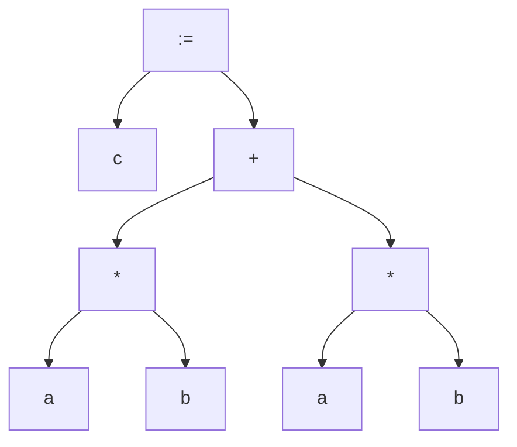
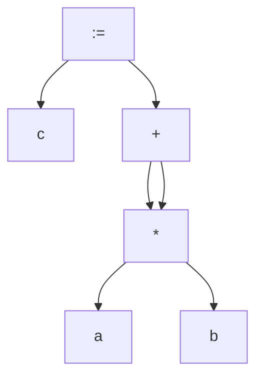

# 中间代码生成

整理自 `编译原理笔记/编译原理学习笔记.pdf` 第 125–145 页（第 5 章中间代码生成），`编译原理笔记/编译原理期末题型整理.pdf` 第 1–2、4 页（高频考点）和第 91–101 页（5 中间代码生成：LL(1) 语法制导、表达式翻译、作业），以及 `编译原理期末资料/吉林大学编译原理期末试题解答.pdf` 第 2 页（四元式知识点总结）。本章选择题收在 `10 选择题精编.md`；`20 大题题型精讲.md` 第 8 节有一道嵌套 while 加二维数组的四元式大题，四元式优化见 `07 中间代码优化.md`。

## 本章要点

- 生成中间代码是为了**便于优化**和**便于移植**。
- 中间代码的形式：逆波兰式、抽象语法树和 DAG、三地址代码（三元式、四元式）。本课用四元式 `(op, ARG1, ARG2, RESULT)`。
- 语法制导：LL(1) 的语义动作符可以放在产生式右部**任何位置**，分析时遇到就执行；LR 的动作只能放在产生式**最右端**，归约时执行。做 LL(1) 语法制导题先把文法改成 LL(1) 的（消除左递归、提取公共前缀）。
- 四元式分量的地址表示分标号类、数值类、地址类；地址类写成 (层数, 偏移, 访问方式)。临时变量层数取 −1，偏移暂取编号。下标变量算出来的是元素地址，访问方式为间接。
- GenCode：两个分量类型不同时，把整型的那个先 FLOAT 成实型，结果为实型，运算符用 F 版本；类型相同用该类型的版本。
- 下标变量每一维三条：`(SUBI, E, L, t)`、`(MULTI, t, S, t')`、`(AADD, 上一步地址, t', t'')`。
- 赋值语句先算左值地址，再算右值，类型不同时把右值转成左边的类型，最后 ASSIG。
- 过程/函数调用：先算各实参，再逐个 VALACT/VARACT 传参，最后 `(CALL, f, true/false, t)`。
- 声明部分只有过程/函数声明产生中间代码：`(ENTRY, Label, Size, Level)` … `(ENDPROC/ENDFUNC, —, —, —)`。

## 概念与解释

### 1. 为什么要生成中间代码

- 便于优化：在中间代码一级做优化，生成的目标代码效率更高。优化不只是精简代码，也包括算法上的优化。
- 便于移植：编译前端（到中间代码为止）与目标机无关，后端与目标机相关。换平台时前端可以复用，只要重写后端。

### 2. 中间代码的形式

#### 2.1 逆波兰式（后缀式）

运算对象写在前面，运算符写在后面。

| 中缀表示 | 逆波兰表示 |
|---|---|
| `a+b` | `ab+` |
| `a+b*c` | `abc*+` |
| `(a+b)*c` | `ab+c*` |

特点：变量的次序与中缀式**完全一致**；没有括号；运算符已按计算顺序排列。

计值方法：从左到右扫描，碰到运算对象就进栈，碰到运算符就从栈顶弹出相应个数的运算对象做运算，结果再进栈，最后结果留在栈顶。例如 `b+c*d` 的后缀式 `bcd*+`：b、c、d 依次进栈；扫描到 `*`，弹出 d 和 c，算 `t1 = c*d` 进栈；扫描到 `+`，弹出 t1 和 b，算 `t2 = b+t1` 进栈，t2 就是结果。

#### 2.2 抽象语法树和 DAG

抽象语法树能直接表示源程序的结构，是常用的标准中间代码形式。DAG（有向无环图）由抽象语法树发展而来，优点是能表示公共子表达式的共享。

以 `c := a*b + a*b` 为例，抽象语法树：



DAG 里两个 `a*b` 合成一个结点，`+` 的两条边都指向它：



#### 2.3 三元式和四元式

三地址指运算符的两个运算分量和运算结果的抽象地址。常见的是三元式和四元式。以 `a := b*c + b/d` 为例：

| 三元式 (op, ARG1, ARG2) | 四元式 (op, ARG1, ARG2, RESULT) |
|---|---|
| (1) `(*, b, c)` | `(*, b, c, t1)` |
| (2) `(/, b, d)` | `(/, b, d, t2)` |
| (3) `(+, (1), (2))` | `(+, t1, t2, t3)` |
| (4) `(:=, (3), a)` | `(:=, t3, —, a)` |

- 三元式表示简单，但运算结果靠行号引用，移动或删除一条就要改其他行的引用，不利于优化。
- 四元式的结果有自己的名字，不依赖位置，便于插入、删除和移动。

#### 2.4 常用四元式

| 类别 | 四元式 | 含义 |
|---|---|---|
| 算术、逻辑、关系运算 | ADDI、ADDF、SUBI、SUBF、MULTI、MULTF、DIVI、DIVF、MOD、AND、OR、EQ、NE、GT、GE、LT、LE | 后缀 I 为整型运算，F 为实型运算 |
| 输入输出 | (READI, —, —, id)、(READF, —, —, id)、(WRITE, —, —, id) | 整数输入、实数输入、输出 id |
| 类型转换 | (FLOAT, id1, —, id2) | id2 := float(id1) |
| 赋值 | (ASSIG, id1, —, id2) | id2 := id1 |
| 地址加 | (AADD, id1, id2, id3) | id3 := addr(id1) + id2 |
| 标号定义 | (LABEL, —, —, label) | 定义标号 label |
| 转移 | (JMP, —, —, label)、(JMP0, id, —, label)、(JMP1, id, —, label) | 无条件转；id=0 时转；id=1 时转 |
| 过程 | (ENTRY, Label, Size, Level)、(CALL, f, —, Result) | 子程序入口；过程或函数调用 |
| 传送参数 | VARACT、VALACT、FUNACT、PROACT | 传变参、值参、函数参数、过程参数 |

### 3. 语法制导方法

**语法制导**：在语法分析的同时完成相应的语义动作。语义动作是一些程序，完成用户要求的处理。它依赖具体的语法分析方法：

| | 自顶向下（LL(1) 语法制导） | 自底向上（LR(1) 语法制导） |
|---|---|---|
| 基础 | LL(1) 文法加语义动作符 | LR(1) 文法加语义动作符 |
| 动作符位置 | 产生式右部任何位置 | 每条产生式最多一个，只能放在最右端 |
| 何时执行 | 分析过程中遇到动作符就调用对应的语义子程序 | 按某产生式归约时调用该产生式右端的语义子程序 |

做 LL(1) 语法制导的题，先要让文法满足 LL(1) 条件，也就是消除左递归、提取公共前缀。

#### 3.1 例：输出 b 串的长度

要求：对文法 G 的任意句子，输出其中 b 串的长度。如 `abbbbc` 是 G 的句子，输出 4。

```text
S → AB
A → aA | b
B → bB | c
```

原始 LL(1) 分析表：

| | a | b | c | # |
|---|---|---|---|---|
| S | S → AB | S → AB | | |
| A | A → aA | A → b | | |
| B | | B → bB | B → c | |

加入动作符（识别到 b 就计数，结束时打印）：

```text
[1] S → #Init# A B
[2] A → a A
[3] A → b #Add#
[4] B → b #Add# B
[5] B → c #Out_Val#
```

语义子程序：`Init: m = 0;`，`Add: m++;`，`Out_Val: printf("%d", m);`

带动作符的 LL(1) 分析表（动作符不影响 Predict 集，表的形状不变）：

| | a | b | c | # |
|---|---|---|---|---|
| S | [1] | [1] | | |
| A | [2] | [3] | | |
| B | | [4] | [5] | |

分析 `abbbbc` 的过程（栈顶在左，# 为栈底和输入结束符；用 Python 模拟复核）：

| 分析栈 | 输入流 | 动作 |
|---|---|---|
| `S #` | `abbbbc#` | LL[S,a] = [1] |
| `#Init# A B #` | `abbbbc#` | 执行 Init，m = 0 |
| `A B #` | `abbbbc#` | LL[A,a] = [2] |
| `a A B #` | `abbbbc#` | 匹配 a |
| `A B #` | `bbbbc#` | LL[A,b] = [3] |
| `b #Add# B #` | `bbbbc#` | 匹配 b |
| `#Add# B #` | `bbbc#` | 执行 Add，m = 1 |
| `B #` | `bbbc#` | LL[B,b] = [4] |
| `b #Add# B #` | `bbbc#` | 匹配 b |
| `#Add# B #` | `bbc#` | 执行 Add，m = 2 |
| `B #` | `bbc#` | LL[B,b] = [4] |
| `b #Add# B #` | `bbc#` | 匹配 b |
| `#Add# B #` | `bc#` | 执行 Add，m = 3 |
| `B #` | `bc#` | LL[B,b] = [4] |
| `b #Add# B #` | `bc#` | 匹配 b |
| `#Add# B #` | `c#` | 执行 Add，m = 4 |
| `B #` | `c#` | LL[B,c] = [5] |
| `c #Out_Val# #` | `c#` | 匹配 c |
| `#Out_Val# #` | `#` | 执行 `Out_Val`，输出 4 |
| `#` | `#` | 成功 |

（更正：原稿跟踪表在匹配 a 之后把输入流写成 `bbbc #`，少了一个 b，之后几行的动作列也错开了一行，这里重新跟踪。）

题型整理第 4 页还列了一道"给出文法写语法制导方案，在移入-归约分析中归约时执行括号里的操作，问输入 aacbb 时输出什么、要归约几次"，原稿没有给出文法，无法整理。

### 4. 中间代码生成中的几个问题

#### 4.1 四元式里的地址表示

- 符号表一直保存到目标代码生成阶段：四元式里的标识符可以直接用它在符号表中的地址表示。
- 符号表不保存到目标代码生成阶段：目标代码生成时给名字分配地址所需的信息（抽象地址即层数和偏移、直接或间接访问）必须放进四元式的运算分量和结果里。

运算分量和结果的地址表示分三类：

| 类别 | 语义信息 |
|---|---|
| 标号类 | 标号值，包括过程/函数体的入口标号（对应代码区地址） |
| 数值类 | 数据值本身 |
| 地址类 | (层数, 偏移, 访问方式)。变参、指针变量，以及代表复杂变量地址的临时变量是间接访问（indir） |

临时变量：没有层数概念，层数取任意负数，如 −1；生成阶段会产生大量临时变量，优化后只剩少数，此时还定不了偏移，偏移暂取临时变量的编号。

例：`3.5 + i` 写成 `(ADDF, 3.5, (i.level, i.off, dir), (-1, t3, dir))`。这里只演示地址表示，省略了把 i 转成实型的 FLOAT 四元式。

语义信息有两种放法：放一个指向符号表的指针，或者把分量的语义信息直接写在四元式里。

#### 4.2 语义栈 Sem 和 GenCode

语义栈 Sem 在语法制导生成中间代码时存放运算分量和运算结果的语义信息，有进栈、退栈操作，结构可以自己定义。

`GenCode(ω, left, right, result)` 把一条四元式存进中间代码区。生成表达式代码时，执行 GenCode 的那一刻左、右分量的语义信息已经在 Sem 的次栈顶和栈顶，所以只需给出运算符 ω。GenCode(ω) 的工作（以二元运算为例）：

1. 若 `Sem[top-1].typ ≠ Sem[top].typ` 且 `Sem[top-1].typ = integer`，结果类型定为 real，为左分量生成 `(FLOAT, Sem[top-1].FORM, —, tempArg)`。
2. 若 `Sem[top-1].typ ≠ Sem[top].typ` 且 `Sem[top].typ = integer`，结果类型定为 real，为右分量生成 `(FLOAT, Sem[top].FORM, —, tempArg)`。
3. 若两者类型相同，结果类型就是这个类型，不生成转换代码。
4. 生成 `(ω*, 左分量或 tempArg, 右分量或 tempArg, t)`，`ω*` 是按结果类型选的 I 版或 F 版运算符。
5. 从 Sem 中删去 `Sem[top-1]` 和 `Sem[top]`，把结果 t 的语义信息压栈。

### 5. 表达式的中间代码

表达式的中间代码是正确计算表达式值的四元式序列。表达式里的变量可以是简单变量、复杂变量（数组元素、结构体成员），也可以是函数调用。下面是简单算术表达式的 LL(1) 语法制导方法。

原始文法：

```text
E  → T Es
Es → + T Es | - T Es | ε
T  → P Ts
Ts → * P Ts | / P Ts | ε
P  → C | id | (E)
```

带动作符的 LL(1) 文法：

```text
(1)  E  → T Es
(2)  Es → ε
(3)  Es → + T #GenCode(+)# Es
(4)  Es → - T #GenCode(-)# Es
(5)  T  → P Ts
(6)  Ts → ε
(7)  Ts → * P #GenCode(*)# Ts
(8)  Ts → / P #GenCode(/)# Ts
(9)  P  → C #Push(C)#
(10) P  → id #Push(id)#
(11) P  → (E)
```

- 遇到常量 C 或简单变量 id，把它的语义信息压入 Sem（Push）。
- 处理完运算符的右分量时，左、右分量已在 Sem 的次栈顶和栈顶，生成该运算的四元式，结果压栈（GenCode）。

LL(1) 分析表（原稿略去，整理补充；格子里是产生式编号，Predict 集用 Python 算过）：

| | id | C | `+` | `-` | `*` | `/` | `(` | `)` | `#` |
|---|---|---|---|---|---|---|---|---|---|
| E | 1 | 1 | | | | | 1 | | |
| Es | | | 3 | 4 | | | | 2 | 2 |
| T | 5 | 5 | | | | | 5 | | |
| Ts | | | 6 | 6 | 7 | 8 | | 6 | 6 |
| P | 10 | 9 | | | | | 11 | | |

`x+y*z`（均为整型）的生成过程（原稿只有文字描述，而且用了"规约"这种 LR 的说法；这里整理成完整的分析表，用 Python 模拟复核）：

| 步骤 | 分析栈（栈顶在左） | 输入流 | 动作 | Sem（栈顶在右） |
|---|---|---|---|---|
| 1 | `E #` | `x + y * z #` | 用 (1) `E → T Es` | 空 |
| 2 | `T Es #` | `x + y * z #` | 用 (5) `T → P Ts` | 空 |
| 3 | `P Ts Es #` | `x + y * z #` | 用 (10) `P → id #Push(id)#` | 空 |
| 4 | `id #Push(id)# Ts Es #` | `x + y * z #` | 匹配 x | 空 |
| 5 | `#Push(id)# Ts Es #` | `+ y * z #` | 执行 Push | x |
| 6 | `Ts Es #` | `+ y * z #` | 用 (6) `Ts → ε` | x |
| 7 | `Es #` | `+ y * z #` | 用 (3) `Es → + T #GenCode(+)# Es` | x |
| 8 | `+ T #GenCode(+)# Es #` | `+ y * z #` | 匹配 + | x |
| 9 | `T #GenCode(+)# Es #` | `y * z #` | 用 (5) `T → P Ts` | x |
| 10 | `P Ts #GenCode(+)# Es #` | `y * z #` | 用 (10) `P → id #Push(id)#` | x |
| 11 | `id #Push(id)# Ts #GenCode(+)# Es #` | `y * z #` | 匹配 y | x |
| 12 | `#Push(id)# Ts #GenCode(+)# Es #` | `* z #` | 执行 Push | x, y |
| 13 | `Ts #GenCode(+)# Es #` | `* z #` | 用 (7) `Ts → * P #GenCode(*)# Ts` | x, y |
| 14 | `* P #GenCode(*)# Ts #GenCode(+)# Es #` | `* z #` | 匹配 `*` | x, y |
| 15 | `P #GenCode(*)# Ts #GenCode(+)# Es #` | `z #` | 用 (10) `P → id #Push(id)#` | x, y |
| 16 | `id #Push(id)# #GenCode(*)# Ts #GenCode(+)# Es #` | `z #` | 匹配 z | x, y |
| 17 | `#Push(id)# #GenCode(*)# Ts #GenCode(+)# Es #` | `#` | 执行 Push | x, y, z |
| 18 | `#GenCode(*)# Ts #GenCode(+)# Es #` | `#` | 执行 `GenCode(*)`，生成 `(MULTI, y, z, t1)` | x, t1 |
| 19 | `Ts #GenCode(+)# Es #` | `#` | 用 (6) `Ts → ε` | x, t1 |
| 20 | `#GenCode(+)# Es #` | `#` | 执行 `GenCode(+)`，生成 `(ADDI, x, t1, t2)` | t2 |
| 21 | `Es #` | `#` | 用 (2) `Es → ε` | t2 |
| 22 | `#` | `#` | 成功 | t2 |

写成带地址表示的形式：

```text
(MULTI, (y.level, y.off, dir), (z.level, z.off, dir), (-1, t1, dir))
(ADDI,  (x.level, x.off, dir), (-1, t1, dir), (-1, t2, dir))
```

`*` 比 `+` 先生成，是因为 `#GenCode(+)#` 压在栈里要等 T（也就是 `y*z` 整个）处理完才轮到它。混合类型的例子见典型题 4。

### 6. 下标变量的中间代码

#### 6.1 地址计算

数组声明 `A: array [L1..U1][L2..U2]...[Ln..Un] of T`（n ≥ 1），记 $D_i = U_i - L_i + 1$ 为第 i 维的长度，α = size(T)。

$$Addr(A[i_1][i_2]\ldots[i_n]) = Addr(A) + (i_1 - L_1) \cdot S_1 + (i_2 - L_2) \cdot S_2 + \cdots + (i_n - L_n) \cdot S_n$$

其中 $S_i = D_{i+1} \cdot D_{i+2} \cdots D_n \cdot \alpha$ 是第 i 层元素（去掉前 i 维后剩下的子数组）的大小， $S_n = \alpha$， $S_0 = D_1 \cdots D_n \cdot \alpha = size(A)$。从数组类型的内部表示递推： $S_n = size(T)$， $S_i = S_{i+1} \cdot D_{i+1}$。

#### 6.2 四元式结构

对下标变量 `A[E1][E2]...[Ek]`（k ≤ n）：

```text
E1 的中间代码，结果在 t1
(SUBI,  t1, L1, t2)       // i1 - L1
(MULTI, t2, S1, t3)       // (i1 - L1) * S1
(AADD,  A,  t3, t4)       // A[E1] 的地址
E2 的中间代码，结果在 t5
(SUBI,  t5, L2, t6)
(MULTI, t6, S2, t7)
(AADD,  t4, t7, t8)       // A[E1][E2] 的地址
...                        // 每一维都是这三条，AADD 的第一个分量是上一维算出的地址
```

最后一条 AADD 的结果是元素地址，访问方式为间接（indir）。

#### 6.3 动作文法

```text
V → id #Push(id)# A
A → ε
A → #Init# [ E ] #AddNext# B
B → ε
B → [ E ] #AddNext# B
```

- Push(id)：遇到数组名，把它的语义信息（类型、地址）压栈。
- Init：下标计数器 k := 0。
- AddNext（在每个 `[E]` 之后执行）：
  1. k := k + 1。
  2. 从 Sem 取出下标表达式的结果 result。
  3. 生成 `(SUBI, result, Lk, tn+1)` 和 `(MULTI, tn+1, Sk, tn+2)`。
  4. 从 Sem 取出前 k−1 维累加出的地址 t?（第一维时就是数组名 A）。
  5. 生成 `(AADD, t?, tn+2, tn+3)`。
  6. 弹出 result 和 t?，把 tn+3 压栈。

扩展到表达式时，原稿把新规则编为 (12) `V → id #Push(id)# A`、(13)(14) A 的两个候选、(15)(16) B 的两个候选，同时保留了 (10) `P → id #Push(id)#`。（整理说明：这样 P 的两个候选都以 id 开头，不是 LL(1) 的；(10) 应改成 `P → V`，简单变量走 `A → ε` 即可。改完后用 Python 求过 Predict 集，没有冲突。）

#### 6.4 例：a[i][j]

设 `a: array[1..10][1..5] of integer`，则 L1 = L2 = 1，S2 = 1，S1 = D2 × S2 = 5。

关键步骤：

1. 用 `V → id #Push(id)# A` 匹配 a，a 的语义信息入栈。
2. 看到 `[`，用 `A → #Init# [E] #AddNext# B`，执行 Init，k = 0。
3. 处理 E1 = i，i 入栈；匹配 `]`。
4. 执行 AddNext：k = 1；弹出 i，生成 `(SUBI, i, 1, t1)`、`(MULTI, t1, 5, t2)`；弹出 a，生成 `(AADD, a, t2, t3)`，t3 入栈，代表 a[i] 的地址。
5. 看到 `[`，用 `B → [E] #AddNext# B`；处理 j，j 入栈；匹配 `]`。
6. 执行 AddNext：k = 2；弹出 j，生成 `(SUBI, j, 1, t4)`、`(MULTI, t4, 1, t5)`；弹出 t3，生成 `(AADD, t3, t5, t6)`，t6 入栈，代表 a[i][j] 的地址。
7. 遇到 #，用 `B → ε`，下标处理结束。

```text
(SUBI,  i,  1,  t1)
(MULTI, t1, 5,  t2)
(AADD,  a,  t2, t3)    // a[i] 的地址
(SUBI,  j,  1,  t4)
(MULTI, t4, 1,  t5)
(AADD,  t3, t5, t6)    // a[i][j] 的地址
```

### 7. 赋值语句的中间代码

形式 `Left := Right`，四元式结构：

1. Left 的中间代码（算出左值地址）。
2. Right 的中间代码（算出右值）。
3. 类型不同时生成类型转换代码。
4. `(ASSIG, Right 的结果, —, Left)`。

动作文法：

```text
S → V := E #Assig#
```

Assig 动作：从语义栈取出赋值号左右两边（V 和 E）的语义信息；比较类型，不同就生成类型转换代码（把右边的结果转成左边变量的类型）；生成 `(ASSIG, 右值结果, —, 左值地址)`。

例：i、j、x、y 都是整型，`a: array[1..10][1..5] of integer`，语句 `a[i][j] := x + y*3`（原稿没写出语句，由四元式注释推得）。

```text
1. (SUBI,  i,  1,  t1)
2. (MULTI, t1, 5,  t2)
3. (AADD,  a,  t2, t3)    // a[i] 的地址
4. (SUBI,  j,  1,  t4)
5. (MULTI, t4, 1,  t5)
6. (AADD,  t3, t5, t6)    // a[i][j] 的地址（Left）
7. (MULTI, y,  3,  t7)    // y*3
8. (ADDI,  x,  t7, t8)    // x+y*3（Right）
9. (ASSIG, t8, —,  t6)
```

（更正：第 1 条原文作 `(ADDI, i, 1, t1)`，算的是 i − L1，应为 SUBI。结果已用 Python 按动作文法模拟复核。）

### 8. 过程调用和函数调用的中间代码

形参有三种：值参、变参、函数（过程）参数。生成代码要知道形参的种类、传送的内容、偏移、个数，以及被调用的是实在函数还是形式函数。

语法形式 `ProcFunCall → id (E1, ..., En)`，`call f(E1, ..., En)` 的中间代码结构：

```text
E1 的中间代码
...
En 的中间代码
(VALACT 或 VARACT, t1, Offset1, Size1)    // 把实参结果送到形参
...
(VALACT 或 VARACT, tn, Offsetn, Sizen)
(CALL, f, true 或 false, Result)          // 转去执行过程/函数体
```

CALL 的第三个分量：true 表示静态确定转向地址（f 是实在过程/函数）；false 表示动态确定转向地址（f 是形参函数）。

语义检查：id 是不是过程/函数名；每个实参 Ei 和形参 Xi 的类型、种类是否匹配；实参个数和形参个数是否相同。

#### 8.1 例：f(X+1, Y)

X 是一般整型变量，Y 是变参整型变量，f 是实在函数；f 的第一个形参是整型值参，第二个是整型变参。

```text
(ADDI,   X,  1,       t1)    // 算 X+1
(VALACT, t1, Offset1, 1)     // 值参：传 t1 的值
(VARACT, Y,  Offset2, 1)     // 变参：传 Y 的地址，占 1 个单元
(CALL,   f,  true,    t2)    // f 是函数，返回值放 t2
```

Offset1、Offset2 是 f 第 1、2 个形参的偏移。试题解答第 2 页把同一例写成 `(+, X, 1, t1)`、`(VALACT, t1, offset, 1)`、`(VARACT, t1, offset + 1, 1)`、`(CALL, f, true, t2)`，第二个形参偏移记为 offset+1。（更正：试题解答里 VARACT 传的原文作 t1，变参应传 Y。）

#### 8.2 动作文法

```text
<ProcFunCall> → id #CallHead# ( <ParamList> ) #CallTail#
<ParamList>   → ε | <ExpList>
<ExpList>     → E #ActParam# <NextList>
<NextList>    → ε | , <ExpList>
```

- CallHead：遇到过程/函数名 id，把它的符号表地址压入 Sem；实参计数器置 0。
- ActParam：每个实参 E 生成完中间代码后，把结果的类型和语义信息压入 Sem，实参计数器加 1。
- CallTail：取出 id 的全部语义信息（包括各形参是值参还是变参、类型、区距）；检查形参实参个数是否一致、类型是否匹配；生成 VARACT 或 VALACT；按 f 是实在过程/函数还是形式过程生成相应的 CALL；删除这次调用在语义栈里占的单元，若 f 是函数，再把返回值的类型和语义信息压栈。

#### 8.3 例：x + f(H(10), g(Y))

x 是整型变量；H 返回整型，是形参函数名，形参为整型值参；f、g 返回整型，是实在函数名；f 的参数均为整型值参，g 的参数为变参。

```text
1. (VALACT, 10, OffsetH1, 1)    // H(10)：传值参 10
2. (CALL,   H,  false,    t1)   // H 是形式函数，动态确定地址
3. (VARACT, Y,  Offsetg1, 1)    // g(Y)：传变参 Y
4. (CALL,   g,  true,     t2)
5. (VALACT, t1, Offsetf1, 1)    // f(t1, t2)
6. (VALACT, t2, Offsetf2, 1)
7. (CALL,   f,  true,     t3)
8. (ADDI,   x,  t3,       t4)   // x + f(...)
```

实参要先全部算完（1–4），才轮到给 f 传参（5–6）。

### 9. 控制语句的中间代码

#### 9.1 GOTO 语句和标号

标号有两种定义方式。

用说明语句定义（Pascal：`LABEL L1, L2, ..., Ln;`）：设标号表（类似符号表），进入局部化单位时建本层标号表，结束时删除。

- 扫描 `LABEL L1, L2, ...`：用 NewLabel 给每个 Li 分配内部标号 LLi，把 (Li, LLi) 填进标号表。
- `goto Li`：生成 `(JMP, —, —, LLi)`。
- `Li: S`：生成 `(LABEL, —, —, LLi)`。

直接写在语句前面（C、Java：`Li: S`）：处理程序前建一个数组 ArrayL，记录遇到的标号和语义信息（内部标号、是否已定位），初始为空。

- `goto Li`：
  - ArrayL 里查不到 Li：生成转移地址待回填的 `(JMP, —, —, —)`，把 Li、这条四元式的编号、"未定位"标志登记进 ArrayL。
  - 查到且已定位：取出 LLi，生成 `(JMP, —, —, LLi)`。
  - 查到但未定位：生成一条待回填的 JMP，它的地址栏填 ArrayL(Li) 里记着的上一条待回填 JMP 的编号，再把这条新 JMP 的编号记回 ArrayL(Li)，所有等 Li 的 JMP 就串成了一条链。（整理说明：原稿此句写作"用 ArrayL(Li) 的地址填入该中间代码的编号"，表述不清，这里按回填链理解。）
- `Li: S`：
  - 给 Li 分配内部标号 LLi，生成 `(LABEL, —, —, LLi)`。
  - ArrayL 里查不到 Li：登记 Li 及其语义信息，标为已定位。
  - 查到且未定位：把 LLi 回填到所有等待它的 JMP 四元式里，改为已定位。

#### 9.2 条件语句

```text
if E then S1 else S2          if E then S1
E 的中间代码                   E 的中间代码
(THEN, E.FORM, —, —)          (THEN, E.FORM, —, —)
S1 的中间代码                  S1 的中间代码
(ELSE, —, —, —)               (ENDIF, —, —, —)
S2 的中间代码
(ENDIF, —, —, —)
```

- THEN：条件转移，E 为假时转到 S2（没有 else 时转到 ENDIF 之后）。（更正：原文作"若 E 为真则跳过 else 部分"。）
- ELSE：S1 执行完无条件跳过 S2（转移），同时标出 S2 的开始位置（定位）。
- ENDIF：定位，标出 if 语句的结束位置。

动作文法：

```text
<S>        → if <E> then #ThenIf# <S> <ElsePart> #EndIf#
<ElsePart> → else #ElseIf# <S> | ε
```

- ThenIf：遇到 then 时 E 的结果已在 Sem 栈顶；检查 `Sem[top].FORM` 是否为 boolean 型；生成 `(THEN, Sem[top].FORM, —, —)`；pop(1)。
- ElseIf：遇到 else，生成 `(ELSE, —, —, —)`。
- EndIf：条件语句结束，生成 `(ENDIF, —, —, —)`。
- THEN 和 ELSE 的转移目标要回填。

#### 9.3 while 语句

```text
(WHILE, —, —, —)       // 定位：循环入口
E 的中间代码
(DO, E.FORM, —, —)     // 条件转移：E 为假时跳出循环
S 的中间代码
(ENDWHILE, —, —, —)    // 转回 WHILE 处，同时标出循环出口
```

动作文法：

```text
<S> → while #StartWhile# <E> do #DoWhile# <S> #EndWhile#
```

- StartWhile：遇到 while，生成 `(WHILE, —, —, —)`。
- DoWhile：遇到 do 时 E 已处理完，类型和地址在 `Sem[top]`；检查是否为 boolean 型；生成 `(DO, Sem[top].FORM, —, —)`；pop(1)。
- EndWhile：循环结束，生成 `(ENDWHILE, —, —, —)`。
- WHILE、DO、ENDWHILE 的转移目标要回填。

#### 9.4 repeat 语句和 for 语句

来自试题解答第 2 页的知识点总结。

`repeat S until E`：原稿只列了三条四元式 `(REPEAT, —, —, —)`、`(UNTIL, E.FORM, —, —)`、`(ENDREPEAT, —, —, —)`，没写 S 和 E 的代码放在哪里。按执行顺序应为（整理补充）：

```text
(REPEAT, —, —, —)       // 定位：循环入口
S 的中间代码
E 的中间代码
(UNTIL, E.FORM, —, —)   // E 为假时转回 REPEAT
(ENDREPEAT, —, —, —)    // 定位：循环出口
```

`for (E1; E2; E3) S`：

```text
E1 的中间代码
(FOR, —, —, —)          // 定位：循环入口
E2 的中间代码
(DO, E2.FORM, —, —)     // E2 为假时跳出
S 的中间代码
E3 的中间代码
(ENDFOR, —, —, —)       // 转回 FOR
```

（原文 `E.From`、`E2.FROM` 是 FORM 的笔误。试题解答里 case 语句的四元式一项原作者注明"暂时不知道写"，没有内容。）

### 10. 过程/函数声明的中间代码

过程/函数 Q 的声明对应：

- 入口：`(ENTRY, LabelQ, SizeQ, LevelQ)`，四个分量是入口标号、活动记录大小、层数；Size 要回填才知道。若 Q 是形式参数，则为 `(ENTRY, Q, —, —)`，作用相当于定位语句。
- 出口：过程为 `(ENDPROC, —, —, —)`，函数为 `(ENDFUNC, —, —, —)`。

语法形式和动作文法：

```text
ProcFunDec → ProcDec | FunDec
ProcDec    → Procedure id ( ParamList ) ; Declaration #Entry# ProgramBody #EndProc#
FunDec     → Function id ( ParamList ) : Type ; Declaration #Entry# ProgramBody #EndFunc#
```

ParamList 是参数声明，Declaration 是声明部分，ProgramBody 是程序体，Type 是函数的返回类型。

- Entry：给子程序 Q 分配新标号 LabelQ 并填进 Q 的符号表项；生成入口四元式。
- EndProc、EndFunc：生成出口四元式。

`#Entry#` 在 Declaration 之后，所以内层过程/函数的代码先于外层的 ENTRY 生成。

例（不保存符号表）：

```pascal
procedure Q(x: real);
var u: real;
function f(k: real): real;
begin
    f := k + k
end;
begin               (* Q 的过程体 *)
    u := f(50);
    y := u * x
end;
```

```text
 1. (ENTRY,  Labelf, Sizef, Lf)   // 函数 f 的入口
 2. (ADDF,   k,  k,  t0)          // k + k
 3. (ASSIG,  t0, —,  f)           // f := k + k
 4. (ENDFUNC, —, —,  —)           // f 结束
 5. (ENTRY,  LabelQ, SizeQ, LQ)   // 过程 Q 的入口
 6. (FLOAT,  50, —,  t1)          // f 的形参 k 是 real，50 先转实型
 7. (VALACT, t1, offk, 2)         // 值参，k 的偏移记为 offk，实型占 2
 8. (CALL,   Labelf, true, t2)    // 调用 f
 9. (ASSIG,  t2, —,  u)           // u := f(50)
10. (MULTF,  u,  x,  t3)          // u * x
11. (ASSIG,  t3, —,  y)           // y := u * x
12. (ENDPROC, —, —,  —)           // Q 结束
```

## 易混对比

| 对比项 | A | B |
|---|---|---|
| 三元式 / 四元式 | 结果靠行号引用，移动删除要改引用，不利于优化 | 结果有名字（临时变量），便于插入、删除、移动 |
| 抽象语法树 / DAG | 相同子表达式各自一棵子树 | 相同子表达式共享一个结点 |
| LL(1) 语法制导 / LR 语法制导 | 动作符可放右部任何位置，遇到即执行；文法要先消除左递归和公共前缀 | 动作只能放最右端，归约时执行 |
| 直接地址 / 间接地址 | 普通变量、值参、存数值的临时变量（dir） | 变参、指针变量、下标变量算出的地址（indir） |
| VALACT / VARACT | 传值参，传表达式的值，Size 按类型 | 传变参，传变量地址，Size 为 1 |
| (CALL, f, true, t) / (CALL, f, false, t) | f 是实在过程/函数，转向地址静态确定 | f 是形式过程/函数，转向地址运行时确定 |
| (ENTRY, Label, Size, Level) / (ENTRY, Q, —, —) | 实在过程/函数的入口 | Q 是形式参数 |
| 条件为假时：THEN、DO / UNTIL | THEN 转到 else 部分；DO 跳出 while 循环 | UNTIL 转回 REPEAT 再执行一遍 |

各语句四元式一览：

| 语句 | 四元式骨架 |
|---|---|
| `if E then S1 else S2` | E；(THEN, E.FORM)；S1；(ELSE)；S2；(ENDIF) |
| `while E do S` | (WHILE)；E；(DO, E.FORM)；S；(ENDWHILE) |
| `repeat S until E` | (REPEAT)；S；E；(UNTIL, E.FORM)；(ENDREPEAT) |
| `for (E1; E2; E3) S` | E1；(FOR)；E2；(DO, E2.FORM)；S；E3；(ENDFOR) |
| `goto L` / `L: S` | (JMP, —, —, LL) / (LABEL, —, —, LL) |
| `V := E` | V 的地址；E；类型转换；(ASSIG, E 的结果, —, V) |
| `f(E1, ..., En)` | E1…En；VALACT/VARACT × n；(CALL, f, true/false, t) |
| 过程/函数声明 | 内层声明的代码；(ENTRY, Label, Size, Level)；过程体；(ENDPROC) 或 (ENDFUNC) |

## 典型题

### 1. 生成中间代码的目的

题目（题型整理第 4 页，原稿无答案）：生成中间代码的目的是什么？

解答（整理补充，依据第 1 节）：

1. 便于优化：可以在中间代码一级做与机器无关的优化，使目标代码效率更高，目标代码生成也更容易。
2. 便于移植：前端与目标机无关，后端与目标机相关，换目标机时只需重写后端。编译程序的逻辑结构也更简洁，便于开发。

### 2. 临时变量的性质

题目（题型整理第 1–2 页）：生成中间代码时会产生大量临时变量，请分析临时变量有哪些性质。

解答：

1. 临时变量都是一种类型。
2. 临时变量在定值之后只会被使用 1 次。
3. 活动区不相交的两个临时变量可以共用一个存储单元。

### 3. 有回溯时怎样保证语义程序正确执行

题目（题型整理第 1 页）：基于 LL(1) 的语法制导方法把在语法规则中插入的程序称为语义程序。如果采用自顶向下的语法分析方法，且分析过程中有回溯，你将采用什么措施保证语义程序的正确执行？

解答：执行两遍语法分析。第一遍根据文法规则和句子确定正确的推导序列，这一遍不执行语义程序；第二遍按确定下来的推导序列再分析一次，这次执行语义程序。

### 4. 混合类型表达式

题目（学习笔记第 134 页；题型整理第 101 页）：将表达式 `X*2+A*(i+1)/(j+1)` 翻译成四元式序列，i 和 j 为整型变量，其他为实型变量。

思路：按后缀式 `X2*Ai1+*j1+/+` 的运算顺序生成，每做一次运算看两个分量的类型，整型遇上实型就先 FLOAT。

解答（已用 Python 按 GenCode 规则模拟复核）：

```text
1. (FLOAT, 2,  —,  t1)    // 2 是整数，X 是实数，2 转实型
2. (MULTF, X,  t1, t2)    // X*2
3. (ADDI,  i,  1,  t3)    // i+1
4. (FLOAT, t3, —,  t4)    // A 是实数，t3 转实型
5. (MULTF, A,  t4, t5)    // A*(i+1)
6. (ADDI,  j,  1,  t6)    // j+1
7. (FLOAT, t6, —,  t7)    // t5 是实数，t6 转实型
8. (DIVF,  t5, t7, t8)    // A*(i+1)/(j+1)
9. (ADDF,  t2, t8, t9)    // X*2 + A*(i+1)/(j+1)
```

注意 FLOAT 也要占一个临时变量编号；`A*(i+1)/(j+1)` 按左结合，先乘后除。

### 5. 一维数组元素赋值

题目（学习笔记第 125 页，原稿只有题目）：`int A[10];` 写出 `A[i] = A[j] + 1` 的四元式，有几条，分别是什么。

思路：C 数组下界为 0，int 占 1，所以 L1 = 0，S1 = 1。先算左值 A[i] 的地址，再算右值。

解答（整理补充，已用 Python 按赋值语句动作文法模拟）：共 8 条。

```text
1. (SUBI,  i,  0,  t1)
2. (MULTI, t1, 1,  t2)
3. (AADD,  A,  t2, t3)    // A[i] 的地址
4. (SUBI,  j,  0,  t4)
5. (MULTI, t4, 1,  t5)
6. (AADD,  A,  t5, t6)    // A[j] 的地址
7. (ADDI,  t6, 1,  t7)    // A[j] + 1
8. (ASSIG, t7, —,  t3)
```

原稿批注：临时变量 t 在四元式里代表的是语义信息，不是具体地址值，所以第 7 条可以直接写 `(ADDI, t6, 1, t7)`，t6 的语义信息标明它是间接访问，生成目标代码时会先取 t6 所指单元的值再加 1。

### 6. 二维数组下标变量

题目（学习笔记第 135–136 页）：`i, j: integer; a: array[1..10][1..5] of integer;` 写出下标变量 `a[i+1][j*i-2]` 的中间代码。

思路：L1 = 1，D1 = 10；L2 = 1，D2 = 5；S2 = size(integer) = 1，S1 = D2 × S2 = 5。每一维先算下标表达式，再 SUBI、MULTI、AADD。

解答：

```text
1. (ADDI,  i,  1,  t1)    // i+1（E1）
2. (SUBI,  t1, 1,  t2)    // (i+1) - L1
3. (MULTI, t2, 5,  t3)    // ((i+1)-L1)*S1
4. (AADD,  a,  t3, t4)    // a[i+1] 的地址
5. (MULTI, j,  i,  t5)    // j*i
6. (SUBI,  t5, 2,  t6)    // j*i-2（E2）
7. (SUBI,  t6, 1,  t7)    // (j*i-2) - L2
8. (MULTI, t7, 1,  t8)    // ((j*i-2)-L2)*S2
9. (AADD,  t4, t8, t9)    // a[i+1][j*i-2] 的地址
```

（更正：第 5 条原文作 MULI，应为 MULTI。）

### 7. 输出二进制数的位数和数值

题目（题型整理第 99–101 页作业）：文法 G[S] 的产生式为

```text
S → L
L → 0L | 1L | 0 | 1
```

请编写一个语法制导程序，输出 S 产生的二进制数的位数和数值。如生成 1101，则输出"位数为4,值为13"。

思路：自顶向下时从最高位读起，每读一位 val = val × 2 + 该位，位数加 1；L 的候选 `0L` 和 `0` 有公共前缀，要先提取。自底向上时 L 是右递归，最先归约的是最低位，每次归约 val 加上该位的权值 $2^{bit}$。

解答一：自顶向下（依据原稿手写版）。

提取公共前缀：

```text
S  → L
L  → 0 L' | 1 L'
L' → L | ε        即 L' → 0 L' | 1 L' | ε
```

动作文法和语义子程序：

```text
S  → #Init# L #Print#
L  → 0 #Inc0# L' | 1 #Inc1# L'
L' → 0 #Inc0# L' | 1 #Inc1# L' | ε

Init:  bit = 0; val = 0;
Inc0:  val = val * 2;     bit++;
Inc1:  val = val * 2 + 1; bit++;
Print: printf("位数为%d,值为%d", bit, val);
```

以 1101 为例：Init 后 bit = 0，val = 0；读 1，val = 1，bit = 1；读 1，val = 3，bit = 2；读 0，val = 6，bit = 3；读 1，val = 13，bit = 4；输出位数 4、值 13。

（更正：原稿打印版把文法改成 `L → 0 L | 1 L | ε`，允许空串，与原文法不等价；手写版的 `L → 0L' | 1L'` 才保证至少一位。）

解答二：自底向上（LR 分析不需要提取公共前缀，动作只能放在右端）。

```text
S → L #Print#
L → 0 L #Inc0# | 1 L #Inc1# | 0 #Init0# | 1 #Init1#

Init0: bit = 1; val = 0;
Init1: bit = 1; val = 1;
Inc0:  bit++;
Inc1:  val = val + pow(2, bit); bit++;     // pow 求 2 的 bit 次方
Print: printf("位数为%d,值为%d", bit, val);
```

以 1101 为例：先归约最右边的 1（Init1），bit = 1，val = 1；再归约 `0 L`（Inc0），bit = 2；再归约 `1 L`（Inc1），val = 1 + 4 = 5，bit = 3；最后归约 `1 L`，val = 5 + 8 = 13，bit = 4。

（更正：原稿打印版把 L 的后两个候选写成 ε，却又给出了用不上的 Init0、Init1；按原文法应为 `L → 0 #Init0# | 1 #Init1#`。两种解法对 1101 的结果已用 Python 复核。）

### 8. while 中嵌套 if 的四元式

题目（学习笔记第 143 页综合示例）：写出下面程序段的四元式。

```pascal
a := 1;
while a <= 10 do
begin
    if a <> b then
        A[a] := A[b] + 2
    else
        a := a + 1;
    b := b + 1;
end
```

思路：while 套 if-else，按第 9 节的骨架往里填；A[a] := A[b] + 2 先算左值地址，再算右值。

原稿给的是"简化示意"：WHILE、DO、THEN、ELSE 里塞进了 `L_while_start` 之类的标号，另外生成 LABEL 四元式，关系运算写成 `<=`、`<>`，还出现了 `(ADDI, A[b], 2, t_val_b)` 这种直接拿数组元素做分量的写法，和本课四元式的写法不一致。下面按本课写法重写（整理补充，原稿没有 A 的声明，按原稿 `b-1` 后直接地址加的写法，假设 A 下界为 1、元素占 1 个单元，a、b 为整型）：

```text
 1. (ASSIG,    1,  —,  a)
 2. (WHILE,    —,  —,  —)
 3. (LE,       a,  10, t1)
 4. (DO,       t1, —,  —)
 5. (NE,       a,  b,  t2)
 6. (THEN,     t2, —,  —)
 7. (SUBI,     a,  1,  t3)
 8. (MULTI,    t3, 1,  t4)
 9. (AADD,     A,  t4, t5)    // A[a] 的地址
10. (SUBI,     b,  1,  t6)
11. (MULTI,    t6, 1,  t7)
12. (AADD,     A,  t7, t8)    // A[b] 的地址
13. (ADDI,     t8, 2,  t9)    // A[b] + 2
14. (ASSIG,    t9, —,  t5)
15. (ELSE,     —,  —,  —)
16. (ADDI,     a,  1,  t10)
17. (ASSIG,    t10, —, a)
18. (ENDIF,    —,  —,  —)
19. (ADDI,     b,  1,  t11)
20. (ASSIG,    t11, —, b)
21. (ENDWHILE, —,  —,  —)
```

原稿示意版的顺序是先算右边 A[b]+2 再算左边 A[a] 的地址，按第 7 节的赋值语句结构应先算左值。
