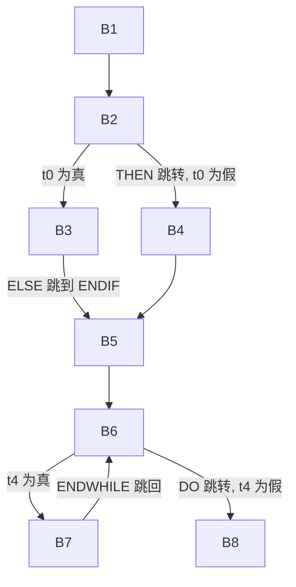

# 中间代码优化

整理自 `编译原理笔记/编译原理学习笔记.pdf` 第 145–156 页（第 6 章中间代码优化），`编译原理笔记/编译原理期末题型整理.pdf` 第 1–2 页（高频考点里的临时变量性质）、第 102–113 页（"6 中间代码优化"的例题和作业，含手写答案）和第 117 页（三重循环优化题）。这几页里没有选择题，学习通里优化相关的选择题见 `10 选择题精编.md`。`20 大题题型精讲.md` 第 9 节还有两道带 if 语句的综合例题，可以对照着练。

## 本章要点

- 考试只考三种优化：**常表达式节省**、**公共表达式节省**、**循环不变式外提**。前两种在**基本块**内做，第三种针对循环。2022 级期末计算题第 4 题"中间代码生成与优化"15 分，就是先写四元式再按这三步优化（见 `软件学院2022级编译原理真题回忆.pdf` 第 3 页）。
- 做大题的固定顺序：写优化前四元式 → 划分基本块 → 常表达式节省 → 公共表达式节省 → 循环不变式外提 → 写优化后四元式。
- 基本块划分四原则：第一条四元式开始；遇**转移性四元式**结束（它本身是出口）；遇**标号性四元式**开始（它本身是入口）；遇对地址引用型变量赋值结束。
- 常表达式节省用 `ConstDef` 表，"已知就算"：两个分量都是常数就算出来并删掉这条四元式；变量被赋非常数值时要把它从表里删掉。
- 公共表达式节省用**值编码**：映象码相同的运算型四元式是公共表达式，删掉后把 (旧临时变量, 新临时变量) 记进 `PAIR` 表，后面用到新变量的地方都换成旧变量。
- 循环不变式外提扫两遍：第一遍把循环里所有被定值的变量放进 `LoopDef`；第二遍找两个分量都不在 `LoopDef` 里的运算型四元式，提到 `WHILE` 之前，并把它的结果从 `LoopDef` 删掉。
- 外提的五条注意事项：赋值不外提；除法不外提；非良性循环（有函数调用或地址引用型变量赋值）整体不做；运算分量是间接寻址时不外提；多层循环从里往外一层层提。原则是**可能出错就不优化**。

## 概念与解释

### 1. 在哪一层做优化

| 层次 | 谁来做 | 与目标机的关系 | 例子 |
| --- | --- | --- | --- |
| 源程序 | 用户（程序员） | 无关 | 换更好的算法和数据结构，代码重构，递归改非递归 |
| 中间代码 | 编译器前端（本章重点） | 无关 | 常表达式节省、公共表达式节省、循环不变式外提 |
| 目标代码 | 编译器后端 | 相关 | 寄存器分配、目标指令优化 |

优化的目标是省时间（执行效率）和省空间。优化本身会增加编译开销，程序编译一次、运行很多次时才划算；实时控制、导航这类对效率要求高的系统更需要优化。原稿还提到，编译器优化后的目标程序通常仍比手写汇编慢，有研究说最多慢到 1.3 倍。

### 2. 优化的分类

- **局部优化**
  - 基本块上的优化：优化的最小单位，实现代价低。包括常表达式节省、公共子表达式节省。
  - 循环上的优化：循环不变式外提（重点）、削减运算强度（效果一般不明显，主要用在循环里）。
- **全局优化**：对整个程序做数据流分析。技术复杂、编译代价大，效果也不一定明显，只在有特殊需求的系统里做。

### 3. 常见的优化种类

| 种类 | 做法 | 例子 |
| --- | --- | --- |
| 数学上的优化 | 恒等式直接用结果，删掉四元式；高强度运算换成低强度 | `(-, a, 0, t1)` 即 `t1 = a`；`(*, a, 1, t2)` 即 `t2 = a`；`2*a` 换成 `a+a`，`a^2` 换成 `a*a` |
| 表达式短路 | `E1 or E2` 中 E1 为真、`E1 and E2` 中 E1 为假时，不再算 E2 | |
| 常表达式节省 | 编译时就能算出值的表达式直接算好（编译一次，多次执行） | `a = 2, b = 3, c = a + b` 优化为 `c = 5` |
| 公共子表达式节省 | 运算符相同、左右分量的值也相同的子表达式只算一次 | 下标计算重用：`a[i][j]+a[i][k]` 中 `a[i]` 的地址只算一次 |
| 循环不变式外提 | 循环里值不变的表达式提到循环外算 | 见下 |
| 削减运算强度 | 用低强度运算代替高强度运算，主要针对循环 | 见下 |
| 消除无用语句、冗余代码 | 编译时就能确定走哪个分支 | `if (E1 恒等于 true) S1 else S2` 直接简化为 `S1` |
| 寄存器优化 | 目标程序执行时如何分配、剥夺目标机寄存器 | |
| 中间变量优化 | 本质是省存储空间：两个临时变量的活动区（从定值到最后一次使用）不相交，就共用一个存储单元 | |
| 目标代码优化 | 减少目标指令条数 | 两个运算分量都已在寄存器中，直接运算，不必先存回内存 |
| 全局优化 | 全局数据流分析 | |

公共子表达式的"值相同"要看本质：`b*c` 和 `e*f` 字面不同，但若 `e = b, f = c`，结果也一样。原稿的例子：

```text
优化前                 优化后
t := b * c ;           t := b * c ;
e := b * c + e * f ;   e := t + e * f ;    // b*c 换成 t
c := b * c + 10 ;      c := t + 10 ;       // b*c 换成 t
d := b * c + d ;       d := b * c + d ;    // 上一句改了 c，这里的 b*c 不能换成 t
```

（更正：原文第 2 行注释作"假设 `b*c` 和 `e*f` 等价，这里 t 替换了 `b*c`"，实际替换依据是 `b*c` 与第 1 句相同，和 `e*f` 无关；第 4 行注释作"如果 `b*c` 在之前仍未被修改，则也可替换为 t"，但第 3 句已经给 c 赋了新值，这里不能替换。）

循环不变式外提和削减运算强度的例子：

```c
/* 循环不变式外提 */
while (k < 10) {              t = b * c;           // b*c 在循环中不变，提到循环外
    a[k] = b * c;             while (k < 10) {
    k = k + 1;                    a[k] = t;
}                                 k = k + 1;
                              }

/* 削减运算强度 */
for j := 1 to 100 do          m = 13;              // 13 = 3*1 + 10，j=1 时的值
    A[j] = 3 * j + 10;        for j := 1 to 100 do {
                                  A[j] = m;
                                  m = m + 3;       // 每轮加 3，代替乘法
                              }
```

循环里的操作会随循环次数成倍重复，所以循环优化一直是重点。单独对一两个表达式做强度削减意义不大。

### 4. 基本块与程序流图

**基本块**是程序中一组顺序执行的语句序列，只有一个入口（第一条语句）和一个出口（最后一条语句）。

为什么在基本块里做优化：块内没有控制流跳进跳出，变量的值怎么来、怎么传是可判定的，容易保证优化不出错。

基本块的特点：

1. 只能从入口进入、从出口退出。
2. 块内语句要么全执行，要么全不执行，不能从中间转出或转入。
3. 可以在源代码、中间代码、目标代码三个级别上划分。

**划分四原则**：

1. 初始开始：整个四元式序列的第一个四元式是基本块的入口。
2. 遇跳转结束：遇到**转移性四元式**，结束当前块，它作为当前块的出口，下一条四元式作为新块的入口。转移性四元式指生成目标代码时一定产生跳转指令的四元式：

   | 四元式 | 跳转含义 |
   | --- | --- |
   | `(JMP, -, -, L)` | 无条件跳转 |
   | `(JMP1, E, -, L)` | E 为真（E=1）时跳转 |
   | `(JMP0, E, -, L)` | E 为假（E=0）时跳转 |
   | `(ENDPROC, -, -, -)` | 过程返回，跳回调用处的下一句 |
   | `(ENDFUNC, -, -, -)` | 函数返回，跳回调用处 |
   | `(THEN, E, -, -)` | `if E then S1 else S2` 中 E 为假时跳到 S2 开头 |
   | `(ELSE, -, -, -)` | 位于 S1 末尾，S1 执行完无条件跳过 S2，到 ENDIF |
   | `(DO, E, -, -)` | `while E do S` 中 E 为假时跳出循环 |
   | `(ENDWHILE, -, -, -)` | 循环体结束，无条件跳回循环头 |

   （更正：原文 THEN 一行的说明作"S1 结束后跳转到 S2"，ELSE 一行作"S2 结束后跳出"，与条件语句四元式的实际位置不符。）

3. 遇标号新开始：遇到**标号性四元式**（定位性四元式，本身不产生跳转指令），结束当前块，它本身作为新块的入口。包括 `(LABEL, -, -, L)`、`(ENTRY, Label, Size, Level)`、`(WHILE, -, -, -)`、`(ENDIF, -, -, -)`。
4. 遇地址结束：遇到对**地址引用型变量**赋值的四元式，结束当前块，它作为出口。原因是这种赋值可能悄悄改掉别的变量，例如 `int f(int x, int *y) { *y = 10; }`，调用 `f(100, &b)` 会改变 b 的值。

**程序流图**是以基本块为结点的有向图，边表示控制流方向；还可以加数据流边，表示数据在块之间的传递。

划分例子（原稿第 151–152 页，x、y 为非引用型整数类型形参）：

```text
y := 1;
L: if A and B
     then x := 0
     else y := 0;
x := x + 1;
y := y - 1;
while x + y > 0
     do x := x - 1;
z := 0;
```

（原图 else 分支被批注遮住，按四元式 `(ASSIG, 0, _, y)` 补为 `y := 0`。）

| 块 | 四元式 | 为什么在这里分开 |
| --- | --- | --- |
| B1 | `(ASSIGN, 1, _, y)` | 第一条四元式；下一条是标号 LABEL |
| B2 | `(LABEL, _, _, L)`<br>`(AND, A, B, t0)`<br>`(THEN, t0, -, -)` | LABEL 开始；THEN 是转移性四元式，结束 |
| B3 | `(ASSIG, 0, -, x)`<br>`(ELSE, -, -, -)` | ELSE 结束 |
| B4 | `(ASSIG, 0, _, y)` | 下一条 ENDIF 是标号 |
| B5 | `(ENDIF, -, -, -)`<br>`(+, x, 1, t1)`<br>`(ASSIG, t1, _, x)`<br>`(-, y, 1, t2)`<br>`(ASSIGN, t2, _, y)` | ENDIF 开始；下一条 WHILE 是标号 |
| B6 | `(WHILE, -, -, -)`<br>`(ADDI, x, y, t3)`<br>`(GT, t3, 0, t4)`<br>`(DO, t4, -, -)` | WHILE 开始；DO 结束 |
| B7 | `(-, x, 1, t5)`<br>`(ASSIG, t5, x)`<br>`(ENDWHILE, -, -, -)` | ENDWHILE 结束 |
| B8 | `(ASSIGN, 0, _, Z)` | |



### 5. 常表达式局部优化（基本块内）

常表达式是编译时能算出常数值的表达式。处理思想：在每个基本块里，一个四元式的两个分量值都已知，就算出结果并删掉这条四元式。

**常量定值表** `ConstDef`：元素是二元组 `(Var, Val)`。表里有 `(V, c)` 表示变量 V 此时一定取常数 c，在 V 被改之前出现的 V 都可以换成 c。

算法：

1. 进入基本块时置 `ConstDef` 为空。
2. 读当前四元式。
3. 用 `ConstDef` 对分量做值代换，得到 `newtuple`。
4. `newtuple` 是运算型 `(ω, A, B, t)`：若 A、B 都是常数，算出 `v = A ω B`，把 `(t, v)` 填进 `ConstDef`，删掉当前四元式。
5. `newtuple` 是赋值型 `(ASSIG, A, -, B)`：若 A 是常数，把 `(B, A)` 填进表（B 已在表里就只改值）；否则从表里删掉 B 的登记项。
6. 重复 2～5 直到块结束。

例：`a:=1; b:=a+1; a:=x; c:=b+5;`（一个基本块）

| 源程序 | 中间代码 | ConstDef 变化 | 优化后 |
| --- | --- | --- | --- |
| `a:=1` | `(ASSIGN, 1, a)` | {(a,1)} | `(ASSIGN, 1, a)` |
| `b:=a+1` | `(ADDI, a, 1, t1)` | {(a,1), (t1,2)}，a 换成 1 | 删除，t1=2 |
| | `(ASSIGN, t1, b)` | {(a,1), (t1,2), (b,2)}，t1 换成 2 | `(ASSIGN, 2, b)` |
| `a:=x` | `(ASSIGN, x, a)` | {(t1,2), (b,2)}，a 不再是常数，删掉 | `(ASSIGN, x, a)` |
| `c:=b+5` | `(ADDI, b, 5, t2)` | {(t1,2), (b,2), (t2,7)}，b 换成 2 | 删除，t2=7 |
| | `(ASSIGN, t2, c)` | {(t1,2), (b,2), (t2,7), (c,7)}，t2 换成 7 | `(ASSIGN, 7, c)` |

### 6. 基于值编码的公共表达式节省（基本块内）

要处理三件事：值编码的分配（值编码表）、四元式的值编码表示（映象码）、优化后四元式的变化（临时变量等价表 PAIR）。

**值编码**：给中间代码里出现的每个值一个编码，值相同的运算分量编码相同，即"一个值对应一个编码"。值编码表记录每个分量当前值的编码。

- 处理运算型 `dk: (ω, u1, u2, u3)`：分量 ui 已在表中就取它的编码，否则给它一个新编码并登记。
- 处理赋值型 `dk: (=, u1, -, u2)`：u1 照常取编码，u2 的编码改成与 u1 相同。

值编码的性质：

1. 相同常量一定有相同编码。
2. 不同常量的编码一定不同。
3. 变量不是这样：不同位置上的同一个变量未必编码相同。
4. 变量 x 每被赋值一次就得到新编码，后面代码中的 x 都取这个编码，直到 x 再被赋值。

**映象码**：用 `μ(x)` 表示分量 x 的值编码，`(ω, μ(A), μ(B), μ(t))` 叫 `(ω, A, B, t)` 的映象码。**映象码相同（运算符和两个分量编码都相同）的四元式就是公共表达式。**

**PAIR 表**：`(ti, tj)` 表示 `tj = ti`，发生节省时，后面的 tj 都换成 ti。

算法（从基本块第一条四元式开始）：

1. 用 PAIR 表替换四元式中的分量。
2. 按值编码表给分量编码。
3. 生成当前四元式的映象码。
4. 运算型四元式：在本块已处理的映象码里找运算符、两个分量编码都相同的。找到了就说明是公共表达式，删掉当前四元式，把（旧临时变量，新临时变量）填入 PAIR。
5. 赋值型 `(=, a, -, b)`：b 的编码改成 a 的编码。

例：`a=b*c+b*c; d=b; e=d*c+b*c`（原稿第 154–155 页的表，题型整理第 104 页是同一张）

| 序号 | 中间代码 | 映象码 | a | b | c | d | e | t1 | t2 | t3 | t4 | t5 | t6 | 等价表 | 优化后 |
| --- | --- | --- | --- | --- | --- | --- | --- | --- | --- | --- | --- | --- | --- | --- | --- |
| 1 | `*,b,c,t1` | `*,1,2,3` | | 1 | 2 | | | 3 | | | | | | | 不变 |
| 2 | `*,b,c,t2` | `*,1,2,3` | | | | | | | | | | | | (t1,t2) | 节省 |
| 3 | `+,t1,t2,t3` | `+,3,3,4` | | | | | | | | 4 | | | | | `+,t1,t1,t3` |
| 4 | `=,t3,-,a` | `=,4,-,a` | 4 | | | | | | | | | | | | 不变 |
| 5 | `=,b,-,d` | `=,1,-,d` | | | | 1 | | | | | | | | | 不变 |
| 6 | `*,d,c,t4` | `*,1,2,3` | | | | | | | | | 3 | | | (t1,t4) | 节省 |
| 7 | `*,b,c,t5` | `*,1,2,3` | | | | | | | | | | 3 | | (t1,t5) | 节省 |
| 8 | `+,t4,t5,t6` | `+,3,3,4` | | | | | | | | | | | 4 | (t3,t6) | 节省 |
| 9 | `=,t6,-,e` | `=,4,-,e` | | | | | 4 | | | | | | | | `=,t3,-,e` |

读表要点：

- 第 2 行映象码与第 1 行相同，t2 的编码实际不用分配，直接记 (t1,t2)，第 3 行的 t2 换成 t1。
- 第 5 行 `d=b` 让 d 取 b 的编码 1，所以第 6 行 `d*c` 的映象码也是 `*,1,2`，被认出与 `b*c` 相同。
- 第 8 行经 PAIR 替换成 `+,t1,t1,t6`，映象码与第 3 行相同，记 (t3,t6)；第 9 行的 t6 换成 t3。

优化后只剩 5 条：

```text
(*, b, c, t1)
(+, t1, t1, t3)
(=, t3, -, a)
(=, b, -, d)
(=, t3, -, e)
```

### 7. 循环不变式外提

定义：表达式 E 在循环中值不变，就是该循环的不变表达式。强化定义：E 的左右分量的值在循环中都不被改变。这种优化收益最大，是主要考察的优化方式。只针对**运算型四元式**。

算法扫两遍：

1. **第一遍建表**：遍历循环体（从 WHILE 后到 ENDWHILE 前，包括循环条件），运算型 `(ω, A, B, t)` 把 t 填入 `LoopDef`，赋值型 `(=, a, -, b)` 把 b 填入 `LoopDef`。`LoopDef` 就是循环里所有被定值的变量。
2. **第二遍外提**：再遍历循环体里的运算型四元式，若 A、B 都不在 `LoopDef` 中（常数，或者循环里没被赋值的变量），它就是循环不变式：提到循环外（WHILE 之前），并把 t 从 `LoopDef` 删掉。删掉之后，后面用到 t 的四元式也可能变成不变式，所以要按顺序扫。

注意事项：

1. **多层循环**：一个四元式可以从里层循环开始被外提若干次。里层循环的变量定值表属于外层循环的定值表，外层要知道里层改了哪些变量。
2. **除法不外提**：如 `while (y≠0) {…(/, a, y, t)…}`，y 在循环里不变，但循环外 y 可能为 0，提出去可能引起除零错误。（`20 大题题型精讲.md` 的综合例题 2 里除数是常数 5，没有这个问题，原答案就外提了。）
3. **赋值绝不外提**：赋值会改变变量的值，外提可能改变程序逻辑。
4. **非良性循环不做外提**：循环体里有函数调用，或对地址引用型变量赋值，就整个循环都不做。函数调用可能有副作用（改静态变量、全局变量），定值表建不准；对地址引用型变量赋值（如 `*a=c`，其中 `a=&b`）会隐式改掉别的变量，定值表也不准。
5. **运算分量是间接寻址时不外提**：如 `a[3]=a[3]+1`，算 `a[3]` 地址的地址加运算可以外提，但取 `a[3]` 内容参与运算的四元式不外提，因为 `a[3]` 的内容可能在循环里被改写。

凡是可能出错的优化都不做。

### 8. 临时变量的性质

题型整理第 1–2 页的高频简答：生成中间代码会产生大量临时变量，它们的性质是：

1. 临时变量都是同一种类型。
2. 临时变量定值之后只会被使用 1 次。
3. 活动区不相交的两个临时变量可以共用一个存储单元（这就是上面的"中间变量优化"）。

## 易混对比

| 对比项 | 常表达式节省 | 公共表达式节省 | 循环不变式外提 |
| --- | --- | --- | --- |
| 范围 | 基本块 | 基本块 | 循环（可跨多个基本块） |
| 用的表 | `ConstDef`（变量, 常数值） | 值编码表、映象码、`PAIR` 等价表 | `LoopDef`（循环中被定值的变量） |
| 判定条件 | 两个分量代换后都是常数 | 映象码与块内前面某条相同 | 两个分量都不在 `LoopDef` 中 |
| 对四元式的处理 | 删掉运算型四元式，后面用到结果的地方换成常数 | 删掉重复的，后面用到新临时变量处换成旧的 | 移到 WHILE 之前，结果从 `LoopDef` 删掉 |
| 赋值型四元式 | 右部是常数就登记，否则删登记项 | 左部取右部的编码 | 左部进 `LoopDef`，赋值本身永不外提 |

| 转移性四元式（结束基本块，自身是出口） | 标号性四元式（开始基本块，自身是入口） |
| --- | --- |
| JMP、JMP0、JMP1、THEN、ELSE、DO、ENDWHILE、ENDPROC、ENDFUNC | LABEL、ENTRY、WHILE、ENDIF |

## 典型题

### 题 1：常表达式节省（题型整理第 102–103 页）

题目：对下列代码生成中间代码，然后做常表达式节省。

```c
i=1;
j=i*(i+1);
k=2*(i+j);
j=n;
k=k+j;
```

思路：整段没有跳转和标号，是一个基本块。逐条代换、能算就算。

解答：

| 中间代码 | 值代换后 | ConstDef 变化 | 处理 |
| --- | --- | --- | --- |
| `(:=, 1, _, i)` | 同左 | 加 (i,1) | 保留 |
| `(+, i, 1, t0)` | `(+, 1, 1, t0)` | 加 (t0,2) | 删除 |
| `(*, i, t0, t1)` | `(*, 1, 2, t1)` | 加 (t1,2) | 删除 |
| `(:=, t1, _, j)` | `(:=, 2, _, j)` | 加 (j,2) | 保留 |
| `(+, i, j, t2)` | `(+, 1, 2, t2)` | 加 (t2,3) | 删除 |
| `(*, 2, t2, t3)` | `(*, 2, 3, t3)` | 加 (t3,6) | 删除 |
| `(:=, t3, _, k)` | `(:=, 6, _, k)` | 加 (k,6) | 保留 |
| `(:=, n, _, j)` | 同左 | 删 (j,2) | 保留 |
| `(+, k, j, t4)` | `(+, 6, j, t4)` | j 不是常数，不能算 | 保留 |
| `(:=, t4, _, k)` | 同左 | 删 (k,6) | 保留 |

优化后：

```text
(:=, 1, _, i)
(:=, 2, _, j)
(:=, 6, _, k)
(:=, n, _, j)
(+, 6, j, t4)
(:=, t4, _, k)
```

原稿手写图只画了被划掉的四元式和 ConstDef：(i,1)、(t0,2)、(t1,2)、(j,2)、(t2,3)、(t3,6)、(k,6)，其中 (j,2)、(k,6) 被划掉。上面把代换后的四元式补全了（整理补充，已用脚本复核）。

### 题 2：循环不变式外提（题型整理第 105–106 页）

题目：

```pascal
i:=1
while i<=100 do
    begin
         z:=i*k*5;
         a:=2*k+2*k*2;
         i:=i+1;
    end
```

思路：先写四元式、分块，循环体内做公共表达式节省（`2*k` 算了两次），再建 `LoopDef` 外提。

解答（用课件的四元式名称）：

```text
1.  (ASSIG, 1, —, i)        B1
2.  (WHILE, —, —, —)        B2
3.  (LE, i, 100, t1)
4.  (DO, t1, —, —)
5.  (MULTI, i, k, t2)       B3
6.  (MULTI, t2, 5, t3)
7.  (ASSIG, t3, —, z)
8.  (MULTI, 2, k, t4)
9.  (MULTI, 2, k, t5)       映象码与 8 相同，删除，PAIR (t4, t5)
10. (MULTI, t5, 2, t6)      t5 换成 t4
11. (ADDI, t4, t6, t7)
12. (ASSIG, t7, —, a)
13. (ADDI, i, 1, t8)
14. (ASSIG, t8, —, i)
15. (ENDWHILE, —, —, —)
```

第一遍：`LoopDef = {t1, t2, t3, z, t4, t6, t7, a, t8, i}`。

第二遍（按顺序看运算型四元式）：

| 四元式 | 判定 |
| --- | --- |
| `(LE, i, 100, t1)` | i 在 LoopDef，不提 |
| `(MULTI, i, k, t2)` | i 在 LoopDef，不提 |
| `(MULTI, t2, 5, t3)` | t2 在 LoopDef，不提 |
| `(MULTI, 2, k, t4)` | 2 是常数，k 不在 LoopDef，外提；删去 t4 |
| `(MULTI, t4, 2, t6)` | t4 已删，外提；删去 t6 |
| `(ADDI, t4, t6, t7)` | 外提；删去 t7 |
| `(ADDI, i, 1, t8)` | 不提 |

优化后：

```text
1.  (ASSIG, 1, —, i)
2.  (MULTI, 2, k, t4)
3.  (MULTI, t4, 2, t6)
4.  (ADDI, t4, t6, t7)
5.  (WHILE, —, —, —)
6.  (LE, i, 100, t1)
7.  (DO, t1, —, —)
8.  (MULTI, i, k, t2)
9.  (MULTI, t2, 5, t3)
10. (ASSIG, t3, —, z)
11. (ASSIG, t7, —, a)
12. (ADDI, i, 1, t8)
13. (ASSIG, t8, —, i)
14. (ENDWHILE, —, —, —)
```

题型整理第 105 页的手写版用 `*`、`+`、`:=` 符号，临时变量从 t0 编起，做法相同：第 9 条 `(*, 2, k, t4)` 划掉（公共表达式节省），第 10 条改成 `(*, t3, 2, t5)`，`LoopDef` 里 t3、t5、t6 外提后划掉，批注"外提时只针对运算型四式"。（更正：手写版第 4 条作 `(DO, t1, -, -)`，条件结果是 t0，应为 `(DO, t0, -, -)`。）

### 题 3：数组元素赋值的循环（题型整理第 106–107 页）

题目：已知 `a:array[1..10][1..1000] of integer;`，优化下面的循环。

```pascal
j:=1
while j<=1000 do
    begin a[i][j]:=0;
          j:=j+1;
    end;
```

思路：`a[i][j]` 的地址按行、列两步算，行偏移 `(i-1)*1000` 只和 i 有关，i 在循环里没被赋值。

解答：

```text
优化前                        优化后
(ASSIG, 1, —, j)              (ASSIG, 1, —, j)
(WHILE, —, —, —)              (SUBI, i, 1, t2)
(LE, j, 1000, t1)             (MULTI, t2, 1000, t3)
(DO, t1, —, —)                (AADD, a, t3, t4)
(SUBI, i, 1, t2)              (WHILE, —, —, —)
(MULTI, t2, 1000, t3)         (LE, j, 1000, t1)
(AADD, a, t3, t4)             (DO, t1, —, —)
(SUBI, j, 1, t5)              (SUBI, j, 1, t5)
(MULTI, t5, 1, t6)            (MULTI, t5, 1, t6)
(AADD, t4, t6, t7)            (AADD, t4, t6, t7)
(ASSIG, 0, —, t7)             (ASSIG, 0, —, t7)
(ADDI, j, 1, t8)              (ADDI, j, 1, t8)
(ASSIG, t8, —, j)             (ASSIG, t8, —, j)
(ENDWHILE, —, —, —)           (ENDWHILE, —, —, —)
```

外提前 `LoopDef = {t1, t2, t3, t4, t5, t6, t7, t8, j}`。`(SUBI, i, 1, t2)` 两个分量都不在表里，外提后删去 t2；接着 `(MULTI, t2, 1000, t3)`、`(AADD, a, t3, t4)` 依次变成不变式。`(SUBI, j, 1, t5)` 用到 j，不能提；`(AADD, t4, t6, t7)` 用到 t6，也不能提。外提后 `LoopDef = {t1, t5, t6, t7, t8, j}`。这个循环体里没有能折叠的常数，也没有公共表达式。

### 题 4：综合应用三种优化（题型整理第 107–113 页作业）

题目：设有如下程序段，其中 `A: Array [1..100] of integer`，程序中的所有变量都为整型变量，占 1 个存储单元。(1) 给出该程序段代码的四元式中间代码。(2) 利用常表达式节省、公共表达式节省和循环不变式外提三种优化技术对四元式中间代码进行优化，给出优化后的四元式代码。

```pascal
i:=1;
while i<100 do
    begin
        j:= 100/10;
        A[i] = i*10 + i*j*(j+10);
        A[3] = A[3]+100;
        i = i+1;
    end
```

原稿提示：循环不变式外提时，地址加运算可以外提，但运算型四元式的运算分量是间接寻址时，该四元式不外提。

**(1) 四元式**（手写答案第 109 页；除法也可以写成 `DIVI`）：

```text
1.  (:=, 1, _, i)
2.  (WHILE, _, _, _)
3.  (<, i, 100, t1)
4.  (DO, t1, _, _)
5.  (/, 100, 10, t2)
6.  (:=, t2, _, j)
7.  (-, i, 1, t3)
8.  (*, t3, 1, t4)
9.  (AADD, a, t4, t5)        A[i] 的地址
10. (*, i, 10, t6)
11. (*, i, j, t7)
12. (+, j, 10, t8)
13. (*, t7, t8, t9)
14. (+, t6, t9, t10)
15. (:=, t10, _, t5)          A[i] := ...
16. (-, 3, 1, t11)
17. (*, t11, 1, t12)
18. (AADD, a, t12, t13)       左边 A[3] 的地址
19. (-, 3, 1, t14)
20. (*, t14, 1, t15)
21. (AADD, a, t15, t16)       右边 A[3] 的地址
22. (+, t16, 100, t17)        取 A[3] 的内容加 100，t16 是间接寻址
23. (:=, t17, _, t13)
24. (+, i, 1, t18)
25. (:=, t18, _, i)
26. (ENDWHILE, _, _, _)
```

**(2) 划分基本块**：B1 = {1}（下一条 WHILE 是标号）；B2 = {2, 3, 4}（DO 结束）；B3 = {5, …, 26}（ENDWHILE 结束）。原稿把数组元素赋值（15、23）当作块内普通赋值；若在 15、23 处再切开，下面三步的结果也完全一样。

**(3) 常表达式节省**（第 110 页），在 B3 内：

| 四元式 | 处理 | ConstDef |
| --- | --- | --- |
| 5 `(/, 100, 10, t2)` | 删除 | (t2,10) |
| 6 `(:=, t2, _, j)` | 改成 `(:=, 10, _, j)` | (j,10) |
| 11 `(*, i, j, t7)` | 改成 `(*, i, 10, t7)` | |
| 12 `(+, j, 10, t8)` | 删除 | (t8,20) |
| 13 `(*, t7, t8, t9)` | 改成 `(*, t7, 20, t9)` | |
| 16 `(-, 3, 1, t11)` | 删除 | (t11,2) |
| 17 `(*, t11, 1, t12)` | 删除 | (t12,2) |
| 18 `(AADD, a, t12, t13)` | 改成 `(AADD, a, 2, t13)` | |
| 19 `(-, 3, 1, t14)` | 删除 | (t14,2) |
| 20 `(*, t14, 1, t15)` | 删除 | (t15,2) |
| 21 `(AADD, a, t15, t16)` | 改成 `(AADD, a, 2, t16)` | |

**(4) 公共表达式节省**（第 111 页），在 B3 内对常表达式节省后的代码编码。下表的编码号是按出现顺序重新排的（手写稿用画圈数字表示常数，编号略有不同，不影响结论）：

| 四元式（已做 PAIR 替换） | 映象码 | 编码表变化 | 处理 |
| --- | --- | --- | --- |
| 6 `(:=, 10, _, j)` | `(:=, 1, -, j)` | 常数 10→1，j→1 | 不变 |
| 7 `(-, i, 1, t3)` | `(-, 2, 3, 4)` | i→2，常数 1→3，t3→4 | 不变 |
| 8 `(*, t3, 1, t4)` | `(*, 4, 3, 5)` | t4→5 | 不变 |
| 9 `(AADD, a, t4, t5)` | `(AADD, 6, 5, 7)` | a→6，t5→7 | 不变 |
| 10 `(*, i, 10, t6)` | `(*, 2, 1, 8)` | t6→8 | 不变 |
| 11 `(*, i, 10, t7)` | `(*, 2, 1)` 与 10 相同 | | 节省，PAIR (t6, t7) |
| 13 `(*, t6, 20, t9)` | `(*, 8, 9, 10)` | 常数 20→9，t9→10 | t7 换成 t6 |
| 14 `(+, t6, t9, t10)` | `(+, 8, 10, 11)` | t10→11 | 不变 |
| 15 `(:=, t10, _, t5)` | `(:=, 11, -, t5)` | t5→11 | 不变 |
| 18 `(AADD, a, 2, t13)` | `(AADD, 6, 12, 13)` | 常数 2→12，t13→13 | 不变 |
| 21 `(AADD, a, 2, t16)` | `(AADD, 6, 12)` 与 18 相同 | | 节省，PAIR (t13, t16) |
| 22 `(+, t13, 100, t17)` | `(+, 13, 14, 15)` | 常数 100→14，t17→15 | t16 换成 t13 |
| 23 `(:=, t17, _, t13)` | `(:=, 15, -, t13)` | t13→15 | 不变 |
| 24 `(+, i, 1, t18)` | `(+, 2, 3, 16)` | t18→16 | 不变 |
| 25 `(:=, t18, _, i)` | `(:=, 16, -, i)` | i→16 | 不变 |

等价表：(t6, t7)、(t13, t16)。（手写稿记作 (t6, t7) 和 (t16, t13)，第二对前后顺序与 PAIR 的约定"旧变量在前"不一致，意思是 t16 换成 t13。）

**(5) 循环不变式外提**（第 112 页）：

第一遍：`LoopDef = {t1, j, t3, t4, t5, t6, t9, t10, t13, t17, t18, i}`。（手写稿还列了 t7，t7 所在的四元式已被删掉，列不列不影响结果。）

第二遍：

| 四元式 | 判定 |
| --- | --- |
| 3 `(<, i, 100, t1)` | i 在 LoopDef，不提 |
| 7 `(-, i, 1, t3)` | i 在 LoopDef，不提 |
| 8 `(*, t3, 1, t4)` | t3 在 LoopDef，不提 |
| 9 `(AADD, a, t4, t5)` | t4 在 LoopDef，不提 |
| 10 `(*, i, 10, t6)` | 不提 |
| 13 `(*, t6, 20, t9)` | 不提 |
| 14 `(+, t6, t9, t10)` | 不提 |
| 18 `(AADD, a, 2, t13)` | a 的地址和常数 2 都不变，外提；t13 从 LoopDef 删去 |
| 22 `(+, t13, 100, t17)` | t13 已不在表里、100 是常数，但 t13 是 A[3] 的地址，这条取的是 A[3] 的内容（间接寻址），A[3] 在第 23 条被改写，不外提 |
| 24 `(+, i, 1, t18)` | 不提 |

**优化后**（第 113 页，编号沿用原编号）：

```text
1.  (:=, 1, _, i)
18. (AADD, a, 2, t13)
2.  (WHILE, _, _, _)
3.  (<, i, 100, t1)
4.  (DO, t1, _, _)
6.  (:=, 10, _, j)
7.  (-, i, 1, t3)
8.  (*, t3, 1, t4)
9.  (AADD, a, t4, t5)
10. (*, i, 10, t6)
13. (*, t6, 20, t9)
14. (+, t6, t9, t10)
15. (:=, t10, _, t5)
22. (+, t13, 100, t17)
23. (:=, t17, _, t13)
24. (+, i, 1, t18)
25. (:=, t18, _, i)
26. (ENDWHILE, _, _, _)
```

（更正：手写稿第 13 条作 `(*, t7, 20, t9)`，t7 已按等价表换成 t6，应为 `(*, t6, 20, t9)`。）

第 6 条 `(:=, 10, _, j)` 虽然每轮都一样，也不能外提，因为赋值永不外提。

### 题 5：三重循环（题型整理第 117 页，原稿无答案）

题目：设有如下程序段，其中 `A: Array [1..10][1..10][1..10] of integer`，程序中的所有变量都为整型变量，占 1 个存储单元。1) 给出该程序段代码的四元式中间代码。2) 利用常表达节省、公共表达式节省和循环不变式外提三种优化技术对四元式中间代码进行优化，给出优化后的四元式代码。

```c
while(i++<10) {
    k=10;
    while(j++ < 10) {
        m=k*10;
        while(k++<10) {
            A[i][j][k]=A[i][j][k]*n*5+n*5/m;
        }
    }
}
```

原稿没有答案。历年题里有一道几乎一样的题（维界和循环上界不同），原稿批注"注意 i++ 的中间代码的写法，以及循环不变式外提的时候，从最内层循环开始往外提，可以被外提若干次"。下面的解答是整理补充，已用脚本复核，采用的约定是：`i++<10` 先用 i 的旧值比较，再把 i 加 1，加 1 放在 DO 之前（条件为假时 i 也要加 1）；赋值语句先算左部地址再算右部；三维数组 `S1 = 100`、`S2 = 10`、`S3 = 1`。

**四元式**：

```text
1.  (WHILE, -, -, -)
2.  (<, i, 10, t1)
3.  (+, i, 1, t2)
4.  (:=, t2, -, i)
5.  (DO, t1, -, -)
6.  (:=, 10, -, k)
7.  (WHILE, -, -, -)
8.  (<, j, 10, t3)
9.  (+, j, 1, t4)
10. (:=, t4, -, j)
11. (DO, t3, -, -)
12. (*, k, 10, t5)
13. (:=, t5, -, m)
14. (WHILE, -, -, -)
15. (<, k, 10, t6)
16. (+, k, 1, t7)
17. (:=, t7, -, k)
18. (DO, t6, -, -)
19. (-, i, 1, t8)
20. (*, t8, 100, t9)
21. (AADD, A, t9, t10)
22. (-, j, 1, t11)
23. (*, t11, 10, t12)
24. (AADD, t10, t12, t13)
25. (-, k, 1, t14)
26. (*, t14, 1, t15)
27. (AADD, t13, t15, t16)      左部 A[i][j][k] 的地址
28. (-, i, 1, t17)
29. (*, t17, 100, t18)
30. (AADD, A, t18, t19)
31. (-, j, 1, t20)
32. (*, t20, 10, t21)
33. (AADD, t19, t21, t22)
34. (-, k, 1, t23)
35. (*, t23, 1, t24)
36. (AADD, t22, t24, t25)      右部 A[i][j][k] 的地址
37. (*, t25, n, t26)
38. (*, t26, 5, t27)
39. (*, n, 5, t28)
40. (/, t28, m, t29)
41. (+, t27, t29, t30)
42. (:=, t30, -, t16)
43. (ENDWHILE, -, -, -)
44. (ENDWHILE, -, -, -)
45. (ENDWHILE, -, -, -)
```

**基本块**：{1–5}、{6}、{7–11}、{12–13}、{14–18}、{19–43}、{44}、{45}。

**常表达式节省**：`k=10` 所在的块 {6} 只有一条，12 在另一个块，不能用 k=10 折叠；各块内都没有两个分量同时为常数的运算，无变化。

**公共表达式节省**：块 {19–43} 里右部 A[i][j][k] 的地址（28–36）与左部（19–27）映象码逐条相同，全部删掉，等价表 (t8,t17)、(t9,t18)、(t10,t19)、(t11,t20)、(t12,t21)、(t13,t22)、(t14,t23)、(t15,t24)、(t16,t25)，37 改成 `(*, t16, n, t26)`。`n*5`（39）和 `t26*5`（38）映象码不同，不是公共表达式。

**循环不变式外提**，从最内层开始：

1. 最内层（14–43）：`LoopDef = {t6, t7, k, t8, t9, t10, t11, t12, t13, t14, t15, t16, t26, t27, t28, t29, t30}`。i、j、n 在这层没被赋值，外提 19–24（i、j 两维的地址计算）和 39 `(*, n, 5, t28)`。40 `(/, t28, m, t29)` 的 m 在这层不变，但除法不外提。25–27 用到 k，37、38 用到 t16（间接寻址），不提。
2. 中间层（7–44）：`LoopDef` 加上 t3、t4、j、t5、m，以及里层的全部定值。刚提出来的 19–21 只用到 i，再外提一次；22–24 用到 j，留下；39 再外提一次；12 `(*, k, 10, t5)` 的 k 在里层被改，不提。
3. 最外层（1–45）：`LoopDef` 加上 t1、t2、i、k。19–21 用到 i，留下；39 只用到 n，第三次外提，放到整段最前面。

**优化后**：

```text
(*, n, 5, t28)
(WHILE, -, -, -)
(<, i, 10, t1)
(+, i, 1, t2)
(:=, t2, -, i)
(DO, t1, -, -)
(:=, 10, -, k)
(-, i, 1, t8)
(*, t8, 100, t9)
(AADD, A, t9, t10)
(WHILE, -, -, -)
(<, j, 10, t3)
(+, j, 1, t4)
(:=, t4, -, j)
(DO, t3, -, -)
(*, k, 10, t5)
(:=, t5, -, m)
(-, j, 1, t11)
(*, t11, 10, t12)
(AADD, t10, t12, t13)
(WHILE, -, -, -)
(<, k, 10, t6)
(+, k, 1, t7)
(:=, t7, -, k)
(DO, t6, -, -)
(-, k, 1, t14)
(*, t14, 1, t15)
(AADD, t13, t15, t16)
(*, t16, n, t26)
(*, t26, 5, t27)
(/, t28, m, t29)
(+, t27, t29, t30)
(:=, t30, -, t16)
(ENDWHILE, -, -, -)
(ENDWHILE, -, -, -)
(ENDWHILE, -, -, -)
```

如果老师允许把除数是变量的除法外提，`(/, t28, m, t29)` 还能提到最内层 WHILE 之前（m 在中间层被赋值，不能再往外提）。考试时按笔记的"除法不外提"写，并注明理由。

### 题 6：临时变量有哪些性质（题型整理第 1–2 页，简答）

答：（1）临时变量都是一种类型；（2）临时变量在定值之后只会被使用 1 次；（3）活动区不相交的两个临时变量可以共用一个存储单元。
