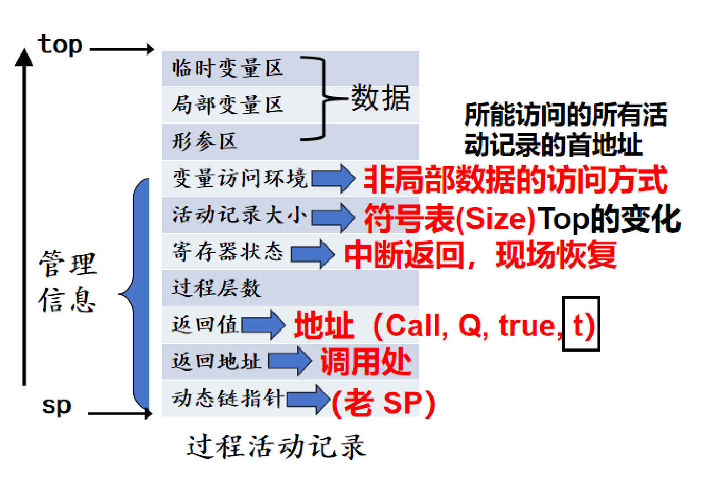
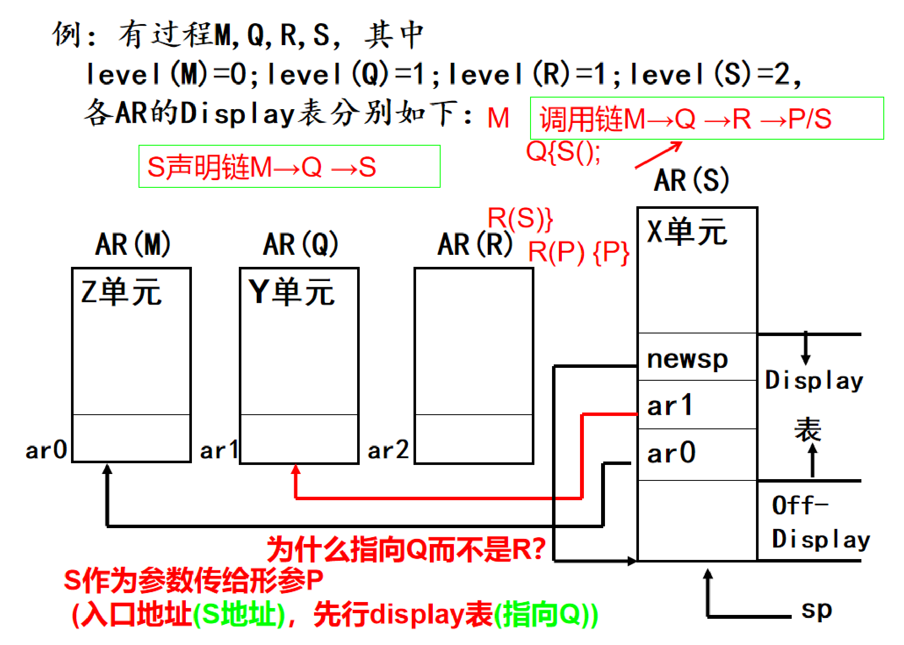
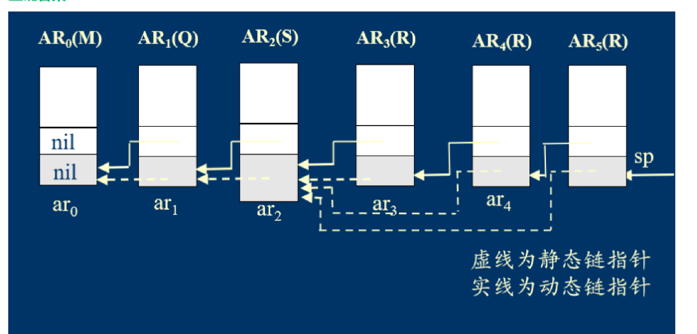

# 运行时存储空间管理

整理自 `编译原理笔记/编译原理学习笔记.pdf` 第 156–176 页（第 7 章运行时存储空间管理），`编译原理笔记/编译原理期末题型整理.pdf` 第 1–5 页（高频考点里的 size 属性、活动记录、变量访问环境等简答）和第 113–116 页（"7 运行时空间管理"：地址分配、Display 表、静态链、作业），`编译原理期末资料/吉林大学编译原理期末试题解答.pdf` 第 2 页（函数声明四元式里的 Size）。这一章的学习通单选题交给 `10 选择题精编.md` 统一收录。

## 本章要点

- 本章回答两个问题：运行时空间怎么划分、分配、回收；变量的抽象地址 `(L, off)` 怎么变成真实地址。
- 运行时内存从高地址到低地址：堆区、栈区（数据空间），静态区，目标代码区、库代码区（代码空间）。局部变量在栈区，`malloc`/`new` 的空间在堆区，全局变量和 `static` 变量在静态区。
- 三种分配策略：**静态分配**（不支持递归和动态数据结构）、**栈式动态分配**、**堆栈混合式分配**。
- **过程活动记录（AR）**是一次过程调用在栈里占的一段连续空间。数据部分有临时变量区、局部变量区、形参区；管理信息有变量访问环境、AR 大小、寄存器状态、过程层数、返回值、返回地址、动态链指针。2022 级简答题第 6 题就是"写出过程活动记录的内容"（`软件学院2022级编译原理真题回忆.pdf` 第 2 页）。
- 一个函数可以同时有多个 AR（递归），但**活跃活动记录（LAR）只有最新的一个**。
- 地址分配：值引用形参按类型长度，地址引用形参 1 个单元，局部变量按类型长度，临时变量 1 个单元，形参过程/函数 2 个单元（入口地址 + 先行 Display 表地址）。标号、常量、类型、过程声明不占空间。
- 嵌套式语言访问非局部变量要靠**变量访问环境**，它由**声明链**上各过程的 LAR 组成。P 调用 Q（Q 在第 N 层）时：Q 的环境 = P 的环境前 N 项 ⊕ AR(Q)。能调用的前提是 `Level(Q) ≤ Level(P) + 1`。
- 三种实现：**局部 Display 表**（每个 AR 自带地址表，费空间、返回不用恢复）、**全局 Display 表**（全程序一张，调用时存旧值到 Resume 单元，返回要恢复）、**静态链**（每个 AR 一个指针指向直接外层的 LAR，访问要 k 次间接寻址）。
- 常考题型：给出过程嵌套关系（层数）和调用链，画动态链、静态链，写某个 AR 的局部 Display 表。做法是先写出该过程的声明链，再找出链上每个过程的 LAR，取它们的首地址。

## 概念与解释

### 1. 运行时存储空间管理解决什么

目标代码装进内存运行时要解决两件事：

1. 数据放在哪：中间代码里的抽象地址 `(L, off)` 要在运行时映射成真实地址，L 是层数，off 是偏移量。
2. 函数调用：从哪里调用、执行完回到哪里、执行期间的现场（局部变量、参数等）怎么保存。例如 main 调用 f() 时要保存 main 的现场，f() 结束后回到 main 的调用点。

这部分工作贯穿中间代码生成、中间代码优化和目标代码生成三个阶段。

### 2. 目标程序运行时的内存划分

```text
最大地址
+----------------------+
| 堆区   heap space    |  动态数据的存储
|        ↓             |
|        ↑             |  栈区和堆区没有固定界线，两个指针相向增长，相交即内存溢出
| 栈区   stack space   |  函数调用（过程活动记录）
+----------------------+   以上为数据空间
| 静态区 static space  |  全局量、常量、静态数据
+----------------------+
| 目标代码区 code space |  编译生成的目标程序
| 库代码区 library     |  标准库函数的目标代码
+----------------------+   以上两块为代码空间
最小地址
```

| 区域 | 存放什么 | 说明 |
| --- | --- | --- |
| 库代码区 | 标准库函数的目标代码 | Pascal 的 sin、cos，C 里 `#include` 进来的库代码 |
| 目标代码区 | 编译生成的目标程序 | 目标程序经过连接装配后放在这里 |
| 静态区 | 静态变量、全局变量、常量 | 空间大小在编译时能确定，地址可以直接编进目标代码 |
| 栈区 | 过程活动记录 | 一个元素是一个 AR，调用时压栈，函数结束时退栈 |
| 堆区 | 动态申请的数据对象 | 不连续分配，C 的 `malloc`/`free`、C++ 的 `new`/`delete` |

### 3. 语言特性怎样影响分配策略

1. **是否允许递归**：允许递归时，形参和局部量可能同时对应一串存储单元，不能用静态分配；不允许递归时，一个函数最多只需一个 AR 大小的空间。例如下面的 f(3) 会依次产生 f(3)、f(2)、f(1) 三个 AR，递归几次就分几块空间。

   ```c
   int f(int n) {
       if (n == 0) return 1;
       if (n == 1) return 1;
       if (n > 1) return n * f(n - 1);
       else return -1;
   }
   ```

2. **函数结束时局部变量是否保留**：一般调用结束就释放。C 的 `static` 局部变量例外，它放在静态区，生命周期与程序相同：

   ```c
   int f() {
       static int n = 0;   // 放入静态区
       n = n + 1;
       printf("%d\n", n);
   }
   main() {
       f();   // 输出 1
       f();   // 输出 2
   }
   ```

3. **能否访问非局部变量**：非嵌套语言（如 C）把全局量放进静态区即可；嵌套语言（如 Pascal）要用 Display 表或静态链。
4. **参数传递方式**：常用值引用和地址引用，所以地址引用型实参只能是变量，不能是常数。两种形参分配空间的方式不同，"类型决定空间，地址决定空间"。下例中 x 是值传递，分配 int 大小的空间；y 是地址传递，传 b 的地址，只占 1 个单元，f 里改 `*y` 会改掉 b。

   ```c
   int f(int x, int *y) { /* ... */ }
   main() {
       int a = 10;
       int b = 20;
       f(a, &b);
   }
   ```

5. **函数能否作参数**：能的话，形参函数要分配两个单元（入口地址、Display）。
6. 函数的结果能否是函数（返回函数指针）。
7. 能否动态申请存储块（如 `malloc`）。
8. 是否显式释放存储空间（如 `free`）。

### 4. 存储分配策略

| 策略 | 做法 | 优点 | 缺点 |
| --- | --- | --- | --- |
| 静态分配 | 编译时为数据对象分配固定空间，整个运行期间位置不变 | 简单 | 不支持递归和空间动态分配，空间利用率不高 |
| 栈式动态分配 | 函数调用时在栈区分配 AR，返回时释放 | 按需分配，随用随回收 | 要有分配/回收策略，增加额外指令；无法在 AR 里给运行中 `new`/`delete` 的动态变量分配空间 |
| 堆栈混合式分配 | 大小确定的 AR 放栈区；动态申请的空间在堆区申请和释放，另加一部分堆区管理程序（如垃圾回收） | 能处理动态数据 | 管理更复杂 |

完全采用静态分配的语言必须满足：

1. 不允许递归过程。
2. 数据对象的长度和它在内存中的位置在编译时可知。
3. 不允许动态建立数据结构（如动态数组、指针），因为没有运行时分配机制。

原稿的静态分配示意：静态数据区里依次放全局变量 sum、常量信息表、square 的控制信息及其局部变量和临时变量（i、j、t1）、main 的控制信息及其 j、t2、t3。每个函数只有一份，目标代码里直接写这些变量的地址或相对基地址的偏移。

### 5. 过程活动记录（AR）

**AR** 是管理一次过程调用所需信息的单元。目标程序运行时在栈区为每次调用分配一段连续空间，存放这次调用用到的数据和控制信息。

栈区设两个指针：

- `sp`：指向当前 AR 的起始位置。
- `top`：指向栈顶第一个可用单元。

要两个指针是因为不同过程的 AR 大小不同，退栈时要知道当前 AR 从哪开始。

AR 的结构（题型整理第 2 页、学习笔记第 162 页的图，自上而下）：

| 位置 | 区域 | 作用 |
| --- | --- | --- |
| ← top | 临时变量区 | 表达式计算的中间结果，寄存器不够用时放这里 |
| | 局部变量区 | 过程里声明的局部数据 |
| | 形参区 | 调用者提供的实在参数 |
| 管理信息 | 变量访问环境 | 非局部数据的访问方式：所能访问的所有 AR 的首地址 |
| | 活动记录大小 | 来自符号表里的 Size，决定 top 的变化 |
| | 寄存器状态 | 调用前的机器状态（程序计数器、要恢复的寄存器），用于中断返回、现场恢复 |
| | 过程层数 | 辅助建立访问环境和变量寻址 |
| | 返回值 | 存放返回值的地址，对应四元式 `(CALL, Q, true, t)` 里的 t |
| | 返回地址 | 调用者调用指令的下一条指令 |
| ← sp | 动态链指针 | 指向调用者的 AR（老 sp），也叫控制链，返回时据此恢复调用者的 AR |



管理信息里最常被问的三项：

- 动态链指针：把按调用顺序排列的 AR 串成动态链，返回时靠它找回调用者的 AR。通常放在 AR 的固定偏移处。
- 返回地址：返回时程序转到这里，从调用点继续执行调用者的代码。
- 返回值地址：有返回值的函数把结果放在这里给调用者取用；小的返回值也可以约定用寄存器传。

AR 大小：局部数据里没有动态数组这类可变长数据时，AR 长度能静态确定，记下来可在调用时算出新 AR 的位置。

注意：AR 并不包含一次执行的全部信息。非局部数据不在 AR 里；运行时生成的动态变量也不在 AR 里，通常用堆式分配。

**AR 的申请与释放**：

| 时机 | 动作 |
| --- | --- |
| 申请（遇到 call 四元式） | 1. 产生新 AR：`sp = top`，`top = top + size`；2. 保存寄存器内容，填写管理信息（返回地址、动态链指针等） |
| 释放（遇到 return 或函数结束） | 1. 恢复现场，把寄存器的值恢复；2. 释放当前 AR：`top = sp`，`sp = 动态链指针`；3. 按返回地址生成跳转指令 |

### 6. 调用链、动态链与活跃活动记录

**调用链**：过程名的序列，头是主程序名 M（Pascal 的主程序、C 的 main）。若 (M, …, R) 是调用链且 R 中有 S 的调用，则 (M, …, R, S) 也是调用链，记为 `CallChain(S) = (M, …, R, S)`。它刻画函数是怎么被调用的：链上的过程都被中断、还没结束，将来要按相反顺序依次结束。

**动态链**：栈里真实的 AR 序列。`CallChain(S) = (M, …, R, S)` 对应 `DynamicChain = [AR(M), …, AR(R), AR(S)]`。递归时动态链里会出现 `[R, R, …, R]`，例如调用 P → S → Q → R → R，栈里有两个 R 的 AR。

**活跃活动记录**：一个过程 S 在动态链里可以有多个 AR，只有最新的那个可以访问，称为 S 的活跃活动记录，记作 `LiveAR(S)`，简写 `LAR(S)`。

例：调用链 (M, P1, P2, Q1, R1, R2, R3)（下标表示同一过程的第几次调用），动态链为 `[AR(M), AR(P1), AR(P2), AR(Q1), AR(R1), AR(R2), AR(R3)]`，各过程的 LAR 是：

| 过程 | LAR |
| --- | --- |
| M | AR(M) |
| P | AR(P2) |
| Q | AR(Q1) |
| R | AR(R3) |

按 M、P、Q、R 排起来是 `[AR(M), AR(P2), AR(Q1), AR(R3)]`。R 的声明链若正好是 (M, P, Q, R)，这就是 R 当前的变量访问环境（第 9 节）。（更正：原文说这条链"表示了从主程序到当前最内层活跃过程的调用路径"，调用路径是完整的动态链，这里只是各过程的 LAR。）

### 7. 地址分配

抽象地址 `(l, off)`：l 是层数（嵌套深度），off 是这一层里的偏移。编译处理声明时按下面的规律改变可用的抽象地址。

**分配原则**：

| 对象 | 分配多少 |
| --- | --- |
| 值引用形参 | 按数据类型大小，如 int 参数占 `sizeof(int)` |
| 地址引用形参 | 固定 1 个单元（一个指针大小），传的是变量地址 |
| 局部变量 | 按数据类型长度 |
| 临时变量 | 一般 1 个单元 |
| 函数、过程作形参 | 2 个单元：入口地址 + 先行 Display 表地址（环境指针），嵌套作用域访问非局部变量时要用 |

**I. 处理声明部分**：

| 处理前 | 处理内容 | 处理后 | 解释 |
| --- | --- | --- | --- |
| `(l, off)` | LabelDec（标号声明） | `(l, off)` | 标号不占运行时空间，只用于控制流 |
| `(l, off)` | ConstDec（常量声明） | `(l, off)` | 常量编译时确定，不占运行时空间 |
| `(l, off)` | TypeDec（类型声明） | `(l, off)` | 类型只用于类型检查 |
| `(l, off)` | `Var id:T`（变量声明） | `(l, off + n_T)` | 给 id 分配 `n_T` 长的空间 |
| `(l, off)` | ProcDec（过程声明） | `(l, off)` | 过程声明本身不分配运行时空间 |
| `(l, off)` | FuncDec（函数声明） | `(l, off)` | 同上 |

除变量声明在声明时就确定相对偏移外，其余声明都不占空间。

**II. 处理完过程/函数首部**：

| 处理前 | 处理内容 | 处理后 | 解释 |
| --- | --- | --- | --- |
| `(l, off)` | `Proc p()`（实在过程） | `(l+1, off_1)` | 进入新层 l+1，`off_1` 是处理完形参后第一个局部变量的起始偏移 |
| `(l, off)` | `Func f():T`（实在函数） | `(l+1, off_1)` | 同上 |
| `(l, off)` | `Proc P()`（形式过程） | `(l, off+2)` | 作为参数传递的过程，占 2 个单元（入口 + 环境指针） |
| `(l, off)` | `Func F():T`（形式函数） | `(l, off+2)` | 同上 |

`n_T` 是类型 T 的长度。

**III. 处理形式参数**：

- `(l, off)` → `Var ID:T`（地址引用参数，如 Pascal 的 VAR 参数）→ `(l, off+1)`
- `(l, off)` → `ID:T`（值引用参数）→ `(l, off+n_T)`

**IV. 处理过程名及左括号之后**：

- `(l, off)` → `Proc p(` → `(l+1, d)`
- `(l, off)` → `Func f(` → `(l+1, d)`

d 是 AR 中控制信息（动态链指针、返回地址等）占的大小，形参和局部变量从 d 往后排。形参函数里的形参不分配抽象地址，因为它们是间接引用的。

### 8. 变量的地址映射

**并列式语言**（如 C）：只有全局（0 层）和函数局部（1 层）两层。用两个指针：`sp0` 指向全局/静态数据区首地址，`sp` 指向当前 AR 首地址。

- 全局变量：`sp0 + 变量在全局区的偏移`
- 当前函数的局部变量：`sp + 变量在当前 AR 中的偏移`

例：`int x, y;`（全局）和 `int f() { int i; y = x * i; return y; }`，执行 f 时 i 的地址是 `sp + off_i`，x、y 的地址是 `sp0 + off_x`、`sp0 + off_y`。

**嵌套式语言**（如 Pascal）：函数可以在函数里声明，变量的可见性由声明位置决定，与调用顺序无关。对抽象地址 `(L, off)`：

- L 等于当前过程的层数：局部变量，地址为 `sp + off`。
- L 不等于当前层：非局部变量，要找到 L 层对应的 LAR 的首地址，再加 off。

怎么找 L 层的 LAR？构造 Display 表（或用静态链）。Display 表是指针数组，`Display[i]` 存当前活跃的 i 层过程 AR 的首地址。例：正在执行第 L+2 层的 S，要访问第 L 层 P 中声明的 b，S 发现 L 不是自己的层数，就取 `Display[L]`（P 的 LAR 首地址）加上 `off_b`。

### 9. 声明链与变量访问环境

**声明链**：过程名序列，M 是主程序名。若 (M, …, P) 是声明链且 P 中声明了 Q，则 (M, …, P, Q) 也是声明链，记为 `DeclaChain(Q) = (M, …, P, Q)`。它从程序文本直接得到，是唯一的，决定 Q 能访问哪些数据：Q 可以访问 M、…、P、Q 中声明的数据。

**变量访问环境**：`VarVisitEnv(LAR(Q)) = [LAR(M), …, LAR(P), LAR(Q)]`，由声明链上各过程的 LAR 组成。

例：R 的声明链是 (M, P, Q, R)，当前调用链是 (M, P1, P2, Q1, R1, R2, R3)，则 R 的当前变量访问环境是 `[LAR(M), LAR(P2), LAR(Q1), LAR(R3)]`。P 在声明链上，调用链里最新的 P 是 P2，所以取 AR(P2)。

有了访问环境，Q 中的变量都能寻址。设 Q 中用到 XQ（Q 里定义）、YM（M 里定义）、Zp（P 里定义）：

```text
addr(XQ) = <LAR(Q)> + Offset_X
addr(YM) = <LAR(M)> + Offset_Y
addr(Zp) = <LAR(P)> + Offset_Z      <LAR(Q)> 表示 LAR(Q) 的首地址
```

剩下两个问题：访问环境怎么算，怎么存。

**怎么算**。前提：P 能调用 Q，一定有 `Level(Q) ≤ Level(P) + 1`（题型整理第 4 页写作 `Lp+1≥Lq`），即 P 不会在 Q 外面两层以上。四种情况：

| 情况 | 例子 | 声明链关系 | Q 的访问环境 |
| --- | --- | --- | --- |
| 1. 递归调用：P 调 P | `PROC P; … Begin P End` | 声明链相同 | 把最后一项换成新的 AR(P) |
| 2. 同层调用：P、Q 都在第 N 层 | `PROC Q; … PROC P; Begin Q End End` | `(M, P1, …, PN-1, P)` 与 `(M, P1, …, PN-1, Q)` | `[LAR(M), …, LAR(R), LAR(P)]` → `[LAR(M), …, LAR(R), LAR(Q)]` |
| 3. 调直接内层：P 在 N-1 层，Q 在 N 层 | `PROC P; … PROC Q Begin End … Begin Q End` | `DeclaChain(Q) = DeclaChain(P) + Q` | 在 P 的环境后接上 LAR(Q) |
| 4. 调外层：P 的层数大于 Q 的层数 N | `PROC Q; … PROC P; Begin Q End … Begin End` | `DeclaChain(P) = DeclaChain(Q) + … + P` | 取 P 环境的前 N 项，再接 AR(Q) |

**定理**：设 `[AR(M), …, AR(P), AR(Q)] ∈ DynamicChain(Q)`，Q 的层数为 N（从 0 开始），则

$$VarVisitEnv(AR(Q)) = VarVisitEnv(AR(P))_N \oplus AR(Q)$$

其中下标 N 表示取前 N 项。也就是说，访问环境可以由调用者（先行过程）的访问环境求出：Q 在第 N 层，它的环境有 N+1 项，从 P 那里抄前 N 项，再加上自己。

**怎么存**：局部 Display 表、全局 Display 表、静态链三种。

### 10. 局部 Display 表

每个 AR 求出自己的变量访问环境，以地址表（Display 表）的形式存在 AR 里。每个 AR 自带一张，所以叫局部化 Display 表。层数为 N 的过程 P，若 `VarVisitEnv(AR(P)) = [AR_0, …, AR_N]`，`ar_i` 是 `AR_i` 的首地址，则 `[ar_0, …, ar_N]` 就是 AR(P) 的 Display 表。

求法：

```text
NewAR.Display = CurrentAR.Display 的前 N 项 ⊕ newsp
```

newsp 是新 AR 的首地址，N 是新过程的层数。

变量访问（原稿记号：层数为 L 的过程里声明的变量，抽象地址写作 `X(L+1, off)`，与"处理过程名及左括号之后 `(l, off) → (l+1, d)`"一致）：

- `L = CurrentAR.level`（X 是当前过程的局部变量）：`addr(X) = sp + off`
- 否则：`addr(X) = CurrentAR.Display[L] + off`，即 `[sp + D + L] + off`，D 是 sp 到 Display 表的距离（AR 里的 Off-Display 单元记着它）。

### 11. 全局 Display 表

整个程序只设一张 Display 表，长度是最大嵌套层数（最长声明链的长度）。`Display[i]` 存第 i 层最新 AR 的指针，记作 `D[i]`。依据是：程序的任何一点，同一层的过程声明只能有一个有效。每个 AR 里设一个 Resume 单元，临时保存某个 `D[i]` 的旧值。

| 时机 | 操作 |
| --- | --- |
| 层数为 j 的过程 Q 被调用 | 1. `NewAR(Q).ResumeAddr = D[j]`（保存旧值）；2. `D[j] = NewAR(Q)` 的地址 |
| 退出 Q | `D[j] = CurrentAR.ResumeAddr`（恢复） |
| 访问 `X(L+1, off, indir/dir)` | `addr(X) = D[L] + off`，indir/dir 标明直接还是间接访问 |

注意：调用谁就换谁那一层的 D[j]、存到新 AR 的 Resume 里，不是固定换最上层。原稿第 174 页的全局 Display 示例（P 在 1 层，Q、R 在 2 层，S、T 在 3 层）图没有保留下来，下面典型题 7 补了一个完整过程。

### 12. 静态链

每个 AR 把原来的 Display 表部分换成一个**静态链单元**，存静态链指针，指向直接外层过程的 LAR。原稿注：为了计算方便，静态链指针放在原来动态链指针的位置。访问非局部变量时沿静态链做间接寻址。

**新 AR 的静态链指针**（P 调用 Q，P 是当前 AR）：

```text
k = CurrentAR.level + 1 - NewAR.level
NewAR.StaticChainPointer = Indir(sp, k)      Indir(sp, k) 表示 sp 的 k 次间接内容
```

k = 0 是调直接内层，指针就是 sp（P 自己）；k = 1 是同层调用或递归，取 P 的静态链内容；调外层时 k 更大。原稿写作 `K = L_p - (L_Q - 1)`，是同一个式子。（原文"静态链指针的确定：`-(NewAR.level - 1)`"一行是残缺的公式，以上面两行为准。）

**变量访问** `X(L+1, off)`：

- `L = CurrentAR.level`：`addr(X) = sp + off`
- 否则 `k = CurrentAR.level - L`，`addr(X) = Indir(sp, k) + off`

### 13. 怎么选

- Display 表方法用表结构表示访问环境。局部 Display 表产生时花空间，返回时不用为恢复访问环境做任何事；全局 Display 表产生时花时间，返回时还要花时间恢复，优点是省存储单元。
- 静态链方法用链表表示访问环境，优点同全局 Display 表，也省存储单元；产生时花时间，返回时不用恢复。
- 选哪种看机器：寄存器较少时 Display 表方法合适些；机器间接操作效率高时可以选静态链。

## 易混对比

**三种变量访问环境实现方法**（学习笔记第 175 页）：

| 特性 | 局部 Display 表 | 全局 Display 表 | 静态链 |
| --- | --- | --- | --- |
| 空间 | 消耗空间 | 省空间 | 省空间 |
| 恢复 | 不用恢复（每个 AR 独立拥有） | 要恢复（退出过程时恢复 `D[j]`） | 不用恢复（指针基于当前 AR） |
| 时间 | 申请和释放相对较快 | 申请和释放花时间（保存、恢复全局表项） | 花时间（沿静态链间接寻址回溯） |
| 寻址 | 直接通过 `Display[L]` | 直接通过 `D[L]` | 需要 k 次间接寻址 |
| 本质 | | 可视为共享的局部 Display 表 | 实际上是一种共享化的局部 Display 表方法 |

**几条"链"**：

| 名称 | 是什么 | 从哪来 | 是否唯一 |
| --- | --- | --- | --- |
| 调用链 | 过程名序列，描述怎么被调用 | 运行时的调用顺序 | 随运行变化 |
| 动态链 | 栈里真实的 AR 序列，由动态链指针串起 | 与调用链一一对应 | 随运行变化 |
| 声明链 | 过程名序列，描述怎么被声明 | 程序文本 | 唯一 |
| 变量访问环境 | 声明链上各过程的 LAR 序列 | 声明链 + 当前动态链 | 随运行变化 |

**动态链指针与静态链指针**：

| | 动态链指针 | 静态链指针 |
| --- | --- | --- |
| 指向 | 调用者的 AR（老 sp） | 直接外层过程（声明它的过程）的 LAR |
| 用途 | 返回时恢复调用者的 AR | 访问非局部变量 |
| 递归 R 调 R 时 | 指向上一个 R 的 AR | 与上一个 R 相同，都指向 R 的外层 |

**活动记录与活跃活动记录**：一个函数同时可以有多个 AR（递归、间接递归），但活跃的只有最新的一个。

## 典型题

### 题 1：过/函信息表中的 size 属性（题型整理第 1 页）

题目：在过/函信息表中有一项属性叫做 size，用于存放该过程或函数活动记录的大小，请问：(1) 在什么时候填写 size 的内容？(2) 在什么时候修改 size 的内容？(3) 在什么时候使用 size 的内容？

答：

1. 过程/函数中局部变量的符号表信息都填写完毕之后，填写该过程/函数对应符号表项中的 size 初值；
2. 在中间代码生成之后和中间代码优化之后，过程/函数对应符号表项中 size 的值都会改变；
3. 在过程/函数的活动记录创建时会使用 size 的值。

补充理解（整理补充）：生成中间代码会新增临时变量，要给它们留空间；优化会删掉一些临时变量或让活动区不相交的临时变量共用单元，所以两次都要改 size。函数声明四元式 `(ENTRY, Label, Size, Level)` 里的 Size 也因此要回填才知道（试题解答第 2 页）。

### 题 2：过程活动记录的内容（题型整理第 2 页）

题目：请画出过程活动记录 AR 应包含哪些内容？程序运行时，函数的活动记录是否最多只有一个？函数的活跃活动记录是否最多只有一个？给出运行时动态空间的内存存储区划分和典型活动记录内容。（同类问法：过程活动记录中一般包含哪些数据域？这些数据域各自的作用是什么？）

思路：AR 内容按"数据 + 管理信息"两块背，画图时 sp 在底部、top 在顶部。

答：

- AR 内容见第 5 节的表：临时变量区、局部变量区、形参区；变量访问环境、活动记录大小、寄存器状态、过程层数、返回值、返回地址、动态链指针。
- 内存划分见第 2 节：堆区、栈区、静态区、目标代码区、库代码区。
- 函数的活动记录不一定只有一个，递归调用时同一函数在栈里有多个 AR；活跃活动记录最多只有一个，就是最新的那个。（整理补充，依据学习笔记第 169 页 LAR 的定义。）

### 题 3：变量访问环境的作用和实现方式（题型整理第 5 页）

答：变量访问环境用于在程序运行时正确访问变量的值，即在不同作用域、过程嵌套等复杂场景下找到变量对应的内存地址或值。实现方式有局部 Display 表、全局 Display 表和静态链三种（后半句原稿题下没写，取自学习笔记第 172 页，见第 10–12 节）。

### 题 4：嵌套式语言和并列式语言的处理有哪些区别（题型整理第 4 页，原稿无答案）

题目：高级语言程序设计可以分为嵌套式语言（如 PASCAL 语言）和并列式语言（例如 C 语言）两大类，请分析在编译过程中，对于嵌套式语言的处理和并列式语言的处理有哪些区别？

提示（整理补充，只写运行时这一侧）：并列式语言只有全局和局部两层，全局量放静态区用 `sp0 + off` 访问，局部量用 `sp + off` 访问，AR 里不需要变量访问环境；嵌套式语言有多层，AR 里要记过程层数和变量访问环境，访问非局部变量要靠 Display 表或静态链，过程作参数时还要传先行 Display 表。符号表管理方面的区别（层数、作用域）见 `05 语义分析与符号表.md`。

### 题 5：抽象地址分配（学习笔记第 166–167 页）

题目：初始可用抽象地址为 `(l, 10)`，写出下面声明处理过程中抽象地址的变化。

```pascal
Label 100, 200;
Const pai=3.14;
Type arr=array[1..10] of integer;
Var x:integer;
    a:array[1..5] of integer;
Function f (Var x:real; a:arr; Var c:arr; Procedure G(); Function F():real)
Begin ......end;
```

解答：

```text
(l, 10)   Label 100, 200;                  -> (l, 10)    标号不分配空间
(l, 10)   Const pai=3.14;                  -> (l, 10)    常量不分配空间
(l, 10)   Type arr=array[1..10]of integer; -> (l, 10)    类型不分配空间
(l, 10)   Var x:integer;                   -> (l, 11)    integer 占 1
(l, 11)   a:array[1..5]of integer;         -> (l, 16)    5 个整数占 5
(l, 16)   Function f (                                   进入 f，层数变为 l+1
            (l+1, d)     Var x:real;       -> (l+1, d+1)    Var 是地址引用，占 1
            (l+1, d+1)   a:arr;            -> (l+1, d+11)   值传递，arr 是 10 个整数，占 10
            (l+1, d+11)  Var c:arr;        -> (l+1, d+12)   地址引用，占 1
            (l+1, d+12)  Procedure G();    -> (l+1, d+14)   形式过程，占 2
            (l+1, d+14)  Function F():real -> (l+1, d+16)   形式函数，占 2
            (l+1, d+16 = off_1)                          f 局部变量从这里开始
          )
          Begin ......end;
(l, 16)                                                  f 定义结束，回到 l 层，off 不变
```

d 是 f 的 AR 里控制信息占的大小。易错点：`Var x:real` 虽然 real 占 2 个单元，但它是地址引用，只占 1；`a:arr` 是值传递，要占整个数组的 10 个单元。

### 题 6：局部 Display 表与形参过程（学习笔记第 173 页，题型整理第 116 页同图）

题目：有过程 M、Q、R、S，其中 `level(M)=0; level(Q)=1; level(R)=1; level(S)=2`，写出各 AR 的 Display 表。原图手写批注给出程序结构：M 里声明 Q 和 R；Q 里声明 S，并调用 `R(S)`；R 有形参过程 P，R 里调用 P。所以调用链是 M → Q → R → P（实际执行的是 S），S 的声明链是 M → Q → S。

思路：S 是通过形参 P 被调用的，传参时传的是 S 的入口地址和先行 Display 表（Q 的 Display 表），新 Display 表取的是这张表的前 2 项。

解答：栈里依次是 AR(M)（首地址 ar0，里面有 Z 单元）、AR(Q)（ar1，Y 单元）、AR(R)（ar2）、AR(S)（newsp，X 单元）。

| AR | 层数 | Display 表 |
| --- | --- | --- |
| AR(M) | 0 | [ar0] |
| AR(Q) | 1 | [ar0, ar1] |
| AR(R) | 1 | [ar0, ar2] |
| AR(S) | 2 | [ar0, ar1, newsp] |



AR(S) 的 Display 表指向 Q 而不是 R：S 声明在 Q 里，按静态作用域规则它只能访问 M、Q、S 的数据。AR(S) 里还有一个 Off-Display 单元，记 Display 表相对 sp 的位置。在 S 中访问 X 是 `sp + off_X`，访问 Y 是 `Display[1] + off_Y = ar1 + off_Y`，访问 Z 是 `ar0 + off_Z`。（AR(R) 一行为整理补充。更正：原文正文作"Display 表中会存储 ar0 (M的AR地址)，ar1 (Q的AR地址)，ar2 (S的AR地址)"，图中 ar2 是 AR(R) 的首地址，S 自己的首地址是 newsp。）

### 题 7：同一调用链的三种访问环境（学习笔记第 174–175 页）

题目：调用链 (M, G, H, R, S)，`Level(M)=0, Level(G)=1, Level(H)=2, Level(R)=3, Level(S)=3`。写出动态链、各 AR 的局部 Display 表、静态链，以及 S 运行时的全局 Display 表。

2022 级简答题第 7 题是同一个结构（过程名换成 M、Q、H、R、S），问动态链、S 的局部 Display 表和 S 的静态链存放的内容，原题见 `33 历年题（2016–2022级）.md`。

思路：R 调 S 是同层调用，S 与 R 共用外层 H。设 AR(M)～AR(S) 的首地址依次为 ar0～ar4。

解答：

动态链：`[AR(M), AR(G), AR(H), AR(R), AR(S)]`，每个 AR 的动态链指针指向前一个。

局部 Display 表（原稿）：

```text
AR(M).Display = [ar0]
AR(G).Display = [ar0, ar1]
AR(H).Display = [ar0, ar1, ar2]
AR(R).Display = [ar0, ar1, ar2, ar3]
AR(S).Display = [ar0, ar1, ar2, ar4]      取 AR(R) 的前 3 项，再加 ar4
```

静态链和全局 Display 表（整理补充，原稿这部分只有一张未保留的图）：

| AR | 首地址 | 层数 | 动态链指针 | 静态链指针 | 计算 | 全局 Display 下的 Resume |
| --- | --- | --- | --- | --- | --- | --- |
| AR(M) | ar0 | 0 | 无 | 无 | | |
| AR(G) | ar1 | 1 | ar0 | ar0 | M 调 G：k = 0+1-1 = 0，取 sp 即 ar0 | 旧 D[1]（空） |
| AR(H) | ar2 | 2 | ar1 | ar1 | k = 1+1-2 = 0 | 旧 D[2]（空） |
| AR(R) | ar3 | 3 | ar2 | ar2 | k = 2+1-3 = 0 | 旧 D[3]（空） |
| AR(S) | ar4 | 3 | ar3 | ar2 | R 调 S：k = 3+1-3 = 1，取 AR(R) 静态链单元的内容 | ar3 |

S 运行时全局 Display 表 `D = [ar0, ar1, ar2, ar4]`，S 返回时用 AR(S) 里的 Resume 把 `D[3]` 恢复成 ar3。可以对照：局部 Display 表 AR(S).Display 和此刻的全局表内容相同，静态链从 AR(S) 出发依次经过 ar2、ar1、ar0，也是同一组地址。

### 题 8：递归调用时的动态链和静态链（题型整理第 116 页作业）

题目：假设有调用链 (M, Q, S, R, R, R)，且有 Level(M)=0, Level(Q)=1, Level(S)=2, Level(R)=3，过程活动记录中变量访问环境采取静态链的方法，请画出此时栈区内各活动记录间的动态链和静态链。

思路：动态链一律指向前一个 AR；静态链指向直接外层的 LAR。R 在 S 里声明，R 递归调用自己时 k = 3+1-3 = 1，新 AR 的静态链照抄上一个 R 的静态链。

解答（原稿答案图：实线为动态链，虚线为静态链，sp 指向 AR5）：

| AR | 首地址 | 动态链指向 | 静态链指向 |
| --- | --- | --- | --- |
| AR0(M) | ar0 | nil | nil |
| AR1(Q) | ar1 | ar0 | ar0 |
| AR2(S) | ar2 | ar1 | ar1 |
| AR3(R) | ar3 | ar2 | ar2 |
| AR4(R) | ar4 | ar3 | ar2 |
| AR5(R) | ar5 | ar4 | ar2 |



三个 R 的静态链都指向 AR2(S)。

### 题 9：递归调用时的运行时栈（题型整理第 5 页，原稿无答案）

题目：对于下面的 C 语言程序，画出程序运行时第二次递归进入函数 f 后的运行时栈的内容是什么？要求：（1）详细刻画各活动记录数据信息包含的变量及其值；（2）管理信息的详细内容可以不用给出。

```c
int g(int s)
{
    s=s+10;
    return s;
}
int f(int n)
{
    if(n<=0)
        return 1;
    else
        return n*f(n-1);
}
void main()
{
    int k=1;
    k=g(20);
    k=f(10);
}
```

思路：g(20) 已经返回，它的 AR 已经退栈；main 调 f(10) 是第一次进入 f，f(9) 是第一次递归，f(8) 是第二次递归。

解答（整理补充）：栈底到栈顶依次为

| AR | 数据信息 |
| --- | --- |
| AR(main) | k = 30（g(20) 里 s 从 20 变成 30 并返回） |
| AR(f)，main 调用 f(10) | n = 10 |
| AR(f)，第一次递归 f(9) | n = 9 |
| AR(f)，第二次递归 f(8)，sp 指向这里 | n = 8 |

每个 AR 另有管理信息（动态链指针、返回地址、返回值地址等）。f 的三个 AR 里只有最上面的是活跃活动记录。若把 main 调用 f(10) 也算作一次"进入"，栈顶就是 n = 9 的 AR，答题时写明自己的理解即可。
