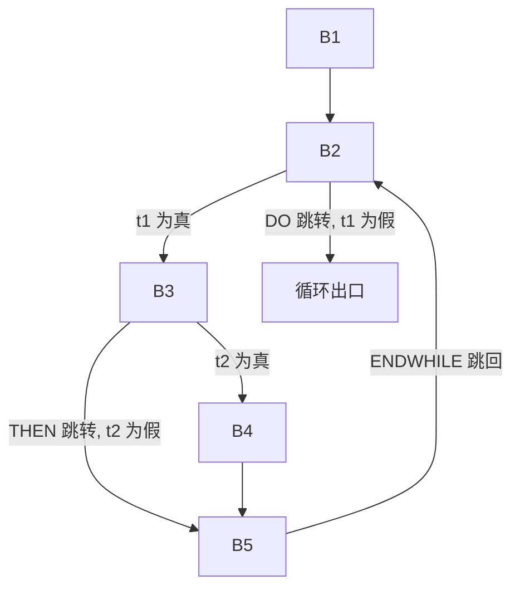

# 历年题（2003–2011级）

整理自 `编译原理期末资料/吉林大学编译原理期末试题解答.pdf` 第 4–29 页（试题样例和 2003、2004、2007、2008、2010、2011 级试题）、第 63–65 页（2010 级软件学院卷的解答），以及 `编译原理期末资料/2010A.doc`（2008 级 A 卷）和 `编译原理期末资料/2012A.doc`（2010 级 A 卷）。原稿有答案的照录并逐题复核，没有答案的题尽量补上，标"整理补充"。自动机、First/Follow/Predict、LL(1) 表、LR 项目集、简单优先关系和各种语言等价性都用 Python 脚本核对过。

四元式写法沿用各题原稿：原稿用 `(=, x, -, y)` 的照录；整理补充的答案用课件的简写 `(:=, x, _, y)`、`(+, a, b, t)`、`(AADD, a, t1, t2)`、`(THEN, t, _, _)` 等。

## 试题样例

试题解答第 4 页的"试题样例"只有一道题：已知文法 G2（`A→[B`，`B→X]|BA`，`X→Xa|Xb|a|b`），写出它的递归下降分析程序。原答案、复核结果和改写后的程序都在 `04 语法分析方法（LL1、递归下降、LR）.md` 题 10。2004 级综合题第 1 题是同一道题。

## 2003级

来源：试题解答第 5 页（试题）、第 6–7 页（解答）。原稿目录标"Done"，五道题都有答案。卷面没有写分值。

### 1. 给出字母表 Σ={a, b} 上能识别只有奇数个 a 和奇数个 b 的所有符号串的最小 DFA

解答：用四个状态记住 a 的个数和 b 的个数各自的奇偶。

- 状态 1：偶数个 a，偶数个 b（初态）
- 状态 2：奇数个 a，偶数个 b
- 状态 3：偶数个 a，奇数个 b
- 状态 4：奇数个 a，奇数个 b（终态）

| 状态 | a | b |
|---|---|---|
| →1 | 2 | 3 |
| 2 | 1 | 4 |
| 3 | 4 | 1 |
| 4（终态） | 3 | 2 |

四个状态记的奇偶组合两两不同，任意两个状态都能区分，所以已经最小。（脚本枚举长度 ≤ 8 的串核对过。）

### 2. 构造一个 DFA，使它恰好能够接受能被 5 整除的二进制数

解答：状态记"已读入部分除以 5 的余数"，共 0～4 五个状态。已读前缀值为 r，再读一位 c，新值是 2r+c，所以转移为 r →c→ (2r+c) mod 5。初态和终态都是 0。

| 状态 | 0 | 1 |
|---|---|---|
| →0（终态） | 0 | 1 |
| 1 | 2 | 3 |
| 2 | 4 | 0 |
| 3 | 1 | 2 |
| 4 | 3 | 4 |

（脚本核对过长度 ≤ 10 的所有 0/1 串。）按这个自动机空串也被接受；如果不允许空串，另加一个非终态的初态 S，`S →0→ 0`、`S →1→ 1` 即可。

### 3. 一个句子是否一定有最左（或最右）推导？一个句型是否一定有最左（或最右）推导？如果没有请举例说明原因

解答：句子一定有最左推导和最右推导；句型不一定。

例：文法 G：

```text
S → AB
A → a
B → b
```

句型 `Ab` 只能由 `S ⇒ AB ⇒ Ab` 得到，这一步替换的是右边的 B，是最右推导；最左推导第二步必须先替换 A，得不到 Ab，所以句型 Ab 没有最左推导。同理句型 `aB` 没有最右推导。

（原稿写作"句型 S→Ab 不是文法的最左推导"，意思相同，这里把推导写完整。）

### 4. 使用驻留法中的跳转方法给出下面类 C 程序（嵌套式）处理结束时的全局符号表（采用顺序表结构），表项为层数和偏移

```c
void P(){
    int i, j, k;
    void P1(){
        real m; int n;
        void P2(){
            bool a, b;
            /* P2 的过程体 */
        }
        /* P1 的过程体 */
    }
    /* P 的过程体 */
}
void Q(){
    real a, b;
    void Q1(){
        int i, j;
        /* Q1 的过程体 */
    }
    /* Q 的过程体 */
}
```

解答（原稿是一张带箭头的表，约定 int、bool 占 1 个单元，real 占 2 个单元，每层局部变量偏移从 0 开始）：

| 行 | 名字 | 种类 | 类型 | 访问方式/类别 | 层数 | 偏移 | 跳转指针 |
|---|---|---|---|---|---|---|---|
| 1 | P | routKind | NULL | actual | 0 | NULL | |
| 2 | i | varKind | intPtr | dir | 1 | 0 | |
| 3 | j | varKind | intPtr | dir | 1 | 1 | |
| 4 | k | varKind | intPtr | dir | 1 | 2 | |
| 5 | P1 | routKind | NULL | actual | 1 | NULL | |
| 6 | m | varKind | realPtr | dir | 2 | 0 | |
| 7 | n | varKind | intPtr | dir | 2 | 2 | |
| 8 | P2 | routKind | NULL | actual | 2 | NULL | |
| 9 | a | varKind | boolPtr | dir | 3 | 0 | |
| 10 | b | varKind | boolPtr | dir | 3 | 1 | |
| 11 | # | | | | | | → 8（P2 结束） |
| 12 | # | | | | | | → 5（P1 结束） |
| 13 | # | | | | | | → 1（P 结束） |
| 14 | Q | routKind | NULL | actual | 0 | NULL | |
| 15 | a | varKind | realPtr | dir | 1 | 0 | |
| 16 | b | varKind | realPtr | dir | 1 | 2 | |
| 17 | Q1 | routKind | NULL | actual | 1 | NULL | |
| 18 | i | varKind | intPtr | dir | 2 | 0 | |
| 19 | j | varKind | intPtr | dir | 2 | 1 | |
| 20 | # | | | | | | → 17（Q1 结束） |
| 21 | # | | | | | | → 14（Q 结束） |

（更正：原表类型一栏作 intRtr、realRtr、boolRtr，应为 intPtr、realPtr、boolPtr。）

每个过程结束时在表尾加一个 #，指针指回该过程局部区开始前的最后一项，也就是过程名那一行。查表时从表尾往前找，遇到 # 就沿指针跳过已经结束的局部区。表的格式和跳转指针的约定见 `20 大题题型精讲.md` 第 7.3 节。

### 5. 分别给出如下程序段优化前和优化后的中间代码

题目：优化只作常量表达式局部优化、公共表达式局部优化和循环优化。其中数组 A 和 B 的定义为 `array[1..100] of integer`，并假设 integer 类型占 1 个存储单元的空间。

```pascal
a:=0;
j:=(a+1)*5;
while j<100 do
    begin  a:=a+A[j]*B[j];
           if a<10 then k:=0
                   else k:=(x*y+z)/(x*y-z)+(y-z)/(x*y+z);
           j:=j+1;
    end
```

原稿提示：除法不外提，赋值不外提；数组下标计算也能优化，容易漏掉。

优化前（照录原稿，错处已改，见代码下方的更正）：

```text
(=, 0, -, a)
(+, a, 1, t1)
(*, t1, 5, t2)
(=, t2, -, j)
(WHILE, -, -, -)
(<, j, 100, t3)
(DO, t3, -, -)
(-, j, 1, t4)
(*, t4, 1, t5)
([], A, t5, t6)
(-, j, 1, t7)
(*, t7, 1, t8)
([], B, t8, t9)
(*, t6, t9, t10)
(+, a, t10, t11)
(=, t11, -, a)
(<, a, 10, t12)
(THEN, t12, -, -)
(=, 0, -, k)
(ELSE, -, -, -)
(*, x, y, t13)
(+, t13, z, t14)
(*, x, y, t15)
(-, t15, z, t16)
(/, t14, t16, t17)
(-, y, z, t18)
(*, x, y, t19)
(+, t19, z, t20)
(/, t18, t20, t21)
(+, t17, t21, t22)
(=, t22, -, k)
(ENDIF, -, -, -)
(+, j, 1, t23)
(=, t23, -, j)
(ENDWHILE, -, -, -)
```

（更正：原稿优化前、优化后两列都把 `k:=…` 的最后一步写成 `(+, t14, t21, t22)`，`(x*y+z)/(x*y-z)` 的结果是 t17，应为 `(+, t17, t21, t22)`；赋值写成 `(=, k, -, t22)`，按其他赋值的格式应为 `(=, t22, -, k)`。原稿 `(<, j 100, t3)` 漏了逗号。）

优化后（按三步复核后的结果）：

```text
(=, 0, -, a)
(=, 5, -, j)
(*, x, y, t13)
(+, t13, z, t14)
(-, t13, z, t16)
(-, y, z, t18)
(WHILE, -, -, -)
(<, j, 100, t3)
(DO, t3, -, -)
(-, j, 1, t4)
(*, t4, 1, t5)
([], A, t5, t6)
([], B, t5, t9)
(*, t6, t9, t10)
(+, a, t10, t11)
(=, t11, -, a)
(<, a, 10, t12)
(THEN, t12, -, -)
(=, 0, -, k)
(ELSE, -, -, -)
(/, t14, t16, t17)
(/, t18, t14, t21)
(+, t17, t21, t22)
(=, t22, -, k)
(ENDIF, -, -, -)
(+, j, 1, t23)
(=, t23, -, j)
(ENDWHILE, -, -, -)
```

各步做了什么：

1. 常表达式节省（第一个基本块）：a 是常数 0，`a+1` 算出 1，`(a+1)*5` 算出 5，j 直接赋 5。
2. 公共表达式节省：循环体第一块里 `j-1`、`(j-1)*1` 算了两次，B[j] 直接用 t5；else 分支那一块里 `x*y` 算了三次、`x*y+z` 算了两次，t15、t19 换成 t13，t20 换成 t14。
3. 循环不变式外提：x、y、z 在循环里没被赋值，`x*y`、`x*y+z`、`x*y-z`、`y-z` 提到 WHILE 前面；两条除法按"除法不外提"留在原处。

（更正：原稿优化后把 `(/, t14, t16, t17)` 提到了循环外面，和它自己写的"除法不外提"矛盾；又把 `(+, t13, z, t20)` 当成不变式外提，没发现它和 t14 是同一个表达式，循环里仍写 `(/, t18, t20, t21)`。上面已按课件规则改正。）

三种优化的算法和注意事项见 `07 中间代码优化.md`。

## 2004级

来源：试题解答第 8–10 页。原稿没有答案，下面的答案都是整理补充。

### 一、填空题（每空 2 分，共 40 分）

1. 高级语言的实现方式主要有：＿＿＿＿、＿＿＿＿和转换方式。

   答案（整理补充）：解释方式、编译方式。

2. 识别语言 L(G)={ aⁿ | n≥0 } 的正则表达式为＿＿＿＿。

   答案（整理补充）：`a*`。

3. 已知语言 L={ aⁿbbⁿ | n≥1 }，给出能产生该语言的一个上下文无关文法＿＿＿＿。

   答案（整理补充）：`S → aSb | abb`。n=1 时是 abb，每多一层 aSb 两边各加一个。

4. 给定文法 G[S]：`S → S and S | S or S | not S | p | q | (S)`，该文法＿＿＿＿（是或不是）二义性文法。

   答案（整理补充）：是。例如 `p and q or p` 可以先组合 `p and q`，也可以先组合 `q or p`，有两棵语法树。

5. 给定如下 DFA，请写出与其等价的正则表达式＿＿＿＿。

   | 状态 | a | b |
   |---|---|---|
   | →0（终态） | 0 | 1 |
   | 1 | 0 | |

   答案（整理补充）：`(a|ba)*`。回到状态 0 的路只有 a 和 ba 两种，状态 0 既是初态又是终态。2007 级试题 2 第 3 题是同一个 DFA。

6. 给定文法 G[A]：

   ```text
   A  → aC
   B  → dB'
   B' → bB' | λ
   C  → Abe | λ
   ```

   则 Predict(B' → λ)=＿＿＿＿。

   （原卷无答案）提示：Predict(B' → λ) = Follow(B') = Follow(B)。按卷面，B 在任何产生式右部都不出现，是不可达符号，Follow(B) 为空，答案是空集。这很可能是题目抄错：若 C 的产生式是 `C → Bbe | λ`，则 Follow(B') = Follow(B) = {b}，而 Predict(B' → bB') 也是 {b}，正好说明该文法不是 LL(1) 的（脚本两种写法都算过）。First、Follow、Predict 的求法见 `04 语法分析方法（LL1、递归下降、LR）.md`。

7. 设有文法 G[S]：`S → a | b | (A)`，`A → SdA | S`，则句型 (SdSdS) 的句柄为＿＿＿＿。

   答案（整理补充）：最右边的那个 S。语法树是 `S → (A)`，`A → SdA`，第二个 A 再用 `A → SdA`，第三个 A 用 `A → S`。前两个 S 是没有展开的叶子，不构成短语；只有第三个 A 直接推出 S，这个 S 是唯一的简单短语，也就是句柄。

8. 自顶向下语法分析的条件是对文法中任一非终极符 A，其任意两个产生式 A→α 和 A→β，都要满足条件＿＿＿＿，满足这一条件的文法称为 LL(1) 文法。

   答案（整理补充）：Predict(A→α) ∩ Predict(A→β) = ∅。

9. 通过合并 LR(1) 文法中的同心状态得到的 LALR(1) 文法可能会产生＿＿＿＿冲突；一定不会产生＿＿＿＿冲突。

   答案（整理补充）：归约-归约；移入-归约。同心状态的移入项目完全相同，合并只会让归约项目的向前看集合变大。

10. 假设有如下文法：`S → AaAb | BbBa`，`A → λ`，`B → λ`，该文法＿＿＿＿（是或不是）LL(1) 文法；＿＿＿＿（是或不是）SLR(1) 文法。

    答案（整理补充）：是；不是。Predict(S→AaAb)={a}，Predict(S→BbBa)={b}，不相交，是 LL(1)。LR(0) 初始状态里同时有 `A→•` 和 `B→•`，Follow(A) = Follow(B) = {a, b}，SLR(1) 在 a、b 上都有归约-归约冲突。

11. 假设有下面程序段，且参数 a 的层数和偏移分别为 L 和 Offset，假设整数类型、实数类型、地址类型只占一个存储单元，则参数 b 和 x 的偏移分别为＿＿＿＿、＿＿＿＿。

    ```pascal
    var at: ARRAY[1..10] OF real;
    function f(a: at; VAR b: at; Var x: real): integer;
    ```

    答案（整理补充）：Offset+10、Offset+11。a 是值参，整个数组占 10 个单元；b、x 是变参，只存地址，各占 1 个单元。（卷面 `ARRAR` 是 `ARRAY` 的笔误。）

12. 一个过程 S 在动态链中可有多个过程活动记录 AR，但其中只有最新 AR(S) 是可访问的，称此 AR(S) 为 S 的＿＿＿＿，并记作 LiveAR(S)。

    答案（整理补充）：活跃活动记录。

13. 假设有调用链 (M, G, H, R, S)，其中 M、G、H、R、S 的层数分别为 0、1、2、3、3，并且假设 M、G、H、R、S 对应的活跃活动记录首地址分别为 ar0、ar1、ar2、ar3、ar4，则过程活动记录 AR(R) 的局部 Display 表 AR(R).Display=＿＿＿＿；过程活动记录 AR(S) 的局部 Display 表 AR(S).Display=＿＿＿＿。

    答案（整理补充）：`[ar0, ar1, ar2, ar3]`；`[ar0, ar1, ar2, ar4]`。R 在第 3 层，由第 2 层的 H 调用，取 H 的 Display 表再加上自己；S 也在第 3 层，由同层的 R 调用，取 R 的 Display 表前 3 项（0～2 层）再加上自己。

14. 无符号常数的识别和拼数通常都在编译过程的＿＿＿＿阶段完成。

    答案（原卷已填）：词法分析。

15. 目标代码生成中，翻译四元式 `(THEN, t, _, _)` 时，所生成的指令是不完整的，需要回填；现假设与该四元式对应的四元式 `(ELSE, _, _, _)` 所生成的目标指令为 `JMP __`，且其所在地址为 A，并假设每条目标指令占用 1 个存储单元，则此时可以回填 THEN 四元式的目标指令，请写出回填以后的 THEN 四元式的目标指令＿＿＿＿。

    答案（整理补充）：t 为假时转到 A+1，例如写成 `JMP0 t, A+1`（助记符按所用目标机写）。THEN 在条件为假时要转到 else 部分的第一条指令，ELSE 生成的 JMP 在 A，else 部分从 A+1 开始。

### 二、简答题（每题 5 分，共 25 分）

原卷这一部分把第 2 题的题号重复写了两次，下面按顺序编为 1～5。

#### 1. 将如下确定有限自动机化简（最小化）

| 状态 | a | b |
|---|---|---|
| →0 | 1 | 2 |
| 1 | 3 | 2 |
| 2 | 1 | 3 |
| 3（终态） | 3 | 3 |

解答（整理补充）：

1. 初始划分：终态组 {3}，非终态组 {0, 1, 2}。
2. 检查 {0, 1, 2}：0 读 a 到 1、读 b 到 2，都在非终态组；1 读 a 到 3（终态组）；2 读 b 到 3（终态组）。三者各不相同，拆成 {0}、{1}、{2}。
3. 划分不再变化，结果是 4 个状态，原 DFA 已经是最小的。

它接受含有子串 aa 或 bb 的串（脚本核对过）。

#### 2. 处于 /\* 和 \*/ 之间的串构成注释，注释中间没有 \*/。画出接受这种注释的 DFA 的状态转换图

解答（整理补充）：

| 状态 | / | * | 其他字符 |
|---|---|---|---|
| →0 | 1 | | |
| 1 | | 2 | |
| 2 | 2 | 3 | 2 |
| 3 | 4 | 3 | 2 |
| 4（终态） | | | |

状态 2 表示已进入注释体；状态 3 表示刚读到一个或多个 `*`，再读 `/` 就结束注释，读其他字符回到注释体。等价的正则表达式是 `/\*([^*]|\*+[^*/])*\*+/`（脚本在字母表 {/, *, x} 上核对过）。

#### 3. 什么是过程活动记录？它主要由哪些内容构成？

解答（整理补充）：过程活动记录（AR）是一次过程或函数调用时在运行栈上分配的一段连续存储区，存放这次调用用到的数据和控制信息。

- 数据部分：形参区、局部变量区、临时变量区。
- 管理信息：动态链指针（指向调用者的 AR）、返回地址、返回值、寄存器状态、变量访问环境（局部 Display 表或静态链）、AR 大小、过程层数。

详见 `08 运行时存储空间管理.md`。

#### 4. 已知文法 G[S]，写出该文法的 LL(1) 分析表

```text
S → eT | RT
T → DR | ε
R → dR | ε
D → a | bd
```

与 2008 级简答题第 3 题是同一个文法，解答见下文 2008 级。

#### 5. 已知文法 G[S]：`S → aS | bS | a`，请构造该文法的 LR(0) 归约规范活前缀状态机

解答（整理补充）：拓广文法加 `S' → S`。

| 状态 | 项目 | 转移 |
|---|---|---|
| I0 | S'→•S，S→•aS，S→•bS，S→•a | S→I1，a→I2，b→I3 |
| I1 | S'→S• | |
| I2 | S→a•S，S→a•，S→•aS，S→•bS，S→•a | S→I4，a→I2，b→I3 |
| I3 | S→b•S，S→•aS，S→•bS，S→•a | S→I5，a→I2，b→I3 |
| I4 | S→aS• | |
| I5 | S→bS• | |

I2 里既有归约项目 `S→a•` 又要移入 a、b，所以该文法不是 LR(0) 文法；Follow(S)={#}，用 SLR(1) 只在 # 上归约就没有冲突。（脚本核对过项目集。）

### 三、综合题（共 35 分）

#### 1. 已知文法 G2，请写出它的递归下降分析程序

```text
G2: A → [B
    B → X] | BA
    X → Xa | Xb | a | b
```

与试题样例是同一题，见 `04 语法分析方法（LL1、递归下降、LR）.md` 题 10。

#### 2. 已知文法 G[S]：`S → A`，`A → BA | λ`，`B → aB | b`。1）构造该文法的 LR(1) 归约规范活前缀状态机；2）构造相应的 LR(1) 分析表

与 2007 级试题 2 第 5 题是同一题，解答见下文。

#### 3. 已知如下程序段，写四元式、划分基本块并优化

```pascal
a:=1;
while a<=10 do
begin
    if a<>b then
        A[a][b]:=A[a][b]+2;
    a:=a+1;
end;
```

1. 写出生成的四元式中间代码序列；
2. 将中间代码序列划分成基本块，画出程序流图；
3. 写出优化后的中间代码。

注：数组 `A: array[1..10] of array[1..10] of integer`；整型类型占 1 个存储单元。

解答（整理补充）：

(1) 四元式。二维数组每一维三条（减下界、乘单位长度、地址加），第一维单位长度 10，第二维 1；赋值语句先算左边地址，再算右边。

```text
1.  (:=, 1, _, a)
2.  (WHILE, _, _, _)
3.  (<=, a, 10, t1)
4.  (DO, t1, _, _)
5.  (<>, a, b, t2)
6.  (THEN, t2, _, _)
7.  (-, a, 1, t3)
8.  (*, t3, 10, t4)
9.  (AADD, A, t4, t5)
10. (-, b, 1, t6)
11. (*, t6, 1, t7)
12. (AADD, t5, t7, t8)       左边 A[a][b] 的地址
13. (-, a, 1, t9)
14. (*, t9, 10, t10)
15. (AADD, A, t10, t11)
16. (-, b, 1, t12)
17. (*, t12, 1, t13)
18. (AADD, t11, t13, t14)    右边 A[a][b] 的地址
19. (+, t14, 2, t15)
20. (:=, t15, _, t8)
21. (ENDIF, _, _, _)
22. (+, a, 1, t16)
23. (:=, t16, _, a)
24. (ENDWHILE, _, _, _)
```

(2) 基本块：

| 块 | 四元式 | 切分原因 |
|---|---|---|
| B1 | 1 | 下一条 WHILE 是标号 |
| B2 | 2–4 | WHILE 开始，DO 结束 |
| B3 | 5–6 | THEN 结束 |
| B4 | 7–20 | 下一条 ENDIF 是标号 |
| B5 | 21–24 | ENDIF 开始，ENDWHILE 结束 |



(3) 优化：

- 常表达式节省：各块里没有两个分量都是已知常数的运算，不变。
- 公共表达式节省：B4 内 a、b 没被赋值，13–18 与 7–12 完全相同，删去，PAIR 为 (t3,t9)、(t4,t10)、(t5,t11)、(t6,t12)、(t7,t13)、(t8,t14)，19 改成 `(+, t8, 2, t15)`。
- 循环不变式外提：`LoopDef = {t1, t2, t3, t4, t5, t6, t7, t8, t15, t16, a}`。b 在循环里没被赋值，10 `(-, b, 1, t6)` 外提，接着 11 `(*, t6, 1, t7)` 也外提；12 用到 t5，19 取的是 t8 所指元素的内容，都不提。

```text
(:=, 1, _, a)
(-, b, 1, t6)
(*, t6, 1, t7)
(WHILE, _, _, _)
(<=, a, 10, t1)
(DO, t1, _, _)
(<>, a, b, t2)
(THEN, t2, _, _)
(-, a, 1, t3)
(*, t3, 10, t4)
(AADD, A, t4, t5)
(AADD, t5, t7, t8)
(+, t8, 2, t15)
(:=, t15, _, t8)
(ENDIF, _, _, _)
(+, a, 1, t16)
(:=, t16, _, a)
(ENDWHILE, _, _, _)
```

基本块划分规则和三种优化的做法见 `07 中间代码优化.md`。

## 2007级（试题1）

来源：试题解答第 11–13 页。原稿没有答案。第三至第六大题（NFA 确定化与 DFA 最小化、D→TL 递归下降、LALR(1) 判定、四元式）与 2008 级卷完全相同，只在 2008 级那一节写一份；第一、二大题与 2008 级不同，照录在这里。

### 一、选择题（10 小题，共 20 分，每题 2 分）

1. 编译程序必须完成的工作有＿＿＿＿。\
   ① 词法分析　② 语法分析　③ 语义分析　④ 中间代码生成　⑤ 中间代码优化　⑥ 目标代码生成\
   A. ①②③④⑤⑥　B. ①②③④　C. ①②③⑥　D. ①②③④⑤

   答案：C（整理补充）。中间代码生成和优化可以没有，分析和目标代码生成必须有。

2. 下列关于编译和解释的说法，正确的是＿＿＿＿。\
   ① 解释方式和编译方式的区别在于解释程序对源程序并没有进行真正翻译\
   ② 编译方式与解释方式的根本区别在于是否生成目标代码\
   ③ 解释程序和编译程序都是语言处理程序\
   ④ 与编译系统相比，解释系统比较简单，可移植性好，执行速度慢\
   ⑤ 编译程序是将高级语言程序翻译成汇编语言程序或机器语言程序\
   ⑥ 解释程序是将汇编语言程序翻译成机器语言程序\
   A. ①②③④⑤⑥　B. ①②③④⑤　C. ②③④⑤⑥　D. ②③④⑤

   答案：D（整理补充）。解释程序也要分析、翻译源程序，只是边翻译边执行、不生成目标代码，① 错；把汇编语言翻译成机器语言的是汇编程序，⑥ 错。

3. ＿＿＿＿这样一些语言，它们能被确定有限自动机识别，但不能用正则表达式表示。\
   A. 存在　B. 不存在　C. 无法判定是否存在

   答案：B（整理补充）。DFA 识别的语言和正则表达式表示的语言都恰好是正则语言。

4. 已知文法 G[S]：`S → SaS | SbS | ScS | dSe | f`，下列句型中＿＿＿＿是规范句型。\
   A. fafbS　B. faSbS　C. SaSbf　D. faS

   答案：C（整理补充）。规范句型是最右推导得到的句型。`S ⇒ SaS ⇒ SaSbS ⇒ SaSbf` 是最右推导。A、B、D 都以非终结符 S 结尾，最右推导里最右边的 S 还没展开，它左边的部分只能来自产生式右部 S 之前的 `Sa`、`Sb`、`Sc`、`d`，不会出现已经推出的 f，所以都不是规范句型。

5. 下列文法中不是二义性文法的是＿＿＿＿。\
   A. {S → +SS | -SS | a}　B. {S → S(S)S | ε}　C. {S → aSbS | bSaS | ε}　D. {S → a | S + S | SS | S* | (S)}

   答案：A（整理补充）。A 是前缀表达式文法，每个串的结构唯一；B 的 `()()`、C 的 `abab`、D 的 `a+a+a` 都有两棵语法树。

6. 后缀表达式 `ab+c*de*+` 的中缀形式是＿＿＿＿。\
   A. `a*(b+c)+d*e`　B. `(a+b)*c+d*e`　C. `a+b*c*d+e`　D. `a+b*c+d*e`

   答案：B（整理补充）。`ab+` 得 `a+b`，乘 c，`de*` 得 `d*e`，最后相加。

7. 合并无冲突的 LR(1) 状态机得到的 LALR(1) 状态机中一定不会出现＿＿＿＿冲突。\
   A. 移入/移入冲突　B. 移入/归约冲突　C. 归约/归约冲突

   答案：B（整理补充）。同心状态的移入项目相同，合并后若有移入-归约冲突，合并前的某个 LR(1) 状态里就已经有了。归约-归约冲突可能新出现。

8. 编译程序使用＿＿＿＿区别标识符的作用域。\
   A. 声明标识符的过程或函数名　B. 声明标识符的过程或函数的静态层数　C. 声明标识符的过程或函数的动态层数　D. 标识符的行号

   答案：B（整理补充）。

9. 适合采用静态存储分配策略的程序设计语言的限制有＿＿＿＿。\
   ① 数据实体所需空间在编译时能确定　② 过程调用不允许递归　③ 不能动态建立数据实体　④ 运行时每个数据对象只能有一个实例　⑤ 数组的上下界是常量\
   A. ①②③④⑤　B. ①②③④　C. ①②③　D. ①②

   答案：A（整理补充）。静态分配要求编译时就给每个数据对象定下唯一的地址和大小，五条都是这个要求的具体表现。

10. 目标代码生成器的输出可以是＿＿＿＿。\
    ① 绝对机器代码　② 可重定位机器代码　③ 汇编代码　④ 虚拟机代码　⑤ 抽象语法树　⑥ 三地址代码\
    A. ①②③④⑤⑥　B. ①②③④⑤　C. ①②③④　D. ①②③

    答案：C（整理补充）。目标代码可以是机器代码、汇编代码，也可以是 Java 字节码这类虚拟机代码；抽象语法树和三地址代码是中间表示。

### 二、简答题（5 小题，共 30 分，每个 6 分）

#### 1. 对于文法 G[S]：`S → aAbB`，`A → c | Ac`，`B → d | dB`，请画出句型 aAcbdd 的语法树，并求出该句型的所有短语、简单短语和句柄

解答（整理补充）：

```text
S
├─ a
├─ A
│  ├─ A
│  └─ c
├─ b
└─ B
   ├─ d
   └─ B
      └─ d
```

- 短语：aAcbdd（相对 S）、Ac（相对 A）、dd（相对 B）、d（最后一个 d，相对 B）。
- 简单短语：Ac、d（最后一个 d）。
- 句柄：Ac。

叶子 A 没有展开，不单独构成短语；`B → dB` 这个结点的孩子里有非叶子 B，所以 dd 不是简单短语。

#### 2. 写出类型 Grade07 的内部表示，其中每个 int、char 类型数据各占 1 个内存单元

```c
typedef struct {char name[20]; int num;} student;
typedef student Grade07[400];
```

解答（整理补充），按课件的类型内部表示写（C 数组下界为 0）：

- student：`(21, structTy, →域名表)`，域名表为 `name →(20, ArrayTy, 0, 19, charPtr)` 偏移 0 → `num intPtr` 偏移 20 → null。
- Grade07：`(8400, ArrayTy, 0, 399, →student 的内部表示)`，大小 400×21=8400。
- 两个类型名在符号表里都是 `(Name, typeKind, TypePtr)`，TypePtr 指向上面的内部表示。

格式见 `20 大题题型精讲.md` 第 7.1 节。

#### 3. 请给出下面文法 G[A] 的 LL(1) 分析表

```text
A → aABe  [1]
  | Bc    [2]
B → dB    [3]
  | ε     [4]
```

解答（整理补充）：First(A)={a, c, d}，First(B)={d, ε}，Follow(A)={#, d, e}，Follow(B)={c, e}。

| 产生式 | Predict |
|---|---|
| [1] A → aABe | {a} |
| [2] A → Bc | {c, d} |
| [3] B → dB | {d} |
| [4] B → ε | {c, e} |

| | a | c | d | e | # |
|---|---|---|---|---|---|
| A | 1 | 2 | 2 | | |
| B | | 4 | 3 | 4 | |

表中没有多重入口，是 LL(1) 文法。

#### 4. 过程活动记录（AR）一般应包含哪些信息？

解答（整理补充）：形参区、局部变量区、临时变量区，以及管理信息：动态链指针、返回地址、返回值、寄存器状态、变量访问环境（Display 表或静态链）、AR 大小、过程层数。见 2004 级简答题第 3 题和 `08 运行时存储空间管理.md`。

#### 5. 假定当前函数的层数为 L，偏移量是 off，每个函数的局部数据区的起始偏移为 InitOff，每个 int 类型数据占 1 个单元。请给出 A 至 F 位置的层数和偏移量信息

```c
                            /* (L, off) */
int time = 100;             /* A */
int fac( /* B */ int x){    /* C */
    if (x<0) return -1;
    if ((x == 0)|| (x == 1)) return 1;
    else return x*fac(x-1);
}                           /* D */
void main(){
    int i = 1;              /* E */
    while (i<=time){
        fac(i);
        i++;
    }
}                           /* F */
```

解答（整理补充）：

| 位置 | 层数 | 偏移 | 说明 |
|---|---|---|---|
| A | L | off+1 | time 占 1 个单元 |
| B | L+1 | InitOff | 进入 fac，形参从 InitOff 开始 |
| C | L+1 | InitOff+1 | x 占 1 个单元 |
| D | L | off+1 | fac 结束，回到外层 |
| E | L+1 | InitOff+1 | 进入 main，i 占 1 个单元 |
| F | L | off+1 | main 结束 |

函数名 fac、main 本身不占数据区。地址分配规则见 `08 运行时存储空间管理.md`。

### 三～六、与 2008 级相同的题

第三题（NFA 确定化 10 分、DFA 最小化 5 分）、第四题（D→TL 的 Predict 集和递归下降程序，10 分）、第五题（`S → eAd | fBd | eBa | fAa` 是否 LALR(1)，10 分）、第六题（C 程序的四元式，15 分）与 2008 级第三至第六题一字不差，见下文。

## 2007级（试题2）

来源：试题解答第 14 页（试题）、第 15 页（解答）。原稿目录标"Done"，第 5 题只画了状态机，没给分析表。卷面没有写分值。

### 1. 设有文法 G[S]：`S → a | (T)`，`T → T,S | S`，请给出句子 (a,(a,a)) 的所有短语、简单短语和句柄

语法树（三个 a 从左到右记为 a₁、a₂、a₃）：

```text
S
├─ (
├─ T
│  ├─ T
│  │  └─ S
│  │     └─ a₁
│  ├─ ,
│  └─ S
│     ├─ (
│     ├─ T
│     │  ├─ T
│     │  │  └─ S
│     │  │     └─ a₂
│     │  ├─ ,
│     │  └─ S
│     │     └─ a₃
│     └─ )
└─ )
```

解答：

- 短语：(a,(a,a))、a,(a,a)、a₁、(a,a)、a,a、a₂、a₃。
- 简单短语：a₁、a₂、a₃。
- 句柄：a₁。

（更正：原答案短语只列了 (a,(a,a))、a,(a,a)、a、(a,a)，漏了内层 T 推出的 `a,a`；简单短语写作"a"，应写明三个 a 都是；句柄是最左边的 a₁。原稿自己也注明"可能要区分第几个 a"。）

### 2. 请给出描述语言 L={ aⁿbⁿcⁱ | n≥1, i≥1 } 的文法

解答：

```text
S → YT
Y → aYb | ab
T → cT | c
```

（脚本核对过长度 ≤ 9 的串。）

### 3. 给定如下 DFA，请写出与其等价的正则表达式

| 状态 | a | b |
|---|---|---|
| →0（终态） | 0 | 1 |
| 1 | 0 | |

解答：`(a*|(ba))*`。

它和更简洁的 `(a|ba)*` 表示同一个语言（脚本核对过），考试写 `(a|ba)*` 即可。

### 4. 说明如下文法是否是 LL(1) 文法，若不是，将其转换为 LL(1) 文法并给出转换后的文法的 LL(1) 分析表

```text
S → (L) | aS | a
L → LbS | S
```

解答：不是。S 的 aS 与 a 有公共前缀，L 有左递归。先提取公共前缀，再消除左递归：

```text
[1] S  → (L)
[2] S  → aS'
[3] S' → S
[4] S' → ε
[5] L  → SL'
[6] L' → bSL'
[7] L' → ε
```

| 产生式 | Predict |
|---|---|
| S → (L) | { ( } |
| S → aS' | { a } |
| S' → S | { (, a } |
| S' → ε | { #, b, ) } |
| L → SL' | { (, a } |
| L' → bSL' | { b } |
| L' → ε | { ) } |

| LL(1) | ( | ) | # | a | b |
|---|---|---|---|---|---|
| S | 1 | | | 2 | |
| S' | 3 | 4 | 4 | 3 | 4 |
| L | 5 | | | 5 | |
| L' | | 7 | | | 6 |

以上 Predict 集和分析表复核无误。

### 5. 已知文法 G[S]，构造 LR(1) 归约规范活前缀状态机和 LR(1) 分析表

```text
(1) S → A
(2) A → BA
(3) A → λ
(4) B → aB
(5) B → b
```

1）构造该文法的 LR(1) 归约规范活前缀状态机。2）构造相应的 LR(1) 分析表。

解答（原稿是状态机图，这里写成表格；向前看符号 `a/b/#` 表示三个项目）：

| 状态 | LR(1) 项目 | 转移 |
|---|---|---|
| 0 | S→•A, #；A→•BA, #；A→•, #；B→•aB, a/b/#；B→•b, a/b/# | A→1，B→2，a→3，b→4 |
| 1 | S→A•, # | |
| 2 | A→B•A, #；A→•BA, #；A→•, #；B→•aB, a/b/#；B→•b, a/b/# | A→5，B→2，a→3，b→4 |
| 3 | B→a•B, a/b/#；B→•aB, a/b/#；B→•b, a/b/# | B→6，a→3，b→4 |
| 4 | B→b•, a/b/# | |
| 5 | A→BA•, # | |
| 6 | B→aB•, a/b/# | |

状态机复核无误。

LR(1) 分析表（整理补充，原稿没有给）：

| 状态 | a | b | # | A | B |
|---|---|---|---|---|---|
| 0 | S3 | S4 | R3 | 1 | 2 |
| 1 | | | acc | | |
| 2 | S3 | S4 | R3 | 5 | 2 |
| 3 | S3 | S4 | | | 6 |
| 4 | R5 | R5 | R5 | | |
| 5 | | | R2 | | |
| 6 | R4 | R4 | R4 | | |

状态 1 在 # 上按 S→A 归约，S 是开始符号，直接接受。表中没有冲突，是 LR(1) 文法。2004 级综合题第 2 题、2011 级第五题用的也是这个文法。

## 2008级（2010–2011学年第1学期，A卷）

来源：`编译原理期末资料/2010A.doc`（原卷，4 页，考试时间 2011 年 1 月 13 日）与试题解答第 17–20 页（同一套卷的转录，题目一致）。两份都没有答案。`2010A.doc` 文字层丢了箭头、ε 和图，按它转出的 PDF 页面和试题解答补全。

卷面要求：答案写在答题纸上，写明题号，不必抄题；交卷时试题纸、答题纸和草纸一并交上。

### 一、单项选择题（10 小题，共 20 分，每题 2 分）

1. "用高级语言书写的源程序都必须通过编译，产生目标代码后才能投入运行。"这种说法正确与否？＿＿＿＿。\
   A. 正确　B. 不正确　C. 不能确定

   答案：B（整理补充）。源程序也可以由解释程序边解释边执行。

2. 下列错误信息中属于语法错误提示信息的是＿＿＿＿。\
   A. 在数中出现非数字字符　B. else 没有匹配的 if　C. 数组下标越界　D. 使用的函数没有定义

   答案：B（整理补充）。A 是词法错误，C 是运行时错误，D 是语义错误。

3. 下列文法中，描述语言 L = { aᵐbⁿ | 0 ≤ m ≤ 2n } 的是＿＿＿＿。\
   A. `S → AB`，`A → aaAb | ab | ε`，`B → Bb | ε`\
   B. `S → AB | aABb`，`A → aaAb`，`B → Bb`\
   C. `S → AASb | ε`，`A → a | aA`\
   D. `S → AASb | ε`，`A → a | aA | ε`

   答案：A（整理补充）。A 推出 a²ᵏbᵏ 或 a²ᵏ⁺¹bᵏ⁺¹，B 再补任意个 b，正好满足 m ≤ 2n。B 选项的 A、B 都推不出终结符串；C 每用一次 S 至少加两个 a、一个 b，得到 m ≥ 2n；D 的 A 可以推出任意多个 a，m 没有上界。（脚本枚举长度 ≤ 8 的串核对过。）

4. 设有文法 G[S]：`S → S1 | S0 | Sa | Sc | a | b | c`，下列符号串中＿＿＿＿不是该文法的句子。\
   A. ab0　B. a0c01　C. aaa　D. bc10

   答案：A（整理补充）。句子第一个符号是 a、b、c 之一，后面只能跟 1、0、a、c，ab0 的第二个符号是 b。

5. 文法 `S → AASb | ε`，`A → a | ε`＿＿＿＿二义性文法。\
   A. 是　B. 不是

   答案：A（整理补充）。句子 ab 可以让第一个 A 推出 a、第二个推出 ε，也可以反过来，有两棵语法树。

6. 逆波兰式 `xabac+d*e+*+=` 的中缀表示式是＿＿＿＿。\
   A. `x=a+b*(a+c)*d+e`　B. `x=(a+b)*((a+c)*d+e)`　C. `x=a+b*((a+c)*d+e)`　D. `x=(a+b)*(a+c)*d+e`

   答案：C（整理补充）。依次得 `a+c`、`(a+c)*d`、`(a+c)*d+e`、`b*((a+c)*d+e)`、`a+b*(…)`，最后赋给 x。（试题解答第 17 页把选项 C 误标成 B，`2010A.doc` 原卷是 C。）

7. 四元式 (ENDWHILE, -, -, -) 的作用是＿＿＿＿。\
   A. 标明循环体的结束，转向循环头　B. 标明循环体的结束　C. 标明循环体　D. 转向循环头

   答案：A（整理补充）。ENDWHILE 既标出循环出口，又生成跳回 WHILE 处的转移。

8. 下图所示为某个文法的 LALR(1) 自动机的一个状态，该状态中是否有冲突？如果有，是何种冲突？＿＿＿＿。

   ```text
   S → c • a A   {b}
   A → c •       {b}
   B → c •       {c}
   ```

   A. 有冲突，是移入/移入冲突　B. 有冲突，是移入/归约冲突　C. 有冲突，是归约/归约冲突　D. 无冲突

   答案：D（整理补充）。读 a 移入，读 b 按 A→c 归约，读 c 按 B→c 归约，三个符号互不相同。

9. 下列关于文法所描述语言的说法正确的是＿＿＿＿。\
   A. 文法所描述的语言是文法字母表中符号组成的所有符号串\
   B. 文法所描述的语言是文法字母表中所有符号组成的符号串\
   C. 文法所描述的语言是文法开始符所能推导出的所有终极符串\
   D. 文法所描述的语言是文法开始符推导出的所有符号串

   答案：C（整理补充）。D 说的是句型。

10. 在编译中，动态存储分配的含义是＿＿＿＿。\
    A. 在运行阶段对源程序中的量进行分配\
    B. 在编译阶段对源程序中的量进行分配\
    C. 在编译阶段对源程序中的量进行分配，在运行时这些量的地址可以根据需要改变\
    D. 以上都不正确

    答案：A（整理补充）。

### 二、简答题（5 小题，每小题 6 分，共 30 分）

#### 1. 对于文法 G[E]：`E → ET+ | T`，`T → TF* | F`，`F → F∧ | a`，请画出句型 FF∧∧* 的语法树，并求出该句型的所有短语、简单短语和句柄

解答（整理补充）：

```text
E
└─ T
   ├─ T
   │  └─ F        (第一个 F，叶子)
   ├─ F
   │  ├─ F
   │  │  ├─ F     (第二个 F，叶子)
   │  │  └─ ∧
   │  └─ ∧
   └─ *
```

- 短语：FF∧∧*（相对 E 和 T）、F（第一个 F，相对 T）、F∧∧（相对 F）、F∧（相对内层 F）。
- 简单短语：第一个 F（`T → F`）、F∧（`F → F∧`，孩子都是叶子）。
- 句柄：第一个 F。

语法树唯一：句型以 * 结尾，只能用 `T → TF*` 拆成 T=F、F=F∧∧。

#### 2. 写出下列标识符的内部表示，其中每个 int、char 类型数据各占 1 个内存单元，float 类型数据占 2 个内存单元

```c
typedef struct {char name[20]; int age; float score;} student;
student Grade08[100];
```

解答（整理补充）：

- student 是类型名：`(student, typeKind, →(23, structTy, →域名表))`，域名表为 `name →(20, ArrayTy, 0, 19, charPtr)` 偏移 0 → `age intPtr` 偏移 20 → `score realPtr` 偏移 21 → null。
- Grade08 是变量名：`(Grade08, varKind, →(2300, ArrayTy, 0, 99, →student 的内部表示), dir, L, off)`，L、off 是声明处的当前层数和偏移，大小 100×23=2300。

#### 3. 请给出下面文法 G[S] 的各产生式的 Predict 集，并构造该文法的 LL(1) 分析表

```text
S → eT  [1] | RT  [2]
T → DR  [3] | ε   [4]
R → dR  [5] | ε   [6]
D → a   [7] | bd  [8]
```

解答（整理补充）：First(S)={e, d, a, b, ε}，First(T)={a, b, ε}，First(R)={d, ε}，First(D)={a, b}；Follow(S)=Follow(T)={#}，Follow(R)={a, b, #}，Follow(D)={d, #}。

| 产生式 | Predict |
|---|---|
| [1] S → eT | {e} |
| [2] S → RT | {d, a, b, #} |
| [3] T → DR | {a, b} |
| [4] T → ε | {#} |
| [5] R → dR | {d} |
| [6] R → ε | {a, b, #} |
| [7] D → a | {a} |
| [8] D → bd | {b} |

| | a | b | d | e | # |
|---|---|---|---|---|---|
| S | 2 | 2 | 2 | 1 | 2 |
| T | 3 | 3 | | | 4 |
| R | 6 | 6 | 5 | | 6 |
| D | 7 | 8 | | | |

没有多重入口，是 LL(1) 文法。2004 级简答题第 4 题是同一题。

#### 4. 过程活动记录（AR）中动态链指针、返回地址和返回值的含义是什么，在过程/函数调用中各起什么作用？

解答（整理补充）：

- 动态链指针（控制链）：指向调用者的 AR（即调用前的 sp）。所有 AR 按调用顺序由它串成动态链；返回时用它恢复 sp，回到调用者的 AR。
- 返回地址：调用者中调用指令的下一条指令的地址。被调过程执行完后转到这里，调用者从调用点继续执行。
- 返回值：存放函数的返回结果（或结果的地址），调用者从这里取值，对应四元式 `(CALL, f, true, t)` 里的 t。

详见 `08 运行时存储空间管理.md` 第 5 节。

#### 5. 分别给出下面 C 程序扫描到语句"c = a+b+x;"和"d=a+b;"时相应的符号表内容

要求：1，采用局部化符号表方法；2，变量标识符要写出层数、偏移量和类型属性，函数标识符要求写出层数属性。

```c
void main ()
{   int a=0;
    float b=1.0;
    {   float a=3.0;
        {   float x=1.3;
            float b=0.3;
            c=a+b+x;
        }
        {   int b=10;
            d=a+b;
        }
    }
}
```

解答（整理补充）。约定：main 在 0 层，main 里的变量（含块内的）都在 1 层；数据区起始偏移记为 off₀，int 占 1、float 占 2；退出块后偏移不回收，接着往下分配（与 `05 语义分析与符号表.md` 典型题 5 的原答案一致）。局部化符号表每个局部化区一张表，Scope 栈自底向上指向各表。

扫描到 `c=a+b+x;` 时：

| Scope 栈 | 局部表内容 |
|---|---|
| 栈底 | main，routKind，0 层 |
| 第 2 项（main 函数体） | a，varKind，intPtr，1 层，off₀；b，varKind，realPtr，1 层，off₀+1 |
| 第 3 项（外层块） | a，varKind，realPtr，1 层，off₀+3 |
| 栈顶（内层第一个块） | x，varKind，realPtr，1 层，off₀+5；b，varKind，realPtr，1 层，off₀+7 |

扫描到 `d=a+b;` 时，内层第一个块的表已弹出删除：

| Scope 栈 | 局部表内容 |
|---|---|
| 栈底 | main，routKind，0 层 |
| 第 2 项 | a，intPtr，1 层，off₀；b，realPtr，1 层，off₀+1 |
| 第 3 项 | a，realPtr，1 层，off₀+3 |
| 栈顶（内层第二个块） | b，varKind，intPtr，1 层，off₀+9 |

查表由栈顶往栈底找：`c=a+b+x` 用到的是 float a（off₀+3）、float b（off₀+7）、x；`d=a+b` 用到的是 float a（off₀+3）、int b（off₀+9）。c、d 在程序里没有声明，语义分析会报"使用而无声明"。如果按"退出块时回收偏移"的约定，int b 的偏移是 off₀+5。

### 三、（1）将下图所示的 NFA M 确定化（10 分）

NFA（初态 0，终态 10；原图就是 `(a|b)*abb` 的 Thompson 构造）：

| 状态 | a | b | ε |
|---|---|---|---|
| →0 | | | 1, 7 |
| 1 | | | 2, 4 |
| 2 | 3 | | |
| 3 | | | 6 |
| 4 | | 5 | |
| 5 | | | 6 |
| 6 | | | 1, 7 |
| 7 | 8 | | |
| 8 | | 9 | |
| 9 | | 10 | |
| 10（终态） | | | |

解答（整理补充），子集法：

| DFA 状态 | 包含的 NFA 状态 | a | b |
|---|---|---|---|
| →A | {0, 1, 2, 4, 7} | B | C |
| B | {1, 2, 3, 4, 6, 7, 8} | B | D |
| C | {1, 2, 4, 5, 6, 7} | B | C |
| D | {1, 2, 4, 5, 6, 7, 9} | B | E |
| E（终态） | {1, 2, 4, 5, 6, 7, 10} | B | C |

题目只要求确定化，到这里就够了。再最小化的话 A 与 C 等价，得到 4 个状态，识别的是以 abb 结尾的串。（脚本核对过子集表。）

### 三、（2）将下图所示的 DFA M 最小化（5 分）

| 状态 | a | b |
|---|---|---|
| →0 | 1 | 2 |
| 1 | 4 | 2 |
| 2 | 1 | 4 |
| 3 | 4 | 2 |
| 4（终态） | 4 | 4 |

解答（整理补充）：

1. 状态 3 没有任何边进入，从初态不可达，先删去。（不删也行：3 和 1 的转移完全相同，最后会并成一个状态。）
2. 划分 {4}、{0, 1, 2}。1 读 a 进终态组，2 读 b 进终态组，0 读 a、b 都留在非终态组，三者两两可区分。
3. 最小 DFA 就是剩下的 0、1、2、4 四个状态，转移不变，识别含 aa 或 bb 的串。和 2004 级简答题第 1 题是同一个自动机，只多了一个无用状态 3。

### 四、（10 分）已知文法 G[D]，求出每个产生式的 Predict 集，并写出该文法的递归下降语法分析程序

```text
D → TL      [1]
T → int     [2] | real [3]
L → id R    [4]
R → , id R  [5] | ε [6]
```

解答（整理补充）：

| 产生式 | Predict |
|---|---|
| [1] D → TL | {int, real} |
| [2] T → int | {int} |
| [3] T → real | {real} |
| [4] L → id R | {id} |
| [5] R → , id R | {,} |
| [6] R → ε | {#} |

同一左部的 Predict 集两两不相交，可以写递归下降程序：

```text
procedure D();
begin
    if token ∈ {int, real} then begin T(); L() end
    else err(1)
end;

procedure T();
begin
    if token = int then Match(int)
    else if token = real then Match(real)
    else err(2)
end;

procedure L();
begin
    if token = id then begin Match(id); R() end
    else err(3)
end;

procedure R();
begin
    if token = ',' then begin Match(','); Match(id); R() end
    else if token = '#' then skip
    else err(4)
end;

主程序：begin ReadToken; D(); if token = '#' then 分析成功 else err(5) end
```

Match(a) 的含义是：当前单词是 a 就读下一个单词，否则报错。写法见 `04 语法分析方法（LL1、递归下降、LR）.md` 第 5 节。

### 五、（10 分）已知文法 G[S]：`S → eAd | fBd | eBa | fAa`，`A → h`，`B → h`，判断该文法是否是 LALR(1) 文法，并说明理由

解答（整理补充）：不是 LALR(1) 文法，但它是 LR(1) 文法。

LR(1) 项目集里读完 `e h` 和 `f h` 分别得到：

| 状态 | 项目 |
|---|---|
| I4（经 e、h） | A→h•, d；B→h•, a |
| I7（经 f、h） | A→h•, a；B→h•, d |

单看每个状态，d、a 上各只有一个归约，没有冲突，全部项目集都无冲突，所以是 LR(1) 文法。I4 和 I7 心相同（都是 A→h•、B→h•），LALR(1) 要合并成 `A→h•, a/d；B→h•, a/d`，在 a 和 d 上都同时可以按 A→h 和 B→h 归约，出现归约-归约冲突，所以不是 LALR(1) 文法。（脚本构造过完整的 LR(1) 项目集族。）

### 六、（15 分）给出如下程序段的四元式序列

```c
int a[10]={0,1,2,3,4,5,6,7,8,9};
int add(int x[10],int m){
    int s = 0;
    if (m==0) return -1;
    while (m>0)
    {
        s = s + x[10-m];
        m = m -1;
    }
    return s;
}
int main(){
    int sum =0;
    sum = add(a,n);
    if (sum>0) return 0;  else return -1;
}
```

（原卷无答案）提示：

- 两个函数各自用 `(ENTRY, Label, Size, Level)` 开头，`(ENDFUNC, _, _, _)` 结尾；Size 要回填。
- `if (m==0) return -1;` 没有 else：先 `(==, m, 0, t)`，再 `(THEN, t, _, _)`、return 的代码、`(ENDIF, _, _, _)`。main 里的 if 有 else，中间加 `(ELSE, _, _, _)`。
- while：`(WHILE, _, _, _)`、`(>, m, 0, t)`、`(DO, t, _, _)`、循环体、`(ENDWHILE, _, _, _)`。
- `x[10-m]`：先 `(-, 10, m, t1)`，再按下界 0、元素长度 1 写 `(-, t1, 0, t2)`、`(*, t2, 1, t3)`、`(AADD, x, t3, t4)`；x 是数组形参，实际存的是地址。
- `add(a, n)`：逐个传参 `(VARACT, a, Offset_x, 1)`（C 数组传地址）、`(VALACT, n, Offset_m, 1)`，再 `(CALL, add, true, t)`，最后 `(:=, t, _, sum)`。n 没有声明，语义分析会报错。
- 课件没有规定 return 的四元式，可以约定 `(RETURN, _, _, E的结果)`，或者把值送进返回值单元后转到 ENDFUNC，答题时写清约定。

各类语句的四元式结构见 `06 中间代码生成.md`。

## 2010级（软件学院卷）

来源：试题解答第 21–24 页（试题，标题"2010 级编译原理试题"）、第 63–65 页（解答，标题"2010 级软件学院编译原理试题"）。卷面没有写学年和考试时间。它和下一节 `2012A.doc` 的 2010 级 A 卷是两套不同的卷。原解答里第二大题第 4、6 题写"略"，这里补上；其余照录并复核。

卷面要求：答案写在答题纸上，写明题号，不必抄题；交卷时试题纸、答题纸和草纸一并交上。

### 一、选择题（2 分/题×5 题=10 分）

1. 文法 G 描述的语言 L(G) 是指（　）。\
   A. `L(G) = { α | S ⇒⁺ α, α ∈ V_T* }`\
   B. `L(G) = { α | S ⇒⁺ α, α ∈ (V_T ∪ V_N)* }`\
   C. `L(G) = { α | S ⇒* α, α ∈ V_T⁺ }`\
   D. `L(G) = { α | S ⇒* α, α ∈ (V_T ∪ V_N)* }`

   答案：A。语言是开始符号经过至少一步推导得到的终结符串（可以是空串）。D 是句型的定义。（卷面把 C 选项误标成"B.C."。）

2. 在 C 语言程序中，局部变量 int p 存放的位置是＿＿＿＿；语句 p=malloc(sizeof(int)*10) 申请得到的空间位于＿＿＿＿；全局变量 int globalIndex 存放的位置是＿＿＿＿；局部变量 static int si 的存放位置是＿＿＿＿。\
   ① 静态区　② 栈区　③ 堆区　④ 目标代码区\
   A. ②④①②　B. ②④①①　C. ②③①②　D. ②③①①

   答案：D。局部变量在栈区，malloc 的空间在堆区，全局变量和 static 变量在静态区。

3. 后缀式 `ab+cd+/` 可用表达式（　）来表示。\
   A. `a+b/c+d`　B. `(a+b)/(c+d)`　C. `a+b/(c+d)`　D. `a+b+c/d`

   答案：B。（卷面括号里已经印了 B。）

4. 四元式之间的联系是通过（　）实现的。\
   A. 指针　B. 临时变量　C. 符号表　D. 四元式序号

   答案：B。

5. 合并不存在冲突的 LR(1) 项目集的同心集，则（　）。\
   A. 不会产生新的移进/归约冲突　B. 不会产生新的归约/归约冲突　C. 可能会产生新的移进/归约冲突　D. 可能会产生新的移进/移进冲突

   答案：A。

原解答选择题答案为 ADBBA，复核无误。

### 二、简答题（5 分/题×6 题=30 分）

#### 1. 构造一个文法 G，使 L(G)={ aⁿbᵐcᵏ | m=n+k, n≥1, m>1, k≥1 }

解答：把 bᵐ 拆成 bⁿbᵏ，前半和 a 配对，后半和 c 配对。

```text
S → AB
A → aAb | ab
B → bBc | bc
```

（脚本核对过长度 ≤ 9 的串。）

#### 2. 已知文法 G[S]：`S → 1A | 0B | ε`，`A → 0S | 1AA`，`B → 1S | 0BB`，给出句型 001B 的所有短语、所有简单短语及句柄

解答：先画语法树，再从上往下看每个非终结符结点推出的串。

```text
S
├─ 0
└─ B
   ├─ 0
   ├─ B
   │  ├─ 1
   │  └─ S
   │     └─ ε
   └─ B          (叶子)
```

原解答的快速找法：先看整体，再依次遮住第一层、第一二层、第一二三层……每遮一层，剩下的子树推出的串就是短语。

- 短语：001B、01B、1、ε。
- 简单短语：ε。
- 句柄：ε。

复核：第一个 B 只能用 `B → 1S` 且 S 推出 ε（B 推不出空串，所以最后的 B 不能由它产生），语法树唯一，结果无误。

#### 3. 已知文法 G[Z]，说明文法 G[Z] 为二义性的

```text
Z → WV
W → aB | aW | a
B → b | bB
V → bV | dD
D → d | dD
```

解答：句子 abdd 有两棵语法树（原解答只写了"abdd 不只有一棵语法生成树"，这里补出两个最左推导）：

- `Z ⇒ WV ⇒ aBV ⇒ abV ⇒ abdD ⇒ abdd`（b 由 W 的 B 产生）
- `Z ⇒ WV ⇒ aV ⇒ abV ⇒ abdD ⇒ abdd`（b 由 V 产生）

（脚本数过 abdd 的语法树正好 2 棵。）

#### 4. 已知文法 G[S]：`S → a | b | (A)`，`A → SdA | S`，完成表 1 的简单优先关系矩阵，并判断 G[S] 是否为简单优先文法

解答（整理补充，原解答写"略"）：

先求每个非终结符的首符号集和尾符号集：FIRST⁺(S)={a, b, (}，LAST⁺(S)={a, b, )}；FIRST⁺(A)={S, a, b, (}，LAST⁺(A)={S, A, a, b, )}。

对产生式右部每一对相邻符号 XY：X ≐ Y；若 Y 是非终结符，X ⋖ FIRST⁺(Y) 的每个符号；若 X 是非终结符，LAST⁺(X) 的每个符号 ⋗ Y（Y 是非终结符时还要 ⋗ FIRST⁺(Y) 的每个符号）。# 与开始符号的约定：# ⋖ S 和 FIRST⁺(S)，S 和 LAST⁺(S) ⋗ #。

表 1（行是左边的符号，列是右边的符号，空格表示无关系）：

| | a | b | ( | ) | d | S | A | # |
|---|---|---|---|---|---|---|---|---|
| a | | | | ⋗ | ⋗ | | | ⋗ |
| b | | | | ⋗ | ⋗ | | | ⋗ |
| ( | ⋖ | ⋖ | ⋖ | | | ⋖ | ≐ | |
| ) | | | | ⋗ | ⋗ | | | ⋗ |
| d | ⋖ | ⋖ | ⋖ | | | ⋖ | ≐ | |
| S | | | | ⋗ | ≐ | | | ⋗ |
| A | | | | ≐、⋗ | | | | |
| # | ⋖ | ⋖ | ⋖ | | | ⋖ | | |

A 与 ) 之间既有 ≐（来自 `S → (A)`），又有 ⋗（`A → SdA` 使 A ∈ LAST⁺(A)），所以 G[S] 不是简单优先文法。（脚本算过。）

#### 5. 语法制导翻译求输出序列

题目：在一个自下而上的分析方法中，拟采用以下的语法制导翻译模式，在按一个产生式归约时，立即执行括号中的动作。若输入序列为 b(((aa)a)a)b，求分析后的输出序列。

```text
S → bAb    {print "1"}
A → (B     {print "2"}
A → a      {print "3"}
B → Aa)    {print "4"}
```

解答：输出序列 34242421。

自下而上分析先归约最内层：`a` 归约为 A（3），`Aa)` 归约为 B（4），`(B` 归约为 A（2）；外面两层重复 4、2 各两次；最后 `bAb` 归约为 S（1）。

#### 6. 写出类型 Grade2010 的内部表示，其中每个 int、char 类型数据各占 1 个内存单元，float 类型数据占 2 个内存单元

```c
typedef struct {char name[20]; int num; float subj1, subj2;} student;
typedef student Grade2010[540];
```

解答（整理补充，原解答写"2013 年试卷相同的考题，略"）：

- student：`(25, structTy, →域名表)`，域名表为 `name →(20, ArrayTy, 0, 19, charPtr)` 偏移 0 → `num intPtr` 偏移 20 → `subj1 realPtr` 偏移 21 → `subj2 realPtr` 偏移 23 → null。
- Grade2010：`(13500, ArrayTy, 0, 539, →student 的内部表示)`，大小 540×25=13500。

### 三、（12 分）驻留法实现全局顺序符号表，给出扫描下述程序后的符号表内容

题目附注：每个函数的局部数据区的起始偏移为 initOff，每个 int 类型数据占 1 个存储单元，每类名字应包括关键属性。

```c
void main( )
{   int a=1;
    int b=1;
    {   int b=2;
        {   int a=3;
            printf("a = %d, b = %d\n", a, b);
        }
        {   int b = 3;
            printf("a = %d, b = %d\n", a, b);
        }
    }
    printf("a = %d, b = %d\n", a, b);
}
```

解答（原解答是带彩色箭头的表，这里把箭头写进最后一列）：

| 行 | name | kind | type | access/class | level | offset | 块嵌套深度 | 跳转指针 |
|---|---|---|---|---|---|---|---|---|
| 1 | main | routKind | NULL | actual | 0 | NULL | false | |
| 2 | a | varKind | intPtr | dir | 1 | initOff | 1 | |
| 3 | b | varKind | intPtr | dir | 1 | initOff+1 | 1 | |
| 4 | b | varKind | intPtr | dir | 1 | initOff+2 | 2 | |
| 5 | a | varKind | intPtr | dir | 1 | initOff+3 | 3 | |
| 6 | # | | | | | | | → 4 |
| 7 | b | varKind | intPtr | dir | 1 | initOff+4 | 3 | |
| 8 | # | | | | | | | → 4 |
| 9 | # | | | | | | | → 3 |
| 10 | # | | | | | | | → 1 |

说明：原表倒数第二列的表头写作"Forward Id"，main 一行填 false（过程的 Forward 属性），变量行填的 1、2、3 实际是所在块的嵌套深度。第 8 行的 # 原图直接指向第 4 行；按"指向本局部化区开始前的最后一项"的约定应指向第 6 行，再经第 6 行跳到第 4 行，查表结果一样。

（更正：原表第 7 行 `int b = 3` 的偏移作 initOff+2。这个块嵌套在 `int b=2` 的块里，外层的 b 还占着 initOff+2，不能重用；按退出块不回收偏移的约定应为 initOff+4，若退出块时回收偏移则为 initOff+3。）

### 四、（12 分）为 R=`(a|b)*(aa|bb)(a|b)*` 构造与其等价的最小 DFA

解答：先画 NFA，再用子集法造表，最后合并等价状态。

NFA（原图第二个 S0 应为 S5）：

| 状态 | a | b | ε |
|---|---|---|---|
| →S0 | S0 | S0 | S1 |
| S1 | S2 | S3 | |
| S2 | S4 | | |
| S3 | | S4 | |
| S4 | | | S5 |
| S5 | S5 | S5 | S6 |
| S6（终态） | | | |

子集表（+ 为初态，* 为终态）：

| 等价状态 | Ia | Ib |
|---|---|---|
| {0,1} + | {0,1,2} | {0,1,3} |
| {0,1,2} | {0,1,2,4,5,6} | {0,1,3} |
| {0,1,3} | {0,1,2} | {0,1,3,4,5,6} |
| {0,1,2,4,5,6} * | {0,1,2,4,5,6} | {0,1,3,5,6} |
| {0,1,3,4,5,6} * | {0,1,2,5,6} | {0,1,3,4,5,6} |
| {0,1,3,5,6} * | {0,1,2,5,6} | {0,1,3,4,5,6} |
| {0,1,2,5,6} * | {0,1,2,4,5,6} | {0,1,3,5,6} |

后四个终态读 a、b 都仍在终态组里，可以合并。最小 DFA：

| 状态 | a | b |
|---|---|---|
| →S0 | S1 | S2 |
| S1 | S3 | S2 |
| S2 | S1 | S3 |
| S3（终态） | S3 | S3 |

S1 表示上一个字符是 a，S2 表示上一个字符是 b，S3 表示已经出现过 aa 或 bb。子集表和最小 DFA 复核无误（脚本还枚举了长度 ≤ 11 的串）。

### 五、（12 分）构造下述文法的 LL(1) 分析表

```text
G[S]:
S → S;A | A
A → i := E
E → E+F | F
F → (E) | i
```

解答：先消除左递归，得 G[S]'：

```text
[1] S  → AS'
[2] S' → ;AS'
[3] S' → ε
[4] A  → i := E
[5] E  → FE'
[6] E' → +FE'
[7] E' → ε
[8] F  → (E)
[9] F  → i
```

| 非终结符 | First | Follow |
|---|---|---|
| S | i | # |
| S' | ;、ε | # |
| A | i | ;、# |
| E | (、i | ;、#、) |
| E' | +、ε | ;、#、) |
| F | (、i | +、;、#、) |

| 产生式 | Predict |
|---|---|
| S → AS' | i |
| S' → ;AS' | ; |
| S' → ε | # |
| A → i := E | i |
| E → FE' | (、i |
| E' → +FE' | + |
| E' → ε | ;、#、) |
| F → (E) | ( |
| F → i | i |

LL(1) 分析表：

| | i | ; | # | ( | + | ) |
|---|---|---|---|---|---|---|
| S | 1 | | | | | |
| S' | | 2 | 3 | | | |
| A | 4 | | | | | |
| E | 5 | | | 5 | | |
| E' | | 7 | 7 | | 6 | 7 |
| F | 9 | | | 8 | | |

复核无误。表里省略了 `:=` 一列，它只在 A → i := E 里被匹配，不作为选择产生式的依据。

### 六、（12 分）求 LR(1) 项目集的闭包和后继项目集

题目：已知文法 G[E]：`E → E+T | T`，`T → TF | F`，`F → F* | (E) | i`。给出该文法 LR(1) 项目集 {[F→(•E), #/+/*/(/i]} 的闭包，以及该项集闭包相对于文法符号 E、T、F 的后继 LR(1) 项目集闭包。

解答：

闭包：

| 项目 | 向前看符号 |
|---|---|
| F → (•E) | # + * ( i |
| E → •E+T | ) + |
| E → •T | ) + |
| T → •TF | ( + ) i |
| T → •F | ( + ) i |
| F → •F* | * ) + ( i |
| F → •(E) | * ) + ( i |
| F → •i | * ) + ( i |

输入 E 后：

| 项目 | 向前看符号 |
|---|---|
| F → (E•) | # + * ( i |
| E → E•+T | ) + |

输入 T 后：

| 项目 | 向前看符号 |
|---|---|
| E → T• | ) + |
| T → T•F | ( + ) i |
| F → •F* | * ) + ( i |
| F → •(E) | * ) + ( i |
| F → •i | * ) + ( i |

输入 F 后：

| 项目 | 向前看符号 |
|---|---|
| T → F• | ( + ) i |
| F → F•* | * ) + ( i |

（更正：原解答"输入 T"一格把 T→T•F 的向前看符号写成 `( i`，把 F→•F*、F→•(E)、F→•i 的写成 `* ( i`，都漏了 `)` 和 `+`。闭包里 T→•TF 的向前看符号是 `( + ) i`，移过 T 后不变，由它再求出的 F 项目也应带上 `)` 和 `+`。另外原稿闭包里 F→•(E) 的 `(I` 是 `(i` 的笔误。）

### 七、（12 分）应用 LR(1) 分析技术识别 ababab

题目：已知文法 G[Z]：

```text
1. Z → CbBA
2. A → Aab
3. A → ab
4. B → c
5. B → Db
6. C → a
7. D → a
```

该文法分析表见表 2，试应用 LR(1) 分析技术识别输入符号串 ababab 是否为文法 G[Z] 的句子，按表 3 格式写出分析步骤。

表 2　文法 G[Z] 的 LR(1) 分析表（照录卷面）：

| 状态 | a | b | # | Z | A | B | C | D |
|---|---|---|---|---|---|---|---|---|
| 0 | S3 | | | 1 | | | 2 | |
| 1 | | | Accept | | | | | |
| 2 | | S4 | | | | | | |
| 3 | | R6 | | | | | | |
| 4 | S8 | | | | | 5 | 6 | 7 |
| 5 | S11 | | | | 10 | | | |
| 6 | R4 | | | | | | | |
| 7 | | S9 | | | | | | |
| 8 | R6 | R7 | | | | | | |
| 9 | R5 | | | | | | | |
| 10 | S13 | | R1 | | | | | |
| 11 | | S12 | | | | | | |
| 12 | R3 | | R3 | | | | | |
| 13 | | S14 | | | | | | |
| 14 | R2 | | R2 | | | | | |

表 3 的格式：步骤、状态栈、符号栈、输入流、action、goto，第 1 行为"1，0，（空），ababab#，shift，3"。

解答（原解答要点：每个 S 对应一个移入动作，每个 R 对应一个 goto；归约时要退 n 个状态，比如按 A→abc 归约就退三个状态）：

| 步骤 | 状态栈 | 符号栈 | 输入流 | action | goto |
|---|---|---|---|---|---|
| 1 | 0 | | ababab# | S3 | 3 |
| 2 | 0,3 | a | babab# | R6 | 2 |
| 3 | 0,2 | C | babab# | S4 | |
| 4 | 0,2,4 | Cb | abab# | S8 | |
| 5 | 0,2,4,8 | Cba | bab# | R7 | 7 |
| 6 | 0,2,4,7 | CbD | bab# | S9 | |
| 7 | 0,2,4,7,9 | CbDb | ab# | R5 | 5 |
| 8 | 0,2,4,5 | CbB | ab# | S11 | |
| 9 | 0,2,4,5,11 | CbBa | b# | S12 | |
| 10 | 0,2,4,5,11,12 | CbBab | # | R3 | 10 |
| 11 | 0,2,4,5,10 | CbBA | # | R1 | 1 |
| 12 | 0,1 | Z | # | Accept | |

分析到 Accept，ababab 是 G[Z] 的句子。分析步骤复核无误。

卷面表 2 本身有两处与文法不符（脚本重新构造过 LR(1) 项目集族，状态编号与表 2 一致）：第 4 行"C 列的 6"应是 c 上的移入 S6（表里没有 c 这一列，B→c 要移入 c），状态 4 没有 C 的转移；第 8 行 a 列的 R6 多余，状态 8 只有项目 `D→a•, b`，只在 b 上按 R7 归约。这两格在本题的分析过程中都用不到，不影响答案。

## 2010级（2012–2013学年第1学期，A卷）

来源：`编译原理期末资料/2012A.doc`（原卷 4 页，考试时间 2013 年 1 月 7 日），按它转出的 PDF 页面补全了文字层丢掉的符号和图。原卷没有答案，下面的答案都是整理补充。

卷面要求：答案写在答题纸上，写明题号，不必抄题；交卷时试题纸、答题纸和草纸一并交上。

### 一、填空题（4 小题，共 20 分，每题 5 分）

#### 1. 判断布尔表达式文法 G[B] 符号间的优先关系（⋗、⋖、≐ 或表示无关系的 ⊗）

```text
G[B]:
B → BoT | T
T → TaF | F
F → nF | (B) | t | f
```

则下列符号之间的优先关系为 B＿＿#，o＿＿B，n＿＿n，t＿＿a，(＿＿(。

答案（整理补充）：B ⋗ #，o ⊗ B，n ⋖ n，t ⋗ a，( ⋖ (。

- FIRST⁺(B)={B, T, F, n, (, t, f}，FIRST⁺(T)={T, F, n, (, t, f}，FIRST⁺(F)={n, (, t, f}；LAST⁺(T)={F, ), t, f}。
- B ⋗ #：B 是开始符号，按"开始符号及其尾符号 ⋗ #"的约定。有的教材把 # 看成 `#B#` 两边的符号，这一格写 ≐。
- o ⊗ B：o 后面只跟 T，FIRST⁺(T) 里没有 B。
- n ⋖ n：`F → nF` 中 n 后面是 F，n ∈ FIRST⁺(F)。
- t ⋗ a：`T → TaF` 中 T 后面是 a，t ∈ LAST⁺(T)。
- ( ⋖ (：`F → (B)` 中 ( 后面是 B，( ∈ FIRST⁺(B)。

（这个文法里 o 与 T、( 与 B 之间同时有 ≐ 和 ⋖，本身不是简单优先文法，但题目只问这五对。脚本算过全部关系。）

#### 2. 设有文法 G[S]：`S → V`，`V → T | ViT`，`T → F | T+F`，`F → V* | [`，句型 F+Fi[ 的短语、简单短语和句柄分别为＿＿＿＿、＿＿＿＿、＿＿＿＿

答案（整理补充）：

```text
S
└─ V
   ├─ V
   │  └─ T
   │     ├─ T
   │     │  └─ F    (第一个 F，叶子)
   │     ├─ +
   │     └─ F       (第二个 F，叶子)
   ├─ i
   └─ T
      └─ F
         └─ [
```

- 短语：F+Fi[、F+F、F（第一个 F）、[。
- 简单短语：F（第一个 F）、[。
- 句柄：第一个 F。

i 左边只能是 V=F+F，右边只能是 T=[，语法树唯一。

#### 3. 写出程序点的层数和偏移变化情况

题目：设语义分析中当前层数为 L，偏移量为 off，试写出以下程序点的层数和偏移变化情况。约定基本类型 bool、char、int、float、指针型分别分配 1、2、4、8、2 个存储单元。

```c
const int N = 10;                    // ①
typedef struct student{
    char* name;
    int[N][2] mark;
}                                    // ②
student a,b;
bool ave(student* s, /* ③ */ int n, float x){
    bool successful;
    int sum;                         // ④
    …
}                                    // ⑤
void main(){…}
```

答案（整理补充）。题目没给形参的起始偏移，记为 InitOff：

| 程序点 | 层数 | 偏移 | 说明 |
|---|---|---|---|
| ① | L | off | 常量不分配存储 |
| ② | L | off | 类型声明不分配存储；student 大小 2+10×2×4=82 |
| ③ | L+1 | InitOff+2 | 进入 ave，指针形参 s 占 2 |
| ④ | L+1 | InitOff+19 | n 占 4、x 占 8、successful 占 1、sum 占 4 |
| ⑤ | L | off+164 | ave 结束回到外层；②之后的 a、b 各占 82 |

#### 4. 填写 LR(1) 状态 I3 和 I6，并求分析表中的三个位置

题目：设一个文法 G[S']：

```text
S' → S
S  → BB
B  → aB
B  → b
```

其 LR(1) 活前缀状态机如下（原图的转移写在"转移"一列），请填写 I3 和 I6 状态。依据此状态机构造的 LR(1) 分析表当中，相应位置的内容为 ACTION[I1,#]=＿＿＿＿，ACTION[I3,b]=＿＿＿＿，GOTO[I6,B]=＿＿＿＿。

| 状态 | 项目 | 转移 |
|---|---|---|
| I0 | S'→•S, #；S→•BB, #；B→•aB, a/b；B→•b, a/b | S→I1，B→I2，a→I3，b→I4 |
| I1 | S'→S•, # | |
| I2 | S→B•B, #；B→•aB, #；B→•b, # | B→I5，a→I6，b→I7 |
| I3 | （待填） | a→I3，b→I4，B→I8 |
| I4 | B→b•, a/b | |
| I5 | S→BB• | |
| I6 | （待填） | a→I6，b→I7，B→I9 |
| I7 | B→b•, # | |
| I8 | B→aB•, a/b | |
| I9 | B→aB•, # | |

答案（整理补充）：

- I3：`B→a•B, a/b`；`B→•aB, a/b`；`B→•b, a/b`。
- I6：`B→a•B, #`；`B→•aB, #`；`B→•b, #`。
- ACTION[I1,#] = acc；ACTION[I3,b] = S4；GOTO[I6,B] = 9。

（卷面 I5 漏写了向前看符号，应为 `S→BB•, #`。脚本构造的项目集族与图一致。）

### 二、计算题（4 小题，每小题 5 分，共 20 分）

#### 1. 求与 Σ={a,b} 的正则表达式 `(a|b)*(aa*|b*b)(ab)*a` 等价的最简 DFA

解答（整理补充）：先看它表示什么语言。中间的 `aa*|b*b` 至少一个字符，最后一个字符是 a，所以串长至少 2 且以 a 结尾；反过来，任何长度 ≥ 2、以 a 结尾的串 x c a（c 是 a 或 b），取 `(a|b)*` 匹配 x、中间部分匹配 c、`(ab)*` 取空、最后匹配 a，都能匹配。所以它等价于 `(a|b)(a|b)*a`。

| 状态 | a | b |
|---|---|---|
| →0 | 1 | 1 |
| 1 | 2 | 1 |
| 2（终态） | 2 | 1 |

0 表示还没读字符；1 表示读过字符但不满足条件；2 表示长度 ≥ 2 且最后是 a。0 读 a 不进终态、1 读 a 进终态，两者可区分；2 是唯一终态，所以这 3 个状态已经最少。（脚本枚举长度 ≤ 12 的串，确认与原正则表达式等价。）考试时也可以按"正则式 → NFA → 子集法 → 最小化"一步步做，结果相同。

#### 2. 将以下文法等价变换为不含空产生式的文法

```text
G[S]:
S → aAbBc
A → a | ε
B → AA | b
```

解答（整理补充）：A 能推出 ε，B → AA 也能推出 ε，所以 A、B 都是可空的。在右部把可空符号分别保留或去掉，再删去 ε 产生式：

```text
S → aAbBc | abBc | aAbc | abc
A → a
B → AA | A | b
```

S 不可空，不用加新的开始符号。（脚本核对过新旧文法生成的语言相同。）

#### 3. 将如下文法转换为等价的自动机

```text
G[S]:
S → aA
S → bB
A → aBc
B → bAcS
```

（原卷无答案）提示：先检查每个非终结符能否推出终结符串。S 要靠 A 或 B，A 要靠 B，B 要靠 A 和 S，没有一条产生式的右部全是终结符，所以谁都推不出终结符串，L(G) 是空集（脚本搜索也没有找到任何句子）。按卷面，等价的自动机只有一个初态、没有终态，不接受任何串。另外 `A → aBc` 的右部在非终结符后面还有终结符，这个文法不是正则文法，题目可能有抄写错误。正则文法转自动机的方法见 `02 词法分析.md`。

#### 4. 求与下面 NFA 等价的 DFA

| 状态 | a | b |
|---|---|---|
| →1 | 2, 3 | 3, 4 |
| 2 | 5 | |
| 3 | 2 | 3, 4 |
| 4 | | 5 |
| 5（终态） | 5 | 5 |

解答（整理补充），子集法：

| DFA 状态 | NFA 状态集 | a | b |
|---|---|---|---|
| →A | {1} | B | C |
| B | {2, 3} | D | C |
| C | {3, 4} | E | F |
| D（终态） | {2, 5} | G | G |
| E | {2} | G | |
| F（终态） | {3, 4, 5} | D | F |
| G（终态） | {5} | G | G |

D、F、G 读 a、b 都进终态组，还可以合并成一个状态，最小 DFA 有 5 个状态：A、B、C、E 和 {D, F, G}。（脚本核对过。）

### 三、简答题（4 小题，每小题 5 分，共 20 分）

#### 1. 设计一个文法 G 描述语言 { aⁱbʲcʲdⁱeᵏ | i≥0, j≥1, k≥2 }

解答（整理补充）：

```text
S → AE
A → aAd | B
B → bBc | bc
E → eE | ee
```

A 负责 a 和 d 配对（可以 0 对），B 负责 b 和 c 配对（至少 1 对），E 产生至少两个 e。（脚本核对过长度 ≤ 8 的串。）

#### 2. 请用正则表达式描述下面自动机所接受的语言

| 状态 | a | b |
|---|---|---|
| →1 | 3 | 2 |
| 2 | 4 | 2 |
| 3（终态） | | 3 |
| 4（终态） | | 3 |

解答（整理补充）：`b*ab*`。走 1→3 是 `ab*`；走 1→2→4 是 `b⁺a`，到 4 以后要么结束，要么读 b 到 3 再读任意个 b，即再跟 `b*`。合起来是 `ab* | b⁺ab*`，化简为 `b*ab*`。（脚本核对过。）

#### 3. 分析 LR 族四种典型分析方法的异同

解答（整理补充）：

- 相同点：都是自底向上的移入-归约分析，用同样的总控程序和"ACTION + GOTO"分析表，靠活前缀状态机决定动作，区别只在分析表怎么造。
- 分析能力：LR(0) < SLR(1) < LALR(1) < LR(1)。
- 状态数：LR(0) = SLR(1) = LALR(1) < LR(1)。
- LR(0) 不看向前符号，状态里有归约项目就归约；SLR(1) 在 LR(0) 状态机上用 Follow 集决定在哪些符号上归约；LR(1) 的项目自带向前看符号，能力最强，状态最多；LALR(1) 合并 LR(1) 的同心状态，状态数与 LR(0) 相同，可能产生归约-归约冲突，不会产生新的移入-归约冲突。

详见 `04 语法分析方法（LL1、递归下降、LR）.md` 题 12。

#### 4. 请给出运行时动态空间的内存存储区划分和典型过程活动记录内容

解答（整理补充）：

- 存储区划分：代码空间放目标代码和库代码；数据空间分静态区（全局量、常量、静态变量）、栈区（过程活动记录）、堆区（malloc/new 动态申请的数据）。栈区和堆区相向增长。
- 过程活动记录：形参区、局部变量区、临时变量区，以及动态链指针、返回地址、返回值、寄存器状态、变量访问环境（Display 表或静态链）、AR 大小、过程层数等管理信息。

详见 `08 运行时存储空间管理.md`。

### 四、问答题（2 小题，每小题 5 分，共 10 分）

设高级程序设计语言中有 Repeat 语句的文法如下：

```text
G[S]:
S → Repeat{M}Until(E)
M → S;M | ε
```

文法的语义如流程图所示：先执行 M，再判断 E；E 为假转回去再执行 M，E 为真顺序往下执行。

1. 请给出 Repeat 语句的四元式表示。
2. 采用语法制导的方式设计语义函数，构造 Repeat 语句的中间代码生成方法。

解答（整理补充）：

(1) 四元式结构：

```text
(REPEAT, _, _, _)        定位：循环入口
M 的中间代码
E 的中间代码，结果为 E.FORM
(UNTIL, E.FORM, _, _)    E 为假时转回 REPEAT
(ENDREPEAT, _, _, _)     定位：循环出口（可省）
```

也可以只用课件的通用四元式：开头 `(LABEL, _, _, L)`，末尾 `(JMP0, E.FORM, _, L)`。

(2) 动作文法：

```text
S → Repeat #StartRepeat# { M } Until ( E ) #EndRepeat#
M → S ; M | ε
```

- StartRepeat：生成 `(REPEAT, _, _, _)`，记下循环入口的位置（用标号写法时申请新标号 L，生成 `(LABEL, _, _, L)`，把 L 压入语义栈）。
- EndRepeat：此时 E 已处理完，结果在 `Sem[top]`；检查 `Sem[top].FORM` 是否为 boolean 型；生成 `(UNTIL, Sem[top].FORM, _, _)`（标号写法生成 `(JMP0, Sem[top].FORM, _, L)`）；pop(1)，标号写法再弹出 L。

M 里的每条语句由各自的语义动作生成代码，不用另加动作。可以对照 `06 中间代码生成.md` 第 9 节 while 语句和 repeat 语句的写法。

### 五、问答题（2 小题，每小题 5 分，共 10 分）

1. 以驻留法构造以下程序段的全局符号表（包括类型表、标识符表以及表之间的指针）。
2. 比较说明单表结构下的驻留法管理和多表结构下的 scope 栈辅助管理方法的异同。

```c
#include <stdio.h>
const float E=2.718;
typedef struct Ln{float base; float antilog};
void main(){
    float x;
    Ln X;
    printf("Please input the value of x: ");
    scanf(&x);
    X.base=E;
    X.antilog=power(E,x);
    printf("The antilog of the logarithms is : %f", X.antilog);
}
```

解答（整理补充）。卷面没给存储约定，按课件取 float 占 2 个单元、局部数据区起始偏移 off₀（若沿用本卷填空题第 3 题 float 占 8 的约定，X 的偏移改为 off₀+8，Ln 的大小改为 16）。程序里 `typedef struct Ln{…};` 没写类型名、antilog 后少分号，这里按 Ln 是类型名处理。

类型表：

| 编号 | 内部表示 |
|---|---|
| realPtr | (2, realTy) |
| T1（Ln） | (4, structTy, →域名表)；域名表：base realPtr 偏移 0 → antilog realPtr 偏移 2 → null |

标识符表：

| 行 | Name | Kind | TypePtr | 其他属性 |
|---|---|---|---|---|
| 1 | E | constKind | realPtr | Value → 2.718 |
| 2 | Ln | typeKind | → T1 | |
| 3 | main | routKind | NULL | Level 0，Class actual，Param 空，Code、Size 待回填，Forward false |
| 4 | x | varKind | realPtr | dir，Level 1，Off off₀ |
| 5 | X | varKind | → T1 | dir，Level 1，Off off₀+2 |
| 6 | # | | | → 3（main 结束） |

printf、scanf、power 是库函数，不在这张表里；power 需要 `math.h` 的声明，否则语义分析会报未声明。

第 2 小题见 `05 语义分析与符号表.md` 典型题 6：两者都用 Scope 栈记录各层起点，声明只查本层、使用由内向外查；驻留法把所有表项存在一张表里，退出时加跳转项 # 不删表项，多表结构每个局部化区一张表，退出时弹栈删表。

### 六、问答题（2 小题，每小题 5 分，共 10 分）

1. 通过文法等价变换消除以下文法 G[S] 的左递归；
2. 判断变换后的文法是否为 LL(1) 文法。

```text
G[S]:
S → Aa | b
A → SB
B → ab
```

解答（整理补充）：S → Aa → SBa 是间接左递归。把 A 代入 S 得 `S → SBa | b`，再消除直接左递归：

```text
S  → bS'
S' → BaS' | ε
B  → ab
```

A 已经不可达，删去。也可以把 B 再代进去写成 `S' → abaS' | ε`。

Predict(S → bS')={b}；Predict(S' → BaS')=First(B)={a}；Predict(S' → ε)=Follow(S')=Follow(S)={#}；Predict(B → ab)={a}。S' 的两个候选 {a} 与 {#} 不相交，变换后的文法是 LL(1) 文法。（脚本算过。）

### 七、问答题（2 小题，每小题 5 分，共 10 分）

1. 构造如下文法的 NFA。

   ```text
   G[A]:
   A → B0
   B → B0 | A1 | 0
   ```

2. 产生式形为 A→a 或 A→Ba（A、B∈Vn，a∈Vt）的文法是正则文法，称为左线性文法。设计构造与左线性文法等价的 NFA 算法。

解答（整理补充）：

(2) 算法：

1. 每个非终结符对应一个状态，另加一个新状态 q₀ 作为初态；开始符号对应的状态作为终态。
2. 对每条 A → a，画边 q₀ →a→ A。
3. 对每条 A → Ba，画边 B →a→ A。
4. 若有 S → ε（S 为开始符号），把 q₀ 也设为终态。

读入一个串相当于从最左边的终结符开始，按推导的逆序一步步归约到开始符号，所以 NFA 接受的串恰好是文法的句子。

(1) 按上面的算法：

| 状态 | 0 | 1 |
|---|---|---|
| →q₀ | B | |
| B | A, B | |
| A（终态） | | B |

（B → 0 给出 q₀ →0→ B；B → B0 给出 B →0→ B；A → B0 给出 B →0→ A；B → A1 给出 A →1→ B。脚本枚举长度 ≤ 9 的串，NFA 接受的串与文法生成的句子一致。）

## 2011级（2013–2014学年第2学期，A卷）

来源：试题解答第 25–29 页（考试时间 2014 年 7 月 1 日）。这几页是扫描图片，文字层没有内容，按页面转写；第 25 页顶上的"label"字样是排版残留，已删。原稿没有答案，下面的答案都是整理补充。

卷面要求：答案写在答题纸上，写明题号，不必抄题；交卷时试题纸、答题纸和草纸一并交上。

### 一、选择题（2 分/题×10 题=20 分），从各题所给的 A、B、C、D 四个选项中选择最佳选项填入空白处

1. 文法 G：`S → xSx | y` 所识别的语言是＿＿＿＿。\
   A. {xyx}　B. `(xyx)*`　C. { xⁿyxⁿ | n≥0 }　D. `x*yx*`

   答案：C（整理补充）。两边的 x 个数相等，D 不能保证这一点。

2. 词法识别器的输入是＿＿＿＿。\
   A. 单词符号　B. 源程序　C. 语法单位　D. 目标程序

   答案：B（整理补充）。

3. 在词法分析过程中能够发现＿＿＿＿错误。\
   A. 操作数类型不匹配　B. 标识符重复声明　C. 程序中出现非法符号　D. 除法溢出

   答案：C（整理补充）。A、B 是语义错误，D 是运行时错误。

4. 作为语法分析器子程序时，词法识别器的返回结果是＿＿＿＿。\
   A. 单词属性值　B. 单词的行号和语义值　C. 单词的种别编码和语义值　D. 单词的种别编码

   答案：C（整理补充）。Token 由单词的种别编码和语义信息组成。

5. DFA M₁ 和 DFA M₂ 等价是指＿＿＿＿。\
   A. M₁ 和 M₂ 的状态集相等　B. M₁ 和 M₂ 的状态集和状态转换函数分别相等　C. M₁ 和 M₂ 所识别的字符串集合相等　D. M₁ 和 M₂ 的状态转换函数相等

   答案：C（整理补充）。

6. 编译程序常常先把源代码转换成中间代码，然后再将中间代码翻译成目标代码，这样做的好处是＿＿＿＿。\
   ① 利用有限的机器内存并提高机器的执行效率\
   ② 为使编译程序在逻辑结构上更为简洁\
   ③ 可以在中间代码一级进行优化工作，使得目标代码的生成比较容易\
   ④ 便于编译程序的移植，将与机器相关的某些实现细节置于代码生成阶段进行处理\
   A. ③④　B. ②③④　C. ①②　D. ①②④

   答案：A（整理补充）。引入中间代码是为了便于优化和便于移植。

7. 文法 G 的句型是指＿＿＿＿。\
   A. `{ α | S ⇒⁺ α, α ∈ V_T* }`　B. `{ α | S ⇒⁺ α, α ∈ (V_T ∪ V_N)* }`　C. `{ α | S ⇒* α, α ∈ V_T⁺ }`　D. `{ α | S ⇒* α, α ∈ (V_T ∪ V_N)* }`

   答案：D（整理补充）。开始符号本身（零步推导）也是句型，所以用 ⇒*。

8. 后缀式 `xabac-d*e-*-=` 可用于描述中缀式＿＿＿＿。\
   A. `x=a-b*((a-c)*d-e)`　B. `x=(a-b)*((a-c)*d-e)`　C. `x=a-b*(a-c)*d-e`　D. `x=(a-b)*(a-c)*d-e`

   答案：A（整理补充）。依次得 `a-c`、`(a-c)*d`、`(a-c)*d-e`、`b*((a-c)*d-e)`、`a-b*(…)`，最后赋给 x。

9. 关于 LR(0)、SLR(1)、LR(1) 及 LALR(1) 四种 LR 类语法分析方法，下列描述正确的是＿＿＿＿。\
   ① 从分析能力方面看，有：LR(0)<SLR(1)<LALR(1)<LR(1)\
   ② 从分析能力方面看，有：LR(0)<LR(1)<SLR(1)<LALR(1)\
   ③ 从活前缀状态机的状态数量方面看，有：LR(0)<SLR(1)<LALR(1)<LR(1)\
   ④ 从活前缀状态机的状态数量方面看，有：LR(0)=SLR(1)=LALR(1)<LR(1)\
   A. ①④　B. ①③　C. ②③　D. ②④

   答案：A（整理补充）。

10. 在下述语法分析方法中，属于自底向上的是＿＿＿＿。\
    ① LL(1)　② SLR(1)　③ LR(0)　④ LR(1)　⑤ LALR(1)　⑥ 递归下降子程序方法　⑦ 简单优先分析方法\
    A. ①②③④　B. ①②③　C. ②③④⑤⑦　D. ③④⑤⑦

    答案：C（整理补充）。LL(1) 和递归下降是自顶向下。

### 二、简答题（5 分/题×8 题=40 分）

#### 1. 已知文法 G[E]：`E → E+T | T`，`T → T*F | F`，`F → (E) | i`，给出句型 `E+T*F+i` 的所有短语、所有简单短语及句柄

解答（整理补充）：

```text
E
├─ E
│  ├─ E       (叶子)
│  ├─ +
│  └─ T
│     ├─ T    (叶子)
│     ├─ *
│     └─ F    (叶子)
├─ +
└─ T
   └─ F
      └─ i
```

- 短语：`E+T*F+i`、`E+T*F`、`T*F`、`i`。
- 简单短语：`T*F`、`i`。
- 句柄：`T*F`。

#### 2. 最小化下列 DFA

| 状态 | 0 | 1 |
|---|---|---|
| →1（终态） | 2 | 3 |
| 2（终态） | 2 | 3 |
| 3 | | 4 |
| 4（终态） | | 3 |

解答（整理补充）：

1. 初始划分：终态组 {1, 2, 4}，非终态组 {3}。
2. 检查 {1, 2, 4}：1 和 2 读 0 都到 2（终态组）、读 1 都到 3；4 读 0 没有转移，读 1 到 3。4 与 1、2 可区分，拆成 {1, 2}、{4}。
3. 再检查 {1, 2}：转移完全相同，不再拆分。

最小 DFA（A={1, 2}，B={3}，C={4}）：

| 状态 | 0 | 1 |
|---|---|---|
| →A（终态） | A | B |
| B | | C |
| C（终态） | | B |

它接受 `0*(11)*`。（脚本核对过。）

#### 3. 已知文法 G[Z]，试说明 G[Z] 为二义性文法

```text
Z → WV
W → aB | aW | a
B → b | bB
V → bV | dD
D → d | dD
```

与 2010 级软件学院卷简答题第 3 题相同：句子 abdd 有 `Z ⇒ WV ⇒ aBV ⇒ abV ⇒ abdD ⇒ abdd` 和 `Z ⇒ WV ⇒ aV ⇒ abV ⇒ abdD ⇒ abdd` 两个最左推导，对应两棵语法树。

#### 4. 已知文法 G[S]：`S → (SR`，`S → a`，`R → ;SR`，`R → )`，试按表 1 所示格式完成 G[S] 的简单优先关系矩阵

解答（整理补充）：FIRST⁺(S)={(, a}，LAST⁺(S)={R, a, )}；FIRST⁺(R)={;, )}，LAST⁺(R)={R, )}。相邻符号对只有 `(S`、`SR`、`;S` 三种。关系的求法和 # 的约定同 2010 级软件学院卷简答题第 4 题。

| | S | R | ( | a | ; | ) | # |
|---|---|---|---|---|---|---|---|
| S | | ≐ | | | ⋖ | ⋖ | ⋗ |
| R | | ⋗ | | | ⋗ | ⋗ | ⋗ |
| ( | ≐ | | ⋖ | ⋖ | | | |
| a | | ⋗ | | | ⋗ | ⋗ | ⋗ |
| ; | ≐ | | ⋖ | ⋖ | | | |
| ) | | ⋗ | | | ⋗ | ⋗ | ⋗ |
| # | ⋖ | | ⋖ | ⋖ | | | |

`S R` 相邻时，LAST⁺(S) 里的 R、a、) 要 ⋗ R 本身和 FIRST⁺(R) 里的 ;、)。矩阵每格至多一个关系，G[S] 是简单优先文法。

#### 5. 写出类型 SOFTWARE 的内部表示

题目：设有 C 语言类型声明 `typedef struct {char name[15]; int no; float computer;} STUDENT;` 和 `typedef STUDENT SOFTWARE[300];`，试写出类型 SOFTWARE 的内部表示，其中每个 int、char 类型数据各占 1 个内存单元，float 类型数据占 2 个内存单元。

解答（整理补充）：

- STUDENT：`(18, structTy, →域名表)`，域名表为 `name →(15, ArrayTy, 0, 14, charPtr)` 偏移 0 → `no intPtr` 偏移 15 → `computer realPtr` 偏移 16 → null。
- SOFTWARE：`(5400, ArrayTy, 0, 299, →STUDENT 的内部表示)`，大小 300×18=5400。

#### 6. 设有 C 语言变量声明 `int i,k;` 和 `float a[10][5];`，试写出下标变量 a[i][k] 的中间代码，每个 float 类型数据占 2 个存储单元

解答（整理补充）：C 数组下界为 0；第一维单位长度 5×2=10，第二维 2。

```text
(SUBI,  i,  0,  t1)
(MULTI, t1, 10, t2)
(AADD,  a,  t2, t3)     a[i] 的地址
(SUBI,  k,  0,  t4)
(MULTI, t4, 2,  t5)
(AADD,  t3, t5, t6)     a[i][k] 的地址，访问方式为间接
```

下界为 0 时 SUBI 可以省略。写法见 `06 中间代码生成.md` 第 6 节。

#### 7. 令 L = { SaSʳ | S ∈ `(0|1)*` }，Sʳ 表示 S 的逆（若 S=110，则 Sʳ=011），试给出语言 L 的上下文无关文法表示，要求文法产生式的个数不超过 3 条

解答（整理补充）：

```text
S → 0S0
S → 1S1
S → a
```

（脚本核对过长度 ≤ 9 的串。）

#### 8. 写出各程序点的层数和偏移

题目：设当前层数为 L，可用偏移为 off₀，每个函数第一个形参可用的偏移为 m，每个 int 类型数据和指针类型数据各占 1 个存储单元，每个 float 类型数据占 2 个存储单元。试写出 ① 至 ⑩ 各程序点的层数和偏移。

```c
/* ① */ typedef int AT[5][10];
        typedef struct {int number; AT score;} BT;
/* ② */ AT x,y;
        float u,v;
/* ③ */ int f(AT a, /* ④ */ AT * b, /* ⑤ */ float x)
        {   /* ⑥ */ BT m,n;
            /* ⑦ */ int am,an;
            ……
        }   /* ⑧ */
        void g()
        {   /* ⑨ */
            int k;
            ……
        }   /* ⑩ */
```

解答（整理补充），程序点指它所在位置（行首的标记表示这一行之前）：

| 程序点 | 层数 | 偏移 | 说明 |
|---|---|---|---|
| ① | L | off₀ | 开始 |
| ② | L | off₀ | 类型声明不分配存储；AT 大小 50，BT 大小 1+50=51 |
| ③ | L | off₀+104 | x、y 各 50，u、v 各 2 |
| ④ | L+1 | m+50 | 进入 f，值参数组 a 占 50 |
| ⑤ | L+1 | m+51 | 指针 b 占 1 |
| ⑥ | L+1 | m+53 | float x 占 2 |
| ⑦ | L+1 | m+155 | m、n 各 51 |
| ⑧ | L | off₀+104 | f 结束，回到外层（am、an 之后 f 内偏移为 m+157） |
| ⑨ | L+1 | m | 进入 g，没有形参 |
| ⑩ | L | off₀+104 | g 结束 |

### 三、（12 分）采用驻留法实现全局线性组织的符号表，给出扫描下述程序段后的符号表内容

注：每个函数第一个形参可用的偏移为 m，每个 int 类型数据占 1 个存储单元，每类名字应包括关键属性。

```c
void main( )
{   int a=1;
    int b=1;
    {   int b=2;
        {   int a=3;
            printf("a = %d, b = %d\n", a, b);
        }
        {   int b = 3;
            printf("a = %d, b = %d\n", a, b);
        }
    }
    {   int a = 2;
        printf("a = %d, b = %d\n", a, b);
    }
    printf("a = %d, b = %d\n", a, b);
}
```

解答（整理补充）。程序比 2010 级软件学院卷第三题多了一个 `{ int a = 2; }` 块。main 没有形参，局部变量从 m 开始；退出块后偏移不回收：

| 行 | Name | Kind | Type | Access/Class | Level | Off | 跳转指针 |
|---|---|---|---|---|---|---|---|
| 1 | main | routKind | NULL | actual | 0 | | |
| 2 | a | varKind | intPtr | dir | 1 | m | |
| 3 | b | varKind | intPtr | dir | 1 | m+1 | |
| 4 | b | varKind | intPtr | dir | 1 | m+2 | |
| 5 | a | varKind | intPtr | dir | 1 | m+3 | |
| 6 | # | | | | | | → 4 |
| 7 | b | varKind | intPtr | dir | 1 | m+4 | |
| 8 | # | | | | | | → 6 |
| 9 | # | | | | | | → 3 |
| 10 | a | varKind | intPtr | dir | 1 | m+5 | |
| 11 | # | | | | | | → 9 |
| 12 | # | | | | | | → 1 |

每个 # 指向它关闭的局部化区开始前的最后一项。例如在 `{ int a = 2; }` 块里查 b：从第 10 行往前，第 9 行 # 跳到第 3 行，找到外层的 b（m+1）。若按退出块时回收偏移的约定，第 7 行 b 为 m+3，第 10 行 a 为 m+2。

### 四、（12 分）已知文法 G，构造等价的 LL(1) 文法并构造分析表

```text
E → E-T | T
T → T*F | F
F → ®P | P
P → (E) | i
```

(1) 构造一个与 G 等价的 LL(1) 文法 G′；(2) 对于 G′，构造其 LL(1) 分析表。

卷面扫描件里 F 的第一个候选是 `®P`，® 是没能正常显示的一元运算符（可能是取负或乘方之类），下面照原样当作一个终结符处理，不影响做法。

解答（整理补充）：

(1) 消除 E、T 的左递归：

```text
[1]  E  → TE'
[2]  E' → -TE'
[3]  E' → ε
[4]  T  → FT'
[5]  T' → *FT'
[6]  T' → ε
[7]  F  → ®P
[8]  F  → P
[9]  P  → (E)
[10] P  → i
```

(2) First(E)=First(T)=First(F)={®, (, i}，First(P)={(, i}；Follow(E)=Follow(E')={), #}，Follow(T)=Follow(T')={-, ), #}，Follow(F)=Follow(P)={*, -, ), #}。

| 产生式 | Predict |
|---|---|
| E → TE' | ®、(、i |
| E' → -TE' | - |
| E' → ε | )、# |
| T → FT' | ®、(、i |
| T' → *FT' | * |
| T' → ε | -、)、# |
| F → ®P | ® |
| F → P | (、i |
| P → (E) | ( |
| P → i | i |

| | i | ( | ) | - | * | ® | # |
|---|---|---|---|---|---|---|---|
| E | 1 | 1 | | | | 1 | |
| E' | | | 3 | 2 | | | 3 |
| T | 4 | 4 | | | | 4 | |
| T' | | | 6 | 6 | 5 | | 6 |
| F | 8 | 8 | | | | 7 | |
| P | 10 | 9 | | | | | |

没有多重入口，G′ 是 LL(1) 文法。如果 ® 其实是减号，把 ® 列并进 - 列，两个产生式分在 E' 和 F 两行，仍然没有冲突。（脚本算过。）

### 五、（16 分）已知文法 G[Z]，求 LR(1) 项目集并用分析表识别 ab

```text
1. Z → A
2. A → BA
3. A → ε
4. B → aB
5. B → b
```

(1) 求 LR(1) 项目集 {[Z→•A, #]} 的闭包 IS₀，以及 GO(IS₀, a) 和 GO(IS₀, B)；(2) 该文法 LR(1) 分析表见表 2，试应用 LR(1) 分析技术识别输入符号串 ab，要求按表 3 格式写出分析过程。

表 2　文法 G[Z] 的 LR(1) 分析表：

| 状态 | a | b | # | Z | A | B |
|---|---|---|---|---|---|---|
| 0 | S3 | S4 | R3 | | 1 | 2 |
| 1 | | | Accept | | | |
| 2 | S3 | S4 | R3 | | 5 | 2 |
| 3 | S3 | S4 | | | | 6 |
| 4 | R5 | R5 | R5 | | | |
| 5 | | | R2 | | | |
| 6 | R4 | R4 | R4 | | | |

表 3 的格式：步骤、状态栈、符号栈、输入流、动作、转向；前两行为"1，0，#，ab#，shift，3"和"2，03，#a，b#，shift，4"。（卷面表 3 标题写"符号串 abab 的分析过程"，与题目和示例行的 ab 不一致，按 ab 做。）

解答（整理补充）：

(1) 文法与 2007 级试题 2 第 5 题相同（开始符号换成 Z）。

- IS₀ = { Z→•A, #；A→•BA, #；A→•, #；B→•aB, a/b/#；B→•b, a/b/# }
- GO(IS₀, a) = { B→a•B, a/b/#；B→•aB, a/b/#；B→•b, a/b/# }
- GO(IS₀, B) = { A→B•A, #；A→•BA, #；A→•, #；B→•aB, a/b/#；B→•b, a/b/# }

(2) 分析过程：

| 步骤 | 状态栈 | 符号栈 | 输入流 | 动作 | 转向 |
|---|---|---|---|---|---|
| 1 | 0 | # | ab# | shift | 3 |
| 2 | 03 | #a | b# | shift | 4 |
| 3 | 034 | #ab | # | R5（B→b） | 6 |
| 4 | 036 | #aB | # | R4（B→aB） | 2 |
| 5 | 02 | #B | # | R3（A→ε） | 5 |
| 6 | 025 | #BA | # | R2（A→BA） | 1 |
| 7 | 01 | #A | # | Accept | |

按 R5、R4 归约时各退 1、2 个状态，再用栈顶状态查 GOTO；按 A→ε 归约不退状态。最后到 Accept，ab 是 G[Z] 的句子。（项目集由脚本构造，与表 2 一致。）
