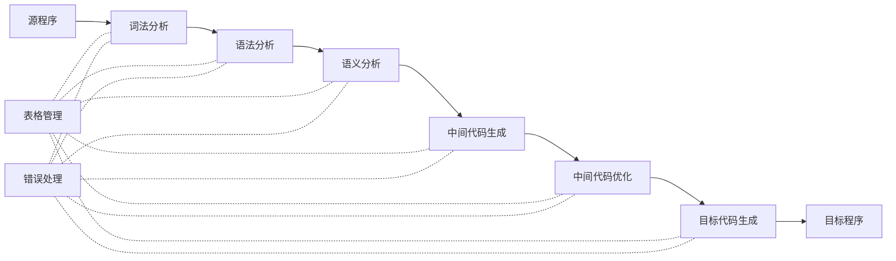

# 历年题（2016–2022级）

整理自 `编译原理笔记/编译原理期末题型整理.pdf` 第 121–150 页（历年题【按年份】：2020、2019、2017 两套、2016 级）、`编译原理期末资料/吉林大学编译原理期末试题解答.pdf` 第 56–62 页（2016 级考题及解答）、`编译原理笔记/编译原理学习笔记.pdf` 第 193–194 页（2019 级考后回忆）和 `软件学院2022级编译原理真题回忆.pdf`。题型整理里的题面是从 `历年题/` 下的扫描卷转写的，转写有漏字、错字，整理时逐题对照扫描卷改正。原稿答案都重新算过（自动机、First/Follow/Predict、LL(1) 表、LR 项目集、四元式优化用 Python 核对），错处就地标"更正"；原稿没有答案、能确定的题补"解答（整理补充）"，拿不准的只写提示。

## 2016级（2018–2019学年第2学期）

来源：`编译原理期末资料/吉林大学编译原理期末试题解答.pdf` 第 56–58 页为试题、第 59–62 页为解答；`编译原理笔记/编译原理期末题型整理.pdf` 第 145–150 页标作"2016级02"，是同一套卷（对应扫描卷 `历年题/2016级(1).pdf`，考试时间 2019 年 7 月）。题型整理这一节是聊天机器人对扫描卷的转写，把好几道题的文法、语言和图读错了，下面的题面以试题解答和扫描卷为准。

`历年题/2016级.pdf` 是另一套 2016 级 A 卷（2019 年 7 月 2 日），几份文字资料里都没有转写，本文件没有收录。

### 一、简答题（6 小题，每题 5 分，共 30 分）

#### 1. 请画出编译器的功能结构图。

解答（整理补充）：



六个阶段都要查表、填表，发现错误都交给错误处理。扫描卷末尾有手写答案的残片，也是"表格管理"框连到各阶段的画法。中间代码生成和中间代码优化不是必需的，其余四个阶段是必须完成的工作。详见 `01 编译引论.md`。

#### 2. 简述 DFA 和 NFA 有哪些主要的区别？

解答（整理补充）：

1. DFA 的转换函数单值，一个状态读同一个符号只有一个后继；NFA 可以有多个后继。
2. DFA 只有一个开始状态；NFA 允许有多个开始状态。
3. DFA 不允许 ε 边；NFA 允许。

两者识别语言的能力相同，NFA 用子集法可以转成等价的 DFA。NFA 描述问题方便，DFA 便于实现。详见 `02 词法分析.md` 第 4 节。

#### 3. 请画出过程活动记录 AR 应包含哪些内容？

解答（整理补充，按 `08 运行时存储空间管理.md` 第 5 节的图，自上而下）：

| 位置 | 区域 | 作用 |
|---|---|---|
| ← top | 临时变量区 | 表达式计算的中间结果 |
| | 局部变量区 | 过程里声明的局部数据 |
| | 形参区 | 调用者传来的实参 |
| 管理信息 | 变量访问环境 | Display 表或静态链，用于访问非局部变量 |
| | 活动记录大小 | 决定 top 的变化 |
| | 寄存器状态 | 调用前的机器状态，返回时恢复 |
| | 过程层数 | 建立访问环境、变量寻址 |
| | 返回值 | 函数结果存放处 |
| | 返回地址 | 调用指令的下一条指令 |
| ← sp | 动态链指针 | 指向调用者的 AR，返回时恢复 |

（更正：题型整理第 145 页这一题的"额外说明"把"控制链"说成静态链、把"访问链"说成动态链。控制链就是动态链，指向调用者的 AR，用于返回；访问链就是静态链，指向直接外层过程的 AR，用于访问非局部变量。）

#### 4. 请分别从语法分析能力和状态数上分析以下四种方法的关系：LR(0)、SLR(1)、LR(1)、LALR(1)。

解答：

- 分析能力：LR(0) < SLR(1) < LALR(1) < LR(1)。
- 状态数：LR(0) = SLR(1) = LALR(1) ≤ LR(1)，前三种都建在 LR(0) 项目集的核心上，LR(1) 的状态一般多很多。

（更正：题型整理第 145 页原文作"LR(0) < SLR(1) < LALR(1) = LR(1)"，并说 LALR(1)"保持相同的分析能力"。LALR(1) 合并同心状态时可能产生归约-归约冲突，有的文法是 LR(1) 文法却不是 LALR(1) 文法，所以 LALR(1) 弱于 LR(1)。扫描卷末尾的手写答案也写的是 LALR(1) < LR(1)。）

原稿其余几句说明没有问题：LR(0) 只能处理很简单的文法；SLR(1) 在 LR(0) 状态机上用 Follow 集决定归约；LALR(1) 合并 LR(1) 中核心相同的项目集来减少状态数；LR(1) 能力最强，但状态数可能很大。详见 `04 语法分析方法（LL1、递归下降、LR）.md` 题 12。

#### 5. 设计一个上下文无关文法 G，可以描述语言 $\{1^n0^m1^m0^n \mid n,m \ge 0\}$。

解答（试题解答第 59 页）：要让两个符号的指数相同，就要有 `X → aXb` 这种形式。

```text
S → A
A → 1A0 | B | ε
B → 0B1 | ε
```

外层 `A → 1A0` 配对 1ⁿ 和 0ⁿ，内层 `B → 0B1` 配对 0ᵐ 和 1ᵐ。`A → ε` 可以省掉（`A → B → ε` 已经能推出空串），留着也不影响结果。已用程序枚举长度 10 以内的串核对。

（更正：题型整理第 146 页把语言转写成 $\{1^n0^m1^n\}$，给出的文法 `S → 1S1 | T`，`T → 0T | ε` 答的是这个转写错的语言。扫描卷和试题解答都是 $1^n0^m1^m0^n$。）

#### 6. 设有文法 G[S] 如下，求句型 (S,(a)) 的语法树以及所有短语、简单短语和句柄。

```text
G[S]:  S → (L) | aS | a
       L → L,S | S
```

解答（整理补充，与 `03 文法与语法树.md` 题 6 是同一道作业题）：

```text
S ⇒ (L) ⇒ (L,S) ⇒ (S,S) ⇒ (S,(L)) ⇒ (S,(S)) ⇒ (S,(a))

S
├─ (
├─ L
│  ├─ L ─ S
│  ├─ ,
│  └─ S
│     ├─ (
│     ├─ L ─ S ─ a
│     └─ )
└─ )
```

- 短语：`(S,(a))`、`S,(a)`、S、`(a)`、a。
- 简单短语：S（由 L → S）、a（由 S → a）。
- 句柄：S。

（更正：题型整理第 146 页把题面转写成"句型 S(a)"，文法读成 `S → L | |aS|a`、`L → Ls | S`，于是按句子 a 作答，结果全错。）

### 二、请将下图所示的 NFA 转换为最小 DFA。（10 分）

原图转写成转换表（0 既是初态也是终态，2 是终态）：

| 状态 | 0 | 1 | ε |
|---|---|---|---|
| →0（初态，终态） | 2 | 1 | |
| 1 | 2 | | |
| 2（终态） | | | 0 |

（题型整理第 146 页的文字描述"状态 0 经 ε 到状态 1、状态 1 读 1 回到自身"与原图不符，以上按扫描卷和试题解答第 56 页的图转写。）

解答（试题解答第 59 页）：

| I | I₀ | I₁ |
|---|---|---|
| {0}（初态，终态） | {0,2} | {1} |
| {0,2}（终态） | {0,2} | {1} |
| {1} | {0,2} | |

有三种状态，设为 S0 = {0}，S1 = {0,2}，S2 = {1}。S0 和 S1 都是终态，读 0、读 1 的去向也相同，可以合并，最小 DFA 只有两个状态 A = {S0, S1}、B = {S2}：

| 状态 | 0 | 1 |
|---|---|---|
| →A（初态，终态） | A | B |
| B | A | |

它接受的语言是 `(0|10)*`。子集表和最小化结果已用程序核对。

### 三、已知文法 G[S]，请写出它的递归下降 C 语言分析程序。（10 分）

```text
S → eT | RT
T → DR | ε
R → dR | ε
D → a | bd
```

（题型整理第 147 页把 `R → dR | ε` 转写成 `R → dR | c`，扫描卷是 ε。）

解答（试题解答第 59 页）：先对非终极符求 First 和 Follow 集，再对产生式求 Predict 集。

| 非终极符 | First | Follow |
|---|---|---|
| S | {e, d, a, b, ε} | {#} |
| T | {a, b, ε} | {#} |
| D | {a, b} | {d, #} |
| R | {d, ε} | {a, b, #} |

| 产生式 | Predict 集 |
|---|---|
| S → eT | {e} |
| S → RT | {a, b, d, #} |
| T → DR | {a, b} |
| T → ε | {#} |
| R → dR | {d} |
| R → ε | {a, b, #} |
| D → a | {a} |
| D → bd | {b} |

同一左部的 Predict 集两两不相交，可以写递归下降程序（I 表示当前输入符号）：

```c
void S() {
    if (I == 'e') {
        Match('e'); T();
    } else if (I == 'd' || I == 'a' || I == 'b' || I == '#') {
        R(); T();
    } else {
        Error();
    }
}

void T() {
    if (I == 'a' || I == 'b') {
        D(); R();
    } else if (I == '#') {
        /* T → ε，不做动作 */
    } else {
        Error();
    }
}

void R() {
    if (I == 'd') {
        Match('d'); R();
    } else if (I == 'a' || I == 'b' || I == '#') {
        /* R → ε，不做动作 */
    } else {
        Error();
    }
}

void D() {
    if (I == 'a') {
        Match('a');
    } else if (I == 'b') {
        Match('b'); Match('d');
    } else {
        Error();
    }
}
```

（更正：原稿 S 函数第一个分支写作 `Match(a);T();`，按 `S → eT` 应匹配 e。）

First、Follow、Predict 集已用 Python 核对。

### 四、对于文法 G[A]，试提取 G[A] 左公共因子，清除左递归。分析新产生的文法 G' 是否为 LL(1) 文法，并构造文法 G' 的 LL(1) 分析表。（10 分）

```text
G[A]:  A → aABbc | a
       B → Bd | e
```

（题型整理第 147 页把文法转写成 `A → aABbc | aAbc`、`B → Bbd | ε`，与扫描卷不符。）

解答（试题解答第 60 页）：

```text
G'[A]:  [1] A  → aA'
        [2] A' → ABbc
        [3] A' → ε
        [4] B  → eB'
        [5] B' → dB'
        [6] B' → ε
```

| 非终极符 | First | Follow |
|---|---|---|
| A | {a} | {#, e} |
| A' | {a, ε} | {#, e} |
| B | {e} | {b} |
| B' | {d, ε} | {b} |

| 产生式 | Predict 集 |
|---|---|
| A → aA' | {a} |
| A' → ABbc | {a} |
| A' → ε | {#, e} |
| B → eB' | {e} |
| B' → dB' | {d} |
| B' → ε | {b} |

任何一个非终极符的各产生式 Predict 集都没有交集，新文法是 LL(1) 文法。分析表（表中数字是产生式编号）：

| | a | b | d | e | # |
|---|---|---|---|---|---|
| A | 1 | | | | |
| A' | 2 | | | 3 | 3 |
| B | | | | 4 | |
| B' | | 6 | 5 | | |

已用 Python 核对。

### 五、有下图程序片段，假设程序点①的层数和偏移为 (L, off0)。试写出各个程序点的层数和偏移的变化情况。（d 为第一个形参的可用区距，int 占 1 个字节，float 占 2 个字节）（10 分）

```c
① typedef at = int a[10][10];
② struct { int number; at score; } bt;
③ at x, *y;
④ int f(at a, ⑤ at* b, ⑥ float x)
   {
⑦     int n;
      ……
   }
⑧ void g()
   {
⑨     int l;
      ……
   }
⑩
```

解答（试题解答第 60 页）：类型声明不改变偏移，只有变量声明改变偏移。

| 程序点 | 层数 | 偏移 | 说明 |
|---|---|---|---|
| ② | L | off₀ | typedef 不占空间 |
| ③ | L | off₀+101 | bt 占 1 + 100 |
| ④ | L | off₀+202 | x 占 100，指针 y 占 1 |
| ⑤ | L+1 | d+100 | 形参 a 是 at 型，值传递占 100 |
| ⑥ | L+1 | d+101 | 指针 b 占 1 |
| ⑦ | L+1 | d+103 | float x 占 2 |
| ⑧ | L | off₀+202 | f 结束，回到外层，函数声明不占空间 |
| ⑨ | L+1 | d | g 没有形参，局部变量从 d 开始 |
| ⑩ | L | off₀+202 | |

（"说明"一列为整理补充。题型整理第 148 页这一题只有泛泛的"额外说明"，没有给出结果。）

### 六、已知文法 G[S] 的产生式如下，其中 S 和 B 为非终极符，a 和 b 为终极符。（15 分）

```text
G[S]:  [1] S → BB
       [2] B → aB
       [3] B → b
```

(1) 请画出 LR(1) 活前缀自动机；(2) 填写 LR(1) 分析表，并判断该文法是否为 LR(1) 文法；(3) 给出符号串 abb# 的分析过程。

（题型整理第 148 页把文法转写成 `S → aB`、`B → ab | b`，这个文法推不出 abb，与扫描卷不符。试题解答第 57 页题面第 (1) 问漏了"LR(1)活前缀自动机"几个字，第 (2) 问误作"LL(1)分析表"，扫描卷是 LR(1)。）

解答（试题解答第 61 页）：

(1) LR(1) 活前缀自动机（原稿为图，这里写成项目集和转移；没有拓广文法，S → BB· 遇 # 即接受）：

| 状态 | LR(1) 项目 | 转移 |
|---|---|---|
| S0 | S → ·BB, #；B → ·aB, a/b；B → ·b, a/b | B→S1，a→S2，b→S3 |
| S1 | S → B·B, #；B → ·aB, #；B → ·b, # | B→S4，a→S5，b→S6 |
| S2 | B → a·B, a/b；B → ·aB, a/b；B → ·b, a/b | B→S7，a→S2，b→S3 |
| S3 | B → b·, a/b | |
| S4 | S → BB·, # | |
| S5 | B → a·B, #；B → ·aB, #；B → ·b, # | B→S8，a→S5，b→S6 |
| S6 | B → b·, # | |
| S7 | B → aB·, a/b | |
| S8 | B → aB·, # | |

（更正：原图 S4 的展望符作 a,b，S4 由 S1 中的 [S → B·B, #] 读 B 得到，展望符应为 #，否则分析表里 S4 遇 # 接受就对不上。）

(2) LR(1) 分析表如下，没有冲突，该文法是 LR(1) 文法。

| 状态 | a | b | # | B |
|---|---|---|---|---|
| S0 | S2 | S3 | | 1 |
| S1 | S5 | S6 | | 4 |
| S2 | S2 | S3 | | 7 |
| S3 | R3 | R3 | | |
| S4 | | | Accept | |
| S5 | S5 | S6 | | 8 |
| S6 | | | R3 | |
| S7 | R2 | R2 | | |
| S8 | | | R2 | |

(3) 符号串 abb# 的分析过程：

| 编号 | 状态栈 | 符号栈 | 输入流 | 动作 | 下一状态 |
|---|---|---|---|---|---|
| 1 | 0 | | abb# | S2 | 2 |
| 2 | 0,2 | a | bb# | S3 | 3 |
| 3 | 0,2,3 | ab | b# | R3 | 7 |
| 4 | 0,2,7 | aB | b# | R2 | 1 |
| 5 | 0,1 | B | b# | S6 | 6 |
| 6 | 0,1,6 | Bb | # | R3 | 4 |
| 7 | 0,1,4 | BB | # | Accept | |

项目集、分析表和分析过程已用 Python 核对（加上拓广产生式 S' → S 时是 10 个状态，多出的一个是 S' → S·，结论相同）。

### 七、将下列 C 语言程序片段翻译成四元式。（四元式的操作符可用自身代替，地址加操作用 [] 表示）（15 分）

```c
float A[20];
int i = 0;
float sum = 1.0;
int j = 1;
if (j > 0) {
    while (i < 20) {
        A[i] = i * 5 - 1;
        sum = sum + A[i] / 2.5;
        i = i + 1;
    }
}
else i = -1;
```

（题型整理第 149 页把括号里的要求转写成"地址加操作符可省略不写"，扫描卷是"地址加操作用[]表示"。）

解答（试题解答第 62 页）：假设 int 占一个单元，float 占两个单元。

| 四元式 | 解释 |
|---|---|
| (=, 0, -, i) | |
| (=, 1.0, -, sum) | |
| (=, 1, -, j) | |
| (>, j, 0, t1) | |
| (THEN, t1, -, -) | if 条件成立 |
| (WHILE, -, -, -) | while 循环标记 |
| (<, i, 20, t2) | |
| (DO, t2, -, -) | |
| (*, i, 5, t3) | |
| (-, t3, 1, t4) | |
| (FLOAT, t4, -, t5) | 需要一个强制类型转换四元式 |
| (-, i, 0, t6) | C 数组下界为 0 |
| (*, t6, 2, t7) | 数组一个元素占两个单元 |
| ([], A, t7, t8) | A[i] 的地址 |
| (=, t5, -, t8) | |
| (/, t8, 2.5, t9) | |
| (+, sum, t9, t10) | |
| (=, t10, -, sum) | |
| (+, i, 1, t11) | |
| (=, t11, -, i) | |
| (ENDWHILE, -, -, -) | 循环结束 |
| (ELSE, -, -, -) | |
| (=, -1, -, i) | |
| (ENDIF, -, -, -) | if 语句结束 |

说明：原稿第二条赋值语句直接复用了第一条算出的地址 t8。严格逐句翻译时，`sum = sum + A[i] / 2.5` 要重新生成 `(-, i, 0, t)`、`(*, t, 2, t')`、`([], A, t', t'')` 三条；i 在两句之间没有变，复用 t8 结果一样，相当于提前做了公共子表达式节省。原稿数组名写成小写 a，这里统一成 A。题型整理第 149–150 页这一题只列了 `GT`、`LT` 之类的片段和"标签"，没有完整答案。

## 2017级（试卷一，2019–2020学年第2学期）

来源：`编译原理笔记/编译原理期末题型整理.pdf` 第 139–142 页（标作"2017级01"），对应扫描卷 `历年题/2017级01.pdf`。卷头为《编译原理与实现》试题（A 卷），考试时间 2020 年 8 月 14 日。只有简答第 1、3、4 题原稿有答案。

### 一、简答题（40 分）

#### 1. 典型的编译程序由哪几部分构成？

解答：词法分析、语法分析、语义分析、中间代码生成、中间代码优化、目标代码生成。原稿补充：还应包括表格管理和错误处理。

#### 2. 请把下图的 NFA 确定化。

原图转写（S0 为初态，S2 为终态）：

| 状态 | a | b |
|---|---|---|
| →S0 | S1 | |
| S1 | | {S1, S2} |
| S2（终态） | S1 | |

解答（整理补充）：用子集法。

| DFA 状态 | 对应 NFA 状态集 | a | b |
|---|---|---|---|
| →A | {S0} | B | |
| B | {S1} | | C |
| C（终态） | {S1, S2} | B | C |

C 含终态 S2，是终态。A、B 读 a 的去向不同（A 到 B，B 无后继），这个 DFA 已经最简。它接受的语言是 `a(b|ba)*b`。已用程序核对。

#### 3. 设字母表 Σ={0,1}，写正则表达式识别只包含两个 1 的所有 0、1 构成的字符串。

解答：`0*10*10*`

#### 4. 请给出描述语言 $L=\{a^nb^mc^k \mid m=n+k,\ n\ge1,\ m>1,\ k\ge1\}$ 的文法。

解答：a 的个数是 n（至少 1），c 的个数是 k（至少 1），b 的个数 m = n + k，正好等于 a 和 c 的个数之和。把 b 拆成两段，前 n 个和 a 配对，后 k 个和 c 配对：

```text
S → AB          把两段拼起来
A → aAb | ab    每匹配一个 a，配一个 b
B → bBc | bc    每匹配一个 c，配一个 b
```

n、k 都至少为 1，m 自然大于 1。已用程序枚举长度 10 以内的串核对。同题见 `03 文法与语法树.md` 题 9。

#### 5. 设文法 G[E] 为：

```text
E → E+T | E-T | T
T → T*F | T/F | F
F → (E) | i
```

请给出 i+i/i 的语法树，并找出句子的全部短语和句柄。

（题型整理第 140 页把句子转写成 `i+i*i`，扫描卷是 `i+i/i`。乘号和除号在同一层，两种写法的答案结构相同。）

解答（整理补充）：

```text
E ⇒ E+T ⇒ T+T ⇒ F+T ⇒ i+T ⇒ i+T/F ⇒ i+F/F ⇒ i+i/F ⇒ i+i/i

E
├─ E ─ T ─ F ─ i
├─ +
└─ T
   ├─ T ─ F ─ i
   ├─ /
   └─ F ─ i
```

- 短语：`i+i/i`、`i/i`、第一个 i、第二个 i、第三个 i。
- 简单短语：三个 i（都由 F → i 直接得到）。
- 句柄：第一个 i。

#### 6. 请枚举出至少三种自底向上的语法分析方法。

解答（整理补充）：LR(0) 分析、SLR(1) 分析、LALR(1) 分析、LR(1) 分析，以及简单优先分析。它们都属于移入-归约分析。

#### 7. 已知文法 G[S] 如下：`S → aS | bS | a`。请构造该文法的 LR(0) 归约规范活前缀状态机。

解答（整理补充）：开始符 S 出现在产生式右部，先拓广 `Z → S`。

| 状态 | LR(0) 项目 | 转移 |
|---|---|---|
| I0 | Z → ·S；S → ·aS；S → ·bS；S → ·a | S→I1，a→I2，b→I3 |
| I1 | Z → S· | 接受 |
| I2 | S → a·S；S → a·；S → ·aS；S → ·bS；S → ·a | S→I4，a→I2，b→I3 |
| I3 | S → b·S；S → ·aS；S → ·bS；S → ·a | S→I5，a→I2，b→I3 |
| I4 | S → aS· | |
| I5 | S → bS· | |

I2 里同时有归约项目 S → a· 和读 a、b 的移入项目，有移入-归约冲突，所以这个文法不是 LR(0) 文法。Follow(S) = {#}，只在 # 上归约就能消除冲突，它是 SLR(1) 文法。状态机已用 Python 核对。

#### 8. 某程序的结构如下图所示，其中 A、B、C 为过程名。假定程序的调用链为：主程序→A→B→C→A，调用链中五个过程活动记录的首地址分别为 ar0, ar1, ar2, ar3, ar4, ar5，请给出过程 C 调用 A 后，过程 B 和过程 C 的局部 Display 表信息。

程序结构（原卷为嵌套方框图）：主程序里声明 A，A 里声明 B，B 里声明 C；C 中有 `var x: int; x:=5; call A`。

解答（整理补充）：题面写了 ar0～ar5 六个地址，调用链只有五个活动记录，按 ar0～ar4 作答。主程序 0 层，A、B、C 依次为 1、2、3 层。

```text
AR(主程序).Display = [ar0]
AR(A).Display      = [ar0, ar1]
AR(B).Display      = [ar0, ar1, ar2]
AR(C).Display      = [ar0, ar1, ar2, ar3]
AR(A，第二次).Display = [ar0, ar4]      取 AR(C) 的前 1 项，再加 ar4
```

所以 B 的局部 Display 表是 [ar0, ar1, ar2]，C 的是 [ar0, ar1, ar2, ar3]。C 调 A 不会改动已有 AR 里的 Display 表。求法见 `08 运行时存储空间管理.md` 第 10 节。

### 二、（20 分）设文法 G[E] 为：

```text
E → E+T | T
T → T*F | F
F → P↑F | P
P → (E) | i
```

请消除该文法的左递归和公共前缀构造新文法 G'，并求新文法 G' 所有非终极符的 FIRST 集和 FOLLOW 集，构造该文法的 LL(1) 分析表。

（题型整理第 141 页把第三行转写成 `F→P ↑ FP`，漏了 `|`。）

解答（整理补充）：E、T 有直接左递归，F 的两个候选式有公共前缀 P。

```text
G'[E]:  [1] E  → TE'
        [2] E' → +TE'
        [3] E' → ε
        [4] T  → FT'
        [5] T' → *FT'
        [6] T' → ε
        [7] F  → PF'
        [8] F' → ↑F
        [9] F' → ε
        [10] P → (E)
        [11] P → i
```

| 非终极符 | FIRST | FOLLOW |
|---|---|---|
| E | {(, i} | {), #} |
| E' | {+, ε} | {), #} |
| T | {(, i} | {+, ), #} |
| T' | {*, ε} | {+, ), #} |
| F | {(, i} | {*, +, ), #} |
| F' | {↑, ε} | {*, +, ), #} |
| P | {(, i} | {↑, *, +, ), #} |

LL(1) 分析表（数字是产生式编号）：

| | + | * | ↑ | ( | ) | i | # |
|---|---|---|---|---|---|---|---|
| E | | | | 1 | | 1 | |
| E' | 2 | | | | 3 | | 3 |
| T | | | | 4 | | 4 | |
| T' | 6 | 5 | | | 6 | | 6 |
| F | | | | 7 | | 7 | |
| F' | 9 | 9 | 8 | | 9 | | 9 |
| P | | | | 10 | | 11 | |

表中没有多重表项，G' 是 LL(1) 文法。已用 Python 核对。

### 三、（10 分）已知如下 C 语言程序段，请给出分析至 printf 语句结束时的全局符号表（每个函数第一个形参可用的偏移为 off，整型类型占 1 个单元，每个符号的属性包括名字，种类，类型，层数和偏移）。

```c
int fact(int n)
{
    if (n == 0 || n == 1) return 1;
    else
    {
        return n * fact(n - 1);
    }
}
void main()
{
    int n = 5, m;
    m = fact(n);
    printf("%d", m);
}
```

解答（整理补充，按全局符号表驻留法；C 语言函数名在 0 层，形参和局部变量在 1 层）：

| 序号 | 名字 | 种类 | 类型 | 层数 | 偏移 |
|---|---|---|---|---|---|
| 1 | fact | routKind | intPtr | 0 | |
| 2 | n | varKind | intPtr | 1 | off |
| 3 | # | | | | 跳到第 1 项（fact 结束） |
| 4 | main | routKind | null | 0 | |
| 5 | n | varKind | intPtr | 1 | off |
| 6 | m | varKind | intPtr | 1 | off+1 |

Scope 栈此时指向第 1 项（全局）和第 5 项（main）。printf 是库函数，程序里没有声明，不进表。fact 里 else 后的复合语句没有声明，表里不留内容。若按删除法，fact 结束时第 2、3 项被删掉，表里只剩 fact、main、n（off）、m（off+1）。做法见 `05 语义分析与符号表.md` 第 6.3 节和典型题 5。

### 四、（20 分）设有如下程序段，其中 A: Array [1..100] of integer，程序中的所有变量都为整型变量，占 1 个存储单元。

```pascal
i := 1;
while i < 100 do
begin
    j := 10;
    A[i] = i*10 + i*j*(j+10);
    A[3] = A[3] + 100;
    i := i+1;
end
```

(1) 给出该程序段代码的四元式中间代码。(2) 请利用常表达节省、公共子表达式节省和循环不变式外提三种优化技术对四元式中间代码进行优化，给出优化后的四元式代码。

（原卷无答案。平时作业里有一道几乎一样的题，只是 `j := 100/10`，原稿有完整手写答案，见 `07 中间代码优化.md` 题 4。）

解答（整理补充，按作业题的写法，已用脚本复核）：

(1) 四元式：

```text
1.  (:=, 1, -, i)
2.  (WHILE, -, -, -)
3.  (<, i, 100, t1)
4.  (DO, t1, -, -)
5.  (:=, 10, -, j)
6.  (-, i, 1, t2)
7.  (*, t2, 1, t3)
8.  (AADD, A, t3, t4)        A[i] 的地址
9.  (*, i, 10, t5)
10. (*, i, j, t6)
11. (+, j, 10, t7)
12. (*, t6, t7, t8)
13. (+, t5, t8, t9)
14. (:=, t9, -, t4)          A[i] := ...
15. (-, 3, 1, t10)
16. (*, t10, 1, t11)
17. (AADD, A, t11, t12)      左边 A[3] 的地址
18. (-, 3, 1, t13)
19. (*, t13, 1, t14)
20. (AADD, A, t14, t15)      右边 A[3] 的地址
21. (+, t15, 100, t16)       取 A[3] 的内容加 100
22. (:=, t16, -, t12)
23. (+, i, 1, t17)
24. (:=, t17, -, i)
25. (ENDWHILE, -, -, -)
```

(2) 基本块：B1 = {1}，B2 = {2–4}，B3 = {5–25}。

常表达式节省（只在 B3 内有变化）：

| 四元式 | 处理 | ConstDef 新增 |
|---|---|---|
| 5 `(:=, 10, -, j)` | 不变 | (j, 10) |
| 10 `(*, i, j, t6)` | 改成 `(*, i, 10, t6)` | |
| 11 `(+, j, 10, t7)` | 删除 | (t7, 20) |
| 12 `(*, t6, t7, t8)` | 改成 `(*, t6, 20, t8)` | |
| 15 `(-, 3, 1, t10)` | 删除 | (t10, 2) |
| 16 `(*, t10, 1, t11)` | 删除 | (t11, 2) |
| 17 `(AADD, A, t11, t12)` | 改成 `(AADD, A, 2, t12)` | |
| 18 `(-, 3, 1, t13)` | 删除 | (t13, 2) |
| 19 `(*, t13, 1, t14)` | 删除 | (t14, 2) |
| 20 `(AADD, A, t14, t15)` | 改成 `(AADD, A, 2, t15)` | |

公共子表达式节省（B3 内）：10 `(*, i, 10, t6)` 与 9 映象码相同，删除，等价表记 (t5, t6)，12 改成 `(*, t5, 20, t8)`；20 `(AADD, A, 2, t15)` 与 17 相同，删除，记 (t12, t15)，21 改成 `(+, t12, 100, t16)`。

循环不变式外提：`LoopDef = {t1, j, t2, t3, t4, t5, t8, t9, t12, t16, t17, i}`。17 `(AADD, A, 2, t12)` 两个分量都不在表里，外提；21 用的是 t12 地址里的内容（A[3]，间接寻址），A[3] 在 22 被改写，不外提；其余运算都用到 i、j 或表里的临时变量。5 `(:=, 10, -, j)` 是赋值，不外提。

优化后：

```text
1.  (:=, 1, -, i)
17. (AADD, A, 2, t12)
2.  (WHILE, -, -, -)
3.  (<, i, 100, t1)
4.  (DO, t1, -, -)
5.  (:=, 10, -, j)
6.  (-, i, 1, t2)
7.  (*, t2, 1, t3)
8.  (AADD, A, t3, t4)
9.  (*, i, 10, t5)
12. (*, t5, 20, t8)
13. (+, t5, t8, t9)
14. (:=, t9, -, t4)
21. (+, t12, 100, t16)
22. (:=, t16, -, t12)
23. (+, i, 1, t17)
24. (:=, t17, -, i)
25. (ENDWHILE, -, -, -)
```

### 五、（10 分）二义性文法一定不是 LR 类文法，但是可以借助一些辅助规则或条件，对某些二义性文法用 LR 类方法进行语法分析。给定如下表达式的一个二义性文法：

```text
S → E
E → E+E | E*E | (E) | i
```

在不对该文法进行等价变换的条件下，请具体说明如何用 LR 类的分析方法对该文法进行语法分析。

解答（整理补充）：照常构造 LR(0) 项目集规范族和 SLR(1) 分析表，冲突只出现在两个状态里，再用运算符的优先级和结合性决定取移入还是归约。

1. 构造状态机。`Follow(E) = {+, *, ), #}`。有冲突的两个状态是：
   - I7：`E → E+E·`，`E → E·+E`，`E → E·*E`（由 `E → E+·E` 读 E 得到）
   - I8：`E → E*E·`，`E → E·+E`，`E → E·*E`（由 `E → E*·E` 读 E 得到）

   这两个状态里，归约项目要求在 Follow(E) 上归约，另外两个项目要求读 `+`、`*` 时移入，于是在 `+` 和 `*` 上有移入-归约冲突。其他状态（如 `S → E·`，`E → E·+E`，`E → E·*E`，S 只在 # 上归约）没有冲突。
2. 规定 `*` 的优先级高于 `+`，两者都左结合，据此填表：
   - I7（栈顶是 `E+E`）：下一个符号是 `+`，左结合，先归约 `E → E+E`；是 `*`，乘号优先级高，移入；是 ) 或 #，归约。
   - I8（栈顶是 `E*E`）：下一个符号是 `+` 或 `*`，乘号优先级不低于它们且左结合，都归约 `E → E*E`；是 ) 或 #，归约。
3. 这样每个表项只剩一个动作，按普通 LR 驱动程序分析即可。例如 `i+i*i`，栈里是 `E+E`、下一个是 `*` 时移入，先算 `i*i`，再归约加法，得到的语法树与"先乘后加"一致。

项目集和冲突位置已用 Python 核对。

## 2017级（试卷二，2019–2020学年第2学期）

来源：`编译原理笔记/编译原理期末题型整理.pdf` 第 142–145 页（标作"2017级02"），对应扫描卷 `历年题/2017级02.pdf`。卷头为 2017 级《编译原理与实现》期末考试试题（A 卷），考试时间 2020 年 8 月 13 日。原稿整套没有答案。

### 一、简答题（5 小题，每题 5 分，共 25 分）

#### 1. 典型的编译程序在逻辑功能上由哪几部分组成？

解答（整理补充）：词法分析、语法分析、语义分析、中间代码生成、中间代码优化、目标代码生成六部分，另有表格管理和错误处理贯穿各阶段。

#### 2. 设有文法 G[L] 如下，其中 L 为非终极符，+、d 是终极符。判断文法 G[L] 是否为二义性文法，并说明理由。

```text
L → L+L | d
```

解答（整理补充）：是二义性文法。句子 `d+d+d` 有两棵语法树，也就有两个不同的最左推导：

```text
树 1：(d+d)+d                     树 2：d+(d+d)
L                                 L
├─ L                              ├─ L ─ d
│  ├─ L ─ d                       ├─ +
│  ├─ +                           └─ L
│  └─ L ─ d                          ├─ L ─ d
├─ +                                 ├─ +
└─ L ─ d                             └─ L ─ d

最左推导 1：L ⇒ L+L ⇒ L+L+L ⇒ d+L+L ⇒ d+d+L ⇒ d+d+d
最左推导 2：L ⇒ L+L ⇒ d+L ⇒ d+L+L ⇒ d+d+L ⇒ d+d+d
```

#### 3. 字母表 Σ={a,b}，给出语言 $L=\{a^nb^{n+1} \mid n\ge0\}$ 的上下文无关文法描述。（答案不唯一）

解答（整理补充）：

```text
S → aSb | b
```

n = 0 时是 b；每用一次 `S → aSb`，a、b 各多一个。已用程序枚举核对。

#### 4. 设有文法 G[S] 如下，其中 S、L 是非终极符，(、)、a、+ 是终极符。

```text
S → (L) | aS | a
L → L+S | S
```

请给出句型 a(S+a) 的所有短语、简单短语和句柄。

解答（整理补充）：

```text
S ⇒ aS ⇒ a(L) ⇒ a(L+S) ⇒ a(S+S) ⇒ a(S+a)

S
├─ a
└─ S
   ├─ (
   ├─ L
   │  ├─ L ─ S
   │  ├─ +
   │  └─ S ─ a
   └─ )
```

- 短语：`a(S+a)`、`(S+a)`、`S+a`、S、a。
- 简单短语：S（由 L → S）、a（由 S → a）。
- 句柄：S。

#### 5. 过程活动记录中一般包含哪些数据域？这些数据域各自的作用是什么？

解答（整理补充）：数据域和作用见上面 2016 级简答题第 3 题的表：临时变量区、局部变量区、形参区，以及管理信息（变量访问环境、活动记录大小、寄存器状态、过程层数、返回值、返回地址、动态链指针）。详见 `08 运行时存储空间管理.md` 第 5 节。

### 二、（15 分）非确定有限状态自动机 M 如下图所示，试将 M 进行确定化和最小化。

原图转写成转换表（A 为初态，E 为终态）：

| 状态 | 0 | 1 | ε |
|---|---|---|---|
| →A | | | B |
| B | B | B | C |
| C | | D | |
| D | E | E | |
| E（终态） | | | |

（题型整理第 143 页用字符画转写这张图，边的位置全乱了，还加了一段与原图不符的注释。以上按扫描卷转写。）

解答（整理补充）：

确定化：

| DFA 状态 | NFA 状态集 | 0 | 1 |
|---|---|---|---|
| →I0 | {A, B, C} | I1 | I2 |
| I1 | {B, C} | I1 | I2 |
| I2 | {B, C, D} | I3 | I4 |
| I3（终态） | {B, C, E} | I1 | I2 |
| I4（终态） | {B, C, D, E} | I3 | I4 |

最小化：

1. 初始划分：非终态 {I0, I1, I2}，终态 {I3, I4}。
2. {I0, I1, I2} 读 1：I0、I1 到 I2（非终态组），I2 到 I4（终态组），分成 {I0, I1} 和 {I2}。{I3, I4} 读 0：I3 到 I1（非终态组），I4 到 I3（终态组），分成 {I3} 和 {I4}。
3. {I0, I1} 读 0 都到 I1，读 1 都到 I2，不能再分。

最简 DFA 有 4 个状态，令 P = {I0, I1}：

| 状态 | 0 | 1 |
|---|---|---|
| →P | P | I2 |
| I2 | I3 | I4 |
| I3（终态） | P | I2 |
| I4（终态） | I3 | I4 |

M 接受的是倒数第二位为 1 的 0、1 串，即 `(0|1)*1(0|1)`。已用程序核对。

### 三、（15 分）已知文法 G[S] 如下，其中 S、B、T 和 D 是非终极符，a、b 和 c 是终极符。

```text
① S → bBT    ② B → cD    ③ T → aDT    ④ T → ε    ⑤ D → bD    ⑥ D → ε
```

(1) 求文法 G[S] 中每个产生式的 predict 集。(2) 构造文法 G[S] 的 LL(1) 分析表。(3) 试应用 LL(1) 分析技术，使用表 1 格式给出句子 bca 的分析过程。

解答（整理补充）：

(1) First(T) = {a, ε}，First(D) = {b, ε}；Follow(S) = Follow(T) = {#}，Follow(B) = Follow(D) = {a, #}。

| 产生式 | Predict 集 |
|---|---|
| ① S → bBT | {b} |
| ② B → cD | {c} |
| ③ T → aDT | {a} |
| ④ T → ε | {#} |
| ⑤ D → bD | {b} |
| ⑥ D → ε | {a, #} |

(2) LL(1) 分析表：

| | a | b | c | # |
|---|---|---|---|---|
| S | | ① | | |
| B | | | ② | |
| T | ③ | | | ④ |
| D | ⑥ | ⑤ | | ⑥ |

(3) 分析过程（符号栈右端为栈顶）：

| 符号栈 | 输入串 | 驱动程序动作 |
|---|---|---|
| #S | bca# | 替换 ① S → bBT |
| #TBb | bca# | 匹配 b |
| #TB | ca# | 替换 ② B → cD |
| #TDc | ca# | 匹配 c |
| #TD | a# | 替换 ⑥ D → ε |
| #T | a# | 替换 ③ T → aDT |
| #TDa | a# | 匹配 a |
| #TD | # | 替换 ⑥ D → ε |
| #T | # | 替换 ④ T → ε |
| # | # | 成功 |

已用 Python 核对。

### 四、（15 分）给出下面 C 程序扫描到语句"b = a+b;"时相应的符号表内容。

要求：1. 采用全局符号表驻留方法；2. 标识符具体属性信息需写出名字、类型、局部化单位编号、层数和偏移，数据区起始偏移从 off0 开始，整型变量占 1 个存储单元，浮点类型变量占 2 个存储单元。

```c
int main()
{
    int a = 0;
    int b = 1;
    {
        float b = 3.0;
        {
            float x = 1.3;
            float a = 0.3;
            b = b + a + x;
        }
        {
            int a = 10;
        }
        b = a + b;
    }
}
```

解答（整理补充）：局部化单位编号：全局为 0，main 函数体为 1，`float b` 所在的块为 2，`float x, a` 所在的块为 3，`int a = 10` 所在的块为 4。C 语言里 main 在 0 层，main 里的变量（包括块内的）都在 1 层，偏移接着往下排，块结束后不回收。

| 序号 | 名字 | 类型 | 局部化单位 | 层数 | 偏移 |
|---|---|---|---|---|---|
| 1 | main | intPtr（函数） | 0 | 0 | |
| 2 | a | intPtr | 1 | 1 | off₀ |
| 3 | b | intPtr | 1 | 1 | off₀+1 |
| 4 | b | realPtr | 2 | 1 | off₀+2 |
| 5 | x | realPtr | 3 | 1 | off₀+4 |
| 6 | a | realPtr | 3 | 1 | off₀+6 |
| 7 | # | | | | 跳到第 4 项（单位 3 结束） |
| 8 | a | intPtr | 4 | 1 | off₀+8 |
| 9 | # | | | | 跳到第 7 项（单位 4 结束） |

Scope 栈自底向上指向第 1、2、4 项。查 `b = a + b`：从第 9 项往前，跳到第 7 项、再跳到第 4 项，b 是 float 型（off₀+2）；a 继续往前找到第 2 项，是 int 型（off₀）。

平时作业里有同一个程序的变体（块里声明的是 `float a` 和 `float x, b`），原稿有手写答案，见 `05 语义分析与符号表.md` 典型题 5。

### 五、（15 分）已知文法 G[S] 如下，其中 S 和 A 是非终极符，a、b 和 c 是终极符。

```text
S → aAc
A → bAb | b
```

请回答下列问题：(1) 判断该文法是否是 LR(0) 文法，并说明理由；(2) 判断该文法是否是 LR(1) 文法，并说明理由。

解答（整理补充）：

(1) 不是 LR(0) 文法。LR(0) 状态机里，S → a·Ac 读 b 后得到状态

```text
I3：A → b·Ab   A → b·   A → ·bAb   A → ·b
```

I3 里有归约项目 A → b·，又有读 b 的移入项目，是移入-归约冲突。

(2) 也不是 LR(1) 文法。LR(1) 状态机：

| 状态 | LR(1) 项目 | 转移 |
|---|---|---|
| I0 | S → ·aAc, # | a→I1 |
| I1 | S → a·Ac, #；A → ·bAb, c；A → ·b, c | A→I2，b→I3 |
| I2 | S → aA·c, # | c→I4 |
| I3 | A → b·Ab, c；A → b·, c；A → ·bAb, b；A → ·b, b | A→I5，b→I6 |
| I4 | S → aAc·, # | |
| I5 | A → bA·b, c | b→I7 |
| I6 | A → b·Ab, b；A → b·, b；A → ·bAb, b；A → ·b, b | A→I8，b→I6 |
| I7 | A → bAb·, c | |
| I8 | A → bA·b, b | b→I9 |
| I9 | A → bAb·, b | |

I3 没有冲突（遇 c 归约，遇 b 移入），但 I6 里 [A → b·, b] 要求遇 b 归约，[A → ·b, b] 和 [A → b·Ab, b] 读 b 要移入，还是移入-归约冲突。直观地看，句子是 `ab…bc`（奇数个 b），读到中间某个 b 时，要知道后面还剩几个 b 才能判断它是不是正中间那个，只向前看一个符号不够。

LR(0)、LR(1) 状态机和冲突位置已用 Python 核对。

### 六、（15 分）设有如下程序段，其中 A: Array of [1..10] of integer，程序中的所有变量都为整型变量，占 1 个存储单元。请依次利用常表达节省、公共子表达式节省和循环不变式外提三种优化技术对程序段对应的四元式中间代码进行优化，给出优化后的四元式代码。

```pascal
i := 1;
b := (i+1)*3;
while i < 10 do
begin
    k := 1;
    while k < 100 do
    begin
        s := s + A[i]*A[k];
        j := x*y;
        k := k*2;
        b := x*y;
    end
    k := j*2;
    i := i+1;
end
```

解答（整理补充，已用脚本复核）：

四元式：

```text
1.  (:=, 1, -, i)
2.  (+, i, 1, t1)
3.  (*, t1, 3, t2)
4.  (:=, t2, -, b)
5.  (WHILE, -, -, -)
6.  (<, i, 10, t3)
7.  (DO, t3, -, -)
8.  (:=, 1, -, k)
9.  (WHILE, -, -, -)
10. (<, k, 100, t4)
11. (DO, t4, -, -)
12. (-, i, 1, t5)
13. (*, t5, 1, t6)
14. (AADD, A, t6, t7)       A[i] 的地址
15. (-, k, 1, t8)
16. (*, t8, 1, t9)
17. (AADD, A, t9, t10)      A[k] 的地址
18. (*, t7, t10, t11)       A[i]*A[k]
19. (+, s, t11, t12)
20. (:=, t12, -, s)
21. (*, x, y, t13)
22. (:=, t13, -, j)
23. (*, k, 2, t14)
24. (:=, t14, -, k)
25. (*, x, y, t15)
26. (:=, t15, -, b)
27. (ENDWHILE, -, -, -)
28. (*, j, 2, t16)
29. (:=, t16, -, k)
30. (+, i, 1, t17)
31. (:=, t17, -, i)
32. (ENDWHILE, -, -, -)
```

基本块：{1–4}、{5–7}、{8}、{9–11}、{12–27}、{28–32}。

1. 常表达式节省：只有第一块有变化。i 为 1，2 算出 t1 = 2 删除，3 算出 t2 = 6 删除，4 改成 `(:=, 6, -, b)`。
2. 公共子表达式节省：块 {12–27} 里 25 `(*, x, y, t15)` 与 21 映象码相同（中间 x、y 没有被赋值），删除，等价表 (t13, t15)，26 改成 `(:=, t13, -, b)`。
3. 循环不变式外提，从内层开始：
   - 内层循环（9–27）：`LoopDef = {t4, t5, t6, t7, t8, t9, t10, t11, t12, s, t13, j, t14, k, b}`。i 在内层没有被赋值，12、13、14 依次外提；21 `(*, x, y, t13)` 外提。15、16、17 用到 k；18 用到 A[i]、A[k] 的内容（间接寻址），都不提。外提的四条放到内层 WHILE 之前。
   - 外层循环（5–32）：`LoopDef` 加上 t3、t16、t17、i 等。刚提出来的 12–14 用到 i，留在外层循环里；21 只用到 x、y，再外提一次，放到外层 WHILE 之前。28 用到 j，30 用到 i，不提。

优化后（编号沿用原编号）：

```text
1.  (:=, 1, -, i)
4.  (:=, 6, -, b)
21. (*, x, y, t13)
5.  (WHILE, -, -, -)
6.  (<, i, 10, t3)
7.  (DO, t3, -, -)
8.  (:=, 1, -, k)
12. (-, i, 1, t5)
13. (*, t5, 1, t6)
14. (AADD, A, t6, t7)
9.  (WHILE, -, -, -)
10. (<, k, 100, t4)
11. (DO, t4, -, -)
15. (-, k, 1, t8)
16. (*, t8, 1, t9)
17. (AADD, A, t9, t10)
18. (*, t7, t10, t11)
19. (+, s, t11, t12)
20. (:=, t12, -, s)
22. (:=, t13, -, j)
23. (*, k, 2, t14)
24. (:=, t14, -, k)
26. (:=, t13, -, b)
27. (ENDWHILE, -, -, -)
28. (*, j, 2, t16)
29. (:=, t16, -, k)
30. (+, i, 1, t17)
31. (:=, t17, -, i)
32. (ENDWHILE, -, -, -)
```

## 2019级（2021–2022学年第1学期，A卷）

来源：`编译原理笔记/编译原理期末题型整理.pdf` 第 125–139 页（题面对应扫描卷 `历年题/2019级.pdf`，考试时间 2022 年 1 月 4 日），答案大多是手写；`编译原理笔记/编译原理学习笔记.pdf` 第 193–194 页有一份这届的考后回忆。

两份核对后是同一套卷。回忆稿说选择题"大部分都是学习通作业里面的原题，貌似只有一题不是"，简答记了 6 题、解答记了 4 题，细节和扫描卷有出入：简答 2 记成 `S→SS|S+S|a`，简答 5 的文法记成 `S→(L)|D`、`D→bc`，递归下降题记成 `E→(E|ε`，自动机题记成 `(a|b)*(aa|bb)b`，LL(1) 题记成 `L→LS|SbL`，符号表题记成"扫描到 `i=a*b` 时"，"一个句型是否一定有最左推导"那题没记下来。下面一律以扫描卷为准。

### 一、选择题（5 小题，每小题 2 分，共 10 分）

1. 以下关于高级语言实现方式的说法错误的是（ ）。

   A. 编译方式与解释方式的根本区别在于是否生成目标代码
   B. 编译方式对源程序的处理是先翻译后执行
   C. 解释方式是按源程序中语句的动态顺序逐句地进行分析解释，并立即执行
   D. 解释方式并不对源程序进行翻译

2. 下列文法能够产生语言 $L=\{a^nbb^n \mid n\ge1\}$ 的是（ ）。

   A. `Z → aAb`，`A → aAb | b`
   B. `Z → aZb | aMb | b`，`M → aMb | b`
   C. A → aAb，A → b
   D. `Z → AbB`，`A → aA | a`，`B → bB | b`

3. LL(1) 语法制导方法是在 LL(1) 文法基础之上，在（ ）位置，增加一些语义动作。

   A. 在产生式右部的任何　B. 在产生式右部的最后　C. 在产生式右部的最前　D. 在产生式左部的最前

4. 函数中定义的形参变量的地址分配在（ ）。

   A. 调用者的数据区　B. 被调者的数据区　C. 主程序的数据区　D. 公共数据区

5. 在下面类别语句的目标代码生成过程中，一定不需要使用回填技术的是（ ）。

   A. 赋值语句　B. goto 语句　C. 条件语句　D. 循环语句

解答：第 1～5 题依次为 D、A、A、B、A。

- 第 1 题：解释方式也要对源程序进行翻译，只是边翻译边执行，不生成目标程序。
- 第 2 题：A 推出的是 aⁿbbⁿ（n ≥ 1）。C 的开始符直接用 A → b 就得到 b，对应 n = 0，不满足 n ≥ 1；B 同理可以直接推出 b；D 里 a、b 的个数互不相关。自己按题意写文法时也要注意 n 的下界。（题型整理第 125 页把 D 的第一条转写成 Z → aAb，扫描卷是 Z → AbB。）
- 第 3 题：LL(1) 语法制导方法可以在产生式右部的任何位置加语义动作。分析时遇到终极符做匹配，遇到非终极符选产生式推导，遇到语义动作就执行它代表的语义子程序。
- 第 4 题：形参存放在被调过程的活动记录里，即被调者的数据区。
- 第 5 题：goto、条件、循环语句生成目标代码时都要用跳转指令，跳转目标地址暂时不能确定，只能先空着等以后回填；赋值语句不用跳转指令。

### 二、简答题（7 小题，每小题 5 分，共 35 分）

#### 1. 设字母表 Σ={a,b}，请写出表示每个 a 后面至少有一个 b 的所有串的正则表达式和上下文无关文法。

解答（原稿手写）：

- 正则表达式：`(ab|b)*`
- 上下文无关文法：`S → abS | bS | ε`

原稿旁注：正则表达式换成文法的办法是一个闭包对应一条右递归，例如 `(a|b)*` 对应 `S → aS | bS | ε`。回忆稿说这题要的是"LL1 文法"，上面这个文法三个候选式的 Predict 集是 {a}、{b}、{#}，本身就是 LL(1) 文法。已用程序枚举核对文法和正则表达式等价。

#### 2. 设有文法 `S → S*S | S+S | (S) | a`，判断该文法是否为二义性文法？为什么？

解答（原稿手写）：是二义性文法，比如 `a+a*a` 存在两棵语法树。

两棵树对应的最左推导（整理补充）：

```text
S ⇒ S+S ⇒ a+S ⇒ a+S*S ⇒ a+a*S ⇒ a+a*a        （先乘后加）
S ⇒ S*S ⇒ S+S*S ⇒ a+S*S ⇒ a+a*S ⇒ a+a*a      （先加后乘）
```

#### 3. 使用递归下降语法分析方法进行语法分析，假定匹配函数 Match(c)、错误处理函数 Error() 已事先定义好。写出下列文法中非终极符 E 的递归下降子程序。

```text
S → aED
D → mD | ε
E → dE | ε
```

解答（原稿手写）：

① 文法没有左递归和公共前缀。

② First 和 Follow 集：

| 非终极符 | First | Follow |
|---|---|---|
| S | {a} | {#} |
| D | {m, ε} | {#} |
| E | {d, ε} | {#, m} |

原稿红笔批注：Follow(E) = (First(D) − {ε}) ∪ Follow(S)。

③ Predict 集：

| 产生式 | Predict 集 |
|---|---|
| S → aED | {a} |
| D → mD | {m} |
| D → ε | {#} |
| E → dE | {d} |
| E → ε | {#, m} |

（更正：原稿 Predict(D → ε) 作 {#, d}。原稿在 Follow(D) 里已经把 d 划掉，Predict(D → ε) = Follow(D) = {#}，这里漏改了。）

```c
void E() {
    if (token == 'd') {
        Match('d');
        E();
    } else if (token == '#' || token == 'm') {
        /* E → ε，空语句，与 skip 效果一致 */
    } else {
        Error();
    }
}
```

First、Follow、Predict 集已用 Python 核对。

#### 4. 一个句型是否一定有最左推导？如果有请说明原因，如果没有请举例说明。

解答（原稿手写）：不一定。每个句子都有相应的最左推导和最右推导，但对句型不一定成立。比如文法

```text
S → AB
A → a
B → b
```

句型 Ab 只能通过最右推导 S ⇒ AB ⇒ Ab 得到。最左推导第二步必须先替换 A，推不出 Ab。

#### 5. 设有如下文法，其中 S 为文法开始符

```text
S → (L) | a
L → L,S | S
```

请为此文法添加语义动作，使其能检查括号是否匹配，如果匹配则输出配对括号的个数，否则输出"Not Match"。如对于句子 (a,(a,a)) 输出是 2，而对句子 (a,(a,a))) 则输出"Not Match"。

解答（原稿手写）：

想法：加两个计数器。flag 遇左括号加 1、遇右括号减 1，最后 flag 不为 0 就输出 Not Match；count 统计左括号个数，flag 为 0 时 count 就是配对括号的个数。

先消除左递归和公共前缀（LL(1) 语法制导要求文法是 LL(1) 的）：

| 产生式 | Predict 集 |
|---|---|
| S → (L) | {(} |
| S → a | {a} |
| L → SL' | {(, a} |
| L' → ,SL' | {,} |
| L' → ε | {)} |

再补一个开始符 Z 做初始化和最后的判断，加入动作符：

```text
Z  → #init# S #charge#
S  → ( #add# L ) #sub# | a
L  → S L'
L' → , S L' | ε
```

语义子程序：

```c
init:   flag = 0; count = 0;
add:    flag++; count++;
sub:    flag--;
charge: if (flag != 0) printf("Not Match");
        else printf("%d", count);
```

补充说明（整理补充）：这个文法本身只能推出括号配对的串，`(a,(a,a)))` 不是它的句子。按上面的方案分析它，读完 `(a,(a,a))` 后先执行 charge 输出 2，接着栈里只剩 #、输入还剩一个 )，驱动程序才报错。要完全符合题意，可以把 charge 的判断放到驱动程序确认栈和输入都只剩 # 之后再做，并在出错处理里输出 Not Match；答题时把这一点写明即可。语法制导方法见 `06 中间代码生成.md` 第 3 节。

#### 6. 设对偶表 (L,N) 分别表示程序在当前位置的层数和偏移量，局部数据区起始偏移从 off₀ 开始，试给出如下程序段中括号标示位置的层数及偏移。假设系统规定整型 (int) 变量占 1 个单元，实型 (real) 变量占 2 个单元。

```pascal
(L, N)  Type at = array of [1..20] of real;
(①)     var x : integer;
(②)     function f (var a: at, b: at, var x: real) : integer
(③)         Var i, j: integer;
            Const pi=3.14;
(④)         Begin ...(f 函数体)...end
(⑤)     ......
```

解答（原稿手写）：

| 位置 | (L, N) | 说明（原稿批注） |
|---|---|---|
| ① | (L, N) | 类型声明不占空间；一个 at 占 20×2 = 40 |
| ② | (L, N+1) | x 占 1 |
| ③ | (L+1, off₀+42) | var a 是指针占 1，b 是值参占 40，var x 是指针占 1 |
| ④ | (L+1, off₀+44) | i、j 占 2，常量不占空间 |
| ⑤ | (L, N+1) | f 结束，回到外层 |

已按 `08 运行时存储空间管理.md` 第 7 节的规则核对。

#### 7. 某程序的结构如下图所示，其中 A、B、C 为过程名，主程序的层数为 0。假定程序的调用链为：主程序→A→B→C→A，调用链中五个过程活动记录的首地址分别为 ar0, ar1, ar2, ar3, ar4，请给出过程 C 调用 A 后，动态链和静态链的示意图。

程序结构（原卷为嵌套方框图）：主程序里声明 A，A 里声明 B，B 里声明 C；C 中有 `var x: int; x:=5; call A`。回忆稿特意提醒：C 里面是调用 A，C 并没有包裹 A。

解答（原稿手写，原图实线为动态链、虚线为静态链，sp 指向 AR4(A)）：

| AR | 首地址 | 层数 | 动态链指向 | 静态链指向 |
|---|---|---|---|---|
| AR0(main) | ar0 | 0 | 无 | 无 |
| AR1(A) | ar1 | 1 | ar0 | ar0 |
| AR2(B) | ar2 | 2 | ar1 | ar1 |
| AR3(C) | ar3 | 3 | ar2 | ar2 |
| AR4(A) | ar4 | 1 | ar3 | ar0 |

原稿还写了各 AR 的局部 Display 表：

```text
AR0(main).Display = [ar0]
AR1(A).Display    = [ar0, ar1]
AR2(B).Display    = [ar0, ar1, ar2]
AR3(C).Display    = [ar0, ar1, ar2, ar3]
AR4(A).Display    = [ar0, ar4]
```

C 调 A 时 k = 3 + 1 − 1 = 3，沿 C 的静态链间接 3 次（C → B → A → main）得到 ar0。

### 三、（15 分）请给出与正则表达式 `(a|b)*(aa|bb)(a|b)*` 等价的非确定有限自动机，请将该自动机进行确定化和最小化。要求有步骤，并画出确定化后的 DFA 图和最简 DFA 图。

解答（原稿手写）：

① NFA（原稿为图，0 为初态，7 为终态）：

| 状态 | a | b | ε |
|---|---|---|---|
| →0 | | | 1 |
| 1 | 1 | 1 | 2 |
| 2 | 3 | 4 | |
| 3 | 5 | | |
| 4 | | 5 | |
| 5 | | | 6 |
| 6 | 6 | 6 | 7 |
| 7（终态） | | | |

② 确定化：NFA 的初始状态为 {0}，DFA 的初始状态为 ε-closure({0}) = {0,1,2}。

| DFA 状态 | NFA 状态集 | a | b |
|---|---|---|---|
| →S0 | {0,1,2} | S1 | S2 |
| S1 | {1,2,3} | S3 | S2 |
| S2 | {1,2,4} | S1 | S4 |
| S3（终态） | {1,2,3,5,6,7} | S3 | S5 |
| S4（终态） | {1,2,4,5,6,7} | S6 | S4 |
| S5（终态） | {1,2,4,6,7} | S6 | S4 |
| S6（终态） | {1,2,3,6,7} | S3 | S5 |

③ 最小化：

1. 初始划分 {S0, S1, S2}、{S3, S4, S5, S6}。
2. {S0, S1, S2} 读 a：S0 → S1、S2 → S1 在第一组，S1 → S3 在第二组，分成 {S0, S2}、{S1}。
3. {S0, S2} 读 b：S0 → S2 在第一组，S2 → S4 在第二组，分成 {S0}、{S2}。
4. {S3, S4, S5, S6} 读 a、读 b 都到本组，不用再分。

结果为 {S0}、{S1}、{S2}、{S3, S4, S5, S6}。

④ 最简 DFA（令 F = {S3, S4, S5, S6}）：

| 状态 | a | b |
|---|---|---|
| →S0 | S1 | S2 |
| S1 | F | S2 |
| S2 | S1 | F |
| F（终态） | F | F |

子集表、最小化结果和两个 DFA 都已用程序核对，与正则表达式在长度 8 以内的串上一致。

### 四、（15 分）已知文法 G[S] 如下：

```text
S → (L) | aS | a
L → LSb | SL
```

1. 消除左递归和公共前缀，构造等价的文法 G'[S]；
2. 计算每个非终极符的 First 集和 Follow 集；
3. 构造文法 G'[S] 的 LL(1) 分析表，并分析是否为 LL(1) 文法。

解答（原稿手写）：

(1) 按 `A → Aα | β` 改写成 `A → βA'`，`A' → αA' | ε`：

```text
S  → (L) | aS'
S' → S | ε
L  → SLL'
L' → SbL' | ε
```

(2)

| 非终极符 | First | Follow |
|---|---|---|
| S | {(, a} | {#, (, a, b} |
| S' | {(, a, ε} | {#, (, a, b} |
| L | {(, a} | {), (, a} |
| L' | {(, a, ε} | {), (, a} |

(3) Predict 集：

| 编号 | 产生式 | Predict 集 |
|---|---|---|
| [1] | S → (L) | {(} |
| [2] | S → aS' | {a} |
| [3] | S' → S | {(, a} |
| [4] | S' → ε | {#, (, a, b} |
| [5] | L → SLL' | {(, a} |
| [6] | L' → SbL' | {(, a} |
| [7] | L' → ε | {), (, a} |

[3] 与 [4] 在 (、a 上相交，[6] 与 [7] 也在 (、a 上相交，不是 LL(1) 文法。

LL(1) 分析表：

| | ( | ) | a | b | # |
|---|---|---|---|---|---|
| S | S → (L) | | S → aS' | | |
| S' | S' → S，S' → ε | | S' → S，S' → ε | S' → ε | S' → ε |
| L | L → SLL' | | L → SLL' | | |
| L' | L' → SbL'，L' → ε | L' → ε | L' → SbL'，L' → ε | | |

表中有多重表项，也说明不是 LL(1) 文法。已用 Python 核对。

### 五、（10 分）给出下面 C 程序扫描到语句"i='A';"时相应的符号表内容。

要求：1. 采用全局符号表驻留方法；2. 变量标识符具体属性信息只需写出名字、种类、类型、层数和偏移，函数标识符具体属性信息只需写出名字、种类、类型、层数；全局数据区起始偏移从 off 开始，局部数据区起始偏移从 off₀ 开始，整型变量、字符型变量占 1 个存储单元，实型变量占 2 个存储单元。

```c
int a, b;
void test(int *x, int y)
{
    float a;
    a = 1.0;
    {
        int a;
        a = 2;
    }
    a = *x + y;
}
void main()
{
    int i;
    i = 3;
    {
        char i;
        i = 'A';    /* 目标代码 */
    }
    i = 4;
}
```

解答（原稿手写表格，这里补上序号和跳转项的去向）：

| 序号 | Name | Kind | Type | Level | Offset |
|---|---|---|---|---|---|
| 1 | a | varKind | intPtr | 0 | off |
| 2 | b | varKind | intPtr | 0 | off+1 |
| 3 | test | routKind | null | 0 | NULL |
| 4 | x | varKind | 指向 int 的指针类型 | 1 | off₀ |
| 5 | y | varKind | intPtr | 1 | off₀+1 |
| 6 | a | varKind | realPtr | 1 | off₀+2 |
| 7 | a | varKind | intPtr | 1 | off₀+4 |
| 8 | # | | | | 跳到第 6 项（内层块结束） |
| 9 | # | | | | 跳到第 3 项（test 结束） |
| 10 | main | routKind | null | 0 | NULL |
| 11 | i | varKind | intPtr | 1 | off₀ |
| 12 | i | varKind | charPtr | 1 | off₀+1 |

Scope 栈自底向上指向第 1、11、12 项。

（更正：原稿手写表把 Scope 栈画成指向 a、main 和 char 型的 i。原稿自己的批注已经指出 main 和 a 在同一层，不该单独压栈；main 的局部化区从第 11 项 int 型的 i 开始。原稿 x 的类型写作"xtPtr"，意思是指向 int 的指针类型的内部表示。）

### 六、（15 分）设有如下程序段，其中 A: Array of [1..10] of Array [1..100] of integer，程序中的所有变量都为整型变量，占 1 个存储单元。

(1) 给出该程序段代码的四元式中间代码；(2) 请使用常表达节省、公共子表达式节省和循环不变式外提三种优化技术对四元式中间代码进行优化，给出优化后的四元式代码。

```pascal
z := 3;
x := z-1;
while j < 10 do
begin
    j := x+1;
    x := x+1;
    m := x+1;
    a := A[i][j];
    b := k/z;
    if x < 10 then y := a+b;
              else y := a-b;
    n := z + 10;
end
```

解答（原稿手写）：

(1) 中间代码：

```text
1.  (:=, 3, -, z)
2.  (-, z, 1, t1)
3.  (:=, t1, -, x)
4.  (WHILE, -, -, -)
5.  (<, j, 10, t2)
6.  (DO, t2, -, -)
7.  (+, x, 1, t3)
8.  (:=, t3, -, j)
9.  (+, x, 1, t4)
10. (:=, t4, -, x)
11. (+, x, 1, t5)
12. (:=, t5, -, m)
13. (-, i, 1, t6)
14. (*, t6, 100, t7)
15. (AADD, A, t7, t8)
16. (-, j, 1, t9)
17. (*, t9, 1, t10)
18. (AADD, t8, t10, t11)
19. (:=, t11, -, a)
20. (/, k, z, t12)
21. (:=, t12, -, b)
22. (<, x, 10, t13)
23. (THEN, t13, -, -)
24. (+, a, b, t14)
25. (:=, t14, -, y)
26. (ELSE, -, -, -)
27. (-, a, b, t15)
28. (:=, t15, -, y)
29. (ENDIF, -, -, -)
30. (+, z, 10, t16)
31. (:=, t16, -, n)
32. (ENDWHILE, -, -, -)
```

原稿旁注：`if E then S1 else S2` 的中间代码结构是"E 的中间代码；(THEN, E.FORM, -, -)；S1 的中间代码；(ELSE, -, -, -)；S2 的中间代码；(ENDIF, -, -, -)"。

(2) 先分块：{1–3}、{4–6}、{7–23}、{24–26}、{27–28}、{29–32}。

① 常表达式节省：第一块里 (z, 3)、(t1, 2)、(x, 2)，第 2 条删除，第 3 条改成 `(:=, 2, -, x)`。其他块没有可以节省的常表达式。

② 公共子表达式节省（块 {7–23}，值编码）：

| 四元式 | 处理 |
|---|---|
| 7 `(+, x, 1, t3)` | x 取编码 1，t3 得新编码 2 |
| 8 `(:=, t3, -, j)` | j 的编码改为 2 |
| 9 `(+, x, 1, t4)` | x 仍是编码 1，映象码与 7 相同，删除，等价表 (t3, t4) |
| 10 `(:=, t4, -, x)` | t4 换成 t3，x 的编码改为 2 |
| 11 `(+, x, 1, t5)` | x 现在是编码 2，映象码 (+, 2, 常数 1) 是新的，保留，t5 得新编码 |
| 12 `(:=, t5, -, m)` | 保留 |
| 13～22 | 都是第一次出现的运算，保留 |

（更正：原稿手写把第 11 条也记成"+ ① 2"，当作 t3 的公共子表达式删掉，第 12 条改成 `(:=, t3, -, m)`。第 10 条已经把 x 改成 x+1，第 11 条算的是原来的 x+2，与 t3 不相等，不能节省；等价表里的 (t3, t5) 也应去掉。）

③ 循环不变式外提：

`LoopDef = {t2, t3, j, x, t5, m, t6, t7, t8, t9, t10, t11, a, t12, b, t13, t14, y, t15, t16, n}`

| 四元式 | 判定 |
|---|---|
| 13 `(-, i, 1, t6)` | i 不在表中，外提，删去 t6 |
| 14 `(*, t6, 100, t7)` | 外提，删去 t7 |
| 15 `(AADD, A, t7, t8)` | 外提，删去 t8 |
| 20 `(/, k, z, t12)` | k、z 不在表中，但除法不外提 |
| 30 `(+, z, 10, t16)` | 外提，删去 t16 |
| 其余 | 分量在 LoopDef 中，不提 |

原稿一开始把第 20 条也列为外提，后来用红笔划掉，批注"除法不外提"。

优化后的中间代码（编号沿用原编号）：

```text
1.  (:=, 3, -, z)
3.  (:=, 2, -, x)
13. (-, i, 1, t6)
14. (*, t6, 100, t7)
15. (AADD, A, t7, t8)
30. (+, z, 10, t16)
4.  (WHILE, -, -, -)
5.  (<, j, 10, t2)
6.  (DO, t2, -, -)
7.  (+, x, 1, t3)
8.  (:=, t3, -, j)
10. (:=, t3, -, x)
11. (+, x, 1, t5)
12. (:=, t5, -, m)
16. (-, j, 1, t9)
17. (*, t9, 1, t10)
18. (AADD, t8, t10, t11)
19. (:=, t11, -, a)
20. (/, k, z, t12)
21. (:=, t12, -, b)
22. (<, x, 10, t13)
23. (THEN, t13, -, -)
24. (+, a, b, t14)
25. (:=, t14, -, y)
26. (ELSE, -, -, -)
27. (-, a, b, t15)
28. (:=, t15, -, y)
29. (ENDIF, -, -, -)
31. (:=, t16, -, n)
32. (ENDWHILE, -, -, -)
```

（更正：原稿优化结果里第 11 条被删掉、第 12 条作 `(:=, t3, -, m)`，按上面的更正恢复成 `(+, x, 1, t5)` 和 `(:=, t5, -, m)`。）

原稿在第 30 条旁边用红笔问："这里提出来之后还要不要做常表达式优化？"题目要求依次使用三种技术，按顺序各做一遍即可，原稿的最终答案也没有再回头处理第 30 条。整个优化过程已用脚本复核。

## 2020级（A卷）

来源：`编译原理笔记/编译原理期末题型整理.pdf` 第 121–125 页，题面对应扫描卷 `历年题/2020级.pdf`（卷头没有学年和考试日期）。原稿只给了简答第 4、6 题的答案，其余题目只有批注。

### 一、简答题（7 小题，每小题 5 分，共 35 分）

#### 1. 在对高级语言编写的源程序进行编译的过程中，编译程序必须完成的工作有哪些？

解答（整理补充）：词法分析、语法分析、语义分析和目标代码生成。源程序经过词法、语法、语义分析后可以直接转换成目标程序；中间代码生成是为了方便优化和移植，中间代码生成和中间代码优化都不是必须完成的工作（学习通章节测试同一道单选题的解析）。

#### 2. 构造一个 2 型文法 G，使得 $L(G)=\{a^{2m+1}b^m \mid m\ge0\}$。

解答（整理补充）：

```text
S → aaSb | a
```

m = 0 时是 a；每用一次 `S → aaSb`，前面多两个 a，后面多一个 b。已用程序枚举核对。

#### 3. 已知文法 G[S]：

```text
E → E+T | T
T → T*F | F
F → (E) | i
```

给出句型 `E+T*F+i` 的所有短语、所有简单短语及句柄。

解答（整理补充）：

```text
E ⇒ E+T ⇒ E+T+T ⇒ E+T*F+T ⇒ E+T*F+F ⇒ E+T*F+i

E
├─ E
│  ├─ E
│  ├─ +
│  └─ T
│     ├─ T
│     ├─ *
│     └─ F
├─ +
└─ T ─ F ─ i
```

- 短语：`E+T*F+i`、`E+T*F`、`T*F`、i。
- 简单短语：`T*F`（由 `T → T*F`）、i（由 F → i）。
- 句柄：`T*F`。

已用脚本按语法树核对。做法见 `03 文法与语法树.md` 题 3、题 4。

#### 4. 有如下声明，请填写相应标识符的符号表信息。

注：数据区起始偏移从 off₀ 开始，整型变量、字符变量占 1 个存储单元，浮点类型变量占 2 个存储单元。

```c
typedef struct {
    int number;
    char name[20];
    float achievement;
} student;
int a[10][10];
student b[10];
```

解答（原稿贴的是作业答案截图，这里转写）：

标识符表：

| Name | Kind | Type | Access | Level | Off |
|---|---|---|---|---|---|
| student | typeKind | sptr | | | |
| a | varKind | aptr | dir | 0 | off₀ |
| b | varKind | bptr | dir | 0 | off₀+100 |

类型的内部表示：

- sptr → (23, structTy, ↑域名表)，23 = 1 + 20 + 2。
- 域名表：

  | Name | Type | Off | Link |
  |---|---|---|---|
  | number | intPtr | 0 | → name |
  | name | ↑(20, arrayTy, 0, 19, charPtr) | 1 | → achievement |
  | achievement | realPtr | 21 | NULL |

- aptr → (100, arrayTy, 0, 9, ↑(10, arrayTy, 0, 9, intPtr))。
- bptr → (230, arrayTy, 0, 9, sptr)，230 = 10 × 23。

同一道作业题见 `05 语义分析与符号表.md` 典型题 4，Size 和偏移已核对。

#### 5. 设有如下 LL(1) 文法 G[S]：

```text
S → AB
A → aA | b
B → bB | c
```

设计语法制导程序完成如下任务：对输入文法 G 的任意句子 L，输出 L 中 b 串的长度。如串 abbbbc 是 G 的句子，则该处理程序将输出 4。

（题型整理第 123 页把文法换成了 `S → AB`、`A → aAb | ε`、`B → bBc | ε`，abbbbc 不是那个文法的句子。扫描卷是上面的文法，与课堂例题相同，原稿批注"例题中已有"。）

解答（整理补充，与 `06 中间代码生成.md` 第 3.1 节的例题相同）：识别到一个 b 就计数，结束时打印。

```text
[1] S → #Init# A B
[2] A → a A
[3] A → b #Add#
[4] B → b #Add# B
[5] B → c #Out_Val#

Init:    m = 0;
Add:     m++;
Out_Val: printf("%d", m);
```

各产生式的 Predict 集依次为 {a, b}、{a}、{b}、{b}、{c}，文法是 LL(1) 的，动作符不影响分析表。分析 abbbbc 时 Add 执行 4 次，最后输出 4；完整的分析过程见 06 那一节。

#### 6. 某程序执行过程中函数 P 调用了函数 Q，AR(P).Level=N，AR(Q).Level=N，假设函数 P 运行时，全局 Display 表为 (ar0, ar1, …, arN-1, arN)，且 newsp 为 AR(Q) 的首地址。请问在函数 Q 运行时 arN 被存储在什么位置，全局 Display 表的内容都包含什么？

解答（原稿）：arN 存储在 AR(Q).ResumeAddr 中。全局 Display 表为 (ar0, ar1, …, arN-1, newsp)。

Q 在第 N 层，调用时先把 D[N] 的旧值 arN 存进新 AR 的 Resume 单元，再令 D[N] = newsp；Q 返回时用 Resume 单元恢复 D[N]。见 `08 运行时存储空间管理.md` 第 11 节。

#### 7. 在目标代码生成过程中哪些语句的翻译用到了回填技术，请至少列举两种语句。

解答（整理补充）：goto 语句、条件语句（if）、循环语句（while）。它们生成目标代码时都要用跳转指令，跳转目的地址暂时无法确定，只能先空着，等以后回填。例如 while 语句的 DO 四元式先生成半条跳转指令，到 ENDWHILE 时回填。见 `09 目标代码生成.md` 第 6 节。

### 二、（15 分）假设某语言中有如下规则构成的一类单词：(1) 由字母表 {a,b,c} 上的符号构成；(2) 以 a 或 b 开头，以 c 结尾。请写出该类单词的正则表达式，并将其转化为最小的确定有限自动机。

解答（整理补充）：

正则表达式：`(a|b)(a|b|c)*c`

NFA（X 为初态，Y 为终态）：

| 状态 | a | b | c | ε |
|---|---|---|---|---|
| →X | 1 | 1 | | |
| 1 | | | | 2 |
| 2 | 2 | 2 | 2 | 3 |
| 3 | | | Y | |
| Y（终态） | | | | |

确定化：

| DFA 状态 | NFA 状态集 | a | b | c |
|---|---|---|---|---|
| →S0 | {X} | S1 | S1 | |
| S1 | {1, 2, 3} | S2 | S2 | S3 |
| S2 | {2, 3} | S2 | S2 | S3 |
| S3（终态） | {2, 3, Y} | S2 | S2 | S3 |

最小化：初始划分 {S0, S1, S2}、{S3}。读 c 时 S1、S2 到 S3，S0 没有后继，分成 {S0}、{S1, S2}；{S1, S2} 读 a、b 都到本组，读 c 都到 S3，不再分。

最小 DFA：

| 状态 | a | b | c |
|---|---|---|---|
| →0 | 1 | 1 | |
| 1 | 1 | 1 | 2 |
| 2（终态） | 1 | 1 | 2 |

状态 1 表示"已经开头、目前不以 c 结尾"，状态 2 表示"目前以 c 结尾"。已用程序核对 NFA、DFA 与正则表达式等价。

### 三、（15 分）已知文法 G[S] 如下：

```text
S → MH | a
H → LSc | ε
K → dML | ε
L → eHf
M → K | bLM
```

(1) 计算 G[S] 中每个非终极符的 First 集和 Follow 集；(2) 证明 G[S] 是 LL(1) 文法，并构造 LL(1) 分析表；(3) 分析输入串 befda 是否是该文法的句子，按照表 1 形式给出分析过程。

（题型整理第 123 页把 `H → LSc` 转写成 `H → L S C`，把 `L → eHf` 转写成 `L → ε H f`，e 被误认成 ε。以上按扫描卷。）

解答（整理补充）：

(1)

| 非终极符 | First | Follow |
|---|---|---|
| S | {a, b, d, e, ε} | {c, #} |
| H | {e, ε} | {c, f, #} |
| K | {d, ε} | {c, e, #} |
| L | {e} | {a, b, c, d, e, #} |
| M | {b, d, ε} | {c, e, #} |

(2) 各产生式的 Predict 集：

| 编号 | 产生式 | Predict 集 |
|---|---|---|
| [1] | S → MH | {b, c, d, e, #} |
| [2] | S → a | {a} |
| [3] | H → LSc | {e} |
| [4] | H → ε | {c, f, #} |
| [5] | K → dML | {d} |
| [6] | K → ε | {c, e, #} |
| [7] | L → eHf | {e} |
| [8] | M → K | {c, d, e, #} |
| [9] | M → bLM | {b} |

S、H、K、M 各自两个产生式的 Predict 集都不相交，L 只有一个产生式，所以 G[S] 是 LL(1) 文法。

LL(1) 分析表：

| | a | b | c | d | e | f | # |
|---|---|---|---|---|---|---|---|
| S | 2 | 1 | 1 | 1 | 1 | | 1 |
| H | | | 4 | | 3 | 4 | 4 |
| K | | | 6 | 5 | 6 | | 6 |
| L | | | | | 7 | | |
| M | | 9 | 8 | 8 | 8 | | 8 |

(3) 分析过程（符号栈右端为栈顶）：

| 符号栈 | 输入串 | 驱动程序动作 |
|---|---|---|
| #S | befda# | 替换 [1] S → MH |
| #HM | befda# | 替换 [9] M → bLM |
| #HMLb | befda# | 匹配 b |
| #HML | efda# | 替换 [7] L → eHf |
| #HMfHe | efda# | 匹配 e |
| #HMfH | fda# | 替换 [4] H → ε |
| #HMf | fda# | 匹配 f |
| #HM | da# | 替换 [8] M → K |
| #HK | da# | 替换 [5] K → dML |
| #HLMd | da# | 匹配 d |
| #HLM | a# | 出错：表项 [M, a] 为空 |

分析出错，befda 不是该文法的句子。直观地看，a 只能由 S → a 产生，而 S 只出现在 H → LSc 里，a 后面必须跟 c。First、Follow、分析表和分析过程已用 Python 核对。

### 四、（15 分）设有如下程序段，其中 A: Array [1..10][1..100][1..1000] of integer，程序中的所有变量都为整型变量，占 1 个存储单元。

1) 给出该程序段代码的四元式中间代码。2) 请利用常表达节省、公共子表达式节省和循环不变式外提三种优化技术对四元式中间代码进行优化，给出优化后的四元式代码。

```c
while (i++ < 10) {
    k = 10;
    while (j++ < 100) {
        m = k * 10;
        while (k++ < 1000)
            A[i][j][k] = A[i][j][k] * n * 5 + n * 5 / m;
    }
}
```

原稿批注：这题注意 i++ 的中间代码的写法，以及循环不变式外提的时候，从最内层循环开始往外提，可以被外提若干次。

解答（整理补充，已用脚本复核）：题型整理第 117 页有一道只改了维界和循环上界的作业题，完整推导见 `07 中间代码优化.md` 题 5，这里换成本题的数。约定：`i++<10` 先用 i 的旧值比较，再把 i 加 1，加 1 放在 DO 之前（条件为假时 i 也要加 1）；赋值语句先算左部地址再算右部；三维数组各维的跨度为 `S1 = 100×1000 = 100000`、`S2 = 1000`、`S3 = 1`。

**四元式**：

```text
1.  (WHILE, -, -, -)
2.  (<, i, 10, t1)
3.  (+, i, 1, t2)
4.  (:=, t2, -, i)
5.  (DO, t1, -, -)
6.  (:=, 10, -, k)
7.  (WHILE, -, -, -)
8.  (<, j, 100, t3)
9.  (+, j, 1, t4)
10. (:=, t4, -, j)
11. (DO, t3, -, -)
12. (*, k, 10, t5)
13. (:=, t5, -, m)
14. (WHILE, -, -, -)
15. (<, k, 1000, t6)
16. (+, k, 1, t7)
17. (:=, t7, -, k)
18. (DO, t6, -, -)
19. (-, i, 1, t8)
20. (*, t8, 100000, t9)
21. (AADD, A, t9, t10)
22. (-, j, 1, t11)
23. (*, t11, 1000, t12)
24. (AADD, t10, t12, t13)
25. (-, k, 1, t14)
26. (*, t14, 1, t15)
27. (AADD, t13, t15, t16)      左部 A[i][j][k] 的地址
28. (-, i, 1, t17)
29. (*, t17, 100000, t18)
30. (AADD, A, t18, t19)
31. (-, j, 1, t20)
32. (*, t20, 1000, t21)
33. (AADD, t19, t21, t22)
34. (-, k, 1, t23)
35. (*, t23, 1, t24)
36. (AADD, t22, t24, t25)      右部 A[i][j][k] 的地址
37. (*, t25, n, t26)
38. (*, t26, 5, t27)
39. (*, n, 5, t28)
40. (/, t28, m, t29)
41. (+, t27, t29, t30)
42. (:=, t30, -, t16)
43. (ENDWHILE, -, -, -)
44. (ENDWHILE, -, -, -)
45. (ENDWHILE, -, -, -)
```

**基本块**：{1–5}、{6}、{7–11}、{12–13}、{14–18}、{19–43}、{44}、{45}。

**常表达式节省**：`k = 10` 所在的块 {6} 只有一条，第 12 条在另一个块，不能用 k = 10 折叠；各块内都没有两个分量同时为常数的运算，无变化。

**公共子表达式节省**：块 {19–43} 里右部地址的计算（28–36）与左部（19–27）映象码逐条相同，全部删掉，等价表为 (t8,t17)、(t9,t18)、(t10,t19)、(t11,t20)、(t12,t21)、(t13,t22)、(t14,t23)、(t15,t24)、(t16,t25)，37 改成 `(*, t16, n, t26)`。`n*5`（39）和 `t26*5`（38）映象码不同，不是公共子表达式。

**循环不变式外提**，从最内层开始：

1. 最内层（14–43）：`LoopDef = {t6, t7, k, t8, t9, t10, t11, t12, t13, t14, t15, t16, t26, t27, t28, t29, t30}`。i、j、n 在这层没被赋值，外提 19–24（i、j 两维的地址计算）和 39 `(*, n, 5, t28)`。40 `(/, t28, m, t29)` 的 m 在这层不变，但除法不外提。25–27 用到 k；37、38 用到 t16 地址里的内容（间接寻址），都不提。
2. 中间层（7–44）：`LoopDef` 加上 t3、t4、j、t5、m 以及里层的全部定值。刚提出来的 19–21 只用到 i，再外提一次；22–24 用到 j，留下；39 再外提一次；12 `(*, k, 10, t5)` 的 k 在里层被改，不提。
3. 最外层（1–45）：`LoopDef` 加上 t1、t2、i、k。19–21 用到 i，留下；39 只用到 n，第三次外提，放到整段最前面。

**优化后**：

```text
(*, n, 5, t28)
(WHILE, -, -, -)
(<, i, 10, t1)
(+, i, 1, t2)
(:=, t2, -, i)
(DO, t1, -, -)
(:=, 10, -, k)
(-, i, 1, t8)
(*, t8, 100000, t9)
(AADD, A, t9, t10)
(WHILE, -, -, -)
(<, j, 100, t3)
(+, j, 1, t4)
(:=, t4, -, j)
(DO, t3, -, -)
(*, k, 10, t5)
(:=, t5, -, m)
(-, j, 1, t11)
(*, t11, 1000, t12)
(AADD, t10, t12, t13)
(WHILE, -, -, -)
(<, k, 1000, t6)
(+, k, 1, t7)
(:=, t7, -, k)
(DO, t6, -, -)
(-, k, 1, t14)
(*, t14, 1, t15)
(AADD, t13, t15, t16)
(*, t16, n, t26)
(*, t26, 5, t27)
(/, t28, m, t29)
(+, t27, t29, t30)
(:=, t30, -, t16)
(ENDWHILE, -, -, -)
(ENDWHILE, -, -, -)
(ENDWHILE, -, -, -)
```

### 五、（10 分）下面是计算 fibnacci 数列的相关 C 程序，请给出语义分析完成后的符号表。

要求：1. 采用全局符号表驻留方法；2. 变量标识符具体属性信息只需写出名字、种类、类型、层数和偏移，函数标识符具体属性信息只需写出名字、种类、类型、层数；局部数据区起始偏移从 off 开始，整型变量、字符型变量占 1 个存储单元，实型变量占 2 个存储单元。

```c
int fib(int m)
{
    int f0, f1, f2;
    f0 = 0;
    f1 = 1;
    if (m <= 1) return m;
    else
    {
        int i;
        for (i = 2; i <= m; i++)
        {
            f2 = f0 + f1;
            f0 = f1;
            f1 = f2;
        }
        return f2;
    }
}
int sum(int (*p)(int), int m)
{
    int result = 0;
    for (int i = 1; i <= m; ++i)
    {
        result += (*p)(i);
    }
    return result;
}
int main()
{
    int k = 5, result;
    result = sum(fib, k);
}
```

（原卷无答案。）

解答（整理补充）：采用的约定是，C 语言函数名在 0 层，形参和局部变量（包括块内的）在 1 层，偏移接着往下排；形参 p 是函数型形参，按课程笔记的规定占 2 个单元（入口地址和环境指针），有偏移；`for (int i = 1; …)` 里声明的 i 按一个局部化区处理；每退出一个局部化区追加一个跳转项 `(#, Scope[ℓ]-1)`。

| 序号 | 名字 | 种类 | 类型 | 层数 | 偏移 |
|---|---|---|---|---|---|
| 1 | fib | routKind | intPtr | 0 | |
| 2 | m | varKind | intPtr | 1 | off |
| 3 | f0 | varKind | intPtr | 1 | off+1 |
| 4 | f1 | varKind | intPtr | 1 | off+2 |
| 5 | f2 | varKind | intPtr | 1 | off+3 |
| 6 | i | varKind | intPtr | 1 | off+4 |
| 7 | # | | | | 跳到第 5 项（else 后的块结束） |
| 8 | # | | | | 跳到第 1 项（fib 结束） |
| 9 | sum | routKind | intPtr | 0 | |
| 10 | p | routKind（形参函数） | intPtr | 1 | off（占 2 个单元） |
| 11 | m | varKind | intPtr | 1 | off+2 |
| 12 | result | varKind | intPtr | 1 | off+3 |
| 13 | i | varKind | intPtr | 1 | off+4 |
| 14 | # | | | | 跳到第 12 项（for 语句结束） |
| 15 | # | | | | 跳到第 9 项（sum 结束） |
| 16 | main | routKind | intPtr | 0 | |
| 17 | k | varKind | intPtr | 1 | off |
| 18 | result | varKind | intPtr | 1 | off+1 |
| 19 | # | | | | 跳到第 16 项（main 结束） |

没有声明的复合语句（for 的循环体）不单独列出。若把 p 当成普通的指针变量（种类 varKind，占 1 个单元），sum 里 m、result、i 的偏移依次改为 off+1、off+2、off+3。驻留法的做法见 `05 语义分析与符号表.md` 第 6.3 节。

### 六、（10 分）画出第五题中的程序第 3 次调用函数 fib 时的运行时栈区中各活动记录情况。（要求每个活动记录的管理信息只需标注动态链指向哪个活动记录，数据信息只需标注形参和局部变量数据值。）

（原卷无答案。）

解答（整理补充）：main 调 sum(fib, 5)，sum 的循环依次调用 fib(1)、fib(2)、fib(3)。前两次调用已经返回，它们的活动记录已释放：fib(1) 返回 1，fib(2) 返回 1，所以第 3 次调用时 sum 里 result = 2、i = 3。

栈区自底向上：

| 活动记录 | 动态链 | 形参 | 局部变量 |
|---|---|---|---|
| AR(main) | 无 | | k = 5，result 未赋值 |
| AR(sum) | 指向 AR(main) | p = fib，m = 5 | result = 2，i = 3 |
| AR(fib)，栈顶 | 指向 AR(sum) | m = 3 | f0、f1、f2、i 刚进入时未赋值 |

如果要画 fib(3) 执行到 `return f2` 时的状态：f0 = 1，f1 = 2，f2 = 2，i = 4，返回值 2。运行时栈的画法见 `08 运行时存储空间管理.md` 题 9。

## 2022级（真题回忆）

来源：`软件学院2022级编译原理真题回忆.pdf` 第 1–3 页。这是考后回忆稿，只记了题目要点，没有答案，部分题面残缺；原稿的贡献者名单已删去。下面有把握的题补了"解答（整理补充）"，题面不全的大题只写题型和提示。

### 一、选择题（5 题，每题 2 分）

1. 编译程序必须完成的工作有（ ）。

   ① 词法分析　② 语法分析　③ 语义分析　④ 中间代码生成　⑤ 中间代码优化　⑥ 目标代码生成

   A. ①②③④⑤⑥　B. ①②③④　C. ①②③⑥　D. ①②③④⑤

   （原稿选项顺序为 A、D、B、C，这里按字母排。）

2. 高级程序设计语言一般使用哪一种文法？

   A. 0 型　B. 1 型　C. 2 型　D. 3 型

3. （原稿题干残缺，只记了"零个或多个 aaa"。）

   A. `b(a)b`　B. `b(a|b)*b|b`　C. `b(a|b)*b`　D. `b(a|b)b`

4. 下列哪个选项不是采用静态存储分配策略的程序设计语言的限制（ ）。

   A. 不能使用全局变量　B. 不能使用递归　C. 不能动态建立数据实体　D. 不能……（原稿残缺）

5. 以下四元式对应的目标代码中产生需要回填语句的是（ ）。

   A. THEN　B. ENDIF　C. WHILE　D. ENDWHILE

解答（整理补充）：

- 第 1 题：C。中间代码生成和中间代码优化不是必须的（2020 级简答第 1 题同）。
- 第 2 题：C。程序设计语言的语法结构用 2 型（上下文无关）文法描述，单词结构用 3 型文法描述。
- 第 3 题：题干残缺，无法判断。
- 第 4 题：A。D 选项残缺，但 A、B、C 已经能定：静态分配不支持递归，也不能在运行时动态建立数据结构；全局变量正好放在静态区，不受限制。
- 第 5 题：A。THEN 生成"条件为假时跳到 else 部分"的跳转指令，目标地址还不知道，要等回填；WHILE、ENDIF 只定位，不产生跳转指令；ENDWHILE 生成跳回循环入口的指令（地址已知），它做的是回填 DO 的动作。见 `09 目标代码生成.md` 第 6 节。

### 二、简答题（7 题，每题 5 分）

#### 1. 根据符号串写出文法：$a^nb^{2n}c^n,\ n>0$。

解答（整理补充）：这个语言不是上下文无关语言（和 $a^nb^nc^n$ 一样，要同时保证三段个数的关系，下推自动机做不到），2 型文法写不出来，要用 1 型（上下文相关）文法。

```text
S  → aSBBC | aBBC
CB → BC
aB → ab
bB → bb
bC → bc
cC → cc
```

思路：S 先生成 $a^n(BBC)^n$，每个 a 配两个 B、一个 C；`CB → BC` 把 B 都换到 C 前面；然后从紧跟 a 的 B 开始，依次把 B 变成 b、C 变成 c。例如 n = 1：S ⇒ aBBC ⇒ abBC ⇒ abbC ⇒ abbc。

`CB → BC` 左右两边一样长，满足 1 型文法"替换后串长不减"的要求。如果要求严格写成 αAβ → αγβ 的形式，可以用两个新的非终极符 X、Y 把它拆成 `CB → XB`、`XB → XY`、`XY → BY`、`BY → BC`。两种写法都用程序枚举了长度 16 以内（n ≤ 4）的全部推导，推出的终极符串恰好是 abbc、aabbbbcc、aaabbbbbbccc、aaaabbbbbbbbcccc。文法分类见 `03 文法与语法树.md` 第 5 节。

#### 2. 文法二义性的判定【iiiei】

（原稿没有记下文法，只记了句子 iiiei。）

提示：这类题通常是 if-then-else 的悬挂 else 文法。以常见写法 `S → iSeS | iS | i`（i 代表 if…then，e 代表 else）为例，句子 iiiei 有两棵语法树：

```text
树 1：e 与第 1 个 i 配对              树 2：e 与第 2 个 i 配对
S → i S e S                            S → i S
    S → i S                                S → i S e S
        S → i                                  S → i
    S → i                                      S → i
```

有两棵不同的语法树，文法是二义性的（已用程序数过这个句子恰好有两棵树）。考试时按题目给的文法照这个思路找两棵树。见 `03 文法与语法树.md` 第 7 节。

#### 3. 二进制转换为十进制文法的语义制导

（原稿没有记下文法。）

提示：与平时作业"输出二进制数的位数和数值"是同一类题。自顶向下做法是从最高位读起，每读一位令 val = val × 2 + 该位；自底向上时动作只能放在产生式最右端。完整解答见 `06 中间代码生成.md` 典型题 7。

#### 4. 语法树、短语、简单短语、句柄

（原稿没有记下文法和句型。）

提示：先画出句型的语法树；每个非终极符结点下面的叶子串是一个短语，孩子全是叶子的结点对应简单短语，最左边的简单短语是句柄。例题见 `03 文法与语法树.md` 题 3～题 6，本文件 2020 级简答第 3 题、2017 级两套卷的同类题也可以练。

#### 5. 语义检查时，常见的有哪几类错误，请举例说明。

解答（整理补充，依据 `05 语义分析与符号表.md` 典型题 1）：

- 标识符未声明就使用，如 `x = y + 1;` 而 y 没有声明。
- 同一作用域内重复声明，如同一个函数里写了两次 `int a;`。
- 类型不相容，如把字符串赋给 int 变量，或对数组名做乘法。
- 函数调用不合法，如实参与形参个数、类型不一致，或把变量名当函数调用。
- 返回值使用不当，如把 void 函数的结果赋给变量。

#### 6. 写出过程活动记录的内容（不要求顺序）

解答（整理补充）：临时变量区、局部变量区、形参区，以及管理信息：变量访问环境（Display 表或静态链）、活动记录大小、寄存器状态、过程层数、返回值、返回地址、动态链指针。各项作用见本文件 2016 级简答第 3 题的表。

#### 7. 静态链、动态链

M 是 level 0，Q 是 level 1，H 是 level 2，R 是 level 3，S 是 level 3。调用链为 (M, Q, H, R, S)。(1) 画出对应的动态链；(2) S 的局部 Display 表的内容是什么；(3) S 的静态链存放的内容是什么。

解答（整理补充）：设 AR(M)、AR(Q)、AR(H)、AR(R)、AR(S) 的首地址依次为 ar0～ar4。

(1) 动态链：`[AR(M), AR(Q), AR(H), AR(R), AR(S)]`，AR(Q) 的动态链指针指向 AR(M)，AR(H) 指向 AR(Q)，AR(R) 指向 AR(H)，AR(S) 指向 AR(R)。

(2) R 调 S 是同层调用，S 在第 3 层，取 AR(R).Display = [ar0, ar1, ar2, ar3] 的前 3 项，再加上 S 自己：

```text
AR(S).Display = [ar0, ar1, ar2, ar4]
```

(3) S 和 R 都声明在 H 里，S 的静态链指向直接外层 H 的活动记录，存放 ar2。按公式 k = Level(R) + 1 − Level(S) = 1，取 AR(R) 静态链单元的内容，也是 ar2。

同一结构的题（过程名为 M、G、H、R、S）在 `08 运行时存储空间管理.md` 题 7 有完整的表，还给出了全局 Display 表的情况。

### 三、计算题（4 题）

#### 1. 自动机（15 分）

正则表达式 `(0|1)*00`：(1) 画出 NFA；(2) 画出确定化的 DFA；(3) 画出最简 DFA。

解答（整理补充）：

(1) NFA（0 为初态，4 为终态）：

| 状态 | 0 | 1 | ε |
|---|---|---|---|
| →0 | | | 1 |
| 1 | 1 | 1 | 2 |
| 2 | 3 | | |
| 3 | 4 | | |
| 4（终态） | | | |

(2) 确定化：

| DFA 状态 | NFA 状态集 | 0 | 1 |
|---|---|---|---|
| →S0 | {0, 1, 2} | S1 | S2 |
| S1 | {1, 2, 3} | S3 | S2 |
| S2 | {1, 2} | S1 | S2 |
| S3（终态） | {1, 2, 3, 4} | S3 | S2 |

(3) 最小化：初始划分 {S0, S1, S2}、{S3}。读 0 时 S1 到终态组，S0、S2 到非终态组，分成 {S0, S2}、{S1}；S0、S2 读 0 都到 S1、读 1 都到 S2，不再分。令 P = {S0, S2}：

| 状态 | 0 | 1 |
|---|---|---|
| →P | S1 | P |
| S1 | S3 | P |
| S3（终态） | S3 | P |

三个状态分别表示"末尾没有 0""末尾恰有一个 0""末尾至少两个 0"。已用程序核对。方法见 `02 词法分析.md` F 类题。

#### 2. LL(1)（15 分）

(1) 画出 LL(1) 分析表；(2) 给出对应的分析过程。

（原稿没有记下文法。）提示：先检查左递归和公共前缀，求 First、Follow、Predict 集，填表后按"符号栈、输入串、驱动程序动作"三列写分析过程。例题见本文件 2017 级试卷二第三题、2020 级第三题，以及 `04 语法分析方法（LL1、递归下降、LR）.md` 题 5～题 8。

#### 3. 符号表（10 分）

允许嵌套定义的语言，全局表的驻留法。

（原稿没有记下程序。）提示：嵌套式语言里第 i 层过程中声明的标识符在 i+1 层；进入局部化区时把本层起点压入 Scope 栈，退出时在表尾加跳转项 `(#, Scope[ℓ]-1)`，表项只增不减。例题见 `05 语义分析与符号表.md` 第 7.2 节（Pascal 驻留法）和本文件 2019 级第五题。

#### 4. 中间代码生成与优化（15 分）

（原稿没有记下程序。）提示：历年这道题的套路固定：写四元式，划分基本块，依次做常表达式节省、公共子表达式节省、循环不变式外提。注意除法不外提、赋值不外提、取数组元素内容（间接寻址）的运算不外提，多重循环从最内层往外提。例题见本文件 2017 级两套卷、2019 级、2020 级的同类题，以及 `07 中间代码优化.md` 题 4、题 5。

