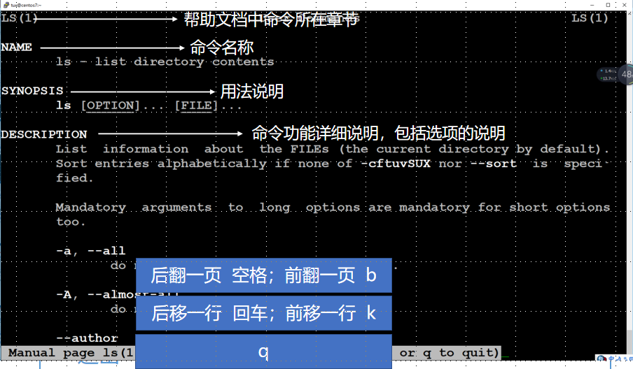
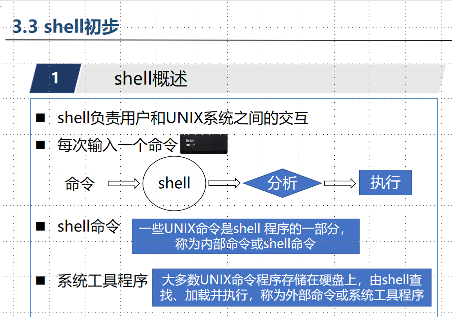
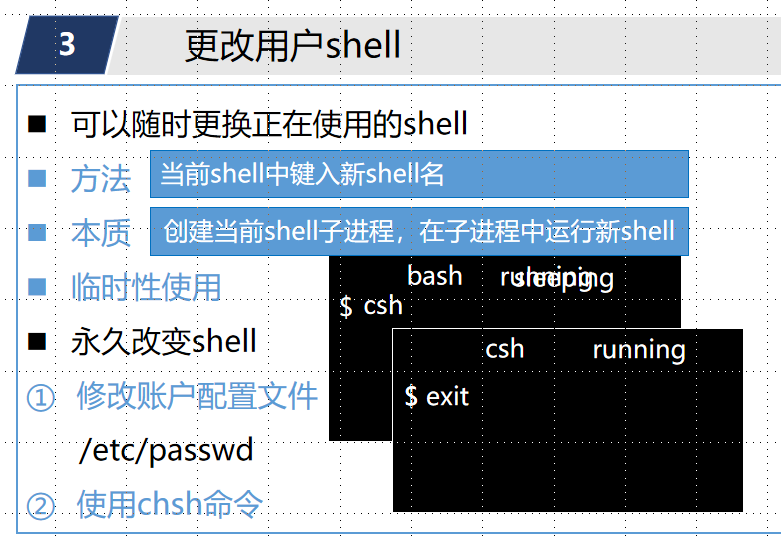

# 命令行基础与 shell

整理自 `LinuxPPT整理.docx` 第 3 章部分，包括原稿里以截图形式贴进去的课件页（man 级别表、man 页面说明、快捷键、shell 初步、软件安装）。典型题取自 `Linux整理（客观题）.docx`。

## 本章要点

- 命令、选项、参数之间必须有空格。多个短选项可以写成 `ls -a -l`，也可以合写成 `ls -al`。
- 虚拟终端叫 tty，设备文件是 `/dev/tty#`。远程登录或在图形界面里开终端窗口，得到的是伪终端 pts。
- 内部命令是 shell 自带的，查 `help`；外部命令是文件系统里的程序，查 `man`、`info`。
- man 手册分 9 个级别。
- shell 有 sh、ksh、csh、bash 等，Linux 默认 bash。临时换 shell 直接输入 shell 名，永久换要改 `/etc/passwd` 或用 `chsh`。
- 装软件：Red Hat 系和 openEuler 用 yum/dnf，Ubuntu、Debian 用 apt。

## 1. 命令格式

命令、选项、参数之间必须用空格隔开。多个选项有两种写法：

```bash
ls -a -l        # 写法 1：每个选项各带一个 -，选项之间用空格分隔
ls -al          # 写法 2：只写一个 -，后面把选项字母叠在一起
ls -a -l /boot  # -a -l 是选项，/boot 是参数
```

- 选项调整命令的执行行为，参数指明命令作用的对象（单选 11、12、14）。
- `ls -a-l` 是错误写法（单选 13）。
- 命令中可以使用多个选项（判断 134）；回车键表示命令行结束（判断 133）。
- 提示符是 `$` 表示普通用户，是 `#` 表示 root（单选 9）。

## 2. 终端

### 虚拟终端 tty

1. 附加在物理终端之上，用软件方式虚拟实现。
2. 类 Unix 系统启动后默认为用户创建几个虚拟终端。
3. 可以实现多个用户同时登录，或者一个用户在多个终端登录。
4. 虚拟终端称为 tty，对应的设备文件是 `/dev/tty#`（# 为非负整数）。

CentOS 7 默认启用 6 个虚拟终端，tty1 是图形终端，tty2 到 tty6 是字符终端。它们之间可以切换：

```bash
# 方式 1：按 Ctrl+Alt+F1 到 Ctrl+Alt+F6
# 方式 2：用 chvt 切换，n 取 1 到 6。课件里是在 # 提示符下执行的，也就是 root 身份
chvt 2
# 查看自己当前所在的终端
tty
```

### 不同登录方式看到的终端

| 登录方式 | 用 `who` 看到的终端 | 对应题目 |
| --- | --- | --- |
| 切换到虚拟终端 2 登录 | `tty2` | 单选 20 |
| 用远程登录软件（如 ssh）登录 | 伪终端 `pts/N` | 单选 18 |
| 在图形界面里打开终端模拟器窗口 | 伪终端 `pts/N` | 单选 19 |

实验一里通过远程方式登录云实验平台，`tty` 输出的就是 `/dev/pts/4`。pts 是 pseudo terminal slave（伪终端从设备）的缩写。

## 3. 内部命令与外部命令

| | 内部命令 | 外部命令 |
| --- | --- | --- |
| 别名 | shell 命令 | 系统工具程序 |
| 存放 | shell 代码的一部分，shell 启动后驻留内存 | 保存在文件系统中的程序，由 shell 查找、加载并执行 |
| 速度 | 执行快 | 被调用时才载入内存执行 |
| 查帮助 | `help 命令名` | `man 命令名`、`info 命令名` |
| 例子 | `exit`、`cd`、`echo` | `ls`、`cal` |

课件的口诀是 **内部命令不决问 help，外部命令不决问 man、info**。`help` 查不了外部命令，实验一里执行 `help ls` 就会报"没有与 ls 匹配的帮助主题"。

分不清一个命令是内部还是外部时，可以用 `type`：

```bash
type cd    # 输出 cd is a shell builtin，说明是内部命令
type ls    # 输出 ls 的路径（或别名），说明是外部命令
```

## 4. man、info 与 help

### man 手册的级别

man 手册分章编写。下表照录课件：

| 级别 | 内容 |
| --- | --- |
| 1 | 用户命令：普通用户可以使用的系统命令 |
| 2 | 内核可以调用的函数和工具的帮助（更正：通常称为"系统调用"，即内核提供给程序调用的函数） |
| 3 | C 语言函数的帮助 |
| 4 | 设备和特殊文件的帮助 |
| 5 | 文件的说明，查询命令的文件说明 |
| 6 | 游戏的帮助 |
| 7 | 杂项的帮助 |
| 8 | 管理命令：只有管理员 root 可以使用的命令说明 |
| 9 | 内核的帮助 |

同名条目在多个级别里都有时，可以指定级别查看，例如 `/etc/passwd` 文件的格式在第 5 级：

```bash
man ls          # 不指定级别时显示最先找到的条目，这里页眉显示 LS(1)
man 5 passwd    # 指定查第 5 级里的 passwd，即 /etc/passwd 的文件格式说明
```

### man 页面的结构

| 部分 | 含义 |
| --- | --- |
| 左上角 `LS(1)` | 命令名称和它所在的章节（级别） |
| NAME | 命令名称和一句话说明 |
| SYNOPSIS | 用法说明，方括号里的是可选项，如 `ls [OPTION]... [FILE]...` |
| DESCRIPTION | 命令功能的详细说明，包括各选项的说明 |

### man 页面里的按键



上图是课件在 CentOS 7 上执行 `man ls` 的截图，页面结构和按键都能在里面对上，按键汇总如下：

| 按键 | 作用 |
| --- | --- |
| 空格 | 后翻一页 |
| `b` | 前翻一页 |
| 回车 | 后移一行 |
| `k` | 前移一行 |
| `q` | 退出 |

### info

`info` 提供 info 格式的帮助，用法是 `info 命令名`。作业三里 `info date` 和 `man date` 都查过。

## 5. 命令行快捷键

| 按键 | 作用 |
| --- | --- |
| Ctrl+H | 删除单个字符 |
| Ctrl+U | 删除一行（bash 里是删除光标之前的内容，光标在行尾时就是整行） |
| Ctrl+A | 跳到命令开头 |
| Ctrl+E | 跳到命令结尾 |
| Ctrl+C | 中断程序运行 |
| Ctrl+Z | 挂起程序 |
| Tab | 命令补齐 |
| Ctrl+L | 清屏 |

**Ctrl+C 终止，Ctrl+Z 只是挂起**。单选 23 问终止正在执行的程序用哪个组合键，答案是 Ctrl+C，原稿把这题题号标成了红色。

## 6. shell

### shell 的作用

shell 负责用户和 UNIX 系统之间的交互。每输入一个命令并按回车，shell 先分析命令，再执行。



- 一些 UNIX 命令是 shell 程序的一部分，称为内部命令或 shell 命令。
- 大多数 UNIX 命令程序存储在硬盘上，由 shell 查找、加载并执行，称为外部命令或系统工具程序。

几道相关题：用户登录后显示命令行的是 shell（单选 10）；检测命令并启动相应程序的组件是 shell（单选 7）；shell 是命令解释器，但不在内核里（判断 130，原稿标红）。

### shell 的种类

shell 有很多种，都在 `/bin` 目录中（单选 24）。

| shell | 说明 |
| --- | --- |
| sh | Bourne Shell，大多数 UNIX 操作系统的标准 shell 和默认 shell |
| ksh | Korn Shell，Bourne Shell 的超集，sh 程序不用修改就能在 ksh 上运行 |
| csh | C Shell，由加州大学伯克利分校开发，采用 C 语言风格的语法 |
| bash | Bourne Again Shell，Linux 的标准 shell 和默认 shell，基于 sh |

课件在 CentOS 7 上演示了系统里有哪些 shell：

```bash
ls /bin/*sh       # 列出 /bin 下所有以 sh 结尾的文件
ls -l /bin/sh     # 结果是链接文件：/bin/sh -> bash
ls -l /bin/csh    # 结果是链接文件：/bin/csh -> tcsh
ls -l /bin/bash   # 普通可执行文件
```

在 `ls -l` 的输出里，第一个字符是 `l` 表示链接文件，箭头后面是它指向的文件。

### 更改用户的 shell

临时使用：在当前 shell 中直接键入新 shell 的名字。本质是创建当前 shell 的子进程，在子进程中运行新 shell。这时原来的 bash 处于休眠状态，在新 shell 里执行 `exit` 就回到原来的 bash。

```bash
csh     # 启动 csh，bash 在后面休眠
exit    # 退出 csh，回到 bash
```



图中 bash 那一格的状态字样 running 和 sleeping 叠在了一起，这是课件动画的两帧：键入 `csh` 之前 bash 是 running，键入之后变成 sleeping，下面那格的 csh 才是正在运行的进程。

永久改变有两种方法：

1. 修改账户配置文件 `/etc/passwd`。每个用户占一行，字段用冒号分隔，最后一个（第 7 个）字段就是该用户的默认 shell。实验四的 `user_exist` 脚本就是用 `cut -d: -f7` 取这个字段。
2. 使用 `chsh` 命令，例如 `chsh -s /bin/csh`，下次登录生效。

## 7. 软件安装

安装软件有两种方法：

1. 下载软件源代码后编译安装。
2. 基于网络存储库安装、更新软件。软件包存储在网络软件库中，联网安装。

基于网络存储库的安装工具有两种：

| 工具 | 用在哪些系统 |
| --- | --- |
| yum（后继为 dnf） | Red Hat、Fedora、CentOS、openEuler |
| apt | Ubuntu、Debian |

用 dnf（或 yum）管理软件包：

```bash
dnf install -y wget      # 安装软件包；-y 表示对所有确认提示自动回答 yes
dnf update -y wget       # 更新软件包
yum remove -y wget       # 卸载软件包，用 dnf remove 也可以
dnf groupinstall -y "Development Tools"   # 安装软件包组，组名有空格，要加引号
```

- 软件包集合（软件包组）是服务于一个共同目的的一组软件包，例如系统工具集。dnf 可以对整个包组进行安装、删除等操作。
- 安装、卸载软件要 root 权限。普通用户在命令前加 `sudo`。
- 原稿组名用的是中文弯引号"Development Tools"，shell 不认弯引号，这里已改成英文直引号。
- 单选 25 到 27 考的就是这三个子命令：`install`、`remove`、`groupinstall`。

## 易混对比

| 易混点 | 怎么区分 |
| --- | --- |
| 选项与参数 | 选项调整行为（`-a`），参数是作用对象（`/boot`） |
| `$` 与 `#` 提示符 | 普通用户与 root |
| tty 与 pts | 本机虚拟终端与伪终端（远程登录、图形界面终端窗口） |
| 内部命令与外部命令 | 查 `help`；查 `man`、`info` |
| Ctrl+C 与 Ctrl+Z | 中断程序与挂起程序 |
| 临时与永久换 shell | 输入 shell 名（开子进程）；改 `/etc/passwd` 或用 `chsh` |
| yum/dnf 与 apt | Red Hat 系（含 openEuler）与 Debian 系（含 Ubuntu） |

## 典型题

完整题目和选项见 `10 客观题精编.md`。

- 单选 13：`ls -a`、`ls -a -l`、`ls -al`、`ls -a-l` 中错误的是 `ls -a-l`。
- 单选 18、19：远程登录和图形界面终端窗口，who 看到的都是伪终端 pts。
- 单选 20：在虚拟终端 2 登录，别人用 who 看到的是 tty2。
- 单选 22：内部命令又称 shell 命令。
- 判断 135：help 命令无法提供外部命令的帮助信息。对。
- 判断 136：外部命令又称系统工具程序，保存在文件系统中，使用时才载入内存执行。对。
- 判断 137：在命令行中输入新的 shell 名并执行，可以临时改变 shell。对。
