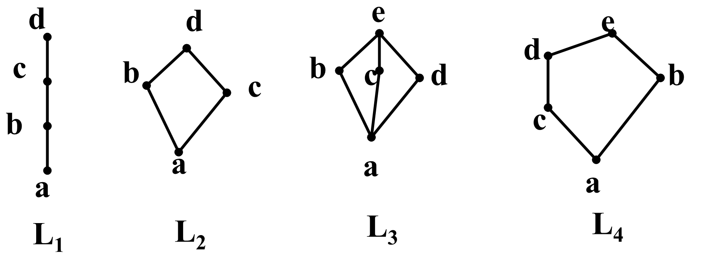

# 07 易错点与自测题汇编

这一篇把前六册的定义、定理、反例和自测题集中到一起，对应六份重制版 PPT 的小结页，适合考前一两天过一遍。每条后面标了它出自哪一册，想展开看就回去翻。

## 一、结构速查

### 一个运算的结构（第六章 6.1 到 6.4）

| 结构 | 在上一级基础上加什么 | 典型例子 |
|---|---|---|
| 代数系统 $(S,f_1,\dots,f_m)$ | 非空集合 + 封闭运算 | $(\mathbb Z,+,\cdot)$， $(\rho(S),\cap,\cup)$ |
| 半群 | 结合律 | $(\mathbb Z,+)$， $(\rho(S),\cap)$ |
| 独异点 | 单位元 | $(\mathbb Z,\cdot)$，单位元是 1 |
| 群 | 每个元素有逆元 | $(\mathbb Z,+)$，模 $m$ 加法群， $S_n$ |
| Abel 群 | 交换律 | $(\mathbb Z,+)$，模 $m$ 加法群 |

### 两个运算的结构（第六章 6.5）

$$\text{环}\xrightarrow{+\,\text{交换}+\text{有 }1+\text{无零因子}}\text{整区}\qquad \text{环}\xrightarrow{+\,\text{非零元作成乘法群}}\text{体}\qquad \text{域}=\text{交换体}=\text{整区}\cap\text{体}$$

### 格的阶梯（第七章）

$$\text{格}\xrightarrow{+\,0,1}\text{有界格}\xrightarrow{+\,\text{每个元素有余元素}}\text{有余格}\xrightarrow{+\,\text{分配律}}\text{布尔代数}$$

判断分配格要在哈斯图里找的两种子格，就是下图的 L3（钻石格 $M_3$）和 L4（五角格 $N_5$）；L1、L2 是分配格，放在旁边对照：

## 二、必须背下来的判定条件

| 要判定什么 | 条件 | 出处 |
|---|---|---|
| 二元代数运算 | 两个输入、结果唯一、结果封闭 | 01 |
| 代数系统 | 集合非空 + 每个运算封闭 | 01 |
| 半群 | 非空 + 封闭 + 结合 | 02 |
| 群（定义） | 非空 + 封闭 + 结合 + 有壹 + 有逆 | 02 |
| 群（减弱） | 半群 + 左壹 + 左逆 | 02，定理 6.2.2 |
| 群（可除） | 半群 + 对任意 $a,b$， $xa=b$ 与 $ay=b$ 都有解 | 02，定理 6.2.3 |
| 群（有限） | 有限半群 + 消去律 | 02，习题 6.2-2 |
| 子群（首选） | 非空 + $ab^{-1}\in H$（加法群写 $a-b\in H$） | 03，定理 6.3.2 |
| 子群（有限） | 有限非空 + 封闭 | 03，定理 6.3.3 |
| 正规子群 | 对任意 $g$， $gHg^{-1}\subseteq H$（等价于 $gH=Hg$） | 03 |
| 同态 | $\sigma(a*b)=\sigma(a)\cdot\sigma(b)$ | 04 |
| 同构 | 是映射 + 单射 + 满射 + 保运算 | 04 |
| 环 | $(R,+)$ 交换群 + $(R,\cdot)$ 半群 + 左右分配律 | 05 |
| 子环 | 非空 + 对减法封闭 + 对乘法封闭 | 05，定理 6.5.1 |
| 消去环 | 无零因子，等价于非零元消去律成立 | 05，性质 12 |
| 整区 | 交换 + 有 1 + 无零因子 | 05 |
| 体 | 非零元作成乘法群 | 05 |
| 域 | 交换体 | 05 |
| 格（偏序） | 任意两元素都有 $\sup$ 与 $\inf$ | 06，定义 7.2.1 |
| 格（代数） | 交换 + 结合 + 吸收 | 06，定义 7.2.2 |
| 代数子格 | $S$ 对大格的 $\times$、 $\oplus$ 封闭 | 06 |
| 分配格 | 不含 $M_3$、 $N_5$ 子格 | 06 |
| 布尔代数 | 有界 + 有余 + 分配 | 06 |
| 子代数 | 含原来的 0 和 1 + 对 $\cdot$、 $+$、 $\bar{\ }$ 封闭 | 06，定理 7.5.2 |

## 三、核心定理清单

| 定理 | 内容 |
|---|---|
| 6.2.1 | 群的单位元唯一，每个元素的逆元唯一 |
| 6.2.4 | 广义结合律；前两条指数律总成立， $(ab)^n=a^nb^n$ 要交换律 |
| 6.2.6 | $S_n$ 对置换乘法作成群（ $n$ 次对称群）， $\lvert S_n\rvert=n!$ |
| 6.2.7 | 任意置换恰有一法写成不相杂轮换之积 |
| 6.3.1 / 6.3.2 / 6.3.3 | 三个子群判别条件 |
| 6.3.4 | $(a)=\{a^n\}$ 是子群 |
| 6.3.5 | $a$ 的周期为 $n$ 时： $a^m=1\iff n\mid m$； $a^s=a^t\iff n\mid(s-t)$ |
| 6.3.6 | $n$ 元循环群中 $a^k$ 是生成元 $\iff(n,k)=1$，共 $\varphi(n)$ 个 |
| 6.3.7 | $\lvert aH\rvert=\lvert H\rvert$ |
| 拉格朗日定理 | $\lvert G\rvert=\lvert H\rvert\cdot(G:H)$ |
| 6.3.8 | 有限群中 $a^{\lvert G\rvert}=1$；元素周期整除 $\lvert G\rvert$ |
| 6.4.1 | 群的同态像还是群， $1'=\sigma(1)$， $(\sigma(a))^{-1}=\sigma(a^{-1})$ |
| 6.4.2 | 第一同态定理：核 $N$ 是正规子群， $\sigma^{-1}(a')=Na$ |
| 6.4.3 | 第二同态定理： $N$ 正规时陪集作成商群 $G/N$ |
| 6.4.4 | 第三同态定理： $G'\cong G/N$ |
| 6.4.5 | 包含 $N$ 的子群与 $G'$ 的子群一一对应，保包含、保正规 |
| 6.5 性质 12 | 消去环 $\iff$ 非零元消去律成立 |
| 6.5 性质 13、14 | 消去环中非零元的加法周期都相同，且为 0 或质数 |
| 6.5 结论 A、B | 无零因子的有限环（多于一个元素）是体；有限整区是域 |
| $Z_p$ 定理 | $Z_p$ 是域 $\iff p$ 是质数 |
| 7.2.1 | 偏序格与代数格等价 |
| 7.3.1 | $a\le b\iff a\times b=a\iff a\oplus b=b$ |
| 7.3.3 / 7.3.4 | 分配不等式、模不等式 |
| 7.4.2 | 分配格的消去律；推论是有余分配格中余元素唯一 |
| 7.4.1 | 分配格中的德摩根律 |
| 7.5.1 | 亨廷顿公理 H1 到 H4 |

## 四、反例速查

考试里"判断对错"和"下列说法错误的是"几乎都靠这张表。

| 想否定的说法 | 反例 |
|---|---|
| 二元运算一定交换 | $S=\{a,b\}$， $a*b=b$ 而 $b*a=a$ |
| 减法在 $\mathbb N$ 上封闭 | $1-2=-1\notin\mathbb N$ |
| 存在幂等元就满足幂等律 | 整数乘法有幂等元 0、1，却不满足幂等律 |
| 整数乘法满足消去律 | $0\cdot1=0\cdot2$ 而 $1\ne2$ |
| 加法对乘法满足分配律 | $1+(2\times3)=7\ne(1+2)\times(1+3)=12$ |
| $(\mathbb Z,-)$ 是半群 | $(1-2)-3=-4\ne1-(2-3)=2$ |
| $(\mathbb Z,\cdot)$ 是群 | 2 没有整数乘法逆元 |
| 群一定交换 | $S_3$， $n\ge3$ 时 $S_n$ 不交换；最小的非交换群是 6 元的 $S_3$ |
| $(ab)^{-1}=a^{-1}b^{-1}$ | 一般应为 $b^{-1}a^{-1}$； $S_3$ 中可验证 |
| $(ab)^n=a^nb^n$ | $S_3$ 中 $a=(1\ 2)$、 $b=(1\ 3)$， $(ab)^2=(1\ 2\ 3)$ 而 $a^2b^2=I$ |
| 左壹 + 右逆就是群 | $\left\{\begin{pmatrix}a&b\\0&0\end{pmatrix}\mid a\ne0\right\}$ 配矩阵乘法，没有单位元（02 习题 6.2-3） |
| 消去律就够（无限半群） | $(\mathbb Z^+,\cdot)$ 满足消去律却不是群 |
| 封闭就是子群 | $(\mathbb N,+)$ 对加法封闭，却不是 $(\mathbb Z,+)$ 的子群 |
| 子群可以换运算 | $(\mathbb C^*,\cdot)$ 不是 $(\mathbb C,+)$ 的子群 |
| 拉格朗日定理可以反用 | $6\mid12$，但 $A_4$ 没有 6 元子群 |
| $a^m=1$ 说明周期是 $m$ | 只能推出周期整除 $m$ |
| $gH=Hg$ 说明 $g$ 与每个 $h$ 交换 | $S_3$ 中 $H=\{I,(1\ 2\ 3),(1\ 3\ 2)\}$， $(1\ 2)H=H(1\ 2)$ 但 $(1\ 2)(1\ 2\ 3)\ne(1\ 2\ 3)(1\ 2)$ |
| 两个子群之积一定是子群 | $S_3$ 中 $\{I,(1\ 2)\}\{I,(1\ 3)\}$ 有 4 个元素， $4\nmid6$ |
| $\sigma^{-1}(\sigma(H))=H$ | 一般等于 $HN$。模 12 到模 4， $H=\{0,6\}$ 拉回来变成 6 个元素 |
| $a\mapsto a^{-1}$ 总是自同构 | 只在 Abel 群中成立 |
| $(\mathbb R^*,\cdot)\cong(\mathbb R,+)$ | 不同构。 $\mathbb R^*$ 中有 $x\cdot x=1$ 且 $x\ne1$ 的元素， $\mathbb R$ 中没有 |
| 环的乘法要交换、要有 1 | 矩阵环不交换，偶数环没有 1 |
| 子环的单位元遗传自大环 | $Z_6$ 的单位元是 $[1]$，子环 $\{[0],[2],[4]\}$ 的单位元是 $[4]$ |
| $ab=0$ 推出 $a=0$ 或 $b=0$ | $Z_{12}$ 中 $[3][4]=[0]$ |
| 整区一定是体 | $\mathbb Z$ 是整区，2 没有乘法逆元 |
| 体一定是域 | 四元数体不交换 |
| 消去环中非零元都可逆 | 整数环、偶数环都是消去环 |
| 无零因子的环一定是体 | 要加"有限"。 $\mathbb Z$ 无零因子却不是体 |
| 偏序集就是格 | 两个极大元没有公共上界时 $\sup$ 不存在 |
| 偏序子格就是代数子格 | 立方体格中 $S_2=\{a_1,a_2,a_4,a_8\}$ |
| 保序映射就是同态 | 把两个不可比元素压到同一点， $\oplus$ 就被破坏 |
| 有界格一定有限 | $(\rho(\mathbb N),\subseteq)$ |
| 有余格中余元素唯一 | 五角格中 $c$ 有两个余元素 |
| 链一定是有余格 | 多于 2 个元素的链，中间元素没有余元素 |
| 任何元素个数都能做有限布尔代数 | 必须是 $2^n$，所以没有 5 元布尔代数 |
| 子代数只要自己是布尔代数 | $\{\varnothing,\{a\}\}$ 缺了 $\rho(\{a,b,c\})$ 的最大元 |

## 五、易错点合订

**6.1（笔记 01）**：二元运算只要求封闭；交换律改顺序、结合律改括号；分配律有方向；存在幂等元不等于满足幂等律；整数乘法不能随手消去；判断封闭要验全部元素对。

**6.2（笔记 02）**：群不要求交换；单位元不一定是数字 1；单位元是对所有元素适用的同一个元素； $(ab)^{-1}=b^{-1}a^{-1}$；解方程保持左右顺序；左右条件不能混搭；消去律要配"有限"；置换乘法从右往左。

**6.3（笔记 03）**：子群必须沿用大群运算；判别条件三只对有限子集成立；本课程把 $aH$ 叫右陪集； $gH=Hg$ 是集合相等；拉格朗日定理只能单向用； $a^m=1$ 只推出周期整除 $m$；空集不是子群。

**6.4（笔记 04）**：同态不要求单射满射； $\sigma(1)$ 是 $\sigma(G)$ 的单位元；同构只要求到 $\sigma(G)$ 上一一对应； $\sigma^{-1}(H')$ 是原像集合； $a\mapsto a^{-1}$ 只在 Abel 群中是自同构。

**6.5（笔记 05）**：环的乘法只要求结合律；非交换环别套中学公式；子环单位元不遗传；零因子的存在破坏约分；整区未必是体，体未必是域；"有限"不能丢。

**第 7 章（笔记 06）**：偏序集不等于格；偏序子格不等于代数子格；保序不等于同态；有界不等于有限；有余不等于余元唯一；子代数必须含原来的 0 和 1。

## 六、自测题合集

先把题目做完，再翻到后面对答案。

### 6.1

1. 为什么自然数减法不是 $\mathbb N$ 上的二元运算？
2. 三元素集合上一共有多少个二元运算？
3. 矩阵乘法满足结合律吗？交换律呢？
4. 为什么整数乘法不满足消去律？
5. $(\mathbb N,-)$ 是代数系统吗？

### 6.2

6. $(\mathbb Z,\cdot)$ 为什么不是群？
7. $\{1,3,4,5,9\}$ 对模 11 乘法是群吗？是 Abel 群吗？
8. $(ab)^{-1}$ 等于什么？
9. $\sigma=(1\ 2\ 3)$， $\tau=(1\ 2)$，求 $\sigma\tau$ 与 $\tau\sigma$。
10. $(1\ 3\ 5\ 2)(6\ 8)$ 在 $S_8$ 中是奇置换还是偶置换？

### 6.3

11. 模 6 加法群中， $\{0,3\}$ 是子群吗？
12. 8 元循环群 $(a)$ 有几个生成元？
13. 15 元群中元素的周期可能是多少？
14. $S_3$ 中 $H=\{I,(1\ 2)\}$ 有几个右陪集？正规吗？
15. 为什么 7 元群一定是循环群？

### 6.4

16. $(\mathbb R^*,\cdot)$ 与 $(\mathbb R,+)$ 为什么不同构？
17. 模 12 加法群到模 4 加法群， $x\mapsto x\bmod4$ 的核是什么？
18. $H$ 的右陪集中有几个是子群？
19. $H$ 是子群、 $N$ 是正规子群， $HN$ 是 $G$ 的子群吗？
20. $H_1$、 $H_2$ 都是子群， $H_1H_2$ 一定是子群吗？

### 6.5

21. $Z_6$ 中的零因子有哪些？
22. 整数环是整区吗？是体吗？
23. 四元数体为什么不是域？
24. 消去环中非零元的加法周期可能是 6 吗？
25. $Z_7$ 是域吗？ $Z_8$ 呢？

### 第 7 章

26. 为什么任意链都是格？
27. 代数格要满足哪三条运算律？
28. 在 $(S_{12},D)$ 中， $4\times6$ 与 $4\oplus6$ 各是多少？
29. 判断分配格要找哪两种子格？
30. 布尔代数的定义是什么？余元素为什么唯一？

### 答案

1. 不封闭， $1-2=-1\notin\mathbb N$。
2. $3^9=19683$。
3. 满足结合律；一般不满足交换律。
4. $0\cdot1=0\cdot2$ 而 $1\ne2$。
5. 不是，减法在 $\mathbb N$ 上不封闭。
6. 有单位元 1，但 2 没有整数乘法逆元。
7. 是群，也是 Abel 群。有限非空，验证乘法封闭即可；单位元 1， $3^{-1}=4$， $5^{-1}=9$。
8. $b^{-1}a^{-1}$。
9. $\sigma\tau=(1\ 3)$， $\tau\sigma=(2\ 3)$。
10. 偶置换（ $3+1=4$ 个对换；按 $n-k$ 算是 $8-4=4$）。
11. 是。有限非空且封闭（ $3\oplus_63=0$）。
12. $\varphi(8)=4$ 个： $a,a^3,a^5,a^7$。
13. 1、3、5、15。
14. 3 个；不正规， $(1\ 3)H\ne H(1\ 3)$。
15. 非单位元的周期整除 7 且大于 1，只能是 7。
16. $\mathbb R^*$ 中 $(-1)(-1)=1$ 且 $-1\ne1$； $\mathbb R$ 中 $a+a=0$ 只有 $a=0$。同构保持这种特征。
17. $N=\{0,4,8\}$。
18. 只有 $H$ 本身，其余陪集不含单位元。
19. 是。 $(h_1n_1)(h_2n_2)^{-1}=h_1h_2^{-1}\cdot h_2(n_1n_2^{-1})h_2^{-1}\in HN$。
20. 不一定。 $S_3$ 中 $\{I,(1\ 2)\}\{I,(1\ 3)\}$ 有 4 个元素， $4\nmid6$。
21. $[2]$、 $[3]$、 $[4]$。
22. 是整区；不是体。
23. 乘法不交换， $ij=k$ 而 $ji=-k$。
24. 不可能，只能是 0 或质数。
25. $Z_7$ 是域； $Z_8$ 不是， $[2][4]=[0]$。
26. 任意两元素可比， $\inf$ 取较小者、 $\sup$ 取较大者。
27. 交换律、结合律、吸收律。
28. $4\times6=\gcd(4,6)=2$， $4\oplus6=\operatorname{lcm}(4,6)=12$。
29. 钻石格 $M_3$ 与五角格 $N_5$。
30. 布尔代数是有余分配格。有余保证余元素存在，分配格的消去律（定理 7.4.2）保证唯一。

## 七、选择题与判断题

**选择题 1**： $p$ 元群 $G$（ $p$ 为质数）， $H$ 是 $G$ 的子群，下列说法**错误**的是（　）。
A. $H$ 一定是正规子群　B. $G$ 一定存在周期小于 $p$ 的元素　C. $H$ 一定是平凡子群　D. 若 $a\in H$，则 $a$ 在 $H$ 中的周期一定等于 $p$

**选择题 2**：设 $G$ 是 5 元群，则 $G$ 中有（　）个非平凡子群。A. 0　B. 1　C. 2　D. 5

**选择题 3**：设 $G$ 不是交换群， $G$ 的元素数可能是（　）。A. 1　B. 2　C. 3　D. 6

**选择题 4**： $S_4$ 中 $H=A_4$，下列说法正确的是（　）。
A. $(1\ 2\ 3\ 4)$ 与 $(2\ 4\ 3)$ 合同（左模 $H$）　B. $\sigma=(1\ 2\ 3)(4\ 1\ 3\ 2)$，则 $\sigma\in H$　C. $(4\ 2\ 3)$ 与 $(2\ 4)(1\ 3)$ 合同（右模 $H$）　D. 对任意 $\sigma\in S_4$ 都有 $\sigma H\ne H\sigma$

**选择题 5**： $H$、 $K$ 是 $G$ 的子群， $\lvert H\rvert=r$， $\lvert K\rvert=s$， $r$ 与 $s$ 互质，则 $\lvert H\cap K\rvert=$（　）。A. 1　B. $r$　C. $s$　D. $rs$

**选择题 6**： $A$ 为集合， $(\rho(A),\subseteq)$ 为有余格，其中每个元素的余元素（　）。A. 存在且唯一　B. 不存在　C. 存在但不唯一　D. 可能存在

**判断题**：

1. 消去环中，任意非零元素都存在乘法逆元素。
2. 若环 $R$ 中非零元素都存在乘法逆元素，则 $R$ 是消去环。
3. 体恒无零因子。

### 答案与依据

1. **D**。子群只能是 $\{1\}$ 或 $G$，都平凡且正规；单位元的周期是 $1<p$； $a=1$ 时周期为 1，所以 D 错。
2. **A**。5 是质数，子群元数只能是 1 或 5。
3. **D**。 $n<6$ 的群都可交换， $S_3$ 是 6 元非交换群。
4. **C**。左模判定 $ab^{-1}\in H$，右模判定 $b^{-1}a\in H$。A 中 $ab^{-1}=(1\ 2\ 4\ 3)$ 是奇置换；B 中 $\sigma=(2\ 4)$ 是奇置换；C 中 $b^{-1}a=(1\ 3\ 2)$ 是偶置换；D 中 $A_4$ 指数为 2，必正规。
5. **A**。 $\lvert H\cap K\rvert$ 同时整除 $r$ 与 $s$，两者互质，只能是 1。
6. **A**。 $X$ 的余元素 $A-X$ 存在； $(\rho(A),\subseteq)$ 是分配格，所以唯一。

判断题：

1. **错**。整数环是消去环，但 2 没有乘法逆元；偶数环连单位元都没有。
2. **对**。 $ab=0$ 且 $a\ne0$ 时左乘 $a^{-1}$ 得 $b=a^{-1}(ab)=a^{-1}0=0$。
3. **对**。体的非零元作成乘法群，对乘法封闭，两个非零元之积仍非零。

## 八、考前三条实操建议

1. 把"判群五项"和"三个子群判别条件"默写一遍，这两组是所有证明题的入口。
2. 置换计算练到不犹豫：从右往左、拆不相杂轮换、数 $n-k$ 判奇偶。 $S_3$、 $S_4$ 的元素最好能直接报出来。
3. 判断题和选择题先在上面第四节的反例表里找对应的那一行，比现推快得多。
