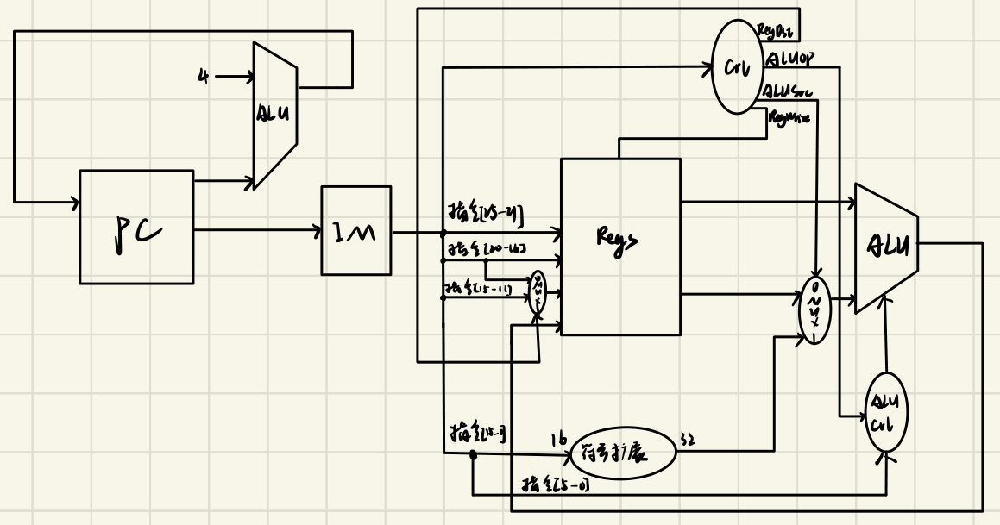
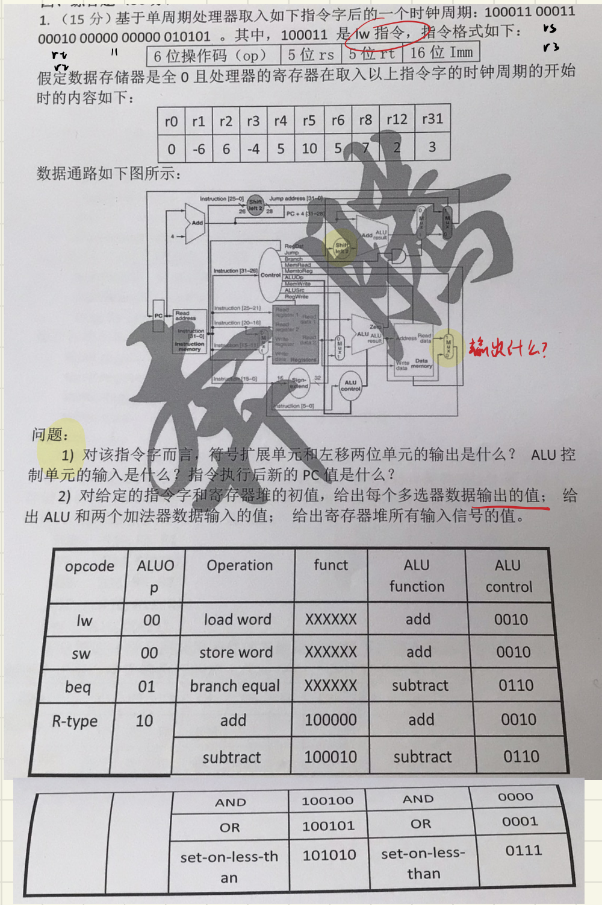

# 07 单周期数据通路

整理自 `题型整理.pdf` 第 14、15 页（△设计数据通路一节）、第 21 页第 4 问和第 34 页（单周期处理器执行一条 `lw` 的那道 15 分大题）。

数据通路和控制信号的讲解在 [第4章 处理器（重制版）](<../重制版PPT/第4章 处理器（重制版）.pptx>)。画图时以教材（Patterson & Hennessy）带 Jump 的单周期数据通路为准，手写稿第 15 页和第 21 页贴的也是这张图。

## 要默下来的东西

一张完整的单周期数据通路图包含这些部件：

- 取指：PC、指令存储器、加法器（PC+4）。
- 译码：寄存器堆（读寄存器 1/2、写寄存器、写数据、读数据 1/2）、写寄存器号的多路选择器（RegDst）、符号扩展单元（16→32）。
- 执行：ALU、ALU 前的多路选择器（ALUSrc）、ALU 控制单元（输入 ALUOp 和 funct 也就是指令 [5-0]）。
- 分支与跳转：左移 2 位单元（符号扩展结果）、分支目标加法器、与门（Branch 与 Zero 相与）、两级 PC 多路选择器（分支、跳转）、指令 [25-0] 的左移 2 位与 PC+4[31-28] 拼接。
- 访存与写回：数据存储器（地址、写数据、读数据）、MemtoReg 多路选择器。

九个控制信号（教材单周期控制单元的输出）：RegDst、Jump、Branch、MemRead、MemtoReg、ALUOp、MemWrite、ALUSrc、RegWrite。

各类指令的取值：

| 指令 | RegDst | ALUSrc | MemtoReg | RegWrite | MemRead | MemWrite | Branch | ALUOp |
| --- | --- | --- | --- | --- | --- | --- | --- | --- |
| R 型 | 1 | 0 | 0 | 1 | 0 | 0 | 0 | 10 |
| `lw` | 0 | 1 | 1 | 1 | 1 | 0 | 0 | 00 |
| `sw` | × | 1 | × | 0 | 0 | 1 | 0 | 00 |
| `beq` | × | 0 | × | 0 | 0 | 0 | 1 | 01 |

ALU 控制的输出：加法 0010，减法 0110，AND 0000，OR 0001，slt 0111。

## 解题步骤

1. 题目只要求实现几条指令时，先看这几条指令各要走哪条路：要不要访存、要不要写寄存器、第二个操作数来自寄存器还是立即数。
2. 按"取指 → 译码 → 执行 → 访存 → 写回"从左到右画，每遇到一个"两种来源"的地方就放一个多路选择器，并给它标控制信号。
3. 写控制信号取值表，不确定的写 ×。
4. 题目若给了具体指令字和寄存器初值，就一路算数：符号扩展的输出、左移 2 位的输出、ALU 的两个输入和结果、各多路选择器的输出、新的 PC 值。

## 例 1：只实现 SW、SUB、ADDIU 的数据通路（p14 第 3 题）

题目：设计一个数据通路，仅实现 `SW $s0, $s1, $s2`、`SUB $t1, $t2, $t3`、`ADDIU $t0, $t1, 2` 三条指令，画出完整数据通路图，写出必要的控制信号（高电平有效），并对设计方法作必要说明。

（题干里 `SW $s0, $s1, $s2` 的写法不符合 MIPS 语法，`sw` 应写成 `sw rt, offset(rs)`，这是原题的问题，照录。）

原稿只画了一张图，图里有 PC、指令存储器、PC+4 加法器、寄存器堆、RegDst 多路选择器、符号扩展、ALUSrc 多路选择器、ALU、ALU 控制、控制单元（输出 RegDst、ALUOp、ALUSrc、RegWrite），ALU 结果直接绕回寄存器堆的写数据端。

这张图有两处不够（补充）：

1. 没有数据存储器和 MemWrite 信号。`SW` 要把寄存器的值写进内存：ALU 算出的地址（基址 + 符号扩展后的偏移）接数据存储器的地址端，读数据 2 接它的写数据端。现在 ALU 结果直接回写寄存器，这张图实现不了 `SW`。
2. 没有控制信号取值表和文字说明，而题目两样都要。按常规设计应是：

| 指令 | RegDst | ALUSrc | RegWrite | MemWrite | ALUOp |
| --- | --- | --- | --- | --- | --- |
| `SUB` | 1 | 0 | 1 | 0 | R 型（10） |
| `ADDIU` | 0 | 1 | 1 | 0 | 加（00） |
| `SW` | × | 1 | 0 | 1 | 加（00） |

这三条指令都不需要 Branch、Jump，`SW` 之外也不需要数据存储器读，所以 MemRead 可以省掉，但要在说明里讲清楚为什么省。

## 例 2：完整数据通路图（p15）

第 15 页整页只有一张手绘的完整单周期数据通路（含跳转），没有文字。

照着它复习时注意三处（补充，都是原图的小毛病）：

1. 控制信号少了 MemRead，数据存储器也没画读使能。教材是 9 个信号。
2. 两个多路选择器的 0/1 端和教材相反：MemtoReg 的多路选择器把"读数据"画在 0 端、ALU 结果画在 1 端（教材是 MemtoReg=1 选存储器数据）；Jump 的多路选择器把跳转地址画在 0 端（教材是 Jump=1 选跳转地址）。按这张图的接法，两个信号的有效电平就反了。
3. 送进 ALU 控制的线应标成指令 [5-0]（funct），原图是从指令 [15-0] 分出来的。

## 例 3：`lw` 执行时 EX 段传递的数据和控制信号（p21 第 4 问）

题目的指令序列第 (1) 条是 `lw $s3, 4($s2)`，问它执行时在 EX 段传递的数据和相应的控制信号。

原稿列的是：数据内容为 PC+4 的结果、 $s2 寄存器内容、偏移量 4、$ s3 寄存器的编码、ALU 的运算结果；控制信号为指令 5-0 位、ALUSrc、Zero 信号、Branch、ALU 控制信号。

（补充：这份答案里的控制信号和 `lw` 对不太上。"指令 5-0 位"是 funct，`lw` 的 ALU 控制只看 ALUOp=00 就知道做加法；"Zero""Branch"属于分支判断，`lw` 时 Branch=0。EX 段真正起作用的是 ALUSrc=1（选符号扩展后的偏移量 4）、ALUOp=00、RegDst=0（写寄存器选 rt，即 $s3）。另外 MemRead=1、MemWrite=0 供 MEM 段用，RegWrite=1、MemtoReg=1 供 WB 段用，它们随流水线寄存器继续往后传。）

数据方面，EX 段拿到的是 $s2 的值和符号扩展后的 4，ALU 把它们相加得到访存地址；同时 PC+4 和目的寄存器号 $s3 也随流水线寄存器往后传。

## 例 4：给定指令字，逐个部件写输出（p34 第 1 题，15 分）

指令字：`100011 00011 00010 0000000000010101`，其中 100011 是 `lw`。数据存储器全 0，寄存器初值为 r0=0、r1=−6、r2=6、r3=−4、r4=5、r5=10、r6=5、r8=7、r12=2、r31=3。

拆字段：op = 100011（`lw`），rs = 00011 = r3，rt = 00010 = r2，立即数 = 0000000000010101 = 21。

1）符号扩展单元和左移两位单元的输出、ALU 控制单元的输入、新的 PC 值。

- 符号扩展输出：`0000 0000 0000 0000 0000 0000 0001 0101` = 21。
- 左移两位输出：`0000 0000 0000 0000 0000 0000 0101 0100` = 84。
- ALU 控制单元的输入：ALUOp = 00，funct = 010101（指令低 6 位，`lw` 时不起作用，ALU 控制输出 0010 做加法）。
- 新的 PC 值：PC + 4（`lw` 不分支不跳转）。

2）各多路选择器的输出、ALU 和两个加法器的输入、寄存器堆的输入信号。

| 部件 | 输出/输入 | 值 |
| --- | --- | --- |
| RegDst 多路选择器 | 写寄存器号 | 00010（rt，即 r2）（更正：原文写 00000，那是 rd 字段；`lw` 的 RegDst = 0，选 rt） |
| ALUSrc 多路选择器 | ALU 第二输入 | 21 |
| MemtoReg 多路选择器 | 写回数据 | 0（补充：原稿空着。访存地址 = r3 + 21 = −4 + 21 = 17，数据存储器全 0，所以读出 0） |
| Branch 多路选择器 | PC 候选 | PC+4 |
| Jump 多路选择器 | 新 PC | PC+4 |
| ALU | 两个输入 | −4（r3）和 21，结果 17 |
| Add（PC+4） | 两个输入 | PC 和 4 |
| Add（分支） | 两个输入 | PC+4 和 84 |

控制信号：RegDst=0，ALUSrc=1，MemtoReg=1，Jump=0，Branch=0，MemRead=1，MemWrite=0，ALUOp=00，RegWrite=1。

（更正：原稿把 RegDst 写成 1，`lw` 应为 0，所以写寄存器号也跟着错成了 00000。另外题目问的是"寄存器堆所有输入信号的值"，原稿列的是全部控制信号；寄存器堆的输入应为：读寄存器 1 = 00011（r3），读寄存器 2 = 00010（r2），写寄存器 = 00010（r2），写数据 = 0，RegWrite = 1。）

复算：符号扩展 21、左移 84、ALU 输入 −4 与 21、地址 17 都正确。

## 常见坑

- `lw` 的 RegDst = 0（写 rt），R 型才是 1（写 rd）。这是最容易反的一处。
- MemtoReg = 1 选存储器读出的数据，ALU 结果是 0 端。
- 题目问"EX 段的控制信号"，只答该段用得到的，别把整套控制信号抄一遍。
- 画图时多路选择器的 0/1 端要标清楚，标反了整套信号都跟着反。
