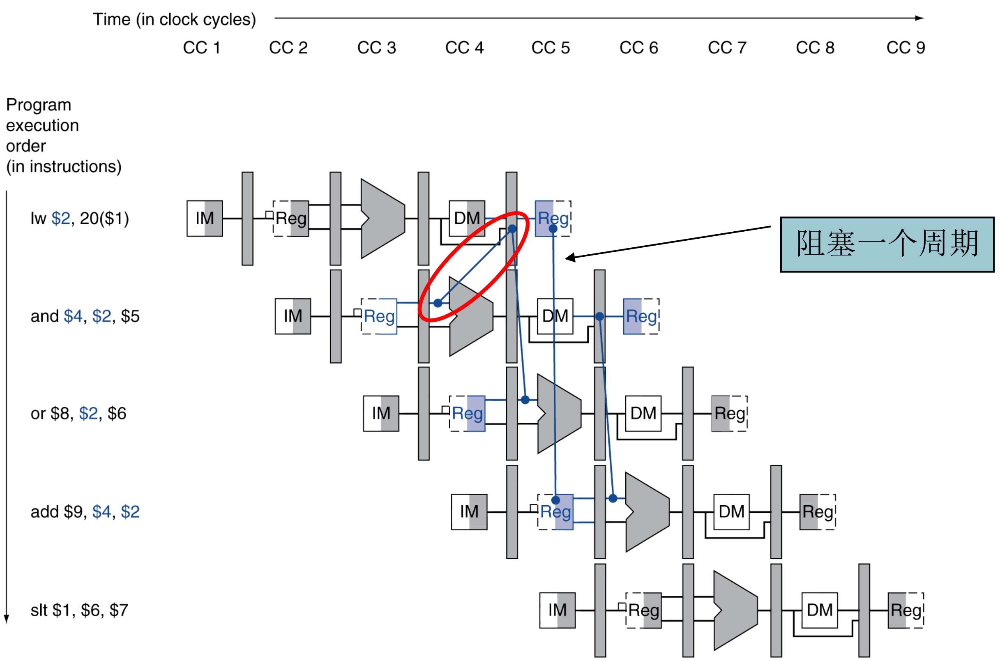
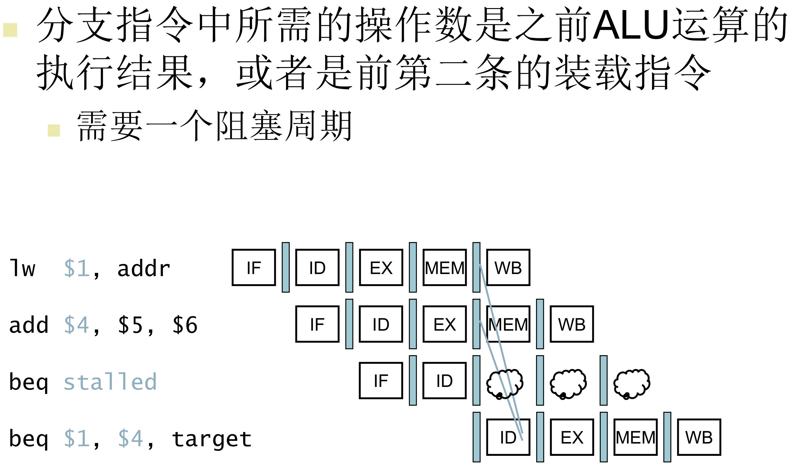
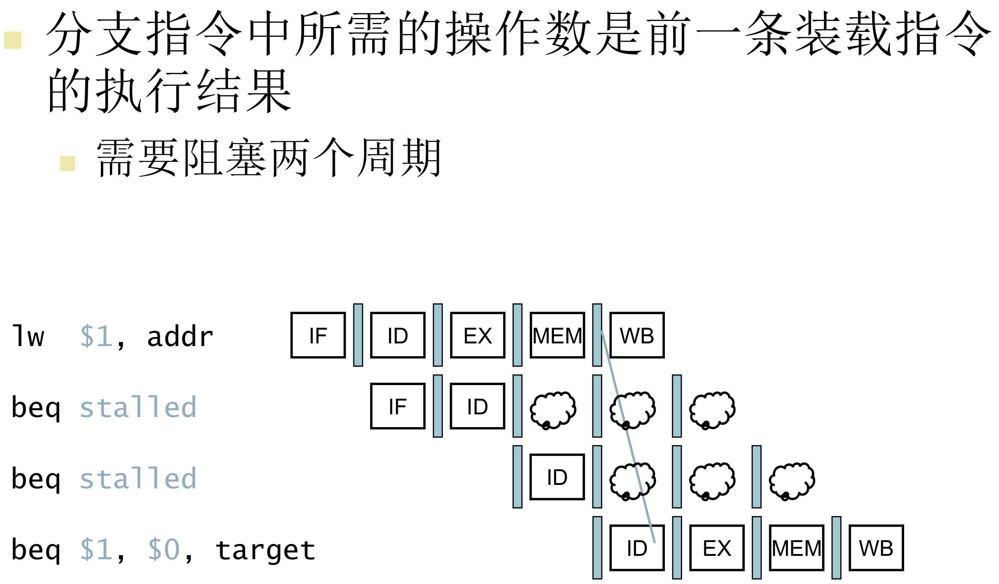
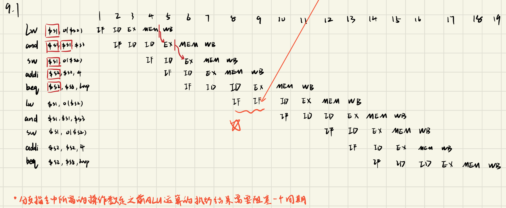
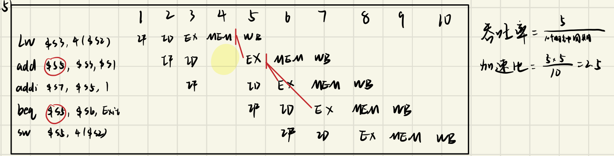
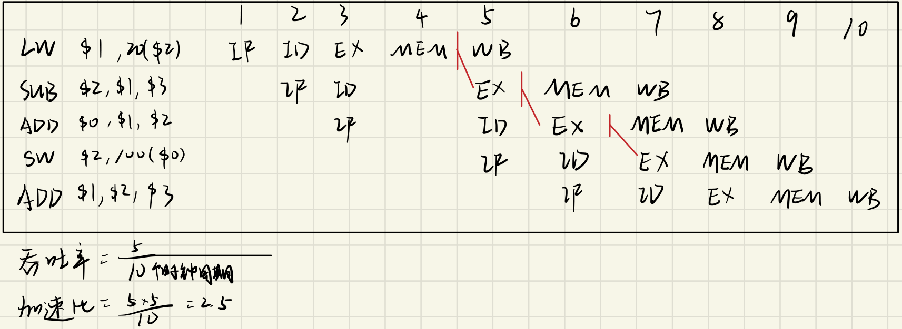
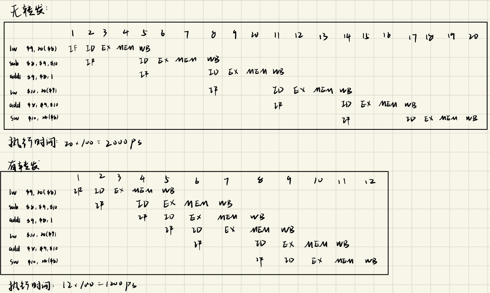
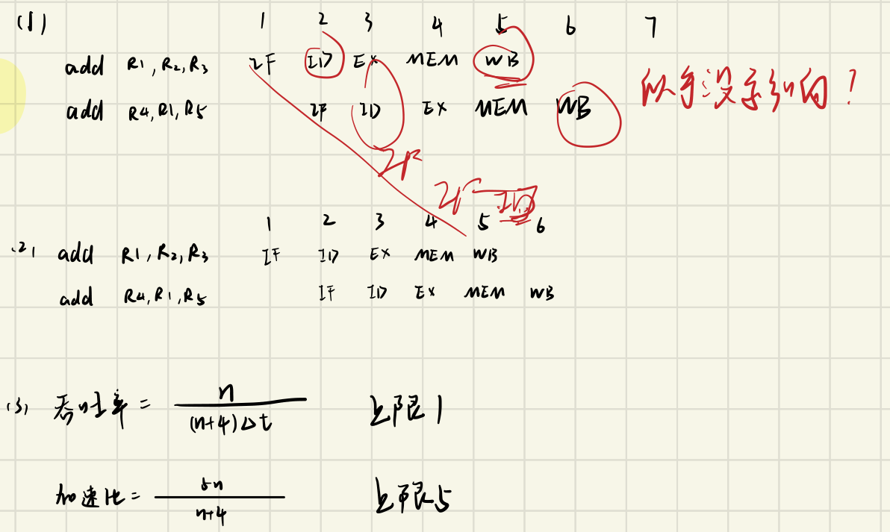

# 08 流水线时空图与性能

整理自 `题型整理.pdf` 第 19–24 页（△流水线一节）和 `PPT/讲题20231113.docx` 的大题 1。讲题 docx 的大题 1 就是下面的例 2。

指令级并行、循环展开、Tomasulo、分支预测那部分课件在 [体系结构 01 指令级并行（重制版）](<../重制版PPT/体系结构 01 指令级并行（重制版）.pptx>)，源材料里没有这类题，想练只能用课件的例题和自测题。

## 解题步骤

### 画时空图

五段流水线 IF、ID、EX、MEM、WB，一条指令占一行，横轴是时钟周期，后一条比前一条右移一格。遇到冒险就在该行插入停顿（下面统一写成 `ID*`，表示 ID 段又占了一拍），后面所有指令跟着往后推。

停顿的判断：

| 情况 | 有转发 | 无转发（写在前半拍，读在后半拍） |
| --- | --- | --- |
| R 型 → 下一条用它的结果 | 不停顿，EX/MEM 转发 | 停 2 拍 |
| `lw` → 紧跟的指令用它的结果 | 停 1 拍（load-use，转发也救不了） | 停 2 拍 |
| `lw` → 隔一条指令用它的结果 | 不停顿 | 停 1 拍 |
| 分支在 ID 段判断，操作数来自前一条 ALU 指令 | 停 1 拍 | 停更多 |

分支成立时，已经按顺序取进来的那条指令要作废，所以图上会多出一个白取的 IF（下面写成 `IF-`）。

转发线都从哪里接出来，看下面这张数据通路：ALU 的两个输入前各有一个三选一选择器，除了 ID/EX 送来的寄存器值，还能选 EX/MEM 里的 ALU 结果和 MEM/WB 里的写回数据，由转发单元比较 Rs、Rt 与 EX/MEM.RegisterRd、MEM/WB.RegisterRd 来决定。


load-use 为什么转发也救不了：`lw` 的数据在 CC4 末尾才从数据存储器读出，紧跟的 `and` 却在 CC4 就要进 ALU，线只能往回画，所以要停一拍，让 `and` 的 EX 推到 CC5 再从 MEM/WB 转发。



分支提前到 ID 段比较之后，操作数也得在 ID 段备好，比 EX 段早一拍，停顿就比普通数据冒险多一拍：





### 算性能

```
吞吐率 TP = 指令数 ÷ 完成所用时间
加速比 S  = 不用流水线的执行时间 ÷ 流水线执行时间
教材常用的理想公式：k 段流水线执行 n 条指令共 (k + n − 1) 拍
    TP = n / ((k+n−1)Δt)，  S = nkΔt / ((k+n−1)Δt) = nk/(k+n−1)，  E = S/k = n/(n+k−1)
上限：TP → 1/Δt，S → k，E → 1
```

加速比的分子有两种口径：一是"每条指令都用 k 拍串行做"（理想公式，用 $nk\Delta t$），二是"每条指令按各段实际时间之和串行做"（用实际时间）。同一道题里要前后一致，例 1 原稿就是在这里翻的车。

## 例 1：4 段流水线的段划分与改进（p19 第 7 题）

流水线有取指（IF）200ps、译码并读寄存器（ID）190ps、计算（EX）200ps、存储器读写和写回（MEMWB）380ps 四段。20 条指令连续流入，求实际吞吐率和加速比；若可以重新设计，应该怎样改进，改进后各段时间、吞吐率和加速比是多少。


读图时留意第一问加速比分子里的"×5"，这条流水线只有 4 段，更正见下文。

时钟周期取最慢的一段，也就是 380ps。20 条指令共需 $4 + 20 - 1 = 23$ 拍：

```
        1    2    3    4    5    6    7    8    9   10   11   12   13   14   15   16   17   18   19   20   21   22   23
I1     IF   ID   EX  MEMWB
I2          IF   ID   EX  MEMWB
I3               IF   ID   EX  MEMWB
...
I20                                                                                                   IF   ID   EX  MEMWB
```

$$TP = \frac{20}{23\times380\times10^{-12}} = 2.29\times10^{9}\ 条/秒$$

原稿的加速比写成 $\dfrac{20\times380\times5}{23\times380} = 4.35$。（更正：这条流水线只有 4 段，理想公式里应该乘 4， $\dfrac{20\times4}{23} = 3.48$。如果按红笔自己写的定义"单周期执行时间 ÷ 流水线执行时间"，单周期一条指令要 200+190+200+380 = 970ps，加速比 $=\dfrac{20\times970}{23\times380} \approx 2.22$。原稿的 5 是照着改进后那一问写的。）

改进：把 MEMWB 段拆成 MEM、WB 两段，流水线变成 5 段，每段 200ps（红笔批注：各阶段时钟周期必相等）。20 条指令共 $5+20-1 = 24$ 拍：

```
        1    2    3    4    5    6    7    8    9   10   11   12   13   14   15   16   17   18   19   20   21   22   23   24
I1     IF   ID   EX   MEM  WB
I2          IF   ID   EX   MEM  WB
...
I20                                                                                                   IF   ID   EX   MEM  WB
```

$$TP = \frac{20}{24\times200\times10^{-12}} = 4.17\times10^{9}\ 条/秒,\qquad S = \frac{20\times5\times200}{24\times200} = 4.17$$

复算：两个吞吐率都正确；改进后的加速比按理想公式是 4.17，按实际串行时间是 $\dfrac{20\times970}{24\times200}\approx4.04$。

## 例 2：循环的前两次执行（p20 第 9 题；讲题 docx 大题 1）

```
loop: lw   $s1, 0($s2)
      and  $s1, $s1, $s3
      sw   $s1, 0($s2)
      addi $s2, $s2, 4
      beq  $s2, $s5, loop
      add  $s1, $s1, $s4
```

五段流水线，可以在 ID 阶段完成分支目标地址计算，支持完全旁路，循环结束前迭代了很多次。

9.1 画出循环前两次执行的流水线图。

```
                   1    2    3    4    5    6    7    8    9   10   11   12   13   14   15   16   17   18   19
lw   $s1,0($s2)   IF   ID   EX   MEM  WB
and  $s1,$s1,$s3       IF   ID   ID*  EX   MEM  WB
sw   $s1,0($s2)                  IF   ID   EX   MEM  WB
addi $s2,$s2,4                        IF   ID   EX   MEM  WB
beq  $s2,$s5,loop                          IF   ID   ID*  EX   MEM  WB
lw   $s1,0($s2)                                      IF-  IF   ID   EX   MEM  WB
and  $s1,$s1,$s3                                               IF   ID   ID*  EX   MEM  WB
sw   $s1,0($s2)                                                          IF   ID   EX   MEM  WB
addi $s2,$s2,4                                                                IF   ID   EX   MEM  WB
beq  $s2,$s5,loop                                                                  IF   ID   ID*  EX   MEM  WB
```



三处停顿的原因：

- `and` 要用 `lw` 读回的 $s1，是 load-use 冒险，停 1 拍，然后从 MEM/WB 转发。
- `sw` 要用 `and` 的结果，EX/MEM 直接转发，不停顿。
- `beq` 在 ID 段就要比较 $s2，而 $s2 是紧邻的 `addi` 算出来的，停 1 拍再从 EX/MEM 转发到 ID（红笔原话：分支指令中所需的操作数是之前 ALU 运算的执行结果，需要阻塞一个周期）。
- 分支成立，第 8 拍按顺序取进来的 `add $s1,$s1,$s4` 作废（图中 `IF-`），第 9 拍才取到循环开头的 `lw`。

9.2 第二次循环执行完毕时的吞吐率。10 条指令在 19 个周期内完成，设时钟周期为 T：

$$TP = \frac{10}{19T}$$

9.3 是否还存在阻塞，如何改善。

存在，有 load-use 冒险造成的阻塞，可以采用代码重排的方式改进。

（补充：原稿只写到"代码重排"四个字。一种可行的重排是把 `addi` 提到 `and` 前面，让它填进 load-use 的空拍，同时 `sw` 的偏移改成 −4 来抵消 $s2 已经加过 4：

```
loop: lw   $s1, 0($s2)
      addi $s2, $s2, 4
      and  $s1, $s1, $s3
      sw   $s1, -4($s2)
      beq  $s2, $s5, loop
```

这样 `and` 在第 6 拍进 EX，`lw` 的数据第 5 拍末已经拿到，不用停；`beq` 要的 $s2 早在三条之前就算出来了，也不用停。每次迭代还剩分支成立带来的一个作废取指，那要靠分支预测而不是重排来解决。）

## 例 3：转发条件下的时空图与加速比（p21 第 5 问）

指令序列 `lw $s3,4($s2)`、`add $s5,$s3,$s1`、`addi $s7,$s5,1`、`beq $s5,$s6,Exit`、`sw $s5,4($s2)`，支持一个周期内先写后读寄存器，EX、MEM 阶段有转发，分支不成立。

```
                   1    2    3    4    5    6    7    8    9   10
lw   $s3,4($s2)   IF   ID   EX   MEM  WB
add  $s5,$s3,$s1       IF   ID   ID*  EX   MEM  WB
addi $s7,$s5,1              IF        ID   EX   MEM  WB
beq  $s5,$s6,Exit                     IF   ID   EX   MEM  WB
sw   $s5,4($s2)                            IF   ID   EX   MEM  WB
```



`add` 用 `lw` 的结果，load-use 停 1 拍；`addi` 和 `beq` 用 `add` 的结果，都靠转发解决。分支不成立，后面照常取指。

$$TP = \frac{5}{10T},\qquad S = \frac{5\times5}{10} = 2.5$$

## 例 4：硬件转发下的时空图（p22 第 1 题）

```
LW   $1, 20($2)
SUB  $2, $1, $3
ADD  $0, $1, $2
SW   $2, 100($0)
ADD  $1, $2, $3
```

```
                   1    2    3    4    5    6    7    8    9   10
LW   $1,20($2)    IF   ID   EX   MEM  WB
SUB  $2,$1,$3          IF   ID   ID*  EX   MEM  WB
ADD  $0,$1,$2               IF        ID   EX   MEM  WB
SW   $2,100($0)                       IF   ID   EX   MEM  WB
ADD  $1,$2,$3                              IF   ID   EX   MEM  WB
```



`SUB` 用 `LW` 的 $1，load-use 停 1 拍，再从 MEM/WB 转发；`ADD $0,$1,$2` 用 `SUB` 的 $2，EX/MEM 转发；`SW` 用的 $2 同样来自 `SUB`，这时 `SUB` 已在 WB，走 MEM/WB 转发。

$$TP = \frac{5}{10T},\qquad S = \frac{5\times5}{10} = 2.5$$

（补充：原稿在图上把"`ADD $0` 的结果转发给 `SW`"画成了一条转发线。MIPS 的 $0 恒为 0，写 $0 会被忽略，转发单元也有 Rd≠0 的判断，这条转发实际不会发生。`SW` 在 EX 段要的是 `SUB` 写的 $2。周期数和结论不受影响。）

## 例 5：无转发与有转发的对比（p23 第 6 题）

```
lw   $9,  20($8)
sub  $8,  $9, $10
addi $9,  $8, 1
lw   $10, 20($9)
add  $8,  $9, $10
sw   $10, 24($8)
```

五段流水线，周期 100ps。



无转发时，每处数据相关都要等前一条写回（同一拍内前半拍写、后半拍读），各停 2 拍，共 20 拍：

```
                   1    2    3    4    5    6    7    8    9   10   11   12   13   14   15   16   17   18   19   20
lw   $9,20($8)    IF   ID   EX   MEM  WB
sub  $8,$9,$10         IF             ID   EX   MEM  WB
addi $9,$8,1                          IF             ID   EX   MEM  WB
lw   $10,20($9)                                      IF             ID   EX   MEM  WB
add  $8,$9,$10                                                      IF             ID   EX   MEM  WB
sw   $10,24($8)                                                                    IF             ID   EX   MEM  WB
```

执行时间 $= 20\times100 = 2000$ ps。

有转发时，只剩两处 load-use 各停 1 拍（`lw $9` → `sub`、`lw $10` → `add`），共 12 拍：

```
                   1    2    3    4    5    6    7    8    9   10   11   12
lw   $9,20($8)    IF   ID   EX   MEM  WB
sub  $8,$9,$10         IF        ID   EX   MEM  WB
addi $9,$8,1                     IF   ID   EX   MEM  WB
lw   $10,20($9)                       IF   ID   EX   MEM  WB
add  $8,$9,$10                             IF        ID   EX   MEM  WB
sw   $10,24($8)                                      IF   ID   EX   MEM  WB
```

执行时间 $= 12\times100 = 1200$ ps。

复算：两种情况的周期数都对。

## 例 6：推后法与流水线性能上限（p24 第 4 题，12 分）

五级流水线，两条指令：

```
ADD R1, R2, R3    # (R2)+(R3) → R1
ADD R4, R1, R5    # (R1)+(R5) → R4
```

（1）假设对同一个寄存器的读写不能在同一周期进行，采用推后法，画时空图。

R1 在第 5 拍 WB 写入，第二条指令的 ID 最早只能排在第 6 拍：

```
                   1    2    3    4    5    6    7    8    9
ADD R1,R2,R3      IF   ID   EX   MEM  WB
ADD R4,R1,R5           IF                  ID   EX   MEM  WB
```

两条指令共 9 拍。（更正：原稿这一问的图和第（2）问画得一模一样，第二条指令根本没有推后。原稿旁边的红笔也写了问号，自己也觉得不对。）



（2）为了不推迟第 2 条指令，可采用什么措施？

采用数据旁路（转发）：把第 1 条指令 EX 段的运算结果直接送到第 2 条指令 EX 段的输入端，不必等它写回寄存器。

```
                   1    2    3    4    5    6
ADD R1,R2,R3      IF   ID   EX   MEM  WB
ADD R4,R1,R5           IF   ID   EX   MEM  WB
```

（原稿第（2）问只画了图，没写措施，措施是要写的。）

（3）五段流水线每段时间都是 Δt，执行 n 条指令且不发生任何相关，求吞吐率、加速比、效率及其上限。

$$TP = \frac{n}{(n+4)\Delta t},\quad 上限\ \frac{1}{\Delta t};\qquad S = \frac{5n}{n+4},\quad 上限\ 5$$

$$E = \frac{5n\Delta t}{5(n+4)\Delta t} = \frac{n}{n+4},\quad 上限\ 1$$

（更正：原稿把吞吐率的上限写成 1，应是 $1/\Delta t$；效率一问没作答，补在上面。效率也等于加速比除以段数。）

## 例 7：五条指令的硬件转发时空图（p24 第 2 题，10 分）

```
SUB   R10, R5, R1
LW    R11, 0(R10)
SUB   R11, R5, R2
ADD   R10, R11, R10
SW    R10, 0(R11)
```

题干说 ID 在脉冲下降沿读寄存器、WB 在上升沿写回，也就是同一拍里可以先写后读。原稿只抄了前两行就没做了，下面是补充的解答。

```
                   1    2    3    4    5    6    7    8    9
SUB R10,R5,R1     IF   ID   EX   MEM  WB
LW  R11,0(R10)         IF   ID   EX   MEM  WB
SUB R11,R5,R2               IF   ID   EX   MEM  WB
ADD R10,R11,R10                  IF   ID   EX   MEM  WB
SW  R10,0(R11)                        IF   ID   EX   MEM  WB
```

一拍都不用停，原因是：`LW` 要的 R10 由前一条 `SUB` 经 EX/MEM 转发；紧跟 `LW` 的那条 `SUB R11,R5,R2` 并不读 R11（它是写 R11），所以没有 load-use 冒险；`ADD` 要的 R11 来自第三条 `SUB`（不是 `LW`，后写的覆盖先写的），EX/MEM 转发；`SW` 要的 R10 来自 `ADD`，R11 来自第三条 `SUB`，都能转发。

$$TP = \frac{5}{9\Delta t},\qquad S = \frac{5\times5}{9} \approx 2.78$$

（题干写的是"执行以下三条指令"，实际列了五条，是原题的笔误。）

## 常见坑

- load-use 冒险有转发也要停 1 拍，别以为"完全旁路"就一拍不停。
- 分支在 ID 段判断时，操作数来自紧邻的 ALU 指令要停 1 拍，来自紧邻的 `lw` 要停 2 拍。
- 分支成立要作废已取的指令，时空图上不能直接把下一条接上去。
- 加速比的分子用哪种口径，全题保持一致。
- 写 $0 的指令不产生转发，MIPS 的 $0 永远是 0。
