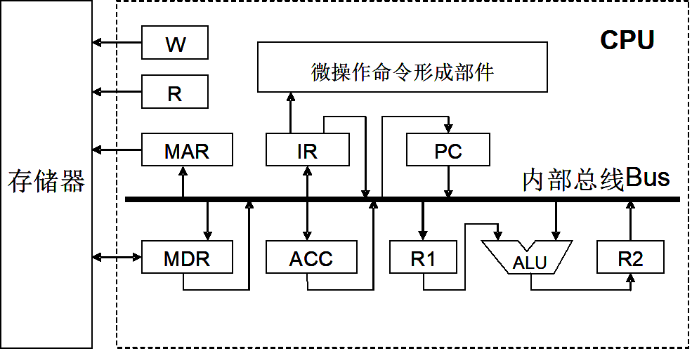

# 历年题（2007–2008）

整理自 `网上找的所谓的历年题/` 下的 `计算机组成原理-2007A.doc`、`计算机组织原理-2007A答案.doc`、`计算机组成原理-2007B.doc`、`计算机组成原理2008.doc`（试卷和答案在同一个文件里）。`计算机组成原理-2008B.doc` 和 `计算机组织原理-2008B答案.doc` 两个文件 Office 打不开，没能整理。

这几份是吉大软件学院早年的卷子，用的是唐朔飞教材体系。三份卷子大量重题：填空、选择几乎一样，计算题四道在三份卷子里反复出现。完整解答只在第一次出现时写，后面标"同某卷某题"。课程目录的 `网上找的所谓的历年题/README.md` 提醒过这些卷子"大部分应该都不太对"，核对后确实发现几处答案错误，都在原处标了"更正"。

题号后面的"答案"来自原卷答案文件；"整理补充"是原卷没有答案、由整理时补的；"提示"只给思路。

## 2007 级 A 卷

### 一、填空（20 分，每空 1 分）

1. 完整的计算机系统应包括 __(1)__ 和 __(2)__。
2. 计算机硬件的主要技术指标包括 __(3)__、__(4)__ 和 __(5)__。
3. 一个总线传输周期通常包括四个阶段：申请分配阶段、__(6)__、__(7)__ 和结束阶段。
4. 总线的判优控制可分为 __(8)__ 式和 __(9)__ 式两种。其中，在计数器定时查询方式下，采用 __(10)__ 计数方式，可使每个设备使用总线的优先级相等。
5. Cache 写策略中，最简单的技术是 __(11)__，其缺点是产生了大量的存储信息量；另一种技术为 __(12)__，但其缺点是部分存储器是无效的。
6. 若使用汉明纠错码来确定 512 位数据字中的单个错误，则需要 __(13)__ 校验位。
7. RISC 指令系统的最大特点是指令条数少，__(14)__ 固定；指令格式种类少；只有取数/存数指令访问存储器，其余指令的操作都在 __(15)__ 之间进行。
8. DMA 的数据传送过程分为预处理、__(16)__ 和 __(17)__ 三个阶段。
9. 通常控制器的设计可分为 __(18)__ 和 __(19)__ 两大类，相对应的控制器结构有硬连线逻辑式和存储逻辑式，前者采用的核心器件是 __(20)__，后者采用的核心器件是 ROM。

答案：

| 空 | 答案 | 空 | 答案 |
| --- | --- | --- | --- |
| (1) | 配套的硬件系统 | (11) | 写直达法 |
| (2) | 软件系统 | (12) | 回写法（写回法） |
| (3) | 机器字长（更正：原答案作"存储字长"。教材列的硬件主要技术指标是机器字长、存储容量、运算速度） | (13) | 10 位（$2^{10}\ge512+10+1$，而 $2^9<512+9+1$） |
| (4) | 存储容量 | (14) | 指令长度 |
| (5) | 运算速度 | (15) | 寄存器 |
| (6) | 寻址阶段 | (16) | 数据传送 |
| (7) | 传数阶段 | (17) | 后处理 |
| (8) | 集中 | (18) | 组合逻辑设计 |
| (9) | 分布 | (19) | 微程序设计 |
| (10) | 每次从上一次计数的终止点开始 | (20) | 门电路 |

### 二、选择题（共 15 分，每空 1 分）

1. 存储单元是指（ ）。
   A. 存放一个字节的所有存储元集合　B. 存放一个存储字的所有存储元集合　C. 存放一个二进制信息位的存储元集合　D. 存放一条指令的存储元集合
2. 总线的异步通信方式（ ）。
   A. 不采用时钟信号，只采用握手信号　B. 既采用时钟信号，又采用握手信号　C. 只采用时钟信号，不采用握手信号　D. 既不采用时钟信号，又不采用握手信号
3. 微型计算机中控制总线提供的完整信息是（ ）。
   A. 存储器和 I/O 设备的地址码　B. 来自 I/O 设备和存储器的响应信号　C. 所有存储器和 I/O 设备的时序信号和控制信号　D. 上述各项　E. 上述 B、C 两项　F. 上述 A、B 两项
4. 三种集中式总线控制中，（ ）方式响应时间最快，（ ）方式对电路故障最敏感。
   A. 链式查询　B. 计数器定时查询　C. 独立请求
5. 存取周期是指（ ）。
   A. 存储器进行连续读操作允许的最短间隔时间　B. 存储器进行连续写操作允许的最短间隔时间　C. 存储器的写入时间　D. 存储器进行连续读或写操作允许的最短间隔时间
6. 若主存每个存储单元为 16 位，则（ ）。
   A. 其地址线为 16 根　B. 该机器字长为 16 位　C. 其地址线数与 16 无关　D. 其地址线数与 16 有关
7. 采用八体并行低位交叉存储器，每个体的存储容量为 32K×16 位，存取周期为 400 ns，下述说法正确的是（ ）。
   A. 在 400 ns 内，存储器可向 CPU 提供 $2^7$ 位二进制信息　B. 在 100 ns 内，存储器可向 CPU 提供 $2^7$ 位二进制信息　C. 在 400 ns 内，存储器可向 CPU 提供 $2^8$ 位二进制信息　D. 在 100 ns 内，存储器可向 CPU 提供 $2^8$ 位二进制信息
8. 在程序的执行过程中，Cache 与主存的地址映射是（ ）。
   A. 由操作系统来管理的　B. 由程序员调度的　C. 由硬件自动完成的　D. 既可能由操作系统管理，也可能由硬件自动完成
9. 采用 DMA 方式传送数据时，每传送一个数据要占用（ ）的时间。
   A. 一个指令周期　B. 一个机器周期　C. 一个存储周期　D. 一个时钟周期
10. 以下叙述中，（ ）是错误的。
    A. 一个更高级的中断请求一定可以中断比其级别低的另一个中断处理程序的执行　B. DMA 和 CPU 必须分时使用总线　C. DMA 的数据传送不需 CPU 控制　D. CPU 通过执行 I/O 指令来启动通道
11. 设寄存器内容为 10000000，若它等于 0，则为（ ）。
    A. 原码　B. 补码　C. 反码　D. 移码
12. 在中断周期中，由（ ）将允许中断触发器置"0"。
    A. 关中断指令　B. 中断隐指令　C. 开中断指令　D. 硬件自动完成
13. 超标量流水技术是（ ）。
    A. 缩短原来流水线的处理器周期　B. 在每个时钟周期内同时并发多条指令　C. 把多条能并行操作的指令组合成一条具有多个操作码字段的指令　D. 把指令的处理过程尽可能地细分，以达到更高的效率
14. 中断周期之前是（ ），中断周期之后是（ ）。
    A. 取指周期，执行周期　B. 执行周期，取指周期　C. 间指周期，执行周期　D. 取指周期，执行周期

答案：

| 题 | 答案 | 说明 |
| --- | --- | --- |
| 1 | B | |
| 2 | A | |
| 3 | E | |
| 4 | C，A | 独立请求最快，链式查询对故障最敏感 |
| 5 | D | |
| 6 | C | 地址线数由存储单元个数决定，与每个单元的位数无关 |
| 7 | A | 8 个体交叉，一个存取周期内送出 8×16 = $2^7$ 位 |
| 8 | C | 更正：原答案作 A。Cache 与主存之间的地址映射和调度全部由硬件自动完成，对程序员透明 |
| 9 | C | |
| 10 | A | 高级中断能否打断低级中断，还要看屏蔽字和是否开中断 |
| 11 | 原答案 A | 存疑：原码 10000000 表示 −0，移码 10000000 表示 +0。题面写"等于 0"时选 D 更贴切；若原题是"等于 −0"则选 A |
| 12 | B | 中断隐指令本身由硬件在中断周期自动完成 |
| 13 | B | |
| 14 | B | 执行周期结束时查中断，响应后进入取指周期取服务程序的指令 |

原卷答案文件只写了 14 个题号的答案（第 4、14 题各两空），和试卷"共 15 题"的说法对不上，按空数算是 15 分。

### 三、简答题（共 25 分，每题 5 分）

**1. 说明浮点加、减法运算的基本步骤。**

答案：对阶、尾数求和、结果规格化、舍入处理、溢出判断。每步的含义见 `10 简答题精编（唐朔飞教材）.md` 第 36 题。

**2. 请写出五种寻址方式，并写出这五种寻址方式计算有效地址的表达式。**

答案（答对任 5 个即可，每个 1 分）：

| 寻址方式 | 表达式 |
| --- | --- |
| 立即寻址 | A = 操作数 |
| 直接寻址 | EA = A |
| 间接寻址 | EA = (A) |
| 寄存器寻址 | EA = $R_i$ |
| 寄存器间址 | EA = ($R_i$) |
| 变址寻址 | EA = ($R_x$) + A |
| 相对寻址 | EA = (PC) + A |

**3. 已知收到的海明码为 0100111（按配偶原则配置），试问欲传送的信息是什么？**

答案：先纠错（⊕ 为异或）：

- $P_1=1\oplus3\oplus5\oplus7=0$
- $P_2=2\oplus3\oplus6\oplus7=1$
- $P_4=4\oplus5\oplus6\oplus7=1$

$P_4P_2P_1=110$，第 6 位出错，纠正为 0100101，欲传送的信息为 0101。

**4. 解释周期挪用方式（DMA 与主存交换数据的一种方法），分析周期挪用可能出现的几种情况。**

答案：周期挪用是指在 DMA 方式中，I/O 设备没有 DMA 请求时，CPU 按程序要求访问主存；一旦 I/O 设备有 DMA 请求并与 CPU 访存冲突，CPU 暂停一个存取周期访存，把总线控制权让给 DMA，就像 I/O 设备挪用了 CPU 的访存周期，所以叫周期挪用或周期窃取。设备提出 DMA 请求时可能遇到三种情况：

1. CPU 正在做自身的操作（如乘法），不需要访存，I/O 访存和 CPU 没有冲突，不存在周期挪用。
2. I/O 设备要访存时 CPU 也要访存，发生冲突。此时 I/O 的 DMA 请求优先（I/O 访存有时间要求，前一个数据必须在下一个访存请求到来前存取完毕），出现周期挪用，CPU 延缓一个存取周期再访存。
3. I/O 设备有 DMA 请求时，存储器正处于"忙"状态（正在读或写），必须等这个存取周期结束才能进行 I/O 访存。

（原答案错字已改："BPU"为 CPU，"没中冲突"为没有冲突。）

**5. 简述中断处理过程（设备级与处理机级）。**

原卷答案写"略"。提示：设备级按"CPU 启动设备 → 设备准备 → 数据送缓冲寄存器 → 设备就绪 → 发中断请求"答；处理机级按"中断判优 → 中断响应（中断隐指令：保护断点、送向量地址、关中断）→ 中断服务 → 中断返回"答。完整十步见 `10 简答题精编（唐朔飞教材）.md` 第 29 题。

### 四、计算题（共 40 分）

**1.（10 分）** CPU 内部结构如下图，PC 有自动加 1 功能。W 是写控制标志，R 是读控制标志，R1 和 R2 是暂存器。另有 B、C、D、E、H、L 六个寄存器（图中未画出），输入端和输出端都与内部总线 Bus 相连，分别受控制信号控制。写出下列指令组合逻辑控制单元发出的微操作命令及节拍安排（包括取指周期）。



(1) `ADD B, C`　；(B)+(C)→B

(2) `SUB E, @H`　；(E)−((H))→E，寄存器间接寻址（更正：原题注释作"(E)+((H))→E"，与 SUB 指令不符）

思路：先写三拍取指周期；ADD 把 C 送暂存器 R1，B 经总线进 ALU，结果先存 R2 再送回 B；SUB 要多一个间址周期，按 H 的内容去主存取操作数。

答案：

```text
(1) ADD B, C
取指周期  T0: PC→Bus→MAR, 1→R
          T1: M(MAR)→MDR, (PC)+1→PC
          T2: MDR→Bus→IR, OP(IR)→微操作命令形成部件
执行周期  T0: C→Bus→R1
          T1: (B)+(R1)→ALU→R2
          T2: R2→Bus→B

(2) SUB E, @H
取指周期  T0: PC→Bus→MAR, 1→R
          T1: M(MAR)→MDR, (PC)+1→PC
          T2: MDR→Bus→IR, OP(IR)→微操作命令形成部件
间址周期  T0: H→Bus→MAR, 1→R
          T1: M(MAR)→MDR
执行周期  T0: MDR→Bus→R1
          T1: (E)−(R1)→ALU→R2
          T2: R2→Bus→E
```

（更正：原答案间址周期 T0 只写了"H→Bus→MAR"，漏了读命令 1→R，不发读命令存储器不会把 (H) 单元的内容读出。原答案中阶段名称处是丢失的公式对象，这里按内容补成"取指周期、间址周期、执行周期"。）

**2.（10 分）** 某计算机主存容量 16 MB，Cache 容量 16 KB，每字块 8 个字，每个字 32 位。设计一个四路组相联映像（Cache 每组 4 个字块）的 Cache 组织：

(1) 画出主存地址字段中各段的位数。

(2) 设 Cache 初态为空，CPU 依次从主存第 0、1、2、…、99 号单元读出 100 个字（一次读一个字），并重复此次序读 8 次，问命中率是多少？

(3) 若 Cache 的速度是主存速度的 6 倍，有 Cache 是无 Cache 速度的多少倍？

思路：这道题就是教材例 4.11 换了数字（见 `01 系统总线与存储器（第3、4章）.md`），按字节编址。

答案：

(1) 每块 8 字 × 4 字节 = $2^5$ B，块内地址 5 位。Cache $16\text{ KB}=2^{14}$ B，共 $2^9$ 块，c=9；四路组相联 $2^r=4$，r=2，组地址 q=c−r=7 位。主存 $16\text{ MB}=2^{24}$ B，标记 24−7−5=12 位。

| 主存字块标记 | 组地址 | 字块内地址 |
| --- | --- | --- |
| 12 | 7 | 5 |

(2) 读第 0 号单元不命中，把所在块调入 Cache 第 0 组，之后读 1～7 号都命中；同理第 8、16、…、96 号单元不命中。第一遍共 13 次不命中，后 7 遍全部命中。

$$命中率=\frac{100\times8-13}{100\times8}=98.375\%$$

（更正：原答案算式写作"(188*8−13)/(100*8)"，188 是笔误，结果 98.375% 是对的。）

(3) 设主存存取周期 6t，Cache 存取周期 t。无 Cache 时间 6t×800；有 Cache 时间 t×(800−13)+6t×13 = 865t。倍数 = 4800t/865t ≈ 5.55，原答案写 5.5 倍。

**3.（10 分）** 设 x=−0.1011，y=0.1101，用补码加减交替法计算 $[x/y]_补$。

思路：x、y 异号，第一步加 $[y]_补$；之后看余数与除数是否同号决定上商和下一步加减；末位商恒置 1。

答案：$[x]_补=11.0101$，$[y]_补=00.1101$，$[-y]_补=11.0011$。

```text
被除数(余数)    商        说明
  11.0101
+ 00.1101                x、y 异号，+[y]补
  00.0010      1         余数与 y 同号，上商 1
← 00.0100      1         左移 1 位
+ 11.0011                +[−y]补
  11.0111      10        余数与 y 异号，上商 0
← 10.1110      10        左移 1 位
+ 00.1101                +[y]补
  11.1011      100       余数与 y 异号，上商 0
← 11.0110      100       左移 1 位
+ 00.1101                +[y]补
  00.0011      1001      余数与 y 同号，上商 1
← 00.0110      10011     左移 1 位，末位商恒置 1
```

$[x/y]_补=1.0011$。

**4.（10 分）** 某计算机指令长度 16 位，存储器直接寻址空间为 128 字，变址时位移量为 −64～+63，8 个通用寄存器均可作变址寄存器。设计一套指令格式，满足：(1) 直接寻址的二地址指令 3 条；(2) 变址寻址的一地址指令 12 条；(3) 直接寻址的一地址指令 16 条；(4) 寄存器寻址的二地址指令 24 条；(5) 零地址指令 32 条。若再安排寄存器寻址的一地址指令，最多还能容纳多少条？

思路：直接地址 7 位（128 字），位移量 7 位，寄存器号 3 位。用扩展操作码，每类用剩下的码点往下扩展。

答案：

| 类型 | 格式 | 操作码位数 | 码点数 | 已用 | 剩余 |
| --- | --- | --- | --- | --- | --- |
| (1) 直接寻址二地址 | OP(2) A1(7) A2(7) | 2 | 4 | 3 | 1 |
| (2) 变址寻址一地址 | OP(6) Rx(3) A(7) | 6 | 1×16 = 16 | 12 | 4 |
| (3) 直接寻址一地址 | OP(9) A(7) | 9 | 4×8 = 32 | 16 | 16 |
| (4) 寄存器寻址二地址 | OP(10) R(3) R(3) | 10 | 16×2 = 32 | 24 | 8 |
| 寄存器寻址一地址 | OP(13) R(3) | 13 | 8×8 = 64 | x | 64−x |
| (5) 零地址 | OP(16) | 16 | (64−x)×8 | 32 | |

由 (64−x)×8 = 32 得 x = 60，寄存器寻址的一地址指令最多还能有 **60 条**。

（更正：原答案 (5) 那一行抄成了"最多 4 条，已有 3 条，余 1 条"，按上面的推导应是最多 (64−x)×8 条、已有 32 条。）

## 2007 级 B 卷

原卷没有答案文件。一、二大题和 `计算机组成原理2008.doc` 里那份卷子逐字相同，下面答案取自该卷答案并经核对；简答题和计算题 3 是本卷独有的。

### 一、填空（16 分，每空 1 分）

1. Cache、主存和辅存组成三级存储系统，分级的目的是提高访存速度、扩大存储容量。这种层次化存储器结构设计的依据是 __(1)__ 原理。
2. 一个总线传输周期通常包括四个阶段：申请分配阶段、__(2)__、__(3)__ 和结束阶段。
3. 总线的判优控制可分为 __(4)__ 式和 __(5)__ 式两种。在计数器定时查询方式下，采用 __(6)__ 计数方式，可使每个设备使用总线的优先级相等。
4. Cache 写策略中，最简单的技术是 __(7)__，其缺点是产生了大量的存储信息量；另一种技术为 __(8)__，但其缺点是部分存储器是无效的。
5. 若使用汉明纠错码来确定 512 位数据字中的单个错误，需要 __(9)__ 校验位。
6. RISC 指令系统的最大特点是指令条数少，__(10)__ 固定；指令格式种类少；只有取数/存数指令访问存储器，其余指令的操作都在 __(11)__ 之间进行。
7. DMA 的数据传送过程分为预处理、__(12)__ 和 __(13)__ 三个阶段。
8. 通常控制器的设计可分为 __(14)__ 和 __(15)__ 两大类，前者（硬连线逻辑式）采用的核心器件是 __(16)__，后者（存储逻辑式）采用的核心器件是 ROM。

答案：(1) 程序访问的局部性；(2) 寻址阶段；(3) 传数阶段；(4) 集中；(5) 分布；(6) 每次从上一次计数的终止点开始；(7) 写直达法；(8) 回写法；(9) 10 位；(10) 指令长度；(11) 寄存器；(12) 数据传送；(13) 后处理；(14) 组合逻辑设计；(15) 微程序设计；(16) 门电路。

### 二、选择题（共 12 题，每题 1 分）

1. 总线的异步通信方式（ ）。选项同 A 卷第 2 题。
2. 存取周期是指（ ）。选项同 A 卷第 5 题。
3. 若主存每个存储单元为 16 位，则（ ）。选项同 A 卷第 6 题。
4. 八体并行低位交叉存储器（32K×16 位，存取周期 400 ns），正确的是（ ）。选项同 A 卷第 7 题。
5. 在程序执行过程中，Cache 与主存的地址映射是（ ）。选项同 A 卷第 8 题。
6. 采用 DMA 方式传送数据时，每传送一个数据要占用（ ）的时间。选项同 A 卷第 9 题。
7. 以下叙述中（ ）是错误的。选项同 A 卷第 10 题。
8. 设寄存器内容为 10000000，若它等于 0，则为（ ）。选项同 A 卷第 11 题。
9. 在补码加减交替除法中，参加操作的数是（ ），商符（ ）。
   A. 绝对值的补码，在形成商值的过程中自动形成　B. 补码，由两数符号位异或形成　C. 补码，在形成商值的过程中自动形成　D. 绝对值的补码，由两数符号位异或形成
10. 在中断周期中，由（ ）将允许中断触发器置"0"。选项同 A 卷第 12 题。
11. 超标量流水技术是（ ）。选项同 A 卷第 13 题。
12. 中断周期之前是（ ），中断周期之后是（ ）。选项同 A 卷第 14 题。

答案：

| 题 | 答案 | 说明 |
| --- | --- | --- |
| 1 | A | |
| 2 | D | |
| 3 | C | 更正：2008 卷答案作 B。每个存储单元 16 位说明的是存储字长，既决定不了机器字长，也和地址线数无关；A 卷同一题的答案就是 C |
| 4 | A | |
| 5 | C | 更正：2008 卷答案作 A，理由同 A 卷第 8 题 |
| 6 | C | |
| 7 | A | |
| 8 | 原答案 A | 存疑，同 A 卷第 11 题 |
| 9 | C | |
| 10 | B | |
| 11 | B | |
| 12 | B | |

### 三、简答题（共 6 题，每题 5 分）

**1. 什么是程序访问的局部性？存储系统中哪一级采用了程序访问的局部性原理？**

原卷无答案。提示：局部性是指 CPU 在一段时间内只访问主存的局部地址区域（指令和数据连续存放，循环、子程序、常数反复使用），分时间局部性和空间局部性。Cache-主存层次和主存-辅存（虚拟存储器）层次都是按局部性原理设计的。定义原文见 `01 系统总线与存储器（第3、4章）.md`。

**2. 计算机中采用总线结构有何优点？**

原卷无答案，几份简答汇总里也没有。提示：从部件间连线少、结构简单，便于模块化设计和标准化，便于扩充设备和升级换代，便于故障诊断和维护这几方面答。

**3. 请写出五种寻址方式，并写出计算有效地址的表达式。**

答案同 A 卷简答第 2 题。

**4. 解释周期挪用方式，分析周期挪用可能出现的几种情况。**

答案同 A 卷简答第 4 题。

**5. 简要说明采用层次结构存储系统的目的。**

原卷无答案。提示：用 Cache-主存层次解决速度问题，主存-辅存层次解决容量问题，整体上达到速度接近 Cache、容量接近辅存、位价格接近辅存的效果。可参考 `22 网传试卷（2021、2022）.md` 中 2021 卷简答第 32 题的答案。

**6. 某机有五个中断源 L0、L1、L2、L3、L4，按中断响应的次序由高向低排序为 L0→L1→L2→L3→L4，现要求中断处理次序为 L1→L3→L4→L0→L2，写出各中断源的屏蔽字。**

答案（取自 2010 卷答案，经核对）：

| 中断源 | L0 | L1 | L2 | L3 | L4 |
| --- | --- | --- | --- | --- | --- |
| L0 | 1 | 0 | 1 | 0 | 0 |
| L1 | 1 | 1 | 1 | 1 | 1 |
| L2 | 0 | 0 | 1 | 0 | 0 |
| L3 | 1 | 0 | 1 | 1 | 1 |
| L4 | 1 | 0 | 1 | 0 | 1 |

### 四、计算题（共 42 分）

**1.（10 分）** CPU 微操作命令（ADD B,C 与 SUB E,@H）。同 A 卷计算题 1。

**2.（12 分）** 16 MB 主存、16 KB Cache、四路组相联。同 A 卷计算题 2。

**3.（10 分）** 设 x=−0.1011，y=0.1101，用 Booth 算法计算 $[x\times y]_补$。

原卷无答案，以下为整理补充（已用程序逐步验算）。

思路：部分积和被乘数取双符号位，乘数 $[y]_补=0.1101$ 末尾附加 $y_{n+1}=0$；看最低两位 $y_ny_{n+1}$：01 加 $[x]_补$，10 加 $[-x]_补$，00、11 加 0；每步加完右移一位，最后一步不移位。

$[x]_补=11.0101$，$[-x]_补=00.1011$。

```text
部分积        乘数寄存器 附加位   说明
  00.0000     01101   0          y_n y_n+1 = 10，+[−x]补
+ 00.1011
  00.1011
→ 00.0101     10110   1          右移一位；01，+[x]补
+ 11.0101
  11.1010
→ 11.1101     01011   0          右移一位；10，+[−x]补
+ 00.1011
  00.1000
→ 00.0100     00101   1          右移一位；11，+0
→ 00.0010     00010   1          右移一位；01，+[x]补
+ 11.0101
  11.0111     0001               最后一步不移位
```

乘积 = 部分积 11.0111 接上乘数寄存器移入的低 4 位 0001，$[x\times y]_补=1.01110001$，即 $x\times y=-0.10001111$。验算：$-\dfrac{11}{16}\times\dfrac{13}{16}=-\dfrac{143}{256}$，$143=10001111_2$，一致。

**4.（10 分）** 16 位指令的扩展操作码设计。同 A 卷计算题 4。

## 2008 年卷（`计算机组成原理2008.doc`）

这份文件里的试卷标题写的是"2007 级本科（B）"，后面附的答案标题写的是"2008 级本科（B）答案"，文件名是 2008。按文件名放在这里。

### 一、二大题

填空 16 空、选择 12 题与上面 2007 B 卷逐字相同，答案（含两处更正、一处存疑）见 2007 B 卷。

### 三、简答题（共 6 题，每题 5 分）

1. 说明浮点加、减法运算的基本步骤。答案同 A 卷简答第 1 题。
2. 请写出五种寻址方式，并写出计算有效地址的表达式。答案同 A 卷简答第 2 题。
3. 已知收到的海明码为 0100111（按配偶原则配置），欲传送的信息是什么？答案同 A 卷简答第 3 题：0101。
4. 解释周期挪用方式，分析周期挪用可能出现的几种情况。答案同 A 卷简答第 4 题。
5. 当遇到什么情况时，流水线将受阻？举例说明。原答案写"略"。提示：三种相关（冒险）会让流水线受阻。结构相关，如取指令和取操作数争用同一存储器；数据相关，如 `ADD R1,R2,R3` 后紧跟 `ADD R4,R1,R5`，后一条要读前一条还没写回的 R1；控制相关，如条件转移指令在结果出来前不知道下一条取哪条。解决办法见 `10 简答题精编（唐朔飞教材）.md` 第 43 题。
6. 五个中断源 L0～L4 的屏蔽字（题目同 2007 B 卷简答第 6 题）。答案见 2007 B 卷。

注：这份答案文件的简答部分最后一条写的是"中断的处理过程（略）"，和本卷第 6 题对不上，看起来是从 2007 A 卷答案复制过来的。

### 四、计算题（共 42 分）

1.（10 分）CPU 微操作命令。同 A 卷计算题 1。

2.（12 分）四路组相联 Cache。同 A 卷计算题 2。

3.（10 分）x=−0.1011，y=0.1101，用补码加减交替法求 $[x/y]_补$。同 A 卷计算题 3，结果 $[x/y]_补=1.0011$。

4.（10 分）16 位指令扩展操作码。同 A 卷计算题 4，最多 60 条。
