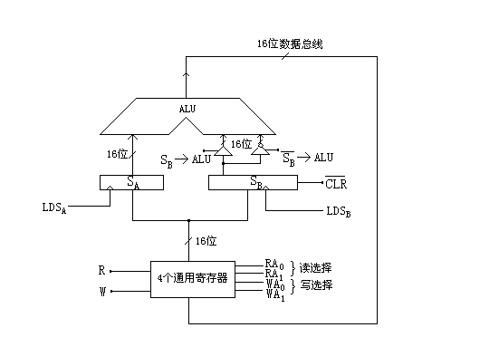
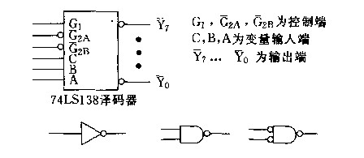

# 历年题（2009–2011）

整理自 `网上找的所谓的历年题/` 下的：

- 2009 级 B 卷：`计算机组成原理2009.doc`（试卷加答案）、`计算机组成原理2009级（B）.doc`（试卷）、`计算机组成原理2009级（B）答案.doc`。三个文件内容重复，合并成一份。答案文件标题写的是"《计算机原理与系统结构》试题（B）答案"。
- 2010 年卷：`计算机组成原理2010.doc`（试卷加答案）、`计算机组成原理-2010.doc`（试卷）、`计算机组织原理-2010-答案.doc`。卷面标题是"2008 级本科（A）"，按文件名放在 2010。
- 2011 年卷：`计算机组成原理-2011-A.doc`，卷面标题"2010 级本科（A）"，没有答案文件。

和 2007–2008 的卷子一样，不少题反复出现，重复的计算题只写"同某卷某题"，完整解答在 `20 历年题（2007–2008）.md`。原卷公式是 Word 公式对象，预处理时丢了，这里对照原文件渲染图补回。

## 2009 级 B 卷

### 一、填空（共 15 分，每空 1 分）

1. 为了运算器的 __(1)__，采用了 __(2)__ 进位，__(3)__ 乘除法和流水线等并行措施。
2. 相联存储器不按地址而是按 __(4)__ 访问的存储器，在 Cache 中用来存放 __(5)__，在虚拟存储器中用来存放 __(6)__。
3. 硬布线控制器的设计方法是：先画出 __(7)__ 流程图，再利用 __(8)__ 写出综合逻辑表达式，然后用 __(9)__ 等器件实现。
4. 磁表面存储器主要技术指标有 __(10)__、__(11)__、__(12)__ 和数据传输率。
5. DMA 控制器按其 __(13)__ 结构，分为 __(14)__ 型和 __(15)__ 型两种。

答案：(1) 高速性；(2) 先行；(3) 阵列；(4) 内容；(5) 行地址表；(6) 页表和段表；(7) 指令周期；(8) 布尔代数；(9) 门电路、触发器或可编程逻辑；(10) 存储密度；(11) 存储容量；(12) 平均存取时间；(13) 组成结构；(14) 选择；(15) 多路。

### 二、选择题（共 10 题，每题 1 分）

1. 六七十年代，在美国的 ___ 州出现了一个地名叫硅谷。该地主要工业是 ___，它也是 ___ 的发源地。
   A. 马萨诸塞，硅矿产地，通用计算机　B. 加利福尼亚，微电子工业，通用计算机　C. 加利福尼亚，硅生产基地，小型计算机和微处理机　D. 加利福尼亚，微电子工业，微处理机
2. 若浮点数用补码表示，判断运算结果是否为规格化数的方法是（ ）。
   A. 阶符与数符相同为规格化数　B. 阶符与数符相异为规格化数　C. 数符与尾数小数点后第一位数字相异为规格化数　D. 数符与尾数小数点后第一位数字相同为规格化数
3. 定点 16 位字长的字，采用 2 的补码形式表示时，一个字所能表示的整数范围是（ ）。
   A. $-2^{15}\sim+(2^{15}-1)$　B. $-(2^{15}-1)\sim+(2^{15}-1)$　C. $-(2^{15}+1)\sim+2^{15}$　D. $-2^{15}\sim+2^{15}$
4. 某 SRAM 芯片存储容量为 64K×16 位，该芯片的地址线和数据线数目为（ ）。
   A. 64，16　B. 16，64　C. 64，8　D. 16，16
5. 交叉存储器实质上是一种 ___ 存储器，它能 ___ 执行 ___ 独立的读写操作。
   A. 模块式，并行，多个　B. 模块式，串行，多个　C. 整体式，并行，一个　D. 整体式，串行，多个
6. 用某个寄存器中操作数的寻址方式称为 ___ 寻址。
   A. 直接　B. 间接　C. 寄存器直接　D. 寄存器间接
7. 流水 CPU 由一系列叫做"段"的处理线路组成。和具有 m 个并行部件的 CPU 相比，一个 m 段流水 CPU（ ）。
   A. 具备同等水平的吞吐能力　B. 不具备同等水平的吞吐能力　C. 吞吐能力大于前者　D. 吞吐能力小于前者
8. 描述 PCI 总线基本概念不正确的句子是（ ）。
   A. HOST 总线不仅连接主存，还可以连接多个 CPU　B. PCI 总线体系中有三种桥，它们都是 PCI 设备　C. 以桥连接实现的 PCI 总线结构不允许多条总线并行工作　D. 桥的作用可使所有的存取都按 CPU 的需要出现在总线上
9. 计算机的外围设备是指（ ）。
   A. 输入/输出设备　B. 外存储器　C. 远程通信设备　D. 除了 CPU 和内存以外的其他设备
10. 中断向量地址是（ ）。
    A. 子程序入口地址　B. 中断服务例行程序入口地址　C. 中断服务例行程序入口地址的指示器　D. 中断返回地址

答案：1 D；2 C；3 A；4 D；5 A；6 C；7 A；8 C；9 D；10 C。

几题的理由：第 2 题，补码规格化尾数是 0.1xx… 或 1.0xx…，数符和第一位数值位相反；第 4 题，$64\text{K}=2^{16}$，地址线 16 根，数据线 16 根；第 10 题，向量地址指向的单元里放的是入口地址或跳转指令，所以是"入口地址的指示器"。

### 三、简答题（共 3 题，每题 9 分）

**1. 求证：$[X]_补+[Y]_补=[X+Y]_补\pmod 2$**

答案（分四种情况，定点小数，模 2）：

1. $x>0,\ y>0$，则 $x+y>0$：$[X]_补+[Y]_补=x+y=[X+Y]_补$。
2. $x>0,\ y<0$：$[X]_补=x$，$[Y]_补=2+y$，所以 $[X]_补+[Y]_补=2+(x+y)$。
   - 当 $x+y>0$ 时，$2+(x+y)>2$，进位 2 丢掉，得 $x+y=[X+Y]_补$。
   - 当 $x+y<0$ 时，$2+(x+y)<2$，得 $2+(x+y)=[X+Y]_补$。（更正：原答案这里写作"$=x+y=[X+Y]_补$"。x+y 为负时补码是 2+(x+y)，不是 x+y。）
3. $x<0,\ y>0$：与第 2 种情况对称，把 x、y 对调即得证。
4. $x<0,\ y<0$，则 $x+y<0$：$[X]_补=2+x$，$[Y]_补=2+y$，$[X]_补+[Y]_补=2+(2+x+y)$。括号内是大于 1、小于 2 的数（不溢出时），进位 2 丢掉，得 $2+(x+y)=[X+Y]_补$。

**2. 某计算机字长 32 位，有 16 个通用寄存器，主存容量为 1M 字，采用单字长二地址指令，共有 64 条指令。试采用四种寻址方式（寄存器、直接、变址、相对）设计指令格式。**

答案：64 条指令需操作码 OP 6 位；源寄存器、目标寄存器各 4 位；寻址模式 X 2 位；形式地址 D 16 位。

| 位 | 31～26 | 25～22 | 21～18 | 17～16 | 15～0 |
| --- | --- | --- | --- | --- | --- |
| 字段 | OP | 目标 | 源 | X | D |

| X | 寻址方式 | 有效地址 |
| --- | --- | --- |
| 00 | 寄存器寻址 | 操作数由源寄存器号和目标寄存器号指定 |
| 01 | 直接寻址 | E = (D)（原答案写法） |
| 10 | 变址寻址 | E = (Rx) + D |
| 11 | 相对寻址 | E = (PC) + D |

其中 Rx 为变址寄存器，PC 为程序计数器（20 位），位移量 D 可正可负。该格式可实现 RR 型、RS 型寻址。

存疑两处：一是直接寻址的有效地址按通常写法应为 E = D；二是原答案写"Rx 为变址寄存器（10 位）"，而 Rx 要和 16 位的 D 相加形成 20 位主存地址，至少要 20 位，"10 位"可能是笔误。

**3. 下表表示使用快表（页表）的虚实地址转换条件，快表存放在相联存储器中，容量为 8 个存储单元。问：CPU 按虚拟地址 1、2、3 访问主存时，主存的实地址码分别是多少？**

快表：

| 页号 | 该页在主存中的起始地址 |
| --- | --- |
| 33 | 42000 |
| 25 | 38000 |
| 7 | 96000 |
| 6 | 60000 |
| 4 | 40000 |
| 15 | 80000 |
| 5 | 50000 |
| 30 | 70000 |

虚拟地址：

| 虚拟地址 | 页号 | 页内地址 |
| --- | --- | --- |
| 1 | 15 | 0324 |
| 2 | 7 | 0128 |
| 3 | 48 | 0516 |

答案：

1. 用页号 15 检索快表，起始地址 80000，加页内地址 0324，实地址 80324。
2. 页号 7 对应 96000，实地址 96000 + 0128 = 96128。
3. 页号 48 在快表中检索不到。操作系统暂停用户程序，转去执行查页表程序：若该页在主存中，就把页号和起始地址写入快表；若不在主存，先把该页从外存调入主存，再把页号和起始地址写入快表。（更正：原答案前一种情况写作"写入主存"，应为写入快表。）

### 四、计算题（共 48 分）

**1.（12 分）** 某计算机运算器框图如下，ALU 为 16 位加法器，$S_A$、$S_B$ 为 16 位暂存器，4 个通用寄存器由 D 触发器组成，Q 端输出。读写控制如下表，要求设计微指令格式。



| R | RA0 | RA1 | 读出 | | W | WA0 | WA1 | 写入 |
| --- | --- | --- | --- | --- | --- | --- | --- | --- |
| 1 | 0 | 0 | R0 | | 1 | 0 | 0 | R0 |
| 1 | 0 | 1 | R1 | | 1 | 0 | 1 | R1 |
| 1 | 1 | 0 | R2 | | 1 | 1 | 0 | R2 |
| 1 | 1 | 1 | R3 | | 1 | 1 | 1 | R3 |
| 0 | x | x | 不读出 | | 0 | x | x | 不写入 |

思路：把图上每个控制信号都放进微命令字段，编码能压缩的（寄存器选择）用两位编码，其余一位一个信号；后面接判别测试字段和下址字段。

答案：微命令字段共 12 位。

| 字段 | R | RA0RA1 | W | WA0WA1 | LDSA | LDSB | SB→ALU | $\overline{\text{SB}}$→ALU | CLR | 结束位 | P 字段 | 下址字段 |
| --- | --- | --- | --- | --- | --- | --- | --- | --- | --- | --- | --- | --- |
| 位数 | 1 | 2 | 1 | 2 | 1 | 1 | 1 | 1 | 1 | 1 | | |

- R：通用寄存器读命令；W：通用寄存器写命令。
- RA0RA1：读 R0～R3 的选择控制；WA0WA1：写 R0～R3 的选择控制。
- LDSA、LDSB：打入 $S_A$、$S_B$ 的控制信号。
- SB→ALU：打开非反向三态门。
- $\overline{\text{SB}}$→ALU：打开反向三态门，并使加法器最低位加 1（实现减法）。
- CLR：暂存器 $S_B$ 清零信号。
- 结束位：一段微程序结束，转入取机器指令的控制信号（原稿这一位是个特殊符号，转写时丢了）。

**2.（12 分）** 用有符号二进制数除法的硬件实现方法计算 (−0.1011) ÷ (0.1101)，写出步骤和结果。

答案同 2007 A 卷计算题 3（补码加减交替法），结果 $[x/y]_补=1.0011$。

**3.（12 分）** 主存 16 MB，Cache 16 KB，每字块 8 个字，每字 32 位，四路组相联。(1) 主存地址字段；(2) 依次读 0～99 号单元、共读 8 次的命中率；(3) Cache 速度是主存 6 倍时的速度倍数。

答案同 2007 A 卷计算题 2：标记 12 位、组地址 7 位、块内地址 5 位；命中率 98.375%；约 5.5 倍。

**4.（12 分）** 16 位指令、直接寻址空间 128 字、位移量 −64～+63、8 个通用寄存器的扩展操作码设计。

答案同 2007 A 卷计算题 4，寄存器寻址的一地址指令最多 60 条。

## 2010 年卷（卷面标题：2008 级本科 A 卷）

### 一、填空（20 分，每空 1 分）

1. $(48.75)_{10}=(\ \ (1)\ \ )_{16}$。
2. 若 $[x]_补=1.0110$，则 $[\tfrac12x]_补=$ __(2)__。
3. 按照信息的传送格式，接口可分为程序型接口和 __(3)__ 型接口两大类。
4. 以串行接口对 ASCII 码进行传送，带一位奇校验位和两位停止位，当波特率为 9600 波特时，字符传送率为 __(4)__ 字符/秒。
5. 总线的判优控制可分为 __(5)__ 式和 __(6)__ 式两种。在计数器定时查询方式下，采用 __(7)__ 计数方式，可使每个设备使用总线的优先级相等。
6. Cache 写策略中，最简单的技术是 __(8)__，另一种技术为 __(9)__。
7. 若使用汉明纠错码来确定 512 位数据字中的单个错误，需要 __(10)__ 校验位。
8. RISC 指令系统的最大特点是指令条数少，__(11)__ 固定；……其余指令的操作都在 __(12)__ 之间进行。
9. DMA 的数据传送过程分为预处理、__(13)__ 和 __(14)__ 三个阶段。
10. 控制器的设计可分为 __(15)__ 和 __(16)__ 两大类，硬连线逻辑式采用的核心器件是 __(17)__，存储逻辑式采用的核心器件是 ROM。
11. 设 CPU 的主频为 8 MHz，每个机器周期包含 4 个时钟周期，该机的平均执行速度为 0.8 MIPS，则该机的时钟周期为 __(18)__，平均指令周期为 __(19)__，每个指令周期包含 __(20)__ 个机器周期。（原卷"时钟周期"误作"时候周期"。）

答案：

| 空 | 答案 | 说明 |
| --- | --- | --- |
| (1) | 30.C | 48 = 30H，0.75 = 0.CH |
| (2) | 1.1011 | 补码算术右移一位，符号位不变，右移补 1 |
| (3) | DMA | |
| (4) | 约 872 | 更正：原答案作 960，相当于每个字符按 10 位算。ASCII 码 7 位，加 1 位起始位、1 位奇校验位、2 位停止位，每个字符 11 位，9600/11 ≈ 872.7 |
| (5)(6)(7) | 集中；分布；每次从上一次计数的终止点开始 | |
| (8)(9) | 写直达法；回写法 | |
| (10) | 10 位 | |
| (11)(12) | 指令长度；寄存器 | |
| (13)(14) | 数据传送；后处理 | |
| (15)(16)(17) | 组合逻辑设计；微程序设计；门电路 | |
| (18) | 0.125 μs | 1/8 MHz |
| (19) | 1.25 μs | 1/0.8 MIPS |
| (20) | 2.5 | 机器周期 = 4×0.125 = 0.5 μs，1.25/0.5 = 2.5 |

### 二、选择题（共 12 题，每题 1 分）

1. 在浮点数中，当数的绝对值太大，以至于超过所能表示的数据时，称为浮点数的（ ）。
   A. 正上溢　B. 上溢　C. 正溢　D. 正下溢
2. 存取周期是指（ ）。选项同 2007 A 卷第 5 题。
3. 若主存每个存储单元为 16 位，则（ ）。选项同 2007 A 卷第 6 题。
4. 在程序执行过程中，Cache 与主存的地址映射是（ ）。选项同 2007 A 卷第 8 题。
5. 采用 DMA 方式传送数据时，每传送一个数据要占用（ ）的时间。选项同 2007 A 卷第 9 题。
6. 若浮点数用补码表示，判断运算结果是否为规格化数的方法是（ ）。选项同 2009 B 卷第 2 题。
7. 中断向量地址是（ ）。选项同 2009 B 卷第 10 题。
8. 定点 16 位字长的字，采用 2 的补码表示时，整数范围是（ ）。选项同 2009 B 卷第 3 题。
9. 在中断周期中，由（ ）将允许中断触发器置"0"。选项同 2007 A 卷第 12 题。
10. 超标量流水技术是（ ）。选项同 2007 A 卷第 13 题。
11. 总线的异步通信方式（ ）。选项同 2007 A 卷第 2 题。
12. 以下叙述中（ ）是错误的。
    A. CPU 通过执行 I/O 指令来启动通道　B. DMA 和 CPU 必须分时使用总线　C. DMA 的数据传送不需 CPU 控制　D. 一个更高级的中断请求一定可以中断比其级别低的另一个中断处理程序的执行

答案：

| 题 | 答案 | 说明 |
| --- | --- | --- |
| 1 | B | 正负都可能上溢，"正上溢"只说了一半 |
| 2 | D | |
| 3 | C | |
| 4 | C | |
| 5 | C | |
| 6 | C | 更正：原答案作 A。补码规格化看数符与尾数第一位是否相异，2009 B 卷同一题答案就是 C |
| 7 | C | 更正：原答案作 A。向量地址是入口地址的指示器，2009 B 卷同一题答案就是 C |
| 8 | A | |
| 9 | B | |
| 10 | B | |
| 11 | A | |
| 12 | D | 本卷把"更高级中断一定能打断低级中断"放到了 D 选项 |

### 三、简答题（共 4 题，每题 5 分）

1. 说明浮点加、减法运算的基本步骤。答案：对阶、尾数求和、结果规格化、舍入处理、溢出处理。
2. 写出五种寻址方式及有效地址表达式。答案同 2007 A 卷简答第 2 题。
3. 收到海明码 0100111（配偶），欲传送的信息是什么？答案：第 6 位出错，纠正为 0100101，信息为 0101。
4. 五个中断源 L0～L4 的屏蔽字（题目同 2007 B 卷简答第 6 题）。答案：L0 10100，L1 11111，L2 00100，L3 10111，L4 10101。

### 四、计算题（共 48 分）

**1.（10 分）** CPU 微操作命令（ADD B,C 与 SUB E,@H）。同 2007 A 卷计算题 1。

**2.（共 10 分）** 设某计算机主存容量为 16 MB，Cache 的容量为 16 KB。**每字块有 16 个字**，每个字 32 位。设计一个四路组相联映像的 Cache 组织：(1) 画出主存地址字段中各段的位数（3 分）；(2) Cache 初态为空，CPU 依次从主存第 0～99 号单元读出 100 个字，并重复此次序读 8 次，问命中率是多少（4 分）；(3) 若 Cache 的速度是主存速度的 6 倍，有 Cache 是无 Cache 速度的多少倍（3 分）。

注意：本卷把每字块改成了 16 个字，原答案却原样抄了"每字块 8 个字"那一版（块内地址 5 位、13 次未命中），和题目对不上。下面按本卷条件重算。

答案（更正版）：

(1) 每块 16 字 × 4 字节 = $2^6$ B，块内地址 6 位。Cache $2^{14}$ B 共 $2^8$ 块，四路组相联分 $2^6$ 组，组地址 6 位。标记 24−6−6 = 12 位。

| 主存字块标记 | 组地址 | 字块内地址 |
| --- | --- | --- |
| 12 | 6 | 6 |

(2) 每块 16 个字，100 个字落在 7 块里（0～15，16～31，…，96～99）。第一遍读第 0、16、32、48、64、80、96 号单元时不命中，共 7 次；这 7 块分别进第 0～6 组，不会互相替换，后 7 遍全部命中。

$$命中率=\frac{100\times8-7}{100\times8}=99.125\%$$

(3) 无 Cache 时间 6t×800 = 4800t；有 Cache 时间 t×(800−7)+6t×7 = 835t。倍数 = 4800/835 ≈ 5.75。

（原答案按每块 8 字算：块内地址 5 位、组地址 7 位、标记 12 位，命中率 98.375%，5.5 倍。）

**3.（8 分）** x=−0.1011，y=0.1101，用补码加减交替法求 $[x/y]_补$。同 2007 A 卷计算题 3，结果 1.0011。

**4.（12 分，每问 3 分）** 设某微机的寻址范围为 64K，接有 8 片 8K 的存储芯片，存储芯片的片选信号为 $\overline{\text{CS}}$。要求：

(1) 画出选片译码电路（可选用 74138 译码器）；

(2) 写出每片 RAM 的十六进制地址范围；

(3) 如果运行时发现不论往哪片 RAM 存放 8K 数据，以 A000H 为起始地址的存储芯片都有与之相同的数据，分析故障原因；

(4) 若译码中的地址线 A13 与 CPU 断线，并搭接到高电平上，将会出现什么后果。

答案：

(1) 74138 的 8 个输出 $\overline{Y_i}$（i=0～7）分别作为 8 片 RAM 的片选信号 $\overline{\text{CS}}$。原答案"电路图略"。整理补充一种接法：A15、A14、A13 分别接 74138 的 C、B、A 输入端，G1 接高电平，$\overline{G_{2A}}$、$\overline{G_{2B}}$ 接地（或接访存控制信号），A12～A0 并接到各芯片的地址端。

(2) 8 片的地址范围依次是：0000H～1FFFH；2000H～3FFFH；4000H～5FFFH；6000H～7FFFH；8000H～9FFFH；A000H～BFFFH；C000H～DFFFH；E000H～FFFFH。

(3) 74138 译码器有故障，$\overline{Y_5}$ 输出始终为低电平。$\overline{Y_5}$ 接第 6 片 RAM 的 $\overline{\text{CS}}$，这片的地址范围是 A000H～BFFFH，所以不论往哪片写，它都一直被选中，存进了同样的数据。

(4) A13 恒为 1，$\overline{Y_0}$、$\overline{Y_2}$、$\overline{Y_4}$、$\overline{Y_6}$ 都不会有效输出，第 1、3、5、7 片始终不被选中。（整理补充：原本访问这四片的地址会落到第 2、4、6、8 片上。）

**5.（8 分）** 16 位指令扩展操作码设计。同 2007 A 卷计算题 4，最多 60 条。

## 2011 年卷（卷面标题：2010 级本科 A 卷）

这份卷子没有答案文件。填空、选择里和其他年份重复的题直接用那些卷子核对过的答案；新题标"整理补充"并写理由；简答给提示；计算题都是能严格推出来的，给了完整过程，也标"整理补充"。

### 一、填空（20 分，每空 1 分）

1. 一个总线周期包括四个阶段：申请分配阶段、__(1)__、__(2)__ 和结束阶段。
2. Cache、主存和辅存组成三级存储系统，这种层次化存储器结构设计的依据是 __(3)__ 原理。
3. 总线的判优控制可分为 __(4)__ 式和 __(5)__ 式两种。在计数器定时查询方式下，采用 __(6)__ 计数方式，可使每个设备使用总线的优先级相等。
4. Cache 写策略中，最简单的技术是 __(7)__，另一种技术为 __(8)__。
5. 若使用汉明纠错码来确定 512 位数据字中的单个错误，需要 __(9)__ 校验位。
6. RISC 指令系统的最大特点是指令条数少，__(10)__ 固定；……其余指令的操作都在 __(11)__ 之间进行。
7. 若 $[X]_反=1.0101011$，则 $[-X]_补=$ __(12)__；设 $X^*$ 为 X 的绝对值，则 $[-X^*]_补=$ __(13)__。
8. 主机与设备交换信息的控制方式中，程序查询方式主机与设备串行工作，__(14)__ 方式和 __(15)__ 方式主机与设备并行工作，且最后一种方式主程序与信息传送是并行进行的。
9. CPU 响应中断后进入中断周期，自动完成三个操作：① __(16)__；② 寻找中断服务程序的入口地址；③ __(17)__。
10. 控制器的设计可分为 __(18)__ 和 __(19)__ 两大类，硬连线逻辑式采用的核心器件是 __(20)__，存储逻辑式采用的核心器件是 ROM。

答案：

| 空 | 答案 | 来源或理由 |
| --- | --- | --- |
| (1)(2) | 寻址阶段；传数阶段 | 同 2007 卷 |
| (3) | 程序访问的局部性 | 同 2007 B 卷 |
| (4)(5)(6) | 集中；分布；每次从上一次计数的终止点开始 | 同 2007 卷 |
| (7)(8) | 写直达法；回写法 | 同 2007 卷 |
| (9) | 10 位 | 同 2007 卷 |
| (10)(11) | 指令长度；寄存器 | 同 2007 卷 |
| (12) | 0.1010100（整理补充） | 反码 1.0101011 对应 X=−0.1010100，−X=+0.1010100，正数补码与真值相同 |
| (13) | 1.0101100（整理补充） | $X^*=0.1010100$，$-X^*=-0.1010100$，取反加 1 得 1.0101100 |
| (14)(15) | 程序中断；DMA（整理补充） | DMA 方式下主程序和数据传送同时进行 |
| (16)(17) | 保护程序断点；关中断（整理补充） | 中断隐指令的三项功能 |
| (18)(19)(20) | 组合逻辑设计；微程序设计；门电路 | 同 2007 卷 |

### 二、选择题（共 12 题，每题 1 分）

1. 总线的异步通信方式（ ）。选项同 2007 A 卷第 2 题。
2. 存取周期是指（ ）。选项同 2007 A 卷第 5 题。
3. 若主存每个存储单元为 16 位，则（ ）。选项同 2007 A 卷第 6 题。
4. 八体并行低位交叉存储器（32K×16 位，存取周期 400 ns），正确的是（ ）。选项同 2007 A 卷第 7 题。
5. 在程序执行过程中，Cache 与主存的地址映射是（ ）。选项同 2007 A 卷第 8 题。
6. DMA 方式中，周期窃取是窃取一个（ ）。
   A. 存取周期　B. 指令周期　C. CPU 周期　D. 总线周期
7. 以下叙述中（ ）是错误的。选项同 2007 A 卷第 10 题。
8. 运算器的主要功能是进行（ ）。
   A. 算术运算　B. 逻辑运算　C. 算术逻辑运算　D. 初等函数运算
9. 在补码加减交替除法中，参加操作的数是（ ），商符（ ）。选项同 2007 B 卷第 9 题。
10. 在中断周期中，由（ ）将允许中断触发器置"0"。选项同 2007 A 卷第 12 题。
11. 超标量流水技术是（ ）。选项同 2007 A 卷第 13 题。
12. 中断周期之前是（ ），中断周期之后是（ ）。
    A. 取指周期，间址周期　B. 执行周期，取指周期　C. 间指周期，执行周期　D. 取指周期，执行周期

答案（整理补充，重复题取其他卷核对后的答案）：1 A；2 D；3 C；4 A；5 C；6 A（DMA 挪用的是主存的存取周期）；7 A；8 C（运算器即 ALU，做算术和逻辑运算）；9 C；10 B；11 B；12 B。

### 三、简答题（共 6 题，每题 5 分）

1. 说明浮点加、减法运算的基本步骤。提示：见 `10 简答题精编（唐朔飞教材）.md` 第 36 题。
2. 什么是 I/O 接口，它与端口有何区别？为什么要设置 I/O 接口？I/O 接口如何分类？提示：见精编第 27 题。
3. 什么是水平型微指令、垂直型微指令，说明各自特点。提示：见精编第 53 题。
4. 说明中断向量地址与入口地址的区别和联系。原卷无答案。提示：入口地址是中断服务程序第一条指令的地址；向量地址是由硬件（设备编码器）根据中断源产生的一个存储单元地址，这个单元里放着一条转向服务程序的无条件转移指令，或者放着入口地址本身。联系是通过向量地址能找到入口地址，所以 2009 B 卷选择题把向量地址叫作"入口地址的指示器"。
5. 举例说明什么是基址寻址、变址寻址和相对寻址。原卷无答案。提示：三者的有效地址分别是 $EA=A+(BR)$、$EA=A+(IX)$、$EA=(PC)+A$。举例时，基址寻址可举多道程序装入内存时由系统设置基址寄存器、实现动态重定位；变址寻址可举逐个访问数组元素、每次让变址寄存器加 1；相对寻址可举转移指令按相对 PC 的位移转移、程序可以浮动。对比表见精编第 38、39 题。
6. 五个中断源 L0～L4 的屏蔽字。答案：L0 10100，L1 11111，L2 00100，L3 10111，L4 10101。

### 四、计算题（共 38 分）

**1.（10 分）** 设 CPU 共有 16 根地址线，8 根数据线，并用 $\overline{\text{MREQ}}$ 作为访存控制信号（低电平有效），用 $\overline{\text{WR}}$ 作为读/写控制信号（高电平为读，低电平为写）。现有下列存储芯片：1K×4 位 RAM，4K×8 位 RAM，2K×8 位 ROM，以及 74138 译码器和各种门电路（见下图）。画出 CPU 与存储芯片的连接图，要求：(1) 主存地址空间分配：8000H～87FFH 为系统程序区，8800H～8BFFH 为用户程序区；(2) 合理选用上述存储芯片，说明各选几片；(3) 详细画出存储芯片的片选逻辑及 CPU 的连接图。



原卷无答案。以下是整理补充的设计要点，连线图请按这些要点自己画一遍。

- 地址分析：

  ```text
  8000H = 1000 0000 0000 0000   系统程序区 8000H~87FFH，2K，A10~A0 为片内地址
  87FFH = 1000 0111 1111 1111
  8800H = 1000 1000 0000 0000   用户程序区 8800H~8BFFH，1K，A9~A0 为片内地址
  8BFFH = 1000 1011 1111 1111
  ```

- 选片：系统程序区放在只读的 ROM 里，选 **1 片 2K×8 位 ROM**；用户程序区要可读写，1K×8 位用 **2 片 1K×4 位 RAM** 做位扩展（4K×8 位 RAM 容量太大，不合适）。
- 译码：两个区都有 A15=1、A14=0、A13=0、A12=0；A11 区分 ROM（0）和 RAM（1）。可让 A13、A12、A11 接 74138 的 C、B、A，A15 接 G1，A14 接 $\overline{G_{2B}}$，$\overline{\text{MREQ}}$ 接 $\overline{G_{2A}}$。这样 ROM 的 $\overline{\text{CS}}$ 接 $\overline{Y_0}$；RAM 还要求 A10=0，片选 $\overline{\text{CS}}=\overline{Y_1}+A_{10}$，用图中带反相输入的与非门（相当于或门）实现，两片 RAM 的 $\overline{\text{CS}}$ 并接。
- 其他连线：ROM 的地址端接 A10～A0、数据端接 D7～D0，不接 $\overline{\text{WR}}$；两片 RAM 地址端都接 A9～A0，一片数据端接 D7～D4，另一片接 D3～D0，读写端都接 $\overline{\text{WR}}$。

**2.（10 分）** 已知 $x=2^{-101}\times0.0110011$，$y=2^{011}\times(-0.1110010)$，求 $x\cdot y$（要求：尾数相乘采用 Booth 算法，计算结果要规格化）。

原卷无答案。以下为整理补充，尾数乘法已用程序逐步验算。

思路：阶码相加，尾数用 Booth 算法相乘，最后按补码规格化条件（数符与第一位数值位相反）调整。

(1) 阶码相加（双符号位补码）：$[E_x]_补=11011$，$[E_y]_补=00011$，$[E_x+E_y]_补=11110$，即 −2。

(2) 尾数相乘：$[M_x]_补=00.0110011$，$[-M_x]_补=11.1001101$，$[M_y]_补=1.0001110$，附加位 $y_{n+1}=0$。

```text
部分积          乘数寄存器 附加位   说明
  00.0000000    10001110   0       00，+0
→ 00.0000000    01000111   0       右移；10，+[−Mx]补
+ 11.1001101
  11.1001101
→ 11.1100110    10100011   1       右移；11，+0
→ 11.1110011    01010001   1       右移；11，+0
→ 11.1111001    10101000   1       右移；01，+[Mx]补
+ 00.0110011
  00.0101100
→ 00.0010110    01010100   0       右移；00，+0
→ 00.0001011    00101010   0       右移；00，+0
→ 00.0000101    10010101   0       右移；10，+[−Mx]补
+ 11.1001101
  11.1010010    1001010            最后一步不移位
```

尾数积 $[M_x\times M_y]_补=1.10100101001010$，即 $-0.01011010110110$。验算：$0.0110011\times0.1110010=\dfrac{51}{128}\times\dfrac{114}{128}=\dfrac{5814}{16384}$，$5814=1011010110110_2$，一致。

(3) 规格化：补码尾数 1.1010… 的数符与第一位数值位相同，不是规格化数，左规一位得 1.0100101001010(0)，阶码减 1 变为 −3（$[E]_补=11101$）。

结果：$x\cdot y=2^{-11}\times(-0.1011010110110)$。若尾数只保留 7 位，按 0 舍 1 入得 $x\cdot y\approx2^{-11}\times(-0.1011011)$。

**3.（8 分）** 一个组相联映射的 Cache 由 64 块组成，每组包含 2 块。主存有 4096 块，每块由 8 个字组成，访存地址为字地址。试问主存和 Cache 的地址各为多少位，画出主存的地址格式。

原卷无答案。整理补充：

- 主存 4096×8 = $2^{15}$ 字，主存地址 15 位；Cache 64×8 = $2^9$ 字，Cache 地址 9 位。
- 每块 8 字，块内地址 3 位；64 块每组 2 块，共 32 组，组地址 5 位；标记 15−5−3 = 7 位。

| 主存字块标记 | 组地址 | 字块内地址 |
| --- | --- | --- |
| 7 | 5 | 3 |

**4.（10 分）** 某计算机指令长度为 16 位，每个操作数的地址码为 6 位。若零地址指令有 M 条，二地址指令有 N 条，采用扩展操作码技术，试问一地址指令最多还能允许有多少条？

原卷无答案。整理补充：

- 二地址指令操作码 16−6−6 = 4 位，共 $2^4$ 个码点，用掉 N 个，剩 $2^4-N$ 个。
- 一地址指令操作码 16−6 = 10 位，由剩下的码点各扩展 6 位，共 $(2^4-N)\times2^6$ 个码点。
- 零地址指令操作码 16 位，要从一地址码点里再各扩展 6 位，M 条零地址指令要占 $\lceil M/2^6\rceil$ 个一地址码点。

一地址指令最多 $(2^4-N)\times2^6-\lceil M/2^6\rceil$ 条；M 是 64 的倍数时就是 $(2^4-N)\times2^6-M/2^6$ 条。
