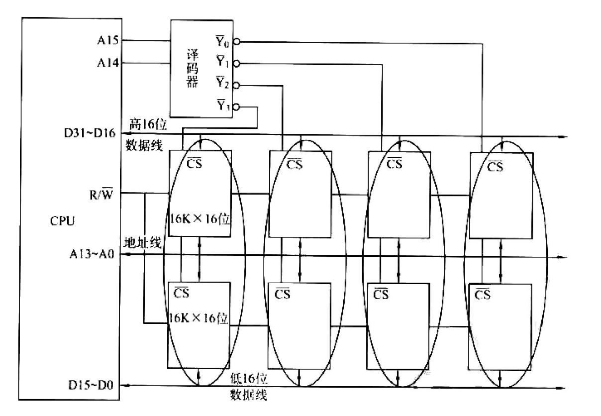
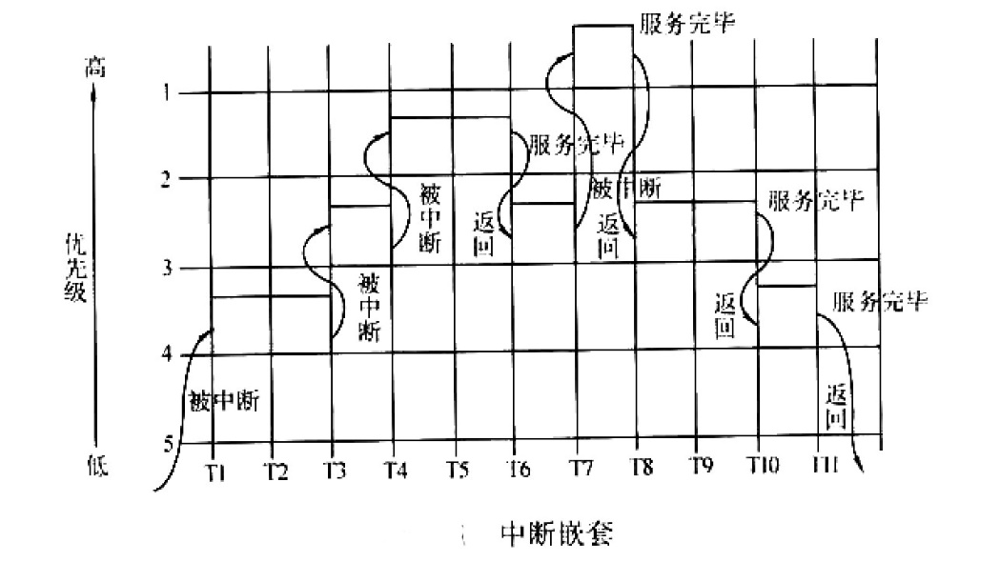
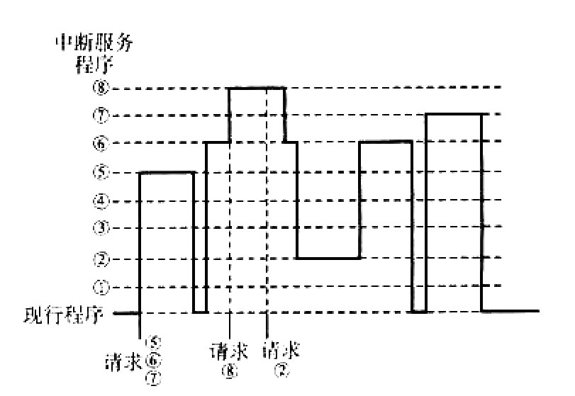

# 网传试卷（2021、2022）

整理自 `网上找的所谓的历年题/2021年吉林大学软件工程专业《计算机组成原理》科目期末试卷A(有答案).docx` 和 `2022年吉林大学软件工程专业《计算机组成原理》科目期末试卷A(有答案) (1).docx`。

这两份是网上流传的"模拟卷"，不少题直接来自考研 408 真题和唐朔飞教材习题，不一定是吉大真实考过的卷子。课程目录 README 里学长的说法是，实际考试的大题"跟文件中的所谓的'2022年……'挺像的，但是难度比这个大"。原卷答案逐题核对过，错误在原处标了"更正"；原卷的上标、下标在转换时丢了（比如 $2^{10}$ 变成 210），已补回。

## 2021 年卷 A

### 一、选择题

1. 一个存储器系统中常同时包含 ROM 和 RAM。用 1K×8 位的 ROM 芯片和 1K×4 位的 RAM 芯片，组成 4K×8 位的 ROM 和 1K×8 位的 RAM 存储系统，按先 ROM 后 RAM 编址。采用 3-8 译码器选片，译码输出信号为 Y0～Y7，其中 Y4 选择的是（ ）。
   A. 第一片 ROM　B. 第五片 ROM　C. 第一片 RAM　D. 第一片 RAM 和第二片 RAM
2. 下列关于 Cache 和虚拟存储器的说法中，错误的有（ ）。
   Ⅰ. 当 Cache 失效（即不命中）时，处理器将会切换进程，以更新 Cache 中的内容
   Ⅱ. 当虚拟存储器失效（如缺页）时，处理器将会切换进程，以更新主存中的内容
   Ⅲ. Cache 和虚拟存储器由硬件和 OS 共同实现，对应用程序员均是透明的
   Ⅳ. 虚拟存储器的容量等于主存和辅存的容量之和
   A. Ⅰ、Ⅳ　B. Ⅲ、Ⅳ　C. Ⅰ、Ⅱ、Ⅲ　D. Ⅰ、Ⅲ、Ⅳ（A、B 两项原文字符残缺，按常见题面补全）
3. 若 x=103，y=−25，则下列表达式采用 8 位定点补码运算时，会发生溢出的是（ ）。
   A. x+y　B. −x+y　C. x−y　D. −x−y（更正：原文 D 项与 C 项重复写作"x−y"）
4. 某计算机字长 32 位，按字节编址，采用小端（Little Endian）方式存放数据。一个 double 型变量的机器数为 1122334455667788H，存放在 00008040H 开始的连续存储单元中，则存储单元 00008046H 中存放的是（ ）。
   A. 22H　B. 33H　C. 66H　D. 77H
5. 常用的（n，k）海明码中，冗余位的位数为（ ）。
   A. n+k　B. n−k　C. n　D. k
6. 在（ ）结构中，外部设备可以和主存储器单元统一编址。
   A. 单总线　B. 双总线　C. 三总线　D. 以上都可以
7. 一次总线事务中，主设备只需给出一个首地址，从设备就能从首地址开始的若干连续单元读出或写入多个数据。这种总线事务方式称为（ ）。
   A. 并行传输　B. 串行传输　C. 突发传输　D. 同步传输
8. 下列选项中，能缩短程序执行时间的措施是（ ）。
   Ⅰ. 提高 CPU 时钟频率　Ⅱ. 优化数据通路结构　Ⅲ. 对程序进行编译优化
   A. 仅Ⅰ、Ⅱ　B. 仅Ⅰ、Ⅲ　C. 仅Ⅱ、Ⅲ　D. Ⅰ、Ⅱ、Ⅲ
9. 在计算机系统中，表明系统运行状态的部件是（ ）。
   A. 程序计数器　B. 指令寄存器　C. 程序状态字　D. 累加寄存器
10. 下列关于超标量流水线特性的叙述中，正确的是（ ）。
    Ⅰ. 能缩短流水线功能段的处理时间　Ⅱ. 能在一个时钟周期内同时发射多条指令　Ⅲ. 能结合动态调度技术提高指令执行并行性
    A. 仅Ⅱ　B. 仅Ⅰ、Ⅲ　C. 仅Ⅱ、Ⅲ　D. Ⅰ、Ⅱ、Ⅲ（更正：原文 C 项作"仅Ⅰ、Ⅱ"，与答案 C 对不上；这道题出自 408 真题，C 项是"仅Ⅱ、Ⅲ"）
11. 下列说法中正确的是（ ）。
    A. 采用微程序控制器是为了提高速度　B. 控制存储器采用高速 RAM 电路组成　C. 微指令计数器决定指令的执行顺序　D. 一条微指令放在控制存储器的一个单元中
12. 变址寄存器 R 的内容为 1000H，指令中的形式地址为 2000H；地址 1000H 中的内容为 2000H，地址 2000H 中的内容为 3000H，地址 3000H 中的内容为 4000H，则变址寻址方式下访问到的操作数是（ ）。
    A. 1000H　B. 2000H　C. 3000H　D. 4000H
13. 寄存器 R 中的数值为 200，主存地址为 200 和 300 的单元中存放的内容分别是 300 和 400，则（ ）访问到的操作数为 200。
    Ⅰ. 直接寻址 200　Ⅱ. 寄存器间接寻址 (R)　Ⅲ. 存储器间接寻址 (200)　Ⅳ. 寄存器寻址 R
    A. Ⅰ、Ⅳ　B. Ⅱ、Ⅲ　C. Ⅲ、Ⅳ　D. 只有Ⅳ
14. 某机有 4 级中断，优先级从高到低为 1→2→3→4。修改后 1 级中断的屏蔽字为 1011，2 级为 1111，3 级为 0011，4 级为 0001，则修改后的优先顺序从高到低为（ ）。
    A. 3→2→1→4　B. 1→3→4→2　C. 2→1→3→4　D. 2→3→1→4
15. 隐指令指（ ）。
    A. 操作数隐含在操作码中的指令　B. 在一个机器周期里完成全部操作的指令　C. 隐含地址码的指令　D. 指令系统中没有的指令

答案（原卷答案全部正确，理由为整理补充）：

| 题 | 答案 | 理由 |
| --- | --- | --- |
| 1 | D | 4 片 ROM 用 Y0～Y3；1K×8 位 RAM 要 2 片 1K×4 位做位扩展，两片同时选中，都接 Y4 |
| 2 | D | Ⅰ错，Cache 缺失由硬件调块，不切换进程；Ⅲ错，Cache 全由硬件实现；Ⅳ错，虚存容量受虚拟地址位数限制；Ⅱ对，缺页要等 I/O，可切换进程 |
| 3 | C | 8 位补码范围 −128～+127，x−y = 128 溢出；−x+y = −128 恰好不溢出 |
| 4 | A | 小端从 8040H 起依次存 88、77、66、55、44、33、22、11，8046H 为 22H |
| 5 | B | n 为码长，k 为信息位 |
| 6 | A | |
| 7 | C | |
| 8 | D | |
| 9 | C | |
| 10 | C | 超标量不缩短单段时间，Ⅰ错 |
| 11 | D | |
| 12 | D | EA = 1000H+2000H = 3000H，操作数为 (3000H) = 4000H |
| 13 | D | Ⅰ、Ⅱ得 300，Ⅲ得 400，只有Ⅳ得 200 |
| 14 | C | 屏蔽字里 1 越多优先级越高：2 级 1111 > 1 级 1011 > 3 级 0011 > 4 级 0001 |
| 15 | D | |

### 二、填空题

16. 主存储器的性能指标主要是存储容量、存取时间、______ 和 ______。
17. 主存储器容量通常以 KB 表示，其中 K=______；硬盘容量通常以 GB 表示，其中 G=______。
18. 数控机床是计算机在 ______ 方面的应用，邮局把信件自动分拣是在计算机 ______ 方面的应用。
19. PCI 总线是当前流行的总线。它是一个高 ______ 且与 ______ 无关的标准总线。
20. 字节多路通道可允许多个设备进行 ______ 型操作，数据传送单位是 ______。
21. CPU 能直接访问 ______ 和 ______，但不能直接访问磁盘和光盘。
22. 堆栈是一种特殊的 ______ 寻址方式，它采用 ______ 原理。按构造不同，分为寄存器堆栈和 ______ 堆栈。
23. 虚拟存储器指的是 ______ 层次，它给用户提供了一个比实际 ______ 空间大得多的 ______ 空间。
24. 对存储器的要求是 ______、______、______。为了解决这三个方面的矛盾，计算机采用多级存储器体系结构。
25. 按照总线仲裁电路的位置不同，可分为 ______ 仲裁和 ______ 仲裁。

答案：16. 存储周期，存储器带宽；17. $2^{10}$，$2^{30}$；18. 自动控制，人工智能；19. 带宽，处理器；20. 传输，字节；21. Cache，主存；22. 数据，先进后出，存储器；23. 主存-外存，主存，虚拟地址；24. 容量大，速度快，成本低；25. 集中式，分布式。

### 三、名词解释题

- 26. 编译程序：将高级语言程序转换成机器语言程序的计算机软件。
- 27. CCD：电荷耦合器件，用于图像输入。
- 28. EPROM：可擦写可编程的 ROM，可以被用户编程多次，靠紫外线激发浮置栅上的电荷来擦除。
- 29. 主设备：获得总线控制权的设备。

原卷答案还多给了两个词，一并保留：

- EEPROM：电可擦写可编程的 ROM，能用电子方法擦除其中的内容。
- SDRAM：同步型动态随机访问存储器，在系统时钟控制下进行数据读写。

### 四、简答题

**30. 何谓通用串口 I/O 标准接口 IEEE1394？简述其性能特点。**

答：IEEE1394 是串行 I/O 标准接口。与 SCSI 并行 I/O 接口相比，它的数据传输速率更高，数据传送的实时性更好，体积更小，连接更方便。它的一个重要特点是各被连接设备的关系是平等的，不用 PC 介入也能自成系统。IEEE1394 已成为英特尔、微软等公司联手制定的 PC98 系统设计指南的新标准。

**31. 中断隐指令及其功能？**

答：中断隐指令是机器指令系统中没有的指令，是 CPU 在中断周期内由硬件自动完成的一条指令。功能包括保护程序断点、寻找中断服务程序入口地址、关中断等。

**32. 存储器的层次结构主要体现在什么地方？为什么要分这些层次？计算机如何管理这些层次？**

答：

- 层次结构主要体现在 **Cache-主存** 和 **主存-辅存** 两个层次上。
- Cache-主存层次对 CPU 访存起加速作用：整体看，CPU 访存速度接近 Cache，寻址空间和位价却接近主存。主存-辅存层次起扩容作用：程序员看到的存储器容量和位价接近辅存，速度接近主存。两个层次合起来，整个存储系统达到速度快、容量大、位价低的效果。
- 管理：主存与 Cache 之间的信息调度全部由硬件自动完成；主存与辅存层次广泛采用虚拟存储技术，把主存和辅存的一部分通过软硬件结合组成虚拟存储器，程序员用比主存大得多的虚拟地址空间编程，运行时由软硬件自动完成虚拟地址到物理地址的转换。这两个层次的调度对程序员都是透明的。

**33. 什么是刷新存储器？其存储容量与什么因素有关？**

答：为了不断提供刷新图像的信号，必须把一帧图像信息存储在刷新存储器中，也叫视频存储器。其存储容量由图像的**分辨率和灰度级**决定，分辨率越高、灰度级越多，刷新存储器容量越大。（更正：原答案前一句只写"由图像灰度级决定"，和后一句"分辨率越高……容量越大"不一致；另"一顿图像"是"一帧图像"的错字。）

### 五、计算题

**34. 一台 8 位微机的地址总线为 16 条，其 RAM 存储器容量为 32KB，首地址为 4000H，且地址是连续的，可用的最高地址是多少？**

答：32KB 占 15 条地址线，从 0000H 起的范围是 0000H～7FFFH。首地址后移到 4000H，最高地址也相应后移：4000H + 7FFFH = **BFFFH**。

**35. 用一个时钟频率为 40MHz 的处理器执行标准测试程序，它所包含的混合指令数和响应所需的时钟周期见下表。试求有效的 CPI、MIPS 速率和程序的执行时间（假设有 N 条指令）。**

| 指令类型 | CPI | 指令混合比 |
| --- | --- | --- |
| 算术和逻辑 | 1 | 60% |
| 高速缓存命中的访存 | 2 | 18% |
| 转移 | 4 | 12% |
| 高速缓存失效的访存 | 8 | 10% |

答：

- CPI 是 4 种指令时钟周期数的加权平均：CPI = 1×60% + 2×18% + 4×12% + 8×10% = **2.24**。
- 时钟频率 40MHz 即每秒 40M 个时钟周期，MIPS = 40/CPI = 40/2.24 ≈ **17.9**。
- 执行时间 = 指令数 × CPI × 时钟周期 = N × 2.24 × 1/40MHz = $5.6N\times10^{-8}$ s。

**36. 某彩色图形显示器，屏幕分辨率为 640 像素×480 像素，共有 4 色、16 色、256 色和 65536 色 4 种显示模式。1）试给出每个像素的颜色数 m 和每个像素所占用存储器的比特数 n 之间的关系。2）显示缓冲存储器的容量是多少？**

答：

1. 每个像素占的位数取决于要表示多少种颜色：$n=\log_2 m$。
2. 显示缓冲存储器按最高颜色数（65536 色，16 位）设计：640 × 480 × 16 bit / 8 = 614400 B。原答案写"≈615KB"，是按 1KB=1000B 算的；按 1KB=1024B 算正好是 **600KB**。

### 六、综合题

**37. 用 16K×16 位的 SRAM 芯片构成 64K×32 位的存储器。要求画出该存储器的组成逻辑框图。**

答：所需芯片 (64K×32)/(16K×16) = 8 片。每 2 片并联做位扩展，组成 1 个 16K×32 位的模块，共 4 个模块做字扩展。16K = $2^{14}$，A13～A0 接各芯片地址端；A15、A14 经 2-4 译码器产生 4 个片选信号，每个模块的两片共用一个 $\overline{\text{CS}}$。每个模块上片接 D31～D16，下片接 D15～D0，R/$\overline{\text{W}}$ 接所有芯片。



**38. 某程序中有如下循环代码段 P：`for(int i=0; i<N; i++) sum+=A[i];`。假设编译时变量 sum 和 i 分别分配在寄存器 R1 和 R2 中，常量 N 在寄存器 R6 中，数组 A 的首地址在寄存器 R3 中。程序段 P 起始地址为 0804 8100H，对应的汇编代码和机器代码见下表。**

| 编号 | 地址 | 机器代码 | 汇编代码 | 注释 |
| --- | --- | --- | --- | --- |
| 1 | 08048100H | 00022080H | `loop: sll R4,R2,2` | (R2)<<2 → R4 |
| 2 | 08048104H | 00083020H | `add R4,R4,R3` | (R4)+(R3) → R4 |
| 3 | 08048108H | 8C850000H | `load R5,0(R4)` | ((R4)+0) → R5 |
| 4 | 0804810CH | 00250820H | `add R1,R1,R5` | (R1)+(R5) → R1 |
| 5 | 08048110H | 20420001H | `add R2,R2,1` | (R2)+1 → R2 |
| 6 | 08048114H | 1446FFFAH | `bne R2,R6,loop` | if (R2)!=(R6) goto loop |

计算机 M 采用 32 位定长指令字，分支指令 bne 格式为：OP（31～26 位）| Rs（25～21）| Rd（20～16）| OFFSET（15～0），OFFSET 为补码表示的偏移量。回答下列问题并说明理由：

1）M 的存储器编址单位是什么？

2）已知 sll 指令实现左移功能，数组 A 中每个元素占多少位？

3）表中 bne 指令的 OFFSET 字段的值是多少？已知 bne 采用相对寻址，当前 PC 内容为 bne 指令地址，通过分析表中指令地址和 bne 指令内容，推断 bne 指令的转移目标地址计算公式。

4）若 M 采用"按序发射、按序完成"的 5 级指令流水线：IF（取指）、ID（译码及取数）、EXE（执行）、MEM（访存）、WB（写回寄存器），硬件不采取任何转发措施，分支指令的执行均引起 3 个时钟周期的阻塞，则 P 中哪些指令会由于数据相关而发生流水线阻塞？哪条指令会发生控制冒险？为什么指令 1 的执行不会因为与指令 5 的数据相关而发生阻塞？

答：

1. 指令字长 32 位即 4 字节，表中相邻指令地址差 4，所以一个地址单位是 1 字节，**按字节编址**。
2. 下标 i 左移 2 位即乘 4，数组元素的地址间隔是 4 个单位，每个元素占 4 字节，即 **32 位**。
3. bne 机器码 1446FFFAH，低 16 位 OFFSET = FFFAH，补码值为 **−6**。执行 bne 时 PC 自动加 4 得 08048118H，目标是 08048100H，相差 −18H 即 −24，−24/(−6) = 4，所以目标地址公式为 **(PC) + 4 + OFFSET × 4**。
4. 数据相关导致阻塞的是指令 **2、3、4、6**，它们各自用到前一条指令刚写的寄存器（R4、R4、R5、R2）。指令 **6**（bne）会发生控制冒险。本次循环的指令 5 与下次循环的指令 1 虽有数据相关（R2），但 bne 之后有 3 个时钟周期的阻塞，指令 1 进入译码取数时指令 5 已经写回，相关自然消除。

**39. 下图是从时间角度观察到的中断嵌套。这个中断系统可实现几重中断？分析图中的中断过程。**



答：该中断系统可以实现 **5 重中断**。优先权 1 最高，现行程序运行在最低优先权（不妨设为 6）。图中出现了 4 重中断，过程如下：

- T1：现行程序被优先权 4 的中断源打断，进入 4 级中断服务。
- T3：4 级服务未结束，响应优先权 3 的中断。
- T4：3 级服务被优先权 2 的中断打断。
- T6：2 级服务完毕，返回 3 级服务。
- T7：优先权 1 的中断请求被响应；T8 服务完毕，返回 3 级服务。
- T10：3 级服务结束，返回 4 级服务。
- T11：4 级服务结束，返回现行程序。

优先权 3 的服务程序被打断了 2 次；优先权 5 的中断请求没有发生。

## 2022 年卷 A

### 一、选择题

1. 用 1K×8 位 ROM 和 1K×4 位 RAM 组成 4K×8 位 ROM 和 1K×8 位 RAM，Y4 选择的是（ ）。题目与选项同 2021 卷第 1 题。
2. 主存按字节编址，地址从 0A4000H 到 0CBFFFH，共有（ ）字节；若用存储容量为 32K×8 位的存储芯片构成该主存，至少需要（ ）片。
   A. 80K，2　B. 96K，2　C. 160K，5　D. 192K，5（原文 D 项误标为 C）
3. 计算机（ ）负责指令译码。
   A. 算术逻辑单元　B. 控制单元（或者操作码译码器）　C. 存储器电路　D. 输入/输出译码电路
4. 编译器对某条语句可以生成两种不同的指令序列，A、B、C 三类指令的 CPI 和两个序列所含的指令条数见下表。以下结论错误的是（ ）。

   | 指令类 | CPI | 序列一的指令条数 | 序列二的指令条数 |
   | --- | --- | --- | --- |
   | A | 1 | 2 | 4 |
   | B | 2 | 1 | 1 |
   | C | 3 | 2 | 1 |

   Ⅰ. 序列一比序列二少 1 条指令　Ⅱ. 序列一比序列二的执行速度快　Ⅲ. 序列一的总时钟周期数比序列二多 1 个　Ⅳ. 序列一的 CPI 比序列二的 CPI 大
   A. Ⅰ、Ⅱ　B. Ⅰ、Ⅲ　C. Ⅱ、Ⅳ　D. Ⅱ
5. CPU 中不包括（ ）。
   A. 操作码译码器　B. 指令寄存器　C. 地址译码器　D. 通用寄存器
6. 下列有关总线定时的叙述中，错误的是（ ）。
   A. 异步通信方式中，全互锁协议最慢　B. 异步通信方式中，非互锁协议的可靠性最差　C. 同步通信方式中，同步时钟信号可由各设备提供　D. 半同步通信方式中，握手信号的采样由同步时钟控制
7. 总线的半同步通信方式是（ ）。
   A. 既不采用时钟信号，也不采用握手信号　B. 只采用时钟信号，不采用握手信号　C. 不采用时钟信号，只采用握手信号　D. 既采用时钟信号，又采用握手信号
8. 流水线计算机中，下列语句发生的数据相关类型是（ ）。

   ```text
   ADD R1, R2, R3    ; (R2)+(R3)→R1
   ADD R4, R1, R5    ; (R1)+(R5)→R4
   ```

   A. 写后写　B. 读后写　C. 写后读　D. 读后读
9. 在微程序控制器中，微程序的入口微地址是通过（ ）得到的。
   A. 程序计数器 PC　B. 前条微指令　C. PC+1　D. 指令操作码映射
10. 在中断周期，CPU 主要完成以下工作（ ）。
    A. 关中断，保护断点，发中断响应信号并形成中断服务程序入口地址　B. 开中断，保护断点，发中断响应信号并形成中断服务程序入口地址　C. 关中断，执行中断服务程序　D. 开中断，执行中断服务程序
11. 禁止中断的功能可以由（ ）来完成。
    A. 中断触发器　B. 中断允许触发器　C. 中断屏蔽触发器　D. 中断禁止触发器
12. 用海明码对长度为 8 位的数据进行检/纠错时，若能纠正一位错，则校验位数至少为（ ）。
    A. 2　B. 3　C. 4　D. 5
13. 变量 i、f、d 的类型分别为 int、float、double（int 用补码表示，float 和 double 用 IEEE754 单精度和双精度格式表示），已知 i=785，f=1.5678e3，d=1.5e100。在 32 位机器中执行下列关系表达式，结果为真的是（ ）。
    Ⅰ. `i == (int)(float)i`　Ⅱ. `f == (float)(int)f`　Ⅲ. `f == (float)(double)f`　Ⅳ. `(d+f)-d == f`
    A. 仅Ⅰ、Ⅱ　B. 仅Ⅰ、Ⅲ　C. 仅Ⅱ、Ⅲ　D. 仅Ⅲ、Ⅳ
14. 某计算机有 16 个通用寄存器，采用 32 位定长指令字，操作码字段（含寻址方式位）为 8 位，Store 指令的源操作数和目的操作数分别采用寄存器直接寻址和基址寻址方式。若基址寄存器可使用任一通用寄存器，且偏移量用补码表示，则 Store 指令中偏移量的取值范围是（ ）。
    A. −32768～+32767　B. −32767～+32768　C. −65536～+65535　D. −65535～+65536
15. 变址寻址访问到的操作数（R=1000H，形式地址 2000H……）。题目与选项同 2021 卷第 12 题。

答案（原卷答案全部正确，理由为整理补充）：

| 题 | 答案 | 理由 |
| --- | --- | --- |
| 1 | D | 同 2021 卷 |
| 2 | C | 0CBFFFH−0A4000H+1 = 28000H = 160K；160K/32K = 5 片 |
| 3 | B | |
| 4 | D | 序列一 5 条指令、10 个时钟周期、CPI=2；序列二 6 条、9 个周期、CPI=1.5。序列一周期更多，执行更慢，只有Ⅱ错 |
| 5 | C | 地址译码器在存储器里 |
| 6 | C | 同步时钟由统一的时钟源提供 |
| 7 | D | |
| 8 | C | 第一条写 R1，第二条读 R1 |
| 9 | D | |
| 10 | A | |
| 11 | B | |
| 12 | C | $2^k\ge8+k+1$，k=4 |
| 13 | B | 785 能被 float 精确表示，Ⅰ真；1567.8 取整丢小数，Ⅱ假；float 转 double 再转回不丢精度，Ⅲ真；d+f 时 f 被大数吃掉，Ⅳ假 |
| 14 | A | 32−8−4−4 = 16 位偏移量 |
| 15 | D | 同 2021 卷 |

### 二、填空题

16. 堆栈是一种特殊的 ______ 寻址方式，它采用 ______ 原理。按构造不同，分为寄存器堆栈和 ______ 堆栈。
17. 为了运算器的高速性，采用了 ______ 进位，______ 乘除法，______ 等并行技术措施。
18. DMA 控制器采用以下三种方法：______、______、______。
19. 形成指令地址的方式，称为指令寻址方式，有顺序寻址和 ______ 寻址两种，使用 ______ 来跟踪。
20. 计算机软件一般分为两大类：一类叫 ______，另一类叫 ______，操作系统属于 ______ 类。
21. 汉字的 ______、______、______ 是计算机用于汉字输入、内部处理、输出三种不同用途的编码。
22. 不同的 CRT 显示标准所支持的最大 ______ 和 ______ 数目是不同的。
23. 主存储器的性能指标主要是存储容量、存取时间、______ 和 ______。
24. 外围设备大体分为输入设备、输出设备、______ 设备、______ 设备、______ 设备五大类。
25. 计算机软件一般分为两大类：一类叫 ______，另一类叫 ______，操作系统属于 ______ 类。（与第 20 题重复）

答案：16. 数据，先进后出，存储器；17. 先行，阵列，流水线；18. 停止 CPU 访问主存，周期挪用，DMA 和 CPU 交替访存；19. 跳跃，程序计数器；20. 系统软件，应用软件，系统软件；21. 输入编码（输入码），内码（机内码），字模码；22. 分辨率，颜色；23. 存储周期，存储器带宽；24. 外存，数据通信，过程控制；25. 系统程序，应用程序，系统程序。

### 三、名词解释题

- 26. CD-ROM：计算机中只读型光盘的主要标准。
- 27. 微地址：微指令在控制存储器中的存储地址。（原答案"微每时令"为"微指令"之误）
- 28. 辅存：一般通过输入输出部件连接到主存储器的外围设备，成本低，存储时间长。
- 29. 绝对转移：一种形成转移目标地址的方式，转移指令的目标地址由有效地址直接指定，与 PC 的内容无关。

### 四、简答题

**30. 什么是指令字长、机器字长和存储字长？**

原答案只写了机器字长：CPU 一次能处理数据的位数，通常与 CPU 的寄存器位数有关。

另外两个（整理补充，取自简答题汇总）：指令字长是一个指令字中包含二进制代码的总位数；存储字长是一个存储单元存放二进制代码的位数。

**31. 什么叫指令？什么叫微指令？二者有什么关系？**

答：指令即机器指令，每一条指令可以完成一个独立的算术运算或逻辑运算操作。控制部件通过控制线向执行部件发出的各种控制命令叫微命令，一组实现一定操作功能的微命令的组合构成一条微指令。许多条微指令组成的序列构成微程序，微程序完成对一条指令的解释执行。

**32. 说明总线结构对计算机系统性能的影响。**

答：

1. 最大存储容量：单总线系统中，最大内存容量必须小于由计算机字长所决定的可能的地址总数；双总线系统中，存储容量不会受外围设备数量的影响。
2. 指令系统：双总线系统必须有专门的 I/O 指令；单总线系统访问内存和 I/O 使用相同的指令。
3. 吞吐量：总线数量越多，吞吐能力越大。

**33. 计算机指令中一般包含哪些字段？各有什么作用？**

答：包含操作码和地址码。操作码表示操作的类型；地址码一般表示操作数和操作结果的存储位置。更完整的三字段答法（操作码、寻址特征、地址码）见 `10 简答题精编（唐朔飞教材）.md` 第 40 题。

### 五、计算题

**34. 某计算机采用 5 级指令流水线，如果每级执行时间是 2ns，求理想情况下该流水线的加速比和吞吐率。**

答：加速比是采用流水线时的指令执行速度与等效的非流水线执行速度之比，理想情况下等于流水线级数，即 **5**。吞吐率是每秒能处理的指令条数，每 2ns 完成一条指令，最大吞吐率为 1/2ns = $5\times10^8$ 条/秒。

**35. 时钟频率 40MHz 的处理器执行标准测试程序，求 CPI、MIPS 和执行时间。**

题目、表格和答案都与 2021 卷第 35 题相同：CPI = 2.24，MIPS ≈ 17.9，执行时间 $5.6N\times10^{-8}$ s。

**36. 某 32 位计算机，CPU 主频为 800MHz，Cache 命中时的 CPI 为 4，Cache 块大小为 32B；主存采用 8 体交叉存储方式，每个体的存储字长为 32 位、存储周期为 40ns；存储器总线宽度为 32 位，总线时钟频率为 200MHz，支持突发传送总线事务。每次读突发传送总线事务的过程包括送首地址和命令、存储器准备数据和传送数据。每次突发传送 32B，传送地址或 32 位数据均需一个总线时钟周期。回答下列问题，要求给出理由或计算过程。**

1）CPU 和总线的时钟周期各为多少？总线的带宽（即最大数据传输率）为多少？

2）Cache 缺失时，需要用几个读突发传送总线事务来完成一个主存块的读取？

3）存储器总线完成一次读突发传送总线事务所需的时间是多少？

4）若程序 BP 执行过程中共执行了 100 条指令，平均每条指令需进行 1.2 次访存，Cache 缺失率为 5%，不考虑替换等开销，则 BP 的 CPU 执行时间是多少？

答：

1. CPU 时钟周期 = 1/800MHz = 1.25ns；总线时钟周期 = 1/200MHz = 5ns；总线带宽 = 4B × 200MHz = 800MB/s（或 4B/5ns）。
2. 每次读突发传送 32B，Cache 块大小恰好 32B，只需 **1 个**读突发传送总线事务。
3. 一次读突发事务包括一次地址传送和 32B（8 个 32 位字）数据传送。传地址用 1 个总线时钟周期 5ns。按低位交叉存储器的工作原理，8 个字全部读出需要 40ns + (8−1)×5ns = 75ns；从第 40ns 起数据的读取和传输可以重叠，只需再加上最后一个体读出数据的传输时间 5ns。总时间 5 + 75 + 5 = **85ns**。

   另一种常见算法（整理补充）：送地址 5ns + 存储器准备数据 40ns + 传送 8 个字各占 1 个总线周期共 40ns = 85ns，结果相同。
4. CPU 执行时间 = Cache 命中时的指令执行时间 + Cache 缺失带来的额外开销。命中时：100 × 4 × 1.25ns = 500ns；缺失开销：1.2 × 100 × 5% × 85ns = 510ns。合计 **1010ns**。

### 六、综合题

**37. 在一个 8 级中断系统中，硬件中断响应从高到低的优先顺序是 1→2→3→4→5→6→7→8，设置中断屏蔽寄存器后，中断处理的优先顺序变为 1→5→8→3→2→4→6→7。**

1）应如何设置屏蔽码？

2）如果 CPU 在执行一个应用程序时有 5、6、7 级 3 个中断请求同时到达，中断请求 8 在 6 没有处理完以前到达，在处理 8 时中断请求 2 又到达 CPU，试画出 CPU 响应这些中断的顺序示意图。

答：

1）屏蔽码（1 表示屏蔽，列为被屏蔽的中断号）：

| 中断号 | 1 | 2 | 3 | 4 | 5 | 6 | 7 | 8 |
| --- | --- | --- | --- | --- | --- | --- | --- | --- |
| 中断 1 | 1 | 1 | 1 | 1 | 1 | 1 | 1 | 1 |
| 中断 2 | 0 | 1 | 0 | 1 | 0 | 1 | 1 | 0 |
| 中断 3 | 0 | 1 | 1 | 1 | 0 | 1 | 1 | 0 |
| 中断 4 | 0 | 0 | 0 | 1 | 0 | 1 | 1 | 0 |
| 中断 5 | 0 | 1 | 1 | 1 | 1 | 1 | 1 | 1 |
| 中断 6 | 0 | 0 | 0 | 0 | 0 | 1 | 1 | 0 |
| 中断 7 | 0 | 0 | 0 | 0 | 0 | 0 | 1 | 0 |
| 中断 8 | 0 | 1 | 1 | 1 | 0 | 1 | 1 | 1 |

核对方法：每一行把自己和处理次序排在自己后面的中断置 1。例如中断 8 排第 3，后面是 3、2、4、6、7，所以 8 这一行在 2、3、4、6、7、8 列为 1。

2）示意图：



过程：5、6、7 级请求同时到达，CPU 按响应顺序先执行中断服务程序 5；5 执行完回到现行程序，再按响应顺序进入中断服务程序 6。请求 8 到达时，8 的处理优先级高于 6，6 被打断，进入服务程序 8。处理 8 的过程中请求 2 到达，2 的处理优先级低于 8，8 继续执行。8 执行完回到被打断的 6，但 6 马上被请求 2 打断，进入服务程序 2。2 执行完回到 6，6 执行完回到现行程序，再进入服务程序 7。7 执行完回到现行程序，全部处理完毕。

（更正：原答案这段文字里的中断编号全部错乱，如把 6 写成④、把 8 写成③、"问到"应为"回到"，这里按示意图和屏蔽码改正。）

**38. 某指令系统字长 12 位，地址码取 3 位，试提出一种方案，使该系统有 4 条三地址指令、8 条二地址指令、150 条一地址指令。列出操作码的扩展形式并计算操作码的平均长度。**

答：

```text
4 条三地址指令（操作码 3 位）
000 XXX XXX XXX
001 XXX XXX XXX
010 XXX XXX XXX
011 XXX XXX XXX

8 条二地址指令（操作码 6 位）
100 000 XXX XXX
100 001 XXX XXX
  ……
100 111 XXX XXX

150 条一地址指令（操作码 9 位）
101 000 000 XXX ~ 101 111 111 XXX   共 64 条
110 000 000 XXX ~ 110 111 111 XXX   共 64 条
111 000 000 XXX ~ 111 010 101 XXX   共 22 条
```

方案不唯一，只要短操作码不是长操作码的前缀即可，和数据结构里哈夫曼编码的前缀码要求类似。

操作码平均长度 = (3×4 + 6×8 + 9×150) / 162 = 1410/162 ≈ **8.7** 位。

**39. 某计算机的主存地址空间大小为 256MB，按字节编址。指令 Cache 和数据 Cache 分离，均有 8 个 Cache 行，每个 Cache 行大小为 64B，数据 Cache 采用直接映射方式。现有两个功能相同的程序 A 和 B：**

```c
// 程序 A
int a[256][256];
int sum_array1()
{
    int i, j, sum = 0;
    for (i = 0; i < 256; i++)
        for (j = 0; j < 256; j++)
            sum += a[i][j];
    return sum;
}

// 程序 B
int a[256][256];
int sum_array2()
{
    int i, j, sum = 0;
    for (j = 0; j < 256; j++)
        for (i = 0; i < 256; i++)
            sum += a[i][j];
    return sum;
}
```

**int 型数据用 32 位补码表示，i、j、sum 均分配在寄存器中，数组 a 按行优先方式存放，首地址为 320（十进制）。**

1）若不考虑用于 Cache 一致性维护和替换算法的控制位，数据 Cache 的总容量为多少？

2）数组元素 a[0][31] 和 a[1][1] 各自所在的主存块对应的 Cache 行号分别是多少（行号从 0 开始）？

3）程序 A 和 B 的数据访问命中率各是多少？哪个程序的执行时间更短？

答：

1）直接映射下每个 Cache 行由有效位 V、控制位（本题不计）、标记 Tag、数据 Data 组成。主存地址 28 位（$2^{28}$=256MB）：块内地址 6 位（$2^6$=64），占第 5～0 位；块索引 3 位（$2^3$=8），占第 8～6 位；Tag = 28−3−6 = 19 位，占第 27～9 位。每行大小 = 1 + 19 + 64×8 位，8 行总容量 = (1+19+512)×8/8 = **532B**。

2）每个元素 4B，首地址 320：

- a[0][31] 地址 = 320 + 31×4 = 444 = 0001 1011 1100B，第 8～6 位为 110，行号 **6**。
- a[1][1] 地址 = 320 + (256+1)×4 = 1348 = 0101 0100 0100B，第 8～6 位为 101，行号 **5**。

3）

- 程序 A 按行访问，与存放顺序一致。每次不命中调入一块 64B，相当于 16 个整数（首地址 320 恰好是块边界），之后 15 次都命中。命中率 = $(2^{16}-2^{12})/2^{16}$ = **93.75%**。
- 程序 B 按列访问，相邻两次访问相隔一整行（1024B = 16 块），每次访问的块都不在 Cache 里，命中率 **0%**。另一种说法：数组一行 1KB > 64B，访问第 0 列时各元素都不命中；数组有 256 行而数据 Cache 只有 8 行，后续各列仍不命中。
- 从 Cache 读数据比从主存快很多，所以**程序 A 执行时间更短**。

原答案附的分析要点：V、Tag、Data 是每个 Cache 行的必要组成，控制位依设计而定；本题的关键是算对两个数组元素的地址，以及理解数组访问顺序与存放方式对命中率的影响。
