# MIPS 综合设计题（数据通路、流水线、存储层次）

整理自 `../计算机原理与体系结构（by陈广广）/PPT/计算机组成原理复习资料-2023计组课程团队.pdf`（下称"复习资料"）的综合设计题 1、3～7、9、10，`../计算机原理与体系结构（by陈广广）/PPT/讲题20231113.docx` 最后两道大题（就是复习资料综合设计题 9、10），以及 `../计算机原理与体系结构（by陈广广）/题型整理.pdf` 第 14、15、19～34 页的手写解答。题型整理里另外贴了几道课外题（有无转发对比、推后法、5 条指令转发、Cache 地址格式等），也收在对应位置，标为"补充题"。

复习资料 PDF 里设计题 3 的表格没有提取出来，按题型整理第 28 页贴的原题补全。所有结果都重新算过，Cache 命中率那道题用程序按 LRU 模拟核对。综合设计题 2（机器码译码）和 8（9×5 乘法器）在 `30 MIPS 计算题（性能、浮点、乘除法、指令地址）.md`。

## 一、单周期数据通路

方法速查：

教材带跳转的单周期数据通路（就是题型整理第 21、34 页贴的那张图）各部件连接如下。画图题照这个画，控制信号名沿用教材。

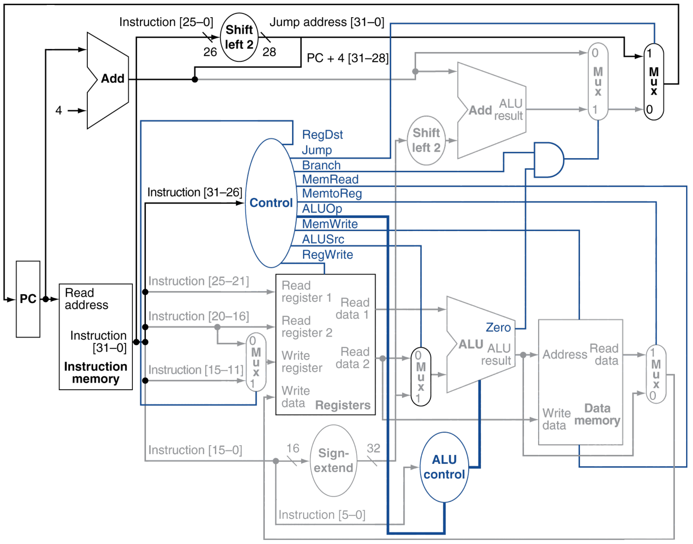

| 部件 | 输入 | 输出去向 |
| --- | --- | --- |
| PC | 跳转选择器的输出 | 指令存储器读地址；PC+4 加法器 |
| 加法器（PC+4） | PC、常数 4 | 分支选择器 0 端；高 4 位拼进跳转地址 |
| 指令存储器 | 读地址 | 指令 [31-26] 送控制单元，[25-21]、[20-16]、[15-11]、[15-0]、[5-0]、[25-0] 分送各处 |
| 寄存器堆 | 读寄存器 1 ← [25-21]；读寄存器 2 ← [20-16]；写寄存器 ← RegDst 选择器（0 选 [20-16]，1 选 [15-11]）；写数据 ← MemtoReg 选择器；RegWrite | 读数据 1 送 ALU；读数据 2 送 ALUSrc 选择器 0 端和数据存储器写数据端 |
| 符号扩展 | [15-0]（16 位） | 32 位，送 ALUSrc 选择器 1 端和分支用的左移 2 位 |
| ALU 控制 | ALUOp、funct [5-0] | 4 位 ALU 操作码 |
| ALU | 读数据 1、ALUSrc 选择器输出 | Zero 送与门；ALU 结果送数据存储器地址端和 MemtoReg 选择器 0 端 |
| 数据存储器 | 地址、写数据、MemRead、MemWrite | 读数据送 MemtoReg 选择器 1 端 |
| 左移 2 位 + 加法器（分支） | 符号扩展输出左移 2 位、PC+4 | 分支目标，送分支选择器 1 端（选择端 = Branch 与 Zero） |
| 左移 2 位（跳转） | [25-0]（26 位） | 28 位，拼上 PC+4 [31-28] 得跳转地址，送跳转选择器 1 端（选择端 = Jump） |

各指令的控制信号（整理补充，教材表格）：

| 指令 | RegDst | ALUSrc | MemtoReg | RegWrite | MemRead | MemWrite | Branch | ALUOp | Jump |
| --- | --- | --- | --- | --- | --- | --- | --- | --- | --- |
| R 型 | 1 | 0 | 0 | 1 | 0 | 0 | 0 | 10 | 0 |
| lw | 0 | 1 | 1 | 1 | 1 | 0 | 0 | 00 | 0 |
| sw | X | 1 | X | 0 | 0 | 1 | 0 | 00 | 0 |
| beq | X | 0 | X | 0 | 0 | 0 | 1 | 01 | 0 |
| addi | 0 | 1 | 0 | 1 | 0 | 0 | 0 | 00 | 0 |
| j | X | X | X | 0 | 0 | 0 | X | XX | 1 |

题型整理第 15 页学长手画了这张完整数据通路，有三处和教材不一致，背图时注意：

- 控制信号少了 MemRead，数据存储器也没画读使能。（更正）
- MemtoReg 选择器把存储器读数据画在 0 端、ALU 结果画在 1 端，Jump 选择器把跳转地址画在 0 端，都和教材相反。按手画的接法，这两个信号的有效电平也要反过来。（更正）
- 送进 ALU 控制的线应该是指令 [5-0]，图上标成从 [15-0] 分出来。（更正）

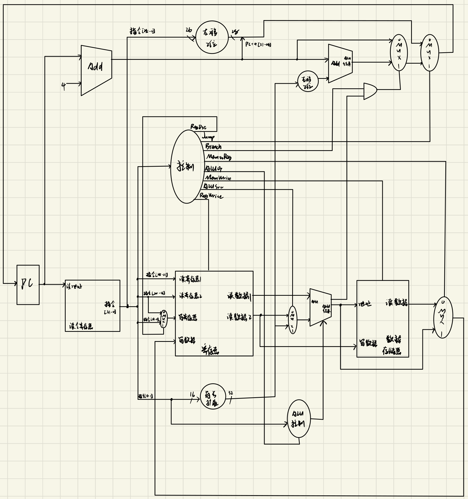

### 补充题：只实现 SW、SUB、ADDIU 的数据通路

题型整理第 14 页。设计一个数据通路，仅实现包含如下三条指令的 MIPS 指令子集：

```text
SW    $s0, $s1, $s2
SUB   $t1, $t2, $t3
ADDIU $t0, $t1, 2
```

画出完整的数据通路图，写出必要的控制信号（高电平有效），并对设计方法作必要说明。

答：

题目里 SW 的写法不是标准 MIPS 语法，下面按 `sw rt, offset(rs)` 理解。

需要的部件：PC、PC+4 加法器、指令存储器、寄存器堆、符号扩展、ALU 和 ALU 控制、数据存储器，外加两个选择器：

- RegDst 选择器：SUB 写 rd（[15-11]），ADDIU 写 rt（[20-16]）。
- ALUSrc 选择器：SUB 的第二个操作数来自寄存器，ADDIU 和 SW 来自符号扩展后的立即数。

三条指令都不转移，PC 只接 PC+4。写回寄存器的只有 SUB 和 ADDIU，数据都来自 ALU 结果，不需要 MemtoReg 选择器。SW 用 ALU 算出的地址访问数据存储器，写入读数据 2。

| 指令 | RegDst | ALUSrc | RegWrite | MemWrite | ALU 操作 |
| --- | --- | --- | --- | --- | --- |
| SUB | 1 | 0 | 1 | 0 | 减 |
| ADDIU | 0 | 1 | 1 | 0 | 加 |
| SW | X | 1 | 0 | 1 | 加 |

如果按字面把 SW 理解成三个寄存器（地址 = `$s1` + `$s2`），SW 这一行的 ALUSrc 改成 0。

（更正：手画的图里没有数据存储器和 MemWrite，ALU 结果直接写回寄存器，实现不了 SW；也没写控制信号表和设计说明。）


### 补充题：单周期处理器执行 lw 时各部件的值

题型整理第 34 页（15 分）。单周期处理器取入指令字 100011 00011 00010 00000 00000 010101 后的一个时钟周期。100011 是 lw，格式为 op(6) | rs(5) | rt(5) | Imm(16)。数据存储器全为 0，寄存器堆初值如下，数据通路为教材带跳转的单周期数据通路。

| r0 | r1 | r2 | r3 | r4 | r5 | r6 | r8 | r12 | r31 |
| --- | --- | --- | --- | --- | --- | --- | --- | --- | --- |
| 0 | −6 | 6 | −4 | 5 | 10 | 5 | 7 | 2 | 3 |

1）符号扩展单元和左移两位单元的输出是什么？ALU 控制单元的输入是什么？指令执行后新的 PC 值是什么？

2）给出每个多路选择器数据输出的值；ALU 和两个加法器数据输入的值；寄存器堆所有输入信号的值。

答：指令拆开是 rs = 00011（r3），rt = 00010（r2），Imm = 0000 0000 0001 0101 = 21。

1）

- 符号扩展输出：0000 0015H（21）。
- 分支用的左移两位输出：0000 0054H（84）。图里还有跳转用的左移两位单元，输入是指令 [25-0]，输出 28 位 188 0054H（整理补充，原笔记没写）。
- ALU 控制单元输入：ALUOp = 00，funct = 指令 [5-0] = 010101。ALUOp 为 00 时 funct 不起作用，输出 0010（加法）。
- 新的 PC：PC+4。

2）

| 项目 | 值 |
| --- | --- |
| RegDst 选择器输出 | 00010（r2） |
| ALUSrc 选择器输出 | 0000 0015H（21） |
| MemtoReg 选择器输出 | 0（访存地址 −4+21 = 17，存储器全 0） |
| 分支选择器输出 | PC+4 |
| 跳转选择器输出 | PC+4 |
| ALU 输入 | −4（r3）和 21，结果 17 |
| PC+4 加法器输入 | PC 和 4 |
| 分支加法器输入 | PC+4 和 84 |
| 寄存器堆输入 | 读寄存器 1 = 00011，读寄存器 2 = 00010，写寄存器 = 00010，写数据 = 0，RegWrite = 1 |

控制信号：RegDst = 0，ALUSrc = 1，MemtoReg = 1，RegWrite = 1，MemRead = 1，MemWrite = 0，Branch = 0，ALUOp = 00，Jump = 0。

（更正：手写原文 RegDst 取 1，RegDst 选择器输出写成 00000（那是 rd 字段），lw 应选 rt，RegDst = 0，输出 00010；MemtoReg 选择器输出空着没写；题目问寄存器堆的输入，原文列成了全部控制信号。）

## 二、流水线

方法速查：

- 5 段流水线 IF、ID、EX、MEM、WB。k 段流水线连续执行 n 条指令，不阻塞时需要 k+n−1 个时钟周期。
- 时钟周期取最慢的那一段。
- 吞吐率 = 指令条数 ÷ 完成所用时间。
- 加速比 = 不用流水线（单周期）执行时间 ÷ 流水线执行时间。各段时间相等时 = $\frac{nk}{k+n-1}$。
- 效率 = $\frac{n}{k+n-1}$，即 n 条指令占用的时空区 ÷ 各段总时空区。
- 数据冒险判断：后面的指令要读前面指令写的寄存器。寄存器"前半周期写、后半周期读"时，读的指令 ID 段最早可以和写的指令 WB 段在同一周期。
- 有转发时，一般的寄存器相关从 EX/MEM 或 MEM/WB 转发，不用阻塞；lw 后面紧跟着用它读出的数据（load-use），要阻塞 1 个周期再转发。
- 分支在 ID 段比较时，如果要用前一条指令刚算出的结果，也要阻塞 1 个周期。
- `$0` 恒为 0，写 `$0` 的指令不会产生转发。

转发线从哪里接出来，看教材这张带转发单元的数据通路：

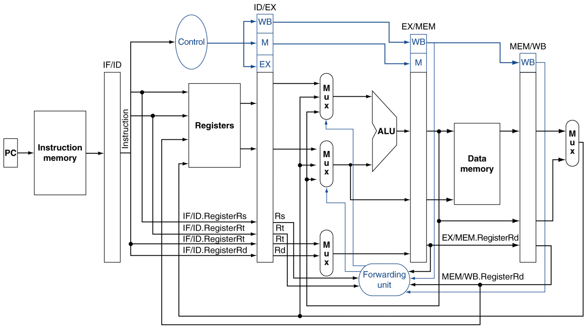

load-use 冒险转发也救不了，要停一拍：


分支在 ID 段比较时，操作数要比 EX 段早一拍备好，停顿也比普通数据冒险多一拍：

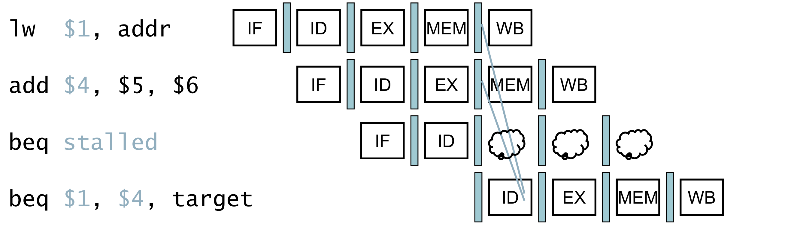

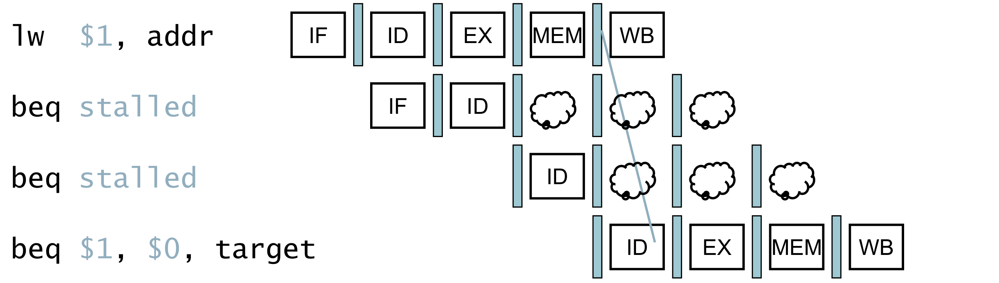

下面时空图里，一条指令两个阶段之间的空格表示在阻塞等待。

### 综合设计题 1：5 条指令带转发的时空图

采用教材给定的 5 段流水线执行以下指令：

```text
LW   $1, 20($2)
SUB  $2, $1, $3
ADD  $0, $1, $2
SW   $2, 100($0)
ADD  $1, $2, $3
```

分析这些指令在采用硬件转发的前提下流水线各段的执行情况，画出能正确执行的时空图（标出转发），计算吞吐率和加速比。

答：

| 指令 | 1 | 2 | 3 | 4 | 5 | 6 | 7 | 8 | 9 | 10 |
| --- | --- | --- | --- | --- | --- | --- | --- | --- | --- | --- |
| `LW $1, 20($2)` | IF | ID | EX | MEM | WB | | | | | |
| `SUB $2, $1, $3` | | IF | ID | | EX | MEM | WB | | | |
| `ADD $0, $1, $2` | | | IF | | ID | EX | MEM | WB | | |
| `SW $2, 100($0)` | | | | | IF | ID | EX | MEM | WB | |
| `ADD $1, $2, $3` | | | | | | IF | ID | EX | MEM | WB |

执行情况和转发：

- SUB 紧跟 LW 使用 `$1`，是 load-use 冒险，阻塞 1 个周期。第 5 周期 LW 读出的数据在 MEM/WB 寄存器里，转发给 SUB 的 EX。
- 第 6 周期 SUB 的结果在 EX/MEM，转发给 `ADD $0` 的 EX（`$2`）。`ADD $0` 的另一个操作数 `$1` 在第 5 周期 ID 时 LW 正好前半周期写回，能直接读到。
- 第 7 周期 SUB 的结果在 MEM/WB，转发给 SW 的 EX 作为写入数据（`$2`）。SW 的基址是 `$0`，恒为 0，`ADD $0` 的结果写不进 `$0`，也不会被转发。
- 最后一条 ADD 第 7 周期 ID，SUB 同一周期前半周期写回 `$2`，能直接读到。

共 10 个时钟周期。设时钟周期为 T：吞吐率 = 5/(10T) = 1/(2T)；单周期执行 5 条指令需 5×5T，加速比 = 25T/10T = **2.5**。

（更正：手写图里画了一条"`ADD $0` → SW"的转发，实际不会发生；SW 真正需要的是第 7 周期从 MEM/WB 转发来的 SUB 结果，图中没标。周期数、吞吐率、加速比没问题。）


### 综合设计题 4：指令序列综合题

```text
L2:   lw   $s3, 4($s2)     # (1)
      add  $s5, $s3, $s1   # (2)
      addi $s7, $s5, 1     # (3)
      beq  $s5, $s6, Exit  # (4)
      sw   $s5, 4($s2)     # (5)
      j    L2              # (6)
Exit:                      # (7)
```

1）写出（1）、（2）、（3）的寻址方式。（3 分）

2）指出指令（4）和（6）的两点区别。（4 分）

3）若指令（1）的地址是 0，指令（6）的地址是多少？（3 分）

4）画出能实现上述指令的简单 MIPS 数据通路（IF、ID、EX、MEM、WB 五个阶段），要有必要的控制信号与选择器。分析指令（1）执行时在 EX 段传递的数据和控制信号。

5）假设寄存器一个周期内可先写后读，EX、MEM 段有转发，分支不成立，画出指令（1）到（5）的流水线时空图，计算吞吐率和加速比。

答：

1）（1）基址寻址；（2）寄存器寻址；（3）立即数寻址。

2）

- 指令（4）是条件转移，相等时才转移；指令（6）是无条件转移。
- 指令（4）把低 16 位符号扩展到 32 位、左移 2 位后与 PC+4 相加得到目标地址；指令（6）把低 26 位左移 2 位得 28 位，再拼上 PC+4 的高 4 位。

3）每条指令占 4 个地址，(6−1)×4 = **20**。

4）数据通路按本文件第一部分的部件表画，控制信号取教材的 9 个。指令（1）`lw $s3, 4($s2)` 在 EX 段：

- 数据：读数据 1（`$s2` 的内容）送 ALU；偏移量 4 符号扩展成 32 位，经 ALUSrc 选择器送 ALU；ALU 结果 `$s2`+4 是访存地址；PC+4 和左移 2 位后的偏移量（16）送分支加法器（lw 用不到）；读数据 2（`$s3` 的旧值，lw 用不到）；rt 字段 10011 经 RegDst 选择器选为写寄存器号。
- 在 EX 段起作用的控制信号：ALUSrc = 1，ALUOp = 00（ALU 控制输出 0010，做加法），RegDst = 0。
- 随流水线寄存器继续往后传的：MEM 段用的 Branch = 0、MemRead = 1、MemWrite = 0；WB 段用的 RegWrite = 1、MemtoReg = 1。

（更正：手写原文列的控制信号是"指令 5-0 位、ALUSrc、Zero、Branch、ALU 控制信号"。Zero 和 Branch 是分支判断用的，lw 时 Branch = 0；funct 在 ALUOp = 00 时不起作用；RegDst 反而漏了。）

5）

| 指令 | 1 | 2 | 3 | 4 | 5 | 6 | 7 | 8 | 9 | 10 |
| --- | --- | --- | --- | --- | --- | --- | --- | --- | --- | --- |
| （1）`lw $s3, 4($s2)` | IF | ID | EX | MEM | WB | | | | | |
| （2）`add $s5, $s3, $s1` | | IF | ID | | EX | MEM | WB | | | |
| （3）`addi $s7, $s5, 1` | | | IF | | ID | EX | MEM | WB | | |
| （4）`beq $s5, $s6, Exit` | | | | | IF | ID | EX | MEM | WB | |
| （5）`sw $s5, 4($s2)` | | | | | | IF | ID | EX | MEM | WB |

- （2）紧跟 lw 使用 `$s3`，load-use，阻塞 1 周期；第 5 周期从 MEM/WB 转发。
- 第 6 周期（2）的结果在 EX/MEM，转发给（3）的 EX。
- 第 7 周期（2）的结果在 MEM/WB，转发给（4）的 EX。
- （5）第 7 周期 ID 时（2）正好写回 `$s5`，能直接读到。

共 10 个周期，吞吐率 = 5/(10T)，加速比 = 5×5T/10T = **2.5**。


### 综合设计题 7：4 段流水线的吞吐率和加速比

指令流水线有 IF（200ps）、ID（190ps）、EX（200ps）、MEMWB（存储器读写和写回，380ps）4 个阶段。20 条指令连续流入，求实际吞吐率和加速比。若重新设计流水线，应怎样改进？改进后各段完成时间是多少？20 条指令流入改进后的流水线，实际吞吐率和加速比是多少？

答：

**原流水线**：时钟周期取最慢段 380ps。20 条指令需 4+20−1 = 23 个周期，共 23×380 = 8740ps。

- 吞吐率 = 20/(8740× $10^{-12}$ s) ≈ $2.29\times10^9$ 条/秒。
- 不用流水线时每条指令 200+190+200+380 = 970ps，20 条共 19400ps。加速比 = 19400/8740 ≈ **2.22**。

**改进**：瓶颈是 380ps 的 MEMWB 段，把它拆成 MEM、WB 两段（各约 190ps），变成 5 段流水线：IF 200ps、ID 190ps、EX 200ps、MEM 约 190ps、WB 约 190ps，时钟周期取 200ps。

- 20 条指令需 5+20−1 = 24 个周期，共 24×200 = 4800ps。
- 吞吐率 = 20/(4800× $10^{-12}$ s) ≈ $4.17\times10^9$ 条/秒。
- 加速比 = 19400/4800 ≈ **4.04**。

也有人用各段等长的理想公式 $\frac{nk}{k+n-1}$ 算加速比：原流水线 80/23 ≈ 3.48，改进后 100/24 ≈ 4.17。两种口径考试时写清楚用的是哪一种就行。

（更正：手写原文原流水线加速比写成 $\frac{20\times380\times5}{23\times380}=4.35$，分子乘了 5，可原流水线只有 4 段。按它自己的公式应为 3.48，按单周期实际时间应为 2.22。两个吞吐率没问题。）

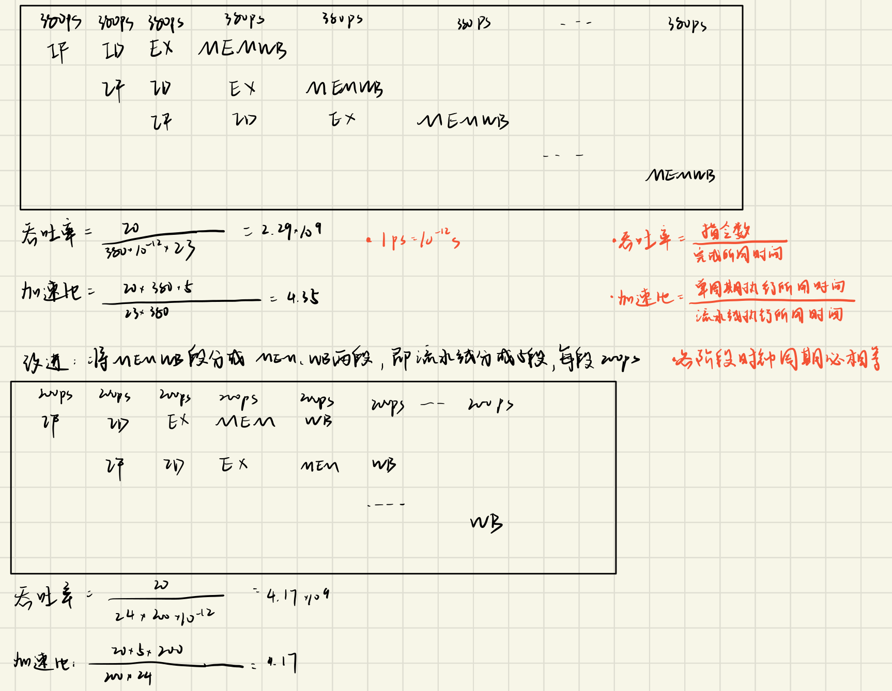

### 综合设计题 9：循环的流水线图（讲题大题 1）

```text
loop: lw   $s1, 0($s2)
      and  $s1, $s1, $s3
      sw   $s1, 0($s2)
      addi $s2, $s2, 4
      beq  $s2, $s5, loop
      add  $s1, $s1, $s4
```

五段流水线 IF、ID、EX、MEM、WB，分支目标地址在 ID 段算出，流水线支持完全旁路，循环结束前迭代了很多次。

9.1 画出循环前两次执行的流水线图。

9.2 第二次循环执行完毕时，流水线的吞吐率是多少？

9.3 上述指令中是否还存在阻塞？如有，怎样进一步改善？

答：

9.1

| 指令 | 1 | 2 | 3 | 4 | 5 | 6 | 7 | 8 | 9 | 10 | 11 | 12 | 13 | 14 | 15 | 16 | 17 | 18 | 19 |
| --- | --- | --- | --- | --- | --- | --- | --- | --- | --- | --- | --- | --- | --- | --- | --- | --- | --- | --- | --- |
| `lw` | IF | ID | EX | MEM | WB | | | | | | | | | | | | | | |
| `and` | | IF | ID | | EX | MEM | WB | | | | | | | | | | | | |
| `sw` | | | | IF | ID | EX | MEM | WB | | | | | | | | | | | |
| `addi` | | | | | IF | ID | EX | MEM | WB | | | | | | | | | | |
| `beq` | | | | | | IF | | ID | EX | MEM | WB | | | | | | | | |
| `add`（被清除） | | | | | | | IF | 清除 | | | | | | | | | | | |
| `lw` | | | | | | | | | IF | ID | EX | MEM | WB | | | | | | |
| `and` | | | | | | | | | | IF | ID | | EX | MEM | WB | | | | |
| `sw` | | | | | | | | | | | | IF | ID | EX | MEM | WB | | | |
| `addi` | | | | | | | | | | | | | IF | ID | EX | MEM | WB | | |
| `beq` | | | | | | | | | | | | | | IF | | ID | EX | MEM | WB |

- and 紧跟 lw 用 `$s1`，load-use，阻塞 1 周期，第 5 周期从 MEM/WB 旁路。
- sw 第 6 周期从 EX/MEM 拿到 and 的结果。
- beq 在 ID 段比较 `$s2`，而 addi 第 7 周期才在 EX 算出新 `$s2`，beq 要等 1 周期，第 8 周期从 EX/MEM 旁路到 ID 段比较。
- beq 在第 8 周期末确定转移，顺序取进来的 add 被清除，第 9 周期取下一轮的 lw。


9.2 设时钟周期为 T，两轮共 10 条指令、19 个周期，吞吐率 = **10/(19T)**。

9.3 还存在阻塞：lw 与 and 之间的 load-use 冒险要停 1 周期；addi 与 beq 之间因为分支在 ID 段比较，也要停 1 周期；分支发生时还要清除 1 条取错的指令。原笔记只提到 load-use，给出的办法是代码重排。

重排示例（整理补充）：

```text
loop: lw   $s1, 0($s2)
      addi $s2, $s2, 4
      and  $s1, $s1, $s3
      sw   $s1, -4($s2)
      beq  $s2, $s5, loop
```

addi 挪到 lw 后面，sw 的偏移改成 −4，访问的还是原来的地址。这样 and 和 lw 隔了一条指令，可以直接旁路，不用阻塞；beq 比较时 addi 已经写回 `$s2`，也不用等。每轮从 8 个周期减到 6 个（5 条指令加 1 条被清除的指令）。如果再用分支预测（预测转移发生），被清除的那条也能省掉。

### 补充题：有转发和无转发的时空图

题型整理第 23 页。指令序列顺序执行，MIPS 流水线分 IF、ID、EX、MEM、WB 五级，时钟周期 100ps。画出无转发和有转发两种情况下的时空图，分别计算流水线执行时间。

```text
lw   $9, 20($8)
sub  $8, $9, $10
addi $9, $8, 1
lw   $10, 20($9)
add  $8, $9, $10
sw   $10, 24($8)
```

答：

无转发（寄存器前半周期写、后半周期读，每处相关停 2 个周期）：

| 指令 | 1 | 2 | 3 | 4 | 5 | 6 | 7 | 8 | 9 | 10 | 11 | 12 | 13 | 14 | 15 | 16 | 17 | 18 | 19 | 20 |
| --- | --- | --- | --- | --- | --- | --- | --- | --- | --- | --- | --- | --- | --- | --- | --- | --- | --- | --- | --- | --- |
| `lw $9, 20($8)` | IF | ID | EX | MEM | WB | | | | | | | | | | | | | | | |
| `sub $8, $9, $10` | | IF | | | ID | EX | MEM | WB | | | | | | | | | | | | |
| `addi $9, $8, 1` | | | | | IF | | | ID | EX | MEM | WB | | | | | | | | | |
| `lw $10, 20($9)` | | | | | | | | IF | | | ID | EX | MEM | WB | | | | | | |
| `add $8, $9, $10` | | | | | | | | | | | IF | | | ID | EX | MEM | WB | | | |
| `sw $10, 24($8)` | | | | | | | | | | | | | | IF | | | ID | EX | MEM | WB |

执行时间 = 20 × 100 = **2000ps**。

有转发（只有两处 load-use 各停 1 个周期）：

| 指令 | 1 | 2 | 3 | 4 | 5 | 6 | 7 | 8 | 9 | 10 | 11 | 12 |
| --- | --- | --- | --- | --- | --- | --- | --- | --- | --- | --- | --- | --- |
| `lw $9, 20($8)` | IF | ID | EX | MEM | WB | | | | | | | |
| `sub $8, $9, $10` | | IF | | ID | EX | MEM | WB | | | | | |
| `addi $9, $8, 1` | | | | IF | ID | EX | MEM | WB | | | | |
| `lw $10, 20($9)` | | | | | IF | ID | EX | MEM | WB | | | |
| `add $8, $9, $10` | | | | | | IF | | ID | EX | MEM | WB | |
| `sw $10, 24($8)` | | | | | | | | IF | ID | EX | MEM | WB |

执行时间 = 12 × 100 = **1200ps**。


### 补充题：推后法与旁路，吞吐率、加速比、效率的上限

题型整理第 24 页（12 分）。五级流水线 IF、ID、EX、MEM、WB，有两条指令：

```text
ADD R1, R2, R3    ; (R2)+(R3) → R1
ADD R4, R1, R5    ; (R1)+(R5) → R4
```

（1）假设对同一寄存器的读写不能在同一周期进行，采用推后法，画出两条指令的时空图。

（2）为了不推迟第 2 条指令的执行，可采用什么措施？说明并画出时空图。

（3）五段每段执行时间都是 Δt，执行 n 条指令且不发生任何相关，计算流水线的吞吐率、加速比和效率，并分析它们的上限。

答：

（1）第 1 条在第 5 周期 WB 写 R1，同一周期不能读，第 2 条的 ID 推到第 6 周期：

| 指令 | 1 | 2 | 3 | 4 | 5 | 6 | 7 | 8 | 9 |
| --- | --- | --- | --- | --- | --- | --- | --- | --- | --- |
| `ADD R1, R2, R3` | IF | ID | EX | MEM | WB | | | | |
| `ADD R4, R1, R5` | | IF | | | | ID | EX | MEM | WB |

共 9 个周期。

（2）采用旁路（定向）技术：把第 1 条指令 EX 段的运算结果直接送到第 2 条指令 EX 段的输入端，不等它写回 R1。

| 指令 | 1 | 2 | 3 | 4 | 5 | 6 |
| --- | --- | --- | --- | --- | --- | --- |
| `ADD R1, R2, R3` | IF | ID | EX | MEM | WB | |
| `ADD R4, R1, R5` | | IF | ID | EX | MEM | WB |

（3）n 条指令需要 (n+4) 个周期。

- 吞吐率 = $\frac{n}{(n+4)\Delta t}$，n→∞ 时上限为 $\frac{1}{\Delta t}$。
- 加速比 = $\frac{5n\Delta t}{(n+4)\Delta t}=\frac{5n}{n+4}$，上限为 5。
- 效率 = $\frac{5n\Delta t}{5(n+4)\Delta t}=\frac{n}{n+4}$，上限为 1。

（更正：手写原文（1）画的图和（2）一模一样，第 2 条指令没有推后；（2）没写出措施名称；（3）把吞吐率上限写成"1"，应为 $1/\Delta t$；效率没答。）


### 补充题：5 条指令带转发（原笔记未完成）

题型整理第 24 页（10 分）。5 段流水线 IF、ID（下降沿读寄存器）、EX、MEM、WB（上升沿就能完成写回）。流水线要执行以下指令（原题写"三条指令"，实际列了五条）：

```text
SUB R10, R5, R1
LW  R11, 0(R10)
SUB R11, R5, R2
ADD R10, R11, R10
SW  R10, 0(R11)
```

分析采用硬件转发时各段的执行情况，画出能正确执行的时空图，计算吞吐率和加速比。

答（手写只抄了前两条指令，以下为整理补充）：

| 指令 | 1 | 2 | 3 | 4 | 5 | 6 | 7 | 8 | 9 |
| --- | --- | --- | --- | --- | --- | --- | --- | --- | --- |
| `SUB R10, R5, R1` | IF | ID | EX | MEM | WB | | | | |
| `LW R11, 0(R10)` | | IF | ID | EX | MEM | WB | | | |
| `SUB R11, R5, R2` | | | IF | ID | EX | MEM | WB | | |
| `ADD R10, R11, R10` | | | | IF | ID | EX | MEM | WB | |
| `SW R10, 0(R11)` | | | | | IF | ID | EX | MEM | WB |

- 第 4 周期：第 1 条的 R10 在 EX/MEM，转发给 LW 的 EX。
- 第 6 周期：ADD 要用 R11，离它最近写 R11 的是第 3 条 SUB（LW 写的 R11 已经被它覆盖）。SUB 的结果在 EX/MEM，直接转发，没有 load-use 冒险。ADD 要用的 R10 由第 1 条在第 5 周期上升沿写回，ADD 同一周期下降沿读到。
- 第 7 周期：ADD 的结果（R10）在 EX/MEM，第 3 条 SUB 的结果（R11）在 MEM/WB，都转发给 SW 的 EX。

没有阻塞，共 9 个周期。吞吐率 = 5/(9T)，加速比 = 5×5T/9T ≈ **2.78**。这题的陷阱就在第 2、3 条都写 R11，看漏了会误以为 ADD 要等 LW 而多阻塞一个周期。

## 三、存储器地址映射（虚存、TLB、Cache）

先分清层次：Cache 和主存之间解决速度问题，用物理地址；主存和辅存之间是虚拟存储器，解决容量问题，CPU 发出的虚地址要经页表或 TLB 变成物理地址。

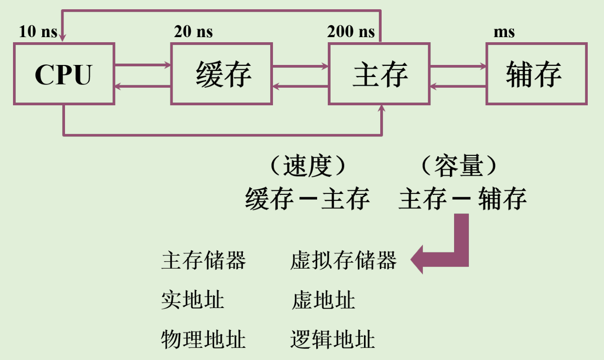

方法速查：

- 虚拟地址 = 虚页号 + 页内偏移，物理地址 = 物理页号 + 页内偏移，两者的页内偏移位数相同。
- 虚拟地址空间大小决定虚拟地址位数，主存空间大小决定物理地址位数，页面大小决定页内偏移位数。
- Cache 用物理地址访问：块大小决定块内偏移位数；直接映射由块数、组相联由组数决定索引位数（n 路组相联共"块数 ÷ n"组）；全相联没有索引；标记位数 = 物理地址位数 − 索引位数 − 块内偏移位数。
- TLB 也是一种 Cache，按虚页号查：全相联 TLB 的标记就是整个虚页号；组相联 TLB 用虚页号的低位做组号，剩下的高位才是标记。Cache 的标记是物理地址高位，和虚页号无关。
- 访问流程：先查 TLB，命中直接得到物理页号；TLB 缺失就查页表，有效则得到物理页号并更新 TLB，无效则缺页，由操作系统从磁盘调入。拿到物理地址后查 Cache，命中直接把数据给 CPU；缺失就访问主存取数据，写入 Cache，更新标记和有效位，再把数据给 CPU。
- 考试时把更新后的 TLB 和 Cache 表完整画出来。

### 综合设计题 10：虚存与 4 路组相联 Cache（讲题大题 2）

某计算机按字节编址，虚拟地址空间 256MB，主存地址空间 16MB，页面大小 64KB；Cache 采用 4 路组相联映射，共 8 块；主存与 Cache 之间交换的块大小为 32B。某时刻页表和 Cache 的部分内容如下：

| 虚页号 | 有效位 | 物理页号 |
| --- | --- | --- |
| 0 | 1 | 06H |
| 1 | 1 | 04H |
| 2 | 1 | 15H |
| 3 | 1 | 02H |
| 4 | 0 | --- |
| 5 | 1 | 28H |
| 6 | 0 | --- |
| 7 | 1 | 32H |

| 组号 | 块号 | 有效位 | 标记 |
| --- | --- | --- | --- |
| 0 | 0 | 1 | 0200H |
| 0 | 1 | 0 | --- |
| 0 | 2 | 1 | 04C0H |
| 0 | 3 | 1 | 01D2H |
| 1 | 0 | 1 | 0640H |
| 1 | 1 | 1 | 14DAH |
| 1 | 2 | 0 | --- |
| 1 | 3 | 1 | 27ABH |

10.1 虚拟地址共几位，哪几位是页号？物理地址共几位，哪几位是物理页号？

10.2 用物理地址访问 Cache 时，物理地址分成哪几个字段？说明各字段位数和位置。

10.3 虚拟地址 001FFF0H 所在页面是否在主存中？若在，对应的物理地址是什么？访问时 Cache 是否命中？

10.4 从虚拟地址 001FFF0H 开始连续读 100 个字（1 字 = 4 字节），分析 Cache 命中情况。这 100 个字重复读 10 次，Cache 命中率是多少？

答：

10.1 256MB = $2^{28}$，虚拟地址 28 位；64KB = $2^{16}$，页内偏移 16 位，虚页号为高 12 位（第 27～16 位）。16MB = $2^{24}$，物理地址 24 位，物理页号为高 8 位（第 23～16 位）。

10.2 8 块、4 路组相联共 2 组，组号 1 位；块大小 32B = $2^5$，块内偏移 5 位；标记 24−1−5 = 18 位。

| 标记（18 位，第 23～6 位） | 组号（1 位，第 5 位） | 块内偏移（5 位，第 4～0 位） |
| --- | --- | --- |

10.3 001FFF0H 的虚页号为 001H，页表中虚页 1 有效，物理页号 04H，页面在主存中。物理地址 = **04FFF0H**。

拆成 0000 0100 1111 1111 11 | 1 | 1 0000：标记 13FFH，组号 1。组 1 中有效的标记是 0640H、14DAH、27ABH，没有 13FFH，**Cache 不命中**。

10.4 100 个字共 400 字节，虚拟地址 001FFF0H～002017FH，中间跨了页。

- 第 1～4 个字（001FFF0H～001FFFFH）：虚页 1，物理地址 04FFF0H～04FFFFH，都在同一块里（组 1，标记 13FFH）。第 1 个字不命中，调入后第 2～4 个字命中。
- 第 5～100 个字（0020000H～002017FH）：虚页 2，物理页号 15H，物理地址 150000H～15017FH，跨了 12 个块，每块 8 个字。每进入一个新块不命中一次，块内其余字命中。组号在 0、1 之间交替，标记每两块加 1。

每个新块的第一个字：

| 第几个字 | 1 | 5 | 13 | 21 | 29 | 37 | 45 | 53 | 61 | 69 | 77 | 85 | 93 |
| --- | --- | --- | --- | --- | --- | --- | --- | --- | --- | --- | --- | --- | --- |
| 物理地址 | 04FFF0H | 150000H | 150020H | 150040H | 150060H | 150080H | 1500A0H | 1500C0H | 1500E0H | 150100H | 150120H | 150140H | 150160H |
| 组号 | 1 | 0 | 1 | 0 | 1 | 0 | 1 | 0 | 1 | 0 | 1 | 0 | 1 |
| 标记 | 13FFH | 5400H | 5400H | 5401H | 5401H | 5402H | 5402H | 5403H | 5403H | 5404H | 5404H | 5405H | 5405H |

这 13 个块原来都不在 Cache 里，所以读一遍 100 个字，**不命中 13 次，命中 87 次**。

重复读 10 次：组 0 一遍要装入 6 个块（5400H～5405H），组 1 要装入 7 个块（13FFH、5400H～5405H），都超过每组 4 行。按 LRU，读完一遍后两组里只剩最后装入的 5402H～5405H。第二遍开头要的 13FFH、5400H、5401H 已被换出，调入它们又把 5402H 等挤出去，结果每一遍都同样不命中 13 次（已用程序模拟 10 遍核对）。

命中率 = (1000 − 130)/1000 = **87%**。如果以为第二遍起全部命中，会算成 98.7%，这是错的。

（更正：题型整理里这题有两版手写解答。第一版把"第 k 个字"的地址算成 001FFF0H+4k，编号整体错了一位，得出 14 次不命中，其中标记 5406H 那次访问并不存在，而且没算重复 10 次的命中率。第二版把 100 个字算成读 101 次，列出组 0、组 1 的标记清单时把 13FFH 放错了组，最后写 87/101 = 87%，其实 87/101 ≈ 86.1%，87% 是碰巧写对的，正确算法是 87/100。另外两版都把块大小写成"32 位"，应为 32 字节。）

两版手写的相关部分如下，对照上面的更正看错在哪一步：

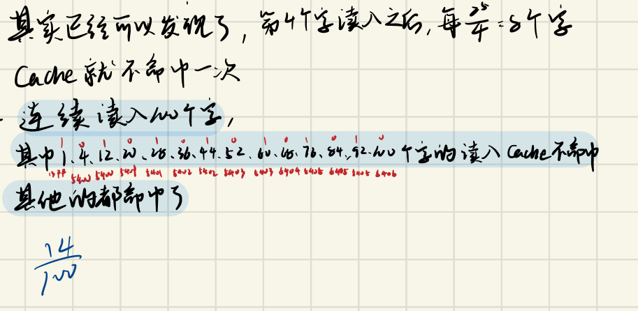

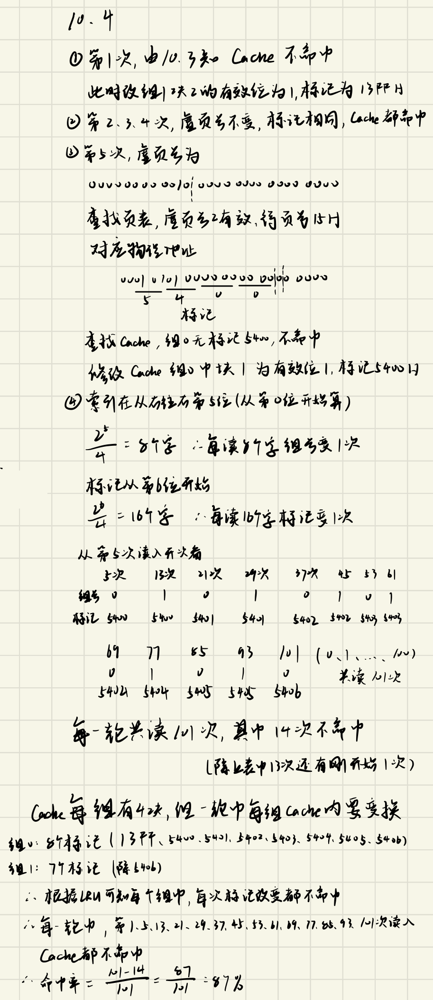

### 综合设计题 3：虚存、2 路组相联 Cache 与全相联 TLB

某计算机虚拟地址空间 256MB，主存地址空间 16MB，页面大小 128KB；Cache 采用 2 路组相联映射，共 16 块；主存与 Cache 之间交换的块大小为 16 字（1 字 4 字节）。某时刻页表和 Cache 的部分内容如下（十六进制）：

| 虚页号 | 有效位 | 物理页号/磁盘地址 |
| --- | --- | --- |
| 0H | 1 | 06H |
| 1H | 1 | 04H |
| 2H | 1 | 15H |
| 3H | 1 | 02H |
| 4H | 0 | --- |
| 5H | 1 | 28H |
| 6H | 0 | --- |
| 7H | 1 | 32H |
| … | … | … |
| 15H | 0 | … |
| 16H | 1 | 23H |

| 组号 | 有效位 | 标记 | 有效位 | 标记 |
| --- | --- | --- | --- | --- |
| 0 | 1 | 0200H | 0 | --- |
| 1 | 0 | --- | 1 | 0251H |
| 2 | 1 | 04C0H | 1 | 032EH |
| 3 | 1 | 01D2H | 0 | --- |
| 4 | 1 | 0640H | 1 | 00CDH |
| 5 | 1 | 04DAH | 1 | 0D7FH |
| 6 | 0 | --- | 0 | --- |
| 7 | 1 | 07ABH | 1 | 0020H |

1）虚拟地址共几位，哪几位表示页号？物理地址共几位，哪几位表示物理页号？

2）用物理地址访问 Cache 时，给出物理地址的划分格式。

3）用虚拟地址 002C050H 访问时，能否从 Cache 中读到数据？

4）为该机配置一个全相联 TLB，可存放 4 个页表项，采用 LRU 替换，当前内容如下。依次访问虚拟地址 027BAC0H 和 0110140H 后，继续访问 02A0020H 所在的页面是否在主存中？

| 有效位 | 脏位 | 引用位 | 标记 | 物理页面地址 |
| --- | --- | --- | --- | --- |
| 1 | 1 | 1 | 6F3H | 3FH |
| 1 | 0 | 0 | 025H | 08H |
| 1 | 1 | 1 | 09EH | 1DH |
| 1 | 1 | 0 | 008H | 07H |

答：

1）256MB = $2^{28}$，虚拟地址 28 位；128KB = $2^{17}$，页内偏移 17 位，虚页号为高 11 位（第 27～17 位）。16MB = $2^{24}$，物理地址 24 位，物理页号为高 7 位（第 23～17 位）。

2）16 块、2 路组相联共 8 组，组号 3 位；块大小 16 字 = 64B = $2^6$，块内偏移 6 位；标记 24−3−6 = 15 位。

| 标记（15 位，第 23～9 位） | 组号（3 位，第 8～6 位） | 块内偏移（6 位，第 5～0 位） |
| --- | --- | --- |

3）002C050H = 0000 0000 001 | 0 1100 0000 0101 0000，虚页号 001H。页表中虚页 1 有效，物理页号 04H，物理地址 = **08C050H**。

拆成 0000 1000 1100 000 | 001 | 01 0000：标记 0460H，组号 1，块内偏移 10H。组 1 中唯一有效的标记是 0251H，不相同，**不能从 Cache 读到数据**。

4）

- 027BAC0H = 0000 0010 011 | 1 1011 1010 1100 0000，虚页号 013H。TLB 中没有，不命中（查页表得物理页号后装入 TLB）。TLB 满了要换出一项：引用位为 0 的是 025H 和 008H，按 LRU 换出 025H（它的脏位也是 0）。
- 0110140H = 0000 0001 000 | 1 0000 0001 0100 0000，虚页号 008H，TLB 命中。
- 02A0020H = 0000 0010 101 | 0 0000 0000 0010 0000，虚页号 015H。TLB 中没有，查页表，虚页 15H 的有效位为 0，**该页面不在主存中**（缺页）。

不在页表里有效的页，一定不在主存中。第一步换出的是 025H 还是 008H 不影响最后的结论。

（更正：手写笔记在第 3 问旁边批注"标记存放虚页号"，这句只对 TLB 成立，Cache 的标记是物理地址高位，别看混了。）

### 综合设计题 5：4 路组相联 TLB 与直接映射 Cache

某计算机按字节编址，虚拟地址空间 256MB，主存地址空间 16MB，页面大小 64KB。Cache 采用直接映射，共 8 块，块大小 32B。配置了 4 路组相联的 TLB，共可存放 8 个页表项。某时刻页表、Cache 和 TLB 内容如下：

| 虚页号 | 有效位 | 页框号 |
| --- | --- | --- |
| 0 | 1 | 06 |
| 1 | 1 | 08 |
| 2 | 1 | 15 |
| 3 | 1 | 02 |
| 4 | 0 | - |
| 5 | 1 | 28 |
| 6 | 0 | - |
| 7 | 1 | 32 |

| 块号 | 有效位 | 标记 |
| --- | --- | --- |
| 0 | 1 | 0200 |
| 1 | 0 | --- |
| 2 | 1 | 04C0 |
| 3 | 1 | 01D2 |
| 4 | 1 | 0640 |
| 5 | 1 | 14DA |
| 6 | 0 | --- |
| 7 | 1 | 27AB |

| 组号 | 有效位 | 标记 | 页框号 |
| --- | --- | --- | --- |
| 0 | 0 | - | - |
| 0 | 1 | 001 | 15 |
| 0 | 0 | - | - |
| 0 | 1 | 012 | 1F |
| 1 | 1 | 013 | 2D |
| 1 | 0 | - | - |
| 1 | 1 | 008 | 7E |
| 1 | 0 | - | - |

CPU 给出虚拟地址 001C0EFH，详细分析取得数据的过程，并给出取得数据后的 TLB 表和 Cache 表。

答：

1. 地址结构：虚拟地址 28 位，页内偏移 16 位，虚页号 12 位；物理地址 24 位，页框号 8 位。Cache 直接映射 8 块，块号 3 位；块大小 32B，块内偏移 5 位；标记 24−3−5 = 16 位。TLB 8 项、4 路组相联共 2 组，用虚页号最低 1 位做组号，其余高 11 位做标记。

   对照表格验证：TLB 组 0 里"标记 001 → 页框 15"对应虚页号 001 拼上组号 0 = 002H，页表里虚页 2 正好是 15，说明这种划分是对的。

2. 查 TLB：001C0EFH 的虚页号为 001H = 0000 0000 000**1**，组号 1，标记 000H。组 1 中有效的标记是 013、008，**TLB 不命中**。

3. 查页表：虚页 1 有效，页框号 08H，物理地址 = **08C0EFH**。把 (标记 000，页框 08) 装入 TLB 组 1 的空项。

4. 查 Cache：08C0EFH = 0000 1000 1100 0000 | 111 | 0 1111，标记 08C0H，块号 7。块 7 的标记是 27ABH，**Cache 不命中**。访问主存取出数据送 CPU，同时把该块写入 Cache 块 7，标记改为 08C0，有效位置 1。

更新后的 TLB：

| 组号 | 有效位 | 标记 | 页框号 |
| --- | --- | --- | --- |
| 0 | 0 | - | - |
| 0 | 1 | 001 | 15 |
| 0 | 0 | - | - |
| 0 | 1 | 012 | 1F |
| 1 | 1 | 013 | 2D |
| 1 | 1 | 000 | 08 |
| 1 | 1 | 008 | 7E |
| 1 | 0 | - | - |

更新后的 Cache：

| 块号 | 有效位 | 标记 |
| --- | --- | --- |
| 0 | 1 | 0200 |
| 1 | 0 | --- |
| 2 | 1 | 04C0 |
| 3 | 1 | 01D2 |
| 4 | 1 | 0640 |
| 5 | 1 | 14DA |
| 6 | 0 | --- |
| 7 | 1 | 08C0 |

（更正：手写原文更新 TLB 时写入的标记是 001，应为 000；页面旁边的红笔批注也纠正了"标记就是虚页号"的说法。另外 TLB 组 1 本来就有空项，直接填入即可，用不到 LRU 替换。）

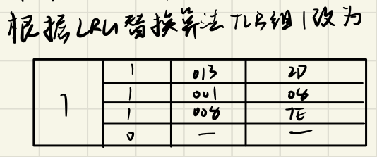

### 综合设计题 6：全相联 TLB 与 2 路组相联 Cache

某计算机按字节编址，虚拟地址空间 4GB，主存地址空间 256MB，页面大小 64KB。Cache 采用 2 路组相联映射，共 16 块，块大小 256B。配置了全相联 TLB，共可存放 8 个页表项。某时刻页表、Cache 和 TLB 内容如下：

| 虚页号 | 有效位 | 物理页号 |
| --- | --- | --- |
| 0 | 1 | 005 |
| 1 | 1 | 01B |
| 2 | 1 | 115 |
| 3 | 1 | 102 |
| 4 | 0 | - |
| 5 | 1 | 128 |
| 6 | 0 | - |
| 7 | 1 | 32C |

| 组号 | 有效位 | 标记 | 有效位 | 标记 |
| --- | --- | --- | --- | --- |
| 0 | 1 | 10200 | 1 | 10D00 |
| 1 | 0 | --- | 0 | --- |
| 2 | 1 | 004C0 | 1 | 014C0 |
| 3 | 1 | 101D2 | 1 | 00250 |
| 4 | 1 | 00640 | 1 | 04640 |
| 5 | 1 | 0141A | 1 | 11400 |
| 6 | 0 | --- | 0 | --- |
| 7 | 1 | 0272B | 1 | 0174B |

| 有效位 | 标记 | 物理页号 |
| --- | --- | --- |
| 0 | - | - |
| 1 | 0011 | 155 |
| 0 | - | - |
| 1 | 0120 | 1FD |
| 1 | 0132 | 2D1 |
| 0 | - | - |
| 1 | 008D | 7EF |
| 0 | - | - |

CPU 给出虚拟地址 0005C3EFH，详细分析取得数据的过程，并给出取得数据后的 TLB 表和 Cache 表。

答：

1. 地址结构：4GB = $2^{32}$，虚拟地址 32 位；64KB，页内偏移 16 位，虚页号 16 位。256MB = $2^{28}$，物理地址 28 位，物理页号 12 位。TLB 全相联，标记就是 16 位虚页号。Cache 16 块、2 路组相联共 8 组，组号 3 位；块大小 256B，块内偏移 8 位；标记 28−3−8 = 17 位。

2. 查 TLB：0005C3EFH 的虚页号为 0005H，TLB 中有效的标记是 0011、0120、0132、008D，**TLB 不命中**。

3. 查页表：虚页 5 有效，物理页号 128H，物理地址 = **128C3EFH**。把 (0005，128) 装入 TLB 的一个空项。

4. 查 Cache：128C3EFH = 0001 0010 1000 1100 0 | 011 | 1110 1111，标记 02518H，组号 3。组 3 的标记是 101D2、00250，**Cache 不命中**。访问主存取出数据送 CPU，同时把该块写入 Cache 组 3。组 3 两行都有效，要替换一行，按 LRU 换出最久没用的（表里没给使用情况，下面假设换掉第一行）。

更新后的 TLB（新项填在第一个空位）：

| 有效位 | 标记 | 物理页号 |
| --- | --- | --- |
| 1 | 0005 | 128 |
| 1 | 0011 | 155 |
| 0 | - | - |
| 1 | 0120 | 1FD |
| 1 | 0132 | 2D1 |
| 0 | - | - |
| 1 | 008D | 7EF |
| 0 | - | - |

更新后的 Cache 只有组 3 变化，其余不变：

| 组号 | 有效位 | 标记 | 有效位 | 标记 |
| --- | --- | --- | --- | --- |
| 3 | 1 | 02518 | 1 | 00250 |

（更正：手写原文更新后的 TLB 第 2 行标记抄成 0001，原表是 0011，应保持不变。）

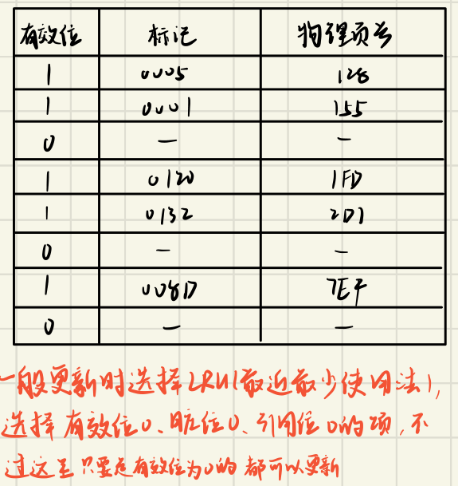

### 补充题：4 路组相联 Cache 重复取数 10 次

题型整理第 31 页（例 2）。主存 32K×16 位（按字编址，每字 16 位），有一个 4K 字的 4 路组相联 Cache，主存和 Cache 之间交换的块大小为 64 字。Cache 开始为空，处理器顺序从存储单元 0、1、…、4351 取数，一共重复 10 次。Cache 比主存快 10 倍，采用 LRU 算法。给出 Cache 的结构和主存地址划分，计算采用 Cache 后速度提高了多少倍。

答：

1. 地址划分：32K = $2^{15}$，主存地址 15 位；块大小 64 字 = $2^6$，块内地址 6 位；Cache 共 4K/64 = 64 块，4 路组相联共 16 组，组号 4 位；标记 15−4−6 = 5 位。

   | 标记（5 位） | 组号（4 位） | 块内地址（6 位） |
   | --- | --- | --- |

2. Cache 结构：16 组，每组 4 行，每行有有效位、5 位标记和 64 字的数据。

3. 缺失次数：0～4351 共 4352/64 = 68 块（块 0～67），块 j 进入第 j mod 16 组。组 4～15 各有 4 块，正好放得下；组 0～3 各有 5 块（例如组 0 是块 0、16、32、48、64）。
   - 第 1 遍：68 块全部不命中，68 次。
   - 第 2～10 遍：组 4～15 全部命中。组 0～3 每组 5 块轮流用 4 行，按 LRU 每次要的块都刚好被换出，每组每遍 5 次不命中，每遍 4×5 = 20 次。
   - 总缺失 = 68 + 9×20 = 248 次，总访问 43520 次，命中率 ≈ 99.43%。

4. 速度：设 Cache 存取一次用时 1，主存为 10。
   - 不用 Cache：43520×10 = 435200。
   - 用 Cache（手写笔记的算法：每次访问先花 1 查 Cache，缺失再加 10）：第 1 遍 4352 + 68×10 = 5032，后 9 遍 9×(4352 + 20×10) = 40968，共 46000。
   - 加速比 = 435200/46000 ≈ 9.46，**速度提高了约 8.46 倍**（是原来的 9.46 倍）。

   另一种常见算法按平均访问时间： $t_a=0.9943\times1+0.0057\times10\approx1.051$，加速比 ≈ 10/1.051 ≈ 9.51，提高约 8.5 倍。

（更正：手写原文最后写"加速比 = 9.46"，题目问的是"提高了多少倍"，应减 1。手写的两个乘号形似加号，按结果应为乘号。）

第 5 章存储器例题课件对这道题的解答和上面一致，右边那张表把 68 个主存块按组列出来，组 0 到 3 各多出一块：

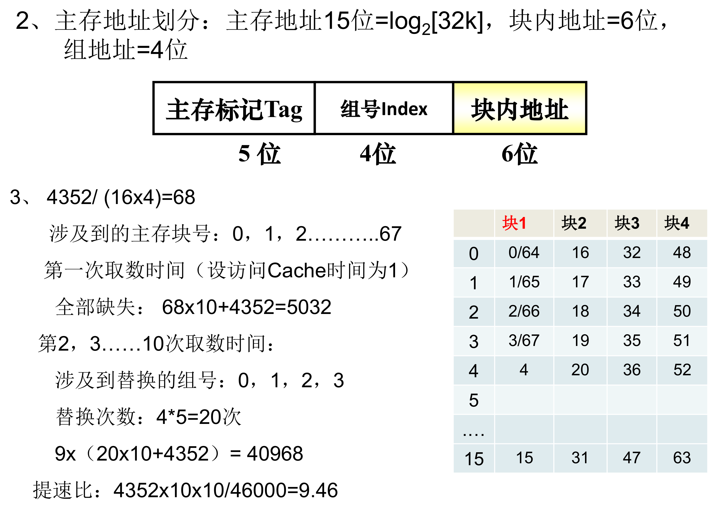

### 补充题：三种映射方式下的主存地址格式

题型整理第 32 页。主存容量 512K 字，Cache 容量 2K 字，块长 4 个字。

（1）设计 Cache 地址格式，Cache 中可装入多少块数据？

（2）直接映射方式下，画出主存地址格式。

（3）四路组相联映射方式下，画出主存地址格式。

（4）全相联映射方式下，画出主存地址格式。

答：

（1）块数 = 2K/4 = $2^9$ = 512 块；块长 4 = $2^2$，字块内地址 2 位。Cache 地址格式：

| Cache 字块地址（9 位） | 字块内地址（2 位） |
| --- | --- |

（2）512K = $2^{19}$，主存地址 19 位。

| 主存字块标记（8 位） | Cache 字块地址（9 位） | 字块内地址（2 位） |
| --- | --- | --- |

（3）组数 = $2^9/4=2^7$，组号 7 位。

| 主存字块标记（10 位） | 组地址（7 位） | 字块内地址（2 位） |
| --- | --- | --- |

（4）

| 主存字块标记（17 位） | 字块内地址（2 位） |
| --- | --- |

### 补充题：直接映射 Cache 中地址 EDCBAH 的位置

题型整理第 33 页。主存容量 1MB，直接映射 Cache 容量 16KB，块长 4 个字，每字 32 位。主存地址 EDCBAH 的存储单元在 Cache 中的什么位置？（主存和 Cache 按字节编址）

答：

- 主存 1MB = $2^{20}$ 字节，地址 20 位。
- 块长 = 4 字 × 4 字节 = 16 字节，块内地址 4 位。
- Cache 块数 = 16KB/16B = $2^{10}$，块号 10 位；标记 20−10−4 = 6 位。

EDCBAH = 111011 | 0111001011 | 1010：在 Cache 第 0111001011B = 1CBH（459）块，块内第 1010B = 10 号字节（从 0 起算），也就是该块第 2 个字的第 2 个字节（都从 0 起算）。Cache 中这个位置的标记为 111011 时，存的才是这个单元的数据。
