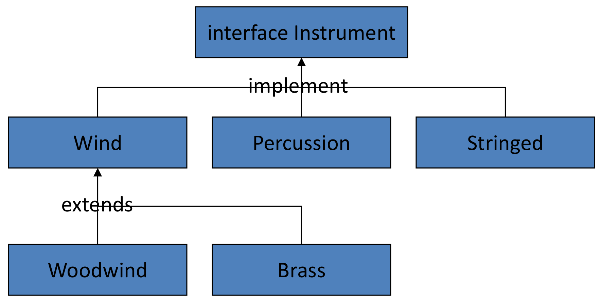
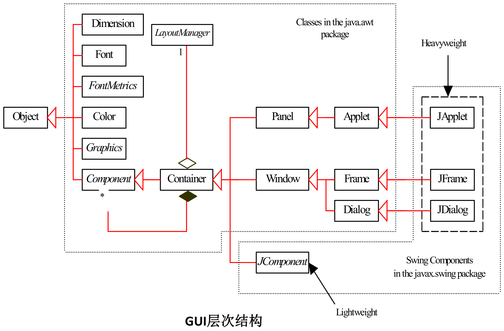
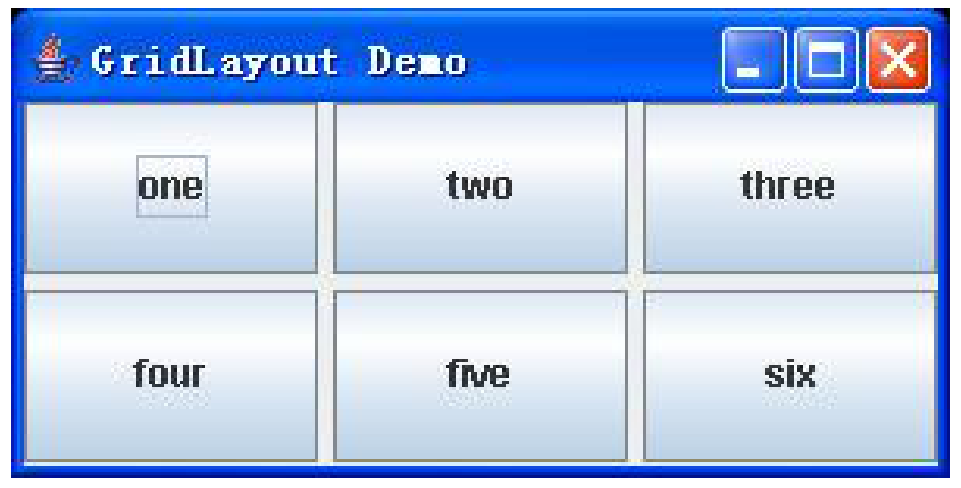
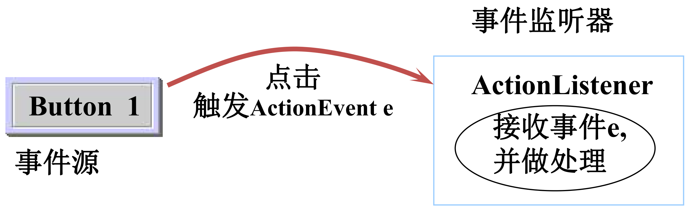

# 实验三、实验四：接口与反射、Swing 界面

整理自 `Java实验.pdf` 第 2～5 页。原稿缺了 `Car007.java` 和实验四的题面，这两处按"整理补充"标出。本机没有 JDK，输出是手工推演加 Python 按 Java 的 float 语义验算的，没有实际编译运行。

## 实验三 用接口写通用的行驶时间计算程序

题目：为某研究所编写一个通用程序，用来计算每一种交通工具行驶 1000 公里所需的时间。已知每种交通工具的参数都是 3 个整数 A、B、C 的表达式，现有两种工具 Car007 和 Plane，其中 Car007 的速度计算公式为 `A*B/C`，Plane 的速度计算公式为 `A+B+C`。需要编写三个类程序 `ComputeTime.java`、`Plane.java`、`Car007.java` 和一个接口程序 `Common.java`，要求在未来如果增加第三种交通工具的时候，不必修改以前的任何程序，只需要编写新的交通工具的程序。其运行过程如下，从命令行输入 ComputeTime 的四个参数，第一个是交通工具的类型，第二、三、四个参数分别是整数 A、B、C，例如，计算 Plane 的时间 `java ComputeTime Plane 20 30 40`，计算 Car007 的时间 `java ComputeTime Car007 23 34 45`，如果第三种交通工具为 Ship，则只需要编写 `Ship.java`，运行时输入 `java ComputeTime Ship 22 33 44`。提示：充分利用接口的概念，接口对象作为参数。实例化一个对象的另外一种办法是 `Class.forName(str).newInstance()`，例如需要实例化一个 Plane 对象的话，则只需调用 `Class.forName("Plane").newInstance()`。请把程序代码和输出结果的截图提交到答案中。

### 这道题在考什么

"增加第三种交通工具时不改以前的任何程序"这句话是这道题的主要要求。要做到它，`ComputeTime` 里就不能出现 `if (type.equals("Plane")) ... else if (type.equals("Car007")) ...` 这种分支，否则每加一种工具都要回来改一次。

两件事配合起来才能做到：

- **接口**。`Common` 规定所有交通工具都有 `init` 和 `speed` 两个方法，`ComputeTime` 只认 `Common` 这个类型，不认具体是哪种工具。
- **反射**。`Class.forName(类名字符串)` 在运行时按名字找类，`newInstance()` 创建对象。类名是运行时才从输入里读到的字符串，编译时 `ComputeTime` 根本不知道 `Plane` 这个类存在。

写新的 `Ship.java`，编译好放在同一目录下，`java ComputeTime Ship 22 33 44` 就能用，`ComputeTime.class` 一个字节都不用改。



这张图的结构和本题一一对应：顶上的 `Instrument` 换成 `Common`，下面一排实现类换成 `Plane`、`Car007`，以后的 `Ship` 就是往这一排再加一个框。只跟顶层接口打交道的代码（本题的 `ComputeTime`）不需要知道下面有几个框。图中连线上写的 `implement` 少了一个 s，Java 关键字是 `implements`。

### 参考代码

`Common.java`：

```java
public interface Common {
    public float speed();
    public void init(int x, int y, int z);
}
```

`Plane.java`：

```java
public class Plane implements Common {
    int A;
    int B;
    int C;

    public float speed() {
        return (float) (A + B + C);
    }

    public void init(int x, int y, int z) {
        A = x; B = y; C = z;
    }
}
```

`Car007.java`（整理补充：原稿没有这个文件，按题目给的公式 `A*B/C` 补写）：

```java
public class Car007 implements Common {
    int A;
    int B;
    int C;

    public float speed() {
        return (float) A * B / C;   // 先把 A 转成 float，避免整数除法
    }

    public void init(int x, int y, int z) {
        A = x; B = y; C = z;
    }
}
```

`ComputeTime.java`：

```java
import java.util.Scanner;

public class ComputeTime {
    public static void main(String[] args) throws InstantiationException,
            IllegalAccessException, ClassNotFoundException {
        String type;
        Scanner sc = new Scanner(System.in);
        System.out.println("java ComputeTime ");
        type = sc.next();
        int a, b, c;
        a = sc.nextInt();
        b = sc.nextInt();
        c = sc.nextInt();
        sc.close();

        Common vehicle = (Common) Class.forName(type).newInstance();
        vehicle.init(a, b, c);

        float time = 1000 / vehicle.speed();
        System.out.println("此交通工具行驶1000公里所需的时间为：" + time + "小时");
    }
}
```

### 原稿和题目要求不一致的地方

题目写的是"从命令行输入 ComputeTime 的四个参数"，运行形式是 `java ComputeTime Plane 20 30 40`，四个参数应该从 `main` 的 `String[] args` 里取。原稿的 `ComputeTime` 改成了用 `Scanner` 从标准输入读，还先打印一行 `java ComputeTime ` 提示用户照着敲。结果能算对，但运行方式和题面不符，老师验收时一看就知道。

贴题的写法（整理补充）：

```java
public class ComputeTime {
    public static void main(String[] args) throws Exception {
        if (args.length != 4) {
            System.out.println("用法: java ComputeTime <类型> <A> <B> <C>");
            return;
        }
        String type = args[0];
        int a = Integer.parseInt(args[1]);
        int b = Integer.parseInt(args[2]);
        int c = Integer.parseInt(args[3]);

        Common vehicle = (Common) Class.forName(type).getDeclaredConstructor().newInstance();
        vehicle.init(a, b, c);

        float time = 1000 / vehicle.speed();
        System.out.println("此交通工具行驶1000公里所需的时间为：" + time + "小时");
    }
}
```

`getDeclaredConstructor().newInstance()` 是 Java 9 以后推荐的写法，`Class.newInstance()` 从 Java 9 起被标记为过时，能编过但会有警告。考试写 `Class.forName(type).newInstance()` 不算错，题目提示里就是这么给的。

### 运行结果

```
java ComputeTime Plane 20 30 40
此交通工具行驶1000公里所需的时间为：11.111111小时
```

Plane 的速度 = 20+30+40 = 90，1000/90 = 11.1111...，用 float 存下来再打印是 `11.111111`。

```
java ComputeTime Car007 23 34 45
此交通工具行驶1000公里所需的时间为：57.544758小时
```

Car007 的速度 = 23×34/45 = 782/45 = 17.377778（float），1000 除以它是 57.544758。

### 容易出错的地方

1. `A*B/C` 的整数除法。如果 `Car007.speed()` 写成 `return (float)(A*B/C);`，括号里三个都是 int，782/45 先按整数除法算成 17，再转成 float，时间就变成 `58.82353` 小时，和正确答案 57.544758 差了一个多小时。转型要转在除法之前：`(float) A * B / C`。这是这道题最隐蔽的坑，改卷时会专门看。
2. `A*B` 溢出。A、B 都是 int，乘积超过 21 亿会溢出成负数。题目给的数很小遇不到，但写成 `(float) A * B / C` 的话乘法是在 float 上做的，顺便也躲开了溢出。
3. `Class.forName` 找不到类。传进去的字符串必须是类的全限定名。这四个类都在默认包（没写 `package`），所以直接用 `Plane`、`Car007`。如果放进了包 `vehicle`，就得传 `vehicle.Plane`。找不到会抛 `ClassNotFoundException`，拼错大小写（`plane`）也是这个异常。
4. 反射创建对象要有无参构造方法。这四个类都没写构造方法，编译器自动给一个无参的，正好够用。一旦给 `Plane` 加了 `public Plane(int a, int b, int c)`，默认无参构造方法就没有了，`newInstance()` 会抛 `InstantiationException`。题目让用 `init` 方法传参数、不用构造方法传，原因就在这里。
5. 类型转换失败。`(Common)` 这个强制转换要求那个类确实 `implements Common`。写了 `Ship.java` 却忘了 `implements Common`，运行时抛 `ClassCastException`。
6. `float` 和 `double` 的打印位数不同。`speed()` 返回 float，所以 `time` 也是 float，只有 7 位有效数字。改成 double 的话 Plane 那题会打印 `11.11111111111111`。

## 实验四 九宫格按钮变色（ColorPane）

原稿这一题只有一个小标题 `GUI`，题面文字缺失。按参考代码复原（整理补充）：用 Swing 做一个 3×3 的按钮面板，九个按钮分别标着 blue、cyan、green、magenta、orange、pink、red、white、yellow，点哪个按钮，哪个按钮的背景就变成对应的颜色。

### 参考代码

```java
import java.awt.*;
import java.awt.event.*;
import javax.swing.*;

//继承了JFrame（用于创建窗口）并实现了ActionListener接口（用于处理按钮点击事件）
public class ColorPane extends JFrame implements ActionListener {
    private JButton buttons[];
    private String names[] =
        {"blue", "cyan", "green", "magenta", "orange", "pink", "red", "white", "yellow"};
    private boolean toggle = true;
    private Container container;
    private GridLayout grid;

    public ColorPane() { //初始化窗口和按钮
        super("ColorPane");
        grid = new GridLayout(3, 3, 5, 5);
        container = getContentPane();
        container.setLayout(grid);
        buttons = new JButton[names.length];
        for (int count = 0; count < names.length; count++) {
            buttons[count] = new JButton(names[count]);
            buttons[count].addActionListener(this);
            container.add(buttons[count]);
        }
        setSize(800, 800);
        setVisible(true);
    }

    public void actionPerformed(ActionEvent e) {        //添加监听器
        if (e.getSource() == buttons[0]) {
            buttons[0].setBackground(Color.BLUE);
            buttons[0].updateUI();
        }
        if (e.getSource() == buttons[1]) {
            buttons[1].setBackground(Color.CYAN);
            buttons[1].updateUI();
        }
        if (e.getSource() == buttons[2]) {
            buttons[2].setBackground(Color.GREEN);
            buttons[2].updateUI();
        }
        if (e.getSource() == buttons[3]) {
            buttons[3].setBackground(Color.MAGENTA);
            buttons[3].updateUI();
        }
        if (e.getSource() == buttons[4]) {
            buttons[4].setBackground(Color.ORANGE);
            buttons[4].updateUI();
        }
        if (e.getSource() == buttons[5]) {
            buttons[5].setBackground(Color.PINK);
            buttons[5].updateUI();
        }
        if (e.getSource() == buttons[6]) {
            buttons[6].setBackground(Color.RED);
            buttons[6].updateUI();
        }
        if (e.getSource() == buttons[7]) {
            buttons[7].setBackground(Color.WHITE);
            buttons[7].updateUI();
        }
        if (e.getSource() == buttons[8]) {
            buttons[8].setBackground(Color.YELLOW);
            buttons[8].updateUI();
        }
    }

    public static void main(String[] args) {
        ColorPane application = new ColorPane();
        application.setDefaultCloseOperation(JFrame.EXIT_ON_CLOSE);
    }
}
```

### 思路

Swing 程序的三步是固定的：搭窗口、放组件、挂监听器。

搭窗口靠继承 `JFrame`，`super("ColorPane")` 把字符串传给父类构造方法当窗口标题。`getContentPane()` 拿到的是内容面板，组件都往它上面加。`GridLayout(3, 3, 5, 5)` 是 3 行 3 列、横纵间距各 5 像素的网格布局，加进去的组件按加入顺序从左到右、从上到下填格子，每个格子等大。



沿着图里的继承线往上走，`ColorPane` → `JFrame` → `Frame` → `Window` → `Container`，所以窗口本身就是一个容器。图中 `Container` 下方的实心菱形连到 `Component`，表示一个容器里装多个组件；上方空心菱形连到 `LayoutManager`，旁边标着 1，表示一个容器只用一个布局管理器，`setLayout(grid)` 就是在设置这一个。`JButton` 图上没画，它经 `AbstractButton` 继承 `JComponent`，也是 `Container` 的子孙。



上图是课件里 `new GridLayout(2, 3, 5, 5)` 的运行效果，按钮之间那道浅色缝就是 5 像素间距。本题把参数换成 `(3, 3, 5, 5)`，九个颜色按钮按 `names` 数组的顺序排成三行三列，blue 在左上角，yellow 在右下角。

挂监听器靠 `implements ActionListener` 加 `addActionListener(this)`：让窗口类自己充当监听器，每个按钮被点时都调用这个类的 `actionPerformed`。`ActionListener` 只有 `actionPerformed` 一个方法，必须实现它，否则编译不过。



套到本题，图左边的 Button 1 就是九个 `JButton` 中被点的那个，右边的 ActionListener 是 `ColorPane` 对象自己，箭头上的 `ActionEvent e` 就是传进 `actionPerformed(ActionEvent e)` 的参数。九个按钮共用同一个监听器，所以要靠 `e.getSource()` 分辨事件是从哪个按钮来的。

`actionPerformed` 里用 `e.getSource()` 区分是哪个按钮被点了。`getSource()` 返回事件源对象，和 `buttons[i]` 比较用 `==`（比的是同一个对象，不是内容），这里不能用 `equals`。

`setVisible(true)` 必须放在所有组件都加完之后，否则窗口可能显示不全。

### 更短的写法

九个 if 块只有下标和颜色不同，把颜色也放进数组，配上循环就只剩四行：

```java
private Color colors[] = {Color.BLUE, Color.CYAN, Color.GREEN, Color.MAGENTA,
                          Color.ORANGE, Color.PINK, Color.RED, Color.WHITE, Color.YELLOW};

public void actionPerformed(ActionEvent e) {
    for (int i = 0; i < buttons.length; i++) {
        if (e.getSource() == buttons[i]) {
            buttons[i].setBackground(colors[i]);
            buttons[i].repaint();
        }
    }
}
```

`names` 数组和 `colors` 数组的顺序要一一对应，这是两个数组并行存放的常见套路。考试时写循环版更省时间，但要保证下标对得上。

### 运行结果

跑起来是一个 800×800 的窗口，标题栏写 ColorPane，里面九个方块按钮排成 3 行 3 列，按钮上是颜色的英文名。点 red 那个按钮，它的背景变成红色，其他八个不变；再点 yellow，yellow 那个也变黄，red 保持红色。

### 容易出错的地方

1. `setBackground` 在某些外观下不起作用。程序没有调用 `UIManager.setLookAndFeel`，用的是 Java 默认的跨平台外观（Metal），这种外观下按钮背景色是能改的。一旦加上 `UIManager.setLookAndFeel(UIManager.getSystemLookAndFeelClassName())` 换成 Windows 外观，按钮由系统主题绘制，`setBackground` 就看不出效果了，要再加 `setContentAreaFilled(false)` 和 `setOpaque(true)` 才行。
2. `updateUI()` 是多余的。`setBackground` 本身会触发重绘。`updateUI()` 的本意是重新向外观管理器要一个 UI 代理，它之所以没把刚设好的颜色冲掉，是因为传进去的 `Color.BLUE` 是普通 Color 对象，不带 `UIResource` 标记，重装 UI 不会覆盖它。想强制重绘写 `repaint()` 就够了。
3. `setDefaultCloseOperation` 的位置。原稿放在 `main` 里、构造方法之后，效果一样，但一般写在构造方法里 `setVisible(true)` 之前。忘了写这一句的话，点窗口的叉只是隐藏窗口，JVM 不退出，IDE 里会看到程序一直在运行。
4. `private boolean toggle = true;` 声明了没用。看名字像是原本打算做"再点一次恢复原色"的开关，最后没实现。交作业前删掉，或者真把它用起来：点一次变色，再点恢复 `null` 背景。
5. `e.getSource()` 用 `equals` 比较。`JButton` 没重写 `equals`，结果和 `==` 一样，但语义上应该用 `==`。另一种常见写法是用 `e.getActionCommand()` 拿按钮上的文字来比，那种就得用 `equals` 比字符串。
6. Swing 组件应该在事件分发线程上创建，规范写法是 `SwingUtilities.invokeLater(() -> new ColorPane())`。直接在 `main` 里 new 出来，这种小程序上不会出问题，但要知道有这回事。
