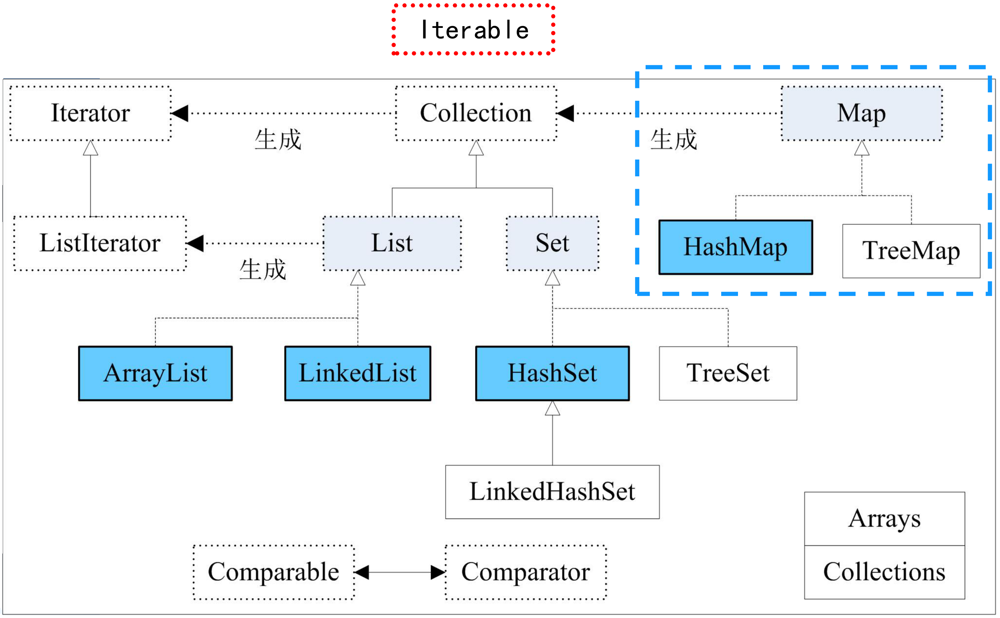
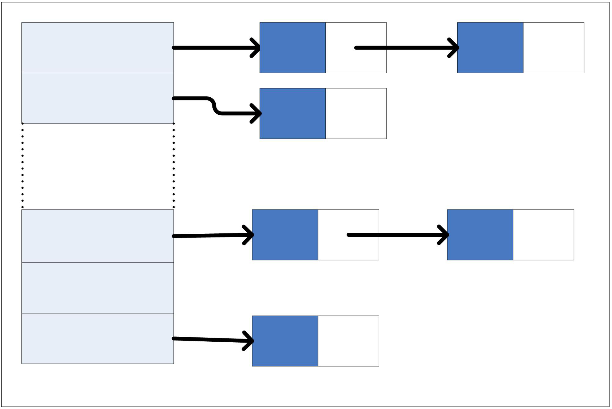
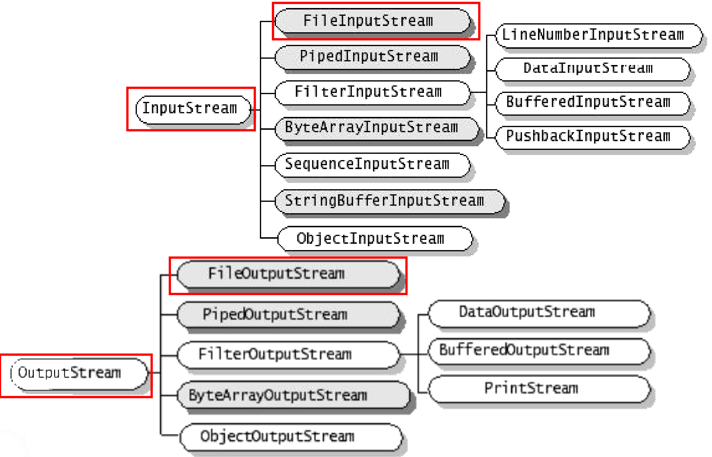
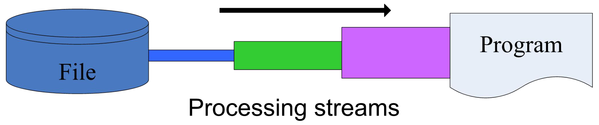
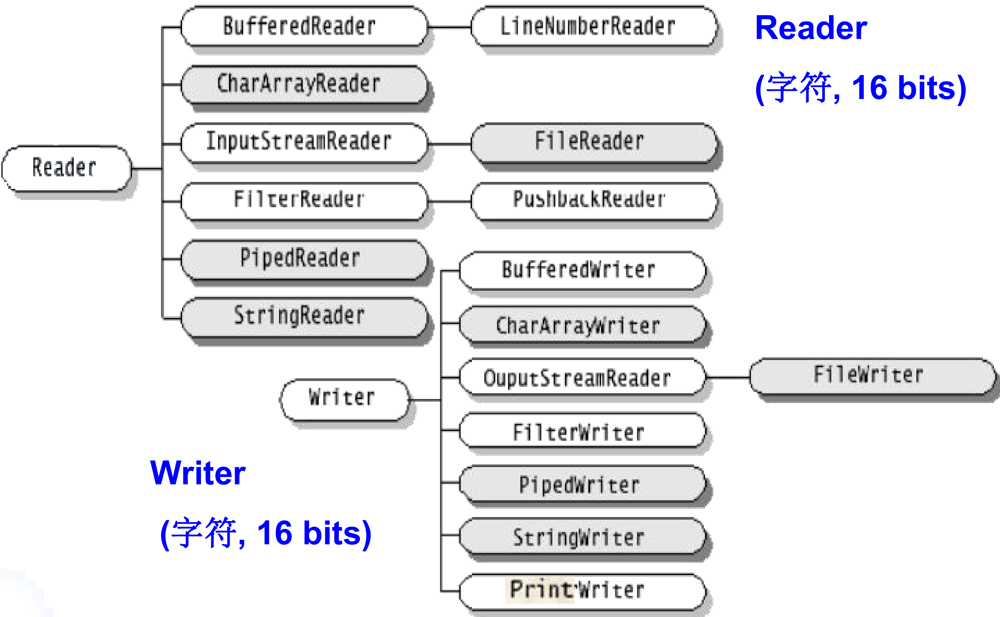

# 实验五、实验六：集合与文件读写

整理自 `Java实验.pdf` 第 5～6 页。实验五在原稿里没做完，参考答案是整理时补的；实验六的代码是原稿的，只把里面的绝对路径换成了相对路径。本机没有 JDK，代码没有实际编译运行过。

## 实验五 用 HashMap 模拟网上购物车

题目：用 HashMap 模拟一个网上购物车。要求：从键盘输入 5 本书的名称、单价、购买数量，将这些信息存入一个 HashMap，然后将该 HashMap 作为参数调用方法 `getSum(HashMap books)`，该方法用于计算书的总价并返回。提示：键盘输入可以使用 Scanner 类。

### 原稿的状态

原 PDF 里这一题的"参考答案"是一整段被 `//` 注释掉的 `Book` 类，只有四个字段和几个 getter/setter，没有 `getSum`，也没有 `main`，等于没做完。下面这份是整理补充的完整答案，`Book` 类沿用原稿注释里的设计（字段 `name`、`price`、`quantity`）。

### 参考代码（整理补充）

```java
import java.util.HashMap;
import java.util.Map;
import java.util.Scanner;

class Book {
    private String name;
    private double price;
    private int quantity;

    public Book(String name, double price, int quantity) {
        this.name = name;
        this.price = price;
        this.quantity = quantity;
    }

    public String getName() { return name; }
    public void setName(String name) { this.name = name; }

    public double getPrice() { return price; }
    public void setPrice(double price) { this.price = price; }

    public int getQuantity() { return quantity; }
    public void setQuantity(int quantity) { this.quantity = quantity; }
}

public class ShoppingCart {
    // 题面要求的方法签名：HashMap 作为参数，返回总价
    public static double getSum(HashMap<String, Book> books) {
        double sum = 0;
        for (Map.Entry<String, Book> entry : books.entrySet()) {
            Book b = entry.getValue();
            sum += b.getPrice() * b.getQuantity();
        }
        return sum;
    }

    public static void main(String[] args) {
        Scanner sc = new Scanner(System.in);
        HashMap<String, Book> books = new HashMap<String, Book>();
        for (int i = 1; i <= 5; i++) {
            System.out.println("请输入第" + i + "本书的名称、单价、数量：");
            String name = sc.next();
            double price = sc.nextDouble();
            int quantity = sc.nextInt();
            books.put(name, new Book(name, price, quantity));
        }
        sc.close();
        System.out.println("购物车里共有 " + books.size() + " 种书");
        System.out.println("总价为：" + getSum(books));
    }
}
```

### 思路

书名当 key，`Book` 对象当 value。这样做的好处是买重复的书时 `put` 会自动覆盖，同一本书不会在购物车里出现两次；坏处是输入了重名的书，`books.size()` 就不到 5。

`getSum` 遍历用的是 `entrySet()`，一次拿到键和值，比先 `keySet()` 再 `get(key)` 少一次哈希查找。只用值的时候写 `for (Book b : books.values())` 更简单。



图里 `Map` 和 `Collection` 之间没有继承线，只有一条标着"生成"的虚线箭头。`Map` 不是 `Collection`，也没有继承顶上的 `Iterable`，所以不能直接写 `for (x : books)`，要先用 `entrySet()`、`keySet()` 或 `values()` 生成一个集合视图，再对这个视图做 for-each，这正是 `getSum` 的写法。后面易错点里提到的 `LinkedHashMap` 这张图没画，它继承 `HashMap`，位置和图中 `LinkedHashSet` 继承 `HashSet` 相对应。



`HashMap` 内部就是上图这种链表数组（课件是拿 `HashSet` 画的，`HashSet` 内部用的就是一个 `HashMap`）。`put(key, value)` 先用 `key.hashCode()` 算出落在左边哪个桶，再沿着那条链用 `equals()` 逐个比较，找到相等的 key 就覆盖 value，找不到就在链上新挂一个结点。易错点第 4 条说的 `Book` 当 key 的问题就出在这两步：没重写 `hashCode()`，内容相同的两本书多半落进不同的桶，根本走不到 `equals()` 那一步。

题面写的是 `getSum(HashMap books)`，不带泛型。真按这个签名写也行，取值时要自己强制转换：

```java
public static double getSum(HashMap books) {
    double sum = 0;
    for (Object o : books.values()) {
        Book b = (Book) o;           // 原始类型 HashMap 取出来是 Object
        sum += b.getPrice() * b.getQuantity();
    }
    return sum;
}
```

编译器会对原始类型报 unchecked 警告，能跑，但泛型版更安全。

不想写 `Book` 类的话，还有一种更省事的存法：书名当 key，这本书的小计（单价 × 数量）当 value，`HashMap<String, Double>`，`getSum` 里把 values 加起来就完了。代价是单价和数量以后查不出来。

### 运行结果

```
请输入第1本书的名称、单价、数量：
Java编程思想 108.0 1
请输入第2本书的名称、单价、数量：
算法导论 128.0 2
请输入第3本书的名称、单价、数量：
深入理解计算机系统 139.0 1
请输入第4本书的名称、单价、数量：
数据结构 45.5 3
请输入第5本书的名称、单价、数量：
离散数学 39.8 2
购物车里共有 5 种书
总价为：719.1
```

108 + 128×2 + 139 + 45.5×3 + 39.8×2 = 108 + 256 + 139 + 136.5 + 79.6 = 719.1。这组数按 double 算，无论 HashMap 以什么顺序遍历，结果都正好是 `719.1`，不会出现 `719.0999999999999`。

### 容易出错的地方

1. `sc.next()` 读书名遇到空格会断。`next()` 以空白分隔，书名写成 `Java 编程思想` 会被当成两个词，后面的 `nextDouble()` 读到"编程思想"直接抛 `InputMismatchException`。书名里有空格就得用 `nextLine()`，但混用 `nextInt()` 和 `nextLine()` 又要处理残留的换行符，考试时直接用不带空格的书名最省事。
2. HashMap 是无序的。遍历顺序既不按插入先后，也不按书名排序，打印明细时顺序和输入顺序对不上很正常。要保持插入顺序用 `LinkedHashMap`，要按书名排序用 `TreeMap`，三者的方法名完全一样，换个类名就行。
3. double 算钱的精度。上面这组数恰好没问题，但 `0.1 + 0.2` 在 double 下是 `0.30000000000000004`。真做结算系统要用 `BigDecimal`，课程实验用 double 就够了，知道有这个坑。
4. 把 `Book` 对象当 key。`HashMap` 用 key 的 `hashCode()` 和 `equals()` 判重，`Book` 没重写这两个方法，用的是 Object 的默认实现（按对象地址），两个内容完全一样的 `Book` 也会被当成不同的 key。key 用 String 就没这个问题，String 重写过这两个方法。
5. `getSum` 是静态方法。在 `main` 里直接调用要求它是 `static`，写成实例方法就得先 `new ShoppingCart().getSum(books)`。

## 实验六 读出 HelloWorldDemo.java 并复制到 .txt

题目：实现文件 `HelloWorldDemo.java` 的读写，要求如下：

1. 打开文件 `HelloWorldDemo.java`，并在控制台显示文件内容；
2. 将文件 `HelloWorldDemo.java` 的内容，复制写入文件 `HelloWorldDemo.txt` 中。

### 参考代码

```java
import java.io.*;

public class HelloWorldDemo {
    public static void main(String[] args) {
        try {
            //读取文件内容
            FileInputStream file = new FileInputStream("src/HelloWorldDemo.java");
            BufferedInputStream inputFile = new BufferedInputStream(file);
            StringBuilder content = new StringBuilder();     //存取文件内容
            byte[] buffer = new byte[2048];  // 创建一个字节数组作为缓冲区，用于临时存储读取的数据
            int test = 0; //存取每次读的字节数
            while ((test = inputFile.read(buffer)) != -1) {
                content.append(new String(buffer, 0, test));
            }
            System.out.println(content);

            try {
                FileOutputStream file2 = new FileOutputStream("HelloWorldDemo.txt");
                BufferedOutputStream outputFile = new BufferedOutputStream(file2);
                String content2 = content.toString();     //转为字符串
                byte[] bytes = content2.getBytes();
                outputFile.write(bytes, 0, bytes.length); // 将字符串转换为字节数组，并写入到文件中
                outputFile.flush(); // 刷新缓冲区，确保所有的数据都被写入到文件中
                outputFile.close(); //释放资源
            } catch (Exception e) {
                e.printStackTrace();
            }
            inputFile.close();
        } catch (Exception e) {
            e.printStackTrace();
        }
    }
}
```

改动了三处（其余和原稿一致）：

- 更正：原文读的是一个写死的绝对路径 `D:\\...\\src\\HelloWorldDemo.java`（含作者本机的目录名），换成了相对路径 `src/HelloWorldDemo.java`。换别人的机器上跑，原路径必定抛 `FileNotFoundException`。Java 里写路径可以直接用 `/`，Windows 也认，比写两个反斜杠省事。
- 更正：原文在 while 循环体第一行有一句 `assert false;`，是调试残留。平时运行不开断言看不出问题，一旦用 `java -ea` 运行，第一次循环就抛 `AssertionError`，什么都读不出来。这句已删除。
- 原文的 `outputFile.write(content2.getBytes(), 0, content2.getBytes().length);` 调用了两次 `getBytes()`，每次都新建一个字节数组。这里改成先存进 `bytes` 再用。

### 思路

字节流读文件的三件套：`FileInputStream` 负责从磁盘取字节，`BufferedInputStream` 套在外面加一层缓冲减少系统调用，`byte[]` 是自己准备的搬运缓冲区。



在图上找本题用到的四个类：红框里的 `FileInputStream`、`FileOutputStream` 直接继承 `InputStream`、`OutputStream`，负责和文件打交道；`BufferedInputStream`、`BufferedOutputStream` 隔了一层，挂在 `FilterInputStream`、`FilterOutputStream` 下面。Filter 这一支的类都要在构造方法里接收另一个流，所以代码里写的是 `new BufferedInputStream(file)`，把 `file` 包进去。



上图把"包进去"画成了套管子。贴着 File 的细管是节点流，对应本题的 `FileInputStream`；外面一层层套上去的是处理流，对应 `BufferedInputStream`。程序只和最外层打交道，所以后面关流时关最外层就够了。

`read(buffer)` 每次尽量填满 buffer，返回这次实际读到的字节数，读到文件末尾返回 -1。`test` 存的就是这个返回值，所以 `new String(buffer, 0, test)` 只把前 `test` 个字节转成字符串，不能写成 `new String(buffer)`，否则最后一次读不满时会把上一轮残留的字节也带进来。

写文件这边是对称的：`FileOutputStream` 加 `BufferedOutputStream`，`write` 完必须 `flush()` 或 `close()`，缓冲区里的数据才真正落盘。`close()` 内部会先 flush，所以两句都写是保险起见，只写 `close()` 也行。

关流的顺序是先关外层（`inputFile`）后关内层，关外层会连带关掉它包着的 `file`，所以原稿只关了 `inputFile` 和 `outputFile`，没关 `file` 和 `file2`，这样是对的。

### 运行结果

控制台先原样打印出 `HelloWorldDemo.java` 的全部源码（就是这个程序自己的代码），然后在工作目录下生成一个 `HelloWorldDemo.txt`，内容和源码一模一样。程序本身不打印别的提示，跑完窗口里只有一份源码。

`HelloWorldDemo.txt` 生成在 JVM 的当前工作目录里。IDEA 里默认是项目根目录，不是 `src` 目录，找不到文件就在项目根目录下刷新一下。

### 容易出错的地方

1. 路径写错。最常见的两种：一是照抄别人机器上的绝对路径；二是以为相对路径是相对于 `.java` 文件所在目录，其实是相对于运行时的工作目录。调试时先打印 `System.out.println(new File(".").getAbsolutePath());` 看看当前目录在哪。
2. 按字节读中文会切碎。`new String(buffer, 0, test)` 用平台默认字符集解码。UTF-8 下一个汉字占 3 个字节，如果这个汉字正好跨在两次 `read` 的边界上，两段各自解码就都变成乱码。这个文件只有一千多字节，一次 `read` 就读完了，碰不到；但文件超过 2048 字节且含中文注释时就会出现。要稳妥就改用字符流：

   ```java
   BufferedReader reader = new BufferedReader(
           new InputStreamReader(new FileInputStream("src/HelloWorldDemo.java"), "UTF-8"));
   String line;
   while ((line = reader.readLine()) != null) {
       content.append(line).append(System.lineSeparator());
   }
   reader.close();
   ```

   读写都指定同一个字符集，复制出来的 txt 打开才不会乱码。

   

   上面这段代码用到的 `BufferedReader` 和 `InputStreamReader` 都在图的 Reader 一侧。`InputStreamReader` 是字节流通往字符流的桥，构造时可以指定字符集；`FileReader` 是它的子类，但构造时不能指定字符集（Java 11 之前），所以要控制编码就绕开 `FileReader`，自己用 `InputStreamReader` 包 `FileInputStream`。图中 Writer 一侧写的 `OuputStreamReader` 是笔误，应为 `OutputStreamWriter`，`FileWriter` 继承的是它。
3. 纯复制文件不用先转成字符串。读一段写一段最省内存，也完全没有编码问题：

   ```java
   byte[] buffer = new byte[2048];
   int len;
   while ((len = in.read(buffer)) != -1) {
       out.write(buffer, 0, len);
   }
   ```

   原稿先把全文拼成 `StringBuilder` 再一次性写出，是为了满足"在控制台显示文件内容"这一条要求，文件大了会占内存。
4. 忘了 flush 或 close，txt 文件生成了但是空的，或者末尾缺一截。这是 IO 题最经典的错误。
5. 关流没放在 finally 里。原稿的 `inputFile.close()` 写在 try 块最后一行，中间任何一步抛异常都会跳过它，文件句柄就泄漏了。规范写法是 try-with-resources，括号里声明的流会自动关闭，连 `close()` 都不用写：

   ```java
   try (BufferedInputStream in = new BufferedInputStream(new FileInputStream("src/HelloWorldDemo.java"));
        BufferedOutputStream out = new BufferedOutputStream(new FileOutputStream("HelloWorldDemo.txt"))) {
       // 读写
   } catch (IOException e) {
       e.printStackTrace();
   }
   ```
6. `catch (Exception e)` 抓得太宽。IO 相关的异常都是 `IOException` 的子类，抓 `IOException` 就够了，抓 `Exception` 会把空指针之类的错误也一起吞掉，出问题难定位。
