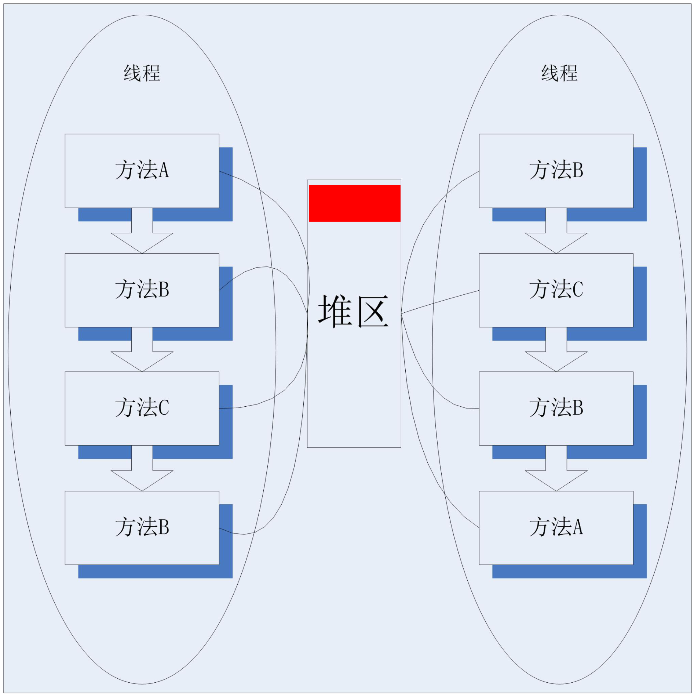
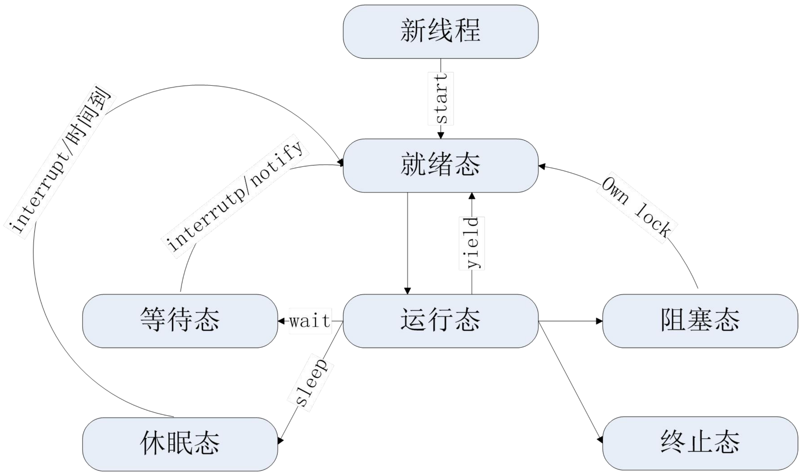
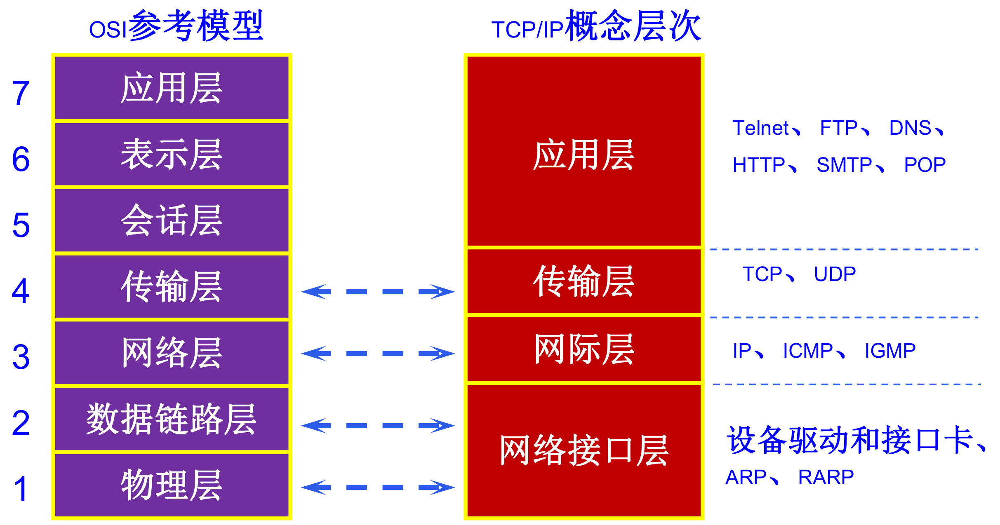

# 实验七、实验八：多线程与套接字通信

整理自 `Java实验.pdf` 第 6～8 页。代码是原稿的，说明、运行结果和易错点是整理时加的。本机没有 JDK，代码没有实际编译运行过，线程输出顺序也是按 Java 的线程调度规则推演的。

## 实验七 火车售票模拟（Ticket.java）

题目：设计一个火车售票模拟程序 `Ticket.java`。假如火车站有 100 张火车票要卖出，现在有 5 个售票点同时售票，用 5 个线程模拟这 5 个售票点的售票情况。要求如下：

1. 打印出每个售票点所卖出的票号；
2. 各售票点不能售出相同票号的火车票。

原稿给的输出示例（左侧数字为售票点编号，右侧数字为卖出火车票编号）：

```
5______100
2______99
4______98
1______97
3______96
……
4______3
3______2
2______1
```

### 参考代码

```java
import java.util.Random;

public class Ticket implements Runnable {
    public int num = 100;

    //重写run（）函数
    public void run() {
        while (num > 0) {
            try {
                Thread.sleep(100);
                synchronized (this) {   //使用同步代码块
                    if (num > 0) {
                        System.out.println(Thread.currentThread().getName() + "______________" + num);
                        num--;
                    }
                }
            } catch (Exception e) {
                e.printStackTrace();
            }
        }
    }

    public static void main(String[] args) {
        Ticket test = new Ticket();
        for (int thread = 1; thread <= 5; thread++) {
            new Thread(test, "" + thread).start();
        }
    }
}
```

### 思路

五个线程共用**同一个** `Ticket` 对象 `test`，所以共用同一个 `num` 字段，这是"一共 100 张票"的前提。`new Thread(test, "" + thread)` 的第二个参数是线程名，传的是 "1" 到 "5"，`Thread.currentThread().getName()` 取出来就是售票点编号。



图中每个线程有自己的一串方法调用（栈），局部变量放在各自的栈里，互不干扰；`new` 出来的对象放在中间的堆区，所有线程都能摸到。本题的 `test` 对象和它的 `num` 字段就在堆区，相当于图中那块红色，五个售票线程的 `run()` 都连到它上面，所以才需要加锁。

实现多线程有两条路：继承 `Thread` 或实现 `Runnable`。这题只能用 `Runnable`，因为要让五个线程共享一份票数。继承 `Thread` 再 new 五个对象的话，每个对象有自己的 `num`，会卖出 500 张票，票号还重复。

`synchronized (this)` 锁的是 `test` 这个对象。五个线程抢同一把锁，同一时刻只有一个能进入同步块，"打印票号"和"票数减一"这两步合起来是原子的，不会出现两个售票点打印同一个票号。

同步块里的 `if (num > 0)` 是第二次判断，不能省。考虑这种时序：`num` 只剩 1，线程 A 和线程 B 在外层 `while (num > 0)` 处**都**通过了判断；A 先拿到锁，卖掉第 1 号票，`num` 变成 0，释放锁；B 拿到锁，如果没有内层判断，就会打印 `0` 号票然后把 `num` 减成 -1。内层这一次判断把 B 挡住，B 退出同步块，回到 `while (num > 0)` 发现不成立，线程结束。

`Thread.sleep(100)` 放在同步块**外面**。放在里面的话，线程会抱着锁睡觉，其他四个线程全部干等，就退化成单线程了。



一个售票线程在这张图上的路线是：`start()` 进就绪态，被调度到运行态；执行 `Thread.sleep(100)` 进休眠态，100 毫秒到了回就绪态；再次运行走到 `synchronized (this)`，如果锁在别的线程手里就进阻塞态，等到拿到锁（图上的 Own lock）回就绪态，再运行时卖一张票；`num` 减到 0 后 `run()` 返回，进终止态。图中运行态通往阻塞态的箭头原图没标文字，这一步就是"申请锁没申请到"。左边 `interrutp/notify` 是笔误，应为 `interrupt/notify`。另外这张图是课件的七状态画法，JDK 的 `Thread.State` 只有六个值：就绪和运行合并成 `RUNNABLE`，休眠对应 `TIMED_WAITING`。

### 运行结果

票号从 100 递减到 1，一共 100 行，每行是"售票点编号 + 14 个下划线 + 票号"：

```
1______________100
3______________99
2______________98
5______________97
4______________96
...
2______________3
1______________2
4______________1
```

左边的售票点编号每次运行都不一样，由操作系统的线程调度决定，题目也没要求固定。右边的票号一定是 100 到 1 严格递减、不重不漏。每轮循环睡 100 毫秒，跑完 100 张票大约要 2 秒。

原稿代码里的分隔符是 14 个下划线，题面示例写的是 6 个（`5______100`）。这不影响判分，想和示例一致就把字符串改成 6 个下划线。

### 容易出错的地方

1. 五个线程用五个对象。`for` 里写成 `new Thread(new Ticket(), "" + thread).start();` 就变成了五个售票点各卖 100 张票，票号大量重复，直接违反第 2 条要求。
2. 忘了加 `synchronized`。不加锁跑一次可能看不出问题，但多跑几次就会看到同一个票号被两个售票点打印，或者出现 `0` 号票。改卷时会专门看有没有同步。
3. 锁错了对象。写成 `synchronized (new Object())`，每个线程锁的都是自己新建的对象，等于没锁。锁必须是所有线程都能访问到的同一个对象，这里的 `this` 就是共享的 `test`。
4. `sleep` 放进同步块。程序还是对的，但五个线程完全串行，看不出并发效果。
5. `num` 应该是 private。原稿写成 `public int num`，外部代码可以绕过锁直接改它。加上 `volatile` 让外层 `while (num > 0)` 每次都读主内存里的最新值也更严谨，不过这里同步块和 `sleep` 已经保证了可见性，实际不会卡住。
6. `run()` 里的异常必须自己处理。`Thread.sleep` 抛的是受检异常 `InterruptedException`，而 `Runnable.run()` 的签名不带 `throws`，没法往外抛，只能 try-catch。
7. 调用了 `run()` 而不是 `start()`。`test.run()` 只是普通方法调用，在当前线程里跑完，根本没开新线程。`start()` 才会创建线程并由 JVM 回调 `run()`。
8. 第一行 `import java.util.Random;` 没用上，删掉。

## 实验八 基于流套接字的客户机/服务器通信

题目：设计基于流套接字的客户机/服务器通信程序。要求如下：

1. 分别编写服务端程序和客户端程序（端口号 1888）。
2. 客户端向服务器发送信息"地瓜、地瓜，我是土豆，请回答！"，服务器接收到信息并显示出来。
3. 同时服务器将信息反馈到客户端"土豆，土豆，我是地瓜，信息已收到！"，客户端收到信息并显示。

### 参考代码

服务端 `Server.java`：

```java
import java.net.*;
import java.io.*;

public class Server {
    public static void main(String[] args) throws Exception {
        ServerSocket serversocket = new ServerSocket(1888);
        System.out.println("等待客户端的连接请求");
        Socket socket = serversocket.accept();
        BufferedReader buffer = null;
        PrintWriter print = null;
        try {
            buffer = new BufferedReader(new InputStreamReader(socket.getInputStream()));
            print = new PrintWriter(socket.getOutputStream(), true);
            String line = buffer.readLine();
            System.out.println("客户端：" + line);
            print.println("土豆，土豆，我是地瓜，信息已收到！");
            buffer.close();
            print.close();
            socket.close();
        } catch (IOException e) {
            e.printStackTrace();
        }
    }
}
```

客户端 `Client.java`：

```java
import java.net.*;
import java.io.*;

public class Client {
    public static void main(String[] args) {
        try {
            Socket socket = new Socket("127.0.0.1", 1888);
            System.out.println("客户端启动");
            PrintStream print = new PrintStream(socket.getOutputStream());
            BufferedReader buffer = new BufferedReader(new InputStreamReader(socket.getInputStream()));
            print.println("地瓜、地瓜，我是土豆，请回答！");
            String response = buffer.readLine();
            System.out.println("服务端：" + response);
            print.close();
            buffer.close();
            socket.close();
        } catch (Exception e) {
            e.printStackTrace();
        }
    }
}
```

### 思路

流套接字（TCP）的骨架两边各四步，背下来就够应付考试：

服务端：`new ServerSocket(端口)` 占住端口 → `accept()` 阻塞等连接，返回一个和某个客户端对应的 `Socket` → 从这个 `Socket` 拿输入输出流读写 → 关闭。

客户端：`new Socket(IP, 端口)` 主动连接 → 拿输入输出流读写 → 关闭。

两个类要分清：`ServerSocket` 只负责"听"，不传数据；真正传数据的是 `accept()` 返回的那个 `Socket`，它和客户端的 `Socket` 是一条连接的两端。

读这边两端都用 `BufferedReader` 包 `InputStreamReader` 包 `socket.getInputStream()`，为的是能用 `readLine()` 按行读。`readLine()` 一直阻塞到读满一行（遇到换行符）或者对方关闭连接为止，所以发送方必须用 `println` 而不是 `print`，否则永远等不到换行符，两边就一起卡死。

写这边服务端用 `PrintWriter`，第二个参数 `true` 是自动 flush；客户端用的是 `PrintStream`。

运行顺序：先启动 `Server`，它停在 `accept()` 上等着；再启动 `Client`。反过来的话客户端会抛 `ConnectException: Connection refused`。

`127.0.0.1` 是本机回环地址，服务端和客户端在同一台机器上调试时用它。跨机器就换成服务端的实际 IP。



题目里的"流套接字"就是图中传输层的 TCP，另一种数据报套接字对应 UDP。`Socket` 和 `ServerSocket` 让程序直接站在传输层上收发字节流，下面的 IP 寻址、网卡收发都由操作系统处理，所以代码里只需要给出 IP 和端口。课件同一章还提到端口号范围是 0～65535，其中 0～1023 留给系统服务，这也是本题用 1888、易错点第 4 条建议别用 1024 以下端口的原因。

### 运行结果

服务端窗口：

```
等待客户端的连接请求
客户端：地瓜、地瓜，我是土豆，请回答！
```

客户端窗口：

```
客户端启动
服务端：土豆，土豆，我是地瓜，信息已收到！
```

两个程序跑完都会正常退出。服务端处理完这一个客户端就结束了，想连续接待多个客户端，要把 `accept()` 之后的部分放进 `while (true)` 循环，每接到一个连接开一个线程去处理。

### 容易出错的地方

1. `PrintWriter` 忘了写 `true`。`new PrintWriter(socket.getOutputStream())` 默认不自动刷新，`println` 的内容留在缓冲区里发不出去，对方 `readLine()` 一直等，两边互相干等。服务端这里传了 `true`，是对的。客户端用的 `PrintStream` 包在 socket 输出流外面，`println` 会把字节直接交给 socket 流，所以不写 `true` 也能发出去，但两边统一用 `new PrintWriter(流, true)` 更好记，也不容易出错。不确定的时候，`println` 后面补一句 `flush()` 最稳。
2. 用了 `print` 而没用 `println`。少一个换行符，`readLine()` 就收不全，表现和上一条一样：卡住不动。
3. 启动顺序反了，客户端抛 `ConnectException: Connection refused (Connection refused)`。
4. 端口被占用，服务端抛 `BindException: Address already in use`。上一次运行的服务端没退干净就会这样，在 IDE 里把旧进程停掉，或者换个端口（1024 以下的端口要管理员权限，别用）。
5. 中文乱码。`InputStreamReader` 和 `PrintWriter` 不指定字符集时用平台默认编码。两边都在同一台 Windows 机器上跑不会有问题；一边 UTF-8 一边 GBK 就会乱码。跨机器时两边都写明 `new InputStreamReader(in, "UTF-8")` 和 `new PrintWriter(new OutputStreamWriter(out, "UTF-8"), true)`。
6. 关流的顺序不对。关了包在最外层的 `print` 或 `buffer`，底层的 socket 流也跟着关了，再去读写就抛 `SocketException: Socket closed`。所以读写都做完了再统一关。
7. `ServerSocket` 没关。原稿只关了 `socket`，没关 `serversocket`。程序马上就退出了，端口会被操作系统回收，所以看不出问题；写在长期运行的程序里就是端口泄漏。
8. 异常处理的范围太大。服务端的 `new ServerSocket` 和 `accept()` 写在 try 外面，靠 `main` 上的 `throws Exception` 往外抛，端口被占用时打印的是一大段堆栈，不如在 try 里给一句人话提示。
