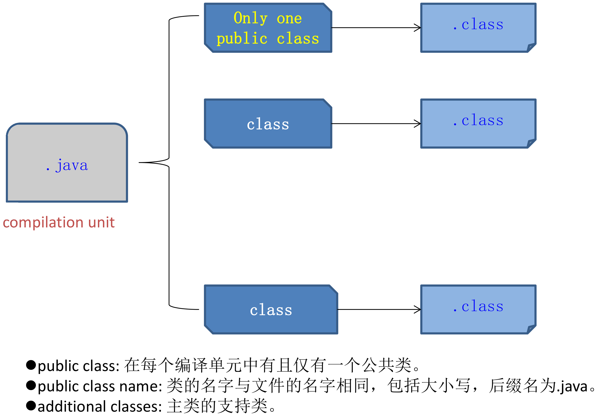
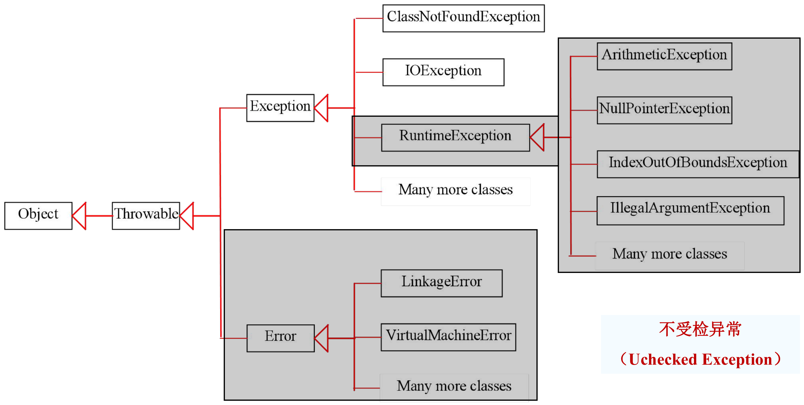

# 常见错误速查

这份是把 `Java实验.pdf` 八道实验题里的易错点按主题重排的，细节和例子在 `01`～`04` 四份整理稿里。考前过一遍，写代码卡住时按症状查。

## 一上手就编译不过

| 症状 | 原因 | 改法 |
|---|---|---|
| `class X is public, should be declared in a file named X.java` | public 类名和文件名不一致 | 文件名改成和 public 类同名。实验一里 public 类是 `E1_03`，文件就得叫 `E1_03.java` |
| 一个文件里写了两个 public 类 | 一个源文件只能有一个 public 类 | 去掉其中一个的 public，或者拆成两个文件。实验一的 `Point`、`Triangle` 就是不带 public 的 |
| `unreported exception ...; must be caught or declared to be thrown` | 受检异常没处理 | try-catch 包起来，或者在方法后面写 `throws`。`Thread.sleep`、所有 IO 操作、`Class.forName` 都是受检异常 |
| `cannot find symbol: class InputMismatchException` | 忘了 import | `InputMismatchException`、`Scanner`、`HashMap` 都在 `java.util`；IO 类在 `java.io`；网络类在 `java.net`；Swing 在 `javax.swing`，AWT 的 `Color`、`GridLayout` 在 `java.awt` |
| 实现了接口却报 abstract 错误 | 接口方法没全部实现 | `implements Common` 就要同时写出 `speed()` 和 `init()`；`implements ActionListener` 就要写 `actionPerformed`；`implements Runnable` 就要写 `run()` |

表中前两行都和这张图有关：public 类只能有一个，文件名跟着它走，其余的类不带 public 就能放进同一个文件。

## Scanner 读输入

- `nextInt()` 读到非整数抛 `InputMismatchException`，并且**不消耗**那个词。catch 里必须调用 `sc.next()` 把它丢掉，否则死循环（实验二）。
- `next()` 以空白分隔，读不到带空格的书名（实验五）。
- 输入流读完了还在读，抛的是 `NoSuchElementException`，不是 `InputMismatchException`。
- `nextInt()` 之后紧跟 `nextLine()`，读到的是上一行剩下的换行符，会得到空串。
- 坐标之间用空格或回车分隔，写成 `0,0` 一定崩（实验一）。

## 数值与类型转换

- **整数除法先发生**。`(float)(A*B/C)` 里 A、B、C 都是 int，除法按整数算完才转 float。实验三的 Car007 用 23、34、45，写错了得 58.82353 小时，写对了是 57.544758 小时。转型要放在除法之前：`(float) A * B / C`。
- `float` 只有约 7 位有效数字，`double` 约 16 位。同一个 1000/90，float 打印 `11.111111`，double 打印 `11.11111111111111`。
- 浮点数不精确。实验一用海伦公式算边长为 1、1、 $\sqrt2$ 的直角三角形，输出是 `0.49999999999999983` 而不是 `0.5`。要整齐的结果就换成只有加减乘的叉积公式。
- `int` 相乘会溢出成负数，先转成 float 或 long 再乘。

## 异常处理

判断要不要 try-catch 或 `throws`，先在这张图上找异常的位置。灰框外的受检异常编译器强制处理，八道题里碰到的是 `IOException`（实验六、实验八）、`ClassNotFoundException`（实验三）和 `InterruptedException`（实验七的 `sleep`）；灰框里的 `InputMismatchException`、`NullPointerException`、`ArithmeticException` 不强制。

- try 块尽量只包可能出错的那几行，catch 的异常类型尽量具体。IO 抓 `IOException`，输入格式抓 `InputMismatchException`，抓 `Exception` 会把空指针之类一起吞掉。
- catch 里要么处理掉、要么打印堆栈，空 catch 块是最难查的 bug。
- 关流放在 finally 里，或者直接用 try-with-resources，括号里声明的流会自动关。
- 调试用的 `assert` 语句交作业前删干净。实验六原稿循环里留了一句 `assert false;`，用 `java -ea` 跑第一轮就抛 `AssertionError`。

## 集合

- `HashMap` 遍历无序，要插入顺序用 `LinkedHashMap`，要排序用 `TreeMap`，方法名完全一样。
- 自定义类当 key 必须重写 `hashCode()` 和 `equals()`，否则两个内容相同的对象算两个 key。用 String 当 key 不用操心。
- `entrySet()` 一次拿键值，比 `keySet()` 再 `get()` 快一点；只要值就用 `values()`。
- 不带泛型的原始类型 `HashMap`，取出来是 `Object`，要强制转换，编译器会给 unchecked 警告。

## IO 流

- 相对路径相对的是 JVM 的**工作目录**，IDEA 里默认是项目根目录，不是 `.java` 文件所在的目录。不确定就打印 `new File(".").getAbsolutePath()`。
- 写完必须 `flush()` 或 `close()`，否则文件是空的或者缺一截。
- `read(buffer)` 的返回值是这次实际读到的字节数，写 `new String(buffer, 0, test)`，不能写 `new String(buffer)`。
- 按字节读中文，汉字跨缓冲区边界会乱码。读文本用 `BufferedReader` 加 `InputStreamReader` 并指定字符集；纯复制文件读一段写一段，不要先拼成字符串。
- 关外层流会连带关掉内层，所以只关最外层就够。

## 多线程

- 五个线程要共享同一份数据，就得实现 `Runnable` 并让它们共用一个对象。各 new 一个对象等于各卖各的票（实验七）。
- `start()` 才开新线程，`run()` 只是普通方法调用。
- 同步块要锁所有线程都能访问到的同一个对象，`synchronized (this)` 里的 `this` 指那个共享对象。
- 进了同步块还要再判断一次条件。外层 `while (num > 0)` 通过之后，可能别的线程已经把票卖光了。
- `sleep` 放在同步块外面，否则抱着锁睡觉，并发就没了。
- 共享变量写成 `private`，跨线程读的加 `volatile`。

## 网络

- 先启动服务端再启动客户端，顺序反了是 `ConnectException: Connection refused`。
- 端口被上一次没退干净的进程占着，服务端抛 `BindException: Address already in use`。
- `ServerSocket` 只负责监听，传数据的是 `accept()` 返回的 `Socket`。
- 发送用 `println`（要有换行符），`PrintWriter` 记得传 `true` 自动刷新，不然对方 `readLine()` 一直等。
- 两端字符集要一致，跨机器时显式写 `"UTF-8"`。
- 读写都做完再关流，关早了后面就是 `SocketException: Socket closed`。

## Swing

- 组件全部加完之后再 `setVisible(true)`。
- 忘了 `setDefaultCloseOperation(JFrame.EXIT_ON_CLOSE)`，点叉只隐藏窗口，JVM 不退出。
- `e.getSource()` 和组件比较用 `==`；用 `getActionCommand()` 比按钮文字才用 `equals`。
- 默认的 Metal 外观下 `setBackground` 能改按钮颜色；换成系统外观后要配合 `setContentAreaFilled(false)` 和 `setOpaque(true)`。

## 考前能默写出来吗

按题目回想，写不出来就回对应的整理稿看：

1. 两点距离和海伦公式，三角不等式怎么判（实验一）。
2. `while(true)` + `nextInt()` + `catch` 里 `sc.next()` 的完整循环（实验二）。
3. 接口 + `Class.forName(str).newInstance()` + 强制转换成接口类型，为什么新增类不用改旧代码（实验三）。
4. `JFrame` 加 `GridLayout` 加 `addActionListener(this)` 加 `actionPerformed` 的四步（实验四）。
5. `HashMap.put`、`entrySet()` 遍历、方法以 `HashMap` 为参数（实验五）。
6. 字节流四件套和 `while ((len = in.read(buf)) != -1)` 循环（实验六）。
7. `implements Runnable` + 共享对象 + `synchronized` 双重判断（实验七）。
8. 服务端四步和客户端四步的套接字骨架（实验八）。

课程 README 里提到历年题的选择题会重复出，实验题目最好掌握，编程题多写注释。这八道题正好覆盖了类与对象、异常、接口、GUI、集合、IO、线程、网络，编程大题基本出不了这个范围。
