# 第2章 进程、线程与作业

整理自 `笔记/操作系统原理笔记.pdf` 第2章。笔记正文只做了机械清洗和改错，章首要点、章末对比表、易错点和典型题是整理时写的。

## 本章要点

- 复习范围是课件 2.1 多道程序设计、2.2 进程的引入、2.3 线程与轻进程，对应下面的 2.1、2.2、2.3。2.4 作业不在范围里，但和第3章的作业调度连着，可以顺便看。
- 配套讲义：[第2章 进程、线程与作业（重制版）](<../重制版PPT/第2章 进程、线程与作业（重制版）.pptx>)，原课件 `课件/02第二章 进程线程与作业1.pptx`
- **多道程序设计**：内存中同时放多道程序，交替运行，提高设备、内存、处理器的利用率。它带来处理器、内存、设备三类资源的管理问题；道数不是越多越好。
- **进程**：具有独立功能的程序在一个数据集合上的一次运行活动，是资源分配和调度的独立单位。**PCB** 是进程存在的唯一标志。
- 进程由 PCB（属于操作系统空间）和程序（代码、数据、栈，属于用户空间）组成。进程的物理实体和支持它运行的环境合称进程上下文。
- 三种基本状态：运行、就绪、等待。就绪→运行（被调度）、运行→就绪（时间片到或被剥夺）、运行→等待（申请资源不得、启动 I/O）、等待→就绪（资源到手、I/O 完成）。加上创建、终止就是五状态。
- 进程与程序：进程动态、有生存期，程序静态、可长期保存；一个程序可以对应多个进程。
- **线程**：进程内相对独立的执行流，只拥有 PC、寄存器、栈等少量资源，和同进程的其他线程共享其余资源。TCB 是线程存在的标志。
- 线程实现方式：用户级线程（库函数实现，TCB 在用户空间）、核心级线程（系统调用实现，TCB 在系统空间）、Solaris 的混合模型（用户线程、LWP、核心线程三层）。
- UNIX：`fork` 复制父进程地址空间，`vfork` 只复制控制结构、与父进程共享地址空间，`exec` 加载新程序，`exit` 结束，`wait` 等子进程结束。
- 作业由程序、数据、作业说明书组成；作业进入内存后变成进程，一个作业通常对应多个进程。

---

**问题：**

（1）为什么要引入进程（2）什么是进程？进程由什么组成？（3）进程是如何解决问题的？

## 2.1 多道程序设计

### 2.1.1 单道程序设计的缺点

单道程序设计是一种只允许一个程序进入系统的程序设计方法。它的主要缺点是资源利用率极低，具体表现在以下几个方面：
1. **设备资源利用率低**：在单道程序系统中，内存中仅存在一个程序，该程序一般只能用到这些设备集合的一个子集，而很多未被用到的设备则会闲置。
2. **内存资源利用率低**：随着硬件技术的提高和成本的下降，内存容量在不断增加，而一般程序的长度远远小于内存容量。在此情况下，若仍然采用单道程序设计，内存空间的浪费将是惊人的。
3. **处理器资源利用率低**：在单道程序系统中，如果运行程序不执行输入输出操作，则处理器的利用率一般不受影响。然而不与任何外围设备打交道的程序是很少的，绝大多数程序都需要通过输入输出操作与外部交往。

### 2.1.2 多道程序设计的提出

多道程序设计可以有效地提高系统中各种资源的利用率，从而提高系统吞吐量。主要优点如下：
1. **设备资源利用率提高**：如果允许若干个搭配合理的程序同时进入内存，这些程序分别使用不同的设备资源，则系统中的各种设备资源都会被用到并经常处于忙碌状态。
2. **内存资源利用率提高**：允许多道程序同时进入系统可以避免单道程序过短而内存空间过大所造成的存储空间的浪费，从而提高内存资源的利用率。
3. **处理器资源利用率提高**：如果将两道程序同时放入内存，在一个程序等待输入输出操作完成期间，处理器执行另一个程序，这样便可提高处理器的利用率。

### 2.1.3 多道程序设计的问题

多道程序设计改善了系统资源的使用情况，从而增加了吞吐量，提高了系统效率，但是同时也带来了新的问题，即资源竞争。需要解决以下问题：
1. **处理器资源管理问题**：如果在任意时刻，系统中只有一个程序可以运行，问题比较容易解决，可以将处理器分配给这个唯一具备运行条件的程序。但是，由于可运行程序的数量一般远远多于处理器的数量，这就需要解决可运行程序与处理器资源竞争的问题，或者说，需要对处理器资源加以管理，实现处理器资源在各个程序之间的分配和调度。
2. **内存资源管理问题**：为使多个程序在一个系统中共存，需要按某种原则对内存空间进行划分，并将其分配给各个程序。由于一个程序在内存中的实际存放位置在其装入系统之前无法确定，而且在程序运行过程中地址还可能发生变化，因而程序只能使用相对地址，不能使用绝对地址。
3. **设备资源管理问题**：用户都希望内存中的多道程序在使用设备时不发生冲突，即使它们在同一时刻使用系统中的不同设备资源，而对相同设备资源的使用在时间上应该尽量错开。尽管操作系统在选择程序进入系统时可以使进入系统的程序搭配得相对合理，但是由于程序使用资源的不确定性以及程序推进速度的不确定性，上述理想情况是很难达到的。也就是说，多个程序同时要求使用同一资源的情况会经常发生，这就要求操作系统确定适当的分配策略，并据此对资源加以管理。

## 2.2 进程

### 2.2.1 进程的概念和特征

**1. 进程的概念**
- **进程**是在多道程序环境下，允许多个程序**并发执行**的概念。这些程序将失去封闭性，并具有间断性及不可再现性的特征。进程的引入有助于更好地描述和控制程序的并发执行，实现操作系统的并发性和共享性(最基本的两个特性)。
- 为了使参与并发执行的每个程序(含数据)都能独立地运行，必须为之配置一个专门的数据结构，称为**进程控制块(Process Control Block,PCB)**。系统利用 PCB 来描述进程的基本情况和运行状态，进而控制和管理进程。
- 由程序段、相关数据段和 PCB三部分构成了**进程实体**(又称进程映像)。所谓创建进程，实质上是创建进程实体中的PCB;而销毁进程，实质上是撤销进程的 PCB。注意，进程映像是静态的，进程则是动态的。
- 注意：**PCB 是进程存在的唯一标志!**
- 从不同的角度，进程可以有不同的定义，比较典型的定义有：
  1. 进程是程序的一次执行过程。
  2. 进程是一个程序及其数据在处理机上顺序执行时所发生的活动。
  3. 进程是具有独立功能的程序在一个数据集合上运行的过程，它是系统进行资源分配和调度的一个独立单位。
- 引入进程实体的概念后，我们可以把传统操作系统中的进程定义为：“进程是进程实体的运行过程，是系统进行资源分配和调度的一个独立单位。”
- 读者要准确理解这里说的系统资源。它指处理机、存储器和其他设备服务于某个进程的“时间",例如把处理机资源理解为处理机的时间片才是准确的。因为进程是这些资源分配和调度的独立单位，即“时间片”分配的独立单位，这就决定了进程一定是一个动态的、过程性的概念。

**2. 进程的特征（理解即可）**
- 进程是由多道程序的并发执行而引出的，它和程序是两个截然不同的概念。进程的基本特征是对比单个程序的顺序执行提出的，也是对进程管理提出的基本要求。
- **动态性**：进程是程序的一次执行，它有着创建、活动、暂停、终止等过程，具有一定的生命周期，是动态地产生、变化和消亡的。动态性是进程最基本的特征。
- **并发性**：指多个进程实体同存于内存中，能在一段时间内同时运行，引入进程的目的就是使进程能和其他进程并发执行。并发性是进程的重要特征，也是操作系统的重要特征。
- **独立性**：指进程实体是一个能独立运行、独立获得资源和独立接受调度的基本单位。凡未建立 PCB的程序，都不能作为一个独立的单位参与运行。
- **异步性**：由于进程的相互制约，使得进程按各自独立的、不可预知的速度向前推进。异步性会导致执行结果的不可再现性，为此在操作系统中必须配置相应的进程同步机制。

【进程的概念】

**并发与并行的区别**
- 并发：concurrent
  - 宏观同时，“交替执行”，不要求多个CPU
- 并行：parallel
  - 微观同时，要求多个CPU“并行算法”

### 2.2.2 进程状态及状态转换

**1. 进程的状态**

进程在其生命周期内，由于系统中各进程之间的相互制约及系统的运行环境的变化，使得进程的状态也在不断地发生变化。通常进程有以下5种状态，**前3种是进程的基本状态**。
1. **运行态**：进程正在处理机上运行。在单处理机中，每个时刻只有一个进程处于运行态。
2. **就绪态**：进程获得了除处理机外的一切所需资源，一旦得到处理机，便可立即运行。系统中处于就绪状态的进程可能有多个，通常将它们排成一个队列，称为就绪队列。
3. **等待态**，又称阻塞态：进程正在等待某一事件而暂停运行，如等待某资源为可用(不包括处理机)或等待输入/输出完成。即使处理机空闲，该进程也不能运行。系统通常将处于阻塞态的进程也排成一个队列，甚至根据阻塞原因的不同，设置多个阻塞队列。
4. **创建态**：进程正在被创建，尚未转到就绪态。创建进程需要多个步骤：首先申请一个空白PCB,并向PCB中填写用于控制和管理进程的信息；然后为该进程分配运行时所必须的资源；最后把该进程转入就绪态并插入就绪队列。但是，如果进程所需的资源尚不能得到满足，如内存不足，则创建工作尚未完成，进程此时所处的状态称为创建态。
5. **终止态**：进程正从系统中消失，可能是进程正常结束或其他原因退出运行。进程需要结束运行时，系统首先将该进程置为终止态，然后进一步处理资源释放和回收等工作。

**注意区别就绪态和等待态**：就绪态是指进程仅缺少处理器，只要获得处理机资源就立即运行；而等待态是指进程需要其他资源(除了处理机)或等待某一事件。之所以把处理机和其他资源切分开，是因为在分时系统的时间片轮转机制中，每个进程分到的时间片是若干毫秒。也就是说，进程得到处理机的时间很短且非常频繁，进程在运行过程中实际上是频繁地转换到就绪态的：而其他资源(如外设)的使用和分配或某一事件的发生(如I/O操作的完成)对应的时间相对来说很长，进程转换到等待态的次数也相对较少。这样来看，就绪态和等待态是进程生命周期中两个完全不同的状态，显然需要加以区分。

**2. 进程状态的转换**

图2.1说明了5种进程状态的转换，而**3种基本状态之间的转换如下**：【注意教材中只有3个基本状态】
- **就绪态→运行态**：处于就绪态的进程被调度后，获得处理机资源(分派处理机时间片), 于是进程由就绪态转换为运行态。**【获得处理机】**
- **运行态→就绪态**：处于运行态的进程在时间片用完后，不得不让出处理机，从而进程由运行态转换为就绪态。此外，在可剥夺的操作系统中，当有更高优先级的进程就绪时，调度程序将正在执行的进程转换为就绪态，让更高优先级的进程执行。**【剥夺处理机】**
- **运行态→等待态**：进程请求某一资源(如外设)的使用和分配或等待某一事件的发生(如I/O操作的完成)时，它就从运行态转换为阻塞态。进程以系统调用的形式请求操作系统提供服务，这是一种特殊的、由运行用户态程序调用操作系统内核过程的形式。【申请资源未得到，启动IO】
- **等待态→就绪态**：进程等待的事件到来时，如I/O操作结束或中断结束时，中断处理程序必须把相应进程的状态由阻塞态转换为就绪态。**【得到资源，IO中断】**

需要注意的是，一个进程从运行态变成等待态是主动的行为，而从等待态变成就绪态是被动的行为，需要其他相关进程的协助。

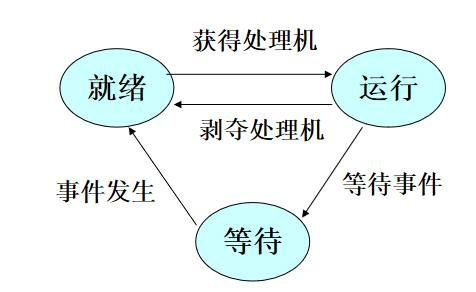

- 进程状态转换由操作系统完成，对用户是透明的；
- 进程在其生存期内经过多次状态转换，体现了进程的动态性和并发性。

### 2.2.3 进程的组成与上下文

  进程是一个独立的运行单位，也是操作系统进行资源分配和调度的基本单位。它由以下三部分组成，其中最核心的是进程控制块(PCB)。

**1. 进程控制块(PCB)**
- 进程创建时，操作系统为它新建一个 PCB,该结构之后常驻内存，任意时刻都可以存取，并在进程结束时删除。**PCB 是进程实体的一部分，是进程存在的唯一标志。标志进程存在的数据结构，其中保存系统管理进程所需的全部信息**
- 进程执行时，系统通过其 PCB了解进程的现行状态信息，以便操作系统对其进行控制和管理：进程结束时，系统收回其 PCB,该进程随之消亡。
- 当操作系统欲调度某进程运行时，要从该进程的 PCB中查出其现行状态及优先级；在调度到某进程后，要根据其 PCB中所保存的处理机状态信息，设置该进程恢复运行的现场，并根据其PCB中的程序和数据的内存始址，找到其程序和数据；进程在运行过程中，当需要和与之合作的进程实现同步、通信或访问文件时，也需要访问PCB:当进程由于某种原因而暂停运行时，又需将其断点的处理机环境保存在 PCB中。
- PCB主要包括进程描述信息、进程控制和管理信息、资源分配清单和处理机相关信息等。各部分的主要说明如下：
  - **进程描述信息**：进程标识符：标志各个进程，每个进程都有一个唯一的标识号。用户标识符：进程归属的用户，用户标识符主要为共享和保护服务。
  - **进程控制和管理信息**：进程当前状态：描述进程的状态信息，作为处理机分配调度的依据。进程优先级：描述进程抢占处理机的优先级，优先级高的进程可优先获得处理机。
  - **资源分配清单**：用于说明有关内存地址空间或虚拟地址空间的状况，所打开文件的列表和所使用的输入/输出设备信息。
  - **处理机相关信息**：也称处理机的上下文，主要指处理机中各寄存器的值。当进程处于执行态时，处理机的许多信息都在寄存器中。当进程被切换时，处理机状态信息都必须保存在相应的PCB中，以便在该进程重新执行时，能从断点继续执行。
- 在一个系统中，通常存在着许多进程的 PCB,有的处于就绪态，有的处于阻塞态，而且阻塞的原因各不相同。为了方便进程的调度和管理，需要将各进程的 PCB用适当的方法组织起来。目前，常用的组织方式有链接方式和索引方式两种。链接方式将同一状态的 PCB链接成一个队列，不同状态对应不同的队列，也可把处于阻塞态的进程的PCB,根据其阻塞原因的不同，排成多个阻塞队列。索引方式将同一状态的进程组织在一个索引表中，索引表的表项指向相应的PCB,不同状态对应不同的索引表，如就绪索引表和阻塞索引表等。

【下面是教材上的内容：】

进程控制块 (PCB) 是进程的核心，它包含了以下信息：
1. **进程标识**：通常为一个整数，称为进程号，用于区分不同的进程。
2. **用户标识**：通常也为一个整数，称为用户号，用于区分不同的用户。一个进程号与唯一的用户号相对应，而一个用户号可以与多个进程号相对应，即一个用户可以同时拥有多个进程。
3. **进程状态**：在就绪、运行、等待之间动态变化。
4. **调度参数**：用于确定下一个运行的进程。
5. **现场信息**：用于保存进程暂停的断点信息，包括通用寄存器、地址映射寄存器、PSW、PC。
6. **家族联系**：记载本进程的父进程。
7. **程序地址**：记载进程所对应程序的存储位置和所占存储空间大小，具体内容与存储管理方式有关。
8. **当前打开文件**：用于记载进程正在使用的文件，通过它与内存文件管理表目建立联系，通过该表可以找到保存在外存中的文件。
9. **消息队列指针**：指向本进程从其他进程接收到的消息所构成消息队列的链头。
10. **资源使用情况**：记载该进程生存期间所使用的系统资源和使用时间，用于记账。对于同一用户来说，他的全部进程所使用的资源都记载在该用户的账目下。
11. **进程队列指针**：用于构建进程控制块队列，它是系统管理进程所需要的。
- **进程的组成**
  - **进程控制块**(process control block)【属于操作系统空间】
    - 建立进程→建立PCB
    - 撤销PCB→撤销进程
    - 只有操作系统才能够对其进行存取，用户程序不能访问。实际上，用户甚至感觉不到进程控制块的存在。
  - **程序**【属于用户空间】
    - 代码(code)
    - 数据(data)（包括静态变量、动态堆和动态栈）
    - 堆栈(stack+heap)
      - 栈：保存返回点、参数、返回值、局部变量
      - 堆：动态变量

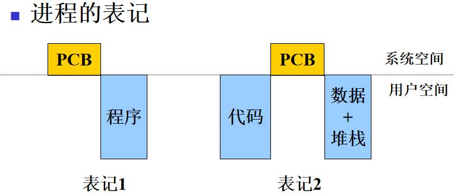

- **进程上下文（process context)**
  - 进程的物理实体与支持进程运行的物理环境统称为进程上下文。它主要包括以下两部分：
    - **进程控制块（PCB）和程序**：这是进程的物理实体，包括程序代码和相关数据。
    - **系统环境**：这是支持进程运行的环境，包括地址空间、系统栈、打开的文件表等。
- **上下文切换（context switch)**
  - 上下文切换是指操作系统从一个进程的上下文转到另一个进程的上下文。在多任务环境中，上下文切换使得CPU能够在多个进程之间进行切换，从而实现多任务并发执行。
- **系统开销（system overhead)**
  - 系统开销是指运行操作系统程序完成系统管理工作所花费的时间和空间。这包括处理器时间、内存空间、磁盘空间等。系统开销是评价操作系统性能的一个重要指标，理想的操作系统应该尽可能地减小系统开销。

### 2.2.4 进程的队列

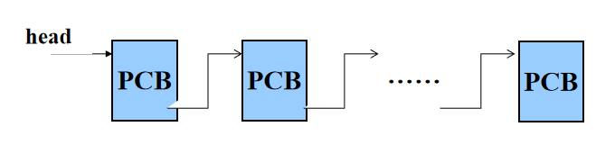

- 进程的队列是由进程控制块（PCB）构成的队列。这些队列可能是先进先出（FIFO）的，也可能不是，可能是单向的，也可能是双向的。主要包括以下几种类型：
  - **就绪队列**：系统中可能有一个或者若干个就绪队列，具体数量取决于调度算法。就绪队列中的进程已经准备好运行，只是等待处理器资源。
  - **等待队列**：对于每个等待事件，系统中都会有一个相应的等待队列。等待队列中的进程正在等待某些事件的发生，例如输入/输出操作的完成。
  - **运行队列**：在单处理器系统中只有一个运行队列，在多处理器系统中每个CPU各有一个运行队列，每个队列中只有一个进程。指向运行队列头部的指针被称为运行指示字。

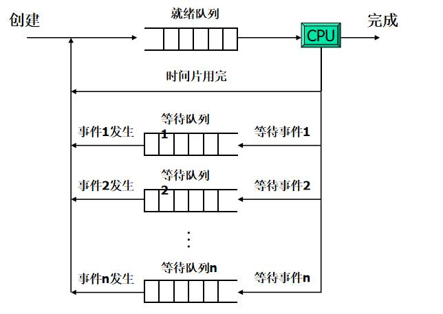

进程初创后进入就绪队列：CPU空闲下来时从就绪队列中选取进程使其运行，获得处理器的进程用完所分得的时间片后回到就绪队列：运行进程因某一事件受阻进入相应的等待队列，等待进程在所等事件发生后进入就绪队列，运行进程正常结束后离开系统。

### 2.2.5 进程的类型和特性

- **进程类型**：进程主要分为两种类型：
  - **系统进程**：这类进程运行操作系统程序，完成系统管理（服务）功能。例如，在UNIX系统中，进程#0（sched）和进程#1（init）就是系统进程。
  - **用户进程**：这类进程运行用户（应用）程序，为用户服务。例如，在UNIX系统中，vi、shell、cc等都是用户进程。

- **进程的特征**
  - **并发性**：进程可以与其他进程一道向前推进，实现多任务并发执行。
  - **动态性**：进程具有动态产生和消亡的特性，其生存期内状态也会动态变化。
  - **独立性**：一个进程是可以调度的基本单位，具有独立运行的能力。
  - **交往性**：同时运行的进程可能发生相互作用，例如通过进程间通信（IPC）进行数据交换。
  - **异步性**：进程以各自独立，不可预知的速度向前推进，这是由CPU调度策略决定的。
  - **结构性**：每个进程都有一个进程控制块（PCB），用于存储进程的状态信息、程序计数器、CPU寄存器和内存信息等。

### 2.2.6  进程间的相互联系与相互作用

- **相互联系**
  - **相关进程**
    - 在逻辑上具有某种联系的进程称为相关进程。这些进程通常属于同一家族，可以共享文件，需要相互通讯，协调推进速度。例如，父进程可以监视子进程，子进程完成父进程交给的任务。
  - **无关进程**
    - 这些进程没有逻辑关系，但是同时执行。它们之间可能存在资源竞争关系，可能会出现互斥、死锁、饿死等问题。

- **相互作用**
  - **直接相互作用：**进程之间不需要通过媒介而发生的相互作用，这种相互作用通常是有意识的。这种作用发生在相关进程之间，例如，父子进程间的通信。

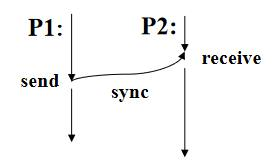

  - **间接相互作用：**进程之间需要通过某种媒介而发生的相互作用，这种相互作用通常是无意识的。这种作用可以发生在任何进程之间，例如，通过共享资源进行的通信。

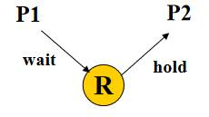

### 2.2.7 进程的创建与撤销

- **进程的创建**
  - 进程的创建主要包括以下步骤：
    - **建立进程控制块（PCB）**：PCB是用于存储进程相关信息的数据结构。
    - **分配内存**：为新进程在内存中分配空间。
    - **加载程序**：将程序代码和数据加载到分配的内存中。
    - **入就绪链**：将新进程加入到就绪队列中，等待调度执行。
    在UNIX系统中，进程的创建通常通过`fork()` 和`exec()` 函数实现。`fork()` 函数创建一个新的进程，该进程是调用进程的副本；`exec()` 函数则用新的程序替换当前进程的程序。
- **进程的撤销**
  - 进程的撤销主要包括以下步骤：
    - **去配资源**：回收进程使用的所有资源，如内存、文件描述符等。
    - **撤销PCB**：删除进程的进程控制块。
    - **通知父进程**：通过发送信号等方式通知父进程，子进程已经结束。
    在UNIX系统中，进程的撤销通常通过`exit()` 或`kill` 命令实现。`exit()` 函数结束当前进程；`kill` 命令则用于发送信号给其他进程，包括结束进程的信号。
- **进程汇聚**
  - 进程汇聚是指一个父进程创建一个或多个子进程，然后等待一个或多个子进程的结束。这是一种常见的并发编程模式，可以使父进程和子进程并发执行，提高系统的并行性。
- 除初始进程外，其它进程都是由某个父进程创建的，这些进程形成了一个进程家族。在这个家族中，每个进程都有一个父进程，可能有多个子进程。

**考虑生灭的进程状态转换图**

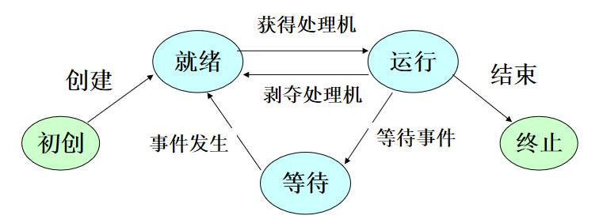

### 2.2.8 进程与程序的联系和差别

- **进程与程序的联系**
  - **进程包括一个程序**：进程是程序的一次执行过程，它包含了程序的代码和当前的活动状态。
  - **进程存在的目的就是执行这个程序**：进程是为了完成特定任务而执行程序的实体。

- **进程与程序的差别**
  - **程序静态，进程动态**：程序是存储在磁盘上的一组指令，是静态的；而进程是程序的执行过程，它是动态的，有生命周期。
  - **程序可长期保存，进程有生存期**：程序可以长期保存在磁盘上，直到被删除；而进程从创建到终止只有一定的生存期。
  - **一个程序可对应多个进程，一个进程只能执行一个程序**：同一个程序可以被多次执行，每次执行都会产生一个新的进程；但是一个进程在其生命周期内只能执行一个程序。

### 2.2.9 UNIX进程的创建与撤销

- **相关系统调用**
  - **创建子进程**
    - `Pid = fork()` ：这个调用会创建一个新的进程，这个新进程是调用它的进程（父进程）的复制品。返回值是新进程的进程ID，对于父进程，返回的是子进程的ID；对于子进程，返回的是0。
  - **加载并执行新程序**
    - `execl(prog, arg0,…,argn-1,0)` ：这个调用会加载并执行一个新的程序。它会用新程序覆盖当前进程的程序，并从新程序的第一条指令开始执行。`arg0,…,argn-1` 是传递给新程序的参数。
  - **进程自我结束**
    - `exit(status)` ：这个调用会结束当前进程。`status` 是进程的终止状态。这个调用会唤醒父进程，让父进程知道子进程已经结束。
  - **等待子进程终止**
    - `pid=wait(&status)` ：这个调用会让当前进程等待一个子进程的终止。返回的是终止的子进程的ID，`status` 参数会被设置为子进程的终止状态。

**vfork 与 fork**

**fork**

`fork` 是 UNIX 系统中用于创建新进程的系统调用。其主要功能和特点如下：
- **复制地址空间**：`fork` 会复制父进程的整个地址空间（包括代码、数据和栈）。
- **复制控制结构**：`fork` 也会复制父进程的进程控制块（PCB）。
- **父子进程独立**：`fork` 创建的子进程是父进程的完整复制品，父子进程之间有各自独立的数据拷贝。

然而，`fork` 也存在一些问题：
- **不加载新程序**：`fork` 创建的子进程会继续执行父进程的程序，而不是加载新的程序。
- **不能实现数据共享**：由于父子进程的数据是独立的，因此 `fork` 不能实现数据共享，也不能描述诸如“有界缓冲区”问题。
- **若加载新程序，复制没有意义**：如果在 `fork` 之后立即使用 `exec` 系列函数加载新程序，那么`fork` 的复制操作就没有意义，会浪费时间和空间。

**vfork**

`vfork` 是 UNIX 系统中的另一个用于创建新进程的系统调用，它试图解决 `fork` 的一些问题。其主要功能和特点如下：
- **只复制控制结构**：`vfork` 只复制父进程的进程控制块（PCB），而不复制地址空间。
- **父子进程共享地址空间**：`vfork` 创建的子进程与父进程共享地址空间，这使得数据共享成为可能。

`vfork` 的典型使用场景是：
- 父进程使用 `vfork` 创建子进程；
- 子进程与父进程共享地址空间；
- 子进程使用 `execve` 改变其虚拟地址空间，加载并执行新程序。

## 2.3 线程

### 2.3.1 线程的引入

- **进程切换**
  - 进程切换**涉及的上下文内容多，开销大**，因此被认为是“笨重”的。上下文包括：
    - **进程控制块（PCB）和程序**：这是进程的物理实体，包括程序代码和相关数据。
    - **系统环境**：这是支持进程运行的环境，包括地址空间、系统栈、打开的文件表等。
  - 此外，相关进程之间的**耦合关系较差**，这也是进程切换面临的问题。
- **解决方案**
  - 为了解决上述问题，引入了**多线程**的概念。在同一进程中可以包含多个线程，**每个线程都有自己的上下文**，这使得**上下文切换只涉及寄存器和用户栈**，从而提高了切换的速度。此外，相关线程之间的**通信更加方便和快捷**。

### 2.3.2 线程的概念

- **线程是在进程中一个相对独立的执行流**，它是**操作系统能够进行运算调度的最小单位**。线程自己基本上不拥有系统资源，只拥有一点在运行中必不可少的资源（如程序计数器，一组寄存器和栈），但它**可与同属一个进程的其它线程共享进程所拥有的全部资源**。
- **进程 vs.线程**
  - **进程**：**进程是操作系统进行资源分配和调度的一个独立单位。**
  - **线程**：线程是进程的一个实体，**是被系统独立调度和分派的基本单位**，它是比进程更小的能独立运行的基本单位。
- **多线程优点**
  - **切换速度快**：由于**线程间的切换不涉及到地址空间的改变**，所以线程的切换速度比进程的切换速度快，被称为轻量级的进程（light weighted）。
  - **系统开销小**：由于创建或者撤销线程以及线程之间的切换，只涉及到保存和恢复少量寄存器的内容，不涉及存储器的信息，所以线程的系统开销小。
  - **通讯容易**：由于**同一进程下的多个线程共享同一地址空间（数据空间）**，所以线程间的通信比进程间的通信要方便。

### 2.3.3 线程的结构

**多进程结构（用户视图）**

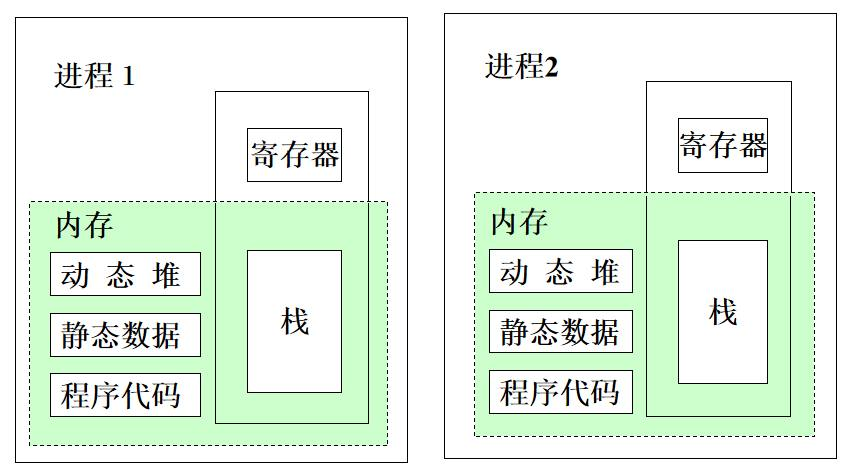

**多线程结构（用户视图）**

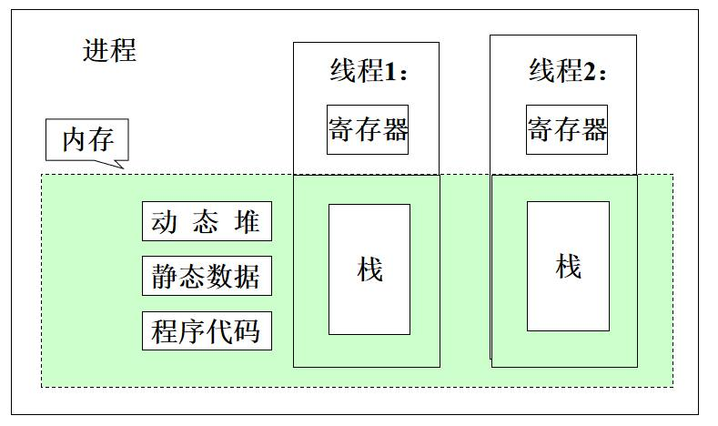

### 2.3.4 线程控制块

- **TCB（Thread control block)**
  - 线程控制块（Thread Control Block，简称TCB）是**标志线程存在的数据结构**，其中包含对线程管理需要的全部信息。
- **内容**
  - **线程标识**：用于唯一标识一个线程。
  - **线程状态**：描述线程的运行状态，如就绪、运行、阻塞等。
  - **调度参数**：用于线程调度，如优先级等。
  - **现场**：保存线程的执行现场，包括通用寄存器、程序计数器（PC）、堆栈指针（SP）等。
  - **链接指针**：用于将线程控制块链接到相应的队列中。
- **存放位置**
  - **用户级线程**：TCB存放在用户态空间（运行时系统）。
  - **核心级线程**：TCB存放在系统空间。

### 2.3.5 线程的实现

**2.3.5.1 用户级线程（User-level thread，ULT）**
- **实现方法：**
  - 用户级线程是基于库函数实现的，对操作系统是不可见的。
  - 线程的创建、撤销以及状态转换都在用户态完成。
  - 每个线程的线程控制块（TCB）存放在用户空间，每个进程有一个系统栈。
- **优点：**
  - **不依赖于操作系统**：用户级线程的实现不依赖于特定的操作系统，因此调度策略可以非常灵活。
  - **切换速度快**：在同一进程中，多个用户级线程之间的切换不需要进入操作系统，因此切换速度非常快。
- **缺点：**
  - **不能真正并行**：在同一进程中，多个用户级线程不能真正地并行执行。
  - **受阻问题**：如果一个用户级线程进入系统调用而被阻塞，那么该进程中的其他线程也不能执行，这是因为操作系统只看到进程，不知道线程的存在。
- 用户级别线程所具有的优势是核心级别线程所不具备的，因而即使在所有现代操作系统都提供了核心级别线程之后，用户级别线程仍然被多数系统支持。

**2.3.5.2 核心级线程（Kernel-level thread，KLT）**
- **实现方法：**
  - 核心级线程是**基于系统调用**实现的，**创建、撤销以及状态转换都由操作系统完成**。
- **优点：**
  - **并行执行**：在同一进程内，多个核心级线程可以并行执行，这是因为每个线程都被操作系统视为一个独立的调度单位。
  - **阻塞问题**：如果一个核心级线程进入系统调用而被阻塞，该进程中的其他线程仍然可以执行。这是因为操作系统可以看到每个线程的存在。
- **缺点：**
  - **系统开销大**：由于线程的创建、撤销以及切换都需要通过系统调用来完成，因此核心级线程的系统开销较大，同一进程内多线程切换的速度相对较慢。
  - **调度算法不灵活**：核心级线程的调度完全由操作系统控制，因此其调度算法不能灵活控制，必须遵循操作系统的调度策略。

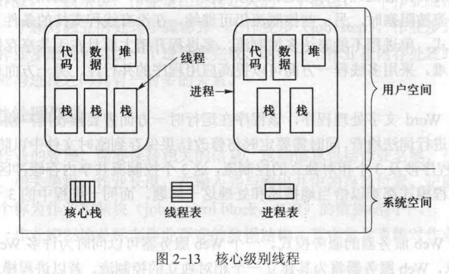

**2.3.5.3 混合线程（Hybrid approach）**

在 Solaris 操作系统中，线程的实现方式比较特殊，它采用了用户级线程、轻量级进程（LWP）和核心级线程三层的模型。
- **用户级线程**：由库程序支持，负责创建和调度线程。
- **轻量级进程（LWP）**：也由库程序支持，每个任务至少有一个 LWP。用户级线程和 LWP 可以是多对多的关系。LWP 对操作系统是可见的，只有与 LWP 相关联的用户线程才能向前推进。
- **核心级线程**：由内核支持，每个 LWP 与唯一一个核心线程对应。核心线程可以与 CPU 是多对多的关系，即一个核心线程可以在多个 CPU 上运行，也可以有多个核心线程在同一个 CPU 上运行。

### 2.3.6 线程的应用

- 内在的多控制流，需要共享数据
  - 线程可以实现内在的多控制流，这在需要共享数据的情况下非常有用。例如，生产者-消费者问题就是一个典型的例子。
- 多线程优于多进程
  - 多线程相比多进程有明显的优势。**创建和切换线程的速度比进程快100倍**，因此在需要频繁切换的场景下，使用多线程更为高效。
- 提高处理机与设备的并行性
  - 线程可以提高处理机与设备的并行性。通过同时运行多个线程，可以使处理机和设备同时工作，从而提高系统的整体效率。
- 多处理机环境
  - 提高处理机利用率，加快进程推进速度

- 例子：
  - Word字处理（不同代码）
    - Word使用了多线程技术，每个线程执行不同的代码。例如，交互编辑（T1）、词法检查（T2）和定时保存（T3）都是由不同的线程来完成的。
  - HTTP server（相同代码）
    - HTTP服务器对每个HTTP请求都会创建一个新的线程，所有线程执行相同的代码。这样可以提高服务器的响应速度，提供更好的用户体验。

**采用多线程也是有条件的**：同一进程中的多个线程具有相同的代码和数据，这些线程之间或者是合作的（执行代码的不同部分），或者是同构的（执行相同的代码）。

## 2.4 作业

- **作业概念**
  - 用户要求计算机系统为其完成的计算任务集合。
- **作业步（job step)**
  - 作业处理过程中的一个相对独立的步骤被称为作业步。
  - 一般来说，一个作业步可以由一个进程完成。
  - 某些作业步之间可以并行执行，以提高效率。
- **作业分类**
  - **批处理作业**：这类作业通常包含一系列的计算任务，这些任务可以在没有用户交互的情况下连续执行。批处理作业通常用于大规模的数据处理任务，如数据分析、报表生成等。
  - **交互式作业**：这类作业需要用户的实时交互，例如在图形用户界面中执行的任务。交互式作业通常用于响应用户的即时请求，如网页浏览、文档编辑等。

### 2.4.1 批处理作业

- 作业控制语言(JCL)
  - 作业控制语言（JCL）是一种用于描述批处理作业控制意图的语言。
- 作业说明书(JCL语句的序列）
  - 作业说明书是由一系列JCL语句组成的，通常以一个特殊符号开始。例如：
```c
$JOB J1
$FORTN …
$LINK …
$EXEC …
$ENDJOB
```
- 作业控制程序
  - 解释并处理作业说明书的程序
- 作业控制进程
  - 作业控制进程是执行作业控制程序的进程。这个进程负责根据作业说明书中的指示，调度和管理作业的执行。

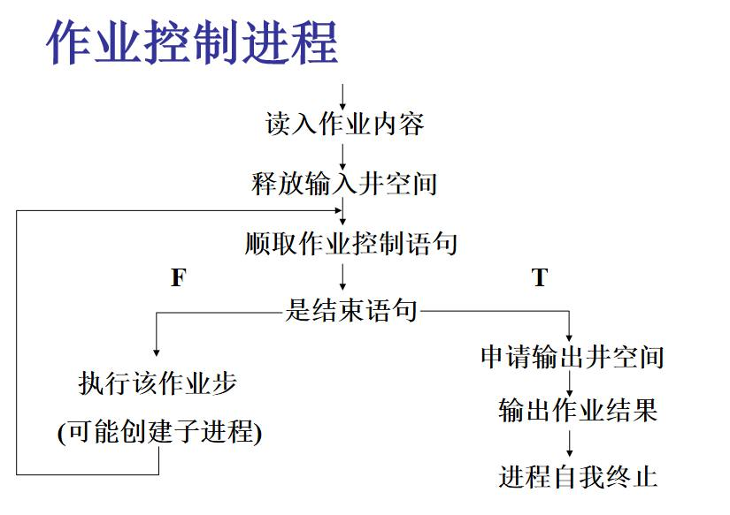

### 2.4.2 交互式作业

- 帐户管理
  - 帐户信息通常存储在`/etc/passwd` 文件中，包括用户名、口令、用户根目录、同组用户、余额等信息。
- 创建与撤销
  - **创建**：用户提供用户名、口令和资金，然后系统操作员在`/usr` 目录下建立一个以用户名命名的根目录，并在`passwd` 文件中添加相应的记录。
  - **撤销**：删除该用户的目录及其所有文件，并在`passwd` 文件中清除对应的记录。

- 注册与注销
  - **注册**：用户输入用户名（logon: 用户名）和口令（password: ）进行注册。
  - (使用)
  - **注销**：用户可以选择显式注销（输入logoff命令）或隐式注销（例如，如果用户5分钟内没有输入命令，系统将自动注销用户）。

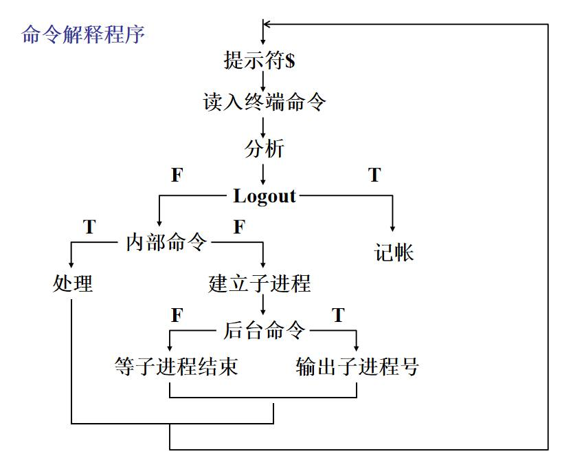

**小结：作业、进程、线程**
- 作业与进程
  - 作业进入内存后变为进程
  - 一个作业通常与多个进程相对应
- 进程与线程
  - 一个进程一般包含多个线程，至少包含一个线程
  - 不支持多线程的系统，可视为单线程进程

---

## 易混对比

| 状态转换 | 发生原因 | 主动还是被动 |
|---|---|---|
| 就绪 → 运行 | 被处理器调度选中 | 被动 |
| 运行 → 就绪 | 时间片用完；可剥夺系统中出现更高优先级的就绪进程 | 被动 |
| 运行 → 等待 | 申请资源得不到；启动 I/O 后等待完成 | 主动 |
| 等待 → 就绪 | 等待的资源被释放；I/O 完成（中断处理程序唤醒） | 被动，需要别的进程或中断协助 |

| | 就绪态 | 等待态（阻塞态） |
|---|---|---|
| 缺什么 | 只缺处理器 | 缺处理器以外的资源，或在等某个事件 |
| 把 CPU 给它 | 马上能运行 | 仍然不能运行 |
| 队列 | 就绪队列，一个或几个 | 每类等待事件一个等待队列 |

| | 进程 | 线程 |
|---|---|---|
| 资源 | 资源分配单位，拥有独立地址空间 | 基本不拥有资源，共享所属进程的代码、数据、堆和打开的文件 |
| 调度 | 传统系统中的调度单位 | 引入线程后，是被系统独立调度和分派的基本单位 |
| 切换开销 | 要换地址空间，开销大 | 只换寄存器和栈，快 |
| 通信 | 需要进程间通信机制 | 同一进程内的线程直接读写共享数据 |
| 控制块 | PCB | TCB |

| | 用户级线程 | 核心级线程 |
|---|---|---|
| 实现 | 库函数，创建、撤销、切换都在目态完成 | 系统调用，由操作系统完成 |
| TCB 存放 | 用户空间 | 系统空间 |
| 切换速度 | 快，不用进内核 | 慢，每次都要进内核 |
| 并行性 | 同一进程的线程不能真正并行，多 CPU 也不行 | 多 CPU 上可以并行 |
| 一个线程进系统调用阻塞 | 整个进程的线程都停下 | 其他线程照常运行 |
| 调度策略 | 可以按应用自己定，灵活 | 由操作系统决定 |
| 核心栈 | 每个进程一个 | 每个线程一个 |

| | fork | vfork |
|---|---|---|
| 复制什么 | 地址空间和 PCB 都复制 | 只复制 PCB |
| 父子地址空间 | 各自独立 | 共享 |
| 适合的场景 | 子进程继续跑父进程的代码 | 子进程马上 `exec` 新程序 |

## 易错点

- 等待态不能直接变成运行态，就绪态也不会直接变成等待态。
- 进程映像（程序段、数据段、PCB）是静态的，进程是动态的。创建进程实质上是创建 PCB，撤销进程实质上是撤销 PCB。
- 用户进程执行的程序不一定是用户自己写的，编译器、编辑器也以用户进程身份运行。
- 同一进程的线程共享代码区、数据区和堆；私有的是 TCB、执行栈和寄存器。
- 若进程中至少一个线程在运行，进程就算运行态；都不运行但有一个就绪，算就绪态；全在等待才算等待态（这是按用户级线程讨论的）。
- 线程创建和切换比进程快，笔记里引用的数字是“快 100 倍”。

## 典型题

- 简答：`11 简答题精编（第1-3章）.md` 第2章。“进程基本状态及转换（画图）”“进程与程序的联系和差别”“进程与线程的关系”“用户级与核心级线程的优缺点”“PCB 包含哪些内容”几乎每年都在。
- 3.7 节作业的前两题（进程切换要保存哪些现场、PSW 和 PC 为什么必须用一条指令同时恢复）答案也在 `11` 的第2章末尾。
- 名词解释：`10 名词解释.md` 第2章，笔记附录的往届名词里有 Process、Thread、Multiprogramming。
