# 第3章 中断与处理机调度

整理自 `笔记/操作系统原理笔记.pdf` 第3章，章首“为什么说操作系统是中断驱动的”一题是 `笔记/操作系统期末整理.pdf` 列出的。笔记正文只做了机械清洗和改错，章首要点、章末对比表、易错点和典型题是整理时写的。

## 本章要点

- 复习范围是课件 3.1～3.4，对应下面的 3.1～3.4。计算题里的“作业调度”出自 3.2、3.3。
- 配套讲义：`课件/03第三章 中断与处理机调度.pptx`（这一章还没有重制版）
- **中断系统** = 中断装置（硬件：识别中断源、保存现场、引出中断处理程序）+ 中断处理程序（软件）。
- 中断分强迫性中断（时钟、I/O、控制台、硬件故障、程序性中断）和自愿性中断（访管指令、系统调用）。
- **中断向量**：中断处理程序的运行环境 PSW 和入口地址 PC。每类中断一个向量，位置由硬件规定，内容由操作系统初始化时填好，向量里的 PSW 标为管态。
- 中断嵌套：现场压入系统栈，高优先级中断可以打断低优先级中断的处理；中断响应后屏蔽不高于本级的中断。
- 中断是进程切换的必要条件，不是充分条件。
- 调度指标：CPU 利用率、吞吐量、周转时间、响应时间、系统开销。周转时间 = 完成时间 − 进入时间，带权周转时间 = 周转时间 ÷ 运行时间。
- 调度算法：FCFS、SJF、SRTN、HRN（响应比 = 1 + 等待时间 ÷ 运行时间）、HPF、RR、MLQ、FB。
- 调度过程：保存下降进程现场 → 选择上升进程 → 恢复上升进程现场，PSW 和 PC 最后用一条指令同时恢复。
- 三级调度：低级调度（分配处理器）、中级调度（进程在内外存之间交换，控制并发度）、高级调度（作业调度）。作业有提交、后备、执行、完成、退出五个状态。
- 实时调度：周期任务可调度的必要条件是 $\sum C_i/T_i\le 1$；EDF 按截止期调度，RMS 按周期调度。

---

**为什么说操作系统是中断驱动的**

这道题在 `笔记/操作系统期末整理.pdf` 开头单独列了出来，没有写答案。笔记原稿的答案是聊天机器人风格的长段落，这里压成要点：

- 操作系统本身不主动运行，平时处理器在执行用户程序；只有发生中断（外设中断、时钟中断、程序出错、系统调用引起的访管中断）时，控制权才会交给操作系统。
- 目态转管态的唯一途径是中断，所以操作系统的每一次“出场”都由中断引起。
- 进程调度靠时钟中断和 I/O 中断等触发，设备管理靠 I/O 中断得知传输完成，系统调用靠访管中断进入内核。
- 没有中断，操作系统拿不到处理器，也就无法让多个程序轮流运行，并发无从实现。

## 3.1 中断与中断系统

### 3.1.1 中断的概念

- 处理机在运行过程中，出现了某一事件，必须中止正在运行的程序，转去处理这个事件，然后再返回原来运行的程序，这一过程称为中断。
- **中断系统**：（由以下两部分组成）
  - 中断装置(硬件)：硬件部分，负责发现并响应中断。
  - 中断处理程序(软件)：软件部分，用于处理具体的中断事件。

### 3.1.2 中断装置

- 发现并响应中断的硬件机构
  - 识别中断源，当有多个中断源时，按紧迫程度排队；
  - 保存当前程序的执行状态，即保存现场。
  - 引导系统执行相应的中断处理程序。

**中断响应和处理的过程**

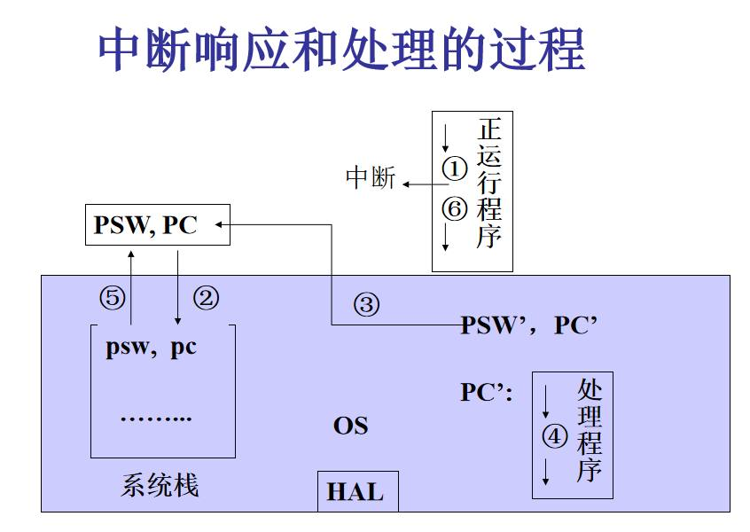

**3.1.2.1 中断源与中断字**
- **中断源**
  - 引起中断的事件，例如I/O设备完成数据传输。
- **中断寄存器**
  - 保存与中断事件相关信息的寄存器。
- **中断字**
  - 中断寄存器的内容，包含了中断的类型、源等信息。

例：IO中断：设备状态寄存器。

**3.1.2.2 中断类型与中断向量**
- **强迫性中断**
  - 运行程序不期望的
    - 时钟中断
    - IO中断
    - 控制台中断
    - 硬件故障中断
      - power failure（电源故障）
      - 内存校验错
    - 程序性中断
      - 越界，越权
      - 缺页
      - 溢出，除0
      - 非法指令
- **自愿性中断**
  - 运行程序期望的
    - 系统调用
    - 访管指令
  - 系统调用
    - fd=open(fname,mode)
  - 访管指令
    - 准备参数
    - svc n
    - 取返回值

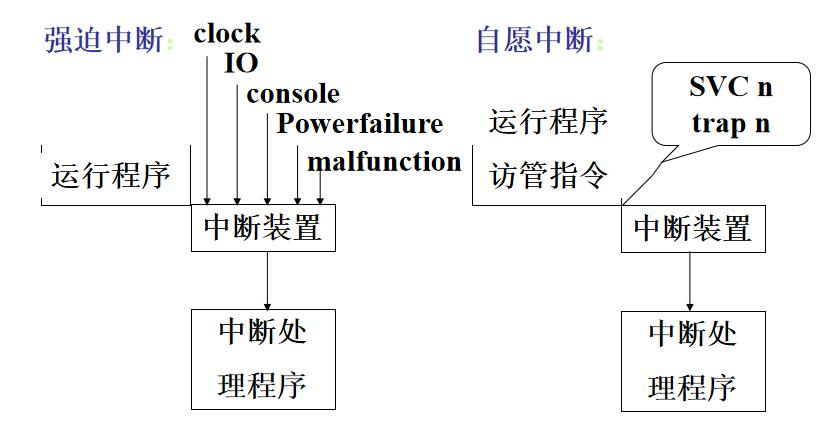

- 中断向量：中断处理程序的运行环境与入口地址（PSW，PC）
  - 每类中断事件有一个中断向量,
  - 中断向量的存放位置是由硬件规定的,
  - 中断向量的内容是OS在系统初始化时设置好的。

注：中断向量mode应为系统态

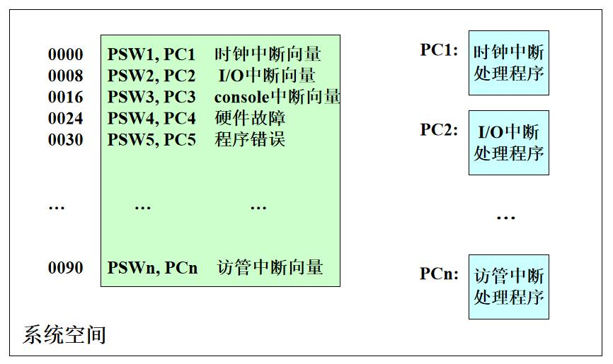

**3.1.2.3 中断嵌套与系统栈**
- 一般原则：
  - 高优先级别中断可以嵌入低优先级中断
- 实现方法：
  - 中断响应后立即屏蔽不高于当前中断优先级的中断源。
  - 在处理一个中断的过程中，如果发生了优先级更高的中断，那么处理器会暂停当前的中断处理，转而去处理这个更高优先级的中断，这就是**中断嵌套**。为了能够在中断处理完成后恢复到正确的状态，处理器会使用**系统栈**来保存中断现场。

- 中断响应后一般需要进一步保存现场
  - 关中断（屏蔽所有中断）
  - 进一步保存现场（通用寄存器等）
  - 开中断（或开放高优先级中断）
  - …...
  - 中断处理
  - …...
  - 关中断（屏蔽所有中断）
  - 恢复现场
  - 开中断（或开放高优先级中断）
  - 中断返回

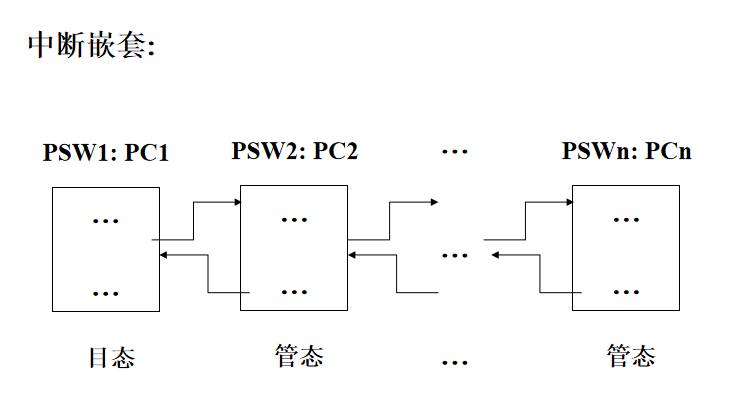

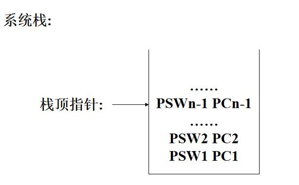

**3.1.2.4 中断优先级与中断屏蔽**
- 中断优先级：
  - 每个中断都有一个**优先级**，这是由硬件规定的，决定了中断的响应次序，依据:
    - 紧迫程度；
    - 处理时间。
- 中断屏蔽：
  - 高优先级中断事件处理不受低优先级中断打扰；
  - 程序调整中断响应次序。

### 3.1.3 中断处理程序

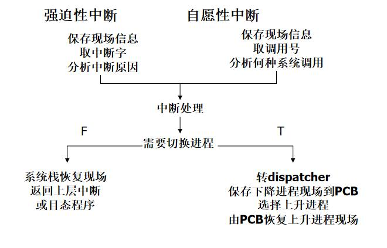

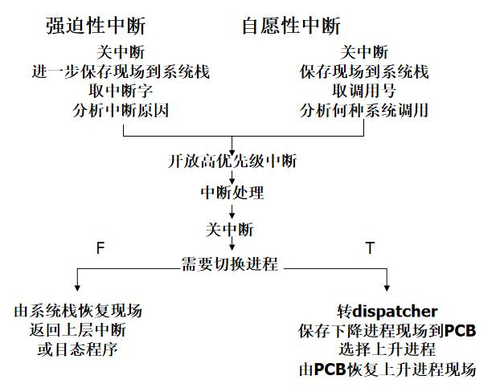

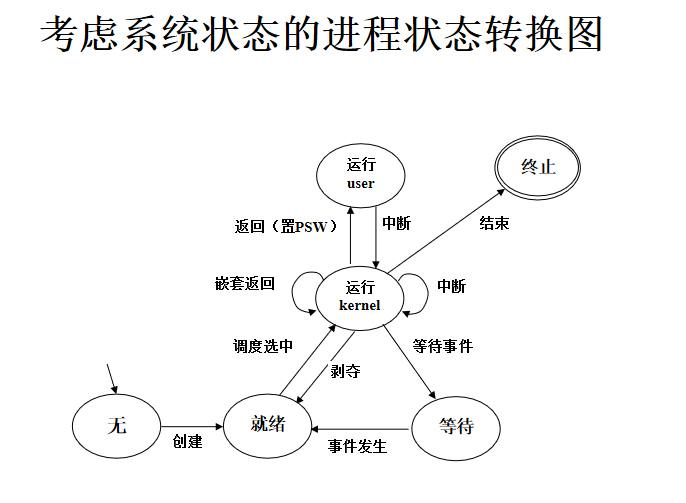

原稿 3.1.3.1～3.1.3.6（I/O中断、时钟中断、控制台中断、硬件故障、程序性中断、自愿性中断的处理）只有标题，程序性中断下面只写了一句“应用程序自行处理中断”。这部分可以看 `11 简答题精编（第1-3章）.md` 第3章的“下列中断事件哪些可由用户自行处理”“如果中断由用户程序自行处理，为何需要将被中断程序的断点由系统栈弹出并压入用户栈”两题。

## 3.2 处理机调度

### 3.2.1 处理机调度算法

**考虑因素**

考虑因素（scheduling criteria）
- **CPU利用率** ; (max)尽可能提高CPU的工作时间比例，减少空闲时间。
- **吞吐量** ; (max)单位时间内完成的进程数量，希望尽可能多。
- **周转时间** ; (min)进程从提交到完成所经历的时间，希望尽可能短。
- **响应时间** ; (min)进程从提交到获得CPU响应的时间，希望尽可能快。
- **系统开销** ; (min)调度进程本身消耗的资源，希望尽可能少。

**调度参数**
- 周转时间：完成时间-进入时间， $T=t_f-t_s$
- 平均周转时间：周转时间的平均值， $\bar{T}=\frac{1}{n}\sum_{i=1}^{n}T_i$
- 带权周转时间：周转时间/运行时间， $W=\frac{T}{R}$
- 平均带权周转时间：带权周转时间的平均值， $\bar{W}=\frac{1}{n}\sum_{i=1}^{n}W_i=\frac{1}{n}\sum_{i=1}^{n}\frac{T_i}{R_i}$

**阵发期**

在操作系统中，进程的执行行为通常被描述为在CPU执行（CPU burst）和I/O操作（I/O burst）之间的交替。

**阵发期（Burst Cycle）**
1. **CPU Burst Cycle**
  - 这是进程在CPU上执行计算任务的时间段。
  - 在这个周期内，进程会消耗CPU资源，执行指令、处理数据等。
  - CPU burst周期通常与进程的计算密集型任务相关。
2. **I/O Burst Cycle**
  - 这是进程等待I/O操作完成的时间段。
  - 在这个周期内，进程不消耗CPU资源，而是等待外部设备（如磁盘、网络）的数据输入或输出。
  - I/O burst周期通常与进程的I/O密集型任务相关。

**进程运行行为**

进程的运行行为可以描述为CPU burst和I/O burst的交替序列：
- **CPU Burst**: 进程使用CPU进行计算。
- **I/O Burst**: 进程等待I/O操作完成。
- 这种交替模式可以表示为：CPU burst, I/O burst, CPU burst, I/O burst, ...，直到进程完成其执行。

**CPU调度**

CPU调度是操作系统中的一个关键任务，它决定哪个进程应该获得CPU资源。在进行CPU调度时，调度器会考虑以下因素：
1. **处于CPU Burst的进程集合**：调度器会考虑当前所有处于CPU burst状态的进程。
2. **CPU Burst时间的预测**：调度器会根据进程以前的行为来预测其下一个CPU burst的时间长度。这种预测通常基于以下几种方法：
  - **历史平均**：使用进程过去CPU burst的平均时间作为预测。
  - **自适应预测**：使用更复杂的算法，如指数加权移动平均（EWMA），来考虑最近的burst长度，给予最近的行为更大的权重。

**下一个CPU burst的长度估算**
- 令 $T_n$ 是估计的第n个CPU阵发期的长度， $t_n$ 是进程最近一次CPU阵发期的实际长度，则下一个阵发期的估算公式为：

$$T_{n+1}=\alpha t_n+(1-\alpha)T_n$$

- 参数 $\alpha\ (0\le\alpha\le 1)$ 控制 $t_n$ 和 $T_n$ 在公式中起的作用： $\alpha=0$ 时 $T_{n+1}=T_n$，下一个预测完全沿用之前的估计； $\alpha=1$ 时 $T_{n+1}=t_n$，完全取最近一次的实际长度。通常取 $\alpha=0.5$，表示两者同等重要。

**剥夺式调度和非剥夺式调度**

**剥夺式：**
- 就绪进程可以从运行进程手中抢占CPU。
- 进程运行，直到结束、等待或被抢先

**非剥夺式：**
- 就绪进程不可从运行进程手中抢占CPU。
- 进程运行，直到结束或等待

**3.2.1.1 先到先服务算法(FCFS)**

【**非剥夺**】选择最先进入就绪队列的进程投入执行，即进程按照请求CPU的顺序使用CPU。

优点：
- “公平”；

缺点:
- 短作业等待时间长。

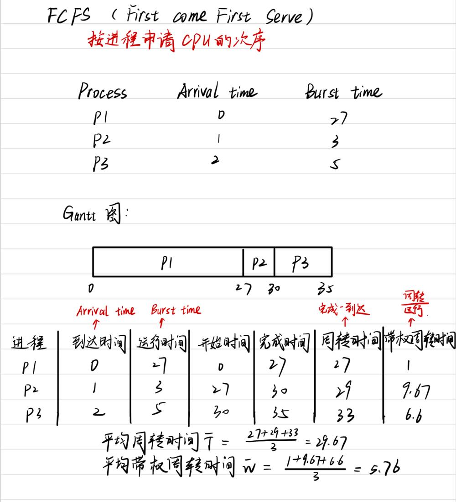

**3.2.1.2 短作业优先(SJF)**

【**非剥夺**】以进入系统作业/进程所要求的CPU时间长短为准，总是选取时间要求最短的投入运行。

优点：
- 假定所有任务同时到达，平均等待时间最短。

缺点：
- 长作业可能被饿死。

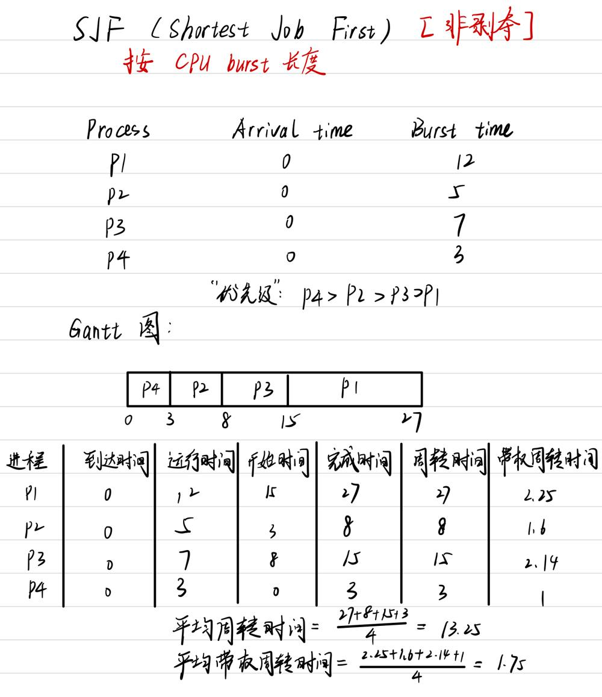

**3.2.1.3 最短剩余时间优先算法(SRTN)**

【**SJF+剥夺**】如果一个新就绪进程所需的CPU时间比当前正在执行的进程所剩余时间短，那么新进程将抢占CPU。

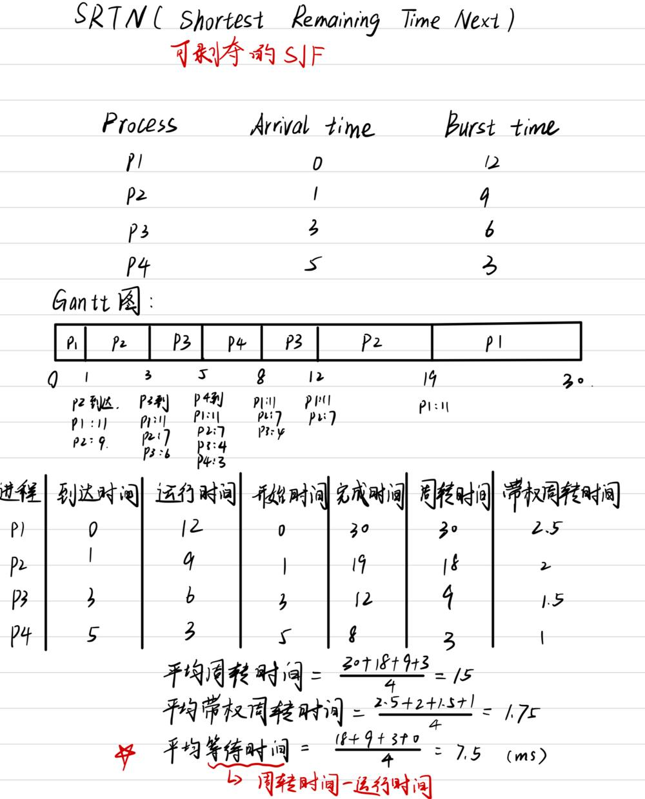

**3.2.1.4 最高响应比优先(HRN)**
- RR=(BT+WT)/BT=1+WT/BT
- 其中: BT=burst time WT=wait time
- **优点：同时到达任务, 短者优先。**长作业随等待时间增加响应比增加。既照顾了短作业，又不至于使长作业等待时间过长。
- **缺点：**HRRF每次计算响应比都会花费一定的时间，即时间开销。其性能比SJF算法略差。

**注：作业等待时间=前一个作业的完成时间-后一个作业的到达时间**

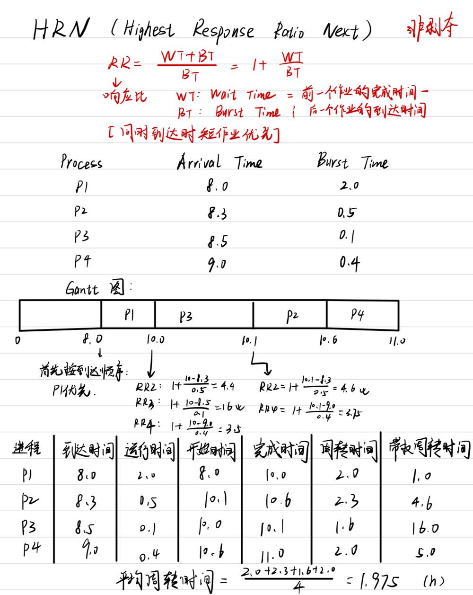

**3.2.1.5 最高优先数算法(HPF)**
- 静态优先数(static)优先数在进程创建时分配，生存期内不变。响应速度慢，开销小。适合批处理进程
- 动态优先数(dynamic)进程创建时继承优先数，生存期内可以修改。响应速度快，开销大。适用于实时系统

- **非剥夺式静态优先数**获得处理机的进程运行，直至终止或等待
- **剥夺式动(静)态优先数**获得处理机的进程运行，直至终止、等待或出现高优先级的进程

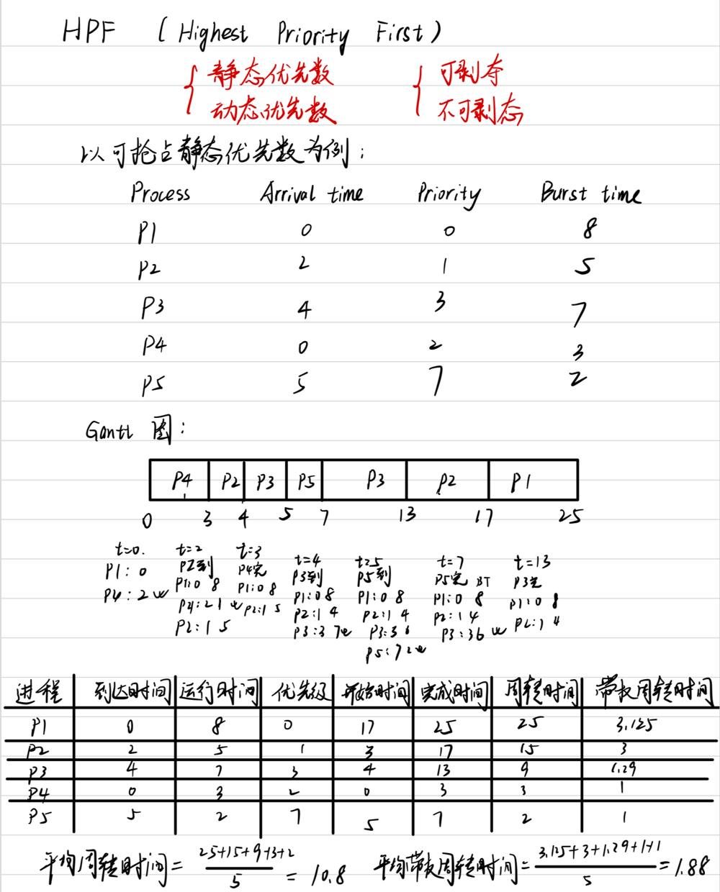

**3.2.1.6 循环轮转算法(RR)**

【**可剥夺**】每个进程被分配一个时间片，如果在时间片结束时该进程还在运行，则剥夺其CPU并分配给另一个进程，被剥夺CPU的进程则插入到就绪队列末尾，等待下次调度；如果该进程在时间片内阻塞或结束，则立即切换CPU。

**适用于分时系统**
- 基本轮转
  - 时间片(quantum,time slice)长度固定，不变；
  - 所有进程等速向前推进。
- 改进轮转
  - 时间片长度不定，可变。
- 时间片长度：
  - 几十毫秒到几百毫秒(eg. 50ms)
  - 过长：响应速度慢；
  - 过短：系统开销(overhead)大。

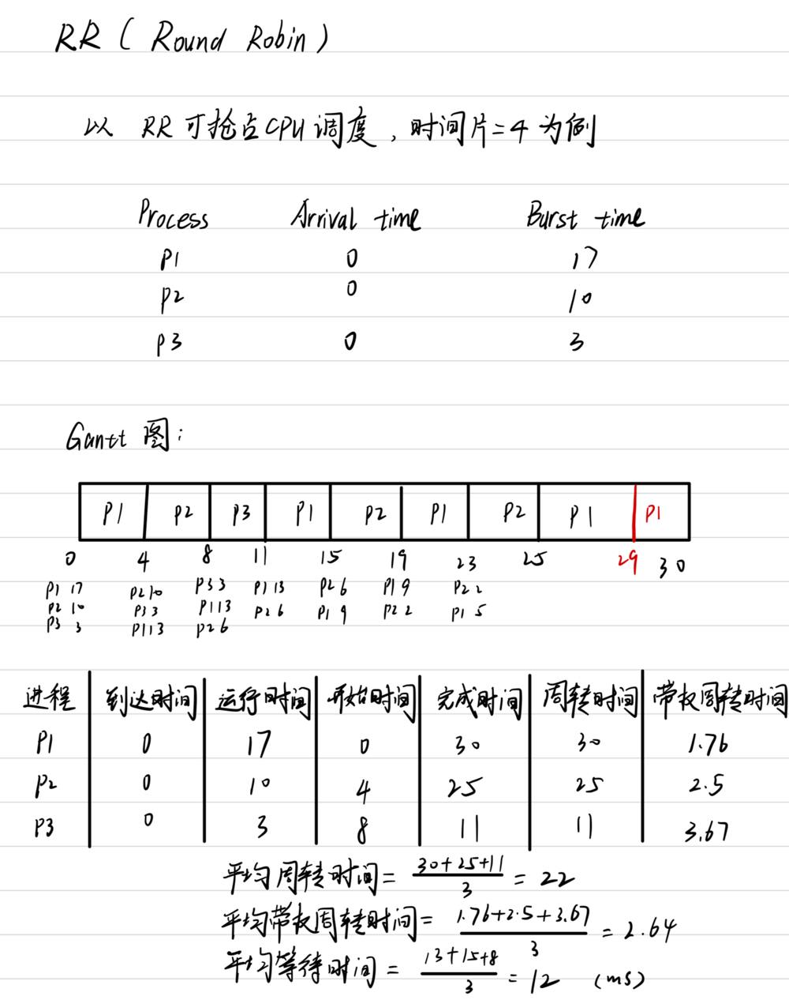

**3.2.1.7 多级队列算法(MLQ)**

多级队列
- 多个就绪队列，**进程所属的队列固定**。

例如：通用系统中：
- 队列1：实时进程就绪队列（HPF）
- 队列2：分时进程就绪队列 （RR）
- 队列3：批处理进程就绪队列 （HPF）

**3.2.1.8 反馈排队算法（FB）**
- feed back
  - 多个就绪队列，进程所属队列可变。【时间片S1＜S2＜S3】

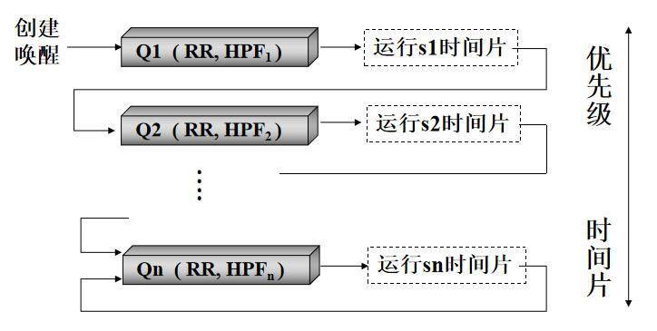

设置多个就绪队列并赋予各个队列不同优先权；不同队列中进程执行的时间片大小各不相同；是优先级调度算法、时间片轮转调度算法、先来先服务调度算法相结合的产物。

**调度效果**：
- 资源利用率高P1等待P2占有的资源R, P2释放R, 分给P1, P1被唤醒, 进入最高级队列, 可尽早投入运行, 使用资源R；
- 响应速度快交互式进程经常进入等待状态(等待用户输入),一旦被唤醒(输入完成),进入最高级队列,可尽快被调度选中,投入运行,反应及时；
- 系统开销小计算量大的进程用完前面n-1级时间片,没有处理完,落入底层队列,调度频率下降,但每次获得较长的时间片。

### 3.2.2 处理机调度时机

- **运行进程结束**：当一个进程完成了它的任务并调用exit()来自愿结束时，CPU需要被释放并分配给其他进程。
- **运行进程等待**：如果一个进程因为等待某些事件发生（如I/O操作完成）而不能继续执行，CPU可以被分配给其他就绪状态的进程。
- **处理机被剥夺**：在剥夺式调度中，如果一个更高优先级的进程进入就绪状态，当前运行的进程可能会被剥夺CPU。

**必然引起进程切换的中断**
- **进程自愿结束**：进程执行exit()系统调用，正常结束。
- **进程被强行终止**：操作系统或管理员强制结束进程，如通过kill命令。
- **非法指令或越界**：进程执行了非法操作，如访问无效的内存地址。
- **进程等待**：进程因为等待I/O操作或其他事件而进入等待状态。

**可能引起进程切换的中断**
- **时钟中断**：操作系统使用时钟中断来实现时间片轮转调度，当分配给进程的时间片用完时，可能会触发进程切换。
- **设备I/O中断**：当I/O操作完成时，可能会唤醒等待该操作的进程，从而可能需要进行进程切换。
- **系统调用**：进程执行系统调用请求操作系统服务时，可能会触发调度。

### 3.2.3 处理机调度过程

**Dispatcher（调度程序）**

调度程序是操作系统中负责进程切换的组件。它的主要任务包括：
- **保存下降进程的现场**：当一个进程被剥夺CPU或完成时，调度程序需要保存该进程的状态，包括寄存器（程序状态字PSW、程序计数器PC、堆栈指针SP、通用寄存器、地址寄存器）到进程控制块（PCB）。
- **选择上升进程**：根据调度算法，调度程序选择下一个要执行的进程。
- **恢复上升进程的现场**：调度程序将选定进程的PCB中的信息恢复到寄存器中，以便进程可以从上次中断的地方继续执行。恢复顺序通常是：
  - 先恢复通用寄存器和地址寄存器。
  - 最后恢复PSW和PC，这通常需要一条特殊的指令来完成，以确保状态的正确恢复。

## 3.3 调度级别与多级调度

**低级、中级和高级调度**
- 处理机调度为低级调度
- 交换为中级调度
- 作业调度为高级调度

**处理机调度为低级调度**

处理机调度，也称为CPU调度或低级调度，是操作系统中负责决定哪个进程获得CPU资源的机制。

**低级调度的定义**

低级调度是操作系统中负责分配CPU时间给进程的调度活动。它是操作系统调度功能中最基本和最频繁的操作，因此被称为“低级”调度。低级调度的主要任务是：
1. **选择进程**：从就绪队列中选择一个进程，准备将其分配到CPU上执行。
2. **上下文切换**：保存当前运行进程的状态（上下文），并恢复被选中进程的状态，使其能够从上次中断的地方继续执行。

**低级调度的特点**
- **频繁性**：由于进程可能经常切换，低级调度是一个频繁发生的操作。
- **细粒度**：低级调度通常涉及单个进程的调度，而不是进程集合。
- **即时性**：低级调度需要快速响应，以减少调度引起的延迟。

### 3.3.1 交换与中级调度

- 术语
  - **交换（Swapping）**
    - 交换是指操作系统将进程从内存移动到磁盘上，或从磁盘移动到内存的过程。
    - 当内存不足以容纳所有就绪进程时，操作系统会选择一些进程进行交换，以释放内存空间。
  - **中级调度（Mid-Level Scheduling）**
    - 中级调度，有时也称为内存调度，是操作系统用于控制内存中进程数量的调度机制。
    - 它负责决定哪些进程应该被交换出内存，哪些进程应该被交换进内存。
  - **并发度（Degree of Multi-programming）**
    - **并发度是指系统在同一时间能够处理的进程数量。**
    - 它反映了系统的多任务处理能力。

**目标：控制并发度**

中级调度的主要目标是**控制并发度**，即同时在内存中运行的进程数量。合理的并发度可以带来以下好处：
- **提高CPU利用率**：更多的进程可以同时竞争CPU资源。
- **改善系统吞吐量**：单位时间内可以完成更多的任务。

然而，并发度过高会带来以下问题：
- **系统开销大**：过多的进程需要更多的上下文切换和管理开销。
- **响应速度慢**：每个进程获得CPU时间的机会减少，导致响应时间变长。
- **内存资源紧张**：过多的进程可能导致内存不足，影响系统性能。
- **进程频繁进入等待状态**：内存不足时，更多进程会被交换到磁盘，增加等待时间。
- **更多的死锁**：资源竞争加剧，可能导致更多的死锁情况。

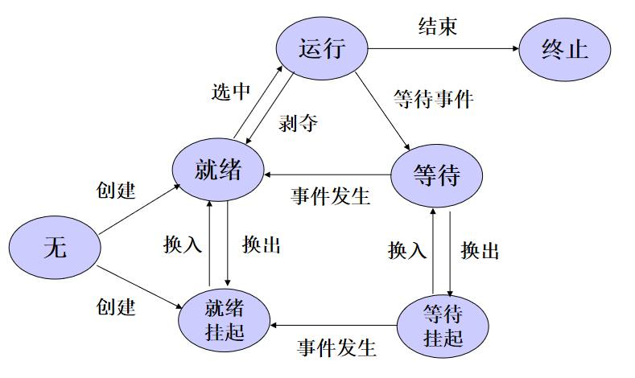

**中级调度的策略**

中级调度可能会采用以下策略来控制并发度：
- **动态调整**：根据系统的当前负载动态调整内存中的进程数量。
- **进程挂起**：将一些长时间占用CPU但不频繁使用内存的进程挂起，以释放内存资源。
- **进程唤醒**：当内存资源可用时，将之前挂起的进程重新唤醒到内存中。

### 3.3.2 作业与高级调度

**作业状态**：
- **提交**：作业被输入到系统中，数据被传送到输入井（一种缓冲存储区域）。
- **后备**：作业在输入井中等待，尚未被调入内存。
- **执行**：作业被分解为一个或多个进程，并在内存中执行。
- **完成**：作业处理完毕，结果被放置在输出井。
- **退出**：作业结果从输出井传送到打印机或其他输出设备。

**状态转换**:
- **提交→后备**：由SPOOLing（Simultaneous Peripheral Operation On-Line，即在线同时外围操作）输入进程完成，将作业从输入设备传送到输入井。
- **后备→执行**：由作业调度（高级调度）完成，系统选择后备作业并将其调入内存，创建作业控制块（JCB）和作业控制进程。
- **执行→完成**：作业执行完毕，结果被写入输出井。
- **完成→退出**：由SPOOLing输出进程完成，将作业结果从输出井传送到输出设备。

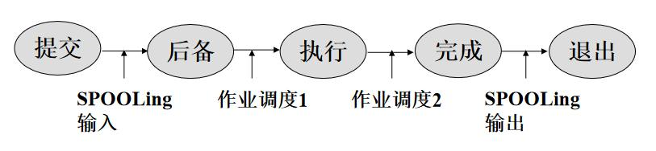

**批处理作业调度**：
1. 在后备作业集合中选择作业，并为其建立作业控制进程来处理该作业。这是高级调度的职责，由系统进程完成。
2. 对终止的作业控制进程进行善后处理，包括释放资源和更新作业状态。

**适合批作业调度的算法**
- **先到先服务（FCFS）**：简单且公平，按作业到达顺序执行，适合批处理环境。
- **短作业优先（SJF）**：减少短作业的等待时间，提高系统吞吐量。
- **优先级调度（HPF）**：可以根据作业的优先级进行调度，适用于某些作业比其他作业更重要的情况。
- **最高响应比优先（HRN）**：结合了作业的等待时间和预计执行时间，适合长作业和短作业的平衡。

**不适合批作业调度的算法**
- **时间片轮转（RR）**：每个作业轮流执行固定的时间片，适合需要快速响应的交互式系统，但在批处理系统中可能导致频繁的上下文切换，增加调度开销。
- **最短剩余时间优先（SRTN）**：虽然可以提高响应时间，但在批处理系统中可能导致长作业饥饿，因为短作业会不断插入执行。
- **反馈排队（FB）**：允许已完成部分执行的作业重新进入就绪队列，这在交互式系统中有助于提高响应性，但在批处理系统中可能导致某些作业长时间得不到执行。

## 3.4 实时调度

- **实时任务**：
  - 具有明确时间约束的计算任务。
  - Eg.
    - **某时刻前必须开始处理**
    - **某时刻前必须处理完毕**
- **实时调度**：
  - 合理安排就绪实时任务的执行次序，满足每个实时任务时间约束条件的调度。

**实时任务分类**
- 硬实时 vs. 软实时
  - **硬实时（Hard Real-Time）**
    - 必须满足任务的截止期要求。如果任务未能在截止期前完成，可能会导致严重的后果或系统故障。
  - **软实时（Soft Real-Time）**
    - 期望满足截止期要求，但不严格要求。如果任务未能按时完成，可能会导致性能下降，但不会造成灾难性后果。
- 周期性 vs. 随机性
  - **周期性（Periodic）**
    - 每隔固定时间发生一次的任务。例如，温度传感器每隔一定时间读取一次温度数据。
  - **随机性（Aperiodic）**
    - 由随机事件触发，其发生时刻不确定。例如，用户请求或网络数据包的到达。

**术语解释**
- **就绪时间（Ready Time）**：任务到达就绪状态并等待调度的时间点。
- **开始截止期（Starting Deadline）**：任务必须开始执行的最晚时间点。
- **处理时间（Processing Time）**：任务实际占用CPU进行处理所需的时间。
- **完成截止期（Completion Deadline）**：任务必须完成的最晚时间点。
- **发生周期（Occurring Period）**：周期性任务重复发生的固定时间间隔。
- **发生频率（Occurring Frequency）**：任务在单位时间内发生的次数，与发生周期相关。

**周期性实时事务**

周期性实时事务可调度的**必要条件**：令 $C_i$ 为任务 $P_i$ 的处理时间， $T_i$ 为任务 $P_i$ 的发生周期，则任务 $P_1,\dots,P_m$ 可调度的必要条件为

$$\sum_{i=1}^{m}\frac{C_i}{T_i}\le 1$$

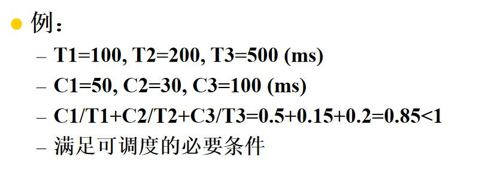

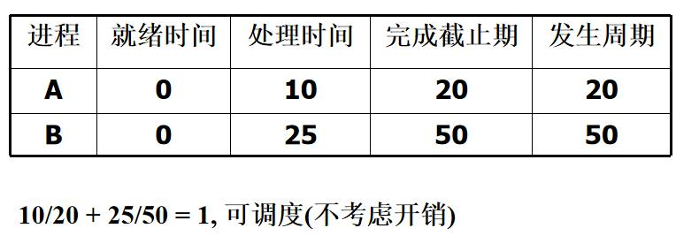

（不考虑系统开销，理论上可调度即可）

### 3.4.1 最早截止期调度（EDF）

- **EDF（Earliest Deadline First)**
- 优先选择截止期最早的实时任务
- **可抢先（可剥夺）式**
- **对EDF来说，可调度充分条件**是： $\sum_{i=1}^{m}\frac{C_i}{T_i}\le 1$
- 在不可调度的条件下，可使错过截止期任务最小化

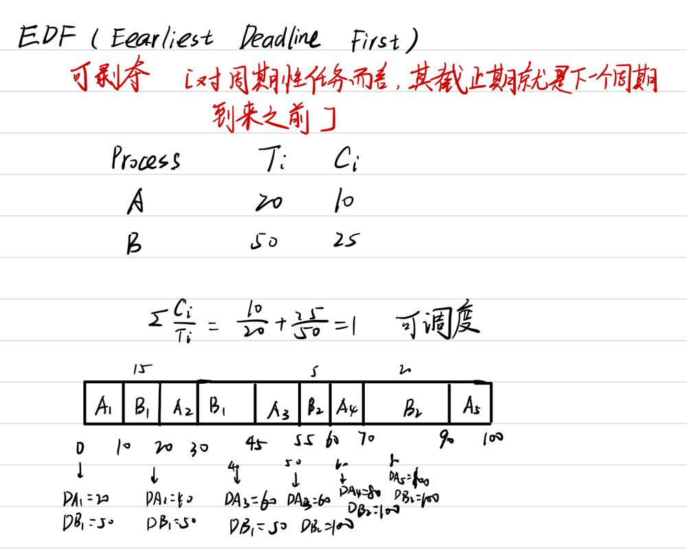

### 3.4.2 速率单调调度（RMS）

- 面向周期性实时事务，**剥夺式**（书上说是非剥夺，但是老师上课说其实是剥夺式的）
- 优先调度发生**周期最短**（频度最高）的实时任务
- 可调度条件： $\sum_{i=1}^{n}\frac{C_i}{T_i}\le n(2^{1/n}-1)$

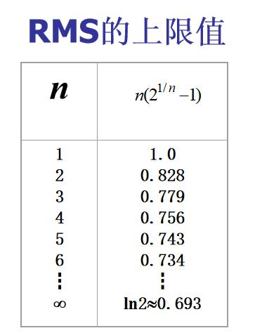

### EDF与RMS比较

- RMS可调度条件强于EDF（RMS的调度条件更加苛刻）
- RMS调度较EDF实现简单

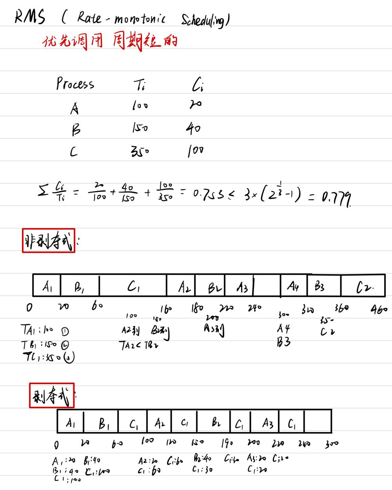

## 3.5 多处理机调度

**多处理机调度问题**

在多处理机系统中，调度问题涉及如何将M个进程（或线程）分配到N个处理器上。对称多处理器（SMP）系统具有相同的（同质的）处理器。

**多处理机调度目标**

主要目标是实现负载共享（load-sharing），即确保所有处理器的负载均衡，避免某些处理器过载而其他处理器空闲。

**多处理机调度方法**
1. **独立就绪队列**：每个处理器都有自己的就绪队列，但这种方法可能导致负载不均衡。
2. **共享就绪队列**：所有处理器共享一个公共的就绪队列Q，每个处理器独立访问Q，可能采用主从分配方式。

### 3.5.1 自调度(self scheduling)

自调度是一种调度技术，每个处理器独立选择下一个要执行的任务。
- **均衡调度**：每个处理器从就绪队列中选择任务，以实现负载均衡。
- **优点**：
  - 不需要专门的处理器进行任务分配。
  - 任务分配自然趋向均衡。
- **缺点**：
  - 就绪队列可能成为瓶颈，尤其是CPU数量较多时。
  - 线程可能在两次调度之间处于不同的处理器，影响线程间协作。
  - 无法保证相关线程的同步调度。

**自调度(self scheduling)**

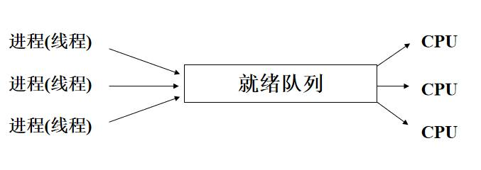

- 例子:
  - Mach操作系统采用了改进的自调度方法，结合全局队列和每个CPU的局部队列。调度时首先考虑局部队列，如果为空，则考虑全局队列。

### 3.5.2 组调度(gang scheduling)

组调度是一种将一组相关（合作）的线程同时分配到多个处理器上执行的调度方法。
- **目的**：避免合作线程之间的相互等待，降低上下文切换开销，提高运行效率。
- **优点**：确保了线程组内的任务可以同时执行，减少了线程间的同步开销。
- **例子**：
  - Cm*操作系统和Task Force系统采用了组调度方法，用于处理一组相关的计算任务。

## 3.7 作业

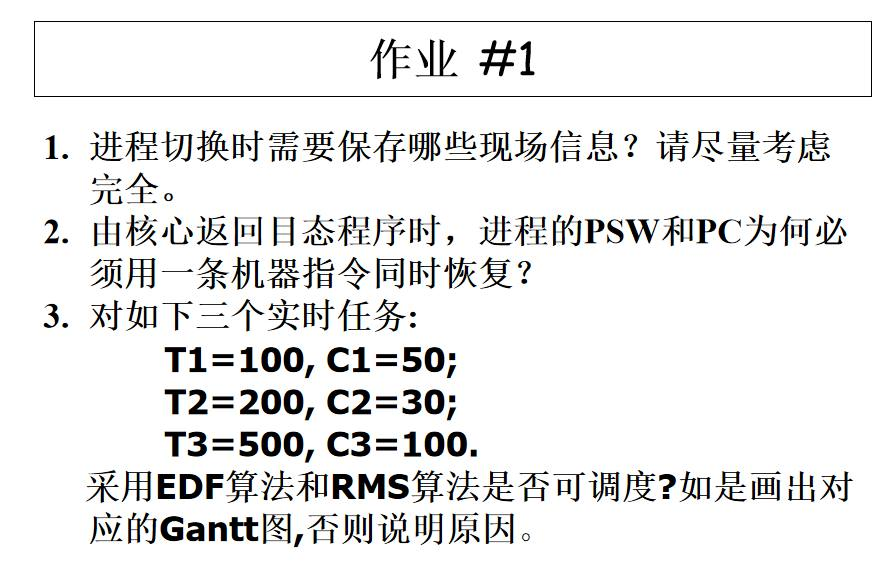

---

## 易混对比

| 算法 | 是否剥夺 | 选谁 | 优点 | 缺点 |
|---|---|---|---|---|
| FCFS 先到先服务 | 非剥夺 | 最先进入就绪队列的 | 公平，不会饿死 | 短作业等待时间长 |
| SJF 短作业优先 | 非剥夺 | 要求 CPU 时间最短的 | 平均等待（周转）时间最短 | 长作业可能饿死 |
| SRTN 最短剩余时间优先 | 剥夺 | 剩余时间最短的 | 新来的短作业能马上运行 | 长作业可能饿死 |
| HRN 最高响应比优先 | 笔记按非剥夺讲 | 响应比最高的 | 同时到达时短者优先，长作业等久了也能上 | 每次调度都要算响应比 |
| HPF 最高优先数 | 两种都有 | 优先数最高的 | 照顾紧急任务 | 低优先数进程可能饥饿 |
| RR 时间片轮转 | 剥夺 | 就绪队列队首，运行一个时间片 | 响应及时，适合分时系统 | 时间片过短开销大，过长响应慢 |
| MLQ 多级队列 | 看各队列用的算法 | 按队列优先级选，进程所属队列固定 | 不同类进程区别对待 | 进程不能换队列 |
| FB 反馈排队 | 剥夺 | 高级队列优先，进程用完时间片降一级 | 短进程优先、I/O 型进程响应快、长进程调度次数少 | 长进程落到底层后等待时间长 |

| | 低级调度 | 中级调度 | 高级调度 |
|---|---|---|---|
| 别名 | 处理器调度、短期调度 | 交换 | 作业调度 |
| 对象 | 就绪进程或线程 | 内存中暂时不能运行的进程、外存中可运行的进程 | 输入井里的后备作业 |
| 做的事 | 把处理器分给进程 | 换出换入，控制并发度 | 调入内存，为作业建立作业控制进程 |
| 频率 | 最频繁 | 居中 | 最少 |

| | EDF 最早截止期优先 | RMS 速率单调调度 |
|---|---|---|
| 优先级依据 | 截止期越早越优先 | 周期越短（频度越高）越优先 |
| 是否剥夺 | 可剥夺 | 简答题答案和教材说非剥夺，笔记记的是老师上课说实际是剥夺式 |
| 可调度判定 | $\sum C_i/T_i\le 1$ | $\sum C_i/T_i\le n(2^{1/n}-1)$，这是充分条件 |
| 特点 | 条件宽松，实现复杂一些 | 条件更苛刻，实现简单 |

| | 中断现场 | 进程切换现场 |
|---|---|---|
| 保存位置 | 系统栈 | 进程的 PCB |
| 保存时机 | 中断响应时由硬件压栈，处理程序再保存通用寄存器 | 处理器调度时保存下降进程的核心级现场 |

| 一定引起进程切换 | 可能引起进程切换 |
|---|---|
| 进程运行结束（`exit`）、被强行终止、执行非法指令或越界、进程等待资源或 I/O | 时钟中断、I/O 中断、系统调用 |

## 易错点

- 周转时间从作业进入（提交、到达）算起，不是从开始运行算起。带权周转时间一定不小于 1。
- 作业等待时间 = 开始运行时间 − 到达时间；笔记里写的“前一个作业的完成时间 − 后一个作业的到达时间”只在两个作业之间 CPU 不空闲时成立。
- HRN 的响应比每次调度都要按当时的等待时间重新计算。
- RR、SRTN、FB 不适合批处理作业调度，批作业调度常用 FCFS、SJF、HPF、HRN。
- RMS 的上限 $n(2^{1/n}-1)$ 是充分条件，算出来超过上限不代表一定不可调度，要画甘特图验证（见下面作业第3题的提示）。
- 访管中断不能屏蔽；时钟、I/O 中断通常可以屏蔽；掉电中断不可屏蔽。
- 嵌套中断的最内层中断处理完，返回的是上一层中断处理程序，不会发生进程切换。
- 恢复现场时，先恢复地址映射寄存器、通用寄存器、SP，最后用一条指令同时恢复 PSW 和 PC。

## 典型题

- 计算题“作业调度”：3.2.1 每个算法下面都有一张例题图。做题时列一张表：到达时间、运行时间、开始时间、完成时间、周转时间、带权周转时间，最后求平均值。
- 实时调度：3.4 的两个例子。
- 3.7 作业第3题提示（整理补充，原稿无答案）： $\sum C_i/T_i=0.5+0.15+0.2=0.85\le 1$，EDF 可调度。RMS 的上限在 n=3 时约为 0.779，0.85 超过上限，用公式判断不出来，需要按周期定优先级（T1>T2>T3）画甘特图。在 0～500 内，T1 在 50、150、250、350、450 完成，T2 在 80、280、480 完成，T3 在 360 完成，都没有错过截止期，所以 RMS 也可调度。
- 简答：`11 简答题精编（第1-3章）.md` 第3章。“中断向量”“中断是进程切换的必要条件而非充分条件”“为什么需要中断屏蔽”“各调度算法的思想和优缺点”“处理器调度的三个阶段”常考。
- 名词解释：`10 名词解释.md` 第3章，2021级的名词表里有 Interrupt，笔记附录的名词表里还有 Scheduler。
