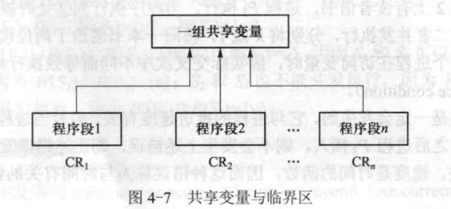
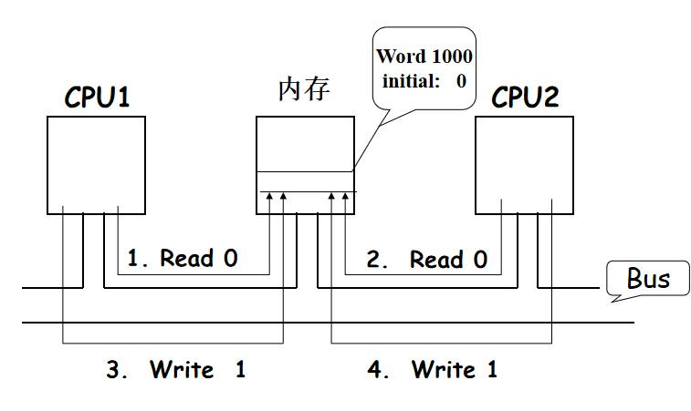
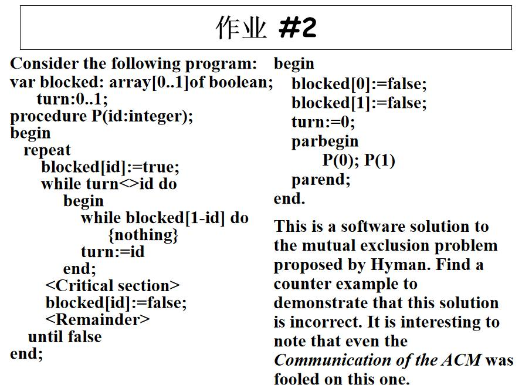
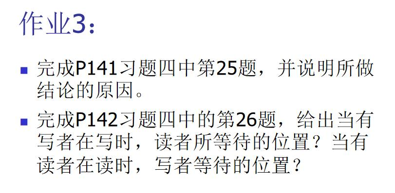

# 第4章 互斥、同步与通信

整理自 `笔记/操作系统原理笔记.pdf` 第4章，“信号量与管程应用题”一节收入了 `笔记/操作系统期末整理.pdf` 的两道应用题。期末整理里的“互斥算法”部分和笔记 4.2.4、4.2.5 内容相同，只多了“单标志法”“双标志先检查法”“双标志后检查法”三个名字，已并入正文。笔记正文只做了机械清洗和改错，章首要点、章末对比表、易错点、典型题和标“整理补充”的模板是整理时写的。

## 本章要点

- 复习范围是课件 4.1 并发进程、4.2 进程互斥、4.3 进程同步。计算题里的“互斥算法”出自 4.2，应用题“信号量机制”“管程机制”出自 4.3。
- 配套讲义：[第4章 互斥、同步与通讯（重制版）](<../重制版PPT/第4章 互斥、同步与通讯（重制版）.pptx>)，原课件 `课件/04第四章 互斥同步与通讯（1）.pptx`、`课件/04第四章 互斥同步与通讯（2）.pptx`
- 并发程序的特性：间断性、非封闭性、不可再现性。**Bernstein 条件**： $R(p_1)\cap W(p_2)$、 $R(p_2)\cap W(p_1)$、 $W(p_1)\cap W(p_2)$ 都为空，两段程序就能并发执行并保持可再现性。
- **与时间有关的错误**：结果取决于进程交叉执行的次序，而次序和推进速度有关，所以错误时有时无。
- **临界区**是访问共享变量的程序段。互斥是针对同一组共享变量而言的，不同变量的临界区可以同时进入。
- 管理临界区的三条正确性原则：互斥性、进展性（空闲让进）、有限等待性。
- 软件互斥算法：两个进程用 Dekker、Peterson，n 个进程用 Lamport 面包店算法、Eisenberg-McGuire 算法，都存在忙式等待。
- 硬件互斥：开关中断（只适用于单 CPU，影响并发性）、TestAndSet 指令、Swap 指令（简单写法不满足有限等待，加 `waiting` 数组才满足）。
- **进程同步**：一组进程为协调推进速度，在某些关键点相互等待和相互唤醒。同步机制有信号量与 PV 操作、条件临界区、管程、会合、路径表达式、事件。
- **信号量**：`value` 为负时，其绝对值是等待队列长度；初值 1 用于互斥，初值 0 用于同步，初值为 n 用于管理 n 个同类资源。P、V 操作是原语。
- **管程**：把共享变量和对它的全部操作集中在一个模块里，任一时刻只有一个活动进程；用条件变量的 `wait`、`signal` 同步。Hoare 管程里执行 `signal` 的进程进入紧急等待队列。

---

## 4.1 并发进程

### 4.1.1 前驱图的定义

- 定义：**前驱图**（precedence graph）是一个有向无环图。
- **结点**：图中的每个结点表示**一条语句、一个计算步骤或一个进程**。
- **有向边**：结点间的有向边表示偏序或前驱关系（precedence relation）。记作“ $\to$”，定义为 $\to=\lbrace (P_i,P_j)\mid P_i\text{ 必须在 }P_j\text{ 启动之前已经完成}\rbrace$。如果 $(P_i,P_j)\in\to$，则可以记作 $P_i\to P_j$，其中 $P_i$ 是 $P_j$ 的前驱， $P_j$ 是 $P_i$ 的后继。
- **初始结点和终止结点**：在前驱图中，没有前驱的结点称为初始结点，没有后继的结点称为终止结点。
- **权重**：每个结点可以有一个权重（weight），它表示该结点所包含的程序量或计算时间。
- 前驱关系满足**传递性**，即若 $P_1\to P_2$， $P_2\to P_3$，则必有 $P_1\to P_3$

### 4.1.2 顺序程序及其特性

**1. 程序的顺序执行**

**内部顺序性**：指单个进程内部指令的执行顺序。
- 示例：对于一个进程，指令是按照一定的顺序执行的。
  - S1：a:=x+y
  - S2：b:=a-z
  - S3：c:=a+b
  - S4：d:=c+5

**外部顺序性**：指多个进程之间活动的执行顺序。
- 示例：输入(I)、计算(C)、打印(P)三个活动构成的进程，每个进程的内部活动是顺序的，即 $I_i\to C_i\to P_i$

- **说明**：多个进程的活动也是依次执行的，确保了整体的顺序性。

**2. 顺序程序特性**

**连续性**：
- **定义**：指令是逐条执行的，即一个指令完成后，下一个指令才能开始执行。
- **重要性**：保证了程序逻辑的连贯性和正确性。

**封闭性**：
- **定义**：程序在执行时，不受其他程序或外界因素的干扰。
- **重要性**：确保了程序的独立性和稳定性。

**可再现性**：
- **定义**：程序的执行结果与执行速度无关，即在相同条件下，多次执行将得到相同的结果。
- **重要性**：提高了程序的可靠性和预测性。

### 4.1.3 并发程序及其特性

**1.程序的并发执行**

**（1）内部并发性**：指一个程序内部的并发性。

例：
```c
S1：a:=x+2;
S2：b:=y+4;
S3：c:=a+b;
S4：d:=c-6;
S5：e:=c+6;
S6：f:=c-e;
```

S3必须在S1和S2之后执行，S4和S5必须在S3之后执行，S6必须在S3和S5之后执行；**而S1和S2可以并发执行，S4和S5可以并发执行，S4和S6可以并发执行**。由于前驱关系满足传递性，边 $S3\to S6$ 实际上可以去掉。

**（2）外部并发性**：指多个程序之间的并发性。

对于图4-3所引申的例子，I2与C1可以并发执行，I3、C2与P1可以并发执行……

**2.并发程序的特性**
- **间断性**：程序交叉执行。
- **非封闭性**：一个进程的运行环境可能被其它进程所改变，从而相互影响。
- **不可再现性**：由于交叉的随机性，并发程序的多次执行可能对应不同的交叉，因而不能期望重新运行的程序能够再现上次运行的结果。

**不可再现性的例子**
```c
进程P：             进程Q：
A1: N:=0；          B1: PRINT（N）；
A2: N:=N+1；        B2: N:=0；
A3: GOTO A2；       B3: GOTO B1；
```

此例中进程P累积计数，进程Q将累计的结果打印出来。希望打印出的数是累计数的和。两个进程并发执行时有许多可能的交叉，
- 如进程P循环5次进程Q循环1次，然后进程P又循环3次进程Q循环1次，则输出结果是5，3；
- 如进程P循环2次进程Q循环1次，然后进程P又循环6次进程Q循环1次，则输出结果是2，6。两次执行结果完全不同。
- 进程Q执行完B1后被中断，进程P对N执行加1操作，然后进程Q执行B2，在这种情况下进程P的累计数将被丢失。

### 4.1.4 程序并发执行的条件

**1. 可再现性与封闭性**
- **封闭性丧失**：在多线程或多进程环境下，封闭性可能丧失，因为程序可能会受到其他程序的影响。
- **可再现性保持**：即使在封闭性丧失的条件下，也可以通过特定的条件来保持程序的可再现性。

**2. 读集与写集**
- **读集 R(pi)={a1,a2,…,am}**
  - 表示程序 `pi` 在执行期间所需读取的所有变量的集合。
- **写集 W(pi)={b1,b2,…,bm}**
  - 表示程序 `pi` 在执行期间所需改变的所有变量的集合。

**3. 语句的读集与写集示例**
- **语句 c=a+b**：
  - 读集： $R(c:=a+b)=\lbrace a,b\rbrace$
  - 写集： $W(c:=a+b)=\lbrace c\rbrace$
- **语句 v=c-1**：
  - 读集： $R(v:=c-1)=\lbrace c\rbrace$
  - 写集： $W(v:=c-1)=\lbrace v\rbrace$

**4. Bernstein条件**
- **定义**：1966年Bernstein首先提出的条件，用于判断两个程序是否可以并发执行而保持可再现性。
  - **条件**： $R(p_1)\cap W(p_2)\ \cup\ R(p_2)\cap W(p_1)\ \cup\ W(p_1)\cap W(p_2)=\varnothing$【“写冲突”】

**5. 示例分析**
- **语句 S1: a:=x+y**：
  - 读集： $R(S1)=\lbrace x,y\rbrace$
  - 写集： $W(S1)=\lbrace a\rbrace$
- **语句 S2: b:=z+1**：
  - 读集： $R(S2)=\lbrace z\rbrace$
  - 写集： $W(S2)=\lbrace b\rbrace$
- **语句 S3: c:=a-b**：
  - 读集： $R(S3)=\lbrace a,b\rbrace$
  - 写集： $W(S3)=\lbrace c\rbrace$
- **语句 S4: w:=c+1**：
  - 读集： $R(S4)=\lbrace c\rbrace$
  - 写集： $W(S4)=\lbrace w\rbrace$

**6. 并发执行条件验证**
- **S1 和 S2**：可以并发执行
- **S1 和 S3**：不能并发执行，因为 $W(S1)\cap R(S3)=\lbrace a\rbrace$
- **S2 和 S3**：不能并发执行，因为 $W(S2)\cap R(S3)=\lbrace b\rbrace$
- **S3 和 S4**：不能并发执行，因为 $W(S3)\cap R(S4)=\lbrace c\rbrace$

### 4.1.5 并发程序的表示

**cobegin 和 coend**
- **定义**：`cobegin` 和 `coend` 是用来表示并发执行的语句块的关键字。
- **用法**：若有多条语句 `S1, S2, ..., Sn` 可以并发执行，可以用以下形式表示：
```c
cobegin
  S1;
  S2;
  ...
  Sn;
coend;
```
- **执行方式**：操作系统会同时创建多个进程或线程，每个进程或线程分别执行一条语句，所有语句并发执行。

**parbegin 和 parend**
- **定义**：`parbegin` 和 `parend` 同样是表示并发执行的语句块的关键字。
- **用法**：若有多条语句 `S1, S2, ..., Sn` 可以并发执行，可以用以下形式表示：
```c
parbegin
  S1;
  S2;
  ...
  Sn;
parend;
```
- **执行方式**：与 `cobegin` 和 `coend` 类似，操作系统会同时启动多个进程或线程，分别执行相应的语句，它们并发运行直到所有语句执行完毕。

**并发执行的条件**
- **条件**：只有当所有语句 `S1, S2, ..., Sn` 之间不存在资源冲突，并且满足并发执行的条件时，它们才能被表示为并发语句。
- **结束**：并发或并行语句块的执行结束于所有内部语句都执行完毕。

### 4.1.6 与时间有关的错误（存在问题）

**例1**

假设有一个图书馆管理系统，连有两个终端，用户可以通过终端借书。为简化问题，假设所有用户借阅的图书都是相同的。设x代表图书的剩余数量，为两个终端用户服务的图书借阅系统如图4-6所示。

假设当前只剩一本书，即x = 1。有读者在终端1上借书，进程P1执行。当程序执行到①处时被中断，终端2上有读者借书，进程P2执行。当程序执行到②处时被中断，此时P1和P2都判断有书，此后二者并发执行，分别将x减1，将同一本书借给了两位读者，即发生了错误。

**例2**：**关于就绪队列的整队问题**

设有A,B,C,D四个就绪进程,优先级依次为2,10,30,35，分析插队过程中出现的情况.

分析
- 若有E进程,优先数为25处于就绪状态,则要求加入就绪队列,调整队子程序执行,该程序判断E应加入B,C之间,则执行
```c
R:=C; （R暂存C）
①
B:=E;  （将E插入B的位置）
E:=R; （将C放到E的位置）
```
- 若在① 时进程F因完成I/O由等待状态变为就绪,其优先级为15,整队子程序被中断,转入执行中服程序,则出现丢失一个进程    R:=C;     B:=F;       F:=R

**就绪队列**：在操作系统中，就绪队列是按优先级排序的，用于存放处于就绪状态的进程。

**插队过程**：当一个新进程变为就绪状态时，需要根据其优先级插入到就绪队列中的适当位置。

**E进程加入**：E进程的优先数为25，介于B（10）和C（30）之间，因此需要在它们之间插入。

**中断问题**：在E进程插入过程中，F进程变为就绪状态并中断了整队子程序。由于中断，原整队子程序的状态被破坏，导致F进程错误地插入到队列中。

**错误结果**：由于中断，C进程被错误地放置在F进程的位置上，导致队列顺序错误。

结论：该错误因共享就绪队列引起,对就绪队列操作不当,也是与时间相关的错误导致结果不唯一.

**例3**

**两进程申请两个独占性资源**

设有两个进程P1,P2,系统中有两类独占性资源如打印机和输入机,两进程的活动为:

分析: (1)若P1推进到①,P2推进,则P1,P2均等待对方释放资源形成永久等待.该错误也与推进速度有关是与时间相关的错误.

- **错误原因之1**
  - 进程执行不正确的交叉(interleave);
- **错误原因之2**
  - 同时对一个公共变量(x)操作，其中一个进程的操作没有结束，另一个进程也对公共变量进行操作，使得公共变量处于一种不确定的状态，用数据库的术语说就是失去了变量x的数据完整性。

**Remarks:**
- 上述错误不一定发生，发不发生取决于进程的推进速度；速度是时间的函数，这类错误因此称为与时间相关的错误
- 某些交叉结果不正确;必须去掉导致不正确结果的交叉。

## 4.2 进程互斥

### 4.2.1 共享变量与临界区

**1. 共享变量与临界区的概念**

**共享变量 (Shared Variable)**
- **定义**：多个进程都需要访问的变量。
- **属性**：可能属于操作系统空间或用户进程空间。

**临界区域 (Critical Region)**
- **定义**：**访问共享变量的程序段。**
- **关联**：把临界区与其所对应的共享变量联系起来，称为关于某一种共享变量的临界区。

**临界资源 (Critical Resource)**
- **定义**：一次只允许一个进程使用的资源。

**临界区的嵌套**
- **定义**：一个临界区程序段可能调用另一个临界区程序段，此时称为发生了临界区的嵌套。

**2. 共享变量与临界区的表示**

**共享变量表示**
- **语法**：`shared <一组变量>`
- **示例**：
```c
shared B: array[0, .., n-1] of integer;
```

**临界区域表示**
- **语法**：`region <一组变量> do <语句>`
- **示例**：
```c
region B do
begin
    …… （访问B）
end;
```

**嵌套临界区域表示**
- **共享变量声明**：
```c
shared x1, x2;
shared y1, y2;
```
- **嵌套临界区示例**：
```c
region x1, x2 do
begin
    ……
    region y1, y2 do
    begin
        …………
    end
end;

region y1, y2 do
begin
    ……
    region x1, x2 do
    begin
        …………
    end
end;
```

### 4.2.2 临界区与进程互斥

**定义**
- **进程互斥**：多个进程不能同时进入关于同一组共享变量的临界区域，否则可能发生与时间有关的错误。

**互斥的二层涵义**
1. **相同临界区域的互斥**：任何时刻最多只能有一个进程处于同一组共享变量的相同的临界区域。
2. **不同临界区域的互斥**：任何时刻最多只能有一个进程处于同一组共享变量的不同的临界区域。



**Remarks**
- **互斥性**：互斥是相对于公共变量而言的，确保共享变量的一致性和正确性。

**临界区嵌套**
- **注意点**：临界区可以嵌套，但在使用嵌套的临界区时需要特别注意，以避免不期望的后果。

**死锁示例**
- **进程 P1 和 P2**：
  - **进程 P1**：执行到①处，已进入关于共享变量x的临界区，要求进入关于共享变量y的临界区。
  - **进程 P2**：执行到②处，已进入关于共享变量y的临界区，要求进入关于共享变量x的临界区。
- **死锁现象**：由于临界区是互斥的，P1 和 P2 均无法继续向前推进，导致死锁。

### 4.2.3 进程互斥原则

**临界区框架**
```c
do{
    entry section      // 进入区
    临界区
    exit section       // 退出区
    其余代码
} while (1);
```
- **进入区 (entry section)**：进程进入临界区前的准备阶段。
- **临界区**：共享资源访问区，需要互斥控制。
- **退出区 (exit section)**：进程离开临界区后的清理阶段。
- **其余代码**：临界区外的进程代码。

**临界区是进程中访问临界资源的代码段**

**进入区和退出区是负责实现互斥的代码段**

**实现互斥**
- **目标**：编写进入区和退出区，确保同一时刻只有一个进程处于临界区内。

**正确性原则**
1. **互斥性原则**：任意时刻至多只能有一个进程处于同一组共享变量的临界区中。
2. **进展性原则**：当临界区空闲时，只有那些参与entry section和exit section决策的进程才能决定下一个进入临界区的进程，且该决策不能无限期推迟。（空闲让进）
3. **有限等待性原则**：请求进入临界区的进程应在有限等待时间内获得进入机会，反映算法的公平性。

**调度原则**
1. **空闲时立即进入**：当所有临界区空闲时，请求进入任一临界区的进程应立即被允许进入。
2. **占用时等待**：当某一临界区被占用时，请求进入该临界区的进程应等待。
3. **离开时允许进入**：当进程离开临界区时，应允许等待中的某个进程进入。

**互斥实现**
- **软件方法**：通过软件编程实现进程互斥。
- **硬件方法**：利用硬件支持的原子指令实现进程互斥。

### 4.2.4 进程互斥的软件实现

**概述**
- **软件实现**：通过程序逻辑来实现进程互斥，不需要特殊硬件指令支持。
- **适用性**：适用于单CPU和多CPU环境。
- **问题**：存在忙式等待问题，即进程在等待进入临界区时，会持续占用CPU资源。（忙式等待指的是一个进程或线程在等待某个条件发生时，不断地检查该条件是否已经满足，而不是执行其他任务或进入休眠状态。）

**尝试1：使用全局变量 turn 实现互斥【单标志法】**
- **代码**：
```c
int turn;   //turn表示当前允许进入临界区的进程号
P0: do{
      while (turn==1) ;
      临界区代码
      turn=1;
      其余代码
}while(1);
P1: do{
      while(turn==0);
      临界区代码
      turn=0;
      其余代码
}while(1);
```
- **问题**：**不满足进展性原则**。如果P0和P1同时到达它们的while循环，它们将交替进入临界区。该算法可确保每次只允许一个进程进入临界区。但两个进程必须交替进入临界区，**若某个进程不再进入临界区，则另一个进程也将无法进入临界区(违背“空闲让进”)**。这样很容易造成资源利用不充分。**比如若P0顺利进入临界区并从临界区离开，则此时临界区是空闲的，但P1并没有进入临界区的打算，turn=1一直成立，P0就无法再次进入临界区(一直被 while死循环困住)**。

**尝试2：使用布尔数组 flag 实现互斥【双标志先检查法】**
- **代码**：
```c
Boolean flag[2];    //表示进入临界区意愿
P0: do{
        while (flag[1]); //①
        flag[0]=true;   //③
        临界区
        flag[0]=false;
        其余代码
}while(1);
P1: do{
        while (flag[0]); //②
        flag[1]=true;   //④
        临界区
        flag[1]=false;
        其余代码
}while(1);
```
- **思想**：在每个进程访问临界区资源之前，先查看临界资源是否正被访问，若正被访问，该进程需等待；否则，进程才进入自己的临界区。
- **优点**：不用交替进入，可连续使用
- **问题**：不满足互斥性原则。如果按照序列①②③④执行，`flag[0]` 和`flag[1]` 同时为`false` ，两个进程可以同时进入临界区，违反了互斥性原则。【进入区的检查和上锁并不是“一气呵成”的，先检查后上锁可能发生进程切换】

**尝试3：改进的布尔数组 flag 实现互斥【双标志后检查法】**
- **代码**：
```c
boolean flag[2]; (false,false)
do{
        flag[0]=true;
        while (flag[1]);
        临界区代码
        flag[0]=false;
        其余代码
}while(1);
do{
        flag[1]=true;
        while(flag[0]);
        临界区
        flag[1]=false;
        其余代码
}while(1);
```
- **思想**：先将自己的标志设置为 TRUE,再检测对方的状态标志，若对方标志为TRUE，则进程等待；否则进入临界区。【先上锁后检查】
- **问题**：不满足进展性原则。如果`flag[0]` 和`flag[1]` 同时为`true` ，两个进程都会在while循环中无限期地等待，导致饥饿现象（整理注：这里两个进程都在忙式等待，按本课程的术语就是活锁，即忙式等待条件下的饥饿）。

当while条件成立时，进程P不能向前推进，而在原地踏步，这种原地踏步被称为“忙式等待” 。**不进入等待状态的等待**称为**忙式等待**（busy waiting）。注意，**这里虽然用了“等待”一词，但是进程并未真正进入等待状态，实际状态为“运行”或者“就绪” 。**忙式等待空耗处理器资源，因而是低效的。

**针对两个进程的互斥算法**

#### 1、 Dekker算法

```c
int flag[2]; (init 0)   //初值为0
int turn; (0 or 1)  //初值为0或1

P0：
do{
    flag[0]=1;
    while(flag[1])
        if(turn==1){
            flag[0]=0;
            while (turn==1)
                skip;
            flag[0]=1;
        }
    临界区
    turn=1;
    flag[0]=0;
    其余代码
}while(1);

P1：
do{
    flag[1]=1;
    while(flag[0])
        if(turn==0){
            flag[1]=0;
            while (turn==0)
                skip;
            flag[1]=1;
        }
    临界区
    turn=0;
    flag[1]=0;
    其余代码
}while(1);
```

①考察互斥性。只需证明当一个进程进入其临界区后，另一进程不能进入其临界区。不失一般性，假定P0已经进入其临界区，此时flag[0]为1成立，P1欲进入临界区必将在其外层while循环处忙式等待，因而满足互斥性。

②考察进展性。若只有一个进程（设为P0）欲进入其临界区，由于flag [1]为0 , P0结束外层while循环，进入其临界区。若两个进程都想进入临界区，假设turn的值为0，进程P1的if条件成立，将自己的flag[1]置为0，并动态等待P0 。P0获得处理器资源运行时，检测flag[1]不成立，结束外层while循环，进入临界区，因而满足进展性。

③考察有限等待性。假设P0处于临界区中，P1正在执行其entry section代码试图进入其临界区。 P0离开临界区时，将turn的值置为1 , flag[0]的值置为0，这将使P1的内层while循环条件不成立。若P1在判断外层while循环条件之前P0没有再次提出进入临界区的请求，则flag [1]的值为0，P1结束外层while循环进入其临界区；反之，若P1判断外层while循环条件之前P0再次执行entry section代码，则会将flag[0]再次置为1，但是因为flag[1]条件和turn=1条件成立，P0将在其flag[0]标志置为0后忙式等待P1，直至P1进入并离开其临界区。因而P1在P0再度进入临界区之前，必能得到进入临界区的机会。

#### 2、Peterson算法

```c
boolean flag[2];    //表示进入临界区意愿的数组，初始值都是false
int turn;           //turn表示优先让哪个进程进入临界区（表达“谦让”）

P0:
Do{
    flag[0]=true;
    turn=1;
    while (flag[1] && turn==1);
    临界区
    flag[0]=false;
    其余代码
}while(1);

P1:
Do{
    flag[1]=true;
    turn=0;
    while (flag[0] && turn==0);
    临界区
    flag[1]=false;
    其余代码
}while(1);
```

①考察互斥性。不失一般性，假定P0已经进入其临界区，须证P1必不能进入其临界区。P0进入临界区时，其while循环条件必不成立。这有3种情况：
- (a)flag[1]不成立
- (b)turn==1不成立
- (c)二者都不成立。

对于情形(a)，说明P1尚未提出进入临界区的请求，以后该进程执行其entry section代码时，将turn赋值为0的动作必在P0将turn赋值为1的动作之后执行；对情形(b),表明P1将turn赋值为0的动作必在P0将其赋值为1的动作之后完成；情形(c)是不可能出现的，因为这既要求P1还没有执行entry section,又要求P1执行完turn=0语句。上述可能的两种情况，P1执行while循环时turn==0成立。又由于P0已经在其临界区内，flag[0]=1必然成立，故P1将在其while循环处忙式等待，因而满足互斥性。

②考察进展性。若只有一个进程想进入其临界区，设P0想进入、P1不想进入，则flag[1]的值为0，P0的循环条件不成立，结束循环进入其临界区。若两个进程都想进入临界区，turn==0与turn==1必有一个不成立，因而必有一个进程结束while循环进入其临界区，因而满足进展性。

③考察有限等待性：假定P0在其临界区内，P1提出进入临界区并在其while循环处忙式等待，当P0离开临界区时，将flag[0]的值置为0，若此时P1获得执行机会，将检测到flag[0]不成立从而进入临界区：若在P1获得处理器运行之前P0再次提出进入临界区的请求，将flag [0]的值置为1 , turn的值置为1，然后在while循环处忙式等待，而以后P1获得运行机会时检测到turn==0不成立，进入其临界区，所以P1在P0再次进入临界区之前一定能够进入临界区，因而满足有限等待性。

【但没有实现让权等待】

**针对任意多个进程的互斥算法**

#### 1、Lamport面包店算法

**算法思想：**设置一个发号者，按0,1,2,…, 发号。想进入临界区的进程抓号，抓到号之后按由小到大的次序依次进入。

Problem: 两个进程可能抓到相同的号。

Resolution: 若抓到相同的号，按进程编号依次进入。

Definition: (a,b)<(c,d) iff (a<c)or(a==c and b<d)
```c
Boolean choosing[0,…,n-1];(false)   //表示进程是否正在抓号
Int number[0,…,n-1]; (0)            //记录各个进程抓到的号码
do{
   //Pi 进入
   choosing[i]=true;
   number[i]=max{number[0],…,number[n-1]}+1;
   choosing[i]=false;
   For(j=0;j<n;j++){
      While (choosing[j]) //如果有正在抓号的就等待
            skip;
      While (number[j]!=0)and(number[j],j)<(number[i],i)    //如果有优先级更高的就等待
         skip;
   }
   临界区
   number[i]=0;     //Pi退出，会将number[i]置0
   其余代码
}while(1)
```

**choosing的作用：**

如果没有choosing，P1抓到1但还没赋值时，P2进入，此时P2抓到1，进入for循环，优先级最高进入临界区，但随后P1赋值为1，优先级为实际上最高，进入临界区，不满足互斥性。

①考察互斥性。考虑满足下列条件的进程 $P_i$。

(a) $P_i$ 想进入临界区，所抓号码为number[i] ;

(b) 对其他想进入临界区的进程 $P_j$，(number[i], i) < (number[j], j)。只有 $P_i$ 执行完entry section进入临界区， $P_j$ 将在第一个while循环或第二个while循环处等待，因而满足互斥性。【书上这里是不是想表达如果Pi还在临界区，Pj就必然在忙式等待】

②考察进展性。当有多个进程竞争进入临界区时，下述条件之一成立：(a)一个进程抓到最小号码，( b）若干进程抓到最小号码。情形（a）抓到最小号码的进程获准进入临界区，情形( b）编号最小的抓到最小号码的进程获准进入临界区，因而确定进入临界区进程的决策将在有限的时间内确定。【设置(a,b)<(c,d)可以满足进展性】

③考察有限等待性。对任意一个想要进入临界区的进程Pi, 设其抓到号码为number[i], 按二元组(number[i],i)次序排在Pi之前的竞争进程数量是有限的, 在最坏情况下Pi将等待n-1个排在其前面的进程进入并离开临界区后获得进入临界区的资格, 因而满足有限等待性.

#### 2、Eisenberg/Mcguire算法

flag[i]==idle:  进程Pi不想进入临界区

flag[i]==want_in:   进程Pi想进入临界区

flag[i]==in_cs:   进程Pi想进入或已进入临界区
```c
enum flag[0,…,n-1] (idle, want_in, in_cs);
int turn;  //0..n-1; 初始任意

do{
    //Pi进入
    Do{
          flag[i]=want_in;
          j=turn;
          While (j!=i)
              If (flag[j] != idle)
                 j=turn
              Else
                 j=(j+1)% n;
          flag[i]=in_cs;
          j=0;
          While (j<n) and (j==i or flag[j]!=in_cs) do
              j++;
    }while (j!=n);
    turn=i;
    临界区
    //Pi离开
    j=(turn+1)% n;
    While (flag[j]==idle)
          j=(j+1)% n;
    turn=j;
    flag[i]=idle;
    其余代码
}while(1)
```

①互斥性。仅当flag[i]==in_cs, 且对所有j!=i, flag[j]!=in_cs时, 进程Pi才进入临界区域, 因而满足互斥性.

②进展性。临界区空闲时, 排在序列turn, turn+1, …, n-1,0,1, 2,…,turn-1最前面的申请进入临界区的进程获准进入临界区, 因而满足进展性.

③有限等待性。进程离开临界区时,按循环次序turn+1, …, n-1,0,1, 2,…,turn-1确定唯一一个竞争进程为其后继, 所以一个进程最多等待n-1个进程进入并离开临界区后一定能进入临界区, 因而满足有限等待性.

### 4.2.5 进程互斥的硬件支持

**（1）中断屏蔽方法（硬件提供“关中断”和“开中断”指令）**

当一个进程正在执行它的临界区代码时，防止其他进程进入其临界区的最简方法是关中断。因为 CPU 只在发生中断时引起进程切换，因此屏蔽中断能够保证当前运行的进程让临界区代码顺利地执行完，进而保证互斥的正确实现，然后执行开中断。其典型模式为
```c
……
关中断；
临界区；
开中断；
……
```

这种方法限制了处理机交替执行程序的能力，因此执行的效率会明显降低。对内核来说，在它执行更新变量或列表的几条指令期间，关中断是很方便的，但将关中断的权力交给用户则很不明智，若一个进程关中断后不再开中断，则系统可能会因此终止。
- **开关中断只在单CPU系统中有效**。关中断方法不适用于多CPU系统,因为关中断只能保证CPU不由一个进程切换到另外一个进程,从而防止多个进程并发地进入公共临界区域。但即使关中断后,不同进程仍可以在不同CPU上并行执行关于同一组共享变量的临界区代码.
- **影响并发性**。中断屏蔽期间，系统无法进行进程调度，导致CPU利用率降低，影响并发性。
- 只适用于内核级：因为开关中断命令只能由内核调用，给用户会出问题

**（2）硬件提供“测试并建立”指令**

TestAndSet 指令：这条指令是原子操作，即执行该代码时不允许被中断。其功能是读出指定标志后把该标志设置为真。指令的功能描述如下：
```c
boolean TestAndSet(int *lock){
    int old;
    old=*lock;
    *lock=1;
    return old;
}
```

可以为每个临界资源设置一个共享布尔变量lock,表示资源的两种状态；true 表示正被占用，初值为false。进程在进入临界区之前，利用 TestAndSet 检查标志lock,若无进程在临界区，则其值为 false,可以进入，关闭临界资源，把 lock 置为true,使任何进程都不能进入临界区；若有进程在临界区，则循环检查，直到进程退出。利用该指令实现互斥的过程描述如下：
```c
do{
    while TestAndSet(&lock)
        skip;
    进程的临界区代码段；
    lock=0;
    进程的其他代码；
}while(1);
```

对一组公共变量：`int lock;`（初始=0）；Pi进入：`while test_and_set(&lock);`；Pi离开：`lock=0;`。满足互斥性、进展性，不满足有限等待性。这种方法简单，但**可能导致忙式等待**，即临界区被占用时，等待的进程不停地检查锁变量，一直占着CPU空转（更正：原文作“即使在临界区未被占用时也会占用CPU资源”，忙式等待发生在临界区被占用的时候）。

执行该指令的CPU将**会锁住内存总线**（memory bus），所以在该指令执行完成之前**其他CPU是无法访问内存**的，所以**在多CPU下也可以使用**

**改进**

为了使其满足有限等待性，还需要引入新的变量。下面给出一个满足进程互斥全部条件的算法，该算法定义全局变量如下：

int waiting [n] ;

int lock ;

上述变量的初值均为0 。每一个进程都定义局部变量如下：

int j ;

int key ;

**算法4-6 基于“测试并设置”指令的公平性硬件互斥算法。**
```c
// 全局变量
int waiting[n]; // 初始值为0，用于标记每个进程是否在等待进入临界区
int lock; // 用于互斥的锁变量，初始值为0

// 局部变量
int j; // 用于遍历waiting数组的索引
int key; // 用于存储TestAndSet操作的返回值

do {
    waiting[i] = 1; // 当前进程开始等待，将自己对应的waiting标记为1
    key = 1; // 初始化key为1，准备进入while循环尝试获取锁
    while (waiting[i] && key) // 当前进程在等待且key为1时，进入循环
        key = test_and_set(&lock); // 尝试获取锁，如果获取成功，key将变为0，否则继续循环
    waiting[i] = 0; // 获取锁成功，当前进程不再等待，将waiting标记为0
    临界区
    j = (i + 1) % n; // 从当前进程的下一个进程开始检查waiting数组
    while ((j != i) && (!waiting[j])) // 遍历waiting数组，寻找下一个正在等待的进程
        j = (j + 1) % n; // 使用模运算来循环遍历数组
    if (j == i) // 如果没有其他进程在等待
        lock = 0; // 释放锁，允许其他进程获取
    else // 如果找到了正在等待的进程
        waiting[j] = 0; // 允许该进程进入临界区
    其余代码
} while (1); // 无限循环，进程将反复尝试进入临界区
```

**（3）硬件提供“交换”指令**

Swap指令：该指令的功能是交换两个字(字节)的内容。其功能描述如下：
```c
Swap(int *a,int *b){
    int temp;
    temp=*a;
    *a=*b;
    *b=temp;
}
```

注意：以上对 TestAndSet和 Swap指令的描述仅是功能实现，而并非软件实现的定义。事实上，它们是由硬件逻辑直接实现的，不会被中断。

用Swap 指令可以简单有效地实现互斥，为每个临界资源设置一个共享布尔变量lock,初值为 false;在每个进程中再设置一个局部布尔变量key,用于与lock 交换信息。在进入临界区前，先利用Swap指令交换 lock与 key的内容，然后检查key的状态；有进程在临界区时，重复交换和检查过程，直到进程退出。其处理过程描述如下：
```c
do{
    key=1;
    do{
        swap(&lock,&key);
    }while(key==1);
    进程的临界区代码段；
    lock=0;
    进程的其他代码；
}while(1);
```

不满足有限等待性。

**算法4-8基于“交换”指令的公平性硬件互斥算法。**
```c
int waiting[n];
int lock;

int j;
int key;

do{
    waiting[i] = 1; // 当前进程开始等待，将自己对应的waiting标记为1
    key = 1; // 初始化key为1，准备进入while循环尝试获取锁
    while(waiting[i]&&key)  // 当前进程在等待且key为1时，进入循环
        swap(&lock,&key);   // 尝试获取锁，如果获取成功，key将变为0，否则继续循环
    waiting[i]=0;   // 获取锁成功，当前进程不再等待，将waiting标记为0
    临界区
    j = (i + 1) % n; // 从当前进程的下一个进程开始检查waiting数组
    while ((j != i) && (!waiting[j])) // 遍历waiting数组，寻找下一个正在等待的进程
        j = (j + 1) % n; // 使用模运算来循环遍历数组
    if (j == i) // 如果没有其他进程在等待
        lock = 0; // 释放锁，允许其他进程获取
    else // 如果找到了正在等待的进程
        waiting[j] = 0; // 允许该进程进入临界区
    其余代码
}while(1);
```

**Remarks：**
- **原子性**：TestAndSet和Swap指令在单CPU系统中是原子的，即它们在执行过程中不会被其他进程或中断打断。
- **内存操作**：TestAndSet实际上是读取内存中的一个值并写入新值，而Swap是交换两个内存位置的值。

### 4.2.6 多处理机环境下互斥

- **单CPU系统**：
  - 在单CPU系统中，由于只有一个处理器在任何时刻执行指令，因此像`test_and_set` 和`swap`这样的指令可以被认为是原子的。这意味着在执行这些指令的过程中，不会有其他指令插入执行。
- **多CPU系统**：
  - 然而，在多CPU系统中，由于有多个处理器同时运行，它们可能会尝试同时访问共享内存位置。这可能导致指令间的交叉执行，使得原本在单CPU上看似原子的操作（如`test_and_set`和`swap` ）实际上可能被中断，从而不再是原子的。



**总线锁定（Bus Locking）**
- **TS（TestAndSet）指令和Swap指令**：
  - 在多CPU系统中，为了确保原子性，可以使用总线锁定机制。这涉及到在执行关键操作之前锁定系统总线，防止其他CPU访问共享内存。
- **总线请求协议**：
  - 现代的系统总线通常具备支持原子操作的设施。在需要执行原子操作时，CPU会请求总线锁定，执行操作后再释放总线。
  - 早期的系统总线可能没有这种设施，因此需要通过软件手段来实现互斥。

```c
b=1;
while(b){
     lock(bus);       // 请求总线锁定
     b = test_and_set(&lock); // 执行原子操作
     unlock(bus);     // 释放总线
}

//CR

lock=0; //这里lock是一个共享锁变量，初始化为0，表示锁未被占用。进程在进入临界区前需要获取锁。
```

**进程互斥的实现**
- **经典UNIX系统**：
  - 使用关中断的方式来实现互斥。这可以通过提高处理机的优先级来完成，以防止中断发生。
  - 这种方法简单且开销小，但会降低系统的并发性，因为关中断会导致系统无法响应其他进程的调度请求。
- **SMP（Symmetric Multi-Processing，对称多处理）系统**：
  - 在SMP系统中，通常采用自旋锁（spinlock）来实现互斥。自旋锁使进程在锁被占用时不断循环检查，而不是被挂起，直到锁被释放。

### 4.2.7 互斥锁

互斥锁（mutex lock）是一种基本的同步机制，用于控制对共享资源的访问，确保在同一时间只有一个进程可以进入临界区。

**互斥锁的基本概念**
- **互斥锁的状态**：每个互斥锁都有一个状态标志，通常用布尔变量`available` 表示。如果`available` 为`true` ，表示锁是可用的；如果为`false` ，表示锁当前被占用。

**互斥锁的操作**
- **acquire()函数**：当进程需要进入临界区时，它会调用`acquire()` 函数。如果锁是可用的（`available` 为`true` ），进程将锁标记为不可用（`available` 设置为`false` ），然后进入临界区。如果锁不可用，进程将在`while(!available)` 循环中忙等待，直到锁变为可用。
- **release()函数**：进程离开临界区时，调用`release()` 函数，将锁标记为可用（`available` 设置为`true` ），允许其他进程进入临界区。
```c
acquire(){
    while(!available);//忙等待
    available=false; //获得锁
}
release(){
    available=true; //释放锁
}
```

**原子操作的重要性**
- **原子性**：`acquire()` 和`release()` 的执行必须是原子操作，即在执行这些操作的过程中，不能有其他进程中断当前进程。这是通过硬件机制实现的，例如使用之前提到的`test_and_set` 或`swap`指令。

**互斥锁的缺点**
- **忙等待（Busy-waiting）**：当锁不可用时，进程在`acquire()` 中通过一个无限循环进行忙等待，这可能导致CPU资源的浪费。

**互斥锁在多处理器系统中的应用**
- **多处理器系统中的优势**：在多处理器系统中，即使一个线程在等待互斥锁，其他线程仍然可以在其他处理器上执行，这样互斥锁的忙等待特性不会影响整个系统的并发性。

**互斥锁的实现**

在实际的操作系统实现中，互斥锁可能包含更多的特性，例如：
- **自旋锁（Spinlock）**：在单处理器或低竞争环境下，自旋锁是一种轻量级的互斥锁，进程在锁不可用时会循环检查锁的状态。
- **阻塞锁（Blocking Lock）**：在锁不可用时，进程会被操作系统挂起，而不是在当前处理器上忙等待。这样可以更有效地利用CPU资源，适用于高竞争环境。
- **优先级继承**：为了防止优先级反转问题，高优先级的进程在等待低优先级进程持有的互斥锁时，低优先级的进程会临时提升其优先级。
- **死锁避免**：一些互斥锁实现包括检测和避免死锁的机制，例如通过锁的顺序获取或超时机制。

## 4.3 进程同步

### 4.3.1 进程同步的概念

**定义：一组进程，为协调其推进速度，在某些关键点处需要相互等待与相互唤醒，进程之间这种相互制约的关系称为进程同步。**

**定义：** 进程同步指的是在多进程环境中，不同的进程为了完成某项任务而需要在某些关键点上进行协调，以确保它们能够按照正确的顺序执行。这种同步是必要的，以避免竞态条件（race conditions）和死锁（deadlocks）。
- **关键点：** 这些点通常涉及到对共享资源的访问，进程需要在这些点上等待其他进程完成操作或达到某个状态。
- **相互等待与唤醒：** 进程可能需要等待其他进程释放资源或发送信号，而唤醒则是当条件满足时，一个进程通知另一个进程继续执行。

### 4.3.2 进程同步机制

**定义：**

用于实现进程同步的工具称为同步机制（synchronization mechanism）

**进程合作**

一组进程，如果它们单独不能正常进行，但并发可以正常进行，称这种现象为进程合作。参与合作的进程称作合作进程

**同步机制要求：**
- **描述能力：** 同步机制应能够清晰地描述进程间的同步需求。
- **可实现：** 同步机制应能够在系统中实际实现。
- **高效：** 同步机制应尽量减少资源浪费和进程等待时间，提高系统效率。
- **使用方便：** 同步机制应易于理解和使用，以便程序员能够轻松实现进程同步。

**典型同步机制：**
1. **信号量与PV操作：** 信号量是一种变量，用于表示某项资源的数量。P（proberen）操作用于等待资源，V（verhogen）操作用于释放资源。这是Dijkstra提出的同步机制。
2. **管程（Monitor）：** 管程是一种包含条件变量和相关同步机制的程序模块，它能够保证在任意时刻只有一个进程在管程内部执行。
3. **会合（Rendezvous）：** 会合是一种同步机制，两个或多个进程在特定的点上相互等待，直到所有进程都到达该点后才能继续执行。
4. **条件临界区（Conditional Critical Region）：** 这是一种同步机制，其中进程根据某些条件进入临界区或等待区。条件临界区通常与信号量或管程结合使用。
5. **路径表达式（Path Expression）：** 路径表达式是一种用于描述进程间同步关系的逻辑表达式，它定义了进程执行的顺序。
6. **事件（Event, traditional UNIX）：** 在UNIX系统中，事件是一种同步机制，进程可以通过等待或发送事件来同步。

### 4.3.3 信号量与PV操作

**4.3.3.1 信号量与PV操作的定义**

信号量类型的定义如下：
```c
struct semaphore {
    int value;
    pointer_to_PCB queue;
}
```

信号量变量说明如下：

semaphore s;

**信号量（semaphore）** 是一种特殊的变量，用于控制对共享资源的访问。它通常包含一个整数值（`value` ）和一个指向等待该资源的进程队列的指针（`queue` ）。
- `value` ：表示资源的数量或者信号量的当前值。
- `queue` ：一个进程控制块（PCB）的队列，等待该信号量的进程会被放置在这个队列中。

**PV操作** 是指两个原语操作：
- **P操作（Proberen，荷兰语“测试”的意思）**：当进程需要访问共享资源时，它会首先执行P操作，先把信号量的值减1，减完如果小于0，进程被阻塞，进入信号量的等待队列；否则继续执行（更正：原文作“如果信号量的值大于0，P操作会将其减1……如果信号量的值小于或等于0，进程将被阻塞”，和下面的P原语不一致。按课程的定义，值为负时进程也要先减1再阻塞，所以 |value| 才等于等待的进程数）。
- **V操作（Verhogen，荷兰语“增加”的意思）**：当进程访问完共享资源后，它会执行V操作，这将信号量的值增加1。如果信号量的值小于或等于0，表示有进程在等待该资源，V操作会唤醒等待队列中的一个进程。

**信号量变量的声明与操作**
- 信号量变量可以像其他变量一样声明，例如：`semaphore s1, s2;`
- 信号量在使用前必须被初始化，且只能初始化一次。

信号灯变量

Var S:semaphore;

```c
//P操作原语：
void P(semaphore*s)
{   s->value--;
    If s->value<0
    asleep(s->queue)
}
```

asleep(s->queue):

(1) 执行此操作进程的PCB入s->queue尾（状态改为等待）；

(2) 转处理机调度程序。

```c
V操作原语：
void V(semaphore *s)
{   s->value++;
    if (s->value<=0)
    wakeup(s->queue);
}
```

wakeup(s->queue)

S->queue链头PCB出等待队列，进入就绪队列（状态改为就绪）。

**原语（primitive）** 是一段不可中断的代码，操作系统中的PV操作就是通过原语实现的。

**信号量的规定和结论**
- 信号量必须被初始化，且只能初始化一次，其初值必须是非负数。
- 除了P操作和V操作外，对信号量的所有其他操作都是非法的。
- 一些结论：
  - 如果`s->value >= 0` ，则`s->queue` 为空，没有进程等待。
  - 如果`s->value < 0` ，`|s->value|` 表示等待队列的长度。
  - 如果`s->value` 初始化为1，可以用于实现进程互斥。
  - 如果`s->value` 初始化为0，可以用于进程间的同步。
  - 如果`s->value` 是非1的正整数，可以用于管理多个相同类型的资源。

**实现P、V操作的方法**
- **使用开关中断**：在执行P和V操作时，通过禁用中断来保证操作的原子性，然后根据信号量的值决定是否将进程放入等待队列或从等待队列唤醒进程。
```c
void P(semaphore *s)
{disable interrupt;
s->value--;
if (s->value<0)
{asleep(s->queue)
enable interrupt;
goto CPU dispatcher;
}else
enable interrupt;
}

void V(semaphore *s)
{disable interrupt;
s->value++;
if (s->value≤0)
{wakeup(s->queue)
enable interrupt;
}else
enable interrupt;
}
```

asleep(s->queue):set this process status to blocked;place this process in s->queue.

wakeup(s->queue):remove a process from s->queue;place the process in ready list.

- **使用测试并设置（TS, Test and Set）指令**：TS指令是一种原子操作，用于检查并设置一个标志位。在P操作中，如果信号量的标志位被设置，则等待直到它被清除。这样可以避免中断被禁用，提供了一种更灵活的同步机制。
```c
void P(semaphore *s)
{while(TS(s->flag));
 s->value--;
 if (s->value<0)
 {asleep(s->queue)
     s->flag=0;
  goto CPU dispatcher;
 }else
     s->flag=0;
}

void V(semaphore *s)
{while(TS(s->flag));
 s->value++;
 if (s->value≤0)
 {wakeup(s->queue)
     s->flag=0;
 }else
     s->flag=0;
}
```

用信号灯实现进程互斥

互斥例子：借书系统(revisited)
```c
Var mutex:semaphore; (initial value is 1)
终端1：                           终端2：
CYCLE                             CYCLE
    等待借书者；               等待借书者；
    P(mutex)                    P(mutex)
    IF x>=1 Then              IF x>=1 Then
     Begin                        Begin
        x:=x-1;                     x:=x-1;
    V(mutex)                    V(mutex)
    借书                          借书
     End                           End
    Else V(mutex);无书;               Else V(mutex);无书;
End                                    End
```

用信号量、P、V实现进程同步

前VP后（前一个动作做完执行V，后一个动作开始前执行P）

```c
例子：司机-售票员问题：
VAR s1,s2: semaphore; (initial value 0)
司机活动：              售票员活动：
   Do{                    Do{
      P(S1)                   关车门
      启动车辆                V(S1)
      正常行驶                售  票
      到站停车                P(S2)
      V(S2)                   开车门
   }While(1)              }While(1)
```

原稿在这里列了例1 生产者/消费者问题、例2 读者/写者问题、例3 哲学家就餐问题、例4 吸烟者问题、例5 3台打印机管理五个例题标题，后面 4.3.4 条件临界区、4.3.5 管程、4.3.6 会合、4.3.7 事务存储器和 4.4 进程高级通信也都只有标题。应用题考的就是这些，所以下面补了两部分：先把简答题资料里对这几种机制的描述摘过来，再给出信号量和管程应用题的写法模板。

### 4.3.4～4.4 几种同步机制（摘自简答题资料）

- **条件临界区**（CCR）：语法为 `region r when b do s`，r 是一组共享变量，b 是条件表达式，s 是语句。进程能进入执行的条件是：没有其他进程处于与 r 相关的任何条件临界区内，并且进入时 b 为真。
- **管程**：把共享变量以及对共享变量能执行的所有操作集中在一个模块中，一个操作系统或并发程序由若干个这样的模块构成。模块短、联系清楚，便于修改维护，也容易保证正确性。
  - 管程是被动性语言成分，本身不占处理器，外部子程序由调用它的进程占有处理器执行。
  - 管程互斥是在变量级别上的，同一管程类型可以有多个实例，而子程序代码只有一套，所以外部子程序必须是可再入的。
  - Hoare 管程：进程 p 在管程内执行 `signal` 唤醒条件队列中的进程后，被唤醒的进程继续执行，p 自己进入紧急等待队列（signal and urgent wait），等紧急队列轮到它时再继续执行管程内剩下的代码。
- **会合**：Ada 语言中，一个任务可以有若干个入口，一个任务可以调用另一个任务的入口。调用者发出调用而被调用者还没准备好时，调用者等；被调用者准备好而没有调用者时，被调用者等。先到达者等后到达者，这就是会合。会合是主动性语言成分，入口代码由被调用任务自己占有处理器执行。
- **进程通信**：进程之间的信息交换。常见方法有共享存储区、消息传递、共享文件（管道）。

### 信号量与管程应用题

#### 写法模板（整理补充）

应用题的步骤一般是：①找出有哪些进程；②找出哪些操作要互斥、哪些要同步（谁必须在谁之前）；③每个互斥关系设一个初值为 1 的信号量，每个“资源个数”设一个初值为资源数的信号量，每个“等对方先做完”设一个初值为 0 的信号量；④写出每个进程的活动，在要用资源前 P、用完后 V。

**生产者/消费者**（缓冲区大小为 n）：

```c
semaphore mutex = 1;   // 互斥访问缓冲区
semaphore empty = n;   // 空位个数
semaphore full  = 0;   // 产品个数

producer() {
    while (1) {
        生产一个产品;
        P(empty);          // 先申请空位
        P(mutex);          // 再申请缓冲区的使用权
        把产品放入缓冲区;
        V(mutex);
        V(full);
    }
}

consumer() {
    while (1) {
        P(full);
        P(mutex);
        从缓冲区取出一个产品;
        V(mutex);
        V(empty);
        消费该产品;
    }
}
```

两个 P 的次序不能颠倒：如果先 `P(mutex)` 再 `P(empty)`，缓冲区满时生产者拿着 mutex 睡下，消费者也进不来，就死锁了。V 的次序无所谓。

**读者/写者**（读者优先）：

```c
int readcount = 0;     // 正在读的读者个数
semaphore rmutex = 1;  // 保护 readcount
semaphore wmutex = 1;  // 写者与写者、写者与读者互斥

reader() {
    P(rmutex);
    if (readcount == 0) P(wmutex);   // 第一个读者把写者挡在外面
    readcount++;
    V(rmutex);
    读文件;
    P(rmutex);
    readcount--;
    if (readcount == 0) V(wmutex);   // 最后一个读者离开时放写者进来
    V(rmutex);
}

writer() {
    P(wmutex);
    写文件;
    V(wmutex);
}
```

读者源源不断时写者会饿死。要写者优先，可以再加一个信号量，写者到达后先占住它，挡住后来的读者。

**哲学家就餐**：

```c
semaphore fork[5] = {1, 1, 1, 1, 1};
semaphore room = 4;    // 最多允许 4 人同时去拿叉子，破坏循环等待

philosopher(int i) {
    while (1) {
        思考;
        P(room);
        P(fork[i]);
        P(fork[(i + 1) % 5]);
        进餐;
        V(fork[(i + 1) % 5]);
        V(fork[i]);
        V(room);
    }
}
```

另一种破坏循环等待的办法是让一部分哲学家先拿右边、一部分先拿左边，见 `12 简答题精编（第4-6章）.md` 第5章“右撇子、左撇子”那道题。

**管程写法**（以有界缓冲区为例，Hoare 管程）：

```pascal
type buffer = monitor
  var slot: array[0..n-1] of item;
      in, out, count: integer;
      notfull, notempty: condition;

  procedure put(x: item);
  begin
    if count = n then wait(notfull);
    slot[in] := x; in := (in + 1) mod n; count := count + 1;
    signal(notempty)
  end;

  procedure get(var x: item);
  begin
    if count = 0 then wait(notempty);
    x := slot[out]; out := (out + 1) mod n; count := count - 1;
    signal(notfull)
  end;

begin
  in := 0; out := 0; count := 0
end;
```

Hoare 管程里被 `signal` 唤醒的进程立即接着运行，条件不会被别人改掉，所以用 `if` 判断就行。如果是唤醒后要重新排队的管程（Mesa 风格），`if` 要改成 `while`。条件变量没有值，没人在等时执行 `signal` 什么也不留下；信号量的 V 操作会把 value 加 1 记下来，这是两者的区别。

#### 期末整理应用题一：制盒生产线（管程）

题目：制盒生产线上有一箱子，其中有 N 个位置（N≥2），每个位置可放一个盒体或一个盒盖。又设有三个工人 P1、P2、P3，其活动分别为：P1：加工一个盒体，盒体放入箱中；P2：加工一个盒盖，盒盖放入箱中；P3：箱中取一个盒体，箱中取一个盒盖，组成一个盒子。用管程实现三个工人的合作。

原稿给出的解答：

```pascal
Type Box=MONITOR;  // 定义一个管程Box
enum item {body, cap, null};  // 定义一个枚举类型item，表示箱子中可能的物品状态
Var box:array[0..N] of item;  // 定义一个数组box，用于存放箱子中的物品，每个位置可以是body、cap或null
count1, count2: integer;  // 定义两个计数器，分别用于记录箱子中盒体和盒盖的数量
full, bodyempty, capempty: condition;  // 定义三个条件变量，用于同步工人的等待和通知
n, out: integer;  // 定义两个整型变量，用于操作箱子中物品的位置
Define putin-body, putin-cap, takeout-body, takeoutcap;  // 定义四个过程：放入盒体、放入盒盖、取出盒体、取出盒盖

// 实现放入盒体的过程
Procedure putin-body(x: body) {
    // 如果箱子已满或盒体数量过多，则等待
    if (count1 + count2) >= N then wait(full);
    if count1 > N - 2 then wait(full);

    // 将盒体放入箱子的空位置
    count1 := count1 + 1;
    for i = 1 to N {
        if box[i] = null then break;
    }
    in := i;
    box[in] := x;

    // 通知可能在等待盒体的工人
    signal(bodyempty);
}

// 实现放入盒盖的过程
Procedure putin-cap(y: cap) {
    // 如果箱子已满或盒盖数量过多，则等待
    if (count1 + count2) >= N then wait(full);
    if count2 > N - 2 then wait(full);

    // 将盒盖放入箱子的空位置
    count2 := count2 + 1;
    for i = 1 to N {
        if box[i] = null then break;
    }
    in := i;
    box[in] := y;

    // 通知可能在等待盒盖的工人
    signal(capempty);
}

// 实现取出盒体的过程
Procedure takeout-body(x: body) {
    // 如果没有盒体可取，则等待
    if count1 < 1 then wait(bodyempty);

    // 从箱子中取出盒体
    count1 := count1 - 1;
    for i = 1 to N {
        if box[i] = body then break;
    }
    out := i;
    x := box[out];

    // 通知可能在等待空位的工人
    signal(full);
}

// 实现取出盒盖的过程
Procedure takeout-cap(y: cap) {
    // 如果没有盒盖可取，则等待
    if count2 < 1 then wait(capempty);

    // 从箱子中取出盒盖
    count2 := count2 - 1;
    for i = 1 to N {
        if box[i] = cap then break;
    }
    out := i;
    y := box[out];

    // 通知可能在等待空位的工人
    signal(full);
}
```

整理注，这份解答有几处问题，考试照抄要小心：

- 取出后没有执行 `box[out] := null`，这个位置以后既找不到空位，又会被下一次取出重复找到。
- 两个放入过程共用一个条件变量 `full`，而且被唤醒后不再重新判断。取出盒体时 `signal(full)` 可能唤醒因“盒盖太多”（`count2 > N-2`）而等待的 P2，P2 接着把盒盖放进去，箱子可能全是盒盖，P3 等盒体、P1 和 P2 等空位，三人互相等死。改法：给盒体、盒盖各设一个条件变量（例如 `bodyfull`、`capfull`），取出盒体时唤醒放盒体的，取出盒盖时唤醒放盒盖的；或者把两个 `if` 合成一个循环，每次被唤醒都重新检查两个条件。
- 变量声明写的是 `n`，过程里用的是 `in`；数组下标是 `0..N`，循环却从 1 到 N。

`count1 > N-2` 时让 P1 等待，是为了保证箱子里至少留一个位置给盒盖，否则箱子被盒体放满后 P3 永远拿不到盒盖。这个思路是对的。

#### 期末整理应用题二：独木桥问题（信号量）

题目：完善讲稿中独木桥问题的第二种解法：每方通过 K 人后，轮到对方。目前的解法存在问题：假定当前西侧过桥者全部通过，恰巧此时东侧没有过桥者等待；如果后续西侧先来过桥者 A，其无法马上过桥，必须要等到东侧出现一个人过桥后，A 才能过桥。在下面解法基础上进行修正，通过引入裁判程序（定时的红绿灯）避免上述问题。要求：先语言说明算法的基本逻辑，再写具体算法，并给出适当注释。

原稿给出的算法基本逻辑：

- 引入一个裁判程序
  - 无限循环，模拟交通灯定时变换。
  - `T` 累加时间，当时间达到 `duration` 时，通过异或操作 `direction ^= 1` 切换过桥方向，并重置 `T`。
  - 根据 `direction` 的值，如果西侧过桥（`direction == 0`），并且有西侧过桥者等待（`w_count > 0`），则通过 `V(wq)` 允许西侧过桥者开始过桥，并减少 `w_count`。
  - 同理，如果东侧过桥（`direction == 1`），则允许东侧过桥者开始过桥。

原稿给出的算法：

```c
semaphore wq, eq;       // 初始值都为0，用于控制西侧和东侧的过桥者
semaphore mutex;        // 初始值为1，用于保护临界区
int w_count, e_count;   // 初始值都为0，表示西侧和东侧等待过桥的人数
int count;              // 初始值为0，表示当前某侧连续过桥者数量
int direction;          // 西为0，东为1，表示当前允许过桥的方向
int duration;           // 60，代表每60秒改变红绿灯
int T;                  // 初始值为0，表示红绿灯的计时器

// 裁判程序，用于定期改变红绿灯的方向
void referee(){
    while(1){
        T = T + getElapsed();
        if(T >= duration){      // 定时切换红绿灯的方向
            direction ^= 1;
            T = 0;
        }
        P(mutex);
        if(direction == 0){     // 如果当前允许西侧过桥
            if(w_count){        // 如果西侧有等待过桥的人
                V(wq);          // 唤醒一个西侧的过桥者
                w_count--;      // 减少西侧等待过桥的人数
            }
        }
        else{                   // 如果当前允许东侧过桥
            if(e_count){        // 如果东侧有等待过桥的人
                V(eq);          // 唤醒一个东侧的过桥者
                e_count--;      // 减少东侧等待过桥的人数
            }
        }
        V(mutex);
    }
}

// 西侧过桥者
void w_to_e(){
    while(1){
        P(mutex);
        w_count++;              // 增加西侧等待过桥的人数
        V(mutex);
        P(wq);                  // 等待过桥的许可
        过桥
        P(mutex);
        w_count--;              // 减少西侧等待过桥的人数
        if(w_count == 0 || count == k){  // 如果西侧没有等待过桥的人，或者已经连续过桥k个人
            direction = 1;      // 切换红绿灯的方向为东侧
            count = 0;          // 重置连续过桥的人数
            while(count < k && e_count > 0){  // 如果东侧有等待过桥的人
                count++;        // 增加连续过桥的人数
                e_count--;      // 减少东侧等待过桥的人数
                V(eq);          // 唤醒一个东侧的过桥者
            }
        }
        V(mutex);
    }
}

// 东侧过桥者
void e_to_w(){
    while(1){
        P(mutex);
        e_count++;              // 增加东侧等待过桥的人数
        V(mutex);
        P(eq);                  // 等待过桥的许可
        过桥
        P(mutex);
        e_count--;              // 减少东侧等待过桥的人数
        if(e_count == 0 || count == k){  // 如果东侧没有等待过桥的人，或者已经连续过桥k个人
            direction = 0;      // 切换红绿灯的方向为西侧
            count = 0;          // 重置连续过桥的人数
            while(count < k && w_count > 0){  // 如果西侧有等待过桥的人
                count++;        // 增加连续过桥的人数
                w_count--;      // 减少西侧等待过桥的人数
                V(wq);          // 唤醒一个西侧的过桥者
            }
        }
        V(mutex);
    }
}
```

整理注，这份解答也有漏洞，只能当思路参考：

- 等待人数被减了两次：唤醒别人时（裁判程序或对面过完桥的人）已经 `w_count--` / `e_count--`，被唤醒的人过完桥又减一次，计数会变成负数。
- 没有记录桥上正在过桥的人数。裁判到时间就切换方向并开始唤醒对面的人，此时本侧可能还有人在桥上，两个方向的人会在桥上相遇。切换方向前应该等桥上人数为 0。
- 裁判程序是一个不停空转的循环，属于忙式等待，一直占着处理器。
- 修改思路：增加“桥上人数”计数；只在唤醒时减等待人数；换方向时先不再放行本侧，等桥上的人走完再唤醒对面。

## 4.5 作业





---

## 易混对比

| | 互斥 | 同步 |
|---|---|---|
| 关系 | 间接制约：竞争同一个独占资源 | 直接制约：合作完成一件事 |
| 先后次序 | 谁先都行，只要不同时进入 | 有确定的先后次序 |
| 信号量初值 | 1 | 一般为 0 |
| P、V 位置 | 同一进程里成对出现 | P 和 V 分在不同进程里（前 V 后 P） |

| | 忙式等待 | 阻塞（排队）等待 |
|---|---|---|
| 进程状态 | 运行或就绪 | 等待 |
| 是否主动让出 CPU | 不让出 | 让出 |
| 效率 | 一般低效；如果等待时间比切换进程的开销还短，反而划算 | 高效 |
| 例子 | 软件互斥算法、TestAndSet、自旋锁 | 信号量的 P 操作 |

| 互斥方法 | 适用 | 互斥性 | 进展性 | 有限等待 | 备注 |
|---|---|---|---|---|---|
| 尝试1 单标志法 | 两进程 | 满足 | 不满足 | | 必须轮流进入 |
| 尝试2 双标志先检查 | 两进程 | 不满足 | | | 检查和上锁之间可能被打断 |
| 尝试3 双标志后检查 | 两进程 | 满足 | 不满足 | | 双方都举了旗子，谁也进不去 |
| Dekker | 两进程 | 满足 | 满足 | 满足 | 忙式等待 |
| Peterson | 两进程 | 满足 | 满足 | 满足 | 忙式等待，比 Dekker 简洁 |
| Lamport 面包店 | n 进程 | 满足 | 满足 | 满足 | 忙式等待，最多等 n−1 个进程 |
| Eisenberg-McGuire | n 进程 | 满足 | 满足 | 满足 | 忙式等待，最多等 n−1 个进程 |
| 开关中断 | 单 CPU | 满足 | | | 无忙式等待，影响并发，只能内核用 |
| TestAndSet / Swap 简单版 | 单、多 CPU | 满足 | 满足 | 不满足 | 忙式等待 |
| TestAndSet / Swap 加 `waiting` 数组 | 单、多 CPU | 满足 | 满足 | 满足 | 算法 4-6、4-8 |

表中空格表示笔记没有讨论这一项。

| | 信号量 | 管程 |
|---|---|---|
| 结构 | P、V 操作分散在各个进程里 | 共享变量和操作集中在一个模块 |
| 互斥由谁保证 | 程序员自己配对 P、V | 管程本身保证任一时刻只有一个活动进程 |
| 缺点 | 容易写错顺序，造成死锁 | 并发度低 |
| 等待与唤醒 | P 先把 value 减 1，V 加 1 后可能唤醒 | 条件变量没有值，没人等时 `signal` 不起作用 |

## 易错点

- 互斥是在变量级别上的，进程 P1 进入关于 SV1 的临界区时，P2 可以进入关于另一组变量 SV2 的临界区。
- 临界区越大，并发性越差，所以临界区要尽量小。
- 被 V 操作唤醒的进程进入的是就绪态，什么时候运行由处理器调度决定。
- 信号量初值必须非负，只能初始化一次，除了 P、V 之外不能做其他操作。
- 信号量 value 的含义：大于等于 0 时没有进程等待；小于 0 时绝对值是等待进程个数。n 个进程共享、最多允许 m 个同时进入时，value 的范围是 m−n 到 m。
- 开关中断在多处理器上无效；纯软件互斥算法在多处理器上依然有效。
- 管程的外部子程序必须是可再入的（简答题原稿写成了“可载入”）。
- 生产者/消费者里，先申请资源信号量再申请互斥信号量，次序颠倒会死锁。
- 两个进程之间没有共享内存，也可能有公共变量：它们会同时进入操作系统，访问内核里的公共变量。

## 典型题

- 计算题“互斥算法”：给一段互斥算法，判断是否满足三条原则。按 4.2.4 里 Dekker、Peterson、Lamport 证明的格式写：互斥性、进展性、有限等待性各一段，不满足的就构造一个执行序列当反例（参考尝试2 的①②③④）。
- 应用题“信号量机制”：先看上面“信号量与管程应用题”的模板，再做期末整理的独木桥题。
- 应用题“管程机制”：管程模板和期末整理的制盒生产线题。课程 README 推荐用《计算机操作系统教程（第3版）习题与实验指导》练管程题。
- 简答：`12 简答题精编（第4-6章）.md` 第4章。
- 名词解释：`10 名词解释.md` 第4章，笔记附录的往届名词里有 Semaphore、critical region、busy waiting、atomic action、monitor。
