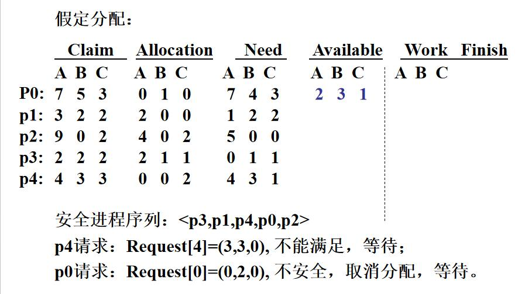
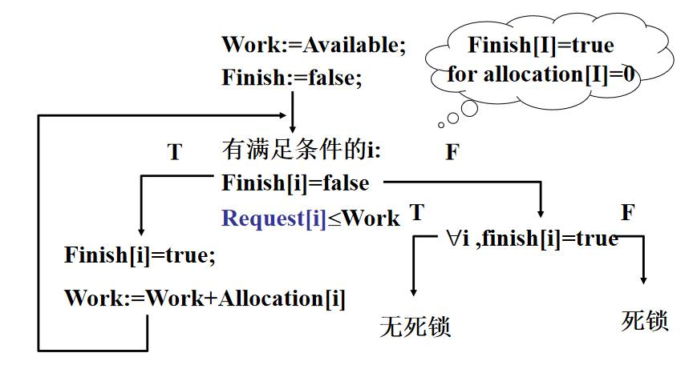
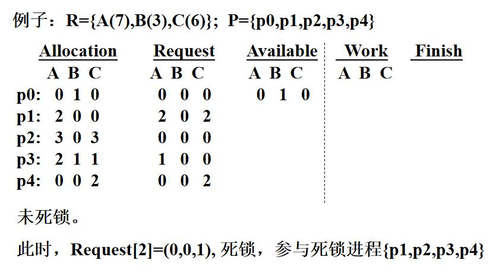
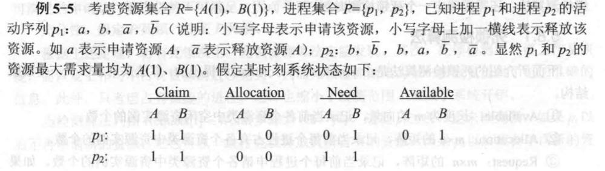
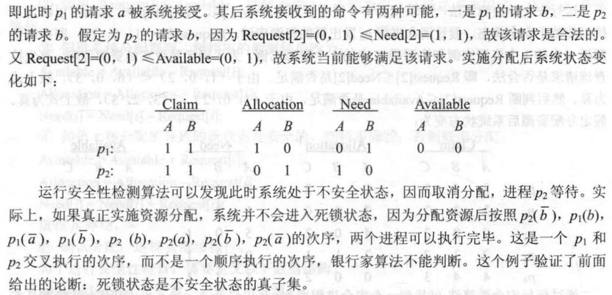
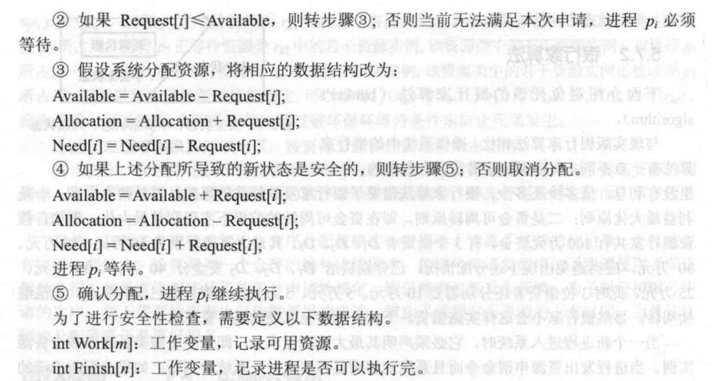
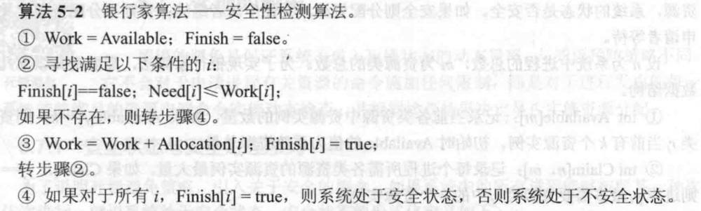
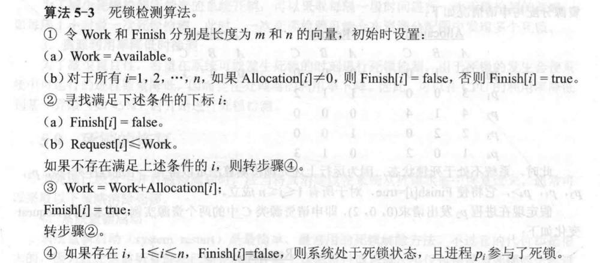
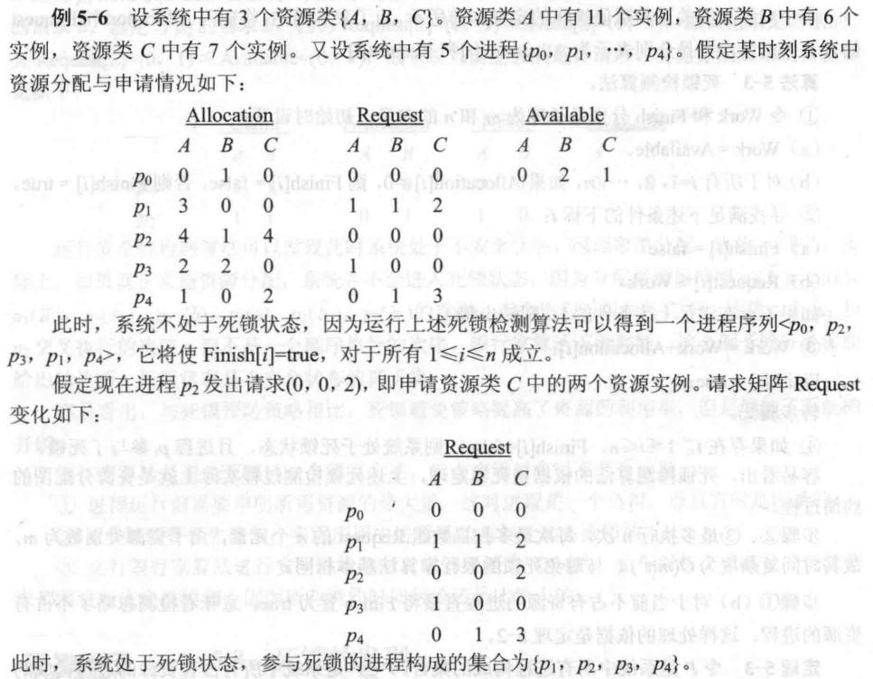

# 第5章 死锁与饥饿

整理自 `笔记/操作系统原理笔记.pdf` 第5章，章末“期末整理补充”一节收入了 `笔记/操作系统期末整理.pdf` 第五章和“死锁”部分中笔记没有的内容。笔记正文只做了机械清洗和改错，银行家算法的七张表合成了两张；章首要点、章末对比表、易错点和典型题是整理时写的。

## 本章要点

- 复习范围是课件 5.1 死锁的概念、5.2 死锁类型、5.3 死锁的条件、5.4 死锁的处理、5.6 死锁预防、5.7 死锁避免、5.12 饥饿与活锁，编号和下面一致。5.5 资源分配图、5.8 死锁检测不在范围列表里，但计算题有“死锁检测算法”，要看。
- 配套讲义：[第5章 死锁与饥饿（重制版）](<../重制版PPT/第5章 死锁与饥饿（重制版）.pptx>)，原课件 `课件/05第五章 死锁与饥饿.pptx`
- **死锁**：一组进程中的每个进程都在等待该组中其他进程占有的、因而永远得不到的资源。参与死锁的进程至少两个，都在等待资源，其中至少两个占有资源。
- 类型：竞争资源引起的、进程通信引起的、其他原因引起的。
- 四个必要条件（Coffman 条件）：资源独占、不可剥夺、保持申请、循环等待。每类资源只有一个实例时，四个条件就是充要条件。
- 处理方法：死锁预防（静态）、死锁避免（动态）、死锁检测与恢复、鸵鸟算法（不处理）。
- 预防：**预先分配法**破坏“保持申请”，**有序分配法**破坏“循环等待”。
- 避免：系统处于**安全状态**即存在安全进程序列。**银行家算法**先试探分配，再做安全性检测，不安全就撤销分配，时间复杂度 $O(mn^2)$。
- 资源分配图：无环路一定无死锁；有环路可能死锁；每类资源只有一个实例时，环路等价于死锁。**死锁定理**：状态 S 是死锁状态当且仅当 S 的资源分配图不可完全约简。
- 检测：结构和安全性检测一样，比较的是 Request；只想找占有资源的死锁进程时，把 Allocation 为 0 的进程的 Finish 初值设为 true。检测时刻可以选在进程等待时、定时、资源利用率下降时。
- 恢复：重新启动、终止进程、剥夺资源、进程回退。
- **饥饿**：等待时间没有上界；饥饿到任务完成也没有意义就是**饿死**；忙式等待条件下的饥饿叫**活锁**。解决办法是把“老化”（等待时间）作为调度参数。

---

死锁和饥饿是操作系统中的两种不同现象，它们都与进程对资源的竞争有关。

**可察觉的死锁：** 指的是系统能够检测到死锁发生的情况。系统可以通过特定的算法来识别死锁状态，并采取措施，如终止进程或资源抢占。

**饥饿（Starvation）概念：** 饥饿是指某个或某些进程由于无法获得足够的资源或CPU时间而无法执行的状态。与死锁不同，饥饿中的进程并没有无限期地等待，它们可能随时能够获得资源，但由于资源分配策略或其他原因，它们获得资源的机会非常少。

**特点：**
- 饥饿不一定意味着进程处于等待状态，它可能在系统中处于就绪状态，但由于资源调度策略，它很少或从未被调度执行。
- 饥饿可能由于资源分配不公平或优先级较低导致。

**死锁与饥饿的比较**
- **死锁：** 进程间存在循环等待资源，导致所有进程都无法继续执行。
- **饥饿：** 进程由于资源分配问题，长时间得不到资源，但理论上仍有获取资源的可能。

## 5.1 死锁的概念

**概念：** 死锁发生在一组进程中，这些进程中的每一个都无限期地等待其他进程占有的资源，而这些资源又永远不会被释放，导致等待的进程无法继续执行。

**死锁时刻：**
1. **无限等待发生时：** 当进程实际上已经开始无限期地等待时。
2. **等待发生前（已注定死锁）：** 在进程实际开始等待之前，根据进程的资源需求和资源分配情况，可以预测到死锁将要发生。

**由定义得到的结论**
1. 参与死锁的进程**至少有两个**
2. 每个参与死锁的进程均等待资源
3. 参与死锁的进程中至少有两个进程占有资源
4. 死锁进程是系统中当前进程集合的一个子集

## 5.2 死锁的类型

**1. 竞争资源引起的死锁**

这种类型的死锁通常发生在多个进程竞争有限数量的资源时。当每个进程都持有一些资源并等待其他进程释放它们所需的资源时，就可能发生死锁。
- **资源有限：** 在多进程环境中，如果可用的资源数量少于进程的需求，就可能出现竞争。
- **资源分配策略：** 如果资源分配不是完全公平或优化的，就可能导致某些进程长时间得不到所需资源（更正：原文接着说“进而引发死锁”。长时间得不到资源是饥饿，死锁要同时满足下面 5.3 的四个必要条件）。

**2. 进程间通信引起的死锁**

在需要进程间通信的系统中，特别是基于消息传递的系统中，死锁可能由进程间的通信等待条件引起。
- **消息传递：** 进程间通过发送和接收消息来通信。如果进程A等待来自进程B的消息，进程B又在等待来自进程C的消息，而进程C实际上在等待来自进程A的消息，就会形成一个等待循环，导致死锁。
- **常见场景：** 这种类型的死锁在分布式系统、多线程程序或任何需要进程间协调的系统中较为常见。

**3. 其他原因引起的死锁**

除了上述两种常见类型外，还有其他因素可能引起死锁：
- **系统资源分配不当：** 如内存分配不足、外部I/O设备分配不当等。
- **不恰当的同步机制使用：** 如信号量、互斥锁等同步机制使用不当，也可能导致死锁。
- **依赖关系：** 系统中的任务或进程之间可能存在复杂的依赖关系，这些依赖关系如果处理不当，也可能引起死锁。
- **系统调用或库函数：** 某些系统调用或库函数内部可能存在资源分配和同步逻辑，不恰当的使用同样可能引起死锁。

## 5.3 死锁的条件

资源独占（mutual exclusion）

不可抢占（non preemption）

保持申请（hold-while-applying）

循环等待（circular wait）

死锁发生的4个**必要条件（Coffman条件）**：

**1. 资源独占（Mutual Exclusion）**
- **定义：** 一个资源在任何时刻只能由一个进程使用。这意味着，如果资源正在被一个进程使用，其他进程必须等待直到资源被释放。
- **例子：** 打印机或磁盘设备等硬件资源，通常不允许多个进程同时访问。

**2. 不可剥夺（No Preemption）**
- **定义：** 一旦资源被分配给一个进程，它就不能被其他进程强行夺走，只能在该进程使用完毕后主动释放。
- **例子：** 一个进程正在处理的数据不能被操作系统中断并分配给其他进程。

**3. 保持申请（Hold and Wait）**
- **定义：** 一个进程在请求新的资源时，可以持有它已经分配到的资源，并且不会释放这些资源，直到它再次请求资源。
- **例子：** 如果一个进程请求一个资源，但该资源当前不可用，它将继续持有它已经拥有的资源，同时等待新资源的分配。

**4. 循环等待（Circular Wait）**
- **定义：** 存在一组进程，其中每个进程都等待另一个进程所占有的资源，形成一个循环链。
- **例子：** 如 p1 等待 p2 持有的资源，p2 等待 p3 持有的资源，p3 又等待 p1 持有的资源，形成一个等待循环。

**注意事项**
- **循环等待与死锁：** 虽然死锁发生时必有循环等待，但存在循环等待并不一定意味着会发生死锁（更正：原文还说“只有当所有其他三个条件也满足时，循环等待才会导致死锁”。四个条件都是必要条件，同类资源有多个实例时，四个条件都满足也不一定死锁，见下面的括号说明）。
- **消除死锁：** 破坏上述任何一个条件都可以消除死锁。例如，可以通过设计可剥夺的资源、要求进程一次性请求所有资源、或使用资源分配图算法来检测循环等待并采取行动。
- **充要条件：** 当每类资源只有单个实例时，满足这四个条件就足以确定死锁的发生，这时它们成为死锁发生的充分必要条件。

（如果同类资源数大于1，则即使有循环等待，也未必发生死锁。但如果系统中每类资源都只有一个，那循环等待就是死锁的充分必要条件了）

## 5.4 死锁的处理

**1. 不让死锁发生**

**死锁预防（静态的）**

死锁预防策略旨在通过限制进程对资源的请求方式来预防死锁的发生。这种策略基于这样一个理念：如果所有进程都遵循特定的资源使用协议，就可以避免死锁。
- **资源分配策略**：例如，要求进程在开始执行前一次性请求所有需要的资源，或者按照特定的顺序请求资源。

**死锁避免（动态的）**

死锁避免策略是在进程请求资源时进行动态检测，拒绝可能导致死锁的请求。
- **银行家算法**：一种著名的死锁避免算法（更正：原文作“死锁预防算法”），通过模拟资源的分配来检测潜在的死锁条件。

**2. 允许死锁发生，且当死锁发生时能够将死锁检测出来并加以消除**

**死锁检测**

死锁检测策略接受死锁可能发生的事实，并定期检测系统状态以确定是否发生死锁。
- **资源分配图检测**：构建资源分配图，如果存在循环等待，则表明发生了死锁。
- **等待图检测**：构建等待图，如果图中存在循环，则表示存在死锁。

**死锁恢复**

一旦检测到死锁，需要采取措施来恢复系统的正常运行。
- **终止进程**：终止参与死锁的进程，释放它们持有的资源。
- **回滚事务**：如果进程的操作可以回滚，那么可以撤销死锁进程所做的操作，然后释放资源。
- **资源抢占**：从死锁进程中抢占资源，分配给其他进程。

**其他处理策略**
- **资源重分配**：在可能的情况下，尝试重新分配资源，以打破死锁。
- **进程重调度**：改变进程的执行顺序，以避免资源的循环等待。

**预防与避免的区别**
- **死锁预防**是静态的，侧重于制定严格的资源使用规则来预防死锁。
- **死锁避免**是动态的，侧重于在资源请求时进行检测和调整，以避免死锁的发生。

## 5.5 资源分配图

### 5.5.1 资源分配图的定义

- 通过系统资源分配图的**有向图**可以更精确的描述死锁。
- 资源分配图由一个节点集合`V` 和一个边集合`E` 组成。
  - 节点集合`V` 分为进程集合`P` 和资源集合`R`
    - 进程节点集合： `P = {p1, p2, …, pn}`
    - 资源节点集合： `R = {r1, r2, …, rm}`
  - 边集合`E` 分为**申请边**和**分配边**
    - 申请边：`(pi , rj)` ，表示进程`pi` 已经申请使用资源类型`rj` 的一个实例，并等待这个资源申请边只指向方框，表明申请时**不指定资源实例**
    - 分配边：`(rj , pi)` ，表示资源类型`rj` 的一个实例已经分配给进程`pi`
      分配边由方框中的某一个圆点引出，表明哪一个资源实例已被占用
- 资源分配图的构建
  - 进程`pi` 申请资源类`rj` 中的一个资源实例时，在资源分配图中增加一条申请边
  - 当申请满足时，相应的申请边改为分配边
  - 释放资源实例时，删除相应分配边
- 有关资源分配图的结论
  1. **图中没有环路，则系统中没有死锁**eg. 无环路，无死锁P={p1,p2,p3}R={r1(1),r2(2),r3(1),r4(3)}E={(p1,r1),(p2,r3),(r1,p2),(r2,p1),(r2,p2),(r3,p3), (r4,P3)}
  2. 图中存在环路，则系统中**可能存在**死锁（环路是死锁的**必要条件**）
    eg. 有环路，有死锁P={p1,p2,p3}R={r1(1),r2(2),r3(1),r4(3)}E={(p1,r1),(p2,r3),(r1,p2),(r2,p1),(r2,p2),(r3,p3), (r4,P3), (p3,r2)}   **增加了边(p3,r2)**
    eg. 有环路，无死锁
    将p2占有的r1释放，分给p1，(p1,r1)改为(r1,p1)，变不会死锁
  3. 若每个资源类中都**只含有一个资源实例**，那么环路的存在**等价于**死锁的存在

### 5.5.2 资源分配图的约简

- **寻找非孤立节点**：在资源分配图中，寻找一个没有申请边、只有分配边的非孤立进程节点`pi`（即它不再等待资源，能运行完）。如果没有这样的节点，算法结束。
- **去除分配边**：将找到的节点`pi` 的所有分配边去除，使其成为一个孤立节点，相当于`pi` 运行完并释放它占有的全部资源（更正：原文把`pi` 说成资源节点，把这一步说成“将资源分配给占有它的进程”，意思不对）。
- **寻找可满足请求的进程**：在图中寻找所有请求边都可满足的进程`pj` 。这表示`pj` 所需的所有资源当前都是可用的。
- **改变请求边为分配边**：将进程`pj` 的所有请求边改为分配边，表示`pj` 已经获得了它请求的所有资源。
- **重复过程**：返回步骤1，继续寻找下一个符合条件的节点，直到无法找到这样的节点为止。

- **死锁定理**：S为死锁状态的**充分必要条件**是S的资源分配图不可完全约简

## 5.6 死锁的预防

- 死锁预防是保证系统不进入死锁状态的**静态策略**
- 基本思想：
  - 对进程有关资源的活动加限制，所有进程遵循这种限制，即可保证没有死锁发生
- **优点**：
  - 简单：实现起来相对简单，因为它主要依赖于预防规则。
  - 确定性：由于是在进程运行前或运行时施加约束，因此可以确定地避免死锁。
- **缺点**：
  - 资源利用效率低：可能导致资源得不到充分利用。
  - 约束限制：进程可能因为严格的约束而无法按需获得资源。
- 常见的两种预防策略：
  - **预先分配法**
  - **有序分配法**

### 5.6.1 预先分配法

- 特点：进程运行前申请所需全部资源
- 系统的决策：
  - 满足，一次性全部分配给申请进程
  - 反之，不分配资源，此进程暂不投入运行
- 作用：破坏了**保持申请**这一必要条件
- 缺点：
  - 资源利用效率低
  - 一次提出申请困难，进程运行前可能不知道自己所需要的全部资源

### 5.6.2 有序分配法

- 特点：事先将所有资源类完全排序，给每一个资源类赋予一个**唯一的整数**
- 规定：进程必须按照资源编号由小到大的次序申请资源
- **原理分析**：这种方法可以避免循环等待，因为进程只能按照编号从小到大的顺序申请资源，从而破坏了死锁的“循环等待”条件。

- **优点**：相比预先分配法，资源利用率更高。
- **缺点**：
  - 设备增加不便：新增资源类型可能需要重新编号。
  - 资源浪费：进程实际使用资源的顺序可能与编号顺序不一致。
  - 用户编程麻烦：必须按照规定的顺序申请资源。

**预防策略的效果**
- 在任何时刻，如果一个进程拥有最大编号的资源，那么它申请更多资源时不会发生死锁，因为不会有其他进程持有更大编号的资源。

## 5.7 死锁的避免

- 死锁避免是保证系统不进入死锁状态的**动态策略**（ 其实就是进行动态检查）

### 5.7.1 安全状态与安全进程序列

- 系统处于**安全状态**：存在安全进程序列`<p1,p2,…,pn>` 进程序列`<p1,p2,…,pn>` 安全，`p1,p2,…,pn` 可依次进行完
  - 说人话就是，系统中所有的进程能够按照某一种次序依次进行，就说系统处于安全状态
- 安全、不安全、死锁之间的关系（原稿的关系图没有导出）：死锁状态属于不安全状态，安全状态一定不会死锁
- 死锁意味着不存在一条路线使所有进程剩余的活动能够执行完
- 不安全状态不一定是死锁状态
- 安全序列可能有多个，进程在实际进行时并不一定沿着检测到的顺序路线进行

### 5.7.2 银行家算法

- 当一个进程申请使用资源的时候，**银行家算法**通过先**试探**分配给该进程资源，然后通过**安全性算法**判断分配后的系统是否处于安全状态，若不安全则试探分配作废，让该进程继续等待

- **银行家算法中的数据结构**：
  - `Available[m]` ：表示系统中可利用的资源向量，`m` 为资源种类数。
  - `Claim[n][m]` ：表示最大需求矩阵，`n` 为进程数量，每个进程对每种资源的最大需求。
  - `Allocation[n][m]` ：表示当前各进程的资源分配矩阵。
  - `Need[i][j]` ：表示进程`i` 还需资源`j` 的数量。
  - `Request[m]` ：表示当前进程请求的资源数量。
  - `Work[m]` ：安全性检测时的工作向量，初值为`Available`，每找到一个能运行完的进程，就把它的`Allocation`加进去（更正：原文作“表示当前系统中可用资源加上已分配给进程但未使用的资源”）。
  - `Finish[n]` ：临时布尔数组，表示进程是否已经完成。

**银行家算法步骤：**
1. **检查申请**：检查进程的申请是否超过了其声明的最大需求。
2. **检查资源可用性**：检查系统剩余的可用资源是否能满足进程的请求。
3. **试探分配**：如果请求合法且资源足够，算法试探性地分配资源给进程，并更新各数据结构。
4. **安全性检查**：使用安全性算法判断系统是否处于安全状态。

**安全性算法步骤：**

检查当前的剩余可用资源是否能满足某个进程的剩余需求`Need`，如果可以（更正：原文作“最大需求”，比较的应该是 Need 而不是 Claim），就把该进程加入安全序列，并把该进程持有的资源全部回收。

不断重复上述过程，看最终是否能让所有进程都加入安全序列。

- 银行家算法实例

设资源集合 R = {A(10), B(5), C(7)}，进程集合 P = {P0, P1, P2, P3, P4}。原稿用七张表一步步演示，这里合成两张表。

初始状态（Available = 3 3 3，即总量减去所有 Allocation 之和）：

| 进程 | Claim（A B C） | Allocation（A B C） | Need（A B C） |
|---|---|---|---|
| P0 | 7 5 3 | 0 1 1 | 7 4 2 |
| P1 | 3 2 2 | 2 0 0 | 1 2 2 |
| P2 | 9 0 2 | 3 0 0 | 6 0 2 |
| P3 | 2 2 2 | 2 1 1 | 0 1 1 |
| P4 | 4 3 3 | 0 0 2 | 4 3 1 |

安全性检测过程（Work 初值 = Available = 3 3 3）：

| 步骤 | 检查的进程 | Need ≤ Work？ | 回收后 Work = Work + Allocation | Finish 次序 |
|---|---|---|---|---|
| 1 | P0 | 7 4 2 ≤ 3 3 3，不满足，继续比较 | | |
| 2 | P1 | 1 2 2 ≤ 3 3 3，满足 | 3 3 3 + 2 0 0 = 5 3 3 | 1 |
| 3 | P2 | 6 0 2 ≤ 5 3 3，不满足，继续比较 | | |
| 4 | P3 | 0 1 1 ≤ 5 3 3，满足 | 5 3 3 + 2 1 1 = 7 4 4 | 2 |
| 5 | P4 | 4 3 1 ≤ 7 4 4，满足 | 7 4 4 + 0 0 2 = 7 4 6 | 3 |
| 6 | P2 | 6 0 2 ≤ 7 4 6，满足 | 7 4 6 + 3 0 0 = 10 4 6 | 4 |
| 7 | P0 | 7 4 2 ≤ 10 4 6，满足 | 10 4 6 + 0 1 1 = 10 5 7 | 5 |

最终得到安全进程序列：P1 → P3 → P4 → P2 → P0。最后的 Work 等于资源总量 10 5 7，可以用来检查有没有算错。

**例子2：**

p4发送request后，available没法满足，所以等待

p0发送request后，假设分配了，分配后运用安全性检测算法，找不到所有进程可以进行完的安全进程序列，因而分配将导致系统进入不安全状态，故取消分配，恢复之前的状态，p0进入等待队列。

- **银行家算法的保守性**
  - **安全性检测的保守性**：银行家算法在进行资源分配前会运行安全性检测算法。如果检测到系统处于不安全状态，算法会取消分配。然而，这种检测有时可能会过于保守，即使实际上系统实施资源分配后并不会进入死锁状态，也会拒绝分配。
- **银行家算法存在的问题**：
  - **最大资源需求信息不足**：进程在运行前需要声明其所需资源的最大量，但这个信息可能不足以进行完整的充要性分析。进程的实际需求可能因运行情况而异，导致算法无法准确预测。
  - **进程数量的静态假设**：算法假设系统中的进程数量`n` 是事先已知的。然而，在实际应用中，进程是动态创建和撤销的，这使得算法需要不断更新和重新评估。
  - **安全性检测的时间开销**：安全性检测的时间复杂度为 $O(mn^2)$，其中`m` 是资源种类数，`n` 是进程数量。这种开销在进程或资源数量较多时可能会变得相当大，影响系统性能。
  - **命令序列的预先确定困难**：如果进程还能预先给出有关资源的命令序列，就可以设计出避免死锁的充要性算法，但复杂度很高（NP完全），而且程序有分支和循环，命令序列一般无法事先给出（更正：原文说成“银行家算法要求进程预先给出命令序列”，银行家算法只需要最大需求量）。

**与死锁预防策略相比**
- **资源利用率**：死锁避免策略如银行家算法通常能提高资源的利用率，因为它们允许更灵活的资源分配，而不是像预防策略那样对进程施加严格的约束。
- **系统开销**：避免策略虽然提高了资源利用率，但也增加了系统的开销，因为需要进行额外的检测和计算来判断系统是否处于安全状态。
- **动态适应性**：避免策略通常更能适应动态变化的系统环境，因为它们可以在进程运行时进行资源分配决策，而不是要求所有决策都在进程开始运行前完成。

## 5.8 死锁的检测

### 5.8.1 死锁检测算法

如果按照原来的request，未发生死锁，如果此时p2发出request=（0，0，1），此时发生死锁

上述算法可以检测到参与死锁的全部进程，包括占有资源和不占有资源的进程。

如果希望只检测占有资源的进程，初始化时：

`Finish[i]=true, for Allocation[i]=0`

- **定理**：设 P' 是 P 中占有资源的进程集合，则进程集合 P 处于死锁状态当且仅当 P' 处于死锁状态。反之亦然，如果子集P'处于死锁状态，那么整个进程集合P**也处于死锁状态。

**死锁检测的优化**
- **只考虑占有资源的进程**：根据定理，死锁检测可以只针对那些已经占有资源的进程**P'**，而不是所有进程**P**。这样可以减少需要分析的进程数量，从而降低检测的复杂度和系统开销。
- **缩小检测范围**：通过排除那些尚未占有资源的进程（即**P-P'**），死锁检测的范围得到缩小，这有助于提高检测的效率。
- **降低系统开销**：减少检测过程中需要考虑的进程数量，可以减少计算资源的使用，从而降低系统的总体开销。

**方法1：考虑所有进程**
- **目标**：检测系统中所有可能参与死锁的进程，无论它们当前是否占有资源。
- **优点**：能够全面识别死锁状态，包括那些尚未占有资源但可能导致死锁的进程。
- **缺点**：可能需要更多的计算资源和时间来检测死锁。

**方法2：仅考虑占有资源的进程**
- **初始化**：在开始检测时，将所有未占有资源的进程标记为完成（`Finish[i]=true` ），因为它们不参与当前的资源争夺。
- **优点**：缩小了检测范围，只关注那些可能因资源争夺而死锁的进程，降低了系统的开销。
- **缺点**：只能找出占有资源的那部分死锁进程，不占资源、只在等待的死锁进程不会列出来；判断系统是否死锁的结论不受影响（更正：原文作“可能会忽略那些虽然当前未占有资源，但在未来可能参与死锁的进程”）。

**方法3：约简资源分配图**
- **概念**：通过约简资源分配图来检测死锁，即通过分析图中的循环和节点状态来确定死锁的存在。
- **优点**：直观地表示了资源的分配和请求状态，易于理解和实现。
- **缺点**：可能需要对图进行复杂的分析，且在资源种类或进程数量较多时效率可能较低。

### 5.8.2 死锁检测时刻

**1. 等待时检测**
- **时机**：当进程请求资源并进入等待状态时进行死锁检测。
- **优点**：可以早期发现死锁，恢复代价较小。
- **缺点**：频繁检测可能导致较大的开销。

**2. 定时检测**
- **时机**：在固定的时间间隔内进行死锁检测。
- **优点**：可以在预定的时间点检查系统状态，平衡检测频率和系统开销。
- **缺点**：如果检测间隔过长，可能会延迟发现死锁。

**3. 资源利用率下降时检测**
- **时机**：当系统检测到资源（如CPU）的利用率下降时，可能是死锁的迹象，此时进行死锁检测。
- **优点**：针对性强，仅在可能发生死锁时进行检测，减少了不必要的开销。
- **缺点**：依赖于资源利用率的阈值设定，可能错过早期的死锁检测。

## 5.9 死锁的恢复

**死锁恢复策略**
1. **重新启动**：
  - 完全重启系统或相关服务，清除所有进程和资源分配，从头开始。
  - 适用于系统完全混乱且难以定位问题时。
2. **终止进程**：
  - 通过终止参与死锁的进程来释放资源。
    - **一次性撤销**：直接终止所有参与死锁的进程。
    - **逐一撤销**：选择性地终止单个进程，逐步解决死锁。这可能涉及到某种算法来决定哪个进程应该被终止。
3. **剥夺资源**：
  - 强制回收死锁进程所占有的资源。
    - **逐步剥夺**：逐步回收资源，尝试最小化对系统的影响。
    - **一次剥夺**：一次性回收所有资源，快速解决问题但可能对系统稳定性有较大冲击。
4. **进程回退**：
  - 让死锁进程回退到之前的状态，避免死锁发生。
  - **优点**：可以恢复到稳定状态并继续执行。
  - 存在的问题：
    - **保存快照代价大**：需要定期保存进程状态，以便回退，这可能消耗大量资源。
    - **消除影响困难**：一旦进程开始回退，需要确保所有依赖的资源和状态都能正确回滚。
    - **饥饿（Starvation）**：如果回退策略不公平，可能导致某些进程长时间得不到资源。

## 5.10 鸵鸟算法

鸵鸟算法（Ostrich Algorithm）就是对死锁不做任何处理，像鸵鸟把头埋进沙子一样假装问题不存在。理由是死锁很少发生，而预防、避免或检测死锁的代价很大，不如出了问题再重启。UNIX、Windows 等通用系统对大部分死锁采用的就是这种态度。

（整理注：原稿这一节是聊天机器人生成的泛泛解释，讲的是软件工程里“忽略问题”的比喻，和死锁无关，这里按课程含义重写。）

## 5.12 饥饿与活锁

- **定义**：饥饿是指进程在等待资源分配时，由于资源调度策略的不公平性，导致某些进程长时间无法获得所需资源，从而无法推进执行的状态。
- **饿死**：当进程等待资源的时间过长，以至于即使最终获得了资源，其完成的任务也失去了实际意义，这种情况被称为饿死。
- **主要原因**：
  - 资源调度策略不公平，如优先级调度策略中，低优先级的进程可能长时间得不到资源。
  - 资源分配算法的缺陷，可能导致某些进程被无限期地推迟资源分配。
- **没有时间上界的等待**
  - 排队等待
  - 忙式等待
- 发生饥饿的**主要原因**：资源调度策略的不公平性
- 解决饥饿问题从**改进资源分配算法**入手
  - 推荐的做法：
    - 把**老化**作为调度算法的一个参数
    - **老化**：进程等待某种资源的时间

**饥饿与死锁的联系与差别**
- **联系**：饥饿和死锁都源于进程对资源的竞争，都会导致进程无法正常执行。
- **差别**：
  - **状态差异**：
    - **死锁**：进程因为资源分配问题而处于等待状态，无法继续执行。死锁的进程互相等待对方持有的资源，导致无法继续执行。
    - **饥饿**：由于资源调度策略的不公或资源分配的优先级问题，长时间得不到所需资源，导致无法推进执行。饥饿进程可能处于等待状态（排队等待），也可能处于就绪或运行状态（忙式等待）（更正：原文作“进程虽然未处于等待状态”）。
  - **资源分配**：
    - **死锁**：死锁进程等待的资源可能永远不会释放，因为它们被其他死锁进程持有，且这些进程也无法继续执行。
    - **饥饿**：饥饿进程等待的资源可能会被释放，但由于调度策略或其他原因，资源释放后并未分配给饥饿进程，导致**其等待时间没有确定的上界**。
  - **循环依赖**：
    - **死锁**：至少涉及两个进程，它们之间**存在循环等待**的关系，即每个进程都在等待另一个进程释放资源。
    - **饥饿**：**不一定涉及循环等待**，一个进程可能因为非循环的原因（如优先级较低）而长时间得不到资源。
  - **涉及进程数量**：
    - **死锁**：**至少涉及两个进程**，因为单个进程无法形成互相等待的局面。
    - **饥饿**：**可能只涉及单个进程**，该进程可能因为资源调度策略而被忽略，导致其长时间得不到所需资源。
  - **检测和预防**：
    - **死锁**：可以通过资源分配图等方法检测，预防措施包括资源分配策略的改进、死锁避免算法等。
    - **饥饿**：难以通过图形化方法检测，预防和解决措施通常包括改进调度算法，如引入老化机制，确保公平性。
  - **系统影响**：
    - **死锁**：会导致系统资源利用率下降，因为死锁进程占用资源但不释放。
    - **饥饿**：也会导致资源利用率下降，因为饥饿进程长时间得不到资源，无法执行。

**活锁（Livelock）**
- **定义**：活锁是指进程在忙式等待（Spinlock）条件下，由于资源申请未能满足而进入一种循环状态，进程不断尝试申请资源，但始终无法成功，也无法转入其他状态。
- **特点**：
  - 活锁中的进程并未进入等待状态，而是在频繁地检查资源可用性并尝试申请。按教材的说法，活锁就是忙式等待条件下发生的饥饿（更正：原文作“与饥饿不同”）。
  - 进程处于运行状态，但实际上并未取得进展。
- **解决方法**：
  - 避免使用忙式等待，尤其是在资源竞争激烈的环境中。
  - 引入资源申请的回退策略，如在申请失败后等待一段时间再重新申请。

原稿最后还有 5.13 死锁的例子、5.14 简单组合资源死锁的静态分析、5.15 同种组合资源死锁的必要条件三个标题，没有内容；这几节不在复习范围内。

---

## 期末整理补充

下面是 `笔记/操作系统期末整理.pdf` 里笔记正文没有的内容。死锁类型、四个条件、两种预防策略和笔记重复，没有再收。

### 安全状态的定义

说系统处于安全状态，如果存在一个由系统中的所有进程构成的安全进程序列 <p1, p2, …, pn>；说一个进程序列 <p1, p2, …, pn> 是安全的，如果对于每一个进程 pi，它以后需要的资源数量不超过系统当前剩余资源数量与所有进程 pj（j < i）当前占有资源数量之和。

**不安全状态但不死锁的例子：**

### 银行家算法存在的问题

与死锁预防策略相比，死锁避免策略提高了资源的利用率，但是增加了系统的开销。银行家算法是避免死锁的一个漂亮方法，但在应用时有以下几个问题：

1. 进程运行前需要申明所需资源的最大量，这对进程是一个负担，而且有时是困难的。
2. n 个进程要事先已知，实际应用中进程是动态创建动态撤销的。
3. 运行银行家算法进行安全性检测时，时间开销为 $O(mn^2)$，由于对每个可满足的资源请求都需进行安全性检测，因而所花费的时间代价还是比较大的。

### 银行家算法的两个步骤

资源分配算法（算法 5-1）：

安全性检测算法（算法 5-2）：

银行家算法的时间复杂度主要是安全性检测算法的复杂度，步骤②、③最多执行 n 次，每次最多扫描数组 Need 的 n 个元素，由于资源类别数为 m，故银行家算法的时间复杂度为 $O(mn^2)$，借助图论可将其复杂度降至 $O(n^2)$。

### 死锁检测算法与例题

**例题：**

### 死锁和饿死的区别和联系

**联系：** 二者都是由于竞争资源而引起的。

**区别：**

1. 从进程状态考虑，死锁进程都处于等待态。忙式等待（处于运行态或者就绪态）的进程并非处于等待态，但是却有可能被饿死。
2. 死锁进程等待永远不会被释放的资源，饿死进程等待会被释放但却不会分配给自己的资源，其等待时限没有上界（排队等待或忙式等待）。
3. 死锁一定是发生了循环等待，而饿死则不然。这也表明通过资源分配图可以检测死锁存在与否，但却不能检测是否有进程饿死。
4. 死锁一定涉及多个进程，而饥饿或被饿死的进程可能只有一个。

### 解决饥饿问题的方法

饥饿主要由资源调度策略的不公平性引起，包括处理器资源和其他资源的分配。原稿把饥饿说成“与死锁和活锁不同，是一个可解决的问题”，活锁本身就是一种饥饿，这句不必记。

- 从改进资源分配算法入手，解决不公平的问题。
- 先到先服务可以防止饥饿，但效率不高；设计调度算法要同时考虑公平和效率。
- 推荐的做法是把“老化”作为调度算法的一个参数。**老化**指进程等待某种资源的时间。
- 具体做法：进程等待 CPU 时，随着等待时间增加动态提升它的优先级，它迟早会超过当前运行进程的优先级而得到运行，这样就不会饥饿和饿死。

---

## 易混对比

| | 死锁预防 | 死锁避免 | 死锁检测与恢复 |
|---|---|---|---|
| 性质 | 静态：事先对资源活动加限制 | 动态：每次申请时检查 | 允许死锁发生，事后发现并解除 |
| 方法 | 预先分配法、有序分配法 | 银行家算法 | 检测算法、资源分配图约简 + 恢复 |
| 破坏的条件 | 保持申请 / 循环等待 | 不破坏条件，保证不进入不安全状态 | 不破坏 |
| 资源利用率 | 低 | 较高 | 高 |
| 开销 | 小 | 每次满足请求前都要做安全性检测 | 检测和恢复的开销 |

| | 安全性检测（银行家算法） | 死锁检测算法 |
|---|---|---|
| Work 初值 | Available | Available |
| 找什么进程 | Finish 为 false 且 Need ≤ Work | Finish 为 false 且 Request ≤ Work |
| 结论 | 所有进程都能完成就安全，才真正分配 | 最后 Finish 仍为 false 的进程处于死锁 |

| | 死锁 | 饥饿 / 饿死 |
|---|---|---|
| 进程状态 | 都在等待态 | 排队等待时在等待态，忙式等待时在就绪或运行态 |
| 等的资源 | 永远不会被释放 | 会被释放，但总轮不到自己 |
| 循环等待 | 一定有 | 不一定有 |
| 涉及进程数 | 至少两个 | 可以只有一个 |
| 资源分配图能否检测 | 能 | 不能 |

| | 预先分配法 | 有序分配法 |
|---|---|---|
| 规定 | 运行前一次申请全部资源 | 按资源编号从小到大申请 |
| 破坏 | 保持申请 | 循环等待 |
| 缺点 | 资源利用率低；运行前不一定知道要哪些资源 | 编号难定；增加进程负担；暂时不用的资源可能要提前申请 |

## 易错点

- 银行家算法是死锁避免，不是死锁预防（笔记原文写错了，已更正）。
- 不安全状态不一定是死锁状态，死锁状态一定是不安全状态。
- 资源分配图有环路不一定死锁，要看每类资源的实例个数。
- 安全性检测比较的是 Need（还需要多少），不是 Claim（最大需求）。
- 参与死锁的进程不一定都占有资源，但一定都在等待资源。
- 处理器是可剥夺资源，进程不会因为竞争处理器而死锁。
- n 个同类资源、每个进程最多需要 m 个时，保证不死锁的最大进程数是 $\lfloor (n-1)/(m-1) \rfloor$：k 个进程各拿到 m−1 个后，只要再剩 1 个资源就有进程能完成，即 $k(m-1)+1\le n$。
- 银行家算法的保守性：只知道最大需求，不知道申请和释放的顺序，只能按最坏情况考虑，有时实际不会死锁的请求也被拒绝。

## 典型题

- 计算题“银行家算法”：5.7.2 的例子，按上面的表格格式写出每一步 Need 与 Work 的比较和 Work 的变化；有 Request 时先检查 Request ≤ Need、Request ≤ Available，再试分配后做安全性检测（例子2）。
- 计算题“死锁检测算法”：5.8.1 的图和上面期末整理的例题，写法和安全性检测相同。
- 简答：`12 简答题精编（第4-6章）.md` 第5章，“死锁的四个必要条件”“预防策略及缺点”“死锁与饿死的区别”“有序分配为什么不死锁”常考。
- 名词解释：`10 名词解释.md` 第5章，笔记附录的往届名词里有 Deadlock，附录另一份27个名词的列表里还有 Banker's Algorithm。
