# 第7章 虚拟存储管理

整理自 `笔记/操作系统原理笔记.pdf` 第7章。笔记正文只做了机械清洗和改错，章首要点、章末对比表、易错点和典型题是整理时写的。

## 本章要点

- 复习范围是课件 7.2 虚拟存储系统（主要是 7.2.1 虚拟页式）、7.3 虚拟段式存储系统、7.4 虚拟段页式存储系统，对应下面的 7.2～7.4。7.1 外存资源管理不在范围里，内容很短，顺带看。计算题“页面调度”出自 7.2.6。
- 配套讲义：`课件/07第七章 虚拟存储管理.pptx`（这一章还没有重制版）
- 虚拟存储的理论基础是**局部性原理**：时间局部性（循环）和空间局部性（顺序执行、数组访问）。进程只需部分装入内存。
- 虚拟页式：页表增加外存块号、内外标志、修改标志，快表增加修改标志。访问的页不在内存时发生**缺页中断**：找外存地址 → 找空闲页框，没有就按置换算法淘汰一页（修改过的要写回外存）→ 读入所缺页、改页表 → 重新执行被中断的指令。
- 内存页框分配策略：平均分配、按进程长度比例、按优先级比例、按长度和优先级比例。外存块分配：静态分配（外存保留全部页面）和动态分配（外存只放不在内存的页面）。
- 页面调入：**请调**（缺页时调入）和**预调**（预测后提前调入），预调必须辅以请调。
- 置换算法：OPT、FIFO、LRU、NUR、LFU、MFU、二次机会、时钟、改进型时钟。FIFO 有 Belady 异常。置换范围分局部置换和全局置换。
- **颠簸（抖动）**：页面在内外存之间频繁调度，调度时间比进程运行时间还长，根源是页故障率太高。原因：分给进程的页框太少、置换算法不合理、程序结构不好。对策：工作集模型、页故障率反馈模型、挂起部分进程。
- 虚拟段式：缺段中断；段的动态连接与段共享有矛盾，解决办法是把段分成纯段（共享）和杂段（私用）。
- 虚拟段页式：段表、页表、总页表（位图）、共享段表、段名—段号对照表；中断有连接中断、缺页中断、越界中断、越权中断。

---

## 7.1 外存资源管理技术

首先应当指出，外存空间是指磁盘等存储型设备上的存储区域，通常在逻辑上可以划分为4个主要部分：输入井、输出井、文件空间、交换空间，如下图所示。
1. **输入井（Input Spooling）**：这是一块用于暂时存储即将被处理的作业的区域。它允许多个作业的输入数据被预先加载到这个区域，然后按顺序逐一处理。
2. **输出井（Output Spooling）**：与输入井相对应，输出井用于暂时存储已经处理完毕但尚未输出的作业结果。这样，输出设备可以按顺序处理这些数据，而不必等待CPU完成所有计算。
3. **文件空间（File Space）**：这是外存中用于存储文件的区域。文件系统管理这些空间，允许用户创建、读取、修改和删除文件。
4. **交换空间（Swap Space）**：也称为对换空间，是实现虚拟存储的关键部分。当系统的物理内存不足以容纳当前所有运行的程序时，操作系统会将一些不常用的内存页面移动到交换空间，从而为其他程序释放内存。这个过程称为页面置换或页面调度。


### 7.1.1 外存空间划分

- **静态等长**：外存空间被划分为固定大小的块，每一块的大小是2的幂次方，即 $2^i$。这种划分方式便于管理和分配，因为块的大小是统一的。

### 7.1.2 外存空间分配

- **空闲块链**：这是一种简单的分配策略，空闲的块被组织成一个链表。当需要分配空间时，从链表中取出一个块；当块被释放时，它会被重新链接到链头（更正：原文作“链表的末尾”，见 6.2.2 空闲页链和 8.7.2 空闲块链）。这种方式简单，但在块频繁分配和释放时效率较低。
- **空闲块表**：这种方法使用一张表来记录所有空闲块的信息。表中的每个条目指向一个空闲块，这使得查找空闲块更快，但需要更多的内存来维护这张表。
- **字位映像图**：这是一种使用位图来表示块是否被占用的方法。位图中的每个位对应一个块，0表示空闲，1表示已占用。这种方法查找和释放块都非常快，但可能需要较大的内存空间来存储位图。

**进程与外存对应关系**
- **界地址**：这是一种连续分配方式，每个进程在外存中占据一组连续的块（更正：原文作“物理内存”，这里讲的是进程与外存的对应关系）。这种方式简化了地址转换，但可能导致内存碎片。
  - **单对界**：每个进程只占用一组连续的外存块。
  - **双对界**：每个进程占用两组连续的外存块，这可能用于实现某些特定的内存管理策略。
- **页式**：这是一种非连续分配方式，内存被划分为固定大小的页，外存也被划分为块。每个内存页对应一个外存块。这种方式可以减少内存碎片，提高内存利用率。
- **段式**：内存被划分为逻辑上的段，每个段可以占据外存中的若干连续块。这种方式提供了更大的灵活性，因为段的大小可以根据需要动态变化。
- **段页式**：结合了段式和页式的特点，内存页对应外存块，但内存被划分为逻辑上的段。这种方式既利用了页式管理的高效性，又保持了段式管理的灵活性。

## 7.2 虚拟页式存储管理

**无虚拟问题**：
- 如果没有虚拟存储，程序必须完全装入物理内存才能运行。这意味着不能运行比内存大的程序。
- 即使程序的某些部分很少使用，它们也必须占用内存空间，这可能导致内存浪费。

**虚拟存储的优势**：
- 允许进程部分装入内存，部分（或全部）装入外存。
- 运行时，进程在外存的部分可以动态调入内存，如果内存不足，可以按照一定的淘汰算法淘汰一些页面。

**控制流的影响**：
- 单控制流的进程（如顺序执行的程序）可能只需要较少的部分在内存中。
- 多控制流的进程（如具有多个分支或循环的程序）可能需要较多的部分在内存中以保持效率。

### 7.2.1 基本原理

**进程运行前的准备**：
- 进程的全部或部分被装入外存。
- 进程需要运行时，只有必要的部分被装入内存。

**进程运行时的工作流程**：
1. **缺页中断**：当进程访问的页不在内存中时，会发生缺页中断。
2. 中断处理程序：
  - 找到访问页在外存的地址。
  - 在内存中寻找空闲页面。
  - 如果没有空闲页面，根据淘汰算法选择一个页面进行淘汰。
  - 如果被淘汰的页面是脏页（即已经被修改过），则需要将其写回外存。
  - 修改页表和总页表以反映新的页面分配。
3. **页面调入**：将所需的页面从外存读入内存，这可能涉及到切换进程。
4. **重新启动中断指令**：页面调入内存后，操作系统重新启动导致缺页中断的指令。

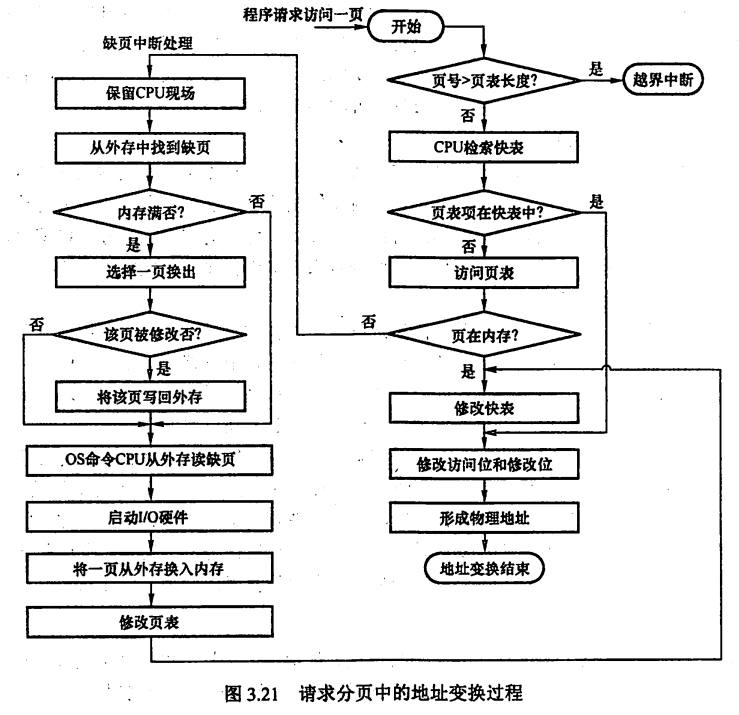

补充细节：

①只有“写指令”才需要修改“修改位”。并且，一般来说只需修改快表中的数据，只有要将快表项删除时才需要写回内存中的慢表。这样可以减少访存次数。

②和普通的中断处理一样，缺页中断处理依然需要保留CPU现场。

③需要用某种“页面置换算法”来决定一个换出页面

④换入/换出页面都需要启动慢速的I/O操作，可见，如果换入/换出太频繁，会有很大的开销。⑤页面调入内存后，需要修改慢表，同时也需要将表项复制到快表中。

【在具有快表机构的请求分页系统中，访问一个逻辑地址时，若发生缺页，则地址变换步骤是：查快表(未命中) → 查慢表(发现未调入内存) → 调页(调入的页面对应的表项会直接加入快表) → **查快表(命中)** → 访问目标内存单元】

**对页表的改进：**

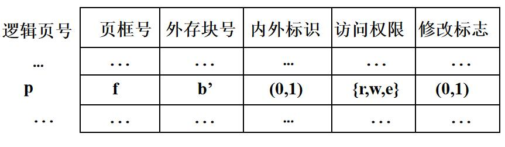

**对快表的改进：**

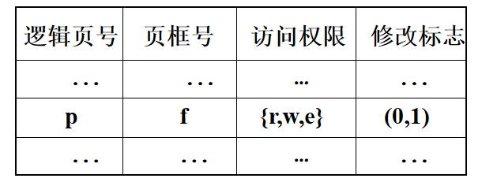

### 7.2.2 内存页框分配策略

内存页框分配策略是操作系统内存管理中的一个重要方面，它决定了如何将有限的物理内存页框分配给各个进程。

**静态内存页框分配策略**
1. **平均分配**：
  - 所有进程平均分配内存页框。例如，如果内存有128页，有25个进程，则每个进程平均分配到5个页框。
2. **按进程长度比例分配**：
  - 根据进程的页面需求分配内存页框。如果进程(i)有(si)个页面需求，所有进程的页面需求总和为 $S=\sum_{i=1}^{n}s_i$，内存共有 m 个页框，则进程 i 应分配的页框数为 $a_i=\frac{s_i}{S}\times m$。
3. **按进程优先级比例分配**：
  - 根据进程的优先级来分配内存页框，高优先级的进程可能会获得更多的内存资源。
4. **按进程长度和优先级别比例分配**：
  - 结合进程的长度和优先级来分配内存页框，以平衡内存的公平性和效率。

**静态策略的局限性**
- **程序结构**：静态策略没有考虑到不同程序的结构特点，例如，有些程序可能具有更好的局部性，从而更有效地利用内存。
- **程序在不同时刻的行为特性**：静态策略没有考虑到程序在不同执行阶段的行为变化。程序可能在某些时刻需要更多的内存，而在其他时刻则需要较少。

静态策略的主要优点是简单易实现，但它的缺点是缺乏灵活性，不能适应程序运行时的实际需求变化。为了克服这些局限性，操作系统可能采用动态内存分配策略，如基于页面置换算法的动态内存管理，这些策略可以根据程序的实际运行情况动态调整内存分配。

### 7.2.3 外存块的分配策略

1. **静态分配**：
  - 在静态分配策略中，外存被用来存储进程的全部页面，无论这些页面当前是否在内存中。
  - 优点：速度快：由于所有页面都已经在外部存储器中，当内存中需要淘汰页面时，如果页面未被修改，则不需要将其写回外存，这可以加快页面淘汰的速度。
  - 缺点：外存浪费：即使某些页面很少被访问，它们也会占用外存空间，这可能导致外存资源的浪费。
2. **动态分配**：
  - 在动态分配策略中，外存仅用来存储那些当前不在内存中的页面。
  - 优点：节省外存：只存储不在内存中的页面，可以更有效地使用外存资源，避免不必要的空间占用。
  - 缺点：速度慢：当内存中的页面需要被淘汰时，则必须将其写回外存，这会降低页面淘汰的速度。

### 7.2.4 页面调入时机

1. **请调（Demand Paging）**：
  - 这是最常见的页面调入策略，也称为按需分页。
  - **页面仅在发生缺页中断时调入内存**。也就是说，只有当程序试图访问一个尚未在内存中的页面时，操作系统才会将该页面从外存加载到内存中。
  - 优点：节省内存：只有在实际需要时才加载页面，减少了不必要的内存占用。
  - 缺点：可能导致性能下降：如果程序频繁访问未加载的页面，缺页中断会频繁发生，这会降低程序的运行效率。
2. **预调（Prepaging）**：
  - 预调是一种预防性的页面调入策略，目的是减少缺页中断的发生。
  - **页面在发生缺页中断之前就被调入内存**，**通常是基于对程序行为的预测**，例如，根据程序的局部性原理，预测程序下一步可能访问的页面。
  - 优点：提高性能：通过减少缺页中断的发生，可以提高程序的运行效率。
  - 缺点：可能浪费内存：如果预测不准确，可能会加载一些程序实际上并不需要的页面。
  - 预调的局限性：
    - 预调的准确性受到程序行为的影响，如果程序的执行路径与预测不符，预调可能不会带来预期的性能提升。
    - 预调必须辅以请调：即使采用了预调策略，仍然需要请调作为后备，以处理那些没有被正确预测的页面访问。

### 7.2.6 置换算法

用于：页淘汰、段淘汰、快表淘汰。


**1、最佳淘汰算法(OPT--optimal)**

**算法思想**
- 从理论上来讲，最佳算法是淘汰以后不再需要的或者在最长的时间以后才会用到的页面。
- 当要调入一新页而必须淘汰一旧页时，所淘汰的页是以后不再使用的，或者是以后相当长的时间内不会使用的。

**特点**
- 这是一种理想情况下的页面置换算法，页面故障率最低，但实际上不可能实现。
- 这是因为无法准确的预期页面“将来”的被访问情况。

例子1：

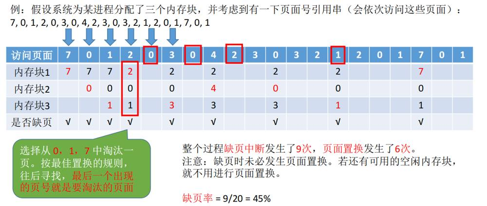

例子2：

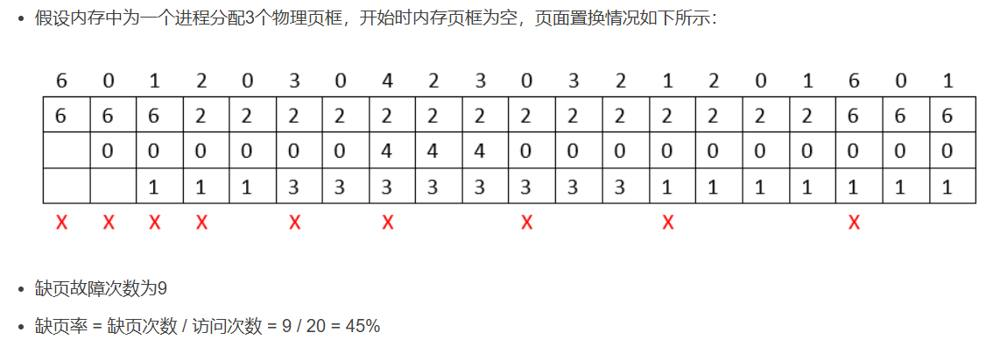

**2、先进先出(FIFO)**

**算法思想**
- 总是选择在主存中停留时间最长（即最老）的一页置换，即**先进入内存的页，先退出内存**。
- 实质是：淘汰在内存中驻留时间最长的的页面。
- 理由是：最早调入内存的页面，不再被使用的可能性比近期调入内存的大。

**特点**
- 这种算法只是在按线性顺序访问地址空间时才是理想的，否则效率不高。
- 算法简单，但执行效率不高。
- FIFO的另一个缺点是，它有一种异常现象（**Belady 异常**），即**在增加存储块的情况下，反而使缺页中断率增加了**。当然，导致这种异常现象的页面走向实际上是很少见的。

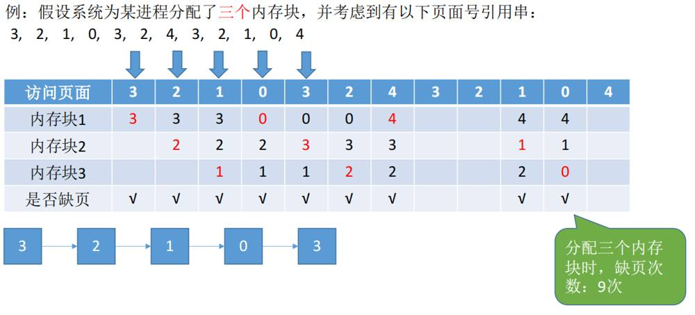

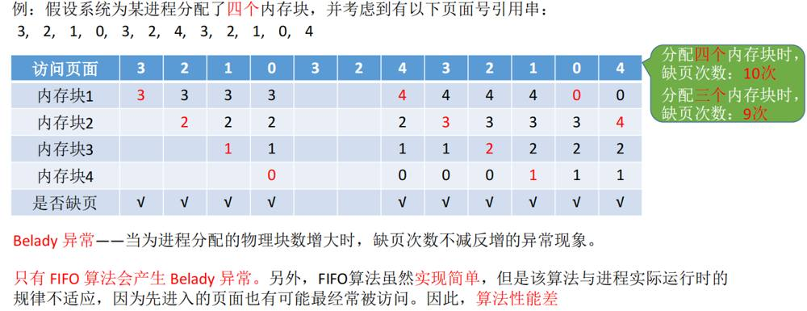

**3、最近最少使用算法（least recently used，LRU）**

**算法思想**
- 淘汰最后一次访问时间距离当前时间间隔最长的页面。

实现：stack。当一页面被访问时, 从栈中取出压到栈顶, 栈底是: LRU page.

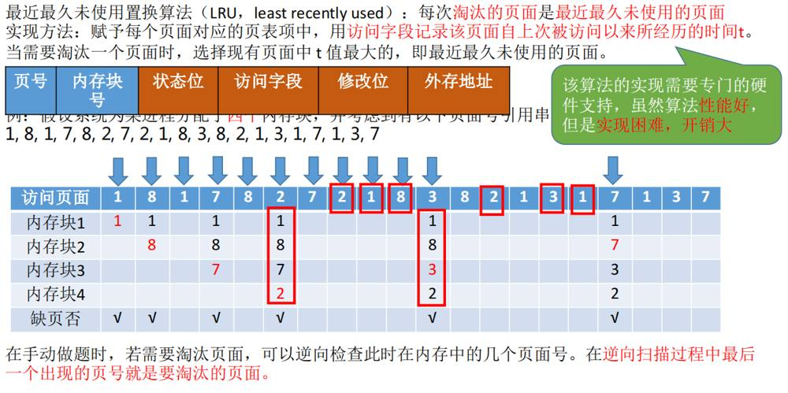

4、**最近不用的先淘汰（Not Used Recently, NUR）**：
- 这种算法基于一个简单的假设：如果一个页面最近一段时间内没有被访问，那么它在未来一段时间内被访问的可能性也较低。
- 实现：为每个页面增加一个访问标志，每次页面被访问时将标志置为1，**通过定时器将所有页面的访问标志清零**，淘汰时选择访问标志为0的页面进行淘汰。

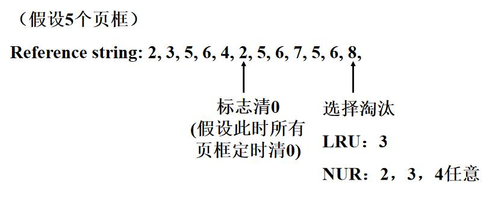

5、**最不经常使用的先淘汰（Least Frequently Used, LFU）**：
- 这种算法淘汰访问次数最少的页面。
- 依据：活跃访问的页面应该具有较大的访问次数。
- 缺点：可能难以淘汰那些早期访问频繁但后来不再使用的页面；新调入的页面由于访问次数少，容易被换出。
- 实现：使用**记数器**记录每个页面的访问次数，页面调入时记数器清零，访问时增加计数，淘汰时选择记数器最小的页面。

6、**最频繁使用算法（Most Frequently Used, MFU）**：
- 这种算法淘汰访问次数最多的页面。
- 依据：计数器值小的页面很可能是刚调入内存、正要被使用的，所以淘汰计数器值最大的（更正：原文作“被频繁访问的页面可能已经完成了其任务”，课程教材给的理由是这一条）。
- 缺点：有些页面在整个程序运行期间都需要被频繁访问，这些页面不应该被轻易淘汰。

7、**二次机会算法（Second Chance）**：
- 这种算法结合了先进先出（FIFO）和LRU（Least Recently Used）的思想，**淘汰最久未被访问的页面，但给予每个页面一个“二次机会”。**
- 实现：用链表按调入次序维护页面，每个页面有一个访问标志，页面被访问时把访问标志置1。淘汰时从链表头部开始检查：访问标志为1的，清0后移到链表末尾，给它第二次机会；遇到第一个访问标志为0的页面就淘汰（更正：原文把“清0并移到末尾”写成了访问页面时的动作）。

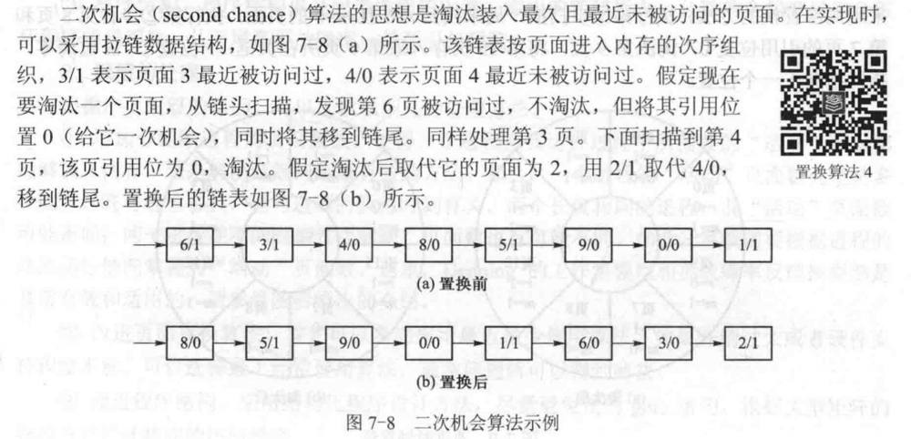

**8、时钟算法**
- **组织方式**：页面被组织成一个环形的数据结构，通常称为"时钟"。
- **指针**：有一个指针指向当前考虑淘汰的页面。
- **淘汰过程**：
  1. 从指针所指的页面开始，检查页面的访问位。
  2. 如果访问位为0，表示该页面自上次检查以来未被访问过，可以被淘汰。
  3. 如果访问位为1，表示该页面自上次检查以来已被访问过，将其访问位清零，并顺时针移动指针到下一个页面。
  4. 重复上述步骤，直到找到一个访问位为0的页面进行淘汰。

**比较**
- **淘汰效果**：时钟算法和二次机会算法的淘汰效果基本相同，都是淘汰最久未被访问的页面，但给予最近访问过的页面"二次机会"。
- **数据结构**：时钟算法使用环形数据结构，而二次机会算法使用链表。
- **性能**：时钟算法只移动指针，不用把页面摘下来挂到链尾，开销更小。

**注意：（1）某一页装入主存时，要将访问位置为1，如果该页之后又被访问到，访问位也还是标记成1。**

**（2）只有发生缺页中断，指针才会移动。**

**简单的CLOCK 算法选择一个淘汰页面最多会经过两轮扫描**

例子：以下面这个页面置换过程为例，访问的页面依次是：1,3,4,2,5,4,7,4。主存有4个空闲的帧

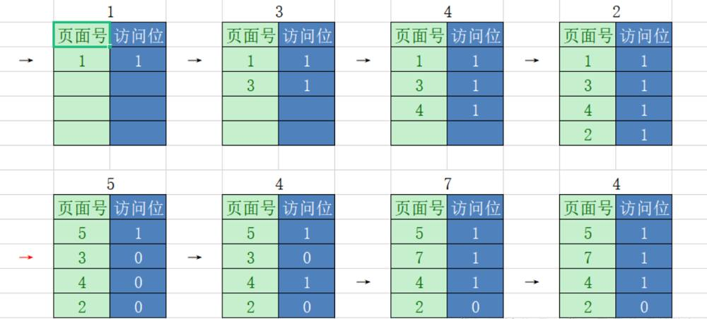

- 由于有4个空闲帧，最开始访问的4页面依次进入主存，将访问位置为1，没有页面置换，指针不动，此时缺页中断为4；
- 当页面5进入主存时，主存没有空余的帧且页面5不存在主存中，所以指针向下扫描，依次将访问位修改为0，一轮下来后，指针指向页面1，发现访问位已经为0，将1置换出去，页面5换入主存，修改访问位为1，指针下移到页面3，此时缺页中断为5；
- 当页面4进入主存时，页面4存在主存中，修改访问位为1，指针不动，不存在缺页中断；
- 当页面7进入主存时，页面7不在主存中，将3置换出去，页面7换入主存，修改访问位为1，指针下移，此时缺页中断为6；
- 当页面4进入主存时，页面4存在主存中，指针不动，不存在缺页中断。

**9、改进型的时钟置换算法**

**由于第二轮已将所有帧的访问位设为0，因此经过第三轮、第四轮扫描一定会有一个帧被选中，因此改进型CLOCK置换算法选择一个淘汰页面最多会进行四轮扫描**

简单的时钟置换算法仅考虑到一个页面最近是否被访问过。事实上，如果被淘汰的页面没有被修改过就不需要执行I/O操作写回外存。只有被淘汰的页面被修改过时，才需要写回外存。因此，除了考虑一个页面最近有没有被访问过之外，操作系统还应考虑页面有没有被修改过。在其他条件都相同时，应优先淘汰没有修改过的页避免I/O操作，这就是改进型的时钟置换算法的思想。

修改位=0，表示页面没有被修改过；修改位=1，表示页面被修改过。为方便讨论，用(访问位，修改位)的形式表示各页面状态。分为以下四种情况：
```c
(0,0)：最近没有使用也没有修改，最佳状态！
(0,1)：修改过但最近没有使用，将会被写
(1,0)：使用过但没有被修改，下一轮将再次被用
(1,1)：使用过也修改过，下一轮页面置换最后的选择
```

**步骤：**

1. 从指针所指示的当前位置开始，扫描循环队列，寻找A=0且M=0的第一类页面，将所遇到的第一个页面作为所选中的淘汰页。在第一次扫描期间不改变访问位A。
2. 如果第一步失败，即查找一轮后未遇到第一类页面，则开始第二轮扫描，寻找A=0且M=1的第二类页面，将所遇到的第一个这类页面作为淘汰页。在第二轮扫描期间，将所有扫描过的页面的访问位都置0。
3. 如果第二步也失败，亦即未找到第二类页面，则将指针返回到开始的位置，并将所有的访问位复0。然后重复第一步，即寻找A=0且M=0的第一类页面，如果仍失败，必要时再重复第二步，寻找A=0且M=1的第二类页面，此时就一定能找到被淘汰的页。

**总结：先替换（0,0），再替换（0,1），然后是（1,0），最后是（1,1）**

例子：访问的页面依次是:0,1,3,6,2,4,5,2,5,0,3,1,2,5,4,1,0，主存有4个空闲块，其中红色数字表示将要修改的页面，即修改位将被置成1

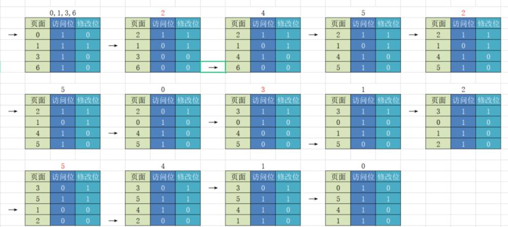

当页面2进入主存时，页面2不在主存中，指针下移扫描找到（0,0）置换（第一轮扫描不改变任何标志位），扫描一轮后，不存在（0,0），指针回到开始位置，开始第二轮扫描，寻找（0,1），本轮扫描将访问位修改为0，经过此轮扫描后，所有访问位都变为0，由于未能找到（0,1），再开始寻找（0,0）页面置换，发现页面0访问位为0，将0置换出去，2换进来，修改访问位为1，指针下移到页面1，由于2为要修改的页面，修改位也要改为1；其他以此类推，第一个例子基本包含所有事项，因此不再赘述。

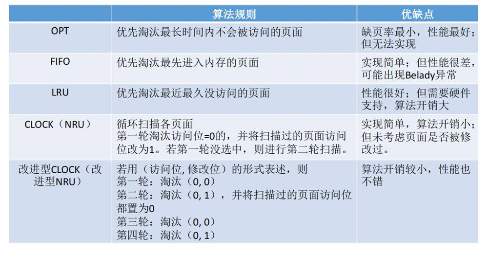

### 7.2.7 颠簸（抖动）

**颠簸现象**
- **定义**：当进程的页面在内存和外存之间频繁换入换出时，系统的性能会显著下降，这种现象称为颠簸。
- 颠簸又称“抖动”，是指**页面在内存与外存储器之间频繁地调度，以致系统用于调度页面的时间比进程实际运行所占用的时间还要长。**显然，**颠簸是由于页故障率过高而产生的结果**，它将严重地影响系统的效率，甚至可能使系统全面崩溃。

**颠簸的原因**
1. **物理页框分配不足**：
  - 如果系统分配给进程的物理页框数量不足以容纳其工作集（即进程频繁访问的页面集合），则会导致频繁的页面置换。
2. **页面置换算法不合理**：
  - 如果页面置换算法不能有效地识别和保留进程的工作集，也可能导致频繁的页面置换。

**处理颠簸的方法**
1. **增加物理页框分配**：
  - 通过增加分配给进程的物理页框数量，可以减少页面置换的频率，从而减轻或避免颠簸现象。
2. **改进页面置换算法**：
  - 使用更合理的页面置换算法，如LRU（最近最少使用）、FIFO（先进先出）或时钟算法，可以更有效地管理内存中的页面，减少不必要的页面置换。
3. **工作集模型**：
  - 操作系统可以使用工作集模型来监控进程的工作集大小，并动态调整页框的分配，以适应进程的实际需求。
4. **页故障率反馈模型**：见 7.2.9，按页故障率的上下界动态增减页框。
5. **挂起部分进程**：通过中级调度把一些进程换出到外存，降低并发度。

（整理注：原稿这里还列了内存压缩和去重、限制进程内存需求、监控系统负载、大页等四条，是现代系统的做法，课程不讲，已删去；第4、5条是按课程内容和 `13 简答题精编（第7-9章）.md` 里的答案补的。）

### 7.2.8 工作集模型

**定义**： 工作集模型是一种动态内存管理策略，它基于程序在一段时间内访问的页面集合。工作集中的页面是进程当前活跃使用的页面，进程要高效运行离不开这些页面。（**工作集是进程在一段时间之内活跃地访问页面的集合**）

**核心思想**：
- 操作系统会跟踪每个进程的工作集大小，即进程在给定时间窗口内访问的页面集合。
- 如果进程的工作集能够完全装入物理内存中，那么该进程的运行将更加高效，因为可以减少页面换入换出导致的延迟。

**实现方法**：
- 操作系统周期性地检查进程的工作集，并根据工作集的大小调整分配给进程的内存页框数量。
- 如果工作集太大而无法完全装入内存，操作系统可能会通过页面置换算法淘汰一些页面。
- 如果工作集较小，操作系统可能会减少页面置换，以保持工作集中的页面。

**Denning 认为：为使程序有效运行，工作集应能放入内存。**

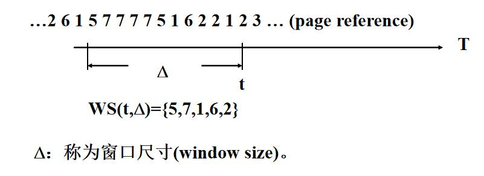

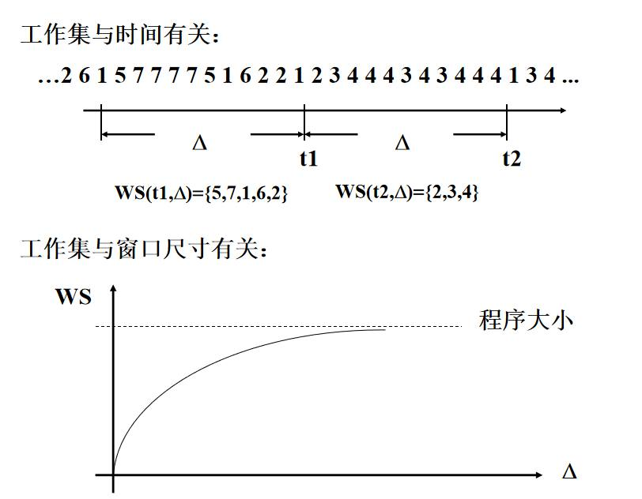

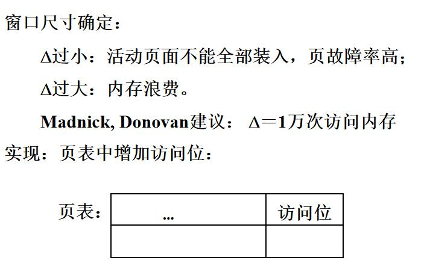

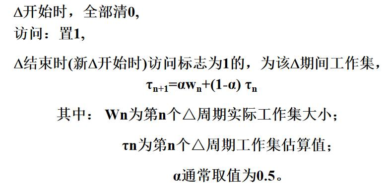

### 7.2.9 页故障率反馈模型

**定义**： 页故障率反馈模型是一种自适应内存管理策略，它根据进程的页故障率（即缺页中断的频率）来调整内存分配。

**核心思想**：
- 如果一个进程的页故障率较高，这表明它需要更多的内存页框来减少缺页中断的发生。
- 操作系统可以根据页故障率来动态调整进程的内存分配，以优化系统的整体性能。

**实现方法**：
- 操作系统监控每个进程的页故障率，并根据这个指标来调整内存分配。
- 如果进程的页故障率较高，操作系统可能会增加分配给该进程的内存页框数量。
- 如果页故障率较低，操作系统可能会减少分配的内存页框，以满足其他进程的需求。

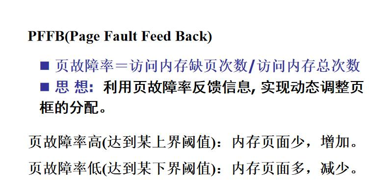

## 7.3 虚拟段式存储系统

进程运行前，全部装入外存，部分装入内存，访问段不在内存时，发生缺段中断。

### 7.3.1 虚拟段式存储系统

原稿只有标题，基本原理和步骤见 `13 简答题精编（第7-9章）.md` 第7章“简述虚拟段式存储管理的基本原理”。

### 7.3.2 段的动态连接(dynamic linking)

- 动态连接 vs. 静态连接
  - 静态连接：运行前连接，由link完成；
  - 动态连接：运行时连接，由OS完成。
- 静态连接的缺点
  - 连接时间长；
  - 目标代码长；
  - 连接段可能并不执行(未用到)。

**动态连接问题**

- 动态连接与共享的矛盾
  - 动态连接：修改连接字（代码）
  - 段的共享：要求纯代码（pure code）
- 解决方法
  - 共享代码分为“纯段”和“杂段”
  - 纯段共享，杂段私用。

## 7.4 虚拟段页式存储系统

- 考虑
  - 段的动态连接
  - 段的共享
  - 段长度的动态变化

所需表目、地址映射流程和几种中断的处理，笔记没有展开，见 `13 简答题精编（第7-9章）.md` 第7章“介绍虚拟段页式存储管理所需表目”“存储系统中有哪些中断处理的类型”等题。

## 7.5 作业

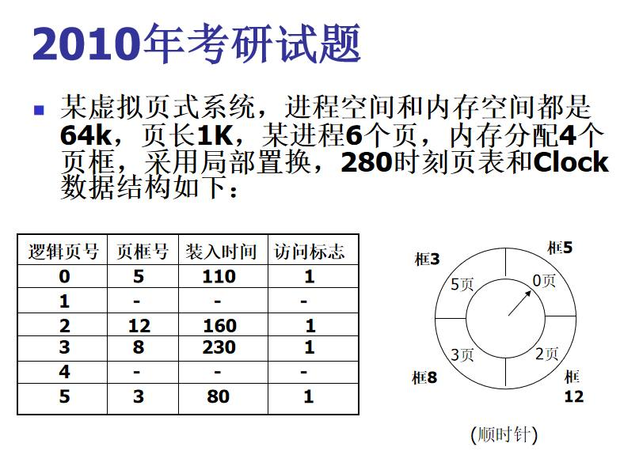


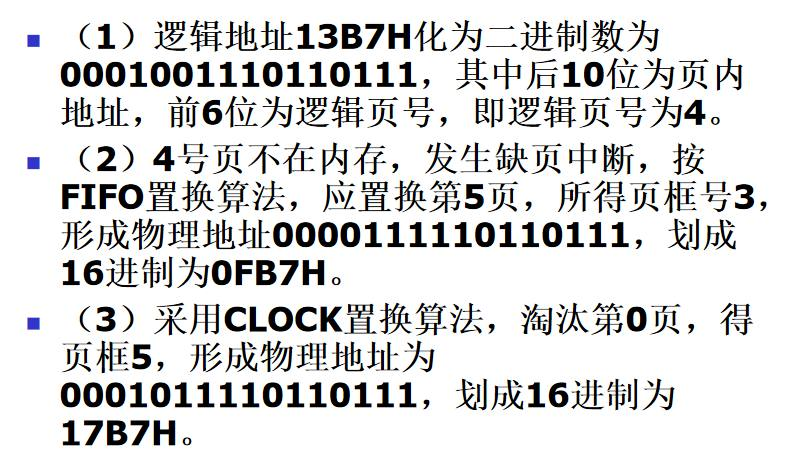

**思考题：在某些虚拟页式存储管理系统中，内存中总保持一个空闲的物理页架，这样做有什么好处？**

（整理注：原稿这里的七条答案是聊天机器人生成的，“简化时钟算法”“为操作系统升级留缓冲”等说法与课程无关，换成 `简答题.pdf` 里的标准答案。）

- 在内存没有空闲页框的情况下，需要按照置换算法淘汰一个内存页框，然后读入所缺页面，缺页进程一般需要等待两次I/O传输。
- 若内存总保持一个空闲页框，当发生页故障时，所缺页面可以被立即调入内存，缺页进程只需等待一次I/O传输时间。读入后立即淘汰一个内存页框，此时可能也需执行一次I/O传输，但对缺页进程来说不需等待，因而提高了响应速度。

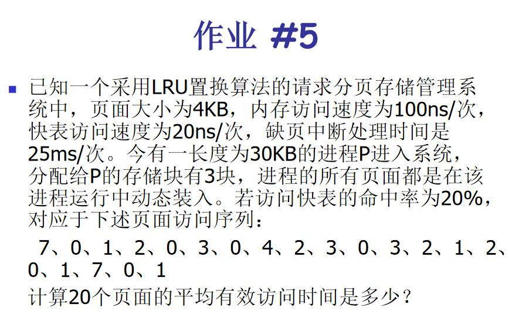

---

## 易混对比

| 算法 | 淘汰哪一页 | 实现方式和特点 |
|---|---|---|
| OPT 最佳 | 以后不再用、或最长时间以后才用的 | 缺页率最低，要知道未来，无法实现，只作比较基准 |
| FIFO 先进先出 | 进入内存最早的 | 队列，简单；有 Belady 异常 |
| LRU 最近最少使用 | 最后一次访问离现在最久的 | 栈：访问时把该页移到栈顶，淘汰栈底 |
| NUR 最近不用的先淘汰 | 最近一段时间没访问的 | 访问位定时清零，淘汰访问位为 0 的；可结合修改位 |
| LFU 最不经常使用 | 访问次数最少的 | 计数器；早期常用后来不用的页难淘汰，新调入的页容易被换出 |
| MFU 最频繁使用 | 访问次数最多的 | 认为计数小的页刚调入、马上要用 |
| 二次机会 | 进入早且最近没被访问的 | 链表：访问位为 1 的清零移到队尾，遇到 0 淘汰 |
| 时钟 | 同二次机会 | 环形队列加指针，最多扫两轮 |
| 改进型时钟 | 按（访问位，修改位）依次选 (0,0)、(0,1)、(1,0)、(1,1) | 优先淘汰没修改过的页，省一次写回；最多扫四轮 |

| | 请调 | 预调 |
|---|---|---|
| 时机 | 发生缺页时 | 缺页之前，按程序顺序性预测 |
| 优点 | 调入的页一定会用到 | 减少缺页等待，降低页故障率 |
| 缺点 | 缺页期间进程要等待 | 预测不一定准，开销大，必须辅以请调 |

| | 外存块静态分配 | 外存块动态分配 |
|---|---|---|
| 外存存放 | 进程的全部页面 | 只放当前不在内存的页面 |
| 页面调入内存后 | 外存页面不释放 | 外存页面释放 |
| 淘汰没修改过的页 | 不用写回 | 也要重新申请外存块写回 |
| 代价 | 占外存 | 页面调度开销大 |

| | 局部置换 | 全局置换 |
|---|---|---|
| 淘汰范围 | 缺页进程自己的页框 | 内存中所有页框 |

| | 工作集模型 | 页故障率反馈模型 |
|---|---|---|
| 依据 | 进程在最近 Δ 时间内活跃访问的页面集合 | 页故障率的上界和下界 |
| 做法 | 让工作集能放进内存（Denning） | 高于上界增加页框，低于下界减少页框 |

## 易错点

- 缺页中断处理完后，重新执行被中断的那条指令，不是执行下一条（`14 选择题知识点.md` 原稿这里写错了，已更正）。
- 缺页中断是在指令执行过程中产生的，属于程序性中断（内中断）。
- Belady 异常：分给进程的页框数增加，缺页次数反而增加。本章算法里 FIFO 会出现。
- 时钟算法：页面装入内存时访问位置 1，之后被访问仍是 1；只有发生缺页、需要找淘汰页时指针才移动。
- 二次机会算法的“清零、移到链尾”发生在挑选淘汰页的时候，访问页面时只把访问位置 1（笔记原文写反了，已更正）。
- 颠簸说明页故障率过高，不能只归咎于置换算法；分给进程的页框太少、程序局部性差都会导致颠簸。
- 虚拟存储器的容量受指令地址字长和外存容量限制，不受内存大小限制。
- 内存中总保持一个空闲页框的好处：缺页进程只需等待一次 I/O（读入），淘汰写回的那次 I/O 不用它等。

## 典型题

- 计算题“页面调度”：给页面访问序列和页框数，分别用 OPT、FIFO、LRU、CLOCK 求缺页次数和缺页率。7.2.6 每个算法下有例题图，时钟算法和改进型时钟算法有逐步的文字过程。做题时画一张表，行是页框，列是每次访问，缺页的列打标记；开始时页框空，装入的前几页也算缺页。
- 7.5 作业图里的题。
- 简答：`13 简答题精编（第7-9章）.md` 第7章，“缺页中断处理步骤”“请调与预调”“抖动的原因和对策”“保持一个空闲页框的好处”常考。
- 名词解释：`10 名词解释.md` 第7章，笔记附录的往届名词里有 virtual memory、virtual storage。
