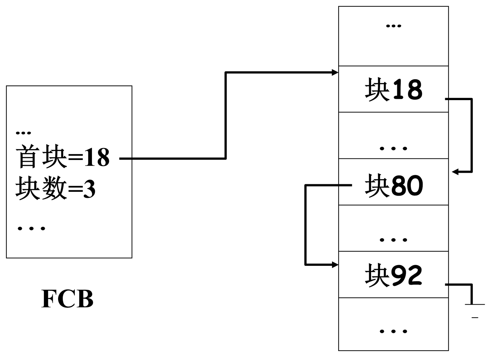
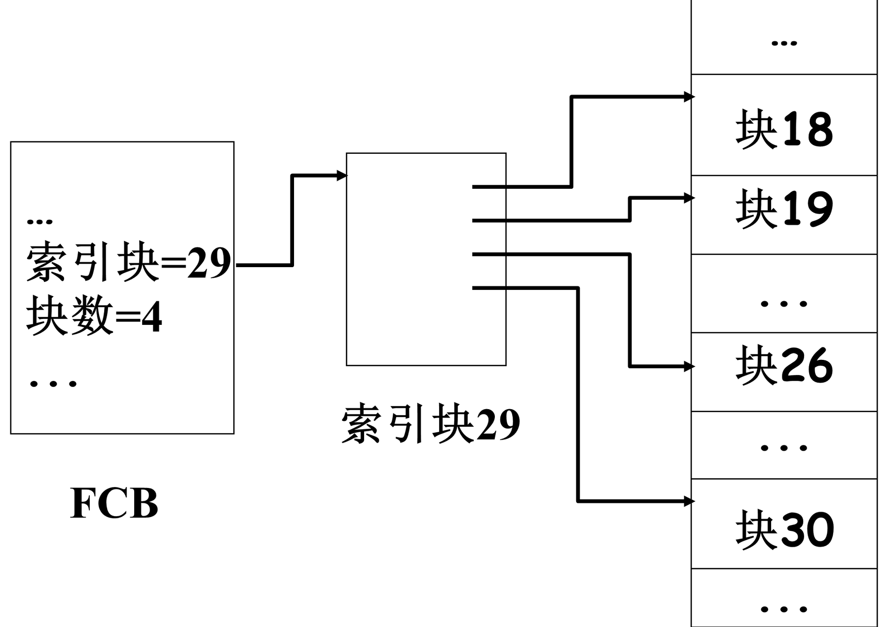
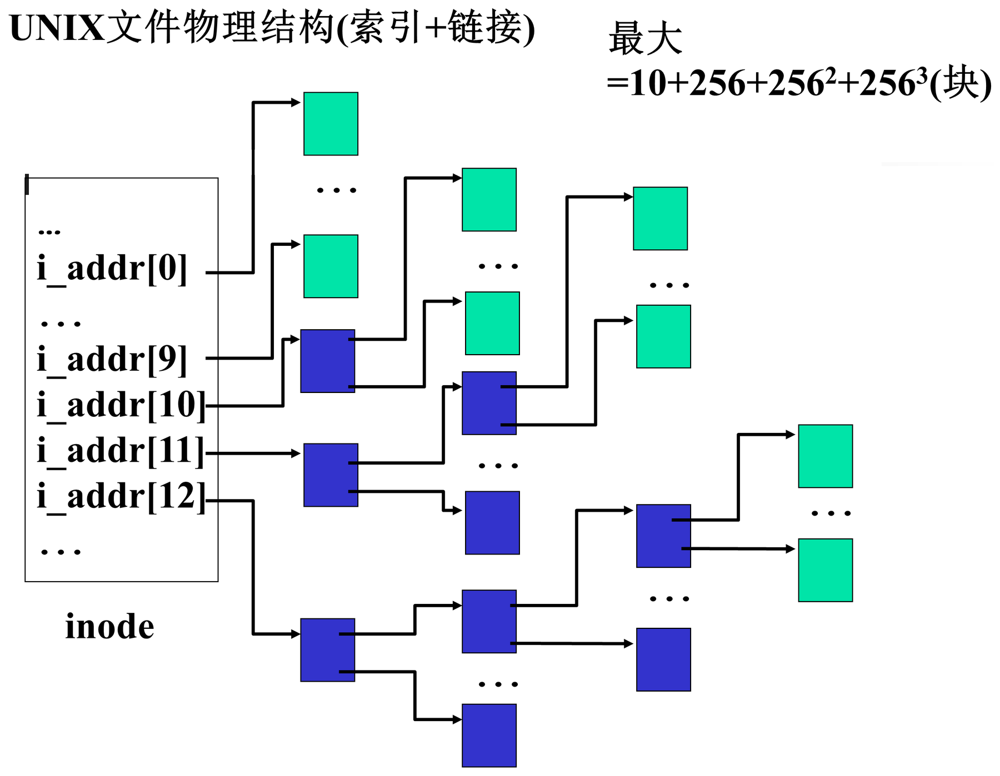
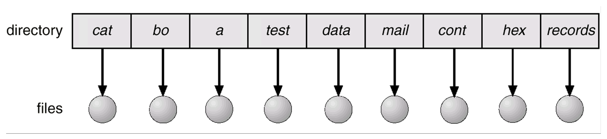
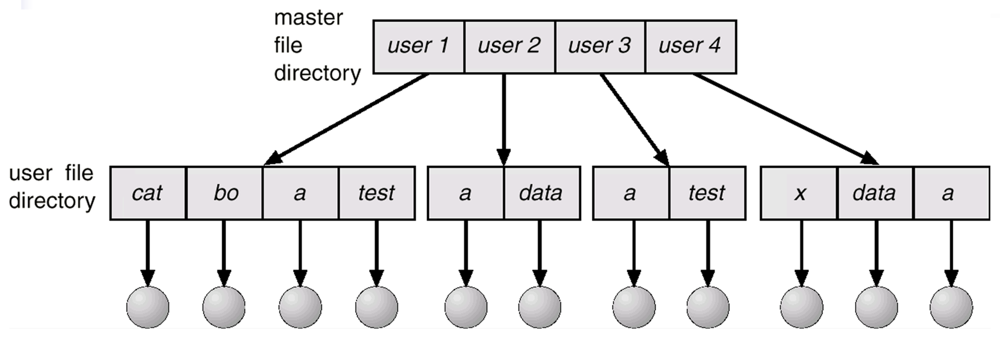
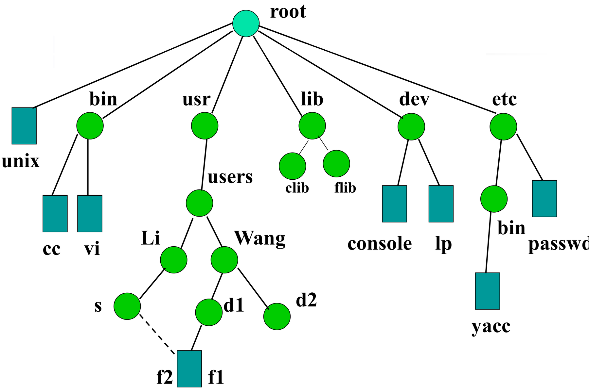
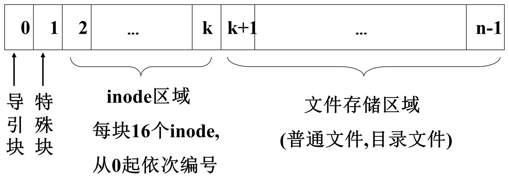
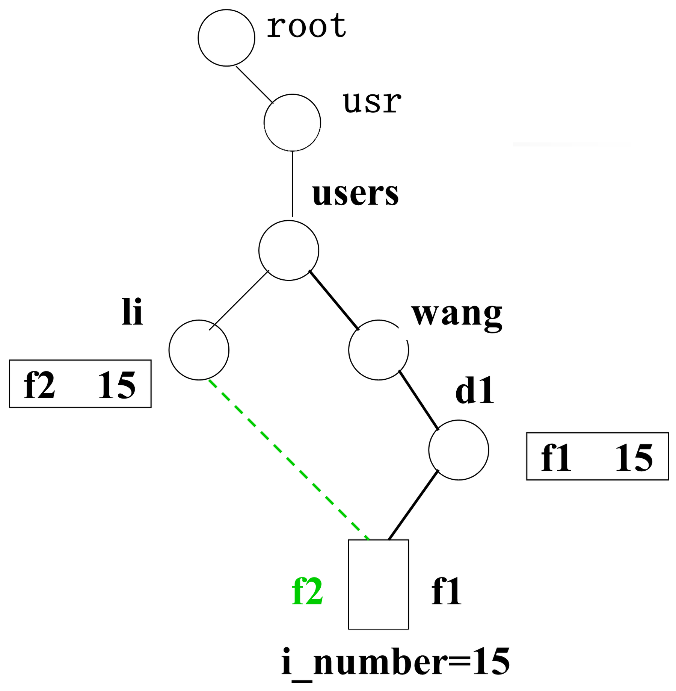
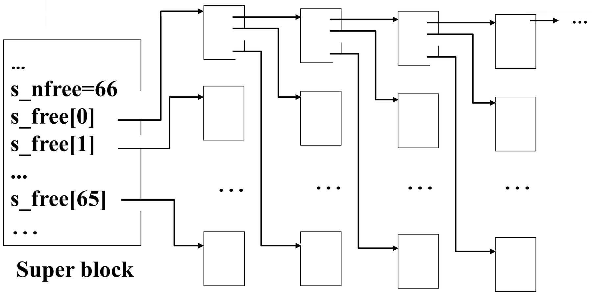
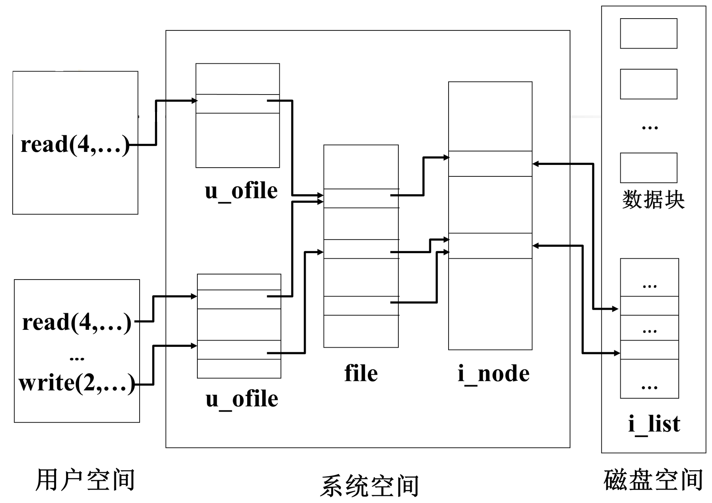

# 第8章 文件系统

整理自 `笔记/操作系统原理笔记.pdf` 第8章，章末补了 `笔记/操作系统期末整理.pdf` 里的一道 UNIX 文件表题。笔记正文只做了机械清洗和改错，章首要点、章末对比表、易错点和典型题是整理时写的。

## 本章要点

- 复习范围和笔记的对应：
  - 8.1 文件与文件系统 → 下面 8.1。
  - 8.3 文件的组织 → 下面 8.3（逻辑组织、物理组织）。
  - 8.7 文件系统的实现 → 课件这一节讲两件事。内存所需表目（系统打开文件表、用户打开文件表）笔记没有，看 `13 简答题精编（第7-9章）.md` 第8章“介绍文件打开时所需占用的内存表目”；外存空间管理就是下面的 8.7 文件存储空间的管理。课件第 34～36 页还讲了 UNIX 的成组连接，所有整理稿都没有收，已按课件补在下面 8.7.4。
  - 8.8 文件系统的界面 → 下面的“8.9 文件系统的界面”，笔记编号和课件差了一位。
  - 8.9 日志结构文件系统 → 所有整理稿都没有这部分，只能看课件第 75 页起的内容。
- 配套讲义：`课件/08第八章 文件系统1.pptx`（这一章还没有重制版）
- **文件**是具有符号名、在逻辑上有完整意义的信息项的有序序列；**文件系统**是文件与管理信息资源的程序集合。
- 逻辑组织分流式（以字节为单位，操作系统不解释结构）和记录式（以记录为单位），流式是记录式的特例。
- 物理组织有顺序、链接、索引、散列、倒排五种，要能说出各自的优缺点和适合的访问方式。
- **文件控制块 FCB** 是文件存在的标志，作为目录项存在目录文件里。把 FCB 分成次部（文件名 + 文件号）和主部（其余信息 + 连接计数），可以提高查找速度并实现文件连接。
- 目录结构：单级（不能重名）→ 二级（不能分类）→ 多级树形（路径名，查找快，可以连接）。
- 外存空闲空间管理：空闲块表、空闲块链、位图，UNIX 用成组连接。
- 打开文件时用到两张表：系统打开文件表（全系统一张）和用户打开文件表（每个进程一张），`open` 返回的 fd 就是用户打开文件表的下标。
- 文件系统的界面：`creat`、`open`、`close`、`seek`、`read`、`write`、`link`、`unlink` 的执行步骤要会默写。

---

## 8.1 文件与文件系统

### 8.1.1 文件

- **文件**：具有**符号名**且在逻辑上有完整意义的信息项的**有序序列**
- 文件名：文件的符号名
  - 用户在创建文件时确定，将在访问时使用
- 信息项：构成文件内容的基本单位
  - 既可能是单个字节，也可能是多个字节
  - 所有的信息项可能等长，也可能不等长
  - 同一文件中的各个信息项之间具有顺序关系


文件系统为一个正在使用的文件保持一个读写指针，用于记录文件当前的读写位置
- 文件刚打开时，读写指针指向文件的起始位置，然后进行读写时读写指针会向前移动
- 为实现对文件的随机读写，文件系统通常提供一个读写指针定位命令，将读写指针定位到某指定位置，其后的读写命令将由此处开始

- 文件是建立在外存空间中的，这使得文件能够被长期保存
  - 也就是说，文件一经建立，就一直存在，直至被删除或超出事先规定的保存期限

文件的分类：
- 按照所有者：
  - 系统文件
  - 用户文件
- 按照保存期限：
  - 临时文件
  - 永久文件
- 按照访问方式：
  - 只读文件
  - 只写文件
  - 读写文件
- 按照设备类型：
  - 磁盘文件
  - 磁带文件
  - 磁鼓文件
- 按照用途：
  - 目录文件
  - 普通文件
- 按照内容：
  - 程序文件
    - 源文件
    - 目标文件
    - 可执行文件
    - 头文件
    - 库文件
  - 数据文件

**UNIX系统中的文件划分**
- 普通文件
  - 内容可以是程序、数据、图象、MP3等，保存在**磁盘块**中
- 目录文件
  - (文件名，文件号)序列，保存在**磁盘块**中
- 特殊文件
  - 对应各种**设备**，将设备作为文件处理

### 8.1.2 文件系统

- **文件系统**：文件与管理信息资源的**程序集合**

## 8.2 文件的访问方式

### 8.2.1 顺序访问

- **顺序访问**：按照从前往后的次序依次存取文件的各个信息项
  - 对于顺序存储型设备，如磁带，通常只适合采用这种访问方式
- 分为两种情形：
  - 从**文件头**开始顺序访问
    - 从文件的起始位置开始依次访问文件的各个信息项
  - 由**文件中间的某一位**置开始顺序访问
    - 由文件中间的某一位置开始依次访问文件的各个信息项

### 8.2.2 随机访问

- 随机访问：无序存取文件的某些信息项
- 分为两种情形：
  - 按**记录编号**随机访问
    - 就是按照信息项的编号随机存取文件的某些信息项
      - 此时在文件的读写命令中给出欲访问文件信息项的编号
  - 按**关键字**随机访问
    - 键：文件信息项中的一个域
    - 就是按照信息项中的某个键值随机地存取文件的记录
      - 此时在文件的读写命令中应该给出欲访问记录的键值（原稿这句没写完，按上下文补全）

## 8.3 文件的组织

- 文件的组织又称文件的结构
- 涉及文件的**逻辑组织**和文件的**物理组织**
  - 逻辑组织：文件的外部组织形式，即用户所看到的文件组织形式
  - 物理组织：文件的内部组织形式，即文件在物理存储设备上的组织形式

### 8.3.1 文件的逻辑组织

- 有两种：（等价的）
  - 流式（非结构式的）
    - 对于流式文件来说，操作系统对于文件的外部结构没有解释
    - **流式文件**是具有符号名且在逻辑上有完整意义的字节序列
    - 构成流式文件的基本单位：**字节**
    - 用户对于流式文件的访问也是以**字节**为基本单位
    - 每个文件的内部都有一个读写指针，通过系统调用命令可以将该读写指针固定到文件的某一位置，以后的读写系统调用命令将从指针所确定的位置处开始执行

    - 流式文件没有结构，但是用户在使用流式文件时可以自定义文件的结构
      - eg. 可将50B自定义为一条记录
  - 记录式（结构式的）
    - 对于记录式文件来说，操作系统对于文件的外部结构有解释
    - 记录式文件是具有符号名且在逻辑上有完整意义的记录序列
    - 构成记录式文件的基本单位：**记录**
    - 一条记录由一组在逻辑上相关的信息项所构成
      eg. 比如，一个学生的档案构成一条记录，该记录可能包括学号、姓名、性别、籍贯、出生日期、年级、系、专业等信息，这些信息的数据类型可能是不同的，如学号为整型，姓名为字符串型，性别为字符型。一个班级所有学生的档案便可构成一个记录式文件。
    - 用户对于记录式文件的访问也是以**记录**作为基本单位的
    - 每个文件的内部都有一个读写指针，通过系统调用命令可以将该读写指针移动到文件的某一位置，以后的读写系统调用命令将从该指针所确定的位置处开始执行
    - 当每条记录均只包含一个域，而且该域的类型为字符型时，记录式文件便退化为流式文件，因而可以说流式文件是记录式文件的特例

### 8.3.2 文件的物理组织

- 文件是被划分为记录或者字节的，而用于保存文件的物理设备是被划分为**块**的
- 文件的物理结构就是要确定如何将记录或者字节保存在存储型设备的物理块中
- 考虑因素
  - 记录格式
    - 等长或不等长, 流式不必考虑
  - 空间开销
    - 除保存文件内容之外的存储开销,包括外存开销以及当文件使用时所需要的内存开销
  - 访问速度
    - 包括顺序存取的速度、按号随机存取的速度以及按键随机存取的速度
  - 长度变化
    - 指文件长度的动态增加和动态减少，尤其是文件长度的动态增加
- 常见的文件物理组织形式
  - 顺序结构（连续结构）
    - 采用这种结构，一个文件占有若干个连续的物理块，其首块号和块数被记录在文件控制块中
    - 优点：速度快，节省空间
    - 缺点：长度变化困难
      eg. 若文件长度增加2块，由于第32块可能是被占用的，因而需要重新申请6个连续的物理块，并将原有4个物理块中的信息复制到新申请到的物理块中，然后修改文件控制块的首块号和块数，并将原来所占有的物理块释放

    

  - 链接结构（串联结构）
    - 采用这种结构，一个文件占有若干个不连续的存储块，各块之间以指针相连，其首块号和块数被记录于该文件的文件控制块中
    - 优点：节省空间，长度变化容易
    - 缺点：随机访问速度慢
      eg. 若欲增加一块，只需申请一个新的空闲块并将块45的指针指向它，同时将文件控制块中的块数改为5;若欲随机地访问某一块，就必须将此块之前的所有块都逐个地读入内存，这需要进行大量的输入输出操作

    上面这个例子里的块 45 出自教材的图，资料里没有收那张图。课件的图换了一组块号：文件控制块记首块 18、块数 3，块 18 的指针指向块 80，块 80 指向块 92。

    

  - **索引结构**
    - 一个文件占有若干个不连续的存储块，这些块的块号被记录于一个索引块中
    - 优点：速度快，长度变化容易
    - 缺点：索引块占空间
      - 索引块也由存储块所构成，故需要占用额外的外存空间
      - 当文件被打开时，索引块需要读入内存，否则访问速度会降低一半，故需占用额外的内存空间
    - 由于构成索引块的存储块的长度固定，从而限制了文件的最大长度
      - 为了克服这一缺点，可以引入多级索引
      eg. 若欲增加一块，只需再申请一个存储块并将该块的块号记录于索引块中

    

    UNIX 把直接地址和多级索引结合起来。inode 里有 13 个地址项：i_addr[0]～i_addr[9] 直接指向数据块，i_addr[10] 指向一级索引块，i_addr[11] 指向二级索引，i_addr[12] 指向三级索引。每个索引块能放 256 个块号，所以一个文件最多 10+256+256²+256³ 块。

    

  - 散列结构（杂凑结构）
    - 这种结构只适用于定长记录和按键随机查找的访问方式，常用于**构造文件目录**
      - 此时，一条记录的内容就是一个目录项
    - hash(key)=addr (在磁盘或文件中的存放位置)
    - 冲突
      - 解决方案：顺序探查法
        - 如发生冲突，则在冲突位置开始顺序探查第一个空闲的存储位置，并将记录保存于该空闲位置处
        - 具体实现时需要在记录中增加两个域：
          - 一个是**冲突计数**，用于标识冲突次数
          - 另一个是**空闲标志**，用于标识本记录是否空闲
        - 该算法的具体实现需要解决以下问题：
          - 保存记录
          - 查找记录
          - 删除记录
          - 其中“置空闲标志”是对查找到的记录而言的，“冲突计数值减1 ”是对addr: = hash(key)所对应的记录而言的，二者可能并不是同一条记录

    三个过程的流程图如下，取自教材。保存时先把 hash(key) 对应记录的冲突计数加 1，再从 addr 开始往下找空闲记录，找到就标记为占用、填写记录内容。教材这张图把“本记录空闲？”的 T、F 标反了，应读作空闲（T）才标记为占用，不空闲（F）就顺取下一个记录，课件第 10 页的同一流程就是这个方向：

    

    查找时先取 hash(key) 对应记录的冲突计数 count，count 为 0 说明没有这条记录；否则逐条往下比，遇到 key 相等的就找到了，遇到 hash 值同为 addr 的记录就把 count 减 1，减到 0 还没找到就是没有这条记录：

    

    删除就是调用查找过程，找到后置该记录的空闲标志，再把 hash(key) 对应记录的冲突计数减 1。这张教材图同样把“是否找到”判断框的 T、F 标反了，应读作：找到（T）才置空闲标志、冲突计数减 1，没找到（F）是无此记录。课件第 12 页画的同一流程就是这个方向。

    

  - 倒排结构
    - 键：记录中的域
    - 主键：能够区分所有记录的键
    - 次键：主键以外的键
    - 以键值和记录地址构成的索引结构称为**倒排结构**
    - 主索引：键值为主键的索引
    - 次索引：键值为次键的索引
    - 倒排结构是以多个键和多个索引作为特征的
    - 优点：适合不同的查找方式，速度很快
    - 缺点：索引会带来较大的系统开销
      - eg. 对一组学生记录可以建两个索引：按主键（如学号）建主索引，按次键建次索引（原稿引用的图8-11、图8-12没有附上）

## 8.4 文件目录

### 8.4.1 文件控制块和目录项

- **文件控制块(FCB)**:是标志文件存在的数据结构，其中包含系统对文件进行管理所需要的全部信息
  - 每一个文件都有一个文件控制块，它们被保存于外存空间中
  - FCB创建：建立文件时
  - FCB撤消：删除文件时
  - 对于不同的操作系统，文件控制块中所包含的信息的数量和内容不尽相同，通常包括:（原稿这里是空的。可以参考 `13 简答题精编（第7-9章）.md` 第8章“文件目录应包含哪些内容”：存取控制信息、文件类型和属性、文件结构信息、管理信息）

- **目录项**：文件控制块是作为目录项存储于目录文件中的，因而，文件控制块也被称为目录项

### 8.4.2 文件目录与目录文件

- 文件目录与目录文件是同一事物的两种称谓
  - 从用途角度看来称为文件目录
  - 从实现角度看来称为目录文件
- **文件目录**
  - 用于检索文件的目录
  - 是由目录项构成的有序序列
  - 给定一个文件名称，通过查找相应的文件目录便可找到该文件所对应的目录项，即文件控制块

- **目录文件**
  - 目录文件是长度固定的记录式文件

### 8.4.3 单级目录与多级目录

- 单级目录
  - 所谓单级目录就是整个系统中只有一个目录，所有文件均登记在该目录中
  - 优点：简单
  - 缺点：文件不能重名

  

- 二级目录
  - 二级目录是对单级目录的一种改进
  - 采用二级目录时，整个系统只有一个公共目录，称为**系统目录**
  - 每个用户都有一个专有目录，称为**用户目录**
  - 所有的用户目录均登记于系统目录中，每个用户目录下登记着该用户的文件
  - 由于每个用户都有自己的专有目录，因而不同用户的文件可以有相同的名字
  - 缺点：
    - 不能将文件加以分类
    - 当用户文件较多时其查找速度较慢

  


- 多级目录
  - 多级目录结构是对二级目录结构的进一步改进
  - 文件系统的目录构成一个逆向生长的树状结构
    - 叶子结点是一般文件或者目录文件
    - 非叶子结点是目录文件
    - 根结点是特殊的目录文件，称为**根目录文件**
  - 采用多级目录结构时，文件的名字是一个路径名。路径名由根结点开始到叶子结点结束的结点名字序列所构成，其间以“ / ”或“ \ ”相隔
  - 优点：
    - 便于文件分类，可以为每类文件建立一个子目录
    - 查找速度快，因为每个目录下的文件数目较少
    - 可以实现文件的连接

  

### 8.4.4 文件目录的改进

- 在实现时，有些系统通常将文件控制块分为两个部分：
  - FCB次部
    - 仅包括一个文件名称和一个标识文件主部的文件号
    - 将文件控制块分为两个部分后，文件的目录项中仅保存文件控制块的次部
    - 这样，根据文件名查找文件目录就可以找到文件控制块的次部，根据文件控制块次部得到的文件号就可以找到文件控制块的主部，进而找到文件

  - FCB主部
    - 包括除文件名称之外的所有信息和一个标识该主部与多少次部相对应的连接计数
    - 在存储文件的外存空间中划分出一个固定区域，用于保存所有文件的FCB主部
    - 将这些保存FCB主部的记录从头开始依次编号，这就是**文件号**
    - 所有文件的FCB主部的长度固定且相同，因而给定文件号便可计算出对应FCB主部的位置

  UNIX 的 FCB 主部就是 inode。文件卷的第 0 块是引导块，第 1 块是特殊块（超级块），第 2～k 块是 inode 区，每块放 16 个 inode，从 0 起依次编号，这个编号就是文件号（i_number）；后面是存放普通文件和目录文件的文件存储区域。

  

- 将文件控制块划分为次部和主部这两个部分具有以下两个主要优点:
  - 提高查找速度
  - 实现文件连接

### 8.4.5  根目录与当前目录

- 根目录
  - 在树状结构的文件系统中，根结点对应的目录称为根目录
  - 根目录是唯一的，由它开始可以查找到所有其他目录文件和普通文件
  - 在实现时，根目录保存于外存空间中的固定位置
- 当前目录
  - 现代文件系统为用户提供一个目前正在使用的工作目录，称为当前目录

### 8.4.6 文件目录的查找

- 从根目录开始查找
  - 通常，当文件路径名以“ / ”起始时，表示要求从根目录开始查找
- 从当前目录开始查找
  - 当文件路径名不以“ / ”起始时，表示要求从当前目录开始查找
- 查找算法
  - 顺序查找
  - 散列查找
  - 对分查找
    - 要求目录中的文件名称按字典序存放

## 8.5 文件的共享

- 文件的共享是指多个进程在受控的前提下共用系统中的同一个文件
  - 这种控制是由操作系统和文件使用者共同实现的

### 8.5.1 文件共享的目的

- 节省存储空间
- 进程相互通信

### 8.5.2 文件共享的模式

- 异步使用同一文件
  - 不同时使用，不会有两个或者两个以上的进程同时打开一个文件
- 同时使用同一文件
  - 存在两种情况：
    - 所有进程都不修改所共享的文件
    - 某些进程要求修改被共享的文件
      - 所读取的数据有可能不完整
      - 两种处理方法：
        - 不允许读者与写者，或者写者与写者同时打开同一个文件
        - 允许读者与写者，或者写者与写者同时打开同一文件，但是操作系统要为用户提供相应的互斥手段，文件使用者借助于这种互斥手段可以保证对文件的共享不会发生冲突

### 8.5.3 文件共享的实现

- 公共目录
  - 在系统中设有若干个可以被所有用户访问的公共目录，将可被所有用户共享的文件登记在这些目录中，每个用户均可访问记录于这些目录中的文件，如此便可实现用户对文件的共享
  - 连接
    - 通过连接可以使一个文件具有多个名字，不同的用户可以使用不同的名称来访问同一文件，从而实现文件的共享
    - 课件的例子：`/usr/users/wang/d1/f1` 的文件号是 15，执行 `link("/usr/users/wang/d1/f1", "/usr/users/li/f2")` 后，li 的目录里多了一项 (f2, 15)，两个名字指向同一个 i_number 为 15 的文件；之后再 `unlink("/usr/users/wang/d1/f1")`，只删去 wang 那边的目录项、连接计数减 1，文件仍可以通过 li 的 f2 访问

    

  - 共享说明
    - 每个文件在创建时都由文件属主规定一个共享说明，如哪些用户不可以使用、哪些用户可以使用以及使用方式等，这就确定了文件的可共享性，以及对于共享的限制

## 8.6 文件的保护和保密

### 8.6.1 文件的保护

- 文件的保护是要防止用户对于文件实施非法的或者不适宜的访问
- 文件的保护可以采用以下方法：
  - 存取控制矩阵
    - 将用户关于所有文件的存取方式记录在一个矩阵中，该矩阵称为**存取控制矩阵**
    - 存取控制矩阵保存于外存空间中，使用时需要读入内存
    - 优点：可以把保护事项规定得很细
    - 缺点：空间开销大，使用不方便

    

  - 访问权限说明
    - 这种方法将用户分为若干类，同类用户对于同一文件具有相同的访问权限，不同类用户对于同一文件具有不同的访问权限
    - 在UNIX系统中：（原稿这里是空的。整理补充：UNIX 把用户分成文件主、同组用户、其他用户三类，每类各有读 r、写 w、执行 x 三种权限，共 9 位）
    - 课件里这 9 位记在 inode 的 i_mode 中，写作 R、W、E。访问进程的 u_uid 等于文件的 i_uid 就按文件主判断，u_gid 等于 i_gid 就按同组用户判断。i_mode 在 `creat(filename, mode)` 时给出，以后文件主可以用 `chmod(filename, new_mode)` 修改

    


  - 分级目录
    - 在多级目录系统中，可以规定不同的用户对于同一子目录的访问权限
    - 如果一个用户不能访问某一目录，则他也不能访问该目录下的任何文件

### 8.6.2 文件的保密

- 常用的文件保密方法：
  - 设置口令
  - 加密

## 8.7 文件存储空间的管理

- 用于保存文件的外存空间是被划分为**块**的
- 当文件被创建或执行写操作时，需要为其分配外存块；当文件被撤销时，需要收回所占外存块

### 8.7.1 空闲块表

- 这种方法是将所有的空闲块记录在同一个表中，该表称为**空闲块表**
- 表中包括两个栏目：
  - **首空闲块号**
  - **空闲块数**
- 这种空闲块管理方式特别适合于文件的物理组织形式为连续结构的文件系统
  - 建立文件时申请一组连续的空闲块，撤销文件时归还一组连续的空闲块
- 空闲块的分配算法与存储管理中可变分区的存储分配算法相仿，即可采用最先适应、最佳适应或者最坏适应算法
- 空闲块表应当长期保存于外存空间中，当使用时需要将其读入内存空间的系统区域中

  - eg. 下图的空闲块表记录当前外存储器中从第12块到第18块是空闲的，从第38块到第64块是空闲的，从第96块到第99块是空闲的。所有其他块都是被占用的。表中空闲块数为0的表目被标记为表尾

  

### 8.7.2 空闲块链

- 这种方法是将所有的空闲块连成一条链
- 此时，外存空间的申请和释放是以块为单位的
  - 申请时由链头取出一块，释放时将其连入链头
- 这种外存空闲块的管理方法比较节省外存空间，但是其速度较慢，每申请一块或者释放一块都需要执行一次输入输出操作


### 8.7.3 位图

- 这种方法用1位（1b）来表示外存储器中一块的状态
- 可以规定当某一位的值为0时，该位所对应的外存块空闲，而当某一位的值为1时，该位所对应的外存块被占用
- 申请外存块时，可以在位图中从头查找为0的字位，将其改为1，返回对应的块号；归还外存块时，在位图中将该块所对应的字位改为0
- 位图需要永久性地保存于外存空间中，使用时应将其读入内存，修改后应将其写回外存空间


### 8.7.4 成组连接（UNIX）

这一小节是整理时按课件第 35、36 页补的，笔记原稿没有。UNIX 把空闲块每 100 块分成一组，每组的块号记在前一组的某一块里，各组这样相互链接起来；最前面一组的块号放在超级块的 `s_free[]` 里，常驻内存，`s_nfree` 是这一组的块数。



- 申请时：
  1. `s_nfree>1`，取 `s_free[--s_nfree]`；
  2. `s_nfree=1`，把 `s_free[0]` 所指的连接块读入内存（其中是下一组的块数和块号），再把 `s_free[0]` 这一块分配出去。
- 释放时：
  1. `s_nfree<100`，`s_free[s_nfree++]` = 释放的块号；
  2. `s_nfree=100`，把 `s_nfree` 和 `s_free` 拷贝到释放的块中，把这一块的块号记到 `s_free[0]`，写回外存，`s_nfree=1`。
- 特点：速度快，占的空间少。

## 8.9 文件系统的界面

课件里这一节的编号是 8.8，复习范围写的 8.8 就是这里。

- **创建文件**
  - 命令形式:` creat(path_name, fcb_args)`
  - 参数含义：
    - Path_name: 文件路径名
    - Fcb_args: FCB文件控制块中的参数
  - 执行步骤：
    1. 为此文件分配一个FCB主部,初始化(文件主、共享说明、创建时间、长度等)
    2. 将文件名和文件号作为FCB次部填到文件路径名末级目录中
    3. 以写方式打开
    - eg. `creat("/usr/li/d1/f1", mode)`
- **打开文件**
  - 命令形式: `fd=open(path_name, mode)`
  - 参数含义：
    - path_name: 文件路径名
    - mode: 打开方式
  - 执行步骤
    1. 根据文件路径名查目录找到文件号，和FCB主部;
    2. 合法性检查(根据打开方式、共享说明、用户身份);
    3. 根据文件号查系统打开文件表看该文件是否已被打开, 如是共享计数加1; 否则取一个空闲的系统打开文件表项并将外存中 FCB主部等信息填入此表项, 共享计数置为1;
    4. 在用户打开文件表中取一空表项, 填写打开方式和读写指针, 并指向系统打开文件表的对应表项.
  - 返回信息
    - fd: 文件描述符(在用户打开文件表中的入口), 它是一个非负整数，以后读写文件时就使用这个文件描述符，而不使用文件名称

  打开以后两张表的关系如下图：每个进程有自己的用户打开文件表，按 fd 找到表项，表项里记着打开方式、读写指针和系统打开文件表入口；两个进程打开同一个文件时，各自的表项指向系统打开文件表里的同一项，那一项的共享计数为 2。

  

- **关闭文件**
  - 命令形式: `close(fd)`
  - 参数含义：
    - fd: 文件描述符
  - 执行步骤：
    1. 由fd查用户打开文件表, 找到系统打开文件表入口;
    2. 系统打开文件表中共享计数减1, 如减1后的值为0且修改标志为1, 则将此FCB由内存写回外存FCB主部;
    3. 将fd所对应的用户打开文件表项置为空闲
- **指针文件**
  - 命令形式: `seek(fd,offset)`
  - 参数含义：
    - fd: 文件描述符;
    - offset: 新的指针位置
  - 执行步骤:
    1. 由fd查用户打开文件表, 得系统打开文件表入口;
    2. 查系统打开文件表, 得文件长度;
    3. 检查参数合法性；
    4. 将用户打开文件表中文件读写指针位置设定为offset, 后继读写命令由该指针处存取文件内容
- **读文件**
  - 命令形式: `read(fd,nrd,buf)`
  - 参数说明:
    - fd: 文件描述符
    - nrd: 读入记录个数
    - buf: 内存起始位置
  - 执行步骤:
    1. 由fd查用户打开文件表, 找到对应的入口;
    2. 合法性检查(用户打开文件表中所记录的打开方式、存取方式);
    3. 查系统打开文件表, 找到文件的地址和长度;
    4. 按下面的过程逐块读:

```c
While (nrd>0)&&(未到文件末尾offset<size) Do
  根据offset和nrd计算下一个待访问块的逻辑块号和块内起止位置;
  根据文件物理结构得到逻辑块号对应的物理块号；
  If   该块在内存缓冲区 Then
       所需部分复制到buf，offset+复制量，nrd-复制量，buf+复制量，释放缓冲区
  Else 分配缓冲区，填写头部，链入设备IO队列，如设备空闲启动设备，等待IO传输结束（切换进程），
       所需部分复制到buf，offset+复制量，nrd-复制量，buf+复制量，释放缓冲区
  Endif
 Endwhile
```

    5. 返回实际传输字节数
- **写文件**
  - 命令形式: `write(fd,nwt,buf)`
  - 参数含义:
    - fd: 文件描述符
    - nwt: 写出记录个数
    - buf: 内存起始位置
  - 执行步骤:
    1. 由fd查用户打开文件表, 找到对应的入口;
    2. 合法性检查(用户打开文件表中所记录的打开方式、存取方式);
    3. 查系统打开文件表, 找到文件的地址和长度;
    4. 按下面的过程逐块写:

```c
While nwt>0 Do
    根据offset和nwt计算下一个待访问块的逻辑块号和块内起止位置;
    If 物理块存在(offset<长度)Then
        If(整块写)Then
            分配缓冲区，填写头部(如已有缓冲区其它进程在用，等待)，
        Else {读入缓冲区}Endif
        buf内容复制到缓冲区起止位置，缓冲区连到设备IO队列，若设备
                空闲启动设备，offset+复制量，buf+复制量，nwt-复制量；
    Else
        分配磁盘块，分配缓冲区，填写缓冲区头部，buf内容复制到缓冲
        区起止位置，缓冲区链到IO队列，若设备空闲启动设备，offset+
        复制量，buf+复制量，nwt-复制量；
    Endif
Endwhile
```
- **建立连接**
  - 命令形式: `link(old_name,new_name)`
  - 参数含义:
    - old_name: 已存在的文件路径名
    - new_name: 欲连接的文件路径名
  - 执行步骤:
    1. 查目录找到文件old_name的FCB主部，由此得到文件号;
    2. 查目录找到文件new_name的末级目录;
    3. 将文件号与new_name中末级名字合起来构成一个新的目录项, 将其填入new_name的末级目录文件中;
    4. 将FCB主部中的连接计数加1.
    - eg. `link("/usr/Li/f1", "/usr/Zhang/d2/f2")`
- **断开连接**
  - 命令形式: `unlink(path_name)`
  - 参数含义:
    - path_name: 文件路径名
  - 执行步骤:
    1. 查目录找到文件path_name的FCB主部;
    2. 将连接计数i_nlink减1;
    3. 如减1后的值为0, 则归还该文件所占用的全部存储块, 该文件将被撤销;
    4. 将FCB次部由上级目录中清除.

---

## 易混对比

| 物理结构 | 怎么存 | 优点 | 缺点 | 适合的访问方式 |
|---|---|---|---|---|
| 顺序（连续） | 占连续的块，FCB 记首块号和块数 | 顺序、随机访问都快 | 长度难以增加 | 顺序、按号随机 |
| 链接（串联） | 不连续的块用指针串起来 | 长度变化容易，不浪费空间 | 随机访问要逐块读，很慢 | 顺序 |
| 索引 | 块号记在索引块里 | 访问快，长度变化容易 | 索引块占外存；打开时要读入内存；单级索引限制文件最大长度 | 顺序、按号随机 |
| 散列 | `hash(key)` 算出存放位置 | 按键查找快 | 只适合定长记录，要处理冲突 | 按键随机，常用来构造目录 |
| 倒排 | 为主键、次键分别建索引 | 适合多种查找方式，速度快 | 索引开销大 | 按不同的键查找 |

| | 空闲块表 | 空闲块链 | 位图 |
|---|---|---|---|
| 记录方式 | 首空闲块号 + 空闲块数 | 空闲块连成链 | 每块一位，0 空闲、1 占用 |
| 分配释放 | 类似可变分区的 FF、BF、WF | 从链头取，释放连入链头 | 找为 0 的位改成 1，释放改回 0 |
| 特点 | 适合连续结构的文件 | 省外存，但每申请或释放一块都要一次 I/O | 占空间小，要常驻内存，改后写回外存 |

| | 文件名 | 文件号 | 文件描述符 fd |
|---|---|---|---|
| 性质 | 外部名字，字符串 | 内部名字，整数 | 打开文件时返回的整数 |
| 与文件的对应 | 一个文件可以有多个名字（link） | 与文件一一对应 | 同一文件每打开一次得到一个，一般各不相同 |
| 存在哪里 | 目录项（FCB 次部） | FCB 次部，据此算出主部位置 | 用户打开文件表的下标，不单独存放 |

| | 系统打开文件表 | 用户打开文件表 |
|---|---|---|
| 个数 | 全系统一张 | 每个进程一张，位置记在 PCB 里 |
| 内容 | FCB 主部、文件号、共享计数、修改标志 | 打开方式、读写指针、指向系统打开文件表的入口 |
| 长度决定 | 系统能同时打开的文件数 | 一个进程能同时打开的文件数 |

| | 流式文件 | 记录式文件 |
|---|---|---|
| 基本单位 | 字节 | 记录 |
| 操作系统是否解释结构 | 不解释，用户可以自己约定 | 解释 |
| 关系 | 记录式文件的特例（每条记录一个字符型的域） | |

## 易错点

- 文件是信息项的**序列**，不是集合，信息项之间有先后次序。
- 文件目录和目录文件是同一个东西：从用途看叫文件目录，从实现看叫目录文件。
- 文件系统在层次上位于设备管理之上，文件访问最终落到磁盘等设备的 I/O 上（期末整理原话）。
- 关闭文件时，共享计数减到 0 **并且**修改标志为 1，才把 FCB 写回外存。
- `unlink` 只是连接计数减 1，减到 0 才真正释放文件占用的块。
- fd 是非负整数（`简答题.pdf` 一处写成“正整数”，已更正），标准输入的 fd 就是 0。
- 位图、空闲块链是外存空间的管理方法，和第6章内存的位图、空闲页链思路一样，但空闲块链每次分配都要读盘。

## 典型题

- 简答：`13 简答题精编（第7-9章）.md` 第8章。“物理组织有哪些形式及特点”“文件打开时的内存表目及联系”“open/close/link/unlink 的步骤”“FCB 分主部次部的好处”常考。
- 名词解释：`10 名词解释.md` 第8章，笔记附录的名词表里有 I-nodes。笔记附录2013级英文简答第5题“list four methods for implementing files storage”的答题思路见 `20 往届简答与教材习题索引.md`。
- 期末整理里的一道 UNIX 题（原稿只有题目，没有答案）：

```c
……
int pid1,pid2;
int fd[2];
char buf[50];

if(pid1=fork()==0)
{
    close(fd[1]);
    read(fd[0],buf,6);
    sleep(100);
    exit(1);
}

if(pid2=fork()==0)
{
    close(fd[0]);
    write(fd[1],"Hello");
    sleep(100);
    exit(2);
}

close(fd[0]);
close(fd[1]);
……
```

画图说明上述程序在 exit 执行前，系统中 u_file 表、file 表、inode 表的主要内容及表之间的联系情况，以及 buf 的内容。

整理提示（按课程里 UNIX 三张表的关系推的，不是标准答案）：

课件第 49 页“表间联系”画的是 UNIX 三张表的一般关系，答这道题可以照着画。用户空间里的 read、write 调用带着 fd，按 fd 找到本进程的 u_ofile 表项（每个进程一张，放在系统空间），再指向全系统一张的 file 表；u_ofile 到 file 是多对一，file 到 inode 也是多对一；inode 再指向磁盘上 i_list 里的 inode 和数据块。



- 省略号里应当先有 `pipe(fd)` 建立管道。建好后父进程的 u_file 表中 fd[0]、fd[1] 分别指向 file 表里的一个读表项和一个写表项，这两个 file 表项指向同一个管道 inode。
- fork 时子进程复制父进程的 u_file 表，file 表项的引用计数随之增加；各进程 close 时计数减 1。
- exit 前：父进程两个描述符都关了；子进程1 的 u_file 表只剩 fd[0]，指向读表项；子进程2 只剩 fd[1]，指向写表项。读、写两个 file 表项的引用计数各为 1，它们都指向同一个 inode，inode 的引用计数为 2。
- 子进程1 从管道读到子进程2 写入的内容，buf 中是 "Hello"。原题 `write` 少了长度参数，这里按连同结尾的 `\0` 一共写 6 个字节理解。
