# 简答题精编（第1-3章）

整理自 `../操作系统（by陈广广）/简答题.pdf`，并合并了 `简答题/《操作系统》试题库-简答题.doc`、`简答题/操作系统简答题试题及答案.doc` 里的题目（`简答题/简答题整理.pdf` 和后者内容相同），第3章还收了 `笔记/操作系统期末整理.pdf` 里的一道题。

题目按章排列，顺序基本沿用 `简答题.pdf`。几份资料里重复的题只留一道，答案取最完整的一份，其他资料多出来的要点接在后面，注明《试题库》或《试题及答案》。标“更正”的是原答案有错的地方，标“整理补充”的是原稿缺失、整理时补上的内容。背的时候先看每题的要点，再对照 `01`～`09` 各章笔记理解。

## 第1章 操作系统概述

### 什么是操作系统？它有什么基本特征？有什么重要作用？

- 操作系统是位于硬件层之上、所有其他系统软件层之下的一个系统软件，是管理系统中各种软硬件资源，使用户能方便使用计算机系统的程序集合
- 并发性：所谓程序并发，是指在计算机系统中同时存在多个程序。从宏观上看来，这些程序是同时向前推进的
- 共享性：所谓资源共享是指操作系统与多个用户程序共用系统中的各种资源，这种共享是在操作系统的控制下实现的。
- 虚拟性：所谓虚拟（virtual )，是利用某种技术把一个物理实体变为若干个逻辑实体。物理实体是实际存在的，而逻辑实体则是虚化的。
- 异步性：在操作系统之上，宏观上同时运行的程序有多个，这些程序（连同操作系统程序）是交替执行的。
- 作用：处理机管理，存储器管理，I/O设备管理，文件系统和用户接口
- 另一种定义（《试题库》《试题及答案》）：操作系统是控制和管理计算机系统内各种硬件和软件资源、有效地组织多道程序运行的系统软件（或程序集合），是用户与计算机之间的接口。
- 《试题库》只列了并发、共享、异步三个基本特征，本课程教材还有虚拟性，四个都写上。

### 叙述操作系统的含义及其功能，并从资源管理角度简述操作系统通常由哪几部分功能模块构成，以及各模块的主要任务。

- 含义：OS是一个系统软件，是控制和管理计算机系统硬件和软件资源，有效、合理地组织计算机工作流程以及方便用户使用计算机系统的程序集合。
- 功能：管理计算机的软硬件资源、提高资源的利用率、方便用户。
- 组成模块：
  - 处理机管理（或进程管理）：对CPU的管理、调度和控制。
  - 存储管理：管理主存的分配、使用和释放。
  - 设备管理：管理设备的分配、使用、回收以及I/O控制。
  - 文件管理：管理外存上文件的组织、存取、共享和保护等。
  - 作业管理：对作业的管理及调度（或者说用户接口，使用户方便地使用计算机）。

（出自《试题库》，同一份资料里还有一道“操作系统的含义及其功能是什么”，答案是这道题的前两条，没有单独列出。）

### 操作系统有哪些类型？各自有什么特点？

- 多道批处理操作系统：
  - 是以脱机操作为标志的操作系统，特别适合于处理运行时间比较长的程序。
  - 在使用这种系统时，用户无法对其程序的运行状况施行交互性控制
  - 多道批处理操作系统具有两个特性： ①多道。内存中同时存在多个正在处理的作业，而且外存储器输入井中还有多个尚待处理的作业。 ②成批。作业逐批地进入系统，逐批地处理，逐批地离开系统。作业与作业之间的过渡由操作系统控制，无须用户干预。
- 分时操作系统：
  - 是以联机操作为标志的操作系统，特别适合于程序的动态调试和修改。
  - 在一个分时系统中，一个主机同多个交互终端相连，这些终端既可能是本地的，也可能是远程的。每个终端上可以有一个用户，系统以对话的方式与终端用户交互
  - 分时操作系统为终端用户提供一组交互终端命令，它是用户与操作系统之间交互的界面。
  - 这类系统是采取分时的方法为多个终端用户提供服务的，它将时间划分为若干个片段，称为时间片，并以时间片为单位轮流地为各个交互终端用户服务。
  - 分时操作系统具有以下3个重要的特性。 ①多路性。又称多路调制性，即一个主机可以同时与多个终端相连。 ②交互性。又称交往性，即系统以对话的方式为各个终端用户服务。③独占性。由于计算机的运行速度很快，相比之下手动操作的速度较慢，因而每个用户感觉仿佛独占整个计算机系统，而不知道其他用户的存在，即每个终端用户实际上都拥有一台完全属于自己的虚拟机。
- 实时操作系统：
  - 实时，是指系统能够对外部请求做出及时的响应。实时操作系统按其应用范围可以分为实时控制和实时信息处理两大类别。
  - 实时操作系统应当具有两个基本特性。 ①及时性。即能够对外部请求做出及时的响应和处理。 ②可靠性。
- 通用操作系统：
  - 同时具有分时、实时和批处理功能的操作系统称为通用操作系统
  - 在通用操作系统中，可能同时存在3类任务，即实时任务、分时任务、批处理任务。这3 类任务通常按照其急迫程度加以分级：实时任务级别最高，分时任务级别次之，批处理任务级别最低。
- 单用户操作系统：
  - 单用户操作系统是为个人计算机所配置的操作系统，这类操作系统最主要的特点是单用户，即系统在同一段时间内仅为一个用户提供服务。
- 网络操作系统：
  - 用于实现网络通信和网络资源管理的操作系统称为网络操作系统
- 分布式操作系统：
  - 分布式操作系统分为两类：一类建立在多机系统的基础之上，称为紧耦合分布式系统；另一类建立在计算机网络的基础之上，称为松散耦合分布式系统。
  - 分布式操作系统是网络操作系统的更高级形式，它保持网络操作系统所拥有的全部功能，同时具备如下特征：①统一的操作系统。 ②资源的进一步共享。 ③可靠性。 ④透明性。
- 多处理器操作系统：
  - 具有公共内存和公共时钟的多CPU系统称为多处理器操作系统，也称为紧耦合系统
  - 多CPU系统中的多个CPU若型号和地位相同，没有主从关系，则称之为对称多处理( SMP）。对称多处理是多处理器操作系统的主要形式。
- 集群操作系统
- 云计算操作系统
- 嵌入式操作系统：
  - 提供一个支持多道程序设计的环境的操作系统称为嵌入式操作系统
  - 嵌入式操作系统与一般操作系统相比在以下几方面具有比较明显的差别。
    - 可裁减性
    - 可移植性
    - 可扩展性
- 多媒体操作系统
- 智能卡操作系统
- 《试题及答案》的简要答法：基本的操作系统类型有三种，即多道批处理操作系统、分时操作系统及实时操作系统。随着计算机体系结构的发展，先后出现了个人计算机操作系统、嵌入式操作系统、多处理机操作系统、网络操作系统和分布式操作系统。
- 《试题及答案》这道题还要求“各举出一个实例”，原稿没有给出。可以举：多道批处理系统如 IBM OS/360，分时系统如 UNIX，实时系统如 VxWorks（整理补充）。

### 什么是并发性？什么是共享性？

- 并发性是指多个程序在一定的时间间隔内交替占据处理机运行；
- 共享性是指多个用户程序在同一时间段内同时使用同一资源。

（出自《试题及答案》，更完整的说法见上面第一题。）

### 为构建一个高效、可靠的操作系统，硬件需要提供哪些支持？

- 定时装置
- 堆与栈
- 寄存器
- 特权指令与非特权指令
- 处理器状态及状态转换
- 地址映射机构
- 存储保护设施
- 中断装置
- 通道与DMA控制器

### 描述操作系统的处理器状态是如何转换的

- 目态到管态的转换：由于修改处理器状态字指令属于特权指令，只能在管态下执行，因而目态程序无法直接控制处理器状态的转换。处理器状态由目态转换为管态的唯一途径是中断。中断发生时，中断向量中的处理器状态字应标识处于管态，这个标识一般是由操作系统初始化程序来设置的。
- 管态到目态的转换：管态到目态的转换可以通过修改程序状态字（置PSW）来实现。由于操作系统运行于管态，用户程序运行于目态，因而这种状态转换伴随着由操作系统到用户程序的转换。

### 描述中断装置的功能

- 发现中断：中断发生时能够识别。有多个中断事件同时发生时，按优先级别响应最高者。
- 响应中断：将目前运行进程的中断向量PSW和PC压入系统栈，然后根据中断原因到指定的内存单元将新的中断向量取出并送到寄存器中，从而控制转到相应的中断处理程序。

### 画图解释应用程序、系统库、操作系统、硬件之间的调用关系

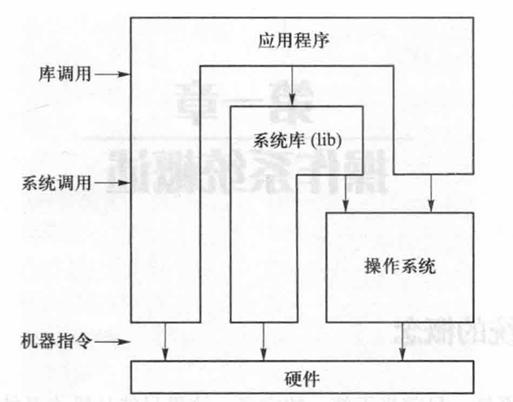

- 应用程序以目标代码的形式运行时，可以与操作系统和硬件直接打交道（调用操作系统或执行硬件指令），操作系统之上的系统库可以被应用程序调用，系统库中的函数又可以调用操作系统

### 操作系统用户接口中包含哪几种接口？它们分别提供给谁使用？

- 操作系统的用户界面是操作系统与使用者的接口，现代操作系统通常提供两种界面：命令界面（图形界面）和系统调用界面。
- DOS操作系统和UNIX操作系统为命令界面的代表（目前UNIX也提供图形界面）。
- 图形界面的代表为微软的Windows操作系统，大多数普通用户使用这种界面。
- 系统调用是操作系统提供给编程人员的接口。在UNIX系统中，系统调用以C函数的形式出现，它只能在C程序中使用，不能作为命令在终端输入。

### 分时系统和实时系统有什么不同？

- 分时系统通用性强，交互性强，及时响应性要求一般（通常数量级为秒）；
- 实时系统往往是专用的，系统与应用很难分离，常常紧密结合在一起，实时系统并不强调资源利用率，而更关心及时响应性（通常数量级为毫秒或微秒）、可靠性等

### 硬件将处理器划分为两种,即管态和目态,这样做会给操作系统的设计带来什么好处?

- 便于设计安全可靠的操作系统。管态和目态是计算机硬件为保护操作系统免受用户程序的干扰和破坏而设置的两种状态。通常操作系统在管态下运行,可以执行所有机器指令;而用户程序在目态下运行,只能执行非特权指令。如果用户程序企图在目态下执行特权指令,将会引起保护性中断,由操作系统终止该程序的执行,从而保护了操作系统。

### 何谓特权指令?如果允许用户进程执行特权指令,会带来什么后果?举例说明。

- 在现代计算机中,一般都提供一些专门供操作系统使用的特殊指令,这些指令只能在管态执行,称为特权指令。这些指令包括停机指令,置PSW指令,中断操作指令(开中断、关中断、屏蔽中断),输入输出指令等。
- 用户程序不能执行这些特权指令。如果允许用户程序执行特权指令,就有可能干扰操作系统的正常运行,甚至有可能使整个系统崩溃。

### 中断向量在计算机中的存储位置是由硬件决定的还是软件决定的？

- 中断向量在计算机中的存储位置是由硬件决定的

### 中断向量的内容是由操作系统程序决定的,还是由用户程序决定的?

- 由操作系统程序决定的。向量的内容包括中断处理程序的入口地址和程序状态字(中断处理程序运行环境),中断处理程序是由操作系统装入内存的,操作系统将根据装入的实际地址和该中断处理程序的运行环境来填写中断向量。

### 中断向量内的处理器状态字应当标明管态还是目态?为什么?

- 答:应当标明是管态。该状态由系统初始化程序设置,这样才能保证中断发生后进入操作系统规定的中断处理程序。

### 系统如何由目态转换为管态?如何由管态转换为目态?

- 目态程序被中断时,现行PSW被压入系统栈,中断向量PSW被送入寄存器。由于后者状态位为管态,系统状态由目态转换为管态。
- 当处于管态的中断处理程序执行完且没有嵌套中断时,将系统栈中的PSW弹出送入寄存器。由于后者状态位为目态,即实现了由管态到目态的转换。

### 中断与程序并发之间的关系是什么?

- 中断是程序并发的前提条件。如果没有中断,操作系统不能获得系统控制权,也就无法按照调度算法对处理器进行重新分配,一个程序将一直运行到结束而不会被打断。

### 根据用途说明“栈”和“堆”的差别。

- 栈是一块按后进先出(Last In First Out,LIFO)规则访问的存储区域,用来实现中断嵌套和子程序嵌套(保存调用参数和返回断点)。堆虽然是一块存储区域,但是对堆的访问是任意的,没有后进先出的要求,堆主要用来为动态变量分配存储空间。

### 何谓系统栈?何谓用户栈?系统栈有何用途?用户栈有何用途?

- 系统栈是内存中属于操作系统空间的一块固定区域,其主要用途为:
  - (1)保存中断现场,对于嵌套中断,被中断程序的现场信息被依次压入系统栈,中断返回时逆序弹出;
  - (2)保存操作系统子程序之间相互调用的参数、返回值、返回点,以及子程序(函数)的局部变量。
- 用户栈是用户进程空间中的一块区域,用于保存用户进程的子程序之间相互调用的参数、返回值、返回点,以及子程序(函数)的局部变量。

### 为何无法确定用户堆栈段的长度?

- 用户堆栈段的长度主要取决于以下因素:
  - (1)用户进程(线程)中子程序(函数)之间的嵌套调用深度;
  - (2)子程序参数和局部变量的数量及类型;
  - (3)动态变量的使用。
- 这些在进程(线程)运行前无法确定,由此导致用户堆栈段的长度无法预先准确确定。

### 为何堆栈段的动态扩充可能导致进程空间的变迁?

- 答:堆栈段的扩充需要在原来进程空间大小的基础上增添新的存储区域,而且通常要求新的存储区域是原来存储区域的连续区域。如果原来存放位置处的可扩展区域已经被其他进程占用,则需要将整个进程空间搬迁到另外一个区域,以实现地址空间扩展要求。

### 试述批处理操作系统与分时操作系统的差别。

- 批处理系统采用脱机操作模式，追求系统效率,界面是作业控制语言(JCL);分时系统采用联机操作模式,追求交互性,界面是交互终端命令或GUI。

### 何谓作业?它包括哪几个部分?各个部分的用途是什么?

- 所谓作业是指用户要求计算机系统为其完成的计算任务的集合。一个作业通常包括程序、程序所处理的数据以及作业说明书,程序用来完成特定的功能,数据是程序处理的对象,作业说明书用来说明作业处理的步骤和控制意图。

### 为什么构成分布式系统的主机一般都是相同的或兼容的?

- 这样更有利于进程的动态迁移。如果主机不兼容,则在一台主机上能够运行的进程,因所用指令系统不同在另一台主机上可能无法运行,导致进程难以在不同主机之间迁移,使得分布式操作系统难以实现负载平衡。

### 为什么嵌入式操作系统通常采用微内核结构?微内核结构包括哪些内容?

- 答:嵌入式操作系统与一般操作系统相比具有比较明显的差别:
  - (1)嵌入式操作系统规模一般较小。因为其硬件配置一般较低,而且对操作系统提供的功能要求也不高;
  - (2)应用领域差别大。对于不同应用,其硬件环境和设备配置情况有着明显的差别。
- 所以,嵌入式操作系统一般采用微内核(micro kernel)结构。
- 微内核包括如下基本成分:
  - (1)处理器调度;(2)基本内存管理;(3)通信机制;(4)电源管理。
- 在这些基本成分之上可进行扩展,以适应不同的应用目标。

### 微内核结构有哪些优点和缺点?

- 微内核结构的明显优点是可靠性高,可移植性好,适用范围广。
- 缺点是效率低,因为许多系统功能(如文件系统)被放置在核外,调用这些功能会导致两次上下文切换。

### 程序状态字包含哪些主要内容?

- (1)程序基本状态
- (2)中断码
- (3)中断屏蔽位

### 什么是系统调用，为什么要使用“系统调用”机制

- 系统调用是指用户在程序中调用操作系统所提供的一些子功能，是操作系统提供给应用程序使用的接口，系统调用可视为特殊的公共子程序。
- 用户程序不能直接执行对系统影响非常大的操作，必须通过系统调用的方式请求操作系统代为执行，以便保证系统的稳定性和安全性，防止用户程序随意更改或访问重要的系统资源，影响其他进程的运行。

### 导致一个进程创建另一个进程的典型操作有哪几种？

- 用户登录：系统为用户创建一个进程，并插入就绪队列
- 作业调度
- 提供服务：系统为用户请求创建一个进程
- 应用请求：用户程序自己创建进程

### 输入井和输出井是什么？设置它们有什么作用？

（原稿这段话前面没有题目，题目是整理时补拟的。）

- 输入井和输出井分别为磁盘或磁鼓上的两个区域，输入井用于保存已经输入但尚未处理的作业；输出井用于保存处理完毕但尚未输出的结果。
- 设置输入井和输出井的目的主要有两个：
  - 协调输入输出设备速度与处理器速度之间的差异；
  - 为作业调度提供有利条件。如果没有输入井，系统只能按照自然次序处理作业；设置输入井后，系统可以根据调度的需要在输入井中选择进入内存的作业，使得内存中运行的作业搭配合理。

## 第2章 进程、线程与作业

### 单道程序设计有哪些缺点？

- 设备资源利用率低
- 内存资源利用率低
- 处理器资源利用率低

### 分析多道程序设计对于系统的资源利用率所带来的影响

- 设备资源利用率提高：如果允许若干个搭配合理的程序同时进入内存，这些程序分别使用不同的设备资源，则系统中的各种设备资源都会被用到并经常处于忙碌状态
- 内存资源利用率提高：允许多道程序同时进入系统可以避免单道程序过短而内存空间过大所造成的存储空间的浪费，从而提高内存资源的利用率。同时，进入系统的多个程序可以保存在内存的不同区域中。
- 处理器资源利用率提高：如果将两道程序同时放入内存，在一个程序等待输入输出操作完成期间，处理器执行另一个程序，这样便可提高处理器的利用率

### 进程在其生存周期内可能处于哪些基本状态？三者之间如何转换？请画图说明

- ①运行（run）态：进程占有处理器资源，正在运行。
- ②就绪（ready）态：进程本身具备运行条件，但是由于处理器的数量少于可运行进程的数量，暂未投入运行，即相当于等待处理器资源。
- ③等待（wait）态：也称为挂起（suspend）态、阻塞（block）态、睡眠（sleep）态。进程本身不具备运行条件，即使分给其处理器也不能运行。进程正在等待某一事件的发生，如等待某一资源被释放，等待与该进程相关的数据传输的完成信号等。

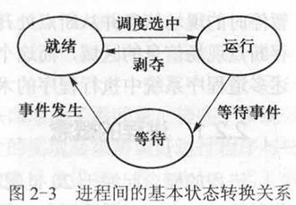

- 当一个就绪进程获得处理器时，其状态由就绪态变为运行态；
- 当一个运行进程被剥夺处理器资源时，如用完系统分给它的时间片，或者出现高优先级别的其他进程，其状态由运行态变为就绪态；
- 当一个运行进程因某事件受阻时，如所申请资源被占用、启动数据传输未完成，其状态由运行态变为等待态；
- 当所等待的事件发生时，如得到被申请资源、数据传输完成，其状态由等待态变为就绪态。
- 处于运行态的进程个数不能大于CPU的数目，单CPU系统中任何时刻至多只有一个进程处于运行态（《试题及答案》“画出三状态进程模型”一题的要点）。

### 进程由哪几个部分构成？他们分别属于什么空间？

- 进程由两个部分组成，即进程控制块和程序，其中程序包括代码和数据等。
- 进程控制块属于操作系统空间，而程序则属于用户空间。

### 进程队列有哪几种类型？进程在不同队列中如何变化？请画图说明

- 就绪队列、等待队列、运行队列

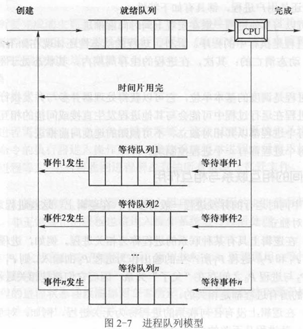

- 进程初创后进入就绪队列；CPU空闲下来时从就绪队列中选取进程使其运行，获得处理器的进程用完所分得的时间片后回到就绪队列；运行进程因某一事件受阻进入相应的等待队列，等待进程在所等事件发生后进入就绪队列，运行进程正常结束后离开系统。

### 从操作系统的角度看，进程有哪些类型？进程有哪些特性？分别进行解释

- 类型：从操作系统的角度来看，可以将进程分为系统进程和用户进程两大类。
- 特性有以下六条：
- ①并发性。可以与其他进程一道在宏观上同时向前推进。
- ②动态性。进程是执行中的程序。此外，进程的动态性还体现在如下两个方面。首先，进程是动态产生、动态消亡的；其次，在进程的生存周期内，其状态处于经常性的动态变化之中。
- ③独立性。进程是调度的基本单位，它可以获得处理器并参与并发执行。
- ④交互性。进程在运行过程中可能会与其他进程发生直接或间接的相互作用。
- ⑤异步性。每个进程都以其相对独立、不可预知的速度向前推进。
- ⑥结构性。每个进程都有一个进程控制块。

### 进程间相互作用的方式有哪些？请举例解释他们之间的差异

- ①直接相互作用：进程之间不需要通过媒介而发生的相互作用，这种相互作用通常是有意识的。例如，进程P1将一个消息发送给进程P2，进程P1的某一步骤S1需要在进程P2的某一步骤S2执行完毕之后才能继续等。直接相互作用只发生在相关进程之间。
- ②间接相互作用：进程之间需要通过某种媒介而发生的相互作用，这种相互作用通常是无意识的。例如，进程P1欲使用打印机，该设备当前被另一进程P2所占用，此时进程P1只好等待，以后进程P2用完并释放该设备时，将进程P1唤醒。间接相互作用可能发生在任意进程之间。

### 画出体现生灭过程的进程状态转换图

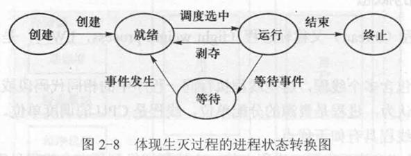
- 《试题及答案》还有一题“画出进程的5状态模型图”，原稿的图没有导出，画法就是这张图：在运行、就绪、等待三态之外加上创建和终止两个状态。也可以看 `02 进程、线程与作业.md` 2.2.7 的“考虑生灭的进程状态转换图”。

### 描述进程与程序的联系和差别

- 进程与程序的联系：程序是构成进程的组成部分之一，一个进程存在的目的就是执行其所对应的程序。如果没有程序，进程就失去了其存在的意义。
- 进程与程序的差别：
  - ①程序是静态的，而进程则是动态的。
  - ②程序可以写在纸上或在某种存储介质上长期保存，而进程具有生存周期，创建后存在，撤销后消亡。
  - ③一个程序可以对应多个进程，但是一个进程只能对应一个程序。
- 补充（《试题及答案》）：进程是具有结构的，由程序、数据和进程控制块三部分组成；进程是系统进行资源分配和调度的一个独立单位，程序则不是。

### 什么是进程？什么是线程？它们的关系是什么？

- 进程：进程是具有一定独立功能的程序关于一个数据集合的一次运行活动。
- 线程：线程又称轻进程（LWP )，是进程内的一个相对独立的执行流。
- 一个进程可以包含多个线程，这些线程执行同一程序中的相同代码段或不同代码段，共享数据区和堆。一般认为，进程是资源的分配单位，线程是CPU的调度单位。一个线程只能属于一个进程，而一个进程可以有多个线程；资源分配给进程，同一进程的所有线程共享该进程的所有资源；处理机分给线程，即真正在处理机上运行的是线程；线程在运行过程中，需要协作同步，不同进程的线程间要利用消息通信的办法实现同步。

### 与进程相比，线程有哪些优点？

- 与进程相比，线程具有如下优点：
  - ①上下文切换速度快。由同一进程中的一个线程切换到另一个线程只需改变寄存器和栈，包括程序和数据在内的地址空间不变。
  - ②系统开销小。创建线程比创建进程所需完成的工作少，因而对于客户请求，服务器动态创建线程比动态创建进程具有更高的响应速度。
  - ③通信容易。由于同一进程中的多个线程的地址空间共享，一个线程写到数据空间的信息可以直接被该进程中的另一线程读取，方便快捷。

### 画图呈现多进程结构与多线程结构，说明什么时候能用多线程结构来实现多进程

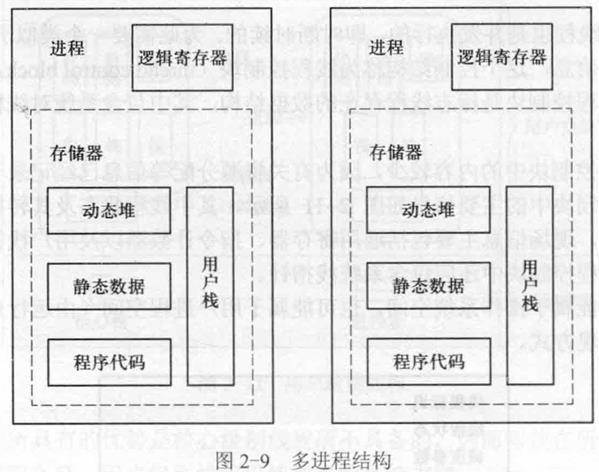

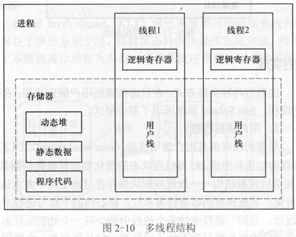

- 如果这两个进程具有一定的逻辑联系，比如二者是执行相同代码的服务程序，或者二者为协同进程，则可以用多线程结构实现

### 线程有哪些实现方式？各自有什么优缺点？

- 线程有两种实现方式：在目态实现的用户级别线程，在管态实现的核心级别线程。
- 用户级别线程的优点在于：线程不依赖于操作系统，可以采用与问题相关的调度策略，灵活性好；同一进程中的线程切换不需要进入操作系统，因而实现效率较高。
- 用户级别线程的缺点在于：同一进程中的多个线程不能真正并行，即使在多处理器环境中；由于线程对操作系统不可见，调度在进程级别，某进程中的一个线程通过系统调用进入操作系统受阻，该进程的其他线程也不能运行。
- 核心级别线程的优点是并发性好，在多处理器环境中同一进程中的多个线程可以真正并行执行。
- 核心级别线程的缺点是线程的控制和状态转换需要进入操作系统完成，系统开销比较大。

### 画出混合级线程实现过程图。

（原卷无答案，原稿的图也没有导出。可以看 `02 进程、线程与作业.md` 2.3.5.3 混合线程：用户级线程多路复用到若干个核心级线程上，Solaris 的“用户级线程、轻量级进程 LWP、核心级线程”三层模型就是这种结构。）

### 为何引入多道程序设计?在多道程序系统中,内存中作业的道数是否越多越好?请说明原因。

- 引入多道程序设计技术是为了提高计算机系统资源的利用率。
- 在多道程序系统中,内存中作业的道数并非越多越好。一个计算机系统中的内存、外设等资源是有限的,只能容纳适当数量的作业,作业道数增加将导致对资源的竞争激烈,进程切换频繁,系统开销增大,从而导致作业的执行缓慢,系统效率下降。

### 多道程序设计带来哪些问题?如何解决?

- (1)处理器资源管理:将CPU资源按照调度原则分派给可以运行的程序;
- (2)内存资源管理:进程空间既相互独立,又可共享;
- (3)设备资源管理:多个进程使用同一个设备时不发生冲突。

### 什么是多道程序设计技术？如何在一个CPU的情况下实现该技术？

- 多道程序设计就是将多个用户程序同时装入内存，然后在操作系统的控制下，多个程序交替或同时运行。
- 在一个CPU的情况下，可让多个程序轮流使用CPU和I/O设备，从而形成一个程序使用CPU时，其他的程序在进行I/O操作，以达到多个程序同时运行并提高CPU和外设的使用率的效果。
- 基本思想（《试题及答案》“简述多道程序设计的基本思想”）：在内存中同时放入多道程序，在管理程序的控制下交替执行，这些程序共享CPU和系统中的其他资源。从宏观上看，多道程序都处于运行过程中，但都未运行完毕；从微观上看，各道程序轮流占用CPU交替执行。

### 有人说,用户进程所执行的程序一定是用户自己编写的。这种说法对吗?如果不对,试举例说明之。

- 这种说法不对。例如,C语言编译程序以用户进程身份运行,但C语言编译程序一般并不是用户自己编写的。此外,还有调试程序、字处理程序等工具软件。

### 什么是进程上下文?进程上下文包括哪些成分?哪些成分对目态程序是可见的?

- 进程是在操作系统支持下运行的,进程运行时操作系统需要为其设置相应的运行环境,如系统堆栈、地址映射寄存器、打开文件表、PSW与PC、通用寄存器等。进程的物理实体与支持进程运行的物理环境合称为进程上下文。
- 进程上下文包括以下三个组成部分：
  - (1)用户级上下文。是由用户进程的程序块、用户数据块(含共享数据块)和用户堆栈组成的进程地址空间。
  - (2)系统级上下文。包括进程控制块、内存管理信息、进程环境块,以及系统堆栈等组成的进程地址空间。
  - (3)寄存器上下文。由程序状态字寄存器、各类控制寄存器、地址寄存器、通用寄存器、用户堆栈指针等组成。
- 其中,用户级上下文和部分寄存器上下文对目态程序是可见的。

### 对于时间片轮转进程调度算法、不可抢占处理器的优先数调度算法、可抢占处理器的优先数调度算法,分别画出进程状态转换图

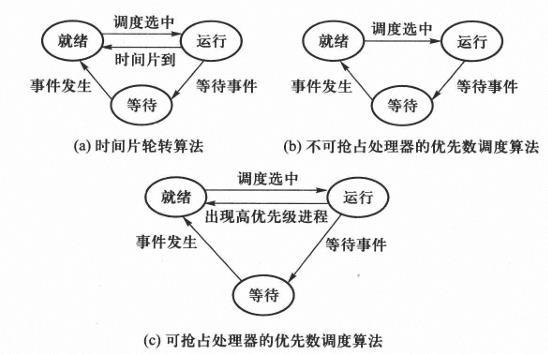

### 试比较进程状态与该进程内部线程状态之间的关系

- 对于用户级别线程,若同一进程中的多个线程中至少有一个处于运行态,则该进程的状态为运行态;若同一进程中的多个线程均不处于运行态,但是至少有一个线程处于就绪态,则该进程的状态为就绪态;若同一进程中的多个线程均处于等待态,则该进程的状态为等待态。

### 什么是线程控制块?线程控制块中一般包含哪些内容?

- 线程控制块(Thread Control Block,TCB)是线程存在的标志,其中保存有系统管理线程所需要的全部信息。
- 一般TCB中的内容较少,因为有关资源分配等多数信息已经记录于所属进程的PCB中。TCB中的主要信息包括线程标识、线程状态、调度参数、现场、链接指针。其中,现场信息主要包括通用寄存器、指令计数器PC以及用户栈指针。对于操作系统支持的线程,TCB中还应包含系统栈指针。

### 同一进程中的多个线程有哪些成分是共用的,哪些成分是私用的?

- 同一进程中的多个线程共享进程获得的主存空间和资源,包括代码区、数据区、动态堆空间。线程的私有成分包括:(1)线程控制块;(2)一个执行栈;(3)运行时动态分给线程的寄存器。

### 试比较用户级别线程与核心级别线程在以下几个方面的差别和各自的优、缺点：(1)创建速度;(2)切换速度;(3)并行性;(4)线程控制块的存储位置

- 用户级别线程由系统库支持。线程的创建、撤销以及线程状态的变化都由库函数控制并在目态完成,与线程相关的控制结构线程控制块保存在目态空间并由运行系统维护。由于线程对操作系统不可见,系统调度仍以进程为单位,核心栈的个数与进程个数相对应。
- 用户级别线程的优点在于:
  - (1)线程不依赖于操作系统,可以采用与问题相关的调度策略,灵活性好;
  - (2)同一进程中的线程切换不需进入操作系统,因而实现效率较高。
- 缺点在于:
  - (1)同一进程中的多个线程不能真正并行,即使在多处理器环境中;
  - (2)线程对操作系统不可见,调度在进程级别。如果某进程中的一个线程通过系统调用进入操作系统受阻,那么该进程的其他线程也不能运行。
- 核心级别线程通过系统调用由操作系统创建,线程的控制结构TCB保存于操作系统空间,线程状态转换由操作系统完成,线程是CPU调度的基本单位。另外,由于系统调度以线程为单位,操作系统还需要为每个线程保持一个核心栈。
- 核心级别线程的优点是并发性好,在多CPU环境中同一进程中的多个线程可以真正并行执行。缺点是线程控制和状态转换需要进入操作系统完成,系统开销比较大。

### 试比较Linux系统中fork()与clone()两个系统调用之间的差异

- fork()用于创建子进程,子进程与父进程具有各自独立的地址空间。子进程地址空间内容通过从父进程处复制得到。
- clone()用于创建子进程(线程),父子之间可以共享存储空间。

### 何谓系统开销?试举3个例子说明之

- 运行操作系统程序,实现系统管理所花费的时间和空间称为系统开销。例如,操作系统的内核要占用内存空间,页面调度时需占用设备资源并消耗处理器时间,进程切换时也要占用处理器时间。

### 归纳引入多线程（multithread）程序设计的原因

- ①某些应用具有内在的多个控制流结构，这些控制流具有合作性质，需要共享内存。采用多线程易于对问题建模，从而得到最自然的解决算法。
- ②在需要多控制流的应用中，多线程比多进程在速度上具有更大优势。统计测试结果表明，线程的建立速度比进程的建立速度快100倍，进程内线程间的切换速度与进程间的切换速度也有数量级之差。
- ③采用多线程可以提高处理器与设备之间的并行性。在单控制流的情形下，启动设备的进程进入核心后将被阻塞，此时该进程的其他代码也不能执行。若此时无其他可运行程序，处理器将被闲置。多线程结构在一个线程等待时，其他线程可以继续执行，从而使设备和处理器并行工作。
- ④在有多个处理器的硬件环境中，多线程可以并行执行，既可提高资源利用效率，又可提高进程推进速度。

### 什么是PCB？PCB的作用是什么？PCB包含哪些内容？

- PCB是进程控制块的简称，是标识进程存在的数据结构，其中包含系统管理进程所需要的全部信息，用于描述和控制并发进程。
- PCB的作用是描述和控制并发进程，是进程存在的唯一标志。
- PCB中一般包括：进程标识、用户标识、进程状态、调度参数、现场信息、家族联系、程序地址、当前打开文件、消息队列指针、资源使用情况、进程队列指针等内容。
- 《试题及答案》列的是另一种说法：进程标识符、进程当前状态、程序与数据地址、互斥与同步机构、通信机构、进程优先数、资源清单、链接字、家族关系等。

（`简答题.pdf` 里还有一道“什么是进程控制块？进程控制块一般包含哪些内容？”，内容已并入本题。）

### 作业与进程有何不同？它们之间有什么关系？

- 不同：
  - 作业：是用户在一次上机活动中，要求计算机系统所做的一系列工作的集合。也称作任务（task）。
  - 进程：是一个具有一定独立功能的程序关于某个数据集合的一次可以并发执行的运行活动。
  - 作业是一个宏观的执行单位，它主要是从用户的角度来看待的。作业的运行状态是指把一个作业调入内存，然后产生若干个进程可以去竞争CPU。
  - 进程是微观的执行单位，它主要从系统的角度来看待的，它是抢占CPU和其他资源的基本单位。进程的执行状态是指一个进程真正占用了CPU。
- 关系：一个作业调入内存以后，处于执行状态，则此作业对应在系统建立若干个进程。进程的所有状态对应作业的执行状态，通过这若干个进程的执行，来完成该作业。

### 哪些事件会导致进程被创建？

- 有四种事件导致进程的创建：
  - （1）系统初始化。系统初始化会创建许多进程，如windows刚开机的时候。
  - （2）执行了正在运行的进程所调用的系统调用。如程序运行了一个fork()调用。
  - （3）用户请求创建一个进程。如命令行中输入./a.out。
  - （4）一个批处理作业的初始化。

### 进程切换时需要保存哪些现场信息？请尽量考虑完全。

- 进程切换过程是进程上下文的切换过程,进程上下文是指进程运行的物理环境。
- 现场信息包括地址映射寄存器、通用寄存器、浮点寄存器、SP、PSW(程序状态字)、PC(指令计数器)、以及打开文件表等。

### 简述 shell 命令在 UNIX 中的实现过程。

- 终端进程读命令；
- 分析用户键入的命令是否正确；
- 创建一个子进程；
- 等待子进程完成工作；
- 子进程运行；
- 子进程完成工作终止；
- 子进程唤醒父进程；
- 父进程运行，发出提示符。

（出自《试题库》。）

## 第3章 中断与处理器调度

### 处理器资源管理需要解决3个问题？

- 按照什么原则分配处理器，即需要确定处理器调度算法；
- 什么时候分配处理器，即需要确定处理器调度时机；
- 如何分配处理器，即需要给出处理器调度过程。

### 处理器调度算法的选择指标？

- ①CPU利用率：使CPU尽量处于忙碌状态。
- ②吞吐量：单位时间内所处理计算任务的数量。
- ③周转时间：从计算任务就绪到处理完毕所用的时间。
- ④响应时间：从任务就绪到开始处理所用的时间。
- ⑤系统开销：系统调度进程过程中所付出的时空代价。

### 中断的响应过程主要有哪几个步骤？

- ①识别中断源：当有多个中断源同时存在时，由中断装置选择优先级别最高的中断源。
- ②保存现场：将正在运行的进程的程序状态字及指令计数器中的内容压入系统栈。
- ③引出中断处理程序：将与中断事件相对应的中断向量由内存指定单元处取出并送入程序状态字及指令计数器中，如此便转入对应的中断处理程序。

### 中断有哪些类型？分别有什么特点？

- 中断可以分为两大类，即强迫性中断和自愿性中断。
- 强迫性中断：这类中断事件是正在运行的程序所不期望的。强迫性中断事件是否发生，何时发生，事先无法预知，因而运行程序可能在任意位置被打断。这类中断大致有以下几种：
  - ①时钟中断：如硬件实时时钟到时等。
  - ②输入输出中断：如设备出错、传输结束等。
  - ③控制台中断：如系统操作员通过控制台发出命令等。
  - ④硬件故障中断：如掉电、内存校验错误等。
  - ⑤程序错误中断：如目态程序执行特权指令、地址越界、虚拟存储中的缺页故障或缺段故障、溢出、除数为0等。
- 自愿性中断：这类中断事件是正在运行的程序有意识安排的。通常由于正在运行的程序执行访管指令而引起自愿性中断事件，其目的是要求系统提供某种服务。这类中断的发生具有必然性，并且发生位置确定。

### 陷阱与中断的主要区别是什么？

- 陷阱是同步的，而中断是异步的。
- 如果给定相同的机器状态和输入数据，每次程序运行时陷阱都会发生在程序执行的同一点上；而中断的发生依赖于中断设备和CPU之间的相对时序。
- 由于受中断时序影响的错误不容易重复出现，中断给调试过程带来难度。

（出自《试题及答案》。）

### 用户栈有哪些用途?系统栈有哪些用途?

- 用户栈的用途包括保存函数之间相互调用的参数、返回断点、局部变量、返回值。
- 系统栈的用途包括保存函数之间相互调用的参数、返回断点、局部变量、返回值;保存中断现场(PSW和PC)。

### 为什么说中断是进程切换的必要条件,但不是充分条件?

- 假如在时刻T1与时刻T2之间发生了进程切换,则在时刻T1与时刻T2之间一定执行了处理器调度程序,而处理器调度程序是操作系统低层中的一个模块,运行于管态,说明在T1与T2时刻之间处理器状态曾由目态转换到管态。由于中断是系统由目态转换为管态的必要条件,所以在时刻T1与时刻T2之间一定发生过中断,也就是说,中断是进程切换的必要条件,然而中断不是进程切换的充分条件。
- 例如,一个进程执行一个系统调用命令将一个消息发给另外一个进程,该命令将通过中断进入操作系统得以执行,操作系统处理完消息的发送工作后可能返回原调用进程,此时中断未导致进程切换;也可能选择一个新的进程,此时中断导致了进程切换。

### 试分析中断与进程状态转换之间的关系。

- 进程状态转换是由内核控制的,如果一个进程的状态发生了改变,则在新旧状态之间一定发生了处理器状态由目态到管态的转换。而中断是处理器状态由目态转换到管态的必要条件,所以中断也是进程状态转换的必要条件。

### 中断发生时,旧的PSW和PC为何要压入系统栈?

- 因为通常中断处理程序的最后一条指令是中断返回指令,该指令从系统栈顶弹出断点信息,如果未将PSW和PC压入系统栈,则中断返回指令弹出的不是中断前的断点信息,而是不确定的信息,这将导致系统处于不确定的状态,严重时会使系统崩溃。
- 采用栈结构的原因是中断可能发生嵌套,此时能保证以与发生中断相反的次序返回上层中断处理程序或返回目态。
- 在某些硬件系统中,没有采用栈结构,中断发生时现场信息被送到系统空间指定单元,每个现场保存单元与中断事件一一对应。这样处理的缺点是中断类型不能增加,相同类型中断不能嵌套发生。

### 何谓中断向量?用户能否修改中断向量的值?

- 当中断事件发生时,中断装置根据中断类别自动地将中断处理程序所对应的PSW和PC送入程序状态字和指令计数器,如此便转移到对应的中断处理程序。这个转移类似于向量转移,因而PSW和PC被称为中断向量。
- 用户不能修改中断向量的值,因为修改中断向量是特权指令,普通用户程序不能执行特权指令。另外,如果允许用户修改中断向量的值,那么用户就可以破坏中断向量与处理程序之间的联系,并可能攻击系统。例如,将中断向量与一段病毒程序联系起来,使中断发生时执行病毒程序,这将导致对计算机系统的破坏。

### 为什么需要中断屏蔽？

- 如果对中断嵌套不加以控制，低优先级别的中断源可能打扰高优先级别的中断事件的处理过程，甚至可能会使中断嵌套层数无限制地增长，直至系统栈溢出。为此，硬件系统提供了中断屏蔽指令，利用中断屏蔽指令可以暂时禁止中断源向处理器发送中断请求。

### 描述中断处理逻辑，画出中断处理过程的流程图

- 中断装置响应中断请求后，通过交换中断向量引入中断处理程序。中断处理程序在处理中断的过程中可能需要使用通用寄存器，为此需要进一步保存现场信息，中断处理结束后再恢复现场。这些现场信息保存在系统栈中，在保存现场和恢复现场的过程中不响应新的中断，为此保存现场（恢复现场）之前需要关中断，保存现场（恢复现场）之后再开中断。在中断处理过程中，中断处理程序需要根据中断码（访管号）进一步分析中断源，然后进行相应的处理，最后根据情况决定是否需要切换进程。

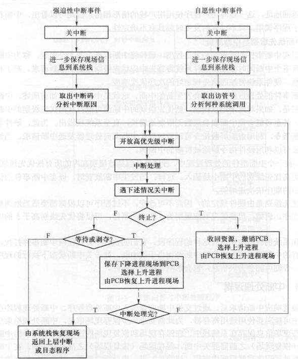

### 解释“中断现场”与“进程切换现场”的差异

- 中断现场保存在系统栈中，进程切换现场保存在进程PCB中。

### 为什么保存在PCB中的现场都是核心级别的现场？

- 等待和剥夺都是由操作系统完成的，因而等待和剥夺均发生在核心态，因而保存在PCB中的现场都是核心级别的现场，而并非目态程序的现场。

### 考虑系统状态与中断，画图解释进程状态转换关系

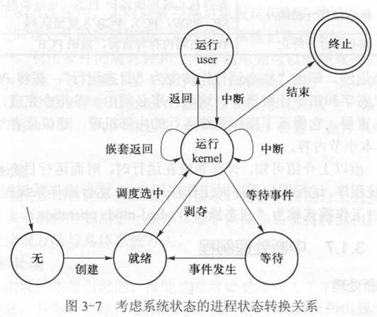

### 试举一些中断处理的例子

- 输入输出中断处理
- 时钟中断处理
- 控制台中断处理
- 硬件故障中断处理
- 程序错误中断处理

### 中断向量的存储位置是否可由程序改变?为什么?中断向量的值是如何确定的?

- 中断向量的存储位置是由硬件确定的,不能由程序改变。中断发生后,中断装置按照中断类型到内存指定位置取出中断向量。
- 操作系统的设计者根据各中断事件处理程序的存储位置及运行环境确定对应中断向量的值,系统启动时由初始化程序将该值填入指定位置。

### 有人说,“中断发生后,硬件中断装置保证处理器进入管态。”这种说法准确吗?试说明理由。

- 这种说法不准确。中断发生后,硬件中断装置负责引出中断处理程序,中断处理程序是否运行于管态取决于PSW中的处理器状态位,该位的值是在操作系统初始化时设置的,只有在初始化程序正确设置该状态位的前提下,才能保证中断后系统进入管态。

### 为什么在中断处理过程中通常允许高优先级别的中断事件中途插入,而不响应低优先级别的中断事件?

- 根据中断事件的重要性和紧迫程度,硬件将中断源分为若干个级别,称为中断优先级。
- 如果有多个中断同时发生,硬件将首先响应优先级别最高的中断请求。对于优先级别相同的中断,硬件将按照事先规定好的次序依次响应。
- 在中断事件的处理过程中可能会发生新的中断,这就是中断嵌套。中断嵌套是必要的。但是,如果不加以控制,低优先级别的中断源可能打扰高优先级别中断事件的处理过程,甚至可能会使中断嵌套层数无限增长,直至系统栈溢出。为此,硬件提供了中断屏蔽指令,利用中断屏蔽指令可以暂时禁止任意一个或多个中断源向处理器发中断请求。当然,在需要的时候还可以利用硬件指令解除对中断源的屏蔽。
- 通常,在一个中断事件的处理过程中,程序屏蔽包括该级别在内的所有低优先级别的中断,但允许更高优先级别的中断中途插入。这样,发生中断嵌套时,嵌套中断事件的优先级别是按照响应的顺序依次递增的。这样做主要有两个原因:
  - (1)从逻辑上来说,高优先级别中断源所对应的事件比低优先级别中断源所对应的中断事件急迫;
  - (2)由于硬件中断类型是有限的,这样做实际上也就限制了中断嵌套的深度。

### 为什么说“关中断”会影响系统的并发性?

- 考虑单处理器系统。在单处理器系统中,并发是通过将处理器轮流分配给多个进程而实现的,这个分配由操作系统中的处理器调度程序完成。中断是进程切换的必要条件,如果关中断,则操作系统无法获得处理器的控制权,也就无法使多个进程分时共享处理器,处理器将被一个进程独占。所以说“关中断”会影响系统的并发性。
- 关中断是实现临界区管理的简捷方法,而且没有“忙式等待”问题,但临界区应尽量小,执行完后要立即“开中断”,因为在“关中断”期间互斥已经不局限于临界区范围,而被扩展到了整个操作系统空间。

### 假如关中断后操作系统进入死循环,将会产生什么后果?

- 系统不响应任何外部干预事件,系统表现为“死机”。

### 为什么不允许目态程序执行关中断指令及中断屏蔽指令?

- 开/关中断指令和中断屏蔽指令属于特权指令,一般用户无权访问。如果允许用户使用,用户关中断后可能会影响系统对内部或外部事件的响应,也会使操作系统无法获得系统控制权。

### 如果没有中断,是否能够实现多道程序设计?为什么?

- 不能。因为一个程序一旦被调度执行,就将一直执行下去,中间不可能被打断,不可能达到多个进程交替执行的并发目的。

### 为什么说操作系统是由中断驱动的？

（`笔记/操作系统期末整理.pdf` 开头单独列了这道题，没有答案，下面是整理补充的要点。）

- 操作系统本身不主动运行，平时处理器在执行用户程序；只有发生中断（外设中断、时钟中断、程序出错、系统调用引起的访管中断）时，控制权才会交给操作系统。
- 目态转管态的唯一途径是中断，所以操作系统的每一次运行都由中断引起。
- 进程调度靠时钟中断和 I/O 中断等触发，设备管理靠 I/O 中断得知传输完成，系统调用靠访管中断进入内核。
- 没有中断，操作系统拿不到处理器，也就无法让多个程序轮流运行，并发无从实现。

### 下列中断源哪些通常是可以屏蔽的,哪些通常是不可屏蔽的?(1)输入输出中断;(2)访管中断;(3)时钟中断;(4)掉电中断。

- (1)输入输出中断可以屏蔽;(2)访管中断不可以屏蔽;(3)时钟中断可以屏蔽;(4)掉电中断不可以屏蔽。
- 对于访管中断来说,若在管态屏蔽,则没有意义(不会发生访管中断);若在目态屏蔽,则应用程序无法访问操作系统,不能正常运行。

### 下列中断事件哪些可由用户自行处理?哪些只能由操作系统中断处理程序统一处理?为什么?(1)溢出;(2)地址越界;(3)除数为零;(4)非法指令;(5)掉电。

- 一般来说,只影响应用程序自身的中断,可以由用户自行处理,包括(1)溢出;(3)除数为零。
- 可能影响其他用户或操作系统的中断只能由操作系统中断处理程序统一处理,包括(2)地址越界;(4)非法指令;(5)掉电。

### 如果中断由用户程序自行处理,为何需要将被中断程序的断点由系统栈弹出并压入用户栈?

- 中断发生时,被中断程序的现场信息已被压入系统栈中。而中断续元运行于目态,它执行完毕后将从用户栈区中恢复现场信息。为此,操作系统在转到中断续元之前应当将系统栈中的现场信息弹出并压入用户栈,否则,用户中断续元执行完毕后将无法恢复现场信息返回断点。

### 对于下述中断与进程状态转换之间的关系,各举两个例子说明之。(1)一定会引起进程状态转换的中断事件;(2)可能引起进程状态转换的中断事件。

- 一定会引起进程状态转换的中断事件:当前运行进程终止、应用程序启动I/O传输并等待I/O数据、运行程序申请当前被占用的某一资源。
- 可能引起进程状态转换的中断事件:时钟中断事件可能引起进程状态转换。例如,对于时间片轮转进程调度算法,若时钟中断发生后当前进程的时间片已用完,则会发生进程切换;否则不发生进程切换。

### 若在T1时刻进程P1运行，在T2时刻进程P2运行，且P1≠P2，则在T1到T2期间内一定发生过中断。这种说法对吗?为什么?

- 这种说法对。
- 已知时刻T1进程P1在运行,时刻T2进程P2在运行,且P1≠P2,可知在时刻T1和时刻T2之间发生了进程切换。由于进程切换的必要条件是执行处理器调度程序,而处理器调度程序是操作系统低层中的一个模块,只能在系统态执行,而只有中断才能进入系统态。因此,假如在时刻T1与时刻T2之间发生了进程切换,则在时刻T1与时刻T2之间一定发生过中断。

### 进程上下文包括哪些内容?请尽量考虑完整。

- 进程上下文包括(1)通用寄存器;(2)PSW,PC,SP;(3)地址映射寄存器;(4)用户栈和系统栈;(5)进程控制块。

### 进程切换时,上升进程的PSW和PC为何必须由一条指令同时恢复?

- 中断向量中程序状态字PSW与指令计数器PC的内容必须由一条指令同时恢复，这样才能保证系统状态由管态转到目态的同时，控制转到上升进程的断点处继续执行。
- 如果不同时恢复，则只能：
  - (1)先恢复PSW，再恢复PC。由于在恢复PSW后已经转到目态，因此操作系统恢复PC的使命无法完成。
  - (2)先恢复PC，再恢复PSW。由于PC改变后转到操作系统的另外区域（因为PSW仍为系统状态），因此PSW无法恢复。

（第2章原来还有一道“由核心返回目态程序时，进程的PSW和PC为何必须用一条机器指令同时恢复”，是同一道题，已合并到这里。）

### 简述先到先服务算法的思想与优缺点

- 先到先服务（FCFS）算法按照进程申请CPU的次序，即进入就绪态的次序来调度。
- 先到先服务算法具有公平的优点，不会出现饿死的情况。
- 其缺点是短进程（线程）的等待时间长，从而平均等待时间较长。

### 简述最短作业优先算法的思想与优缺点

- 最短作业优先（shortest job first , SJF）算法按照CPU阵发时间递增的次序调度，易于证明其平均周转（等待）时间最短。
- 最短作业优先算法最大限度地降低了平均等待时间，但是也带来不公平性：一个较长的就绪任务可能由于短任务的不断到达而长期得不到运行机会，发生饥饿，甚至被饿死。

### 简述最短剩余时间优先算法的思想

- 最短剩余时间优先（shortest remaining time next , SRTN）算法是剥夺式调度算法，当CPU空闲时，选择剩余时间最短的进程或线程。当一个新进程或线程到达时，比较新进程所需时间与当前运行进程的估计剩余时间。如果新进程所需的运行时间短，则切换运行进程。该算法实质上是可剥夺形式的最短作业优先算法。

### 简述最高响应比优先算法的思想与优缺点

- 最高响应比优先（highest response ratio next , HRN）算法是先到先服务算法和最短作业优先算法的折中，响应比的计算公式如下：

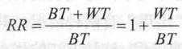

- 其中，RR为响应比，BT为CPU阵发时间，WT为等待时间。显然，对于同时到达的任务，处理时间较短的任务将被优先调度，处理时间较长的任务将随其等待时间的增加而动态提升其响应比，因而不会出现饥饿现象。

### 处理器的调度时刻有哪些选择方法？分别加以介绍

- 非剥夺式：所谓非剥夺式（non-preemptive，也称非抢先），就是一个进程不能将处理器资源强行地从正在运行的进程那里抢占过来。亦即一旦一个进程被进程调度程序所选中，它将一直运行下去，直至出现如下两种情形：该进程因某种事件而等待，或者该进程运行完毕。这种方法的优点是：系统开销较小，其缺点是不能保证当前正在运行的进程永远是系统内当前可运行进程中优先数最高的进程。
- 剥夺式：所谓剥夺式（preemptive，也称抢先），就是一个进程能够将处理器资源强行地从正在运行的进程那里抢占过来。此时，当发生如下3种情形时可能发生进程切换：正在运行的进程因某种事件而等待；正在运行的进程运行完毕；出现新的就绪进程，该进程的优先级高于正在运行的进程的优先级。注意，此处的“出现”有两种情况：其一是某一进程被唤醒（由等待态转换为就绪态），其二是动态创建了新的进程。这种方法的优点是能够保证正在运行的进程永远是系统内当前可运行进程中优先数最高的进程；其缺点是处理器在进程之间的切换比较频繁，系统开销较大。

### 简述循环轮转算法的思想

- 采用循环轮转（round-robin, RR）算法，系统为每一个进程规定一个时间片（time slice) , 所有进程按照其时间片的长短轮流地运行。也就是说，将所有就绪进程排成一个队列，即就绪队列。每当处理器空闲时便选择队列头部的进程投入运行，同时分给它一个时间片。当此时间片用完时，如果此进程既未结束其CPU阵发期也未因某种原因而等待，则剥夺此进程所占有的处理器，将其排在就绪队列的尾部，并选择就绪队列中的队头进程运行。

### 简述优先级调度算法的实现思想？

- 从就绪队列中选出优先级最高的进程，把CPU分配给它；
- 非抢占式优先级法是当前占用CPU的进程一直运行，直到完成任务或阻塞才让出CPU，再调度优先级高的进程占用CPU；
- 抢占式优先级法是当前进程在运行时，一旦出现一个优先级更高的就绪进程，调度程序就停止当前进程的运行，强行将CPU分给那个进程。

（出自《试题库》。同一份资料里的“简述时间片轮转(RR)调度算法的实现思想”与上一题“简述循环轮转算法的思想”内容相同，没有重复收。）

### 举例说明分类排队算法的思想

- 分类排队（multilevel queue , MLQ）算法是以多个就绪进程队列为特征的。这些队列将系统中所有可运行的进程按照某种原则加以分类，以实现所期望的调度目标。
- 例如，在通用操作系统中，可以将所有就绪进程排成如下3个队列。
  - Q1：实时就绪进程队列
  - Q2：分时就绪进程队列
  - Q3：批处理就绪进程队列
- 当处理器空闲时，首先选择Q1中的进程。如果该队列为空，则选择Q2中的进程。如果上述两个队列均为空，则选择Q3中的进程。在每个队列内部又可以分别采用最高优先数优先算法和（或）循环轮转算法，如Q1和Q3采用最高优先数优先算法，Q2采用循环轮转算法。

### 简述反馈排队算法的思想，指出该算法有什么特点

- 反馈（feedback）排队算法也是以多个进程就绪队列为特征的，在每个队列中通常采用循环轮转算法，所不同的是，进程可以在不同的就绪队列之间移动。这些就绪队列的优先级依次递减，而其时间片的长度则依次递增。当一个进程被创建或所等待的事件发生时，进入第一级就绪队列。当某队列的一个进程获得处理器并且使用完该队列所对应的时间片后，如果它尚未结束，则进入下一级就绪队列。当最后一级队列的一个进程获得处理器并且使用完该队列所对应的时间片后，如果它尚未结束，则进入同一级就绪队列。当处理器空闲时，先选择第一级就绪队列中的进程，当该级队列为空时，选择第二级就绪队列的进程，以此类推。
- 这种进程调度算法有以下特点：
  - ①短进程优先处理，因为运行时间短的进程在经过前面几个队列之后便执行完毕，而这些队列中的进程将被优先调度。
  - ②设备资源利用率高，因为与设备打交道的进程可能会由于下面两个原因而进入等待态：所申请的资源被占用，或者启动了数据传输。当进程得到所等待的资源或数据传输完成时，它将进入第一级就绪队列，尽快获得处理器并使用资源。
  - ③系统开销较小，因为运行时间长的进程最后进入低优先级的队列，这些队列的时间片较长，因而进程的调度频率较低。

### 处理器调度需要经历哪几个阶段？分别加以介绍

- 1．保存下降进程现场
  - 当前核心态的现场信息（包括地址映射寄存器、通用寄存器以及SP 、 PSW 、PC）被保存到下降进程的进程控制块中。注意，这里保存的是核心级别的现场，以后再次调度到该进程时将继续核心态尚未执行完的代码。这里有两种特殊情形：系统初次启动时无下降进程，这一步不执行；下降进程为终止进程，直接转善后处理。
- 2．选择将要运行的进程
  - 按照处理器调度算法在就绪队列中选择一个进程，准备将其投入运行，被选中的进程称为上升进程。为防止出现就绪队列为空的情况，在系统中通常安排一个特殊的进程，该进程永远也进行不完，且其调度级别最低，称为“闲逛”进程。当系统中无其他进程可运行时，就运行这个“闲逛”进程。“闲逛”进程是容易构造的，如一个死循环程序、一个计算二值的程序等所对应的进程都可以作为“闲逛”进程。
- 3．恢复上升进程现场
  - 由于进程下降时已经将其现场信息保存在对应的进程控制块中，进程上升时应从其进程控制块中恢复现场。进程现场恢复的步骤是：先恢复地址映射寄存器、通用寄存器及SP等内容，最后恢复PSW和PC 。注意：这里恢复的也是核心级别的现场。
- 进程调度的3个步骤需要执行一定数量的CPU指令才能完成。这些指令通常是用汇编语言编写的，而且经过认真优化，以尽量节省处理器时间。由于处理器调度是经常性的工作，节省一条指令都会对提高系统效率产生积极的影响。

### 某系统采用可抢占处理器的静态优先数调度算法,何时会发生抢占处理器的现象?

- 当一个新创建进程或一个被唤醒进程的优先数比正在运行进程的优先数高时,可能发生抢占处理器现象。

### 某系统采用可抢占处理器的动态优先数调度算法,何时会发生抢占处理器的现象?

- 当一个新创建的进程或一个被唤醒进程的优先数比正在运行进程的优先数高时,或当一个就绪进程优先数超过正在运行进程优先数时,可能发生抢占处理器现象。

### 在实时系统中,采用不可抢占处理器的优先数调度算法是否合适?为什么?

- 不合适。一旦一个低优先数、需要大量CPU时间的进程占用处理器,它就会一直运行,直到运行结束,或者直到因某事件而阻塞。在此之前,即使高优先数的紧急任务到达,也得不到处理。因此,可能延误对重要事件的响应和处理。

### 在分时系统中,进程调度是否只能采用时间片轮转调度算法?为什么?

- 分时系统的特点是要求响应速度及时,除RR(Round Robin,循环轮转)调度算法之外,还可以采用可剥夺CPU的动态优先数调度算法。例如,经典UNIX的处理器调度算法,由于负反馈性质,算法也可以保证响应速度。

### 有人说,在采用等长时间片轮转处理器调度算法的分时操作系统中,各个终端用户所占处理器的时间总量是相同的。这种说法对吗?为什么?

- 这种说法不对。因为处理器是分配给进程(线程)的,而不同终端用户可能有不同数量的进程,一个拥有较多数量进程的终端显然比拥有较少数量进程的终端获得CPU的时间要多。

### 举出两个例子说明操作系统访问进程空间的必要性。

- (1)进程执行输出操作时,通过系统调用进入系统,由操作系统将待输出的数据由进程空间取出送给指定的外部设备,为此操作系统必须访问用户进程空间。
- (2)当发生可由用户自己处理的中断事件时,操作系统在转到中断续元之前应当将系统堆栈中的现场信息弹出并压入用户堆栈,为此操作系统也必须访问进程空间。

### 根据进程和线程的组成,说明进程调度和线程调度各需要完成哪些工作。

- 进程调度需要完成的工作:(1)地址映射寄存器;(2)用户栈指针;(3)通用寄存器;(4)PSW与PC。
- 线程调度需要完成的工作:(1)用户栈指针;(2)通用寄存器;(3)PC。

### 系统资源利用率与系统效率是否一定成正比?如果不是,试举例说明

- 系统效率高则资源利用率高,而反之却不尽然。例如,在虚拟页式存储管理系统中,当页面置换算法不合理或分给进程的页框数过少时,可能发生颠簸或抖动(thrashing),此时I/O设备很忙碌,但系统效率可能很低。

### 画出具有中级调度的进程状态转换关系图

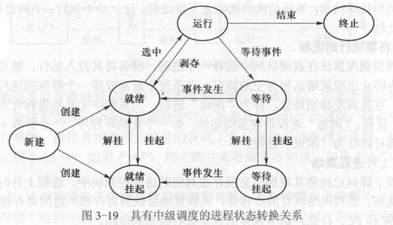

### 什么是低级调度?低级调度的职能是什么?

- 负责分派处理器的调度称为低级调度,也称处理器调度。低级调度使被选中的进程真正进入运行状态。

### 什么是中级调度?中级调度的职能是什么?

- 介于低级调度与高级调度之间的调度称为中级调度。在UNIX系统中,中级调度负责进程在内存和外存之间进行交换,以缓解内存资源紧张的矛盾。

### 什么是高级调度?高级调度的职能是什么?

- 高级调度又称作业调度,负责将作业由输入井调入内存,并为其创建作业控制进程。

### 一个用C和汇编两种语言书写的程序，作为批作业处理主要包括哪几个步骤？

- 运行C语言编译程序对C代码部分进行编译，运行汇编程序对汇编代码部分进行汇编，运行连接装配程序对前两步产生的浮动程序进行连接装配，执行上一步产生的目标代码。

### 画图解释作业的状态转换关系

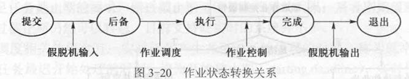

- 作业一般经历“提交”“后备”“执行”“完成”和“退出”这5个状态：
  - 由输入机向输入井传输的作业处于“提交”状态，
  - 进入输入井尚未调入内存的作业处于“后备”状态，
  - 被调度选中进入内存处理的作业处于“执行”状态，
  - 处理结果传送到输出井的作业处于“完成”状态，
  - 由输出井向打印设备传送的作业处于“退出”状态。
  - 作业由“提交”到“后备”的状态转换由假脱机输入完成，
  - 由“后备”到“执行”、由“执行”到“完成”的状态转换由作业调度完成，
  - 由“完成”到“退出”的状态转换由假脱机输出（SPOOL输出）完成。

### 作业调度和进程调度各自的主要功能是什么？

- 作业调度的主要功能是：
  - ①记录系统中各个作业的情况；
  - ②按照某种调度算法从后备作业队列中挑选作业；
  - ③为选中的作业分配内存和外设等资源；
  - ④为选中的作业建立相应的进程；
  - ⑤作业结束后进行善后处理工作。
- 进程调度的主要功能是：
  - ①保存当前运行进程的现场；
  - ②从就绪队列中挑选一个合适进程（使用一定的调度算法），将其状态改为运行态，准备分配CPU给它；
  - ③为选中的进程恢复现场，分配CPU。

### 说明作业调度与进程调度的区别？

- 作业调度是宏观调度，它所选择的作业只是具备获得处理机的资格，但尚未占有处理机，不能立即在其上实际运行；而进程调度是微观调度，它动态地把处理机实际地分配给选中进程，使之活动；
- 进程调度相当频繁，而作业调度的执行次数很少；
- 有的系统可以不设作业调度，但进程调度必不可少。

### 实时任务按照发生规律可以分为哪几类？按照时间约束的强弱程度又可以分为哪几类？

- 实时任务按其发生规律可以分为以下两类：
  - ①随机性实时任务：由随机事件触发，其发生时刻不确定。
  - ②周期性实时任务：每隔固定时间发生一次。
- 按对时间约束的强弱程度又可分为“硬实时”和“软实时”。前者必须满足任务截止期的要求，错过截止期可能导致严重的后果；后者则期望满足截止期要求，但是错过截止期仍然可以容忍。目前支持硬实时的系统并不多。

### 简述最早截止期优先调度的思想

- 最早截止期优先（earliest deadline first , EDF）调度优先选择完成截止期最早的实时任务。对于新到达的实时任务，如果其完成截止期先于正在运行任务的完成截止期，则重新分派处理器，即剥夺。

### 简述单调速率调度的实现思想

- 单调速率调度（ RMS）面向周期性实时任务，属于非剥夺式调度的范畴（整理注：`笔记/操作系统原理笔记.pdf` 3.4.2 记了老师上课的说法，RMS 实际上是剥夺式的，教材写的是非剥夺）。速率单调调度将任务的周期作为调度参数，其发生频度越高，则调度级别越高。

### 什么是中断向量？什么是多级中断？中断处理的过程一般有哪几步？

- 当中断事件发生时,中断装置根据中断类别自动地将中断处理程序所对应的PSW和PC送入程序状态字和指令计数器,如此便转移到对应的中断处理程序。这个转移类似于向量转移,因而PSW和PC被称为中断向量
- 多级中断：为了便于对同时产生的多个中断按优先次序来处理，所以在设计硬件时，对各种中断规定了高低不同的响应级别。优先权相同的放在一级。
- 中断处理步骤：响应中断，保存现场；分析中断原因，进入中断处理程序；处理中断；恢复现场，退出中断。
- 注意中断向量有两种说法。本课程教材的定义是中断处理程序的运行环境（PSW）与入口地址（PC），上面第一条按这个写；《试题库》的答案是“存放中断处理程序入口地址的内存单元称为中断向量”，那是另一些教材的说法。考试按本课程教材答。

### 列举一定能引起进程切换的中断原因、可能引起进程切换的中断原因

- 一定能引起进程切换的中断原因有进程运行终止、进程等待资源、进程等待数据传输的完成等。
- 可能引起进程切换的中断原因有时钟中断、接收到设备输入输出中断信号等。

### 在OS中，引起进程调度的因素有哪些？

- 完成任务：正在运行的进程完成任务，释放CPU；
- 等待资源：等待资源或事件，放弃CPU；
- 运行时刻：规定时间片已用完，时钟中断，让出CPU；
- 发现标志：核心处理完中断或陷入事件后，发现“重新调度标志”被置上，执行进程调度。

### 在UNIX系统下，进程调度的时机有哪些？

- 进程调用sleep程序；
- 进程终止；
- 进程从系统调用态返回用户态时，重新调度标志被置上；
- 核心处理完中断后，进程回到用户态，但存在比它更适宜运行的进程。

（出自《试题库》。）
