# 简答题精编（第4-6章）

整理自 `../操作系统（by陈广广）/简答题.pdf`，并合并了 `简答题/《操作系统》试题库-简答题.doc`、`简答题/操作系统简答题试题及答案.doc` 里的题目（`简答题/简答题整理.pdf` 和后者内容相同）。

题目按章排列，顺序基本沿用 `简答题.pdf`。几份资料里重复的题只留一道，答案取最完整的一份，其他资料多出来的要点接在后面，注明《试题库》或《试题及答案》。标“更正”的是原答案有错的地方，标“整理补充”的是原稿缺失、整理时补上的内容。背的时候先看每题的要点，再对照 `01`～`09` 各章笔记理解。

## 第4章 互斥、同步与通信

### 并发程序有哪些特性？分别加以解释

- ①间断性。多个程序是交叉执行的，处理器在执行一个程序的过程中有可能被中断，并转而执行另一个程序。
- ②非封闭性。一个进程的运行环境可能被其他进程所改变，从而相互产生影响。
- ③不可再现性。由于交叉的随机性，并发程序的多次执行可能对应不同的交叉，因而不能期望重新运行的程序能够再现上次运行时产生的结果。

### 什么是与时间有关的错误？试举例说明

- 并发进程的执行实际上是进程活动的某种交叉,某些交叉次序可能得到错误结果。由于具体交叉的形成与进程的推进速度有关,而速度是时间的函数,因而将这种错误称为与时间有关的错误。

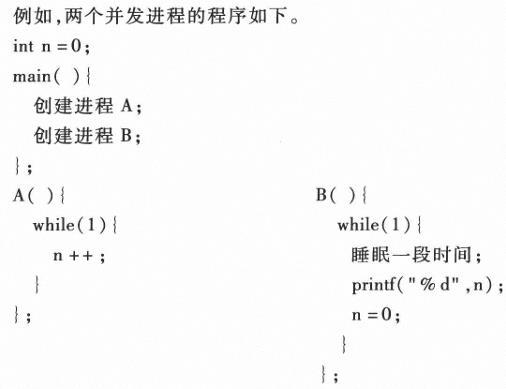

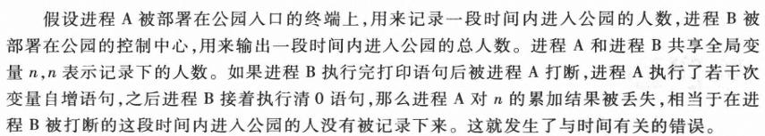

### 有人说,假设两个进程之间没有共享内存,则两者之间没有公共变量。这种说法准确吗?试说明原因。

- 如果只从用户空间考虑,这种说法是正确的。但从操作系统的角度来说并不准确。两个没有公共内存的用户进程可能同时(宏观)进入操作系统,并访问操作系统空间中的公共变量。

### 何谓忙式等待?是否还有其他方式的等待?比较它们之间的联系和差别。

- 不进入等待状态的等待称为忙式等待。
- 另一种等待方式是阻塞式等待,进程得不到共享资源时将进入阻塞状态,让出CPU给其他进程使用。
- 忙式等待和阻塞式等待的相同之处在于进程都不具备继续向前推进的条件,不同之处在于尽管CPU可能被剥夺,但处于忙式等待的进程不主动放弃CPU,因而是低效的;而处于阻塞状态的进程主动放弃CPU,因而是高效的。

### 与排队等待相比,忙式等待是否一定是低效的?为什么?

- 不绝对。如果进程切换所带来的系统开销比忙式等待时间还长,那么忙式等待更具有优势。

### 下列进程互斥方法中,哪些存在忙式等待问题?(1)软件:面包店算法;(2)硬件:“测试并设置”指令;(3)开关中断指令。

- (1)、(2)存在忙式等待问题。

### 为何开关中断进程互斥方法仅在单处理器系统中是有效的?

- 关中断方法不适用于多处理器系统,因为关中断只能保证处理器不由一个进程切换到另外一个进程,以防止多个进程并发地进入公共临界区域。但即使在关中断后,不同进程也可以在不同处理器上并行执行关于同一组共享变量的临界区代码。

### 在多处理器系统中,软件互斥方法是否有效?为什么?

- 依然有效。多处理器并行与单处理并发之间的差别在于程序交叉的粒度,单处理器环境中进程交叉发生在指令之间,多处理器环境中进程交叉发生在指令周期之间。由于纯软件互斥算法并不依赖特殊的硬件指令(如test_and_set),指令之间的交叉与指令周期之间的交叉结果相同。

### 共享变量属于操作系统空间还是用户进程空间？

- 共享变量既可能属于操作系统空间，也可能属于用户进程空间。对于前者，其临界区也属于操作系统空间，而对于后者，其临界区则属于用户进程空间。

### 画出临界区的框架，并介绍管理临界区的3个正确性原则

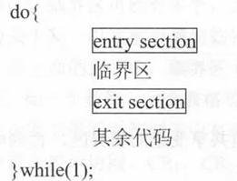

- 管理应当满足下面3个正确性原则。
  - ①互斥性原则。任意时刻至多只能有一个进程处于关于同一组共享变量的临界区之中。
  - ②进展性原则。当临界区空闲时，只有那些执行entry section和exit section的进程参与下一个进入临界区进程的决策，该决策不能被无限期地推迟。
  - ③有限等待性原则。一个请求进入临界区的进程应当在有限的等待时间内获得进入该临界区的机会。

### 进程互斥有哪些常见的软件实现方法？其中哪些方法存在忙式等待的问题？

- Dekker互斥算法
- Peterson互斥算法
- Lamport面包店算法
- Eisenberg-McGuire算法
- 这四种方法都存在忙式等待的问题（更正：原文作“其中Lamport面包店算法、Eisenberg-McGuire算法存在忙式等待的问题”。纯软件互斥算法里进不了临界区的进程都在循环中反复测试，Dekker 算法和 Peterson 算法也一样，见本章“下列进程互斥方法中，哪些存在忙式等待问题”一题）

### 进程互斥有哪些常见的硬件实现方法？其中哪些方法存在忙式等待的问题？

- 硬件提供存储障碍语句
- 硬件提供原子变量
- 硬件提供“测试并设置”指令
- 硬件提供“交换”指令
- 硬件提供“开关中断”指令
- 用“测试并设置”指令、“交换”指令实现互斥时，进不了临界区的进程在循环里反复测试，存在忙式等待；“开关中断”方法不存在忙式等待（整理补充：原稿没有回答后半问，依据是第3章“为什么说‘关中断’会影响系统的并发性”和本章“下列进程互斥方法中，哪些存在忙式等待问题”两题）。

### 列举常见的进程同步机制，简要介绍其思想

- 信号量与PV操作
  - 这种同步机制包括一种称为信号量类型的变量以及对于此种变量所能进行的两个操作，即P操作和V操作。信号量变量包括两个部分，即值部分 `s.value` 和指针部分 `s.queue`。P操作中调用 `asleep` 函数，执行此操作的进程的进程控制块进入队列 `s->queue` 的尾部，其状态由运行态转为等待态，系统转到处理器调度程序。V操作中调用 `wakeup` 函数，将队列 `s->queue` 头部进程的进程控制块由该队列中取出，并将其排入就绪队列，其状态由等待态转为就绪态。
- 条件临界区
  - 条件临界区（CCR）是一种高级的同步机制，其语法格式为 `region r when b do s`，其中，r为一组相关的共享变量，b为条件表达式，s为语句。进程能够进入条件临界区执行语句的条件是：没有其他进程处于与r相关的任何条件临界区内，并且进入条件临界区时b为真。
- 管程
  - 管程的基本思想是将共享变量以及对于共享变量所能执行的所有操作集中在一个模块中，一个操作系统或并发程序由若干个这样的模块所构成。由于一个模块通常比较短，模块之间联系清晰，提高了可读性，便于修改和维护，易于保证正确性。
- 会合
  - 在Ada语言中，一个任务可以有若干个入口，一个入口对应一段程序，一个任务可以调用另一个任务的入口。当一个任务调用另一个任务的入口，而且被调用者已经准备好接受这个调用时，便发生会合。当调用者发出调用请求，被调用者尚未准备好接受这个调用时，调用者等待；反之，当被调用者准备好接受调用，而当前尚无调用者时，被调用者等待，即先到达者等待后到达者，这就是会合的本质含义。

### 试分析临界区域的大小与系统并发性之间的关系

- 关于同一组变量的临界区域是不能并发执行的代码,临界区越大,并发性越差。因此,编写并发程序应尽量缩小临界区域范围。

### 设CR1是关于一组共享变量SV1的临界区,CR2是关于另外一组共享变量SV2的临界区,当进程P1进入CR1时,进程P2是否可以进入CR2?为什么?

- 可以。因为互斥是在变量级别上的,多个进程同时进入关于不同变量的临界区不会引起与时间有关的错误。

### Lamport面包店互斥算法是否会出现饿死的情况?

- 不会,该算法是公平的。假定系统中共有n个进程,每个想要进入临界区域的进程(线程)在最坏的情况下需要等待其他n-1个进程进入并离开临界区域之后才可获得进入临界区域的机会,因而存在(忙式)等待的上界。

### 由V操作唤醒的进程是否一定能够直接进入运行态?试举例说明

- 否。一般来说，唤醒是将进程状态由等待状态变成就绪状态，而就绪进程何时获得处理器则是由系统的处理器调度策略确定的。
- 如果采用抢占式优先级调度算法，并且被唤醒的进程是当前系统中优先级最高的进程，那么该进程将被调度执行，其状态变成运行态。如果该进程不是系统中优先级最高的进程或系统采用非剥夺式调度算法，那么该进程不会被调度执行，其状态将维持在就绪状态。

### 虽然管程是互斥进入的，但管程中定义的外部子程序必须是可再入的，试说明原因。

- 管程互斥是在变量级别的，同一管程类型可以有多个实例，而管程内部子程序只在管程类型定义时生成一套代码。为保障对不同管程变量的操作具有相同语义，管程外部子程序必须是可再入的。（更正：原文两处“可再入”都作“可载入”。）

### 管程与会合这两种同步机制之间的主要差别何在?

- 管程与会合都属于集中式结构化同步机制,但二者的实现机理完全不同。
- 管程是被动性语言成分,管程本身不能占有处理器,管程的外部子程序是由调用进程占有处理器来执行的。
- 会合是主动性语言成分,一个任务调用另一任务的入口时,入口代码是由被调用任务自己占有处理器执行的。

### 进程间因为独占资源的竞争产生的联系是什么关系？如何区分进程间的互斥与同步关系？

- 因竞争独占资源而产生的是互斥关系。
- 同步关系是进程间有着某种先后的执行顺序关联；互斥关系是不同进程对独占资源的占有产生的关系，当一个进程占用了独占资源，就会进入临界区，其他进程无法占用独占资源，当它退出临界区时，其他进程才能按照队列顺序来占用独占资源

### 进程间同步和互斥的含义各是什么？

- 同步：并发进程之间存在的相互制约和相互依赖的关系（《试题库》）。展开说，就是异步环境下的一组并发进程因直接制约而互相发送消息、互相合作、互相等待，使得各个进程按一定的速度执行，这种现象称为进程间的同步（《试题及答案》）。
- 互斥：若干进程共享一资源时，任何时刻只允许一个进程使用（《试题库》）。展开说，一组并发进程中的一个或多个程序段，因共享公有资源而必须以一个不允许交叉执行的单位执行，即不允许两个以上共享临界资源的并发进程同时进入临界区，这种现象称为互斥（《试题及答案》）。

### 如何理解“与时间有关的错误”，错误出现的原因，为什么会随机出现错误?

- 多个线程或者进程在读写一个共享数据时结果依赖于它们执行的相对时间的情形。
- 出现的原因就是因为代码的执行有先后，当两段代码同时对一个全局变量和文件进行修改时，由于代码执行时间的先后，这种错误往往是随机的，因为不确定是先读后写，还是先写后读，还是你改我读还是你读我改。

### 现实中，有身份证号码重复的情况，出现这种情况的原因？用操作系统思想说明

- 两个人同时申请身份证，在第一个人申请身份证时给一个身份证号A，访问共享的储存身份证的地方，判断该身份证号未重复，此时该身份证号还没有入库，就中断该进程，处理另一个人申请，由于两人信息非常相似且身份证号A还没有入库，给一个跟上一个人相同的身份证号，查重时没有查出来，因此两个人身份证号相同。出现与时间有关的错误。

### 信号量机制为什么能够避免出现与时间有关的错误？

- 对于信号量的操作是原语，不能被调度机制中断，从而避免了修改过程中由于被中断而引起与时间有关的错误。

### 信号量机制中的系统调用为什么要设为原语？

- 与时间有关的错误往往是由于对公共变量修改或判断前后被中断而引起的，而信号量本身也是一个公共变量，将对信号量的系统调用整个过程作为一个整体设置为原语，保证信号量的不可分割，才避免发生与时间有关的错误。

### 信号量机制的缺点

- P和V的操作散布在同步进程中的各处，操作不当容易造成死锁

### 管程机制中的活动进程指的是什么进程？为什么在管程中只能有一个活动进程？

- 活动进程：指的是处于就绪态或者是运行态的进程。
- 管程每次只允许一个进程进入，从而保证了对管程内共享变量的互斥访问（更正：原文说这样还能“避免死锁”。管程只保证互斥，嵌套调用管程或等待次序安排不当，照样可能死锁）。

### 管程机制相对于信号量机制的优缺点

- 优点：管程里同时只能有一个活动进程，互斥由管程自动保证，不会因为 P、V 操作散落各处、次序写错而出错，可靠性高；对共享数据的操作进行了封装，利于编程。（更正：原文作“避免死锁”“利用编程”，管程本身并不能避免死锁。）
- 缺点：不能并发，效率降低

### 管程机制能满足临界区使用规则吗？为什么？

- 能，因为管程中有且只有一个活动进程，而被阻塞的进程不访问临界区

### 画图说明管程的组成

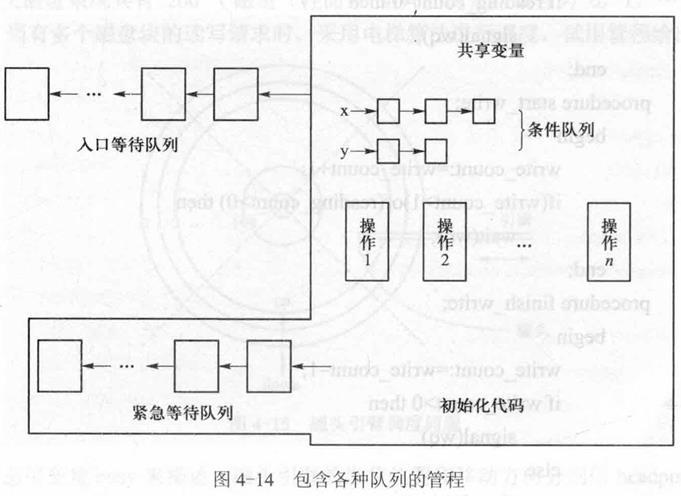

### 何谓进程通信？常见的进程通信方法有哪些？

- 进程通信是指进程之间的信息交换。
- 常见的进程通信方法有共享存储区、消息传递、共享文件（管道）。

（出自《试题及答案》，原稿只写了几个关键词，这里整理成句。）

## 第5章 死锁与饥饿

### 死锁有哪几种类型？

- 竞争资源引起的死锁
- 进程间通信引起的死锁
- 其他原因引起的死锁

### 何谓死锁？产生死锁的原因有哪些？

- 若系统中存在一组进程（两个或多个），它们中的每一个进程都占用了某种资源而又都在等待其中另一进程所占用的资源，这种等待永远不能结束，这种现象称为死锁。
- 另一种说法：死锁是指多个进程在运行过程中因争夺资源而造成的一种僵局，若无外力作用，这些进程都将无法再向前推进。
- 产生死锁的原因包括竞争资源和进程推进顺序不当。

（出自《试题及答案》。）

### 简述死锁的条件

- ①资源独占。一个资源在同一时刻只能被分配给一个进程。如果某一进程申请某一资源，而该资源正在被另外的某一进程所占有，则申请者需要等待，直到占有者释放该资源。
- ②不可剥夺。资源申请者不能强行地从资源占有者手中夺取资源，即资源只能由其占有者在使用完后自愿地释放。
- ③保持申请。进程在占有部分资源后还可以申请新的资源，而且在申请新资源的时候并不释放它已经占有的资源。
- ④循环等待。存在一个进程等待序列 {p1，p2，…，pn}，其中p1等待p2所占有的某一资源，p2等待p3所占有的某一资源，……，pn等待p1所占有的某一资源。

### 不让死锁发生的策略有哪些？

- 不让死锁发生的策略可以划分为两种：一种是静态的，称为死锁预防；另一种是动态的，称为死锁避免
- 所谓静态的，是指对于进程有关资源的活动按某种协议加以限制，如果所有进程都遵守此协议，即可保证不发生死锁；
- 所谓动态的，是指对于进程有关资源的申请命令加以实时检测，拒绝不安全的资源请求命令，以保证死锁不会发生。

### 常见的死锁预防策略有哪些策略？各自有什么特点？有什么缺点？

- 预先分配策略：采用预先分配策略，进程在运行前一次性地向系统申请它所需要的全部资源。如果系统当前不能满足进程的全部资源请求，则不分配资源，此进程暂不投入运行。如果系统当前能够满足进程的全部资源请求，则一次性地将所申请的资源全部分配给申请进程。这种策略有以下一些缺点：
  - ①资源利用率低。
  - ②进程在运行前可能并不知道它所需要的全部资源。
- 有序分配策略：采用这种策略，事先将所有资源类完全排序，即对每一个资源类赋予唯一的整数。进程必须按照资源编号由小到大的次序申请资源。也就是说，当进程不占有任何资源时，它可以申请某一资源类（如ri）中的任意多个资源实例。此后，它可以申请另一个资源类（如rj）中的若干个资源实例的充分必要条件是f(ri)<f(rj)。有序分配法不会发生死锁。有以下一些缺点：
  - 给资源类一个合理的编号比较困难；
  - 按编号申请资源增加了资源使用者即进程的负担；
  - 如果有进程违反了按编号申请的规定，则仍然有可能发生死锁；
  - 为了保证按编号申请的次序，暂不需要的资源也可能需要提前申请，增加了进程对于资源的占有时间。

### 简述饿死与死锁的联系与区别

- 联系：二者都是由于竞争资源而引起的
- 区别：
  - ①从进程状态考虑，死锁进程都处于等待态。忙式等待（处于运行态或者就绪态）的进程并非处于等待态，但是却有可能被饿死。
  - ②死锁进程等待永远不会被释放的资源，饿死进程等待会被释放但却不会分配给自己的资源，其等待时限没有上界（排队等待或忙式等待）。
  - ③死锁一定是发生了循环等待，而饿死则不然。这也表明通过资源分配图可以检测死锁存在与否，但却不能检测是否有进程饿死。
  - ④死锁一定涉及多个进程，而饥饿或被饿死的进程可能只有一个。

### 下面关于死锁问题的叙述,哪些是正确的,哪些是错误的?试说明判断原因。(1)参与死锁的所有进程都占有资源。(2)参与死锁的所有进程中至少有两个进程占有资源。(3)死锁只发生在无关进程之间。(4)死锁可以发生在任意进程之间。

- (1)是错误的,应该是参与死锁的所有进程都等待资源。
- (2)正确,参与死锁的进程至少有两个
- (3)错误,死锁也可能发生在相关进程之间。
- (4)正确,死锁既可能发生在相关进程之间,也可能发生在无关进程之间，即死锁可以发生在任意进程之间

### 什么叫饥饿?什么叫饿死?什么叫活锁?试举例说明之。

- 在一个动态系统中,资源请求与释放是经常发生的进程行为。对于每类系统资源,操作系统需要确定一个分配策略,当多个进程同时申请某类资源时,由分配策略确定资源分配给进程的次序。资源分配策略可能是公平的(fair),能保证请求者在有限的时间内获得所需资源;资源分配策略也可能是不公平的(unfair),即不能保证等待时间上界的存在。在后一种情况下,即使系统没有发生死锁,某些进程也可能会长时间等待。如果等待时间给进程推进和响应带来明显影响,则称发生了进程饥饿(starvation),当饥饿到一定程度的进程所赋予的任务即使完成也不再具有实际意义时，称该进程被饿死(starve to death)。
- 考虑一台打印机分配的例子。当有多个进程需要打印文件时,系统按照短文件优先的策略排序,该策略具有平均等待时间短的优点,似乎非常合理,但当短文件打印任务源源不断时,长文件的打印任务将被无限期地推迟,导致饥饿乃至饿死。
- 与饥饿相关的另外一个概念称为活锁(live lock),在忙式等待条件下发生的饥饿,称为活锁。例如不公平的互斥算法。

### 何谓银行家算法的保守性?

- 银行家算法的保守性是指银行家算法只给出了进程需要资源的最大量,而所需资源的具体申请和释放顺序仍是未知的,因而银行家只能往最坏处设想。

### 能否给出避免死锁的充要性算法?为什么?

- 目前关于避免死锁的算法,如银行家算法是充分性算法,即确保系统时刻处于安全状态,这是在系统已知每个进程所需资源最大量的条件下可以给出的最好结果。
- 如果系统不仅知道每个进程所需资源的最大量,而且知道进程有关资源的活动序列,在这个更强的条件下,则可以给出避免死锁的充要性算法(读者可以证明),但其复杂度是很高(NP完全)的。而且由于程序中分支和循环的存在,事先给出进程有关资源的命令序列一般是不可能的。

### 进程是否会因为竞争处理器资源而发生死锁?为什么?

- 不会,因为处理器资源是可剥夺的,参与死锁的进程都处于等待状态,这种等待不包括对处理器的等待,等待处理器的进程处于就绪状态。

### 饥饿进程可能处于什么状态?试举例说明之。

- 忙式等待的饥饿进程处于“就绪”或“运行”状态,例如改进之前的test_and_set互斥算法。排队等待的饥饿进程处于“等待”状态,例如利用经典信号量和PV操作实现的具有优先级的PP操作与VV操作。

### 有人对哲学家就餐问题的描述作了如下修改:哲学家中既有右撇子,又有左撇子。右撇子饥饿时先取右边的叉子,后取左边的叉子;左撇子饥饿时先取左边的叉子,后取右边的叉子。试回答:是否有死锁?是否有饥饿?为什么?

- (1)没有死锁,因为破坏了循环等待的条件;(2)没有饥饿,把叉子作为资源用初值为1的信号量管理,申请时执行P操作,释放时执行V操作,饥饿的进程终能获取左、右两把叉子,并进食。

### 为什么将所有资源按类型赋予不同的序号，并规定所有的进程按资源号递增的顺序申请资源后，系统便不会产生死锁?

- 此时系统不会发生死锁的原因是死锁发生的必要条件之一（循环等待条件）不可能成立。因为多个进程之间只可能存在占据较低序号资源的进程等待占据较高序号资源的进程释放资源的情况，但不可能存在反向的等待，因此它们之间不会形成循环等待链。

## 第6章 存储管理

### 存储管理的基本任务是什么？

- 按本课程教材，存储管理的任务有五项：存储分配、存储共享、存储保护、存储扩充、地址映射。
- 《试题库》的答法：
  - （1）管理内存空间；
  - （2）进行虚拟地址（或：逻辑地址）到物理地址的转换；
  - （3）实现内存的逻辑扩充；
  - （4）完成内存信息的共享和保护。

### 地址映射流程图

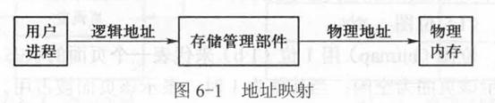

### 内存有哪些分区方法？实际系统中一般怎么分区？

- 静态分区与动态分区
  - 静态分区：在系统运行之前就将内存空间划分为若干个区域，通常，分配给进程的内存区域可能比进程实际所需要的区域长。
  - 动态分区：在系统运行的过程中划分内存空间，通常，系统可以按照进程所需存储空间的大小为其分配恰好满足要求的一个或者多个区域。
- 等长分区与异长分区
  - 等长分区：等长分区是指将存储空间划分为若干个长度相同的区域。
  - 异长分区：是指将存储空间划分为若干个长度不同的区域
- 在实际系统中，静态分区与等长分区通常结合在一起，构成静态等长分区的分配形式；动态分区与异长分区通常结合在一起，构成动态异长分区的分配形式。

### 静态等长分区的分配适用于什么管理方式？有哪些分配与去配算法？各自有什么特点？

- 这种存储分配形式常用于页式存储管理方式与段页式存储管理方式中。
- 常用位图、空闲页表、空闲页链
  - 位图（bitmap）用1位（1b）来代表一个页面的状态，规定当其值为0时，表示该页面为空闲；当其值为1时，表示该页面被占用。
  - 空闲页表（free page table）中包括两个栏目：首页号和页数。若干个连续的空闲页作为一组登记在空闲页表中。采用此种分配方法能使一个进程的若干个页面尽量连续。
  - 将所有的空闲页面连成一个空闲页链（idle page link )，分配时可以取链头的页，去配时可以将被释放的页面连入链头。此种方法适用于内存页面的分配，但是对于外存页面的分配因分配和去配均需执行一次数据传输，速度较慢。

### 为什么空闲页链不适合管理外存？

- 空闲页链的链接指针存放在空闲页自身之中。外存要分配几个空闲块时，先读取 head 指向的第一个空闲块，分配下一个空闲块时还要把当前块的内容读入内存才能找到第二个空闲块的地址，每分配或释放一块都要访问一次外存，速度慢。

### 动态异长分区的分配适用于什么管理方式？有哪些分配与去配算法？各自有什么特点？

- 这种存储分配形式常用于界地址存储管理方式与段式存储管理方式中
- 系统中需要一张表，称为空闲区域表，表中记录着所有当前未被进程占用的空闲区域
- 算法见下题

### 描述最先适应算法FF的实现机制与其优缺点

- 最先适应算法是指对于存储申请命令，选取满足申请长度要求且起始地址最小的空闲区域。在实现时，可以将系统中所有的空闲区域按照起始地址由小到大的次序依次记录于空闲区域表中。当进程申请存储空间时，系统由表的头部开始查找，选取满足要求的第一个表目。如果该表目所对应的区域长度恰好与所申请的区域长度相同，则将该区域全部分配给申请者，否则将该区域分割为两部分，一部分的长度与所申请的长度相同，将其分配给申请者；另一部分的长度为原长度与分配长度之差，仍将其记录于空闲区域表中。
- 该算法的优点是尽量使用低地址空间，因而在高地址空间可能形成较大的空闲区域。对于一个较大空间的请求，可望在存储高地址空间得到满足。
- 该算法的缺点是可能分割较大的空闲区。

### 描述下次适应算法NF的实现机制与其优缺点

- 下次适应算法自下次分配空闲区域的下一个位置开始，选取第一个可满足的空闲区域。在实现时，设置一个循环查找指针，开始时指向表头，每次分配从该指针处开始查找（如果找到表尾，则将指针置成表头）第一个遇到的可满足区域。分配后将指针调整为所分配区域的下一个区域。
- 该算法的优点是空闲区域分布和分配更均匀
- 缺点是可能分割大空间区域

### 描述最佳适应算法BF的实现机制和其优缺点

- 最佳适应算法在分配时取满足申请要求且长度最小的空闲区域。在实现时，将系统中的所有空闲区域按照长度由小到大的次序依次记录在空闲区域表中，当进程申请存储空间时，系统由表的头部开始查找，选取满足条件的第一个表目
- 该算法的优点是尽量不分割大的空闲区域
- 缺点是可能会形成很小以至以后无法利用的空闲区域，即碎片

### 描述最坏适应算法WF的实现机制和其优缺点

- 最坏适应算法在分配时选取满足申请要求且长度最大的空闲区域，在实现时，将系统中的所有空闲区域按照长度由大到小的次序依次记录在空闲区域表中，当进程申请存储空间时，系统由表的头部开始查找，选取满足条件的第一个表目
- 该算法的优点是可以避免形成碎片
- 缺点是分割大的空闲区域，当遇到较长存储申请命令时，无法满足要求的可能性较大

### 简述FF、NF、BF、WF算法之间的异同点

（原稿这里只写了“根据上面的回答总结吧”，下面是整理补充。）

- 相同点：四种算法都用于动态异长分区，都用空闲区域表记录空闲区，分配时都可能分割空闲区，去配时都要与相邻空闲区合并，都会产生碎片。
- 不同点在于空闲区域表的排列次序和选哪一块：

| 算法 | 空闲区域表排序 | 选哪一块 | 优点 | 缺点 |
|---|---|---|---|---|
| FF 最先适应 | 起始地址递增 | 第一个够大的 | 尽量用低地址，高地址保留大空闲区 | 可能分割大空闲区 |
| NF 下次适应 | 起始地址递增，加循环查找指针 | 从上次分配处往后第一个够大的 | 空闲区分布和分配更均匀 | 可能分割大空闲区 |
| BF 最佳适应 | 长度递增 | 够大的里面最小的 | 尽量不分割大空闲区 | 容易留下很小的碎片 |
| WF 最坏适应 | 长度递减 | 最大的 | 不容易形成碎片 | 大空闲区被分割，大请求难满足 |

### 画图解释什么是紧凑（如何解决碎片问题）

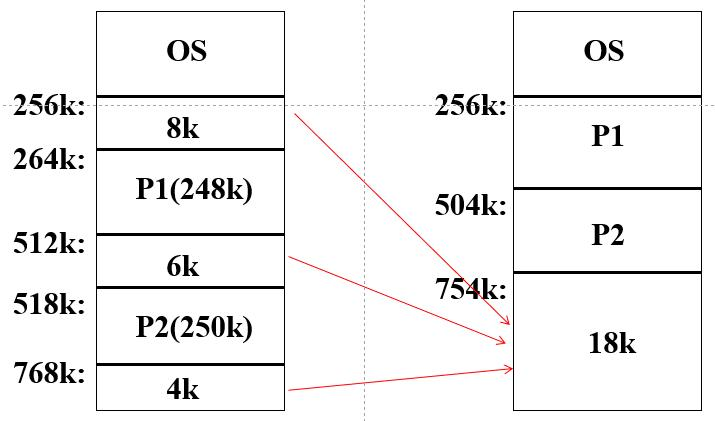

- 紧凑：移动占用区域，使所有空闲区域连成一片

### 介绍一下单一连续区存储管理

- 单一连续区（single contiguous region）存储管理又称单对界存储管理方式。一个进程在内存空间的地址由两个参数决定：进程起始地址和长度，称为一个对界。
- 内存空间采用动态异长分区方法
- 一个进程空间由连续的区域构成。假设进程的长度为 l，则其逻辑地址为 0～l-1。
- 一个进程在内存中占有一个连续的区域，假设进程的长度为 l，在内存中的起始地址为 b，则其物理地址范围为 b～b+l-1。
- 为实现存储分配和地址映射，需要如下的表目。
  - ①内存分配表。用于记录内存中所有已经被分配的区域。该表有时可以省略，此时各个分配区域分别登记在占有进程的进程控制块中。
  - ②空闲区域表。用于记录内存中所有尚未分配的区域。
- 为了加快地址映射的速度，硬件应当提供以下两个寄存器。
  - ①首址寄存器。此寄存器整个系统有一个，用于保存正在运行进程的起始地址。
  - ②限长寄存器。此寄存器整个系统有一个，用于保存正在运行进程的长度。

### 画图描述单对界存储管理方式中地址映射的步骤

1. 由程序确定逻辑地址a。
2. 由逻辑地址a与限长寄存器的内容l相比较，判断是否满足 a<l。如果不满足则为越界，发生越界中断。
3. 由逻辑地址a与首址寄存器的内容b相加得到物理地址 b+a。

（原稿第2步的不等式公式缺失，按上下文补。）

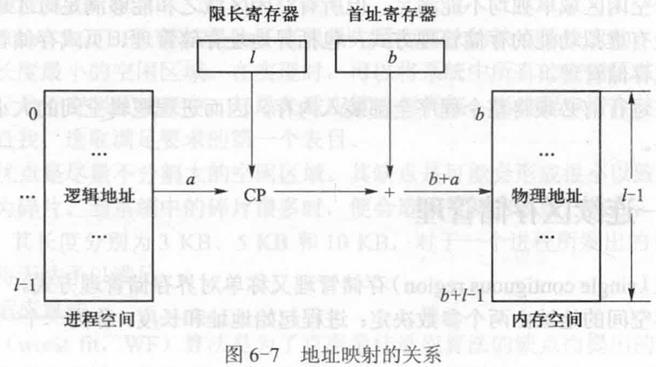

### 什么是双对界？和单对界的区别在哪里？如何实现双对界？

- 在单一连续区存储管理中，一个进程在内存空间的地址由两个参数决定：进程起始地址和长度，称为一个对界，单对界限制一个进程在内存中只占有一个连续区域，双对界则允许一个进程在内存中占有两个连续的区域。这两个区域一个可用于保存代码，另一个可用于保存数据，其中代码区域可以被多个进程所共享，数据区域则为进程所独享。
- 为实现双对界存储管理，硬件需要提供两对寄存器：代码区域首址寄存器和限长寄存器，数据区域首址寄存器和限长寄存器。取指令时硬件决定使用前一组寄存器，取数据时硬件决定使用后一组寄存器。

### 简述什么是内存的覆盖和交换技术？两者有什么区别？

- 交换又称换入换出或者滚入滚出，是指进程在内存空间与外存空间之间的动态调度，它是缓解内存空间使用矛盾的一种有效方法。
- 覆盖是将较大程序装入较小进程空间的一种技术。其思想是只将全局代码和数据静态地放在内存中，其他部分则分阶段地动态装入，后装入的对象重复使用以前对象所占用的空间，即覆盖以前的对象，这些动态装入的成分也被称为覆盖。
- 两者的区别主要有：交换技术由操作系统自动完成，不需要用户参与，而覆盖技术需要专业的程序员给出作业各部分之间的覆盖结构，并清楚系统的存储结构；交换技术主要在不同作业之间进行，而覆盖技术主要在同一个作业内进行；另外覆盖技术主要在早期的操作系统中采用，而交换技术在现代操作系统中仍具有较强的生命力。
- 《试题库》对交换的说法：在多道系统中，交换是指系统把内存中暂时不能运行的某部分作业写入外存交换区，腾出空间，把外存交换区中具备运行条件的指定作业调入内存。交换是以时间来换取空间，减少交换的信息量和时间是设计时要考虑的问题。

### 举例解释覆盖技术

- 如图，一个包括4遍扫描的编译程序，运行时既可以对应4个进程，也可以通过覆盖由一个进程完成。一个进程完成4遍扫描，将符号表等公共数据作为共享成分为其静态分配空间，扫描程序则动态装入，每次扫描结束时转覆盖驱动程序装入下一次扫描代码

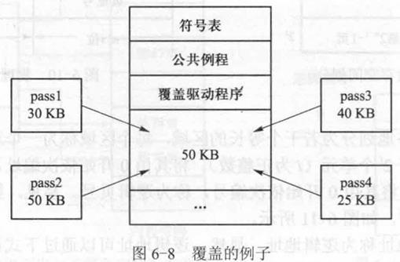

### 介绍页式存储管理

- 页式（Paging，也称分页）存储管理方式允许一个进程占有内存空间中的多个连续区域，而且这些区域的长度相同，因而采用静态等长存储分配方法，不会产生碎片。
- 内存空间被静态地划分为若干个等长的区域，每个区域称为一个物理页框
- 每个页框通常有 $2^i$ 个单元（i为正整数）。将其由0开始依次编址，称为页内地址。
- 设内存的容量为 $2^m$，则共有 $2^{m-i}$ 个页框。将所有页框由0开始依次编号，称为页框号。易见，第k个页框的起始地址（即首址）为 $k\times 2^i$。（这两行的公式原稿缺失，按上下文补。）
- 将页框号作为高位,页内地址作为低位,即可得到物理地址

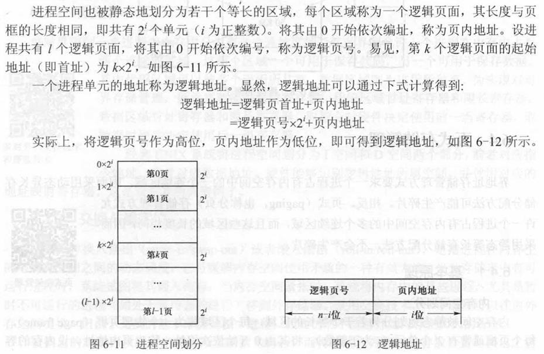

- 进程的逻辑页面是连续的,但是这些逻辑页面所对应的页框却不一定连续。
- 为了实现逻辑地址与物理地址之间的转换,系统中需要以下两个表目。
  - 页表。该表用于记录进程的逻辑页面与内存页框之间的对应关系。
  - 总页表。该表用于记录页框的使用情况
- 所需寄存器：页表首址寄存器、页表长度寄存器、一组联想寄存器（快表）

### 描述界地址存储管理方式与页式存储管理方式的异同点

- 界地址存储管理方式要求一个进程占有内存空间中的一个连续区域，因而采用动态异长存储分配方法可能产生碎片。相反，页式存储管理方式允许一个进程占有内存空间中的多个连续区域，而且这些区域的长度相同，因而采用静态等长存储分配方法，不会产生碎片。

### 描述页式存储管理方式中地址映射的步骤

- 地址映射需要将逻辑地址转换成物理地址，即完成如下映射关系：

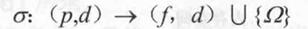

- 其中，p为逻辑页号，d为页内地址，f为页框号。
- 地址映射的步骤如下。
  1. 由指令产生逻辑地址 (p, d)。
  2. 由逻辑页号p查快表得到页框号f。如果找到，由页框号f与页内地址d合并得到物理地址 (f, d)。
  3. 如果找不到：由逻辑页号p与页表长度寄存器中的内容l相比较，判断是否满足 p<l，如果不满足则为越界，发生越界中断；由逻辑页号p与页表首址寄存器中的内容b查页表得到页框号f；由页框号f与页内地址d合并得到物理地址 (f, d)；将 (p, f) 送入快表，如果此时快表已满，则按置换算法淘汰一个。

（原稿这几步的次序在导出时打乱了，不等式 p<l 也缺失，这里按页式地址映射的流程重排。）

### 在许多情况下，允许进程的逻辑页面不连续会带来更大的方便。例如，在多执行流进程中，每个线程都需要一个目态栈，要求栈在逻辑上连续且具有可伸缩性。该怎么实现？

- 系统为每个线程分配充足的逻辑页面，但是在物理上只有真正用到的那些逻辑页面才有物理页框与之相对应。在实现时，在页表中增加一个“有效位”，当该位为1时表示有效，即有对应的页框；而当该位为0时表示无效，即尚未分配页框。对有效位为0的逻辑页面的访问将导致物理页框的动态分配。

### 画图举例解释多级页表

- 对于长度为 $2^{32}$ 的逻辑地址空间，页面长度定义为 $2^{12}$，则一个进程最多可以拥有 $2^{20}$ 个页面。也就是说，系统需要提供长度为 $2^{20}$ 的连续页表存储区，这是很困难的。为此，常将页表分为多级进行存放，例如对于上述例子，将 $2^{20}$ 分为 $2^{10}\times 2^{10}$ 两级，一级称为外页表，另一级称为内页表，如图所示。此时，外页表和内页表的长度都在 $2^{10}$ 以内。（原稿公式缺失，数值取自本章“为何引入多级页表”一题。）

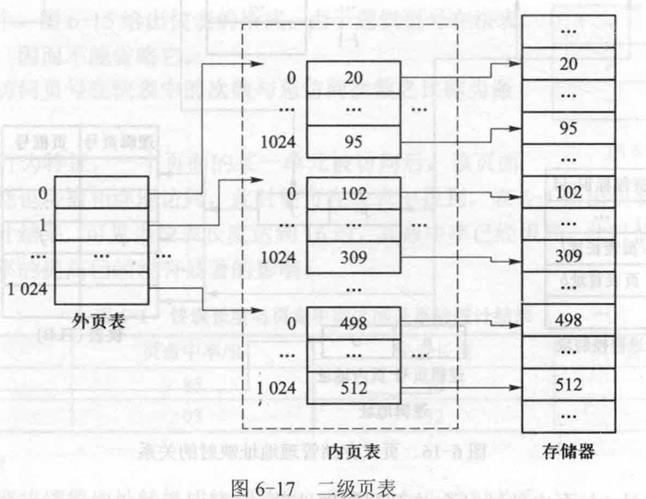

### 什么是反置页表？他与传统页表的差别在哪里？有什么明显的问题？如何解决？

- 传统页表是面向进程虚拟空间的，即对应进程的每个逻辑页面设置一个表项，当进程的地址空间很大时，页表需要占用很多存储空间，造成浪费。与经典页表不同，反置页表是面向内存物理页框的，即对应内存的每个物理页框设置一个表项，表项的序号就是物理页框号f，表项的内容则为进程标识Pid与逻辑页号p的有序对。系统只需设置一个反置页表，为所有进程共用。
- 反置页表的一个明显问题是速度：对反置页表的顺序搜索需要多次访问内存，对于不存在的页甚至需要查到表尾。
- 为提高访问速度，采用杂凑（hash，也称散列、哈希）技术，在反置页表中增加冲突计数和空闲标志。在进行地址映射时，由hash ( pid , p）计算得到反置页表入口地址，从该入口地址开始向下探查找到对应的表项，位移f为对应的页框号

### 简述页式存储管理方式和段式存储管理方式的异同点

- 在页式存储管理中，分页对于用户是透明的，一个进程由若干个页构成，所有页的长度相同；在段式存储管理中，分段对于用户是可见的，一个进程由若干个段构成，各个段的长度可以不同，一个段恰好对应一个程序单位。
- 分页是出于系统管理的需要，分段是出于用户应用的需要。一条指令或一个操作数可能会跨越两个页的分界处，而不会跨越两个段的分界处。
- 页大小是系统固定的，而段大小则通常不固定。
- 逻辑地址表示：分页是一维的，各个模块在链接时必须组织成同一个地址空间；分段是二维的，各个模块在链接时可以每个段组织成一个地址空间。
- 通常段比页大，因而段表比页表短，可以缩短查找时间，提高访问速度。
- 都是为进程分配内存空间的存储管理方式

### 介绍段式存储管理

- 内存空间被动态地划分为若干个长度各异的区域，每个区域称为一个物理段。每个物理段在内存中有一个起始地址，称为段首址。将物理段中的所有单元由0开始依次编址，称为段内地址。对于一个长度为m的段来说，其段内地址依次为 0, 1, …, m-1。内存中一个单元的位置被称为物理地址。物理地址可以通过公式计算得到：物理地址 = 段首址 + 段内地址（公式原稿缺失，整理补充）。
- 进程空间被静态地划分为若干个长度各异的区域，每个区域称为一个逻辑段。将一个逻辑段中的所有单元由0开始依次编址，称为段内地址。对于一个长度为n的段来说，其段内地址依次为 0, 1, …, n-1。每个逻辑段具有一个符号名字，称为段名。将一个进程的所有逻辑段由0开始依次编号，称为段号。对于一个由l个逻辑段所构成的进程来说，其段号依次为 0, 1, …, l-1。
- 通常在源程序中使用段名，而在编译（汇编）、连接后段名被转换为段号，因而操作系统以段号来区分进程的各个逻辑段。
- 源程序中的地址信息由两个部分构成，即段名和段内入口名。这是一个二维地址，称为程序地址。编译（汇编）后的地址信息也由两个部分构成，即段号和段内地址，这也是一个二维地址，称为逻辑地址
- 进行地址映射后的地址信息只由单一部分构成，即段的起始地址（段首址）与段内地址之和，这是一个一维地址，即物理地址。
- 进程的一个逻辑段与内存的一个物理段相对应。一个进程的多个逻辑段可存放于内存中若干个不相连的物理段中。在物理上，进程的段内地址是连续的，而段与段之间则可以不连续。
- 为了实现地址映射，系统中需要保存若干个表目，其中包括：
  - ①段表。该表用于记录段号与段首址之间的关系。
  - ②空闲表。用于记录并管理内存中的空闲区域。
- 为了加快地址映射的速度，硬件通常提供以下3组寄存器。
  - ①段表首址寄存器。用于保存正在运行进程的段表的首址。
  - ②段表长度寄存器。用于保存正在运行进程的段表的长度。
  - ③一组联想寄存器（快表）。用于保存正在运行进程的段表中的部分项目，即当前正在访问的段所对应的项目。

### 描述段式存储管理方式中地址映射的过程

- 地址映射需要将逻辑地址转换成物理地址，即完成以下映射关系：

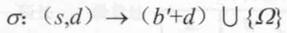

- 其中，s为段号，d为段内地址，b'为段的起始地址。当逻辑地址中的s或d越界时，地址映射没有意义（原稿这里表示“无意义”的符号缺失）。
- 地址映射的步骤如下。
  - ①由指令产生逻辑地址（s，d）。
  - ②由段号s查找快表得到段首址b'和段长l'。
  - 如果找不到：
    - 将段号s与段表长度寄存器的内容l相比较，判断是否满足 s<l。如果不满足，则为越界，发生越界中断。
    - 由段号s与段表首址寄存器的内容b查找内存段表得到段首址b'和段长l'。
    - 将（s，b'，l'）送入快表。如果此时快表已满，则按照置换算法淘汰一个。
  - ③将段内地址d与段长l'相比较，判断是否满足 d<l'。如果不满足，则为越界，发生越界中断。
  - ④由段首址b'和段内地址d相加得到物理地址 b'+d。

（原稿两处不等式缺失，并且把“得到物理地址”在找不到快表的分支里写了一遍，这里按段式地址映射的流程整理。）

### 简述什么是段的共享

- 一个进程的段号是连续的，而段与段之间却不一定连续。如果某一进程的一个段号 s1 与另一进程的一个段号 s2 对应同一段首址和段长，即可实现段的共享。（段号符号原稿缺失，按上下文补。）

### 存储管理的主要功能是什么？

- 存储管理的主要功能是解决多道作业的主存空间的分配问题。主要包括：
  - （1）内存区域的分配和管理：设计内存的分配结构和调入策略，保证分配和回收。
  - （2）内存的扩充技术：使用虚拟存储或自动覆盖技术提供比实际内存更大的空间。
  - （3）内存的共享和保护技术：除了被允许共享的部分之外，作业之间不能产生干扰和破坏，须对内存中的数据实施保护。

### 为什么分段技术比分页技术更容易实现程序或数据的共享？

- 每一段在逻辑上是相对完整的一组信息，分段技术中共享信息是在段一级出现的。因此，任何共享的信息可以单独作一个段，同样段中所有内容就可以用相同的方式进行使用，从而规定相同的使用权限；
- 而页是信息的物理单位，在一个页面中可能存在逻辑上互相独立的两组或更多组信息，都各有不同的使用方式和存取权限。
- 因此，分段技术较分页技术易于实现程序或数据的共享。

### 举例说明存储管理中地址重定位的概念

- 如图-1所示，作业J的逻辑地址空间是0到1KB，而分配给该作业物理存储空间是2KB到3KB。图中的指令“LOAD 1,500”装入内存时，必须对相应的地址进行变换，实际执行的指令变换为“LOAD 1,500+2K”。

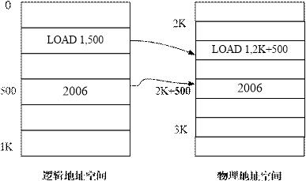

### 为什么要引入动态重定位？如何实现？

- 程序放在不连续的实际物理空间中，要进行逻辑地址到物理地址的转换，实现动态重定位
- 一般需要页式存储管理，页式存储管理用的不是寄存器，使用的是称为page table 的数据结构。page table 记录了所有逻辑地址到物理地址的转换信息，进程切换的时候需要刷新硬件上的 page table
- 整理补充：原答案只讲了页表。以界地址存储管理为例，动态重定位靠硬件的首址（基址）寄存器和限长寄存器实现：程序装入内存时不修改其中的地址，执行时每访问一个逻辑地址a，硬件先检查 a<l，再算出物理地址 b+a；进程切换时把这两个寄存器换成上升进程的值。页式、段式管理中，页表、段表起的是同样的作用。

（`简答题.pdf` 把这道题放在第7章，这里挪到第6章，和地址重定位放在一起。）

### 考虑在下述存储管理方式中,进程空间和逻辑空间的编址情况。(1)界地址存储管理方式,进程空间的首地址。(2)页式存储管理方式,进程空间的首地址。(3)段式存储管理方式,进程空间各段的首地址。(4)段页式存储管理方式,进程空间各段的起始地址。

- (1)界地址存储管理方式,进程空间的首地址从0开始编址;
- (2)页式存储管理,进程空间的首地址从0开始编址;
- (3)段式存储管理,进程空间各段的首地址从0开始编址;
- (4)段页式存储管理,进程空间各段的起始地址从0开始编址。

### 页式、段式、段页式存储管理方式各有哪些针对越界的检查?

- (1)页式:逻辑地址的形式为(p,d),其中逻辑页号p可能越界,意味着访问不存在的页面,检查要求为0≤p≤l-1,其中l为页表长度寄存器的内容;
- (2)段式:逻辑地址的形式为(s,d),s和d都可能越界,s越界意味着访问不存在的段,d越界意味着访问段内不存在的单元。检查要求为0≤s≤l-1,0≤d≤l'-1,其中l为段表长度寄存器的内容,l'为段表或快表中段长的内容;
- (3)段页式:逻辑地址的形式为(s,p,d),其中段号s和段内逻辑页号p可能越界,s越界意味着访问不存在的段,p越界意味着访问段内不存在的页,检查要求为0≤s≤l-1,0≤p≤l'-1,其中l为段表长度寄存器的内容,l'为段表中页表长度的内容。

### 对于以下存储管理方式来说,进程的逻辑地址形式如何?其进程地址空间各是多少维的?(1)页式;(2)段式;(3)段页式。

- (1)页式存储管理中,进程地址空间是一维的;
- (2)段式存储管理中,进程地址空间是二维的;
- (3)段页式存储管理中,进程地址空间是二维的。

### 在页式存储管理中,页的划分对用户是否可见?在段式存储管理中,段的划分对用户是否可见?在段页式存储管理中,段的划分对用户是否可见?段内页的划分对用户是否可见?

- (1)在页式存储管理中,分页对于用户是透明的,一个进程由若干个页构成,所有页的长度相同;
- (2)在段式存储管理中,分段对于用户是可见的,一个进程由若干个段构成,各个段的长度可以不同,一个段恰好对应一个程序单位;
- (3)在段页式存储管理中,段的划分对用户是可见的,段内页的划分对用户是透明的,一个段由若干个页构成,所有页的长度相同。

### 为何引入多级页表?多级页表是否影响指令执行速度?

- 早期的内存空间和进程空间都比较小,一个进程的页表长度也较小,可以在内存中分配一个连续的存储区域保存进程的页表。但随着内存空间和进程空间的快速增长,页表越来越大,单级页表的存放遇到困难。例如,对于长度为 $2^{32}$ 的逻辑地址空间,页面长度定义为 $2^{12}$(4KB),则一个进程最多可以拥有 $2^{20}$ 个页面,也就是说,系统需要提供长度为 $2^{20}$ 的连续页表存储区,这是困难的。因此常将页表分为多级进行存放。例如,对于上述例子,将 $2^{20}$ 分为 $2^{10}\times 2^{10}$ 两级,一级称为外页表,另一级称为内页表,此时外页表和内页表的长度都在 $2^{10}$ 以内。
- 可以很自然地把二级页表扩展为多级页表。显然,多级页表会降低地址映射的速度,但通过快表仍可以将效率保持在合理的范畴内。例如,对于四级页表,假定快表的命中率为98%,快表与内存的访问时间分别为20 ns和100 ns,有效访问时间为EAT=98%×(20+100)+2%×(20+500)=128(ns)，额外的开销是128-100=28 ns。

### 与传统页表相比,倒置页表有什么优势?

- 传统页表是面向进程虚拟空间的,即对应进程的每个逻辑页面设置一个表项,当进程的虚拟地址空间很大时,页表需占用很多的存储空间,造成浪费。与经典页表不同,倒置页表是面向内存物理页框的,即对应内存的每个物理页框设置一个表项,表项的序号就是物理页框号f,表项的内容则为进程标识pid与逻辑页号p的有序对。系统只需设置一个倒置页表,为所有进程所共用。

### 允许进程空间的逻辑页号不连续所带来的好处是什么?

- 可以给同一进程内的多个线程预留足够的堆栈空间,而又不浪费实际的内存页框。

### 试比较段式存储管理与页式存储管理的优点和缺点。

- 页式存储管理的优缺点是:
  - (1)静态等长存储分配简单,有效地解决了内存碎片问题;
  - (2)共享和保护不够方便。
- 段式存储管理的优缺点是:
  - (1)动态异长存储分配复杂,存在碎片问题;
  - (2)共享与保护方便;
  - (3)可以实现动态连接和动态扩展。

### 试举例说明段长动态增长的实际意义。

- 允许段长动态增长对于那些需要不断增加或改变新数据或子程序的段来说很有好处。
- 例如,分配给进程的栈空间大小通常预先无法准确估计,若分配过少可能不够用,分配过多则会造成浪费。在栈可以动态增长的情况下,系统开始可以为进程分配一个基本长度的栈空间,这个长度浪费很小。若进程运行时发生栈溢出,通过中断可以进行动态扩展。

### 在段式存储管理中,段的长度可否大于内存的长度?在段页式存储管理中又如何呢?

- 在段式存储管理中,段的长度不能大于内存的长度,因为一个独立的段占用一段连续的内存空间,内存分配是以段为单位进行的,如果一个段的长度大于内存的长度,那么该段将无法调入内存。在段页式存储管理中,段的长度可以大于内存的长度,因为内存分配的单位是页,一个段内逻辑上连续的页面,可以分配到不连续的内存页面中,不要求一个段的所有逻辑页面都进入内存。

### 共享段表的用途何在?

- 共享段表的用途主要有如下两个:
  - (1)用来寻找共享段:通过根据进程首次访问某段的名称在共享段表中查找,可以得知该段是否已在内存中;
  - (2)确保一个共享段只有一组描述信息:共享段的地址、长度等信息在共享段表中仅记录一次,防止在多个进程段表中重复登记所带来的维护困难。

### 具有二级页表的页式存储管理与段页式存储管理有何差别?

- 具有二级页表的页式存储管理的地址空间依然是一维的,二级页的划分对于进程来说都是透明的。而段页式存储管理的地址空间是二维的,段的划分用户能感觉到。

### 何谓请调?何谓预调?为何在预调系统中必须辅以请调?

- 所谓请调是当页故障发生时进行调度,即当被访问页面不在内存时由动态调页系统将其调入内存。显然,采用纯请调策略,被移入内存的页面一定会被用到,即不会发生无意义的页面调度。但是,请调也有一个缺点:
  - 从缺页中断发生到所需页面被调入内存,这期间对应的进程必须等待,这样将会影响进程的推进速度。
- 预调也称先行调度。是在页故障发生前进行调度,即在一个页面即将被访问之前就由动态调页系统将其调入内存。显而易见,预调可以节省进程因页故障而等待的时间。预调通常根据程序的顺序行为特性而作出:如某进程当前正访问第12页,则接下来很可能会访问第13页、第14页,此时可将第13页甚至第14页预先调入内存。这样当该进程访问第13页以至第14页时它们已经在内存中,不会发生缺页故障,从而提高进程的推进速度。
- 预调不一定是百分之百准确的。由于程序中存在转移语句,第13页用完后可能需要访问第10页,而该页目前可能不在内存中。也就是说,预先调入的页面可能有的未被用到,预先未调入的页面可能有的会被用到。当访问到预先未调入内存的页面时,仍会发生缺页中断。因而,在采用预调的系统中,必须辅以请调的功能。

### 解释下列与存储管理有关的名词：

- 地址空间与存储空间
  - 目标程序所在的空间称为地址空间，即程序员用来访问信息所用的一系列地址单元的集合；存储空间是指主存中一系列存储信息的物理单元的集合。
- 逻辑地址与物理地址
  - 在具有地址变换机构的计算机中，允许程序中编排的地址和信息实际存放在内存中的地址有所不同。逻辑地址是指用户程序经编译后，每个目标模块以0为基地址进行的顺序编址。逻辑地址又称相对地址。物理地址是指内存中各物理存储单元的地址从统一的基地址进行的顺序编址。物理地址又称绝对地址，它是数据在内存中的实际存储地址。
- 虚地址与实地址
  - 虚地址同逻辑地址，实地址同物理地址。
- 地址重定位
  - 重定位是把逻辑地址转变为内存的物理地址的过程。根据重定位时机的不同，又分为静态重定位（装入内存时重定位）和动态重定位（程序执行时重定位）。
