# 简答题精编（第7-9章）

整理自 `../操作系统（by陈广广）/简答题.pdf`，并合并了 `简答题/《操作系统》试题库-简答题.doc`、`简答题/操作系统简答题试题及答案.doc` 里的题目（`简答题/简答题整理.pdf` 和后者内容相同）。

题目按章排列，顺序基本沿用 `简答题.pdf`。几份资料里重复的题只留一道，答案取最完整的一份，其他资料多出来的要点接在后面，注明《试题库》或《试题及答案》。标“更正”的是原答案有错的地方，标“整理补充”的是原稿缺失、整理时补上的内容。背的时候先看每题的要点，再对照 `01`～`09` 各章笔记理解。

## 第7章 虚拟存储管理

### 内存空间管理方式存在什么问题？有什么缺点？

- 问题：当一个参与并发执行的进程运行时，其整个程序必须都在内存中
- 缺点：假若一个进程的程序比内存可用空间还大，则该程序无法运行；由于程序的局部特性，一个进程在运行的任意一个阶段只需使用所占存储空间的一部分，这样暂未用到的内存区域便会被浪费。

### 简述虚拟存储管理方式能够工作基于的理论

- 虚拟存储管理之所以能够工作，是基于局部性原理的，包括时间上的局部性和空间上的局部性。
- 时间上的局部性：一条指令的执行与该指令的下一次执行，以及一个数据的一次访问与该数据的下一次访问，在时间上是相对集中的。产生时间局部性的典型原因是程序中存在大量循环操作。
- 空间上的局部性：程序中相邻的指令与相邻的数据在执行时通常会被集中用到。产生空间局部性的典型原因是程序的顺序执行和对数组的访问。
- 《试题及答案》的说法：程序局部性原理描述了一个进程对程序代码和数据的引用的簇聚性倾向，即进程在一个比较小的时间段内总是引用某些内存单元中的代码或数据，它是实现虚拟存储的基础。时间局部性来自程序中大量的循环结构和各种数据结构，某段程序一旦执行，很快又会被再次执行；空间局部性来自程序的顺序执行和局部存储的连续性，访问某存储单元后，与它临近的存储单元也会被访问。

### 什么是虚拟存储器？其基本特征是什么？虚拟存储器的容量主要受到哪两方面的限制？

- 虚拟存储器是由操作系统提供的一个假想的特大存储器。另一种说法（《试题及答案》）：通过处理器硬件与操作系统软件相结合的技术，使得程序员或用户可以使用比计算机系统中的物理存储空间更大的存储空间，这样一个比实际物理存储空间大的存储空间称为虚拟存储器。
- 虚拟存储器的基本特征：
  - 虚拟性：不是物理上而是逻辑上扩充了内存容量；
  - 对换性（部分装入）：每个作业只装入一部分，不必一次性全部进内存，当前不运行的程序、数据调至外存交换区（更正：原文作“兑换性”）；
  - 离散性：不必占用连续的内存空间，而是“见缝插针”；
  - 多次性：所需的全部程序和数据要分成多次调入内存。
- 虚拟存储器的容量主要受到指令中表示地址的字长和外存的容量的限制。

（出自《试题库》。）

### 在虚拟存储管理系统中，对内存页框的分配有哪些策略？

- 平均分配
- 按进程程序长度的比例分配
- 按进程优先级别的比例分配
- 按进程程序长度和优先级别的比例分配

### 为了实现虚拟页式存储管理，需要分别对页表和快表做什么样的修改？

- 在页表中需要增加以下栏目：外存块号、内外标志、修改标志
- 快表增加“修改标志”一栏

### 在虚拟存储管理系统中，有哪些页面调入策略？各自的实现机制和优缺点是什么？

- 请调：所谓请调，是当页故障发生时进行调度，即当访问某一页面而该页面不在内存时由动态调页系统将其调入内存。采用纯请调策略，被移入内存的页面一定会被用到，即不会发生无意义的页面调度。但是，请调方式也有一个缺点，从缺页中断发生到所需页面被调入内存，这期间对应的进程需要等待，如此将会影响进程的推进速度。
- 预调：预调又称先行调度，是在页故障发生之前进行调度，即当一个页面即将被访问之前就由动态调页系统将其调入内存。预调可以节省进程因页故障而等待的时间，可以降低页故障率，但是预调不一定是百分之百准确的，并且实现开销比较大。

### 在虚拟存储管理系统中，对外存块的分配有哪些策略？各自如何实现？

有什么优缺点？
- 静态分配：一个进程在运行之前，将其所有页面全部装入外存储器。当某一外存页面被调入内存时，所占用的外存页面并不释放。这样，当该页面以后被淘汰时，如果它在内存期间未被修改过，则不必写回外存储器，因为外存储器中有一个与它完全相同的副本。这样可以减少因页面调度而引起的系统开销，其代价是牺牲一定的外存空间。
- 动态分配：一个进程在运行之前，仅将未装入内存的那部分页面装入外存储器。当某一外存页面被调入内存时，将释放所占用的外存页面。这样，当该页面以后被淘汰时，无论它在内存中是否曾经被修改过，都必须重新为其申请外存页面，然后将该页写回外存储器。这样可以节省外存空间，但是会增加由于页面调度而引起的系统开销。

### 什么是写时复制？有什么优点？

- 现今版本 `fork()` 在实现时，并不立即为子进程分配地址空间，而是共用其父进程的地址空间，当子进程或父进程中的任何一个对其地址空间的某个页面执行写操作时，才为子进程分配独立的页框，并进行复制，其后对这个页面来说，父子进程具有不同的页框，该技术被称为写时复制

### 简述虚拟页式存储管理的基本原理，描述具体步骤

- 在虚拟页式存储管理系统中，进程运行之前，部分页面被装入内存，另一部分页面（或者全部页面）被装入外存储器。在进程运行过程中，如果所访问的页面在内存，则与无虚拟的情形相同；如果所访问的页面不在内存，则发生缺页故障，进入操作系统，由操作系统进行页面的动态调度。
- 具体步骤如下：
  1. 找到被访问页面在外存储器中的地址。
  2. 在内存中寻找一个空闲页框。如果没有，按照淘汰算法选择一个内存页面，将此内存页面写回外存储器，修改页表及页面分配表。
  3. 读入所需的页面，修改页表及页框分配表。
  4. 启动进程，重新执行被中断的指令。

### 简述请求页式（请求调页）虚拟存储管理的基本原理。它能满足用户哪些需要？

- 页式划分：将逻辑地址空间划分为大小相等的页（一般在0.5KB到4KB之间，通常是2的幂），将物理地址空间划分为与页面一样大小的块（也叫页帧、页框、存储块）。逻辑地址分为页号和页内位移，页表记录页号与块号的一一对应关系，根据页号查页表得到块号，块号乘以块长再加上位移量就是物理地址。作业的逻辑地址空间是连续的，重定位到内存后就不一定连续了。
- 请求调页：作业信息的副本存放在磁盘之类的辅助存储器中，作业投入运行时并不把程序和数据全部装入主存，只装入立即使用的那些页面（至少要装入第一页）；执行中访问到不在主存的页面时产生缺页中断，由缺页中断处理程序把该页从辅存调入内存。内存不够时，由系统依据一定的规则选择暂时不用的页面换到辅存。
- 为此页表中还要有特征位（该页是否在内存）、外存地址、修改位（该页在内存中是否被修改过）等栏目。
- 能满足用户的需要：不常用的页面调出内存，内存利用率高；虚拟的容量大，用户不必担心内存不够；不要求作业连续存放，有效地解决了“碎片”问题。

（合并自《试题库》“什么是请求页式管理？能满足用户哪些需要？”和《试题及答案》“简述请求调页式虚拟存储器的基本原理”“简述页式虚存的基本原理”三道题。）

### 说明局部置换与全局置换的区别

- 局部置换在当前缺页进程的页框集合中选择淘汰页面，全局置换在内存的所有页框集合中选择淘汰页面。

### 有哪些常见的置换算法？简述各自的思想

- 最佳算法OPT：淘汰以后不再需要的或者在最长的时间以后才会用到的页面。
- 先进先出算法FIFO：淘汰最先进入内存的页面
- 最近最少使用LRU算法：淘汰最后一次访问时间距离当前时间间隔最长的页面。
- 最近不用的先淘汰算法NUR：淘汰最近一段时间内未用过的页面。在实现时，为每一个页面增加两个硬件位，引用位和修改位，每隔固定的一段时间将所有引用位都清零。当要淘汰某一页面时，按照下面的次序进行选择。
  - ①引用位=0，修改位=0：直接淘汰。
  - ②引用位=0，修改位=1：淘汰之前写回外存储器。
  - ③引用位=1，修改位=0：直接淘汰。
  - ④引用位=1，修改位=1：淘汰之前写回外存储器。
- 最不经常使用算法LFU：淘汰访问次数最少的页面。在实现时，为每一个页面设置一个访问次数计数器。当一个页面由外存储器移到内存时，对应的计数器清零。当一个页面被访问时，对应的计数器值加1 。当需要淘汰时，取计数器值最小的页面。
- 最频繁使用算法MFU（更正：原文作 MRU）：与最不经常使用算法完全相反，最频繁使用算法认为计数器值最小的页面很可能刚刚调入内存，正待被使用，因而淘汰时取计数器值最大的。
- 二次机会算法：思想是淘汰装入最久且最近未被访问的页面。在实现时，可以采用拉链数据结构
- 时钟算法：将页面组织成环状，有一个指针指向当前位置。每次需要淘汰页面时，从指针所指的页面开始检查。如果当前页面的引用位为0，即从上次检测到目前为止，该页没有被访问过，则将该页替换。如果当前页面的引用位为1，则将其清零，并顺时针移动指针到下一个位置。重复上述步骤，直至找到一个引用位为0的页面。

### 何谓系统的“抖动”现象？产生的原因是什么？当系统发生“抖动”时，你认为应该采取什么措施来加以克服？（抖动就是颠簸）

- “抖动”，是指页面在内存与外存储器之间频繁地调度，以致系统用于调度页面的时间比进程实际运行所占用的时间还要长。
- “抖动”是由于页故障率过高而引起的，导致页故障率高的原因主要有以下3点：
  1. 分给进程的页框数过少。
  2. 页面置换算法不合理。
  3. 程序结构。滥用的转移指令、分散的全局变量都会破坏程序的局部性，从而增高页故障率，甚至引起颠簸。
- 根据产生“抖动”的原因，可以采取以下几种处理方法：
  1. 增加分配给进程的页框数。
  2. 改进页面置换算法。
  3. 改进程序结构。采用结构化程序设计方法，尽量避免使用goto语句，根据大型矩阵的存放方式设计相应的访问操作。
- 《试题库》补充的几种方法：采取局部置换策略、在CPU调度中引入工作集算法、挂起若干进程（降低并发度）。抖动与内存中并发的用户进程数以及系统分配给每个进程的物理块数有关。

### 在某些虚拟页式存储管理系统中,内存中永远保持一个空闲页框,这样做有什么好处?

- 在内存没有空闲页框的情况下,需要按照置换算法淘汰一个内存页框,然后读入所缺页面,缺页进程一般需要等待两次I/O传输。
- 若内存总保持一个空闲页框,当发生页故障时,所缺页面可以被立即调入内存,缺页进程只需等待一次I/O传输时间。读入后立即淘汰一个内存页框,此时可能也需执行一次I/O传输,但对缺页进程来说不需等待,因而提高了响应速度。

### 什么是交换？

- 当内存中进程较多时，缺页可能频繁发生，引起颠簸。为了提高系统性能，当内存资源紧张时，可以选择将一个进程全部交换到外存（称为换出 )，所占有的页框分给其他进程使用，待以后适当时候再交换到内存（称为换入）

### 什么是非均匀存储器访问？

- 一般在多CPU系统中，每个CPU有自己局部存储器，访问局部内存的速度明显比访问非局部内存要快，这就是非均匀存储器访问（NUMA）的含义

### 简述虚拟段式存储管理的基本原理，描述具体步骤

- 在虚拟段式存储管理系统中，进程运行之前，部分段被装入内存，另一部分段（或者全部段）被装入外存储器。在进程运行过程中，如果所访问的段在内存，则与无虚拟的情形相同；如果所访问的段不在内存，则发生缺段故障，进入操作系统，由操作系统进行段的动态调度。
- 具体步骤如下：
  1. 找到被访问段在外存储器中的地址。
  2. 在内存中寻找一个空闲区。如果内存没有足够的空间，可以采取两种方法：紧凑，即将内存中的所有空闲区合并；淘汰，即将内存中的某段移至外存储器，段的淘汰可以采用与页式存储管理相似的算法。
  3. 读入所需的段，修改段表。
  4. 启动进程，重新执行被中断的指令。

### 解释页故障率反馈模型的思想以及具体实现

- 颠簸是由于页故障率高而引起的，系统可以利用页故障率的反馈信息来动态地调整页面的分配，这就是页故障率反馈模型的思想。
- 具体地说，可以规定一个页故障率的上界和下界。当运行进程的页故障率高于上界时，表明分给它的内存页面数过少，应当增加；反之，当运行进程的页故障率低于下界时，表明分给它的内存页面数过多，可以减少。这样，根据页故障率动态调整页面的分配，就可以防止颠簸的发生。

### 什么是段的动态连接？

- 所谓动态连接是指在程序运行过程中需要某一段时才将该段连接上，该连接是由操作系统来完成的。
- 在动态连接中，一个程序共有多少个段是不确定的，因而段名到段号的转换需要由操作系统来完成。由于对于同一个段只应分配一个段号，操作系统需要为每一个进程保持一个用于记录当前已连接段的表目，该表称为段名-段号对照表
- 此外，为了将外段中的一个符号名转换为对应的段内地址，每个段在编译（汇编）时都需要生成一个符号表，它被放在一个段的前面，作为段的组成部分。

### 动态连接有什么问题？如何解决？

- 动态连接提高了系统的效率，但是与此同时也带来一些问题，主要是对于段共享的影响。代码段共享的必要条件是该段在运行过程中不修改自身，即要求是“纯代码”，而动态连接需要修改连接字，这与段共享的要求相矛盾。
- 解决这个问题的一种方法是将代码段分为“纯段”和“杂段”两部分，即将连接字等可修改的内容存放在“杂段”中，而将其他内容放在“纯段”中。“杂段”不共享，“纯段”可以共享。

### 为实现分页式虚拟存贮，页表中至少应含有哪些内容?

- 页号
- 标志
- 主存块号
- 磁盘上的位置

### 介绍虚拟段页式存储管理所需表目以及他们之间的联系

- ①段表。每个进程有一个段表，该表的长度动态变化，即每连接一个新的段时，增加一个新的项目。
- ②页表。每个段有一个页表，进程开始运行时只为主程序段建立一个页表，其他段的页表在段连接时建立。
- ③总页表。即位图，内存与外存储器各有一个，其形式与非虚拟存储管理相同。
- ④共享段表。整个系统有一个共享段表，记录所有共享段
- ⑤段名-段号对照表。每个进程有一个段名-段号对照表，其形式与非虚拟存储管理方式完全相同。
- 表间联系：
  - 对于非共享段来说，段表指向页表；对于共享段来说，段表指向共享段表，共享段表指向页表
  - 由于每段由若干页构成，所以对应每个段有一张页表

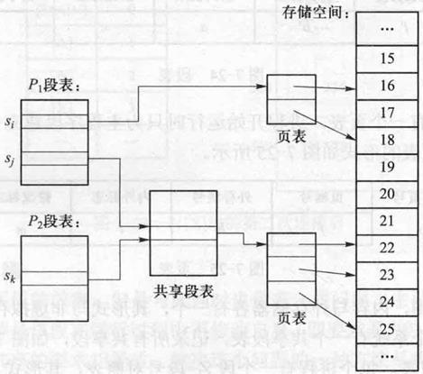

### 介绍虚拟段页式存储管理所需表目

- ①段表首址寄存器b 。整个系统有一个，保存正在运行进程的段表首址。
- ②段表长度寄存器l 。整个系统有一个，保存正在运行进程的段表长度。它在进程运行过程中可能动态变化，即每连接一个新的段时其值加1 。
- ③快表。每个进程有一个

### 虚拟段页式存储管理地址映射流程

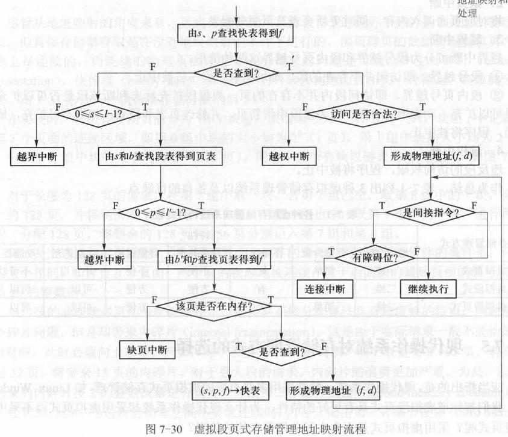

### 存储系统中有哪些中断处理的类型？

- 连接中断
  - 由段名查找本进程的段名-段号对照表及共享段表，经判断可以分为以下3种情形。
    - ①所有进程均未连接过（共享段表、段名-段号对照表均无）。
    - ②其他进程连接过但是本进程尚未连接过（共享段表有，段名-段号对照表无）。
    - ③本进程已经连接过（共享段表有或无，段名-段号对照表有）。
- 缺页中断
  - 将对应页面调入内存，同时更新页表及页面分配表。
  - 越界中断可分为段号越界和段内页号越界这两种情形。
  - ①段号越界。即访问并不存在的段，地址错误，程序将被中止。
  - ②段内页号越界。即访问段内并不存在的页，根据段扩充标志判断该段是否可以扩充，如果可以扩充，动态增长该段，即为该段申请新页，并修改页表和段表；如果不可扩充，地址错误，程序将被中止。
- 越权中断
  - 违反段的访问权限，程序将被中止。

### 在虚拟段页式存储管理中,考虑段的共享与段长度的动态变化,如何处理连接中断?

- 由段名查本进程的段名-段号对照表及共享段表,经判断可分为如下3种情形。
- (1)所有进程都未连接过(共享段表、段名-段号对照表均无)：
  - 查文件目录找到该段;
  - 为该段建立页表,将该段从文件中全部读入swap空间,部分读入内存,填写页表;
  - 为该段分配段号,填写段名-段号对照表;
  - 如该段可共享,填写共享段表,共享计数置1;
  - 填写段表;
  - 根据段号及段内地址形成无障碍指示位的一般间接地址。
- (2)其他进程连接过但本进程未连接过(共享段表有,段名-段号对照表无)：
  - 为该段分配段号;
  - 填写段名-段号对照表,填写段表(指向共享段表),共享段表中共享计数加1;
  - 根据段号及段内地址形成无障碍指示位的一般间接地址。
- (3)本进程已连接过(共享段表无,段名-段号对照表有)：
  - 根据段号及段内地址形成无障碍指示位的一般间接地址。
- 这里,段内地址由两部分构成,即逻辑页号和页内地址。

### 试说明二次机会算法和时钟算法是必定终止的。

- (1)二次机会算法:
  - 淘汰调入内存最久且最近未使用的页面。若在线性链表中有标记为0的页面,则扫描一次链表即可找到一个淘汰页面。若所有标记均为1,扫描到页面时将标记改为0并移到链表末尾,下次扫描到该页面时发现标记为0即可淘汰,因而算法必定终止。
- (2)时钟算法:
  - 改进之前的时钟算法与二次机会算法效果相同,只是所采用的数据结构不同。考虑改进后的时钟算法:若存在r=0且m=0的页面,按时钟扫描次序选择第一个满足要求的页面作为淘汰页面,算法终止于第一次步骤1。若1失败,但存在r=0且m=1的页面,按时钟扫描次序选择第一个满足要求的页面作为淘汰页面,算法终止于步骤2。若1和2都失败,在2中已将所有r都清0,若存在m=0,则在第二次执行步骤1时定能找到r=0且m=0的页面（更正：原文作“r=0且m=1”）;若所有m=1,则算法在第二次执行步骤2时必定终止,因为所有r=0且m=1成立。综上所述,算法必定终止。

### Denning工作集模型的理论依据是什么?

- 程序的局部性。程序的执行是由一个局部迁移至另外一个局部的过程。工作集(working set)是进程在一段时间之内活跃访问页面的集合。Denning认为,为使程序有效地运行,它的工作集页面必须能够存放到内存中。

## 第8章 文件系统

### 文件的逻辑组织形式主要有哪两种？各自有什么特点？

- 流式
  - 非结构式的
  - 操作系统对于文件的外部结构没有解释
  - 构成流式文件的基本单位是字节
  - 流式文件是具有符号名且在逻辑上有完整意义的字节序列
  - 用户对于流式文件的访问是以字节作为基本单位的
  - 每个文件的内部都有一个读写指针，通过系统调用命令可以将该读写指针固定到文件的某一位置，以后的读写系统调用命令将从该指针所确定的位置处开始执行。
  - 虽然流式文件没有结构，但是用户在使用流式文件时可以自定义文件的结构。例如，假设一个学生的档案需要占用50B，则可将50B作为一条记录。

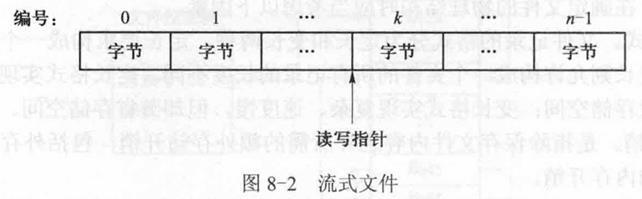

- 记录式
  - 结构式的
  - 操作系统对于文件的外部结构有解释
  - 构成记录式文件的基本单位是记录
  - 记录式文件是具有符号名且在逻辑上有完整意义的记录序列
  - 一条记录由一组在逻辑上相关的信息项所构成。
  - 用户对于记录式文件的访问是以记录作为基本单位的
  - 每个文件的内部都有一个读写指针，通过系统调用命令可以将该读写指针移动到文件的某一位置，以后的读写系统调用命令将从该指针所确定的位置处开始执行。
  - 流式文件是记录式文件的特例。

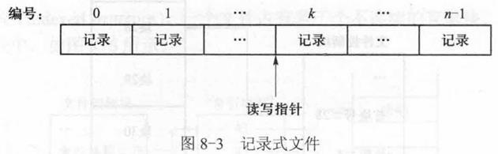

### 文件的物理组织有哪些形式？各自有什么特点？

- 用于保存文件的物理设备是被划分为块的，文件的物理结构就是要确定如何将记录或者字节保存在存储型设备的物理块中。
- 在确定文件的物理结构时应当考虑以下因素：
  - 记录格式：定长和变长
  - 空间开销：指除保存文件内容之外所需的额外存储开销
  - 存取速度：顺序存取的速度、按号随机存取的速度以及按键随机存取的速度
  - 长度变化：文件长度的动态增加和动态减少
- 顺序结构（连续结构）
  - 一个文件占有若干个连续的物理块
  - 其首块号和块数被记录在文件控制块中
  - 优点：访问速度快
  - 缺点：文件长度增加起来比较困难

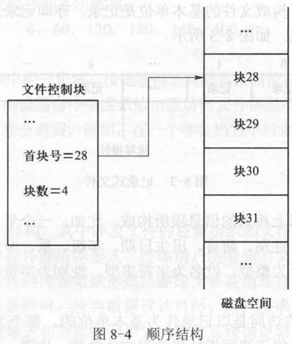

- 链接结构（串联结构）
  - 一个文件占有若干个不连续的存储块，各块之间以指针相连
  - 首块号和块数被记录于该文件的文件控制块中
  - 优点：长度易于动态变化
  - 缺点：随机访问的速度很慢，尤其是当文件比较长时，因为若欲随机地访问某一块，就必须将此块之前的所有块都逐个地读入内存，这需要进行大量的输入输出操作。
- 索引结构
  - 一个文件占有若干个不连续的存储块，这些块的块号被记录于一个索引块中
  - 优点：访问速度快，长度变化容易
  - 缺点：系统存储开销大，因为每个文件都有一个索引块，而索引块也由存储块所构成，故需要占用额外的外存空间。更主要的是，当文件被打开时，索引块需要读入内存，否则访问速度会降低一半，故需占用额外的内存空间。此外，由于构成索引块的存储块的长度固定，从而限制了文件的最大长度
- 散列结构（杂凑结构）
  - 只适用于定长记录和按键随机查找的访问方式，常用于构造文件目录。保存、查找、删除记录的算法见下面三张图。

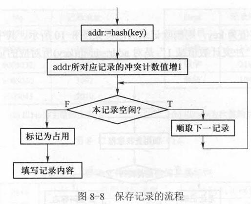

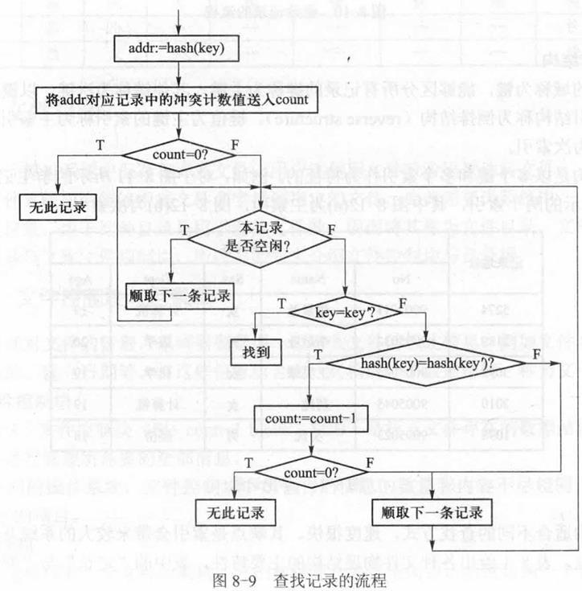

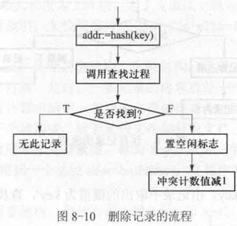

- 倒排结构
  - 记录中的域称为键，能够区分所有记录的键称为主键，其他键称为次键
  - 以键值和记录地址构成的索引结构称为倒排结构
  - 键值为主键的索引称为主索引，键值为次键的索引称为次索引。

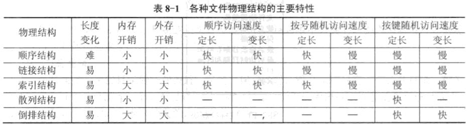

- 与存取方式的关系（《试题及答案》）：顺序结构适合顺序存取和直接存取；链接结构只适合顺序存取；索引结构适合顺序存取和直接存取。

### 文件存储空间的管理有哪些形式？各自有什么特点？

**空闲块表**

- 将所有的空闲块记录在同一个表中，该表称为空闲块表
- 表中包括两个栏目：首空闲块号和空闲块数
- 表中空闲块数为0的表目被标记为表尾
- 特别适合于文件的物理组织形式为连续结构的文件系统

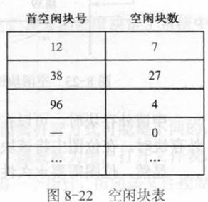

- 图8-22所示的空闲块表记录当前外存储器中从第12块到第18块是空闲的，从第38块到第64块是空闲的，从第96块到第99块是空闲的。所有其他块都是被占用的。

**空闲块链**

- 将所有的空闲块连成一条链
- 此时，外存空间的申请和释放是以块为单位的。申请时由链头取出一块，释放时将其连入链头。
- 这种外存空闲块的管理方法比较节省外存空间，但是其速度较慢，每申请一块或者释放一块都需要执行一次输入输出操作。

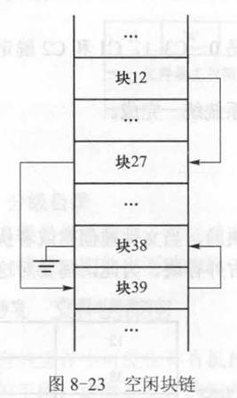

- 图8-23所示的空闲块链表示块12 、块27 、块38 、块39是空闲的，所有其他块都是被占用的。

**位图**

- 这种方法用1位（1b）来表示外存储器中一块的状态
- 可以规定当某一位的值为0时，该位所对应的外存块空闲，而当某一位的值为1时，该位所对应的外存块被占用。
- 申请外存块时，可以在位图中从头查找为0的字位，将其改为1，返回对应的块号；归还外存块时，在位图中将该块所对应的字位改为0 。

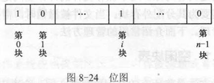

### 介绍文件打开时所需占用的内存表目，以及它们之间的联系

**系统打开文件表**

- 在内存中设立一个表目，用来保存已打开文件的文件控制块，该表被称为系统打开文件表
- 表中的内容除了FCB主部外，还包含以下3项信息：
  - 文件号：用于得到该文件FCB主部在外存储器中的位置。
  - 共享计数：用于记录当前有多少进程正在使用该文件，当其值为0时，表明是一个空表目。
  - 修改标志：用于标识某文件的文件控制块在内存期间是否曾经被修改过，当最后一个正在使用该文件的进程关闭该文件时，如果该文件控制块在内存期间曾经被修改过，需要将内存中修改后的文件控制块写回外存储器，否则不需要刷新外存储器。
- 系统打开文件表保存于操作系统空间中，用户程序不能访问它。
- 该表的长度决定了系统中可以同时打开的文件的最大数目。

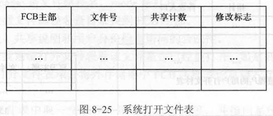

**用户打开文件表**

- 由于文件是可以共享的，多个进程可能会同时打开同一文件，而其打开方式可能是不同的，当前的读写位置通常也是不一样的。这些信息被记录在另一个表中，该表称为用户打开文件表
- 每个进程都有一个用户打开文件表
- 表中的系统打开文件表入口为一个指针，指向该文件控制块在系统打开文件表中的入口地址。
- 当多个进程共用同一文件时，不同进程的用户打开文件表中会有相同的系统打开文件表入口。
- 表中的文件描述符fd ( file descriptor）是一个非负整数（更正：原文作“正整数”，下一题“打开文件的步骤”里写的是非负整数），其值由其在表中的位置隐含确定，故实际不记录在表中，当文件被打开后返回给进程，其后进程便可使用描述符存取该文件，而不再使用文件名称。
- 用户打开文件表的位置应当记录在各进程的进程控制块中，用户打开文件表的长度决定了一个进程可以同时打开文件的最大数量。

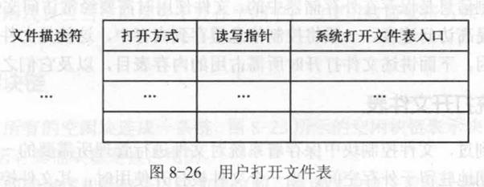

**表间联系**

- 用户打开文件表指向系统打开文件表，如果多个进程共享同一文件，则多个用户打开文件表目对应系统的文件表中的同一入口

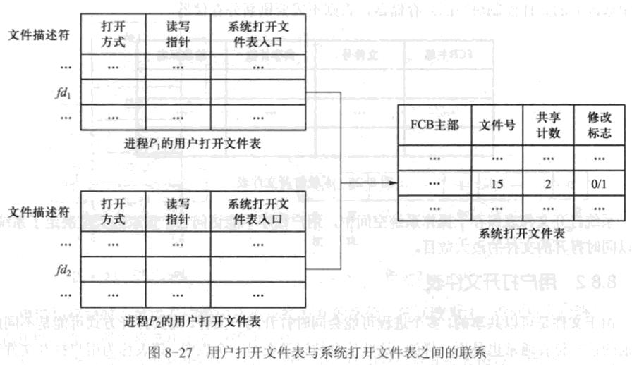

### 描述创建文件的步骤

- ①为此文件分配一个FCB主部，并对其初始化。
- ②将文件名称和文件号作为FCB次部，即将目录项填入文件路径名末级目录中。
- ③以写方式打开。

### 描述打开文件的步骤

- ①根据文件路径名查目录找到FCB主部。
- ②根据打开方式、共享说明和用户身份检查访问的合法性。
- ③根据文件号查找系统打开文件表看该文件是否已经被打开，如是则共享计数值加1；否则取一个空闲的系统打开文件表项并将外存储器中FCB主部等信息填入此表项，共享计数值置为1 。
- ④在用户打开文件表中取一空表项，填写打开方式等，并指向系统打开文件表的对应表项。返回文件描述符fd，它是一个非负整数，以后读写文件时就使用这个文件描述符，而不使用文件名称。

### 描述关闭文件的步骤

- ①由fd查找用户打开文件表，找到系统打开文件表的入口。
- ②系统打开文件表中的共享计数值减1，如减1后的值为0且修改标志为1，则将此文件控制块由内存写回外存FCB主部。
- ③将fd所对应的用户打开文件表项置为空闲。

### 描述指针定位的步骤

- ①由fd查找用户打开文件表，找到对应的入口。
- ②将用户打开文件表中的文件读写指针位置设定为offset，后续读写命令由该指针处存取文件内容。

### 描述读文件的步骤

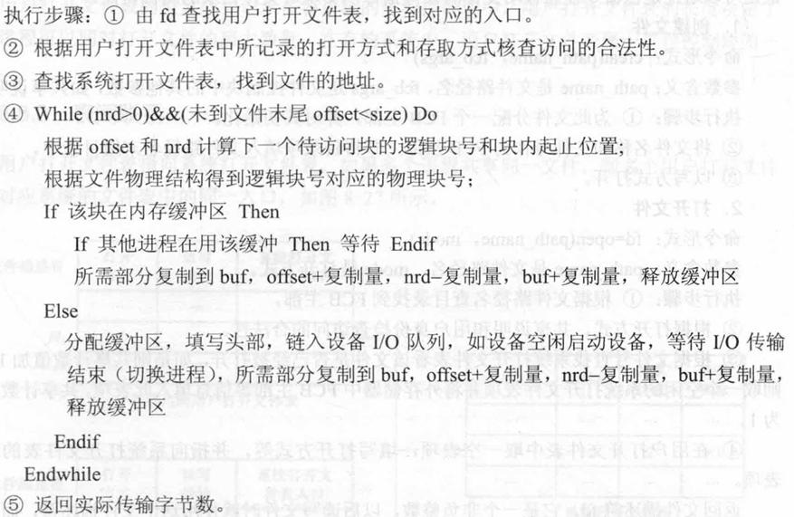

### 描述写文件的步骤

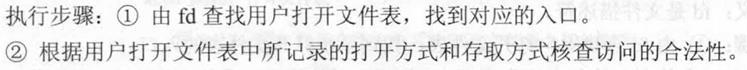

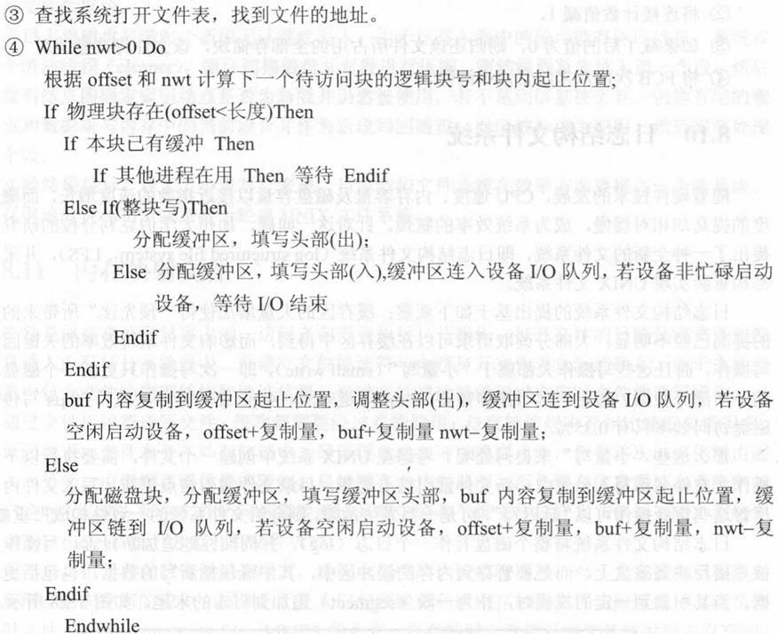

### 描述建立连接的步骤

- ①查目录找到文件 `old_name` 的FCB主部，由此得到文件号。
- ②查目录找到文件 `new_name` 的末级目录。
- ③将文件号与 `new_name` 中的末级名字合起来构成一个新的目录项，将其填入 `new_name` 的末级目录文件中。
- ④将FCB主部中的连接计数值加1 。

### 描述断开连接的步骤

- ①查目录找到文件 `path_name` 的FCB主部。
- ②将连接计数值减1 。
- ③如果减1后的值为0，则归还该文件所占用的全部存储块，该文件将被撤销。
- ④将FCB次部从末级目录中清除。

### 什么是文件的逻辑结构和物理结构？他们各自有哪几种形式？

- 文件的逻辑结构是从用户的观点看到的文件组织形式。它与存储设备的特性无关。分为两种形式：无结构的流式文件和有结构的记录式文件。
- 文件的物理结构是指文件在外存上的存储组织形式。文件的物理结构与存储设备的特性有很大关系。通常有4种形式：顺序结构、链接结构、散列结构、索引结构。
- 补充（《试题及答案》）：记录式文件在逻辑上可以看成一组连续顺序的记录的集合，又分为定长记录文件和变长记录文件；流式文件内部不再划分记录，是由一组相关信息组成的有序字符流。
- 《试题库》和《试题及答案》的物理结构只列了顺序、链接、索引三种，本课程教材还有散列结构和倒排结构，见上面“文件的物理组织有哪些形式”。

### 何谓文件系统？为何要引入文件系统？文件系统所要解决的问题(功能)主要有哪些？

- 文件系统是指负责存取和管理文件信息的机构，也就是负责文件的建立、撤销、组织、读写、修改、复制及对文件管理所需要的资源（如目录表、存储介质）实施管理的软件部分。
- 引入文件系统的目的: 实现文件的“按名存取”，力求查找简单；使用户能借助文件存储器灵活地存取信息，并实现共享和保密。
- 文件系统所要解决的问题(功能)主要有：
  - 1）、有效地分配文件存贮器的存贮空间(物理介质)。
  - 2）、提供一种组织数据的方法(按名存取、逻辑结构、组织数据)
  - 3）、提供合适的存取方法(顺序存取、随机存取等)。
  - 4）、方便用户的服务和操作。
  - 5）、可靠的保护、保密手段。

### 什么是文件？什么是文件系统？

- 文件是在逻辑上具有完整意义的信息集合，它有一个名字作标识。文件具有三个基本特征：文件的内容为一组相关信息、文件具有保存性、文件可按名存取。
- 文件系统是操作系统中负责管理和存取文件的程序模块，也称为信息管理系统。它是由管理文件所需的数据结构（如文件控制块、存储分配表）和相应的管理软件以及访问文件的一组操作所组成。

（出自《试题及答案》。本课程教材的定义更短，见 `10 名词解释.md` 第8章。）

### 试说明文件系统中对文件操作的系统调用处理功能。

- 系统调用是操作系统提供给编程人员的唯一接口。利用系统调用，编程人员在源程序中动态请求和释放系统资源，调用系统中已有的功能来完成那些与机器硬件部分相关的工作以及控制程序的执行速度等。系统调用如同一个黑匣子，对使用者屏蔽了具体操作动作，只是提供了有关功能。
- 有关文件系统的系统调用是用户经常使用的，包括文件的创建（create）、打开(open)、读(read)、写(write)、关闭(close)等。

### 为什么将文件定义为信息项的序列,而不是信息项的集合?

- 因为构成文件的信息项之间是有次序关系的,这与数据库中的记录不同。数据库中同一关系的记录之间没有次序关系,因而关系是记录的集合。

### 试举例说明何种文件长度是固定不变的,何种文件长度是动态变化的。

- 某些系统可执行程序(如shell、vi)的长度通常是固定不变的;而用户正在编辑的文本文件或源代码文件的长度通常是动态变化的。

### 试比较文件名、文件号、文件描述符之间的关系。

- 文件名是文件的外部名字,通常是一个符号名(字符串),同一文件可以有多个文件名(如通过link命令建立连接)。文件号是文件的内部名字,通常是一个整数,文件号与文件具有一对一的关系。文件描述符是文件打开时返回的整数(入口地址),对应用户打开文件表中的一个入口。
- 同一个文件可以被多个用户同时打开,此时返回的文件描述符一般不同。同一个文件也可以被同一个用户多次打开,每次打开时返回的文件描述符一般也不同。

### 将文件控制块分为两个部分有何好处?此时目录项中包含哪些成分?

- 将文件控制块(FCB)划分为主部和次部两部分具有如下两个主要优点。
- (1)提高查找速度。查找文件时,需用欲查找的文件名与文件目录中的文件名相比较。由于文件目录保存于外存,比较时需要将其以块为单位读入内存。由于一个FCB包括许多信息,一个外存块中所能保存的FCB个数较少,这样查找速度较慢。而将FCB分为两部分之后,文件目录中仅保存FCB的次部,这样一个外存块中可容纳较多的FCB,从而大大地提高了文件的检索速度，同时也减少了文件目录所占空间。
- (2)实现文件连接。所谓连接就是给文件起多个名字,这些名字都是路径名,可为不同的用户所使用。次部仅包括一个文件名和一个标识文件主部的文件号,主部则包括除文件名之外的所有信息和一个标识该主部与多少个次部相对应的连接计数。当连接计数的值为0时,表示一个空闲未用的FCB主部。

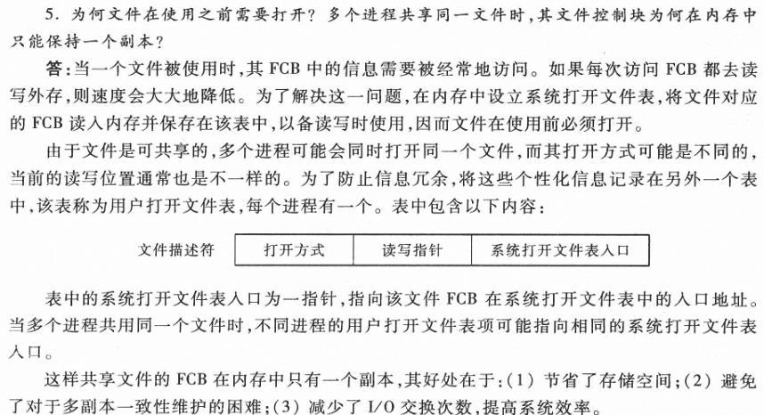

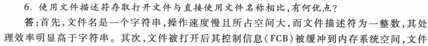

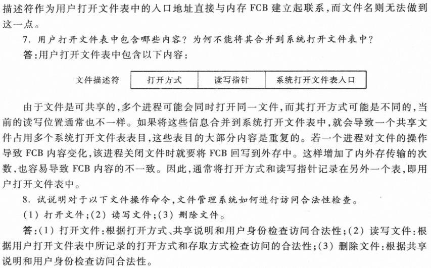

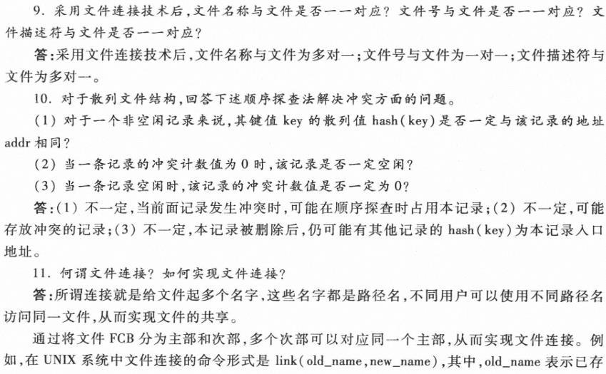

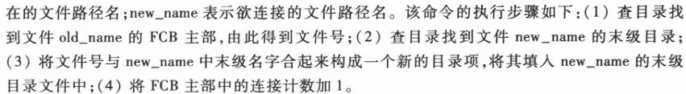

### 文件目录的作用是什么？一般应包含哪些内容？

- 文件目录的作用是实现文件名与文件在辅存上的物理地址之间的转换。
- 文件目录中包含多个表项，每个表项存放一个文件的有关信息。最简单的表项至少应包括文件名和其在辅存上的存放（起始）地址。
- 较完整的表项包括：
  - （1）文件的存取控制信息：如文件名、用户名、授权者存取权限；
  - （2）文件的类型和属性：如读写文件、执行文件、只读文件等；
  - （3）文件的结构信息：一是文件的逻辑结构信息，包括记录类型、记录个数、记录长度、成组因子数等；二是文件的物理结构信息，如记录的相对存放位置、文件的第一块物理块号、文件的索引表位置等；
  - （4）文件的管理信息：如文件建立日期、文件最近修改日期、访问日期、文件保留期限、记账信息等。

（合并自《试题及答案》的“文件目录的作用是什么？一般应包含哪些内容？”和“文件目录应包含哪些内容？”。）

### 什么是根目录？

- 文件系统多级目录结构中，将第一级作为目录树的根结点，又称为根目录。

（出自《试题库》。）

### 写出文件系统中采用树形目录结构的特点。

- （1）解决了重名问题，允许在不同的子目录中使用相同的名字命名文件或下级子目录；
- （2）层次清楚，便于管理；
- （3）提高检索文件的速度；
- （4）能进行存取权限的控制，实现对文件的保护和保密。

（出自《试题库》。）

## 第9章 设备与输入输出管理

### 设备管理的功能是什么？

- 设备分配：按照设备类型和相应分配算法决定将设备分配到哪一个要求该类设备的进程
- 设备处理：即设备驱动，实现I / O进程与设备控制器之间的通信。
- 缓冲管理：为了提高CPU和I/O设备之间操作的并行程度，并且能够尽量减少中断的次数，大多数的I/O操作都要使用缓冲区

### I/O软件一般分为哪几个层次？

- 从硬件层到用户层分为4层：中断处理程序、设备驱动程序、与设备无关的I/O软件、用户空间的I/O软件。

（出自《试题及答案》。）

### 写出设备管理的4个目标

- 方便性
- 并行性
- 均衡性
- 独立性

### 写出几种设备分类的方式与对应的类型

- 输入输出型设备与存储型设备
  - 输入输出型设备是向CPU传输信息、或输出经CPU处理过的信息的设备。
  - 从用途上来说，输入输出型设备包括以下两类：
    - 人机输入输出设备
      - 如键盘、扫描仪、打印机、绘图仪、数码相机等。
    - 机机输入输出设备（通信设备）
      - 如网卡、调制解调器等。
  - 存储型设备既可用于实现虚拟存储系统，又可用于建立文件系统，还可用于构造作业输入井和输出井。存储于这类设备上的信息可以长期保存。
- 块型设备与字符型设备
  - 块型设备
    - 通常块型设备就是存储型设备。
    - 这类设备由若干个长度相同的块所构成，一块的长度通常为2的整数次幂个字节（原稿这里公式缺失，按上下文补）。
    - 对于这类设备来说，块是存储和分配的基本单位，也是数据传输的基本单位。
  - 字符型设备
    - 通常字符型设备就是输入输出型设备（包括通信设备）。
    - 这类设备进行数据传输的基本单位是字节。
  - 时钟与显示器
    - 这两种设备既不属于块型设备，也不属于字符型设备。
    - 硬件时钟有两个
      - 一个是绝对时钟：记载当前日期和时间，当其不准时系统用户可以调整，所有用户均可读取其值
      - 另一个是闹钟：它定时产生中断，一般以毫秒为单位。
    - 显示器在内存系统空间有一段保留的存储区，通过送数指令（MOV）向该区域写信息即可在显示器上显示出来，这片保留的区域属于系统空间，一般用户不可访问，因而操作系统不会将任何进程的地址空间映射到显示内存。
- 独占型设备与共享型设备
  - 独占型设备包括所有的字符型设备及磁带机
    - 对于这类设备来说，在任意一段时间之内最多只能有一个进程占有并使用它。
  - 共享型设备包括除磁带机以外的所有块型设备
    - 对于这类设备来说，多个进程的数据传输以块为单位是可以交叉的。

### 有哪些数据传输方式？各自有什么特点？

- 程序控制查询方式
  - 探询：探询（Polling）又称程序控制输入输出，是最早的输入输出控制方式。处理器代表进程向相应的设备模块发出输入输出请求，然后处理器反复查询设备状态，直至输入输出完成。
  - 缺点是忙式等待，处理器与设备完全串行工作，由于设备速度远远低于处理器速度，忙式等待过程将消耗大量处理器时间。
  - 探询方式可以采用硬件提供的专用输入输出指令，也可以采取内存操作指令完成。后者将设备地址映射为内存地址空间的一部分，是硬件通常提供的输入输出指令形式，称为内存映射输入输出。
- 中断驱动方式
  - 引入中断之后，设备具有中断CPU（中央处理器）的能力，设备与CPU可以并行。
  - 当设备较多时，对CPU的中断打扰很多。
  - 另外，中断伴随处理器的状态切换，增加了系统开销。
  - 与探询方式一样，中断驱动输入输出方式既可以采用硬件提供的专用输入输出指令，也可以采用内存映射输入输出指令完成。
- 内存映射方式
  - 具有即时完成的特点，即指令执行完，I/O操作也就执行完，因而没有中断需要处理。
- DMA方式
  - 硬件提供DMA控制器
  - DMA控制器通过总线与设备、内存相连。
  - DMA方式的传输步骤如下。
    - ① CPU将操作量送到DMA控制器的操作数寄存器operands中，包括内存起始地址、传输数量等。
    - ② CPU将操作码送到DMA控制器的opcode寄存器以启动DMA控制器。DMA控制器将其忙碌寄存器（busy）置位，表明在此期间不再接受新的操作命令。此后，CPU可以执行与该控制器无关的其他操作。
    - ③ DMA控制器与设备交往，将数据由缓冲区传送到设备或者由设备传送到缓冲区。
    - ④ DMA控制器将缓冲区内容复制到内存空间，或由内存空间复制到缓冲区。
    - ⑤计数器值减1 。若结果非0（未传送完）则转步骤③继续传输；否则转步骤⑥ 。
    - ⑥传输结束时，DMA控制器复位其忙碌寄存器，并向CPU发送中断请求。
    - ⑦ CPU读入并检测其DMA状态寄存器，以确认操作是否成功。
- 通道方式
  - 具有通道结构的计算机系统，主机、通道、控制器和设备之间采用四级连接，实施三级控制。一个CPU通常可以连接若干通道，一个通道可以连接若干个控制器，一个控制器可以连接若干个设备。 CPU通过执行I/O指令对通道实施控制，通道通过执行通道命令对控制器实施控制，控制器发出动作序列对设备实施控制，设备执行相应I/O操作。
  - 通道连接方式主要有两种：
    - 单通路的连接方式：对于单通路方式，每个设备与一个控制器相连，每个控制器与一个通道相连
    - 多通路的连接方式：允许多对多相连
  - 通道涉及以下内容：
    - 1．通道指令系统
      - （1）基本操作
        - ①空操作：不执行任何操作，顺序取出下一条指令。
        - ②读操作：从指定设备中输入一批数据。
        - ③写操作：向指定设备输出一批数据。
        - ④控制操作：控制外围设备机械性动作，如磁带反绕、磁盘引臂移动、打印纸换页等。
        - ⑤转移操作：实现指令的非顺序执行。
        - ⑥结束操作：通道程序执行完毕，向主机发送通道中断信号。
      - （2）指令格式

    - 2．通道运控部件
      - ①通道地址字（channel address word, CAW）
      - ②通道命令字（channel command word, CCW）
      - ③通道状态字（channel status word, CSW）
      - ④通道数据字（channel data word, CDW）
    - 3．通道存储区域
      - 通道并没有独立的存储空间，它需要与主机共享同一个内存空间。访问内存采用“周期窃用”方式。
      - 通道使用内存具有以下两种用途：①保存通道程序；②保存交换数据。
    - 4．通道程序执行过程
      - 通道有3种类型：
        - 字节多路通道：多个非分配型子通道，连接低速外围设备
        - 数组选择通道：一个分配型子通道，连接多台高速设备
        - 数组多路通道：多个非分配型子通道，连接多台高速设备
- 《试题及答案》的答法：常用的I/O控制方式有4种，即程序直接控制方式、中断控制方式、DMA方式和通道控制方式。DMA方式和通道方式都是以内存为中心、让设备和内存直接交换数据；区别在于DMA方式中数据传送方向、存放数据的内存始址以及传送的数据块长度等都由CPU控制，而通道方式中这些都由专管输入输出的硬件（通道）来控制。

### 设计输入输出调度算法应当考虑哪两个基本因素？

- ①公平性：一个输入输出请求应当在有限的时间之内得到满足。
- ②高效性：减少设备机械运动所带来的时间开销。

### 读写一个磁盘块需要多长时间一般由哪几个因素确定？

- 寻道时间（seek time )，这是指将磁盘引臂移动到指定柱面所需要的时间
- 旋转延迟（rotational delay )，这是指指定扇区旋转到磁头下的时间；
- 传输时间（transfer time )，这是指读写一个扇区的时间。

### 列举常见的磁盘引臂调度算法并简单介绍

- 先到先服务算法：先到先服务(FCFS)算法按照输入输出请求的次序为各个进程服务,这是最公平且最简单的算法,但是执行效率不高。
- 最短查找时间优先算法：（SSTF）其思想是优先为距离磁头当前所在位置最近柱面的请求服务。该算法缺乏公平性，存在饥饿和饿死问题。
- 扫描算法：扫描算法（SCAN）又称电梯算法，因其基本思想与电梯的工作原理相似，故得此名。无访问请求时，磁头引臂停止不动；当有访问请求时，引臂按照电梯移动规律运动，并为路经柱面的访问请求服务。起始时磁头由最外柱面向内柱面移动，并为路经的请求服务。一旦内柱面没有访问请求，则改变移动方向（如果外柱面有请求）或者停止移动（外柱面也无请求）
- 循环扫描算法：循环扫描（c-scan）算法是为消除边缘柱面与中部柱面等待时间差异而进行的改进。磁头只在单方向移动过程中才为路经的请求服务，一旦该方向没有请求，则立即快速回扫到另一端提出请求的第一个柱面。在此回扫过程中并不处理访问请求，然后重新开始新一轮扫描。
- N步扫描算法：N步扫描把磁盘请求队列分成若干长度为n的子队列，并按到达次序处理这些子队列。使用扫描策略服务请求队列中的前n个请求，本次扫描后，接着服务下一组n个请求。到达的请求放在请求队列的队尾。 N步扫描可以通过改变N的值进行调节，当N =1时，N步扫描退化为先到先服务；当N很大时，N步扫描接近扫描算法。
- 冻结扫描算法：冻结扫描算法是指，只用扫描策略服务那些在一次特定扫描开始时已经到达的请求，即请求队列被“冻结”，在扫描期间新到达的请求被组合在一起，并在回程扫描时按扫描算法进行处理。在实现时，对每个柱面可以设置两个队列，按扫描方向交替用作服务队列和等待队列。

### 什么叫缓冲(buffering)?什么叫缓存(caching)?缓冲与缓存有何差别?

- 利用存储区缓解数据到达速度与离去速度不一致而采用的技术称为缓冲,此时同一数据只包含一个副本。例如,操作系统以缓冲方式实现设备的输入和输出操作主要是为了缓解处理器与设备之间速度不匹配的矛盾,以提高资源利用率和系统效率。
- 缓存是为提高数据访问速度而将部分数据由慢速设备预取到快速设备上的技术,此时同一数据存在多个副本。例如,远程文件的一部分被取到本地。
- 当然,在有些情况下,缓冲同时具有缓存的作用。例如,UNIX系统对于块型设备的缓冲区,在使用时可保持与磁盘块之间的对应关系,既有缓冲的作用也有缓存的作用,通过预先读与延迟写技术,进一步提高了输入输出效率。

### 考虑由文件读入若干信息到进程空间中,信息首先由磁盘读入操作系统缓冲区,再由缓冲区复制到进程空间中。为什么不能将信息直接由磁盘读到进程空间中?

- 磁盘输入输出以块为基本单位,而进程读取的文件内容可能对应块中的部分内容,若直接由磁盘块复制到进程空间,则可能会读进不需要的内容,覆盖了进程中有用的单元。

### 与为每个设备配置一个(或者若干个)缓冲区相比,采用可为多个设备共用的缓冲池有何优点?

- 将一个缓冲区与一个固定的设备相联系,从而不同设备使用不同的缓冲区,这种缓冲区管理模式称为私用缓冲。私用缓冲利用率低,例如,某一执行I/O传输的设备,其私用缓冲区可能不够,而其他未执行I/O操作的设备,其私用缓冲区则可能被闲置而导致浪费。
- 为了提高缓冲区的利用率,通常不将缓冲区与某一个具体设备固定地联系在一起,而是将所有缓冲区集中起来加以管理,按需要动态分派给正在进行I/O传输的设备。系统中的共用缓冲区集合被称为缓冲池(buffer pool)。

### 在系统缓冲区空间总长度固定的前提下,一个缓冲区过大或者过小各有何优点和缺点?

- 缓冲区过大会造成资源浪费(平均浪费半个缓冲区容量),但是有利于减少I/O传输次数;
- 缓冲区过小则会因I/O传输次数增多而加大系统开销。另外,缓冲区过小会引起缓冲链指针过多而浪费缓冲空间。

### 假设要修改某一磁盘块上的一部分,而其他部分保持原内容不变,应当如何做?

- 首先将该磁盘块内容读入内存缓冲区,然后在内存中修改相关内容,最后将修改后的缓冲区内容完整地回写到磁盘对应块中。

### 操作系统中引入缓冲技术的目的是什么？举例解释缓冲的必要性

- 在操作系统中，以缓冲方式实现设备的输入输出操作主要是为了缓解处理器与设备之间速度不匹配的矛盾，从而提高资源利用率和系统效率。
- 处理器的速度是很快的，而设备的速度则比较慢。例如有一个进程，它时而进行长时间的计算，时而产生阵发性的输出传送到一台打印机上。若无缓冲机制，在阵发性输出时，由于打印机的速度跟不上处理器的速度，处理器不得不经常等待：而在计算阶段，打印机又被闲置。若在打印机与处理器之间设置一个缓冲区，情况便可大为改观：当进程产生阵发性输出时，将输出信息暂存在缓冲区中，由打印机取出慢慢打印，处理器在将数据传送到缓冲区之后便可继续执行其计算任务，此时处理器可与设备并行操作。
- 补充（《试题及答案》）：缓冲区是使用专用硬件缓冲器或在内存中划出的一个区域，用来暂时存放输入输出数据。引入缓冲是为了匹配外设和CPU之间的处理速度，减少中断次数和CPU的中断处理时间，同时解决DMA或通道方式时的数据传输瓶颈问题。

### 根据系统设置的缓冲区个数，可将缓冲技术分为哪几类？

- 单缓冲：在设备与进程之间设置一个缓冲区，设备与进程交换数据（如输入）时信息由设备传到缓冲区，然后再由缓冲区传给进程。然后重复上述过程，直至传输完成。
- 双缓冲：在设备与进程之间设置两个缓冲区，设备与进程交换数据（如输入）时信息由设备传到一个缓冲区。第一个缓冲区填满后，信息由设备传到第二个缓冲区，同时处理器将第一个缓冲区中的内容复制到进程空间。然后，设备再将输入信息传到第一个缓冲区，同时处理器将第二个缓冲区的内容复制到进程空间，如此交替，可以提高处理器与设备之间的并行性。
- 循环缓冲：在设备与进程之间设置多个缓冲区，这些缓冲区链成环状，有两个指针in和out , in指向当前输入的位置，out指向当前取出的位置。
- 缓冲池：为了实现缓冲输入输出，操作系统通常需要提供两组缓冲区：一组用于块型设备，另一组用于字符型设备。用于块型设备的缓冲区一般较大，其长度通常与外围设备物理块的长度相同；用于字符型设备的缓冲区一般较小

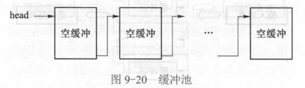

  - 缓冲池是属于操作系统空间的，用户程序不能直接对其进行操作，只能通过与输入输出操作有关的系统调用进入操作系统来间接地使用它们。

### 每个设备都有一个缓冲队列，所需要的缓冲区是动态向系统申请的，用完后立即归还给系统。请分别介绍输入型设备缓冲输入的实现、输出型设备缓冲输出的实现，以及输入输出型设备缓冲输入和缓冲输出的实现。

- 1. 输入型设备
  - 对于这类设备，信息的流向是这样的：输入设备 → 缓冲区 → 进程空间
  - 信息由输入设备到缓冲区的传输由通道程序完成，由缓冲区到进程空间的传输由操作系统代替进程完成。
  - 设备被启动之前为其申请一个缓冲区，输入的信息被传送到缓冲区中，缓冲区满时将其连到设备的输入队列上，并申请下一个缓冲区。当进程需要由设备读取信息时，顺序取输入队列上的缓冲区，并将缓冲区中的内容复制到进程空间，然后将缓冲区释放。
- 2. 输出型设备
  - 对于这类设备，信息的流向是这样的：进程空间 → 缓冲区 → 输出设备
  - 信息由进程空间到缓冲区的传输由操作系统代替进程完成，由缓冲区到输出设备的传输由通道程序完成。
  - 当进程需要将信息传送到输出设备时，系统代为申请一个缓冲区，信息由进程空间传送到缓冲区中，一个缓冲区装满后连到设备的输出队列上并启动设备输出，同时申请下一个缓冲区。一个缓冲区中的内容输出完后，缓冲区被释放。
- 3．输入输出型设备
  - 这类设备多属于块型设备，如磁盘、磁带等。对于这类设备，信息的流向是这样的：进程空间 ↔ 缓冲区 ↔ 输入输出设备
  - 对于这类设备来说，输入输出操作可以交叉进行。为此，通道需要知道每一个缓冲区所对应的操作究竟是读还是写。此外，还需要给出设备的地址，如为哪一个磁盘块。为此，输入输出队列上的每一个缓冲区都应当带有一组说明信息，这组说明信息称为缓冲区头
  - 进程执行输入操作时，系统代为申请缓冲区，并填写好缓冲区头，然后将此缓冲区连到设备的输入输出队列上。设备驱动程序根据缓冲区头的说明信息将设备上的指定块读入缓冲区体。数据传输结束后产生中断，由中断处理程序将缓冲区体中的内容复制到进程空间，然后释放缓冲区。注意：这里并未真正起到缓冲作用，因为每次输入输出都需要启动设备将所需要的块传送到缓冲区中，而不能从缓冲区中直接得到。
  - 进程执行输出操作时，系统代为申请缓冲区，并将信息由进程空间复制到缓冲区体中，然后填写好缓冲区头，再将缓冲区连到设备的输入输出队列上。设备驱动程序根据缓冲区头的说明信息将缓冲区体中的内容传送到设备的指定块中。数据传输结束后发生中断，由中断处理程序释放缓冲区。

### 简述输入输出操作的演变过程:查询方式→中断方式→通道方式,并分析这种演变对于多道程序设计所带来的影响。

- I/O操作最早为查询方式,将待传输的数据放入I/O寄存器并启动设备,然后反复测试设备状态寄存器直至完成。采用这种方式,处理器与设备之间是完全串行的。
- 随着中断I/O方式的产生,处理器在启动设备后,可进行其他计算工作,设备与处理器并行。
- 当设备I/O操作完成时,向处理器发送中断信号,处理器转去进行相应的处理,然后可能再次启动设备传输。中断使多道程序设计成为可能:一方面中断使操作系统能够获得处理器控制权,另一方面通过I/O中断可以实现进程状态的转换。
- 中断使处理器与设备之间的并行成为可能,但I/O操作通常以字节为单位,当设备很多时会对处理器打扰很多,为此人们设计了专门处理I/O传输的处理器-- 通道。通道具有自己的指令系统,可以编写通道程序,一个通道程序可以控制完成许多I/O传输,只在通道程序结束时,才向处理器发生一次中断。

### 通道与DMA方式之间有何共同点?有何差别?

- 通道与DMA(Direct Memory Access,直接存储器访问)都属于多数据I/O方式
- 二者差别在于:通道控制器具有自己的指令系统,一个通道程序可以控制完成任意复杂的I/O传输,而DMA并没有指令系统,一次只能完成一个数据块的传输。

### 用户申请独占型设备时为什么不指定具体设备而仅指定设备类别?

- 进程申请独占型设备资源时,应当指定所需设备的类别,而不是指定某一具体的设备编号,系统根据当前请求以及资源分配情况在相应类别的设备中选择一个空闲设备并将其分配给申请者,这称为设备无关性。这种分配方案具有如下两个优点:
  - (1)提高设备资源利用率。假设申请者指定具体设备,被指定的设备可能正被占用,因而无法得到,而其他同类设备可能空闲,造成资源浪费和进程不必要的等待;
  - (2)程序与设备无关。假设申请者指定具体设备,而如果被指定设备已坏或不联机,则需要修改程序。

### 为何不允许用户程序直接执行设备驱动指令?

- (1)系统中的设备可能被多个进程所共享,例如,磁盘就是这样的设备。如果允许用户程序直接执行设备驱动指令,那么就有可能损坏设备;
- (2)设备操作涉及很复杂的驱动过程,一般用户编写驱动程序会是很大的负担,操作系统的目标是方便用户使用计算机系统,因而提供标准驱动程序。

### 何谓“磁道歧视”?假设每个磁道各有一个磁头,是否还存在磁道歧视问题?

- 在最短查找时间优先(Shortest Search Time First,SSTF)等磁盘引臂调度算法中,磁头引臂可能长时间停留在磁盘局部的某些磁道,而不光顾另外一些磁道。例如,如果某一时刻外磁道请求不断,则内磁道请求可能长时间得不到满足,这种现象称为“磁道歧视”(track discrimina-tion)。若每个磁道各有一个磁头,则不存在磁道歧视问题。

### 处理器与通道之间是如何通信的?通道与处理器之间呢?

- 通道与处理器之间相对独立,通道程序的执行可与处理器的操作并行。因为一个系统中可能有多个通道,这些通道也可并行地执行相应的通道程序。
- 通常,通道程序形成之后,处理器将通道程序的起始地址放到内存指定单元处,然后执行通道启动指令使通道开始工作。通道被启动之后从指定单元中取出通道程序的起始地址,并将其放入通道地址字(Channel Address Word,CAW)中,据此依次地执行各条通道指令。当通道程序执行完毕或执行到通道结束指令时,产生通道中断信号,并将该信号发给处理器,处理器响应中断后取出中断字,分析中断原因,进行相应的中断处理。

### 说明下列术语之间的对应关系。(1)I/O设备;(2)I/O驱动程序;(3)I/O进程。

- 一般来说,一个I/O驱动程序与多个同类设备相对应,一个I/O设备与一个I/O进程相对应。

### UNIX系统中将设备分为块设备和字符设备，它们各有什么特点？

- 字符设备是以“字符”为单位进行输入、输出的设备，即这类设备每输入或输出一个字符就要中断一次主机CPU请求进行处理，故称为慢速设备。
- 块设备是以“字符块”为单位进行输入输出的设备，在不同的系统或系统的不同版本中，块的大小定义不同。但在一个具体的系统中，所有的块一旦选定都是一样大小，便于管理和控制，传送效率较高。

### 什么叫通道技术？通道的作用是什么？

- 通道是一个独立于CPU的专管输入/输出控制的处理机，它控制设备与内存直接进行数据交换。它有自己的通道指令，这些通道指令受CPU启动，并在操作结束时向CPU发中断信号。
- 通道方式进一步减轻了CPU的工作负担，增加了计算机系统的并行工作程度。

### 在设备管理中设置缓冲区的作用是什么？根据系统设置缓冲区的个数，缓冲区可以分为哪几种？

- 在设备管理中设置缓冲区的作用：
  - （1）缓和CPU和I/O设备之间速度不匹配的矛盾。
  - （2）减少中断CPU的次数。
  - （3）提高CPU和I/O设备之间的并行性。
- 根据系统设置缓冲区的个数，可以分为单缓冲、双缓冲、多缓冲以及缓冲池等四种。

### 按资源分配管理技术，输入输出设备类型可分为哪三类？简述其区别

- 按资源分配管理的特点，输入输出设备可分为独占型设备、共享型设备和虚拟设备三类。
  - 独占型设备：即不能共享的设备，一段时间只能由一个作业独占。如打印机、读卡机、磁带机等。所有字符型输入输出设备原则上都应是独享设备。
  - 共享型设备：可由若干作业同时共享的设备，如磁盘机等。共享分配技术保证多个进程可以同时方便地直接存取一台共享设备。共享提高了设备的利用率。块设备都是共享设备。
  - 虚拟设备：利用某种技术把独享设备改造成多台同类型独享设备或共享设备。虚拟分配技术就是利用独享设备去模拟共享设备，从而使独占设备成为可共享的、快速I/O的设备。实现虚拟分配的最有名的技术是SPOOLing技术，即假脱机技术。

### 在磁盘调度算法中，SSTF和C_SCAN算法分别是如何实现的？并比较它们的性能。

- SSTF方法：根据磁头的当前位置，首先选择请求队列中距磁头距离最短的请求为之服务。
- C_SCAN方法：磁头从盘面上的一端（逐柱面地）向另一端移动，遇到请求立即服务；回返时直接快速移至起始端而不服务于任何请求。如此往返单向地扫描并平均地为各种请求服务。
- 性能比较：SSTF方法可以获得较短的寻道时间，但可能有饿死现象。适合于负载不大的系统。C_SCAN方法在负载较大的系统中，可以获得较好的性能，并且不存在饿死现象。

### 给出两种I/O调度算法，并说明为什么I/O调度中不能采用时间片轮转法。

- I/O调度程序通常采用先来先服务调度和优先级调度两种调度算法。
- 由于I/O操作中一般会涉及通道操作，而通道程序一经启动就不能停止，直至完成，在它完成之前不接受从CPU来的中断，因此I/O调度程序不能采用时间片轮转调度算法。

（出自《试题及答案》。）

### 简述设备驱动程序的作用？

- 设备驱动程序是驱动物理设备和DMA控制器或I/O控制器等直接进行I/O操作的子程序的集合。负责设置相应设备有关寄存器的值，启动设备进行I/O操作，指定操作的类型和数据流向等。

### 试述设备控制器必须具有的功能。

- （1）接收和识别来自CPU的各种命令。
- （2）实现CPU与设备控制器、设备控制器与设备之间的数据交换。
- （3）记录设备的状态供CPU查询。
- （4）识别控制器的每个设备的地址。

（出自《试题库》。）

### 举例说明面向块的设备与面向流的设备之间的区别?

- 一般来说，面向块的设备以固定大小的块来存储数据，数据的传送是方式是每次一个数据块，对数据的引用通过数据块号来进行，比如磁带、磁盘等就是典型的块设备；而面向流的设备是以字节流的方式进行数据的传送，不存在块结构，如打印机、终端、键盘等都是典型的面向流的设备。

### 什么是设备无关性？如何实现设备独立性？

- 设备无关性是指用户编写程序时所使用的设备与实际使用的设备无关。
- 为实现设备无关性，要求用户程序对设备的请求采用逻辑设备名，而程序执行时使用物理设备名。因此，操作系统需要提供逻辑设备名与物理设备名的转换机制。一般采用系统设备表实现该转换。
- 《试题库》的说法：设备无关性指用户使用设备时仅与逻辑名设备有关，而与具体的物理设备无关。它包含两个方面：从程序设计的角度看待I/O设备，所体现的接口应该是一致的；在操作系统管理设备和相应的操作时，对所有设备都采用统一的方式进行。

### 什么是物理设备？什么是逻辑设备？两者之间有什么区别和联系？

- 进行实际输入输出操作的硬件设施是物理设备.
- 操作系统中规定用户程序中不要直接使用设备的物理名称，而用一另外的名称代之来操作，这就是逻辑设备.
- 逻辑设备是物理设备属性的表示，它并不特指某个具体的物理设备，而是对应于一批设备，具体的对应则在操作系统启动初始化时确定，或在运行过程中根据设备的使用情况由系统或用户再次确定.

### SPOOLing的含义是什么？试述SPOOLing系统的特点、功能。

- SPOOLing是Simultaneous Peripheral Operation On-Line（即并行的外部设备联机操作）的缩写，它是关于慢速字符设备如何与计算机主机交换信息的一种技术，通常称为“假脱机技术”。
- SPOOLing技术是在通道技术和多道程序设计基础上产生的，它由主机和相应的通道共同承担作业的输入输出工作，利用磁盘作为后援存储器，实现外围设备同时联机操作。
- SPOOLing系统由专门负责I/O的常驻内存的进程以及输入井、输出井组成；它将独占设备改造为共享设备，实现了虚拟设备功能。

（出自《试题库》。）

### SPOOLing技术如何使一台打印机虚拟成多台打印机？这样做有什么优点？

- 打印机是一个典型的独占设备，通过SPOOLing技术可将其改造为一个共享设备。系统并不真正把打印机分配给提出打印请求的用户进程。
- 当用户进程有打印请求时，输出进程首先在输出井中申请一个空闲盘块区，将要打印的数据送入其中；然后为用户申请并填写一张请求打印表，把该表挂到请求打印队列上。如果还有后续打印请求，则重复上边的操作过程。
- 当打印机空闲时，输出进程从请求打印队列上取下第一张请求打印表，根据要求将打印数据从输出井送到内存缓冲区，由打印机输出。如此循环，直到打印队列为空，输出进程将自身阻塞，直至再有打印请求时才被唤醒。
- 优点：作为独占设备的一台打印机可以同时接受多个用户进程的打印请求。在多用户情况下，每一个用户使用打印机就好像自己拥有一台打印机，不会因为打印机“忙”而等待。

（合并自《试题库》“SPOOLing技术如何使一台打印机虚拟成多台打印机？”和《试题及答案》的“以一台打印机为例，简述SPOOLing技术的优点”“何用SPOOLing技术将一台打印机虚拟成多台打印机？”。）
