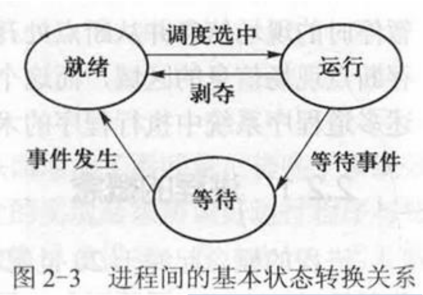
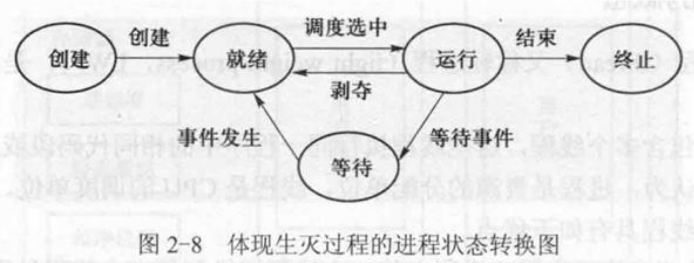
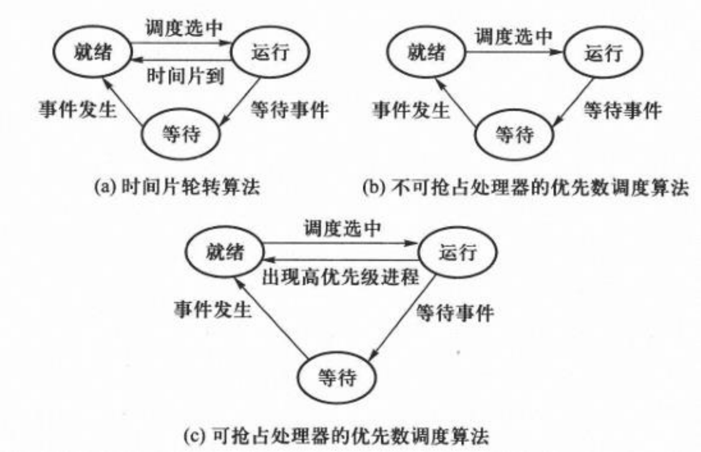
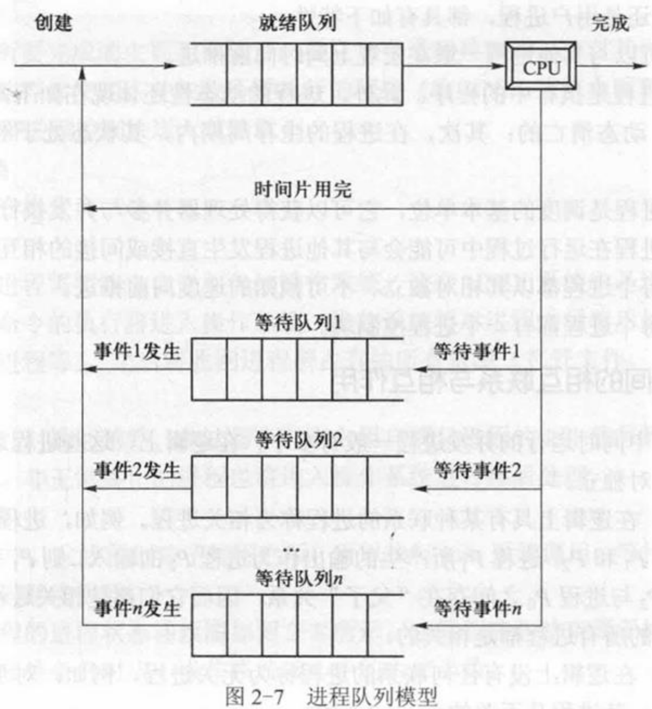
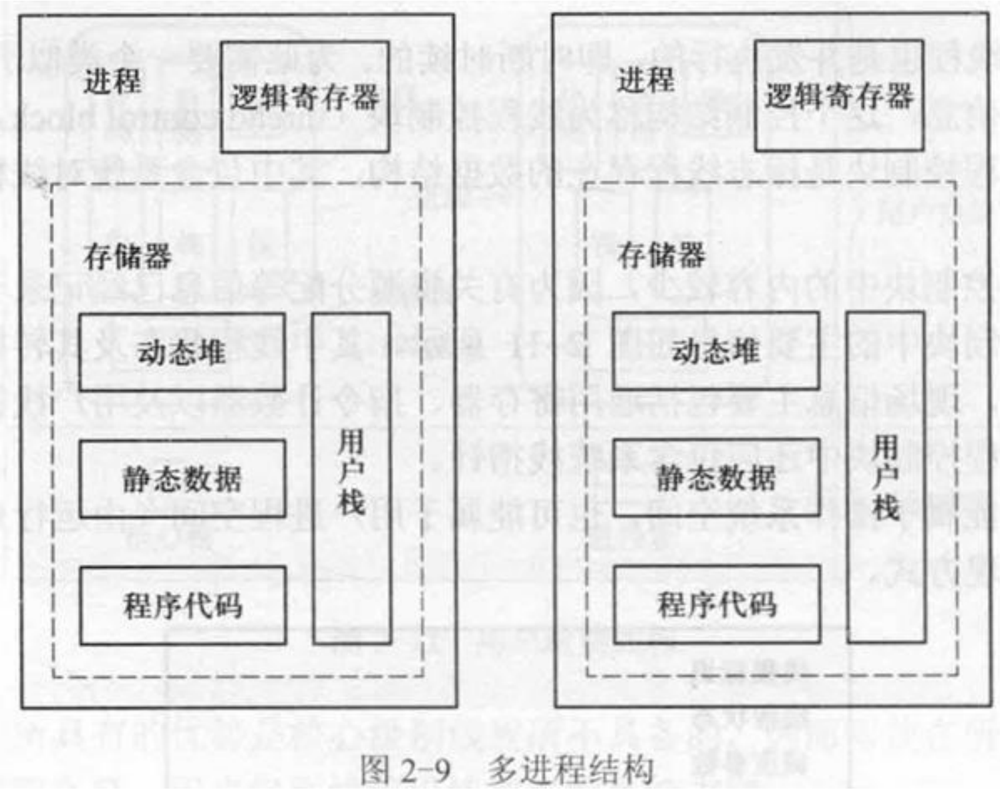
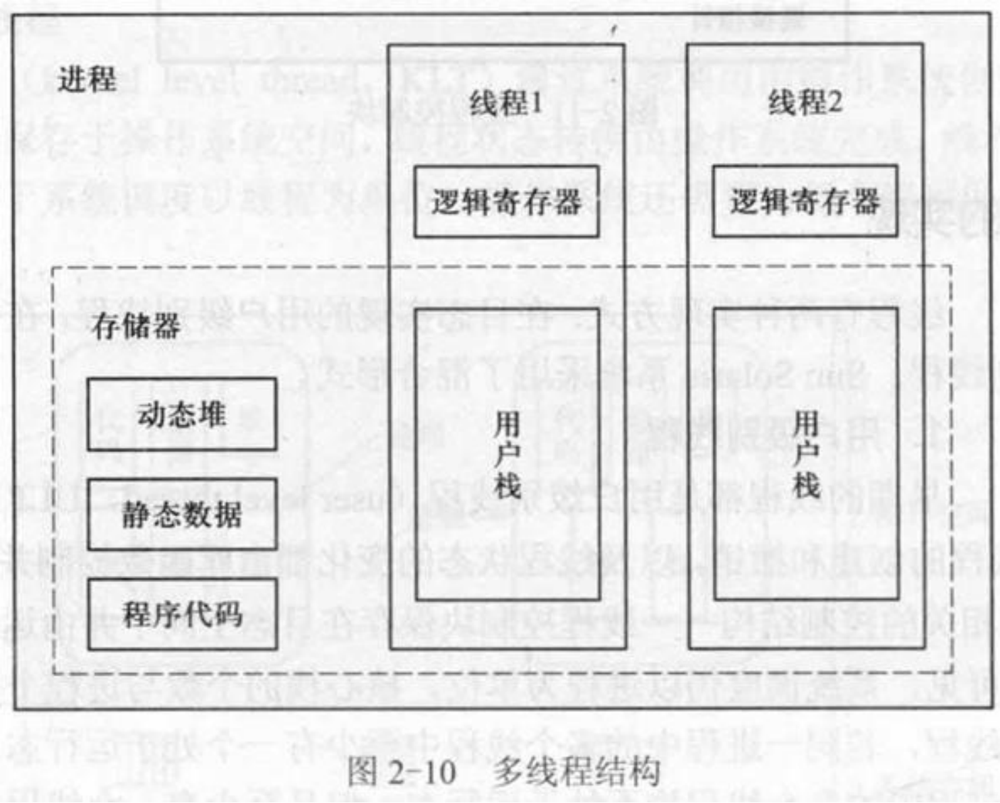

# 02 进程、线程与作业

整理自 `名词解释.pdf` 第 2 页和 `简答题.pdf` 第 8 至 17 页（原文第二章）。

## 本章要点

三组关系要分清：进程与程序、进程与线程、进程与作业。考试里最常问的是三态转换图（谁能转成谁，为什么就绪态不能直接转等待态）、PCB 的内容和作用、用户级别线程与核心级别线程的优缺点。多道程序设计的那几问答案都不长，按"设备、内存、处理器三类资源利用率"的框架背。

## 名词解释

多道程序设计：在计算机内存中同时存放几道相互独立的程序，使它们在管理程序控制之下相互穿插地运行。两个或两个以上程序在计算机系统中同处于开始到结束之间的状态。它是操作系统最基本、最重要的技术，根本目标是提高整个计算机系统的效率。

吞吐量：单位时间内系统所处理的作业（程序）的道数，即"吞吐量 = 作业道数 / 全部处理时间"。

进程：具有一定独立功能的程序关于一个数据集合的一次运行活动。

进程控制块：标志进程存在的数据结构，其中包含系统对进程进行管理所需要的全部信息。

进程映像：进程的程序（代码和数据）。

进程上下文：进程的物理实体与支持进程运行的物理环境合称为进程上下文。

进程切换：进程上下文切换的过程。

进程队列：系统按某种策略把进程组织成的若干队列。进程控制块是进程的代表，所以进程队列实际上由进程控制块构成。

相关进程：在逻辑上具有某种联系的进程。

无关进程：在逻辑上没有任何联系的进程。

线程：又称轻进程（LWP），是进程内的一个相对独立的执行流，被包含在进程之中，是进程中的实际运作单位。

线程控制块：标志线程存在的数据结构，其中包含系统对线程进行管理所需要的全部信息。

## 简答题

### 单道程序设计有哪些缺点？

设备资源利用率低、内存资源利用率低、处理器资源利用率低。

### 分析多道程序设计对系统资源利用率的影响

设备资源利用率提高：若干个搭配合理的程序同时进入内存，分别使用不同的设备资源，各种设备都会被用到并经常处于忙碌状态。

内存资源利用率提高：多道程序同时进入系统，可以避免单道程序过短而内存空间过大造成的浪费。进入系统的多个程序保存在内存的不同区域中。

处理器资源利用率提高：两道程序同时放入内存，一个程序等待输入输出完成期间，处理器执行另一个程序。

### 为何引入多道程序设计？内存中作业的道数是否越多越好？

引入多道程序设计是为了提高计算机系统资源的利用率。

道数并非越多越好。内存、外设等资源有限，只能容纳适当数量的作业。道数增加会导致资源竞争激烈、进程切换频繁、系统开销增大，作业执行反而变慢，系统效率下降。

### 什么是多道程序设计技术？在一个 CPU 的情况下如何实现？

多道程序设计是把多个用户程序同时装入内存，在操作系统控制下交替或同时运行。

单 CPU 时让多个程序轮流使用 CPU 和 I/O 设备：一个程序使用 CPU 时，其他程序在做 I/O 操作，从而提高 CPU 和外设的使用率。

### 多道程序设计带来哪些问题？如何解决？

处理器资源管理：把 CPU 资源按调度原则分派给可以运行的程序。

内存资源管理：进程空间既相互独立，又可共享。

设备资源管理：多个进程使用同一设备时不发生冲突。

### 进程在其生存周期内可能处于哪些基本状态？三者之间如何转换？

运行（run）态：进程占有处理器资源，正在运行。

就绪（ready）态：进程本身具备运行条件，但处理器数量少于可运行进程的数量，暂未投入运行，相当于在等处理器资源。

等待（wait）态：也称挂起（suspend）态、阻塞（block）态、睡眠（sleep）态。进程本身不具备运行条件，即使分给它处理器也不能运行，它正在等待某一事件发生，比如等某资源被释放、等数据传输完成信号。

转换关系：

1. 就绪到运行：就绪进程获得处理器。
2. 运行到就绪：运行进程被剥夺处理器，比如用完分给它的时间片，或出现更高优先级的进程。
3. 运行到等待：运行进程因某事件受阻，比如申请的资源被占用、启动的数据传输未完成。（更正：原文此处 OCR 串行，写成"其状事件发生态由运行态变为等待态"。）
4. 等待到就绪：所等事件发生，比如得到申请的资源、数据传输完成。

画图时注意只有这四条边。就绪态不能直接变等待态，等待态也不能直接变运行态。

原文还有一道"画出体现生灭过程的进程状态转换图"，就是在三态图两头各加一个状态：创建态经"创建"进入就绪，运行态经"结束"进入终止。

另一道题要求对三种调度算法分别画状态转换图，区别只在运行态回到就绪态的那条边：时间片轮转是"时间片到"；不可抢占处理器的优先数调度没有这条边，进程只能因等待事件或结束离开运行态；可抢占处理器的优先数调度是"出现高优先级进程"。

### 进程由哪几个部分构成？分别属于什么空间？

进程由进程控制块和程序两部分组成，程序包括代码和数据。进程控制块属于操作系统空间，程序属于用户空间。

### 进程队列有哪几种类型？进程在不同队列中如何变化？

就绪队列、等待队列、运行队列。

进程初创后进入就绪队列；CPU 空闲时从就绪队列选一个进程运行；获得处理器的进程用完时间片后回到就绪队列；运行进程因某事件受阻进入相应的等待队列；等待进程在所等事件发生后进入就绪队列；运行进程正常结束后离开系统。

### 从操作系统的角度看，进程有哪些类型？进程有哪些特性？

类型分系统进程和用户进程两大类。

特性有六条：并发性（可以与其他进程一道在宏观上同时向前推进）、动态性（进程是执行中的程序，动态产生、动态消亡，生存周期内状态经常变化）、独立性（进程是调度的基本单位，可以获得处理器并参与并发执行）、交互性（运行中可能与其他进程发生直接或间接的相互作用）、异步性（每个进程以相对独立、不可预知的速度向前推进）、结构性（每个进程都有一个进程控制块）。

### 描述进程与程序的联系和差别

联系：程序是构成进程的组成部分之一，进程存在的目的就是执行它对应的程序。没有程序，进程就失去存在的意义。

差别有三条：程序是静态的，进程是动态的；程序可以写在纸上或存储介质上长期保存，进程有生存周期，创建后存在、撤销后消亡；一个程序可以对应多个进程，一个进程只能对应一个程序。

### 进程间相互作用的方式有哪些？

直接相互作用：不需要通过媒介发生的相互作用，通常是有意识的。例如进程 P1 把一个消息发送给进程 P2；又如 P1 的步骤 S1 要等 P2 的某一步骤执行完毕之后才能继续。直接相互作用只发生在相关进程之间。（原文这句被 OCR 打乱，写成"需要在进程P2的某一步骤又执行完毕之后才能继续等"。）

间接相互作用：需要通过某种媒介发生的相互作用，通常是无意识的。例如进程 P1 想用打印机，设备被 P2 占用，P1 只好等待，P2 用完释放后把 P1 唤醒。间接相互作用可能发生在任意进程之间。

### 什么是进程？什么是线程？它们的关系是什么？

进程是具有一定独立功能的程序关于一个数据集合的一次运行活动。线程又称轻进程（LWP），是进程内的一个相对独立的执行流。

关系：一个进程可以包含多个线程，这些线程执行同一程序中相同或不同的代码段，共享数据区和堆。进程是资源的分配单位，线程是 CPU 的调度单位。一个线程只能属于一个进程，一个进程可以有多个线程。资源分配给进程，同一进程的所有线程共享该进程的全部资源；处理机分给线程，真正在处理机上运行的是线程。线程运行时需要协作同步，不同进程的线程之间要用消息通信实现同步。

### 与进程相比，线程有哪些优点？

上下文切换速度快：同一进程中的线程之间切换只需改变寄存器和栈，包括程序和数据在内的地址空间不变。

系统开销小：创建线程比创建进程要做的工作少，服务器动态创建线程比动态创建进程响应更快。

通信容易：同一进程中多个线程的地址空间共享，一个线程写到数据空间的信息可以直接被同进程的另一线程读取。

### 归纳引入多线程程序设计的原因

1. 某些应用本身有多个控制流，这些控制流有合作性质、需要共享内存，多线程易于建模。
2. 需要多控制流时，多线程比多进程快。统计测试表明线程的建立速度比进程快 100 倍，进程内线程切换与进程间切换的速度也差一个数量级。
3. 提高处理器与设备之间的并行性。单控制流时，启动设备的进程进入核心后被阻塞，该进程的其他代码也不能执行，若没有其他可运行程序，处理器就闲置；多线程结构中一个线程等待时其他线程可以继续执行。
4. 在多处理器环境中，多线程可以并行执行，既提高资源利用效率，又加快进程推进速度。

### 什么时候能用多线程结构实现多进程？

如果两个进程有一定的逻辑联系，比如二者是执行相同代码的服务程序，或者二者是协同进程，就可以用多线程结构实现。

原题要求先画出两种结构。多进程结构里每个进程各有一套逻辑寄存器和一整块存储器（动态堆、静态数据、程序代码、用户栈）：

多线程结构里只有一个进程，动态堆、静态数据、程序代码由各线程共用，每个线程只私有逻辑寄存器和用户栈：

### 线程有哪些实现方式？各自有什么优缺点？

两种实现方式：在目态实现的用户级别线程，在管态实现的核心级别线程。

用户级别线程由系统库支持，线程的创建、撤销和状态变化都由库函数控制并在目态完成，TCB 保存在目态空间、由运行系统维护。线程对操作系统不可见，系统调度仍以进程为单位，核心栈的个数与进程个数对应。

- 优点：不依赖于操作系统，可以采用与问题相关的调度策略，灵活性好；同一进程中的线程切换不必进入操作系统，效率较高。
- 缺点：同一进程中的多个线程不能真正并行，即使在多处理器环境中也如此；线程对操作系统不可见，调度在进程级别，进程中某个线程通过系统调用进入操作系统后受阻，该进程的其他线程也不能运行。

核心级别线程通过系统调用由操作系统创建，TCB 保存在操作系统空间，状态转换由操作系统完成，线程是 CPU 调度的基本单位，操作系统还要为每个线程保持一个核心栈。

- 优点：并发性好，多 CPU 环境中同一进程的多个线程可以真正并行执行。
- 缺点：线程控制和状态转换要进入操作系统完成，系统开销较大。

按题目问的四点归纳：创建和切换速度用户级别快；并行性核心级别好；TCB 分别放在目态空间和操作系统空间。

### 试比较进程状态与该进程内部线程状态之间的关系

对于用户级别线程：同一进程的多个线程中至少有一个处于运行态时，该进程是运行态；都不处于运行态但至少有一个就绪时，该进程是就绪态；全部处于等待态时，该进程是等待态。

### 什么是进程上下文？包括哪些成分？哪些成分对目态程序可见？

进程运行时操作系统要为它设置运行环境，如系统堆栈、地址映射寄存器、打开文件表、PSW 与 PC、通用寄存器等。进程的物理实体与支持进程运行的物理环境合称进程上下文。

三个组成部分：

1. 用户级上下文：由用户进程的程序块、用户数据块（含共享数据块）和用户堆栈组成的进程地址空间。
2. 系统级上下文：由进程控制块、内存管理信息、进程环境块和系统堆栈等组成。
3. 寄存器上下文：由程序状态字寄存器、各类控制寄存器、地址寄存器、通用寄存器、用户堆栈指针等组成。

其中用户级上下文和部分寄存器上下文对目态程序可见。

### 进程切换时需要保存哪些现场信息？

进程切换就是进程上下文的切换，进程上下文指进程运行的物理环境。现场信息包括地址映射寄存器、通用寄存器、浮点寄存器、SP、PSW（程序状态字）、PC（指令计数器）以及打开文件表等。（更正：原文作"地址映寄存器"。）

### 什么是 PCB？作用是什么？包含哪些内容？

PCB 是进程控制块的简称，是标识进程存在的数据结构，也是操作系统用来描述和控制并发进程的数据结构，其中包含系统管理进程所需要的全部信息。它是进程存在的唯一标志。

内容一般包括：进程标识、用户标识、进程状态、调度参数、现场信息、家族联系、程序地址、当前打开文件、消息队列指针、资源使用情况、进程队列指针。

### 什么是线程控制块？包含哪些内容？

线程控制块（TCB）是线程存在的标志，保存系统管理线程所需要的全部信息。

TCB 的内容比 PCB 少，因为资源分配等信息多数已记录在所属进程的 PCB 中。主要信息有线程标识、线程状态、调度参数、现场、链接指针。现场信息主要包括通用寄存器、指令计数器 PC 和用户栈指针；操作系统支持的线程，TCB 中还应包含系统栈指针。

### 同一进程中的多个线程有哪些成分共用，哪些私用？

共用进程获得的主存空间和资源，包括代码区、数据区、动态堆空间。私有成分有三样：线程控制块、一个执行栈、运行时动态分给线程的寄存器。

### 试比较 Linux 中 `fork()` 与 `clone()` 的差异

`fork()` 创建子进程，子进程与父进程各有独立的地址空间，子进程的地址空间内容从父进程复制得到。

`clone()` 创建子进程（线程），父子之间可以共享存储空间。

### 作业与进程有何不同？它们之间有什么关系？

作业是用户在一次上机活动中要求计算机系统所做的一系列工作的集合，也称任务（task）。进程是具有一定独立功能的程序关于某个数据集合的一次可以并发执行的运行活动。

作业是宏观的执行单位，从用户角度看。作业的运行状态指把作业调入内存后产生若干个进程去竞争 CPU。进程是微观的执行单位，从系统角度看，是抢占 CPU 和其他资源的基本单位；进程的执行状态指进程真正占用了 CPU。

关系：一个作业调入内存、处于执行状态时，系统会为它建立若干个进程，进程的所有状态都对应作业的执行状态，通过这些进程的执行完成该作业。

### 哪些事件会导致进程被创建？

四种：系统初始化（如 Windows 开机时创建许多进程）；运行中的进程调用了创建类系统调用（如程序执行 `fork()`）；用户请求创建一个进程（如命令行输入 `./a.out`）；一个批处理作业的初始化。

第一章里同一道题还有另一种分法：用户登录、作业调度、提供服务、应用请求。

### 有人说用户进程执行的程序一定是用户自己编写的，这种说法对吗？

不对。例如 C 语言编译程序以用户进程身份运行，但它一般不是用户自己写的。调试程序、字处理程序等工具软件也一样。

### 何谓系统开销？举三个例子

运行操作系统程序、实现系统管理所花费的时间和空间称为系统开销。例如操作系统内核要占用内存空间；页面调度要占用设备资源并消耗处理器时间；进程切换也要占用处理器时间。

### 由核心返回目态程序时，进程的 PSW 和 PC 为何必须用一条机器指令同时恢复？

只有同时恢复，才能保证系统状态由管态转到目态的同时，控制转到上升进程的断点处继续执行。

分开恢复的两种次序都行不通：先恢复 PSW 再恢复 PC，恢复 PSW 后已经转到目态，操作系统恢复 PC 的动作无法完成；先恢复 PC 再恢复 PSW，PC 改变后控制已转到操作系统的另一区域（此时 PSW 仍是系统态），PSW 无法恢复。

## 易混对比

| 对比项 | 进程 | 线程 |
| --- | --- | --- |
| 定位 | 资源分配单位 | CPU 调度单位 |
| 控制结构 | PCB，在操作系统空间 | TCB，用户级线程在目态空间，核心级线程在操作系统空间 |
| 切换代价 | 大，地址空间要换 | 小，只换寄存器和栈 |
| 私有成分 | 完整地址空间和资源 | TCB、执行栈、寄存器 |

| 对比项 | 用户级别线程 | 核心级别线程 |
| --- | --- | --- |
| 实现位置 | 目态，由系统库支持 | 管态，由系统调用创建 |
| 调度单位 | 进程 | 线程 |
| 真正并行 | 不能，多处理器下也不能 | 能 |
| 一个线程阻塞 | 整个进程都停 | 其他线程照常运行 |
| 开销 | 小 | 大 |

| 对比项 | 作业 | 进程 |
| --- | --- | --- |
| 视角 | 用户，宏观 | 系统，微观 |
| 单位含义 | 一次上机活动要做的全部工作 | 一次程序运行活动 |
| 对应关系 | 一个作业对应若干个进程 | 一个进程只对应一个程序 |
