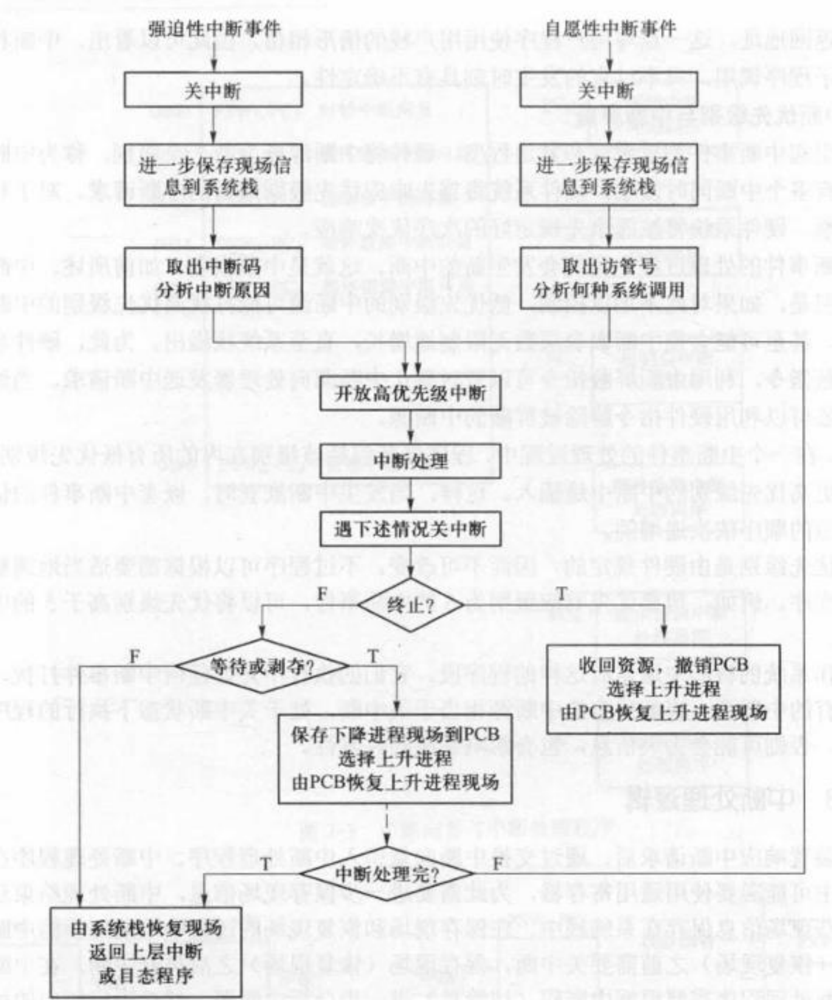
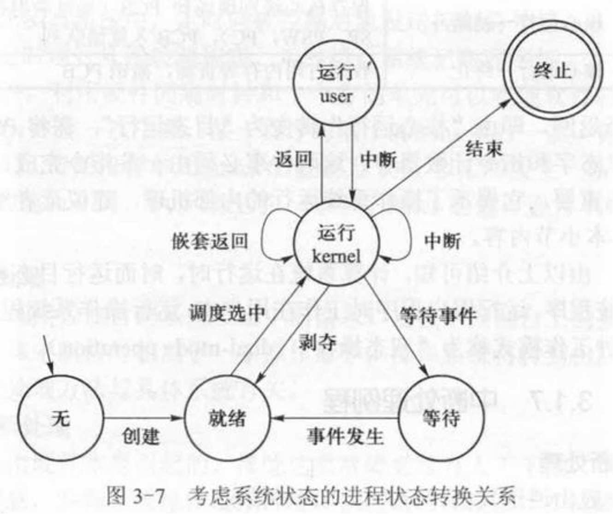
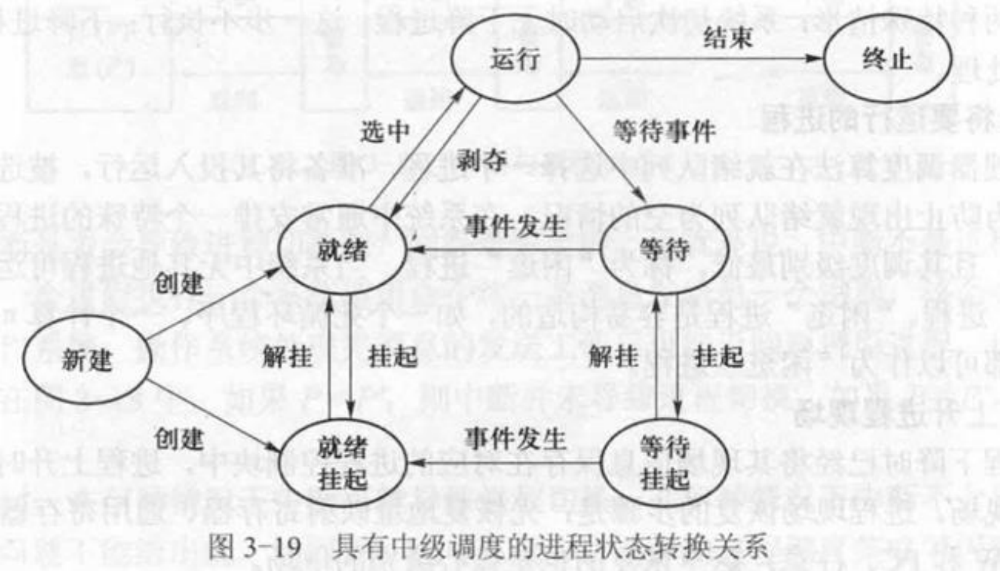
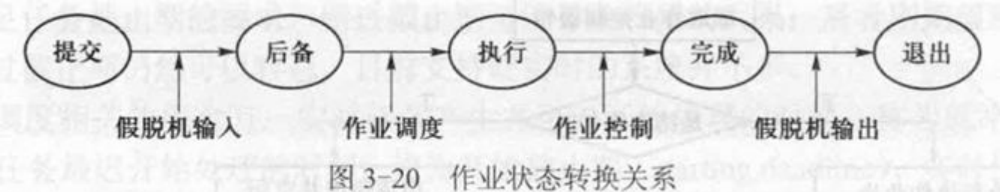

# 03 中断与处理器调度

整理自 `名词解释.pdf` 第 3 页和 `简答题.pdf` 第 18 至 31 页（原文第三章）。

## 本章要点

这章题量最大，分两块。中断部分反复考三件事：中断是目态转管态的唯一途径、因此也是进程切换和进程状态转换的必要条件而非充分条件；中断响应过程的三步；中断嵌套与中断屏蔽的关系。调度部分要能说清每种算法的思想和优缺点，并能算出平均周转时间和平均等待时间。

## 名词解释

阵发时间：处于 CPU 阵发期的进程所需要的处理时间（burst time）。

CPU 阵发期（CPU burst cycle）：对处理器的一次连续使用。

I/O 阵发期：对设备的一次连续使用。

中断：程序运行过程中出现某种紧急事件，必须中止当前正在运行的程序，转去处理此事件，然后再恢复原来运行的程序，这个过程称为中断。

中断源：引起中断的事件。

中断寄存器：硬件为每一个中断源设置的寄存器。中断发生时硬件把与中断相关的详细信息存入该寄存器，中断处理程序从中分析触发中断的原因并采取相应措施。

中断字：中断寄存器中的内容。

中断系统：中断的实现需要硬件和软件合作，硬件部分称为中断装置，软件部分称为中断处理程序，二者统称中断系统。

中断向量：中断处理程序的运行环境（PSW）与入口地址（PC）。

中断优先级别：硬件根据引起中断事件的重要性和紧迫程度把中断源分成的若干个级别。

中断嵌套：在中断事件的处理过程中又发生新的中断。

双态操作：计算机系统运行时，时而运行目态程序，时而运行操作系统程序。运行用户程序时工作在用户态，运行操作系统程序时工作在系统态，这种工作模式称为双态操作。

处理器调度：CPU 资源在可运行实体之间的分配。

进程上下文：进程相关的运行环境，包括地址映射寄存器、通用寄存器的状态以及 SP、PSW、PC 等。

进程切换：由一个进程的上下文转换到另一个进程的上下文的过程，也称上下文切换。

低级调度（短期调度）：将处理器资源分配给进程或线程、使其真正向前推进的调度。

作业步：一个作业的处理可以分成的若干相对独立的执行步骤。

实时调度：满足实时任务各自时间约束条件的调度。

## 中断

### 中断有哪些类型？分别有什么特点？

分两大类。

强迫性中断：这类事件是正在运行的程序不期望的，是否发生、何时发生事先无法预知，运行程序可能在任意位置被打断。包括时钟中断（如硬件实时时钟到时）、输入输出中断（如设备出错、传输结束）、控制台中断（如操作员通过控制台发命令）、硬件故障中断（如掉电、内存校验错）、程序错误中断（如目态程序执行特权指令、地址越界、缺页或缺段故障、溢出、除数为 0）。

自愿性中断：这类事件是正在运行的程序有意识安排的，通常由程序执行访管指令引起，目的是请求系统提供某种服务。它的发生有必然性，位置也确定。

### 中断的响应过程主要有哪几个步骤？

1. 识别中断源：多个中断源同时存在时，由中断装置选择优先级别最高的。
2. 保存现场：把正在运行进程的程序状态字和指令计数器的内容压入系统栈。
3. 引出中断处理程序：把与中断事件对应的中断向量从内存指定单元取出，送入程序状态字和指令计数器，于是转入对应的中断处理程序。

另一种四步说法（原文第 30 页）：响应中断、保存现场；分析中断原因、进入中断处理程序；处理中断；恢复现场、退出中断。

### 什么是多级中断？

为便于对同时产生的多个中断按优先次序处理，设计硬件时给各种中断规定了高低不同的响应级别，优先权相同的放在一级，这就是多级中断。

### 试举一些中断处理的例子

输入输出中断处理、时钟中断处理、控制台中断处理、硬件故障中断处理、程序错误中断处理。

### 描述中断处理逻辑

中断装置响应中断请求后，通过交换中断向量引入中断处理程序。中断处理程序处理过程中可能要用通用寄存器，所以要进一步保存现场信息，处理结束后再恢复现场，这些信息保存在系统栈中。保存现场和恢复现场期间不响应新的中断，所以保存（恢复）现场之前要关中断，之后再开中断。处理过程中，中断处理程序根据中断码（访管号）进一步分析中断源，做相应处理，最后根据情况决定是否切换进程。

原题还要求画出中断处理过程的流程图。强迫性中断和自愿性中断的前三步对称：关中断、把现场信息进一步保存到系统栈、取中断码（访管号）分析原因，然后汇合到"开放高优先级中断、中断处理、遇下述情况关中断"。之后分三路：进程终止就收回资源、撤销 PCB 并调度上升进程；进程要等待或被剥夺就把下降进程现场存进 PCB 再换上升进程；两者都不是就由系统栈恢复现场，返回上层中断或目态程序。

### 何谓中断向量？用户能否修改中断向量的值？

中断事件发生时，中断装置按中断类别自动把中断处理程序对应的 PSW 和 PC 送入程序状态字和指令计数器，于是转移到对应的中断处理程序。这个转移类似于向量转移，所以这对 PSW 和 PC 称为中断向量。

用户不能修改。修改中断向量要用特权指令，普通用户程序不能执行特权指令。如果允许修改，用户就能破坏中断向量与处理程序之间的联系并攻击系统，例如把中断向量指向一段病毒程序，中断一发生就执行病毒程序。

### 中断向量的存储位置由谁决定？值如何确定？

存储位置由硬件确定，程序不能改变。中断发生后，中断装置按中断类型到内存指定位置取中断向量。

向量的值由操作系统设计者根据各中断处理程序的存储位置和运行环境确定，系统启动时由初始化程序填入指定位置。

### 有人说"中断发生后，硬件中断装置保证处理器进入管态"，这种说法准确吗？

不准确。中断发生后硬件中断装置负责引出中断处理程序，而中断处理程序是否运行于管态取决于 PSW 中的处理器状态位，这一位的值是操作系统初始化时设置的。只有初始化程序正确设置了该状态位，才能保证中断后进入管态。

### 中断发生时，旧的 PSW 和 PC 为何要压入系统栈？

中断处理程序的最后一条指令通常是中断返回指令，它从系统栈顶弹出断点信息。如果没有把 PSW 和 PC 压栈，弹出的就不是中断前的断点信息而是不确定的信息，系统会进入不确定状态，严重时崩溃。

用栈结构是因为中断可能嵌套，栈能保证以与发生中断相反的次序返回上层中断处理程序或返回目态。

有些硬件系统不用栈，中断发生时把现场信息送到系统空间的指定单元，每个现场保存单元与中断事件一一对应。缺点是中断类型不能增加，相同类型的中断不能嵌套发生。

### 为什么需要中断屏蔽？为什么中断处理中通常允许高优先级别中断插入、不响应低优先级别中断？

硬件按中断事件的重要性和紧迫程度把中断源分成若干级别，称为中断优先级。多个中断同时发生时，硬件先响应优先级别最高的；优先级别相同的按事先规定的次序依次响应。

中断嵌套是必要的，但不加控制时，低优先级别的中断源可能打扰高优先级别中断事件的处理过程，甚至使嵌套层数无限增长直到系统栈溢出。所以硬件提供中断屏蔽指令，可以暂时禁止一个或多个中断源向处理器发中断请求，需要时再解除屏蔽。

通常在处理一个中断事件时，程序屏蔽包括该级别在内的所有较低优先级别的中断，但允许更高优先级别的中断插入。这样嵌套中断的优先级别按响应顺序依次递增。两个原因：逻辑上高优先级别对应的事件更急迫；硬件中断类型有限，这样做也限制了中断嵌套的深度。

### 为什么说"关中断"会影响系统的并发性？

以单处理器系统为例。并发是通过把处理器轮流分配给多个进程实现的，分配由处理器调度程序完成。中断是进程切换的必要条件，关中断后操作系统无法获得处理器控制权，多个进程也就无法分时共享处理器，处理器会被一个进程独占。

关中断是实现临界区管理的简捷方法，也没有忙式等待问题，但临界区要尽量小，执行完立即开中断。关中断期间互斥已经不限于临界区范围，而是扩展到了整个操作系统空间。

### 假如关中断后操作系统进入死循环，会产生什么后果？

系统不响应任何外部干预事件，表现为死机。

### 为什么不允许目态程序执行关中断指令及中断屏蔽指令？

开关中断指令和中断屏蔽指令属于特权指令，一般用户无权使用。允许用户使用时，用户关中断后可能影响系统对内部或外部事件的响应，也会使操作系统无法获得系统控制权。

### 如果没有中断，能否实现多道程序设计？

不能。一个程序一旦被调度执行就会一直执行下去，中途不可能被打断，达不到多个进程交替执行的并发目的。

### 哪些中断源可以屏蔽，哪些不可以？（输入输出中断、访管中断、时钟中断、掉电中断）

输入输出中断可以屏蔽，时钟中断可以屏蔽；访管中断不可以屏蔽，掉电中断不可以屏蔽。

访管中断的道理：在管态屏蔽它没有意义（管态下不会发生访管中断）；在目态屏蔽它，应用程序就无法访问操作系统，不能正常运行。

### 哪些中断事件可由用户自行处理？（溢出、地址越界、除数为零、非法指令、掉电）

只影响应用程序自身的中断可以由用户自行处理，包括溢出和除数为零。

可能影响其他用户或操作系统的中断只能由操作系统的中断处理程序统一处理，包括地址越界、非法指令、掉电。

### 如果中断由用户程序自行处理，为何要把断点由系统栈弹出并压入用户栈？

中断发生时被中断程序的现场信息已被压入系统栈，而中断续元运行于目态，它执行完毕后是从用户栈恢复现场信息的。所以操作系统在转到中断续元之前要把系统栈中的现场信息弹出压入用户栈，否则中断续元执行完后无法恢复现场返回断点。

### 为什么说中断是进程切换的必要条件，但不是充分条件？

若在 T1 与 T2 之间发生了进程切换，则这段时间内一定执行过处理器调度程序。处理器调度程序是操作系统低层的一个模块，运行于管态，说明处理器状态曾由目态转为管态；而中断是目态转管态的必要条件，所以这段时间内一定发生过中断。这说明中断是进程切换的必要条件。

它不是充分条件：例如一个进程执行系统调用把消息发给另一个进程，该命令通过中断进入操作系统执行，操作系统处理完发送工作后可能返回原调用进程（没有切换），也可能选中一个新进程（发生切换）。

### 试分析中断与进程状态转换之间的关系

进程状态转换由内核控制。如果一个进程的状态发生改变，则在新旧状态之间一定发生过由目态到管态的转换，而中断是这种转换的必要条件，所以中断也是进程状态转换的必要条件。

原文配套的"考虑系统状态，画图解释进程状态转换关系"一题，把运行态拆成用户态运行和核心态运行两个状态。用户态运行只能经中断进入核心态运行，再经返回回到用户态；核心态运行上还有中断和嵌套返回两个自环。调度选中、剥夺、等待事件、结束这几条边都连在核心态运行上，从图上就能看出每一次状态转换都要先经过中断进入核心态。

### 一定会引起 / 可能引起进程状态转换（进程切换）的中断事件各举两例

一定会引起的：当前运行进程终止；应用程序启动 I/O 传输并等待 I/O 数据；运行程序申请当前被占用的某一资源。

可能引起的：时钟中断、设备输入输出中断。以时间片轮转算法为例，时钟中断发生后若当前进程的时间片已用完则发生进程切换，否则不发生。

### 若 T1 时刻进程 P1 运行，T2 时刻进程 P2 运行且 P1 与 P2 不同，则 T1 到 T2 期间一定发生过中断。这种说法对吗？

对。由题意可知这期间发生了进程切换，而进程切换必须执行处理器调度程序，调度程序只能在系统态执行，只有中断才能进入系统态，所以这期间一定发生过中断。

### 解释"中断现场"与"进程切换现场"的差异

中断现场保存在系统栈中，进程切换现场保存在进程的 PCB 中。

### 为什么保存在 PCB 中的现场都是核心级别的现场？

等待和剥夺都由操作系统完成，都发生在核心态，所以保存在 PCB 中的是核心级别的现场，而不是目态程序的现场。

### 进程上下文包括哪些内容？

通用寄存器；PSW、PC、SP；地址映射寄存器；用户栈和系统栈；进程控制块。

### 用户栈和系统栈各有哪些用途？

用户栈保存函数之间相互调用的参数、返回断点、局部变量、返回值。

系统栈保存函数之间相互调用的参数、返回断点、局部变量、返回值，另外还保存中断现场（PSW 和 PC）。

### 举出两个例子说明操作系统访问进程空间的必要性

进程执行输出操作时通过系统调用进入系统，操作系统要把待输出的数据从进程空间取出送给指定外设，因此必须访问用户进程空间。

发生可由用户自己处理的中断事件时，操作系统在转到中断续元之前要把系统栈中的现场信息弹出压入用户栈，因此也必须访问进程空间。

## 处理器调度

### 处理器资源管理需要解决哪 3 个问题？

按什么原则分配处理器（确定调度算法）；什么时候分配处理器（确定调度时机）；如何分配处理器（给出调度过程）。

### 处理器调度算法的选择指标

CPU 利用率（使 CPU 尽量忙碌）、吞吐量（单位时间内处理的计算任务数量）、周转时间（从任务就绪到处理完毕所用时间）、响应时间（从任务就绪到开始处理所用时间）、系统开销（调度过程付出的时空代价）。

### 处理器的调度时刻有哪些选择方法？

非剥夺式（non-preemptive，也称非抢先）：进程不能把处理器强行从正在运行的进程那里抢过来。一个进程被选中后会一直运行，直到因某事件而等待，或者运行完毕。优点是系统开销较小，缺点是不能保证正在运行的进程始终是当前可运行进程中优先数最高的。

剥夺式（preemptive，也称抢先）：进程可以强行抢占处理器。可能发生进程切换的情形有三种：正在运行的进程因某事件而等待；正在运行的进程运行完毕；出现优先级高于当前进程的新就绪进程。这里"出现"包括某进程被唤醒（等待态转就绪态）和动态创建了新进程两种情况。优点是保证正在运行的进程始终是优先数最高的，缺点是切换频繁、系统开销较大。

### 先到先服务算法（FCFS）

按进程申请 CPU 的次序，也就是进入就绪态的次序调度。优点是公平，不会饿死。缺点是短进程等待时间长，平均等待时间较长。

### 最短作业优先算法（SJF）

按 CPU 阵发时间递增的次序调度，容易证明它的平均周转时间（平均等待时间）最短。缺点是不公平：较长的就绪任务可能因短任务不断到达而长期得不到运行机会，发生饥饿甚至被饿死。

### 最短剩余时间优先算法（SRTN）

剥夺式算法。CPU 空闲时选择剩余时间最短的进程或线程；新进程到达时比较它所需的时间与当前运行进程的估计剩余时间，新进程更短就切换。实质上是可剥夺形式的最短作业优先算法。

### 最高响应比优先算法（HRN）

先到先服务与最短作业优先的折中。响应比按原文的公式图片是

$$RR = \frac{BT + WT}{BT} = 1 + \frac{WT}{BT}$$

其中 RR 为响应比，BT 为 CPU 阵发时间，WT 为等待时间。

同时到达的任务中处理时间较短的优先调度；处理时间较长的任务随等待时间增加而动态提升响应比，所以不会饥饿。

### 循环轮转算法（RR）

系统为每个进程规定一个时间片（time slice），所有进程按时间片轮流运行。所有就绪进程排成就绪队列，处理器空闲时选队头进程投入运行并分给它一个时间片。时间片用完时，如果该进程既未结束 CPU 阵发期也未因故等待，就剥夺它的处理器，把它排到就绪队列尾部，再选新的队头进程运行。

### 分类排队算法（MLQ）

以多个就绪队列为特征，把所有可运行进程按某种原则分类，以实现期望的调度目标。例如通用操作系统中可以排成三个队列：Q1 实时就绪进程队列、Q2 分时就绪进程队列、Q3 批处理就绪进程队列。处理器空闲时先选 Q1 中的进程，Q1 空则选 Q2，两个都空才选 Q3。每个队列内部又可以分别采用最高优先数优先算法或循环轮转算法，例如 Q1 和 Q3 用最高优先数优先，Q2 用循环轮转。（更正：原文此处 OCR 成"如Q，和Q3采用最高优先数优先算法，必采用循环轮转算法"。）

### 反馈排队算法

也以多个就绪队列为特征，每个队列内部通常用循环轮转算法，不同的是进程可以在队列之间移动。这些队列的优先级依次递减，时间片长度依次递增。

进程被创建或所等待的事件发生时，进入第一级就绪队列。某队列中的进程用完该队列对应的时间片后若尚未结束，就进入下一级队列；最后一级队列的进程用完时间片后若尚未结束，仍留在同一级队列。处理器空闲时先选第一级队列的进程，该级为空再选第二级，以此类推。

三个特点：

1. 短进程优先处理，运行时间短的进程在前几个队列中就执行完，而这些队列优先调度。
2. 设备资源利用率高，与设备打交道的进程会因申请的资源被占用或启动了数据传输而进入等待态，得到资源或传输完成后它回到第一级就绪队列，能尽快获得处理器并使用设备。
3. 系统开销较小，运行时间长的进程最终落到低优先级队列，那里时间片较长，调度频率较低。

### 处理器调度需要经历哪几个阶段？

1. 保存下降进程现场：把当前核心态的现场信息（地址映射寄存器、通用寄存器、SP、PSW、PC）保存到下降进程的 PCB 中。这里保存的是核心级别的现场，以后再调度到该进程时会接着执行核心态尚未执行完的代码。两种特殊情形：系统初次启动时没有下降进程，这一步不执行；下降进程是终止进程时直接转善后处理。
2. 选择将要运行的进程：按调度算法从就绪队列中选一个进程（称为上升进程）投入运行。为防止就绪队列为空，系统中通常安排一个永远运行不完、调度级别最低的"闲逛"进程，没有其他进程可运行时就运行它。闲逛进程很容易构造，例如一个死循环程序对应的进程。
3. 恢复上升进程现场：从它的 PCB 中恢复现场，先恢复地址映射寄存器、通用寄存器及 SP 等，最后恢复 PSW 和 PC。恢复的同样是核心级别的现场。

这三个步骤要执行一定数量的 CPU 指令，通常用汇编语言编写并认真优化。处理器调度是经常性工作，省一条指令都会影响系统效率。

### 进程切换时，上升进程的 PSW 和 PC 为何必须由一条指令同时恢复？

只有同时恢复才能保证系统状态由管态转到目态的同时，控制转到上升进程的断点处继续执行。先恢复 PSW 再恢复 PC 的话，恢复 PSW 后已进入目态，操作系统无法再恢复 PC；先恢复 PC 再恢复 PSW 的话，PC 改变后控制转到操作系统的另一区域（PSW 仍是系统态），PSW 无法恢复。

### 根据进程和线程的组成，说明进程调度和线程调度各需要完成哪些工作

进程调度要切换：地址映射寄存器、用户栈指针、通用寄存器、PSW 与 PC。

线程调度要切换：用户栈指针、通用寄存器、PC。

### 采用可抢占的静态优先数调度算法时，何时发生抢占？

当一个新创建进程或一个被唤醒进程的优先数比正在运行进程高时，可能发生抢占。

### 采用可抢占的动态优先数调度算法时，何时发生抢占？

除上面两种情形外，还有一种：某个就绪进程的优先数在动态调整后超过了正在运行的进程。

### 实时系统中采用不可抢占的优先数调度算法是否合适？

不合适。一旦一个低优先数、需要大量 CPU 时间的进程占用处理器，它会一直运行到结束或阻塞，在此之前即使高优先数的紧急任务到达也得不到处理，可能延误对重要事件的响应。

### 分时系统中进程调度是否只能用时间片轮转算法？

不是。分时系统要求响应及时，除循环轮转外还可以用可剥夺 CPU 的动态优先数调度算法。例如经典 UNIX 的处理器调度算法有负反馈性质，同样能保证响应速度。

### 采用等长时间片轮转的分时系统中，各终端用户占用处理器的时间总量是否相同？

不相同。处理器是分配给进程（线程）的，不同终端用户的进程数量可能不同，进程多的终端获得的 CPU 时间就多。

### 系统资源利用率与系统效率是否一定成正比？

不一定。系统效率高则资源利用率高，反过来不成立。例如虚拟页式存储管理中，页面置换算法不合理或分给进程的页框太少时会发生颠簸（抖动），此时 I/O 设备很忙，系统效率却很低。

### 低级调度、中级调度、高级调度各是什么？

低级调度：负责分派处理器，也称处理器调度，使被选中的进程真正进入运行状态。

中级调度：介于低级调度与高级调度之间。在 UNIX 系统中它负责进程在内存和外存之间的交换，缓解内存紧张。

高级调度：又称作业调度，负责把作业由输入井调入内存，并为其创建作业控制进程。

原文另有一道"画出具有中级调度的进程状态转换关系图"。加入中级调度后，就绪和等待各多出一个挂起状态：就绪经挂起变成就绪挂起、经解挂回来，等待与等待挂起之间同样如此；等待挂起在事件发生后变成就绪挂起。新建进程可以直接进入就绪，也可以直接进入就绪挂起。

### 引起进程调度的因素有哪些？

完成任务（运行进程完成任务释放 CPU）；等待资源（等待资源或事件放弃 CPU）；时间片用完（时钟中断让出 CPU）；核心处理完中断或陷入事件后发现"重新调度标志"被置上。

### 实时任务如何分类？

按发生规律分两类：随机性实时任务（由随机事件触发，发生时刻不确定）和周期性实时任务（每隔固定时间发生一次）。

按时间约束的强弱分硬实时和软实时。硬实时必须满足任务截止期，错过可能导致严重后果；软实时期望满足截止期，错过仍可容忍。目前支持硬实时的系统并不多。

### 最早截止期优先调度（EDF）

优先选择完成截止期最早的实时任务。新到达的实时任务若截止期早于正在运行的任务，就重新分派处理器，属于剥夺式。

### 单调速率调度（RMS）

面向周期性实时任务，属于非剥夺式调度。它把任务的周期作为调度参数，发生频度越高，调度级别越高。

## 作业调度

### 一个用 C 和汇编两种语言写的程序，作为批作业处理包括哪几个步骤？

用 C 语言编译程序编译 C 代码部分；用汇编程序汇编汇编代码部分；用连接装配程序把前两步产生的浮动程序连接装配；执行上一步产生的目标代码。

### 作业的状态转换关系

作业一般经历提交、后备、执行、完成、退出五个状态：由输入机向输入井传输的作业处于提交状态；进入输入井但尚未调入内存的作业处于后备状态；被调度选中进入内存处理的作业处于执行状态；处理结果传送到输出井的作业处于完成状态；由输出井向打印设备传送的作业处于退出状态。

状态转换由谁完成：提交到后备由假脱机输入完成；后备到执行、执行到完成由作业调度完成；完成到退出由假脱机输出（SPOOL 输出）完成。

原文文字和图在执行到完成这一步上说法不同：文字写的是作业调度，下面的图 3-20 在这条边上标的是作业控制。画图题照图标作业控制，简答题照文字答作业调度也能说通，因为作业调度的职责里包含作业结束后的善后处理。

### 作业调度和进程调度各自的主要功能是什么？

作业调度：记录系统中各作业的情况；按某种调度算法从后备作业队列中挑选作业；为选中的作业分配内存和外设等资源；为选中的作业建立相应的进程；作业结束后做善后处理。

进程调度：保存当前运行进程的现场；用一定的调度算法从就绪队列中挑选一个进程，把它的状态改为运行态；为选中的进程恢复现场并分配 CPU。

### 作业调度与进程调度的区别

作业调度是宏观调度，选中的作业只是具备获得处理机的资格，还没有占有处理机；进程调度是微观调度，真正把处理机分配给选中的进程。

进程调度相当频繁，作业调度的执行次数很少。

有的系统可以不设作业调度，但进程调度必不可少。

## 易混对比

| 对比项 | 强迫性中断 | 自愿性中断 |
| --- | --- | --- |
| 是否被程序期望 | 不期望 | 有意安排 |
| 发生位置 | 任意位置 | 确定（访管指令处） |
| 典型例子 | 时钟、I/O、控制台、硬件故障、程序错误 | 访管指令、系统调用 |
| 能否屏蔽 | 部分可屏蔽（I/O、时钟），掉电不可屏蔽 | 不可屏蔽 |

| 对比项 | 高级调度 | 中级调度 | 低级调度 |
| --- | --- | --- | --- |
| 别名 | 作业调度 | 交换调度 | 处理器调度、短期调度 |
| 管什么 | 作业从输入井进内存 | 进程在内存与外存之间交换 | 把 CPU 分给进程或线程 |
| 频率 | 很低 | 中等 | 很高 |

| 算法 | 是否可剥夺 | 主要优点 | 主要缺点 |
| --- | --- | --- | --- |
| FCFS | 否 | 公平，不饿死 | 短进程等待久 |
| SJF | 否 | 平均等待时间最短 | 长任务可能饿死 |
| SRTN | 是 | 响应更快 | 长任务饿死风险更大 |
| HRN | 否 | 兼顾等待时间，不饿死 | 每次调度要算响应比 |
| RR | 是 | 响应及时，适合分时 | 时间片太小则切换开销大 |
| 反馈排队 | 是 | 短进程优先，设备利用率高 | 实现复杂 |
