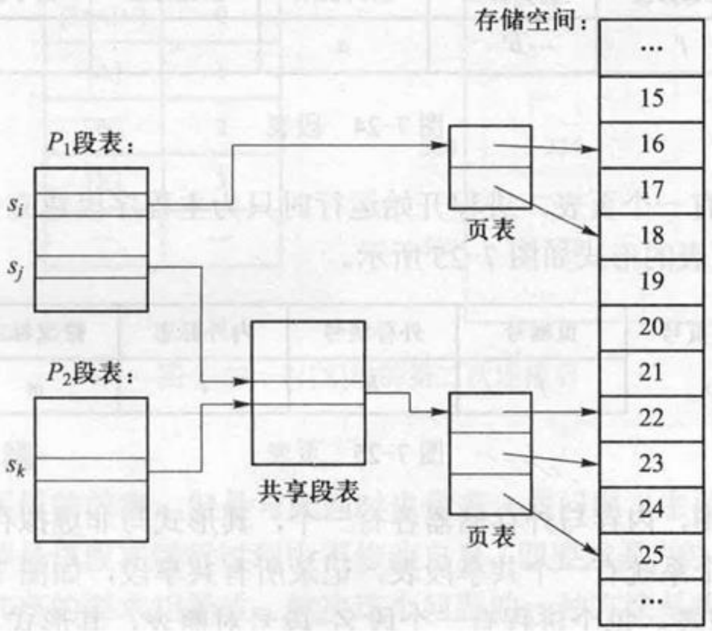
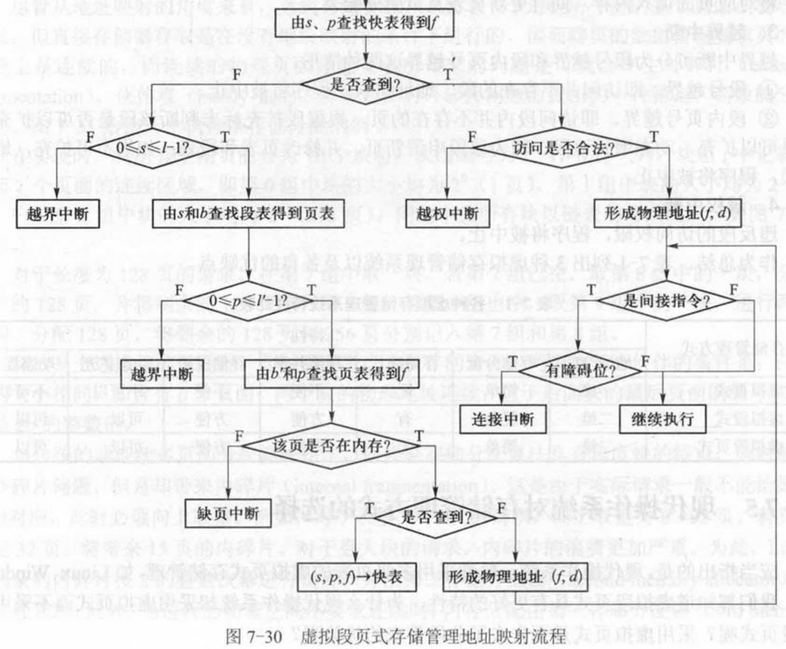

# 07 虚拟存储系统

整理自 `名词解释.pdf` 第 7 页和 `简答题.pdf` 第 55 至 62 页（原文第七章）。

## 本章要点

虚拟存储能成立靠的是局部性原理，这句话是很多简答题的第一句。置换算法要会手算缺页次数，尤其是 FIFO 的 Belady 异常和 LRU 的对比。抖动（颠簸）的原因和对策、工作集模型、页故障率反馈模型这三个问题常连着考。虚拟段页式的表目和中断类型内容多，按"五张表、四类中断"的骨架记。

## 名词解释

虚拟存储：借助外存空间，允许一个进程在运行过程中部分装入内存的技术。

虚拟存储系统：把内存与外存储器结合在一起，得到一个容量相当于外存、速度接近于内存的存储体系。

虚拟地址：源程序经汇编或编译后得到目标代码程序，编译程序无法确定目标代码执行时所在的实际内存地址，一般从零号单元开始编址。目标代码中的地址值都相对于以 0 为起点的地址，不是真实内存地址，所以称为相对地址、程序地址、逻辑地址或虚拟地址。

请调（请求分页）：页故障发生时进行调度，即访问某页面而它不在内存时由动态调页系统将其调入内存。

预调（先行调度）：在页故障发生之前调度，即一个页面即将被访问之前就由动态调页系统将其调入内存。

Belady 异常：增加进程所分得的内存页面数时，缺页故障次数反而增加。

工作集：进程在一段时间之内活跃地访问的页面集合。程序要有效运行，它的工作集页面必须能放进内存。

非均匀存储器访问（NUMA）：多 CPU 系统中每个 CPU 有自己的局部存储器，访问局部内存明显快于访问非局部内存。

## 基本原理

### 不用虚拟存储的内存管理方式存在什么问题？

问题是进程运行时整个程序必须都在内存中。

由此带来两个缺点：程序比内存可用空间大时无法运行；由于程序的局部特性，进程在任意一个阶段只用到所占空间的一部分，暂时用不到的内存区域被浪费。

### 虚拟存储管理基于什么理论？

基于局部性原理，包括时间局部性和空间局部性。

时间局部性：一条指令的两次执行、一个数据的两次访问在时间上相对集中。典型原因是程序中有大量循环。

空间局部性：程序中相邻的指令与相邻的数据在执行时通常会被集中用到。典型原因是程序顺序执行和对数组的访问。

### 简述虚拟页式存储管理的基本原理和步骤

进程运行之前，部分页面装入内存，另一部分（或全部）装入外存。运行过程中访问的页面在内存时，与不用虚拟存储的情形相同；不在内存时发生缺页故障，进入操作系统做页面的动态调度。

缺页处理步骤：

1. 找到被访问页面在外存中的地址。
2. 在内存中找一个空闲页框。没有空闲页框时，按淘汰算法选一个内存页面写回外存，修改页表及页面分配表。
3. 读入所需页面，修改页表及页框分配表。
4. 启动进程，重新执行被中断的那条指令。

### 为了实现虚拟页式存储管理，页表和快表要做什么修改？

页表中增加三个栏目：外存块号、内外标志、修改标志。快表中增加"修改标志"一栏。

另一道题问"为实现分页式虚拟存储，页表中至少应含有哪些内容"，答案是页号、标志、主存块号、该页在磁盘上的位置。

### 为什么要引入动态重定位？如何实现？

程序被放在不连续的物理空间中，需要在运行时把逻辑地址转换成物理地址，这就是动态重定位。

实现一般靠页式存储管理。页式管理用页表这个数据结构记录逻辑地址到物理地址的映射，而不是像单对界那样只用一对基址、限长寄存器，进程切换时要刷新硬件上的快表。

### 简述虚拟段式存储管理的基本原理和步骤

进程运行之前，部分段装入内存，另一部分（或全部）装入外存。运行中访问的段在内存时与非虚拟情形相同；不在内存时发生缺段故障，由操作系统做段的动态调度。

步骤：

1. 找到被访问段在外存中的地址。
2. 在内存中寻找一个空闲区。空间不够时有两种办法：紧凑，把内存中所有空闲区合并；淘汰，把某段移到外存，淘汰算法可以采用与页式相似的算法。
3. 读入所需的段，修改段表。
4. 启动进程，重新执行被中断的指令。

### 什么是交换？

内存中进程较多时缺页可能频繁发生，引起颠簸。为提高系统性能，内存资源紧张时可以把一个进程整体换到外存（换出），它占有的页框分给其他进程，以后适当时候再换回内存（换入）。

## 页面置换

### 说明局部置换与全局置换的区别

局部置换在当前缺页进程自己的页框集合中选淘汰页面，全局置换在内存的所有页框中选淘汰页面。

### 有哪些常见的置换算法？

最佳算法 OPT：淘汰以后不再需要的、或者最长时间以后才会用到的页面。它无法实现，只作为衡量其他算法的标准。

先进先出算法 FIFO：淘汰最先进入内存的页面。

最近最少使用算法 LRU：淘汰最后一次访问时间距当前最久的页面。

最近不用的先淘汰算法 NUR：淘汰最近一段时间内未用过的页面。实现时为每个页面增加引用位和修改位两个硬件位，每隔固定时间把所有引用位清零。淘汰时按下面的次序选择：

1. 引用位 = 0，修改位 = 0：直接淘汰。
2. 引用位 = 0，修改位 = 1：淘汰之前写回外存。
3. 引用位 = 1，修改位 = 0：直接淘汰。
4. 引用位 = 1，修改位 = 1：淘汰之前写回外存。

最不经常使用算法 LFU：淘汰访问次数最少的页面。为每个页面设一个访问次数计数器，页面由外存调入内存时计数器清零，每被访问一次加 1，淘汰时取计数器值最小的。

最频繁使用算法 MRU：与 LFU 相反，它认为计数器值最小的页面很可能是刚调入内存、正待使用的，所以淘汰计数器值最大的。

二次机会算法：淘汰装入最久且最近未被访问的页面，实现时可以用拉链数据结构。

时钟算法：把页面组织成环状，用一个指针指向当前位置。需要淘汰时从指针所指页面开始检查：当前页面引用位为 0（上次检测到现在没被访问过）就替换它；引用位为 1 就把它清零，指针顺时针移到下一个位置。重复这个过程直到找到引用位为 0 的页面。

### 试说明二次机会算法和时钟算法必定终止

二次机会算法：若线性链表中有标记为 0 的页面，扫描一次链表就能找到淘汰页面。若所有标记都是 1，扫描到某页面时把它的标记改为 0 并移到链表末尾，下次扫描到它时标记已是 0，可以淘汰，所以算法必定终止。

时钟算法：改进之前的时钟算法与二次机会算法效果相同，只是数据结构不同。看改进后的时钟算法（记引用位为 r、修改位为 m）：若存在 r=0 且 m=0 的页面，按扫描次序选第一个满足要求的淘汰，算法终止于第一次执行步骤 1；若步骤 1 失败但存在 r=0 且 m=1 的页面，按扫描次序选第一个淘汰，算法终止于步骤 2；若 1 和 2 都失败，步骤 2 中已把所有 r 清零，此时若存在 m=0 的页面，第二次执行步骤 1 时一定能找到 r=0 且 m=0 的页面（更正：原文此处作"r=0 且 m=1"，与步骤 1 的条件矛盾），若所有 m 都是 1，则算法在第二次执行步骤 2 时必定终止，因为此时所有页面都满足 r=0 且 m=1。

### 内存页框的分配有哪些策略？

平均分配；按进程程序长度的比例分配；按进程优先级别的比例分配；按进程程序长度和优先级别的比例分配。

### 外存块的分配有哪些策略？

静态分配：进程运行之前把它的所有页面全部装入外存。某外存页面被调入内存时并不释放它占用的外存页面，以后这个页面被淘汰时，如果它在内存期间没被修改过就不必写回外存，因为外存中有一份完全相同的副本。好处是减少页面调度引起的系统开销，代价是牺牲一定的外存空间。

动态分配：进程运行之前只把未装入内存的那部分页面装入外存。某外存页面被调入内存时释放它占用的外存页面，以后这个页面被淘汰时，无论在内存中是否被修改过，都要重新申请外存页面再写回。好处是节省外存空间，代价是增加页面调度引起的系统开销。

### 什么是写时复制？有什么优点？

现在版本的 `fork()` 实现时并不立即为子进程分配地址空间，而是与父进程共用同一地址空间。当父子进程中任何一个对某个页面执行写操作时，才为子进程分配独立的页框并复制内容，此后这个页面父子各有一份。这就是写时复制。

好处是创建子进程时不必复制整个地址空间，`fork()` 快，而且只读的页面始终共享，节省内存。

### 某些虚拟页式系统中内存永远保持一个空闲页框，这样做有什么好处？

没有空闲页框时，缺页要先按置换算法淘汰一个页框（可能写回外存）再读入所缺页面，缺页进程一般要等两次 I/O 传输。

保持一个空闲页框时，发生页故障后所缺页面可以立即调入，缺页进程只等一次 I/O 传输。读入后再淘汰一个页框，这次可能也要一次 I/O 传输，但缺页进程不必等它，所以响应速度提高了。

## 抖动与工作集

### 何谓系统的抖动现象？原因是什么？怎么克服？

抖动（颠簸）指页面在内存与外存之间频繁调度，以致系统用于调度页面的时间比进程实际运行的时间还长。

抖动由页故障率过高引起，页故障率高主要有三个原因：分给进程的页框数过少；页面置换算法不合理；程序结构不好，滥用转移指令、全局变量分散会破坏程序的局部性。

对策分别对应这三条：增加分配给进程的页框数；改进页面置换算法；改进程序结构，采用结构化程序设计，尽量少用 goto 语句，按大型矩阵在内存中的存放方式设计访问顺序。

### 解释页故障率反馈模型

颠簸由页故障率高引起，系统可以用页故障率的反馈信息动态调整页面分配，这就是页故障率反馈模型。

具体做法是规定页故障率的上界和下界：运行进程的页故障率高于上界，说明分给它的页框太少，应当增加；低于下界，说明分给它的页框过多，可以减少。这样动态调整就能防止颠簸。

### Denning 工作集模型的理论依据是什么？

程序的局部性。程序的执行是由一个局部迁移到另一个局部的过程。工作集是进程在一段时间之内活跃访问的页面集合。Denning 认为，程序要有效运行，它的工作集页面必须能存放到内存中。

### 什么是非均匀存储器访问？

多 CPU 系统中每个 CPU 有自己的局部存储器，访问局部内存明显比访问非局部内存快，这就是 NUMA。

## 虚拟段页式存储管理

### 什么是段的动态连接？

动态连接指程序运行过程中需要某一段时才把该段连接上，连接由操作系统完成。

动态连接中一个程序共有多少段是不确定的，段名到段号的转换需要由操作系统完成。同一个段只应分配一个段号，所以操作系统要为每个进程保持一张记录当前已连接段的表，称为段名段号对照表。

另外，为了把外段中的符号名转换成对应的段内地址，每个段在编译（汇编）时都要生成一个符号表，放在段的前面，作为段的组成部分。

### 动态连接有什么问题？如何解决？

主要问题是影响段共享。代码段共享的必要条件是该段运行中不修改自身，即必须是纯代码，而动态连接需要修改连接字，这与段共享的要求矛盾。

一种解决办法是把代码段分成纯段和杂段：连接字等可修改的内容放在杂段，其余放在纯段。杂段不共享，纯段可以共享。

### 虚拟段页式存储管理需要哪些表目？它们之间有什么联系？

1. 段表：每个进程一张，长度动态变化，每连接一个新段就增加一项。
2. 页表：每个段一张，进程开始运行时只为主程序段建立页表，其他段的页表在段连接时建立。
3. 总页表（位图）：内存与外存各一张，形式与非虚拟存储管理相同。
4. 共享段表：整个系统一张，记录所有共享段。
5. 段名段号对照表：每个进程一张，形式与非虚拟方式完全相同。

表间联系：非共享段的段表项指向页表；共享段的段表项指向共享段表，共享段表再指向页表。每个段由若干页构成，所以每个段对应一张页表。

下图里 P1 的 s_i 段不共享，段表项直接指向自己的页表，两页分别在页框 16 和 18。P1 的 s_j 段和 P2 的 s_k 段是同一个共享段，两个段表项都指向共享段表中的同一项，再由它指向这个段唯一的一张页表，三页在页框 22、23、25。

### 虚拟段页式存储管理需要哪些寄存器？

段表首址寄存器 b：整个系统一个，保存正在运行进程的段表首址。

段表长度寄存器 l：整个系统一个，保存正在运行进程的段表长度，运行中可能动态变化，每连接一个新段其值加 1。

快表：每个进程一个。

### 虚拟段页式存储系统中有哪些中断处理类型？

连接中断：由段名查本进程的段名段号对照表及共享段表，分三种情形：所有进程都没连接过（两张表都没有）；其他进程连接过但本进程没连接过（共享段表有、对照表没有）；本进程已连接过（对照表有）。

缺页中断：把对应页面调入内存，同时更新页表及页面分配表。

越界中断：分段号越界和段内页号越界两种。段号越界即访问不存在的段，地址错误，程序被中止；段内页号越界即访问段内不存在的页，按段扩充标志判断该段能否扩充，能扩充就动态增长该段（申请新页并修改页表和段表），不能扩充就是地址错误，程序被中止。

越权中断：违反段的访问权限，程序被中止。

原文另有一题"虚拟段页式存储管理地址映射流程"，下面的流程图标出了这四种中断各在哪一步产生。先用 (s, p) 查快表；查不到就依次检查段号 $0 \le s \le l-1$（不满足是越界中断）、用 s 和段表首址 b 查段表得到页表、检查段内页号 $0 \le p \le l'-1$（不满足也是越界中断）、用页表首址 b' 和 p 查页表，页不在内存就是缺页中断，在内存就得到 f 并把 (s, p, f) 送入快表。拿到 f 以后检查访问是否合法，不合法是越权中断；合法就形成物理地址 (f, d)。如果当前指令是间接指令且带障碍位，说明它引用的外段还没连接，产生连接中断，否则继续执行。

### 考虑段的共享与段长度的动态变化，如何处理连接中断？

由段名查本进程的段名段号对照表及共享段表，分三种情形。

所有进程都未连接过（两张表都没有）：查文件目录找到该段；为该段建立页表，把该段从文件中全部读入 swap 空间、部分读入内存，填写页表；为该段分配段号，填写段名段号对照表；该段可共享时填写共享段表，共享计数置 1；填写段表；根据段号及段内地址形成无障碍指示位的一般间接地址。

其他进程连接过但本进程未连接过（共享段表有，对照表无）：为该段分配段号；填写段名段号对照表，填写段表（指向共享段表），共享段表中的共享计数加 1；根据段号及段内地址形成无障碍指示位的一般间接地址。

本进程已连接过（对照表有）：直接根据段号及段内地址形成无障碍指示位的一般间接地址。

这里的段内地址由逻辑页号和页内地址两部分构成。

## 易混对比

| 对比项 | 请调 | 预调 |
| --- | --- | --- |
| 时机 | 页故障发生时 | 页故障发生前 |
| 准确性 | 调入的页一定会用到 | 可能调入用不到的页 |
| 代价 | 进程要等调页完成 | 实现开销大，判断可能不准 |
| 关系 | 预调系统必须辅以请调 | 同左 |

| 对比项 | 外存静态分配 | 外存动态分配 |
| --- | --- | --- |
| 运行前装入外存的内容 | 全部页面 | 只装未进内存的页面 |
| 调入内存后是否释放外存页 | 不释放 | 释放 |
| 淘汰时是否必写回 | 未修改过就不写回 | 一律重新申请并写回 |
| 代价 | 费外存空间 | 费调度开销 |

| 置换算法 | 淘汰谁 | 备注 |
| --- | --- | --- |
| OPT | 将来最久不用的 | 无法实现，用作基准 |
| FIFO | 最早进入内存的 | 可能出现 Belady 异常 |
| LRU | 最久未被访问的 | 接近 OPT，实现开销大 |
| NUR | 最近一段时间未用过的 | 看引用位和修改位四种组合 |
| LFU | 访问次数最少的 | 刚调入的页容易被误淘汰 |
| 时钟 | 扫描中第一个引用位为 0 的 | 二次机会算法的环形实现 |
