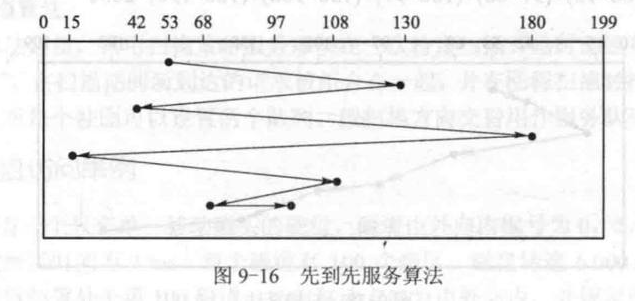
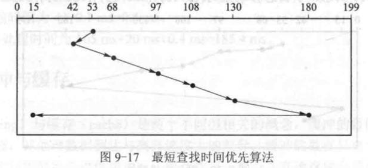
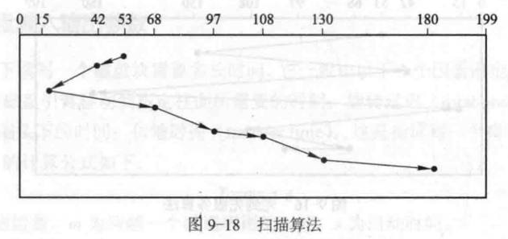
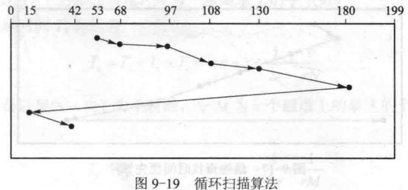
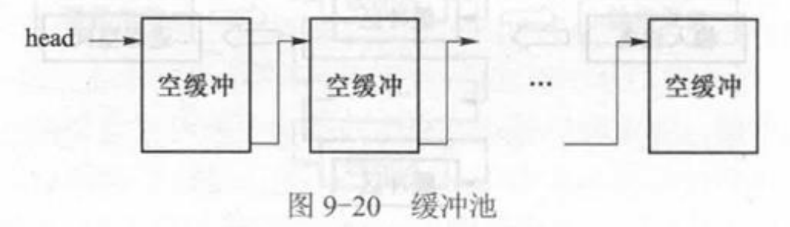

# 09 设备与输入输出管理

整理自 `名词解释.pdf` 第 9 页和 `简答题.pdf` 第 75 至 84 页（原文第九章）。原文第 85 至 88 页与 `选择题知识点总结.pdf` 内容完全相同，统一整理在 `10 选择题知识点速记.md` 里。

## 本章要点

四种数据传输方式（探询、中断、DMA、通道）按"谁在忙、谁被打扰、传多少"串起来记，演变过程本身就是一道简答题。磁盘调度算法要会按请求序列算磁头移动量，SSTF 的饥饿和"磁道歧视"、SCAN 与 C-SCAN 的差别是常考点。缓冲部分要分清缓冲与缓存、私用缓冲与缓冲池、单双多缓冲。

## 名词解释

探询（Polling）：又称程序控制输入输出，是最早的输入输出控制方式。处理器代表进程向相应设备模块发出输入输出请求，然后反复查询设备状态，直到输入输出完成。

缓冲：为处理数据到达速度与离去速度不一致而采用的技术。

私用缓冲：把一个缓冲区与一个固定的设备相联系，不同设备使用不同缓冲区，这种缓冲区管理模式称为私用缓冲。

缓冲池：缓冲区由系统统一管理、按需要动态分派给正在传输数据的设备，系统中的缓冲区集合称为缓冲池。

设备独立性：能够编写出访问任意 I/O 设备而无需事先指定设备的程序。

设备驱动程序：每个连接到计算机上的 I/O 设备都需要一些设备特定的代码来控制它，这些代码称为设备驱动程序。

I-nodes：文件系统用来记录文件信息（如创建者、创建日期、文件大小等）的数据结构。

## 设备管理与设备分类

### 设备管理的功能是什么？

设备分配：按设备类型和相应的分配算法，决定把设备分配给哪一个请求该类设备的进程。

设备处理：即设备驱动，实现 I/O 进程与设备控制器之间的通信。

缓冲管理：为提高 CPU 与 I/O 设备操作的并行程度、尽量减少中断次数，大多数 I/O 操作都要使用缓冲区。

### 设备管理的 4 个目标

方便性、并行性、均衡性、独立性。

### 设备有哪几种分类方式？

按信息流向分输入输出型设备与存储型设备。输入输出型设备向 CPU 传输信息或输出经 CPU 处理过的信息，从用途上又分人机输入输出设备（键盘、扫描仪、打印机、绘图仪、数码相机等）和机机输入输出设备即通信设备（网卡、调制解调器等）。存储型设备既能实现虚拟存储系统，又能建立文件系统，还能构造作业输入井和输出井，信息可以长期保存。

按传输单位分块型设备与字符型设备。块型设备通常就是存储型设备，由若干长度相同的块构成，一块的长度通常是 $2^i$ B，块是存储、分配和数据传输的基本单位。字符型设备通常就是输入输出型设备（包括通信设备），数据传输的基本单位是字节。

时钟与显示器两者都不属于块型或字符型设备。硬件时钟有两个：绝对时钟记载当前日期和时间，不准时系统用户可以调整，所有用户都能读取它的值；闹钟定时产生中断，一般以毫秒为单位。显示器在内存的系统空间有一段保留的存储区，用送数指令（MOV）向该区域写信息就能在屏幕上显示。这片区域属于系统空间，一般用户不可访问，操作系统不会把任何进程的地址空间映射到显示内存。

按共享性分独占型设备与共享型设备。独占型设备包括所有字符型设备和磁带机，任意一段时间内最多只能有一个进程占有并使用。共享型设备包括除磁带机以外的所有块型设备，多个进程以块为单位的数据传输可以交叉进行。

按资源分配管理技术还可以分三类：独占型设备（不能共享，一段时间只能由一个作业独占，如打印机、读卡机、磁带机，所有字符型设备原则上都是独享设备）、共享型设备（可由多个作业同时共享，如磁盘，块设备都是共享设备）、虚拟设备（用某种技术把独享设备改造成多台同类独享设备或共享设备，最有名的实现技术是 SPOOLing，即假脱机技术）。

### UNIX 系统中块设备和字符设备各有什么特点？

字符设备以字符为单位输入输出，每输入或输出一个字符就要中断 CPU 一次请求处理，所以是慢速设备。

块设备以字符块为单位输入输出。块的大小在不同系统或不同版本中定义不同，但同一系统中所有块大小一致，便于管理和控制，传送效率较高。

### 举例说明面向块的设备与面向流的设备的区别

面向块的设备用固定大小的块存储数据，每次传送一个数据块，通过块号引用数据，如磁带、磁盘。面向流的设备以字节流方式传送数据，没有块结构，如打印机、终端、键盘。

### 什么是设备无关性？如何实现？

设备无关性指用户编写程序时使用的设备与实际使用的设备无关。

实现时要求用户程序对设备的请求使用逻辑设备名，程序执行时使用物理设备名（更正：原文作"武力设备名"），因此操作系统要提供逻辑设备名到物理设备名的转换机制，一般用系统设备表实现。

### 什么是物理设备？什么是逻辑设备？

进行实际输入输出操作的硬件设施是物理设备。用户程序中不直接使用设备的物理名称，而用另外的名称代替，这就是逻辑设备。

逻辑设备是物理设备属性的表示，不特指某个具体物理设备，而是对应一批设备。具体的对应关系在操作系统初始化时确定，或者运行过程中根据设备使用情况由系统或用户再次确定。

### 用户申请独占型设备时为什么只指定类别、不指定具体设备？

进程申请独占型设备时应指定设备类别，由系统根据当前请求和资源分配情况在该类设备中选一台空闲的分配给它，这就是设备无关性。

两个好处：提高设备利用率，若申请者指定具体设备，该设备可能正被占用而其他同类设备空闲，造成浪费和不必要的等待；程序与设备无关，若指定的设备已坏或不联机，指定具体设备的程序就得修改。

### 为何不允许用户程序直接执行设备驱动指令？

一是系统中的设备可能被多个进程共享（如磁盘），允许用户程序直接驱动有可能损坏设备；二是设备操作的驱动过程很复杂，让一般用户自己写驱动程序负担太大，操作系统的目标是方便用户，所以提供标准的驱动程序。

### 简述设备驱动程序的作用

设备驱动程序是驱动物理设备和 DMA 控制器或 I/O 控制器直接进行 I/O 操作的子程序集合，负责设置设备相关寄存器的值、启动设备进行 I/O 操作、指定操作类型和数据流向等。

### I/O 设备、I/O 驱动程序、I/O 进程之间的对应关系

一个 I/O 驱动程序与多个同类设备对应，一个 I/O 设备与一个 I/O 进程对应。

## 数据传输方式

### 有哪些数据传输方式？各有什么特点？

程序控制查询方式（探询）：处理器代表进程向设备模块发出请求，然后反复查询设备状态直到完成。缺点是忙式等待，处理器与设备完全串行工作，设备速度远低于处理器，忙等会消耗大量处理器时间。探询既可以用硬件提供的专用输入输出指令，也可以用内存操作指令完成，后者把设备地址映射为内存地址空间的一部分，称为内存映射输入输出。

中断驱动方式：设备具有中断 CPU 的能力，设备与 CPU 可以并行。缺点是设备较多时对 CPU 的打扰很多，而且中断伴随处理器状态切换，增加系统开销。它同样既可以用专用 I/O 指令也可以用内存映射 I/O 指令完成，内存映射方式即时完成，指令执行完 I/O 操作也就完成了，没有中断需要处理。

DMA 方式：硬件提供 DMA 控制器，通过总线与设备、内存相连。传输步骤是：

1. CPU 把操作量送到 DMA 控制器的操作数寄存器 operands 中，包括内存起始地址、传输数量等。
2. CPU 把操作码送到 opcode 寄存器启动 DMA 控制器，控制器把忙碌寄存器 busy 置位，表示这期间不再接受新命令。此后 CPU 可以执行与该控制器无关的其他操作。
3. DMA 控制器与设备交互，把数据由缓冲区传给设备或由设备传到缓冲区。
4. DMA 控制器把缓冲区内容复制到内存空间，或由内存空间复制到缓冲区。
5. 计数器减 1，结果非 0（没传完）就回到第 3 步，否则转第 6 步。
6. 传输结束，DMA 控制器复位忙碌寄存器，向 CPU 发中断请求。
7. CPU 读入并检查 DMA 状态寄存器，确认操作是否成功。

通道方式：主机、通道、控制器和设备之间四级连接、三级控制。一个 CPU 通常可以连若干通道，一个通道可以连若干控制器，一个控制器可以连若干设备。CPU 通过执行 I/O 指令控制通道，通道通过执行通道命令控制控制器，控制器发出动作序列控制设备，设备执行相应的 I/O 操作。

### 通道的连接方式与组成

连接方式有两种：单通路方式，每个设备连一个控制器，每个控制器连一个通道；多通路方式，允许多对多相连。

通道指令系统的基本操作有六种：空操作（不执行任何操作，顺序取下一条指令）、读操作（从指定设备输入一批数据）、写操作（向指定设备输出一批数据）、控制操作（控制外围设备的机械动作，如磁带反绕、磁盘引臂移动、打印纸换页）、转移操作（实现指令的非顺序执行）、结束操作（通道程序执行完毕，向主机发通道中断信号）。

通道运控部件有四个：通道地址字 CAW（channel address word）、通道命令字 CCW（channel command word）、通道状态字 CSW（channel status word）、通道数据字 CDW（channel data word）。（更正：原文的英文写成 channel eddress word 和 charmel command word。）

通道没有独立的存储空间，与主机共享同一个内存空间，访问内存采用周期窃用方式。内存对通道有两个用途：保存通道程序、保存交换数据。

通道分三类：字节多路通道（多个非分配型子通道，连接低速外围设备）、数组选择通道（一个分配型子通道，连接多台高速设备）、数组多路通道（多个非分配型子通道，连接多台高速设备）。

### 什么叫通道技术？通道的作用是什么？

通道是独立于 CPU 的、专管输入输出控制的处理机，控制设备与内存直接交换数据。它有自己的通道指令，指令由 CPU 启动，操作结束时向 CPU 发中断信号。通道方式进一步减轻了 CPU 的负担，提高了系统的并行程度。

### 处理器与通道之间是如何通信的？

通道与处理器相对独立，通道程序的执行可以与处理器的操作并行；系统中可能有多个通道，它们也可以并行执行各自的通道程序。

通道程序形成之后，处理器把通道程序的起始地址放到内存指定单元，然后执行通道启动指令让通道开始工作。通道被启动后从指定单元取出通道程序起始地址放入通道地址字 CAW，据此依次执行各条通道指令。通道程序执行完毕或执行到通道结束指令时产生通道中断信号发给处理器，处理器响应中断后取出中断字，分析原因并做相应处理。

### 通道与 DMA 有何共同点与差别？

共同点是两者都属于多数据 I/O 方式，都能独立完成内存与设备之间的数据传输。

差别是通道控制器有自己的指令系统，一个通道程序可以控制完成任意复杂的 I/O 传输；DMA 没有指令系统，一次只能完成一个数据块的传输。

### 简述输入输出操作的演变过程及其对多道程序设计的影响

最早是查询方式：把待传输的数据放入 I/O 寄存器并启动设备，然后反复测试设备状态寄存器直到完成，处理器与设备完全串行。

中断 I/O 方式出现后，处理器启动设备后可以去做别的计算，设备与处理器并行；设备完成时发中断信号，处理器转去处理，然后可能再次启动传输。中断使多道程序设计成为可能：一方面中断让操作系统能获得处理器控制权，另一方面通过 I/O 中断可以实现进程状态的转换。

中断方式下 I/O 通常以字节为单位，设备多时对处理器打扰很大，于是有了专门处理 I/O 传输的处理器即通道。通道有自己的指令系统，一个通道程序可以控制完成许多次 I/O 传输，只在通道程序结束时才向处理器发一次中断。

## 磁盘调度

### 设计输入输出调度算法应当考虑哪两个基本因素？

公平性：一个输入输出请求应当在有限时间内得到满足。高效性：减少设备机械运动带来的时间开销。

### 读写一个磁盘块的时间由哪几个因素决定？

寻道时间（seek time，把磁盘引臂移到指定柱面）、旋转延迟（rotational delay，指定扇区转到磁头下）、传输时间（transfer time，读写一个扇区）。

### 常见的磁盘引臂调度算法

先到先服务 FCFS：按请求到达的次序服务，最公平也最简单，但效率不高。

最短查找时间优先 SSTF：优先为距磁头当前位置最近的柱面请求服务。缺乏公平性，存在饥饿和饿死问题，适合负载不大的系统。

扫描算法 SCAN（电梯算法）：无访问请求时引臂不动；有请求时引臂按电梯规律移动，为路过柱面的请求服务。起始时磁头由最外柱面向内移动，内侧没有请求时就改变方向（外侧有请求）或停止移动（两侧都没有请求）。

循环扫描 C-SCAN：为消除边缘柱面与中部柱面等待时间的差异而改进。磁头只在单方向移动时为路过的请求服务，该方向没有请求时立即快速回扫到另一端提出请求的第一个柱面，回扫过程中不处理请求，然后开始新一轮扫描。负载较大时性能较好，不存在饿死问题。

下面四张图用同一个例子比较前四种算法：磁盘有 200 个柱面（0 到 199），请求序列是 130、42、180、15、108、68、97，磁头当前在 53 号柱面。

FCFS 按到达次序走，总移动量 (130-53)+(130-42)+(180-42)+(180-15)+(108-15)+(108-68)+(97-68) = 630 个柱面。

SSTF 每次去离磁头最近的柱面：先到 42，再到 68、97、108、130、180，最后才回头去 15，总移动量 (53-42)+(68-42)+(97-68)+(108-97)+(130-108)+(180-130)+(180-15) = 314。

SCAN 先朝柱面号减小的方向扫，服务 42、15 后折返，再依次服务 68、97、108、130、180，总移动量 (53-42)+(42-15)+(68-15)+(97-68)+(108-97)+(130-108)+(180-130) = 203。

C-SCAN 只在柱面号增大的方向服务，从 53 依次服务 68、97、108、130、180，然后快速回扫到最小的请求柱面 15，再向上服务 42，总移动量 (180-53)+(180-15)+(42-15) = 319。

四个总数用 Python 按上面的访问次序逐段累加复核过，630、314、203、319 都对。SCAN 在这个例子里最省，SSTF 虽然也不错，但 15 号柱面的请求要等磁头跑到 180 之后才轮到，这正是它对边缘柱面不公平的地方。

N 步扫描：把请求队列分成若干长度为 n 的子队列，按到达次序处理，用扫描策略服务队列中的前 n 个请求，本次扫描结束后再服务下一组 n 个请求，新到达的请求放在队尾。N=1 时退化为先到先服务，N 很大时接近扫描算法。

冻结扫描：只用扫描策略服务那些在一次扫描开始时已经到达的请求，请求队列被冻结，扫描期间新到的请求组合在一起，在回程扫描时按扫描算法处理。实现时可以为每个柱面设两个队列，按扫描方向交替用作服务队列和等待队列。

### 何谓"磁道歧视"？每个磁道各有一个磁头时还存在吗？

在 SSTF 等调度算法中，磁头引臂可能长时间停留在磁盘局部的某些磁道，不去光顾另一些磁道。例如外磁道请求不断时，内磁道请求可能长时间得不到满足，这种现象称为磁道歧视（track discrimination）。

如果每个磁道各有一个磁头，就不存在磁道歧视问题，因为不需要移动引臂。

## 缓冲

### 操作系统中引入缓冲技术的目的是什么？

主要是缓解处理器与设备之间速度不匹配的矛盾，提高资源利用率和系统效率。

例子：一个进程时而长时间计算，时而阵发性地向打印机输出。没有缓冲时，阵发性输出期间打印机跟不上处理器，处理器要等待；计算阶段打印机又闲置。在打印机与处理器之间设一个缓冲区后，进程把阵发性输出暂存到缓冲区，打印机慢慢取出打印，处理器送完数据就能继续计算，处理器与设备可以并行。

设置缓冲区的作用还可以归纳成三条：缓和 CPU 与 I/O 设备速度不匹配的矛盾；减少中断 CPU 的次数；提高 CPU 与 I/O 设备之间的并行性。

### 什么叫缓冲？什么叫缓存？两者有何差别？

缓冲是用存储区缓解数据到达速度与离去速度不一致的技术，同一数据只有一个副本。例如操作系统用缓冲方式实现设备的输入输出，目的是缓解处理器与设备之间的速度矛盾。

缓存是为提高数据访问速度、把部分数据由慢速设备预取到快速设备上的技术，同一数据存在多个副本。例如把远程文件的一部分取到本地。

有些情况下缓冲同时具有缓存的作用。例如 UNIX 对块型设备的缓冲区在使用时保持与磁盘块的对应关系，既缓冲又缓存，再配合预先读与延迟写进一步提高效率。

### 按缓冲区个数，缓冲技术分哪几类？

单缓冲：设备与进程之间设一个缓冲区，信息由设备传到缓冲区，再由缓冲区传给进程，如此重复到传输完成。

双缓冲：设两个缓冲区。第一个装满后设备转向第二个，同时处理器把第一个的内容复制到进程空间；接着设备再回到第一个，处理器复制第二个，如此交替，提高处理器与设备的并行性。

循环缓冲：设多个缓冲区并链成环状，用两个指针 in 和 out，in 指向当前输入的位置，out 指向当前取出的位置。

缓冲池：操作系统通常提供两组缓冲区，一组用于块型设备（一般较大，长度通常与外设物理块相同），一组用于字符型设备（一般较小）。缓冲池属于操作系统空间，用户程序不能直接操作，只能通过与输入输出有关的系统调用间接使用。

按缓冲区个数分类的另一种说法是单缓冲、双缓冲、多缓冲、缓冲池四种。

### 与私用缓冲相比，多个设备共用缓冲池有何优点？

私用缓冲把缓冲区与固定设备绑定，利用率低：正在执行 I/O 传输的设备可能缓冲区不够用，而没有执行 I/O 的设备的缓冲区被闲置浪费。

缓冲池把所有缓冲区集中管理，按需要动态分派给正在传输的设备，利用率更高。

### 在缓冲区总长度固定的前提下，单个缓冲区过大或过小各有什么优缺点？

过大会造成浪费（平均浪费半个缓冲区容量），但有利于减少 I/O 传输次数。

过小会因 I/O 传输次数增多而加大系统开销，而且缓冲链的指针过多，同样浪费缓冲空间。

### 三类设备的缓冲输入输出如何实现？

输入型设备：信息流向是输入设备到缓冲区再到进程空间。设备到缓冲区的传输由通道程序完成，缓冲区到进程空间的传输由操作系统代替进程完成。设备启动前先申请一个缓冲区，输入的信息送入缓冲区，缓冲区满就把它连到设备的输入队列上并申请下一个缓冲区。进程要读信息时，顺序取输入队列上的缓冲区，把内容复制到进程空间，然后释放缓冲区。

输出型设备：信息流向是进程空间到缓冲区再到输出设备。进程空间到缓冲区的传输由操作系统代替进程完成，缓冲区到设备的传输由通道程序完成。进程要输出时，系统代为申请缓冲区，信息由进程空间送入缓冲区，装满后连到设备的输出队列并启动设备输出，同时申请下一个缓冲区；一个缓冲区的内容输出完后被释放。

输入输出型设备：这类设备多为块型设备，如磁盘、磁带，信息流向是进程空间和缓冲区之间双向。输入输出操作可以交叉进行，所以通道需要知道每个缓冲区对应的是读还是写，还要知道设备地址（哪一个磁盘块），因此队列上每个缓冲区都带一组说明信息，称为缓冲区头。

进程执行输入操作时，系统代为申请缓冲区、填好缓冲区头，把缓冲区连到设备的输入输出队列上；设备驱动程序按缓冲区头的说明把设备上的指定块读入缓冲区体；传输结束产生中断，由中断处理程序把缓冲区体的内容复制到进程空间，然后释放缓冲区。这里其实没有真正起到缓冲作用，因为每次输入输出都要启动设备把所需块传到缓冲区，不能直接从缓冲区得到。

进程执行输出操作时，系统代为申请缓冲区，把信息从进程空间复制到缓冲区体，填好缓冲区头，再把缓冲区连到设备的输入输出队列上；设备驱动程序按缓冲区头把缓冲区体的内容传到设备的指定块；传输结束发生中断，由中断处理程序释放缓冲区。

### 由文件读信息到进程空间，为什么不能直接由磁盘读到进程空间？

磁盘输入输出以块为基本单位，而进程要读的文件内容可能只是块中的一部分。直接从磁盘块复制到进程空间，可能读进不需要的内容，覆盖进程中有用的单元。

### 要修改某一磁盘块的一部分、其余部分保持不变，应该怎么做？

先把该磁盘块的内容读入内存缓冲区，在内存中修改相关内容，最后把修改后的缓冲区内容完整地写回磁盘对应块。

## 易混对比

| 传输方式 | 谁控制传输 | CPU 参与程度 | 中断次数 |
| --- | --- | --- | --- |
| 探询 | CPU 反复查询 | 全程占用，忙式等待 | 无中断 |
| 中断驱动 | CPU 响应中断逐字节传 | 每字节打扰一次 | 多 |
| DMA | DMA 控制器 | 启动和结束时参与 | 每块一次 |
| 通道 | 通道执行通道程序 | 只在通道程序结束时参与 | 每个通道程序一次 |

| 算法 | 思想 | 公平性 | 适用场景 |
| --- | --- | --- | --- |
| FCFS | 按请求到达次序 | 最公平 | 负载很轻 |
| SSTF | 就近服务 | 差，会饿死、有磁道歧视 | 负载不大 |
| SCAN | 往返扫描 | 较好 | 一般负载 |
| C-SCAN | 单向扫描，快速回扫 | 好，边缘柱面不吃亏 | 负载较大 |
| N 步扫描 | 分组扫描 | 可调 | 按 N 取值在 FCFS 与 SCAN 之间 |

| 对比项 | 缓冲 | 缓存 |
| --- | --- | --- |
| 目的 | 缓解速度不匹配 | 提高访问速度 |
| 副本数 | 一个 | 多个 |
| 例子 | 打印输出缓冲区 | 远程文件取到本地 |
