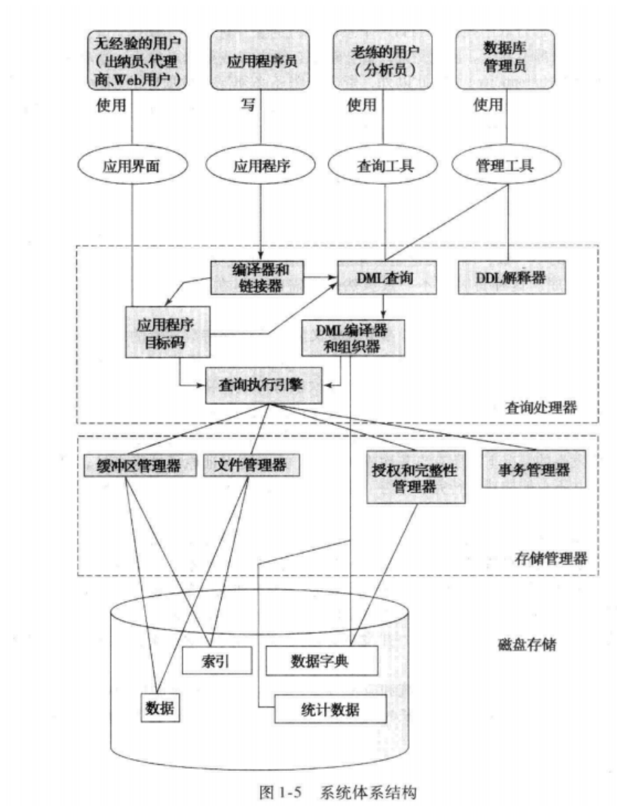

# 数据库系统概述

整理自 `笔记/数据库系统原理笔记.pdf` 第 1–6 页（第 1 章 引言，以及第 6 页顶部的系统体系结构图）和 `笔记/数据库期末复习题整理.pdf` 第 1–4 页"重要基本概念"中的第一章部分。两份内容重复的地方已合并。原笔记作者说第 1 章把后面各章的内容都提了一遍，学完后面再回头看会更清楚，所以这一章先记住概念和分类就行。

## 本章要点

- DBMS 由两部分组成：一组相互关联的数据，加上一组访问这些数据的程序。数据库指的是其中那组相关数据。
- 中国自主研发的数据库：openGauss、OceanBase、TiDB、GaussDB、PolarDB。
- 文件处理系统有 7 个弊端：**数据冗余和不一致**、数据访问困难、数据孤立、完整性问题、原子性问题、并发访问异常、安全性问题。
- 数据抽象分三层：**物理层、逻辑层、视图层**，从下到上越来越抽象。
- 数据模型分四类：关系模型、实体-联系（E-R）模型、半结构化数据模型、基于对象的数据模型。网状模型和层次模型现在很少用。
- 实例是某一时刻库里的数据，模式是数据库的总体设计。模式又分物理模式、逻辑模式、子模式。
- **物理数据独立性**：物理存储方式变了，应用程序不用改，因为程序是按逻辑模式写的。
- 元数据是描述数据的数据，存放在**数据字典**里。
- DDL 定义模式、规定一致性约束、授权；DML 做增删改查。两者合起来是一种数据库语言，如 SQL。
- 数据库系统主要分存储管理器和查询处理器两个子系统；事务管理器保证故障时和并发时数据仍然一致。
- 用户分四类：无经验的用户、应用程序员、老练的用户、专门的用户。DBA 负责集中控制整个数据库。

## 1. 数据库与数据库管理系统

- 数据库管理系统（Database Management System，DBMS）：教材的定义是由一组相互关联的数据和一组访问这些数据的程序组成，数据描述的是某个特定的企业或机构。复习题整理稿从软件角度补了一句：DBMS 是用来创建、管理和控制数据库的软件系统，提供存储、修改、提取和搜索数据的手段。它的目标是提供一个存取数据既方便又高效的环境。
- 数据库（Database）：相关数据的集合。
- 数据库系统应用：用 DBMS 加某种编程语言写出来的应用程序，用来管理和操作数据库，比如选课系统、银行业务系统。

## 2. 中国自主研发的数据库

复习题整理稿第一章的第一题。课程目录的 `README.md` 回忆期末简答题考过"中国有哪些自主设计的数据库"。

| 数据库 | 开发方 |
| --- | --- |
| openGauss | 华为 |
| OceanBase | 蚂蚁集团 |
| TiDB | PingCAP（原稿只写了名字，开发方为整理补充） |
| GaussDB | 华为云 |
| PolarDB | 阿里云 |

## 3. 数据库系统与文件系统

### 3.1 文件处理系统

文件处理系统用操作系统的文件来存储、管理和访问数据，每个应用程序各自读写自己的文件。它比数据库系统简单，功能也有限，有下面 7 个弊端，数据库系统就是为了解决它们发展起来的。

| 弊端 | 具体表现 | 例子或说明 |
| --- | --- | --- |
| 数据冗余和不一致（data redundancy and inconsistency） | 不同的人建了不同的文件，存了相同的信息；同一数据的几个副本对不上 | 改了一个文件里的地址，另一个文件没改。重复存储有时也有好处，这里强调的是坏处 |
| 数据访问困难（difficulty in accessing data） | 文件格式各不相同；遇到设计时没想到的查询需求，没有现成的通用程序 | 每来一种新查询，可能都要重新写一个程序 |
| 数据孤立（data isolation） | 数据分散在不同格式的文件里，也叫"数据孤岛" | 很难写出一个把各处数据都检索出来的程序 |
| 完整性问题（integrity problem） | 一致性约束写死在程序代码里 | 账户余额不能小于 0。以后加新约束就得改程序，很麻烦 |
| 原子性问题（atomicity problem） | 靠原语和中断技术保证不了操作"要么全做，要么全不做" | 银行转账做到一半系统故障，钱从 A 扣了却没到 B。故障后数据应恢复到故障前的一致状态 |
| 并发访问异常（concurrent-access anomaly） | 多个用户或程序同时修改数据，更新互相干扰 | 两人同时从同一账户取钱，最后余额算错 |
| 安全性问题（security problem） | 很难防止未经授权的访问和修改 | 并不是每个用户都能访问全部数据 |

### 3.2 相关的几个概念

- 数据不一致性：同一数据在不同地方或不同时间点对不上，通常是更新不同步或出错造成的。
- 一致性约束：数据库里保证数据一致、正确的规则。比如某个字段的值必须唯一，或者两个字段的值要满足某种关系，余额不小于 0 也是一种。
- 规范化：设计数据库结构的一种过程，目的是消除数据冗余、保证数据一致（后面范式一章细讲）。

## 4. 数据视图

数据库系统的一个主要目的，是给用户提供数据的抽象视图，把数据怎么存储、怎么维护的细节藏起来。

### 4.1 三层数据抽象

数据抽象就是隐藏物理存储、实现细节这些内部情况，只把用户需要的信息展示出来。分三层：

| 层次 | 描述什么 | 说明 |
| --- | --- | --- |
| 物理层（physical level） | 数据实际上怎样存储 | 最底层。详细描述底层数据结构，比如数据存在磁盘哪个位置、分布在几块盘上、用 B 树还是哈希表 |
| 逻辑层（logical level） | 数据库里存了什么数据，数据之间有什么关系 | 中间层。用少量简单结构（如表）描述整个数据库。DBA 在这一层工作，决定库里要存哪些信息 |
| 视图层（view level） | 整个数据库的某一部分 | 最高层。大多数用户只关心库里的一部分数据，系统可以为同一个数据库提供多个视图。比如销售经理只看销售数据 |

逻辑层的简单结构，在物理层可能要用很复杂的结构来实现，但逻辑层的用户不需要知道这些，这就叫物理数据独立性。（更正：复习题整理稿把"这称作物理数据独立性"直接接在"逻辑层通过简单的结构描述整个数据库"后面，容易读成用表描述数据库就叫物理数据独立性。它指的是逻辑层用户不必了解物理层的复杂实现。）

### 4.2 数据模型

数据模型（data model）是数据库结构的基础。它是一组概念工具，用来描述数据、数据之间的联系、数据的语义和一致性约束。物理层、逻辑层、视图层的设计都可以用数据模型来描述。

| 数据模型 | 怎么表示数据 | 例子 |
| --- | --- | --- |
| 关系模型（Relational Model） | 以数学理论为基础，用表的集合表示数据和数据之间的联系。每张表有多列，列名唯一；每一行是一个数据对象，每一列是一个属性。属于基于记录的模型 | 学生表 `Students`，有 `StudentID`、`Name`、`Major` 三列，每行是一个学生。关系模型是目前用得最广的数据模型 |
| 实体-联系模型（Entity-Relationship Model） | 一种高层的概念模型，用"实体"和实体之间的"联系"描述现实世界。实体是现实世界中能和其他对象区分开的事物 | 大学数据库里有学生和课程两个实体，"注册"是它们之间的联系。E-R 模型主要用于数据库设计 |
| 半结构化数据模型（Semistructured Data Model） | 介于结构化和非结构化数据之间。同一类型的数据项可以有不同的属性集合，前两种模型则要求同类数据项的属性完全相同 | JSON、XML。比如一个 JSON 文件里每个人都有名字和年龄，但只有部分人有电话和邮箱 |
| 基于对象的数据模型（Object-Based Data Model） | 把数据和处理数据的操作封装在一起，在关系模型上增加封装、方法、对象标识等概念 | 最初随着面向对象编程发展出独立的面向对象数据模型，现在对象概念已经融进关系数据库，可以把对象存进关系表，把过程存进数据库由系统执行 |

此外还有网状数据模型和层次数据模型，现在已经很少使用。

### 4.3 实例与模式

- **实例**（instance）：某一时刻数据库中存储的信息的集合，相当于数据库在这一刻的快照。
- **模式**（schema）：数据库的总体设计，即数据按什么格式存储和描述，定义了库里有哪些表、字段以及它们之间的关系。

模式按抽象层次分三种：

| 模式 | 所在层次 | 内容 | 例子 |
| --- | --- | --- | --- |
| 物理模式（physical schema） | 物理层 | 数据的物理存储结构、在磁盘上怎么存、索引怎么设计 | 数据放在硬盘某个位置，或分散到多块盘上提高性能 |
| 逻辑模式（logical schema） | 逻辑层 | 数据的逻辑组织、各关系（表）的定义及相互关系 | 定义学生表、课程表以及两者之间的联系。程序员按逻辑模式写应用程序，原笔记标注这一种最重要 |
| 子模式（subschema） | 视图层 | 数据库的不同视图，是逻辑模式的子集 | 教务员要看全部学生的选课信息，学生只看自己的课程，给两者定义不同的子模式 |

（更正：复习题整理稿把"索引的定义"列进了逻辑模式，把"存储过程的实现"列进了物理模式。按教材，索引怎么建属于物理模式；存储过程是存放在数据库里的程序，不属于物理存储结构的描述。）

### 4.4 物理数据独立性

应用程序不依赖物理模式，物理存储结构和存取方法变了，程序也不用改，这叫物理数据独立性。比如把数据从单块硬盘迁到分布式存储，或者从顺序访问改成走索引，应用程序都照常运行。原因是程序按逻辑模式编写，而逻辑模式和物理模式是分开的。

## 5. 元数据、数据字典与索引

- 元数据（metadata）：描述数据的数据。放到数据库里，就是表的定义、字段的类型和大小、索引的定义这类信息。有了元数据，才能知道数据是什么意思、是什么结构、该怎么用。
- **数据字典**（data dictionary）：存放数据库全部元数据的地方，尤其是数据库模式。它记录库中各种对象（表、索引、视图、触发器等）的名称、类型、结构、所有者等，也可能记录统计信息，比如每张表有多少行、索引有多大。DBA 和开发者查数据字典来了解库的结构，DBMS 执行查询时也要读它。
- 索引（index）：让系统能快速找到数据项。和书后的索引一样，数据库索引保存了指向含有特定值的数据的指针，比如按 `ID` 找某个 `instructor` 记录，或找出名字为某个值的所有 `instructor` 记录。散列（hash）是另一种索引方式，某些情况下更快，但不是所有情况都快。

## 6. 数据库语言

数据库语言分为数据定义语言（DDL）和数据操纵语言（DML）。两者合在一起构成一种数据库语言，比如 SQL 里既有 DDL 语句也有 DML 语句。

### 6.1 数据定义语言 DDL

DDL（Data Definition Language）用来定义数据库模式、规定一致性约束、给用户授权，也就是创建、修改、删除表和索引这类结构。常见命令有 `CREATE`、`ALTER`、`DROP`。

```sql
-- 用 DDL 建一张学生信息表
CREATE TABLE Students (
    ID INT PRIMARY KEY,
    Name VARCHAR(100),
    Age INT,
    Major VARCHAR(100)
);
```

### 6.2 数据操纵语言 DML

DML（Data Manipulation Language）用来对数据做增加、修改、删除和查询。常见命令有 `SELECT`、`INSERT`、`UPDATE`、`DELETE`。DML 中负责检索信息的那部分叫查询语言，比如 SQL 的 `SELECT` 语句。

```sql
-- 用 DML 查询所有计算机科学专业的学生
SELECT * FROM Students WHERE Major = '计算机科学';
```

## 7. 数据库用户和管理员

### 7.1 四类用户

系统给不同类型的用户设计了不同的用户界面。

| 用户类型 | 怎么使用数据库 |
| --- | --- |
| 无经验的用户（naive user） | 通过网页表单、图形界面等简单界面使用，点按钮、填表单完成查询和修改，不直接写 SQL。如出纳员、Web 用户 |
| 应用程序员（application programmer） | 编写数据库应用程序，要熟悉 SQL 和数据库 API，把 SQL 嵌进程序里 |
| 老练的用户（sophisticated user） | 不写程序，直接用查询语言（DML）或查询工具提交请求、分析数据，如分析员 |
| 专门的用户（specialized user） | 开发非传统的专门数据库应用，如数据挖掘、空间数据分析，可能用到特殊的工具和语言 |

数据挖掘指从大量数据中发现有用的信息和知识。

### 7.2 数据库管理员 DBA

数据库管理员（DataBase Administrator，DBA）是对数据库进行集中控制、负责管理和维护数据库系统的人。职责有五项：

1. 定义模式：设计数据库的逻辑结构，定义表、视图、索引等对象。
2. 定义存储结构和存取方法：决定数据的物理存储结构，用什么索引，数据文件放在哪块磁盘上。
3. 修改模式和物理组织：业务需求变化时，调整模式和物理组织。
4. 授予数据访问权限：给不同用户设置不同的访问权限，保证数据安全。
5. 日常维护：备份和恢复数据、优化查询性能等。

## 8. 数据库系统体系结构

### 8.1 系统结构图

原笔记这一节只贴了教材的系统体系结构图，下面的文字说明按图中标注整理。



图从上到下分四块：

1. 用户和工具：无经验的用户使用应用界面，应用程序员编写应用程序，老练的用户使用查询工具，DBA 使用管理工具。
2. 查询处理器：包括 DDL 解释器、DML 编译器和组织器、编译器和链接器、查询执行引擎。应用程序经编译链接成目标码，DML 查询经 DML 编译器处理，最后都交给查询执行引擎执行。
3. 存储管理器：包括缓冲区管理器、文件管理器、授权和完整性管理器、事务管理器。
4. 磁盘存储：存放数据、索引、数据字典和统计数据。

### 8.2 两个子系统

复习题整理稿的归纳：

- **存储管理器**：负责数据的存储、检索和更新，是数据库里存储的底层数据与应用程序、用户提交的查询之间的接口。
- **查询处理器**：负责解析和执行查询，编译并执行 DDL 和 DML 语句。

各部件的作用（整理补充，后续章节会细讲）：DDL 解释器把模式定义记进数据字典；DML 编译器把查询翻译成执行计划并挑选代价低的方案；授权和完整性管理器检查用户权限和完整性约束；文件管理器管磁盘空间分配；缓冲区管理器决定哪些数据缓存在内存里。

### 8.3 事务与事务管理

- 事务：一组作为整体执行的数据库操作，比如转账里的"扣款 + 入账"。
- 事务管理器：DBMS 中负责处理事务的部分。它保证无论是否发生故障，数据库都处于一致（正确）的状态；多个事务并发执行时，保证它们互不冲突，每个事务都像单独执行一样。
- 为此事务管理要做两件事：故障恢复（事务执行中出故障，能回到事务开始之前的状态）和并发控制。事务里的操作要么全部执行、要么全部不执行，这就是原子性。

（更正：复习题整理稿把"原子性、故障恢复、并发控制"并列为事务的三个特性。教材里事务的特性是原子性、一致性、隔离性、持久性四个（ACID，后面事务一章讲）；故障恢复和并发控制是事务管理器为保证这些特性做的工作。）

### 8.4 两层与三层体系结构

- 两层结构：用户界面层 + 数据库层。应用程序运行在客户端，直接调用数据库服务器的功能（整理补充：通常通过 ODBC、JDBC 这类接口）。
- 三层结构：在两层之间加一个业务逻辑层。客户端只负责界面，通过应用服务器访问数据库，业务规则放在应用服务器上。大型 Web 应用一般用三层结构（整理补充）。

## 易混对比

| 易混点 | 区别 |
| --- | --- |
| 数据库与 DBMS | 数据库是相关数据的集合；DBMS 是数据加上访问数据的程序，提供存取环境 |
| 数据库与文件系统 | 文件系统里每个程序管自己的文件，有冗余、孤立、完整性、原子性、并发、安全等问题；数据库由 DBMS 统一管理，解决这些问题 |
| 实例与模式 | 实例是某一时刻的数据，经常变；模式是总体设计，很少变。类比程序里变量的值和变量的类型 |
| 三层抽象与三种模式 | 物理层对应物理模式，逻辑层对应逻辑模式，视图层对应子模式 |
| 物理层与逻辑层 | 物理层管数据"怎么存"；逻辑层管"存什么、数据之间有什么关系" |
| 物理数据独立性与逻辑数据独立性（后者为整理补充） | 物理数据独立性：物理模式变了，应用程序不用改。逻辑数据独立性：逻辑模式变了（如表里加一列），只要用户看到的视图不变，应用程序也不用改，实现起来比物理数据独立性难 |
| 数据与元数据 | 数据是库里存的具体内容（某个学生的学号）；元数据描述数据本身（学号字段是什么类型、多长），存在数据字典里 |
| DDL 与 DML | DDL 定义结构、约束、权限（`CREATE`、`ALTER`、`DROP`）；DML 操作数据（`SELECT`、`INSERT`、`UPDATE`、`DELETE`） |
| 存储管理器与查询处理器 | 存储管理器管数据在磁盘上的存取、权限、事务；查询处理器管把 DDL、DML 语句翻译并执行 |
| 两层与三层体系结构 | 两层：客户端程序直接访问数据库；三层：客户端经应用服务器（业务逻辑层）访问数据库 |
| 老练的用户与应用程序员 | 老练的用户不写程序，直接用查询语言或分析工具；应用程序员写程序，把 SQL 嵌进程序 |
| 两种"原子性" | 第 1 章的原子性说的是操作：要么全部发生，要么都不发生。第 2 章关系模型里的原子性说的是属性值：不可再分 |

## 典型题与解答

第 1 章原笔记没有例题，复习题整理稿只列了概念。下面几道题按这些内容整理，用来自测。

**题 1** 中国有哪些自主设计的数据库？

解答：openGauss（华为）、OceanBase（蚂蚁集团）、TiDB、GaussDB（华为云）、PolarDB（阿里云）。

**题 2** 比较数据库系统与文件系统，文件处理系统有哪些弊端？各举一例。

思路：按"冗余、访问、孤立、完整性、原子性、并发、安全"七个词回忆。

解答：
1. 数据冗余和不一致：同一信息存在多个文件里，改了一处忘了改另一处。
2. 数据访问困难：遇到没预料到的查询，要专门写新程序。
3. 数据孤立：数据分散在不同格式的文件中，难写统一的检索程序。
4. 完整性问题：约束（如余额不小于 0）写在程序里，增加新约束要改程序。
5. 原子性问题：转账中途故障，只完成了一半。
6. 并发访问异常：多人同时更新同一数据，结果不一致。
7. 安全性问题：难以限制每个用户只能访问自己该看的数据。

**题 3** 数据抽象分哪三层？各描述什么？

思路：从下往上，物理层、逻辑层、视图层。

解答：物理层描述数据实际怎样存储；逻辑层描述数据库存了什么数据以及数据间的联系；视图层只描述数据库的一部分，同一数据库可以有多个视图。

**题 4** 什么是物理数据独立性？数据库为什么能做到？

思路：先说定义，再说"程序依赖逻辑模式"。

解答：物理存储结构或存取方法改变时，应用程序不需要修改。能做到是因为应用程序按逻辑模式编写，逻辑模式与物理模式分离，物理层的改动被 DBMS 屏蔽了。

**题 5** 实例和模式有什么区别？模式分为哪几种？

解答：实例是某一时刻数据库中的数据集合，随时间变化；模式是数据库的总体设计，相对稳定。模式分物理模式、逻辑模式和子模式，分别对应物理层、逻辑层和视图层。

**题 6** 什么是元数据？什么是数据字典？

解答：元数据是描述数据的数据，比如表的定义、字段类型和长度、索引定义。数据字典是存放数据库全部元数据（尤其是模式）的地方，DBA 和开发者通过它了解库结构，DBMS 执行查询时也要用它。

**题 7** 下面的 SQL 语句各属于 DDL 还是 DML？`CREATE TABLE`、`SELECT`、`ALTER TABLE`、`DELETE`、`DROP TABLE`、`UPDATE`。

解答：`CREATE TABLE`、`ALTER TABLE`、`DROP TABLE` 属于 DDL；`SELECT`、`DELETE`、`UPDATE` 属于 DML。注意 `DELETE` 删的是表里的数据，属于 DML；`DROP TABLE` 删的是整张表的定义，属于 DDL。

**题 8** 数据库系统由哪几个主要子系统构成？各负责什么？

解答：存储管理器负责数据的存储、检索和更新，是底层数据与应用程序、查询之间的接口，其中的事务管理器保证故障和并发时数据仍一致；查询处理器负责解析、编译和执行 DDL 与 DML 语句。

**题 9** 两层和三层数据库体系结构有什么区别？

解答：两层结构只有用户界面层和数据库层，客户端程序直接访问数据库；三层结构在中间加了业务逻辑层，客户端通过应用服务器访问数据库。

**题 10** 判断下列人员属于哪类数据库用户：(1) 银行柜员通过业务系统界面办理存取款；(2) 用查询工具分析销售数据的分析员；(3) 用 Java 开发选课系统的程序员；(4) 开发数据挖掘系统的人员。

解答：(1) 无经验的用户；(2) 老练的用户；(3) 应用程序员；(4) 专门的用户。

**题 11** DBA 的主要职责有哪些？

解答：定义模式；定义存储结构和存取方法；修改模式和物理组织；授予数据访问权限；日常维护（备份恢复、性能优化等）。

更多练习见期末复习题整理稿（`20` 号起的文件）和课后习题 `30 课后习题 第1-2章 引言与关系模型.md`。
