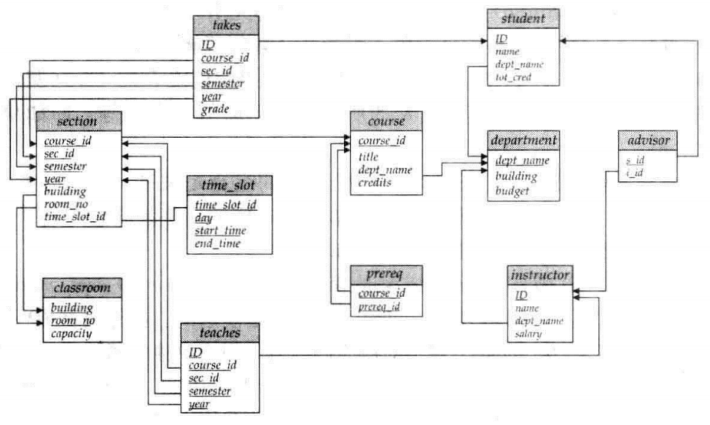
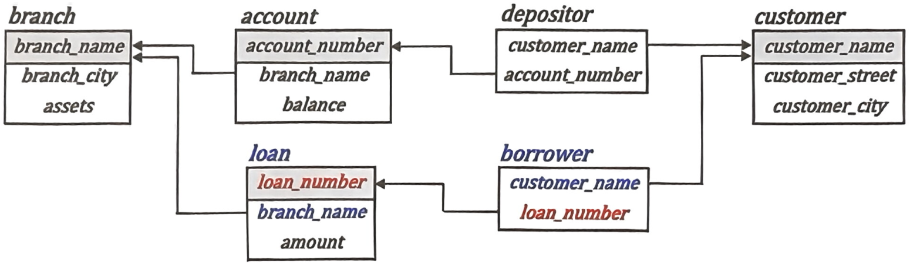
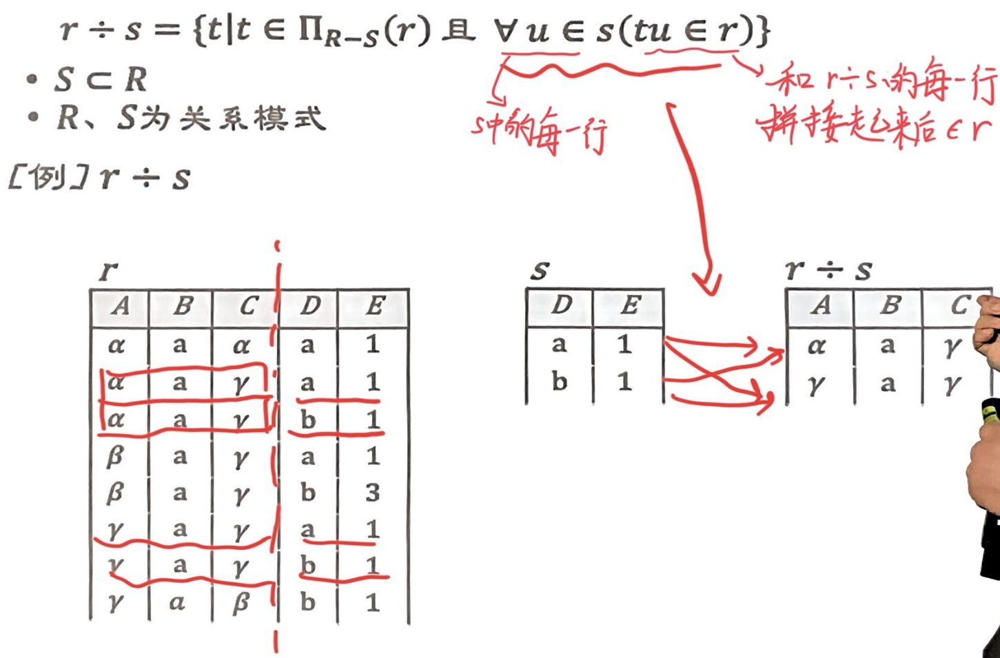
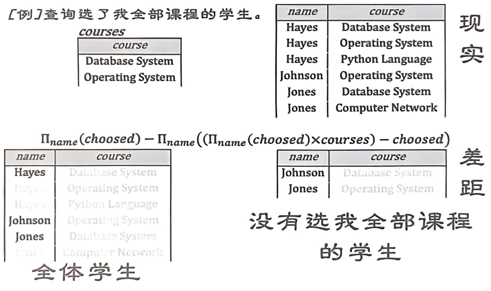

# 关系模型与关系代数

整理自 `笔记/数据库系统原理笔记.pdf` 第 6–26 页（第 2 章 关系模型介绍，含关系代数）、第 71–77 页（第 6 章 其他语言：元组关系演算、域关系演算、QBE），`老师资料/关系代数复习.docx` 的全部内容和例子，以及 `笔记/数据库期末复习题整理.pdf` 第 4–6 页（关系代数与空值小结、术语清单）和第 125–131 页（关系代数整理）。几份资料重复的地方已合并。原稿公式在 PDF 文字层里丢失、很多表格是截图，这里都对照原页面重新写出，并逐条核对过表达式和结果表。

## 本章要点

- 关系是若干个域的笛卡儿积的子集。关系模式描述结构，静态稳定；关系实例是某一时刻的数据，随时间变化。
- 码：超码能唯一标识元组；**候选码**是最小的超码；主码是设计者选定的那个候选码；外码是引用另一个关系主码的属性。
- 关系代数 6 个基本运算：选择 $\sigma$、投影 $\Pi$、并 $\cup$、差 $-$、笛卡儿积 $\times$、更名 $\rho$。并、差、交要求两个关系**同元且域相容**。
- 附加运算（交、自然连接、θ 连接、赋值、除）能用基本运算写出来，只是让查询更短，例如 $r \cap s = r - (r - s)$。
- 除法专门处理"全部""每一个"这类查询，基本运算写法是 $r \div s = \Pi_{R-S}(r) - \Pi_{R-S}((\Pi_{R-S}(r) \times s) - \Pi_{R-S,S}(r))$。
- 扩展运算：广义投影（投影列表里可以写算术表达式）、聚集 $\mathcal{G}$（分组统计）、外连接（左、右、全，没匹配上的地方补 null）。
- null 的规则：算术运算得 null；比较得 unknown；选择条件为 unknown 按 false 处理；聚集忽略 null；去重、分组时 null 视为相等。
- 修改数据库：删除 $r \leftarrow r - E$，插入 $r \leftarrow r \cup E$，更新 $r \leftarrow \Pi_{F_1, \dots, F_n}(r)$。
- 关系代数是过程化语言；元组关系演算 $\lbrace t \mid P(t) \rbrace$ 和域关系演算 $\lbrace \langle x_1, \dots, x_n \rangle \mid P \rbrace$ 是非过程化语言，写的时候要保证表达式安全。
- QBE 在框架表里填示例行：`P.` 表示输出，`_x` 是域变量，`¬` 写在关系名下表示"不存在"、写在属性下表示"不等于"，复杂条件写进条件框。

## 1. 关系数据库的结构

### 1.1 数据

原笔记给的定义：数据是对客观事物的逻辑归纳，是记录和鉴别事物的符号，也就是事实或观测结果。整理数据时既要归纳出共性，也要抽象出个性。

### 1.2 属性

表中的一列叫**属性**（attribute）。每个属性有下面几个要素：

- 名字：每个属性都有名字。
- **域**（domain）：属性允许取值的集合，相当于取值范围。
- 空值（null value）：每个域都包含 null，表示这个值未知或者不存在。null 参与算术运算结果仍是 null，比如 `null + 1` 还是 null。统计时含 null 的值会被忽略，例如 30 个人里有一人成绩为 null，平均分只按 29 人算。
- 原子性（atomic）：通常要求属性值不可再分。原笔记作者提醒，这里的"原子"说的是值不可分割，和第 1 章"要么全部发生、要么都不发生"的原子性是两回事。

### 1.3 关系

给定域 $D_1, D_2, \dots, D_n$，关系 $r$ 是笛卡儿积 $D_1 \times D_2 \times \cdots \times D_n$ 的子集。所以关系是 n 元组 $(a_1, a_2, \dots, a_n)$ 的集合，其中 $a_i \in D_i$，每个元组的第 i 个分量取自第 i 个属性的域。

例：给出 3 个域。

- $D_1$ = 导师集合 SUPERVISOR = {张清玫, 刘逸}
- $D_2$ = 专业集合 SPECIALITY = {计算机专业, 信息专业}
- $D_3$ = 研究生集合 POSTGRADUATE = {李勇, 刘晨, 王敏}

$D_1 \times D_2 \times D_3$ 的基数是 $2 \times 2 \times 3 = 12$，全部元组如下：

| SUPERVISOR | SPECIALITY | POSTGRADUATE |
| --- | --- | --- |
| 张清玫 | 计算机专业 | 李勇 |
| 张清玫 | 计算机专业 | 刘晨 |
| 张清玫 | 计算机专业 | 王敏 |
| 张清玫 | 信息专业 | 李勇 |
| 张清玫 | 信息专业 | 刘晨 |
| 张清玫 | 信息专业 | 王敏 |
| 刘逸 | 计算机专业 | 李勇 |
| 刘逸 | 计算机专业 | 刘晨 |
| 刘逸 | 计算机专业 | 王敏 |
| 刘逸 | 信息专业 | 李勇 |
| 刘逸 | 信息专业 | 刘晨 |
| 刘逸 | 信息专业 | 王敏 |

关系是这张表的某个子集。实际应用中只有部分组合有意义，我们挑出有意义的元组构成关系。

老师课上举的 Tom and Jerry 的例子也是这个意思：`pet_name` = {Jerry, Tom}，`pet_type` = {cat, dog, mouse}，两者的笛卡儿积有 6 个元组，其中只有子集 {(Jerry, mouse), (Tom, cat)} 才描述了"猫和老鼠"，这个子集才是我们要的关系：

| `pet_name` | `pet_type` |
| --- | --- |
| Jerry | mouse |
| Tom | cat |

### 1.4 元组

**元组**（tuple）就是表中的一行数据。

### 1.5 关系模式与关系实例

关系模式（relation schema）由属性序列和各属性对应的域组成，每个关系模式有一个名字。例如 `Account_schema = (account_number, branch_name, balance)`，结合黑皮书的写法，`account` 关系的模式记作 $account(account\_number,\ branch\_name,\ balance)$。

关系实例（relation instance）是给定时刻关系中数据的"快照"，类似于变量在某一时刻的值。`account` 的一个实例：

| `account_number` | `branch_name` | `balance` |
| --- | --- | --- |
| A-101 | Downtown | 500 |
| A-102 | Perryridge | 400 |
| A-201 | Brighton | 900 |
| A-215 | Mianus | 700 |
| A-217 | Brighton | 750 |
| A-222 | Redwood | 700 |

把关系画成表时，列对应属性（每列有自己的域），行对应元组，也叫记录。

区分关系模式和关系：

| | 关系模式 | 关系（实例） |
| --- | --- | --- |
| 是什么 | 对关系的描述：关系名加上构成关系的属性集合，每个属性有名字和类型 | 关系模式在某一时刻的状态或内容，是模式的一个实例，含具体数据 |
| 特点 | 静态的、稳定的，一般在设计数据库时确定 | 动态的，随着插入、删除、修改不断变化 |

### 1.6 关系数据库

关系数据库由表组成，每张表有唯一的名字。信息被拆到多张表里存放，避免把所有内容塞进一张大表造成重复。（更正：原文作"和文件系统不同，文件系统一般所有数据都放在一个文件中，而关系数据库放在多个表中"。这和第 1 章"数据孤立：数据分散在不同格式的文件中"矛盾，文件系统并不是把数据都放在一个文件里。）

例如银行数据库里除了上面的 `account`，还有 `branch` 表：

| `branch_name` | `branch_city` | `assets` |
| --- | --- | --- |
| Brighton | Brooklyn | 7100000 |
| Downtown | Brooklyn | 9000000 |
| Mianus | Horseneck | 400000 |
| North Town | Rye | 3700000 |
| Perryridge | Horseneck | 1700000 |
| Pownal | Bennington | 300000 |

## 2. 码

前提：任何关系中都不存在所有属性值都相同的两个元组。

- **超码**（superkey）：一个或多个属性的集合，它的值能在关系中唯一标识一个元组。
- **候选码**（candidate key）：最小的超码，也就是任何真子集都不再是超码的超码。一个关系可以有多个候选码。（更正：原文作"属性个数最少的超码"。候选码要求的是去掉其中任何一个属性后就不再是超码，并不要求它在所有超码里属性个数最少，同一关系的几个候选码属性个数可以不同。）
- **主码**（primary key）：设计者选定的、用来区分关系中不同元组的那个候选码。应该选属性值不变或极少改变的。每个关系通常只有一个主码；理论上可以不定义，但有的 DBMS 要求必须定义。
- 外码（foreign key）：关系 r1 中的某些属性恰好是另一个关系 r2 的主码，这些属性就是 r1 的外码。r1 叫参照关系，r2 叫被参照关系。外码的每个值都必须出现在被参照关系的主码值里。

主码的用处：

1. 唯一标识元组，可以按主码快速准确地找到某一行。
2. 维护完整性，DBMS 自动检查主码唯一、非空，不允许插入重复或空的主码值。
3. 和外码配合，建立表与表之间的联系。
4. 插入数据时按主码判重，不必和全表数据逐一比较。

外码的用处是保证数据一致。DBMS 会检查参照完整性：不允许插入在被参照关系里找不到的外码值，也不允许随便删除正被外码引用的主码值。外码和它引用的主码，属性名不一定相同（比如 `advisor.s_id` 引用的是 `student.ID`），所以定义外码时要写明引用的是哪一列。

例：学生信息表主码是"学号"，成绩表里也有"学号"字段，它就是成绩表的外码。成绩表里出现的每个学号都必须在学生信息表里存在，通过它可以查到每个学生的成绩。

## 3. 模式图与示例数据库

### 3.1 模式图

模式图用图形表示数据库的模式：每个关系画成一个矩形，关系名写在矩形上方，属性列在框内；主码属性加下划线；外码依赖画成从参照关系的外码属性指向被参照关系主码属性的箭头。

（更正：原文作"模式图没有表现出参照完整性的约束。相应地，实体-联系图可以表现"。外码约束本身就是参照完整性约束，模式图用箭头画出来了。教材的说法是：外码约束以外的参照完整性约束在模式图里不显式表示。）

### 3.2 大学数据库 university

原笔记贴的是教材图 2-8，下面先放原图，再改写成表。模式图里 `room_number` 简写成 `room_no`。

| 关系模式 | 主码 | 外码 |
| --- | --- | --- |
| `department(dept_name, building, budget)` | `dept_name` | 无 |
| `instructor(ID, name, dept_name, salary)` | `ID` | `dept_name` → `department` |
| `course(course_id, title, dept_name, credits)` | `course_id` | `dept_name` → `department` |
| `section(course_id, sec_id, semester, year, building, room_number, time_slot_id)` | `(course_id, sec_id, semester, year)` | `course_id` → `course`；`(building, room_number)` → `classroom` |
| `teaches(ID, course_id, sec_id, semester, year)` | 全部 5 个属性 | `ID` → `instructor`；`(course_id, sec_id, semester, year)` → `section` |
| `student(ID, name, dept_name, tot_cred)` | `ID` | `dept_name` → `department` |
| `takes(ID, course_id, sec_id, semester, year, grade)` | `(ID, course_id, sec_id, semester, year)` | `ID` → `student`；`(course_id, sec_id, semester, year)` → `section` |
| `advisor(s_id, i_id)` | `s_id` | `s_id` → `student` 的 `ID`；`i_id` → `instructor` 的 `ID` |
| `prereq(course_id, prereq_id)` | `(course_id, prereq_id)` | `course_id` 和 `prereq_id` 都引用 `course` 的 `course_id` |
| `classroom(building, room_number, capacity)` | `(building, room_number)` | 无 |
| `time_slot(time_slot_id, day, start_time, end_time)` | `(time_slot_id, day, start_time)` | 无 |

- （更正：原笔记文字版把 `teaches` 的属性写成 `section_id`，应为 `sec_id`，和模式图及 `section` 一致。）
- （更正：原笔记把 `advisor` 的 `s_id`、`i_id` 都标成主码。模式图里只有 `s_id` 加下划线，主码是 `s_id`，表示每个学生只有一位导师。）
- `section` 的 `time_slot_id` 在图上连到 `time_slot`，但 `time_slot_id` 单独不是 `time_slot` 的主码，所以严格说它不是外码。

### 3.3 银行数据库

第 2 章的查询举例和第 6 章的关系演算、QBE 例子都用这套模式。

| 关系模式 | 主码 | 外码 |
| --- | --- | --- |
| `branch(branch_name, branch_city, assets)` | `branch_name` | 无 |
| `account(account_number, branch_name, balance)` | `account_number` | `branch_name` → `branch` |
| `depositor(customer_name, account_number)` | `(customer_name, account_number)` | `customer_name` → `customer`；`account_number` → `account` |
| `customer(customer_name, customer_street, customer_city)` | `customer_name` | 无 |
| `loan(loan_number, branch_name, amount)` | `loan_number` | `branch_name` → `branch` |
| `borrower(customer_name, loan_number)` | `(customer_name, loan_number)` | `customer_name` → `customer`；`loan_number` → `loan` |

## 4. 关系查询语言

| 类型 | 用户要说明什么 | 代表 |
| --- | --- | --- |
| 过程化查询语言（procedural） | 指导系统执行一系列操作，明确给出获取数据的具体步骤，更接近编程 | 关系代数 |
| 非过程化查询语言（nonprocedural） | 只描述需要什么信息，怎么取由系统自己决定 | 元组关系演算、域关系演算 |

关系代数、元组关系演算、域关系演算合称"纯"查询语言。它们简洁、形式化，没有 SQL 这类实用语言里的语法修饰，关系演算用谓词逻辑描述想要的结果。

## 5. 关系代数的基本运算

关系代数由一组运算组成，每个运算以一个或两个关系为输入，产生一个新关系作为结果。老师资料里的运算符总表：

| 编号 | 运算 | 符号 | 单目/双目 | 类别 |
| --- | --- | --- | --- | --- |
| 1 | 选择 select | $\sigma$ | 单目 | 基本运算 |
| 2 | 投影 project | $\Pi$ | 单目 | 基本运算 |
| 3 | 并 union | $\cup$ | 双目 | 基本运算 |
| 4 | 差 set difference | $-$ | 双目 | 基本运算 |
| 5 | 笛卡儿积 Cartesian product | $\times$ | 双目 | 基本运算 |
| 6 | 更名 rename | $\rho$ | 单目 | 基本运算 |
| 7 | 交 set intersection | $\cap$ | 双目 | 附加运算 |
| 8 | 自然连接 natural join | $\bowtie$ | 双目 | 附加运算 |
| 9 | 除 division（商） | $\div$ | 双目 | 附加运算 |
| 10 | 赋值 assignment | $\leftarrow$ | 双目 | 附加运算 |
| 11 | 广义投影 generalized projection | $\Pi_{F_1, \dots, F_n}$ | 单目 | 扩展运算 |
| 12 | 聚集 aggregate functions | $\mathcal{G}$ | 单目 | 扩展运算 |
| 13 | 外连接 outer join | ⟕ ⟖ ⟗ | 双目 | 扩展运算 |

老师资料的例子大多用下面这个 `instructor` 实例（原稿把 Biology 拼成了 Bilogy，表头写成 `DEPR_NAME`，这里已改正）：

| `ID` | `name` | `dept_name` | `salary` |
| --- | --- | --- | --- |
| 76766 | Crick | Biology | 72000 |
| 45565 | Katz | Comp. Sci. | 75000 |
| 12121 | Wu | Finance | 80000 |
| 98345 | Kim | Physics | 68200 |

### 5.1 选择 σ

$$\sigma_p(r) = \lbrace t \mid t \in r \wedge p(t) \rbrace$$

$p$ 是谓词，结果是 r 中满足 $p$ 的元组，相当于按行筛选。 $p$ 里可以用比较运算符 $=, \neq, \lt, \le, \gt, \ge$，可以用 $\wedge$（and）、 $\vee$（or）、 $\neg$（not）把多个条件连起来，也可以直接比较两个属性。

笔记里的例子：

- 选出 `instructor` 中物理系的老师： $\sigma_{dept\_name=\text{'Physics'}}(instructor)$
- 选出工资高于 90000 美元的老师： $\sigma_{salary \gt 90000}(instructor)$
- 选出工资高于 90000 美元的物理系老师： $\sigma_{dept\_name=\text{'Physics'} \wedge salary \gt 90000}(instructor)$
- 选出系名与所在教学楼名相同的系： $\sigma_{dept\_name=building}(department)$ （更正：原文作 $\sigma_{dept\_name=building}(instructor)$，`instructor` 没有 `building` 属性，教学楼信息在 `department` 里。复习题整理稿第 125 页照抄了这个式子，错误相同。）

老师资料的例子（作用在上面的 `instructor` 实例上）：

例 1　选出物理系的所有老师。

$$\sigma_{dept\_name=\text{'Physics'}}(instructor)$$

| `ID` | `name` | `dept_name` | `salary` |
| --- | --- | --- | --- |
| 98345 | Kim | Physics | 68200 |

例 2　选出物理系或者年薪大于 70000 美元的老师。

$$\sigma_{dept\_name=\text{'Physics'} \vee salary \gt 70000}(instructor)$$

结果是全部 4 行：Crick、Katz、Wu 的工资都超过 70000，Kim 在物理系。

例 3　选出除了物理和计算机学院之外的老师。

$$\sigma_{\neg(dept\_name=\text{'Physics'}) \wedge \neg(dept\_name=\text{'Comp. Sci.'})}(instructor)$$

| `ID` | `name` | `dept_name` | `salary` |
| --- | --- | --- | --- |
| 76766 | Crick | Biology | 72000 |
| 12121 | Wu | Finance | 80000 |

### 5.2 投影 Π

$$\Pi_{A_1, A_2, \dots, A_k}(r)$$

$A_1, \dots, A_k$ 是属性名。结果只保留列出的这 k 列，并且**去掉重复的行**（关系是集合）。相当于按列筛选。

例 1　输出老师的 ID、姓名和工资。

$$\Pi_{ID,\ name,\ salary}(instructor)$$

| `ID` | `name` | `salary` |
| --- | --- | --- |
| 76766 | Crick | 72000 |
| 45565 | Katz | 75000 |
| 12121 | Wu | 80000 |
| 98345 | Kim | 68200 |

例 2　输出计算机系老师的 ID、姓名和工资。

$$\Pi_{ID,\ name,\ salary}(\sigma_{dept\_name=\text{'Comp. Sci.'}}(instructor))$$

| `ID` | `name` | `salary` |
| --- | --- | --- |
| 45565 | Katz | 75000 |

### 5.3 并 ∪

$$r \cup s = \lbrace t \mid t \in r \vee t \in s \rbrace$$

两个关系合并，结果是维恩图里 r、s 两个圆覆盖的全部区域。r、s 必须满足：

1. 同元（same arity）：属性个数相同。
2. 域相容（compatible）：对应列的域一致，比如 r 的第 2 列和 s 的第 2 列存的是同一类值。

例 1　查询在计算机学院或者物理学院工作的老师的信息。

$$\sigma_{dept\_name=\text{'Comp. Sci.'}}(instructor) \cup \sigma_{dept\_name=\text{'Physics'}}(instructor)$$

（更正：原文作 $\sigma_{dept\_name=\text{'Physics'}}(instructor) \cup \sigma_{dept\_name=\text{'Physics'}}(instructor)$，两边都是物理系，前一半应为计算机系。）

| `ID` | `name` | `dept_name` | `salary` |
| --- | --- | --- | --- |
| 45565 | Katz | Comp. Sci. | 75000 |
| 98345 | Kim | Physics | 68200 |

例 2　找出在 2018 年秋季或 2019 年春季（或两个学期都）开课的课程。

$$\Pi_{course\_id}(\sigma_{semester=\text{'Fall'} \wedge year=2018}(section)) \cup \Pi_{course\_id}(\sigma_{semester=\text{'Spring'} \wedge year=2019}(section))$$

### 5.4 差 −

$$r - s = \lbrace t \mid t \in r \wedge t \notin s \rbrace$$

结果是属于 r 但不属于 s 的元组，即 r 的圆去掉和 s 重叠的部分。和并一样，要求 r、s 同元且域相容。

例（笔记）：

r：

| A | B |
| --- | --- |
| α | 1 |
| α | 3 |
| β | 4 |
| β | 3 |
| β | 7 |
| γ | 2 |

s：

| A | B |
| --- | --- |
| α | 3 |
| β | 4 |
| β | 3 |
| γ | 2 |

r − s：

| A | B |
| --- | --- |
| α | 1 |
| β | 7 |

例 1　找出 2018 年秋季开课、但 2019 年春季没有开的课程。

$$\Pi_{course\_id}(\sigma_{semester=\text{'Fall'} \wedge year=2018}(section)) - \Pi_{course\_id}(\sigma_{semester=\text{'Spring'} \wedge year=2019}(section))$$

例 2　找出在物理学院工作、但工资小于 70000 的所有老师。

$$\sigma_{dept\_name=\text{'Physics'}}(instructor) - \sigma_{salary \ge 70000}(instructor)$$

| `ID` | `name` | `dept_name` | `salary` |
| --- | --- | --- | --- |
| 98345 | Kim | Physics | 68200 |

### 5.5 笛卡儿积 ×

$$r \times s = \lbrace tq \mid t \in r \wedge q \in s \rbrace$$

$tq$ 表示把元组 t 和 q 首尾拼成一个元组。r 的每个元组都和 s 的每个元组组合一次，相当于穷举所有组合：结果元组数是两者元组数之积，属性数是两者之和。

- 默认假设两个模式没有同名属性，即 $R \cap S = \emptyset$。
- 如果 $R \cap S \neq \emptyset$，结果里用"关系名.属性名"区分同名属性，或者先用更名运算改名。

例 1　r(A, B) 与 s(C, D, E) 的笛卡儿积。

r：

| A | B |
| --- | --- |
| α | 1 |
| β | 2 |

s：

| C | D | E |
| --- | --- | --- |
| α | 10 | a |
| β | 10 | a |
| β | 20 | b |
| γ | 10 | b |

r × s：

| A | B | C | D | E |
| --- | --- | --- | --- | --- |
| α | 1 | α | 10 | a |
| α | 1 | β | 10 | a |
| α | 1 | β | 20 | b |
| α | 1 | γ | 10 | b |
| β | 2 | α | 10 | a |
| β | 2 | β | 10 | a |
| β | 2 | β | 20 | b |
| β | 2 | γ | 10 | b |

例 2　有同名属性时。r(A, B) 同上，s 改成 s(B, D, E)，数据和例 1 的 s 相同。r × s 的表头变成 A、`r.B`、`s.B`、D、E，8 行数据和例 1 完全一样。

### 5.6 更名 ρ

- $\rho_x(E)$：把表达式 E 的结果命名为 x。
- $\rho_{x(A_1, A_2, \dots, A_k)}(E)$：命名为 x，同时把各属性依次改名为 $A_1, \dots, A_k$。

同一个关系要和自己做笛卡儿积时，必须先给其中一份改名，否则分不清两份的属性。

例　r(A, B) = {(α, 1), (β, 2)}，求 $r \times \rho_s(r)$：

| `r.A` | `r.B` | `s.A` | `s.B` |
| --- | --- | --- | --- |
| α | 1 | α | 1 |
| α | 1 | β | 2 |
| β | 2 | α | 1 |
| β | 2 | β | 2 |

更名的典型用法是"不用聚集求最大值"，见典型题 2 和题 16。

### 5.7 关系代数表达式

关系代数的基本表达式是下面两种之一：

- 数据库中的一个关系；
- 一个常量关系，比如 $\lbrace (\text{'Downtown'}),\ (\text{'Uptown'}) \rbrace$。

（更正：原文第一条作"数据库的一个表达式"，应为"数据库中的一个关系"。）

如果 $E$、 $E_1$、 $E_2$ 是关系代数表达式，那么 $E_1 \cup E_2$、 $E_1 - E_2$、 $E_1 \times E_2$、 $\sigma_p(E)$、 $\Pi_S(E)$、 $\rho_x(E)$ 也都是关系代数表达式。表达式可以一层套一层。

例 $\sigma_{A=C}(r \times s)$，r、s 用 5.5 例 1 的数据。从 r × s 的 8 行里挑出 A 与 C 相等的行：

| A | B | C | D | E |
| --- | --- | --- | --- | --- |
| α | 1 | α | 10 | a |
| β | 2 | β | 10 | a |
| β | 2 | β | 20 | b |

## 6. 附加的关系代数运算

这些运算都能用基本运算表示，不增加关系代数的表达能力，只是把常用的查询写得更简单。

### 6.1 交 ∩

$$r \cap s = \lbrace t \mid t \in r \wedge t \in s \rbrace$$

要求 r、s 同元且域相容。结果是维恩图中两圆重叠的部分。

交可以用差表示： $r \cap s = r - (r - s)$。两种写法结果相同，但效率不同，直接写交的效率更高。

例（笔记）：r = {(α, 1), (β, 7), (γ, 2)}，s = {(α, 1), (α, 3), (β, 4), (γ, 2)}，属性都是 (A, B)。

| A | B |
| --- | --- |
| α | 1 |
| γ | 2 |

例（老师资料）：r = {(α, 1), (α, 2), (β, 1)}，s = {(α, 2), (β, 3)}，则 $r \cap s$ = {(α, 2)}。

例 1　找出 2018 年秋季和 2019 年春季都开设的课程。

$$\Pi_{course\_id}(\sigma_{semester=\text{'Fall'} \wedge year=2018}(section)) \cap \Pi_{course\_id}(\sigma_{semester=\text{'Spring'} \wedge year=2019}(section))$$

例 2　找到计算机系且工资大于 70000 的所有老师的工号。

$$\Pi_{ID}(\sigma_{dept\_name=\text{'Comp. Sci.'}}(instructor)) \cap \Pi_{ID}(\sigma_{instructor.salary \gt 70000}(instructor))$$

| `ID` |
| --- |
| 45565 |

### 6.2 自然连接 ⋈

设 R、S 是 r、s 的关系模式。

$$r \bowtie s = \lbrace tq \mid t \in r \wedge q \in s \wedge t[R \cap S] = q[R \cap S] \rbrace$$

- $t \in r$ 表示 t 是 r 中的一行， $q \in s$ 表示 q 是 s 中的一行。
- $t[R \cap S] = q[R \cap S]$ 表示 t 和 q 在 R、S 的公共属性上取值相同。
- 拼接时公共属性只保留一份，结果模式是 $R \cup S$。

（更正：原文作 $t[R \cap S] = s[R \cap S]$，等号右边应该是元组 q，s 是关系名。）

自然连接等价于先做笛卡儿积，再选公共属性相等的元组，最后投影去掉重复的列。设 $R \cap S = \lbrace A_1, \dots, A_k \rbrace$：

$$r \bowtie s = \Pi_{R \cup S}(\sigma_{r.A_1=s.A_1 \wedge r.A_2=s.A_2 \wedge \cdots \wedge r.A_k=s.A_k}(r \times s))$$

老师资料的具体写法：R = (A, B, C, D)，S = (E, B, D)，结果模式为 (A, B, C, D, E)，

$$r \bowtie s = \Pi_{r.A,\ r.B,\ r.C,\ r.D,\ s.E}(\sigma_{r.B=s.B \wedge r.D=s.D}(r \times s))$$

如果 R、S 没有公共属性，自然连接就等于笛卡儿积（整理补充）。

例 1（笔记）：r(A, B) = {(α, 1), (β, 2)}。

s：

| B | C | D |
| --- | --- | --- |
| 1 | α | a |
| 2 | β | a |
| 2 | γ | b |
| 3 | δ | b |

r ⋈ s（在 B 上相等）：

| A | B | C | D |
| --- | --- | --- | --- |
| α | 1 | α | a |
| β | 2 | β | a |
| β | 2 | γ | b |

例 2（老师资料）：

r：

| A | B | C | D |
| --- | --- | --- | --- |
| α | 1 | α | a |
| β | 2 | γ | a |
| γ | 4 | β | b |
| α | 1 | γ | a |
| δ | 2 | β | b |

s：

| B | D | E |
| --- | --- | --- |
| 1 | a | α |
| 3 | a | β |
| 1 | a | γ |
| 2 | b | δ |
| 3 | b | ε |

r ⋈ s（在 B、D 上都相等）：

| A | B | C | D | E |
| --- | --- | --- | --- | --- |
| α | 1 | α | a | α |
| α | 1 | α | a | γ |
| α | 1 | γ | a | α |
| α | 1 | γ | a | γ |
| δ | 2 | β | b | δ |

### 6.3 θ 连接

$$r \bowtie_{\theta} s = \sigma_{\theta}(r \times s)$$

就是带条件 θ 的连接：在笛卡儿积上按 θ 筛选。θ 里全是等号时叫等值连接。

### 6.4 赋值 ←

把右边表达式的查询结果存进左边的临时关系变量，比如 $temp \leftarrow \Pi_{R-S}(r)$。复杂查询可以拆成几步写，后面的步骤直接用前面的变量名。

### 6.5 除 ÷

设 r、s 的模式分别为 $R = (A_1, \dots, A_m, B_1, \dots, B_n)$ 和 $S = (B_1, \dots, B_n)$，即 $S \subseteq R$。 $r \div s$ 的结果模式是 $R - S = (A_1, \dots, A_m)$。

$$r \div s = \lbrace t \mid t \in \Pi_{R-S}(r) \wedge \forall u \in s\ (tu \in r) \rbrace$$

读法：t 取自 r 在 R − S 上的投影；把 t 和 s 中的**每一行** u 拼接成 tu，拼出来的元组都要在 r 里，t 才留在结果中。

例 1（老师资料）　r(A, B) = {(α, 1), (α, 2), (α, 3), (β, 1), (γ, 1), (δ, 1), (δ, 3), (δ, 4), (ε, 6), (ε, 1), (β, 2)}，s(B) = {1, 2}，求 $r \div s$。

思路：结果只含属性 A；候选值有 α、β、γ、δ、ε；把每个候选分别和 B 中的 1、2 拼接，看拼出的元组是否都在 r 中。都在就保留，否则删掉。只有 α、β 满足。

| A |
| --- |
| α |
| β |

例 2（笔记和老师资料都有）

r：

| A | B | C | D | E |
| --- | --- | --- | --- | --- |
| α | a | α | a | 1 |
| α | a | γ | a | 1 |
| α | a | γ | b | 1 |
| β | a | γ | a | 1 |
| β | a | γ | b | 3 |
| γ | a | γ | a | 1 |
| γ | a | γ | b | 1 |
| γ | a | β | b | 1 |

s：

| D | E |
| --- | --- |
| a | 1 |
| b | 1 |

r ÷ s：

| A | B | C |
| --- | --- | --- |
| α | a | γ |
| γ | a | γ |

(α, a, γ) 和 (γ, a, γ) 与 (a, 1)、(b, 1) 拼接后都在 r 中。(β, a, γ) 缺 (b, 1)，(α, a, α) 和 (γ, a, β) 各只有一行，都不满足。

用基本运算表示除法：

$$r \div s = \Pi_{R-S}(r) - \Pi_{R-S}((\Pi_{R-S}(r) \times s) - \Pi_{R-S,S}(r))$$

用"查询选了我全部课程的学生"来理解。`choosed(name, course)` 记录谁选了什么课，`courses(course)` 是"我"开的全部课程，`choosed` 就是 r，`courses` 就是 s。

`choosed`：

| `name` | `course` |
| --- | --- |
| Hayes | Database System |
| Hayes | Operating System |
| Hayes | Python Language |
| Johnson | Operating System |
| Jones | Database System |
| Jones | Computer Network |

`courses`：

| `course` |
| --- |
| Database System |
| Operating System |

$$\Pi_{name}(choosed) - \Pi_{name}((\Pi_{name}(choosed) \times courses) - choosed)$$

1. $\Pi_{name}(choosed)$ = {Hayes, Johnson, Jones}，是全体学生。
2. $\Pi_{name}(choosed) \times courses$ 是"理想情况"：假设每个学生都选了全部课程。
3. 减去 `choosed`（实际情况），剩下的是"差距"：(Johnson, Database System)、(Jones, Operating System)。
4. 投影到 name 得到没有选全部课程的学生 {Johnson, Jones}。
5. 全体学生减去他们，结果是 {Hayes}。

原笔记作者的总结是"正难则反"：选了全部课程的学生 = 所有学生 − 没有选全部课程的学生。复习题整理稿把这句标成了重点，并指出其中构造"没选全部课程的学生"的办法很经典：先用笛卡儿积造出所有可能的组合，再减去当前关系，剩下的就是缺的部分。

一般式最后一项写 $\Pi_{R-S,S}(r)$ 而不是直接写 r，是为了把 r 的属性顺序调成 R − S 在前、S 在后，和 $\Pi_{R-S}(r) \times s$ 的列顺序一致，这样才能做差。

## 7. 扩展的关系代数运算

在基本运算之外加入了算术运算、分组统计和外连接，这些是基本运算做不到的。

### 7.1 广义投影

$$\Pi_{F_1, F_2, \dots, F_n}(E)$$

$E$ 是任意关系代数表达式，每个 $F_i$ 是由常量和 E 的模式中的属性构成的算术表达式。原笔记作者的理解：可以做运算的投影。

例 1（笔记）　信用卡还能透支多少钱。

`credit_info`：

| `customer_name` | `limit` | `credit_balance` |
| --- | --- | --- |
| Curry | 2000 | 1750 |
| Hayes | 1500 | 1500 |
| Jones | 6000 | 700 |
| Smith | 2000 | 400 |

$$\Pi_{customer\_name,\ (limit - credit\_balance)\ as\ credit\_available}(credit\_info)$$

| `customer_name` | `credit_available` |
| --- | --- |
| Curry | 250 |
| Hayes | 0 |
| Jones | 5300 |
| Smith | 1600 |

例 2（老师资料）　每个学生当前还差多少学分可以毕业，假定最低学分要求是 100。

$$\Pi_{ID,\ 100 - tot\_cred}(student)$$

（更正：原文属性名写作 `tot_credit`，`student` 模式里是 `tot_cred`。）

### 7.2 聚集函数与聚集运算

聚集函数输入一组值，返回一个值：

| 函数 | 含义 | 对应的 SQL 写法 |
| --- | --- | --- |
| `sum` | 求和 | `SELECT SUM(salary) FROM employees;` |
| `avg` | 平均值 | `SELECT AVG(salary) FROM employees;` |
| `count` | 值的个数 | `SELECT COUNT(employee_id) FROM employees;` |
| `max` | 最大值 | `SELECT MAX(salary) FROM employees;` |
| `min` | 最小值 | `SELECT MIN(salary) FROM employees;` |

聚集运算：

$${}_{G_1, G_2, \dots, G_n}\mathcal{G}_{F_1(A_1),\ F_2(A_2),\ \dots,\ F_m(A_m)}(E)$$

- $E$ 是任意关系代数表达式。
- $G_1, \dots, G_n$ 是用于分组的属性（可以为空），写在 $\mathcal{G}$ 左下角，表示"按什么属性分组"。
- $F_i$ 是聚集函数， $A_i$ 是属性名，写在右下角，表示"对哪个属性做什么统计"。
- 分组属性可以不止一个，比如按每个银行的每个部门分组。

例 1（老师资料）　r(A, B, C) = {(α, α, 7), (α, β, 7), (β, β, 3), (β, β, 10)}。

$\mathcal{G}_{sum(C)}(r)$，没有分组属性，整张表是一组：

| `sum(C)` |
| --- |
| 27 |

$\mathop{}\nolimits_{A}\mathcal{G}_{sum(C)}(r)$，按 A 分组：

| A | `sum(C)` |
| --- | --- |
| α | 14 |
| β | 13 |

例 2（笔记）　分别统计各银行的员工收入。

`pt_works`：

| `employee_name` | `branch_name` | `salary` |
| --- | --- | --- |
| Adams | Downtown | 1500 |
| Brown | Perryridge | 1500 |
| Gopal | Austin | 1600 |
| Johnson | Downtown | 1300 |
| Loreena | Perryridge | 5300 |
| Peterson | Perryridge | 1300 |
| Rao | Austin | 1500 |
| Sato | Downtown | 2500 |

$${}_{branch\_name}\mathcal{G}_{sum(salary)}(pt\_works)$$

| `branch_name` | `sum(salary)` |
| --- | --- |
| Austin | 3100 |
| Downtown | 5300 |
| Perryridge | 8100 |

原笔记手写批注：左下角不写 `branch_name` 的话，结果只有一行一列，即所有员工的总收入（这份数据是 16500）。

例 3（老师资料）　按 `building` 统计 `department` 的预算总和。

`department`：

| `dept_name` | `building` | `budget` |
| --- | --- | --- |
| Comp. Sci. | Taylor | 100000 |
| Biology | Watson | 90000 |
| Elec. Eng. | Taylor | 85000 |
| Music | Packard | 80000 |
| Finance | Painter | 120000 |
| History | Painter | 50000 |
| Physics | Watson | 70000 |

$${}_{building}\mathcal{G}_{sum(budget)}(department)$$

| `building` | `sum(budget)` |
| --- | --- |
| Taylor | 185000 |
| Watson | 160000 |
| Packard | 80000 |
| Painter | 170000 |

聚集结果的列是没有名字的，可以用更名运算给它起名：

$$\rho_{result(building,\ sum\_budget)}({}_{building}\mathcal{G}_{sum(budget)}(department))$$

### 7.3 外连接

自然连接会丢掉没匹配上的元组。外连接把它们保留下来，缺少的属性值填 null，避免缺失数据影响查询结果。

| 运算 | 符号 | 保留谁 | 原笔记的记法 |
| --- | --- | --- | --- |
| 左外连接 | ⟕ | 左关系的元组不管有没有匹配都保留，不匹配处补 null | 左表完整，符号左侧凸出 |
| 右外连接 | ⟖ | 右关系的元组不管有没有匹配都保留，不匹配处补 null | 右表完整，符号右侧凸出 |
| 全外连接 | ⟗ | 同时做左外连接和右外连接 | 两表都完整 |

（更正：原文对右外连接的描述作"右关系的元组无论与右关系元组是否匹配"，第二个"右"应为"左"。）

例（笔记和老师资料都有）。原稿用了缩写：`l_n` 是 `loan_number`，`b_n` 是 `branch_name`，`c_n` 是 `customer_name`。

R：

| `l_n` | `b_n` | `amount` |
| --- | --- | --- |
| L-170 | Downtown | 3000 |
| L-230 | Redwood | 4000 |
| L-260 | Perryridge | 1700 |

S：

| `c_n` | `l_n` |
| --- | --- |
| Jones | L-170 |
| Smith | L-230 |
| Hayes | L-155 |

自然连接 R ⋈ S：

| `l_n` | `b_n` | `amount` | `c_n` |
| --- | --- | --- | --- |
| L-170 | Downtown | 3000 | Jones |
| L-230 | Redwood | 4000 | Smith |

左外连接 R ⟕ S：

| `l_n` | `b_n` | `amount` | `c_n` |
| --- | --- | --- | --- |
| L-170 | Downtown | 3000 | Jones |
| L-230 | Redwood | 4000 | Smith |
| L-260 | Perryridge | 1700 | null |

右外连接 R ⟖ S：

| `l_n` | `b_n` | `amount` | `c_n` |
| --- | --- | --- | --- |
| L-170 | Downtown | 3000 | Jones |
| L-230 | Redwood | 4000 | Smith |
| L-155 | null | null | Hayes |

全外连接 R ⟗ S：

| `l_n` | `b_n` | `amount` | `c_n` |
| --- | --- | --- | --- |
| L-170 | Downtown | 3000 | Jones |
| L-230 | Redwood | 4000 | Smith |
| L-260 | Perryridge | 1700 | null |
| L-155 | null | null | Hayes |

外连接也能用基本运算写出来（整理补充）。以左外连接为例，常量关系的模式是 $S - R$：

$$r \mathbin{⟕} s = (r \bowtie s) \cup ((r - \Pi_R(r \bowtie s)) \times \lbrace (null, \dots, null) \rbrace)$$

### 7.4 空值

- null 表示一个不确定（unknown）的值，或者一个不存在的值。
- 包含 null 的算术运算，结果为 null。
- 聚集函数直接忽略 null。
- 包含 null 的比较运算，结果为 unknown。

unknown 参与逻辑运算：

| 运算 | 结果 |
| --- | --- |
| $true \wedge unknown$ | unknown |
| $false \wedge unknown$ | false |
| $unknown \wedge unknown$ | unknown |
| $true \vee unknown$ | true |
| $false \vee unknown$ | unknown |
| $unknown \vee unknown$ | unknown |
| $\neg unknown$ | unknown |

记法：把三个真值排成 `false < unknown < true`，and 取两者中较小的，or 取较大的。（更正：原文把这个顺序称作"优先级"，它其实是真值的大小顺序，和运算符优先级无关。）

各运算怎么处理 null：

- $\sigma_p$：p 的值为 unknown 时按 false 处理，该元组不选。
- $\bowtie_\theta$：θ 中涉及的属性为 null 的元组不参与匹配。
- $\cup$、 $\cap$、 $-$ 以及（广义）投影去重时，把 null 视为相等。
- 聚集运算：null 在分组属性上视为相等（所有 null 分到一组）；在被聚集的属性上则忽略。

## 8. 用关系代数修改数据库

| 操作 | 表达式 | 说明 |
| --- | --- | --- |
| 删除 | $r \leftarrow r - E$ | r 是关系，E 是关系代数查询，选出要删的元组 |
| 插入 | $r \leftarrow r \cup E$ | E 是关系代数表达式。插入单个元组时，E 写成只含这一个元组的常量关系 |
| 更新 | $r \leftarrow \Pi_{F_1, F_2, \dots, F_n}(r)$ | 用广义投影完成。第 i 个属性不更新时， $F_i$ 就写这个属性本身；要更新时， $F_i$ 是只含常量和 r 的属性的表达式，算出新值 |

只修改 r 中满足条件 p 的元组时，更新要写成：

$$r \leftarrow \Pi_{F_1, F_2, \dots, F_n}(\sigma_p(r)) \cup (r - \sigma_p(r))$$

改数据时要注意一致性，常常需要同时修改好几个关系。具体例子见典型题 5 到题 7、题 17 到题 22。

## 9. 元组关系演算

### 9.1 定义

元组关系演算（Tuple Relational Calculus）是非过程化语言，查询写成

$$\lbrace t \mid P(t) \rbrace$$

意思是所有使公式 P 为真的元组 t 组成的集合。 $t[A]$ 表示元组 t 在属性 A 上的值。P 是由原子构成的公式。

原子有三种形式：

1. $s \in r$：s 是元组变量，r 是关系。
2. $s[x]\ \Theta\ u[y]$：s、u 是元组变量，x、y 是相应关系上的属性，Θ 是比较运算符 $\lt, \le, =, \neq, \ge, \gt$。
3. $s[x]\ \Theta\ c$：c 是属性 x 的域中的常量。

公式的构成规则：

1. 原子是公式。
2. 如果 $P_1$ 是公式，那么 $\neg P_1$ 和 $(P_1)$ 也是公式。
3. 如果 $P_1$、 $P_2$ 是公式，那么 $P_1 \vee P_2$、 $P_1 \wedge P_2$、 $P_1 \Rightarrow P_2$ 也是公式。
4. 如果 $P_1(s)$ 是包含自由元组变量 s 的公式，r 是关系，那么 $\exists s \in r\ (P_1(s))$ 和 $\forall s \in r\ (P_1(s))$ 也是公式。（更正：原文把 $P_1(s)$ 有几处写成了 $P_1(S)$，这里的 s 是元组变量。）

- 自由变量：没有被 $\exists$ 或 $\forall$ 约束的变量。
- 约束变量：被 $\exists$ 或 $\forall$ 约束的变量。

常用的等价变换（整理补充）： $P_1 \Rightarrow P_2$ 等价于 $\neg P_1 \vee P_2$； $\forall t \in r\ (P(t))$ 等价于 $\neg \exists t \in r\ (\neg P(t))$。

### 9.2 查询举例（银行数据库）

下面几个式子里，原文多处把方括号写错了位置，如 `t[customer_name = s[customer_name]]`，已统一改成 `t[customer_name] = s[customer_name]`。

例 1　列出贷款超过 1200 美元的贷款账号、银行名称和贷款额度（`loan` 的全部属性）。

$$\lbrace t \mid t \in loan \wedge t[amount] \gt 1200 \rbrace$$

例 2　列出贷款额度超过 1200 美元的贷款账号。

$$\lbrace t \mid \exists s \in loan\ (t[loan\_number] = s[loan\_number] \wedge s[amount] \gt 1200) \rbrace$$

结果只要贷款账号一列，所以 t 只在 `loan_number` 上有取值，要用存在量词引入 `loan` 中的元组 s。

例 3　列出所有在 Perryridge 银行贷款的顾客。

$$\lbrace t \mid \exists s \in borrower\ (t[customer\_name] = s[customer\_name] \wedge \exists u \in loan\ (u[loan\_number] = s[loan\_number] \wedge u[branch\_name] = \text{'Perryridge'})) \rbrace$$

（更正：原文 $u \in loan$ 前面漏了存在量词 $\exists$，u 没有被约束。）

例 4　找出在银行有贷款、或有存款、或两者都有的顾客。

$$\lbrace t \mid \exists s \in borrower\ (t[customer\_name] = s[customer\_name]) \vee \exists u \in depositor\ (t[customer\_name] = u[customer\_name]) \rbrace$$

例 5　找出在银行既有贷款又有存款的顾客。

$$\lbrace t \mid \exists s \in borrower\ (t[customer\_name] = s[customer\_name]) \wedge \exists u \in depositor\ (t[customer\_name] = u[customer\_name]) \rbrace$$

（更正：原文中间的连接词写成了 $\vee$，和例 4 一样，"既有又有"应该用 $\wedge$。）

例 6　查询在银行只有存款、没有贷款的顾客。

$$\lbrace t \mid \exists s \in depositor\ (t[customer\_name] = s[customer\_name]) \wedge \neg \exists u \in borrower\ (t[customer\_name] = u[customer\_name]) \rbrace$$

例 7　找出在 Brooklyn 的每家银行都有存款的顾客。

$$\lbrace t \mid \exists r \in customer\ (t[customer\_name] = r[customer\_name]) \wedge (\forall u \in branch\ (u[branch\_city] = \text{'Brooklyn'} \Rightarrow \exists s \in depositor\ (t[customer\_name] = s[customer\_name] \wedge \exists w \in account\ (w[account\_number] = s[account\_number] \wedge w[branch\_name] = u[branch\_name])))) \rbrace$$

读法："每家"对应 $\forall u \in branch$；用蕴含 $\Rightarrow$ 把范围限制在 Brooklyn 的银行上，对不在 Brooklyn 的银行蕴含式自动为真。

### 9.3 查询的安全性

- $dom(P)$：P 涉及的所有值的集合，包括 P 里直接写出的常量和 P 中出现的关系里的值。
- 安全性：如果 $\lbrace t \mid P(t) \rbrace$ 结果中的值都来自 $dom(P)$，这个表达式就是安全的。

不安全的例子（整理补充）： $\lbrace t \mid \neg (t \in loan) \rbrace$，不在 `loan` 里的元组有无穷多个，结果无法算出来。

## 10. 域关系演算

### 10.1 定义

域关系演算（Domain Relational Calculus）的查询写成

$$\lbrace \langle x_1, x_2, \dots, x_n \rangle \mid P(x_1, x_2, \dots, x_n) \rbrace$$

$x_1, \dots, x_n$ 是域变量，取值是单个属性值；P 是由原子构成的公式。

原子有三种形式：

1. $\langle x_1, x_2, \dots, x_n \rangle \in r$：r 是 n 个属性上的关系， $x_1, \dots, x_n$ 是域变量或域常量，按属性顺序对应。
2. $x\ \Theta\ y$：x、y 是域变量，Θ 是比较运算符。
3. $x\ \Theta\ c$：x 是域变量，c 是 x 对应属性的域中的常量。

公式构成规则的前三条和元组关系演算相同。第四条：如果 $P_1(x)$ 是包含自由域变量 x 的公式，那么 $\exists x\ (P_1(x))$ 和 $\forall x\ (P_1(x))$ 也是公式。（更正：原文照搬了元组演算的写法 $\exists s \in r\ (P_1(S))$。域演算里量词直接约束域变量，不写 $\in r$。）

### 10.2 查询举例（银行数据库）

用 l、b、a 表示 `loan` 的 (`loan_number`, `branch_name`, `amount`)，c 表示 `customer_name`，`account` 的三个属性依次用 a、b、n 表示。

例 1　列出贷款超过 1200 美元的贷款账号、银行名称和贷款额度。

$$\lbrace \langle l, b, a \rangle \mid \langle l, b, a \rangle \in loan \wedge a \gt 1200 \rbrace$$

例 2　列出贷款额度超过 1200 美元的贷款账号。

$$\lbrace \langle l \rangle \mid \exists b, a\ (\langle l, b, a \rangle \in loan \wedge a \gt 1200) \rbrace$$

例 3　列出所有在 Perryridge 银行贷款的顾客及贷款金额。

$$\lbrace \langle c, a \rangle \mid \exists l\ (\langle c, l \rangle \in borrower \wedge \exists b\ (\langle l, b, a \rangle \in loan \wedge b = \text{'Perryridge'})) \rbrace$$

（更正：原文内层写成 $\exists b, a$。a 被内层量词约束后，结果里的 a 就不再和贷款金额挂钩。a 要出现在结果里，内层只能约束 b。）

例 4　找出在 Perryridge 银行有贷款、或有存款、或两者都有的顾客。

$$\lbrace \langle c \rangle \mid \exists l\ (\langle c, l \rangle \in borrower \wedge \exists b, a\ (\langle l, b, a \rangle \in loan \wedge b = \text{'Perryridge'})) \vee \exists a\ (\langle c, a \rangle \in depositor \wedge \exists b, n\ (\langle a, b, n \rangle \in account \wedge b = \text{'Perryridge'})) \rbrace$$

例 5　找出在 Perryridge 银行既有贷款又有存款的顾客。

$$\lbrace \langle c \rangle \mid \exists l\ (\langle c, l \rangle \in borrower \wedge \exists b, a\ (\langle l, b, a \rangle \in loan \wedge b = \text{'Perryridge'})) \wedge \exists a\ (\langle c, a \rangle \in depositor \wedge \exists b, n\ (\langle a, b, n \rangle \in account \wedge b = \text{'Perryridge'})) \rbrace$$

例 6　找出在 Perryridge 银行只有存款、没有贷款的顾客。

$$\lbrace \langle c \rangle \mid \exists a\ (\langle c, a \rangle \in depositor \wedge \exists b, n\ (\langle a, b, n \rangle \in account \wedge b = \text{'Perryridge'})) \wedge \neg \exists l\ (\langle c, l \rangle \in borrower \wedge \exists b, a\ (\langle l, b, a \rangle \in loan \wedge b = \text{'Perryridge'})) \rbrace$$

（更正：例 4、例 5、例 6 原文的结果都写成 $\langle c, a \rangle$。题目只要顾客名，而且 a 在公式里都被 $\exists a$ 约束，结果应为 $\langle c \rangle$。）

例 7　找出在 Brooklyn 的每家银行都有存款的顾客。

$$\lbrace \langle c \rangle \mid \exists s, t\ (\langle c, s, t \rangle \in customer) \wedge \forall x, y, z\ (\langle x, y, z \rangle \in branch \wedge y = \text{'Brooklyn'} \Rightarrow \exists a, b\ (\langle a, x, b \rangle \in account \wedge \langle c, a \rangle \in depositor)) \rbrace$$

x、y、z 对应 `branch` 的 (`branch_name`, `branch_city`, `assets`)； $\langle a, x, b \rangle \in account$ 要求账户开在银行 x。

### 10.3 安全规则

表达式 $\lbrace \langle x_1, x_2, \dots, x_n \rangle \mid P(x_1, x_2, \dots, x_n) \rbrace$ 安全，要同时满足：

1. 结果元组中的值都来自 $dom(P)$。
2. 对每个形如 $\exists x\ (P_1(x))$ 的子公式，它为真当且仅当 $dom(P_1)$ 中有某个值 x 使 $P_1(x)$ 为真。
3. 对每个形如 $\forall x\ (P_1(x))$ 的子公式，它为真当且仅当 $P_1(x)$ 对 $dom(P_1)$ 中所有的值 x 都为真。

后两条保证判断量词时只需检查有限个值。

## 11. QBE

### 11.1 特点

QBE（Query By Example）有两个特点：

- 二维文法：查询写在表格里，不写成一行文字。
- 查询用"例子"表达：在表里填一个示例行，系统找出所有符合这个样子的数据。

### 11.2 框架表

框架表（skeleton table）的第一格是关系名，后面各格是属性名。用户在框架表里填示例行（example row）：

- 域变量前加下划线，如 `_x`。同一个变量在不同位置出现，表示这些位置的值相同。
- `P.` 表示输出（print）该列。
- 直接写常量表示该列必须等于这个值。

| `account` | `account_number` | `branch_name` | `balance` |
| --- | --- | --- | --- |
| | `P._x` | | `P._y` |

上表输出所有存款账户的账号和余额。

（更正：原笔记第 6 章 QBE 部分 `loan` 框架表的第三列都写成了 `account`，`loan` 的第三个属性是 `amount`，下面的表已改正。）

### 11.3 在单个关系上查询

例 1　列出 Perryridge 银行的全部贷款账号。

对应的域关系演算：

$$\lbrace \langle x \rangle \mid \exists b, a\ (\langle x, b, a \rangle \in loan \wedge b = \text{'Perryridge'}) \rbrace$$

也可以把常量直接写进元组：

$$\lbrace \langle x \rangle \mid \exists a\ (\langle x, \text{'Perryridge'}, a \rangle \in loan) \rbrace$$

| `loan` | `loan_number` | `branch_name` | `amount` |
| --- | --- | --- | --- |
| | `P._x` | Perryridge | |

例 2　列出贷款额度超过 700 美元的贷款账号。变量 `_x` 在别处用不到时可以省掉，只写 `P.`。

| `loan` | `loan_number` | `branch_name` | `amount` |
| --- | --- | --- | --- |
| | `P.` | | `>700` |

例 3　列出 Smiths 和 Jones 联合贷款的贷款账号。

$$\lbrace \langle x \rangle \mid \exists c\ (\langle c, x \rangle \in borrower \wedge c = \text{'Smiths'}) \wedge \exists c\ (\langle c, x \rangle \in borrower \wedge c = \text{'Jones'}) \rbrace$$

| `borrower` | `customer_name` | `loan_number` |
| --- | --- | --- |
| | Smiths | `P._x` |
| | Jones | `_x` |

两行用同一个 `_x`，表示两人的贷款号相同。

例 4　找出与 Jones 居住在同一城市的全部顾客。

| `customer` | `customer_name` | `customer_street` | `customer_city` |
| --- | --- | --- | --- |
| | `P._x` | | `_y` |
| | Jones | | `_y` |

几个特殊写法：

1. 不去重：QBE 默认去掉重复的结果，写 `P.ALL.` 保留重复。

| `loan` | `loan_number` | `branch_name` | `amount` |
| --- | --- | --- | --- |
| | `P.ALL.` | Perryridge | |

2. 显示关系中所有属性值：把 `P.` 写在关系名那一列。

| `loan` | `loan_number` | `branch_name` | `amount` |
| --- | --- | --- | --- |
| `P.` | | | |

3. 不等于：在属性格里写 `¬`。例：列出所有不在 Brooklyn 的银行。

| `branch` | `branch_name` | `branch_city` | `assets` |
| --- | --- | --- | --- |
| | `P.` | ¬Brooklyn | |

### 11.4 在多个关系上查询

多个框架表之间靠同名域变量连接，作用相当于连接条件。

例 1　列出 Perryridge 银行的全部贷款人。

| `loan` | `loan_number` | `branch_name` | `amount` |
| --- | --- | --- | --- |
| | `_x` | Perryridge | |

| `borrower` | `customer_name` | `loan_number` |
| --- | --- | --- |
| | `P.` | `_x` |

例 2　列出既有存款又有贷款的顾客。

| `depositor` | `customer_name` | `account_number` |
| --- | --- | --- |
| | `P._x` | |

| `borrower` | `customer_name` | `loan_number` |
| --- | --- | --- |
| | `_x` | |

不存在：在关系名那一列写 `¬`，表示不存在这样的元组。

例 3　列出有存款但没有贷款的顾客。

| `depositor` | `customer_name` | `account_number` |
| --- | --- | --- |
| | `P._x` | |

| `borrower` | `customer_name` | `loan_number` |
| --- | --- | --- |
| ¬ | `_x` | |

例 4　列出至少有两个存款账户的顾客。

| `depositor` | `customer_name` | `account_number` |
| --- | --- | --- |
| | `P._x` | `_y` |
| | `_x` | `¬_y` |

同一顾客 `_x` 有一个账户 `_y`，还有另一个账号不等于 `_y` 的账户。

### 11.5 条件框

表格里不好表达的条件写进条件框（condition box）。

例 1　列出借给 Smith 或 Jones（或两人共同）的贷款账号。

| `borrower` | `customer_name` | `loan_number` |
| --- | --- | --- |
| | `_n` | `P.` |

| `condition` |
| --- |
| `_n = Smith or _n = Jones` |

（更正：原文题目作"列出 Smiths 和 Jones 共同拥有的贷款账号"。条件框里是 or，只要贷款人是其中一人就满足，查的是 Smith 或 Jones 名下的贷款。要查共同拥有的贷款，用 11.3 例 3 的两行写法。）

例 2　找出余额在 1300 美元到 1500 美元之间的存款账号。

| `account` | `account_number` | `branch_name` | `balance` |
| --- | --- | --- | --- |
| | `P.` | | `_x` |

| `condition` |
| --- |
| `_x ≥ 1300` |
| `_x ≤ 1500` |

例 3　找出余额在 1300 美元到 2000 美元之间、且不等于 1500 美元的存款账号。

| `account` | `account_number` | `branch_name` | `balance` |
| --- | --- | --- | --- |
| | `P.` | | `_x` |

| `condition` |
| --- |
| `_x = (≥ 1300 and ≤ 2000 and ¬ 1500)` |

（更正：例 2、例 3 原文题目作"贷款账号"，查的是 `account` 表的 `balance`，应为存款账号。例 3 原文条件漏了右括号。）

例 4　找出资产比 Brooklyn 某家银行高的银行。

| `branch` | `branch_name` | `branch_city` | `assets` |
| --- | --- | --- | --- |
| | `P.` | | `_y` |
| | | Brooklyn | `_z` |

| `condition` |
| --- |
| `_y > _z` |

### 11.6 结果关系

原笔记这一节只列了例题"输出顾客名字、存款账号和存款余额"，没有给出做法。下面按教材的思路补上（整理补充）。

结果的列来自多个关系时，先建一个临时框架表 `result`，把要输出的变量填进去，在 `result` 的关系名下写 `P.`。

| `account` | `account_number` | `branch_name` | `balance` |
| --- | --- | --- | --- |
| | `_z` | | `_x` |

| `depositor` | `customer_name` | `account_number` |
| --- | --- | --- |
| | `_y` | `_z` |

| `result` | `customer_name` | `account_number` | `balance` |
| --- | --- | --- | --- |
| `P.` | `_y` | `_z` | `_x` |

## 12. 术语清单

复习题整理稿第 6 页列了第 2 章要掌握的术语（和教材章末"术语回顾"一致），这里每个配一句解释，方便自查。

| 术语 | 一句话解释 | 本文位置 |
| --- | --- | --- |
| 表 | 关系的直观形式，列是属性，行是元组 | 1.5 |
| 关系 | 若干个域的笛卡儿积的子集，即元组的集合 | 1.3 |
| 元组 | 表中的一行 | 1.4 |
| 空值 | null，表示值未知或不存在 | 1.2、7.4 |
| 数据库模式 | 数据库的逻辑设计，即全部关系模式的集合 | 3.2 |
| 数据库实例 | 某一时刻数据库中全部数据的快照 | 1.5 |
| 关系模式 | 属性序列及各属性的域 | 1.5 |
| 关系实例 | 某一时刻关系中的元组集合 | 1.5 |
| 码 | 用来区分元组的属性集合 | 2 |
| 超码 | 能唯一标识元组的属性集合 | 2 |
| 候选码 | 最小的超码 | 2 |
| 主码 | 设计者选定的候选码 | 2 |
| 外码 | 取值必须出现在另一关系主码中的属性 | 2 |
| 参照关系 | 含有外码的关系 | 2 |
| 被参照关系 | 外码所引用的主码所在的关系 | 2 |
| 属性 | 表的一列 | 1.2 |
| 域 | 属性允许取值的集合 | 1.2 |
| 原子域 | 域中的元素被看作不可再分的单位 | 1.2 |
| 参照完整性约束 | 参照关系中每个元组在指定属性上的值，必须出现在被参照关系某个元组的对应属性上 | 2 |
| 模式图 | 画出关系、属性、主码和外码依赖的图 | 3.1 |
| 查询语言 | 用户从数据库请求信息所用的语言 | 4 |
| 过程化语言 | 用户给出求结果的操作步骤，如关系代数 | 4 |
| 非过程化语言 | 用户只描述需要的信息，如关系演算 | 4 |
| 关系运算 | 以关系为输入、产生新关系的运算 | 5 |
| 选择元组 | 选择运算 $\sigma$，按条件挑出行 | 5.1 |
| 选择属性 | 投影运算 $\Pi$，挑出列 | 5.2 |
| 自然连接 | 在全部同名属性上等值匹配后合并元组 | 6.2 |
| 笛卡儿积 | 两个关系的元组两两组合 | 5.5 |
| 集合运算 | 并、交、差 | 5.3、5.4、6.1 |

## 易混对比

### 码

| 概念 | 定义 | 个数 | university 中的例子 |
| --- | --- | --- | --- |
| 超码 | 能唯一标识元组的属性集合 | 很多，超码再加属性仍是超码 | `instructor` 的 {ID}、{ID, name} |
| 候选码 | 最小的超码，任何真子集都不是超码 | 可以有多个 | `instructor` 的 {ID} |
| 主码 | 设计者从候选码中选定的一个 | 通常一个 | `instructor` 的 `ID` |
| 外码 | 取值必须出现在另一关系主码中的属性 | 按需要 | `instructor` 的 `dept_name` 引用 `department` |

### 关系模式与关系实例

| | 关系模式 | 关系实例 |
| --- | --- | --- |
| 内容 | 属性序列及其域 | 某一时刻的元组集合 |
| 是否变化 | 静态、稳定 | 动态、随时间变化 |
| 类比 | 变量的类型 | 变量的值 |

### 选择与投影

| | 选择 $\sigma$ | 投影 $\Pi$ |
| --- | --- | --- |
| 作用方向 | 按行筛选（水平） | 按列筛选（垂直） |
| 下标写什么 | 谓词条件 | 属性名列表 |
| 结果的列 | 和原关系相同 | 只剩列出的属性 |
| 去重 | 原关系本来无重复，不涉及 | 会去掉投影后重复的行 |

### 各种连接

| 运算 | 写法 | 结果的列 | 要点 |
| --- | --- | --- | --- |
| 笛卡儿积 | $r \times s$ | 两边所有列，同名列加关系名前缀 | 所有元组两两组合 |
| θ 连接 | $r \bowtie_\theta s = \sigma_\theta(r \times s)$ | 两边所有列 | 条件任意 |
| 等值连接 | θ 全为等号 | 两边所有列，相等的列两份都在 | θ 连接的特例 |
| 自然连接 | $r \bowtie s$ | 公共属性只保留一份 | 自动在全部同名属性上等值匹配；没有同名属性时等于笛卡儿积 |

### 外连接

| 运算 | 保留哪边没匹配上的元组 | 补 null 的位置 |
| --- | --- | --- |
| 左外连接 ⟕ | 左关系 | 右关系的属性 |
| 右外连接 ⟖ | 右关系 | 左关系的属性 |
| 全外连接 ⟗ | 两边 | 两边都可能 |

### 集合运算的条件

| 运算 | 是否要求同元、域相容 |
| --- | --- |
| 并 $\cup$、差 $-$、交 $\cap$ | 要求 |
| 笛卡儿积 $\times$ | 不要求，同名属性需加前缀区分 |
| 除 $\div$ | 要求 $S \subseteq R$，结果模式为 $R - S$ |

### 基本运算、附加运算、扩展运算

| 类别 | 包括 | 能否用基本运算表示 |
| --- | --- | --- |
| 基本运算 | $\sigma$、 $\Pi$、 $\cup$、 $-$、 $\times$、 $\rho$ | 本身就是基础 |
| 附加运算 | $\cap$、 $\bowtie$、 $\bowtie_\theta$、 $\leftarrow$、 $\div$ | 能，只是简化写法 |
| 扩展运算 | 广义投影、聚集、外连接 | 算术和聚集做不到；外连接可以借助常量 null 关系写出 |

### 广义投影与聚集

| | 广义投影 | 聚集 |
| --- | --- | --- |
| 计算方式 | 每一行各算一次 | 每一组算出一个值 |
| 结果行数 | 和原关系一样（去重后可能变少） | 每组一行；不分组时只有一行 |
| 例子 | $\Pi_{ID,\ 100 - tot\_cred}(student)$ | $\mathop{}\nolimits_{dept\_name}\mathcal{G}_{avg(salary)}(instructor)$ |

### 过程化与非过程化语言

| | 过程化 | 非过程化 |
| --- | --- | --- |
| 用户写什么 | 怎么一步步算出结果 | 结果满足什么条件 |
| 代表 | 关系代数 | 元组关系演算、域关系演算、QBE（基于域演算） |

### 元组关系演算与域关系演算

| | 元组关系演算 | 域关系演算 |
| --- | --- | --- |
| 变量代表什么 | 整个元组 | 单个属性值 |
| 查询形式 | $\lbrace t \mid P(t) \rbrace$ | $\lbrace \langle x_1, \dots, x_n \rangle \mid P \rbrace$ |
| 取属性值 | $t[A]$ | 变量按位置对应属性，如 $\langle l, b, a \rangle \in loan$ |
| 量词写法 | $\exists s \in r\ (P(s))$ | $\exists x\ (P(x))$ |
| 共同点 | 都是非过程化语言，都有安全性问题 | |

### QBE 里容易混的写法

| 写法 | 含义 |
| --- | --- |
| `P.` 与 `P.ALL.` | 输出并去重；输出且保留重复 |
| `P.` 写在属性格与写在关系名格 | 输出这一列；输出整行所有属性 |
| `¬` 写在属性格 | 不等于 |
| `¬` 写在关系名格 | 不存在这样的元组 |
| 同一变量出现在两行 | 两处值相等，相当于连接条件 |
| 条件框 | 写表格里表达不了的条件，如 or、范围、两个变量比大小 |

## 典型题与解答

### 一、university 数据库（老师资料）

**题 1** 选出计算机学院所有学生的选课信息。

思路：老师资料按三步引导。(1) 涉及哪些表？`student` 和 `takes`，先做 $student \times takes$。(2) 怎么表示计算机学院的学生？加选择条件 `dept_name`。(3) 积里有大量"张三配李四的选课记录"，用 $student.ID = takes.ID$ 删掉不属于这个学生的行。

解答（原文条件值写作'计算机'，这里统一写成 `instructor` 实例里用的 'Comp. Sci.'）：

$$\sigma_{student.ID=takes.ID}(\sigma_{dept\_name=\text{'Comp. Sci.'}}(student \times takes))$$

其他等价写法：

$$\sigma_{dept\_name=\text{'Comp. Sci.'}}(\sigma_{student.ID=takes.ID}(student \times takes))$$

$$\sigma_{student.ID=takes.ID}(\sigma_{dept\_name=\text{'Comp. Sci.'}}(student) \times takes)$$

第三种先筛学生再做积，中间结果最小。`takes` 没有 `dept_name`，所以条件 `dept_name` 只可能指 `student` 的属性，可以直接下推到 `student` 上。

**题 2** 查出大学里的最高工资（不用聚集函数）。

思路：先求"不是最高"的工资。把 `instructor` 改名为 d 和自己做笛卡儿积，凡是存在别人工资比它高的，就不是最高工资。全部工资减去这些，剩下的就是最高工资。

解答：

$$\Pi_{salary}(instructor) - \Pi_{instructor.salary}(\sigma_{instructor.salary \lt d.salary}(instructor \times \rho_d(instructor)))$$

在前面的 `instructor` 实例上：72000、75000、68200 都比 80000 小，被减掉，结果是 80000。用聚集写就是 $\mathcal{G}_{max(salary)}(instructor)$。

**题 3** 选出选了计算机系所有课程的学生的 ID。

思路："所有课程"用除法。被除数是"学生-课程"对，除数是计算机系的全部课程号。

解答：

$$\Pi_{ID,\ course\_id}(takes) \div \Pi_{course\_id}(\sigma_{dept\_name=\text{'Comp. Sci.'}}(course))$$

（更正：原文除数里的选择条件写作 `department="计算机"`，`course` 里表示所属系的属性是 `dept_name`，没有 `department` 属性。）

不用除法、只用基本运算（整理补充）：

$$r \leftarrow \Pi_{ID,\ course\_id}(takes)$$

$$s \leftarrow \Pi_{course\_id}(\sigma_{dept\_name=\text{'Comp. Sci.'}}(course))$$

$$\Pi_{ID}(r) - \Pi_{ID}((\Pi_{ID}(r) \times s) - r)$$

r 的列顺序本来就是 (`ID`, `course_id`)，和 $\Pi_{ID}(r) \times s$ 一致，所以最后一项直接写 r。`takes` 里同一门课可能选过多次（不同学期），先投影到 (`ID`, `course_id`) 会自动去重。

**题 4** 每个学生当前还差多少学分可以毕业？假定最低学分要求是 100。

思路：每个学生各算一次，用广义投影。

解答： $\Pi_{ID,\ 100 - tot\_cred}(student)$。

**题 5** 删除物理系所有老师的记录。

解答：

$$instructor \leftarrow instructor - \sigma_{dept\_name=\text{'Physics'}}(instructor)$$

**题 6** 删除工资在 40000 到 60000 之间的所有老师记录。

解答：

$$instructor \leftarrow instructor - \sigma_{salary \ge 40000 \wedge salary \le 60000}(instructor)$$

**题 7** 插入一条信息：工号 1111 的老师 Peter，工资 72000 美元。

思路：插入单个元组，E 写成常量关系。`instructor` 有 4 个属性，题目没给系名，`dept_name` 填 null。

解答：

$$instructor \leftarrow instructor \cup \lbrace (\text{'1111'},\ \text{'Peter'},\ null,\ 72000) \rbrace$$

（更正：原文给了两种写法，第一种写作 `{("1111", "Peter", , 72000)}`，缺了 `dept_name` 的值，只有 3 个值，和 `instructor` 的 4 个属性对不上。第二种用 null 占位才完整。）

### 二、银行数据库（原笔记"查询举例"）

这组例题在复习题整理稿第 126–129 页"关系代数整理"里又收录了一遍，并标了几处重点，下面在对应题目里注明。银行数据库的模式和主码见 3.3。

**题 8** 查询所有贷款额度超过 1200 的贷款信息；只要贷款账号又怎么写？

解答： $\sigma_{amount \gt 1200}(loan)$；只要账号时再投影： $\Pi_{loan\_number}(\sigma_{amount \gt 1200}(loan))$。

**题 9** 查询在银行有存款、或有贷款、或两者都有的顾客。

思路：分别取存款人和贷款人的名字，再求并。

解答：

$$\Pi_{customer\_name}(depositor) \cup \Pi_{customer\_name}(borrower)$$

**题 10** 输出在 Perryridge 银行有贷款的顾客名字。

思路：`borrower` 里有人名没有银行名，`loan` 里有银行名没有人名，要先把两表按 `loan_number` 连起来。

解答：

$$\Pi_{customer\_name}(\sigma_{branch\_name=\text{'Perryridge'}}(\sigma_{borrower.loan\_number=loan.loan\_number}(borrower \times loan)))$$

另一种解法先筛出 Perryridge 的贷款，再做积，中间结果更小：

$$\Pi_{customer\_name}(\sigma_{borrower.loan\_number=loan.loan\_number}(\sigma_{branch\_name=\text{'Perryridge'}}(loan) \times borrower))$$

`borrower.loan_number` 的写法是"关系名.属性名"。

**题 11** 输出在 Perryridge 银行有贷款、且在任何银行都没有存款的顾客。

思路：题 10 的结果减去所有存款人。

解答：

$$\Pi_{customer\_name}(\sigma_{branch\_name=\text{'Perryridge'}}(\sigma_{borrower.loan\_number=loan.loan\_number}(borrower \times loan))) - \Pi_{customer\_name}(depositor)$$

**题 12** 查询既有存款又有贷款的顾客。

解答：

$$\Pi_{customer\_name}(depositor) \cap \Pi_{customer\_name}(borrower)$$

**题 13** 查询贷款账户中的顾客名字、贷款账号和额度。

思路：`borrower` 和 `loan` 的公共属性只有 `loan_number`，直接自然连接。

解答：

$$\Pi_{customer\_name,\ loan\_number,\ amount}(borrower \bowtie loan)$$

**题 14** 查询至少在 Downtown 和 Uptown 都有存款的顾客。

思路一：分别求两家银行的存款人，再求交。

$$\Pi_{customer\_name}(\sigma_{branch\_name=\text{'Downtown'}}(depositor \bowtie account)) \cap \Pi_{customer\_name}(\sigma_{branch\_name=\text{'Uptown'}}(depositor \bowtie account))$$

思路二：用除法。被除数是"顾客-开户银行"对，除数是只含两个银行名的常量关系，用 $\rho$ 给它起临时名字 `temp`、属性名 `branch_name`，以便和被除数的属性对上。除完之后，被除数里的银行名被"除掉"，只剩顾客名。

$$\Pi_{customer\_name,\ branch\_name}(depositor \bowtie account) \div \rho_{temp(branch\_name)}(\lbrace (\text{'Downtown'}),\ (\text{'Uptown'}) \rbrace)$$

复习题整理稿在这题前面提醒"注意看清楚题目"：题目说的是"至少"在这两家都有存款，在别的银行也有存款的顾客同样算。两种写法都满足这个意思。它还把除法写法标为重点：考题如果要求"请用除法"，就用思路二。

**题 15** 查询在 Brooklyn 地区各银行都有存款的顾客。

思路："各银行都有"用除法，除数换成 Brooklyn 全部银行名。

解答：

$$\Pi_{customer\_name,\ branch\_name}(depositor \bowtie account) \div \Pi_{branch\_name}(\sigma_{branch\_city=\text{'Brooklyn'}}(branch))$$

**题 16** 求存款余额的最大值。原笔记在题 10 旁手写了这道思考题，要求用关系代数。

思路：先求"不是最大的"余额。`account` 和改名后的自己 d 做积，只要存在 `d.balance` 比它大，这个余额就不是最大值。

解答：

$$\Pi_{balance}(account) - \Pi_{account.balance}(\sigma_{account.balance \lt d.balance}(account \times \rho_d(account)))$$

以 `account` = {(A-101, Downtown, 500), (A-102, Perryridge, 400), (A-201, Brighton, 900)} 为例：500 比 900 小，400 比 500 和 900 都小，减号右边得 {500, 400}，最终结果为 {900}。原笔记作者批注"例 5 真的太天才了"，复习题整理稿也把"除法"和"最值求解"标为重点，总结成一句：存款余额的最大值 = 所有可能的余额 − 不是最大的余额。

### 三、修改操作（原笔记"应用举例"）

题 17 到题 20 原笔记和复习题整理稿第 129–131 页都有，题 21、题 22 只在复习题整理稿里。

**题 17** 删除 Perryridge 银行所有存款记录。

解答：

$$account \leftarrow account - \sigma_{branch\_name=\text{'Perryridge'}}(account)$$

**题 18** 删除坐落在 Needham 的所有银行的存款记录。

思路：先选出在 Needham 的记录，再分别从 `account` 和 `depositor` 中删掉。只删 `account` 不删 `depositor`，`depositor` 里就会留下指向不存在账户的记录，要注意数据一致。

解答：

$$r_1 \leftarrow \sigma_{branch\_city=\text{'Needham'}}(account \bowtie branch)$$

$$r_2 \leftarrow \Pi_{account\_number,\ branch\_name,\ balance}(r_1)$$

$$r_3 \leftarrow \Pi_{customer\_name,\ account\_number}(r_2 \bowtie depositor)$$

$$account \leftarrow account - r_2$$

$$depositor \leftarrow depositor - r_3$$

原笔记批注：最后两步要当作一个事务整体看待，要么都执行，要么都不执行。

**题 19** 把 Smith 在 Perryridge 银行存款账户 A-973 中有 1200 美元的信息存入数据库。

思路：一条信息涉及 `account` 和 `depositor` 两个关系，两个都要插入。

解答：

$$account \leftarrow account \cup \lbrace (\text{'A-973'},\ \text{'Perryridge'},\ 1200) \rbrace$$

$$depositor \leftarrow depositor \cup \lbrace (\text{'Smith'},\ \text{'A-973'}) \rbrace$$

**题 20** Perryridge 银行赠送每位贷款客户 200 美元，存入与贷款账号相同的存款账户。

思路：一次赋值只能修改一个关系，所以先把 Perryridge 的贷款人和贷款信息存进临时变量 r，再分别插入 `account` 和 `depositor`。投影列表里的 200 是常量列，作为新账户的余额。

解答：

$$r \leftarrow \sigma_{branch\_name=\text{'Perryridge'}}(borrower \bowtie loan)$$

$$account \leftarrow account \cup \Pi_{loan\_number,\ branch\_name,\ 200}(r)$$

$$depositor \leftarrow depositor \cup \Pi_{customer\_name,\ loan\_number}(r)$$

原笔记作者的说明：这里假设这些存款账户原来不存在（相当于原有存款为 0），所以直接用 $\cup$ 插入新账户。如果账户已经存在、要在原余额上加 200，就得用更新操作。

**题 21** 所有存款账户按 5% 计息。

思路：更新全部元组，用广义投影把余额乘 1.05，其余属性原样照抄。

解答：

$$account \leftarrow \Pi_{account\_number,\ branch\_name,\ balance \times 1.05}(account)$$

**题 22** 余额超过 10000 美元的账户按 6% 计息，其余账户按 5% 计息。

思路：按余额分成两部分分别计息，再求并。

解答：

$$account \leftarrow \Pi_{account\_number,\ branch\_name,\ balance \times 1.06}(\sigma_{balance \gt 10000}(account)) \cup \Pi_{account\_number,\ branch\_name,\ balance \times 1.05}(\sigma_{balance \le 10000}(account))$$

复习题整理稿的手写批注是要注意计算顺序。上面写成一个式子时，两个 $\sigma$ 都作用在计息前的 `account` 上，不会出问题。如果拆成两条赋值分别执行，就必须先处理余额超过 10000 的账户：要是先给不超过 10000 的账户计 5%，有些账户（比如余额 9800）计息后超过 10000，第二步又会按 6% 再计一次，重复计息。

### 四、补充练习（整理补充）

**题 23** 找出工资最高的老师的姓名（不用聚集）。

思路：先用题 2 求出最高工资，结果关系只有一列 `salary`，再和 `instructor` 自然连接。

解答：

$$\Pi_{name}(instructor \bowtie (\Pi_{salary}(instructor) - \Pi_{instructor.salary}(\sigma_{instructor.salary \lt d.salary}(instructor \times \rho_d(instructor)))))$$

在 `instructor` 实例上结果是 Wu。

**题 24** 求每个系的平均工资和老师人数。

解答：

$${}_{dept\_name}\mathcal{G}_{avg(salary),\ count(ID)}(instructor)$$

**题 25** 找出一门课都没选过的学生的 ID 和姓名。

思路：全体学生减去在 `takes` 里出现过的学生。`student` 和 `takes` 的公共属性只有 `ID`，可以自然连接。

解答：

$$\Pi_{ID,\ name}(student) - \Pi_{ID,\ name}(student \bowtie takes)$$

**题 26** 给所有工资低于 70000 的老师涨薪 5%，其他人不变。

思路：只改部分元组，用 $\Pi(\sigma_p(r)) \cup (r - \sigma_p(r))$ 的形式。

解答：

$$instructor \leftarrow \Pi_{ID,\ name,\ dept\_name,\ salary \times 1.05}(\sigma_{salary \lt 70000}(instructor)) \cup (instructor - \sigma_{salary \lt 70000}(instructor))$$

**题 27** 分别用元组关系演算和域关系演算，写出"物理系工资高于 80000 的老师的 ID 和姓名"。

解答：

$$\lbrace t \mid \exists s \in instructor\ (t[ID] = s[ID] \wedge t[name] = s[name] \wedge s[dept\_name] = \text{'Physics'} \wedge s[salary] \gt 80000) \rbrace$$

$$\lbrace \langle i, n \rangle \mid \exists d, s\ (\langle i, n, d, s \rangle \in instructor \wedge d = \text{'Physics'} \wedge s \gt 80000) \rbrace$$

**题 28** 用元组关系演算写出"选了计算机系全部课程的学生 ID"（和题 3 对照）。

思路："全部"用 $\forall$ 加蕴含：对每门课，如果它属于计算机系，那么这个学生选过它。

解答：

$$\lbrace t \mid \exists r \in student\ (r[ID] = t[ID]) \wedge (\forall u \in course\ (u[dept\_name] = \text{'Comp. Sci.'} \Rightarrow \exists s \in takes\ (t[ID] = s[ID] \wedge s[course\_id] = u[course\_id]))) \rbrace$$

更多练习见期末复习题整理稿（`20` 号起的文件），以及课后习题 `30 课后习题 第1-2章 引言与关系模型.md`、`34 课后习题 第6章 形式化关系查询语言.md`。
