# E-R 模型与数据库设计

整理自 `笔记/数据库系统原理笔记.pdf` 第 77–93 页（第 7 章 ER 模型）、`笔记/数据库期末复习题整理.pdf` 第 9 页的第 7 章名词和第 60–63 页的"ER图相关整理"，以及 `老师资料/ER图设计.docx`。笔记里的 E-R 图用椭圆画属性（教材旧版画法），老师资料用教材第 6 版的画法（属性写在实体集的矩形里），两种图都要能看懂。

## 本章要点

- E-R 模型用实体集、属性、联系集描述现实世界，主要用在数据库的概念设计阶段。
- 属性分简单/复合、单值/多值、派生三组。笔记画法里多值属性画双椭圆，派生属性画虚线椭圆。
- 二元联系的映射基数有一对一、一对多、多对一、多对多。图上箭头指向的一侧是"一"，无向线段一侧是"多"；双线表示全部参与，单线表示部分参与。
- `l..h` 标在哪条边上，就约束那条边连着的实体集：这个实体集里每个实体参与的联系个数在 l 到 h 之间。
- 联系集的主码由映射基数决定：多对多取两边主码的并，一对多取"多"那边的主码，一对一任选一边。
- 弱实体集没有足够的属性构成主码，要依赖标识实体集。画法是双矩形、双菱形、分辨符加虚下划线。弱实体集的主码 = 标识实体集的主码 + 分辨符。
- 特化自顶向下，概化自底向上，图上都画 ISA。概化约束有条件定义/用户定义、不相交/重叠、全部/部分。聚集把一个联系集当作高层实体，用来表示联系之间的联系。
- 转关系模式：强实体集直接转；弱实体集加上标识实体集的主码；多对多联系集单独建模式；多对一、一对多可以并到"多"那边；复合属性拆成子属性，多值属性单独建模式，派生属性不存。

## 1. 实体、属性与联系

### 实体与实体集

- 实体：现实世界中能和其他对象区分开的"事物"，比如一个学生、一位老师、一门课。
- 属性：描述实体的性质。每个实体在每个属性上都有一个值，比如学生的姓名、年龄、性别。
- 实体集：同类实体的集合，比如全体学生构成学生实体集。
- 实体集的外延：某一时刻实际属于这个实体集的那批实体。实体集和它的外延之间的关系，类似联系集和联系实例之间的关系。
- 强实体集有主码，靠主码区分每个实体；弱实体集没有足够的属性形成主码，见第 5 节。

笔记用的是银行例子：`customer` 实体集记顾客号、姓名、街道、城市，`loan` 实体集记贷款号和金额。

### 联系与联系集

- 联系：几个实体之间的关联。学生选修课程，就是学生实体和课程实体之间的一个联系。
- 联系集：同类联系的集合。设 $E_1, E_2, \dots, E_n$ 是 n 个实体集，联系集 R 是 $\lbrace (e_1, e_2, \dots, e_n) \mid e_1 \in E_1, \dots, e_n \in E_n \rbrace$ 的一个子集，其中每个 $(e_1, e_2, \dots, e_n)$ 是一个联系。全体学生的选课情况构成选课联系集。
- 参与：实体集之间的关联叫参与，也就是实体集 $E_1, \dots, E_n$ 参与联系集 R。
- 度：参与联系集的实体集个数。选课联系涉及学生和课程，度是 2，叫二元联系。
- 角色：实体在联系中所起的作用。同一个实体集以不同角色多次参与同一个联系集，叫自环联系集，这时必须在连线上写明角色名。笔记的例子是 `works_for`：`employee` 既当 manager 又当 worker，一个 manager 管多个 worker。
- 联系的属性（描述性属性）：联系也可以有属性，比如选课联系上的选课日期、成绩，`depositor`（顾客存款）联系上的访问日期 `access_date`。

### 属性的分类

| 分类 | 说明 | 例子 |
| --- | --- | --- |
| 简单属性 / 复合属性 | 简单属性不能再分；复合属性由几个子属性组成 | `name` 可以分成 `first_name`、`middle_initial`、`last_name`；`address` 分成 `street`、`city`、`state`、`postal_code`，其中 `street` 还能再分成 `street_number`、`street_name`、`apartment_number` |
| 单值属性 / 多值属性 | 单值属性对一个实体只取一个值；多值属性可以取 0 个、1 个或多个值 | 性别是单值属性；一个人可能有好几个电话号码，电话号码是多值属性 |
| 派生属性 | 值可以由别的属性算出来 | 年龄由出生日期和当前日期算出 |

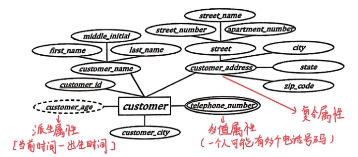

上图 `customer` 里，`customer_name` 和 `customer_address` 是复合属性，双椭圆的 `telephone_number` 是多值属性，虚线椭圆的 `customer_age` 是派生属性（当前时间减出生时间）。

## 2. 约束

### 映射基数

映射基数说的是：一个实体通过联系集最多能和另一方的几个实体关联。以实体集 A 和 B 之间的二元联系为例：

| 映射基数 | A 中一个实体 | B 中一个实体 |
| --- | --- | --- |
| 一对一 | 至多关联 B 中 1 个实体 | 至多关联 A 中 1 个实体 |
| 一对多（A 到 B） | 可以关联 B 中任意多个实体 | 至多关联 A 中 1 个实体 |
| 多对一（A 到 B） | 至多关联 B 中 1 个实体 | 可以关联 A 中任意多个实体 |
| 多对多 | 可以关联 B 中任意多个实体 | 可以关联 A 中任意多个实体 |

### 码

实体集的码：

- 超码：一个或多个属性的集合，能唯一标识实体集中的实体。学号加姓名是学生实体集的一个超码。
- 候选码：最小的超码，去掉任何一个属性都不再是超码。学号本身就能唯一标识学生，是候选码。
- 主码：设计者从候选码里选出来作为主要标识的那一个，比如选学号作主码。

联系集的码：

- 如果参与联系集 R 的各实体集，主码属性名互不相同，那么各实体集主码的并 $\mathrm{PK}(E_1) \cup \mathrm{PK}(E_2) \cup \dots \cup \mathrm{PK}(E_n)$ 构成 R 的一个超码（PK 表示实体集的主码）。
- 各实体集的主码属性重名时，要改名区分，常用"实体集名 + 属性名"的写法。
- 同一个实体集不止一次参与某个联系集（自环）时，用角色名代替实体集名来给属性命名。
- 联系集的主码取决于映射基数：

| 联系集 | 主码 |
| --- | --- |
| 二元多对多 | 两边实体集主码的并 |
| 二元一对多、多对一 | "多"那一边实体集的主码 |
| 二元一对一 | 任选一边实体集的主码 |
| n 元，边上没有箭头 | 所有参与实体集主码的并，它就是唯一的候选码，选作主码 |
| n 元，有一条边带箭头 | 不在箭头那一侧的各实体集主码的并 |

### 参与约束

- 全部参与：实体集中每个实体都至少参与联系集中的一个联系。每个学生都至少选了一门课，学生实体集对选课联系就是全部参与。
- 部分参与：只有部分实体参与联系集中的联系。只有部分学生选了课，就是部分参与。

笔记的例子：`customer` 部分参与 `borrower`，有的顾客没有贷款；`loan` 全部参与 `borrower`，每笔贷款都必须对应顾客。

## 3. E-R 图的画法

### 符号汇总

| 含义 | 笔记里的画法 | 老师资料的画法（教材第 6 版） |
| --- | --- | --- |
| 实体集 | 矩形 | 分两栏的矩形，上栏写实体集名，下栏列出属性 |
| 属性 | 椭圆，用线段连到实体集 | 写在实体集矩形的下栏里 |
| 主码 | 属性名加下划线 | 属性名加下划线 |
| 复合属性 | 椭圆再连出子属性的椭圆 | 子属性缩进写在复合属性下面 |
| 多值属性 | 双椭圆 | 属性名加花括号，如 `{ phone_number }` |
| 派生属性 | 虚线椭圆 | 属性名后加括号，如 `age ( )` |
| 联系集 | 菱形 | 菱形 |
| 联系的属性 | 椭圆连到菱形 | 小矩形，用虚线连到菱形 |
| "一"与"多" | 指向实体集的箭头表示"一"，无向线段表示"多" | 同左 |
| 全部参与 / 部分参与 | 双线 / 单线 | 同左 |
| 弱实体集 | 双矩形，分辨符加虚下划线 | 同左 |
| 标识性联系集 | 双菱形 | 同左 |
| 角色 | 在连线上写角色名 | 同左 |
| 特化、概化 | 标 ISA 的三角形 | 老师资料没有涉及 |

### 老师资料里的例子

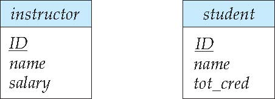

实体集矩形上栏是名字，下栏是属性，主码 `ID` 加下划线。

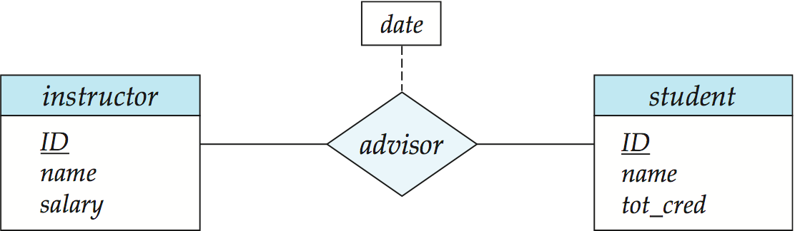

联系集 `advisor` 画成菱形。`date` 是联系集自己的属性，写在小矩形里，用虚线连到菱形。

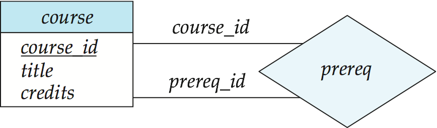

`course` 两次参与 `prereq`，连线上的 `course_id` 和 `prereq_id` 是两个角色：一个是课程本身，一个是它的先修课。

参与联系的实体集上要给出基数约束，用箭头表示"一"，用无向线段表示"多"：

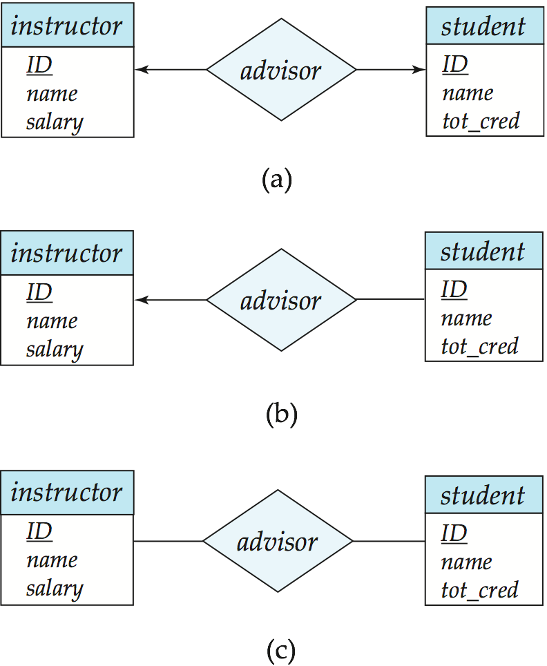

| 图 | 画法 | 含义 |
| --- | --- | --- |
| (a) 一对一 | 两侧都有箭头 | 1 个老师只能指导 1 个学生，1 个学生只能由 1 个老师指导 |
| (b) 一对多 | 箭头指向 `instructor`，`student` 一侧是无向线段 | 1 个老师可以指导多个学生，1 个学生只能由 1 个老师指导 |
| 多对一（原稿另有一张图） | 箭头指向 `student`，`instructor` 一侧是无向线段 | 1 个老师只能指导 1 个学生，1 个学生可以由多个老师指导 |
| (c) 多对多 | 两侧都是无向线段 | 1 个老师可以指导多个学生，1 个学生可以由多个老师指导 |

读箭头时记住：箭头指向 `instructor`，意思是"对面每个学生最多对应 1 个老师"。

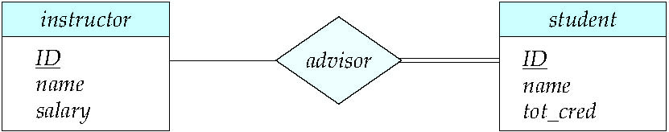

`student` 和 `advisor` 之间是双线，表示每个学生必须至少有 1 名指导老师；`instructor` 一侧是单线，老师可以不指导学生。

### 用 l..h 表示基数约束

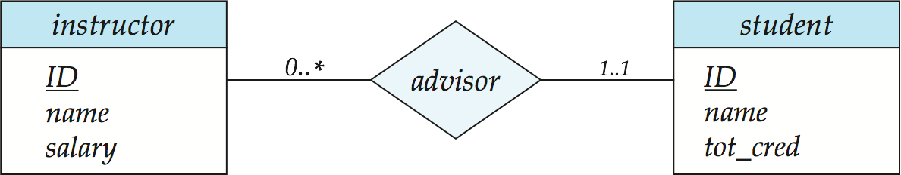

实体集和二元联系集之间的边上可以标 `l..h`：l 是最小基数，h 是最大基数，`*` 表示没有上限。它约束的是**这条边连着的实体集**，即这个实体集中每个实体参与多少个联系。

- `student` 边上是 `1..1`：每个学生恰好参与 1 个 `advisor` 联系，也就是恰好有 1 名导师。最小值为 1，所以学生是全部参与。
- `instructor` 边上是 `0..*`：每个老师参与 0 个或多个 `advisor` 联系，可以不带学生，也可以带多个。
- 合起来，`advisor` 是从 `instructor` 到 `student` 的一对多联系。

易错点：看到 `instructor` 边上的 `0..*`，就把 `instructor` 当成"多"的一边，读成从 `instructor` 到 `student` 多对一，这正好读反了。复习资料里的记法是：边上的数字，表示这一侧每个实体能对应另一侧几个实体。两条边的最大值都是 1 时是一对一；如果把 `instructor` 边改成 `1..*`，就表示每个老师至少指导一名学生。

### 多元联系上的箭头

非二元联系集外面最多只画一个箭头。画两个以上箭头，含义就不唯一，容易混淆。

## 4. E-R 设计问题

### 用实体集还是用属性

没有固定答案，要看实际需求：

- 设计成实体集，可以记录更多扩展信息，但查询时要多做连接，效率低一些。
- 设计成属性，查询方便，但能记录的信息少，以后不好扩展。

两个常犯的错误：

1. 用一个实体集的主码作为另一个实体集的属性，而不用联系。比如每位老师只指导一名学生，把学生的 `ID` 写成 `instructor` 的属性也不对，应该用 `advisor` 联系表示两者的关联，关系就明确地画在图上了。
2. 把相关实体集的主码作为联系集的属性。比如在 `advisor` 上再挂学生的 `ID` 和老师的 `ID`。联系集本身已经隐含了这些主码，不用再写。

### 用实体集还是用联系集

经验规则：最后抽象成名词的用实体集，用动词描述的用联系集。笔记里有一张图把 `loan` 画成 `customer` 和 `branch` 之间的联系集，`loan_number`、`amount` 成了联系的属性。这样画的问题是，一笔贷款有几个共同借款人时，贷款号和金额要在每个联系里各存一遍。

### 二元联系集还是 n 元联系集

数据库里的联系大多是二元的，但有的联系用 n 元联系集表示更清楚。一个 n 元（n > 2）联系集总可以用一组二元联系集代替。以联系实体集 A、B、C 的三元联系集 R 为例：

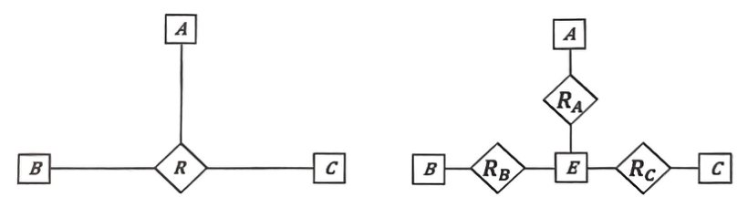

1. 用一个新的实体集 E 代替 R。R 有属性的话，把属性放到 E 上，再给 E 加一个专门的标识属性，因为 E 的实体要能靠属性值区分开。
2. 建三个二元联系集：$R_A$ 关联 E 和 A，$R_B$ 关联 E 和 B，$R_C$ 关联 E 和 C。
3. 对 R 中每个联系 $(a_i, b_i, c_i)$，在 E 中建一个新实体 $e_i$，再在 $R_A$ 中插入 $(e_i, a_i)$，在 $R_B$ 中插入 $(e_i, b_i)$，在 $R_C$ 中插入 $(e_i, c_i)$。

这个办法可以直接推广到 n 元，所以理论上 E-R 模型可以只用二元联系集。但这样做不一定合适：

- 要给 E 造一个标识属性，还多出几个联系集，设计更复杂，占的存储空间也更多。
- n 元联系集能更清楚地表示几个实体集共同参与同一个联系。
- 三元联系上的某些约束，换成二元联系后表达不了。比如约束"R 从 A、B 到 C 是多对一的"，意思是每一对 $(a, b)$ 最多关联一个 c。拆成 $R_A$、$R_B$、$R_C$ 后，只能分别约束 E 和 A、B、C 各自的基数，没法把 a 和 b 当作一对来限制。

### 联系的属性放在哪

| 联系集类型 | 联系的属性可以放在 | 笔记的例子 |
| --- | --- | --- |
| 一对一 | 任意一个参与的实体集中 | 员工和办公室一对一，联系上的属性放到员工或办公室实体集都可以 |
| 一对多 | "多"那一侧的实体集中 | 老师指导学生是一对多，每个学生只有一位导师，"指导日期"可以放进学生实体集 |
| 多对多 | 只能留在联系集上 | 学生选课是多对多，"选课日期"由学生和课程的组合决定，只能放在选课联系上 |

## 5. 弱实体集

- 强实体集：有主码的实体集。
- 弱实体集：没有足够的属性构成主码的实体集。它必须和一个标识实体集（强实体集）相联系，它的存在依赖于标识实体集。
- 标识性联系：弱实体集和标识实体集之间的联系集。它一定是从弱实体集到标识实体集的**多对一**联系，而且弱实体集**全部参与**。标识性联系集不带描述属性。
- 分辨符：在同一个标识实体的范围内，区分弱实体集中不同实体的属性集合。
- 弱实体集的主码由标识实体集的主码加上弱实体集的分辨符构成。

画法：弱实体集画双矩形，分辨符加虚下划线，标识性联系集画双菱形，弱实体集和双菱形之间用双线。

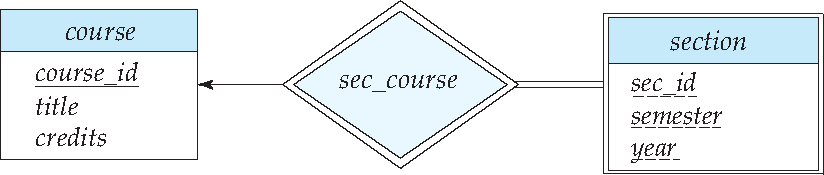

老师资料的例子：`section`（开课）依赖 `course`，分辨符是 `sec_id`、`semester`、`year`，标识性联系集是 `sec_course`。同一门课在不同学期、不同年份会开出不同的课段，只看这三个属性分不清是哪门课的课段，必须加上 `course_id`。

笔记的例子：`payment`（还款）依赖 `loan`，分辨符是 `payment_number`，标识性联系集是 `loan_payment`，`payment` 的主码是 `(loan_number, payment_number)`。

## 6. 扩展 E-R 特性

### 特化

特化是自顶向下的设计过程：把一个实体集分成若干个子集，每个子集是一个低层实体集。低层实体集可以有高层实体集没有的属性，也可以参与高层实体集不参与的联系。这和面向对象设计里的继承很像。图上用标 ISA 的三角形表示。高层实体集和低层实体集也分别叫超类和子类。

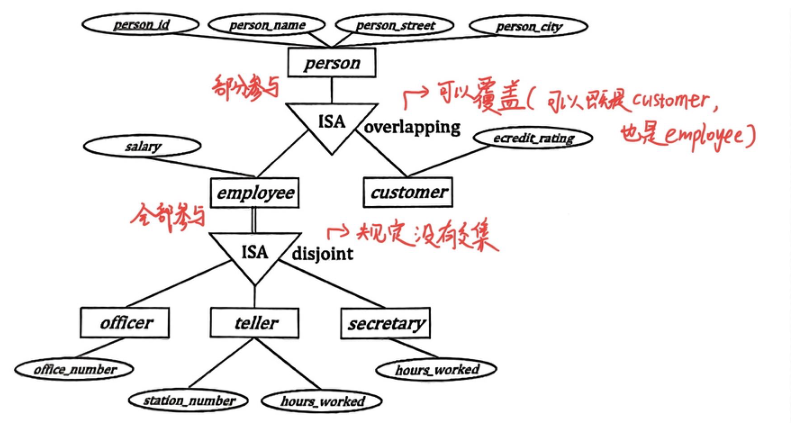

- `person` 特化为 `employee`（特有属性 `salary`）和 `customer`（特有属性 `credit_rating`）。标的是 overlapping（重叠），一个人可以既是员工又是顾客。图上 `person` 到 ISA 是单线，是部分特化，有的人两者都不是。
- `employee` 再特化为 `officer`、`teller`、`secretary`。标的是 disjoint（不相交），一个员工最多属于其中一类。`employee` 到 ISA 是双线，是全部特化，每个员工都必须属于其中一类。

### 概化

把几个具有相同属性的实体集合并成一个更高层的实体集，叫概化（也叫一般化）。

- 概化是自底向上的设计过程。依据是几个实体集有共同特征：用相同的属性描述，参与相同的联系集。
- 概化突出低层实体集之间的相同点，隐藏差异；共享的属性只写一次，表达更简洁。
- 特化和概化互为逆过程，在 E-R 图上画法相同，设计时可以互换着用。

### 属性继承

- 高层实体集的所有属性和联系，自动被它的所有低层实体集继承。
- 低层实体集特有的属性和联系，只属于这个低层实体集。
- 单继承：一个实体集作为低层实体集，只参与一个 ISA 联系。
- 多继承：一个实体集作为低层实体集，参与多个 ISA 联系。

### 概化上的约束

| 约束 | 取值 | 含义 |
| --- | --- | --- |
| 哪些实体能成为某个低层实体集的成员 | 条件定义 | 按一个明确的条件（通常是高层实体集某个属性的取值）判定 |
| | 用户定义 | 不靠条件，由数据库用户把实体指派到低层实体集 |
| 一个实体能否属于多个低层实体集 | 不相交（disjoint） | 一个实体至多属于一个低层实体集 |
| | 重叠（overlapping） | 同一个实体可以同时属于同一个概化中的多个低层实体集 |
| 完全性约束：高层实体是否必须属于某个低层实体集 | 全部概化/特化（total） | 每个高层实体都必须属于一个低层实体集 |
| | 部分概化/特化（partial） | 允许一些高层实体不属于任何低层实体集，这是默认情况 |

（更正：原笔记"不相交特化"写作"一个实体集必须属于至多一个特化实体集"，"重叠特化"写作"一个实体集可能属于多个特化实体集"，这两处说的都是一个实体，不是一个实体集。）

### 聚集

聚集是一种抽象：把一个联系集连同它关联的实体集看成一个高层实体，再让它参与别的联系，这样就能表示联系之间的联系。

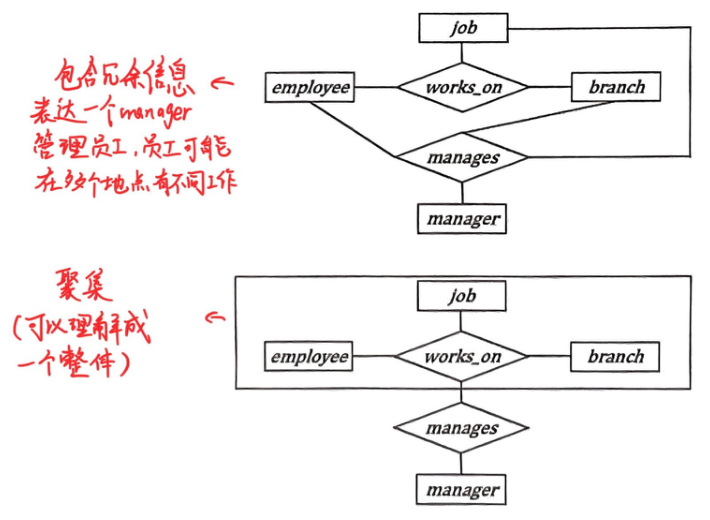

`employee` 在某个 `branch` 做某种 `job`，是三元联系 `works_on`。现在要给每个（员工，分行，工作）组合指定一位 manager。上图直接画成四元联系 `manages`，`manages` 中出现的每个组合在 `works_on` 里也有，信息重复。下图把 `works_on` 连同三个实体集框起来当作一个整体，`manages` 连接这个整体和 `manager`，就没有冗余了。

原笔记的看法是不提倡用聚集：一般把多元联系转换成二元联系，聚集也就用不上了。

## 7. E-R 图转换为关系模式

实体集和联系集都可以转换成关系模式。符合 E-R 图的数据库可以表示成一组模式，E-R 图里每个实体集和联系集都对应一个唯一的模式，每个模式有若干列，列名不能重复。

### 强实体集

直接对应一个关系模式，属性照搬，主码不变。

- 笔记：`loan(loan_number, amount)`，主码 `loan_number`。
- 老师资料：`student(ID, name, tot_cred)`，主码 `ID`。

### 弱实体集

模式包含弱实体集自己的属性，再加上标识实体集的主码。主码是标识实体集的主码加分辨符；标识实体集的主码同时是外码。

- `payment(loan_number, payment_number, payment_date, payment_amount)`：主码 `(loan_number, payment_number)`，外码 `loan_number` 引用 `loan`。
- `section(course_id, sec_id, semester, year)`：主码是这四个属性，外码 `course_id` 引用 `course`。（老师资料的模式里把 `semester` 简写成 `sem`。）

### 联系集

联系集的模式包含参与联系的各实体集的主码，再加上联系集自己的描述属性。来自实体集的主码都是外码。按映射基数分：

| 联系集 | 转换方法 | 例子 |
| --- | --- | --- |
| 二元多对多 | 单独建模式：两个实体集的主码加上联系集的描述属性，主码是两边主码的并 | `borrower(customer_id, loan_number)` |
| 二元多对一、一对多 | 以"多"那边的主码作为模式的主码。也可以不单独建模式，在"多"那边的模式里加上"一"那边的主码，再加上联系集的描述属性 | `account_branch` 并入 `account`，得到 `account(account_number, branch_name, balance)`，`branch_name` 是外码 |
| 二元一对一 | 任选一边当作"多"那边处理 | |
| 标识性联系集 | 模式是冗余的，一般不建 | `loan_payment` 的内容已经包含在 `payment` 里 |
| n 元联系集 | 单独建模式；边上没有箭头时，主码是所有参与实体集主码的并；有一个箭头时，主码是不在箭头一侧的各实体集主码的并 | |

复习资料补充：多对一合并到"多"那边时，"多"那边最好是全部参与，否则没参与联系的元组，在新加的外码列上只能填空值。

老师资料的 `advisor` 画的是多对多，所以 `advisor = (s_id, i_id)`，主码是两者的组合。原来两边的主码都叫 `ID`，转换时改名为 `s_id`、`i_id` 来区分。自环联系用角色名给列命名，比如 `works_for(worker_employee_id, manager_employee_id)`。

### 复合属性、多值属性、派生属性

- 复合属性：不保留父属性，每个子属性单独成为一列，和其他属性地位相同。`customer_name` 由 `first_name`、`middle_initial`、`last_name` 组成，于是 `customer(customer_id, first_name, middle_initial, last_name, customer_street, customer_city)`。
- 多值属性：单独建一个模式，属性是这个多值属性加上所属实体集的主码，两者一起作主码。多值属性的每个取值对应新模式里的一条元组。例如 `customer_phone(customer_id, telephone_number)`。
- 派生属性：直接忽略，不存。

### 特化与概化

以 `person` 特化为 `employee` 和 `customer` 为例，有两种方案：

| | 方案一 | 方案二 |
| --- | --- | --- |
| 做法 | 高层实体集照常建模式；低层实体集的模式只包含高层实体集的主码和自己特有的属性 | 每个实体集的模式都记下全部属性，包括自己的和继承来的 |
| 结果 | `person(person_id, person_name, person_street, person_city)`、`employee(person_id, salary)`、`customer(person_id, credit_rating)` | `employee(person_id, person_name, person_street, person_city, salary)`、`customer(person_id, person_name, person_street, person_city, credit_rating)` |
| 缺点 | 要取低层实体继承来的属性，得访问高层模式，做自然连接才能拿到完整信息 | 重叠概化时同一个人的姓名、地址要存好几遍，数据冗余。对于不相交且全部的概化，可以不建高层模式，但别的模式想用外码引用 `person_id` 时就没有被引用的表了，所以通常至少还要建一个包含高层主码的模式 |

方案一里，低层模式的 `person_id` 既是主码，也是引用 `person` 的外码。

### 聚集

表示聚集和实体集之间联系的联系集，模式包含三部分：聚集内那个联系集的主码，关联实体集的主码，这个联系集自己的描述属性。

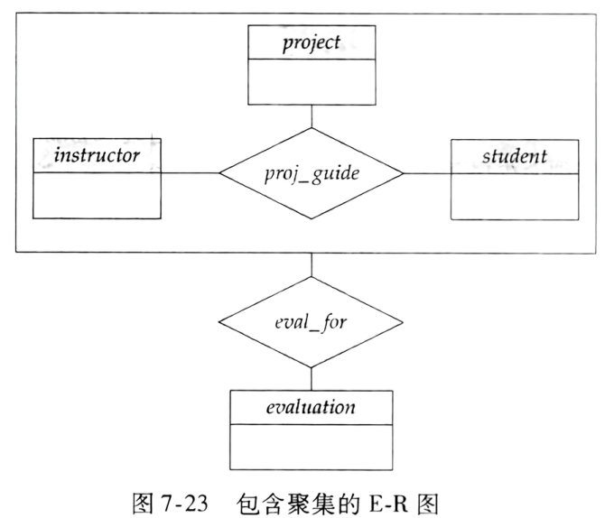

`proj_guide` 联系 `instructor`、`student`、`project`，主码是 `(i_ID, s_ID, project_ID)`。`eval_for` 连接这个聚集和 `evaluation`，所以得到 `eval_for(s_ID, project_ID, i_ID, evaluation_ID)`。

## 易混对比

| 易混点 | 区别 |
| --- | --- |
| 强实体集 / 弱实体集 | 有主码，画单矩形 / 没有足够属性构成主码，画双矩形，要依赖标识实体集；主码 = 标识实体集主码 + 分辨符 |
| 主码 / 分辨符 | 在整个实体集里唯一，实下划线 / 只在同一个标识实体的范围内能区分，虚下划线 |
| 普通联系集 / 标识性联系集 | 单菱形 / 双菱形，是弱实体集到标识实体集的多对一，弱实体集全部参与，转模式时不单独建表 |
| 全部参与 / 部分参与 | 每个实体都至少参与一个联系，双线，`l..h` 的 l 至少为 1 / 允许有实体不参与，单线，l 为 0 |
| 箭头 / `l..h` | 箭头指向实体集 E：对面每个实体最多关联 1 个 E 实体 / `l..h` 标在 E 的边上：每个 E 实体参与 l 到 h 个联系。二元联系里 `student` 边标 `1..1`，相当于箭头指向 `instructor` 且 `student` 画双线 |
| 多对多 / 一对多 / 一对一 转模式 | 单独建模式，主码是两边主码的并 / 可以并入"多"那边，主码是"多"那边的主码 / 任选一边当"多" |
| 复合属性 / 多值属性 / 派生属性 转模式 | 拆成子属性列 / 单独建模式（实体主码 + 该属性）/ 不存 |
| 特化 / 概化 | 自顶向下，把实体集分成子集 / 自底向上，把相似实体集合成高层实体集；图上画法相同 |
| 不相交 / 重叠 | 一个实体至多属于一个低层实体集 / 可以同时属于多个 |
| 全部概化 / 部分概化 | 每个高层实体都必须属于某个低层实体集 / 可以不属于任何低层实体集（默认） |
| 条件定义 / 用户定义 | 按属性上的条件判定成员 / 由用户指派成员 |
| 单继承 / 多继承 | 作为低层实体集只参与一个 ISA 联系 / 参与多个 ISA 联系 |
| 聚集 / 多元联系 | 把联系集当作整体去参与别的联系，表示联系之间的联系 / 几个实体集直接参与同一个联系，和已有联系重叠时会冗余 |
| 概化转模式方案一 / 方案二 | 低层只存高层主码和特有属性，要连接才能拿到继承属性 / 低层存全部属性，重叠概化时冗余 |

## 典型题与解答

### 题 1 读懂 l..h 基数约束（老师资料、复习资料）

题目：`instructor` 和 `student` 通过 `advisor` 联系，`instructor` 那条边上标 `0..*`，`student` 那条边上标 `1..1`。说明含义，指出映射基数和参与约束。

思路：`l..h` 约束的是它所在那条边连着的实体集。

解答：每位老师参与 0 到多个 `advisor` 联系，可以不指导学生，也可以指导多个学生；每个学生恰好参与 1 个 `advisor` 联系，也就是恰好有 1 名导师。映射基数是从 `instructor` 到 `student` 的一对多。`student` 的最小值是 1，全部参与；`instructor` 的最小值是 0，部分参与。

### 题 2 判断映射基数（笔记）

题目：`customer` 和 `loan` 通过 `borrower` 联系，四张 E-R 图分别是：(1) 两侧都是无向线段；(2) 箭头指向 `customer`，`loan` 一侧无箭头；(3) 箭头指向 `loan`，`customer` 一侧无箭头；(4) 两侧都有箭头。分别写出从 `customer` 到 `loan` 的映射基数。

思路：箭头指向的一侧是"一"。

解答：

1. 多对多。
2. 一对多：一个顾客可以有多笔贷款，每笔贷款只属于一个顾客。
3. 多对一：一个顾客最多一笔贷款，一笔贷款可以属于多个顾客。
4. 一对一。（更正：原笔记把第 4 张图标作"多对多"，图上两侧都有箭头，应为一对一。）

### 题 3 联系集的模式和主码（老师资料、复习资料）

题目：`instructor(ID, name, salary)` 和 `student(ID, name, tot_cred)` 通过 `advisor` 联系。分别按多对多、一对多（一位老师指导多个学生，每个学生一位老师）、一对一，写出 `advisor` 的关系模式和主码。

思路：两边主码都叫 `ID`，先改名；主码按映射基数定。

解答：两个 `ID` 改名为 `i_id` 和 `s_id`，模式都是 `advisor(s_id, i_id)`，`s_id` 是引用 `student` 的外码，`i_id` 是引用 `instructor` 的外码。

- 多对多：主码 `(s_id, i_id)`。这就是老师资料给出的结果。
- 一对多：主码是"多"那边的 `s_id`。也可以不建 `advisor`，直接在 `student` 模式里加一列外码 `i_id`。
- 一对一：主码任选 `s_id` 或 `i_id`。

### 题 4 弱实体集转关系模式（老师资料、笔记）

题目：(1) 弱实体集 `section(sec_id, semester, year)` 通过 `sec_course` 依赖 `course(course_id, title, credits)`；(2) 弱实体集 `payment(payment_number, payment_date, payment_amount)` 通过 `loan_payment` 依赖 `loan(loan_number, amount)`。写出关系模式、主码和外码。

思路：弱实体集的模式 = 自身属性 + 标识实体集主码；标识性联系集不建模式。

解答：

- `course(course_id, title, credits)`，主码 `course_id`；`section(course_id, sec_id, semester, year)`，主码 `(course_id, sec_id, semester, year)`，外码 `course_id` 引用 `course`。
- `loan(loan_number, amount)`，主码 `loan_number`；`payment(loan_number, payment_number, payment_date, payment_amount)`，主码 `(loan_number, payment_number)`，外码 `loan_number` 引用 `loan`。
- `sec_course` 和 `loan_payment` 不单独建模式。

### 题 5 复合属性和多值属性转关系模式（笔记）

题目：`customer` 有属性 `customer_id`（主码）、复合属性 `customer_name`（由 `first_name`、`middle_initial`、`last_name` 组成）、`customer_street`、`customer_city`、多值属性 `telephone_number`、派生属性 `customer_age`。写出关系模式。

思路：复合属性拆开，多值属性另建模式，派生属性不存。

解答：

- `customer(customer_id, first_name, middle_initial, last_name, customer_street, customer_city)`，主码 `customer_id`。
- `customer_phone(customer_id, telephone_number)`，主码是两个属性一起，`customer_id` 是引用 `customer` 的外码。
- `customer_age` 不存，需要时由出生日期算出来。

### 题 6 特化转关系模式（笔记）

题目：`person(person_id, person_name, person_street, person_city)` 重叠特化为 `employee`（特有 `salary`）和 `customer`（特有 `credit_rating`），分别用两种方案转换。

思路：方案一低层只存高层主码和特有属性，方案二低层存全部属性。

解答：方案一得到 `person(person_id, person_name, person_street, person_city)`、`employee(person_id, salary)`、`customer(person_id, credit_rating)`，低层的 `person_id` 引用 `person`。方案二得到 `employee(person_id, person_name, person_street, person_city, salary)` 和 `customer(person_id, person_name, person_street, person_city, credit_rating)`。这里是重叠特化，又是部分特化（有的人两者都不是），用方案二时 `person` 模式也要保留，同时属于两类的人信息会重复存储。

### 题 7 聚集转关系模式（笔记）

题目：`instructor`、`student`、`project` 通过三元联系 `proj_guide` 关联，把 `proj_guide` 当作聚集，通过 `eval_for` 和实体集 `evaluation` 联系。写出 `eval_for` 的模式。

思路：`eval_for` 的模式 = 聚集内联系集的主码 + 关联实体集的主码 + 描述属性。

解答：`proj_guide` 的主码是 `(i_ID, s_ID, project_ID)`，`evaluation` 的主码是 `evaluation_ID`，`eval_for` 没有描述属性，所以 `eval_for(s_ID, project_ID, i_ID, evaluation_ID)`。

### 题 8 银行 E-R 图转关系模式（笔记第 92–93 页）

题目：根据下面的银行 E-R 图，列出实体集和联系集（含映射基数），把它转换成关系模式，写出主码和外码。

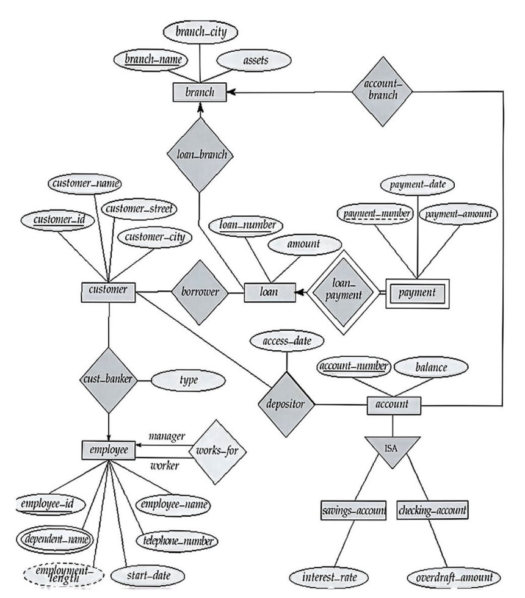

思路：先分强实体集、弱实体集、多值和派生属性、联系集、ISA，再逐类套转换规则。

解答：

实体集：

| 实体集 | 类型 | 属性 |
| --- | --- | --- |
| `branch` | 强 | `branch_name`（主码）、`branch_city`、`assets` |
| `customer` | 强 | `customer_id`（主码）、`customer_name`、`customer_street`、`customer_city` |
| `loan` | 强 | `loan_number`（主码）、`amount` |
| `payment` | 弱，依赖 `loan` | `payment_number`（分辨符）、`payment_date`、`payment_amount` |
| `account` | 强 | `account_number`（主码）、`balance` |
| `savings_account`、`checking_account` | `account` 的特化 | 分别有 `interest_rate`、`overdraft_amount` |
| `employee` | 强 | `employee_id`（主码）、`employee_name`、`telephone_number`、`start_date`、多值属性 `dependent_name`、派生属性 `employment_length` |

联系集：

| 联系集 | 参与实体集 | 映射基数 | 说明 |
| --- | --- | --- | --- |
| `borrower` | `customer`、`loan` | 多对多 | |
| `depositor` | `customer`、`account` | 多对多 | 有属性 `access_date` |
| `loan_branch` | `loan`、`branch` | 从 `loan` 到 `branch` 多对一 | 箭头指向 `branch` |
| `account_branch` | `account`、`branch` | 从 `account` 到 `branch` 多对一 | 箭头指向 `branch` |
| `cust_banker` | `customer`、`employee` | 从 `customer` 到 `employee` 多对一 | 箭头指向 `employee`，有属性 `type` |
| `works_for` | `employee`（两次） | 从 worker 到 manager 多对一 | 自环，角色 manager 一侧有箭头 |
| `loan_payment` | `payment`、`loan` | 从 `payment` 到 `loan` 多对一 | 标识性联系集，`payment` 全部参与 |

关系模式（笔记的写法，每个联系集单独建模式）：

| 模式 | 主码 | 外码 |
| --- | --- | --- |
| `branch(branch_name, branch_city, assets)` | `branch_name` | 无 |
| `customer(customer_id, customer_name, customer_street, customer_city)` | `customer_id` | 无 |
| `loan(loan_number, amount)` | `loan_number` | 无 |
| `account(account_number, balance)` | `account_number` | 无 |
| `employee(employee_id, employee_name, telephone_number, start_date)` | `employee_id` | 无 |
| `dependent_name(employee_id, dname)` | `(employee_id, dname)` | `employee_id` 引用 `employee` |
| `account_branch(account_number, branch_name)` | `account_number` | `account_number` 引用 `account`，`branch_name` 引用 `branch` |
| `loan_branch(loan_number, branch_name)` | `loan_number` | `loan_number` 引用 `loan`，`branch_name` 引用 `branch` |
| `borrower(customer_id, loan_number)` | `(customer_id, loan_number)` | `customer_id` 引用 `customer`，`loan_number` 引用 `loan` |
| `depositor(customer_id, account_number, access_date)` | `(customer_id, account_number)` | `customer_id` 引用 `customer`，`account_number` 引用 `account` |
| `cust_banker(customer_id, employee_id, type)` | `customer_id` | `customer_id` 引用 `customer`，`employee_id` 引用 `employee` |
| `works_for(worker_employee_id, manager_employee_id)` | `worker_employee_id` | 两列都引用 `employee` |
| `payment(loan_number, payment_number, payment_date, payment_amount)` | `(loan_number, payment_number)` | `loan_number` 引用 `loan` |
| `savings_account(account_number, interest_rate)` | `account_number` | `account_number` 引用 `account` |
| `checking_account(account_number, overdraft_amount)` | `account_number` | `account_number` 引用 `account` |

派生属性 `employment_length` 不存，标识性联系集 `loan_payment` 不建模式。（更正：原笔记把 `loan` 写作 `loan(loan_number, account)`，图上的属性是 `amount`；多值属性模式里的 `aemployee_id` 是 `employee_id` 的笔误。）

笔记在这一段旁边记了一句：老师说有些属性漏了，比如多对一的情况。按"多对一可以并到'多'那边"的规则，四个多对一联系集可以不单独建模式：

- `account(account_number, balance, branch_name)`，去掉 `account_branch`；
- `loan(loan_number, amount, branch_name)`，去掉 `loan_branch`；
- `customer(customer_id, customer_name, customer_street, customer_city, employee_id, type)`，去掉 `cust_banker`，`employee_id` 引用 `employee`；
- `employee(employee_id, employee_name, telephone_number, start_date, manager_employee_id)`，去掉 `works_for`，`manager_employee_id` 引用 `employee` 自己。

这几个联系在图上都是单线（部分参与），合并后，没参与联系的元组在新加的列上是空值。

更多 E-R 设计大题见期末复习题整理稿（`20` 号起的文件），课后习题见 `35 课后习题 第7章 E-R模型.md`。
