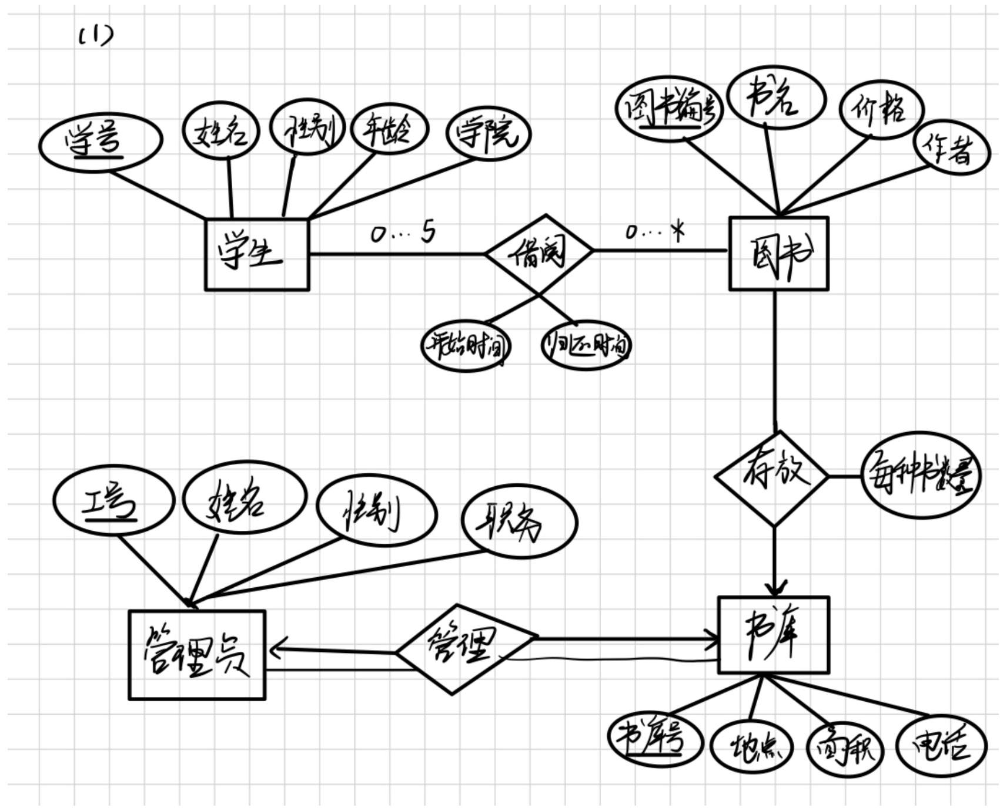
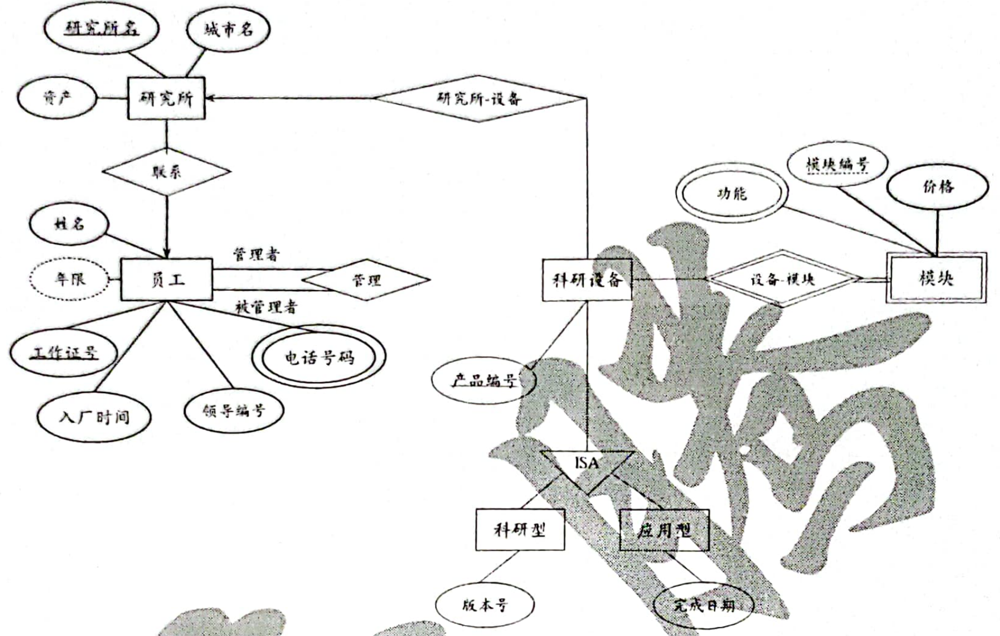

# E-R 设计题

整理自 `笔记/数据库期末复习题整理.pdf` 第 24–25、32、36、49、52、54–55、62–66 页，共 7 道 E-R 设计题。原稿只有图书馆一题附了手写解答（第 24–25 页，第 64 页又贴了一遍），这里按手写解答整理并逐项核对；其余 6 题原稿没有答案，给出整理补充的参考设计。图书馆一题配了原稿的手写 E-R 图，研究院一题配了扫描件 `数据库历年题.pdf` 第 50 页的参考答案图；其余各题的参考设计用实体集表和联系集表描述，再给出转换后的关系模式。

课程目录的 `README.md` 里，原作者回忆考前担心 E-R 图画错，出分后才发现"ER图这种主观的题目不扣分"。设计答案本来就不唯一，下面的参考设计是其中一种做法。自己练的时候，重点检查映射基数、参与约束和转换规则是否和题意对得上。

## 解题方法

1. 找实体集。题目里单独列出属性、需要编号的名词就是实体集，比如学生、图书、书库。每个实体集定一个主码，题目没给编号就自己加一个。
2. 属性里出现了别的实体的编号（汽车的"所有顾客ID"、保险单的"保险赔付ID"），在 E-R 图里画成联系，不要当普通属性画。
3. 找联系集，一般对应题目里的动词（借阅、存放、管理）。每个联系定两件事：
   - 映射基数：一对一、一对多还是多对多。"一个 X 对应几个 Y"两个方向都要问一遍。
   - 参与约束："每个""必须""至少一个""有且必有"是全部参与，画双线；"0 个或多个""可以"是部分参与。

   "数量""起止时间""金额"这类要同时知道两边实体才能确定的信息，放在联系上做描述属性。
4. 弱实体集。自身属性区分不开，要借所属实体才能标识，比如"同一产品的模块号不重复"。画双矩形，分辨符加虚下划线，标识联系画双菱形。
5. 画图记号。矩形是实体集，菱形是联系集，椭圆是属性，主码加下划线。**箭头指向"一"的一方**。双线表示全部参与，也可以在线上标 `l..h`（如 `0..5`、`0..*`）。双椭圆是多值属性，虚线椭圆是派生属性，ISA 三角形表示特化。
6. 转成关系模式：
   - 强实体集：一个模式。复合属性只留子属性，多值属性单独建模式，派生属性不存。
   - 弱实体集：自己的属性加所属实体集的主码，主码是"所属主码 + 分辨符"。
   - 多对多联系：两边主码加描述属性，主码一般是两边主码合起来。同一对实体会反复发生联系时（同一个人多次借同一本书），把时间也放进主码。
   - 多对一联系：把"一"方的主码作为外码放进"多"方的模式，描述属性一起放过去。"多"方全部参与时外码加 NOT NULL。
   - 一对一联系：任选一方放外码，外码上加 UNIQUE。
   - 特化：低层模式只放高层实体的主码和自己特有的属性。
7. 写完整性约束。主码对应实体完整性，外码对应参照完整性，NOT NULL、UNIQUE、CHECK 属于用户定义的完整性。"最多借 5 本""至少关联 1 辆车"这类数量限制，主码外码表达不了，要用触发器或在应用程序里检查。

## 题目

### 1. 吉林大学图书馆管理系统（2020-2021 学年第 1 学期 三）

题目：

吉林大学图书馆欲开发一套管理系统。数据库中需要保存如下信息：

- 图书：图书编号、书名、价格、作者（图书馆中可能有多本同一种书）
- 书库：书库号、地点、面积、电话
- 管理员：工号、姓名、性别、职务
- 学生：学号、姓名、性别、年龄、学院

其中，一名学生可以借 0 到 5 本图书；借书过程中需要记录借阅起止时间。书库中可以存放图书，需要记录存放每种书的数量。一名管理员负责管理一个书库。完成如下设计：

- （1）设计该信息管理系统的 E-R 图；
- （2）将该 E-R 图转换为关系模式；
- （3）指出转换结果中每个关系模式的主码。

思路：四个实体集题目已经给全了，要自己找的是三个联系：学生借阅图书、图书存放在书库、管理员管理书库。借阅起止时间和每种书的数量都放在联系上。

解答（按原稿手写解答整理）：

实体集：

| 实体集 | 属性 | 主码 |
| --- | --- | --- |
| 学生 | 学号、姓名、性别、年龄、学院 | 学号 |
| 图书 | 图书编号、书名、价格、作者 | 图书编号 |
| 书库 | 书库号、地点、面积、电话 | 书库号 |
| 管理员 | 工号、姓名、性别、职务 | 工号 |

联系集：

| 联系集 | 参与实体集 | 映射基数 | 参与约束 | 描述属性 |
| --- | --- | --- | --- | --- |
| 借阅 | 学生、图书 | 多对多，学生一侧标 `0..5`，图书一侧标 `0..*` | 两侧都是部分参与 | 开始时间、归还时间 |
| 存放 | 图书、书库 | 多对一，箭头指向书库（一种书只放在一个书库） | 图中两侧都是单线 | 每种书数量 |
| 管理 | 管理员、书库 | 一对一，两端都有箭头 | 两侧都是双线，全部参与 | 无 |

手写解答给出的关系模式（外码一列是整理时补的）：

| 关系模式 | 主码 | 外码 |
| --- | --- | --- |
| 学生(学号, 姓名, 性别, 年龄, 学院) | 学号 | 无 |
| 图书(图书编号, 书名, 价格, 作者, 书库号, 每种书数量) | 图书编号 | 书库号参照书库 |
| 书库(书库号, 地点, 面积, 电话) | 书库号 | 无 |
| 管理员(工号, 姓名, 性别, 职务, 书库号) | 工号 | 书库号参照书库 |
| 借阅(学号, 图书编号, 开始时间, 归还时间) | (学号, 图书编号) | 学号参照学生，图书编号参照图书 |

核对手写解答：

1. 存放联系。图里存放画成多对一，按多对一的规则把书库号和每种书数量并进图书模式，和图是一致的。有两点要留意：
   - （注意：题目说"记录存放每种书的数量"，更自然的理解是一个书库放很多种书，同一种书也可能分放在几个书库。这样存放就是多对多，数量只能放在单独的存放模式里，写成 存放(书库号, 图书编号, 数量)，主码 (书库号, 图书编号)，图书模式里不再放书库号和数量。）
   - （注意：图中图书一侧是单线，表示部分参与，合并后图书的书库号可能为空。如果每种书一定放在某个书库，图书一侧应画双线，书库号加 NOT NULL。）
2. 图书编号的含义。把"每种书数量"放在图书上，等于把图书编号当作"一种书"的编号，同一种书的几本复本共用一个编号。如果要给每本复本单独编号，就得把"书目"和"复本"拆成两个实体集，这题没要求到这一步。
3. 管理联系。一对一时把书库号放进管理员模式没问题，但要在管理员的书库号上加 UNIQUE，否则表达不了"一个书库只由一名管理员管理"。题目其实只说了"一名管理员负责管理一个书库"，按多对一理解也说得通，模式不变，去掉 UNIQUE 即可。
4. （更正：借阅的主码只取 (学号, 图书编号) 不够。同一个学生还书后再借同一本书，会出现两条学号和图书编号都相同的记录，违反主码约束。应把开始时间加进主码，改为 (学号, 图书编号, 开始时间)。）
5. "一名学生最多借 5 本"在关系模式里写不出来。可以在借阅表上建触发器：插入前统计该学生归还时间为空的记录数，已经有 5 条就拒绝插入。

按第 1、3、4 点修改后的关系模式（存放按多对多处理）：

| 关系模式 | 主码 | 外码和其他约束 |
| --- | --- | --- |
| 学生(学号, 姓名, 性别, 年龄, 学院) | 学号 | 无 |
| 图书(图书编号, 书名, 价格, 作者) | 图书编号 | 无 |
| 书库(书库号, 地点, 面积, 电话) | 书库号 | 无 |
| 管理员(工号, 姓名, 性别, 职务, 书库号) | 工号 | 书库号参照书库，书库号 UNIQUE |
| 存放(书库号, 图书编号, 数量) | (书库号, 图书编号) | 书库号参照书库，图书编号参照图书，数量不小于 0 |
| 借阅(学号, 图书编号, 开始时间, 归还时间) | (学号, 图书编号, 开始时间) | 学号参照学生，图书编号参照图书 |

### 2. 汽车保险公司管理系统（2019-2020 学年第 2 学期 五）

题目：

某汽车保险公司欲开发一套管理系统，其需要记录的数据如下：

- 顾客：顾客ID、名字、家庭住址；
- 汽车：汽车编号、类型、所有顾客ID；
- 事故：事故编号、日期、位置；
- 保险赔付：ID、截止日期、金额、实际赔付日期；
- 保险单：保险单号、保险赔付ID。

其中，每位顾客可以有 1 辆或多辆汽车；每辆汽车可以关联 0 个或者多个事故，每个事故可以关联 1 到多辆车；1 个保险单可以覆盖 1 辆或多辆汽车，1 辆车可以关联 1 到多个保险单；保险单可关联 1 个或多个保险赔付。完成如下设计：

- （1）设计该信息管理系统的 E-R 图；
- （2）将该 E-R 图转换为关系模式；
- （3）指出转换结果中每个关系模式的主码。

思路：先把汽车的"所有顾客ID"和保险单的"保险赔付ID"从属性里去掉，改画成联系。剩下五个实体集、四个联系，按题目里的"1 个或多个""0 个或多个"定映射基数和参与约束。

解答（整理补充的参考设计，E-R 设计答案不唯一）：

实体集：

| 实体集 | 属性 | 主码 |
| --- | --- | --- |
| 顾客 | 顾客ID、名字、家庭住址 | 顾客ID |
| 汽车 | 汽车编号、类型 | 汽车编号 |
| 事故 | 事故编号、日期、位置 | 事故编号 |
| 保险单 | 保险单号 | 保险单号 |
| 保险赔付 | ID、截止日期、金额、实际赔付日期 | ID |

联系集：

| 联系集 | 参与实体集 | 映射基数 | 参与约束 | 描述属性 |
| --- | --- | --- | --- | --- |
| 拥有 | 顾客、汽车 | 一对多（一位顾客多辆车，一辆车一个车主） | 两侧全部参与 | 无 |
| 涉及 | 汽车、事故 | 多对多 | 汽车部分参与（0 个或多个），事故全部参与（至少 1 辆车） | 无 |
| 覆盖 | 保险单、汽车 | 多对多 | 两侧全部参与 | 无 |
| 赔付 | 保险单、保险赔付 | 一对多（一张保险单多条赔付，一条赔付属于一张保险单） | 两侧全部参与 | 无 |

关系模式：

| 关系模式 | 主码 | 外码 |
| --- | --- | --- |
| 顾客(顾客ID, 名字, 家庭住址) | 顾客ID | 无 |
| 汽车(汽车编号, 类型, 顾客ID) | 汽车编号 | 顾客ID 参照顾客，NOT NULL |
| 事故(事故编号, 日期, 位置) | 事故编号 | 无 |
| 涉及(汽车编号, 事故编号) | (汽车编号, 事故编号) | 汽车编号参照汽车，事故编号参照事故 |
| 保险单(保险单号) | 保险单号 | 无 |
| 覆盖(保险单号, 汽车编号) | (保险单号, 汽车编号) | 保险单号参照保险单，汽车编号参照汽车 |
| 保险赔付(ID, 截止日期, 金额, 实际赔付日期, 保险单号) | ID | 保险单号参照保险单，NOT NULL |

说明：

- 拥有和赔付都是一对多，"多"方全部参与，不单独建模式，外码分别并进汽车和保险赔付。汽车里的顾客ID 就是题目给的"所有顾客ID"。
- 保险单合并后只剩保险单号一个属性，这样没有问题，覆盖和保险赔付都要参照它。
- "每个事故至少关联 1 辆车""每张保险单至少覆盖 1 辆车"这类下限，外码表达不了，要靠触发器或应用程序检查。
- 如果保险赔付的 ID 只在一张保险单内部编号，保险赔付就是保险单的弱实体集，ID 是分辨符，主码改成 (保险单号, ID)。

### 3. 连锁超市（2018-2019 学年第 2 学期 三）

题目：

某连锁超市有若干门店，若干员工和若干商品。每个门店有若干员工和一个店长，店长负责管理本门店的所有员工，每个员工只在特定门店工作。各个门店销售的商品基本相同，由于销售差异，每个门店所拥有的特定商品的数量不同。

1. 根据上述需求，画出 E-R 模型；
2. 将 E-R 模型转化为相应关系模型，并说明每个关系模式中必要的完整性约束。

思路：门店、员工、商品三个实体集。员工和门店之间有两个联系：员工在门店工作（多对一），员工担任门店店长（一对一）。"店长管理本店所有员工"由这两个联系就能推出来，不必再画一个联系。门店拥有商品是多对多，数量放在联系上。

解答（整理补充的参考设计，E-R 设计答案不唯一；题目没给属性，下面的属性是自己设定的）：

实体集：

| 实体集 | 属性 | 主码 |
| --- | --- | --- |
| 门店 | 门店编号、门店名称、地址、电话 | 门店编号 |
| 员工 | 员工编号、姓名、性别、电话 | 员工编号 |
| 商品 | 商品编号、商品名称、价格 | 商品编号 |

联系集：

| 联系集 | 参与实体集 | 映射基数 | 参与约束 | 描述属性 |
| --- | --- | --- | --- | --- |
| 工作 | 员工、门店 | 多对一（每个员工只在一个门店工作） | 两侧全部参与 | 无 |
| 店长 | 员工、门店 | 一对一（每个门店一个店长，一个员工最多当一个门店的店长） | 门店全部参与，员工部分参与 | 无 |
| 库存 | 门店、商品 | 多对多 | 两侧部分参与 | 数量 |

关系模式和完整性约束：

| 关系模式 | 主码 | 外码 | 其他约束 |
| --- | --- | --- | --- |
| 门店(门店编号, 门店名称, 地址, 电话, 店长编号) | 门店编号 | 店长编号参照员工(员工编号) | 店长编号 UNIQUE |
| 员工(员工编号, 姓名, 性别, 电话, 门店编号) | 员工编号 | 门店编号参照门店 | 门店编号 NOT NULL，性别只能取男或女 |
| 商品(商品编号, 商品名称, 价格) | 商品编号 | 无 | 价格大于 0 |
| 库存(门店编号, 商品编号, 数量) | (门店编号, 商品编号) | 门店编号参照门店，商品编号参照商品 | 数量不小于 0 |

说明：

- 门店和员工的外码互相参照。插数据时先插门店（店长编号暂时为空），再插员工，最后补上店长编号。所以店长编号不加 NOT NULL，或者把这个外码约束设成事务提交时才检查。
- 店长本人也应该在本店工作，也就是店长在员工表里那一行的门店编号要等于该门店编号。这是跨表的约束，要用触发器检查。

### 4. 研究院管理系统（2008 级 B 卷 一）

题目：

1. 研究院由多个研究所组成，每个研究所由唯一的名字标识，位于某个城市，研究院管理每个研究所的资产。
2. 研究院的员工由其工作证号来标识，还需要记录每个员工的姓名、电话号码（包括办公电话和手机电话）及其直属领导的工作证号，研究院还需要知道员工入厂的日期，由此日期可以推知员工的工作年限。
3. 研究所开发的产品各不相同，分别赋予不同的产品编号。每种产品均分为科研型和应用型两种，科研型产品应记录版本号，应用型产品应记录该产品的完成日期。
4. 每个产品由若干个模块构成，每个模块用模块号标识。研究院需要记录每个模块的具体功能和价格，虽然不同产品的模块号可能重复，但同一产品的模块号是不重复的。

原稿只有这四条需求，没写小问。按同类题的要求画 E-R 模型并转成关系模式。

思路：这题把 E-R 图的几种特殊成分都考到了：复合属性（电话）、派生属性（工作年限）、自环联系（直属领导）、特化（科研型和应用型产品）、弱实体集（模块）。研究院只有一个，不用画成实体集。

解答（整理补充的参考设计，E-R 设计答案不唯一）：

实体集：

| 实体集 | 属性 | 主码 | 说明 |
| --- | --- | --- | --- |
| 研究所 | 名称、城市、资产 | 名称 | 强实体集 |
| 员工 | 工作证号、姓名、电话（办公电话、手机电话）、入厂日期、工作年限 | 工作证号 | 电话是复合属性；工作年限由入厂日期推出，是派生属性，画虚线椭圆 |
| 产品 | 产品编号 | 产品编号 | 特化为科研型产品和应用型产品，每个产品恰好属于其中一种（不相交、全部） |
| 科研型产品 | 版本号 | 继承产品编号 | 产品的低层实体集 |
| 应用型产品 | 完成日期 | 继承产品编号 | 产品的低层实体集 |
| 模块 | 模块号、功能、价格 | 模块号是分辨符 | 弱实体集，依赖产品 |

联系集：

| 联系集 | 参与实体集 | 映射基数 | 参与约束 | 描述属性 |
| --- | --- | --- | --- | --- |
| 领导 | 员工、员工（自环，角色为领导和下属） | 多对一（每个员工一个直属领导，一个领导带多人） | 下属一侧部分参与（最高领导没有直属领导） | 无 |
| 开发 | 研究所、产品 | 一对多（每个产品由一个研究所开发） | 产品全部参与 | 无 |
| 组成 | 产品、模块 | 一对多，标识联系，画双菱形 | 模块全部参与 | 无 |

关系模式：

| 关系模式 | 主码 | 外码 |
| --- | --- | --- |
| 研究所(名称, 城市, 资产) | 名称 | 无 |
| 员工(工作证号, 姓名, 办公电话, 手机电话, 入厂日期, 领导工作证号) | 工作证号 | 领导工作证号参照员工(工作证号) |
| 产品(产品编号, 研究所名称) | 产品编号 | 研究所名称参照研究所(名称)，NOT NULL |
| 科研型产品(产品编号, 版本号) | 产品编号 | 产品编号参照产品 |
| 应用型产品(产品编号, 完成日期) | 产品编号 | 产品编号参照产品 |
| 模块(产品编号, 模块号, 功能, 价格) | (产品编号, 模块号) | 产品编号参照产品 |

说明：

- 复合属性电话只保留两个子属性。派生属性工作年限不存，要用时拿当前日期减入厂日期。
- 领导是员工上的自环多对一联系，直接在员工模式里加领导工作证号。
- 特化用"低层模式只放高层主码加自有属性"的方案。模块要参照产品编号，保留产品这个模式最方便。
- 模块的主码是所属产品的主码加分辨符，正好对应"不同产品模块号可能重复，同一产品内不重复"。
- 题目没说员工属于哪个研究所，这里没加这个联系。

这道题在 `数据库历年题.pdf` 里能找到出处：它是 2010-2011 学年第 2 学期 2008 级数据库系统原理 B 卷的第一题（13 分），第 50 页印有参考答案的 E-R 图：

和上面的参考设计对照，读图时注意这几处：

- 答案把产品这个实体集叫作"科研设备"，属性只有产品编号，而且产品编号没画下划线。它是主码，应加下划线。
- 电话号码画成双椭圆，当作多值属性处理，一个员工可以登记多个电话；上面的设计按题意拆成办公电话和手机电话两个子属性。两种理解都说得通，按多值属性转换时要单独建 员工电话(工作证号, 电话号码) 模式。
- 员工上既画了"领导编号"属性，又画了自环联系"管理"，这两者表达的是同一件事，重复了。E-R 图里只保留自环联系，领导编号是转换成关系模式时才加的外码。
- 研究所和员工之间画了一个"联系"，箭头指向员工。按"箭头指向一的一方"来读，意思变成每个研究所只对应一名员工，这不合常理。如果要表达员工属于某个研究所，箭头应该指向研究所。
- 功能画成双椭圆（多值属性），题目只说记录模块的具体功能，按普通属性处理即可。

### 5. 金融公司理财服务（2015 年数据库原理A 三）

题目：

某金融公司为客户提供理财服务。公司提供股票、基金、外币等多种投资理财项目，并且为每位用户配备一个理财经理，为客户提供投资咨询服务，客户可以购买一种或多种理财产品，根据买卖的时间和购买的金额来计算收益。每个客户还可以推荐下线客户，每个客户只能有一个上线。

1. 根据上述需求，画出 E-R 模型；（7 分）
2. 将 E-R 模型转化为对应的关系模型，并说明每个关系模式中需要设置的完整性约束。（8 分）

注：实体的属性根据实际情况自行设定，每个实体不少于三个属性，不多于五个属性。

（分值和注释见第 65 页收录的版本，第 49 页的版本没有。）

思路：实体集是客户、理财经理、理财产品。经理和客户一对多；客户买产品多对多，买卖时间和金额放在购买联系上，收益由它们算出来；推荐是客户上的自环联系，上线是"一"的一方。

解答（整理补充的参考设计，E-R 设计答案不唯一）：

实体集：

| 实体集 | 属性 | 主码 |
| --- | --- | --- |
| 客户 | 客户编号、姓名、性别、电话、身份证号 | 客户编号 |
| 理财经理 | 经理编号、姓名、电话、职级 | 经理编号 |
| 理财产品 | 产品编号、产品名称、类型（股票、基金、外币等）、风险等级 | 产品编号 |

联系集：

| 联系集 | 参与实体集 | 映射基数 | 参与约束 | 描述属性 |
| --- | --- | --- | --- | --- |
| 服务 | 理财经理、客户 | 一对多（每位客户一个经理，一个经理服务多位客户） | 客户全部参与 | 无 |
| 购买 | 客户、理财产品 | 多对多 | 客户全部参与（一种或多种），产品部分参与 | 买入时间、卖出时间、购买金额，收益是派生属性 |
| 推荐 | 客户、客户（自环，角色为上线和下线） | 一对多（一个上线推荐多个下线，每个客户最多一个上线） | 两侧部分参与 | 无 |

关系模式和完整性约束：

| 关系模式 | 主码 | 外码 | 其他约束 |
| --- | --- | --- | --- |
| 理财经理(经理编号, 姓名, 电话, 职级) | 经理编号 | 无 | 姓名 NOT NULL |
| 客户(客户编号, 姓名, 性别, 电话, 身份证号, 经理编号, 上线编号) | 客户编号 | 经理编号参照理财经理；上线编号参照客户(客户编号) | 身份证号 UNIQUE；经理编号 NOT NULL；上线编号可以为空，且不等于本人的客户编号 |
| 理财产品(产品编号, 产品名称, 类型, 风险等级) | 产品编号 | 无 | 类型只能取规定的几种 |
| 购买(客户编号, 产品编号, 买入时间, 卖出时间, 购买金额) | (客户编号, 产品编号, 买入时间) | 客户编号参照客户，产品编号参照理财产品 | 购买金额大于 0；卖出时间为空或晚于买入时间 |

说明：

- 服务和推荐都是一对多，外码放在"多"的一方，也就是客户模式。每个客户只有一个上线，一个上线编号属性就够。
- 同一客户可能多次买同一种产品，购买的主码要带上买入时间。
- 收益由买卖时间和金额算出，不存。
- 每个实体集自设的属性控制在 3 到 5 个；客户模式里多出来的经理编号、上线编号是联系转换时加的外码。

### 6. 实验课指导教师（2014 年数据库原理A 三）

题目：

吉林大学为了提高实验教学质量，为每门实验课配备了若干指导教师，指导学生实验。学院开设多门实验课程供学生选择，每个学生可以选择一到多门实验课，每门课程有若干指导教师，每个教师可以参与多门实验课的指导；在实验课中，一位教师负责指导多个学生，而一个学生有且必有一名指导教师。

1. 根据上述需求，画出 E-R 模型。
2. 将 E-R 模型转化为对应的关系模式，并说明每个关系模式中需要设置的完整性约束。

（注：实体的属性根据实际情况自行设定，每个实体不少于三个属性，不多于五个属性。）

题目取第 66 页的版本，第 52 页的版本最后一句作"一个学生必须要有一名指导老师"，意思相同。

思路：难点在"在实验课中，一个学生有且必有一名指导教师"。指导是针对"某个学生选的某门课"说的，同一学生在不同课上可以跟不同的老师。所以先有学生选课（多对多），再把选课这个联系当成一个整体（聚集），和教师建多对一的指导联系。教师和课程之间另有任课联系。

解答（整理补充的参考设计，E-R 设计答案不唯一）：

实体集：

| 实体集 | 属性 | 主码 |
| --- | --- | --- |
| 学生 | 学号、姓名、性别、专业 | 学号 |
| 实验课程 | 课程号、课程名、学时、学分 | 课程号 |
| 教师 | 教师号、姓名、职称、电话 | 教师号 |

联系集：

| 联系集 | 参与实体集 | 映射基数 | 参与约束 | 描述属性 |
| --- | --- | --- | --- | --- |
| 选课 | 学生、实验课程 | 多对多 | 学生全部参与（一到多门），课程部分参与 | 无 |
| 任课 | 教师、实验课程 | 多对多 | 课程全部参与（每门课有若干指导教师），教师部分参与 | 无 |
| 指导 | 聚集"选课"、教师 | 多对一（每条选课对应一名教师，一名教师指导多条选课） | 选课一侧全部参与（有且必有） | 无 |

不会画聚集的话，也可以画成学生、实验课程、教师的三元联系，箭头指向教师，转换出来的结果一样。

关系模式和完整性约束：

| 关系模式 | 主码 | 外码 | 其他约束 |
| --- | --- | --- | --- |
| 学生(学号, 姓名, 性别, 专业) | 学号 | 无 | 性别只能取男或女 |
| 实验课程(课程号, 课程名, 学时, 学分) | 课程号 | 无 | 学时、学分大于 0 |
| 教师(教师号, 姓名, 职称, 电话) | 教师号 | 无 | 姓名 NOT NULL |
| 任课(教师号, 课程号) | (教师号, 课程号) | 教师号参照教师，课程号参照实验课程 | 无 |
| 选课(学号, 课程号, 教师号) | (学号, 课程号) | 学号参照学生；(教师号, 课程号) 参照任课 | 教师号 NOT NULL |

说明：

- 指导是多对一且选课一侧全部参与，不单独建模式，教师号直接并进选课模式，主码还是 (学号, 课程号)。这样同一学生的同一门课只能有一个指导教师，教师号非空保证"必有"。
- 选课里的 (教师号, 课程号) 参照任课，保证指导教师确实是这门课的指导教师之一。只写"教师号参照教师"做不到这一点。
- "每个学生至少选一门课""每门课至少一名教师"这种下限约束要用触发器检查。

### 7. 产品、代理商和零售商（2011-2012 年第 1 学期 数据库原理A 三）

题目：

某公司生产多种产品，产品的销售分别由代理商和零售商负责，其销售系统如下：每种产品都只通过一个代理商负责推广和销售，一个代理商可以代理一种或多种产品；零售商只能通过代理来获取某种产品的销售权，不同的零售商可以销售相同的产品，一个零售商可以同时销售多种不同类型的产品。

- 产品的描述性属性包括：产品名称，颜色，型号，价格，生产日期
- 代理商的描述性属性包括：姓名，联系电话，email
- 零售商的描述性属性包括：姓名，年龄，联系电话，销售区域

1. 根据上述描述，画出该公司产品销售系统的 E-R 模型。（10 分）
2. 你所设计的 E-R 模型转换为对应的符合 3NF 规范的关系模型。（5 分）

（原稿"一个代商"应为"一个代理商"，"要售裔"应为"零售商"，已改。）

思路：产品和代理商是多对一。零售商"通过代理商获取某种产品的销售权"，但每种产品只有一个代理商，知道了产品就知道代理商是谁，所以零售商和产品之间建一个多对多的销售权联系就够了，不需要三元联系。第 2 问要求 3NF，正好用这一点来检查。

解答（整理补充的参考设计，E-R 设计答案不唯一；题目给的属性里没有编号，三个实体集各加了一个编号做主码）：

实体集：

| 实体集 | 属性 | 主码 |
| --- | --- | --- |
| 产品 | 产品编号、产品名称、颜色、型号、价格、生产日期 | 产品编号 |
| 代理商 | 代理商编号、姓名、联系电话、email | 代理商编号 |
| 零售商 | 零售商编号、姓名、年龄、联系电话、销售区域 | 零售商编号 |

联系集：

| 联系集 | 参与实体集 | 映射基数 | 参与约束 | 描述属性 |
| --- | --- | --- | --- | --- |
| 代理 | 代理商、产品 | 一对多（一个代理商代理多种产品，每种产品只有一个代理商） | 两侧全部参与 | 无 |
| 销售权 | 零售商、产品 | 多对多 | 两侧部分参与 | 无 |

关系模式：

| 关系模式 | 主码 | 外码 |
| --- | --- | --- |
| 产品(产品编号, 产品名称, 颜色, 型号, 价格, 生产日期, 代理商编号) | 产品编号 | 代理商编号参照代理商，NOT NULL |
| 代理商(代理商编号, 姓名, 联系电话, email) | 代理商编号 | 无 |
| 零售商(零售商编号, 姓名, 年龄, 联系电话, 销售区域) | 零售商编号 | 无 |
| 销售权(零售商编号, 产品编号) | (零售商编号, 产品编号) | 零售商编号参照零售商，产品编号参照产品 |

为什么符合 3NF：

- 每个模式里非平凡函数依赖的左部都是主码：产品编号决定产品的其余属性，代理商、零售商同理，销售权只有主码两个属性。这里假设型号、姓名等描述属性之间没有别的依赖（比如型号不决定价格）。这样四个模式都属于 BCNF，当然也属于 3NF。
- 如果画成零售商、产品、代理商的三元联系，转出来是 销售权(零售商编号, 产品编号, 代理商编号)，主码 (零售商编号, 产品编号)。其中有 $\text{产品编号} \rightarrow \text{代理商编号}$，代理商编号部分依赖于主码，连 2NF 都不满足。所以代理商不应该出现在销售权联系里。
