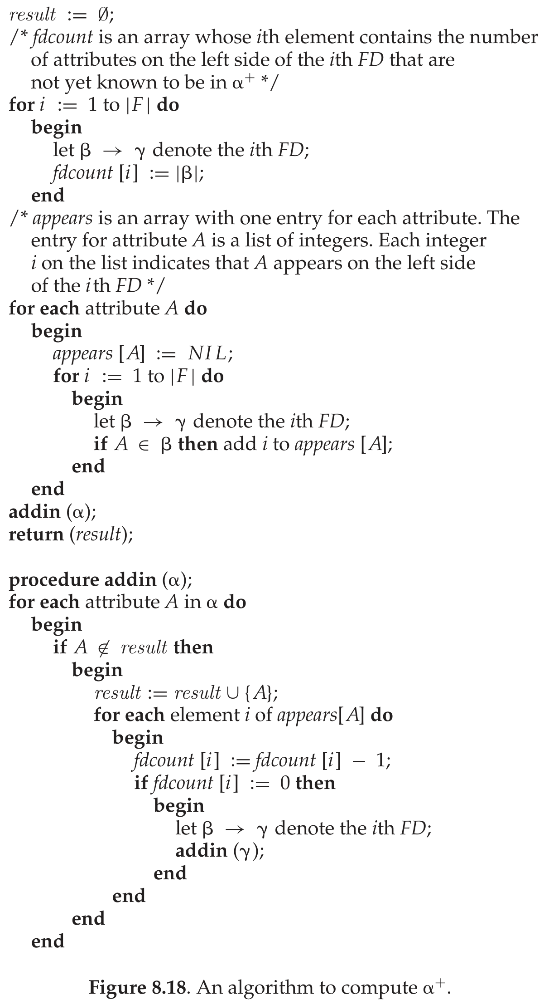

# 课后习题 第8章 关系数据库设计

题目和解答依据 `数据库系统概念课后习题答案.pdf` 第 54–64 页整理（第 64 页是 8.8 题用到的教材图 8.18 伪代码），对应《数据库系统概念》第 6 版第 8 章的练习题 8.1–8.18。题意为中文转述，解答为重新整理的中文要点，属性闭包、候选码、正则覆盖、无损和依赖保持的判断都重新推导核对过。

## 本章导读

- 8.1、8.6、8.7、8.13 用的是同一组函数依赖，依次练求属性闭包、找候选码、求正则覆盖、判断无损连接和依赖保持，是期末范式计算题的直接练习，建议按顺序连着做。8.13 后面补了同一组依赖的 BCNF 分解和 3NF 合成，可以一起练。
- 8.15（一个模式有多种 BCNF 分解）、8.18（属于 BCNF 但不属于 4NF）是小构造题，用来检查自己对定义清不清楚。
- 8.2、8.3、8.9 考函数依赖的含义：从关系实例里找依赖，用依赖表达联系的映射基数，用 SQL 检查依赖是否成立。
- 8.10、8.11 讲分解之后的空值问题和主码、外码约束。
- 8.4、8.5、8.8、8.12、8.14、8.16、8.17 是证明题。8.4、8.5 的 Armstrong 公理推导要会写，其余看懂思路即可。

知识点整理见 `07 函数依赖与范式.md`，历年计算题见 `23 范式计算题.md`，课程笔记 `笔记/数据库系统原理笔记.pdf` 第 8 章可以配合看。

下文反复用到的三个工具：

- 属性闭包 $\alpha^+$：从 $\alpha$ 出发，只要某条 $\beta \rightarrow \gamma$ 满足 $\beta$ 包含于当前结果，就把 $\gamma$ 并进来，直到结果不再变化。 $\alpha^+ = R$ 时 $\alpha$ 是超码。
- 二元分解 $\lbrace R_1, R_2 \rbrace$ 无损的充分条件： $R_1 \cap R_2 \rightarrow R_1$ 或 $R_1 \cap R_2 \rightarrow R_2$ 属于 $F^+$，即公共属性是其中一个模式的超码。
- 依赖保持检验（不必算出 $F^+$）：检验 $\alpha \rightarrow \beta$ 时，令 $\mathit{result} = \alpha$，反复对每个 $R_i$ 执行 $\mathit{result} := \mathit{result} \cup ((\mathit{result} \cap R_i)^+ \cap R_i)$，直到不再变化，最后看 $\beta$ 是否包含于 $\mathit{result}$。

## 习题

### 8.1 判断分解是否无损

题目：关系模式 $R = (A, B, C, D, E)$ 上成立函数依赖集

$$F = \lbrace A \rightarrow BC,\ CD \rightarrow E,\ B \rightarrow D,\ E \rightarrow A \rbrace$$

把 $R$ 分解为 $R_1 = (A, B, C)$ 和 $R_2 = (A, D, E)$。证明这是无损连接分解。

思路：两个模式的交集是 $A$，只要说明 $A$ 是 $R_1$ 或 $R_2$ 的超码。

解答： $R_1 \cap R_2 = A$。求 $A^+$：

1. 初始为 $A$。
2. 由 $A \rightarrow BC$，得 $ABC$。
3. 由 $B \rightarrow D$，得 $ABCD$。
4. 由 $CD \rightarrow E$，得 $ABCDE$。

$A^+ = R$，所以 $A \rightarrow ABC$ 成立，即 $R_1 \cap R_2 \rightarrow R_1$，分解无损。 $A$ 其实是 $R$ 的候选码，见 8.6。

### 8.2 从关系实例找函数依赖

题目：列出教材图 8.17 中的关系满足的全部函数依赖。关系如下：

| A | B | C |
|---|---|---|
| a1 | b1 | c1 |
| a1 | b1 | c2 |
| a2 | b1 | c1 |
| a2 | b1 | c3 |

（答案 PDF 没有附这张表，这里按教材图 8.17 给出，和官方答案引用的元组关系一致。）

思路：B 列全是 b1，任何属性集都能决定 B。再逐个检查以 A、C 为右部的依赖能否找到反例。

解答：

- 右部为 B：所有元组 B 值相同， $A \rightarrow B$、 $C \rightarrow B$ 成立，由它们还能得到 $AC \rightarrow B$。
- 右部为 A：第 1、3 个元组 B、C 都相同而 A 不同，所以 $B \rightarrow A$、 $C \rightarrow A$、 $BC \rightarrow A$ 都不成立。
- 右部为 C：第 1、2 个元组 A、B 都相同而 C 不同，所以 $A \rightarrow C$、 $B \rightarrow C$、 $AB \rightarrow C$ 都不成立。
- 结论：右部为单个属性的非平凡依赖只有 $A \rightarrow B$、 $C \rightarrow B$、 $AC \rightarrow B$。右部再带上左部属性的写法，如 $A \rightarrow AB$、 $AC \rightarrow ABC$，是在它们上面加平凡部分得到的。
- 平凡依赖 $\alpha \rightarrow \beta$（ $\beta \subseteq \alpha$，两边非空）共 19 个：单属性左部 3 个，双属性左部 $3 \times 3 = 9$ 个，左部为 $ABC$ 时 7 个。

### 8.3 用函数依赖表示联系的映射基数

题目：说明怎样用函数依赖表示下面两种情况：

- `student` 和 `instructor` 之间存在一对一联系集；
- `student` 和 `instructor` 之间存在多对一联系集（多个学生对应一位教师）。

思路：记 $\mathit{Pk}(r)$ 为关系 $r$ 的主码属性。多对一就是"多"那边决定"一"那边。

解答：在联系集对应的关系上：

- 一对一： $\mathit{Pk}(\mathit{student}) \rightarrow \mathit{Pk}(\mathit{instructor})$ 和 $\mathit{Pk}(\mathit{instructor}) \rightarrow \mathit{Pk}(\mathit{student})$ 同时成立。学生相同则教师相同，教师相同则学生也相同。
- 多对一：只有 $\mathit{Pk}(\mathit{student}) \rightarrow \mathit{Pk}(\mathit{instructor})$。同一个学生总对应同一位教师，反方向不成立，一位教师可以对应多个学生。

### 8.4 证明合并律

题目：用 Armstrong 公理证明合并律是正确的：若 $\alpha \rightarrow \beta$ 且 $\alpha \rightarrow \gamma$，则 $\alpha \rightarrow \beta\gamma$。（提示：先用增补律由 $\alpha \rightarrow \beta$ 得到 $\alpha \rightarrow \alpha\beta$，再对 $\alpha \rightarrow \gamma$ 用增补律，最后用传递律。）

思路：按提示两次增补、一次传递。

解答：

| 步骤 | 依赖 | 理由 |
|---|---|---|
| 1 | $\alpha \rightarrow \beta$ | 已知 |
| 2 | $\alpha \rightarrow \alpha\beta$ | 对 1 两边增补 $\alpha$， $\alpha\alpha = \alpha$ |
| 3 | $\alpha \rightarrow \gamma$ | 已知 |
| 4 | $\alpha\beta \rightarrow \beta\gamma$ | 对 3 两边增补 $\beta$ |
| 5 | $\alpha \rightarrow \beta\gamma$ | 由 2、4 用传递律 |

### 8.5 证明伪传递律

题目：用 Armstrong 公理证明伪传递律是正确的：若 $\alpha \rightarrow \beta$ 且 $\gamma\beta \rightarrow \delta$，则 $\alpha\gamma \rightarrow \delta$。

思路：先把 $\alpha \rightarrow \beta$ 增补成右部恰好是 $\gamma\beta$ 的形式，再传递。

解答：

| 步骤 | 依赖 | 理由 |
|---|---|---|
| 1 | $\alpha \rightarrow \beta$ | 已知 |
| 2 | $\alpha\gamma \rightarrow \gamma\beta$ | 对 1 两边增补 $\gamma$ |
| 3 | $\gamma\beta \rightarrow \delta$ | 已知 |
| 4 | $\alpha\gamma \rightarrow \delta$ | 由 2、3 用传递律 |

### 8.6 求 F+ 和候选码

题目：对 8.1 中的 $R = (A, B, C, D, E)$ 和 $F = \lbrace A \rightarrow BC,\ CD \rightarrow E,\ B \rightarrow D,\ E \rightarrow A \rbrace$，计算 $F^+$，并列出 $R$ 的全部候选码。

思路： $F^+$ 不必一条条列全。先算各属性组合的闭包，分清哪些是超码。超码作左部的依赖右部可以随便取，剩下的非超码组合单独列出。

解答：

1. 算闭包。
   - $A^+$： $A \rightarrow BC$ 得 $ABC$， $B \rightarrow D$ 得 $ABCD$， $CD \rightarrow E$ 得 $ABCDE$。
   - $E^+$： $E \rightarrow A$ 得 $AE$，之后同 $A^+$，得 $ABCDE$。
   - $(CD)^+$： $CD \rightarrow E$ 得 $CDE$， $E \rightarrow A$ 得 $ACDE$， $A \rightarrow BC$ 得 $ABCDE$。
   - $(BC)^+$： $B \rightarrow D$ 得 $BCD$， $CD \rightarrow E$ 得 $BCDE$， $E \rightarrow A$ 得 $ABCDE$。
   - $B^+ = BD$， $C^+ = C$， $D^+ = D$， $(BD)^+ = BD$。
2. 找候选码。含 $A$ 的候选码只能是 $A$ 本身，含 $E$ 的只能是 $E$ 本身，因为 $A$、 $E$ 单独就是超码。剩下只由 $B, C, D$ 组成的组合： $BC$、 $CD$ 是超码，去掉任一个属性后不再是超码； $BD$ 不是超码； $BCD$ 包含 $BC$，不是最小的。

   **候选码： $A$、 $E$、 $BC$、 $CD$。**

3. 写出 $F^+$。
   - 左部包含 $A$、 $E$、 $BC$、 $CD$ 中任意一个的依赖，右部取 $R$ 的任意子集，都属于 $F^+$。
   - 其余左部只可能是 $B$、 $C$、 $D$、 $BD$，对应的依赖为： $B \rightarrow B$、 $B \rightarrow D$、 $B \rightarrow BD$， $BD \rightarrow B$、 $BD \rightarrow D$、 $BD \rightarrow BD$， $C \rightarrow C$， $D \rightarrow D$。

官方答案也提醒，答题时不必把 $F^+$ 全部枚举，用"超码作左部可推出一切"这样的简写，把非平凡成员说清楚就行。

### 8.7 求正则覆盖

题目：对 8.6 的依赖集 $F$ 求正则覆盖 $F_c$。

思路：先合并左部相同的依赖，再逐个检查每条依赖左部、右部的每个属性是否无关。检查左部属性 $X$ 时，在原 $F$ 下看去掉 $X$ 的左部的闭包是否仍含右部；检查右部属性 $X$ 时，把这条依赖的右部去掉 $X$，在修改后的依赖集下看左部的闭包是否仍含 $X$。

解答： $F$ 中四条依赖左部各不相同，不用合并。逐个检查：

| 依赖 | 检查的属性 | 检验 | 结论 |
|---|---|---|---|
| $A \rightarrow BC$ | 右部 $B$ | 在 $\lbrace A \rightarrow C, CD \rightarrow E, B \rightarrow D, E \rightarrow A \rbrace$ 下 $A^+ = AC$，不含 $B$ | 不无关 |
| $A \rightarrow BC$ | 右部 $C$ | 在 $\lbrace A \rightarrow B, CD \rightarrow E, B \rightarrow D, E \rightarrow A \rbrace$ 下 $A^+ = ABD$，不含 $C$ | 不无关 |
| $CD \rightarrow E$ | 左部 $C$ | 在 $F$ 下 $D^+ = D$，不含 $E$ | 不无关 |
| $CD \rightarrow E$ | 左部 $D$ | 在 $F$ 下 $C^+ = C$，不含 $E$ | 不无关 |
| $CD \rightarrow E$ | 右部 $E$ | 去掉这条后 $(CD)^+ = CD$ | 不无关 |
| $B \rightarrow D$ | 右部 $D$ | 去掉这条后 $B^+ = B$ | 不无关 |
| $E \rightarrow A$ | 右部 $A$ | 去掉这条后 $E^+ = E$ | 不无关 |

单属性左部没有左部无关属性可查。所以 $F_c = F = \lbrace A \rightarrow BC,\ CD \rightarrow E,\ B \rightarrow D,\ E \rightarrow A \rbrace$。

### 8.8 更快的属性闭包算法

题目：教材图 8.18 给出另一个计算 $\alpha^+$ 的算法，伪代码如下。证明它比 8.4.2 节图 8.8 的算法更高效，并且能正确算出 $\alpha^+$。



图 8.18 算法的做法：

- 给 $F$ 中第 $i$ 条依赖 $\beta \rightarrow \gamma$ 设计数器 `fdcount[i]`，初值为 $\beta$ 的属性个数，表示左部还有几个属性没进入结果。
- 对每个属性 $A$ 建一张表 `appears[A]`，记下 $A$ 出现在哪些依赖的左部。
- 调用 `addin(α)`：对参数里每个还不在 `result` 中的属性 $A$，把它加入 `result`，再把 `appears[A]` 中每条依赖的计数器减 1；某条依赖的计数器减到 0，说明它的左部已经全部进入结果，就递归调用 `addin(γ)` 把右部加进来。
- 最后返回 `result`。

思路：正确性分两半证：加进来的属性都在 $\alpha^+$ 里； $\alpha^+$ 里的属性都会被加进来。效率看每个属性、每条依赖各被处理几次。

解答：

正确性一：`result` 中的属性都属于 $\alpha^+$。按属性加入的先后归纳。

- $\alpha$ 中的属性由自反律属于 $\alpha^+$。
- 其他属性 $A$ 是某次 `addin(γ)` 加入的，这次调用发生在依赖 $\beta \rightarrow \gamma$ 的计数器归零时。每个属性只加入一次，加入时对它所在的每条依赖只减一次计数，所以计数器归零说明 $\beta$ 的属性都已先于 $A$ 加入。由归纳假设 $\beta \subseteq \alpha^+$，即 $\alpha \rightarrow \beta$，与 $\beta \rightarrow \gamma$ 传递得 $\alpha \rightarrow \gamma$，所以 $A \in \alpha^+$。

正确性二： $\alpha^+$ 中的属性都会进入 `result`。记算法结束时的 `result` 为 $S$， $\alpha \subseteq S$。

- 对 $F$ 中任一 $\beta \rightarrow \gamma$，若 $\beta \subseteq S$，则 $\beta$ 的每个属性加入时各把它的计数器减 1，最后一个属性加入时计数器归零，调用了 `addin(γ)`，所以 $\gamma \subseteq S$。
- 构造一个只有两个元组的关系：两个元组在 $S$ 的属性上取值相同，在其余属性上取值不同。 $F$ 中每条依赖在这个关系上都成立：左部包含于 $S$ 时右部也包含于 $S$，两元组在右部上相同；左部不包含于 $S$ 时，两元组在左部上就不相同。
- 满足 $F$ 的关系一定满足 $F^+$。若 $A \in \alpha^+$，则 $\alpha \rightarrow A$ 在这个关系上成立；两元组在 $\alpha \subseteq S$ 上相同，所以在 $A$ 上也相同，只能 $A \in S$。

效率：

- 图 8.8 的算法每一轮都扫描 $F$ 的全部依赖，只要这一轮加入了新属性就再来一轮。每轮至少有一条依赖第一次起作用，最多要跑约 $|F|$ 轮，总代价和 $F$ 的规模成平方关系。
- 图 8.18 的算法中，每个属性最多加入一次，所以每张 `appears[A]` 最多遍历一次，计数器减 1 的总次数等于所有依赖左部的长度之和；每条依赖的计数器只归零一次，右部最多被处理一次。总时间和 $F$ 的规模（所有依赖左右部长度之和）成线性。

两点补充：伪代码里 `if fdcount[i] := 0` 是笔误，应为比较 `= 0`。伪代码建 `appears` 时用了"每个属性扫描全部依赖"的双重循环，要做到严格线性，应改成把每条依赖的左部扫一遍，逐个属性登记。

### 8.9 用 SQL 检查函数依赖

题目：模式 $R(a, b, c)$ 上有关系 $r$。写一个 SQL 查询，检查函数依赖 $b \rightarrow c$ 是否在 $r$ 上成立；再写一个 SQL 断言强制这个依赖。假设没有空值。（断言是 SQL 标准的一部分，但目前没有数据库实现支持。）

思路： $b \rightarrow c$ 不成立，等价于某个 `b` 值对应了不止一个 `c` 值。

解答：

a. 查询结果非空，当且仅当 $b \rightarrow c$ 不成立：

```sql
select b
from r
group by b
having count(distinct c) > 1;
```

也可以用自连接直接找反例：

```sql
select distinct r1.b
from r as r1, r as r2
where r1.b = r2.b and r1.c <> r2.c;
```

b. 断言：

```sql
create assertion b_to_c check (
  not exists (
    select b
    from r
    group by b
    having count(distinct c) > 1
  )
);
```

### 8.10 左部属性为空值时的分解

题目：前面讨论无损连接分解时，默认函数依赖左部的属性不取空值。如果这个前提不成立，分解会出什么问题？

思路：分解后靠自然连接重建原关系，自然连接要比较公共属性是否相等，而空值参与比较得到 unknown。

解答：

- 自然连接可以写成笛卡尔积、选择（公共属性相等）、投影三步。空值参与相等比较结果是 unknown，选择条件不成立，所以公共属性上为空的元组在连接结果里全部丢失。
- 例： $r(A, B, C)$ 上有 $A \rightarrow B$，按它分解成 $(A, B)$ 和 $(A, C)$。若 $r$ 中有元组 $(\text{null}, b_1, c_1)$，两个投影中分别有 $(\text{null}, b_1)$ 和 $(\text{null}, c_1)$，连接时 null 与 null 比较不成立，这个元组回不来。
- 于是分解变成有损的。平常说的有损是连接后多出元组，这里是连接后少了元组。
- 空值只出现在依赖右部的属性上时（这些属性不是公共属性），没有这个问题。

### 8.11 BCNF 与 3NF 分解后的主码和外码

题目：BCNF 分解算法中，用函数依赖 $\alpha \rightarrow \beta$ 把关系模式 $r(\alpha, \beta, \gamma)$ 分解成 $r_1(\alpha, \beta)$ 和 $r_2(\alpha, \gamma)$。

- a. 分解后的关系上应当有哪些主码和外码约束？
- b. 如果不强制这个外码约束，举例说明错误的更新会造成什么不一致。
- c. 用 8.5.2 节的算法做 3NF 分解时，分解后的模式上应当有哪些主码和外码约束？

思路： $\alpha$ 决定 $\beta$，所以 $\alpha$ 是 $r_1$ 的码； $r_2$ 中的 $\alpha$ 值和 $r_1$ 中的来自同一个原关系，一定能在 $r_1$ 中找到。

解答：

a. $\alpha$ 作为 $r_1$ 的主码； $r_2$ 中的 $\alpha$ 作为外码，引用 $r_1$。（ $\alpha \rightarrow \beta$ 保证 $\alpha$ 是 $r_1$ 的超码；分解用的依赖左部没有无关属性时，它就是候选码。）

b. 不强制外码时，可以删掉 $r_1$ 中的某个元组，而 $r_2$ 里仍有元组使用这个 $\alpha$ 值；也可以往 $r_2$ 插入一个 $r_1$ 中没有的 $\alpha$ 值。这时 $r_1 \bowtie r_2$ 会丢掉这些 $r_2$ 元组，重建不出原来的 $r$，相当于原关系中这些元组的 $\beta$ 值变成了未知。

举例：`in_dep(ID, name, salary, dept_name, building, budget)` 按 `dept_name` 决定 `building, budget` 分解成 `department(dept_name, building, budget)` 和 `instructor(ID, name, salary, dept_name)`。如果删掉 `department` 中某个系的元组而不管 `instructor`，这个系的教师还在表里，却再也查不到所在楼和预算。

（更正：官方答案说这相当于把某些元组的 $\alpha$ 置为空值。 $\alpha$ 值其实还留在 $r_2$ 中，丢失的是对应的 $\beta$ 值。）

c. 3NF 合成算法生成的模式：

- 由正则覆盖中的 $\alpha \rightarrow \beta$ 生成的模式 $r_i(\alpha, \beta)$，以 $\alpha$ 为主码。
- 为保证无损而补上的、包含原模式某个候选码 $\gamma$ 的模式 $r_k$，以 $\gamma$ 为主码。
- 外码：若 $r_i$ 的主码属性也出现在另一个模式 $r_j$ 中，就在 $r_j$ 的这些属性上建外码，引用 $r_i$。这样建是成立的： $r_i$ 和 $r_j$ 都是同一个原关系的投影，它们在这些属性上的取值集合完全相同。

### 8.12 投影再连接包含原关系

题目：设 $R_1, R_2, \dots, R_n$ 是模式 $U$ 的一个分解， $u(U)$ 是一个关系， $r_i = \Pi_{R_i}(u)$。证明

$$u \subseteq r_1 \bowtie r_2 \bowtie \cdots \bowtie r_n$$

思路：任取 $u$ 中一个元组，看它的各段投影能不能在连接里拼回它自己。

解答：

- 任取 $t \in u$。由 $r_i = \Pi_{R_i}(u)$，有 $t[R_i] \in r_i$， $i = 1, \dots, n$。
- 自然连接先做笛卡尔积，再要求同名属性取值相等，最后去掉重复的列。 $t[R_1], \dots, t[R_n]$ 都是从同一个 $t$ 截出来的，同名属性取值一定相等，所以它们能在连接中拼成一个元组。
- 这个元组的属性是 $R_1 \cup \cdots \cup R_n = U$，每个属性的值都取自 $t$，所以它就是 $t$，即 $t \in r_1 \bowtie \cdots \bowtie r_n$。
- $t$ 是任取的，所以 $u \subseteq r_1 \bowtie \cdots \bowtie r_n$。

这个结论说明（没有空值时）投影再连接只可能多出元组，不会少元组，有损分解指的就是多出来的那部分。

### 8.13 判断分解是否保持依赖

题目：证明 8.1 中的分解 $R_1 = (A, B, C)$、 $R_2 = (A, D, E)$ 不是保持依赖的分解。

思路： $B \rightarrow D$ 的两个属性分在两个模式里，先用依赖保持检验算法试它。

解答：

检验 $B \rightarrow D$：

1. $\mathit{result} = B$。
2. 对 $R_1$： $\mathit{result} \cap R_1 = B$， $B^+ = BD$，与 $R_1$ 取交得 $B$， $\mathit{result}$ 不变。
3. 对 $R_2$： $\mathit{result} \cap R_2$ 为空集，空集的闭包仍为空， $\mathit{result}$ 不变。
4. $\mathit{result}$ 不再变化，停在 $B$，不含 $D$。

所以 $B \rightarrow D$ 不能由 $F_1 \cup F_2$ 推出（ $F_i$ 为 $F^+$ 在 $R_i$ 上的限制），**分解不保持依赖**。

用同样方法检验 $CD \rightarrow E$：对 $R_1$ 得 $C^+ \cap R_1 = C$，对 $R_2$ 得 $D^+ \cap R_2 = D$， $\mathit{result}$ 停在 $CD$，也不保持。

也可以把两个限制直接写出来：

- $F_1$（ $F^+$ 在 $ABC$ 上的限制）：左部含 $A$ 或等于 $BC$ 时可推出 $ABC$ 的任意子集；左部为 $B$ 或 $C$ 时只有平凡依赖，因为 $B^+ \cap ABC = B$， $C^+ \cap ABC = C$。
- $F_2$（ $F^+$ 在 $ADE$ 上的限制）：左部含 $A$ 或 $E$ 时可推出 $ADE$ 的任意子集；左部为 $D$ 时只有平凡依赖。

$F_1 \cup F_2$ 中以 $B$ 为左部的只有平凡依赖，从 $B$ 出发推不出任何新属性，也就得不到 $B \rightarrow D$。

（更正：官方答案把 $F_2$ 写成 $F$ 在 $(C, D, E)$ 上的限制，应为 $(A, D, E)$。它还说要到 8.15 才能看出 $B \rightarrow D$ 属于 $F^+$，其实 $B \rightarrow D$ 本来就在 $F$ 中。）

补充练习（整理补充，不是原题）：用同一组 $R$ 和 $F$ 做范式判断和分解。

1. 判断 BCNF： $B \rightarrow D$ 非平凡， $B^+ = BD$， $B$ 不是超码，所以 $R$ 不属于 BCNF。
2. 判断 3NF： $A \rightarrow BC$、 $CD \rightarrow E$、 $E \rightarrow A$ 的左部都是超码； $B \rightarrow D$ 左部不是超码，但 $D$ 属于候选码 $CD$，是主属性，满足 3NF 的第三个条件。所以 $R$ 已经属于 3NF。（判断 3NF 只需检查 $F$ 中的依赖。）
3. BCNF 分解：用 $B \rightarrow D$ 分解，得 $R_1' = (B, D)$， $R_2' = (A, B, C, E)$。
   - $R_1'$ 只有两个属性，属于 BCNF。
   - $R_2'$： $A^+$、 $E^+$、 $(BC)^+$ 都包含 $ABCE$，这三个是 $R_2'$ 的候选码。不含它们的非空子集只有 $B$、 $C$，而 $B^+ \cap ABCE = B$， $C^+ \cap ABCE = C$，只有平凡依赖。所以 $R_2'$ 属于 BCNF。
   - 无损： $R_1' \cap R_2' = B$， $B \rightarrow BD$，公共属性是 $R_1'$ 的超码。
   - 不保持依赖：检验 $CD \rightarrow E$ 时，对 $R_1'$ 得 $D^+ \cap BD = D$，对 $R_2'$ 得 $C^+ \cap ABCE = C$， $\mathit{result}$ 停在 $CD$。其余三条依赖各自落在一个模式里，是保持的。
4. 3NF 合成： $F_c = F$，每条依赖生成一个模式： $(A, B, C)$、 $(C, D, E)$、 $(B, D)$、 $(A, E)$。 $(A, B, C)$ 已含候选码 $A$，不用另加；四个模式互不包含，不用删除。结果 $\lbrace (A, B, C), (C, D, E), (B, D), (A, E) \rbrace$ 无损且保持依赖。由第 2 步可知 $R$ 本身已是 3NF，实际设计时可以不分解。

### 8.14 含候选码的保持依赖 3NF 分解是无损的

题目：证明：对一个保持依赖的 3NF 分解，只要保证至少有一个模式包含原模式的候选码，它就是无损连接分解。（提示：证明各投影的连接不会比原关系含有更多元组。）

思路：8.12 已经给出原关系包含于连接结果，只要再证连接结果包含于原关系。关键一步是：连接结果中两个在候选码上取值相同的元组一定完全相同。

解答：

设 $\sigma = \lbrace R_1, \dots, R_n \rbrace$ 是 $R$ 的保持依赖的 3NF 分解， $X$ 是 $R$ 的候选码，且 $X \subseteq R_k$。任取 $R$ 上满足 $F$ 的关系 $r$，令

$$j = \Pi_{R_1}(r) \bowtie \Pi_{R_2}(r) \bowtie \cdots \bowtie \Pi_{R_n}(r)$$

由 8.12， $r \subseteq j$。

断言：若 $t_1, t_2 \in j$ 且 $t_1[X] = t_2[X]$，则 $t_1 = t_2$。

- 令 $F_i$ 为 $F^+$ 在 $R_i$ 上的限制， $F' = F_1 \cup \cdots \cup F_n$。用图 8.8 的算法在 $F'$ 下求 $X^+$，对循环执行的次数归纳，证明 $t_1$、 $t_2$ 在当前 $\mathit{result}$ 上始终取值相同。
- 开始时 $\mathit{result} = X$，成立。
- 某一步用到 $\beta \rightarrow \gamma \in F_i$，且 $\beta \subseteq \mathit{result}$。由归纳假设 $t_1[\beta] = t_2[\beta]$。 $t_1[R_i]$、 $t_2[R_i]$ 都在 $\Pi_{R_i}(r)$ 中，而 $r$ 满足 $\beta \rightarrow \gamma$，且 $\beta, \gamma \subseteq R_i$，所以 $\Pi_{R_i}(r)$ 也满足它，得 $t_1[\gamma] = t_2[\gamma]$。把 $\gamma$ 并入 $\mathit{result}$ 后仍成立。
- 分解保持依赖， $F'$ 与 $F$ 的闭包相同，所以在 $F'$ 下 $X^+ = R$。算法结束时 $\mathit{result} = R$，得 $t_1 = t_2$。

再证 $j \subseteq r$：任取 $t \in j$， $t[R_k] \in \Pi_{R_k}(r)$，所以存在 $s \in r$ 使 $s[R_k] = t[R_k]$，特别地 $s[X] = t[X]$。又 $s \in r \subseteq j$，由断言得 $t = s \in r$。

于是 $r = j$，分解无损。

官方答案的证法是把 $\Pi_X(r)$ 也放进连接，再比较元组个数；最后它还指出，只由候选码 $X$ 组成的模式一定属于 3NF，所以往保持依赖的 3NF 分解里补一个模式 $X$，就得到既无损又保持依赖的 3NF 分解。3NF 合成算法里"没有模式含候选码就补一个"那一步，依据就是这道题。

（更正：官方答案中写了 $\Pi_X(j) = \Pi_X(r) = r$， $\Pi_X(r)$ 和 $r$ 的属性不同，不能相等，应为二者元组个数相同，因为 $X$ 是码。）

### 8.15 有三种 BCNF 分解的例子

题目：给出一个关系模式 $R'$ 和函数依赖集 $F'$，使 $R'$ 至少有三种不同的无损连接 BCNF 分解。

思路：用一条依赖链。只有两个属性的模式一定属于 BCNF，所以只要把模式拆成若干二元模式，再用"公共属性是一侧的超码"逐次验证无损。

解答：取 $R' = (A, B, C, D)$， $F' = \lbrace A \rightarrow B,\ B \rightarrow C,\ C \rightarrow D \rbrace$。 $A^+ = ABCD$， $B^+ = BCD$， $C^+ = CD$， $A$ 是唯一的候选码。

二元模式 $(P, Q)$ 上的非平凡函数依赖只可能是 $P \rightarrow Q$ 或 $Q \rightarrow P$，左部都是该模式的超码，所以二元模式一定属于 BCNF。下面三种分解都只含二元模式，验证无损即可：

| 分解 | 无损验证（两两合并） |
|---|---|
| $\lbrace (A, B), (B, C), (C, D) \rbrace$ | $(B, C)$ 与 $(C, D)$ 交于 $C$， $C \rightarrow D$，合成 $(B, C, D)$；再与 $(A, B)$ 交于 $B$， $B \rightarrow CD$，合成 $R'$ |
| $\lbrace (A, B), (A, C), (C, D) \rbrace$ | $(A, B)$ 与 $(A, C)$ 交于 $A$， $A$ 是码，合成 $(A, B, C)$；再与 $(C, D)$ 交于 $C$， $C \rightarrow D$，合成 $R'$ |
| $\lbrace (A, B), (B, C), (A, D) \rbrace$ | $(A, B)$ 与 $(A, D)$ 交于 $A$，合成 $(A, B, D)$；再与 $(B, C)$ 交于 $B$， $B \rightarrow C$，合成 $R'$ |

顺带看依赖保持：第一种保持全部依赖；第二种丢了 $B \rightarrow C$；第三种丢了 $C \rightarrow D$。

### 8.16 用传递依赖重新定义 3NF

题目：出现在至少一个候选码中的属性称为主属性。设属性集 $\alpha$、 $\beta$ 满足 $\alpha \rightarrow \beta$ 但 $\beta \rightarrow \alpha$ 不成立，属性 $A$ 既不在 $\alpha$ 中也不在 $\beta$ 中，且 $\beta \rightarrow A$ 成立，则称 $A$ 传递依赖于 $\alpha$。3NF 可以改写为：关系模式 $R$ 中不存在传递依赖于 $R$ 的某个码的非主属性。证明这个定义和教材原定义等价。

教材原定义：对 $F^+$ 中每个 $\alpha \rightarrow \beta$，下面三条至少满足一条：(1) 它是平凡依赖；(2) $\alpha$ 是 $R$ 的超码；(3) $\beta - \alpha$ 中每个属性都包含在 $R$ 的某个候选码中。

思路：两个方向都用反证。一个定义下的"坏"依赖，正好能构造出另一个定义下的"坏"依赖。

解答：

原定义推出新定义。设 $R$ 满足原定义，但有非主属性 $A$ 传递依赖于码 $\alpha$：存在 $\beta$ 使 $\alpha \rightarrow \beta$、 $\beta \rightarrow A$、 $\beta \rightarrow \alpha$ 不成立、 $A \notin \alpha$、 $A \notin \beta$。看依赖 $\beta \rightarrow A$：

- $A \notin \beta$，它不是平凡依赖；
- 若 $\beta$ 是超码， $\beta \rightarrow \alpha$ 就成立，矛盾，所以 $\beta$ 不是超码；
- $A$ 是非主属性，不在任何候选码中。

三条都不满足，和原定义矛盾。

新定义推出原定义。设 $R$ 满足新定义，但 $F^+$ 中有 $\alpha \rightarrow \beta$ 三条都不满足：它非平凡， $\alpha$ 不是超码， $\beta - \alpha$ 中有属性 $A$ 不属于任何候选码。于是 $A$ 是非主属性， $\alpha \rightarrow A$， $A \notin \alpha$。任取一个候选码 $\gamma$：

- $\gamma \rightarrow \alpha$，因为码决定所有属性；
- $\alpha \rightarrow \gamma$ 不成立，否则 $\alpha$ 是超码；
- $A \notin \gamma$，因为 $A$ 是非主属性。

按定义， $A$ 传递依赖于码 $\gamma$（中间的属性集是 $\alpha$），和新定义矛盾。

### 8.17 3NF 一定属于 2NF

题目：若存在 $\alpha$ 的真子集 $\gamma$ 使 $\gamma \rightarrow \beta$，则称 $\alpha \rightarrow \beta$ 为部分依赖， $\beta$ 部分依赖于 $\alpha$。若关系模式 $R$ 中每个属性 $A$ 满足下列条件之一，则 $R$ 属于第二范式（2NF）： $A$ 出现在某个候选码中； $A$ 不部分依赖于任何候选码。证明每个 3NF 模式都属于 2NF。（提示：证明每个部分依赖都是传递依赖。）

思路：用 8.16 的定义。2NF 可以改写成"没有非主属性部分依赖于候选码"，所以只需证明：部分依赖于候选码的非主属性，一定传递依赖于这个码。

解答：设 $A$ 是非主属性， $\alpha$ 是候选码， $A$ 部分依赖于 $\alpha$，即存在真子集 $\beta \subset \alpha$ 使 $\beta \rightarrow A$。

- $\beta \subset \alpha$，由自反律 $\alpha \rightarrow \beta$。
- $\beta \rightarrow \alpha$ 不成立，否则 $\beta$ 是超码，和 $\alpha$ 是最小的超码矛盾。
- $A$ 是非主属性，不在 $\alpha$ 中，当然也不在 $\beta$ 中。

所以 $A$ 传递依赖于码 $\alpha$。3NF 模式中不存在这样的 $A$，也就不存在部分依赖于候选码的非主属性，因此属于 2NF。

### 8.18 属于 BCNF 但不属于 4NF

题目：举一个关系模式和依赖集的例子，使它属于 BCNF 但不属于 4NF。

思路：只给一个多值依赖，不给非平凡函数依赖，BCNF 自然满足；多值依赖的左部不是超码，4NF 就不满足。

解答： $R = (A, B, C)$，依赖集只有多值依赖 $A \twoheadrightarrow B$。

- 属于 BCNF：这个依赖集推不出任何非平凡函数依赖，BCNF 的条件自动满足。
- 不属于 4NF： $A \twoheadrightarrow B$ 非平凡（ $B \not\subseteq A$，且 $A \cup B \neq R$），而 $A$ 不是超码。
- 换成具体的例子：教师信息 `(ID, child_name, phone)`，一位教师有几个孩子、几部电话，两者互不相关，有 $\mathit{ID} \twoheadrightarrow \mathit{child\_name}$。模式里没有非平凡函数依赖，全部属性合起来才是码，属于 BCNF；但同一位教师的每个孩子都要和每部电话各组合出现一次，冗余明显。按 4NF 分解为 $(A, B)$ 和 $(A, C)$，即 `(ID, child_name)` 和 `(ID, phone)`，就消除了这种冗余。
