# 考点与方法总结

整理自 `历年题/` 下 2022、2023 两年的期末试卷和答案（共 4 份 PDF）。把两套卷子的 38 道题按知识点重新归类，每类先列要记的公式和方法，再列对应真题和易错点。题目的完整解答见 [01 2022年期末试卷与解答](01%202022年期末试卷与解答.md) 和 [02 2023年期末试卷与解答](02%202023年期末试卷与解答.md)，下文用"22-三""23-填5"这样的写法指代题号。

## 分值分布

两年卷面结构一样：6 道选择、6 道填空各 18 分，7 道解答题 64 分。按内容粗分：

| 部分 | 2022 年 | 2023 年 |
| --- | --- | --- |
| 随机事件与概率 | 16 分（22-选1、填1、三） | 11 分（23-填1、三） |
| 一维随机变量 | 13 分（22-填2、四） | 14 分（23-选1、选2、四） |
| 二维随机变量 | 34 分（22-选2、选3、五、七、八） | 34 分（23-选4、填2、八、九） |
| 数字特征 | 3 分（22-填3，另有多道大题用到） | 6 分（23-选3、填3） |
| 大数定律与中心极限定理 | 6 分（22-选4、填4） | 9 分（23-填4、五） |
| 抽样分布 | 3 分（22-选5） | 9 分（23-选5、七） |
| 参数估计 | 22 分（22-选6、填5、六、九） | 14 分（23-选6、填5、六） |
| 假设检验 | 3 分（22-填6） | 3 分（23-填6） |

前五行（概率论部分）两年分别是 72 分和 74 分，数理统计部分 28 分和 26 分。数理统计虽然分少，题型很固定：矩估计、最大似然估计、无偏性、正态均值的置信区间和 t 检验，每年必考，是最容易拿满的一块。

## 1. 随机事件与概率

### 公式

| 名称 | 公式 |
| --- | --- |
| 加法公式 | $P(A\cup B)=P(A)+P(B)-P(AB)$ |
| 减法公式 | $P(A\bar B)=P(A)-P(AB)$ |
| 乘法公式 | $P(AB)=P(A)P(B\mid A)=P(B)P(A\mid B)$ |
| 德摩根律 | $P(\bar A\bar B)=1-P(A\cup B)$ |
| 全概率公式 | $P(B)=\sum_i P(A_i)P(B\mid A_i)$， $A_i$ 构成完备事件组 |
| 贝叶斯公式 | $P(A_j\mid B)=\dfrac{P(A_j)P(B\mid A_j)}{\sum_iP(A_i)P(B\mid A_i)}$ |
| 独立 | $P(AB)=P(A)P(B)$； $0<P(B)<1$ 时等价于 $P(A\mid B)=P(A\mid\bar B)$ |

### 方法

- 给了三个条件概率求并、求交（22-填1、23-填1、23-八前半）：先用乘法公式求 $P(AB)$，再用 $P(A\mid B)$ 反求 $P(B)$，最后套加法、减法公式。
- 全概率、贝叶斯应用题（22-三、23-三）：先设事件，把"原因"列成完备事件组，写出每个 $P(A_i)$ 和 $P(B\mid A_i)$，再代公式。22-三给的是总痊愈率，要反解 $P(B\mid A)$，比 23-三多一步。
- 判断事件关系（22-选1）：把条件化成 $P(AB)$ 与 $P(A)P(B)$ 的关系。

### 易错点

- $P(A\mid B)=1$ 只能推出 $P(\bar AB)=0$，推不出 $B=A$。
- "互不相容"是 $AB=\varnothing$，"独立"是 $P(AB)=P(A)P(B)$，两个概率都为正时二者不能同时成立。

## 2. 一维随机变量

### 常用分布

| 分布 | 分布律或密度 | 期望 | 方差 |
| --- | --- | --- | --- |
| 0-1 分布 | $P\{X=1\}=p$ | $p$ | $p(1-p)$ |
| 二项 $B(n,p)$ | $C_n^kp^k(1-p)^{n-k}$ | $np$ | $np(1-p)$ |
| 泊松 $P(\lambda)$ | $\frac{\lambda^k}{k!}e^{-\lambda}$ | $\lambda$ | $\lambda$ |
| 几何 | $(1-p)^{k-1}p$， $k\ge1$ | $\frac1p$ | $\frac{1-p}{p^2}$ |
| 均匀 $U(a,b)$ | $\frac1{b-a}$ | $\frac{a+b}2$ | $\frac{(b-a)^2}{12}$ |
| 指数（参数 $\lambda$） | $\lambda e^{-\lambda x}$， $x>0$ | $\frac1\lambda$ | $\frac1{\lambda^2}$ |
| 正态 $N(\mu,\sigma^2)$ | $\frac1{\sqrt{2\pi}\sigma}e^{-\frac{(x-\mu)^2}{2\sigma^2}}$ | $\mu$ | $\sigma^2$ |

指数分布有两种写法：23-五说"均值为 100 的指数分布"，就是 $\lambda=\frac1{100}$，方差 $100^2$。

三种连续分布的图形记下来，求概率、写分布函数时不容易漏段：

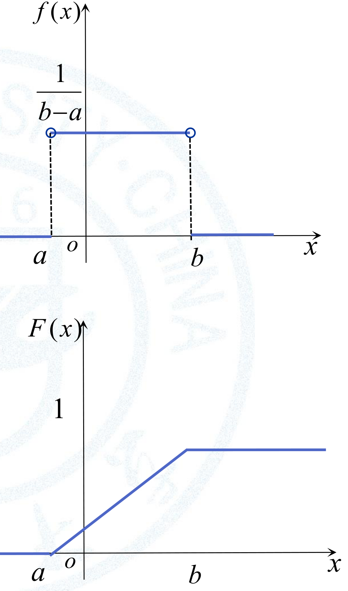

下图分布函数的水平段就是高度 1，图里数字 1 的标注位置画得偏高了一些。

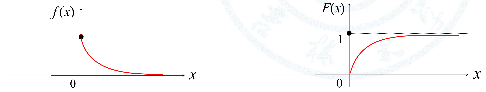

按定义 $f(0)=0$，左图 $x=0$ 处的实心点应理解为曲线右端的极限值 $\lambda$，改成空心点更准确；这一点不影响任何概率的计算。

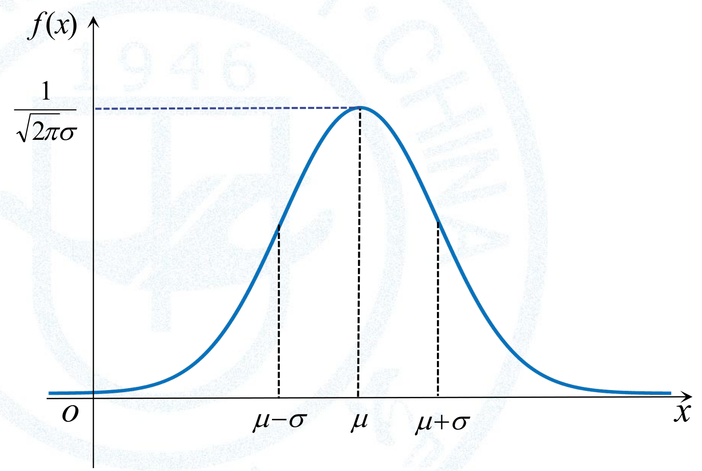

### 方法

- 分布函数求单点概率（23-选1）： $P\{X=a\}=F(a)-F(a-0)$，就是跳跃高度。下图是掷骰子点数的分布函数，每个取值处跳 $\frac16$。

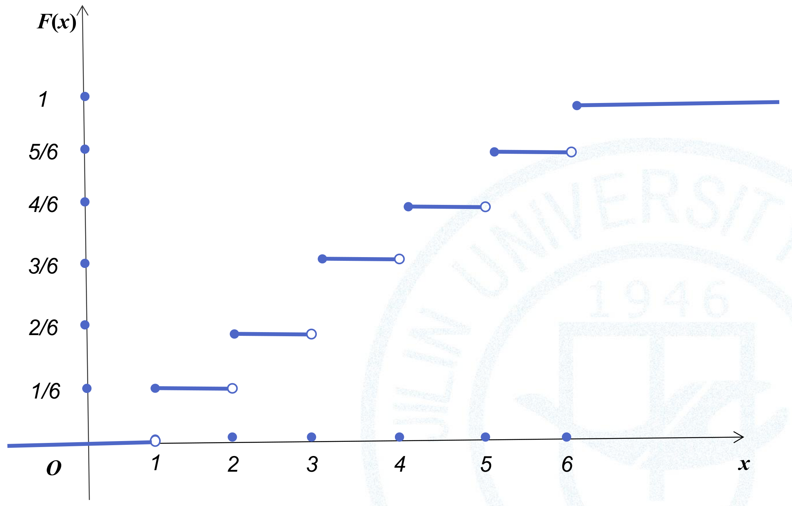
- 密度求常数（23-四）： $\int f=1$。分段密度逐段积分。
- 由密度求分布函数（23-四）：按密度的分段点把 $x$ 分成几段，每段 $F(x)=\int_{-\infty}^xf(t)dt$，要把前面各段的积分加上。算完用"连续型 $F$ 在分段点两边相等"" $F(+\infty)=1$"检查。
- 连续型随机变量函数的密度（22-四）：分布函数法。写 $F_Y(y)=P\{g(X)\le y\}$，把事件化成关于 $X$ 的区间，积分后对 $y$ 求导。 $g$ 单调时可以直接用 $f_Y(y)=f_X(h(y))\,|h'(y)|$， $h$ 是反函数。别忘了写 $f_Y$ 为 0 的范围。
- 正态分布参数（23-选2）：用对称性 $P\{X\le\mu\}=\frac12$ 定 $\mu$，用最大值 $f(\mu)=\frac1{\sqrt{2\pi}\sigma}$ 定 $\sigma$。

### 易错点

- 求 $Y=X^2$ 的分布时， $y\le0$ 那段要单独写出 $F_Y(y)=0$。
- 分布函数分段写端点时统一用"左闭右开"，最后一段 $x\ge$ 右端点（23-四原答案在这一步把 $\ge$ 写成了 $>$）。

## 3. 二维随机变量

### 离散型

- 联合分布律用乘法公式 $P\{X=i,Y=j\}=P\{X=i\}P\{Y=j\mid X=i\}$ 求（22-七：取球放回另一盒）。
- 事件的示性变量（23-八）： $X=1$ 对应 $A$ 发生，四个格子分别是 $P(AB)$、 $P(A\bar B)$、 $P(\bar AB)$、 $P(\bar A\bar B)$。
- 离散型函数的分布（23-八的 $Z$、23-填2 的 $\max$）：列出每个取值对应的格子，概率相加。

### 连续型

| 要求的量 | 公式 |
| --- | --- |
| 常数 | $\iint f(x,y)\,dx\,dy=1$ |
| 边缘密度 | $f_X(x)=\int_{-\infty}^{+\infty}f(x,y)\,dy$ |
| 条件密度 | $f_{X\mid Y}(x\mid y)=\dfrac{f(x,y)}{f_Y(y)}$，只在 $f_Y(y)>0$ 处有定义 |
| 独立 | $f(x,y)=f_X(x)f_Y(y)$ 几乎处处成立 |
| 区域概率 | $P\{(X,Y)\in D\}=\iint_Df(x,y)\,dx\,dy$ |

- 22-八、23-九都是"非零区域为矩形 + 密度可分离"，一定独立。独立以后条件密度就等于边缘密度， $P\{X<2\mid Y<1\}=P\{X<2\}$。
- 二维均匀分布（22-五）：概率等于面积比，不用积分。
- 二维正态（22-选2）： $\rho=0$ 与独立等价。
- 独立正态的线性组合仍是正态（23-选4）： $aX+bY\sim N(a\mu_1+b\mu_2,\ a^2\sigma_1^2+b^2\sigma_2^2)$。

区域概率题的关键是先画图：把事件对应的区域 $G$ 和密度的非零区域画在一起，只在两者的交集上积分，积分限从图上读。两年真题的区域都是矩形，课件里有三道更典型的例题，下面三张图是它们的求解过程。

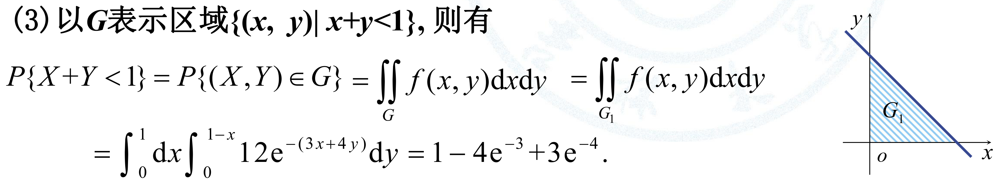

$G=\{x+y<1\}$ 是一个无界半平面，密度只在第一象限非零，真正要积的是两者的交集，也就是图中的三角形 $G_1$。

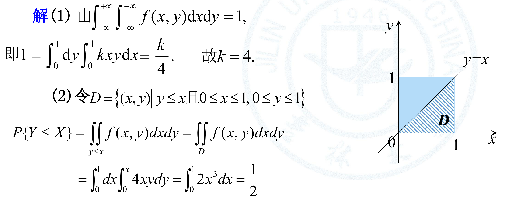

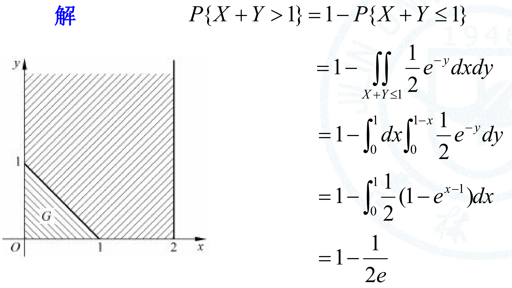

最后这道和 22-八的结构最接近：非零区域是一根竖条，事件区域是一条斜线下方，交集只剩左下角的三角形。直接求 $P\{X+Y>1\}$ 要积竖条剩下的无界部分，用对立事件只积三角形，省事得多。

### 极值分布（ $X_1,X_2$ 独立）

| 变量 | 分布函数 |
| --- | --- |
| $\max\{X_1,X_2\}$ | $F_1(x)F_2(x)$ |
| $\min\{X_1,X_2\}$ | $1-[1-F_1(x)][1-F_2(x)]$ |

真题：22-选3（min）、23-填2（max，离散）。

### 易错点

- 事件条件概率 $P\{X<2\mid Y<1\}$ 用 $\frac{P\{X<2,Y<1\}}{P\{Y<1\}}$，条件密度 $f_{X\mid Y}(x\mid y)$ 针对的是 $Y=y$ 这个零概率事件，两者别混。
- 求边缘密度时积分限要按非零区域写，22-八里 $x$ 只在 $(0,1)$ 上积分。

## 4. 数字特征

### 公式

- $E(aX+bY+c)=aE(X)+bE(Y)+c$； $X,Y$ 独立时 $E(XY)=E(X)E(Y)$。
- $D(aX+bY+c)=a^2D(X)+b^2D(Y)+2ab\,\mathrm{Cov}(X,Y)$（22-填3）。
- $\mathrm{Cov}(X,Y)=E(XY)-E(X)E(Y)$； $\mathrm{Cov}(X,aX+b)=aD(X)$（23-选3）。
- $\rho_{XY}=\dfrac{\mathrm{Cov}(X,Y)}{\sqrt{D(X)D(Y)}}$（22-七）。
- ** $E(X^2)=D(X)+[E(X)]^2$**：两年里用了三次（22-六、23-填3、23-七），要背熟。

### 方法

- 离散型无穷级数求期望（22-填2）：先看是不是认识的分布（几何分布），认不出再用 $\sum kx^{k-1}=\frac1{(1-x)^2}$。
- 0-1 变量： $E(X)=P\{X=1\}$， $E(XY)=P\{X=1,Y=1\}$，算相关系数很快。

## 5. 大数定律与中心极限定理

| 工具 | 公式 | 真题 |
| --- | --- | --- |
| 切比雪夫不等式 | $P\{\lvert X-EX\rvert<\varepsilon\}\ge1-\dfrac{DX}{\varepsilon^2}$ | 22-填4、23-填4 |
| 独立同分布中心极限定理 | $\dfrac{\sum X_i-n\mu}{\sqrt n\,\sigma}\overset{\text{近似}}{\sim}N(0,1)$ | 22-选4、23-五 |

做题步骤：先求单个 $X_i$ 的均值、方差；再求和的均值 $n\mu$、标准差 $\sqrt n\sigma$；标准化后查 $\Phi$。

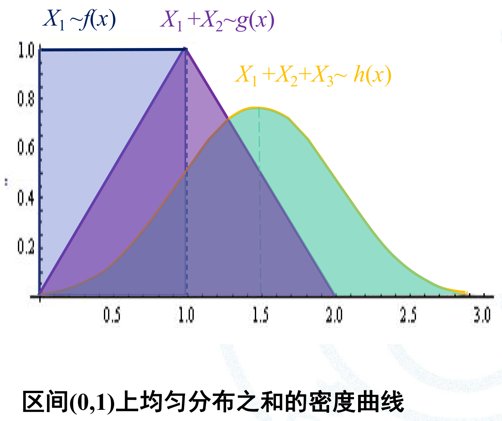

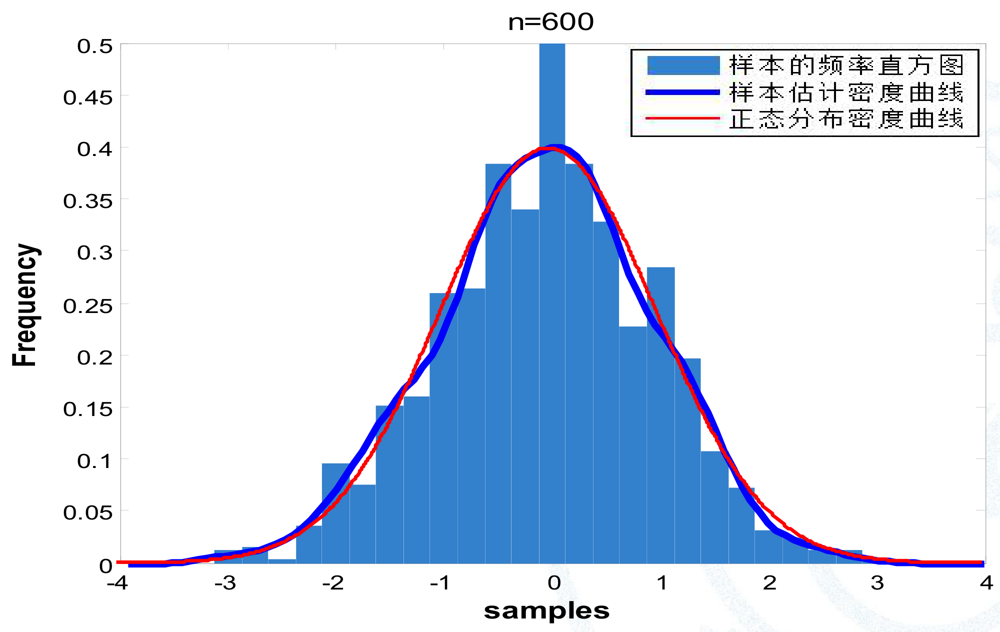

两张图分别对应两道真题：23-五是连续型变量相加（指数分布），22-选4 是 0-1 变量相加，也就是二项分布。

易错点：标准化除以标准差，不是方差（22-选4 的干扰项 $\Phi(0.2)$ 就是除以方差 25 得到的）。切比雪夫不等式要先确认区间关于期望对称。

## 6. 抽样分布

### 三大分布的构造

| 分布 | 构造 |
| --- | --- |
| $\chi^2(n)$ | $n$ 个独立标准正态变量的平方和 |
| $t(n)$ | $\dfrac{Z}{\sqrt{\chi^2(n)/n}}$， $Z\sim N(0,1)$ 与 $\chi^2(n)$ 独立 |
| $F(n_1,n_2)$ | $\dfrac{\chi^2(n_1)/n_1}{\chi^2(n_2)/n_2}$，分子分母独立 |

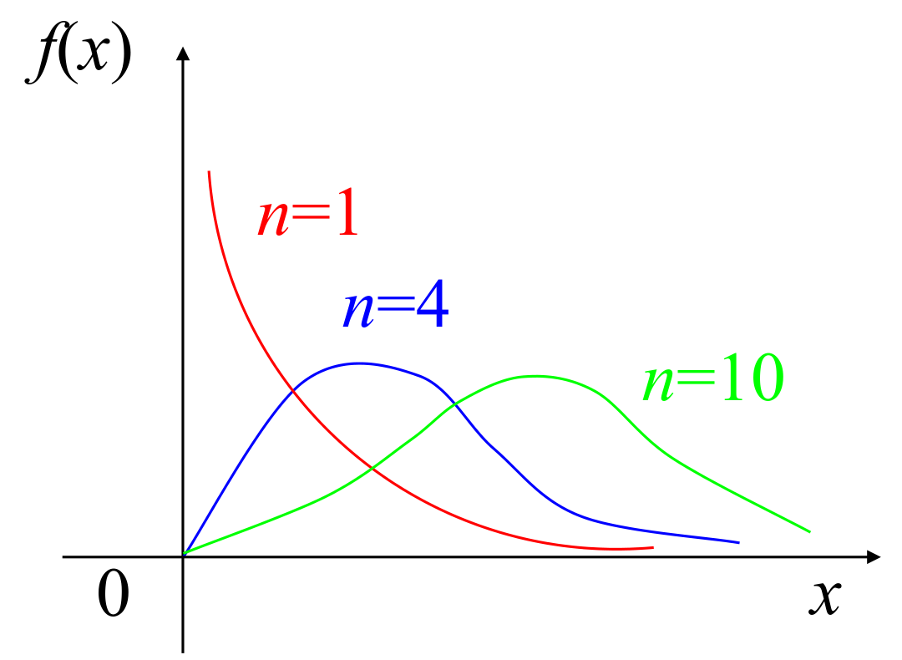

这张图是示意图，形状对，高度不准。 $\chi^2(n)$ 的峰在 $x=n-2$ 处（ $n\ge2$），Python 算得 $n=4$ 的峰高 0.184， $n=10$ 的峰高只有 0.098，大约是前者的一半，图里两峰画得差不多高。自由度越大曲线越矮越宽，均值 $n$、方差 $2n$ 都随 $n$ 增大。

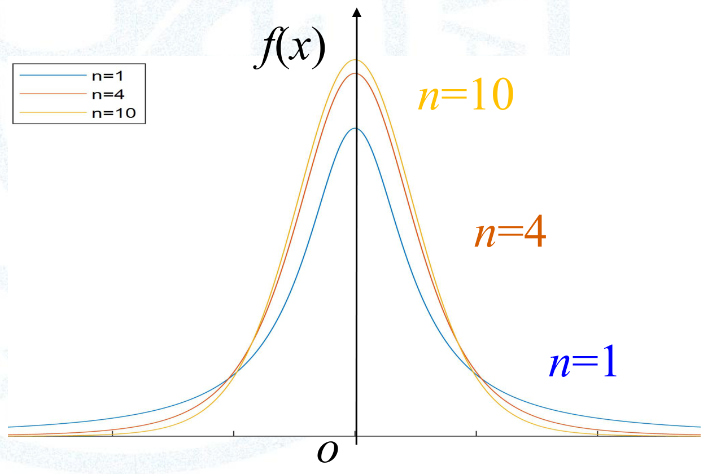

$t$ 分布和标准正态一样关于 0 对称，所以 $-t_\alpha(n)=t_{1-\alpha}(n)$，查表只查右尾。尾巴比正态厚，同一个 $\alpha$ 下 $t_{\alpha/2}(n-1)$ 比 $u_{\alpha/2}$ 大，例如 $t_{0.025}(8)=2.306>1.96$。 $\sigma$ 未知时用 $S$ 代替，多出来的不确定性就体现在这里，置信区间因此更宽。

### 单个正态总体的四个结论

设 $X_1,\cdots,X_n$ 来自 $N(\mu,\sigma^2)$：

1. $\bar X\sim N(\mu,\frac{\sigma^2}n)$，即 $\dfrac{\bar X-\mu}{\sigma/\sqrt n}\sim N(0,1)$；
2. $\dfrac{(n-1)S^2}{\sigma^2}=\dfrac{\sum(X_i-\bar X)^2}{\sigma^2}\sim\chi^2(n-1)$，且 $\bar X$ 与 $S^2$ 独立；
3. $\dfrac{\bar X-\mu}{S/\sqrt n}\sim t(n-1)$；
4. $\dfrac{\sum(X_i-\mu)^2}{\sigma^2}\sim\chi^2(n)$。

真题：22-选5（D 把 $n-1$ 写成 $n$）、23-选5（识别 $\chi^2(n)$）。23-七用到 $E(S^2)=\sigma^2$。

记法：**用 $\mu$ 的是 $n$ 个自由度，用 $\bar X$ 的是 $n-1$ 个自由度； $\sigma$ 已知用正态， $\sigma$ 换成 $S$ 用 $t$**。

## 7. 参数估计

### 矩估计

步骤：求 $E(X)$（含参数）；令 $E(X)=\bar X$；解出参数。一个参数只用一阶矩，两个参数再加二阶矩。

真题：22-填5（分段密度）、23-六（离散总体，给样本值求估计值）。

### 最大似然估计

步骤：

1. 写似然函数 $L(\theta)=\prod f(x_i;\theta)$，离散总体就是各观测值概率的乘积；
2. 取对数 $\ln L(\theta)$；
3. 求导令零 $\frac{d\ln L}{d\theta}=0$；
4. 解出 $\hat\theta$。

真题：22-九（先由分布函数求密度，结果 $\hat\theta=\sqrt[m]{\frac1n\sum x_i^m}$）、23-六（ $L=2\theta^5(1-\theta)^3$， $\hat\theta=\frac58$）。

形如 $\theta^a(1-\theta)^b$ 的似然函数，最大值点直接是 $\frac{a}{a+b}$，可以用来验算。

### 无偏性

$\hat\theta$ 是 $\theta$ 的无偏估计 $\iff E(\hat\theta)=\theta$。

真题：22-六（ $C\sum(X_{i+1}-X_i)^2$，得 $C=\frac1{2(n-1)}$）、23-选6（系数和为 1）、23-七（样本函数的期望）。

### 区间估计（单个正态总体）

| 待估参数 | 条件 | 枢轴量 | $1-\alpha$ 置信区间 |
| --- | --- | --- | --- |
| $\mu$ | $\sigma^2$ 已知 | $\frac{\bar X-\mu}{\sigma/\sqrt n}\sim N(0,1)$ | $\bar X\pm u_{\alpha/2}\frac{\sigma}{\sqrt n}$ |
| $\mu$ | $\sigma^2$ 未知 | $\frac{\bar X-\mu}{S/\sqrt n}\sim t(n-1)$ | $\bar X\pm t_{\alpha/2}(n-1)\frac{S}{\sqrt n}$ |
| $\sigma^2$ | $\mu$ 未知 | $\frac{(n-1)S^2}{\sigma^2}\sim\chi^2(n-1)$ | $\left(\frac{(n-1)S^2}{\chi^2_{\alpha/2}(n-1)},\frac{(n-1)S^2}{\chi^2_{1-\alpha/2}(n-1)}\right)$ |

两年只考了第一行（22-选6、23-填5）；后两行两年都没考，列出来备查。

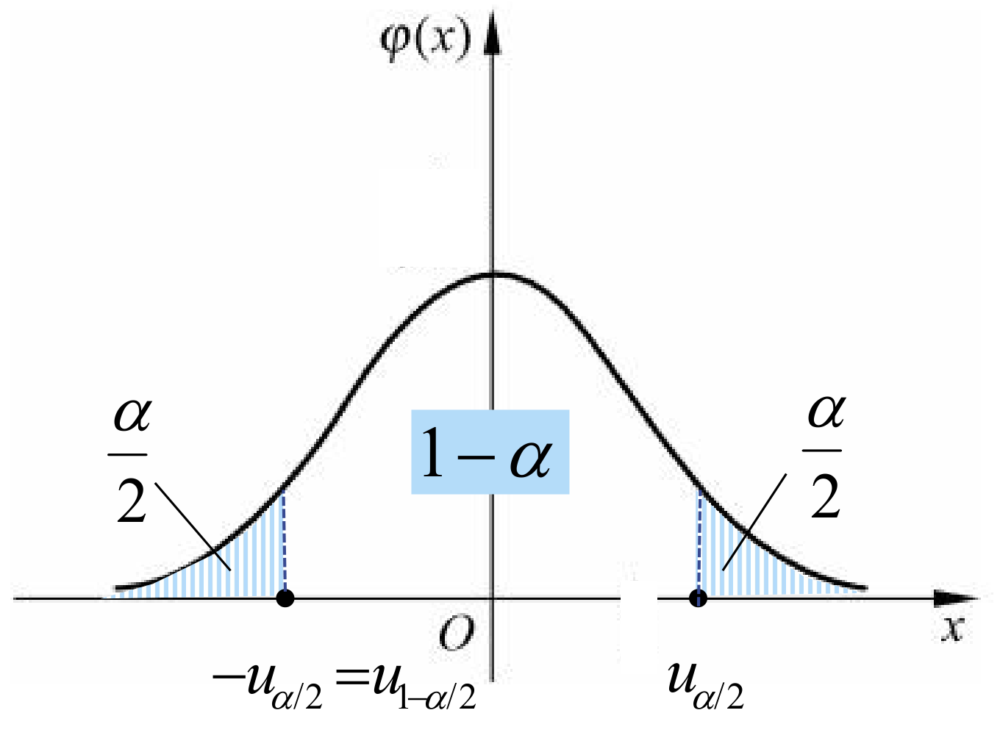

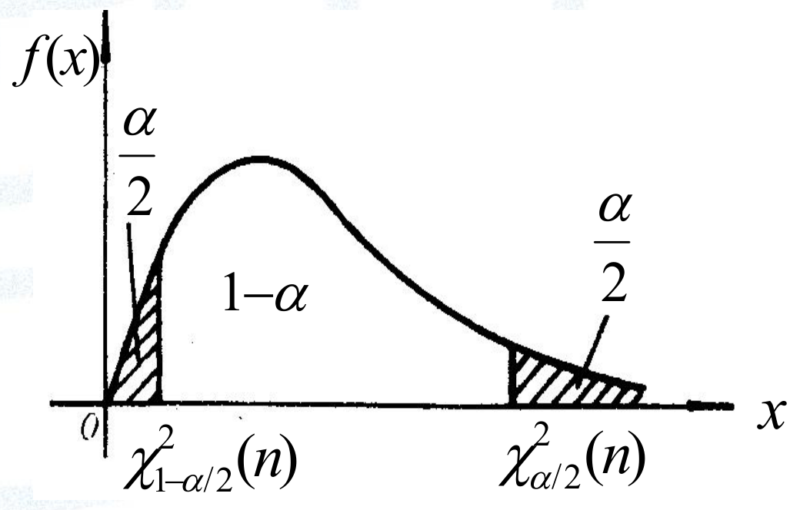

第三行这张图的横轴标注写的是 $\chi^2_{1-\alpha/2}(n)$、 $\chi^2_{\alpha/2}(n)$，套用到 $\mu$ 未知的 $\sigma^2$ 区间时，自由度要读成 $n-1$，和表里的公式一致。卡方曲线不对称，两个分位点离峰的距离不同，所以区间也不是以 $S^2$ 为中心对称的。注意大的分位点 $\chi^2_{\alpha/2}$ 放在区间下限的分母上。

由区间长度定样本容量（23-填5）： $L=2u_{\alpha/2}\frac{\sigma}{\sqrt n}\le L_0$，解出 $n$ 后向上取整。

## 8. 假设检验

| 检验 | 条件 | 统计量（ $H_0$ 下的分布） | 双侧拒绝域 |
| --- | --- | --- | --- |
| $H_0:\mu=\mu_0$ | $\sigma^2$ 已知 | $U=\frac{\bar X-\mu_0}{\sigma/\sqrt n}\sim N(0,1)$ | $\lvert U\rvert\ge u_{\alpha/2}$ |
| $H_0:\mu=\mu_0$ | $\sigma^2$ 未知 | $t=\frac{\bar X-\mu_0}{S/\sqrt n}\sim t(n-1)$ | $\lvert t\rvert\ge t_{\alpha/2}(n-1)$ |
| $H_0:\sigma^2=\sigma_0^2$ | $\mu$ 未知 | $\chi^2=\frac{(n-1)S^2}{\sigma_0^2}\sim\chi^2(n-1)$ | $\chi^2\ge\chi^2_{\alpha/2}(n-1)$ 或 $\chi^2\le\chi^2_{1-\alpha/2}(n-1)$ |

两年都只考了第二行，一年问拒绝域（22-填6），一年问统计量（23-填6）。单侧检验把 $\alpha/2$ 换成 $\alpha$，拒绝域开口朝备择假设的方向。

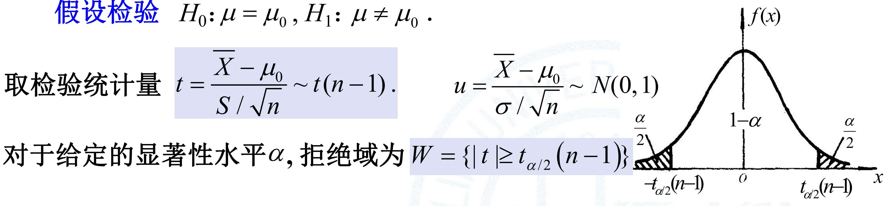

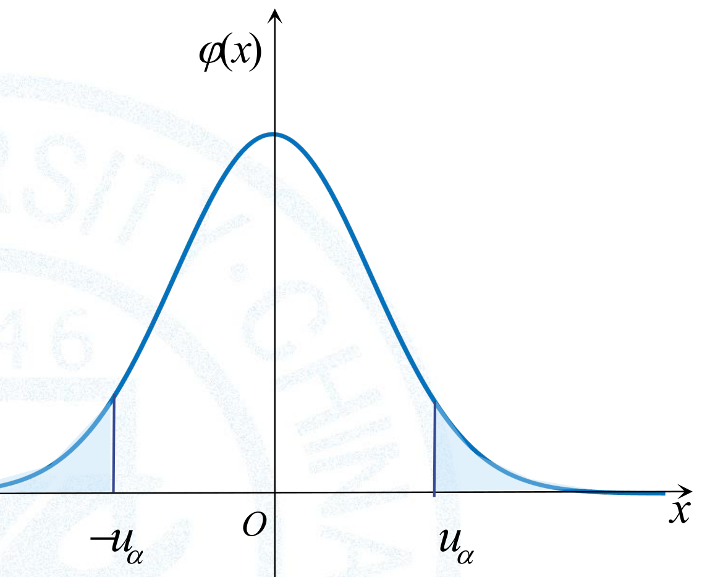

下面那张图把两种单侧检验画在同一条曲线上，实际做题时只取其中一侧：$H_1:\mu<\mu_0$ 用左尾，$H_1:\mu>\mu_0$ 用右尾。单侧的临界值是 $u_\alpha$（如 1.645），双侧是 $u_{\alpha/2}$（如 1.96），别混。

## 9. 常用数值

下表用 Python 计算（正态分布用 `math.erf`，t 分布和 $\chi^2$ 分布用 sympy 的不完全 Beta、不完全 Gamma 函数再二分反解），和通用分位数表上的数相同。 $u_\alpha$、 $t_\alpha(n)$、 $\chi^2_\alpha(n)$ 都是上 $\alpha$ 分位点。

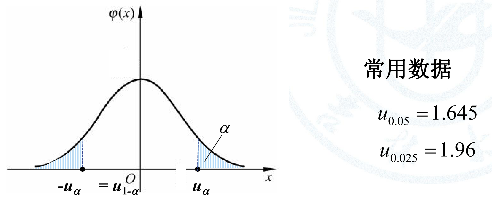

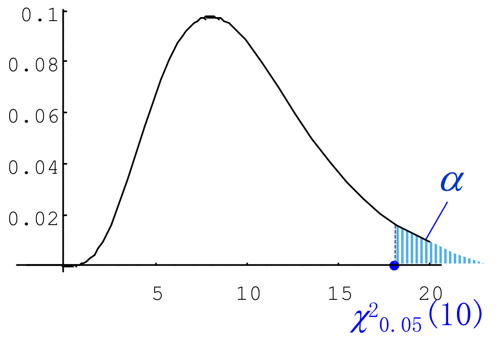

卡方分布不对称，没有 $-u_\alpha=u_{1-\alpha}$ 这样的关系，左尾分位点要单独查 $\chi^2_{1-\alpha/2}(n)$，所以下表的两列 $\chi^2_{0.975}$ 和 $\chi^2_{0.025}$ 数值相差很远。图中分位点的位置和 Python 复算的 $\chi^2_{0.05}(10)=18.307$ 一致。

| 量 | 值 |
| --- | --- |
| $\Phi(0.8)$ | 0.7881（23-五题目给出） |
| $\Phi(1)$ | 0.8413 |
| $\Phi(1.5)$ | 0.9332 |
| $\Phi(2)$ | 0.9772 |
| $u_{0.05}$ | 1.645 |
| $u_{0.025}$ | 1.960 |
| $u_{0.005}$ | 2.576 |

| 自由度 | $t_{0.05}$ | $t_{0.025}$ | $\chi^2_{0.975}$ | $\chi^2_{0.025}$ |
| --- | --- | --- | --- | --- |
| 8 | 1.8595 | 2.3060 | 2.180 | 17.535 |
| 15 | 1.7531 | 2.1314 | 6.262 | 27.488 |
| 24 | 1.7109 | 2.0639 | | |

两年试卷里需要查表的只有 $u_{0.025}=1.96$（23-填5）和题目直接给出的 $\Phi(0.8)$；其余数值供做习题时用。
