# 02 复杂度推导速查

整理自 `笔记/算法整理.pdf` 的"时间复杂度整理"一节（第 7 到 10 页），补上了推导过程。表里的数值结论都用 Python 跑过小规模实例核对，核对方式写在各节末尾。

## 记号运算

这几条是导引章随堂测试的原题，记住三件事就够：

| 式子 | 结论 | 说明 |
| --- | --- | --- |
| $\Theta(f)+\Theta(g)=\Theta(f+g)$ | 对 | 两个上下界都加起来 |
| $\Theta(f)+\Theta(g)=\Theta(\max(f,g))$ | 对 | $f+g$ 与 $\max(f,g)$ 同阶 |
| $\Theta(f)+\Theta(g)=\Theta(\min(f,g))$ | 错 | 和的阶由大的那个定 |
| $\Omega(cf)=\Omega(f)$， $c>0$ 为常数 | 对 | 常数因子吸收进 $\Omega$ 的常数里 |
| 已知 $g=\Omega(f)$，则 $\Omega(f)+\Omega(g)=\Omega(f)$ | 对 | 见下面一段 |
| 已知 $g=\Omega(f)$，则 $\Omega(f)+\Omega(g)=\Omega(g)$ | 对 | 同上 |

最后两条同时成立不是出题人写错了。渐进等式是单向读的：左边每个函数都属于右边这个集合。取 $a\in\Omega(f)$、 $b\in\Omega(g)$，则 $a+b\ge c_1 f$，所以 $a+b\in\Omega(f)$；同时 $a+b\ge c_2 g$，所以 $a+b\in\Omega(g)$。两句话都对。

量级排序，非多项式那一行常考：

$$O(1) < O(\log n) < O(n) < O(n\log n) < O(n^2) < O(n^3) < O(2^n) < O(n!) < O(n^n)$$

随堂测试的排序题给了 $n!$、 $n^3$、 $2^n$、 $n^2\log n$ 四项，升序是 $n^2\log n < n^3 < 2^n < n!$，答案 DBCA。 $n=10$ 时 $n^3=1000$ 和 $2^n=1024$ 挨得很近，但从 $n=11$ 起 $2^n$ 就甩开了，取对数比较最稳： $3\log n$ 对 $n\log 2$，后者是线性增长。

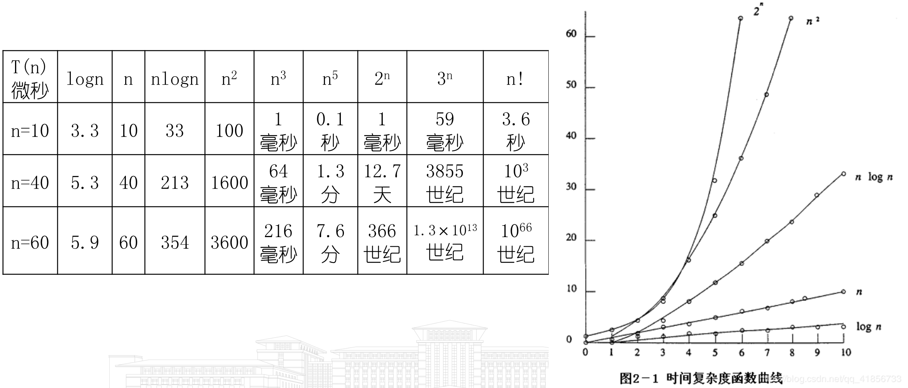

这张表有两列数要改着读。按 1 微秒一次运算算， $40^5$ 微秒约 1.7 分钟、 $60^5$ 微秒约 13 分钟，表里写成 1.3 分和 7.6 分；40! 微秒约 $2.6\times10^{32}$ 世纪，表里的 $10^3$ 丢了指数的后一位。其余各格用 Python 复算都对得上。趋势不受影响：多项式那几列到 $n=60$ 还在分钟以内，指数和阶乘那几列已经是世纪。

## 分治递推式怎么解

考试要求写递推表达式，所以推导过程比结论重要。 $T(n)=aT(n/b)+f(n)$ 的展开法：

$$T(n)=a^{\log_b n}T(1)+\sum_{k=0}^{\log_b n-1}a^k f(n/b^k)$$

其中 $a^{\log_b n}=n^{\log_b a}$。只要比较 $n^{\log_b a}$ 和 $f(n)$ 哪个大：

- $f(n)$ 比 $n^{\log_b a}$ 低阶，结果是 $\Theta(n^{\log_b a})$，代价集中在叶子。
- 两者同阶，结果是 $\Theta(n^{\log_b a}\log n)$。
- $f(n)$ 更高阶（且满足正则条件），结果是 $\Theta(f(n))$，代价集中在根。

课程里出现的四个递推式：

| 算法 | 递推式 | 解 | 属于哪种情况 |
| --- | --- | --- | --- |
| 二分查找 | $T(n)=T(n/2)+O(1)$ | $O(\log n)$ | $a=1,b=2$，两者同阶 |
| 归并排序 | $T(n)=2T(n/2)+O(n)$ | $O(n\log n)$ | $n^{\log_2 2}=n$，与 $f(n)$ 同阶 |
| 朴素分治矩阵乘法 | $T(n)=8T(n/2)+dn^2$ | $\Theta(n^3)$ | $n^{\log_2 8}=n^3$ 压过 $n^2$ |
| 斯特拉森 | $T(n)=7T(n/2)+O(n^2)$ | $O(n^{\log_2 7})=O(n^{2.81})$ | $n^{\log_2 7}\approx n^{2.807}$ 压过 $n^2$ |

斯特拉森的边界是 $T(2)=O(1)$（原式里写作常数 $b$），改进前是 $T(2)=b,\ T(n)=8T(n/2)+dn^2$。核心是把 $2\times2$ 分块的 8 次子矩阵乘法降到 7 次，加法次数从 4 次涨到 18 次，所以只有 $n$ 足够大才划算。

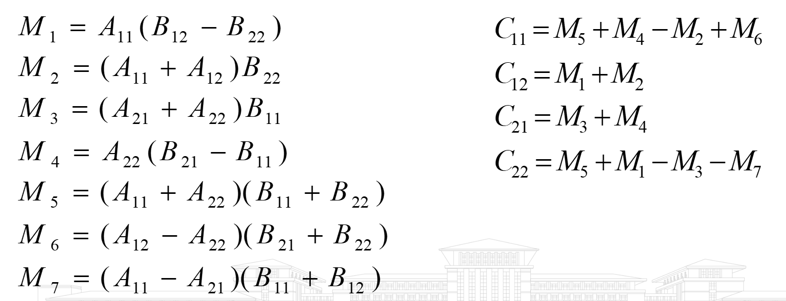

这组公式用随机 $2\times2$ 分块矩阵代入核对过，四个 $C_{ij}$ 都和直接分块相乘的结果一致。7 次乘法对应递推式里的系数 7，10 加 8 就是上面说的 18 次加法。

核对：把两个递推式在 $T(1)=1$ 下展开到 $n=4096$， $8T(n/2)+n^2$ 得 $1.37\times10^{11}$，拟合指数 $\log_n T=3.083$； $7T(n/2)+n^2$ 得 $3.23\times10^{10}$，拟合指数 $2.909$。两者都从上方收敛到理论值 3 和 2.807，慢收敛是低阶项 $n^2$ 造成的。

## 第 4 章 分治

| 问题 | 时间复杂度 | 备注 |
| --- | --- | --- |
| 二分查找 | 平均 $O(\log n)$ | 最坏也是 $O(\log n)$，是最坏情况下的最优算法 |
| 归并排序 | 平均 $O(n\log n)$ | 比较次数实测约 $0.9\,n\log_2 n$ |
| 斯特拉森矩阵乘法 | $O(n^{\log_2 7})$，即 $O(n^{2.81})$ | 朴素分治和蛮力都是 $\Theta(n^3)$ |
| 二维极大点 | $O(n\log n)$ | 预排序之后才能降到这个量级 |

二维极大点的划分与合并过程如下图。竖线 L 是按 $x$ 取的中位线，左右两半 $S_L$、 $S_R$ 各自递归求出极大点（方框里的点）。合并时取 $S_R$ 里 $y$ 最大的极大点 P8，把 $S_L$ 中 $y$ 比它小的极大点删掉，图里画红圈的 P3 就是这样被去掉的，最后剩 P1、P2、P8、P9、P10。

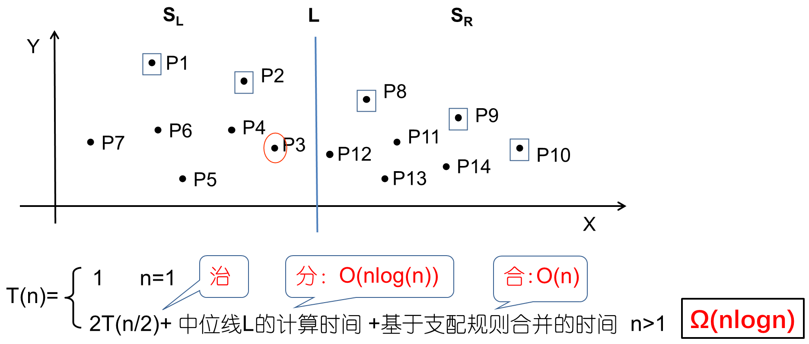

图下方的递推式要这样读：如果每层都重新排序求中位线，一层就要 $O(n\log n)$，整体是 $T(n)=2T(n/2)+O(n\log n)=O(n\log^2 n)$，框里的 $\Omega(n\log n)$ 只说明它不会低于这个量级。先按 $x$ 预排序一次，之后每层取中位线只要 $O(1)$，递推式变成 $2T(n/2)+O(n)$，才降到表里的 $O(n\log n)$。

下界：以比较为基础的检索算法是 $\Omega(\log n)$，以比较为基础的分类算法是 $\Omega(n\log n)$。（更正：原文的"4 分治"一节把检索的下界写成 $O(\log n)$ 并自己标了"存在疑问"；下界用 $\Omega$。）

三分查找为什么更差：每层要两次比较来确定落在哪三分之一，层数是 $\log_3 n$，总比较次数 $2\log_3 n=\frac{2}{\log_2 3}\log_2 n\approx 1.262\log_2 n$，比二分的 $\log_2 n$ 多两成半。实测 $n=10^6$ 时二分最坏 20 次，三分最坏 26 次。

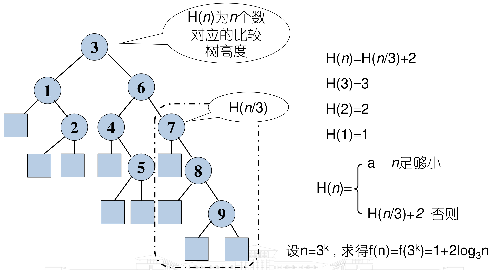

树高就是最坏比较次数。每往下走一个 $n/3$ 的子问题要花 2 层，这就是递推式里那个 $+2$ 的来历。

核对：随机数组跑归并排序， $n=4096$ 时比较 43970 次， $n\log_2 n=49152$，比值 0.895，符合 $\Theta(n\log n)$。

归并排序的递推式 $T(n)=2T(n/2)+O(n)$ 画成调用树就是下面这样。每层的 MERGE 加起来处理 $n$ 个元素，树高 $\lceil\log_2 n\rceil$，乘起来得到 $O(n\log n)$。

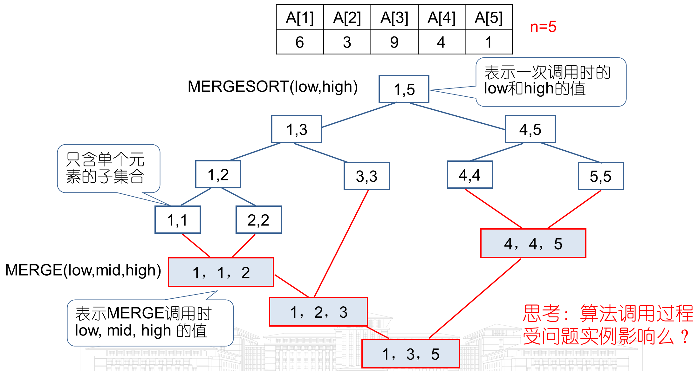

## 第 5 章 贪心

| 问题 | 时间复杂度 | 备注 |
| --- | --- | --- |
| 分数背包 | $O(n)$ | 不计预排序。算上排序是 $O(n\log n)$ |
| 带期限作业调度（朴素 JS） | $O(n^2)$ | 每次插入都要重排并检验一遍 |
| 带期限作业调度（集合树优化） | 接近 $O(n)$ | 并查集找可用时间槽，摊还近似常数 |
| 最小生成树，按边计 | $O(e\log e)$ | Kruskal 的主要代价是边排序 |
| 最小生成树，按点计 | $O(n^2\log n)$ | 由上一行代入 $e$ 的上界得到 |

按点那一行的推导：连通无向图边数最多 $n(n-1)/2=O(n^2)$，代入 $O(e\log e)$ 得 $O(n^2\log n^2)=O(n^2\cdot 2\log n)=O(n^2\log n)$。常数 2 吸收掉。

Kruskal 的代价为什么集中在排序，看一个 5 个顶点、8 条边的例子就清楚了。边按权值排好之后，算法只是从头往后扫：AE 50、CD 60、BC 70 直接加入；BD 75 会和 BC、CD 成环，放弃；AD 80 加入后已有 4 条边，生成树完成，后面的 ED、BE、AC 不用再看。扫描本身至多 $e$ 步，每步查一次是否成环，比排序便宜。

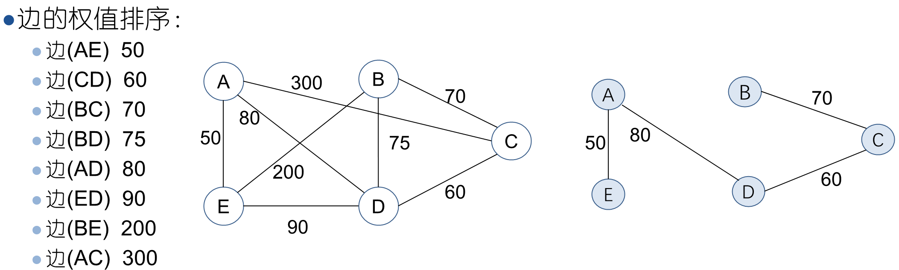

带期限作业调度的核对：把朴素 JS、并查集版 JS 和穷举三种写法在 1500 组随机实例（ $n\le 7$）上比对，效益值全部一致。示例 $p=(100,10,15,27)$、 $d=(2,1,2,1)$ 三者都得 127。

集合树版本快在哪里，看作业讲解第四题的逐步展开。实例是 $n=7$， $p=(40,12,30,20,7,15,10)$， $d=(2,4,4,3,2,1,6)$，按效益降序依次考虑作业 1、3、4、6、2、7、5，时间片 $b=\min\{n,\max d_i\}=6$。 $F(i)$ 记录"期限为 $i$ 的作业当前能用的最晚空时间片"，每个时间片起初自成一棵树（根上的 $-1$ 是负的结点数）。放入一个作业就用 FIND 找到 $F(\min(n,d_j))$ 所在树的根，把这个时间片分给它，再和前一个时间片所在的树 UNION。 $F$ 等于 0 表示已经没有空位，作业舍弃。

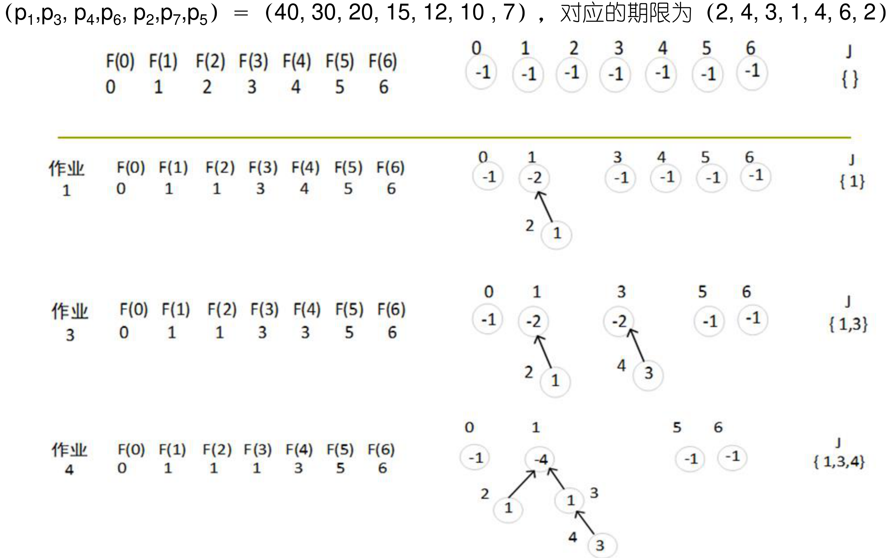

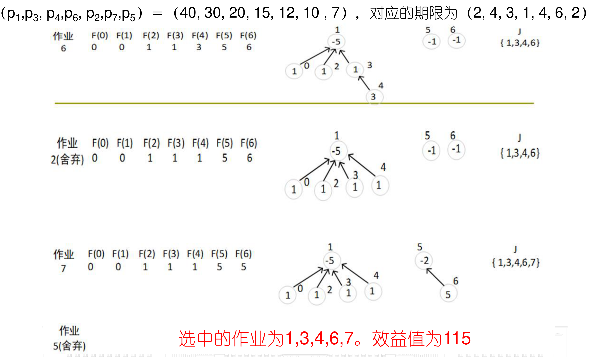

这个结果用穷举复核过，7 个作业的所有可行子集里最大效益就是 $40+30+20+15+10=115$。每个作业只做一次 FIND 和至多一次 UNION，这就是"接近 $O(n)$"的来源。

## 第 6 章 动态规划

| 问题 | 时间复杂度 | 空间复杂度 |
| --- | --- | --- |
| 多段图（向前处理法） | $\Theta(n+e)$ | $\Theta(n+e)$ |
| 货郎担 | $\Theta(n^2 2^n)$ | $\Theta(n2^n)$ |
| 0/1 背包，二维数组 | $\Theta(nM)$ | $\Theta(nM)$ |
| 0/1 背包，一维数组 | $\Theta(nM)$ | 只要最优值 $\Theta(M)$；要最优决策序列 $\Theta(nM)$ |
| 0/1 背包，序偶对法 | $O(\min\{2^n,\ n\sum_{1\le j\le n}P_j,\ nM\})$ | $O(2^n)$ |
| 最优二分检索树，朴素 | $O(n^3)$ | $O(n^2)$ |
| 最优二分检索树，Knuth 优化 | $O(n^2)$ | $O(n^2)$ |

多段图的 $\Theta(n+e)$：图用邻接表存，每条边在向前处理法里只被松弛一次，每个结点只算一次 $COST$。递推式 $COST(i,j)=\min_l\{c(j,l)+COST(i+1,l)\}$， $l$ 取 $j$ 在第 $i+1$ 段的后继。空间除了邻接表还要 $COST$、 $D$、 $P$ 三个数组，都是 $\Theta(n)$，合起来仍是 $\Theta(n+e)$。

作业讲解里的 8 结点实例把向前处理的顺序演示得很清楚：从汇点 8 往回，先定最后一段的 COST(5)、COST(6)、COST(7)，再算第二段，最后算源点。每个 COST 只看自己的出边，每条边只用一次。

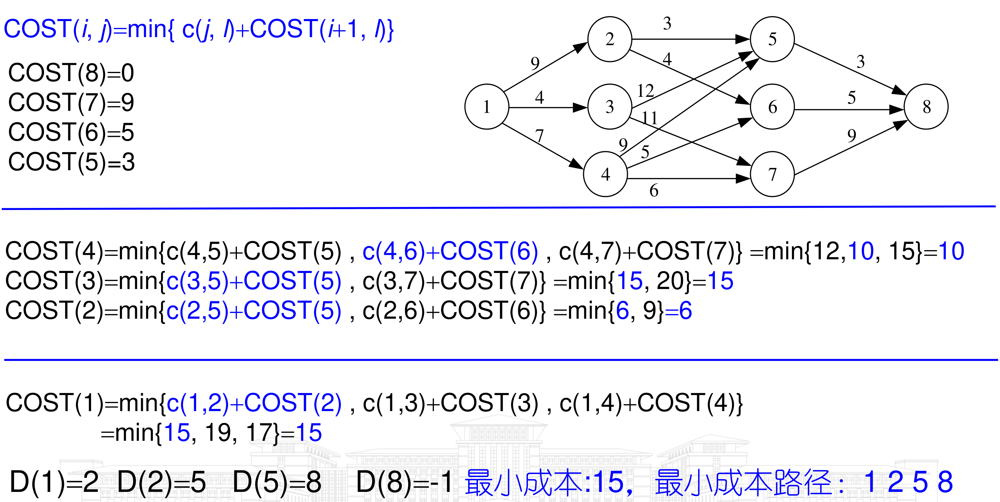

货郎担的 $\Theta(n^22^n)$：状态是"当前在城市 $i$，还剩集合 $S$ 没走"， $i$ 有 $n$ 种取法， $S$ 有 $2^{n-1}$ 种取法，状态数 $\Theta(n2^n)$；每个状态枚举下一站 $j\in S$，转移代价 $O(n)$。乘起来 $\Theta(n^22^n)$。递推式：

$$g(i,S)=\min_{j\in S}\{c_{ij}+g(j,S\setminus\{j\})\},\qquad g(i,\varnothing)=c_{i1},\ 1<i\le n$$

核对：按这个递推式实现后， $n=5$ 和 $n=8$ 的结果与全排列穷举完全一致； $n=11$ 时实际生成 5120 个状态、23050 次转移，和 $n2^{n-1}=11264$、 $n^22^n=247808$ 的上界同阶（实际值更小是因为只枚举了 $i\notin S$ 的合法组合）。

课件里 4 个城市的实例按 $|S|$ 从小到大填表，下图是 $|S|=2$ 和 $|S|=3$ 两层（ $|S|=0$ 层就是 $g(i,\varnothing)=c_{i1}$，即 5、6、8； $|S|=1$ 层是 $g(2,\{3\})=15$、 $g(2,\{4\})=18$、 $g(3,\{2\})=18$、 $g(3,\{4\})=20$、 $g(4,\{2\})=13$、 $g(4,\{3\})=15$）。

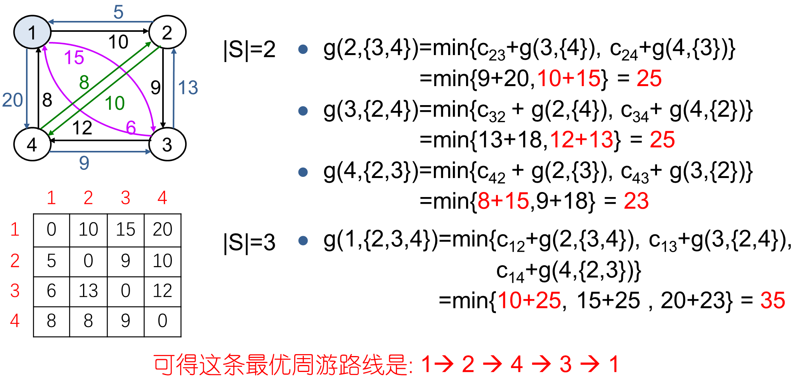

对 3 个中间城市的 6 种排列穷举，最短也是 35，路线同为 $1\to2\to4\to3\to1$（ $10+10+9+6$）。

0/1 背包的递推式和边界：

$$f_i(X)=\max\{f_{i-1}(X),\ f_{i-1}(X-w_i)+p_i\},\qquad f_0(X)=\begin{cases}-\infty & X<0\\ 0 & X\ge 0\end{cases}$$

为什么 $\Theta(nM)$ 仍算指数阶： $M$ 是数值不是规模。输入里写下 $M$ 只需要 $m=\lceil\log_2 M\rceil$ 位，所以 $\Theta(nM)=\Theta(n2^m)$，对真实输入长度 $m$ 是指数的。这叫伪多项式时间，0/1 背包因此是 NPC。直观感受： $n=100$ 时 $M=2^{10}$ 表格只有 10 万格， $M=2^{30}$ 就涨到 1074 亿格，而输入长度只从 10 位变到 30 位。

序偶对法的界取的是三项的最小值，所以就数量级而言它不会比迭代法的 $\Theta(nM)$ 差，"迭代法优于序偶对法"这句话是错的。

序偶对法省在哪里，看同一个 $n=3$ 实例就明白。每加入一件物品，就把上一个集合整体平移 $(p_i,w_i)$ 得到 $S^i_1$，再和 $S^{i-1}$ 合并。重量超过 $M$ 的序偶直接扔掉，效益不高、重量反而更大的序偶被支配规则删掉，所以 $|S^i|$ 往往远小于 $2^i$，也不会超过 $M+1$。

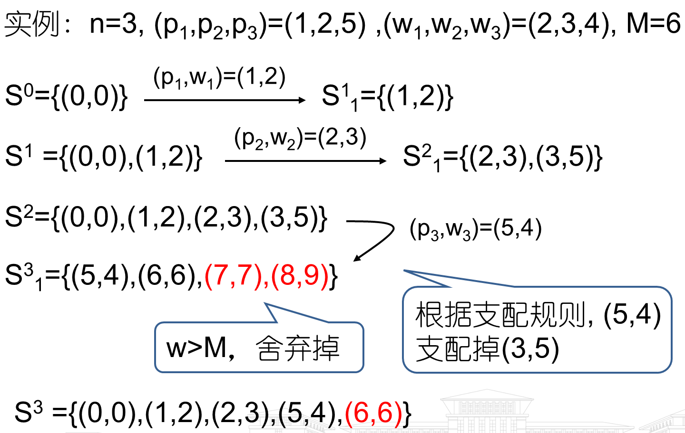

最优二分检索树：朴素做法对每个区间 $(i,j)$ 枚举根 $k\in(i,j]$，区间有 $O(n^2)$ 个、每个枚举 $O(n)$ 个根，共 $O(n^3)$。Knuth 优化用单调性 $R(i,j-1)\le k\le R(i+1,j)$ 把根的枚举范围缩到一段，同一条对角线上各区间的枚举范围首尾相接，总量降到 $O(n^2)$。

核对：两种实现在 $n=8,16,32,64$ 的随机频率上代价完全相同。内层枚举次数： $n=64$ 时朴素 45760 次（ $n^3/6=43690$），Knuth 4235 次（ $n^2=4096$），比值随 $n$ 增大而拉开，符合降一阶。

作业讲解第五题是一个能手推的完整实例：标识符 (end, goto, print, stop)，概率乘 20 化成整数后 $P=(1,4,2,1)$、 $Q=(4,2,4,1,1)$。三张上三角矩阵按对角线从主对角线往右上填， $W(i,j)=W(i,j-1)+P(j)+Q(j)$， $C(i,j)=\min_{i<k\le j}\{C(i,k-1)+C(k,j)\}+W(i,j)$， $R(i,j)$ 记下取到最小值的 $k$。

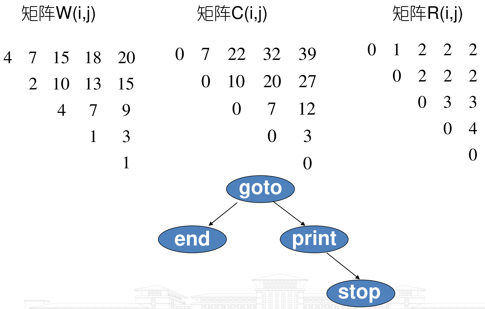

三张矩阵用 Python 按上面的递推式重算过，每一格都一致。最小代价 39 是乘了 20 之后的值，换回概率就是 $39/20=1.95$。

0/1 背包 DP 表长这样（ $p=(1,2,5,6)$， $w=(2,3,4,5)$， $M=8$），考试手推时按行从上往下填：

```
   X:    0   1   2   3   4   5   6   7   8
f0 :     0   0   0   0   0   0   0   0   0
f1 :     0   0   1   1   1   1   1   1   1
f2 :     0   0   1   2   2   3   3   3   3
f3 :     0   0   1   2   5   5   6   7   7
f4 :     0   0   1   2   5   6   6   7   8
```

最优值是 $f_4(8)=8$。回溯决策序列的方法：比较 $f_i(X)$ 和 $f_{i-1}(X)$，相等说明第 $i$ 件没选，不等说明选了、容量退回 $X-w_i$。这里 $f_4(8)=8\ne f_3(8)=7$，第 4 件选中，退到 $f_3(3)=2$； $f_3(3)=f_2(3)=2$，第 3 件没选； $f_2(3)=2\ne f_1(3)=1$，第 2 件选中，退到 $f_1(0)=0$； $f_1(0)=f_0(0)$，第 1 件没选。最优解是选第 2、4 件， $p=2+6=8$， $w=3+5=8$ 刚好装满。穷举 16 种组合核对，最优值也是 8。

课件用的是一个更小的实例，回溯的走法一模一样，红色箭头就是比较 $F(i,X)$ 和 $F(i-1,X)$ 后往上走或往左上跳的路线。

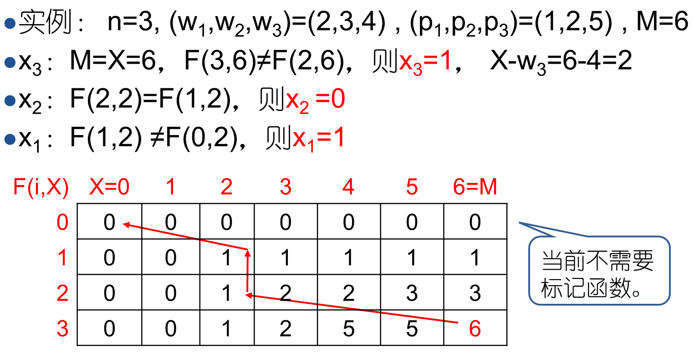

## 第 7 章 回溯

回溯法的复杂度取决于**实际生成的结点个数**，下面给的都是最坏情况（限界函数完全不起作用时的解空间树规模）。

| 问题 | 最坏情况 | 备注 |
| --- | --- | --- |
| n-皇后 | $O(n!)$ | 用了"同列不重复"这条隐式约束 |
| n-皇后，不用任何隐式约束 | $O(n^n)$ | 填空题考过这个限定 |
| 子集和数 | $O(2^n)$ | 定长元组是完全二叉树 |
| 图着色 | $O(m^n)$ | $m$ 是颜色数， $n$ 是顶点数 |
| 最大团 | $O(n2^n)$ | 每个子集还要 $O(n)$ 验证是否为团 |

数结点个数用等比数列求和， $m$ 叉 $n$ 层的解空间树：

$$1+m+m^2+\cdots+m^n=\frac{m^{n+1}-1}{m-1}$$

常考的两个实例：

- 3 个顶点 3 种颜色的图着色： $1+3+9+27=40$ 个结点。
- 子集和 $n=4$ 定长元组：问题状态（全部结点） $1+2+4+8+16=2^5-1=31$ 个，解状态（叶子） $2^4=16$ 个。（更正：原文把结点总数的算式写成 $2^6+2^5$，那等于 96；正确写法是 $2^5-1$。）

## 第 8 章 分支限界

原稿这一节（15 谜、带期限作业调度、0/1 背包）只有标题没有填复杂度。能确定的是：

- 分支限界的时间上界和回溯法同阶，解空间树规模相同，差别在结点展开顺序和剪枝效果。
- 活结点表的操作代价要算进去：FIFO 用队列，每次入出队 $O(1)$；LC 用堆，每次 $O(\log(\text{活结点数}))$。
- 带期限作业调度在分支限界框架下把"奖励"改成"惩罚"，求最小惩罚。

具体数字去 `重制版PPT/第8章 分支限界法（重制版）.pptx` 里查，这里不编。

结点数和活结点表的开销可以从课件的 0/1 背包实例上直观看到。实例是 $n=4$， $M=10$， $p=(10,10,14,18)$， $w=(2,4,7,10)$。课件这一页直接按极大化来画：红色 $\hat c(X)$ 是用分数背包贪心算出的效益上界，蓝色 $u(X)$ 是整件装入的贪心可行解，界 $U$ 取已知可行解减去 $\varepsilon=0.1$，只增不减， $\hat c(X)\le U$ 的结点被杀死。

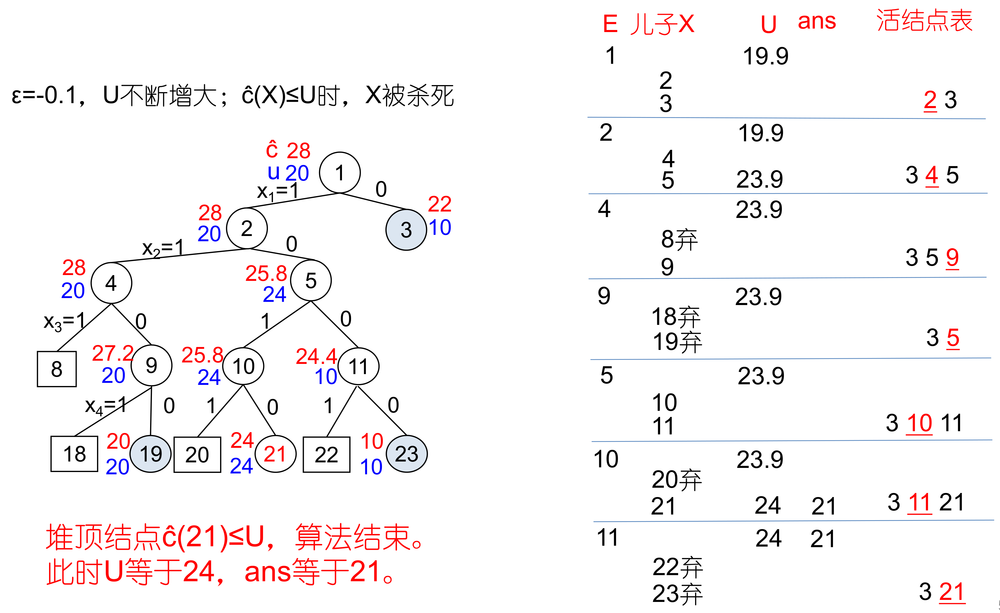

完全二叉的解空间树有 31 个结点，这里只生成了 15 个。穷举 16 种装法核对，最优确实是装第 1、3 件，重量 9、效益 24。

## 第 9 章 NP

没有具体复杂度可背，只要记住这几个问题是 NPC：0/1 背包、子集和、恰好覆盖、旅行商（货郎担）、图着色、SAT。这一章的考点见 `01 考点清单与易错点.md`。

## 核对方式

上面标"核对"的数字来自两段一次性脚本：一段展开递推式并数比较次数、内层枚举次数、状态数，一段把 DP 和贪心的结果与穷举比对。脚本没有留在仓库里，结论已经写进正文。
