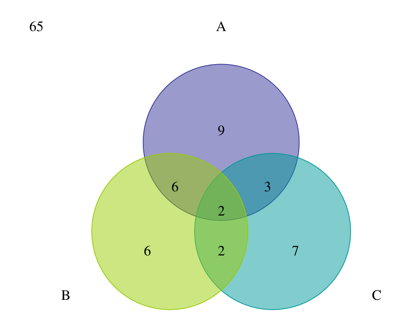
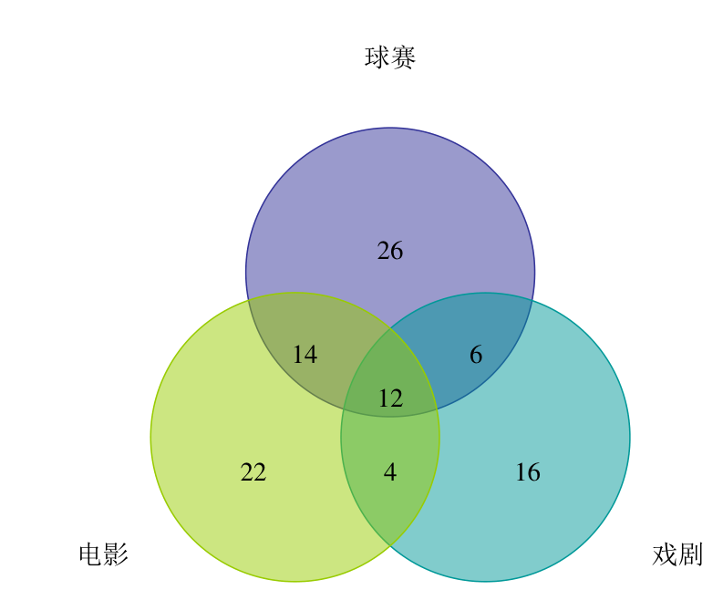
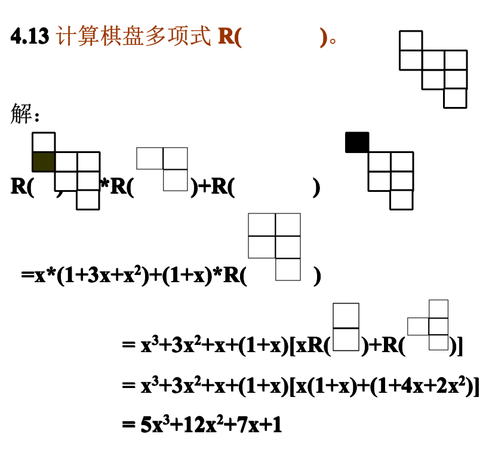
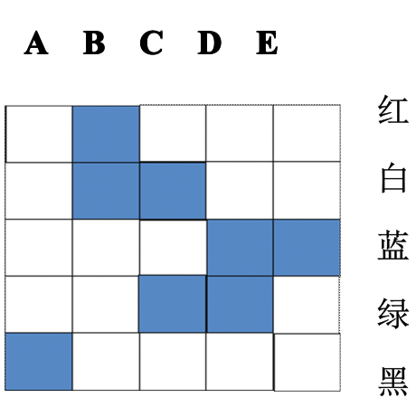
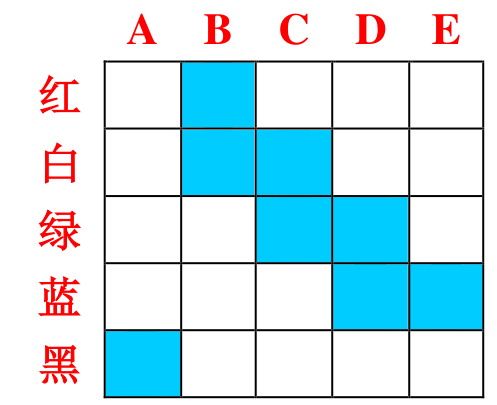
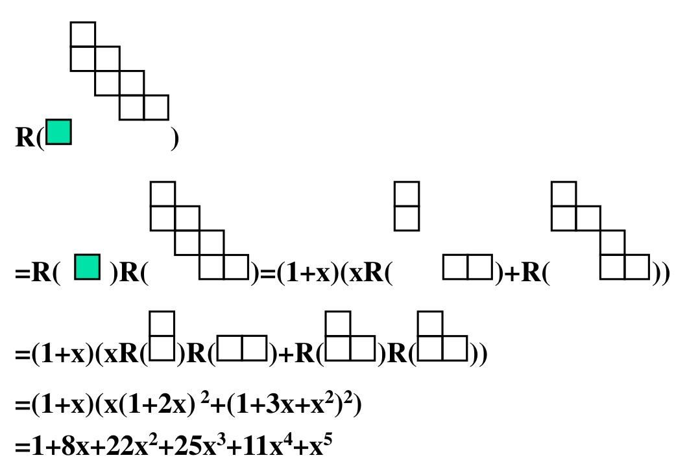

# 容斥原理与棋盘多项式（习题四）

整理自 `吉林大学组合数学习题答案.pdf`（下称 PDF 版）和 `组合数学课后答案.docx`（下称 Word 版）的习题四。两份重复的题已合并，Word 版多出韦恩图和 4.4 的另外两种解法。所有数值都用 Python 枚举复核过。

## 本章要点

- 容斥原理：设 $A_i$ 是具有性质 $P_i$ 的元素集合，则不具有任何性质的元素个数为

$$\lvert \overline{A_1}\cap\cdots\cap\overline{A_n}\rvert=\lvert S\rvert-\sum\lvert A_i\rvert+\sum_{i<j}\lvert A_i\cap A_j\rvert-\cdots+(-1)^n\lvert A_1\cap\cdots\cap A_n\rvert$$

- 对称筛公式：当 $\lvert A_i\rvert$ 只与下标个数有关（记 $k$ 个集合的交为 $\alpha_k$）时，上式变成 $\sum_{k=0}^{n}(-1)^k\binom{n}{k}\alpha_k$。
- 常见用法：整除计数（ $\lvert A_i\rvert=\lfloor N/d_i\rfloor$）、有上界的整数解、多重集的 $r$-组合、错位排列、有禁区的排列。
- 错位排列： $D_n=n!\left(1-\frac{1}{1!}+\frac{1}{2!}-\cdots+(-1)^n\frac{1}{n!}\right)$，递推 $D_n=(n-1)(D_{n-1}+D_{n-2})$， $D_1=0,\ D_2=1$。前几项 $D_3=2,\ D_4=9,\ D_5=44,\ D_{10}=1334961$。
- 棋盘多项式 $R(C)=\sum_k r_k x^k$， $r_k$ 是在棋盘 $C$ 上放 $k$ 个互不攻击的车的方案数。
  - 展开式：任选一格， $R(C)=x\,R(C_i)+R(C_e)$， $C_i$ 是删去该格所在行和列后剩下的棋盘， $C_e$ 是只删去该格的棋盘。
  - 两块棋盘没有公共行和公共列时， $R(C_1\cup C_2)=R(C_1)R(C_2)$。
  - 有禁区的排列数： $N=\sum_{k=0}^{n}(-1)^k r_k (n-k)!$， $r_k$ 取自禁区的棋盘多项式。

## 4.1 不能被 2、5、11 整除（PDF）

题目：1 到 1000 中不能被 2、5 和 11 整除的整数有多少个？

解答：取 $\lvert S\rvert=1000$， $A_1,A_2,A_3$ 分别是能被 2、5、11 整除的数。

$$\lvert A_1\rvert=500,\quad \lvert A_2\rvert=200,\quad \lvert A_3\rvert=\left\lfloor\frac{1000}{11}\right\rfloor=90$$

$$\lvert A_1\cap A_2\rvert=100,\quad \lvert A_1\cap A_3\rvert=\left\lfloor\frac{1000}{22}\right\rfloor=45,\quad \lvert A_2\cap A_3\rvert=\left\lfloor\frac{1000}{55}\right\rfloor=18$$

$$\lvert A_1\cap A_2\cap A_3\rvert=\left\lfloor\frac{1000}{110}\right\rfloor=9$$

结果 $1000-(500+200+90)+(100+45+18)-9=364$。

## 4.2 既不是完全平方数、立方数，也不是四次方数（PDF）

题目：1 到 1000 中既不是完全平方数、又不是完全立方数、也不是完全四次方数的数有多少个？

解答： $\lvert A_1\rvert=\lfloor\sqrt{1000}\rfloor=31$， $\lvert A_2\rvert=\lfloor 1000^{1/3}\rfloor=10$， $\lvert A_3\rvert=\lfloor 1000^{1/4}\rfloor=5$。交集是更高次幂的个数： $\lvert A_1\cap A_2\rvert=\lfloor 1000^{1/6}\rfloor=3$， $\lvert A_1\cap A_3\rvert=5$（四次方都是平方）， $\lvert A_2\cap A_3\rvert=\lfloor 1000^{1/12}\rfloor=1$， $\lvert A_1\cap A_2\cap A_3\rvert=1$。

$$1000-(31+10+5)+(3+5+1)-1=962$$

因为四次方一定是平方数，也可以直接算： $1000-(31+10-3)=962$。

## 4.3 三个频道的收视调查（两份都有）

题目：20% 的用户看 A，16% 看 B，14% 看 C，8% 同时看 A 和 B，5% 同时看 A 和 C，4% 同时看 B 和 C，2% 三个都看。问三个频道都不看的比例。

解答：把 $\lvert S\rvert$ 取成 1（即 100%）：

$$1-(20\%+16\%+14\%)+(8\%+5\%+4\%)-2\%=65\%$$

Word 版画了韦恩图，数字都是百分比，左上角的 65 是圈外的部分，也就是三个频道都不看的用户：



各块的比例如下（可以当作检验，七块加 65% 正好是 100%）：

| 区域 | 只看 A | 只看 B | 只看 C | 只 A 和 B | 只 A 和 C | 只 B 和 C | 三个都看 | 都不看 |
| --- | --- | --- | --- | --- | --- | --- | --- | --- |
| 比例 | 9% | 6% | 7% | 6% | 3% | 2% | 2% | 65% |

## 4.4 只喜欢看电影的人数（两份都有）

题目：100 名新生每人至少有球赛、电影、戏剧三种爱好中的一种。喜欢球赛 58 人，戏剧 38 人，电影 52 人；球赛和戏剧都喜欢 18 人，电影和戏剧都喜欢 16 人，三种都喜欢 12 人。问只喜欢看电影的有多少人？

思路：题目没给"球赛和电影都喜欢"的人数，先用"没有人一种都不喜欢"这个条件把它解出来。

解答（方法一）：设 $A_1,A_2,A_3$ 分别是喜欢球赛、电影、戏剧的学生集合， $\lvert \overline{A_1}\cap\overline{A_2}\cap\overline{A_3}\rvert=0$，由容斥原理

$$100=(58+52+38)-\big(\lvert A_1\cap A_2\rvert+18+16\big)+12$$

得 $\lvert A_1\cap A_2\rvert=26$。只喜欢电影的人数

$$\lvert A_2\rvert-\lvert A_1\cap A_2\rvert-\lvert A_2\cap A_3\rvert+\lvert A_1\cap A_2\cap A_3\rvert=52-26-16+12=22$$

方法二（Word 版的韦恩图）：先填三圆公共部分 12，再由两两交集减 12 得到 6 和 4，由 $\lvert A_1\cap A_2\rvert=26$ 得到 14，最后用各圆总数减去已填的数。



各块人数如下，横竖一加就能检验。

| 区域 | 只球赛 | 只电影 | 只戏剧 | 只球赛和电影 | 只球赛和戏剧 | 只电影和戏剧 | 三种都喜欢 |
| --- | --- | --- | --- | --- | --- | --- | --- |
| 人数 | 26 | 22 | 16 | 14 | 6 | 4 | 12 |

方法三（Word 版的方程法）：设只喜欢球赛 $x$ 人、只喜欢电影 $y$ 人、球赛和电影都喜欢但不喜欢戏剧 $z$ 人，用总人数、三个爱好的人数列方程，同样解得 $y=22$。

## 4.5 共在外面吃过几次晚餐（两份都有）

题目：某人有六位朋友，与其中任意 1 位一起吃过 12 次，任意 2 位一起吃过 6 次，任意 3 位一起 4 次，任意 4 位一起 3 次，任意 5 位一起 2 次，六位全在一起 1 次；他独自在外吃过 8 次。问他共在外面吃过几次晚餐？

思路：各级交集只与人数有关，用对称筛公式。

解答：设共吃过 $n$ 次， $A_i$ 是有第 $i$ 位朋友在场的那些晚餐，则

$$n-\binom{6}{1}\cdot 12+\binom{6}{2}\cdot 6-\binom{6}{3}\cdot 4+\binom{6}{4}\cdot 3-\binom{6}{5}\cdot 2+\binom{6}{6}\cdot 1=8$$

$$n=8+72-90+80-45+12-1=36$$

## 4.6 多重集的 12-组合（PDF）

题目：求多重集 $S=\lbrace 4\cdot a,3\cdot b,4\cdot c,6\cdot d\rbrace$ 的 12-组合数。

思路：先不管重数上限，再用容斥减去"某个元素超量"的情形。 $A_1$ 表示 $a$ 至少取 5 个， $A_2$ 表示 $b$ 至少取 4 个， $A_3$ 表示 $c$ 至少取 5 个， $A_4$ 表示 $d$ 至少取 7 个。

解答：无上限时 $\binom{4+12-1}{12}=455$。

- $\lvert A_1\rvert=\binom{4+7-1}{7}=120$， $\lvert A_2\rvert=\binom{4+8-1}{8}=165$， $\lvert A_3\rvert=120$， $\lvert A_4\rvert=\binom{4+5-1}{5}=56$
- $\lvert A_1\cap A_2\rvert=\binom{6}{3}=20$， $\lvert A_1\cap A_3\rvert=\binom{5}{2}=10$， $\lvert A_1\cap A_4\rvert=1$， $\lvert A_2\cap A_3\rvert=20$， $\lvert A_2\cap A_4\rvert=4$， $\lvert A_3\cap A_4\rvert=1$
- 三个及以上同时超量需要至少 14 个元素，都是 0

$$455-(120+165+120+56)+(20+10+1+20+4+1)=455-461+56=50$$

（更正：原文最后一行括号里只写了 $20+10+1+20+4$ 五项，漏掉 $\lvert A_3\cap A_4\rvert=1$，按写出的数字算是 49；补上后才是原文给出的 50。）

## 4.7 带无限重元素的 10-组合（PDF）

题目：求多重集 $S=\lbrace \infty\cdot a,4\cdot b,5\cdot c,6\cdot d\rbrace$ 的 10-组合数。

解答：无上限时 $\binom{4+10-1}{10}=286$。 $a$ 没有上限， $\lvert A_1\rvert=0$； $\lvert A_2\rvert=\binom{4+5-1}{5}=56$（ $b$ 至少 5 个）， $\lvert A_3\rvert=\binom{4+4-1}{4}=35$（ $c$ 至少 6 个）， $\lvert A_4\rvert=\binom{4+3-1}{3}=20$（ $d$ 至少 7 个）。任意两个同时超量至少要 11 个元素，全为 0。

$$286-(56+35+20)=175$$

## 4.8 有上界的整数解（PDF）

题目：用容斥原理求下面两个方程的解数。

(1) $x_1+x_2+x_3=15$， $0\le x_i\le 7$。

解答：无上界时 $\binom{17}{2}=136$。某个 $x_i\ge 8$：剩下 7 个自由分配， $\binom{9}{2}=36$，三个变量共 $108$；两个变量同时超过 7 需要至少 16，不可能。答案 $136-108=28$。这也等于多重集 $\lbrace 7\cdot a,7\cdot b,7\cdot c\rbrace$ 的 15-组合数。

(2) $x_1+x_2+x_3+x_4=20$， $1\le x_i\le 9$。

解答：令 $y_i=x_i-1$，得 $y_1+y_2+y_3+y_4=16$， $0\le y_i\le 8$。无上界时 $\binom{19}{3}=969$；某个 $y_i\ge 9$ 时剩 7 个自由分配， $\binom{10}{3}=120$，四个变量共 480；两个同时超量要 18 个，不可能。答案 $969-480=489$。

## 4.9 全排列按错位排列分类（PDF）

题目：约定 $D_0=1$，证明 $n!=\binom{n}{0}D_n+\binom{n}{1}D_{n-1}+\cdots+\binom{n}{n}D_0$。

解答：把 $n$ 个元素的全排列按不动点的个数分类。恰有 $k$ 个不动点的排列：先选出这 $k$ 个位置 $\binom{n}{k}$ 种，其余 $n-k$ 个元素都不在原位，即一个错位排列， $D_{n-k}$ 种。所以

$$n!=\sum_{k=0}^{n}\binom{n}{k}D_{n-k}=\sum_{k=0}^{n}\binom{n}{k}D_k$$

最后一步用了 $\binom{n}{k}=\binom{n}{n-k}$。

## 4.10 错位排列的递推式（PDF）

题目：证明 $D_n=(n-1)(D_{n-1}+D_{n-2})$， $n\ge 3$， $D_1=0,\ D_2=1$。

解答（组合证明）：看元素 1 放在哪个位置，有 $n-1$ 种选择，设放在位置 $k$。

- 若元素 $k$ 正好放在位置 1，剩下 $n-2$ 个元素都要错位， $D_{n-2}$ 种。
- 若元素 $k$ 不在位置 1，把"位置 1"看成元素 $k$ 的禁止位置，剩下 $n-1$ 个元素各有一个禁位，相当于 $n-1$ 元的错位排列， $D_{n-1}$ 种。

合起来 $D_n=(n-1)(D_{n-1}+D_{n-2})$。

原文的代数证明：把 $D_{n-1}$、 $D_{n-2}$ 的通项代入，利用 $(n-1)!+(n-2)!=n\cdot(n-2)!$ 合并，最后得到

$$(n-1)(D_{n-1}+D_{n-2})=n!\left(1-\frac{1}{1!}+\frac{1}{2!}-\cdots+(-1)^n\frac{1}{n!}\right)=D_n$$

（更正：原文最后一行漏写了系数 $n!$，只剩括号里的交错和。）

## 4.11 帽子和雨伞都拿错（PDF）

题目：10 位女士各寄存一顶帽子和一把雨伞，离开时随机发还。每位女士拿到的帽子和雨伞都不是自己的，有多少种情况？

解答：帽子的发放和雨伞的发放互不影响，各自是 10 元错位排列：

$$D_{10}\cdot D_{10}=1334961^2=1782120871521$$

（更正：原文写成 $\dfrac{10!\times 10!}{e^2}$。 $D_n$ 与 $n!/e$ 只相差不到 $0.5$， $\frac{10!}{e}\approx 1334960.9$，所以那是近似值，精确值是 $D_{10}^2$，上面的数用 Python 算出。）

## 4.13 计算棋盘多项式（两份都有）

题目：求下图这块棋盘的棋盘多项式（X 是棋盘格，`.` 是空白）。

```
X . .
X X X
. X X
. . X
```

思路：对"处在交叉位置"的格子用展开式 $R(C)=x\,R(C_i)+R(C_e)$，把棋盘拆成小块；没有公共行列的小块直接相乘。

解答：取第 2 行第 1 列那一格展开。

1. $C_i$：删去第 2 行和第 1 列，剩下 $(3,2),(3,3),(4,3)$ 三格， $R=1+3x+x^2$。
2. $C_e$：删去这一格后， $(1,1)$ 与其余格子不同行不同列， $R(C_e)=(1+x)\,R(B)$，其中 $B$ 是 $(2,2),(2,3),(3,2),(3,3),(4,3)$ 五格。
3. 对 $B$ 取 $(4,3)$ 展开：删去第 4 行第 3 列后剩 $(2,2),(3,2)$ 两格同列， $R=1+2x$；只删这一格后剩 $2\times 2$ 的满棋盘， $R=1+4x+2x^2$。所以 $R(B)=x(1+2x)+(1+4x+2x^2)=1+5x+4x^2$。

$$R(C)=x(1+3x+x^2)+(1+x)(1+5x+4x^2)=1+7x+12x^2+5x^3$$

原答案的展开过程如下图。第一行涂深色的就是第 2 行第 1 列那一格；右边那块里涂黑的 $(1,1)$ 表示它已和其余格子分开，单独提出因子 $(1+x)$。



读图时注意两处。倒数第二行的 $xR(\text{两格同列})$ 被写成 $x(1+x)$，应为 $x(1+2x)$，见下面的更正。同一行最后那块本该是 $2\times 2$ 的满棋盘，图里画成了一列三格再在中间左侧加一格的形状；这个形状的棋盘多项式碰巧也是 $1+4x+2x^2$，所以后面的式子不受影响。

（更正：原文中间一步把"两格同列"的棋盘多项式写成 $1+x$，应为 $1+2x$；按原文的中间结果推下去得不到它自己给出的答案。最终结果 $1+7x+12x^2+5x^3$ 是对的，已用 Python 枚举所有互不攻击的放法核对： $r_1=7,\ r_2=12,\ r_3=5$。）

## 4.14 轿车涂装（两份都有）

题目：A、B、C、D、E 五种车型用红、白、蓝、绿、黑五色涂装。A 不能涂黑；B 不能涂红、白；C 不能涂白、绿；D 不能涂绿、蓝；E 不能涂蓝。求涂装方案数。

把车型当列、颜色当行，禁止的组合涂上颜色，就得到禁区棋盘：



### 情形一：不同车型可以同色

每种车型的可选颜色数分别是 4、3、3、3、4：

$$4\times 3\times 3\times 3\times 4=432$$

### 情形二：不同车型必须涂不同颜色

这是有禁区的排列。禁区共 8 格。交换棋盘的行不改变棋盘多项式，把行按 红、白、绿、蓝、黑 的顺序重排后，B 到 E 的 7 格连成一条从左上到右下的阶梯，(A,黑) 单独落在左下角：



取阶梯正中的 (C, 绿) 这一格展开：

- 删去 C 列和绿行后： $\lbrace$(B,红),(B,白) $\rbrace$ 与 $\lbrace$(D,蓝),(E,蓝) $\rbrace$ 各是同一行或同一列的两格， $R=(1+2x)^2$。
- 只删这一格后： $\lbrace$(B,红),(B,白),(C,白) $\rbrace$ 和 $\lbrace$(D,绿),(D,蓝),(E,蓝) $\rbrace$ 各是一条 3 格折线， $R=(1+3x+x^2)^2$。
- (A,黑) 与其他禁区格不同行不同列，单独乘 $(1+x)$。

$$R=(1+x)\left[x(1+2x)^2+(1+3x+x^2)^2\right]=1+8x+22x^2+25x^3+11x^4+x^5$$

Word 版把这几步画成了图，绿色小方块是 (A,黑)，右边 7 格是阶梯：



代入禁区排列公式：

$$N=5!-8\cdot 4!+22\cdot 3!-25\cdot 2!+11\cdot 1!-1\cdot 0!=120-192+132-50+11-1=20$$

两个结果（432 和 20）都用 Python 枚举五种车型的全部涂色方案核对过。

## 补充题 1：能被 7 整除但不能被 6 和 10 整除（PDF）

题目：1 到 2000 中能被 7 整除，但不能被 6 和 10 整除的数有多少个？

解答：记 $A$ 为被 7 整除的数（285 个）， $B$ 为被 6 整除， $C$ 为被 10 整除。要算 $\lvert A\rvert-\lvert A\cap B\rvert-\lvert A\cap C\rvert+\lvert A\cap B\cap C\rvert$：

$$\lvert A\cap B\rvert=\left\lfloor\frac{2000}{42}\right\rfloor=47,\quad \lvert A\cap C\rvert=\left\lfloor\frac{2000}{70}\right\rfloor=28,\quad \lvert A\cap B\cap C\rvert=\left\lfloor\frac{2000}{210}\right\rfloor=9$$

$$285-47-28+9=219$$

## 补充题 2：至少被 2、3、5 中两个数整除（PDF）

题目：1 到 2000 中，至少能被 2、3、5 里两个数整除的数有多少个？

思路：一个数如果被三个数都整除，它在三个两两交集里各被数一次，共 3 次，只应算 1 次，所以要减去 2 倍。

解答：

$$\left\lfloor\frac{2000}{6}\right\rfloor+\left\lfloor\frac{2000}{10}\right\rfloor+\left\lfloor\frac{2000}{15}\right\rfloor-2\left\lfloor\frac{2000}{30}\right\rfloor=333+200+133-2\times 66=534$$

（顺便区分一下：恰好被其中两个整除的个数是 $666-3\times 66=468$。）
