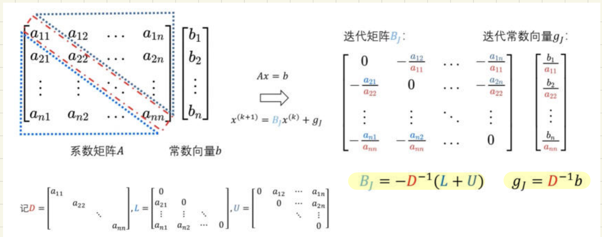

# 向量与矩阵范数、条件数、迭代法

整理自 `计算方法笔记本（压缩）.pdf` 第 22–30 页（手写笔记扫描件）。这几页讲第 2 章后半段：向量范数、矩阵范数、谱半径、条件数与病态方程组、方程组的平衡、迭代法的收敛判定、Jacobi 迭代和 Gauss-Seidel 迭代。讲义里推过的地方这里只留结论和操作步骤，重点放在手算顺序、易错点和两个例题的复算结果。

全文用 $\Vert\cdot\Vert$ 表示范数， $\rho(\cdot)$ 表示谱半径。

---

## 一、向量范数

### 1.1 定义（定义 2.1）

设 $x\in R^n$， $N(x)\equiv\Vert x\Vert$ 是 $x$ 的实值函数。满足下面三条就叫 $R^n$ 上的一个**向量范数**（向量模）：

1. **非负性**： $\Vert x\Vert\ge 0$，且 $\Vert x\Vert=0\iff x=0$。
2. **齐次性**： $\Vert kx\Vert=\vert k\vert\cdot\Vert x\Vert$， $\forall k\in R$（或 $C$）。
3. **三角不等式**： $\Vert x+y\Vert\le\Vert x\Vert+\Vert y\Vert$， $\forall x,y\in R^n$。

范数说白了是一个函数，把向量映成一个数，用来度量向量的大小。

笔记在第 1 条旁边标了「两层」： $\Vert x\Vert\ge 0$ 和 $\Vert x\Vert=0\Rightarrow x=0$ 要分开验，光验非负不够。考试让你判断某个表达式是不是范数，就是逐条对这三性质。

### 1.2 由三角不等式推出的两个常用结论

考题里经常直接用，推导只要两行：

$$\Vert x\Vert=\Vert (x-y)+y\Vert\le\Vert x-y\Vert+\Vert y\Vert\ \Longrightarrow\ \Vert x-y\Vert\ge\Vert x\Vert-\Vert y\Vert\quad\text{(1)}$$

$$\Vert y-x+x\Vert\le\Vert y-x\Vert+\Vert x\Vert\ \Longrightarrow\ \Vert x-y\Vert=\Vert y-x\Vert\ge\Vert y\Vert-\Vert x\Vert\quad\text{(2)}$$

(1)(2) 合起来：

$$\boxed{\ \Vert x-y\Vert\ \ge\ \bigl\lvert\,\Vert x\Vert-\Vert y\Vert\,\bigr\rvert\ }$$

技巧就一个：把 $x$ 拆成 $(x-y)+y$ 再用三角不等式。

### 1.3 三种常用向量范数

| 记号 | 公式 | 手算怎么做 |
| --- | --- | --- |
| 1-范数 | $\Vert x\Vert_1=\sum_{i=1}^{n}\lvert x_i\rvert$ | 所有分量绝对值之和 |
| 2-范数（欧氏范数） | $\Vert x\Vert_2=\bigl(\sum_{i=1}^{n}\lvert x_i\rvert^2\bigr)^{1/2}$ | 就是向量的模长 |
| $\infty$-范数（最大范数） | $\Vert x\Vert_\infty=\max_{1\le i\le n}\lvert x_i\rvert$ | 最大的那个绝对值 |

一般形式（ $p$-范数）： $\Vert x\Vert_p=\bigl(\sum_{i=1}^{n}\lvert x_i\rvert^p\bigr)^{1/p}$。

2-范数的平方可以写成内积，这是它比另外两个好用的地方：

$$\Vert x+y\Vert_2^2=\sum_{i=1}^n(x_i+y_i)^2=\Vert x\Vert_2^2+\Vert y\Vert_2^2+2\sum_i x_iy_i\ \le\ \Vert x\Vert_2^2+\Vert y\Vert_2^2+2\Vert x\Vert_2\Vert y\Vert_2$$

中间那步用的是 Cauchy-Schwarz： $\sum_i x_iy_i\le\Vert x\Vert_2\Vert y\Vert_2$。2-范数的三角不等式就是这么证的。

### 1.4 三种范数之间的不等式

| 不等式 | 反过来写 |
| --- | --- |
| $\Vert x\Vert_\infty\le\Vert x\Vert_2\le\sqrt{n}\,\Vert x\Vert_\infty$ | $\dfrac{1}{\sqrt n}\Vert x\Vert_2\le\Vert x\Vert_\infty$ |
| $\Vert x\Vert_\infty\le\Vert x\Vert_1\le n\Vert x\Vert_\infty$ | $\dfrac{1}{n}\Vert x\Vert_1\le\Vert x\Vert_\infty$ |
| $\Vert x\Vert_2\le\Vert x\Vert_1\le\sqrt{n}\,\Vert x\Vert_2$ | $\dfrac{1}{\sqrt n}\Vert x\Vert_1\le\Vert x\Vert_2\le\Vert x\Vert_1$ |

串成一条链方便记：

$$\Vert x\Vert_\infty\ \le\ \Vert x\Vert_2\ \le\ \Vert x\Vert_1\ \le\ \sqrt{n}\,\Vert x\Vert_2\ \le\ n\Vert x\Vert_\infty$$

$\Vert x\Vert_1\le\sqrt n\,\Vert x\Vert_2$ 的证法：取 $a=\operatorname{sgn}(x)$（各分量取 $x_i$ 的符号，于是 $\Vert a\Vert_2=\sqrt n$），则 $\Vert x\Vert_1=(a,x)\le\Vert a\Vert_2\Vert x\Vert_2=\sqrt n\,\Vert x\Vert_2$。

常数里的 $n$ 和 $\sqrt n$ 别写反。凡是「从 $\infty$ 往 1 放大」用 $n$，「从 2 往 1 放大」用 $\sqrt n$。

验算例子： $x=(3,-4,12)^T$， $\Vert x\Vert_1=19$， $\Vert x\Vert_2=13$， $\Vert x\Vert_\infty=12$， $n=3$。 $12\le13\le19\le\sqrt3\times13\approx22.5\le36$，链条成立。

### 1.5 向量范数的等价性（定理 1.3）

设 $\Vert\cdot\Vert_\alpha$、 $\Vert\cdot\Vert_\beta$ 是 $R^n$ 上**任意两种**范数，则存在常数 $c_1,c_2>0$，使得对一切 $x\in R^n$ 有

$$c_1\Vert x\Vert_\beta\le\Vert x\Vert_\alpha\le c_2\Vert x\Vert_\beta$$

用处：某一种范数下的结论可以换到另一种范数下去说，收敛性、有界性都不受范数选择影响。

证明思路（三步，考试写关键步就行）：

1. 先证范数作为 $n$ 元函数是连续的。把 $x=\sum_i x_ie_i$，则 $\lvert f(x)-f(y)\rvert=\bigl\lvert\Vert x\Vert_\alpha-\Vert y\Vert_\alpha\bigr\rvert\le\Vert x-y\Vert_\alpha$，再用 $\Vert x-y\Vert_\alpha\le\max_i\lvert x_i-y_i\rvert\sum_{i=1}^n\Vert e_i\Vert_\alpha\to0$，得到 $f$ 在 $R^n$ 上连续。
2. 引入有界闭集 $S^n=\{x:\Vert x\Vert_2=1,\ x\in R^n\}$（单位球面）。连续函数在有界闭集上取到最大值 $M_1$ 和最小值 $m_1$，且 $0<m_1\le f(x)\le M_1$。
3. $x=0$ 时结论显然。 $x\ne 0$ 时 $x/\Vert x\Vert_2\in S^n$，代入得 $m_1\le\Vert x\Vert_\alpha/\Vert x\Vert_2\le M_1$，即 $m_1\Vert x\Vert_2\le\Vert x\Vert_\alpha\le M_1\Vert x\Vert_2$。同理 $m_2\Vert x\Vert_2\le\Vert x\Vert_\beta\le M_2\Vert x\Vert_2$。两式相除得 $m=\dfrac{m_1}{M_2}\le\dfrac{\Vert x\Vert_\alpha}{\Vert x\Vert_\beta}\le\dfrac{M_1}{m_2}=M$。

关键就是「归一化到单位球面 + 连续函数在紧集上取到正的最小值」。

### 1.6 向量序列的收敛性（定义 2.2）

设 $\{x^{(k)}=(x_1^{(k)},x_2^{(k)},\dots,x_n^{(k)})^T\}$ 是 $R^n$ 上的向量序列， $x^{*}=(x_1^{*},\dots,x_n^{*})^T\in R^n$。如果对 $i=1,2,\dots,n$ 都有

$$\lim_{k\to\infty}x_i^{(k)}=x_i^{*}$$

就称向量序列 $\{x^{(k)}\}$ 收敛于 $x^{*}$。说白了是 $n$ 个数列分别取极限。

**充要条件**： $\{x^{(k)}\}$ 收敛于 $x^{*}$ $\iff$ 对任意范数 $\Vert\cdot\Vert$ 都有 $\Vert x^{(k)}-x^{*}\Vert\to 0$。由等价性，下面三个条件互相等价，证题时挑最好算的那个：

$$\lim_{k\to\infty}\Vert x^{(k)}-x^{*}\Vert_\infty=0\iff\lim_{k\to\infty}\Vert x^{(k)}-x^{*}\Vert_2=0\iff\lim_{k\to\infty}\Vert x^{(k)}-x^{*}\Vert_1=0$$

一般挑 $\infty$-范数，因为它只要看最大分量。

---

## 二、矩阵范数

### 2.1 定义（定义 2.3）

设 $A\in R^{n\times n}$， $N(A)\equiv\Vert A\Vert$ 是 $A$ 的实值函数，满足：

1. **非负性**： $\Vert A\Vert\ge0$， $\Vert A\Vert=0\iff A=0$。
2. **齐次性**： $\Vert kA\Vert=\lvert k\rvert\cdot\Vert A\Vert$， $\forall k\in R$（或 $C$）。
3. **三角不等式**： $\Vert A+B\Vert\le\Vert A\Vert+\Vert B\Vert$， $\forall A,B\in R^{n\times n}$。

则称 $N(A)=\Vert A\Vert$ 为 $R^{n\times n}$（或 $C^{n\times n}$）上的一个矩阵范数（矩阵模）。结构和向量范数完全一样，只是对象换成矩阵。

### 2.2 相容范数

只满足上面三条还不够用，乘法要能拆开才方便，于是再加：

$$\Vert AB\Vert\le\Vert A\Vert\cdot\Vert B\Vert\quad\forall A,B\in R^{n\times n}$$

$$\Vert Ax\Vert\le\Vert A\Vert\cdot\Vert x\Vert\quad\forall x\in R^n,\ A\in R^{n\times n}$$

一句话：乘积的范数不超过范数的乘积。后面条件数的扰动推导、迭代法的误差估计，每一步放缩靠的都是这两条。

### 2.3 算子范数（诱导范数）

最常用的矩阵范数是**拿向量范数定义出来的**：

$$\Vert A\Vert_p=\max_{x\ne0}\frac{\Vert Ax\Vert_p}{\Vert x\Vert_p}=\max_{\Vert x\Vert_p=1}\Vert Ax\Vert_p,\qquad p=1,2,\infty \tag{2.5.15}$$

叫 $A$ 的**算子范数**，也叫诱导范数。几何意义是 $A$ 把单位向量最多能拉长多少倍。

**定理**：由 (2.5.15) 定义的 $\Vert A\Vert_p$ 是相容范数。

证明的关键两步：

1. 相容性 $\Vert Ax\Vert_p\le\Vert A\Vert_p\Vert x\Vert_p$： $x=0$ 时显然； $x\ne0$ 时 $\dfrac{\Vert Ax\Vert_p}{\Vert x\Vert_p}\le\max_{y\ne0}\dfrac{\Vert Ay\Vert_p}{\Vert y\Vert_p}=\Vert A\Vert_p$，两边乘 $\Vert x\Vert_p$ 即得。
2. 乘法相容 $\Vert AB\Vert_p\le\Vert A\Vert_p\Vert B\Vert_p$：注意 $Bx\in R^n$，用第 1 步两次

$$\Vert AB\Vert_p=\max_{\Vert x\Vert_p=1}\Vert ABx\Vert_p\le\max_{\Vert x\Vert_p=1}\Vert A\Vert_p\Vert Bx\Vert_p=\Vert A\Vert_p\max_{\Vert x\Vert_p=1}\Vert Bx\Vert_p=\Vert A\Vert_p\cdot\Vert B\Vert_p$$

### 2.4 三种算子范数怎么算

| 范数 | 公式 | 名字 | 手算步骤 |
| --- | --- | --- | --- |
| $\Vert A\Vert_\infty$ | $\max_{1\le i\le n}\sum_{j=1}^{n}\lvert a_{ij}\rvert$ | **行和范数** | 每行绝对值求和，取最大 |
| $\Vert A\Vert_1$ | $\max_{1\le j\le n}\sum_{i=1}^{n}\lvert a_{ij}\rvert$ | **列和范数** | 每列绝对值求和，取最大 |
| $\Vert A\Vert_2$ | $\bigl(A^TA\ \text{的最大特征值}\bigr)^{1/2}$ | **谱范数** | 先算 $A^TA$，求特征值，取最大再开方 |

最容易错的一点：** $\infty$ 配行、1 配列**，跟向量范数的直觉正好反过来。记法是 $\infty$ 像横着躺的，所以按行。

行和范数的证明思路（证等号要卡两头， $\le$ 和 $\ge$ 都要）：

取 $\Vert x\Vert_\infty=1$， $(Ax)_i=\sum_{j=1}^n a_{ij}x_j$，于是

$$\Vert Ax\Vert_\infty=\max_i\lvert(Ax)_i\rvert=\max_i\Bigl\lvert\sum_{j=1}^n a_{ij}x_j\Bigr\rvert\le\max_i\sum_{j=1}^n\lvert a_{ij}\rvert$$

这给出 $\le$。再取行和最大的那一行 $i_0$，令 $x_j=\operatorname{sgn}(a_{i_0j})$（此时 $\Vert x\Vert_\infty=1$），代进去等号成立，得到 $\ge$。

谱范数的证明思路：设 $c=\max_{\Vert x\Vert_2=1}\Vert Ax\Vert_2$。 $A^TA$ 是实对称半正定阵，特征值 $\lambda_1,\dots,\lambda_n\ge0$，特征向量 $v_1,\dots,v_n$ 可取成标准正交基（原稿写成「 $A$ 的特征值、特征向量」，按下一行 $A^TA\sum a_iv_i=\sum a_i\lambda_iv_i$ 看，指的是 $A^TA$ 的）。任取 $x=\sum_{i=1}^n a_iv_i$，则

$$\Vert Ax\Vert_2^2=(Ax,Ax)=x^TA^TAx=\Bigl(\sum_i a_iv_i^T\Bigr)\Bigl(\sum_i a_i\lambda_iv_i\Bigr)=\sum_i\lambda_ia_i^2\le\lambda_{\max}\sum_i a_i^2=\lambda_{\max}\Vert x\Vert_2^2$$

在 $x=v_{\max}$ 处取到等号，所以 $\Vert A\Vert_2=\sqrt{\lambda_{\max}(A^TA)}$。

---

## 三、谱半径

**定义**：矩阵 $A$ 的特征值的绝对值的最大值，叫 $A$ 的谱半径，记作 $\rho(A)$：

$$\rho(A)=\max_{1\le i\le n}\lvert\lambda_i\rvert,\qquad \lambda_i\ \text{是}\ A\ \text{的第}\ i\ \text{个特征值}$$

**定理**：对任意矩阵 $A\in R^{n\times n}$，有

$$\rho(A)\le\Vert A\Vert_p\qquad(p=1,2,\infty)$$

谱半径不超过任意一种相容范数。这条在迭代法那里反复用：只要找到某个范数 $<1$，就能断定 $\rho<1$。

由谱半径的定义可知

$$\Vert A\Vert_2=\sqrt{\rho(A^TA)}$$

当 $A$ 是**实对称矩阵**时， $A^TA=A^2$， $\rho(A^2)=\rho(A)^2$，于是

$$\Vert A\Vert_2=\sqrt{\rho(A^TA)}=\sqrt{\rho(A^2)}=\rho(A)$$

也就是实对称矩阵的 2-范数等于它的谱半径。只对实对称阵成立，一般矩阵 $\Vert A\Vert_2>\rho(A)$ 是常态。

---

## 四、病态方程组与条件数

### 4.1 定义（定义 1.3）

如果矩阵 $A$ 或常数项 $b$ 的**微小变化**，引起方程组 $Ax=b$ 的解的**巨大变化**，就称此方程组为「**病态**」方程组， $A$ 称为「病态」矩阵；否则称为「良态」方程组、「良态」矩阵。

### 4.2 扰动分析（设 $A$ 非奇异）

这两段推导是考试要求默写的，按顺序背步骤。

**情形一：只有 $b$ 有误差 $\delta b$，解产生误差 $\Delta x$**

1. $A(x+\Delta x)=b+\delta b$
2. 展开 $Ax+A\Delta x=b+\delta b$，其中 $Ax=b$
3. 得 $A\Delta x=\delta b$， $A$ 非奇异，故 $\Delta x=A^{-1}\delta b$
4. 矩阵范数是相容范数，故 $\Vert\Delta x\Vert\le\Vert A^{-1}\Vert\cdot\Vert\delta b\Vert$ … ①
5. 又 $\Vert b\Vert=\Vert Ax\Vert\le\Vert A\Vert\cdot\Vert x\Vert$ … ②，即 $\Vert x\Vert\ge\dfrac{\Vert b\Vert}{\Vert A\Vert}$ … ③
6. ① 除以 ③：

$$\frac{\Vert\Delta x\Vert}{\Vert x\Vert}\le\Vert A\Vert\cdot\Vert A^{-1}\Vert\cdot\frac{\Vert\delta b\Vert}{\Vert b\Vert}\tag{④}$$

左边是 $x$ 的相对误差，右边括号后面是 $b$ 的相对误差。结论： $x$ 的相对误差不超过 $b$ 的相对误差的 $\Vert A\Vert\cdot\Vert A^{-1}\Vert$ 倍。

**情形二：只有 $A$ 有误差 $\Delta A$，解产生误差 $\Delta x$**

1. $(A+\Delta A)(x+\Delta x)=b$
2. 展开 $Ax+A\Delta x+\Delta A\,x+\Delta A\,\Delta x=b$，消去 $Ax=b$
3. 得 $A\Delta x+\Delta A\,x+\Delta A\,\Delta x=0$
4. $A$ 非奇异，左乘 $A^{-1}$： $\Delta x+A^{-1}\Delta A\,x+A^{-1}\Delta A\,\Delta x=0$，即 $\Delta x=-A^{-1}\Delta A\,x-A^{-1}\Delta A\,\Delta x$
5. 取范数： $\Vert\Delta x\Vert\le\Vert A^{-1}\Vert\Vert\Delta A\Vert\Vert x\Vert+\Vert A^{-1}\Vert\Vert\Delta A\Vert\Vert\Delta x\Vert$
6. 两边同除 $\Vert x\Vert$，把含 $\dfrac{\Vert\Delta x\Vert}{\Vert x\Vert}$ 的项移到左边：

$$\bigl(1-\Vert A^{-1}\Vert\Vert\Delta A\Vert\bigr)\frac{\Vert\Delta x\Vert}{\Vert x\Vert}\le\Vert A^{-1}\Vert\cdot\Vert\Delta A\Vert$$

7. $\Delta A$ 相当小，所以 $1-\Vert A^{-1}\Vert\Vert\Delta A\Vert>0$ 总能成立，可以放心除过去：

$$\frac{\Vert\Delta x\Vert}{\Vert x\Vert}\le\frac{\Vert A^{-1}\Vert\cdot\Vert\Delta A\Vert}{1-\Vert A^{-1}\Vert\cdot\Vert\Delta A\Vert}=\frac{\Vert A\Vert\cdot\Vert A^{-1}\Vert\cdot\dfrac{\Vert\Delta A\Vert}{\Vert A\Vert}}{1-\Vert A\Vert\cdot\Vert A^{-1}\Vert\cdot\dfrac{\Vert\Delta A\Vert}{\Vert A\Vert}}\tag{⑤}$$

$\Vert A\Vert\cdot\Vert A^{-1}\Vert$ 越大，右边整体越大。

两段的共同结论：

- $\Vert A^{-1}\Vert\cdot\Vert A\Vert$ 的大小决定了 $x$ 的相对误差的上限。
- 这个量越大， $x$ 可能产生的相对误差越大，「病态」越严重。
- $Ax=b$ 的病态程度**只跟 $A$ 有关，跟 $b$ 无关**。这句经常出判断题。

第 7 步是整段最容易漏的地方：必须先说明 $1-\Vert A^{-1}\Vert\Vert\Delta A\Vert>0$ 才能除，不写这句要扣分。

### 4.3 条件数（定义 1.4）

设 $A\in R^{n\times n}$ 为可逆矩阵，称

$$\mathrm{Cond}_p(A)=\Vert A\Vert_p\cdot\Vert A^{-1}\Vert_p$$

为矩阵 $A$ 在范数 $\Vert\cdot\Vert_p$ 意义下的**条件数**。条件数越大，扰动误差对解的影响越严重；条件数过大的方程组就叫病态方程组。

用条件数把 ④⑤ 两式重写，这是考试要写的最终形式：

$$\text{④：}\quad\frac{\Vert\Delta x\Vert}{\Vert x\Vert}\le\mathrm{cond}(A)\cdot\frac{\Vert\delta b\Vert}{\Vert b\Vert}$$

$$\text{⑤：}\quad\frac{\Vert\Delta x\Vert}{\Vert x\Vert}\le\frac{\mathrm{cond}(A)\cdot\dfrac{\Vert\Delta A\Vert}{\Vert A\Vert}}{1-\mathrm{cond}(A)\cdot\dfrac{\Vert\Delta A\Vert}{\Vert A\Vert}}$$

**注**：条件数恒 $\ge 1$。一行证明：

$$1=\Vert I\Vert=\Vert AA^{-1}\Vert\le\Vert A\Vert\cdot\Vert A^{-1}\Vert=\mathrm{cond}(A)\ \Longrightarrow\ \mathrm{cond}(A)\ge1$$

这里用的正是相容性 $\Vert AB\Vert\le\Vert A\Vert\Vert B\Vert$。

一个手边练手的例子（原稿没有，自己补的）： $A=\begin{pmatrix}1&1\\1&1.0001\end{pmatrix}$， $A^{-1}=\begin{pmatrix}10001&-10000\\-10000&10000\end{pmatrix}$。 $\Vert A\Vert_\infty=2.0001$， $\Vert A^{-1}\Vert_\infty=20001$， $\mathrm{cond}_\infty(A)=40004.0001$。 $b=(2,2)^T$ 时解是 $(2,0)^T$； $b$ 只改成 $(2,2.0001)^T$，解就变成 $(1,1)^T$。 $b$ 动了万分之一，解翻天覆地，这就是病态。

### 4.4 方程组的平衡

病态往往是因为各行（各列）量纲差太多，可以先做平衡处理。

**按行平衡**：用适当的非奇异对角矩阵 $D_1$ 左乘 $Ax=b$ 两端，

$$D_1Ax=D_1b$$

**按列平衡**：用适当的非奇异对角矩阵 $D_2$ 右乘矩阵 $A$（实际上是用 $D_2y=x$ 做代换），

$$D_1AD_2\,y=D_1b$$

解出 $y$ 后再回代 $x=D_2y$。

$D_1,D_2$ 的选择标准：**使矩阵 $D_1AD_2$ 的条件数尽可能小**。

按列平衡必须做变量代换，算完别忘了回代 $x=D_2y$，直接把 $y$ 当答案交上去是常见丢分点。

---

## 五、迭代法的一般框架

迭代法保持迭代矩阵不变，适合求解大型稀疏系数矩阵的方程组（直接法在稀疏阵上会把零元填满）。

### 5.1 一般形式

把 $Ax=b$ 改写成

$$x=Mx+g$$

取初值 $x^{(0)}$ 代入右端得 $x^{(1)}$， $x^{(1)}$ 代入右端得 $x^{(2)}$，如此下去，得到 $Ax=b$ 的**迭代格式**

$$x^{(k+1)}=Mx^{(k)}+g$$

$M$ 叫**迭代矩阵**， $\{x^{(k)}\}=\{x^{(0)},x^{(1)},x^{(2)},\dots\}$ 叫迭代序列。

若存在 $x^{*}$ 使 $\lim_{k\to\infty}x^{(k)}=x^{*}$，就说迭代格式 $x^{(k+1)}=Mx^{(k)}+g$ **收敛**，极限 $x^{*}$ 就是原方程组 $Ax=b$ 的解。 $k$ 充分大时把 $x^{(k)}$ 当作方程组的近似解。

整套方法的关键问题：怎么构造一个能够收敛的迭代序列。

### 5.2 收敛性判定

引入误差向量 $\varepsilon^{(k)}=x^{(k)}-x^{*}$。因为 $x^{*}=Mx^{*}+g$，所以

$$\varepsilon^{(k+1)}=x^{(k+1)}-x^{*}=Mx^{(k)}+g-(Mx^{*}+g)=M(x^{(k)}-x^{*})=M\varepsilon^{(k)}$$

反复迭代：

$$\varepsilon^{(k+1)}=M\varepsilon^{(k)}=M^2\varepsilon^{(k-1)}=\cdots=M^{(k+1)}\varepsilon^{(0)}$$

迭代法收敛 $\iff\varepsilon^{(k+1)}\to\vec 0\ (k\to\infty)$。因为 $x^{(0)}$ 是任意的（ $\varepsilon^{(0)}$ 任意），所以

$$\text{迭代法收敛}\iff M^{(k+1)}\to O\ (\text{零矩阵}),\ k\to\infty$$

**定理**：设 $M=(m_{ij})\in R^{n\times n}$，则 $M^k\to O\ (k\to\infty)$ 的充要条件是 $\rho(M)<1$。

**定理（要背）**：迭代格式 $x^{(k+1)}=Mx^{(k)}+g$ 对任何初始近似值 $x^{(0)}$ 均收敛的**充分必要条件**是迭代矩阵 $M$ 的谱半径 $\rho(M)<1$。

**推论**：若 $\Vert M\Vert<1$（ $\Vert\cdot\Vert$ 允许为任何一种相容范数），则迭代格式 $x^{(k+1)}=Mx^{(k)}+g$ 收敛。

推论的依据是「矩阵的任何一种相容范数均为其谱半径的上界」，即 $\rho(M)\le\Vert M\Vert$。

$\rho(M)<1$ 是**充要**条件， $\Vert M\Vert<1$ 只是**充分**条件。 $\Vert M\Vert\ge1$ 什么也说明不了，不能据此判定发散。下面例 2.5 就是一个 $\Vert M\Vert_1=\Vert M\Vert_\infty=4$ 却照样收敛的反例。

### 5.3 一般迭代法求解步骤

1. 依据方程组分离出 $x=Mx+g$。
2. 得到迭代格式 $x^{(k+1)}=Mx^{(k)}+g$。
3. 判断迭代格式是否收敛，看 $\rho(M)<1$。
4. 迭代求解。
5. 满足终止条件，迭代结束。

第 3 步是考点，先判敛再算，直接开算是丢分习惯。实际手算时常先看 $A$ 是否严格对角占优，占优则一定收敛，省掉求特征值。

### 5.4 误差估计与迭代次数估计

**定理**：当 $\Vert M\Vert<1$ 时，由迭代法 $x^{(k+1)}=Mx^{(k)}+g$ 所定义的序列 $\{x^{(k)}\}$ 满足

$$\text{①}\quad\Vert x^{(k)}-x^{*}\Vert\le\frac{\Vert M\Vert}{1-\Vert M\Vert}\Vert x^{(k)}-x^{(k-1)}\Vert$$

$$\text{②}\quad\Vert x^{(k)}-x^{*}\Vert\le\frac{\Vert M\Vert^{k}}{1-\Vert M\Vert}\Vert x^{(1)}-x^{(0)}\Vert$$

两式各管一件事：

| 式子 | 用途 | 怎么用 |
| --- | --- | --- |
| ① | **判断能否终止** | 算出相邻两次的差 $\Vert x^{(k)}-x^{(k-1)}\Vert$，乘 $\dfrac{\Vert M\Vert}{1-\Vert M\Vert}$，小于 $\varepsilon$ 就停 |
| ② | **判断要迭代几次** | 事先由 $\dfrac{\Vert M\Vert^{k}}{1-\Vert M\Vert}\Vert x^{(1)}-x^{(0)}\Vert\le\varepsilon$ 反解 $k$ |

由 ② 反解迭代次数：

$$k\ \ge\ \frac{\ln\dfrac{\varepsilon\,(1-\Vert M\Vert)}{\Vert x^{(1)}-x^{(0)}\Vert}}{\ln\Vert M\Vert}$$

（ $\Vert M\Vert<1$ 时 $\ln\Vert M\Vert<0$，除过去时不等号要变向，这一步最容易写反。）

① 的证明起手式：把 $x^{(k)}-x^{*}$ 里插一项 $\pm Mx^{(k)}$，

$$\Vert x^{(k)}-x^{*}\Vert=\Vert M(x^{(k-1)}-x^{*})+Mx^{(k)}-Mx^{(k)}\Vert\le\Vert M\Vert\cdot\Vert x^{(k)}-x^{*}\Vert+\Vert M\Vert\cdot\Vert x^{(k)}-x^{(k-1)}\Vert$$

再把含 $\Vert x^{(k)}-x^{*}\Vert$ 的项移到左边、除以 $1-\Vert M\Vert$ 即得。（原稿这几行涂改较多，字迹不清，这里按标准推法补全。）

---

## 六、雅可比（Jacobi）迭代法

又称简单迭代法。

### 6.1 推导（按这个顺序写）

考虑 $Ax=b$（ $A\in R^{n\times n}$ 非奇异）。设

$$A=D-L-U$$

- $D$： $A$ 的对角线构成的对角矩阵；
- $-L$： $A$ 的严格下三角部分构成的下三角部分；
- $-U$： $A$ 的严格上三角部分构成的上三角部分。

$$L=\begin{pmatrix}0&&&&0\\-a_{21}&0&&&\\-a_{31}&-a_{32}&0&&\\\vdots&&&\ddots&\\-a_{n1}&-a_{n2}&\cdots&&0\end{pmatrix},\qquad U=\begin{pmatrix}0&-a_{12}&-a_{13}&\cdots&-a_{1n}\\&0&-a_{23}&\cdots&-a_{2n}\\&&0&&\vdots\\&&&\ddots&-a_{n-1,n}\\0&&&&0\end{pmatrix}$$

推导步骤：

1. 原方程等价于 $Dx=(L+U)x+b$。
2. 若 $D$ 非奇异（即所有 $a_{ii}\ne0$），左乘 $D^{-1}$： $x=D^{-1}(L+U)x+D^{-1}b$。
3. 迭代格式：

$$x^{(k+1)}=D^{-1}(L+U)x^{(k)}+D^{-1}b$$

4. 因 $L+U=D-A$，故 $x=(I-D^{-1}A)x+D^{-1}b$（更正：原文此处写作 $x=(I-D^{-1}A)+D^{-1}b$，漏了右端的 $x$）。
5. 所以 Jacobi 迭代法的**迭代矩阵**为

$$\boxed{\ M=D^{-1}(L+U)=I-D^{-1}A\ }$$

判收敛看的就是这个 $M$。

**分量形式**（手算用这个）：

$$x_i^{(k+1)}=-\frac{1}{a_{ii}}\Bigl(\sum_{j=1}^{i-1}a_{ij}x_j^{(k)}+\sum_{j=i+1}^{n}a_{ij}x_j^{(k)}-b_i\Bigr),\quad i=1,2,\dots,n;\ k=0,1,2,\dots$$

特征是右端**全用第 $k$ 步的旧值**，一轮算完再整体替换。

### 6.2 例 2.4

求解方程组

$$\begin{cases}-2x+y+5z=15\\4x-8y+z=-21\\4x-y+z=7\end{cases}$$

**解**：把第 $i$ 个方程解出第 $i$ 个未知量，Jacobi 迭代公式为

$$\begin{cases}x^{(k+1)}=\dfrac{-15+y^{(k)}+5z^{(k)}}{2}\\[6pt]y^{(k+1)}=\dfrac{21+4x^{(k)}+z^{(k)}}{8}\\[6pt]z^{(k+1)}=7-4x^{(k)}+y^{(k)}\end{cases}$$

原稿到这里就停了，没有算下去。用 numpy 复算的结果，有几点要提醒：

- 方程组本身有唯一解 $(x,y,z)=(2,4,3)$，代回三式都成立，上面三条迭代公式也确实以 $(2,4,3)$ 为不动点，公式没写错。
- 但按题目给的方程顺序，迭代矩阵

$$M=I-D^{-1}A=\begin{pmatrix}0&1/2&5/2\\1/2&0&1/8\\-4&1&0\end{pmatrix}$$

  特征多项式为 $\lambda^3+\dfrac{77}{8}\lambda-1=0$， $\rho(M)\approx3.104>1$。**这个顺序下 Jacobi 迭代发散**，从 $(0,0,0)$ 出发第 10 步分量已经到 $10^5$ 量级。 $\Vert M\Vert_\infty=5$、 $\Vert M\Vert_1=4.5$ 也都远大于 1。

- 补救办法是调换方程次序凑严格对角占优。把三式按 (3)(2)(1) 重排：

$$\begin{cases}4x-y+z=7\\4x-8y+z=-21\\-2x+y+5z=15\end{cases}$$

  每行都满足 $\lvert a_{ii}\rvert>\sum_{j\ne i}\lvert a_{ij}\rvert$（ $4>2$， $8>5$， $5>3$），此时 $\Vert M\Vert_\infty=0.625<1$， $\rho(M)\approx0.3347$，从 $(0,0,0)$ 出发第 12 步已收敛到 $(2.000,4.000,3.000)$。

考试里遇到 Jacobi 题，先扫一眼系数矩阵是不是严格对角占优；不是就先换行，别闷头迭代。

---

## 七、高斯-赛德尔（Gauss-Seidel）迭代法

### 7.1 想法

简单迭代法 (2.7.3) 的分量形式是

$$x_i^{(k+1)}=\sum_{j=1}^{i-1}h_{ij}x_j^{(k)}+\sum_{j=i}^{n}h_{ij}x_j^{(k)}+g_i,\quad i=1,2,\dots,n$$

算 $x_i^{(k+1)}$ 时， $x_1^{(k+1)},\dots,x_{i-1}^{(k+1)}$ 已经算出来了，它们比旧值更接近真解。拿新值替换掉旧值，就得到

$$x_i^{(k+1)}=\sum_{j=1}^{i-1}h_{ij}x_j^{(k+1)}+\sum_{j=i}^{n}h_{ij}x_j^{(k)}+g_i\tag{2.7.12}$$

这种方法称为 Seidel 迭代法。一句话记：**算出来一个就立刻用一个**。

### 7.2 矩阵形式

令迭代矩阵 $M=M_U+M_L$：

- $M_U$： $M$ 的上三角部分构成的三角阵；
- $M_L$： $M$ 的严格下三角部分构成的三角阵。

则

$$x^{(k+1)}=M_Lx^{(k+1)}+M_Ux^{(k)}+g\ \Longrightarrow\ x^{(k+1)}=(I-M_L)^{-1}M_Ux^{(k)}+(I-M_L)^{-1}g$$

对 Jacobi 迭代 (2.7.11) 式运用 Seidel 技巧，得到 Gauss-Seidel 迭代法的**分量形式**：

$$x_i^{(k+1)}=-\frac{1}{a_{ii}}\Bigl(\sum_{j=1}^{i-1}a_{ij}x_j^{(k+1)}+\sum_{j=i+1}^{n}a_{ij}x_j^{(k)}-b_i\Bigr),\quad i=1,2,\dots,n\tag{1.7.13}$$

跟 Jacobi 的分量公式只差一处：第一个求和里的上标是 $(k+1)$。

**矩阵形式**（用 $A=D-L-U$ 的记号）：

$$x^{(k+1)}=D^{-1}\bigl(Lx^{(k+1)}+Ux^{(k)}+b\bigr)$$

整理成一般迭代法的形式：

$$\boxed{\ x^{(k+1)}=(D-L)^{-1}Ux^{(k)}+(D-L)^{-1}b\ }\tag{1.7.14}$$

于是 G-S 的迭代矩阵是 $M_{GS}=(D-L)^{-1}U$。

### 7.3 例 2.5

试用 Jacobi 迭代法和 Gauss-Seidel 迭代法求解下面线性方程组，并分析其收敛性：

$$\begin{cases}x_1-2x_2+2x_3=6\\-x_1+x_2-x_3=-4\\-2x_1-2x_2+x_3=-3\end{cases}$$

**解**：两种方法的迭代公式分别为

Jacobi：

$$\begin{cases}x_1^{(k+1)}=6+2x_2^{(k)}-2x_3^{(k)}\\x_2^{(k+1)}=-4+x_1^{(k)}+x_3^{(k)}\\x_3^{(k+1)}=-3+2x_1^{(k)}+2x_2^{(k)}\end{cases}\qquad
\text{G-S：}\quad\begin{cases}x_1^{(k+1)}=6+2x_2^{(k)}-2x_3^{(k)}\\x_2^{(k+1)}=-4+x_1^{(k+1)}+x_3^{(k)}\\x_3^{(k+1)}=-3+2x_1^{(k+1)}+2x_2^{(k+1)}\end{cases}$$

两边都取 $(x_1^{(0)},x_2^{(0)},x_3^{(0)})=(0,0,0)$ 作为初值。

表 2.2 计算结果：

| 迭代次数 $k$ | Jacobi $x^{(k)}$ | Jacobi $y^{(k)}$ | Jacobi $z^{(k)}$ | G-S $x^{(k)}$ | G-S $y^{(k)}$ | G-S $z^{(k)}$ |
| --- | --- | --- | --- | --- | --- | --- |
| 0 | 0 | 0 | 0 | 0 | 0 | 0 |
| 1 | 6 | $-4$ | $-3$ | 6 | 2 | 13 |
| 2 | 4 | $-1$ | 1 | $-16$ | $-7$ | $-49$ |
| 3 | 2 | 1 | 3 | 90 | 37 | 251 |
| 4 | 2 | 1 | 3 | $-422$ | $-175$ | $-1197$ |

从表中可以看出，Jacobi 方法收敛，而 Gauss-Seidel 迭代法发散。

**复算结果**（numpy + sympy，表中每个数字都对上了）：

- 真解 $(x_1,x_2,x_3)=(2,1,3)$。Jacobi 在 $k=3$ 就已经**精确**等于真解，$k=4$ 只是原地不动（原稿写「迭代到第 4 次已经收敛」，其实第 3 次就到位了）。
- Jacobi 迭代矩阵

$$M_J=I-D^{-1}A=\begin{pmatrix}0&2&-2\\1&0&1\\2&2&0\end{pmatrix}$$

  它的特征多项式是 $\lambda^3=0$，三个特征值全为 0，$\rho(M_J)=0<1$，而且 $M_J^3=O$（幂零矩阵）。所以误差在 3 步内被压到 0，这解释了为什么第 3 步就精确。

- **这道题最值钱的一点**：$\Vert M_J\Vert_1=\Vert M_J\Vert_\infty=4$，$\Vert M_J\Vert_2=2\sqrt3\approx3.464$，三种常用范数全都大于 1，推论 $\Vert M\Vert<1$ 完全用不上，但迭代照样收敛。判敛必须回到 $\rho(M)<1$。
- G-S 迭代矩阵（用 $A=D+L+U$ 的记号，$B_{GS}=-(D+L)^{-1}U$）

$$B_{GS}=\begin{pmatrix}0&2&-2\\0&2&-1\\0&8&-6\end{pmatrix}$$

  特征值为 $0$、$2\sqrt2-2\approx0.828$、$-2-2\sqrt2\approx-4.828$，$\rho(B_{GS})=2+2\sqrt2\approx4.828>1$，发散。第 5 步的分量已经到 $(2050,\ 849,\ 5795)$。

- 顺带一条结论：**G-S 不一定比 Jacobi 快，也不一定收敛**。两者的收敛性没有包含关系，这道题就是 Jacobi 收敛而 G-S 发散的标准反例。

---

## 八、两套 $L$、$U$ 记号的对照

笔记第 28 页用 $A=D-L-U$，第 30 页的讲义截图用 $A=D+L+U$，两套记号里的 $L$、$U$ 差一个负号。做题时混用就会把迭代矩阵的符号写反，这是这一章最常见的低级错误。

| 拆分约定 | $L$、$U$ 的含义 | Jacobi 迭代矩阵 | G-S 迭代矩阵 | 常数向量 |
| --- | --- | --- | --- | --- |
| $A=D-L-U$（第 28 页） | $-L$、$-U$ 分别是 $A$ 的严格下、上三角部分 | $M_J=D^{-1}(L+U)=I-D^{-1}A$ | $M_{GS}=(D-L)^{-1}U$ | $g=D^{-1}b$ / $(D-L)^{-1}b$ |
| $A=D+L+U$（第 30 页） | $L$、$U$ 直接就是 $A$ 的严格下、上三角部分 | $B_J=-D^{-1}(L+U)$ | $B_{JGS}=-(D+L)^{-1}U$ | $g_J=D^{-1}b$，$g_{JGS}=(D+L)^{-1}b$ |

两套写出来的矩阵在数值上完全一样，只是符号约定不同。**自己定一套用到底**，答卷开头把 $A=D-L-U$（或 $D+L+U$）写清楚。

第 30 页那张讲义截图把 $D+L+U$ 这套记号画得很直观：系数矩阵 $A$ 上红色点划线框出主对角线，就是 $D$；蓝色点线把对角线以下和以上分成两块，分别是 $L$ 和 $U$，这里的 $L$、$U$ 不带负号。右边写出的 $B_J$ 第 $i$ 行是 $-a_{ij}/a_{ii}$，对角线全为 0，$g_J$ 的第 $i$ 个分量是 $b_i/a_{ii}$，也就是把第 $i$ 个方程除以 $a_{ii}$ 后解出 $x_i$。

第 30 页还澄清了一个容易误解的点：$B_J$、$B_1$、$B_2$ 都不是 G-S 法（等效简单迭代法）的迭代矩阵，因为它们都凑不出 $x^{(k+1)}=Bx^{(k)}+g$ 的形式。G-S 的方程组形式是

$$x^{(k+1)}=B_1x^{(k+1)}+B_2x^{(k)}+g_J$$

右端还带着 $x^{(k+1)}$，要按下面几步把它消掉才得到真正的迭代矩阵：

1. $x^{(k+1)}=-D^{-1}Lx^{(k+1)}-D^{-1}Ux^{(k)}+D^{-1}b$
2. 左乘 $D$：$Dx^{(k+1)}=-Lx^{(k+1)}-Ux^{(k)}+b$
3. 移项：$(D+L)x^{(k+1)}=-Ux^{(k)}+b$
4. $x^{(k+1)}=-(D+L)^{-1}Ux^{(k)}+(D+L)^{-1}b$

得 $B_{JGS}=-(D+L)^{-1}U$，$g_{JGS}=(D+L)^{-1}b$，形式上就成了 $x^{(k+1)}=B_{JGS}x^{(k)}+g_{JGS}$。

---

## 九、速查

| 要算什么 | 公式 |
| --- | --- |
| 向量 1/2/$\infty$ 范数 | 绝对值和 / 平方和开方 / 最大绝对值 |
| 范数链 | $\Vert x\Vert_\infty\le\Vert x\Vert_2\le\Vert x\Vert_1\le\sqrt n\Vert x\Vert_2\le n\Vert x\Vert_\infty$ |
| 矩阵 $\infty$ 范数 | 行和最大 |
| 矩阵 1 范数 | 列和最大 |
| 矩阵 2 范数 | $\sqrt{\lambda_{\max}(A^TA)}=\sqrt{\rho(A^TA)}$ |
| 实对称阵 2 范数 | $\Vert A\Vert_2=\rho(A)$ |
| 谱半径与范数 | $\rho(A)\le\Vert A\Vert_p$ |
| 条件数 | $\mathrm{cond}_p(A)=\Vert A\Vert_p\Vert A^{-1}\Vert_p\ge1$ |
| $b$ 扰动 | $\dfrac{\Vert\Delta x\Vert}{\Vert x\Vert}\le\mathrm{cond}(A)\dfrac{\Vert\delta b\Vert}{\Vert b\Vert}$ |
| 迭代收敛充要条件 | $\rho(M)<1$ |
| 迭代收敛充分条件 | $\Vert M\Vert<1$（任一相容范数） |
| Jacobi 迭代矩阵 | $M=I-D^{-1}A=D^{-1}(L+U)$ |
| G-S 迭代矩阵 | $M=(D-L)^{-1}U$ |
| 终止判据 | $\Vert x^{(k)}-x^{*}\Vert\le\dfrac{\Vert M\Vert}{1-\Vert M\Vert}\Vert x^{(k)}-x^{(k-1)}\Vert$ |
| 次数估计 | $\Vert x^{(k)}-x^{*}\Vert\le\dfrac{\Vert M\Vert^{k}}{1-\Vert M\Vert}\Vert x^{(1)}-x^{(0)}\Vert$ |

容易丢分的地方，按出现频率排：

1. 矩阵 $\infty$-范数按行、1-范数按列，别记反。
2. $\rho(M)<1$ 是充要条件，$\Vert M\Vert<1$ 只是充分条件。例 2.5 的 $M_J$ 三种范数都是 4 却收敛。
3. $A$ 扰动那段，除以 $1-\Vert A^{-1}\Vert\Vert\Delta A\Vert$ 之前要先说明它大于 0。
4. 病态程度只由 $A$ 决定，与 $b$ 无关。
5. $A=D-L-U$ 和 $A=D+L+U$ 两套记号别混用。
6. $\Vert A\Vert_2=\rho(A)$ 只对实对称阵成立。
7. 按列平衡解完 $y$ 要回代 $x=D_2y$。
