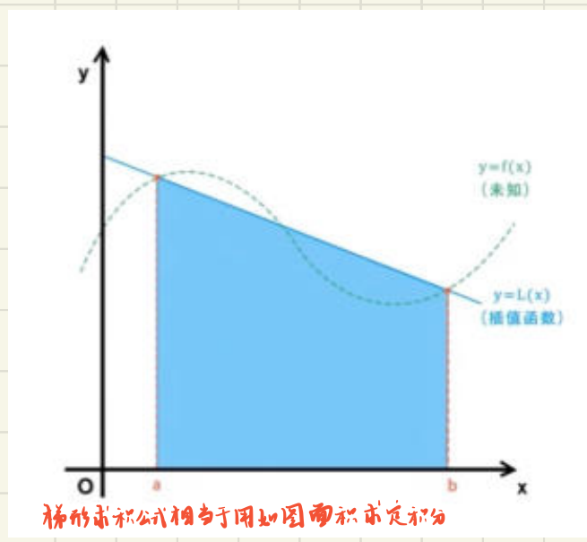
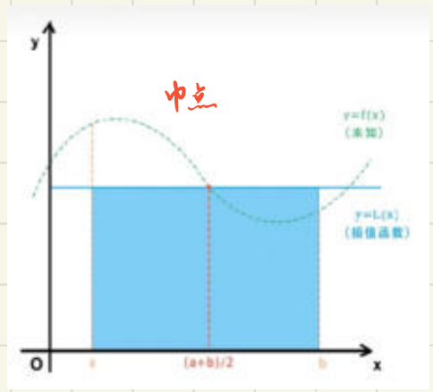
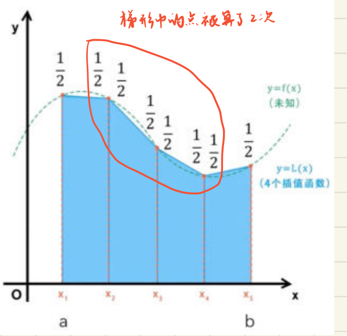
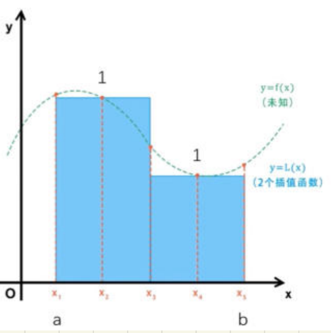
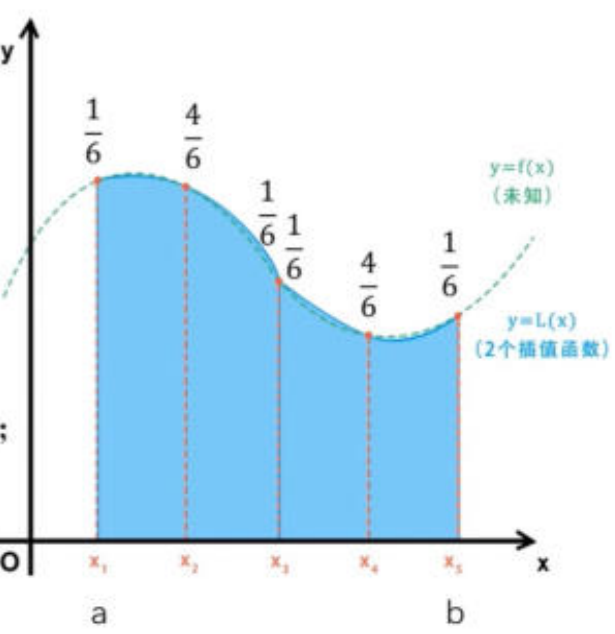

# 数值积分（第六章）

整理自 `计算方法笔记本（压缩）.pdf` 第 50 到 54 页（第六章开头到复化求积公式）。重制版 PPT 已经把概念推过一遍，这里只放手算用得上的：公式速查表、每种手算的操作步骤、笔记里红笔圈出来的提醒，最后补三道自己算过的练手题。笔记里定理编号一会儿是 6.1、一会儿是 7.2，那是贴了两本教材的截图，内容不冲突，看内容别看编号。

## 数值积分公式的一般形式

用 $f(x)$ 在 $[a,b]$ 上一些离散点 $a\le x_0<x_1<\cdots<x_n\le b$ 的函数值的**加权平均**作为 $f(\xi)$ 的近似值：

$$\int_a^b f(x)\,\mathrm{d}x\approx\sum_{k=0}^{n}\omega_k f(x_k)$$

这叫**机械求积方法**。 $\omega_k$ 是**求积系数**， $x_k$ 是**求积节点**。

笔记标了三条好处：把定积分算成被积函数的函数值计算；无需求原函数；易于计算机实现。

## 插值型求积公式与代数精度

### 系数是怎么来的

$n$ 次拉格朗日插值多项式及其余项：

$$P(x)+E(x)=\sum_{k=0}^{n}f_k l_k(x)+\frac{f^{(n+1)}(\xi)}{(n+1)!}\pi(x)$$

其中

$$l_k(x)=\frac{(x-x_0)\cdots(x-x_{k-1})(x-x_{k+1})\cdots(x-x_n)}{(x_k-x_0)\cdots(x_k-x_{k-1})(x_k-x_{k+1})\cdots(x_k-x_n)}$$

代入被积函数 $f(x)$ 两边积分：

$$I=\int_a^b f(x)\,\mathrm{d}x=\sum_{k=0}^{n}f_k\int_a^b l_k(x)\,\mathrm{d}x+\int_a^b\frac{f^{(n+1)}(\xi)}{(n+1)!}\pi(x)\,\mathrm{d}x\equiv\sum_{k=0}^{n}w_k^{(n)}f_k+R_n[f]$$

于是三样东西一次性定下来：

| 名称 | 表达式 |
| --- | --- |
| 求积系数 | $w_k^{(n)}=\int_a^b l_k(x)\,\mathrm{d}x,\quad k=0,1,\dots,n$ |
| 数值积分公式 | $Q_n[f]=\sum\limits_{k=0}^{n}w_k^{(n)}f_k$ |
| 求积余项 | $R_n[f]=\dfrac{1}{(n+1)!}\displaystyle\int_a^b f^{(n+1)}(\xi)\pi(x)\,\mathrm{d}x,\ \xi\in(a,b)$ |

笔记在页边把这一步单独又写了一遍，意思是求积系数只跟节点位置有关，跟 $f$ 无关：

$$\int_a^b L_n(x)\,\mathrm{d}x=\int_a^b\Big(\sum_{k=0}^{n}l_k(x)y_k\Big)\mathrm{d}x=\sum_{k=0}^{n}\Big[\int_a^b l_k(x)\,\mathrm{d}x\Big]y_k$$

方括号里那一坨就是 $w_k^{(n)}$。所以**换被积函数不用重算系数**，节点不动系数就不动。

### 代数精度的定义

对所有次数不超过 $m$ 的多项式 $f(x)$，公式 $\int_a^b f(x)\mathrm{d}x\approx\sum_{k=0}^n\omega_k f(x_k)$ 精确成立，但对某个次数为 $m+1$ 的多项式不精确成立，就说该求积公式具有 ** $m$ 次代数精度**。

### 验证代数精度的手算步骤

1. 把 $f(x)=1$ 代进去。左边 $\sum\omega_i$，右边 $b-a$，看相不相等。
2. 依次换成 $f(x)=x,x^2,\dots$。第 $k$ 次要验的等式是

   $$\sum_{i=0}^{n}\omega_i x_i^{k}=\int_a^b x^k\,\mathrm{d}x=\frac{b^{k+1}-a^{k+1}}{k+1},\quad k=0,1,\dots,m$$
3. 一直验到第一次**不成立**为止：

   $$\sum_{i=0}^{n}\omega_i x_i^{m+1}\ne\int_a^b x^{m+1}\,\mathrm{d}x=\frac{b^{m+2}-a^{m+2}}{m+2}$$
4. 最后那个不成立的次数是 $m+1$，答案就是 $m$ 次。

验到不成立才能停。只验到某次成立就下结论，是这类题最常见的丢分点。

区间对称（比如 $[-1,1]$）时，奇次幂两边都是 $0$，会自动成立，所以**奇数次验不出问题**，重点看偶次幂。下面练手题一就是这个现象。

### 两条性质

- 插值型求积公式具有**至少 $n$ 次代数精度**。因为 $\int_a^b f(x)\mathrm{d}x\approx\int_a^b L_n(x)\mathrm{d}x=\sum_{i=0}^{n}f(x_i)\int_a^b l_i(x)\mathrm{d}x=\sum_{i=0}^{n}\omega_i^{(n)}f(x_i)$，而 $n$ 次以内的多项式插值没有误差。
- 定理 6.1：形如 $\int_a^b f(x)\mathrm{d}x\approx\sum_{i=0}^{n}A_i f(x_i)$ 的 $n+1$ 点求积公式，其代数精度至少为 $n$ 的**充要条件**是它是插值型的。

必要性笔记用红笔给了一行证明，考试要是让证就照这个写：取 $f(x)=l_i(x)$ 代入。 $k=i$ 时 $l_i(x_k)=1$，其它 $l_i(x_k)=0$，故

$$\int_a^b l_i(x)\,\mathrm{d}x=\sum_{k=0}^{n}A_k l_i(x_k)=A_i$$

## 牛顿-柯特斯公式

前提一句话：**所有求积节点等距**。

$$x_k=a+kh,\quad k=0,\dots,n,\quad h=\frac{b-a}{n}$$

### 系数通式的推导步骤

1. 做变量替换 $x=a+th$， $0\le t\le n$，此时 $x_k=a+kh$， $x-x_j=(t-j)h$， $x_k-x_j=(k-j)h$， $\mathrm{d}x=h\,\mathrm{d}t$。
2. 代进 $w_k^{(n)}=\int_a^b\prod_{j\ne k}\frac{x-x_j}{x_k-x_j}\mathrm{d}x$，分子分母各出 $n$ 个 $h$，约掉后只剩一个 $h$（来自 $\mathrm{d}x$）。
3. 分母的 $\prod_{j\ne k}(k-j)$ 整理成 $(-1)^{n-k}k!(n-k)!$。
4. 得到通式：

$$w_k^{(n)}=\frac{(-1)^{n-k}h}{k!\,(n-k)!}\int_0^n t(t-1)\cdots(t-k+1)(t-k-1)\cdots(t-n)\,\mathrm{d}t$$

注意积分号里是**去掉第 $k$ 个因子**的连乘，积分上限是 $n$ 不是 $1$。此时 $Q_n[f]=\sum_{k=0}^{n}w_k^{(n)}f_k$ 称为**牛顿-柯特斯公式**。

### $n=1$：梯形求积公式

$$w_0^{(1)}=-(b-a)\int_0^1(t-1)\,\mathrm{d}t=\frac12(b-a),\qquad w_1^{(1)}=(b-a)\int_0^1 t\,\mathrm{d}t=\frac12(b-a)$$

（更正：原文 $k=0$ 那行积分号里写成 $t(t-1)$。 $k=0$ 要去掉的是 $t$ 这个因子，只剩 $(t-1)$；按原文写法算出来是 $\frac{b-a}{6}$，跟后面的 $\frac12(b-a)$ 对不上。）

$$Q_1[f]=\frac{b-a}{2}[f(a)+f(b)]$$

$$R_1[f]=\frac12 f''(\eta)\int_a^b(x-a)(x-b)\,\mathrm{d}x=-\frac{1}{12}(b-a)^3f''(\eta)$$

用两个区间端点建立一次插值多项式，几何上就是用梯形面积代替曲边梯形面积。

图里直线和虚线之间夹着的两块面积，一块多算、一块少算，就是 $R_1[f]$ 的来源。 $f$ 越弯（ $f''$ 越大）这两块越大，所以余项里是 $f''$。

### $n=2$：抛物线求积公式（辛普森公式）

此时 $h=\frac{b-a}{2}$，三个系数：

$$w_0^{(2)}=\frac h2\int_0^2(t-1)(t-2)\,\mathrm{d}t=\frac13h=\frac16(b-a)$$

$$w_1^{(2)}=-h\int_0^2 t(t-2)\,\mathrm{d}t=\frac43h=\frac46(b-a)$$

$$w_2^{(2)}=\frac h2\int_0^2 t(t-1)\,\mathrm{d}t=\frac13h=\frac16(b-a)$$

（原稿 $k=2$ 那行中间一步写得像 $\frac16h$，按积分算是 $\frac13h$，最后的 $\frac16(b-a)$ 没错。）

$$Q_2[f]=\frac{b-a}{6}\Big[f(a)+4f\Big(\frac{a+b}{2}\Big)+f(b)\Big]$$

$$R_2[f]=\frac{1}{3!}\int_a^b f^{(3)}(\xi)\pi(x)\,\mathrm{d}x=-\frac{b-a}{180}h^4f^{(4)}(\eta),\quad \eta\in(a,b),\ h=\frac{b-a}{2}$$

用两个区间端点加一个区间中点建立二次插值多项式。余项的 $h$ 是 $\frac{b-a}{2}$，笔记在旁边特意又标了一次，代进去等价于 $-\frac{(b-a)^5}{2880}f^{(4)}(\eta)$。

### 辛普森公式的另一种推法（笔记第 52 页）

如果题目让"推导"而不是"写出"，按这个顺序走：

1. 写过三点的拉格朗日插值函数 $L(x)\approx f(x_0)l_0(x)+f(x_1)l_1(x)+f(x_2)l_2(x)$，其中

   $$l_0(x)=\frac{(x-x_1)(x-x_2)}{(x_0-x_1)(x_0-x_2)},\quad l_1(x)=\frac{(x-x_0)(x-x_2)}{(x_1-x_0)(x_1-x_2)},\quad l_2(x)=\frac{(x-x_0)(x-x_1)}{(x_2-x_0)(x_2-x_1)}$$
2. 两边同时积分： $\int_a^b L(x)\mathrm{d}x=\sum_i f(x_i)\int_a^b l_i(x)\mathrm{d}x$。
3. 把 $x_0=a$、 $x_1=\frac{a+b}{2}$、 $x_2=b$ 代进去，逐个把 $\int_a^b l_i(x)\mathrm{d}x$ 算出来。以 $l_0$ 为例：

   $$\int_a^b l_0(x)\,\mathrm{d}x=\frac{1}{(x_0-x_1)(x_0-x_2)}\int_a^b\big[x^2-(x_1+x_2)x+x_1x_2\big]\mathrm{d}x=\frac{2}{(a-b)^2}\cdot\frac{b-a}{12}(b^2-2ab+a^2)=\frac{b-a}{6}$$
4. 同理得 $\frac{4(b-a)}{6}$ 和 $\frac{b-a}{6}$，拼起来就是辛普森公式。

### 柯特斯系数表

各函数值前的系数叫 **Cotes 系数**：

| $n$ | Cotes 系数 |
| --- | --- |
| 0 | $1$ |
| 1 | $\frac12,\ \frac12$ |
| 2 | $\frac16,\ \frac46,\ \frac16$ |
| 3 | $\frac18,\ \frac38,\ \frac38,\ \frac18$ |
| 4 | $\frac{7}{90},\ \frac{32}{90},\ \frac{12}{90},\ \frac{32}{90},\ \frac{7}{90}$ |

三条性质（笔记用红笔圈了"背"）：

1. 每一行的和总为 $1$。
2. 每一行都是对称的。
3. 当 $n\ge 8$ 时，系数开始有负值。

前两条是最好用的自查手段：写完系数先加一遍，不等于 $1$ 就是算错了。第三条我复算了一下： $n=8$ 确实首次出现负系数， $n=9$ 又全为正， $n=10$ 起再次出现负值，所以准确说法是 $n\ge 8$ 以后不再保证全正。系数一出负值，舍入误差就可能被放大，这也是实际不用高次牛顿-柯特斯、改用复合公式的原因。

### 常用求积公式速查

| 公式 | 节点数 | 表达式 | 代数精度 | 截断误差 |
| --- | --- | --- | --- | --- |
| 中点 $M(f)$ | 1 | $(b-a)f\big(\frac{a+b}{2}\big)$ | 1 | $E_M=\frac{(b-a)^3}{24}f''(\xi)$ |
| 梯形 $T(f)$ | 2 | $\frac{b-a}{2}[f(a)+f(b)]$ | 1 | $E_T=-\frac{(b-a)^3}{12}f''(\xi)$ |
| Simpson $S(f)$ | 3 | $\frac{b-a}{6}\big[f(a)+4f\big(\frac{a+b}{2}\big)+f(b)\big]$ | 3 | $E_S=-\frac{(b-a)^5}{2880}f^{(4)}(\xi)$ |
| Cotes $C(f)$ | 5 | $\frac{b-a}{90}[7f(x_1)+32f(x_2)+12f(x_3)+32f(x_4)+7f(x_5)]$ | 5 | $E_C=-\frac{(b-a)^7}{1935360}f^{(6)}(\xi)$ |

节点说明照抄笔记的红字：中点 1 个节点；梯形 2 个节点；Simpson 3 个节点，是 2 个区间端点加 1 个区间中点；Cotes 5 个节点，用五个区间四等分点（包括端点）建立四次插值多项式。

中点公式只用一个节点，插值函数是常数，图上就是一个矩形。它只有 1 个节点，代数精度却和 2 个节点的梯形公式一样是 1 次：对一次函数，矩形在中点左右多算和少算的两块三角形面积正好抵消。误差系数 $\frac1{24}$ 也只有梯形 $\frac1{12}$ 的一半，符号相反。

这四条的代数精度、截断误差我都用 sympy 逐条复算过，跟笔记一致。Cotes 那个 $1935360$ 看着吓人，其实就是 $\frac{2(b-a)}{945}h^6$ 里代 $h=\frac{b-a}{4}$ 得来的。另外注意 Cotes 公式笔记里把节点写成 $x_1$ 到 $x_5$（从 1 开始编号），跟前面 $x_0$ 到 $x_n$ 的编号不是一套，别对错位。

求积余项的通用写法（笔记页边框出来的）：

$$R_n(x)=\frac{f^{(n+1)}(\xi)}{(n+1)!}\omega_{n+1}(x)$$

### 代数精度的奇偶规律

定理 7.2：

- $n$ 为**偶数**， $f\in C^{n+2}[a,b]$：

  $$R_n[f]=C_nh^{n+3}f^{(n+2)}(\eta),\quad C_n=\frac{1}{(n+2)!}\int_0^n t^2(t-1)\cdots(t-n)\,\mathrm{d}t$$
- $n$ 为**奇数**， $f\in C^{n+1}[a,b]$：

  $$R_n[f]=C_nh^{n+2}f^{(n+1)}(\eta),\quad C_n=\frac{1}{(n+1)!}\int_0^n t(t-1)\cdots(t-n)\,\mathrm{d}t$$

偶数那个 $C_n$ 的被积函数开头是 $t^2$，多一个 $t$，笔记专门用红笔在那里点了一下。

由此得到的结论，笔记正反抄了两遍：

| $n$ 的奇偶 | 节点数 $n+1$ | $Q_n[f]$ 的代数精度 |
| --- | --- | --- |
| 奇数 | 偶数个 | $n$ |
| 偶数 | 奇数个 | $n+1$（白赚一次） |

对上具体公式： $n=1\to m=1$（梯形）， $n=2\to m=3$（Simpson）， $n=3\to m=3$， $n=4\to m=5$（Cotes）， $n=5\to m=5$。所以 $n=2$ 和 $n=3$ 精度相等、 $n=4$ 和 $n=5$ 精度相等，**人们更愿意用 $n$ 为偶数的 Newton-Cotes 公式**，同样的精度少算一个点。

换个说法记也行：拥有**奇数个**（ $n+1$ 个）节点的求积公式，其代数精度至少为 $n+1$。

### 顺带记住的上限

具有 $n+1$ 个节点的求积公式，代数精度**最高为 $2n+1$**。取到这个上限的是 Gauss-Legendre 求积公式，笔记给了 $[-1,1]$ 上的三个：

| 节点数 | 公式 | 代数精度 |
| --- | --- | --- |
| 1 | $\int_{-1}^{1}f(x)\mathrm{d}x\approx 2f(0)$ | 1 |
| 2 | $\int_{-1}^{1}f(x)\mathrm{d}x\approx f\big(-\frac{\sqrt3}{3}\big)+f\big(\frac{\sqrt3}{3}\big)$ | 3 |
| 3 | $\int_{-1}^{1}f(x)\mathrm{d}x\approx\frac59 f(-\sqrt{0.6})+\frac89 f(0)+\frac59 f(\sqrt{0.6})$ | 5 |

这三条的代数精度我也验过，确实是 1、3、5。对比一下就能体会差距：3 个节点，牛顿-柯特斯（Simpson）只有 3 次精度，Gauss 有 5 次。

## 复合求积公式

为什么要复合：牛顿-柯特斯求积法在 $n$ 趋于无穷时不能保证收敛性和稳定性，实际中不建立高次插值函数，而是把积分区间细化。

### 复合梯形

$[a,b]$ 做 $m$ 等分， $h=\frac{b-a}{m}$， $x_k=a+kh$， $k=0,1,\dots,m$：

$$Q_1^{(m)}[f]=\frac h2\Big(f_0+f_m+2\sum_{k=1}^{m-1}f_k\Big)$$

$$R_1^{(m)}[f]=-\sum_{k=1}^{m}\frac{h^3}{12}f''(\eta_k)=-\frac{mh^3}{12}f''(\eta)=-\frac{(b-a)h^2}{12}f''(\eta),\quad\eta\in(a,b)$$

中间那些点的系数是 $2$ 不是 $1$，笔记在图上圈出来写了一句：**梯形中的点被算了 2 次**。两个相邻小梯形都用到它，所以合并后翻倍。首尾两点只被用一次，系数是 $1$。

图上每个小梯形给两端点各分 $\frac12$ 的权重（以 $h$ 为单位），内部节点被左右两个小梯形各分一次，合起来是 $1$，也就是公式里 $\frac h2$ 后面的系数 $2$。

### 复合抛物线（复合 Simpson）

$[a,b]$ 做 $2m$ 等分， $h=\frac{b-a}{2m}$， $x_k=a+kh$， $k=0,1,\dots,2m$：

$$Q_2^{(2m)}[f]=\frac h3\Big(f_0+4\sum_{i=0}^{m-1}f_{2i+1}+2\sum_{i=1}^{m-1}f_{2i}+f_{2m}\Big)$$

$$R_2^{(2m)}[f]=-\frac{h^5}{90}\sum_{i=1}^{m}f^{(4)}(\eta_i)=-\frac{mh^5}{90}f^{(4)}(\eta)=-\frac{b-a}{180}h^4f^{(4)}(\eta)$$

下标奇偶别搞反，笔记用红字标了：**奇数下标 $f_{2i+1}$ 是子区间中点，配 4**；**偶数下标 $f_{2i}$ 是子区间端点，配 2**。数一下系数分布应该是 $1,4,2,4,2,\dots,4,1$，两端是 1，中点全是 4。

### 第 54 页的另一套记号

同样三条公式，第 54 页用的是" $n$ 个子区间、 $h=\frac{b-a}{n}$"的写法，考试两种都可能见到：

| 公式 | 表达式 | 截断误差 |
| --- | --- | --- |
| 复化中点 | $M_n(f)\approx h\sum\limits_{i}f(x_{i+\frac12})$ | $E_{M_n}=\frac{(b-a)h^2}{24}f''(\xi)$ |
| 复化梯形 | $T_n(f)\approx\frac h2\big[f(a)+2\sum\limits_{i=1}^{n-1}f(x_i)+f(b)\big]$ | $E_{T_n}=-\frac{(b-a)h^2}{12}f''(\xi)$ |
| 复化 Simpson | $S_n(f)\approx\frac h6\big[f(a)+2\sum\limits_{i=1}^{n-1}f(x_i)+4\sum\limits_{i=0}^{n-1}f(x_{i+\frac12})+f(b)\big]$ | $E_{S_n}=-\frac{(b-a)h^4}{2880}f^{(4)}(\xi)$ |

（原稿复化 Simpson 那行截断误差的记号写成 $E_{T_n}$，按上下文应是 $E_{S_n}$，公式本身没错。）

第 54 页给复化中点和复化 Simpson 各配了一张图，节点都是 $x_1$ 到 $x_5$，分成 2 个子区间 $[x_1,x_3]$、 $[x_3,x_5]$， $x_2$、 $x_4$ 是子区间中点：

两张图上的数字是以子区间长 $h$ 为单位的权重。复化中点每个中点权重 $1$，对应 $h\sum f(x_{i+\frac12})$。复化 Simpson 每个子区间是 $\frac16,\frac46,\frac16$，内部端点 $x_3$ 被左右两段各分到 $\frac16$，合起来 $\frac26$，所以公式写成 $\frac h6[f(a)+2\sum f(x_i)+4\sum f(x_{i+\frac12})+f(b)]$。

两套记号的 $h$ 含义不一样，这是最容易翻车的地方。第 51 页的复合 Simpson 里 $h$ 是**半个**子区间长 $\frac{b-a}{2m}$，所以前面是 $\frac h3$；第 54 页的 $h$ 是**整个**子区间长 $\frac{b-a}{n}$，所以前面是 $\frac h6$。代数上两者完全等价。

### 记余项的口诀

笔记写在第 54 页页边：**看成只留下一个 $b-a$，将剩下的 $b-a$ 全看成 $h$ 的多少次方**。

拿单区间的 $E_T=-\frac{(b-a)^3}{12}f''$ 举例：留一个 $b-a$，剩下的 $(b-a)^2$ 换成 $h^2$，就是复合梯形的 $-\frac{(b-a)h^2}{12}f''$。Simpson 同理， $(b-a)^5$ 留一个，剩四个变 $h^4$，得 $-\frac{(b-a)h^4}{2880}f^{(4)}$。中点是 $+\frac{(b-a)h^2}{24}f''$，符号是正的，别跟梯形混。

顺便记一下精度阶：复合梯形和复合中点是 $O(h^2)$，复合 Simpson 是 $O(h^4)$。步长减半，梯形误差约降到 $\frac14$，Simpson 约降到 $\frac1{16}$。

## 分半加速算法与龙贝格公式

### 分半递推

步长 $h=\frac{b-a}{m}$ 时：

$$Q_1^{(m)}[f]=\frac h2\Big(f_0+2\sum_{i=1}^{m-1}f_i+f_m\Big)$$

步长对折成 $h'=\frac h2=\frac{b-a}{2m}$ 时：

$$Q_1^{(2m)}[f]=\frac{h'}{2}\Big(f_0+2\sum_{i=1}^{2m-1}f_i+f_{2m}\Big)=\frac12 Q_1^{(m)}[f]+h'\sum_{j=0}^{m-1}f_{2j+1}$$

右边那个形式是手算的关键：**老的梯形值折半，加上新插进来的那些点的函数值乘 $h'$**。原有的 $m+1$ 个函数值一个都不用重算，只算新增的 $m$ 个中点。这就是"分半加速"里"加速"的来源。

### 龙贝格（Romberg）公式

$$Q_2^{(2m)}[f]=\frac{2^2Q_1^{(2m)}[f]-Q_1^{(m)}[f]}{2^2-1}$$

$$Q_4^{(4m)}[f]=\frac{2^4Q_2^{(4m)}[f]-Q_2^{(2m)}[f]}{2^4-1}$$

$$Q_6^{(8m)}[f]=\frac{2^6Q_4^{(8m)}[f]-Q_4^{(4m)}[f]}{2^6-1}$$

分母依次是 $3$、 $15$、 $63$。指数 $2,4,6$ 是每一列误差的阶数，别背成 $2^1,2^2,2^3$。我验过一次： $\frac{2^2T_{2m}-T_m}{2^2-1}$ 展开以后确实等于复合 Simpson 公式，所以第二列不是"近似"，是恒等。

### 龙贝格表怎么填

1. 第一列填复合梯形值 $T_1,T_2,T_4,T_8,\dots$，下标是等分数，每行用分半递推从上一行推，只算新增中点。
2. 第二列（Simpson 列）：拿第一列**相邻两个**，按 $\frac{4\times(\text{下})-(\text{上})}{3}$ 算，写在两者的右下方。 $k$ 个 $T$ 值能出 $k-1$ 个 $S$ 值。
3. 第三列（Cotes 列）：拿第二列相邻两个， $\frac{16\times(\text{下})-(\text{上})}{15}$。
4. 第四列（Romberg 列）：拿第三列相邻两个， $\frac{64\times(\text{下})-(\text{上})}{63}$。
5. 每往右一列少一个数。停止判断看最后两个数差的绝对值小于给定精度。

排版上写成下三角，每个新数都靠它左上和正左两个数算出来：

| 等分数 | $T$ 列 | $S$ 列（ $\div 3$） | $C$ 列（ $\div 15$） | $R$ 列（ $\div 63$） |
| --- | --- | --- | --- | --- |
| 1 | $T_1$ | | | |
| 2 | $T_2$ | $S_2$ | | |
| 4 | $T_4$ | $S_4$ | $C_4$ | |
| 8 | $T_8$ | $S_8$ | $C_8$ | $R_8$ |

下标统一按等分数写。 $S_2$ 由 $T_1,T_2$ 外推而来，数值上等于 2 等分的复合 Simpson 值，往右每列同理。

## 练手题

源笔记这几页没有例题，下面三道是我自己配的，答案都用 sympy 复算过。

### 例 1 确定系数使代数精度最高

**题目**：确定 $\int_{-1}^{1}f(x)\mathrm{d}x\approx A_0f(-1)+A_1f(0)+A_2f(1)$ 中的系数，使代数精度尽可能高，并指出代数精度。

**步骤**：

1. 三个待定系数，先让 $f=1,x,x^2$ 精确成立，列三个方程：

   $$A_0+A_1+A_2=\int_{-1}^{1}1\,\mathrm{d}x=2$$
   $$-A_0+A_2=\int_{-1}^{1}x\,\mathrm{d}x=0$$
   $$A_0+A_2=\int_{-1}^{1}x^2\,\mathrm{d}x=\frac23$$
2. 由第二式 $A_0=A_2$，代入第三式得 $A_0=A_2=\frac13$，再由第一式 $A_1=\frac43$。
3. 验 $f=x^3$：左边 $-\frac13+\frac13=0$，右边 $\int_{-1}^{1}x^3\mathrm{d}x=0$，成立。
4. 验 $f=x^4$：左边 $\frac13+\frac13=\frac23$，右边 $\int_{-1}^{1}x^4\mathrm{d}x=\frac25$，不成立。

**结果**： $A_0=A_2=\frac13$， $A_1=\frac43$，代数精度 3 次。这正是 $[-1,1]$ 上的 Simpson 公式（ $\frac{b-a}{6}=\frac13$），也对上了" $n=2$ 白赚一次"的规律。

第 3 步千万别漏。 $x^3$ 在对称区间上自动成立，不查到 $x^4$ 就没法确定精度是 3 而不是 2。

### 例 2 复合梯形与复合 Simpson

**题目**：用复合梯形（4 等分）和复合 Simpson（4 等分）计算 $I=\int_0^1\frac{1}{1+x}\mathrm{d}x$，与精确值 $\ln 2=0.693147$ 比较。

**步骤**：

1. $h=0.25$，列函数值表：

   | $x$ | 0 | 0.25 | 0.5 | 0.75 | 1 |
   | --- | --- | --- | --- | --- | --- |
   | $f(x)$ | 1.000000 | 0.800000 | 0.666667 | 0.571429 | 0.500000 |
2. 复合梯形，两端系数 1，中间系数 2：

   $$T_4=\frac{0.25}{2}\big[1+2(0.8+0.666667+0.571429)+0.5\big]=0.125\times 5.576190=0.697024$$
3. 复合 Simpson，这里 4 等分意味着 2 个子区间， $x=0.25$ 和 $x=0.75$ 是子区间中点配 4， $x=0.5$ 是内部端点配 2：

   $$S=\frac{0.25}{3}\big[1+4(0.8+0.571429)+2\times 0.666667+0.5\big]=\frac{8.319048}{12}=0.693254$$

**结果**： $T_4=0.697024$，误差 $3.88\times10^{-3}$； $S=0.693254$，误差 $1.07\times10^{-4}$。同样 5 个函数值，Simpson 误差小了约 36 倍。

### 例 3 龙贝格表

**题目**：对同一个 $I=\int_0^1\frac{1}{1+x}\mathrm{d}x$，从 $T_1$ 算到 $T_8$，用龙贝格算法加速。

**步骤**：

1. $T_1=\frac12(1+0.5)=0.750000$。
2. 分半： $T_2=\frac12T_1+0.5\times f(0.5)=0.375000+0.5\times0.666667=0.708333$。
3. $T_4=\frac12T_2+0.25\times[f(0.25)+f(0.75)]=0.354167+0.25\times1.371429=0.697024$。
4. $T_8=\frac12T_4+0.125\times[f(0.125)+f(0.375)+f(0.625)+f(0.875)]$，四个新函数值是 $0.888889,\ 0.727273,\ 0.615385,\ 0.533333$，得 $T_8=0.348512+0.125\times2.764880=0.694122$。
5. 逐列外推，填表：

| 等分数 | $T$ 列 | $S$ 列 | $C$ 列 | $R$ 列 |
| --- | --- | --- | --- | --- |
| 1 | 0.750000 | | | |
| 2 | 0.708333 | 0.694444 | | |
| 4 | 0.697024 | 0.693254 | 0.693175 | |
| 8 | 0.694122 | 0.693155 | 0.693148 | 0.693147 |

示范一格： $S$ 列第一个 $=\frac{4\times0.708333-0.750000}{3}=0.694444$； $C$ 列第一个 $=\frac{16\times0.693254-0.694444}{15}=0.693175$； $R$ 列 $=\frac{64\times0.693148-0.693175}{63}=0.693147$。

**结果**：各列误差依次约为 $9.7\times10^{-4}$（ $T_8$）、 $7.4\times10^{-6}$（ $S$ 末项）、 $7.2\times10^{-7}$（ $C$ 末项）、 $3.0\times10^{-7}$（ $R$）。只算了 9 个函数值，精度从三位小数提到六位。

手算这类题，中间结果至少留 6 位小数。外推时要乘 $64$，前面截断到 4 位的话误差会被直接放大。

## 原稿几处存疑

- 第 51 页 $n=1$ 求系数那行，积分号里写成 $t(t-1)$，应为 $(t-1)$（上面已更正）。
- 第 51 页 $n=2$、 $k=2$ 那行中间结果写得像 $\frac16h$，按积分应为 $\frac13h$，最终答案不受影响。
- 第 54 页复化 Simpson 的截断误差记号写成 $E_{T_n}$，应为 $E_{S_n}$。
- 第 53 页右上角有一处零散涂写（" $x^2$"以及编号 ①②③ 旁的 $2x$、 $2$ 等），原稿此处没写清跟哪条公式对应，没有整理进来。
