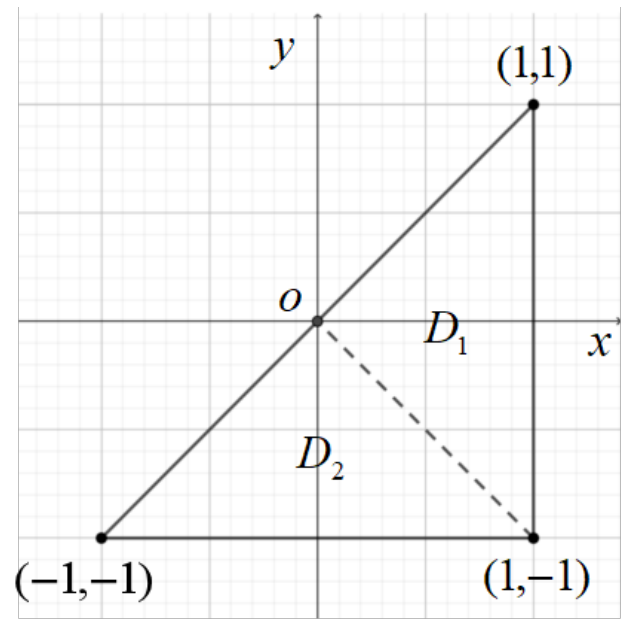

# 作业六、七：二重积分与三重积分

本篇整理自 `2022版作业微积分 AII（教师版）(1).pdf` 第 22 至 29 页的"第六次作业"（二重积分）和"第七次作业"（三重积分、 $\Gamma$ 与 $\mathrm B$ 函数），第 30 页为空白页。

教师版给了答案和计算题解答，这里补上思路和省略的步骤，所有积分都用 sympy 重算过。发现的问题：

- 第七次作业填空 3：按印刷的被积函数 $(x+1)(y+z)(z+1)$ 算出来是 $\frac\pi4$，原答案 $\frac{2\pi}{3}$ 对应的被积函数是 $(x+1)(y+1)(z+1)$，题目或答案有一处印错。
- 第七次作业计算 5：最终结果括号里应为 $\frac{c^2}{9}$，原文作 $\frac{z^2}{9}$；另有两处笔误在原处注明。
- 第七次作业选择 1 的 $\Omega_2$ 漏写" $z\ge0$"的 0，选择 4 的被积式漏写 $f(x,y,z)$。

本章要点：

- 对称性：区域关于 $x=0$ 对称时，被积函数对 $x$ 为奇函数则积分为 0，为偶函数则等于一半区域上积分的 2 倍；轮换对称时可以交换 $x,y$。
- 极坐标 $d\sigma=r\,dr\,d\theta$；柱坐标 $dV=r\,dr\,d\theta\,dz$；球坐标 $dV=r^2\sin\varphi\,dr\,d\varphi\,d\theta$。
- 一般换元 $d\sigma=\left|\frac{\partial(x,y)}{\partial(u,v)}\right|du\,dv=\frac{du\,dv}{\left|\frac{\partial(u,v)}{\partial(x,y)}\right|}$。
- 被积函数只含 $z$、截面面积好算时，用"先二后一"： $\iiint_\Omega g(z)\,dV=\int g(z)\,S(z)\,dz$。

---

## 第六次作业：二重积分

### 一、单项选择题

**1.** 设 $D$ 是 $xOy$ 平面上以 $(1,1)$， $(-1,1)$ 和 $(-1,-1)$ 为顶点的三角形区域， $D_1$ 是 $D$ 的第一象限部分，则 $\iint_D(xy+\cos x\sin y)\,d\sigma$ 等于 $(\quad)$。

(A) $2\iint_{D_1}\cos x\sin y\,d\sigma$　(B) $2\iint_{D_1}xy\,d\sigma$　(C) $4\iint_{D_1}(xy+\cos x\sin y)\,d\sigma$　(D) $0$

思路： $D$ 本身没有对称性，用直线 $y=-x$ 把它切成两块，每块各有一种对称。

答案：A。 $y=-x$ 把 $D$ 分成 $T_1$（顶点 $(1,1),(-1,1),(0,0)$，关于 $y$ 轴对称）和 $T_2$（顶点 $(-1,1),(-1,-1),(0,0)$，关于 $x$ 轴对称）。

- $xy$ 在 $T_1$ 上对 $x$ 为奇，在 $T_2$ 上对 $y$ 为奇，积分为 0。
- $\cos x\sin y$ 在 $T_2$ 上对 $y$ 为奇，积分为 0；在 $T_1$ 上对 $x$ 为偶，等于右半块（正好是 $D_1$）上积分的 2 倍。

**2.** 设区域 $D=\lbrace(x,y)\mid x^2+y^2\le4,\ x\ge0,\ y\ge0\rbrace$， $f(x)$ 为 $D$ 上的正值连续函数， $a,b$ 为常数，则 $\iint_D\frac{a\sqrt{f(x)}+b\sqrt{f(y)}}{\sqrt{f(x)}+\sqrt{f(y)}}\,d\sigma=(\quad)$。

(A) $ab\pi$　(B) $\frac{ab\pi}{2}$　(C) $(a+b)\pi$　(D) $\frac{(a+b)\pi}{2}$

思路： $D$ 关于 $y=x$ 对称，交换 $x,y$ 积分值不变，把两种写法相加。

答案：D。记积分为 $I$，交换 $x,y$ 得 $I=\iint_D\frac{a\sqrt{f(y)}+b\sqrt{f(x)}}{\sqrt{f(x)}+\sqrt{f(y)}}d\sigma$。两式相加，被积函数变成 $a+b$， $2I=(a+b)\cdot S_D=(a+b)\pi$。

**3.** 设平面区域 $D=\lbrace(x,y)\mid x^2+y^2\le1\rbrace$， $M=\iint_D(x+y)^3d\sigma$， $N=\iint_D\cos x^2\sin y^2d\sigma$， $P=\iint_D\left[e^{-(x^2+y^2)}-1\right]d\sigma$，则有 $(\quad)$。

(A) $M>N>P$　(B) $N>M>P$　(C) $M>P>N$　(D) $N>P>M$

思路：只需判断正负号。

答案：B。 $(x+y)^3$ 在 $(x,y)\to(-x,-y)$ 下变号， $D$ 关于原点对称， $M=0$。 $D$ 上 $x^2\le1<\frac\pi2$， $\cos x^2>0$， $\sin y^2\ge0$， $N>0$。 $e^{-(x^2+y^2)}\le1$， $P<0$。

**4.** 设 $f(x,y)$ 为连续函数，则 $\int_0^{\pi/2}d\theta\int_0^{\cos\theta}f(r\cos\theta,r\sin\theta)\,r\,dr$ 可以写成 $(\quad)$。

(A) $\int_0^1dy\int_0^{\sqrt{y-y^2}}f(x,y)\,dx$　(B) $\int_0^1dy\int_0^{\sqrt{1-y^2}}f(x,y)\,dx$　(C) $\int_0^1dx\int_0^1f(x,y)\,dy$　(D) $\int_0^1dx\int_0^{\sqrt{x-x^2}}f(x,y)\,dy$

思路：先还原积分区域。 $r\le\cos\theta$ 两边乘 $r$ 得 $x^2+y^2\le x$； $\theta\in\left[0,\frac\pi2\right]$ 表示 $y\ge0$。

答案：D。区域是圆 $\left(x-\frac12\right)^2+y^2\le\frac14$ 的上半部分， $0\le x\le1$， $0\le y\le\sqrt{x-x^2}$。若先对 $x$ 积分， $x$ 的范围应是 $\frac{1-\sqrt{1-4y^2}}{2}\le x\le\frac{1+\sqrt{1-4y^2}}{2}$，A 不对。

**5.** 设 $f(x,y)$ 为连续函数，则 $\int_0^2dy\int_0^{\sqrt{2y-y^2}}f(x^2+y^2)\,dx$ 化为极坐标形式的累次积分为 $(\quad)$。

(A) $\int_0^{\pi/2}d\theta\int_0^{2\sin\theta}f(r^2)\,dr$　(B) $\int_0^{\pi/2}d\theta\int_0^2f(r^2)\,r\,dr$　(C) $\int_0^{\pi/2}d\theta\int_0^{2\sin\theta}f(r^2)\,r\,dr$　(D) $\int_0^{\pi/2}d\theta\int_0^{2\cos\theta}f(r^2)\,r\,dr$

答案：C。 $0\le x\le\sqrt{2y-y^2}$ 即圆 $x^2+(y-1)^2\le1$ 的右半部分，极坐标下 $r\le2\sin\theta$， $\theta\in\left[0,\frac\pi2\right]$。A 漏了 $r$。

### 二、填空题

**1.** $\int_{-1}^0dx\int_{-x}^{2-x^2}(1-xy)\,dy+\int_0^1dx\int_x^{2-x^2}(1-xy)\,dy=$ ______。

思路：两块合起来是 $D=\lbrace-1\le x\le1,\ |x|\le y\le2-x^2\rbrace$，关于 $y$ 轴对称， $xy$ 对 $x$ 为奇。

答案： $\frac73$。积分等于 $D$ 的面积： $2\int_0^1(2-x^2-x)\,dx=2\left(2-\frac13-\frac12\right)=\frac73$。

**2.** 积分 $\int_0^8dx\int_{\sqrt[3]x}^2\frac{1}{1+y^4}dy=$ ______。

思路： $\frac{1}{1+y^4}$ 对 $y$ 积不出来，交换积分次序。

答案： $\frac{\ln17}{4}$。区域 $0\le y\le2$， $0\le x\le y^3$：

$$\int_0^2\frac{y^3}{1+y^4}dy=\frac14\ln(1+y^4)\Big|_0^2=\frac{\ln17}{4}.$$

**3.** 设平面区域 $D=\lbrace(x,y)\mid1\le x^2+y^2\le4,\ x\ge0,\ y\ge0\rbrace$，则 $\iint_D\sin\left(\pi\sqrt{x^2+y^2}\right)d\sigma=$ ______。

答案： $-\frac32$。极坐标下

$$\int_0^{\pi/2}d\theta\int_1^2r\sin\pi r\,dr=\frac\pi2\left[-\frac{r\cos\pi r}{\pi}+\frac{\sin\pi r}{\pi^2}\right]_1^2=\frac\pi2\left(-\frac2\pi-\frac1\pi\right)=-\frac32.$$

**4.** 设 $f(x)$ 为连续函数， $F(t)=\int_1^tdy\int_y^tf(x)\,dx$，则 $F'(2)=$ ______。

思路：上限 $t$ 同时出现在内外层，先交换次序变成单变量积分。

答案： $f(2)$。区域 $1\le y\le x\le t$，交换次序得 $F(t)=\int_1^tf(x)\,(x-1)\,dx$， $F'(t)=(t-1)f(t)$。

**5.** 设 $f(x,y)$ 为连续函数， $D=\lbrace(x,y)\mid x^2+y^2\le t^2\rbrace$，则 $\lim_{t\to0^+}\frac{1}{\pi t^2}\iint_Df(x,y)\,d\sigma=$ ______。

答案： $f(0,0)$。积分中值定理：存在 $(\xi,\eta)\in D$ 使积分等于 $f(\xi,\eta)\cdot\pi t^2$， $t\to0^+$ 时 $(\xi,\eta)\to(0,0)$。

### 三、解答题

**1.** 设平面区域 $D$ 由直线 $x=3y$， $y=3x$， $x+y=8$ 围成，计算 $\iint_Dx^2\,d\sigma$。

思路：先求三条直线的交点，下边界始终是 $y=\frac x3$，上边界在 $x=2$ 处由 $y=3x$ 换成 $y=8-x$，所以按 $x$ 分两段。

解答： $x+y=8$ 与 $y=3x$ 交于 $(2,6)$，与 $x=3y$ 交于 $(6,2)$。

$$\iint_Dx^2\,d\sigma=\int_0^2x^2\,dx\int_{x/3}^{3x}dy+\int_2^6x^2\,dx\int_{x/3}^{8-x}dy=\int_0^2\frac{8x^3}{3}dx+\int_2^6\left(8x^2-\frac{4x^3}{3}\right)dx$$

$$=\frac{32}{3}+\left(\frac{1664}{3}-\frac{1280}{3}\right)=\frac{416}{3}.$$

**2.** 设平面区域 $D=\lbrace(x,y)\mid0\le x\le2,\ 0\le y\le2\rbrace$，计算 $\iint_D\max\lbrace xy,1\rbrace\,d\sigma$。

思路：用曲线 $xy=1$ 把正方形分成两块，去掉 $\max$。 $xy<1$ 那块形状复杂，用"正方形面积减去 $xy>1$ 那块的面积"来算。

解答： $xy>1$ 的部分为 $\frac12\le x\le2$， $\frac1x<y\le2$。

$$\iint_{xy>1}xy\,d\sigma=\int_{1/2}^2x\,dx\int_{1/x}^2y\,dy=\int_{1/2}^2\left(2x-\frac{1}{2x}\right)dx=\frac{15}{4}-\ln2,$$

$$\iint_{xy>1}d\sigma=\int_{1/2}^2\left(2-\frac1x\right)dx=3-2\ln2.$$

所以

$$\iint_D\max\lbrace xy,1\rbrace\,d\sigma=\left(\frac{15}{4}-\ln2\right)+\left[4-(3-2\ln2)\right]=\frac{19}{4}+\ln2.$$

**3.** 计算 $\iint_D(x^2+y^2)\,d\sigma$，其中 $D=\lbrace(x,y)\mid0\le x\le2,\ \sqrt{2x-x^2}\le y\le\sqrt{4-x^2}\rbrace$。

思路：下边界是圆 $x^2+y^2=2x$（极坐标 $r=2\cos\theta$）的上半，上边界是圆 $r=2$，都在第一象限。

解答：

$$\iint_D(x^2+y^2)\,d\sigma=\int_0^{\pi/2}d\theta\int_{2\cos\theta}^2r^2\cdot r\,dr=\frac14\int_0^{\pi/2}(16-16\cos^4\theta)\,d\theta=4\left(\frac\pi2-\frac34\cdot\frac12\cdot\frac\pi2\right)=\frac{5\pi}{4}.$$

其中用到 $\int_0^{\pi/2}\cos^4\theta\,d\theta=\frac34\cdot\frac12\cdot\frac\pi2$。

**4.** 设平面区域 $D$ 由两条双曲线 $xy=1$， $xy=2$ 和两条直线 $y=x$， $y=4x$ 所围成的在第一象限内的闭区域，计算 $\iint_Dx^2y^2\,d\sigma$。

思路：边界是 $xy=$ 常数和 $\frac yx=$ 常数，令 $u=xy$， $v=\frac yx$，区域变成矩形。

解答：令 $u=xy$， $v=\frac yx$，则

$$\frac{\partial(u,v)}{\partial(x,y)}=\begin{vmatrix}y&x\\-\frac{y}{x^2}&\frac1x\end{vmatrix}=\frac yx+\frac yx=2v,$$

所以 $d\sigma=\frac{1}{2v}du\,dv$， $D$ 变为 $D'=\lbrace(u,v)\mid1\le u\le2,\ 1\le v\le4\rbrace$。

$$\iint_Dx^2y^2\,d\sigma=\iint_{D'}\frac{u^2}{2v}\,du\,dv=\int_1^2u^2\,du\int_1^4\frac{1}{2v}dv=\frac73\cdot\frac{\ln4}{2}=\frac{7\ln2}{3}.$$

**5.** 设连续函数 $f(x)$ 满足

$$f(x)=x^2+x\int_0^{x^2}f(x^2-t)\,dt+\iint_Df(xy)\,d\sigma,$$

其中区域 $D$ 是以 $(-1,-1)$， $(1,-1)$， $(1,1)$ 为顶点的三角形区域，且 $f(1)=0$，求 $\int_0^1f(x)\,dx$。

思路：二重积分是常数，记为 $A$。把 $x$ 换成 $xy$ 后在 $D$ 上积分，得到关于 $A$ 的方程；中间那项在 $D$ 上积分为 0 要靠对称性（和第 1 题同样的切法）。最后用 $f(1)=0$ 求出 $\int_0^1f$。

解答：令 $u=x^2-t$， $\int_0^{x^2}f(x^2-t)\,dt=\int_0^{x^2}f(u)\,du$。设 $\iint_Df(xy)\,d\sigma=A$，则

$$f(x)=x^2+x\int_0^{x^2}f(u)\,du+A,\qquad f(xy)=(xy)^2+(xy)\int_0^{(xy)^2}f(u)\,du+A.$$

在 $D$ 上积分：

$$A=\iint_Dx^2y^2\,d\sigma+\iint_D\left[(xy)\int_0^{(xy)^2}f(u)\,du\right]d\sigma+A\iint_Dd\sigma.$$

$D$ 的面积为 2。中间项的被积函数记为 $h(x,y)$，它在 $x\to-x$ 或 $y\to-y$ 下都变号；用 $y=-x$ 把 $D$ 分成关于 $x$ 轴对称的一块和关于 $y$ 轴对称的一块，两块上积分都是 0。于是 $A=\iint_Dx^2y^2\,d\sigma+2A$，

$$A=-\iint_Dx^2y^2\,d\sigma=-\int_{-1}^1x^2\,dx\int_{-1}^xy^2\,dy=-\int_{-1}^1\frac{x^2(x^3+1)}{3}dx=-\frac29.$$

所以 $f(x)=x^2+x\int_0^{x^2}f(u)\,du-\frac29$。代入 $x=1$： $0=1+\int_0^1f(u)\,du-\frac29$，

$$\int_0^1f(x)\,dx=-\frac79.$$

---

## 第七次作业：三重积分

### 一、单项选择题

**1.** 设有空间区域 $\Omega_1=\lbrace(x,y,z)\mid x^2+y^2+z^2\le R^2,\ z\ge0\rbrace$ 及 $\Omega_2=\lbrace(x,y,z)\mid x^2+y^2+z^2\le R^2,\ x\ge0,\ y\ge0,\ z\ge0\rbrace$，则 $(\quad)$。（原文 $\Omega_2$ 中" $z\ge$"后漏了 0。）

(A) $\iiint_{\Omega_1}x\,dV=4\iiint_{\Omega_2}z\,dV$　(B) $\iiint_{\Omega_1}y\,dV=4\iiint_{\Omega_2}z\,dV$　(C) $\iiint_{\Omega_1}z\,dV=4\iiint_{\Omega_2}z\,dV$　(D) $\iiint_{\Omega_1}xyz\,dV=4\iiint_{\Omega_2}xyz\,dV$

答案：C。上半球关于 $yOz$、 $xOz$ 面都对称。 $z$ 对 $x,y$ 都是偶函数，上半球上的积分是第一卦限的 4 倍。 $x$、 $y$、 $xyz$ 分别对 $x$ 或 $y$ 为奇，在 $\Omega_1$ 上积分为 0，而右边为正，A、B、D 都不成立。

**2.** 设 $\Omega$ 由平面 $x+y+z+1=0$， $x+y+z+2=0$， $x=0$， $y=0$， $z=0$ 围成， $I_1=\iiint_\Omega[\ln(x+y+z+3)]^2dV$， $I_2=\iiint_\Omega(x+y+z)^2dV$，则 $(\quad)$。

(A) $I_1<I_2$　(B) $I_1>I_2$　(C) $I_1\le I_2$　(D) $I_1\ge I_2$

思路：同一区域上比较积分，只需比较被积函数。

答案：A。 $\Omega$ 在 $x,y,z\le0$ 的卦限里， $-2\le x+y+z\le-1$。于是 $1\le x+y+z+3\le2$， $[\ln(x+y+z+3)]^2\le(\ln2)^2<1\le(x+y+z)^2$，严格小于，选 A。

**3.** 曲面 $z=\sqrt{x^2+y^2}$ 与 $z=2-x^2-y^2$ 所围成的立体体积为 $(\quad)$。

(A) $\frac\pi2$　(B) $\frac{5\pi}{6}$　(C) $\frac{2\pi}{3}$　(D) $\pi$

答案：B。两曲面交线： $r=2-r^2$， $r=1$。

$$V=\int_0^{2\pi}d\theta\int_0^1(2-r^2-r)\,r\,dr=2\pi\left(1-\frac14-\frac13\right)=\frac{5\pi}{6}.$$

**4.** 设空间区域 $\Omega=\lbrace(x,y,z)\mid\sqrt{x^2+y^2}\le z\le\sqrt{2-x^2-y^2}\rbrace$， $f(x,y,z)$ 为连续函数，则三重积分 $\iiint_\Omega f(x,y,z)\,dV=(\quad)$。（原文被积式漏写了 $f(x,y,z)$。）

- (A) $\int_{-1}^1dx\int_{-\sqrt{1-x^2}}^{\sqrt{1-x^2}}dy\int_{\sqrt{2-x^2-y^2}}^{\sqrt{x^2+y^2}}f(x,y,z)\,dz$
- (B) $4\int_0^1dx\int_0^{\sqrt{1-x^2}}dy\int_{\sqrt{x^2+y^2}}^{\sqrt{2-x^2-y^2}}f(x,y,z)\,dz$
- (C) $\int_0^{2\pi}d\theta\int_0^1dr\int_r^{2-r^2}f(r\cos\theta,r\sin\theta,z)\,dz$
- (D) $\int_0^{2\pi}d\theta\int_0^{\pi/4}d\varphi\int_0^{\sqrt2}f(r\sin\varphi\cos\theta,r\sin\varphi\sin\theta,r\cos\varphi)\,r^2\sin\varphi\,dr$

思路：区域是锥面之上、球面 $x^2+y^2+z^2=2$ 之内的"冰淇淋"，球坐标下 $\varphi\le\frac\pi4$， $r\le\sqrt2$。

答案：D。A 的 $z$ 上下限写反；B 默认 $f$ 有对称性，一般不成立；C 漏了因子 $r$，上限也应是 $\sqrt{2-r^2}$。

**5.** 设空间区域 $\Omega=\lbrace(x,y,z)\mid0\le x\le1,\ 0\le y\le1-x,\ 0\le z\le x+y\rbrace$， $f(x,y,z)$ 为连续函数，则三重积分 $\iiint_\Omega f(x,y,z)\,dV=(\quad)$。

- (A) $\int_0^1dy\int_0^ydz\int_0^{1-y}f\,dx+\int_0^1dy\int_y^1dz\int_{z-y}^{1-y}f\,dx$
- (B) $\int_0^1dz\int_0^{\pi/2}d\theta\int_{\frac{1}{\cos\theta+\sin\theta}}^{\frac{z}{\cos\theta+\sin\theta}}f(r\cos\theta,r\sin\theta,z)\,r\,dr$
- (C) $\int_0^{\pi/2}d\theta\int_0^{\sin\theta+\cos\theta}dr\int_0^{r(\sin\theta+\cos\theta)}f(r\cos\theta,r\sin\theta,z)\,r\,dz$
- (D) $\int_0^{\pi/2}d\theta\int_{\pi/4}^{\pi/2}d\varphi\int_0^{\frac{1}{\sin\varphi\cos\theta+\sin\varphi\sin\theta}}f(\cdots)\,r^2\sin\varphi\,dr$

思路：换成先 $y$、再 $z$、最后 $x$ 的次序。固定 $y\in[0,1]$， $(x,z)$ 满足 $0\le x\le1-y$， $0\le z\le x+y$，其中 $z$ 的范围是 $[0,1]$；按 $z\le y$ 和 $z>y$ 分两段看 $x$ 的下限。

答案：A。 $z\le y$ 时 $z\le x+y$ 自动成立， $x\in[0,1-y]$； $z>y$ 时需要 $x\ge z-y$。C 中 $x+y\le1$ 在柱坐标下应为 $r\le\frac{1}{\cos\theta+\sin\theta}$，上限写错；B、D 的限也对不上。

### 二、填空题

**1.** 设 $\Omega$ 为 $x^2+y^2+z^2\le R^2$， $z\ge0$，则 $\iiint_\Omega(x+y+z)\,dV=$ ______。

答案： $\frac{\pi R^4}{4}$。 $x$、 $y$ 部分由对称性为 0， $\iiint_\Omega z\,dV=\int_0^{2\pi}d\theta\int_0^{\pi/2}\cos\varphi\sin\varphi\,d\varphi\int_0^Rr^3\,dr=2\pi\cdot\frac12\cdot\frac{R^4}{4}$。

**2.** 设 $\Omega$ 是由曲面 $z=\sqrt{2-x^2-y^2}$ 及 $z=x^2+y^2$ 所围成的空间闭区域，则三重积分 $\iiint_\Omega f(x,y,z)\,dV$ 化为柱面坐标下的先 $z$ 再 $r$ 后 $\theta$ 顺序的三次积分为 ______。

答案： $\int_0^{2\pi}d\theta\int_0^1r\,dr\int_{r^2}^{\sqrt{2-r^2}}f(r\cos\theta,r\sin\theta,z)\,dz$。交线由 $r^2=\sqrt{2-r^2}$ 得 $r=1$。

**3.** 设 $\Omega$ 为 $x^2+y^2+z\le1$， $z\ge0$，则 $\iiint_\Omega(x+1)(y+z)(z+1)\,dV=$ ______。

思路： $\Omega$ 关于 $x=0$、 $y=0$ 都对称，展开后含 $x$ 或 $y$ 一次方的项积分为 0。高度 $z$ 处截面是半径 $\sqrt{1-z}$ 的圆，面积 $\pi(1-z)$，用先二后一。

答案（原答案）： $\frac{2\pi}{3}$。

按印刷的题目算： $(x+1)(y+z)(z+1)$ 去掉奇函数项后只剩 $z(z+1)$，

$$\iiint_\Omega z(z+1)\,dV=\int_0^1z(z+1)\cdot\pi(1-z)\,dz=\pi\int_0^1(z-z^3)\,dz=\frac\pi4.$$

原答案 $\frac{2\pi}{3}$ 是被积函数为 $(x+1)(y+1)(z+1)$ 时的结果：去掉奇函数项剩 $z+1$， $\pi\int_0^1(1+z)(1-z)\,dz=\frac{2\pi}{3}$。（存疑：题目与答案不一致，两种情况都已用 sympy 验算。）

**4.** 设 $F(t)=\iiint_{\Omega_t}f(x^2+y^2+z^2)\,dV$，其中 $\Omega_t=\lbrace(x,y,z)\mid x^2+y^2+z^2\le t^2\rbrace$， $f$ 为连续函数，则 $F'(t)=$ ______。

答案： $4\pi t^2f(t^2)$。球坐标下 $F(t)=\int_0^{2\pi}d\theta\int_0^\pi\sin\varphi\,d\varphi\int_0^tf(r^2)r^2\,dr=4\pi\int_0^tr^2f(r^2)\,dr$（ $t>0$），再对 $t$ 求导。

**5.** 设 $\varphi(y)=\int_0^y\frac{\ln(1+xy)}{x}dx\ (y\ne0)$，则 $\varphi'(1)=$ ______。

思路：含参变量积分，上限和被积函数都含 $y$，用莱布尼茨公式。

答案： $2\ln2$。

$$\varphi'(y)=\frac{\ln(1+y^2)}{y}+\int_0^y\frac{1}{1+xy}dx=\frac{\ln(1+y^2)}{y}+\frac{\ln(1+y^2)}{y},$$

$\varphi'(1)=2\ln2$。

### 三、计算题

**1.** 设 $\Omega$ 是由 $x+y=1$， $y=x$， $y=0$， $z=0$ 和 $z=\pi$ 所围成的空间闭区域，计算 $\iiint_\Omega(x+y)\sin z\,dV$。

思路： $\Omega$ 是三角形截面的直柱体，被积函数分离变量，拆成二重积分乘单积分。三角形顶点 $(0,0)$、 $(1,0)$、 $\left(\frac12,\frac12\right)$，对 $x$ 积分时 $y\le x\le1-y$。

解答：

$$\iiint_\Omega(x+y)\sin z\,dV=\int_0^{1/2}dy\int_y^{1-y}(x+y)\,dx\cdot\int_0^\pi\sin z\,dz=\int_0^{1/2}\frac{1-4y^2}{2}dy\cdot2=\frac16\cdot2=\frac13.$$

其中 $\int_y^{1-y}(x+y)\,dx=\frac{(x+y)^2}{2}\Big|_y^{1-y}=\frac{1-4y^2}{2}$。

**2.** 设 $\Omega$ 为 $x^2+y^2+(z-1)^2\le1$ 所确定的空间闭区域，计算 $\iiint_\Omega\sqrt{x^2+y^2+z^2}\,dV$。

思路：被积函数是到原点的距离，用球坐标。球面 $x^2+y^2+z^2=2z$ 化为 $r=2\cos\varphi$，球在 $xOy$ 面上方， $\varphi\in\left[0,\frac\pi2\right]$。

解答：

$$\iiint_\Omega\sqrt{x^2+y^2+z^2}\,dV=\int_0^{2\pi}d\theta\int_0^{\pi/2}d\varphi\int_0^{2\cos\varphi}r\cdot r^2\sin\varphi\,dr=2\pi\int_0^{\pi/2}4\cos^4\varphi\sin\varphi\,d\varphi=2\pi\cdot\frac45=\frac{8\pi}{5}.$$

**3.** 设 $\Omega$ 由旋转抛物面 $x^2+y^2=2z$ 与平面 $z=1$， $z=2$ 所围成的空间闭区域，计算 $\iiint_\Omega(x^2+y^2)\,dV$。

思路：截面是圆盘，用先二后一，截面上的二重积分再用极坐标。

解答： $\Omega=\lbrace(x,y,z)\mid(x,y)\in D_z,\ 1\le z\le2\rbrace$， $D_z=\lbrace(x,y)\mid x^2+y^2\le2z\rbrace$。

$$\iiint_\Omega(x^2+y^2)\,dV=\int_1^2dz\iint_{D_z}(x^2+y^2)\,d\sigma=\int_1^2dz\int_0^{2\pi}d\theta\int_0^{\sqrt{2z}}r^2\cdot r\,dr=2\pi\int_1^2\frac{(2z)^2}{4}dz=2\pi\int_1^2z^2\,dz=\frac{14\pi}{3}.$$

**4.** 计算 $\iiint_\Omega|z-x^2-y^2|\,dV$，其中 $\Omega$： $0\le z\le1$， $x^2+y^2\le1$。

思路：用曲面 $z=x^2+y^2$ 把圆柱分成两块去掉绝对值，柱坐标下两块的 $z$ 范围分别是 $[r^2,1]$ 和 $[0,r^2]$。

解答：记 $\Omega_1$ 为 $z\ge x^2+y^2$ 的部分， $\Omega_2$ 为 $z\le x^2+y^2$ 的部分：

$$\Omega_1=\lbrace0\le\theta\le2\pi,\ 0\le r\le1,\ r^2\le z\le1\rbrace,\qquad\Omega_2=\lbrace0\le\theta\le2\pi,\ 0\le r\le1,\ 0\le z\le r^2\rbrace.$$

$$\iiint_\Omega|z-x^2-y^2|\,dV=\int_0^{2\pi}d\theta\int_0^1r\,dr\int_{r^2}^1(z-r^2)\,dz+\int_0^{2\pi}d\theta\int_0^1r\,dr\int_0^{r^2}(r^2-z)\,dz.$$

内层分别为 $\frac{(1-r^2)^2}{2}$ 和 $\frac{r^4}{2}$，于是两项为 $\pi\int_0^1r(1-r^2)^2\,dr=\frac\pi6$ 和 $\pi\int_0^1r^5\,dr=\frac\pi6$，合计 $\frac\pi3$。

**5.** 计算 $\iiint_\Omega\left(x+\frac y2+\frac z3\right)^2dV$，其中 $\Omega=\left\lbrace(x,y,z)\,\middle|\,\frac{x^2}{a^2}+\frac{y^2}{b^2}+\frac{z^2}{c^2}\le1\right\rbrace$， $a,b,c>0$。

思路：展开平方，交叉项在椭球上由对称性积分为 0，只剩 $\iiint x^2$、 $\iiint y^2$、 $\iiint z^2$，三者形式相同，算一个即可。

解答：

$$\left(x+\frac y2+\frac z3\right)^2=\left(x^2+\frac{y^2}{4}+\frac{z^2}{9}\right)+\left(xy+\frac23xz+\frac{yz}{3}\right).$$

（更正：原文交叉项写作 $\frac23xy$，应为 $\frac23xz$。）椭球关于三个坐标面都对称，交叉项积分为 0。

方法一（广义球坐标）： $x=ar\sin\varphi\cos\theta$， $y=br\sin\varphi\sin\theta$， $z=cr\cos\varphi$， $0\le\theta\le2\pi$， $0\le\varphi\le\pi$， $0\le r\le1$（更正：原文 $r$ 的范围写作 $0\le r<+\infty$）， $J=abcr^2\sin\varphi$。

$$\iiint_\Omega x^2\,dV=\int_0^{2\pi}\cos^2\theta\,d\theta\int_0^\pi\sin^3\varphi\,d\varphi\int_0^1a^2r^2\cdot abcr^2\,dr=\pi\cdot\frac43\cdot\frac{a^3bc}{5}=\frac{4\pi a^3bc}{15}.$$

方法二（先二后一）： $\Omega=\lbrace(y,z)\in D_x,\ -a\le x\le a\rbrace$， $D_x$ 是半轴为 $b\sqrt{1-\frac{x^2}{a^2}}$、 $c\sqrt{1-\frac{x^2}{a^2}}$ 的椭圆，面积 $\pi bc\left(1-\frac{x^2}{a^2}\right)$：

$$\iiint_\Omega x^2\,dV=\int_{-a}^ax^2\cdot\pi bc\left(1-\frac{x^2}{a^2}\right)dx=\pi bc\left(\frac{2a^3}{3}-\frac{2a^3}{5}\right)=\frac{4\pi a^3bc}{15}.$$

同理 $\iiint_\Omega y^2\,dV=\frac{4\pi ab^3c}{15}$， $\iiint_\Omega z^2\,dV=\frac{4\pi abc^3}{15}$。因此

$$\iiint_\Omega\left(x+\frac y2+\frac z3\right)^2dV=\frac{4\pi abc}{15}\left(a^2+\frac{b^2}{4}+\frac{c^2}{9}\right).$$

（更正：原文两处最终结果括号内都作 $\frac{z^2}{9}$，应为 $\frac{c^2}{9}$。）

**6.** 利用 $\Gamma$ 函数、 $\mathrm B$ 函数计算积分 $\int_0^1\frac{dx}{\sqrt{1-x^{1/4}}}$。

思路：换元 $x^{1/4}=u$ 后凑成 $\mathrm B(p,q)=\int_0^1u^{p-1}(1-u)^{q-1}du=\frac{\Gamma(p)\Gamma(q)}{\Gamma(p+q)}$ 的形式。

解答：令 $x^{1/4}=u$， $x=u^4$， $dx=4u^3du$，

$$\int_0^1\frac{dx}{\sqrt{1-x^{1/4}}}=\int_0^1\frac{4u^3}{\sqrt{1-u}}du=4\int_0^1u^{4-1}(1-u)^{\frac12-1}du=4\,\mathrm B\left(4,\frac12\right)=4\cdot\frac{\Gamma(4)\Gamma\left(\frac12\right)}{\Gamma\left(\frac92\right)}.$$

$\Gamma(4)=3!=6$， $\Gamma\left(\frac12\right)=\sqrt\pi$， $\Gamma\left(\frac92\right)=\frac72\cdot\frac52\cdot\frac32\cdot\frac12\sqrt\pi=\frac{105}{16}\sqrt\pi$，

$$\text{原式}=\frac{4\times6\sqrt\pi}{\frac{105}{16}\sqrt\pi}=\frac{384}{105}=\frac{128}{35}.$$
